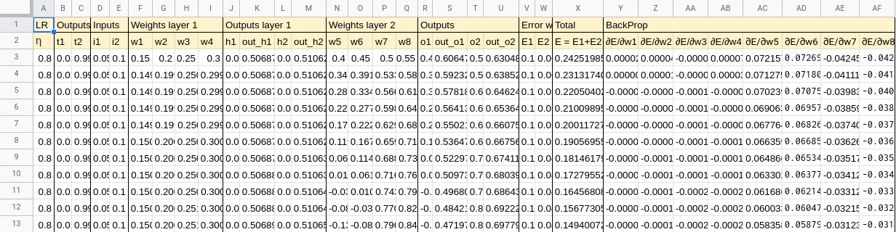
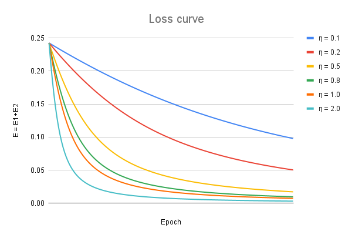

# Session 4.0 Backpropagation 

## Part I 
In the excel sheet we create the simple network with two inputs and two outputs with a single hidden layer. After writing all the equations for backpropagation we create in principle a neural-net with simple excelsheet. The sheet has three tabs; Equations, Backpropagation table, Loss curves. 

This is the simple network we want to train using only the excel sheet. We use σ sigmoid activation function [σ(x) = 1/(1+e^(-x))] and L2 loss. The learning rate is represented as η. 

The inputs are : i1, i2 

h1 = w1 x i1 + w2 x i2
h2 = w3 x i1 + w4 x i2

out_h1 = σ(h1)
out_h2 = σ(h2)

o1 = w5 x out_h1 + w6 x out_h2
o2 =  w7 x out_h1 + w8 x out_h2

The outputs are : out_o1, out_o2
out_o1, out_o2 = σ(o1), σ(o2)

The targets are : t1, t2
E1 = 1/2 x (t1 - out_o1)^2
E2= 1/2 x (t2 - out_o2)^2

The total loss : E = E1+E2

To perform backpropagation we need to know the partial derivatives of the total error with respect to the weights of the network represented by w. The full derivation is shown in the excel sheet. 

∂E/∂w5 = (out_o1 - t1) x (out_o1(1-out_o1)) x (out_h1)

∂E/∂w6 = (out_o1 - t1) x (out_o1(1-out_o1)) x (out_h2)

∂E/∂w7 = (out_o2 - t2) x (out_o2(1-out_o2)) x (out_h1)

∂E/∂w8 = (out_o2 - t2) x (out_o2(1-out_o2)) x (out_h2)

∂E/∂w1 = ((out_o1-t1) x (out_o1(1-out_o1)) x (w5)) x (h1(1-h1)) x (i1) + ((out_o2-t2) x (out_o2(1-out_o2)) x (w7)) x (h1(1-h1)) x (i1)

∂E/∂w2 = ((out_o1-t1) x (out_o1(1-out_o1)) x (w5)) x (h1(1-h1)) x (i2) + ((out_o2-t2) x (out_o2(1-out_o2)) x (w7)) x (h1(1-h1)) x  (i2)

∂E/∂w3 = ((out_o1-t1) x (out_o1(1-out_o1)) x (w6)) x (h2(1-h2)) x (i1) + ((out_o2-t2) x (out_o2(1-out_o2)) x (w8)) x (h2(1-h2)) x  (i1)

∂E/∂w4 = ((out_o1-t1) x (out_o1(1-out_o1)) x (w6)) x (h2(1-h2)) x (i2) + ((out_o2-t2) x (out_o2(1-out_o2)) x (w8)) x (h2(1-h2)) x (i2)

After each step, the weights are updated as: 
w = w - η x ∂E/∂w

We can see that for a larger learning rate η we converge to a lower total loss quicker.

## Part II

We are required to create a network such that: 

1. 99.4% validation accuracy
2. Less than 20k Parameters
3. Less than 20 Epochs
4. Have used BN, Dropout, a Fully connected layer, have used GAP.

The file Session 4 - Architecture Basics.ipynb has the network class used to train a network with the above requirements. The approach taken here is:
1. To have 4 convolutional blocks 
2. Use 1 x 1 convolutions to decrease the number of channels, so as to not exceed 20k Parameters 
3. Not using MaxPool or Dropout in the last convolutional block. 
4. Not use any activation function in the last layer 
5. At first, to keep the number of parameters I kept channel size = 16 for all convolutional layers, but this made the accuracy fluctuate around 99.3%. To reach the goal of 99.4% I added 32 channels in the first block and also the GAP layer should not be on too small a channel size, I use it when it's 5 x 5 (after lot of trial and error). 

### Results: 
1. Total number of parameters: 19,816
2. Final test accuracy: 99.43%

With this approach we are able to fulfill the requirements of the assignment, the logs of the training are as follows: 
loss=0.13771481812000275 batch_id=468: 100%|██████████| 469/469 [00:22<00:00, 20.76it/s]

Test set: Average loss: 0.0565, Accuracy: 9832/10000 (98.32%)

loss=0.05002450570464134 batch_id=468: 100%|██████████| 469/469 [00:22<00:00, 20.83it/s]

Test set: Average loss: 0.0346, Accuracy: 9893/10000 (98.93%)

loss=0.058828312903642654 batch_id=468: 100%|██████████| 469/469 [00:22<00:00, 21.27it/s]

Test set: Average loss: 0.0292, Accuracy: 9907/10000 (99.07%)

loss=0.01717216521501541 batch_id=468: 100%|██████████| 469/469 [00:22<00:00, 20.99it/s]

Test set: Average loss: 0.0260, Accuracy: 9925/10000 (99.25%)

loss=0.0741397961974144 batch_id=468: 100%|██████████| 469/469 [00:22<00:00, 20.96it/s]

Test set: Average loss: 0.0272, Accuracy: 9924/10000 (99.24%)

loss=0.061781495809555054 batch_id=468: 100%|██████████| 469/469 [00:22<00:00, 20.61it/s]

Test set: Average loss: 0.0232, Accuracy: 9935/10000 (99.35%)

loss=0.06326784938573837 batch_id=468: 100%|██████████| 469/469 [00:22<00:00, 20.56it/s]

Test set: Average loss: 0.0224, Accuracy: 9928/10000 (99.28%)

loss=0.010735958814620972 batch_id=468: 100%|██████████| 469/469 [00:22<00:00, 20.56it/s]

Test set: Average loss: 0.0205, Accuracy: 9929/10000 (99.29%)

loss=0.102293960750103 batch_id=468: 100%|██████████| 469/469 [00:22<00:00, 20.69it/s]

Test set: Average loss: 0.0205, Accuracy: 9936/10000 (99.36%)

loss=0.03525865450501442 batch_id=468: 100%|██████████| 469/469 [00:22<00:00, 20.58it/s]

Test set: Average loss: 0.0218, Accuracy: 9933/10000 (99.33%)

loss=0.02690388821065426 batch_id=468: 100%|██████████| 469/469 [00:22<00:00, 20.43it/s]

Test set: Average loss: 0.0198, Accuracy: 9938/10000 (99.38%)

loss=0.023958561941981316 batch_id=468: 100%|██████████| 469/469 [00:22<00:00, 20.61it/s]

Test set: Average loss: 0.0199, Accuracy: 9934/10000 (99.34%)

loss=0.009174360893666744 batch_id=468: 100%|██████████| 469/469 [00:22<00:00, 20.53it/s]

Test set: Average loss: 0.0213, Accuracy: 9932/10000 (99.32%)

loss=0.04397236928343773 batch_id=468: 100%|██████████| 469/469 [00:22<00:00, 20.71it/s]

Test set: Average loss: 0.0184, Accuracy: 9943/10000 (99.43%)

