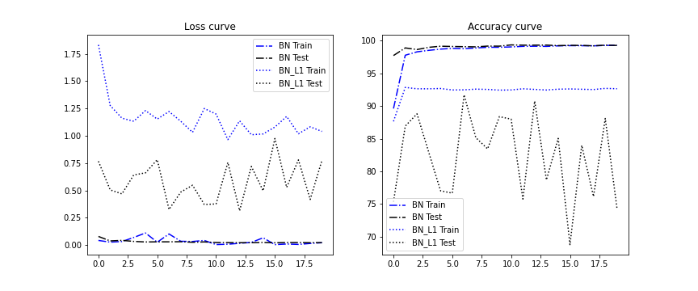
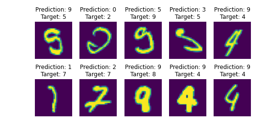
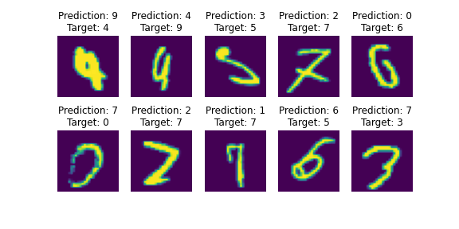
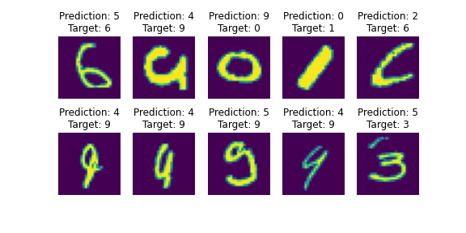

# Session 6.0 Batch Normalization and Regularization

Test a network with the following normalization/regularization types.
1. Network with Batch Normalization and L1 loss
2. Network with Layer Normalization
3. Network with Group Normalization

Code: 
Instead of having three different classes for networks with the above different types of normalization techniques, I create a single model.py file which contains a class that can be initialized with the type ('BN' for Batch Normalization, 'LN' for Layer Normalization and 'GN' for Group Normalization). This class is inherited in the main ipython notebook. 

Normalization techniques: 
1. Batch Normalization: All the images in the batch are used to shift and scale the images, for each channel there is a different mean and std.  
2. Layer Normalization: For each layer there is one mean and std for every image.
3. Group Normalization: For each group (which is a collection of a subset of channels) there is one mean and std. 

Metrics: 
It was noted that with L1 regression (lambda = 0.01) the test accuracy was very poor so we compared the results for Batch normalization with and without L1 Regularization. 

It can be seen that almost all perform equally well in this simple MNIST dataset. 

Misclassified images: 

