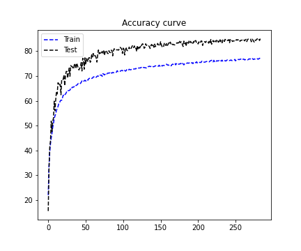
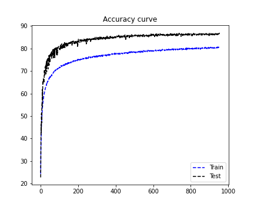

# Session 7.0 Advanced concepts

Goals: 
1. Fix the network to use GPU, have architecture C1C2C3C40 (No MaxPooling, but 3x3 layers with stride of 2 instead), have RF more than 52. 
2. Two of the layers must use Depthwise Separable Convolution
3. One of the layers must use Dilated Convolution
4. Use GAP 
5. Use albumentation library and apply horizontal flip, shiftScaleRotate, coarseDropout, grayscale.
6. Achieve 87% accuracy with the total no. of params less than 100k.

Results: 
1. Total no. of parameters: 86,336
2. Accuracy achieved: 87.12%

Plots: 
At first we tried to achieve the 85% accuracy goal, this was seen in around ~300 epochs

Then we trained our network further to reach the 87% accuracy goal, this was seen in the next ~700 epochs. This is very inefficient and I want to do more experiments on LR schedulers.  

