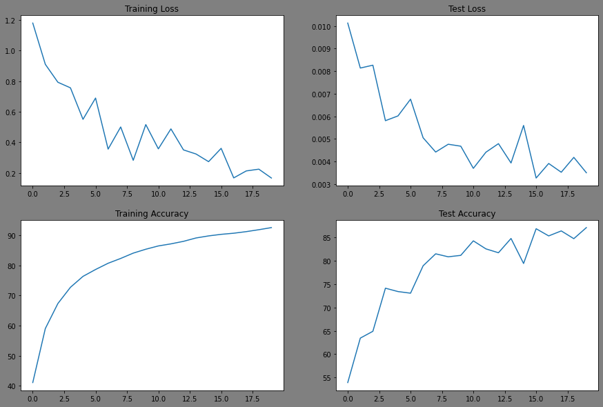
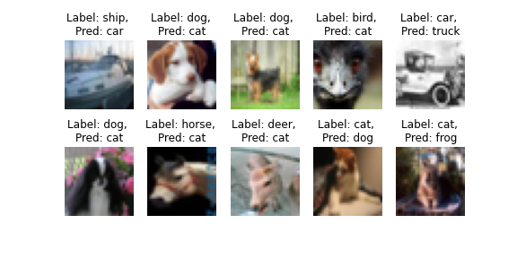
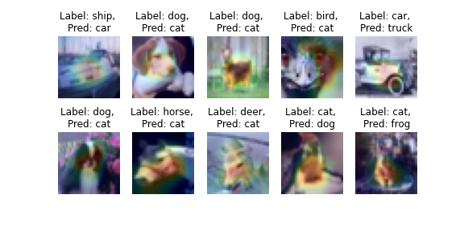

# Session 8.0 Advanced Training Concepts

## Goals:
1. To pull PyTorch_Vision repository [PyTorch_Vision](https://github.com/lavanyanemani96/PyTorch_Vision) that consists of models and other utilities. 
2. Train ResNet18 for 20 epochs
3. Show loss and accuracy curves
4. Show a gallery of 10 misclassified images
5. Show GradCam output on 10 misclassified images
6. Early submission transforms: RandomCrop(32, padding=4), CutOut(16x16)

## Summary of ResNet18:
```
----------------------------------------------------------------
        Layer (type)               Output Shape         Param 
================================================================
            Conv2d-1           [-1, 64, 36, 36]           1,728
       BatchNorm2d-2           [-1, 64, 36, 36]             128
            Conv2d-3           [-1, 64, 36, 36]          36,864
       BatchNorm2d-4           [-1, 64, 36, 36]             128
            Conv2d-5           [-1, 64, 36, 36]          36,864
       BatchNorm2d-6           [-1, 64, 36, 36]             128
        BasicBlock-7           [-1, 64, 36, 36]               0
            Conv2d-8           [-1, 64, 36, 36]          36,864
       BatchNorm2d-9           [-1, 64, 36, 36]             128
           Conv2d-10           [-1, 64, 36, 36]          36,864
      BatchNorm2d-11           [-1, 64, 36, 36]             128
       BasicBlock-12           [-1, 64, 36, 36]               0
           Conv2d-13          [-1, 128, 19, 19]          73,728
      BatchNorm2d-14          [-1, 128, 19, 19]             256
           Conv2d-15          [-1, 128, 19, 19]         147,456
      BatchNorm2d-16          [-1, 128, 19, 19]             256
           Conv2d-17          [-1, 128, 19, 19]           8,192
      BatchNorm2d-18          [-1, 128, 19, 19]             256
       BasicBlock-19          [-1, 128, 19, 19]               0
           Conv2d-20          [-1, 128, 19, 19]         147,456
      BatchNorm2d-21          [-1, 128, 19, 19]             256
           Conv2d-22          [-1, 128, 19, 19]         147,456
      BatchNorm2d-23          [-1, 128, 19, 19]             256
       BasicBlock-24          [-1, 128, 19, 19]               0
           Conv2d-25          [-1, 256, 11, 11]         294,912
      BatchNorm2d-26          [-1, 256, 11, 11]             512
           Conv2d-27          [-1, 256, 11, 11]         589,824
      BatchNorm2d-28          [-1, 256, 11, 11]             512
           Conv2d-29          [-1, 256, 11, 11]          32,768
      BatchNorm2d-30          [-1, 256, 11, 11]             512
       BasicBlock-31          [-1, 256, 11, 11]               0
           Conv2d-32          [-1, 256, 11, 11]         589,824
      BatchNorm2d-33          [-1, 256, 11, 11]             512
           Conv2d-34          [-1, 256, 11, 11]         589,824
      BatchNorm2d-35          [-1, 256, 11, 11]             512
       BasicBlock-36          [-1, 256, 11, 11]               0
           Conv2d-37            [-1, 512, 7, 7]       1,179,648
      BatchNorm2d-38            [-1, 512, 7, 7]           1,024
           Conv2d-39            [-1, 512, 7, 7]       2,359,296
      BatchNorm2d-40            [-1, 512, 7, 7]           1,024
           Conv2d-41            [-1, 512, 7, 7]         131,072
      BatchNorm2d-42            [-1, 512, 7, 7]           1,024
       BasicBlock-43            [-1, 512, 7, 7]               0
           Conv2d-44            [-1, 512, 7, 7]       2,359,296
      BatchNorm2d-45            [-1, 512, 7, 7]           1,024
           Conv2d-46            [-1, 512, 7, 7]       2,359,296
      BatchNorm2d-47            [-1, 512, 7, 7]           1,024
       BasicBlock-48            [-1, 512, 7, 7]               0
           Linear-49                   [-1, 10]           5,130
================================================================
Total params: 11,173,962
Trainable params: 11,173,962
Non-trainable params: 0
----------------------------------------------------------------
Input size (MB): 0.01
Forward/backward pass size (MB): 16.96
Params size (MB): 42.63
Estimated Total Size (MB): 59.59
----------------------------------------------------------------
```

## Training: 
EPOCH: 0
  0%|          | 0/391 [00:00<?, ?it/s]/usr/local/lib/python3.7/dist-packages/torch/utils/data/dataloader.py:481: UserWarning: This DataLoader will create 4 worker processes in total. Our suggested max number of worker in current system is 2, which is smaller than what this DataLoader is going to create. Please be aware that excessive worker creation might get DataLoader running slow or even freeze, lower the worker number to avoid potential slowness/freeze if necessary.
  cpuset_checked))
Loss=1.4185359477996826 Batch_id=390 Accuracy=41.56: 100%|██████████| 391/391 [02:57<00:00,  2.20it/s]

Test set: Average loss: 0.0099, Accuracy: 5394/10000 (53.94%)

EPOCH: 1
Loss=1.1142866611480713 Batch_id=390 Accuracy=59.23: 100%|██████████| 391/391 [02:58<00:00,  2.19it/s]

Test set: Average loss: 0.0073, Accuracy: 6650/10000 (66.50%)

EPOCH: 2
Loss=0.7563246488571167 Batch_id=390 Accuracy=67.61: 100%|██████████| 391/391 [02:57<00:00,  2.20it/s]

Test set: Average loss: 0.0076, Accuracy: 6673/10000 (66.73%)

EPOCH: 3
Loss=0.9440091848373413 Batch_id=390 Accuracy=72.28: 100%|██████████| 391/391 [02:58<00:00,  2.20it/s]

Test set: Average loss: 0.0064, Accuracy: 7193/10000 (71.93%)

EPOCH: 4
Loss=0.6058961749076843 Batch_id=390 Accuracy=75.69: 100%|██████████| 391/391 [02:57<00:00,  2.20it/s]

Test set: Average loss: 0.0057, Accuracy: 7508/10000 (75.08%)

EPOCH: 5
Loss=0.4122799336910248 Batch_id=390 Accuracy=78.60: 100%|██████████| 391/391 [02:58<00:00,  2.20it/s]

Test set: Average loss: 0.0052, Accuracy: 7756/10000 (77.56%)

EPOCH: 6
Loss=0.41320332884788513 Batch_id=390 Accuracy=80.75: 100%|██████████| 391/391 [02:57<00:00,  2.20it/s]

Test set: Average loss: 0.0049, Accuracy: 7959/10000 (79.59%)

EPOCH: 7
Loss=0.4909684658050537 Batch_id=390 Accuracy=82.33: 100%|██████████| 391/391 [02:58<00:00,  2.19it/s]

Test set: Average loss: 0.0055, Accuracy: 7738/10000 (77.38%)

EPOCH: 8
Loss=0.5576585531234741 Batch_id=390 Accuracy=83.66: 100%|██████████| 391/391 [02:57<00:00,  2.20it/s]

Test set: Average loss: 0.0044, Accuracy: 8172/10000 (81.72%)

EPOCH: 9
Loss=0.34522733092308044 Batch_id=390 Accuracy=84.85: 100%|██████████| 391/391 [02:58<00:00,  2.19it/s]

Test set: Average loss: 0.0041, Accuracy: 8317/10000 (83.17%)

EPOCH: 10
Loss=0.3564205765724182 Batch_id=390 Accuracy=86.19: 100%|██████████| 391/391 [02:58<00:00,  2.19it/s]

Test set: Average loss: 0.0039, Accuracy: 8375/10000 (83.75%)

EPOCH: 11
Loss=0.2494029551744461 Batch_id=390 Accuracy=87.30: 100%|██████████| 391/391 [02:57<00:00,  2.20it/s]

Test set: Average loss: 0.0042, Accuracy: 8334/10000 (83.34%)

EPOCH: 12
Loss=0.4760161340236664 Batch_id=390 Accuracy=87.62: 100%|██████████| 391/391 [02:57<00:00,  2.20it/s]

Test set: Average loss: 0.0049, Accuracy: 8034/10000 (80.34%)

EPOCH: 13
Loss=0.3555682897567749 Batch_id=390 Accuracy=88.88: 100%|██████████| 391/391 [02:58<00:00,  2.19it/s]

Test set: Average loss: 0.0039, Accuracy: 8429/10000 (84.29%)

EPOCH: 14
Loss=0.46309715509414673 Batch_id=390 Accuracy=89.60: 100%|██████████| 391/391 [02:58<00:00,  2.19it/s]

Test set: Average loss: 0.0062, Accuracy: 7951/10000 (79.51%)

EPOCH: 15
Loss=0.4312002658843994 Batch_id=390 Accuracy=90.24: 100%|██████████| 391/391 [02:58<00:00,  2.19it/s]

Test set: Average loss: 0.0046, Accuracy: 8224/10000 (82.24%)

EPOCH: 16
Loss=0.2018948346376419 Batch_id=390 Accuracy=90.57: 100%|██████████| 391/391 [02:57<00:00,  2.20it/s]

Test set: Average loss: 0.0040, Accuracy: 8526/10000 (85.26%)

EPOCH: 17
Loss=0.28466489911079407 Batch_id=390 Accuracy=91.18: 100%|██████████| 391/391 [02:58<00:00,  2.20it/s]

Test set: Average loss: 0.0042, Accuracy: 8484/10000 (84.84%)

EPOCH: 18
Loss=0.23075179755687714 Batch_id=390 Accuracy=92.02: 100%|██████████| 391/391 [02:57<00:00,  2.20it/s]

Test set: Average loss: 0.0040, Accuracy: 8502/10000 (85.02%)

EPOCH: 19
Loss=0.1140967607498169 Batch_id=390 Accuracy=92.45: 100%|██████████| 391/391 [02:57<00:00,  2.20it/s]

Test set: Average loss: 0.0040, Accuracy: 8565/10000 (85.65%)


## Plots: 

1. Loss and Accuracy plots: 


2. Misclassified images:


3. GradCam superimposed on misclassified images


