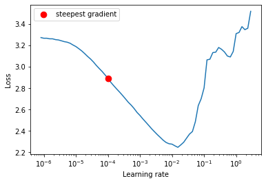
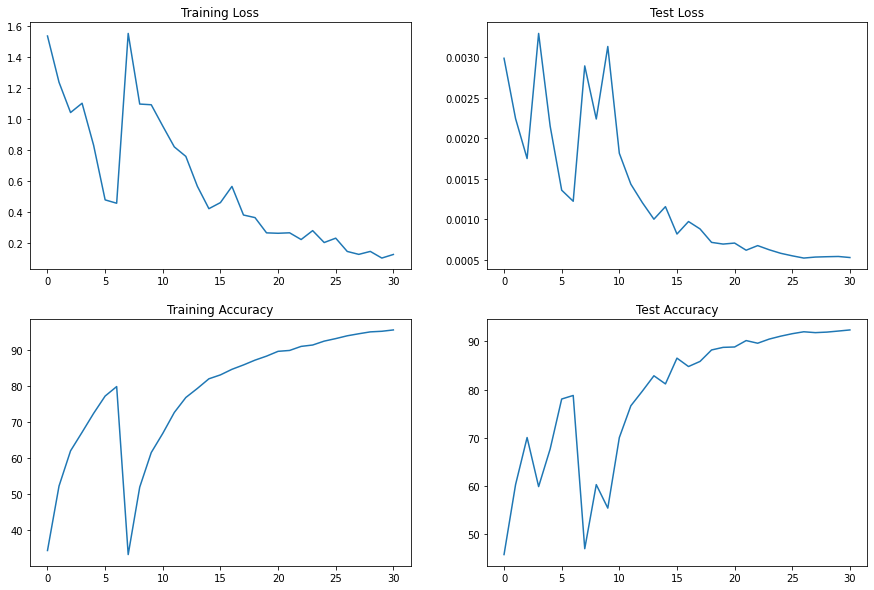
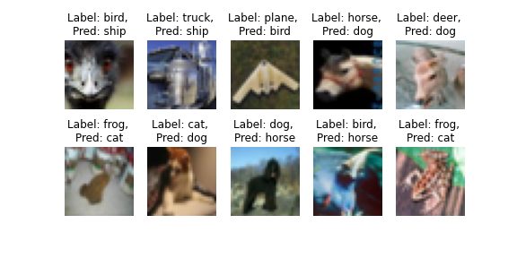
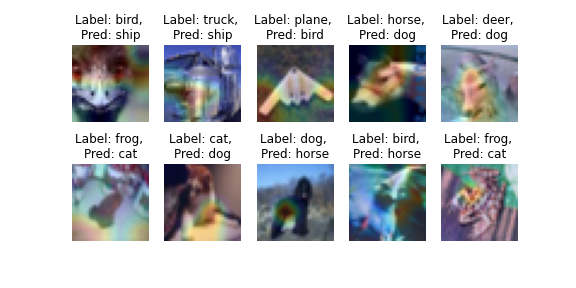

# Session 9.0 ResNets and Higher Receptive Fields

## Goals:
1. To pull PyTorch_Vision repository [PyTorch_Vision](https://github.com/lavanyanemani96/PyTorch_Vision) that consists of models and other utilities with a custom resnet model.
2. Find the best LR values for the OneCycleLR algorithm
3. Target: 90% accuracy 
4. Show a gallery of 10 misclassified images
5. Show GradCam output on 10 misclassified images


## Summary of Custom ResNet model:
```
----------------------------------------------------------------
        Layer (type)               Output Shape         Param #
================================================================
            Conv2d-1           [-1, 64, 32, 32]           1,728
       BatchNorm2d-2           [-1, 64, 32, 32]             128
              ReLU-3           [-1, 64, 32, 32]               0
            Conv2d-4          [-1, 128, 32, 32]          73,728
         MaxPool2d-5          [-1, 128, 16, 16]               0
       BatchNorm2d-6          [-1, 128, 16, 16]             256
              ReLU-7          [-1, 128, 16, 16]               0
            Conv2d-8          [-1, 128, 16, 16]         147,456
       BatchNorm2d-9          [-1, 128, 16, 16]             256
             ReLU-10          [-1, 128, 16, 16]               0
           Conv2d-11          [-1, 128, 16, 16]         147,456
      BatchNorm2d-12          [-1, 128, 16, 16]             256
             ReLU-13          [-1, 128, 16, 16]               0
       BasicBlock-14          [-1, 128, 16, 16]               0
           Conv2d-15          [-1, 256, 16, 16]         294,912
        MaxPool2d-16            [-1, 256, 8, 8]               0
      BatchNorm2d-17            [-1, 256, 8, 8]             512
             ReLU-18            [-1, 256, 8, 8]               0
           Conv2d-19            [-1, 512, 8, 8]       1,179,648
        MaxPool2d-20            [-1, 512, 4, 4]               0
      BatchNorm2d-21            [-1, 512, 4, 4]           1,024
             ReLU-22            [-1, 512, 4, 4]               0
           Conv2d-23            [-1, 512, 4, 4]       2,359,296
      BatchNorm2d-24            [-1, 512, 4, 4]           1,024
             ReLU-25            [-1, 512, 4, 4]               0
           Conv2d-26            [-1, 512, 4, 4]       2,359,296
      BatchNorm2d-27            [-1, 512, 4, 4]           1,024
             ReLU-28            [-1, 512, 4, 4]               0
       BasicBlock-29            [-1, 512, 4, 4]               0
        MaxPool2d-30            [-1, 512, 1, 1]               0
           Linear-31                   [-1, 10]           5,130
================================================================
Total params: 6,573,130
Trainable params: 6,573,130
Non-trainable params: 0
----------------------------------------------------------------
Input size (MB): 0.01
Forward/backward pass size (MB): 6.75
Params size (MB): 25.07
Estimated Total Size (MB): 31.84
----------------------------------------------------------------

```
## OneCycleLR 

Loss v/s LR (The start value is where the loss descreases with the largest gradient and the max value is where the loss is the least). start_value = 1.00E-04, max_value = 1.5e-2




## Training: 

EPOCH: 0
  0%|          | 0/98 [00:00<?, ?it/s]/usr/local/lib/python3.7/dist-packages/torch/utils/data/dataloader.py:481: UserWarning: This DataLoader will create 4 worker processes in total. Our suggested max number of worker in current system is 2, which is smaller than what this DataLoader is going to create. Please be aware that excessive worker creation might get DataLoader running slow or even freeze, lower the worker number to avoid potential slowness/freeze if necessary.
  cpuset_checked))
Loss=1.5522428750991821 Batch_id=97 Accuracy=33.31: 100%|██████████| 98/98 [00:58<00:00,  1.68it/s]

Test set: Average loss: 0.0029, Accuracy: 4695/10000 (46.95%)

EPOCH: 1
Loss=1.0963900089263916 Batch_id=97 Accuracy=52.02: 100%|██████████| 98/98 [00:57<00:00,  1.70it/s]

Test set: Average loss: 0.0022, Accuracy: 6026/10000 (60.26%)

EPOCH: 2
Loss=1.091962456703186 Batch_id=97 Accuracy=61.62: 100%|██████████| 98/98 [00:58<00:00,  1.68it/s]

Test set: Average loss: 0.0031, Accuracy: 5538/10000 (55.38%)

EPOCH: 3
Loss=0.954168438911438 Batch_id=97 Accuracy=66.94: 100%|██████████| 98/98 [00:58<00:00,  1.69it/s]

Test set: Average loss: 0.0018, Accuracy: 7003/10000 (70.03%)

EPOCH: 4
Loss=0.8199284672737122 Batch_id=97 Accuracy=72.74: 100%|██████████| 98/98 [00:58<00:00,  1.69it/s]

Test set: Average loss: 0.0014, Accuracy: 7664/10000 (76.64%)

EPOCH: 5
Loss=0.758563756942749 Batch_id=97 Accuracy=76.90: 100%|██████████| 98/98 [00:57<00:00,  1.69it/s]

Test set: Average loss: 0.0012, Accuracy: 7969/10000 (79.69%)

EPOCH: 6
Loss=0.5657686591148376 Batch_id=97 Accuracy=79.41: 100%|██████████| 98/98 [00:57<00:00,  1.69it/s]

Test set: Average loss: 0.0010, Accuracy: 8287/10000 (82.87%)

EPOCH: 7
Loss=0.4211899936199188 Batch_id=97 Accuracy=82.08: 100%|██████████| 98/98 [00:58<00:00,  1.69it/s]

Test set: Average loss: 0.0012, Accuracy: 8118/10000 (81.18%)

EPOCH: 8
Loss=0.460421621799469 Batch_id=97 Accuracy=83.17: 100%|██████████| 98/98 [00:58<00:00,  1.68it/s]

Test set: Average loss: 0.0008, Accuracy: 8653/10000 (86.53%)

EPOCH: 9
Loss=0.5649333000183105 Batch_id=97 Accuracy=84.72: 100%|██████████| 98/98 [00:57<00:00,  1.69it/s]

Test set: Average loss: 0.0010, Accuracy: 8479/10000 (84.79%)

EPOCH: 10
Loss=0.38035979866981506 Batch_id=97 Accuracy=85.93: 100%|██████████| 98/98 [00:58<00:00,  1.69it/s]

Test set: Average loss: 0.0009, Accuracy: 8585/10000 (85.85%)

EPOCH: 11
Loss=0.36352598667144775 Batch_id=97 Accuracy=87.26: 100%|██████████| 98/98 [00:57<00:00,  1.69it/s]

Test set: Average loss: 0.0007, Accuracy: 8823/10000 (88.23%)

EPOCH: 12
Loss=0.26512643694877625 Batch_id=97 Accuracy=88.37: 100%|██████████| 98/98 [00:57<00:00,  1.69it/s]

Test set: Average loss: 0.0007, Accuracy: 8877/10000 (88.77%)

EPOCH: 13
Loss=0.2624785006046295 Batch_id=97 Accuracy=89.71: 100%|██████████| 98/98 [00:57<00:00,  1.70it/s]

Test set: Average loss: 0.0007, Accuracy: 8885/10000 (88.85%)

EPOCH: 14
Loss=0.2655078172683716 Batch_id=97 Accuracy=89.95: 100%|██████████| 98/98 [00:57<00:00,  1.69it/s]

Test set: Average loss: 0.0006, Accuracy: 9018/10000 (90.18%)

EPOCH: 15
Loss=0.22203436493873596 Batch_id=97 Accuracy=91.08: 100%|██████████| 98/98 [00:57<00:00,  1.69it/s]

Test set: Average loss: 0.0007, Accuracy: 8963/10000 (89.63%)

EPOCH: 16
Loss=0.2795713245868683 Batch_id=97 Accuracy=91.46: 100%|██████████| 98/98 [00:58<00:00,  1.69it/s]

Test set: Average loss: 0.0006, Accuracy: 9049/10000 (90.49%)

EPOCH: 17
Loss=0.20273610949516296 Batch_id=97 Accuracy=92.54: 100%|██████████| 98/98 [00:58<00:00,  1.69it/s]

Test set: Average loss: 0.0006, Accuracy: 9110/10000 (91.10%)

EPOCH: 18
Loss=0.23089465498924255 Batch_id=97 Accuracy=93.24: 100%|██████████| 98/98 [00:57<00:00,  1.69it/s]

Test set: Average loss: 0.0006, Accuracy: 9161/10000 (91.61%)

EPOCH: 19
Loss=0.14521440863609314 Batch_id=97 Accuracy=94.02: 100%|██████████| 98/98 [00:58<00:00,  1.69it/s]

Test set: Average loss: 0.0005, Accuracy: 9201/10000 (92.01%)

EPOCH: 20
Loss=0.12631525099277496 Batch_id=97 Accuracy=94.58: 100%|██████████| 98/98 [00:57<00:00,  1.69it/s]

Test set: Average loss: 0.0005, Accuracy: 9183/10000 (91.83%)

EPOCH: 21
Loss=0.14535072445869446 Batch_id=97 Accuracy=95.11: 100%|██████████| 98/98 [00:58<00:00,  1.69it/s]

Test set: Average loss: 0.0005, Accuracy: 9194/10000 (91.94%)

EPOCH: 22
Loss=0.10249833762645721 Batch_id=97 Accuracy=95.27: 100%|██████████| 98/98 [00:58<00:00,  1.69it/s]

Test set: Average loss: 0.0005, Accuracy: 9216/10000 (92.16%)

EPOCH: 23
Loss=0.1256769895553589 Batch_id=97 Accuracy=95.64: 100%|██████████| 98/98 [00:58<00:00,  1.69it/s]

Test set: Average loss: 0.0005, Accuracy: 9239/10000 (92.39%)


## Plots: 

1. Loss and Accuracy plots



2. Misclassified images



3. GradCam superimposed on misclassified images



