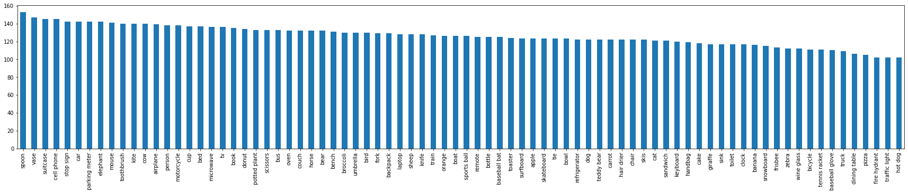
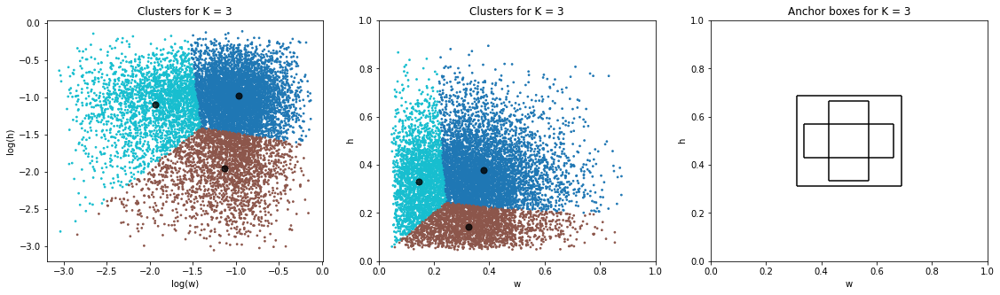
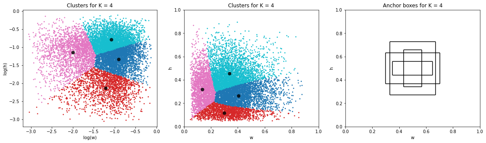
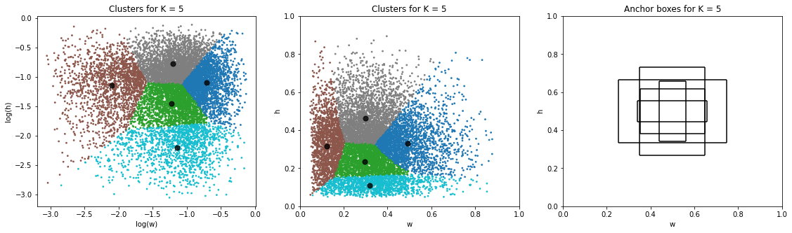
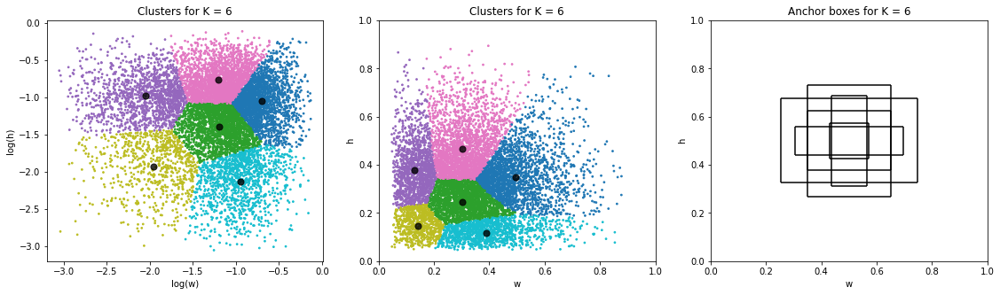

# Session 10.0 Object Localization

## Assignment B:
1. Understand COCO object detection dataset's schema: coco_data_labels = ['id', 'height_image', 'width_image', 'upper_left_coord x', 'upper_left coord y', 'width bbox', 'height bbox']

2. Class distribution: 

3. Anchor boxes for k = 3, 4, 5, 6

4. Calculations: 
The xmin, xmax = 0.5 - w/2, 0.5 + w/2 and ymin, ymax = 0.5 - h/2, 0.5 + h/2, where w and h are the centroids found using k means clustering shown above (since they were found in the log graph, first we take exponents to get the values of w and h). 

