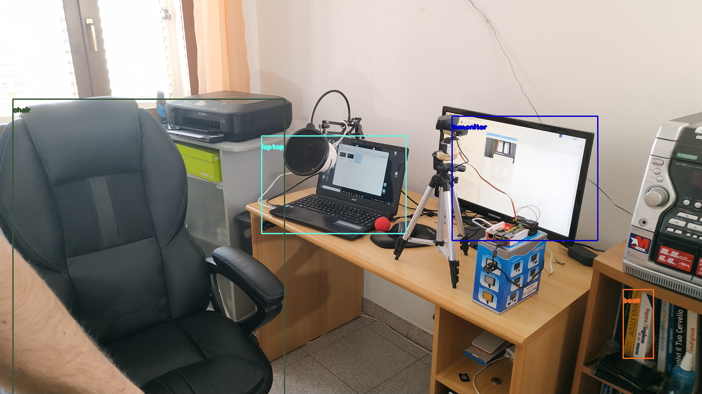
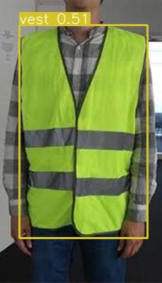
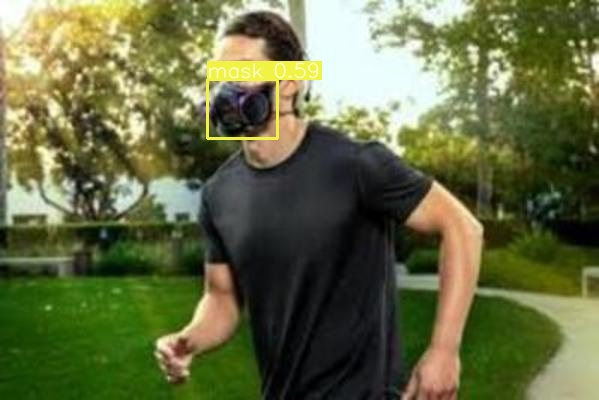
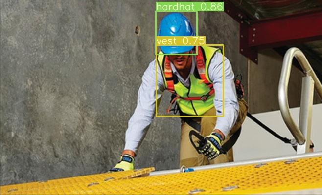
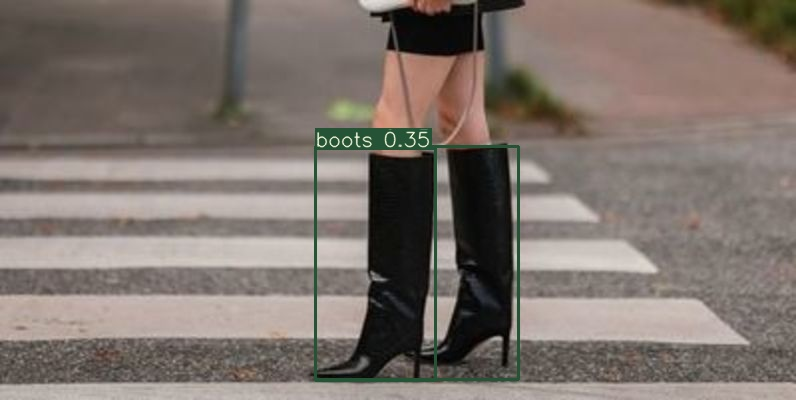
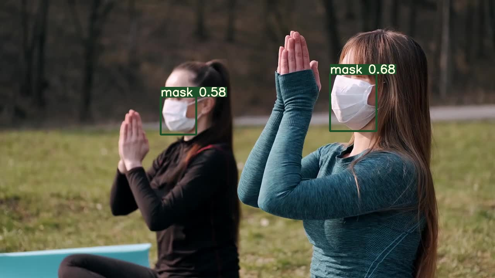
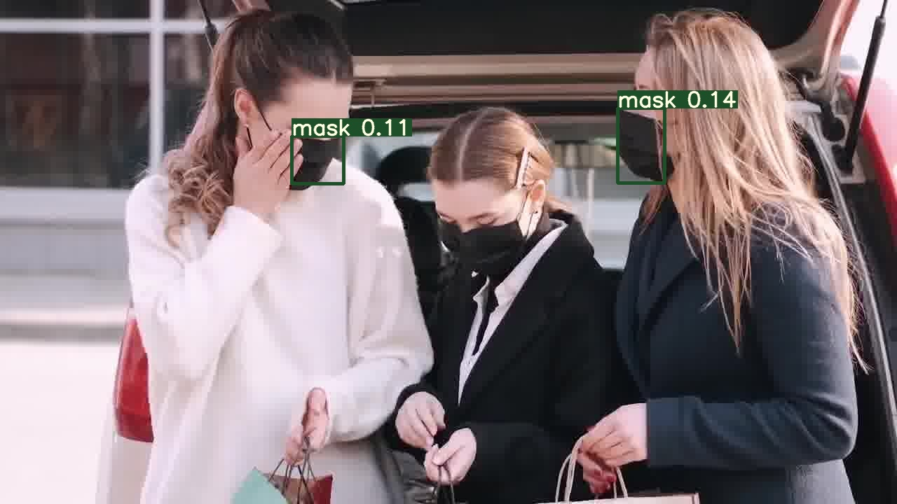
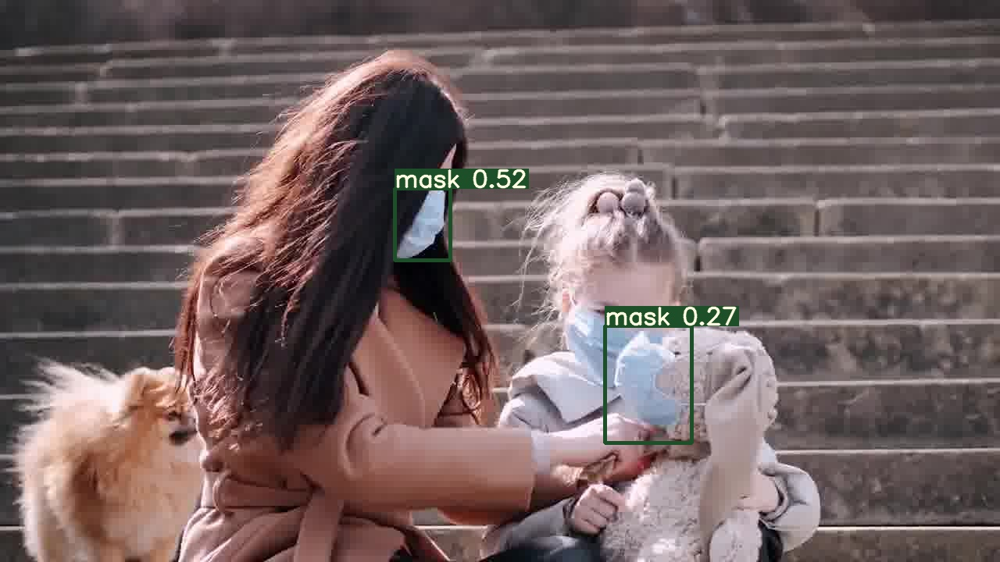
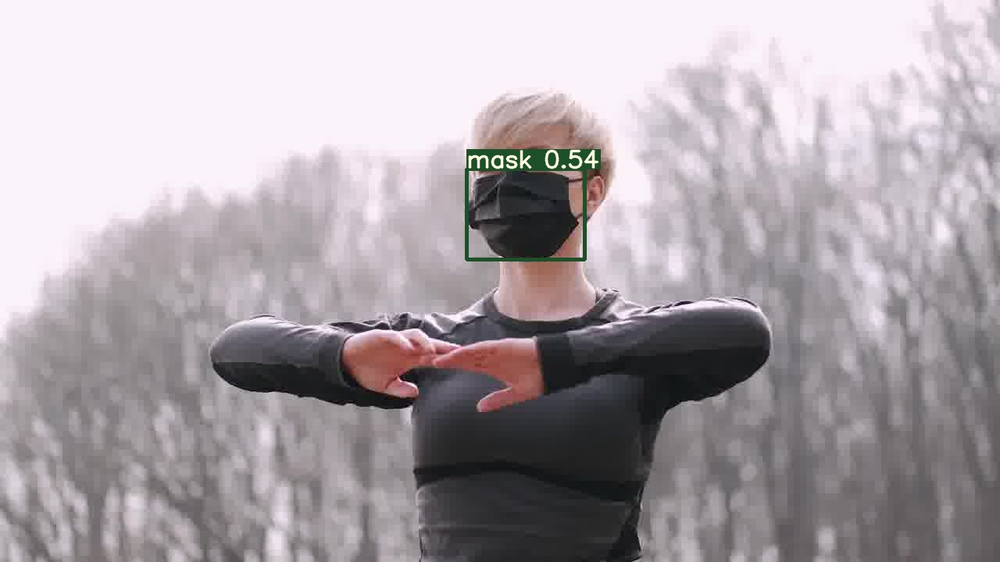

# Session 11.0 YOLO

## OpenCV Yolo

Links 
--------------------------------------
1. Colab Link : https://colab.research.google.com/drive/12766B8c4ekSZ-OgpPXM7S7-AdIRWkusb?usp=sharing
2. Data : ./YOLOv3OpenCV/data/
3. Results : ./YOLOv3OpenCV/results/

## Custom dataset YOLOv3 

Links 
--------------------------------------
1. Colab Link Training: https://colab.research.google.com/drive/1xJpM8JdZkUu3LBvzN6qFRD2oBf8BG8X1?usp=sharing
2. Colab Link for video manipulation with ffmpeg: https://colab.research.google.com/drive/1AmwcWcZehgCIMYxXVoMnHc9Cm1_MX3wF?usp=sharing
3. Data : ./YoloV3/data/annotated_images (For the 16 images from the test set) and ./YoloV3/data/video_images (For the images from a sample video made using ffmpeg)
4. Results : ./YoloV3/data/predictions/ (Contains the image predictions for the 16 annotated images as well as each image from the video and it's corresponding video)
5. Youtube link to video : https://youtu.be/zoDe54rnXhg

6. Predictions for the 4 classes (Vest, Mask, Hardhat, boots):

7. Predictions for the images from the video: 

Contributors
-------------------------
Lavanya Nemani lavanyanemani96@gmail.com

Training Logs 
---------------------------------------
Model Summary: 225 layers, 6.25895e+07 parameters, 6.25895e+07 gradients
Caching labels (2943 found, 131 missing, 38 empty, 0 duplicate, for 3112 images): 100% 3112/3112 [18:32<00:00,  2.80it/s]
Caching images (1.7GB): 100% 3112/3112 [20:02<00:00,  2.59it/s]
Reading image shapes: 100% 338/338 [02:02<00:00,  2.77it/s]
Caching labels (317 found, 14 missing, 7 empty, 0 duplicate, for 338 images): 100% 338/338 [02:01<00:00,  2.79it/s]
Caching images (0.1GB): 100% 338/338 [00:04<00:00, 69.79it/s]
Image sizes 512 - 512 train, 512 test
Using 2 dataloader workers
Starting training for 10 epochs...

     Epoch   gpu_mem      GIoU       obj       cls     total   targets  img_size
  0% 0/312 [00:00<?, ?it/s]/usr/local/lib/python3.7/dist-packages/torch/cuda/memory.py:386: FutureWarning: torch.cuda.memory_cached has been renamed to torch.cuda.memory_reserved
  FutureWarning)
       0/9     7.69G      8.02       155      4.38       168        85       512:   0% 1/312 [00:04<22:36,  4.36s/it]/usr/local/lib/python3.7/dist-packages/torch/cuda/memory.py:386: FutureWarning: torch.cuda.memory_cached has been renamed to torch.cuda.memory_reserved
  FutureWarning)
       0/9     7.72G      4.81      7.06      2.57      14.4        29       512: 100% 312/312 [06:10<00:00,  1.19s/it]
/usr/local/lib/python3.7/dist-packages/torch/functional.py:445: UserWarning: torch.meshgrid: in an upcoming release, it will be required to pass the indexing argument. (Triggered internally at  ../aten/src/ATen/native/TensorShape.cpp:2157.)
  return _VF.meshgrid(tensors, **kwargs)  # type: ignore[attr-defined]
               Class    Images   Targets         P         R   mAP@0.5        F1: 100% 34/34 [00:10<00:00,  3.13it/s]
                 all       338  1.57e+03     0.269     0.394     0.252     0.312

     Epoch   gpu_mem      GIoU       obj       cls     total   targets  img_size
  0% 0/312 [00:00<?, ?it/s]/usr/local/lib/python3.7/dist-packages/torch/cuda/memory.py:386: FutureWarning: torch.cuda.memory_cached has been renamed to torch.cuda.memory_reserved
  FutureWarning)
       1/9     7.72G      3.77      1.92      1.11       6.8        16       512: 100% 312/312 [06:16<00:00,  1.21s/it]
               Class    Images   Targets         P         R   mAP@0.5        F1: 100% 34/34 [00:09<00:00,  3.48it/s]
                 all       338  1.57e+03     0.432     0.594      0.46     0.495

     Epoch   gpu_mem      GIoU       obj       cls     total   targets  img_size
       2/9     7.72G      3.27      1.69      0.83      5.78        12       512: 100% 312/312 [06:17<00:00,  1.21s/it]
               Class    Images   Targets         P         R   mAP@0.5        F1: 100% 34/34 [00:09<00:00,  3.53it/s]
                 all       338  1.57e+03     0.494     0.611     0.502     0.545

     Epoch   gpu_mem      GIoU       obj       cls     total   targets  img_size
  0% 0/312 [00:00<?, ?it/s]
Model Bias Summary:    layer        regression        objectness    classification
                          89      -0.16+/-0.19      -7.67+/-0.89      -0.67+/-0.48 
                         101       0.04+/-0.21      -7.83+/-0.98      -0.67+/-0.21 
                         113       0.14+/-0.22      -9.32+/-0.66      -0.61+/-0.33 
       3/9     7.72G      2.95      1.61     0.777      5.34         8       512: 100% 312/312 [06:17<00:00,  1.21s/it]
               Class    Images   Targets         P         R   mAP@0.5        F1: 100% 34/34 [00:09<00:00,  3.51it/s]
                 all       338  1.57e+03     0.513     0.646     0.539      0.57

     Epoch   gpu_mem      GIoU       obj       cls     total   targets  img_size
       4/9     7.72G      2.69      1.48     0.678      4.85         9       512: 100% 312/312 [06:17<00:00,  1.21s/it]
               Class    Images   Targets         P         R   mAP@0.5        F1: 100% 34/34 [00:09<00:00,  3.51it/s]
                 all       338  1.57e+03     0.535     0.675     0.558     0.595

     Epoch   gpu_mem      GIoU       obj       cls     total   targets  img_size
       5/9     7.72G      2.47      1.37     0.547      4.39         6       512: 100% 312/312 [06:17<00:00,  1.21s/it]
               Class    Images   Targets         P         R   mAP@0.5        F1: 100% 34/34 [00:09<00:00,  3.54it/s]
                 all       338  1.57e+03     0.572      0.64     0.555     0.602

     Epoch   gpu_mem      GIoU       obj       cls     total   targets  img_size
       6/9     7.72G      2.35      1.33     0.518       4.2         7       512: 100% 312/312 [06:17<00:00,  1.21s/it]
               Class    Images   Targets         P         R   mAP@0.5        F1: 100% 34/34 [00:09<00:00,  3.53it/s]
                 all       338  1.57e+03     0.557     0.663     0.564     0.605

     Epoch   gpu_mem      GIoU       obj       cls     total   targets  img_size
       7/9     7.72G      2.25      1.28     0.437      3.97        14       512: 100% 312/312 [06:17<00:00,  1.21s/it]
               Class    Images   Targets         P         R   mAP@0.5        F1: 100% 34/34 [00:09<00:00,  3.54it/s]
                 all       338  1.57e+03     0.541     0.681     0.564     0.602

     Epoch   gpu_mem      GIoU       obj       cls     total   targets  img_size
       8/9     7.72G      2.17      1.24     0.376      3.79        15       512: 100% 312/312 [06:16<00:00,  1.21s/it]
               Class    Images   Targets         P         R   mAP@0.5        F1: 100% 34/34 [00:09<00:00,  3.55it/s]
                 all       338  1.57e+03     0.549     0.684     0.567     0.608

     Epoch   gpu_mem      GIoU       obj       cls     total   targets  img_size
       9/9     7.72G       2.1      1.23     0.343      3.68        19       512: 100% 312/312 [06:16<00:00,  1.21s/it]
               Class    Images   Targets         P         R   mAP@0.5        F1: 100% 34/34 [00:09<00:00,  3.57it/s]
                 all       338  1.57e+03     0.569     0.689     0.576     0.623
10 epochs completed in 1.075 hours.