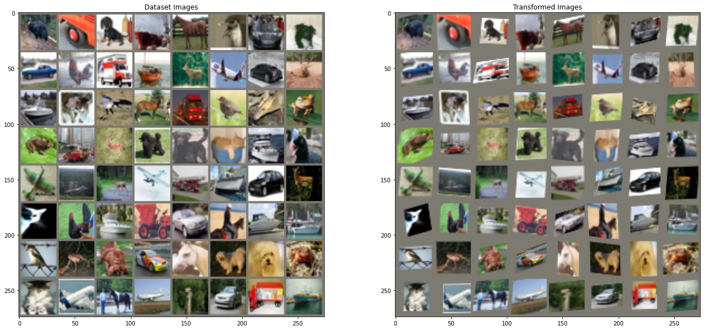

# Session 12.0 The Dawn of Transformers

### Spatial Transformers

The Spatial Transformer is a learnable module which explicitly allows the spatial manipulation of data within the network. This differentiable module can be inserted into existing convolutional architectures, giving neural networks the ability to actively spatially transform feature maps, conditional on the feature map itself, without any extra training supervision or modification to the optimisation process.


The action of the spatial transformer is conditioned on individual data samples, with the appropriate behaviour learnt during training for the task in question (without extra supervision). Unlike pooling layers, where the receptive fields are fixed and local, the spatial transformer module is a dynamic mechanism that can actively spatially transform an image (or a feature map) by producing an appropriate transformation for each input sample. The transformation is then performed on the entire feature map (non-locally) and
can include scaling, cropping, rotations, as well as non-rigid deformations. This allows networks which include spatial transformers to not only select regions of an image that are most relevant (attention), but also to transform those regions to a canonical, expected pose to simplify recognition in the following layers. Notably, spatial transformers can be trained with standard back-propagation, allowing for end-to-end training of the models they are injected in.

The spatial transformer mechanism is split into three parts, shown in Figure 1. In order of computation, 

1) First a localisation network takes the input feature map, and through a number of hidden layers outputs the parameters of the spatial transformation that should be applied to the feature map – this gives a transformation conditional on the input. The localization network is a regular CNN which regresses the transformation parameters. The transformation is never learned explicitly from this dataset, instead the network learns automatically the spatial transformations that enhances the global accuracy.

2) Then, the predicted transformation parameters are used to create a sampling grid, which is a set of points where the input map should be sampled to produce the transformed output. This is done by the grid generator. The grid generator generates a grid of coordinates in the input image corresponding to each pixel from the output image.

3) Finally, the feature map and the sampling grid are taken as inputs to the sampler, producing the output map sampled from the input at the grid points. The sampler uses the parameters of the transformation and applies it to the input image.

The combination of the localisation network, grid generator, and sampler form a spatial transformer. This is a self-contained module which can be dropped into a CNN architecture at any point, and in any number, giving rise to spatial transformer networks. This module is computationally very fast and does not impair the training speed, causing very little time overhead when used naively, and even speedups in attentive models due to subsequent downsampling that can be applied to the output of the transformer. Placing spatial transformers within a CNN allows the network to learn how to actively transform the feature maps to help minimise the overall cost function of the network during training. The knowledge of how to transform each training sample is compressed and cached in the weights of the localisation network (and also the weights of the layers previous to a spatial transformer) during training. For some tasks, it may also be useful to feed the output of the localisation network, θ, forward to the rest of the network, as it explicitly encodes the transformation, and hence the pose, of a region or object. It is also possible to use spatial transformers to downsample or oversample a feature map, as one can define the output dimensions H0 and W0 to be different to the input dimensions H and W. However, with sampling kernels with a fixed, small spatial support (such as the bilinear kernel), downsampling with a spatial transformer can cause aliasing effects.

Finally, it is possible to have multiple spatial transformers in a CNN. Placing multiple spatial transformers at increasing depths of a network allow transformations of increasingly abstract representations, and also gives the localisation networks potentially more informative representations to base the predicted transformation parameters on. One can also use multiple spatial transformers in parallel – this can be useful if there are multiple objects or parts of interest in a feature map that should be
focussed on individually. A limitation of this architecture in a purely feed-forward network is that the number of parallel spatial transformers limits the number of objects that the network can model.

Spatial transformers can be incorporated into CNNs to benefit multifarious tasks, for example:
1) Image Classification: suppose a CNN is trained to perform multi-way classification of images according to whether they contain a particular digit – where the position and size of the digit may vary significantly with each sample (and are uncorrelated with the class); a spatial transformer that crops out and scale-normalizes the appropriate region can simplify the subsequent classification task, and lead to superior classification performance.
2) Co-Localisation: Given a set of images containing different instances of the same (but unknown) class, a spatial transformer can be used to localise them in each image.
3) Spatial Attention: A spatial transformer can be used for tasks requiring an attention mechanism but is more flexible and can be trained purely with backpropagation without reinforcement learning. A key benefit of using attention is that transformed (and so attended), lower resolution inputs can be used in favour of higher resolution raw inputs, resulting in increased computational efficiency.

Credits and References : 
1) https://arxiv.org/pdf/1506.02025.pdf (Spatial Transformer Networks)
2) https://brsoff.github.io/tutorials/intermediate/spatial_transformer_tutorial.html


Code Links 
--------------------------------------

Colab Link : https://colab.research.google.com/drive/1c2p5kC3iG03yhKDSpaHj8XMnlsxcOMcg?usp=sharing

Github Link : https://github.com/lavanyanemani96/TSAI-EVA-7.0/blob/master/12_The_Dawn_of_Transformers/Session_12_Spatial_Tranformers.ipynb

Training Logs for last few epochs
---------------------------------------
Train Epoch: 1 [0/50000 (0%)]	Loss: 2.306755
Train Epoch: 1 [32000/50000 (64%)]	Loss: 2.266165
/usr/local/lib/python3.7/dist-packages/torch/nn/_reduction.py:42: UserWarning: size_average and reduce args will be deprecated, please use reduction='sum' instead.
  warnings.warn(warning.format(ret))

Test set: Average loss: 2.1279, Accuracy: 2229/10000 (22%)

Train Epoch: 2 [0/50000 (0%)]	Loss: 2.130422
Train Epoch: 2 [32000/50000 (64%)]	Loss: 1.804982

Test set: Average loss: 1.8239, Accuracy: 3175/10000 (32%)

Train Epoch: 3 [0/50000 (0%)]	Loss: 1.744722
Train Epoch: 3 [32000/50000 (64%)]	Loss: 1.594820

Test set: Average loss: 1.7202, Accuracy: 3782/10000 (38%)

Train Epoch: 4 [0/50000 (0%)]	Loss: 1.700610
Train Epoch: 4 [32000/50000 (64%)]	Loss: 1.608032

Test set: Average loss: 1.5674, Accuracy: 4196/10000 (42%)

Train Epoch: 5 [0/50000 (0%)]	Loss: 1.656767
Train Epoch: 5 [32000/50000 (64%)]	Loss: 1.376528

Test set: Average loss: 1.5566, Accuracy: 4358/10000 (44%)

Train Epoch: 6 [0/50000 (0%)]	Loss: 1.560276
Train Epoch: 6 [32000/50000 (64%)]	Loss: 1.470433

Test set: Average loss: 1.4476, Accuracy: 4679/10000 (47%)

Train Epoch: 7 [0/50000 (0%)]	Loss: 1.299575
Train Epoch: 7 [32000/50000 (64%)]	Loss: 1.265339

Test set: Average loss: 1.4582, Accuracy: 4848/10000 (48%)

Train Epoch: 8 [0/50000 (0%)]	Loss: 1.456454
Train Epoch: 8 [32000/50000 (64%)]	Loss: 1.143501

Test set: Average loss: 1.3677, Accuracy: 5127/10000 (51%)

Train Epoch: 9 [0/50000 (0%)]	Loss: 1.341992
Train Epoch: 9 [32000/50000 (64%)]	Loss: 1.156697

Test set: Average loss: 1.2829, Accuracy: 5454/10000 (55%)

Train Epoch: 10 [0/50000 (0%)]	Loss: 1.463234
Train Epoch: 10 [32000/50000 (64%)]	Loss: 1.342265

Test set: Average loss: 1.8087, Accuracy: 4193/10000 (42%)

Train Epoch: 11 [0/50000 (0%)]	Loss: 1.527110
Train Epoch: 11 [32000/50000 (64%)]	Loss: 1.101319

Test set: Average loss: 1.3310, Accuracy: 5313/10000 (53%)

Train Epoch: 12 [0/50000 (0%)]	Loss: 1.446728
Train Epoch: 12 [32000/50000 (64%)]	Loss: 1.213567

Test set: Average loss: 1.3554, Accuracy: 5422/10000 (54%)

Train Epoch: 13 [0/50000 (0%)]	Loss: 1.214012
Train Epoch: 13 [32000/50000 (64%)]	Loss: 1.323201

Test set: Average loss: 1.2310, Accuracy: 5559/10000 (56%)

Train Epoch: 14 [0/50000 (0%)]	Loss: 1.040533
Train Epoch: 14 [32000/50000 (64%)]	Loss: 0.915116

Test set: Average loss: 1.1799, Accuracy: 5883/10000 (59%)

Train Epoch: 15 [0/50000 (0%)]	Loss: 1.060623
Train Epoch: 15 [32000/50000 (64%)]	Loss: 1.021517

Test set: Average loss: 1.3062, Accuracy: 5510/10000 (55%)

Train Epoch: 16 [0/50000 (0%)]	Loss: 1.546169
Train Epoch: 16 [32000/50000 (64%)]	Loss: 1.043478

Test set: Average loss: 1.1895, Accuracy: 5945/10000 (59%)

Train Epoch: 17 [0/50000 (0%)]	Loss: 0.889479
Train Epoch: 17 [32000/50000 (64%)]	Loss: 1.130627

Test set: Average loss: 1.2338, Accuracy: 5870/10000 (59%)

Train Epoch: 18 [0/50000 (0%)]	Loss: 1.149697
Train Epoch: 18 [32000/50000 (64%)]	Loss: 0.810048

Test set: Average loss: 1.1138, Accuracy: 6077/10000 (61%)

Train Epoch: 19 [0/50000 (0%)]	Loss: 1.009396
Train Epoch: 19 [32000/50000 (64%)]	Loss: 0.833606

Test set: Average loss: 1.0600, Accuracy: 6346/10000 (63%)

Train Epoch: 20 [0/50000 (0%)]	Loss: 0.973934
Train Epoch: 20 [32000/50000 (64%)]	Loss: 0.869660

Test set: Average loss: 1.1553, Accuracy: 6099/10000 (61%)

Train Epoch: 21 [0/50000 (0%)]	Loss: 1.176472
Train Epoch: 21 [32000/50000 (64%)]	Loss: 0.811010

Test set: Average loss: 1.1343, Accuracy: 6112/10000 (61%)

Train Epoch: 22 [0/50000 (0%)]	Loss: 0.868589
Train Epoch: 22 [32000/50000 (64%)]	Loss: 0.946711

Test set: Average loss: 1.0611, Accuracy: 6387/10000 (64%)

Train Epoch: 23 [0/50000 (0%)]	Loss: 0.510764
Train Epoch: 23 [32000/50000 (64%)]	Loss: 0.701719

Test set: Average loss: 1.0973, Accuracy: 6330/10000 (63%)

Train Epoch: 24 [0/50000 (0%)]	Loss: 0.768418
Train Epoch: 24 [32000/50000 (64%)]	Loss: 0.826093

Test set: Average loss: 1.1437, Accuracy: 6155/10000 (62%)

Train Epoch: 25 [0/50000 (0%)]	Loss: 0.699393
Train Epoch: 25 [32000/50000 (64%)]	Loss: 0.802264

Test set: Average loss: 1.5164, Accuracy: 5530/10000 (55%)

Train Epoch: 26 [0/50000 (0%)]	Loss: 1.623431
Train Epoch: 26 [32000/50000 (64%)]	Loss: 0.741435

Test set: Average loss: 1.2398, Accuracy: 5916/10000 (59%)

Train Epoch: 27 [0/50000 (0%)]	Loss: 1.051381
Train Epoch: 27 [32000/50000 (64%)]	Loss: 0.771376

Test set: Average loss: 1.0993, Accuracy: 6328/10000 (63%)

Train Epoch: 28 [0/50000 (0%)]	Loss: 1.074728
Train Epoch: 28 [32000/50000 (64%)]	Loss: 0.645387

Test set: Average loss: 1.1138, Accuracy: 6375/10000 (64%)

Train Epoch: 29 [0/50000 (0%)]	Loss: 0.585009
Train Epoch: 29 [32000/50000 (64%)]	Loss: 0.517288

Test set: Average loss: 1.3079, Accuracy: 5879/10000 (59%)

Train Epoch: 30 [0/50000 (0%)]	Loss: 0.785122
Train Epoch: 30 [32000/50000 (64%)]	Loss: 0.665373

Test set: Average loss: 1.1421, Accuracy: 6318/10000 (63%)

Train Epoch: 31 [0/50000 (0%)]	Loss: 0.830962
Train Epoch: 31 [32000/50000 (64%)]	Loss: 0.579421

Test set: Average loss: 1.2287, Accuracy: 6138/10000 (61%)

Train Epoch: 32 [0/50000 (0%)]	Loss: 0.846316
Train Epoch: 32 [32000/50000 (64%)]	Loss: 0.623384

Test set: Average loss: 1.1804, Accuracy: 6238/10000 (62%)

Train Epoch: 33 [0/50000 (0%)]	Loss: 0.679801
Train Epoch: 33 [32000/50000 (64%)]	Loss: 0.712921

Test set: Average loss: 1.1523, Accuracy: 6366/10000 (64%)

Train Epoch: 34 [0/50000 (0%)]	Loss: 0.697740
Train Epoch: 34 [32000/50000 (64%)]	Loss: 0.582452

Test set: Average loss: 1.1375, Accuracy: 6444/10000 (64%)

Train Epoch: 35 [0/50000 (0%)]	Loss: 0.686100
Train Epoch: 35 [32000/50000 (64%)]	Loss: 0.666247

Test set: Average loss: 1.4641, Accuracy: 5786/10000 (58%)

Train Epoch: 36 [0/50000 (0%)]	Loss: 0.916221
Train Epoch: 36 [32000/50000 (64%)]	Loss: 0.512899

Test set: Average loss: 1.2945, Accuracy: 6135/10000 (61%)

Train Epoch: 37 [0/50000 (0%)]	Loss: 0.823115
Train Epoch: 37 [32000/50000 (64%)]	Loss: 0.944146

Test set: Average loss: 1.3365, Accuracy: 6036/10000 (60%)

Train Epoch: 38 [0/50000 (0%)]	Loss: 0.917289
Train Epoch: 38 [32000/50000 (64%)]	Loss: 0.439581

Test set: Average loss: 1.2282, Accuracy: 6324/10000 (63%)

Train Epoch: 39 [0/50000 (0%)]	Loss: 0.930594
Train Epoch: 39 [32000/50000 (64%)]	Loss: 0.953667

Test set: Average loss: 1.1380, Accuracy: 6583/10000 (66%)

Train Epoch: 40 [0/50000 (0%)]	Loss: 0.505669
Train Epoch: 40 [32000/50000 (64%)]	Loss: 0.777838

Test set: Average loss: 1.1777, Accuracy: 6439/10000 (64%)

Train Epoch: 41 [0/50000 (0%)]	Loss: 0.590786
Train Epoch: 41 [32000/50000 (64%)]	Loss: 0.603742

Test set: Average loss: 1.2472, Accuracy: 6409/10000 (64%)

Train Epoch: 42 [0/50000 (0%)]	Loss: 0.603507
Train Epoch: 42 [32000/50000 (64%)]	Loss: 0.546789

Test set: Average loss: 1.2661, Accuracy: 6302/10000 (63%)

Train Epoch: 43 [0/50000 (0%)]	Loss: 0.591293
Train Epoch: 43 [32000/50000 (64%)]	Loss: 0.442102

Test set: Average loss: 1.2059, Accuracy: 6475/10000 (65%)

Train Epoch: 44 [0/50000 (0%)]	Loss: 0.624730
Train Epoch: 44 [32000/50000 (64%)]	Loss: 0.412104

Test set: Average loss: 1.1970, Accuracy: 6577/10000 (66%)

Train Epoch: 45 [0/50000 (0%)]	Loss: 0.475588
Train Epoch: 45 [32000/50000 (64%)]	Loss: 0.769748

Test set: Average loss: 1.4920, Accuracy: 5971/10000 (60%)

Train Epoch: 46 [0/50000 (0%)]	Loss: 0.748224
Train Epoch: 46 [32000/50000 (64%)]	Loss: 0.521245

Test set: Average loss: 1.1933, Accuracy: 6424/10000 (64%)

Train Epoch: 47 [0/50000 (0%)]	Loss: 0.461196
Train Epoch: 47 [32000/50000 (64%)]	Loss: 0.542932

Test set: Average loss: 1.2357, Accuracy: 6490/10000 (65%)

Train Epoch: 48 [0/50000 (0%)]	Loss: 0.766114
Train Epoch: 48 [32000/50000 (64%)]	Loss: 0.383967

Test set: Average loss: 1.1936, Accuracy: 6497/10000 (65%)

Train Epoch: 49 [0/50000 (0%)]	Loss: 0.490699
Train Epoch: 49 [32000/50000 (64%)]	Loss: 0.426881

Test set: Average loss: 1.3478, Accuracy: 6215/10000 (62%)

Train Epoch: 50 [0/50000 (0%)]	Loss: 0.490301
Train Epoch: 50 [32000/50000 (64%)]	Loss: 0.475353

Test set: Average loss: 1.2366, Accuracy: 6488/10000 (65%)

Model Summary 
-------------------------------------
```
----------------------------------------------------------------
        Layer (type)               Output Shape         Param #
================================================================
            Conv2d-1           [-1, 64, 26, 26]           9,472
         MaxPool2d-2           [-1, 64, 13, 13]               0
              ReLU-3           [-1, 64, 13, 13]               0
            Conv2d-4            [-1, 128, 9, 9]         204,928
         MaxPool2d-5            [-1, 128, 4, 4]               0
              ReLU-6            [-1, 128, 4, 4]               0
            Linear-7                  [-1, 256]         524,544
              ReLU-8                  [-1, 256]               0
            Linear-9                    [-1, 6]           1,542
           Conv2d-10            [-1, 6, 28, 28]             456
        MaxPool2d-11            [-1, 6, 14, 14]               0
           Conv2d-12           [-1, 16, 10, 10]           2,416
        MaxPool2d-13             [-1, 16, 5, 5]               0
           Linear-14                  [-1, 120]          48,120
           Linear-15                   [-1, 84]          10,164
           Linear-16                   [-1, 10]             850
================================================================
Total params: 802,492
Trainable params: 802,492
Non-trainable params: 0
----------------------------------------------------------------
Input size (MB): 0.01
Forward/backward pass size (MB): 0.67
Params size (MB): 3.06
Estimated Total Size (MB): 3.74
----------------------------------------------------------------
```

###VISUALIZING THE STN RESULTS
----------------------------------------------




Contributors
-------------------------
Lavanya Nemani lavanyanemani96@gmail.com

Shaheer Fardan shaheer.fardan@gmail.com

