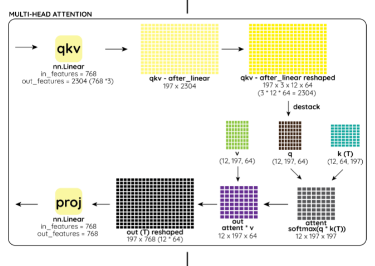

# Session 13.0 ViT

## ViT Cats vs Dogs

Code Links 
--------------------------------------

Colab Link : https://colab.research.google.com/drive/1QY3tnwtjL1-gxaDUsr3g_jUV1eCgfT-N?usp=sharing

Github Link : https://github.com/lavanyanemani96/TSAI-EVA-7.0/blob/master/13_ViT/Session_13_ViT.ipynb


Training Logs for last few epochs
---------------------------------------
100%
313/313 [08:31<00:00, 1.72it/s]
Epoch : 1 - loss : 0.6958 - acc: 0.5059 - val_loss : 0.6957 - val_acc: 0.5014

100%
313/313 [03:30<00:00, 1.72it/s]
Epoch : 2 - loss : 0.6910 - acc: 0.5247 - val_loss : 0.6860 - val_acc: 0.5487

100%
313/313 [03:30<00:00, 1.74it/s]
Epoch : 3 - loss : 0.6864 - acc: 0.5429 - val_loss : 0.6804 - val_acc: 0.5609

100%
313/313 [03:31<00:00, 1.73it/s]
Epoch : 4 - loss : 0.6793 - acc: 0.5704 - val_loss : 0.6746 - val_acc: 0.5815

100%
313/313 [03:30<00:00, 1.74it/s]
Epoch : 5 - loss : 0.6705 - acc: 0.5849 - val_loss : 0.6633 - val_acc: 0.5882

100%
313/313 [03:30<00:00, 1.73it/s]
Epoch : 6 - loss : 0.6597 - acc: 0.5986 - val_loss : 0.6523 - val_acc: 0.6023

100%
313/313 [03:30<00:00, 1.69it/s]
Epoch : 7 - loss : 0.6547 - acc: 0.6041 - val_loss : 0.6436 - val_acc: 0.6165

100%
313/313 [03:31<00:00, 1.73it/s]
Epoch : 8 - loss : 0.6470 - acc: 0.6145 - val_loss : 0.6424 - val_acc: 0.6171

100%
313/313 [03:30<00:00, 1.73it/s]
Epoch : 9 - loss : 0.6421 - acc: 0.6179 - val_loss : 0.6394 - val_acc: 0.6226

100%
313/313 [03:32<00:00, 1.71it/s]
Epoch : 10 - loss : 0.6348 - acc: 0.6276 - val_loss : 0.6229 - val_acc: 0.6487

Model Summary 
-------------------------------------
```
----------------------------------------------------------------
        Layer (type)               Output Shape         Param #
================================================================
         Rearrange-1             [-1, 49, 3072]               0
            Linear-2              [-1, 49, 128]         393,344
         LayerNorm-3              [-1, 50, 128]             256
            Linear-4              [-1, 50, 128]          16,384
            Linear-5              [-1, 50, 128]          16,384
            Linear-6              [-1, 50, 128]          16,384
           Dropout-7            [-1, 8, 50, 64]               0
            Linear-8              [-1, 50, 128]          16,512
LinformerSelfAttention-9              [-1, 50, 128]               0
          PreNorm-10              [-1, 50, 128]               0
        LayerNorm-11              [-1, 50, 128]             256
           Linear-12              [-1, 50, 512]          66,048
             GELU-13              [-1, 50, 512]               0
          Dropout-14              [-1, 50, 512]               0
           Linear-15              [-1, 50, 128]          65,664
      FeedForward-16              [-1, 50, 128]               0
          PreNorm-17              [-1, 50, 128]               0
        LayerNorm-18              [-1, 50, 128]             256
           Linear-19              [-1, 50, 128]          16,384
           Linear-20              [-1, 50, 128]          16,384
           Linear-21              [-1, 50, 128]          16,384
          Dropout-22            [-1, 8, 50, 64]               0
           Linear-23              [-1, 50, 128]          16,512
LinformerSelfAttention-24              [-1, 50, 128]               0
          PreNorm-25              [-1, 50, 128]               0
        LayerNorm-26              [-1, 50, 128]             256
           Linear-27              [-1, 50, 512]          66,048
             GELU-28              [-1, 50, 512]               0
          Dropout-29              [-1, 50, 512]               0
           Linear-30              [-1, 50, 128]          65,664
      FeedForward-31              [-1, 50, 128]               0
          PreNorm-32              [-1, 50, 128]               0
        LayerNorm-33              [-1, 50, 128]             256
           Linear-34              [-1, 50, 128]          16,384
           Linear-35              [-1, 50, 128]          16,384
           Linear-36              [-1, 50, 128]          16,384
          Dropout-37            [-1, 8, 50, 64]               0
           Linear-38              [-1, 50, 128]          16,512
LinformerSelfAttention-39              [-1, 50, 128]               0
          PreNorm-40              [-1, 50, 128]               0
        LayerNorm-41              [-1, 50, 128]             256
           Linear-42              [-1, 50, 512]          66,048
             GELU-43              [-1, 50, 512]               0
          Dropout-44              [-1, 50, 512]               0
           Linear-45              [-1, 50, 128]          65,664
      FeedForward-46              [-1, 50, 128]               0
          PreNorm-47              [-1, 50, 128]               0
        LayerNorm-48              [-1, 50, 128]             256
           Linear-49              [-1, 50, 128]          16,384
           Linear-50              [-1, 50, 128]          16,384
           Linear-51              [-1, 50, 128]          16,384
          Dropout-52            [-1, 8, 50, 64]               0
           Linear-53              [-1, 50, 128]          16,512
LinformerSelfAttention-54              [-1, 50, 128]               0
          PreNorm-55              [-1, 50, 128]               0
        LayerNorm-56              [-1, 50, 128]             256
           Linear-57              [-1, 50, 512]          66,048
             GELU-58              [-1, 50, 512]               0
          Dropout-59              [-1, 50, 512]               0
           Linear-60              [-1, 50, 128]          65,664
      FeedForward-61              [-1, 50, 128]               0
          PreNorm-62              [-1, 50, 128]               0
        LayerNorm-63              [-1, 50, 128]             256
           Linear-64              [-1, 50, 128]          16,384
           Linear-65              [-1, 50, 128]          16,384
           Linear-66              [-1, 50, 128]          16,384
          Dropout-67            [-1, 8, 50, 64]               0
           Linear-68              [-1, 50, 128]          16,512
LinformerSelfAttention-69              [-1, 50, 128]               0
          PreNorm-70              [-1, 50, 128]               0
        LayerNorm-71              [-1, 50, 128]             256
           Linear-72              [-1, 50, 512]          66,048
             GELU-73              [-1, 50, 512]               0
          Dropout-74              [-1, 50, 512]               0
           Linear-75              [-1, 50, 128]          65,664
      FeedForward-76              [-1, 50, 128]               0
          PreNorm-77              [-1, 50, 128]               0
        LayerNorm-78              [-1, 50, 128]             256
           Linear-79              [-1, 50, 128]          16,384
           Linear-80              [-1, 50, 128]          16,384
           Linear-81              [-1, 50, 128]          16,384
          Dropout-82            [-1, 8, 50, 64]               0
           Linear-83              [-1, 50, 128]          16,512
LinformerSelfAttention-84              [-1, 50, 128]               0
          PreNorm-85              [-1, 50, 128]               0
        LayerNorm-86              [-1, 50, 128]             256
           Linear-87              [-1, 50, 512]          66,048
             GELU-88              [-1, 50, 512]               0
          Dropout-89              [-1, 50, 512]               0
           Linear-90              [-1, 50, 128]          65,664
      FeedForward-91              [-1, 50, 128]               0
          PreNorm-92              [-1, 50, 128]               0
        LayerNorm-93              [-1, 50, 128]             256
           Linear-94              [-1, 50, 128]          16,384
           Linear-95              [-1, 50, 128]          16,384
           Linear-96              [-1, 50, 128]          16,384
          Dropout-97            [-1, 8, 50, 64]               0
           Linear-98              [-1, 50, 128]          16,512
LinformerSelfAttention-99              [-1, 50, 128]               0
         PreNorm-100              [-1, 50, 128]               0
       LayerNorm-101              [-1, 50, 128]             256
          Linear-102              [-1, 50, 512]          66,048
            GELU-103              [-1, 50, 512]               0
         Dropout-104              [-1, 50, 512]               0
          Linear-105              [-1, 50, 128]          65,664
     FeedForward-106              [-1, 50, 128]               0
         PreNorm-107              [-1, 50, 128]               0
       LayerNorm-108              [-1, 50, 128]             256
          Linear-109              [-1, 50, 128]          16,384
          Linear-110              [-1, 50, 128]          16,384
          Linear-111              [-1, 50, 128]          16,384
         Dropout-112            [-1, 8, 50, 64]               0
          Linear-113              [-1, 50, 128]          16,512
LinformerSelfAttention-114              [-1, 50, 128]               0
         PreNorm-115              [-1, 50, 128]               0
       LayerNorm-116              [-1, 50, 128]             256
          Linear-117              [-1, 50, 512]          66,048
            GELU-118              [-1, 50, 512]               0
         Dropout-119              [-1, 50, 512]               0
          Linear-120              [-1, 50, 128]          65,664
     FeedForward-121              [-1, 50, 128]               0
         PreNorm-122              [-1, 50, 128]               0
       LayerNorm-123              [-1, 50, 128]             256
          Linear-124              [-1, 50, 128]          16,384
          Linear-125              [-1, 50, 128]          16,384
          Linear-126              [-1, 50, 128]          16,384
         Dropout-127            [-1, 8, 50, 64]               0
          Linear-128              [-1, 50, 128]          16,512
LinformerSelfAttention-129              [-1, 50, 128]               0
         PreNorm-130              [-1, 50, 128]               0
       LayerNorm-131              [-1, 50, 128]             256
          Linear-132              [-1, 50, 512]          66,048
            GELU-133              [-1, 50, 512]               0
         Dropout-134              [-1, 50, 512]               0
          Linear-135              [-1, 50, 128]          65,664
     FeedForward-136              [-1, 50, 128]               0
         PreNorm-137              [-1, 50, 128]               0
       LayerNorm-138              [-1, 50, 128]             256
          Linear-139              [-1, 50, 128]          16,384
          Linear-140              [-1, 50, 128]          16,384
          Linear-141              [-1, 50, 128]          16,384
         Dropout-142            [-1, 8, 50, 64]               0
          Linear-143              [-1, 50, 128]          16,512
LinformerSelfAttention-144              [-1, 50, 128]               0
         PreNorm-145              [-1, 50, 128]               0
       LayerNorm-146              [-1, 50, 128]             256
          Linear-147              [-1, 50, 512]          66,048
            GELU-148              [-1, 50, 512]               0
         Dropout-149              [-1, 50, 512]               0
          Linear-150              [-1, 50, 128]          65,664
     FeedForward-151              [-1, 50, 128]               0
         PreNorm-152              [-1, 50, 128]               0
       LayerNorm-153              [-1, 50, 128]             256
          Linear-154              [-1, 50, 128]          16,384
          Linear-155              [-1, 50, 128]          16,384
          Linear-156              [-1, 50, 128]          16,384
         Dropout-157            [-1, 8, 50, 64]               0
          Linear-158              [-1, 50, 128]          16,512
LinformerSelfAttention-159              [-1, 50, 128]               0
         PreNorm-160              [-1, 50, 128]               0
       LayerNorm-161              [-1, 50, 128]             256
          Linear-162              [-1, 50, 512]          66,048
            GELU-163              [-1, 50, 512]               0
         Dropout-164              [-1, 50, 512]               0
          Linear-165              [-1, 50, 128]          65,664
     FeedForward-166              [-1, 50, 128]               0
         PreNorm-167              [-1, 50, 128]               0
       LayerNorm-168              [-1, 50, 128]             256
          Linear-169              [-1, 50, 128]          16,384
          Linear-170              [-1, 50, 128]          16,384
          Linear-171              [-1, 50, 128]          16,384
         Dropout-172            [-1, 8, 50, 64]               0
          Linear-173              [-1, 50, 128]          16,512
LinformerSelfAttention-174              [-1, 50, 128]               0
         PreNorm-175              [-1, 50, 128]               0
       LayerNorm-176              [-1, 50, 128]             256
          Linear-177              [-1, 50, 512]          66,048
            GELU-178              [-1, 50, 512]               0
         Dropout-179              [-1, 50, 512]               0
          Linear-180              [-1, 50, 128]          65,664
     FeedForward-181              [-1, 50, 128]               0
         PreNorm-182              [-1, 50, 128]               0
SequentialSequence-183              [-1, 50, 128]               0
       Linformer-184              [-1, 50, 128]               0
        Identity-185                  [-1, 128]               0
       LayerNorm-186                  [-1, 128]             256
          Linear-187                    [-1, 2]             258
================================================================
Total params: 2,768,514
Trainable params: 2,768,514
Non-trainable params: 0
----------------------------------------------------------------
Input size (MB): 0.57
Forward/backward pass size (MB): 17.12
Params size (MB): 10.56
Estimated Total Size (MB): 28.25
----------------------------------------------------------------
```

## Classes 

1. PatchEmbeddings: Class initialized with image_size (dimension of the original image), patch_size (dimension of the individual patch), num_channels (no. of channels), embed_dim (length of the linear embedding = patch_size * patch_size * num_channels), projection layer (creates patches from a input image by using kernel_size = stride). The forward function simply uses the above initialized projection layer on the input image pixel_values (batch_size, num_channels, height, width) to first create the patches on the input image and then flatten each patch and produce the vector in the shape (batch_size, total number of patches = (image_size * image_size) / (patch_size * patch_size), embed_dim).

2. ViTEmbeddings: Used to create CLS token, position and patch embeddings together. We looked at patch embeddings in Class 1. PatchEmbeddings. Class ViTEmbeddings is initialized with config object that consists of several different hyperparaters initialization inside Class 3. ViTConfig. Inside the class cls_token is the classification token (can be thought of as 0th patch). Each patch is concatanated with a positional embedding position_embeddings (which are also trained in the network) and this is the output embeddings. cls_token is initialized as a Parameter object, to allow backpropagation, of zeros of the shape (1, 1, embed_dim) so that it has the same shape as linear projection of each patch i.e embed_dim. position_embeddings is initialized as a Parameter object of zeros of shape (1, num_patches+1, embed_dim) this is because we need positional embeddings for each patch and additionally 1 for the cls_token with the shape of embed_dim. The class is also initialzed with a dropout probability. The forward function creates patch embeddings using the above Class 1. PatchEmbeddings. Then it expands the cls_token for the batch, followed by concatanating the cls_token and patch_embeddings. This results in num_patches + 1 vectors of size embed_dim. Then the positional embeddings which are initialized as zeros are added to the result giving us embeddings of patches and the cls_token along with their positional embeddings. Dropout is applied at the end. 

3. ViTConfig: Class used to initialize the several different hyper parameters used in the transformer architecture like hidden_size (size of the linear embedding), num_hidden_layers (number of hidden layers in the encoder), num_attention_heads (no. of attention heads for each attention layer in the encoder), intermediate_size (dimensionality of feed-forward layer in encoder), hidden_act (activation used in encoder), hidden_dropout_prob (dropout probability in the hidden layers), attention_probs_dropout_prob (dropout ratio for attention probabilitites), layer_norm_eps (epsilon used by the layer normalization layers so that the values never become 0), is_encoder_decoder (whether decoder is used), image_size (image size), patch_size (patch size), num_channels (no. of channels of image). 

4. ViTSelfAttention: Class that is used to calculate attention using QKV matrices initialized with object of Class 3. ViTConfig. It has three linear layers query, key and value each of which is used with the transpose_for_scores function that shapes them such that they can be used in matrix multiplication. attention_scores are the multiplication of query and key which are normalized to probabilities using softmax which is a measure of overlap of the query and key. The output (self attention) is the matrix multiplication of attention scores and value. A more detailed description is seen in this image below. 



5. ViTSelfOutput: Class for a linear for projecting the output seen in above picture to a linear vector.

6. ViTAttention: Class used for adding the attention output with the input like is done in ResNet architecture. 

7. ViTIntermediate: Class for adding activation to the hidden layers. 

8. ViTLayer: Class for a single ViT layer consisting for feed forward using the above classes. 


Contributors
-------------------------
Darshat Shah darshat@gmail.com

Reuben Wenisch reubenwenisch@gmail.com

Lavanya Nemani lavanyanemani96@gmail.com


