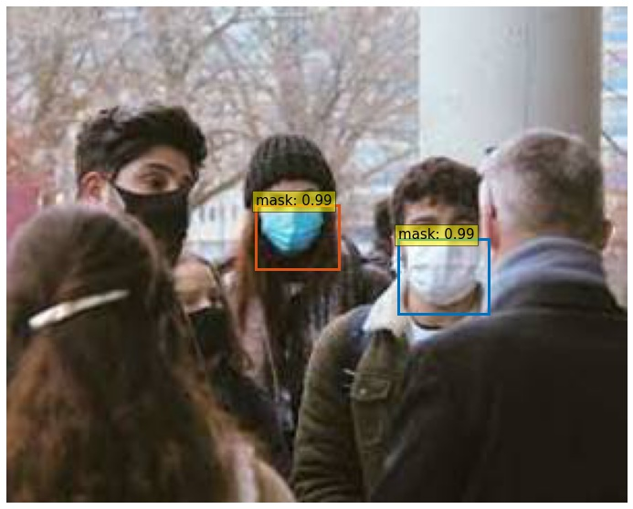
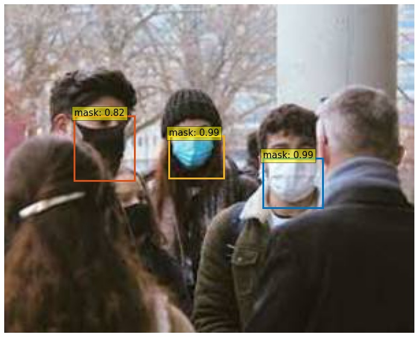

# Session 14.0 DETR End to End Object detection with transformers

## DETR fine tuned with mask dataset

Code Links 
--------------------------------------
1. Colab Link : https://colab.research.google.com/drive/1gvGU1Wdv8U7QrjJipHHKAVNc9m8vWptk?usp=sharing
2. Github Link : https://github.com/lavanyanemani96/TSAI-EVA-7.0/tree/master/14_DETR_End_to_end_Object_Detection_with_transformers

Dataset
--------------------------------------
We annotated our custom dataset containing images with people wearing facemasks using the YOLO annotation tool (https://github.com/miki998/YoloV3_Annotation_Tool). We annotated 65 training images and 15 validation images can be found in mask/mask_dataset.zip

BBox predictions (Validation images) 
---------------------------------------
All the bbox results can be found in mask/results/

Example: With thresholds of 0.9, 0.7 

Explanation
---------------------------------------
1. DETR: With DETR the objective is to detect objects in the image and their bounding boxes. DETR permits max 100 objects to be detected and always emits 100 outputs. This is done in parallel in single pass. Some of the outputs may be (no_object, bb) type if there are less than 100 objects in the image.

DETR uses transformer to encode and decode. Since it must emit two variables - class and bounding box, the decoder is followed by a feed forward network (one network for each of the 100 queries) which emits two variables class and bb.

2. Encoder-Decoder Architecture: We have previously seen that the encoder in case of VIT takes patches of the input image, flattens across RGB and uses them as input embeddings. In case of DETR, the encoder instead takes the feature vector generated by a resnet encoder. The activation output of final layer of resnet encoder downscales the image by a factor of 32, and adds 2048 channels. So if we use an image of size 640x640, we would get an embedding of size 20x20x2048 which is unravelled (H x W) to 400x2048 and then reduced by a linear layer to 400x256. To this input, an equal sized vector randomly initialized is added as the position encoding. There is no CTS input.

The encoder does self attention on the inputs via QKV concept, which is then passed on to a FFN layer (self attention does not perform softmax) to provide another opportunity for inputs to wiggle. Both encoder and decoer have multiple attention heads, each of which may focus on different aspects and relationship in the image. This happens in parallel over the multiple attention heads. By default there are 8 heads, and 12 encoder layers.

3. Decoder and Object queries: We expect output of the decoder to answer questions of objects and their bb. The decoder is hinted to provide 100 outputs via 100 randomly initialized object queries. Each query will then become the vehicle via which one of the outputs will be conveyed. The initial set of 100 queries is subject to a self attention layer to refine them. 

The next step is to blend the queries with encoder output which is mapped to value and key for the second attention block in the decoder. Encoder output is directly mapped as V, and blended with position encoding to be used as K. All this goes through the second multi head attention block. The outputs of this block number 100 (same as input)

4. Bipartite loss: To compute loss function, we need to match outputs to ground truth. Since there is no inherent ordering for objects in image, the ground truth and output do not have a direct 1-1 correspondence. So each decoder output (class, bb) is scanned against the closest (class, bb) in the ground truth. Then then next decoder outputs is matched against the remaining ground truths and so on. This bipartite matching is called Hungarian algorithm. The brute force approach would have exponential complexity, however Hungarian algo is a bipartite graph maximal weighing scheme that has O(n^3) complexity.
5. Note that it is possible for output to match a bb, but not its class. In this case the loss function will then drive the class to be corrected. Hence the loss function has different parts - one to correct the class prediction, another to correct the bounding box, another to correct the IOU.

Contributors
-------------------------
Darshat Shah darshat@gmail.com

Reuben Wenisch reubenwenisch@gmail.com

Lavanya Nemani lavanyanemani96@gmail.com

Training Logs 
---------------------------------------
Namespace(aux_loss=True, backbone='resnet50', batch_size=2, bbox_loss_coef=5, clip_max_norm=0.1, coco_panoptic_path=None, coco_path='/content/data/custom/', dataset_file='custom', dec_layers=6, device='cuda', dice_loss_coef=1, dilation=False, dim_feedforward=2048, dist_url='env://', distributed=False, dropout=0.1, enc_layers=6, eos_coef=0.1, epochs=20, eval=False, frozen_weights=None, giou_loss_coef=2, hidden_dim=256, lr=0.0001, lr_backbone=1e-05, lr_drop=200, mask_loss_coef=1, masks=False, nheads=8, num_classes=2, num_queries=100, num_workers=2, output_dir='outputs', position_embedding='sine', pre_norm=False, remove_difficult=False, resume='detr-r50_no-class-head.pth', seed=42, set_cost_bbox=5, set_cost_class=1, set_cost_giou=2, start_epoch=0, weight_decay=0.0001, world_size=1)
number of params: 41279495
loading annotations into memory...
Done (t=0.00s)
creating index...
index created!
loading annotations into memory...
Done (t=0.00s)
creating index...
index created!
Start training
Epoch: [0]  [ 0/32]  eta: 0:00:42  lr: 0.000100  class_error: 0.00  loss: 30.7398 (30.7398)  loss_ce: 1.7263 (1.7263)  loss_bbox: 1.7650 (1.7650)  loss_giou: 1.6196 (1.6196)  loss_ce_0: 1.8071 (1.8071)  loss_bbox_0: 1.7530 (1.7530)  loss_giou_0: 1.6681 (1.6681)  loss_ce_1: 1.7967 (1.7967)  loss_bbox_1: 1.7374 (1.7374)  loss_giou_1: 1.7279 (1.7279)  loss_ce_2: 1.7469 (1.7469)  loss_bbox_2: 1.7584 (1.7584)  loss_giou_2: 1.6098 (1.6098)  loss_ce_3: 1.7246 (1.7246)  loss_bbox_3: 1.5899 (1.5899)  loss_giou_3: 1.6714 (1.6714)  loss_ce_4: 1.7234 (1.7234)  loss_bbox_4: 1.6110 (1.6110)  loss_giou_4: 1.7034 (1.7034)  loss_ce_unscaled: 1.7263 (1.7263)  class_error_unscaled: 0.0000 (0.0000)  loss_bbox_unscaled: 0.3530 (0.3530)  loss_giou_unscaled: 0.8098 (0.8098)  cardinality_error_unscaled: 99.0000 (99.0000)  loss_ce_0_unscaled: 1.8071 (1.8071)  loss_bbox_0_unscaled: 0.3506 (0.3506)  loss_giou_0_unscaled: 0.8341 (0.8341)  cardinality_error_0_unscaled: 99.0000 (99.0000)  loss_ce_1_unscaled: 1.7967 (1.7967)  loss_bbox_1_unscaled: 0.3475 (0.3475)  loss_giou_1_unscaled: 0.8639 (0.8639)  cardinality_error_1_unscaled: 99.0000 (99.0000)  loss_ce_2_unscaled: 1.7469 (1.7469)  loss_bbox_2_unscaled: 0.3517 (0.3517)  loss_giou_2_unscaled: 0.8049 (0.8049)  cardinality_error_2_unscaled: 99.0000 (99.0000)  loss_ce_3_unscaled: 1.7246 (1.7246)  loss_bbox_3_unscaled: 0.3180 (0.3180)  loss_giou_3_unscaled: 0.8357 (0.8357)  cardinality_error_3_unscaled: 99.0000 (99.0000)  loss_ce_4_unscaled: 1.7234 (1.7234)  loss_bbox_4_unscaled: 0.3222 (0.3222)  loss_giou_4_unscaled: 0.8517 (0.8517)  cardinality_error_4_unscaled: 99.0000 (99.0000)  time: 1.3148  data: 0.2755  max mem: 1611
Epoch: [0]  [10/32]  eta: 0:00:18  lr: 0.000100  class_error: 50.00  loss: 25.0821 (26.3288)  loss_ce: 1.1070 (1.1320)  loss_bbox: 1.6633 (1.6927)  loss_giou: 1.3171 (1.3531)  loss_ce_0: 1.4345 (1.4751)  loss_bbox_0: 1.6885 (1.6955)  loss_giou_0: 1.3110 (1.3216)  loss_ce_1: 1.3620 (1.3882)  loss_bbox_1: 1.7374 (1.8183)  loss_giou_1: 1.3086 (1.3547)  loss_ce_2: 1.3343 (1.3492)  loss_bbox_2: 1.7584 (1.8126)  loss_giou_2: 1.3023 (1.3560)  loss_ce_3: 1.2575 (1.2410)  loss_bbox_3: 1.6663 (1.7904)  loss_giou_3: 1.2499 (1.3140)  loss_ce_4: 1.1822 (1.1782)  loss_bbox_4: 1.6952 (1.7020)  loss_giou_4: 1.2278 (1.3543)  loss_ce_unscaled: 1.1070 (1.1320)  class_error_unscaled: 0.0000 (26.5152)  loss_bbox_unscaled: 0.3327 (0.3385)  loss_giou_unscaled: 0.6585 (0.6765)  cardinality_error_unscaled: 76.5000 (59.3182)  loss_ce_0_unscaled: 1.4345 (1.4751)  loss_bbox_0_unscaled: 0.3377 (0.3391)  loss_giou_0_unscaled: 0.6555 (0.6608)  cardinality_error_0_unscaled: 97.5000 (97.2727)  loss_ce_1_unscaled: 1.3620 (1.3882)  loss_bbox_1_unscaled: 0.3475 (0.3637)  loss_giou_1_unscaled: 0.6543 (0.6774)  cardinality_error_1_unscaled: 96.5000 (95.0909)  loss_ce_2_unscaled: 1.3343 (1.3492)  loss_bbox_2_unscaled: 0.3517 (0.3625)  loss_giou_2_unscaled: 0.6511 (0.6780)  cardinality_error_2_unscaled: 94.5000 (91.3182)  loss_ce_3_unscaled: 1.2575 (1.2410)  loss_bbox_3_unscaled: 0.3333 (0.3581)  loss_giou_3_unscaled: 0.6250 (0.6570)  cardinality_error_3_unscaled: 89.0000 (77.4091)  loss_ce_4_unscaled: 1.1822 (1.1782)  loss_bbox_4_unscaled: 0.3390 (0.3404)  loss_giou_4_unscaled: 0.6139 (0.6771)  cardinality_error_4_unscaled: 86.0000 (67.8636)  time: 0.8492  data: 0.0377  max mem: 3357
Epoch: [0]  [20/32]  eta: 0:00:10  lr: 0.000100  class_error: 100.00  loss: 19.3573 (20.1833)  loss_ce: 0.7028 (0.8436)  loss_bbox: 1.0472 (1.2661)  loss_giou: 1.1077 (1.0686)  loss_ce_0: 1.1549 (1.2188)  loss_bbox_0: 1.0270 (1.2292)  loss_giou_0: 0.7537 (1.0612)  loss_ce_1: 1.0824 (1.1315)  loss_bbox_1: 0.9420 (1.3082)  loss_giou_1: 0.8042 (1.0666)  loss_ce_2: 1.0031 (1.0764)  loss_bbox_2: 0.9265 (1.3209)  loss_giou_2: 1.0938 (1.0736)  loss_ce_3: 0.8290 (0.9598)  loss_bbox_3: 1.0182 (1.2927)  loss_giou_3: 1.1230 (1.0499)  loss_ce_4: 0.7562 (0.8925)  loss_bbox_4: 0.9747 (1.2533)  loss_giou_4: 1.1133 (1.0704)  loss_ce_unscaled: 0.7028 (0.8436)  class_error_unscaled: 75.0000 (58.4127)  loss_bbox_unscaled: 0.2094 (0.2532)  loss_giou_unscaled: 0.5539 (0.5343)  cardinality_error_unscaled: 8.0000 (33.1190)  loss_ce_0_unscaled: 1.1549 (1.2188)  loss_bbox_0_unscaled: 0.2054 (0.2458)  loss_giou_0_unscaled: 0.3769 (0.5306)  cardinality_error_0_unscaled: 88.0000 (79.1667)  loss_ce_1_unscaled: 1.0824 (1.1315)  loss_bbox_1_unscaled: 0.1884 (0.2616)  loss_giou_1_unscaled: 0.4021 (0.5333)  cardinality_error_1_unscaled: 74.5000 (68.7857)  loss_ce_2_unscaled: 1.0031 (1.0764)  loss_bbox_2_unscaled: 0.1853 (0.2642)  loss_giou_2_unscaled: 0.5469 (0.5368)  cardinality_error_2_unscaled: 56.0000 (58.8333)  loss_ce_3_unscaled: 0.8290 (0.9598)  loss_bbox_3_unscaled: 0.2036 (0.2585)  loss_giou_3_unscaled: 0.5615 (0.5250)  cardinality_error_3_unscaled: 30.5000 (45.1667)  loss_ce_4_unscaled: 0.7562 (0.8925)  loss_bbox_4_unscaled: 0.1949 (0.2507)  loss_giou_4_unscaled: 0.5566 (0.5352)  cardinality_error_4_unscaled: 23.0000 (38.2619)  time: 0.8560  data: 0.0149  max mem: 3357
Epoch: [0]  [30/32]  eta: 0:00:01  lr: 0.000100  class_error: 100.00  loss: 10.1997 (16.7848)  loss_ce: 0.4326 (0.7086)  loss_bbox: 0.5164 (1.0153)  loss_giou: 0.5121 (0.9155)  loss_ce_0: 0.8250 (1.0583)  loss_bbox_0: 0.4682 (0.9933)  loss_giou_0: 0.5047 (0.9081)  loss_ce_1: 0.7125 (0.9746)  loss_bbox_1: 0.4258 (1.0357)  loss_giou_1: 0.4781 (0.9012)  loss_ce_2: 0.6515 (0.9135)  loss_bbox_2: 0.4614 (1.0518)  loss_giou_2: 0.4249 (0.9116)  loss_ce_3: 0.5589 (0.8102)  loss_bbox_3: 0.4664 (1.0263)  loss_giou_3: 0.4556 (0.8950)  loss_ce_4: 0.4802 (0.7493)  loss_bbox_4: 0.4470 (1.0023)  loss_giou_4: 0.4917 (0.9144)  loss_ce_unscaled: 0.4326 (0.7086)  class_error_unscaled: 100.0000 (71.1828)  loss_bbox_unscaled: 0.1033 (0.2031)  loss_giou_unscaled: 0.2561 (0.4577)  cardinality_error_unscaled: 1.5000 (23.0000)  loss_ce_0_unscaled: 0.8250 (1.0583)  loss_bbox_0_unscaled: 0.0936 (0.1987)  loss_giou_0_unscaled: 0.2523 (0.4540)  cardinality_error_0_unscaled: 39.0000 (60.7903)  loss_ce_1_unscaled: 0.7125 (0.9746)  loss_bbox_1_unscaled: 0.0852 (0.2071)  loss_giou_1_unscaled: 0.2390 (0.4506)  cardinality_error_1_unscaled: 21.0000 (50.7097)  loss_ce_2_unscaled: 0.6515 (0.9135)  loss_bbox_2_unscaled: 0.0923 (0.2104)  loss_giou_2_unscaled: 0.2124 (0.4558)  cardinality_error_2_unscaled: 10.0000 (41.6774)  loss_ce_3_unscaled: 0.5589 (0.8102)  loss_bbox_3_unscaled: 0.0933 (0.2053)  loss_giou_3_unscaled: 0.2278 (0.4475)  cardinality_error_3_unscaled: 2.0000 (31.5645)  loss_ce_4_unscaled: 0.4802 (0.7493)  loss_bbox_4_unscaled: 0.0894 (0.2005)  loss_giou_4_unscaled: 0.2458 (0.4572)  cardinality_error_4_unscaled: 1.5000 (26.6935)  time: 0.8826  data: 0.0159  max mem: 3357
Epoch: [0]  [31/32]  eta: 0:00:00  lr: 0.000100  class_error: 100.00  loss: 9.1358 (16.4583)  loss_ce: 0.4303 (0.6960)  loss_bbox: 0.4604 (0.9944)  loss_giou: 0.4438 (0.8959)  loss_ce_0: 0.8051 (1.0440)  loss_bbox_0: 0.4473 (0.9748)  loss_giou_0: 0.4426 (0.8890)  loss_ce_1: 0.7064 (0.9601)  loss_bbox_1: 0.3987 (1.0127)  loss_giou_1: 0.4667 (0.8799)  loss_ce_2: 0.6473 (0.8989)  loss_bbox_2: 0.4598 (1.0285)  loss_giou_2: 0.4056 (0.8911)  loss_ce_3: 0.5370 (0.7964)  loss_bbox_3: 0.3977 (1.0064)  loss_giou_3: 0.4375 (0.8764)  loss_ce_4: 0.4649 (0.7364)  loss_bbox_4: 0.4152 (0.9819)  loss_giou_4: 0.4363 (0.8954)  loss_ce_unscaled: 0.4303 (0.6960)  class_error_unscaled: 100.0000 (72.0833)  loss_bbox_unscaled: 0.0921 (0.1989)  loss_giou_unscaled: 0.2219 (0.4480)  cardinality_error_unscaled: 1.5000 (22.3125)  loss_ce_0_unscaled: 0.8051 (1.0440)  loss_bbox_0_unscaled: 0.0895 (0.1950)  loss_giou_0_unscaled: 0.2213 (0.4445)  cardinality_error_0_unscaled: 33.0000 (59.1875)  loss_ce_1_unscaled: 0.7064 (0.9601)  loss_bbox_1_unscaled: 0.0797 (0.2025)  loss_giou_1_unscaled: 0.2333 (0.4399)  cardinality_error_1_unscaled: 19.0000 (49.3281)  loss_ce_2_unscaled: 0.6473 (0.8989)  loss_bbox_2_unscaled: 0.0920 (0.2057)  loss_giou_2_unscaled: 0.2028 (0.4456)  cardinality_error_2_unscaled: 7.5000 (40.4219)  loss_ce_3_unscaled: 0.5370 (0.7964)  loss_bbox_3_unscaled: 0.0795 (0.2013)  loss_giou_3_unscaled: 0.2187 (0.4382)  cardinality_error_3_unscaled: 1.5000 (30.6094)  loss_ce_4_unscaled: 0.4649 (0.7364)  loss_bbox_4_unscaled: 0.0830 (0.1964)  loss_giou_4_unscaled: 0.2182 (0.4477)  cardinality_error_4_unscaled: 1.5000 (25.8906)  time: 0.8788  data: 0.0157  max mem: 3357
Epoch: [0] Total time: 0:00:27 (0.8708 s / it)
Averaged stats: lr: 0.000100  class_error: 100.00  loss: 9.1358 (16.4583)  loss_ce: 0.4303 (0.6960)  loss_bbox: 0.4604 (0.9944)  loss_giou: 0.4438 (0.8959)  loss_ce_0: 0.8051 (1.0440)  loss_bbox_0: 0.4473 (0.9748)  loss_giou_0: 0.4426 (0.8890)  loss_ce_1: 0.7064 (0.9601)  loss_bbox_1: 0.3987 (1.0127)  loss_giou_1: 0.4667 (0.8799)  loss_ce_2: 0.6473 (0.8989)  loss_bbox_2: 0.4598 (1.0285)  loss_giou_2: 0.4056 (0.8911)  loss_ce_3: 0.5370 (0.7964)  loss_bbox_3: 0.3977 (1.0064)  loss_giou_3: 0.4375 (0.8764)  loss_ce_4: 0.4649 (0.7364)  loss_bbox_4: 0.4152 (0.9819)  loss_giou_4: 0.4363 (0.8954)  loss_ce_unscaled: 0.4303 (0.6960)  class_error_unscaled: 100.0000 (72.0833)  loss_bbox_unscaled: 0.0921 (0.1989)  loss_giou_unscaled: 0.2219 (0.4480)  cardinality_error_unscaled: 1.5000 (22.3125)  loss_ce_0_unscaled: 0.8051 (1.0440)  loss_bbox_0_unscaled: 0.0895 (0.1950)  loss_giou_0_unscaled: 0.2213 (0.4445)  cardinality_error_0_unscaled: 33.0000 (59.1875)  loss_ce_1_unscaled: 0.7064 (0.9601)  loss_bbox_1_unscaled: 0.0797 (0.2025)  loss_giou_1_unscaled: 0.2333 (0.4399)  cardinality_error_1_unscaled: 19.0000 (49.3281)  loss_ce_2_unscaled: 0.6473 (0.8989)  loss_bbox_2_unscaled: 0.0920 (0.2057)  loss_giou_2_unscaled: 0.2028 (0.4456)  cardinality_error_2_unscaled: 7.5000 (40.4219)  loss_ce_3_unscaled: 0.5370 (0.7964)  loss_bbox_3_unscaled: 0.0795 (0.2013)  loss_giou_3_unscaled: 0.2187 (0.4382)  cardinality_error_3_unscaled: 1.5000 (30.6094)  loss_ce_4_unscaled: 0.4649 (0.7364)  loss_bbox_4_unscaled: 0.0830 (0.1964)  loss_giou_4_unscaled: 0.2182 (0.4477)  cardinality_error_4_unscaled: 1.5000 (25.8906)
Test:  [0/8]  eta: 0:00:07  class_error: 87.50  loss: 13.2588 (13.2588)  loss_ce: 0.6396 (0.6396)  loss_bbox: 0.4775 (0.4775)  loss_giou: 1.0296 (1.0296)  loss_ce_0: 0.7483 (0.7483)  loss_bbox_0: 0.5355 (0.5355)  loss_giou_0: 1.1387 (1.1387)  loss_ce_1: 0.7382 (0.7382)  loss_bbox_1: 0.5117 (0.5117)  loss_giou_1: 1.0073 (1.0073)  loss_ce_2: 0.6898 (0.6898)  loss_bbox_2: 0.4721 (0.4721)  loss_giou_2: 0.9954 (0.9954)  loss_ce_3: 0.6610 (0.6610)  loss_bbox_3: 0.4871 (0.4871)  loss_giou_3: 0.9776 (0.9776)  loss_ce_4: 0.6385 (0.6385)  loss_bbox_4: 0.4869 (0.4869)  loss_giou_4: 1.0240 (1.0240)  loss_ce_unscaled: 0.6396 (0.6396)  class_error_unscaled: 87.5000 (87.5000)  loss_bbox_unscaled: 0.0955 (0.0955)  loss_giou_unscaled: 0.5148 (0.5148)  cardinality_error_unscaled: 2.5000 (2.5000)  loss_ce_0_unscaled: 0.7483 (0.7483)  loss_bbox_0_unscaled: 0.1071 (0.1071)  loss_giou_0_unscaled: 0.5694 (0.5694)  cardinality_error_0_unscaled: 26.5000 (26.5000)  loss_ce_1_unscaled: 0.7382 (0.7382)  loss_bbox_1_unscaled: 0.1023 (0.1023)  loss_giou_1_unscaled: 0.5037 (0.5037)  cardinality_error_1_unscaled: 19.5000 (19.5000)  loss_ce_2_unscaled: 0.6898 (0.6898)  loss_bbox_2_unscaled: 0.0944 (0.0944)  loss_giou_2_unscaled: 0.4977 (0.4977)  cardinality_error_2_unscaled: 8.0000 (8.0000)  loss_ce_3_unscaled: 0.6610 (0.6610)  loss_bbox_3_unscaled: 0.0974 (0.0974)  loss_giou_3_unscaled: 0.4888 (0.4888)  cardinality_error_3_unscaled: 3.5000 (3.5000)  loss_ce_4_unscaled: 0.6385 (0.6385)  loss_bbox_4_unscaled: 0.0974 (0.0974)  loss_giou_4_unscaled: 0.5120 (0.5120)  cardinality_error_4_unscaled: 2.0000 (2.0000)  time: 0.9429  data: 0.3683  max mem: 3357
Test:  [7/8]  eta: 0:00:00  class_error: 100.00  loss: 9.4259 (10.8026)  loss_ce: 0.5575 (0.5665)  loss_bbox: 0.3164 (0.3767)  loss_giou: 0.5969 (0.8020)  loss_ce_0: 0.6896 (0.7125)  loss_bbox_0: 0.3188 (0.4180)  loss_giou_0: 0.5981 (0.7756)  loss_ce_1: 0.6960 (0.6869)  loss_bbox_1: 0.3057 (0.3876)  loss_giou_1: 0.5963 (0.7933)  loss_ce_2: 0.6434 (0.6303)  loss_bbox_2: 0.3022 (0.3712)  loss_giou_2: 0.5843 (0.7952)  loss_ce_3: 0.6007 (0.5872)  loss_bbox_3: 0.2988 (0.3700)  loss_giou_3: 0.5910 (0.7865)  loss_ce_4: 0.5667 (0.5703)  loss_bbox_4: 0.2891 (0.3754)  loss_giou_4: 0.5922 (0.7975)  loss_ce_unscaled: 0.5575 (0.5665)  class_error_unscaled: 100.0000 (97.0486)  loss_bbox_unscaled: 0.0633 (0.0753)  loss_giou_unscaled: 0.2984 (0.4010)  cardinality_error_unscaled: 2.0000 (2.5625)  loss_ce_0_unscaled: 0.6896 (0.7125)  loss_bbox_0_unscaled: 0.0638 (0.0836)  loss_giou_0_unscaled: 0.2990 (0.3878)  cardinality_error_0_unscaled: 21.5000 (19.5625)  loss_ce_1_unscaled: 0.6960 (0.6869)  loss_bbox_1_unscaled: 0.0611 (0.0775)  loss_giou_1_unscaled: 0.2981 (0.3967)  cardinality_error_1_unscaled: 17.5000 (16.8125)  loss_ce_2_unscaled: 0.6434 (0.6303)  loss_bbox_2_unscaled: 0.0604 (0.0742)  loss_giou_2_unscaled: 0.2922 (0.3976)  cardinality_error_2_unscaled: 6.5000 (6.9375)  loss_ce_3_unscaled: 0.6007 (0.5872)  loss_bbox_3_unscaled: 0.0598 (0.0740)  loss_giou_3_unscaled: 0.2955 (0.3932)  cardinality_error_3_unscaled: 2.0000 (2.6875)  loss_ce_4_unscaled: 0.5667 (0.5703)  loss_bbox_4_unscaled: 0.0578 (0.0751)  loss_giou_4_unscaled: 0.2961 (0.3987)  cardinality_error_4_unscaled: 2.0000 (2.0000)  time: 0.6087  data: 0.0636  max mem: 3357
Test: Total time: 0:00:04 (0.6155 s / it)
Averaged stats: class_error: 100.00  loss: 9.4259 (10.8026)  loss_ce: 0.5575 (0.5665)  loss_bbox: 0.3164 (0.3767)  loss_giou: 0.5969 (0.8020)  loss_ce_0: 0.6896 (0.7125)  loss_bbox_0: 0.3188 (0.4180)  loss_giou_0: 0.5981 (0.7756)  loss_ce_1: 0.6960 (0.6869)  loss_bbox_1: 0.3057 (0.3876)  loss_giou_1: 0.5963 (0.7933)  loss_ce_2: 0.6434 (0.6303)  loss_bbox_2: 0.3022 (0.3712)  loss_giou_2: 0.5843 (0.7952)  loss_ce_3: 0.6007 (0.5872)  loss_bbox_3: 0.2988 (0.3700)  loss_giou_3: 0.5910 (0.7865)  loss_ce_4: 0.5667 (0.5703)  loss_bbox_4: 0.2891 (0.3754)  loss_giou_4: 0.5922 (0.7975)  loss_ce_unscaled: 0.5575 (0.5665)  class_error_unscaled: 100.0000 (97.0486)  loss_bbox_unscaled: 0.0633 (0.0753)  loss_giou_unscaled: 0.2984 (0.4010)  cardinality_error_unscaled: 2.0000 (2.5625)  loss_ce_0_unscaled: 0.6896 (0.7125)  loss_bbox_0_unscaled: 0.0638 (0.0836)  loss_giou_0_unscaled: 0.2990 (0.3878)  cardinality_error_0_unscaled: 21.5000 (19.5625)  loss_ce_1_unscaled: 0.6960 (0.6869)  loss_bbox_1_unscaled: 0.0611 (0.0775)  loss_giou_1_unscaled: 0.2981 (0.3967)  cardinality_error_1_unscaled: 17.5000 (16.8125)  loss_ce_2_unscaled: 0.6434 (0.6303)  loss_bbox_2_unscaled: 0.0604 (0.0742)  loss_giou_2_unscaled: 0.2922 (0.3976)  cardinality_error_2_unscaled: 6.5000 (6.9375)  loss_ce_3_unscaled: 0.6007 (0.5872)  loss_bbox_3_unscaled: 0.0598 (0.0740)  loss_giou_3_unscaled: 0.2955 (0.3932)  cardinality_error_3_unscaled: 2.0000 (2.6875)  loss_ce_4_unscaled: 0.5667 (0.5703)  loss_bbox_4_unscaled: 0.0578 (0.0751)  loss_giou_4_unscaled: 0.2961 (0.3987)  cardinality_error_4_unscaled: 2.0000 (2.0000)
Accumulating evaluation results...
DONE (t=0.02s).
IoU metric: bbox
 Average Precision  (AP) @[ IoU=0.50:0.95 | area=   all | maxDets=100 ] = 0.020
 Average Precision  (AP) @[ IoU=0.50      | area=   all | maxDets=100 ] = 0.057
 Average Precision  (AP) @[ IoU=0.75      | area=   all | maxDets=100 ] = 0.010
 Average Precision  (AP) @[ IoU=0.50:0.95 | area= small | maxDets=100 ] = 0.016
 Average Precision  (AP) @[ IoU=0.50:0.95 | area=medium | maxDets=100 ] = 0.029
 Average Precision  (AP) @[ IoU=0.50:0.95 | area= large | maxDets=100 ] = -1.000
 Average Recall     (AR) @[ IoU=0.50:0.95 | area=   all | maxDets=  1 ] = 0.023
 Average Recall     (AR) @[ IoU=0.50:0.95 | area=   all | maxDets= 10 ] = 0.119
 Average Recall     (AR) @[ IoU=0.50:0.95 | area=   all | maxDets=100 ] = 0.373
 Average Recall     (AR) @[ IoU=0.50:0.95 | area= small | maxDets=100 ] = 0.200
 Average Recall     (AR) @[ IoU=0.50:0.95 | area=medium | maxDets=100 ] = 0.510
 Average Recall     (AR) @[ IoU=0.50:0.95 | area= large | maxDets=100 ] = -1.000
Epoch: [1]  [ 0/32]  eta: 0:00:32  lr: 0.000100  class_error: 100.00  loss: 11.4173 (11.4173)  loss_ce: 0.3260 (0.3260)  loss_bbox: 0.4616 (0.4616)  loss_giou: 1.0348 (1.0348)  loss_ce_0: 0.6380 (0.6380)  loss_bbox_0: 0.4832 (0.4832)  loss_giou_0: 0.9093 (0.9093)  loss_ce_1: 0.5464 (0.5464)  loss_bbox_1: 0.5858 (0.5858)  loss_giou_1: 0.7267 (0.7267)  loss_ce_2: 0.4643 (0.4643)  loss_bbox_2: 0.5861 (0.5861)  loss_giou_2: 0.8842 (0.8842)  loss_ce_3: 0.3938 (0.3938)  loss_bbox_3: 0.4888 (0.4888)  loss_giou_3: 1.0296 (1.0296)  loss_ce_4: 0.3536 (0.3536)  loss_bbox_4: 0.4653 (0.4653)  loss_giou_4: 1.0398 (1.0398)  loss_ce_unscaled: 0.3260 (0.3260)  class_error_unscaled: 100.0000 (100.0000)  loss_bbox_unscaled: 0.0923 (0.0923)  loss_giou_unscaled: 0.5174 (0.5174)  cardinality_error_unscaled: 1.0000 (1.0000)  loss_ce_0_unscaled: 0.6380 (0.6380)  loss_bbox_0_unscaled: 0.0966 (0.0966)  loss_giou_0_unscaled: 0.4547 (0.4547)  cardinality_error_0_unscaled: 16.0000 (16.0000)  loss_ce_1_unscaled: 0.5464 (0.5464)  loss_bbox_1_unscaled: 0.1172 (0.1172)  loss_giou_1_unscaled: 0.3633 (0.3633)  cardinality_error_1_unscaled: 9.0000 (9.0000)  loss_ce_2_unscaled: 0.4643 (0.4643)  loss_bbox_2_unscaled: 0.1172 (0.1172)  loss_giou_2_unscaled: 0.4421 (0.4421)  cardinality_error_2_unscaled: 3.5000 (3.5000)  loss_ce_3_unscaled: 0.3938 (0.3938)  loss_bbox_3_unscaled: 0.0978 (0.0978)  loss_giou_3_unscaled: 0.5148 (0.5148)  cardinality_error_3_unscaled: 0.5000 (0.5000)  loss_ce_4_unscaled: 0.3536 (0.3536)  loss_bbox_4_unscaled: 0.0931 (0.0931)  loss_giou_4_unscaled: 0.5199 (0.5199)  cardinality_error_4_unscaled: 1.0000 (1.0000)  time: 1.0250  data: 0.2461  max mem: 3357
Epoch: [1]  [10/32]  eta: 0:00:19  lr: 0.000100  class_error: 100.00  loss: 8.4432 (8.5373)  loss_ce: 0.3961 (0.4100)  loss_bbox: 0.4278 (0.4177)  loss_giou: 0.5003 (0.5449)  loss_ce_0: 0.5545 (0.5748)  loss_bbox_0: 0.4186 (0.4431)  loss_giou_0: 0.5048 (0.5529)  loss_ce_1: 0.4847 (0.5059)  loss_bbox_1: 0.3661 (0.4310)  loss_giou_1: 0.5487 (0.5292)  loss_ce_2: 0.4329 (0.4514)  loss_bbox_2: 0.3658 (0.4163)  loss_giou_2: 0.5374 (0.5395)  loss_ce_3: 0.3938 (0.4135)  loss_bbox_3: 0.4301 (0.4066)  loss_giou_3: 0.5120 (0.5595)  loss_ce_4: 0.3784 (0.4036)  loss_bbox_4: 0.4333 (0.3999)  loss_giou_4: 0.5054 (0.5376)  loss_ce_unscaled: 0.3961 (0.4100)  class_error_unscaled: 100.0000 (100.0000)  loss_bbox_unscaled: 0.0856 (0.0835)  loss_giou_unscaled: 0.2501 (0.2724)  cardinality_error_unscaled: 1.5000 (1.6364)  loss_ce_0_unscaled: 0.5545 (0.5748)  loss_bbox_0_unscaled: 0.0837 (0.0886)  loss_giou_0_unscaled: 0.2524 (0.2764)  cardinality_error_0_unscaled: 4.5000 (5.2727)  loss_ce_1_unscaled: 0.4847 (0.5059)  loss_bbox_1_unscaled: 0.0732 (0.0862)  loss_giou_1_unscaled: 0.2743 (0.2646)  cardinality_error_1_unscaled: 1.5000 (2.6818)  loss_ce_2_unscaled: 0.4329 (0.4514)  loss_bbox_2_unscaled: 0.0732 (0.0833)  loss_giou_2_unscaled: 0.2687 (0.2698)  cardinality_error_2_unscaled: 1.0000 (1.5000)  loss_ce_3_unscaled: 0.3938 (0.4135)  loss_bbox_3_unscaled: 0.0860 (0.0813)  loss_giou_3_unscaled: 0.2560 (0.2798)  cardinality_error_3_unscaled: 1.5000 (1.3636)  loss_ce_4_unscaled: 0.3784 (0.4036)  loss_bbox_4_unscaled: 0.0867 (0.0800)  loss_giou_4_unscaled: 0.2527 (0.2688)  cardinality_error_4_unscaled: 1.5000 (1.5000)  time: 0.9088  data: 0.0368  max mem: 3357
Epoch: [1]  [20/32]  eta: 0:00:10  lr: 0.000100  class_error: 100.00  loss: 7.5698 (7.7281)  loss_ce: 0.3265 (0.3682)  loss_bbox: 0.3534 (0.3834)  loss_giou: 0.4859 (0.4874)  loss_ce_0: 0.5269 (0.5326)  loss_bbox_0: 0.4089 (0.4094)  loss_giou_0: 0.4656 (0.5087)  loss_ce_1: 0.4388 (0.4651)  loss_bbox_1: 0.3372 (0.3944)  loss_giou_1: 0.4553 (0.4886)  loss_ce_2: 0.3944 (0.4138)  loss_bbox_2: 0.3466 (0.3729)  loss_giou_2: 0.4610 (0.4690)  loss_ce_3: 0.3562 (0.3793)  loss_bbox_3: 0.3577 (0.3615)  loss_giou_3: 0.4406 (0.4794)  loss_ce_4: 0.3388 (0.3650)  loss_bbox_4: 0.3579 (0.3682)  loss_giou_4: 0.4832 (0.4812)  loss_ce_unscaled: 0.3265 (0.3682)  class_error_unscaled: 100.0000 (100.0000)  loss_bbox_unscaled: 0.0707 (0.0767)  loss_giou_unscaled: 0.2429 (0.2437)  cardinality_error_unscaled: 1.5000 (1.5238)  loss_ce_0_unscaled: 0.5269 (0.5326)  loss_bbox_0_unscaled: 0.0818 (0.0819)  loss_giou_0_unscaled: 0.2328 (0.2544)  cardinality_error_0_unscaled: 3.5000 (4.5238)  loss_ce_1_unscaled: 0.4388 (0.4651)  loss_bbox_1_unscaled: 0.0674 (0.0789)  loss_giou_1_unscaled: 0.2277 (0.2443)  cardinality_error_1_unscaled: 1.5000 (2.3810)  loss_ce_2_unscaled: 0.3944 (0.4138)  loss_bbox_2_unscaled: 0.0693 (0.0746)  loss_giou_2_unscaled: 0.2305 (0.2345)  cardinality_error_2_unscaled: 1.0000 (1.4286)  loss_ce_3_unscaled: 0.3562 (0.3793)  loss_bbox_3_unscaled: 0.0715 (0.0723)  loss_giou_3_unscaled: 0.2203 (0.2397)  cardinality_error_3_unscaled: 1.0000 (1.2857)  loss_ce_4_unscaled: 0.3388 (0.3650)  loss_bbox_4_unscaled: 0.0716 (0.0736)  loss_giou_4_unscaled: 0.2416 (0.2406)  cardinality_error_4_unscaled: 1.5000 (1.3571)  time: 0.8949  data: 0.0159  max mem: 3357
Epoch: [1]  [30/32]  eta: 0:00:01  lr: 0.000100  class_error: 100.00  loss: 6.1472 (7.2969)  loss_ce: 0.2799 (0.3391)  loss_bbox: 0.3490 (0.3717)  loss_giou: 0.3636 (0.4541)  loss_ce_0: 0.4515 (0.4933)  loss_bbox_0: 0.3101 (0.3963)  loss_giou_0: 0.4001 (0.4780)  loss_ce_1: 0.3755 (0.4264)  loss_bbox_1: 0.3110 (0.3920)  loss_giou_1: 0.3823 (0.4579)  loss_ce_2: 0.3191 (0.3829)  loss_bbox_2: 0.3300 (0.3652)  loss_giou_2: 0.3580 (0.4481)  loss_ce_3: 0.2813 (0.3506)  loss_bbox_3: 0.3382 (0.3503)  loss_giou_3: 0.3632 (0.4449)  loss_ce_4: 0.2698 (0.3359)  loss_bbox_4: 0.3397 (0.3612)  loss_giou_4: 0.3598 (0.4491)  loss_ce_unscaled: 0.2799 (0.3391)  class_error_unscaled: 100.0000 (98.3871)  loss_bbox_unscaled: 0.0698 (0.0743)  loss_giou_unscaled: 0.1818 (0.2270)  cardinality_error_unscaled: 1.0000 (1.3871)  loss_ce_0_unscaled: 0.4515 (0.4933)  loss_bbox_0_unscaled: 0.0620 (0.0793)  loss_giou_0_unscaled: 0.2001 (0.2390)  cardinality_error_0_unscaled: 1.0000 (3.8710)  loss_ce_1_unscaled: 0.3755 (0.4264)  loss_bbox_1_unscaled: 0.0622 (0.0784)  loss_giou_1_unscaled: 0.1911 (0.2289)  cardinality_error_1_unscaled: 1.5000 (2.3710)  loss_ce_2_unscaled: 0.3191 (0.3829)  loss_bbox_2_unscaled: 0.0660 (0.0730)  loss_giou_2_unscaled: 0.1790 (0.2240)  cardinality_error_2_unscaled: 1.5000 (1.5806)  loss_ce_3_unscaled: 0.2813 (0.3506)  loss_bbox_3_unscaled: 0.0676 (0.0701)  loss_giou_3_unscaled: 0.1816 (0.2224)  cardinality_error_3_unscaled: 1.0000 (1.3226)  loss_ce_4_unscaled: 0.2698 (0.3359)  loss_bbox_4_unscaled: 0.0679 (0.0722)  loss_giou_4_unscaled: 0.1799 (0.2245)  cardinality_error_4_unscaled: 1.0000 (1.2742)  time: 0.8306  data: 0.0154  max mem: 3357
Epoch: [1]  [31/32]  eta: 0:00:00  lr: 0.000100  class_error: 100.00  loss: 6.1472 (7.2246)  loss_ce: 0.2799 (0.3353)  loss_bbox: 0.3490 (0.3692)  loss_giou: 0.3611 (0.4475)  loss_ce_0: 0.4515 (0.4890)  loss_bbox_0: 0.3286 (0.3942)  loss_giou_0: 0.3807 (0.4720)  loss_ce_1: 0.3656 (0.4219)  loss_bbox_1: 0.3137 (0.3908)  loss_giou_1: 0.3492 (0.4529)  loss_ce_2: 0.3127 (0.3787)  loss_bbox_2: 0.3300 (0.3629)  loss_giou_2: 0.3505 (0.4422)  loss_ce_3: 0.2813 (0.3465)  loss_bbox_3: 0.3382 (0.3487)  loss_giou_3: 0.3434 (0.4384)  loss_ce_4: 0.2698 (0.3322)  loss_bbox_4: 0.3397 (0.3594)  loss_giou_4: 0.3505 (0.4428)  loss_ce_unscaled: 0.2799 (0.3353)  class_error_unscaled: 100.0000 (98.4375)  loss_bbox_unscaled: 0.0698 (0.0738)  loss_giou_unscaled: 0.1806 (0.2238)  cardinality_error_unscaled: 1.0000 (1.3750)  loss_ce_0_unscaled: 0.4515 (0.4890)  loss_bbox_0_unscaled: 0.0657 (0.0788)  loss_giou_0_unscaled: 0.1904 (0.2360)  cardinality_error_0_unscaled: 1.0000 (3.7656)  loss_ce_1_unscaled: 0.3656 (0.4219)  loss_bbox_1_unscaled: 0.0627 (0.0782)  loss_giou_1_unscaled: 0.1746 (0.2264)  cardinality_error_1_unscaled: 1.5000 (2.3281)  loss_ce_2_unscaled: 0.3127 (0.3787)  loss_bbox_2_unscaled: 0.0660 (0.0726)  loss_giou_2_unscaled: 0.1752 (0.2211)  cardinality_error_2_unscaled: 1.5000 (1.5625)  loss_ce_3_unscaled: 0.2813 (0.3465)  loss_bbox_3_unscaled: 0.0676 (0.0697)  loss_giou_3_unscaled: 0.1717 (0.2192)  cardinality_error_3_unscaled: 1.0000 (1.3125)  loss_ce_4_unscaled: 0.2698 (0.3322)  loss_bbox_4_unscaled: 0.0679 (0.0719)  loss_giou_4_unscaled: 0.1753 (0.2214)  cardinality_error_4_unscaled: 1.0000 (1.2656)  time: 0.8294  data: 0.0153  max mem: 3357
Epoch: [1] Total time: 0:00:27 (0.8680 s / it)
Averaged stats: lr: 0.000100  class_error: 100.00  loss: 6.1472 (7.2246)  loss_ce: 0.2799 (0.3353)  loss_bbox: 0.3490 (0.3692)  loss_giou: 0.3611 (0.4475)  loss_ce_0: 0.4515 (0.4890)  loss_bbox_0: 0.3286 (0.3942)  loss_giou_0: 0.3807 (0.4720)  loss_ce_1: 0.3656 (0.4219)  loss_bbox_1: 0.3137 (0.3908)  loss_giou_1: 0.3492 (0.4529)  loss_ce_2: 0.3127 (0.3787)  loss_bbox_2: 0.3300 (0.3629)  loss_giou_2: 0.3505 (0.4422)  loss_ce_3: 0.2813 (0.3465)  loss_bbox_3: 0.3382 (0.3487)  loss_giou_3: 0.3434 (0.4384)  loss_ce_4: 0.2698 (0.3322)  loss_bbox_4: 0.3397 (0.3594)  loss_giou_4: 0.3505 (0.4428)  loss_ce_unscaled: 0.2799 (0.3353)  class_error_unscaled: 100.0000 (98.4375)  loss_bbox_unscaled: 0.0698 (0.0738)  loss_giou_unscaled: 0.1806 (0.2238)  cardinality_error_unscaled: 1.0000 (1.3750)  loss_ce_0_unscaled: 0.4515 (0.4890)  loss_bbox_0_unscaled: 0.0657 (0.0788)  loss_giou_0_unscaled: 0.1904 (0.2360)  cardinality_error_0_unscaled: 1.0000 (3.7656)  loss_ce_1_unscaled: 0.3656 (0.4219)  loss_bbox_1_unscaled: 0.0627 (0.0782)  loss_giou_1_unscaled: 0.1746 (0.2264)  cardinality_error_1_unscaled: 1.5000 (2.3281)  loss_ce_2_unscaled: 0.3127 (0.3787)  loss_bbox_2_unscaled: 0.0660 (0.0726)  loss_giou_2_unscaled: 0.1752 (0.2211)  cardinality_error_2_unscaled: 1.5000 (1.5625)  loss_ce_3_unscaled: 0.2813 (0.3465)  loss_bbox_3_unscaled: 0.0676 (0.0697)  loss_giou_3_unscaled: 0.1717 (0.2192)  cardinality_error_3_unscaled: 1.0000 (1.3125)  loss_ce_4_unscaled: 0.2698 (0.3322)  loss_bbox_4_unscaled: 0.0679 (0.0719)  loss_giou_4_unscaled: 0.1753 (0.2214)  cardinality_error_4_unscaled: 1.0000 (1.2656)
Test:  [0/8]  eta: 0:00:07  class_error: 75.00  loss: 12.7553 (12.7553)  loss_ce: 0.5468 (0.5468)  loss_bbox: 0.6442 (0.6442)  loss_giou: 1.0145 (1.0145)  loss_ce_0: 0.6099 (0.6099)  loss_bbox_0: 0.4856 (0.4856)  loss_giou_0: 0.9819 (0.9819)  loss_ce_1: 0.6096 (0.6096)  loss_bbox_1: 0.5153 (0.5153)  loss_giou_1: 0.9536 (0.9536)  loss_ce_2: 0.5819 (0.5819)  loss_bbox_2: 0.5477 (0.5477)  loss_giou_2: 0.9462 (0.9462)  loss_ce_3: 0.5685 (0.5685)  loss_bbox_3: 0.6016 (0.6016)  loss_giou_3: 0.9903 (0.9903)  loss_ce_4: 0.5397 (0.5397)  loss_bbox_4: 0.6173 (0.6173)  loss_giou_4: 1.0008 (1.0008)  loss_ce_unscaled: 0.5468 (0.5468)  class_error_unscaled: 75.0000 (75.0000)  loss_bbox_unscaled: 0.1288 (0.1288)  loss_giou_unscaled: 0.5073 (0.5073)  cardinality_error_unscaled: 3.0000 (3.0000)  loss_ce_0_unscaled: 0.6099 (0.6099)  loss_bbox_0_unscaled: 0.0971 (0.0971)  loss_giou_0_unscaled: 0.4909 (0.4909)  cardinality_error_0_unscaled: 5.5000 (5.5000)  loss_ce_1_unscaled: 0.6096 (0.6096)  loss_bbox_1_unscaled: 0.1031 (0.1031)  loss_giou_1_unscaled: 0.4768 (0.4768)  cardinality_error_1_unscaled: 4.0000 (4.0000)  loss_ce_2_unscaled: 0.5819 (0.5819)  loss_bbox_2_unscaled: 0.1095 (0.1095)  loss_giou_2_unscaled: 0.4731 (0.4731)  cardinality_error_2_unscaled: 3.5000 (3.5000)  loss_ce_3_unscaled: 0.5685 (0.5685)  loss_bbox_3_unscaled: 0.1203 (0.1203)  loss_giou_3_unscaled: 0.4952 (0.4952)  cardinality_error_3_unscaled: 3.5000 (3.5000)  loss_ce_4_unscaled: 0.5397 (0.5397)  loss_bbox_4_unscaled: 0.1235 (0.1235)  loss_giou_4_unscaled: 0.5004 (0.5004)  cardinality_error_4_unscaled: 2.5000 (2.5000)  time: 0.9807  data: 0.3607  max mem: 3357
Test:  [7/8]  eta: 0:00:00  class_error: 0.00  loss: 9.4168 (10.7500)  loss_ce: 0.5148 (0.4388)  loss_bbox: 0.4685 (0.4869)  loss_giou: 0.6763 (0.8588)  loss_ce_0: 0.5302 (0.5328)  loss_bbox_0: 0.3574 (0.4511)  loss_giou_0: 0.6354 (0.8201)  loss_ce_1: 0.4981 (0.4977)  loss_bbox_1: 0.3637 (0.4488)  loss_giou_1: 0.6098 (0.8614)  loss_ce_2: 0.4734 (0.4690)  loss_bbox_2: 0.4003 (0.4566)  loss_giou_2: 0.6391 (0.8497)  loss_ce_3: 0.5144 (0.4517)  loss_bbox_3: 0.4380 (0.4780)  loss_giou_3: 0.6834 (0.8629)  loss_ce_4: 0.5084 (0.4378)  loss_bbox_4: 0.4452 (0.4812)  loss_giou_4: 0.6980 (0.8666)  loss_ce_unscaled: 0.5148 (0.4388)  class_error_unscaled: 72.7273 (65.5492)  loss_bbox_unscaled: 0.0937 (0.0974)  loss_giou_unscaled: 0.3381 (0.4294)  cardinality_error_unscaled: 3.0000 (3.0625)  loss_ce_0_unscaled: 0.5302 (0.5328)  loss_bbox_0_unscaled: 0.0715 (0.0902)  loss_giou_0_unscaled: 0.3177 (0.4100)  cardinality_error_0_unscaled: 5.5000 (5.3750)  loss_ce_1_unscaled: 0.4981 (0.4977)  loss_bbox_1_unscaled: 0.0727 (0.0898)  loss_giou_1_unscaled: 0.3049 (0.4307)  cardinality_error_1_unscaled: 4.0000 (4.3750)  loss_ce_2_unscaled: 0.4734 (0.4690)  loss_bbox_2_unscaled: 0.0801 (0.0913)  loss_giou_2_unscaled: 0.3196 (0.4248)  cardinality_error_2_unscaled: 2.0000 (2.5000)  loss_ce_3_unscaled: 0.5144 (0.4517)  loss_bbox_3_unscaled: 0.0876 (0.0956)  loss_giou_3_unscaled: 0.3417 (0.4315)  cardinality_error_3_unscaled: 2.5000 (2.5000)  loss_ce_4_unscaled: 0.5084 (0.4378)  loss_bbox_4_unscaled: 0.0890 (0.0962)  loss_giou_4_unscaled: 0.3490 (0.4333)  cardinality_error_4_unscaled: 2.5000 (2.8125)  time: 0.5691  data: 0.0579  max mem: 3357
Test: Total time: 0:00:04 (0.5759 s / it)
Averaged stats: class_error: 0.00  loss: 9.4168 (10.7500)  loss_ce: 0.5148 (0.4388)  loss_bbox: 0.4685 (0.4869)  loss_giou: 0.6763 (0.8588)  loss_ce_0: 0.5302 (0.5328)  loss_bbox_0: 0.3574 (0.4511)  loss_giou_0: 0.6354 (0.8201)  loss_ce_1: 0.4981 (0.4977)  loss_bbox_1: 0.3637 (0.4488)  loss_giou_1: 0.6098 (0.8614)  loss_ce_2: 0.4734 (0.4690)  loss_bbox_2: 0.4003 (0.4566)  loss_giou_2: 0.6391 (0.8497)  loss_ce_3: 0.5144 (0.4517)  loss_bbox_3: 0.4380 (0.4780)  loss_giou_3: 0.6834 (0.8629)  loss_ce_4: 0.5084 (0.4378)  loss_bbox_4: 0.4452 (0.4812)  loss_giou_4: 0.6980 (0.8666)  loss_ce_unscaled: 0.5148 (0.4388)  class_error_unscaled: 72.7273 (65.5492)  loss_bbox_unscaled: 0.0937 (0.0974)  loss_giou_unscaled: 0.3381 (0.4294)  cardinality_error_unscaled: 3.0000 (3.0625)  loss_ce_0_unscaled: 0.5302 (0.5328)  loss_bbox_0_unscaled: 0.0715 (0.0902)  loss_giou_0_unscaled: 0.3177 (0.4100)  cardinality_error_0_unscaled: 5.5000 (5.3750)  loss_ce_1_unscaled: 0.4981 (0.4977)  loss_bbox_1_unscaled: 0.0727 (0.0898)  loss_giou_1_unscaled: 0.3049 (0.4307)  cardinality_error_1_unscaled: 4.0000 (4.3750)  loss_ce_2_unscaled: 0.4734 (0.4690)  loss_bbox_2_unscaled: 0.0801 (0.0913)  loss_giou_2_unscaled: 0.3196 (0.4248)  cardinality_error_2_unscaled: 2.0000 (2.5000)  loss_ce_3_unscaled: 0.5144 (0.4517)  loss_bbox_3_unscaled: 0.0876 (0.0956)  loss_giou_3_unscaled: 0.3417 (0.4315)  cardinality_error_3_unscaled: 2.5000 (2.5000)  loss_ce_4_unscaled: 0.5084 (0.4378)  loss_bbox_4_unscaled: 0.0890 (0.0962)  loss_giou_4_unscaled: 0.3490 (0.4333)  cardinality_error_4_unscaled: 2.5000 (2.8125)
Accumulating evaluation results...
DONE (t=0.01s).
IoU metric: bbox
 Average Precision  (AP) @[ IoU=0.50:0.95 | area=   all | maxDets=100 ] = 0.078
 Average Precision  (AP) @[ IoU=0.50      | area=   all | maxDets=100 ] = 0.193
 Average Precision  (AP) @[ IoU=0.75      | area=   all | maxDets=100 ] = 0.046
 Average Precision  (AP) @[ IoU=0.50:0.95 | area= small | maxDets=100 ] = 0.067
 Average Precision  (AP) @[ IoU=0.50:0.95 | area=medium | maxDets=100 ] = 0.104
 Average Precision  (AP) @[ IoU=0.50:0.95 | area= large | maxDets=100 ] = -1.000
 Average Recall     (AR) @[ IoU=0.50:0.95 | area=   all | maxDets=  1 ] = 0.112
 Average Recall     (AR) @[ IoU=0.50:0.95 | area=   all | maxDets= 10 ] = 0.206
 Average Recall     (AR) @[ IoU=0.50:0.95 | area=   all | maxDets=100 ] = 0.342
 Average Recall     (AR) @[ IoU=0.50:0.95 | area= small | maxDets=100 ] = 0.157
 Average Recall     (AR) @[ IoU=0.50:0.95 | area=medium | maxDets=100 ] = 0.490
 Average Recall     (AR) @[ IoU=0.50:0.95 | area= large | maxDets=100 ] = -1.000
Epoch: [2]  [ 0/32]  eta: 0:00:44  lr: 0.000100  class_error: 100.00  loss: 8.2991 (8.2991)  loss_ce: 0.3788 (0.3788)  loss_bbox: 0.3476 (0.3476)  loss_giou: 0.6697 (0.6697)  loss_ce_0: 0.5023 (0.5023)  loss_bbox_0: 0.3535 (0.3535)  loss_giou_0: 0.6244 (0.6244)  loss_ce_1: 0.4772 (0.4772)  loss_bbox_1: 0.3029 (0.3029)  loss_giou_1: 0.5604 (0.5604)  loss_ce_2: 0.4240 (0.4240)  loss_bbox_2: 0.3166 (0.3166)  loss_giou_2: 0.5957 (0.5957)  loss_ce_3: 0.4098 (0.4098)  loss_bbox_3: 0.3330 (0.3330)  loss_giou_3: 0.6201 (0.6201)  loss_ce_4: 0.3950 (0.3950)  loss_bbox_4: 0.3417 (0.3417)  loss_giou_4: 0.6464 (0.6464)  loss_ce_unscaled: 0.3788 (0.3788)  class_error_unscaled: 100.0000 (100.0000)  loss_bbox_unscaled: 0.0695 (0.0695)  loss_giou_unscaled: 0.3348 (0.3348)  cardinality_error_unscaled: 2.5000 (2.5000)  loss_ce_0_unscaled: 0.5023 (0.5023)  loss_bbox_0_unscaled: 0.0707 (0.0707)  loss_giou_0_unscaled: 0.3122 (0.3122)  cardinality_error_0_unscaled: 4.5000 (4.5000)  loss_ce_1_unscaled: 0.4772 (0.4772)  loss_bbox_1_unscaled: 0.0606 (0.0606)  loss_giou_1_unscaled: 0.2802 (0.2802)  cardinality_error_1_unscaled: 3.0000 (3.0000)  loss_ce_2_unscaled: 0.4240 (0.4240)  loss_bbox_2_unscaled: 0.0633 (0.0633)  loss_giou_2_unscaled: 0.2979 (0.2979)  cardinality_error_2_unscaled: 1.5000 (1.5000)  loss_ce_3_unscaled: 0.4098 (0.4098)  loss_bbox_3_unscaled: 0.0666 (0.0666)  loss_giou_3_unscaled: 0.3101 (0.3101)  cardinality_error_3_unscaled: 2.0000 (2.0000)  loss_ce_4_unscaled: 0.3950 (0.3950)  loss_bbox_4_unscaled: 0.0683 (0.0683)  loss_giou_4_unscaled: 0.3232 (0.3232)  cardinality_error_4_unscaled: 2.0000 (2.0000)  time: 1.3842  data: 0.2980  max mem: 3357
Epoch: [2]  [10/32]  eta: 0:00:19  lr: 0.000100  class_error: 33.33  loss: 6.3265 (6.6498)  loss_ce: 0.2825 (0.2965)  loss_bbox: 0.2999 (0.3128)  loss_giou: 0.5019 (0.4773)  loss_ce_0: 0.4023 (0.4227)  loss_bbox_0: 0.3438 (0.3619)  loss_giou_0: 0.5457 (0.4869)  loss_ce_1: 0.3565 (0.3674)  loss_bbox_1: 0.3029 (0.3129)  loss_giou_1: 0.4751 (0.4167)  loss_ce_2: 0.3144 (0.3356)  loss_bbox_2: 0.3030 (0.3022)  loss_giou_2: 0.4395 (0.4390)  loss_ce_3: 0.2989 (0.3110)  loss_bbox_3: 0.2990 (0.3028)  loss_giou_3: 0.4902 (0.4506)  loss_ce_4: 0.2861 (0.3016)  loss_bbox_4: 0.2711 (0.2953)  loss_giou_4: 0.4931 (0.4565)  loss_ce_unscaled: 0.2825 (0.2965)  class_error_unscaled: 100.0000 (79.5455)  loss_bbox_unscaled: 0.0600 (0.0626)  loss_giou_unscaled: 0.2510 (0.2387)  cardinality_error_unscaled: 2.0000 (2.3182)  loss_ce_0_unscaled: 0.4023 (0.4227)  loss_bbox_0_unscaled: 0.0688 (0.0724)  loss_giou_0_unscaled: 0.2728 (0.2434)  cardinality_error_0_unscaled: 3.0000 (3.2727)  loss_ce_1_unscaled: 0.3565 (0.3674)  loss_bbox_1_unscaled: 0.0606 (0.0626)  loss_giou_1_unscaled: 0.2376 (0.2084)  cardinality_error_1_unscaled: 3.0000 (2.7273)  loss_ce_2_unscaled: 0.3144 (0.3356)  loss_bbox_2_unscaled: 0.0606 (0.0604)  loss_giou_2_unscaled: 0.2197 (0.2195)  cardinality_error_2_unscaled: 1.5000 (2.0909)  loss_ce_3_unscaled: 0.2989 (0.3110)  loss_bbox_3_unscaled: 0.0598 (0.0606)  loss_giou_3_unscaled: 0.2451 (0.2253)  cardinality_error_3_unscaled: 1.5000 (2.0455)  loss_ce_4_unscaled: 0.2861 (0.3016)  loss_bbox_4_unscaled: 0.0542 (0.0591)  loss_giou_4_unscaled: 0.2466 (0.2283)  cardinality_error_4_unscaled: 2.0000 (2.3182)  time: 0.9003  data: 0.0404  max mem: 3940
Epoch: [2]  [20/32]  eta: 0:00:10  lr: 0.000100  class_error: 50.00  loss: 5.0768 (5.8370)  loss_ce: 0.2130 (0.2609)  loss_bbox: 0.2564 (0.2951)  loss_giou: 0.3045 (0.3772)  loss_ce_0: 0.3597 (0.3847)  loss_bbox_0: 0.3000 (0.3433)  loss_giou_0: 0.4303 (0.4046)  loss_ce_1: 0.2930 (0.3283)  loss_bbox_1: 0.2787 (0.3066)  loss_giou_1: 0.2723 (0.3500)  loss_ce_2: 0.2612 (0.2964)  loss_bbox_2: 0.2873 (0.2919)  loss_giou_2: 0.3044 (0.3587)  loss_ce_3: 0.2233 (0.2719)  loss_bbox_3: 0.2598 (0.2887)  loss_giou_3: 0.2841 (0.3632)  loss_ce_4: 0.2097 (0.2639)  loss_bbox_4: 0.2542 (0.2843)  loss_giou_4: 0.3250 (0.3673)  loss_ce_unscaled: 0.2130 (0.2609)  class_error_unscaled: 50.0000 (64.6825)  loss_bbox_unscaled: 0.0513 (0.0590)  loss_giou_unscaled: 0.1523 (0.1886)  cardinality_error_unscaled: 2.0000 (3.5000)  loss_ce_0_unscaled: 0.3597 (0.3847)  loss_bbox_0_unscaled: 0.0600 (0.0687)  loss_giou_0_unscaled: 0.2151 (0.2023)  cardinality_error_0_unscaled: 2.0000 (3.6905)  loss_ce_1_unscaled: 0.2930 (0.3283)  loss_bbox_1_unscaled: 0.0557 (0.0613)  loss_giou_1_unscaled: 0.1361 (0.1750)  cardinality_error_1_unscaled: 2.0000 (3.2619)  loss_ce_2_unscaled: 0.2612 (0.2964)  loss_bbox_2_unscaled: 0.0575 (0.0584)  loss_giou_2_unscaled: 0.1522 (0.1794)  cardinality_error_2_unscaled: 2.0000 (2.7857)  loss_ce_3_unscaled: 0.2233 (0.2719)  loss_bbox_3_unscaled: 0.0520 (0.0577)  loss_giou_3_unscaled: 0.1421 (0.1816)  cardinality_error_3_unscaled: 2.0000 (2.8810)  loss_ce_4_unscaled: 0.2097 (0.2639)  loss_bbox_4_unscaled: 0.0508 (0.0569)  loss_giou_4_unscaled: 0.1625 (0.1837)  cardinality_error_4_unscaled: 2.0000 (3.3571)  time: 0.8328  data: 0.0144  max mem: 3940
Epoch: [2]  [30/32]  eta: 0:00:01  lr: 0.000100  class_error: 33.33  loss: 4.4788 (5.9560)  loss_ce: 0.2008 (0.2555)  loss_bbox: 0.2332 (0.3007)  loss_giou: 0.2870 (0.3870)  loss_ce_0: 0.3206 (0.3734)  loss_bbox_0: 0.2782 (0.3589)  loss_giou_0: 0.3023 (0.4149)  loss_ce_1: 0.2633 (0.3175)  loss_bbox_1: 0.2787 (0.3193)  loss_giou_1: 0.2723 (0.3653)  loss_ce_2: 0.2300 (0.2893)  loss_bbox_2: 0.2873 (0.3065)  loss_giou_2: 0.3009 (0.3802)  loss_ce_3: 0.2093 (0.2674)  loss_bbox_3: 0.2535 (0.3013)  loss_giou_3: 0.2931 (0.3813)  loss_ce_4: 0.2059 (0.2577)  loss_bbox_4: 0.2614 (0.2989)  loss_giou_4: 0.3097 (0.3806)  loss_ce_unscaled: 0.2008 (0.2555)  class_error_unscaled: 50.0000 (60.2151)  loss_bbox_unscaled: 0.0466 (0.0601)  loss_giou_unscaled: 0.1435 (0.1935)  cardinality_error_unscaled: 2.5000 (3.1452)  loss_ce_0_unscaled: 0.3206 (0.3734)  loss_bbox_0_unscaled: 0.0556 (0.0718)  loss_giou_0_unscaled: 0.1512 (0.2074)  cardinality_error_0_unscaled: 1.5000 (3.1452)  loss_ce_1_unscaled: 0.2633 (0.3175)  loss_bbox_1_unscaled: 0.0557 (0.0639)  loss_giou_1_unscaled: 0.1361 (0.1826)  cardinality_error_1_unscaled: 1.5000 (2.6613)  loss_ce_2_unscaled: 0.2300 (0.2893)  loss_bbox_2_unscaled: 0.0575 (0.0613)  loss_giou_2_unscaled: 0.1505 (0.1901)  cardinality_error_2_unscaled: 1.5000 (2.3065)  loss_ce_3_unscaled: 0.2093 (0.2674)  loss_bbox_3_unscaled: 0.0507 (0.0603)  loss_giou_3_unscaled: 0.1466 (0.1907)  cardinality_error_3_unscaled: 1.5000 (2.4194)  loss_ce_4_unscaled: 0.2059 (0.2577)  loss_bbox_4_unscaled: 0.0523 (0.0598)  loss_giou_4_unscaled: 0.1549 (0.1903)  cardinality_error_4_unscaled: 2.0000 (2.9839)  time: 0.8195  data: 0.0143  max mem: 3940
Epoch: [2]  [31/32]  eta: 0:00:00  lr: 0.000100  class_error: 50.00  loss: 4.8615 (5.9556)  loss_ce: 0.2042 (0.2549)  loss_bbox: 0.2432 (0.2991)  loss_giou: 0.3045 (0.3866)  loss_ce_0: 0.3527 (0.3732)  loss_bbox_0: 0.2798 (0.3565)  loss_giou_0: 0.3494 (0.4178)  loss_ce_1: 0.2742 (0.3169)  loss_bbox_1: 0.2791 (0.3194)  loss_giou_1: 0.2800 (0.3702)  loss_ce_2: 0.2329 (0.2885)  loss_bbox_2: 0.2873 (0.3055)  loss_giou_2: 0.3044 (0.3827)  loss_ce_3: 0.2193 (0.2668)  loss_bbox_3: 0.2564 (0.3007)  loss_giou_3: 0.3152 (0.3830)  loss_ce_4: 0.2077 (0.2573)  loss_bbox_4: 0.2614 (0.2966)  loss_giou_4: 0.3250 (0.3799)  loss_ce_unscaled: 0.2042 (0.2549)  class_error_unscaled: 50.0000 (59.8958)  loss_bbox_unscaled: 0.0486 (0.0598)  loss_giou_unscaled: 0.1523 (0.1933)  cardinality_error_unscaled: 2.5000 (3.2031)  loss_ce_0_unscaled: 0.3527 (0.3732)  loss_bbox_0_unscaled: 0.0560 (0.0713)  loss_giou_0_unscaled: 0.1747 (0.2089)  cardinality_error_0_unscaled: 2.0000 (3.2656)  loss_ce_1_unscaled: 0.2742 (0.3169)  loss_bbox_1_unscaled: 0.0558 (0.0639)  loss_giou_1_unscaled: 0.1400 (0.1851)  cardinality_error_1_unscaled: 1.5000 (2.6875)  loss_ce_2_unscaled: 0.2329 (0.2885)  loss_bbox_2_unscaled: 0.0575 (0.0611)  loss_giou_2_unscaled: 0.1522 (0.1913)  cardinality_error_2_unscaled: 1.5000 (2.3594)  loss_ce_3_unscaled: 0.2193 (0.2668)  loss_bbox_3_unscaled: 0.0513 (0.0601)  loss_giou_3_unscaled: 0.1576 (0.1915)  cardinality_error_3_unscaled: 1.5000 (2.4688)  loss_ce_4_unscaled: 0.2077 (0.2573)  loss_bbox_4_unscaled: 0.0523 (0.0593)  loss_giou_4_unscaled: 0.1625 (0.1899)  cardinality_error_4_unscaled: 2.5000 (3.0469)  time: 0.8443  data: 0.0143  max mem: 3940
Epoch: [2] Total time: 0:00:27 (0.8558 s / it)
Averaged stats: lr: 0.000100  class_error: 50.00  loss: 4.8615 (5.9556)  loss_ce: 0.2042 (0.2549)  loss_bbox: 0.2432 (0.2991)  loss_giou: 0.3045 (0.3866)  loss_ce_0: 0.3527 (0.3732)  loss_bbox_0: 0.2798 (0.3565)  loss_giou_0: 0.3494 (0.4178)  loss_ce_1: 0.2742 (0.3169)  loss_bbox_1: 0.2791 (0.3194)  loss_giou_1: 0.2800 (0.3702)  loss_ce_2: 0.2329 (0.2885)  loss_bbox_2: 0.2873 (0.3055)  loss_giou_2: 0.3044 (0.3827)  loss_ce_3: 0.2193 (0.2668)  loss_bbox_3: 0.2564 (0.3007)  loss_giou_3: 0.3152 (0.3830)  loss_ce_4: 0.2077 (0.2573)  loss_bbox_4: 0.2614 (0.2966)  loss_giou_4: 0.3250 (0.3799)  loss_ce_unscaled: 0.2042 (0.2549)  class_error_unscaled: 50.0000 (59.8958)  loss_bbox_unscaled: 0.0486 (0.0598)  loss_giou_unscaled: 0.1523 (0.1933)  cardinality_error_unscaled: 2.5000 (3.2031)  loss_ce_0_unscaled: 0.3527 (0.3732)  loss_bbox_0_unscaled: 0.0560 (0.0713)  loss_giou_0_unscaled: 0.1747 (0.2089)  cardinality_error_0_unscaled: 2.0000 (3.2656)  loss_ce_1_unscaled: 0.2742 (0.3169)  loss_bbox_1_unscaled: 0.0558 (0.0639)  loss_giou_1_unscaled: 0.1400 (0.1851)  cardinality_error_1_unscaled: 1.5000 (2.6875)  loss_ce_2_unscaled: 0.2329 (0.2885)  loss_bbox_2_unscaled: 0.0575 (0.0611)  loss_giou_2_unscaled: 0.1522 (0.1913)  cardinality_error_2_unscaled: 1.5000 (2.3594)  loss_ce_3_unscaled: 0.2193 (0.2668)  loss_bbox_3_unscaled: 0.0513 (0.0601)  loss_giou_3_unscaled: 0.1576 (0.1915)  cardinality_error_3_unscaled: 1.5000 (2.4688)  loss_ce_4_unscaled: 0.2077 (0.2573)  loss_bbox_4_unscaled: 0.0523 (0.0593)  loss_giou_4_unscaled: 0.1625 (0.1899)  cardinality_error_4_unscaled: 2.5000 (3.0469)
Test:  [0/8]  eta: 0:00:07  class_error: 62.50  loss: 12.9785 (12.9785)  loss_ce: 0.4861 (0.4861)  loss_bbox: 0.6180 (0.6180)  loss_giou: 1.0483 (1.0483)  loss_ce_0: 0.5479 (0.5479)  loss_bbox_0: 0.5209 (0.5209)  loss_giou_0: 1.0811 (1.0811)  loss_ce_1: 0.5378 (0.5378)  loss_bbox_1: 0.6029 (0.6029)  loss_giou_1: 1.0396 (1.0396)  loss_ce_2: 0.5334 (0.5334)  loss_bbox_2: 0.6323 (0.6323)  loss_giou_2: 1.0140 (1.0140)  loss_ce_3: 0.5354 (0.5354)  loss_bbox_3: 0.6194 (0.6194)  loss_giou_3: 1.0350 (1.0350)  loss_ce_4: 0.4904 (0.4904)  loss_bbox_4: 0.6186 (0.6186)  loss_giou_4: 1.0171 (1.0171)  loss_ce_unscaled: 0.4861 (0.4861)  class_error_unscaled: 62.5000 (62.5000)  loss_bbox_unscaled: 0.1236 (0.1236)  loss_giou_unscaled: 0.5242 (0.5242)  cardinality_error_unscaled: 3.0000 (3.0000)  loss_ce_0_unscaled: 0.5479 (0.5479)  loss_bbox_0_unscaled: 0.1042 (0.1042)  loss_giou_0_unscaled: 0.5406 (0.5406)  cardinality_error_0_unscaled: 2.5000 (2.5000)  loss_ce_1_unscaled: 0.5378 (0.5378)  loss_bbox_1_unscaled: 0.1206 (0.1206)  loss_giou_1_unscaled: 0.5198 (0.5198)  cardinality_error_1_unscaled: 2.5000 (2.5000)  loss_ce_2_unscaled: 0.5334 (0.5334)  loss_bbox_2_unscaled: 0.1265 (0.1265)  loss_giou_2_unscaled: 0.5070 (0.5070)  cardinality_error_2_unscaled: 2.5000 (2.5000)  loss_ce_3_unscaled: 0.5354 (0.5354)  loss_bbox_3_unscaled: 0.1239 (0.1239)  loss_giou_3_unscaled: 0.5175 (0.5175)  cardinality_error_3_unscaled: 2.5000 (2.5000)  loss_ce_4_unscaled: 0.4904 (0.4904)  loss_bbox_4_unscaled: 0.1237 (0.1237)  loss_giou_4_unscaled: 0.5086 (0.5086)  cardinality_error_4_unscaled: 2.5000 (2.5000)  time: 0.9518  data: 0.3473  max mem: 3940
Test:  [7/8]  eta: 0:00:00  class_error: 0.00  loss: 7.4095 (9.2748)  loss_ce: 0.3921 (0.3379)  loss_bbox: 0.2720 (0.3804)  loss_giou: 0.5179 (0.7617)  loss_ce_0: 0.4614 (0.4312)  loss_bbox_0: 0.3037 (0.3911)  loss_giou_0: 0.6127 (0.8347)  loss_ce_1: 0.4389 (0.3996)  loss_bbox_1: 0.3026 (0.3944)  loss_giou_1: 0.5514 (0.7917)  loss_ce_2: 0.4275 (0.3842)  loss_bbox_2: 0.2960 (0.3921)  loss_giou_2: 0.5104 (0.7727)  loss_ce_3: 0.4428 (0.3696)  loss_bbox_3: 0.2772 (0.3881)  loss_giou_3: 0.5316 (0.7578)  loss_ce_4: 0.4060 (0.3455)  loss_bbox_4: 0.2780 (0.3859)  loss_giou_4: 0.5177 (0.7563)  loss_ce_unscaled: 0.3921 (0.3379)  class_error_unscaled: 50.0000 (41.5751)  loss_bbox_unscaled: 0.0544 (0.0761)  loss_giou_unscaled: 0.2590 (0.3808)  cardinality_error_unscaled: 3.0000 (3.1250)  loss_ce_0_unscaled: 0.4614 (0.4312)  loss_bbox_0_unscaled: 0.0607 (0.0782)  loss_giou_0_unscaled: 0.3063 (0.4173)  cardinality_error_0_unscaled: 2.5000 (3.1250)  loss_ce_1_unscaled: 0.4389 (0.3996)  loss_bbox_1_unscaled: 0.0605 (0.0789)  loss_giou_1_unscaled: 0.2757 (0.3959)  cardinality_error_1_unscaled: 2.5000 (2.4375)  loss_ce_2_unscaled: 0.4275 (0.3842)  loss_bbox_2_unscaled: 0.0592 (0.0784)  loss_giou_2_unscaled: 0.2552 (0.3864)  cardinality_error_2_unscaled: 2.5000 (2.1250)  loss_ce_3_unscaled: 0.4428 (0.3696)  loss_bbox_3_unscaled: 0.0554 (0.0776)  loss_giou_3_unscaled: 0.2658 (0.3789)  cardinality_error_3_unscaled: 2.5000 (2.1875)  loss_ce_4_unscaled: 0.4060 (0.3455)  loss_bbox_4_unscaled: 0.0556 (0.0772)  loss_giou_4_unscaled: 0.2589 (0.3781)  cardinality_error_4_unscaled: 2.5000 (2.6250)  time: 0.5650  data: 0.0569  max mem: 3940
Test: Total time: 0:00:04 (0.5719 s / it)
Averaged stats: class_error: 0.00  loss: 7.4095 (9.2748)  loss_ce: 0.3921 (0.3379)  loss_bbox: 0.2720 (0.3804)  loss_giou: 0.5179 (0.7617)  loss_ce_0: 0.4614 (0.4312)  loss_bbox_0: 0.3037 (0.3911)  loss_giou_0: 0.6127 (0.8347)  loss_ce_1: 0.4389 (0.3996)  loss_bbox_1: 0.3026 (0.3944)  loss_giou_1: 0.5514 (0.7917)  loss_ce_2: 0.4275 (0.3842)  loss_bbox_2: 0.2960 (0.3921)  loss_giou_2: 0.5104 (0.7727)  loss_ce_3: 0.4428 (0.3696)  loss_bbox_3: 0.2772 (0.3881)  loss_giou_3: 0.5316 (0.7578)  loss_ce_4: 0.4060 (0.3455)  loss_bbox_4: 0.2780 (0.3859)  loss_giou_4: 0.5177 (0.7563)  loss_ce_unscaled: 0.3921 (0.3379)  class_error_unscaled: 50.0000 (41.5751)  loss_bbox_unscaled: 0.0544 (0.0761)  loss_giou_unscaled: 0.2590 (0.3808)  cardinality_error_unscaled: 3.0000 (3.1250)  loss_ce_0_unscaled: 0.4614 (0.4312)  loss_bbox_0_unscaled: 0.0607 (0.0782)  loss_giou_0_unscaled: 0.3063 (0.4173)  cardinality_error_0_unscaled: 2.5000 (3.1250)  loss_ce_1_unscaled: 0.4389 (0.3996)  loss_bbox_1_unscaled: 0.0605 (0.0789)  loss_giou_1_unscaled: 0.2757 (0.3959)  cardinality_error_1_unscaled: 2.5000 (2.4375)  loss_ce_2_unscaled: 0.4275 (0.3842)  loss_bbox_2_unscaled: 0.0592 (0.0784)  loss_giou_2_unscaled: 0.2552 (0.3864)  cardinality_error_2_unscaled: 2.5000 (2.1250)  loss_ce_3_unscaled: 0.4428 (0.3696)  loss_bbox_3_unscaled: 0.0554 (0.0776)  loss_giou_3_unscaled: 0.2658 (0.3789)  cardinality_error_3_unscaled: 2.5000 (2.1875)  loss_ce_4_unscaled: 0.4060 (0.3455)  loss_bbox_4_unscaled: 0.0556 (0.0772)  loss_giou_4_unscaled: 0.2589 (0.3781)  cardinality_error_4_unscaled: 2.5000 (2.6250)
Accumulating evaluation results...
DONE (t=0.02s).
IoU metric: bbox
 Average Precision  (AP) @[ IoU=0.50:0.95 | area=   all | maxDets=100 ] = 0.166
 Average Precision  (AP) @[ IoU=0.50      | area=   all | maxDets=100 ] = 0.329
 Average Precision  (AP) @[ IoU=0.75      | area=   all | maxDets=100 ] = 0.129
 Average Precision  (AP) @[ IoU=0.50:0.95 | area= small | maxDets=100 ] = 0.073
 Average Precision  (AP) @[ IoU=0.50:0.95 | area=medium | maxDets=100 ] = 0.270
 Average Precision  (AP) @[ IoU=0.50:0.95 | area= large | maxDets=100 ] = -1.000
 Average Recall     (AR) @[ IoU=0.50:0.95 | area=   all | maxDets=  1 ] = 0.158
 Average Recall     (AR) @[ IoU=0.50:0.95 | area=   all | maxDets= 10 ] = 0.325
 Average Recall     (AR) @[ IoU=0.50:0.95 | area=   all | maxDets=100 ] = 0.425
 Average Recall     (AR) @[ IoU=0.50:0.95 | area= small | maxDets=100 ] = 0.196
 Average Recall     (AR) @[ IoU=0.50:0.95 | area=medium | maxDets=100 ] = 0.607
 Average Recall     (AR) @[ IoU=0.50:0.95 | area= large | maxDets=100 ] = -1.000
Epoch: [3]  [ 0/32]  eta: 0:00:40  lr: 0.000100  class_error: 0.00  loss: 3.9704 (3.9704)  loss_ce: 0.1605 (0.1605)  loss_bbox: 0.2382 (0.2382)  loss_giou: 0.2395 (0.2395)  loss_ce_0: 0.2499 (0.2499)  loss_bbox_0: 0.2412 (0.2412)  loss_giou_0: 0.2453 (0.2453)  loss_ce_1: 0.1949 (0.1949)  loss_bbox_1: 0.1915 (0.1915)  loss_giou_1: 0.2574 (0.2574)  loss_ce_2: 0.1642 (0.1642)  loss_bbox_2: 0.2455 (0.2455)  loss_giou_2: 0.3126 (0.3126)  loss_ce_3: 0.1602 (0.1602)  loss_bbox_3: 0.1839 (0.1839)  loss_giou_3: 0.2592 (0.2592)  loss_ce_4: 0.1596 (0.1596)  loss_bbox_4: 0.2080 (0.2080)  loss_giou_4: 0.2587 (0.2587)  loss_ce_unscaled: 0.1605 (0.1605)  class_error_unscaled: 0.0000 (0.0000)  loss_bbox_unscaled: 0.0476 (0.0476)  loss_giou_unscaled: 0.1197 (0.1197)  cardinality_error_unscaled: 5.5000 (5.5000)  loss_ce_0_unscaled: 0.2499 (0.2499)  loss_bbox_0_unscaled: 0.0482 (0.0482)  loss_giou_0_unscaled: 0.1227 (0.1227)  cardinality_error_0_unscaled: 3.5000 (3.5000)  loss_ce_1_unscaled: 0.1949 (0.1949)  loss_bbox_1_unscaled: 0.0383 (0.0383)  loss_giou_1_unscaled: 0.1287 (0.1287)  cardinality_error_1_unscaled: 4.0000 (4.0000)  loss_ce_2_unscaled: 0.1642 (0.1642)  loss_bbox_2_unscaled: 0.0491 (0.0491)  loss_giou_2_unscaled: 0.1563 (0.1563)  cardinality_error_2_unscaled: 2.0000 (2.0000)  loss_ce_3_unscaled: 0.1602 (0.1602)  loss_bbox_3_unscaled: 0.0368 (0.0368)  loss_giou_3_unscaled: 0.1296 (0.1296)  cardinality_error_3_unscaled: 3.0000 (3.0000)  loss_ce_4_unscaled: 0.1596 (0.1596)  loss_bbox_4_unscaled: 0.0416 (0.0416)  loss_giou_4_unscaled: 0.1293 (0.1293)  cardinality_error_4_unscaled: 5.0000 (5.0000)  time: 1.2663  data: 0.3007  max mem: 3940
Epoch: [3]  [10/32]  eta: 0:00:18  lr: 0.000100  class_error: 50.00  loss: 4.9536 (4.9795)  loss_ce: 0.1605 (0.1689)  loss_bbox: 0.2392 (0.2665)  loss_giou: 0.3103 (0.3544)  loss_ce_0: 0.2717 (0.2762)  loss_bbox_0: 0.2412 (0.2575)  loss_giou_0: 0.3281 (0.3606)  loss_ce_1: 0.2306 (0.2316)  loss_bbox_1: 0.2406 (0.2499)  loss_giou_1: 0.3063 (0.3410)  loss_ce_2: 0.1897 (0.2039)  loss_bbox_2: 0.2602 (0.2869)  loss_giou_2: 0.3162 (0.3636)  loss_ce_3: 0.1602 (0.1796)  loss_bbox_3: 0.2622 (0.2761)  loss_giou_3: 0.3081 (0.3609)  loss_ce_4: 0.1596 (0.1706)  loss_bbox_4: 0.2662 (0.2764)  loss_giou_4: 0.3068 (0.3547)  loss_ce_unscaled: 0.1605 (0.1689)  class_error_unscaled: 33.3333 (40.1515)  loss_bbox_unscaled: 0.0478 (0.0533)  loss_giou_unscaled: 0.1551 (0.1772)  cardinality_error_unscaled: 1.5000 (2.1818)  loss_ce_0_unscaled: 0.2717 (0.2762)  loss_bbox_0_unscaled: 0.0482 (0.0515)  loss_giou_0_unscaled: 0.1641 (0.1803)  cardinality_error_0_unscaled: 1.5000 (1.7273)  loss_ce_1_unscaled: 0.2306 (0.2316)  loss_bbox_1_unscaled: 0.0481 (0.0500)  loss_giou_1_unscaled: 0.1531 (0.1705)  cardinality_error_1_unscaled: 1.5000 (1.6818)  loss_ce_2_unscaled: 0.1897 (0.2039)  loss_bbox_2_unscaled: 0.0520 (0.0574)  loss_giou_2_unscaled: 0.1581 (0.1818)  cardinality_error_2_unscaled: 1.0000 (1.2727)  loss_ce_3_unscaled: 0.1602 (0.1796)  loss_bbox_3_unscaled: 0.0524 (0.0552)  loss_giou_3_unscaled: 0.1541 (0.1805)  cardinality_error_3_unscaled: 1.0000 (1.5000)  loss_ce_4_unscaled: 0.1596 (0.1706)  loss_bbox_4_unscaled: 0.0532 (0.0553)  loss_giou_4_unscaled: 0.1534 (0.1774)  cardinality_error_4_unscaled: 1.5000 (1.8636)  time: 0.8517  data: 0.0426  max mem: 3940
Epoch: [3]  [20/32]  eta: 0:00:10  lr: 0.000100  class_error: 0.00  loss: 4.9536 (4.8390)  loss_ce: 0.1329 (0.1467)  loss_bbox: 0.2392 (0.2631)  loss_giou: 0.3109 (0.3434)  loss_ce_0: 0.2474 (0.2579)  loss_bbox_0: 0.2896 (0.2719)  loss_giou_0: 0.3281 (0.3528)  loss_ce_1: 0.1872 (0.2070)  loss_bbox_1: 0.2552 (0.2716)  loss_giou_1: 0.3435 (0.3521)  loss_ce_2: 0.1640 (0.1811)  loss_bbox_2: 0.2602 (0.2849)  loss_giou_2: 0.3453 (0.3595)  loss_ce_3: 0.1472 (0.1568)  loss_bbox_3: 0.2622 (0.2798)  loss_giou_3: 0.3316 (0.3530)  loss_ce_4: 0.1380 (0.1489)  loss_bbox_4: 0.2493 (0.2676)  loss_giou_4: 0.3293 (0.3410)  loss_ce_unscaled: 0.1329 (0.1467)  class_error_unscaled: 33.3333 (35.3175)  loss_bbox_unscaled: 0.0478 (0.0526)  loss_giou_unscaled: 0.1555 (0.1717)  cardinality_error_unscaled: 1.5000 (2.3810)  loss_ce_0_unscaled: 0.2474 (0.2579)  loss_bbox_0_unscaled: 0.0579 (0.0544)  loss_giou_0_unscaled: 0.1641 (0.1764)  cardinality_error_0_unscaled: 2.0000 (2.3571)  loss_ce_1_unscaled: 0.1872 (0.2070)  loss_bbox_1_unscaled: 0.0510 (0.0543)  loss_giou_1_unscaled: 0.1717 (0.1761)  cardinality_error_1_unscaled: 1.5000 (1.9762)  loss_ce_2_unscaled: 0.1640 (0.1811)  loss_bbox_2_unscaled: 0.0520 (0.0570)  loss_giou_2_unscaled: 0.1726 (0.1798)  cardinality_error_2_unscaled: 1.0000 (1.6905)  loss_ce_3_unscaled: 0.1472 (0.1568)  loss_bbox_3_unscaled: 0.0524 (0.0560)  loss_giou_3_unscaled: 0.1658 (0.1765)  cardinality_error_3_unscaled: 1.0000 (1.7381)  loss_ce_4_unscaled: 0.1380 (0.1489)  loss_bbox_4_unscaled: 0.0499 (0.0535)  loss_giou_4_unscaled: 0.1647 (0.1705)  cardinality_error_4_unscaled: 1.5000 (2.1190)  time: 0.8580  data: 0.0163  max mem: 4409
Epoch: [3]  [30/32]  eta: 0:00:01  lr: 0.000100  class_error: 100.00  loss: 4.9845 (5.2592)  loss_ce: 0.1329 (0.1812)  loss_bbox: 0.2764 (0.2859)  loss_giou: 0.3319 (0.3602)  loss_ce_0: 0.2465 (0.2797)  loss_bbox_0: 0.3016 (0.2933)  loss_giou_0: 0.3766 (0.3737)  loss_ce_1: 0.1872 (0.2357)  loss_bbox_1: 0.3140 (0.2940)  loss_giou_1: 0.3801 (0.3760)  loss_ce_2: 0.1581 (0.2095)  loss_bbox_2: 0.2818 (0.3051)  loss_giou_2: 0.3752 (0.3797)  loss_ce_3: 0.1443 (0.1893)  loss_bbox_3: 0.2837 (0.2992)  loss_giou_3: 0.3505 (0.3715)  loss_ce_4: 0.1380 (0.1808)  loss_bbox_4: 0.2650 (0.2882)  loss_giou_4: 0.3295 (0.3563)  loss_ce_unscaled: 0.1329 (0.1812)  class_error_unscaled: 40.0000 (39.3891)  loss_bbox_unscaled: 0.0553 (0.0572)  loss_giou_unscaled: 0.1659 (0.1801)  cardinality_error_unscaled: 2.0000 (2.5000)  loss_ce_0_unscaled: 0.2465 (0.2797)  loss_bbox_0_unscaled: 0.0603 (0.0587)  loss_giou_0_unscaled: 0.1883 (0.1868)  cardinality_error_0_unscaled: 2.5000 (2.8710)  loss_ce_1_unscaled: 0.1872 (0.2357)  loss_bbox_1_unscaled: 0.0628 (0.0588)  loss_giou_1_unscaled: 0.1901 (0.1880)  cardinality_error_1_unscaled: 2.0000 (2.2903)  loss_ce_2_unscaled: 0.1581 (0.2095)  loss_bbox_2_unscaled: 0.0564 (0.0610)  loss_giou_2_unscaled: 0.1876 (0.1898)  cardinality_error_2_unscaled: 1.5000 (2.0161)  loss_ce_3_unscaled: 0.1443 (0.1893)  loss_bbox_3_unscaled: 0.0567 (0.0598)  loss_giou_3_unscaled: 0.1753 (0.1858)  cardinality_error_3_unscaled: 1.5000 (1.9194)  loss_ce_4_unscaled: 0.1380 (0.1808)  loss_bbox_4_unscaled: 0.0530 (0.0576)  loss_giou_4_unscaled: 0.1648 (0.1781)  cardinality_error_4_unscaled: 2.0000 (2.2258)  time: 0.8737  data: 0.0151  max mem: 4409
Epoch: [3]  [31/32]  eta: 0:00:00  lr: 0.000100  class_error: 0.00  loss: 4.9845 (5.3371)  loss_ce: 0.1329 (0.1805)  loss_bbox: 0.2764 (0.2900)  loss_giou: 0.3331 (0.3706)  loss_ce_0: 0.2465 (0.2813)  loss_bbox_0: 0.3016 (0.2967)  loss_giou_0: 0.3766 (0.3799)  loss_ce_1: 0.1872 (0.2351)  loss_bbox_1: 0.3140 (0.3001)  loss_giou_1: 0.4279 (0.3853)  loss_ce_2: 0.1581 (0.2088)  loss_bbox_2: 0.2818 (0.3080)  loss_giou_2: 0.3752 (0.3885)  loss_ce_3: 0.1443 (0.1885)  loss_bbox_3: 0.2837 (0.3029)  loss_giou_3: 0.3961 (0.3818)  loss_ce_4: 0.1380 (0.1802)  loss_bbox_4: 0.2650 (0.2923)  loss_giou_4: 0.3295 (0.3665)  loss_ce_unscaled: 0.1329 (0.1805)  class_error_unscaled: 33.3333 (38.1581)  loss_bbox_unscaled: 0.0553 (0.0580)  loss_giou_unscaled: 0.1666 (0.1853)  cardinality_error_unscaled: 2.0000 (2.6094)  loss_ce_0_unscaled: 0.2465 (0.2813)  loss_bbox_0_unscaled: 0.0603 (0.0593)  loss_giou_0_unscaled: 0.1883 (0.1900)  cardinality_error_0_unscaled: 2.5000 (3.1250)  loss_ce_1_unscaled: 0.1872 (0.2351)  loss_bbox_1_unscaled: 0.0628 (0.0600)  loss_giou_1_unscaled: 0.2139 (0.1926)  cardinality_error_1_unscaled: 2.0000 (2.3906)  loss_ce_2_unscaled: 0.1581 (0.2088)  loss_bbox_2_unscaled: 0.0564 (0.0616)  loss_giou_2_unscaled: 0.1876 (0.1943)  cardinality_error_2_unscaled: 1.5000 (2.0938)  loss_ce_3_unscaled: 0.1443 (0.1885)  loss_bbox_3_unscaled: 0.0567 (0.0606)  loss_giou_3_unscaled: 0.1980 (0.1909)  cardinality_error_3_unscaled: 1.5000 (2.0000)  loss_ce_4_unscaled: 0.1380 (0.1802)  loss_bbox_4_unscaled: 0.0530 (0.0585)  loss_giou_4_unscaled: 0.1648 (0.1832)  cardinality_error_4_unscaled: 2.0000 (2.3281)  time: 0.8665  data: 0.0150  max mem: 4409
Epoch: [3] Total time: 0:00:27 (0.8711 s / it)
Averaged stats: lr: 0.000100  class_error: 0.00  loss: 4.9845 (5.3371)  loss_ce: 0.1329 (0.1805)  loss_bbox: 0.2764 (0.2900)  loss_giou: 0.3331 (0.3706)  loss_ce_0: 0.2465 (0.2813)  loss_bbox_0: 0.3016 (0.2967)  loss_giou_0: 0.3766 (0.3799)  loss_ce_1: 0.1872 (0.2351)  loss_bbox_1: 0.3140 (0.3001)  loss_giou_1: 0.4279 (0.3853)  loss_ce_2: 0.1581 (0.2088)  loss_bbox_2: 0.2818 (0.3080)  loss_giou_2: 0.3752 (0.3885)  loss_ce_3: 0.1443 (0.1885)  loss_bbox_3: 0.2837 (0.3029)  loss_giou_3: 0.3961 (0.3818)  loss_ce_4: 0.1380 (0.1802)  loss_bbox_4: 0.2650 (0.2923)  loss_giou_4: 0.3295 (0.3665)  loss_ce_unscaled: 0.1329 (0.1805)  class_error_unscaled: 33.3333 (38.1581)  loss_bbox_unscaled: 0.0553 (0.0580)  loss_giou_unscaled: 0.1666 (0.1853)  cardinality_error_unscaled: 2.0000 (2.6094)  loss_ce_0_unscaled: 0.2465 (0.2813)  loss_bbox_0_unscaled: 0.0603 (0.0593)  loss_giou_0_unscaled: 0.1883 (0.1900)  cardinality_error_0_unscaled: 2.5000 (3.1250)  loss_ce_1_unscaled: 0.1872 (0.2351)  loss_bbox_1_unscaled: 0.0628 (0.0600)  loss_giou_1_unscaled: 0.2139 (0.1926)  cardinality_error_1_unscaled: 2.0000 (2.3906)  loss_ce_2_unscaled: 0.1581 (0.2088)  loss_bbox_2_unscaled: 0.0564 (0.0616)  loss_giou_2_unscaled: 0.1876 (0.1943)  cardinality_error_2_unscaled: 1.5000 (2.0938)  loss_ce_3_unscaled: 0.1443 (0.1885)  loss_bbox_3_unscaled: 0.0567 (0.0606)  loss_giou_3_unscaled: 0.1980 (0.1909)  cardinality_error_3_unscaled: 1.5000 (2.0000)  loss_ce_4_unscaled: 0.1380 (0.1802)  loss_bbox_4_unscaled: 0.0530 (0.0585)  loss_giou_4_unscaled: 0.1648 (0.1832)  cardinality_error_4_unscaled: 2.0000 (2.3281)
Test:  [0/8]  eta: 0:00:07  class_error: 37.50  loss: 12.5208 (12.5208)  loss_ce: 0.3720 (0.3720)  loss_bbox: 0.5378 (0.5378)  loss_giou: 1.1434 (1.1434)  loss_ce_0: 0.4638 (0.4638)  loss_bbox_0: 0.5606 (0.5606)  loss_giou_0: 1.1408 (1.1408)  loss_ce_1: 0.4398 (0.4398)  loss_bbox_1: 0.5624 (0.5624)  loss_giou_1: 1.0633 (1.0633)  loss_ce_2: 0.4356 (0.4356)  loss_bbox_2: 0.5396 (0.5396)  loss_giou_2: 1.0946 (1.0946)  loss_ce_3: 0.4095 (0.4095)  loss_bbox_3: 0.5250 (0.5250)  loss_giou_3: 1.1577 (1.1577)  loss_ce_4: 0.3799 (0.3799)  loss_bbox_4: 0.5362 (0.5362)  loss_giou_4: 1.1587 (1.1587)  loss_ce_unscaled: 0.3720 (0.3720)  class_error_unscaled: 37.5000 (37.5000)  loss_bbox_unscaled: 0.1076 (0.1076)  loss_giou_unscaled: 0.5717 (0.5717)  cardinality_error_unscaled: 5.0000 (5.0000)  loss_ce_0_unscaled: 0.4638 (0.4638)  loss_bbox_0_unscaled: 0.1121 (0.1121)  loss_giou_0_unscaled: 0.5704 (0.5704)  cardinality_error_0_unscaled: 5.0000 (5.0000)  loss_ce_1_unscaled: 0.4398 (0.4398)  loss_bbox_1_unscaled: 0.1125 (0.1125)  loss_giou_1_unscaled: 0.5316 (0.5316)  cardinality_error_1_unscaled: 3.5000 (3.5000)  loss_ce_2_unscaled: 0.4356 (0.4356)  loss_bbox_2_unscaled: 0.1079 (0.1079)  loss_giou_2_unscaled: 0.5473 (0.5473)  cardinality_error_2_unscaled: 3.0000 (3.0000)  loss_ce_3_unscaled: 0.4095 (0.4095)  loss_bbox_3_unscaled: 0.1050 (0.1050)  loss_giou_3_unscaled: 0.5788 (0.5788)  cardinality_error_3_unscaled: 4.0000 (4.0000)  loss_ce_4_unscaled: 0.3799 (0.3799)  loss_bbox_4_unscaled: 0.1072 (0.1072)  loss_giou_4_unscaled: 0.5793 (0.5793)  cardinality_error_4_unscaled: 3.5000 (3.5000)  time: 0.9530  data: 0.3763  max mem: 4409
Test:  [7/8]  eta: 0:00:00  class_error: 0.00  loss: 7.1263 (9.0828)  loss_ce: 0.3031 (0.2749)  loss_bbox: 0.3491 (0.3973)  loss_giou: 0.5809 (0.7987)  loss_ce_0: 0.4020 (0.3966)  loss_bbox_0: 0.2773 (0.3945)  loss_giou_0: 0.5686 (0.8055)  loss_ce_1: 0.4018 (0.3529)  loss_bbox_1: 0.3399 (0.3793)  loss_giou_1: 0.5533 (0.7753)  loss_ce_2: 0.3488 (0.3162)  loss_bbox_2: 0.3539 (0.3955)  loss_giou_2: 0.5630 (0.8037)  loss_ce_3: 0.3232 (0.2899)  loss_bbox_3: 0.3575 (0.3948)  loss_giou_3: 0.5970 (0.8191)  loss_ce_4: 0.3034 (0.2759)  loss_bbox_4: 0.3617 (0.4038)  loss_giou_4: 0.5907 (0.8088)  loss_ce_unscaled: 0.3031 (0.2749)  class_error_unscaled: 25.0000 (28.0524)  loss_bbox_unscaled: 0.0698 (0.0795)  loss_giou_unscaled: 0.2905 (0.3994)  cardinality_error_unscaled: 5.0000 (5.8125)  loss_ce_0_unscaled: 0.4020 (0.3966)  loss_bbox_0_unscaled: 0.0555 (0.0789)  loss_giou_0_unscaled: 0.2843 (0.4028)  cardinality_error_0_unscaled: 5.0000 (7.3125)  loss_ce_1_unscaled: 0.4018 (0.3529)  loss_bbox_1_unscaled: 0.0680 (0.0759)  loss_giou_1_unscaled: 0.2766 (0.3876)  cardinality_error_1_unscaled: 3.0000 (4.3750)  loss_ce_2_unscaled: 0.3488 (0.3162)  loss_bbox_2_unscaled: 0.0708 (0.0791)  loss_giou_2_unscaled: 0.2815 (0.4018)  cardinality_error_2_unscaled: 2.0000 (3.3125)  loss_ce_3_unscaled: 0.3232 (0.2899)  loss_bbox_3_unscaled: 0.0715 (0.0790)  loss_giou_3_unscaled: 0.2985 (0.4096)  cardinality_error_3_unscaled: 3.0000 (3.8125)  loss_ce_4_unscaled: 0.3034 (0.2759)  loss_bbox_4_unscaled: 0.0723 (0.0808)  loss_giou_4_unscaled: 0.2954 (0.4044)  cardinality_error_4_unscaled: 4.0000 (5.0625)  time: 0.5667  data: 0.0598  max mem: 4409
Test: Total time: 0:00:04 (0.5732 s / it)
Averaged stats: class_error: 0.00  loss: 7.1263 (9.0828)  loss_ce: 0.3031 (0.2749)  loss_bbox: 0.3491 (0.3973)  loss_giou: 0.5809 (0.7987)  loss_ce_0: 0.4020 (0.3966)  loss_bbox_0: 0.2773 (0.3945)  loss_giou_0: 0.5686 (0.8055)  loss_ce_1: 0.4018 (0.3529)  loss_bbox_1: 0.3399 (0.3793)  loss_giou_1: 0.5533 (0.7753)  loss_ce_2: 0.3488 (0.3162)  loss_bbox_2: 0.3539 (0.3955)  loss_giou_2: 0.5630 (0.8037)  loss_ce_3: 0.3232 (0.2899)  loss_bbox_3: 0.3575 (0.3948)  loss_giou_3: 0.5970 (0.8191)  loss_ce_4: 0.3034 (0.2759)  loss_bbox_4: 0.3617 (0.4038)  loss_giou_4: 0.5907 (0.8088)  loss_ce_unscaled: 0.3031 (0.2749)  class_error_unscaled: 25.0000 (28.0524)  loss_bbox_unscaled: 0.0698 (0.0795)  loss_giou_unscaled: 0.2905 (0.3994)  cardinality_error_unscaled: 5.0000 (5.8125)  loss_ce_0_unscaled: 0.4020 (0.3966)  loss_bbox_0_unscaled: 0.0555 (0.0789)  loss_giou_0_unscaled: 0.2843 (0.4028)  cardinality_error_0_unscaled: 5.0000 (7.3125)  loss_ce_1_unscaled: 0.4018 (0.3529)  loss_bbox_1_unscaled: 0.0680 (0.0759)  loss_giou_1_unscaled: 0.2766 (0.3876)  cardinality_error_1_unscaled: 3.0000 (4.3750)  loss_ce_2_unscaled: 0.3488 (0.3162)  loss_bbox_2_unscaled: 0.0708 (0.0791)  loss_giou_2_unscaled: 0.2815 (0.4018)  cardinality_error_2_unscaled: 2.0000 (3.3125)  loss_ce_3_unscaled: 0.3232 (0.2899)  loss_bbox_3_unscaled: 0.0715 (0.0790)  loss_giou_3_unscaled: 0.2985 (0.4096)  cardinality_error_3_unscaled: 3.0000 (3.8125)  loss_ce_4_unscaled: 0.3034 (0.2759)  loss_bbox_4_unscaled: 0.0723 (0.0808)  loss_giou_4_unscaled: 0.2954 (0.4044)  cardinality_error_4_unscaled: 4.0000 (5.0625)
Accumulating evaluation results...
DONE (t=0.02s).
IoU metric: bbox
 Average Precision  (AP) @[ IoU=0.50:0.95 | area=   all | maxDets=100 ] = 0.229
 Average Precision  (AP) @[ IoU=0.50      | area=   all | maxDets=100 ] = 0.465
 Average Precision  (AP) @[ IoU=0.75      | area=   all | maxDets=100 ] = 0.206
 Average Precision  (AP) @[ IoU=0.50:0.95 | area= small | maxDets=100 ] = 0.117
 Average Precision  (AP) @[ IoU=0.50:0.95 | area=medium | maxDets=100 ] = 0.326
 Average Precision  (AP) @[ IoU=0.50:0.95 | area= large | maxDets=100 ] = -1.000
 Average Recall     (AR) @[ IoU=0.50:0.95 | area=   all | maxDets=  1 ] = 0.144
 Average Recall     (AR) @[ IoU=0.50:0.95 | area=   all | maxDets= 10 ] = 0.327
 Average Recall     (AR) @[ IoU=0.50:0.95 | area=   all | maxDets=100 ] = 0.419
 Average Recall     (AR) @[ IoU=0.50:0.95 | area= small | maxDets=100 ] = 0.187
 Average Recall     (AR) @[ IoU=0.50:0.95 | area=medium | maxDets=100 ] = 0.603
 Average Recall     (AR) @[ IoU=0.50:0.95 | area= large | maxDets=100 ] = -1.000
Epoch: [4]  [ 0/32]  eta: 0:00:31  lr: 0.000100  class_error: 0.00  loss: 5.7412 (5.7412)  loss_ce: 0.1135 (0.1135)  loss_bbox: 0.3854 (0.3854)  loss_giou: 0.4377 (0.4377)  loss_ce_0: 0.2421 (0.2421)  loss_bbox_0: 0.3844 (0.3844)  loss_giou_0: 0.4664 (0.4664)  loss_ce_1: 0.1379 (0.1379)  loss_bbox_1: 0.3931 (0.3931)  loss_giou_1: 0.4641 (0.4641)  loss_ce_2: 0.1066 (0.1066)  loss_bbox_2: 0.4126 (0.4126)  loss_giou_2: 0.4107 (0.4107)  loss_ce_3: 0.0976 (0.0976)  loss_bbox_3: 0.4268 (0.4268)  loss_giou_3: 0.3793 (0.3793)  loss_ce_4: 0.1093 (0.1093)  loss_bbox_4: 0.3784 (0.3784)  loss_giou_4: 0.3954 (0.3954)  loss_ce_unscaled: 0.1135 (0.1135)  class_error_unscaled: 0.0000 (0.0000)  loss_bbox_unscaled: 0.0771 (0.0771)  loss_giou_unscaled: 0.2189 (0.2189)  cardinality_error_unscaled: 4.5000 (4.5000)  loss_ce_0_unscaled: 0.2421 (0.2421)  loss_bbox_0_unscaled: 0.0769 (0.0769)  loss_giou_0_unscaled: 0.2332 (0.2332)  cardinality_error_0_unscaled: 8.0000 (8.0000)  loss_ce_1_unscaled: 0.1379 (0.1379)  loss_bbox_1_unscaled: 0.0786 (0.0786)  loss_giou_1_unscaled: 0.2321 (0.2321)  cardinality_error_1_unscaled: 4.0000 (4.0000)  loss_ce_2_unscaled: 0.1066 (0.1066)  loss_bbox_2_unscaled: 0.0825 (0.0825)  loss_giou_2_unscaled: 0.2053 (0.2053)  cardinality_error_2_unscaled: 3.0000 (3.0000)  loss_ce_3_unscaled: 0.0976 (0.0976)  loss_bbox_3_unscaled: 0.0854 (0.0854)  loss_giou_3_unscaled: 0.1897 (0.1897)  cardinality_error_3_unscaled: 3.0000 (3.0000)  loss_ce_4_unscaled: 0.1093 (0.1093)  loss_bbox_4_unscaled: 0.0757 (0.0757)  loss_giou_4_unscaled: 0.1977 (0.1977)  cardinality_error_4_unscaled: 3.0000 (3.0000)  time: 0.9805  data: 0.2656  max mem: 4409
Epoch: [4]  [10/32]  eta: 0:00:19  lr: 0.000100  class_error: 0.00  loss: 5.7412 (5.2996)  loss_ce: 0.1135 (0.1336)  loss_bbox: 0.2751 (0.3454)  loss_giou: 0.3320 (0.3738)  loss_ce_0: 0.2413 (0.2571)  loss_bbox_0: 0.3424 (0.3275)  loss_giou_0: 0.3608 (0.3691)  loss_ce_1: 0.1657 (0.1866)  loss_bbox_1: 0.3584 (0.3391)  loss_giou_1: 0.3164 (0.3700)  loss_ce_2: 0.1465 (0.1539)  loss_bbox_2: 0.3242 (0.3561)  loss_giou_2: 0.3403 (0.3642)  loss_ce_3: 0.1105 (0.1306)  loss_bbox_3: 0.3409 (0.3717)  loss_giou_3: 0.3495 (0.3727)  loss_ce_4: 0.1150 (0.1356)  loss_bbox_4: 0.3026 (0.3471)  loss_giou_4: 0.3389 (0.3656)  loss_ce_unscaled: 0.1135 (0.1336)  class_error_unscaled: 0.0000 (16.6667)  loss_bbox_unscaled: 0.0550 (0.0691)  loss_giou_unscaled: 0.1660 (0.1869)  cardinality_error_unscaled: 2.0000 (2.8182)  loss_ce_0_unscaled: 0.2413 (0.2571)  loss_bbox_0_unscaled: 0.0685 (0.0655)  loss_giou_0_unscaled: 0.1804 (0.1845)  cardinality_error_0_unscaled: 4.5000 (5.1364)  loss_ce_1_unscaled: 0.1657 (0.1866)  loss_bbox_1_unscaled: 0.0717 (0.0678)  loss_giou_1_unscaled: 0.1582 (0.1850)  cardinality_error_1_unscaled: 2.5000 (2.7727)  loss_ce_2_unscaled: 0.1465 (0.1539)  loss_bbox_2_unscaled: 0.0648 (0.0712)  loss_giou_2_unscaled: 0.1701 (0.1821)  cardinality_error_2_unscaled: 1.5000 (2.0455)  loss_ce_3_unscaled: 0.1105 (0.1306)  loss_bbox_3_unscaled: 0.0682 (0.0743)  loss_giou_3_unscaled: 0.1747 (0.1863)  cardinality_error_3_unscaled: 1.5000 (1.9545)  loss_ce_4_unscaled: 0.1150 (0.1356)  loss_bbox_4_unscaled: 0.0605 (0.0694)  loss_giou_4_unscaled: 0.1694 (0.1828)  cardinality_error_4_unscaled: 1.5000 (2.3636)  time: 0.9009  data: 0.0397  max mem: 4409
Epoch: [4]  [20/32]  eta: 0:00:12  lr: 0.000100  class_error: 40.00  loss: 5.6922 (6.0601)  loss_ce: 0.0994 (0.1609)  loss_bbox: 0.2751 (0.4248)  loss_giou: 0.3538 (0.4294)  loss_ce_0: 0.2413 (0.2825)  loss_bbox_0: 0.3366 (0.3547)  loss_giou_0: 0.3829 (0.4199)  loss_ce_1: 0.1657 (0.2136)  loss_bbox_1: 0.3329 (0.3767)  loss_giou_1: 0.3502 (0.4317)  loss_ce_2: 0.1465 (0.1838)  loss_bbox_2: 0.3242 (0.3875)  loss_giou_2: 0.3403 (0.4259)  loss_ce_3: 0.1161 (0.1669)  loss_bbox_3: 0.3341 (0.3835)  loss_giou_3: 0.3495 (0.4236)  loss_ce_4: 0.1150 (0.1668)  loss_bbox_4: 0.3026 (0.4036)  loss_giou_4: 0.3434 (0.4244)  loss_ce_unscaled: 0.0994 (0.1609)  class_error_unscaled: 0.0000 (19.6537)  loss_bbox_unscaled: 0.0550 (0.0850)  loss_giou_unscaled: 0.1769 (0.2147)  cardinality_error_unscaled: 2.0000 (2.3810)  loss_ce_0_unscaled: 0.2413 (0.2825)  loss_bbox_0_unscaled: 0.0673 (0.0709)  loss_giou_0_unscaled: 0.1915 (0.2099)  cardinality_error_0_unscaled: 3.0000 (4.4762)  loss_ce_1_unscaled: 0.1657 (0.2136)  loss_bbox_1_unscaled: 0.0666 (0.0753)  loss_giou_1_unscaled: 0.1751 (0.2158)  cardinality_error_1_unscaled: 1.5000 (2.1429)  loss_ce_2_unscaled: 0.1465 (0.1838)  loss_bbox_2_unscaled: 0.0648 (0.0775)  loss_giou_2_unscaled: 0.1702 (0.2129)  cardinality_error_2_unscaled: 1.5000 (1.6429)  loss_ce_3_unscaled: 0.1161 (0.1669)  loss_bbox_3_unscaled: 0.0668 (0.0767)  loss_giou_3_unscaled: 0.1747 (0.2118)  cardinality_error_3_unscaled: 1.0000 (1.6905)  loss_ce_4_unscaled: 0.1150 (0.1668)  loss_bbox_4_unscaled: 0.0605 (0.0807)  loss_giou_4_unscaled: 0.1717 (0.2122)  cardinality_error_4_unscaled: 1.5000 (1.9524)  time: 1.0041  data: 0.0244  max mem: 4409
Epoch: [4]  [30/32]  eta: 0:00:01  lr: 0.000100  class_error: 0.00  loss: 5.4396 (5.9143)  loss_ce: 0.1066 (0.1489)  loss_bbox: 0.3227 (0.4129)  loss_giou: 0.3795 (0.4302)  loss_ce_0: 0.2269 (0.2653)  loss_bbox_0: 0.3366 (0.3524)  loss_giou_0: 0.4061 (0.4161)  loss_ce_1: 0.1637 (0.2008)  loss_bbox_1: 0.3329 (0.3607)  loss_giou_1: 0.4212 (0.4172)  loss_ce_2: 0.1343 (0.1703)  loss_bbox_2: 0.3602 (0.3772)  loss_giou_2: 0.3749 (0.4266)  loss_ce_3: 0.1161 (0.1581)  loss_bbox_3: 0.3381 (0.3792)  loss_giou_3: 0.3919 (0.4203)  loss_ce_4: 0.1082 (0.1532)  loss_bbox_4: 0.3238 (0.3997)  loss_giou_4: 0.3971 (0.4252)  loss_ce_unscaled: 0.1066 (0.1489)  class_error_unscaled: 0.0000 (18.4213)  loss_bbox_unscaled: 0.0645 (0.0826)  loss_giou_unscaled: 0.1897 (0.2151)  cardinality_error_unscaled: 2.0000 (2.4677)  loss_ce_0_unscaled: 0.2269 (0.2653)  loss_bbox_0_unscaled: 0.0673 (0.0705)  loss_giou_0_unscaled: 0.2030 (0.2081)  cardinality_error_0_unscaled: 3.0000 (4.5000)  loss_ce_1_unscaled: 0.1637 (0.2008)  loss_bbox_1_unscaled: 0.0666 (0.0721)  loss_giou_1_unscaled: 0.2106 (0.2086)  cardinality_error_1_unscaled: 1.5000 (2.2097)  loss_ce_2_unscaled: 0.1343 (0.1703)  loss_bbox_2_unscaled: 0.0720 (0.0754)  loss_giou_2_unscaled: 0.1875 (0.2133)  cardinality_error_2_unscaled: 1.0000 (1.8548)  loss_ce_3_unscaled: 0.1161 (0.1581)  loss_bbox_3_unscaled: 0.0676 (0.0758)  loss_giou_3_unscaled: 0.1959 (0.2102)  cardinality_error_3_unscaled: 1.0000 (1.8548)  loss_ce_4_unscaled: 0.1082 (0.1532)  loss_bbox_4_unscaled: 0.0648 (0.0799)  loss_giou_4_unscaled: 0.1985 (0.2126)  cardinality_error_4_unscaled: 2.0000 (2.0968)  time: 0.9594  data: 0.0243  max mem: 4409
Epoch: [4]  [31/32]  eta: 0:00:00  lr: 0.000100  class_error: 0.00  loss: 5.1659 (5.8672)  loss_ce: 0.1005 (0.1451)  loss_bbox: 0.3549 (0.4122)  loss_giou: 0.3468 (0.4267)  loss_ce_0: 0.2083 (0.2615)  loss_bbox_0: 0.3258 (0.3486)  loss_giou_0: 0.3881 (0.4084)  loss_ce_1: 0.1561 (0.1970)  loss_bbox_1: 0.3527 (0.3608)  loss_giou_1: 0.3979 (0.4126)  loss_ce_2: 0.1167 (0.1665)  loss_bbox_2: 0.3790 (0.3811)  loss_giou_2: 0.3595 (0.4245)  loss_ce_3: 0.1092 (0.1543)  loss_bbox_3: 0.3530 (0.3799)  loss_giou_3: 0.3302 (0.4166)  loss_ce_4: 0.0878 (0.1493)  loss_bbox_4: 0.3587 (0.4000)  loss_giou_4: 0.3643 (0.4221)  loss_ce_unscaled: 0.1005 (0.1451)  class_error_unscaled: 0.0000 (17.8456)  loss_bbox_unscaled: 0.0710 (0.0824)  loss_giou_unscaled: 0.1734 (0.2134)  cardinality_error_unscaled: 1.5000 (2.4219)  loss_ce_0_unscaled: 0.2083 (0.2615)  loss_bbox_0_unscaled: 0.0652 (0.0697)  loss_giou_0_unscaled: 0.1941 (0.2042)  cardinality_error_0_unscaled: 3.0000 (4.4531)  loss_ce_1_unscaled: 0.1561 (0.1970)  loss_bbox_1_unscaled: 0.0705 (0.0722)  loss_giou_1_unscaled: 0.1989 (0.2063)  cardinality_error_1_unscaled: 1.5000 (2.1719)  loss_ce_2_unscaled: 0.1167 (0.1665)  loss_bbox_2_unscaled: 0.0758 (0.0762)  loss_giou_2_unscaled: 0.1797 (0.2123)  cardinality_error_2_unscaled: 1.0000 (1.8281)  loss_ce_3_unscaled: 0.1092 (0.1543)  loss_bbox_3_unscaled: 0.0706 (0.0760)  loss_giou_3_unscaled: 0.1651 (0.2083)  cardinality_error_3_unscaled: 1.0000 (1.8281)  loss_ce_4_unscaled: 0.0878 (0.1493)  loss_bbox_4_unscaled: 0.0717 (0.0800)  loss_giou_4_unscaled: 0.1821 (0.2110)  cardinality_error_4_unscaled: 1.0000 (2.0625)  time: 0.9197  data: 0.0241  max mem: 4409
Epoch: [4] Total time: 0:00:29 (0.9254 s / it)
Averaged stats: lr: 0.000100  class_error: 0.00  loss: 5.1659 (5.8672)  loss_ce: 0.1005 (0.1451)  loss_bbox: 0.3549 (0.4122)  loss_giou: 0.3468 (0.4267)  loss_ce_0: 0.2083 (0.2615)  loss_bbox_0: 0.3258 (0.3486)  loss_giou_0: 0.3881 (0.4084)  loss_ce_1: 0.1561 (0.1970)  loss_bbox_1: 0.3527 (0.3608)  loss_giou_1: 0.3979 (0.4126)  loss_ce_2: 0.1167 (0.1665)  loss_bbox_2: 0.3790 (0.3811)  loss_giou_2: 0.3595 (0.4245)  loss_ce_3: 0.1092 (0.1543)  loss_bbox_3: 0.3530 (0.3799)  loss_giou_3: 0.3302 (0.4166)  loss_ce_4: 0.0878 (0.1493)  loss_bbox_4: 0.3587 (0.4000)  loss_giou_4: 0.3643 (0.4221)  loss_ce_unscaled: 0.1005 (0.1451)  class_error_unscaled: 0.0000 (17.8456)  loss_bbox_unscaled: 0.0710 (0.0824)  loss_giou_unscaled: 0.1734 (0.2134)  cardinality_error_unscaled: 1.5000 (2.4219)  loss_ce_0_unscaled: 0.2083 (0.2615)  loss_bbox_0_unscaled: 0.0652 (0.0697)  loss_giou_0_unscaled: 0.1941 (0.2042)  cardinality_error_0_unscaled: 3.0000 (4.4531)  loss_ce_1_unscaled: 0.1561 (0.1970)  loss_bbox_1_unscaled: 0.0705 (0.0722)  loss_giou_1_unscaled: 0.1989 (0.2063)  cardinality_error_1_unscaled: 1.5000 (2.1719)  loss_ce_2_unscaled: 0.1167 (0.1665)  loss_bbox_2_unscaled: 0.0758 (0.0762)  loss_giou_2_unscaled: 0.1797 (0.2123)  cardinality_error_2_unscaled: 1.0000 (1.8281)  loss_ce_3_unscaled: 0.1092 (0.1543)  loss_bbox_3_unscaled: 0.0706 (0.0760)  loss_giou_3_unscaled: 0.1651 (0.2083)  cardinality_error_3_unscaled: 1.0000 (1.8281)  loss_ce_4_unscaled: 0.0878 (0.1493)  loss_bbox_4_unscaled: 0.0717 (0.0800)  loss_giou_4_unscaled: 0.1821 (0.2110)  cardinality_error_4_unscaled: 1.0000 (2.0625)
Test:  [0/8]  eta: 0:00:07  class_error: 62.50  loss: 14.4183 (14.4183)  loss_ce: 0.3034 (0.3034)  loss_bbox: 0.8603 (0.8603)  loss_giou: 1.3263 (1.3263)  loss_ce_0: 0.4818 (0.4818)  loss_bbox_0: 0.6523 (0.6523)  loss_giou_0: 1.0971 (1.0971)  loss_ce_1: 0.4615 (0.4615)  loss_bbox_1: 0.6423 (0.6423)  loss_giou_1: 1.2328 (1.2328)  loss_ce_2: 0.4432 (0.4432)  loss_bbox_2: 0.7363 (0.7363)  loss_giou_2: 1.2900 (1.2900)  loss_ce_3: 0.4013 (0.4013)  loss_bbox_3: 0.7806 (0.7806)  loss_giou_3: 1.2681 (1.2681)  loss_ce_4: 0.3199 (0.3199)  loss_bbox_4: 0.8098 (0.8098)  loss_giou_4: 1.3114 (1.3114)  loss_ce_unscaled: 0.3034 (0.3034)  class_error_unscaled: 62.5000 (62.5000)  loss_bbox_unscaled: 0.1721 (0.1721)  loss_giou_unscaled: 0.6631 (0.6631)  cardinality_error_unscaled: 2.5000 (2.5000)  loss_ce_0_unscaled: 0.4818 (0.4818)  loss_bbox_0_unscaled: 0.1305 (0.1305)  loss_giou_0_unscaled: 0.5486 (0.5486)  cardinality_error_0_unscaled: 4.0000 (4.0000)  loss_ce_1_unscaled: 0.4615 (0.4615)  loss_bbox_1_unscaled: 0.1285 (0.1285)  loss_giou_1_unscaled: 0.6164 (0.6164)  cardinality_error_1_unscaled: 2.0000 (2.0000)  loss_ce_2_unscaled: 0.4432 (0.4432)  loss_bbox_2_unscaled: 0.1473 (0.1473)  loss_giou_2_unscaled: 0.6450 (0.6450)  cardinality_error_2_unscaled: 2.5000 (2.5000)  loss_ce_3_unscaled: 0.4013 (0.4013)  loss_bbox_3_unscaled: 0.1561 (0.1561)  loss_giou_3_unscaled: 0.6340 (0.6340)  cardinality_error_3_unscaled: 2.5000 (2.5000)  loss_ce_4_unscaled: 0.3199 (0.3199)  loss_bbox_4_unscaled: 0.1620 (0.1620)  loss_giou_4_unscaled: 0.6557 (0.6557)  cardinality_error_4_unscaled: 2.5000 (2.5000)  time: 0.9163  data: 0.3592  max mem: 4409
Test:  [7/8]  eta: 0:00:00  class_error: 0.00  loss: 8.9896 (10.8358)  loss_ce: 0.1806 (0.1948)  loss_bbox: 0.5483 (0.6249)  loss_giou: 0.7913 (0.9882)  loss_ce_0: 0.3428 (0.3474)  loss_bbox_0: 0.4633 (0.5379)  loss_giou_0: 0.7582 (0.9105)  loss_ce_1: 0.3159 (0.2906)  loss_bbox_1: 0.5605 (0.5852)  loss_giou_1: 0.7563 (0.9457)  loss_ce_2: 0.2324 (0.2576)  loss_bbox_2: 0.5321 (0.6059)  loss_giou_2: 0.7863 (0.9698)  loss_ce_3: 0.2057 (0.2320)  loss_bbox_3: 0.5384 (0.5968)  loss_giou_3: 0.7945 (0.9624)  loss_ce_4: 0.1897 (0.2047)  loss_bbox_4: 0.5380 (0.6072)  loss_giou_4: 0.7930 (0.9743)  loss_ce_unscaled: 0.1806 (0.1948)  class_error_unscaled: 25.0000 (28.3681)  loss_bbox_unscaled: 0.1097 (0.1250)  loss_giou_unscaled: 0.3956 (0.4941)  cardinality_error_unscaled: 1.0000 (2.0625)  loss_ce_0_unscaled: 0.3428 (0.3474)  loss_bbox_0_unscaled: 0.0927 (0.1076)  loss_giou_0_unscaled: 0.3791 (0.4552)  cardinality_error_0_unscaled: 3.0000 (4.9375)  loss_ce_1_unscaled: 0.3159 (0.2906)  loss_bbox_1_unscaled: 0.1121 (0.1170)  loss_giou_1_unscaled: 0.3782 (0.4729)  cardinality_error_1_unscaled: 1.0000 (1.9375)  loss_ce_2_unscaled: 0.2324 (0.2576)  loss_bbox_2_unscaled: 0.1064 (0.1212)  loss_giou_2_unscaled: 0.3932 (0.4849)  cardinality_error_2_unscaled: 1.5000 (2.0625)  loss_ce_3_unscaled: 0.2057 (0.2320)  loss_bbox_3_unscaled: 0.1077 (0.1194)  loss_giou_3_unscaled: 0.3973 (0.4812)  cardinality_error_3_unscaled: 1.5000 (2.2500)  loss_ce_4_unscaled: 0.1897 (0.2047)  loss_bbox_4_unscaled: 0.1076 (0.1214)  loss_giou_4_unscaled: 0.3965 (0.4871)  cardinality_error_4_unscaled: 1.0000 (2.2500)  time: 0.5607  data: 0.0586  max mem: 4409
Test: Total time: 0:00:04 (0.5682 s / it)
Averaged stats: class_error: 0.00  loss: 8.9896 (10.8358)  loss_ce: 0.1806 (0.1948)  loss_bbox: 0.5483 (0.6249)  loss_giou: 0.7913 (0.9882)  loss_ce_0: 0.3428 (0.3474)  loss_bbox_0: 0.4633 (0.5379)  loss_giou_0: 0.7582 (0.9105)  loss_ce_1: 0.3159 (0.2906)  loss_bbox_1: 0.5605 (0.5852)  loss_giou_1: 0.7563 (0.9457)  loss_ce_2: 0.2324 (0.2576)  loss_bbox_2: 0.5321 (0.6059)  loss_giou_2: 0.7863 (0.9698)  loss_ce_3: 0.2057 (0.2320)  loss_bbox_3: 0.5384 (0.5968)  loss_giou_3: 0.7945 (0.9624)  loss_ce_4: 0.1897 (0.2047)  loss_bbox_4: 0.5380 (0.6072)  loss_giou_4: 0.7930 (0.9743)  loss_ce_unscaled: 0.1806 (0.1948)  class_error_unscaled: 25.0000 (28.3681)  loss_bbox_unscaled: 0.1097 (0.1250)  loss_giou_unscaled: 0.3956 (0.4941)  cardinality_error_unscaled: 1.0000 (2.0625)  loss_ce_0_unscaled: 0.3428 (0.3474)  loss_bbox_0_unscaled: 0.0927 (0.1076)  loss_giou_0_unscaled: 0.3791 (0.4552)  cardinality_error_0_unscaled: 3.0000 (4.9375)  loss_ce_1_unscaled: 0.3159 (0.2906)  loss_bbox_1_unscaled: 0.1121 (0.1170)  loss_giou_1_unscaled: 0.3782 (0.4729)  cardinality_error_1_unscaled: 1.0000 (1.9375)  loss_ce_2_unscaled: 0.2324 (0.2576)  loss_bbox_2_unscaled: 0.1064 (0.1212)  loss_giou_2_unscaled: 0.3932 (0.4849)  cardinality_error_2_unscaled: 1.5000 (2.0625)  loss_ce_3_unscaled: 0.2057 (0.2320)  loss_bbox_3_unscaled: 0.1077 (0.1194)  loss_giou_3_unscaled: 0.3973 (0.4812)  cardinality_error_3_unscaled: 1.5000 (2.2500)  loss_ce_4_unscaled: 0.1897 (0.2047)  loss_bbox_4_unscaled: 0.1076 (0.1214)  loss_giou_4_unscaled: 0.3965 (0.4871)  cardinality_error_4_unscaled: 1.0000 (2.2500)
Accumulating evaluation results...
DONE (t=0.02s).
IoU metric: bbox
 Average Precision  (AP) @[ IoU=0.50:0.95 | area=   all | maxDets=100 ] = 0.197
 Average Precision  (AP) @[ IoU=0.50      | area=   all | maxDets=100 ] = 0.536
 Average Precision  (AP) @[ IoU=0.75      | area=   all | maxDets=100 ] = 0.076
 Average Precision  (AP) @[ IoU=0.50:0.95 | area= small | maxDets=100 ] = 0.120
 Average Precision  (AP) @[ IoU=0.50:0.95 | area=medium | maxDets=100 ] = 0.263
 Average Precision  (AP) @[ IoU=0.50:0.95 | area= large | maxDets=100 ] = -1.000
 Average Recall     (AR) @[ IoU=0.50:0.95 | area=   all | maxDets=  1 ] = 0.113
 Average Recall     (AR) @[ IoU=0.50:0.95 | area=   all | maxDets= 10 ] = 0.267
 Average Recall     (AR) @[ IoU=0.50:0.95 | area=   all | maxDets=100 ] = 0.281
 Average Recall     (AR) @[ IoU=0.50:0.95 | area= small | maxDets=100 ] = 0.130
 Average Recall     (AR) @[ IoU=0.50:0.95 | area=medium | maxDets=100 ] = 0.400
 Average Recall     (AR) @[ IoU=0.50:0.95 | area= large | maxDets=100 ] = -1.000
Epoch: [5]  [ 0/32]  eta: 0:00:28  lr: 0.000100  class_error: 50.00  loss: 4.6092 (4.6092)  loss_ce: 0.1831 (0.1831)  loss_bbox: 0.2185 (0.2185)  loss_giou: 0.2753 (0.2753)  loss_ce_0: 0.2629 (0.2629)  loss_bbox_0: 0.2624 (0.2624)  loss_giou_0: 0.2936 (0.2936)  loss_ce_1: 0.2180 (0.2180)  loss_bbox_1: 0.3090 (0.3090)  loss_giou_1: 0.2911 (0.2911)  loss_ce_2: 0.2025 (0.2025)  loss_bbox_2: 0.3015 (0.3015)  loss_giou_2: 0.2857 (0.2857)  loss_ce_3: 0.2122 (0.2122)  loss_bbox_3: 0.2697 (0.2697)  loss_giou_3: 0.3002 (0.3002)  loss_ce_4: 0.1804 (0.1804)  loss_bbox_4: 0.2626 (0.2626)  loss_giou_4: 0.2804 (0.2804)  loss_ce_unscaled: 0.1831 (0.1831)  class_error_unscaled: 50.0000 (50.0000)  loss_bbox_unscaled: 0.0437 (0.0437)  loss_giou_unscaled: 0.1377 (0.1377)  cardinality_error_unscaled: 0.5000 (0.5000)  loss_ce_0_unscaled: 0.2629 (0.2629)  loss_bbox_0_unscaled: 0.0525 (0.0525)  loss_giou_0_unscaled: 0.1468 (0.1468)  cardinality_error_0_unscaled: 0.5000 (0.5000)  loss_ce_1_unscaled: 0.2180 (0.2180)  loss_bbox_1_unscaled: 0.0618 (0.0618)  loss_giou_1_unscaled: 0.1455 (0.1455)  cardinality_error_1_unscaled: 0.5000 (0.5000)  loss_ce_2_unscaled: 0.2025 (0.2025)  loss_bbox_2_unscaled: 0.0603 (0.0603)  loss_giou_2_unscaled: 0.1428 (0.1428)  cardinality_error_2_unscaled: 0.5000 (0.5000)  loss_ce_3_unscaled: 0.2122 (0.2122)  loss_bbox_3_unscaled: 0.0539 (0.0539)  loss_giou_3_unscaled: 0.1501 (0.1501)  cardinality_error_3_unscaled: 0.5000 (0.5000)  loss_ce_4_unscaled: 0.1804 (0.1804)  loss_bbox_4_unscaled: 0.0525 (0.0525)  loss_giou_4_unscaled: 0.1402 (0.1402)  cardinality_error_4_unscaled: 0.5000 (0.5000)  time: 0.8761  data: 0.2296  max mem: 4409
Epoch: [5]  [10/32]  eta: 0:00:17  lr: 0.000100  class_error: 0.00  loss: 5.5601 (5.3188)  loss_ce: 0.1589 (0.1582)  loss_bbox: 0.3292 (0.3332)  loss_giou: 0.3557 (0.3608)  loss_ce_0: 0.2629 (0.2446)  loss_bbox_0: 0.3307 (0.3096)  loss_giou_0: 0.3734 (0.3581)  loss_ce_1: 0.2134 (0.2091)  loss_bbox_1: 0.3769 (0.3563)  loss_giou_1: 0.3927 (0.3772)  loss_ce_2: 0.1905 (0.1802)  loss_bbox_2: 0.3408 (0.3551)  loss_giou_2: 0.3678 (0.3624)  loss_ce_3: 0.1800 (0.1687)  loss_bbox_3: 0.3229 (0.3412)  loss_giou_3: 0.3789 (0.3611)  loss_ce_4: 0.1708 (0.1589)  loss_bbox_4: 0.3284 (0.3294)  loss_giou_4: 0.3796 (0.3549)  loss_ce_unscaled: 0.1589 (0.1582)  class_error_unscaled: 33.3333 (28.9394)  loss_bbox_unscaled: 0.0658 (0.0666)  loss_giou_unscaled: 0.1778 (0.1804)  cardinality_error_unscaled: 2.0000 (2.4091)  loss_ce_0_unscaled: 0.2629 (0.2446)  loss_bbox_0_unscaled: 0.0661 (0.0619)  loss_giou_0_unscaled: 0.1867 (0.1790)  cardinality_error_0_unscaled: 2.5000 (3.2727)  loss_ce_1_unscaled: 0.2134 (0.2091)  loss_bbox_1_unscaled: 0.0754 (0.0713)  loss_giou_1_unscaled: 0.1963 (0.1886)  cardinality_error_1_unscaled: 1.0000 (2.0909)  loss_ce_2_unscaled: 0.1905 (0.1802)  loss_bbox_2_unscaled: 0.0682 (0.0710)  loss_giou_2_unscaled: 0.1839 (0.1812)  cardinality_error_2_unscaled: 1.0000 (1.8636)  loss_ce_3_unscaled: 0.1800 (0.1687)  loss_bbox_3_unscaled: 0.0646 (0.0682)  loss_giou_3_unscaled: 0.1894 (0.1805)  cardinality_error_3_unscaled: 1.0000 (1.8636)  loss_ce_4_unscaled: 0.1708 (0.1589)  loss_bbox_4_unscaled: 0.0657 (0.0659)  loss_giou_4_unscaled: 0.1898 (0.1775)  cardinality_error_4_unscaled: 1.5000 (2.0909)  time: 0.7952  data: 0.0339  max mem: 4409
Epoch: [5]  [20/32]  eta: 0:00:09  lr: 0.000100  class_error: 33.33  loss: 5.4662 (5.6266)  loss_ce: 0.1272 (0.1411)  loss_bbox: 0.3292 (0.3884)  loss_giou: 0.3269 (0.3857)  loss_ce_0: 0.2114 (0.2228)  loss_bbox_0: 0.3735 (0.3394)  loss_giou_0: 0.3734 (0.3751)  loss_ce_1: 0.1738 (0.1881)  loss_bbox_1: 0.3295 (0.3879)  loss_giou_1: 0.3827 (0.3942)  loss_ce_2: 0.1524 (0.1611)  loss_bbox_2: 0.3336 (0.4019)  loss_giou_2: 0.3170 (0.3911)  loss_ce_3: 0.1393 (0.1499)  loss_bbox_3: 0.3261 (0.3949)  loss_giou_3: 0.3016 (0.3891)  loss_ce_4: 0.1291 (0.1418)  loss_bbox_4: 0.3284 (0.3911)  loss_giou_4: 0.3213 (0.3829)  loss_ce_unscaled: 0.1272 (0.1411)  class_error_unscaled: 0.0000 (26.2698)  loss_bbox_unscaled: 0.0658 (0.0777)  loss_giou_unscaled: 0.1635 (0.1928)  cardinality_error_unscaled: 2.5000 (2.6905)  loss_ce_0_unscaled: 0.2114 (0.2228)  loss_bbox_0_unscaled: 0.0747 (0.0679)  loss_giou_0_unscaled: 0.1867 (0.1876)  cardinality_error_0_unscaled: 4.0000 (3.4286)  loss_ce_1_unscaled: 0.1738 (0.1881)  loss_bbox_1_unscaled: 0.0659 (0.0776)  loss_giou_1_unscaled: 0.1914 (0.1971)  cardinality_error_1_unscaled: 2.0000 (2.2619)  loss_ce_2_unscaled: 0.1524 (0.1611)  loss_bbox_2_unscaled: 0.0667 (0.0804)  loss_giou_2_unscaled: 0.1585 (0.1956)  cardinality_error_2_unscaled: 2.0000 (2.1905)  loss_ce_3_unscaled: 0.1393 (0.1499)  loss_bbox_3_unscaled: 0.0652 (0.0790)  loss_giou_3_unscaled: 0.1508 (0.1945)  cardinality_error_3_unscaled: 1.5000 (2.1667)  loss_ce_4_unscaled: 0.1291 (0.1418)  loss_bbox_4_unscaled: 0.0657 (0.0782)  loss_giou_4_unscaled: 0.1607 (0.1915)  cardinality_error_4_unscaled: 2.0000 (2.3095)  time: 0.7846  data: 0.0157  max mem: 4409
Epoch: [5]  [30/32]  eta: 0:00:01  lr: 0.000100  class_error: 20.00  loss: 4.6057 (5.4305)  loss_ce: 0.1246 (0.1452)  loss_bbox: 0.2999 (0.3554)  loss_giou: 0.2918 (0.3845)  loss_ce_0: 0.1966 (0.2284)  loss_bbox_0: 0.2874 (0.3141)  loss_giou_0: 0.3402 (0.3735)  loss_ce_1: 0.1786 (0.1991)  loss_bbox_1: 0.3014 (0.3369)  loss_giou_1: 0.3188 (0.3778)  loss_ce_2: 0.1398 (0.1695)  loss_bbox_2: 0.3110 (0.3583)  loss_giou_2: 0.2856 (0.3863)  loss_ce_3: 0.1285 (0.1553)  loss_bbox_3: 0.2991 (0.3650)  loss_giou_3: 0.3016 (0.3897)  loss_ce_4: 0.1224 (0.1470)  loss_bbox_4: 0.3141 (0.3599)  loss_giou_4: 0.2974 (0.3845)  loss_ce_unscaled: 0.1246 (0.1452)  class_error_unscaled: 0.0000 (24.9462)  loss_bbox_unscaled: 0.0600 (0.0711)  loss_giou_unscaled: 0.1459 (0.1922)  cardinality_error_unscaled: 2.5000 (2.7581)  loss_ce_0_unscaled: 0.1966 (0.2284)  loss_bbox_0_unscaled: 0.0575 (0.0628)  loss_giou_0_unscaled: 0.1701 (0.1868)  cardinality_error_0_unscaled: 4.0000 (3.9032)  loss_ce_1_unscaled: 0.1786 (0.1991)  loss_bbox_1_unscaled: 0.0603 (0.0674)  loss_giou_1_unscaled: 0.1594 (0.1889)  cardinality_error_1_unscaled: 2.5000 (2.5806)  loss_ce_2_unscaled: 0.1398 (0.1695)  loss_bbox_2_unscaled: 0.0622 (0.0717)  loss_giou_2_unscaled: 0.1428 (0.1932)  cardinality_error_2_unscaled: 2.0000 (2.2903)  loss_ce_3_unscaled: 0.1285 (0.1553)  loss_bbox_3_unscaled: 0.0598 (0.0730)  loss_giou_3_unscaled: 0.1508 (0.1949)  cardinality_error_3_unscaled: 2.0000 (2.3226)  loss_ce_4_unscaled: 0.1224 (0.1470)  loss_bbox_4_unscaled: 0.0628 (0.0720)  loss_giou_4_unscaled: 0.1487 (0.1922)  cardinality_error_4_unscaled: 2.0000 (2.4516)  time: 0.8435  data: 0.0167  max mem: 4409
Epoch: [5]  [31/32]  eta: 0:00:00  lr: 0.000100  class_error: 0.00  loss: 4.5214 (5.4004)  loss_ce: 0.1246 (0.1439)  loss_bbox: 0.2999 (0.3563)  loss_giou: 0.2918 (0.3831)  loss_ce_0: 0.1940 (0.2269)  loss_bbox_0: 0.2710 (0.3105)  loss_giou_0: 0.3365 (0.3713)  loss_ce_1: 0.1786 (0.1989)  loss_bbox_1: 0.2910 (0.3326)  loss_giou_1: 0.2956 (0.3711)  loss_ce_2: 0.1363 (0.1685)  loss_bbox_2: 0.2973 (0.3564)  loss_giou_2: 0.2856 (0.3850)  loss_ce_3: 0.1242 (0.1544)  loss_bbox_3: 0.2991 (0.3650)  loss_giou_3: 0.3016 (0.3871)  loss_ce_4: 0.1224 (0.1458)  loss_bbox_4: 0.3141 (0.3605)  loss_giou_4: 0.2974 (0.3831)  loss_ce_unscaled: 0.1246 (0.1439)  class_error_unscaled: 0.0000 (24.1667)  loss_bbox_unscaled: 0.0600 (0.0713)  loss_giou_unscaled: 0.1459 (0.1915)  cardinality_error_unscaled: 2.5000 (2.7500)  loss_ce_0_unscaled: 0.1940 (0.2269)  loss_bbox_0_unscaled: 0.0542 (0.0621)  loss_giou_0_unscaled: 0.1682 (0.1856)  cardinality_error_0_unscaled: 4.0000 (3.8906)  loss_ce_1_unscaled: 0.1786 (0.1989)  loss_bbox_1_unscaled: 0.0582 (0.0665)  loss_giou_1_unscaled: 0.1478 (0.1855)  cardinality_error_1_unscaled: 2.5000 (2.6094)  loss_ce_2_unscaled: 0.1363 (0.1685)  loss_bbox_2_unscaled: 0.0595 (0.0713)  loss_giou_2_unscaled: 0.1428 (0.1925)  cardinality_error_2_unscaled: 2.0000 (2.3125)  loss_ce_3_unscaled: 0.1242 (0.1544)  loss_bbox_3_unscaled: 0.0598 (0.0730)  loss_giou_3_unscaled: 0.1508 (0.1936)  cardinality_error_3_unscaled: 2.0000 (2.3438)  loss_ce_4_unscaled: 0.1224 (0.1458)  loss_bbox_4_unscaled: 0.0628 (0.0721)  loss_giou_4_unscaled: 0.1487 (0.1916)  cardinality_error_4_unscaled: 2.0000 (2.4531)  time: 0.8561  data: 0.0166  max mem: 4409
Epoch: [5] Total time: 0:00:26 (0.8333 s / it)
Averaged stats: lr: 0.000100  class_error: 0.00  loss: 4.5214 (5.4004)  loss_ce: 0.1246 (0.1439)  loss_bbox: 0.2999 (0.3563)  loss_giou: 0.2918 (0.3831)  loss_ce_0: 0.1940 (0.2269)  loss_bbox_0: 0.2710 (0.3105)  loss_giou_0: 0.3365 (0.3713)  loss_ce_1: 0.1786 (0.1989)  loss_bbox_1: 0.2910 (0.3326)  loss_giou_1: 0.2956 (0.3711)  loss_ce_2: 0.1363 (0.1685)  loss_bbox_2: 0.2973 (0.3564)  loss_giou_2: 0.2856 (0.3850)  loss_ce_3: 0.1242 (0.1544)  loss_bbox_3: 0.2991 (0.3650)  loss_giou_3: 0.3016 (0.3871)  loss_ce_4: 0.1224 (0.1458)  loss_bbox_4: 0.3141 (0.3605)  loss_giou_4: 0.2974 (0.3831)  loss_ce_unscaled: 0.1246 (0.1439)  class_error_unscaled: 0.0000 (24.1667)  loss_bbox_unscaled: 0.0600 (0.0713)  loss_giou_unscaled: 0.1459 (0.1915)  cardinality_error_unscaled: 2.5000 (2.7500)  loss_ce_0_unscaled: 0.1940 (0.2269)  loss_bbox_0_unscaled: 0.0542 (0.0621)  loss_giou_0_unscaled: 0.1682 (0.1856)  cardinality_error_0_unscaled: 4.0000 (3.8906)  loss_ce_1_unscaled: 0.1786 (0.1989)  loss_bbox_1_unscaled: 0.0582 (0.0665)  loss_giou_1_unscaled: 0.1478 (0.1855)  cardinality_error_1_unscaled: 2.5000 (2.6094)  loss_ce_2_unscaled: 0.1363 (0.1685)  loss_bbox_2_unscaled: 0.0595 (0.0713)  loss_giou_2_unscaled: 0.1428 (0.1925)  cardinality_error_2_unscaled: 2.0000 (2.3125)  loss_ce_3_unscaled: 0.1242 (0.1544)  loss_bbox_3_unscaled: 0.0598 (0.0730)  loss_giou_3_unscaled: 0.1508 (0.1936)  cardinality_error_3_unscaled: 2.0000 (2.3438)  loss_ce_4_unscaled: 0.1224 (0.1458)  loss_bbox_4_unscaled: 0.0628 (0.0721)  loss_giou_4_unscaled: 0.1487 (0.1916)  cardinality_error_4_unscaled: 2.0000 (2.4531)
Test:  [0/8]  eta: 0:00:07  class_error: 62.50  loss: 12.9061 (12.9061)  loss_ce: 0.4791 (0.4791)  loss_bbox: 0.5764 (0.5764)  loss_giou: 1.1542 (1.1542)  loss_ce_0: 0.5580 (0.5580)  loss_bbox_0: 0.5558 (0.5558)  loss_giou_0: 1.0994 (1.0994)  loss_ce_1: 0.5068 (0.5068)  loss_bbox_1: 0.4844 (0.4844)  loss_giou_1: 1.0958 (1.0958)  loss_ce_2: 0.5102 (0.5102)  loss_bbox_2: 0.5193 (0.5193)  loss_giou_2: 1.0941 (1.0941)  loss_ce_3: 0.4944 (0.4944)  loss_bbox_3: 0.5413 (0.5413)  loss_giou_3: 1.1072 (1.1072)  loss_ce_4: 0.4841 (0.4841)  loss_bbox_4: 0.5387 (0.5387)  loss_giou_4: 1.1068 (1.1068)  loss_ce_unscaled: 0.4791 (0.4791)  class_error_unscaled: 62.5000 (62.5000)  loss_bbox_unscaled: 0.1153 (0.1153)  loss_giou_unscaled: 0.5771 (0.5771)  cardinality_error_unscaled: 2.5000 (2.5000)  loss_ce_0_unscaled: 0.5580 (0.5580)  loss_bbox_0_unscaled: 0.1112 (0.1112)  loss_giou_0_unscaled: 0.5497 (0.5497)  cardinality_error_0_unscaled: 2.5000 (2.5000)  loss_ce_1_unscaled: 0.5068 (0.5068)  loss_bbox_1_unscaled: 0.0969 (0.0969)  loss_giou_1_unscaled: 0.5479 (0.5479)  cardinality_error_1_unscaled: 2.5000 (2.5000)  loss_ce_2_unscaled: 0.5102 (0.5102)  loss_bbox_2_unscaled: 0.1039 (0.1039)  loss_giou_2_unscaled: 0.5471 (0.5471)  cardinality_error_2_unscaled: 2.5000 (2.5000)  loss_ce_3_unscaled: 0.4944 (0.4944)  loss_bbox_3_unscaled: 0.1083 (0.1083)  loss_giou_3_unscaled: 0.5536 (0.5536)  cardinality_error_3_unscaled: 2.5000 (2.5000)  loss_ce_4_unscaled: 0.4841 (0.4841)  loss_bbox_4_unscaled: 0.1077 (0.1077)  loss_giou_4_unscaled: 0.5534 (0.5534)  cardinality_error_4_unscaled: 2.5000 (2.5000)  time: 0.9114  data: 0.3299  max mem: 4409
Test:  [7/8]  eta: 0:00:00  class_error: 0.00  loss: 7.0262 (8.5995)  loss_ce: 0.2485 (0.2760)  loss_bbox: 0.2719 (0.3760)  loss_giou: 0.5906 (0.7859)  loss_ce_0: 0.4123 (0.4049)  loss_bbox_0: 0.2440 (0.3382)  loss_giou_0: 0.5250 (0.7093)  loss_ce_1: 0.3190 (0.3538)  loss_bbox_1: 0.2808 (0.3320)  loss_giou_1: 0.5377 (0.7313)  loss_ce_2: 0.2904 (0.3128)  loss_bbox_2: 0.2666 (0.3661)  loss_giou_2: 0.5879 (0.7768)  loss_ce_3: 0.2842 (0.2991)  loss_bbox_3: 0.2679 (0.3710)  loss_giou_3: 0.5536 (0.7537)  loss_ce_4: 0.2616 (0.2820)  loss_bbox_4: 0.2771 (0.3726)  loss_giou_4: 0.5545 (0.7583)  loss_ce_unscaled: 0.2485 (0.2760)  class_error_unscaled: 10.0000 (32.2822)  loss_bbox_unscaled: 0.0544 (0.0752)  loss_giou_unscaled: 0.2953 (0.3929)  cardinality_error_unscaled: 3.0000 (5.0000)  loss_ce_0_unscaled: 0.4123 (0.4049)  loss_bbox_0_unscaled: 0.0488 (0.0676)  loss_giou_0_unscaled: 0.2625 (0.3546)  cardinality_error_0_unscaled: 6.0000 (8.1250)  loss_ce_1_unscaled: 0.3190 (0.3538)  loss_bbox_1_unscaled: 0.0562 (0.0664)  loss_giou_1_unscaled: 0.2689 (0.3656)  cardinality_error_1_unscaled: 5.5000 (6.6875)  loss_ce_2_unscaled: 0.2904 (0.3128)  loss_bbox_2_unscaled: 0.0533 (0.0732)  loss_giou_2_unscaled: 0.2939 (0.3884)  cardinality_error_2_unscaled: 4.5000 (4.8125)  loss_ce_3_unscaled: 0.2842 (0.2991)  loss_bbox_3_unscaled: 0.0536 (0.0742)  loss_giou_3_unscaled: 0.2768 (0.3768)  cardinality_error_3_unscaled: 4.5000 (4.9375)  loss_ce_4_unscaled: 0.2616 (0.2820)  loss_bbox_4_unscaled: 0.0554 (0.0745)  loss_giou_4_unscaled: 0.2772 (0.3791)  cardinality_error_4_unscaled: 3.5000 (4.8125)  time: 0.5593  data: 0.0542  max mem: 4409
Test: Total time: 0:00:04 (0.5658 s / it)
Averaged stats: class_error: 0.00  loss: 7.0262 (8.5995)  loss_ce: 0.2485 (0.2760)  loss_bbox: 0.2719 (0.3760)  loss_giou: 0.5906 (0.7859)  loss_ce_0: 0.4123 (0.4049)  loss_bbox_0: 0.2440 (0.3382)  loss_giou_0: 0.5250 (0.7093)  loss_ce_1: 0.3190 (0.3538)  loss_bbox_1: 0.2808 (0.3320)  loss_giou_1: 0.5377 (0.7313)  loss_ce_2: 0.2904 (0.3128)  loss_bbox_2: 0.2666 (0.3661)  loss_giou_2: 0.5879 (0.7768)  loss_ce_3: 0.2842 (0.2991)  loss_bbox_3: 0.2679 (0.3710)  loss_giou_3: 0.5536 (0.7537)  loss_ce_4: 0.2616 (0.2820)  loss_bbox_4: 0.2771 (0.3726)  loss_giou_4: 0.5545 (0.7583)  loss_ce_unscaled: 0.2485 (0.2760)  class_error_unscaled: 10.0000 (32.2822)  loss_bbox_unscaled: 0.0544 (0.0752)  loss_giou_unscaled: 0.2953 (0.3929)  cardinality_error_unscaled: 3.0000 (5.0000)  loss_ce_0_unscaled: 0.4123 (0.4049)  loss_bbox_0_unscaled: 0.0488 (0.0676)  loss_giou_0_unscaled: 0.2625 (0.3546)  cardinality_error_0_unscaled: 6.0000 (8.1250)  loss_ce_1_unscaled: 0.3190 (0.3538)  loss_bbox_1_unscaled: 0.0562 (0.0664)  loss_giou_1_unscaled: 0.2689 (0.3656)  cardinality_error_1_unscaled: 5.5000 (6.6875)  loss_ce_2_unscaled: 0.2904 (0.3128)  loss_bbox_2_unscaled: 0.0533 (0.0732)  loss_giou_2_unscaled: 0.2939 (0.3884)  cardinality_error_2_unscaled: 4.5000 (4.8125)  loss_ce_3_unscaled: 0.2842 (0.2991)  loss_bbox_3_unscaled: 0.0536 (0.0742)  loss_giou_3_unscaled: 0.2768 (0.3768)  cardinality_error_3_unscaled: 4.5000 (4.9375)  loss_ce_4_unscaled: 0.2616 (0.2820)  loss_bbox_4_unscaled: 0.0554 (0.0745)  loss_giou_4_unscaled: 0.2772 (0.3791)  cardinality_error_4_unscaled: 3.5000 (4.8125)
Accumulating evaluation results...
DONE (t=0.02s).
IoU metric: bbox
 Average Precision  (AP) @[ IoU=0.50:0.95 | area=   all | maxDets=100 ] = 0.237
 Average Precision  (AP) @[ IoU=0.50      | area=   all | maxDets=100 ] = 0.518
 Average Precision  (AP) @[ IoU=0.75      | area=   all | maxDets=100 ] = 0.128
 Average Precision  (AP) @[ IoU=0.50:0.95 | area= small | maxDets=100 ] = 0.134
 Average Precision  (AP) @[ IoU=0.50:0.95 | area=medium | maxDets=100 ] = 0.328
 Average Precision  (AP) @[ IoU=0.50:0.95 | area= large | maxDets=100 ] = -1.000
 Average Recall     (AR) @[ IoU=0.50:0.95 | area=   all | maxDets=  1 ] = 0.129
 Average Recall     (AR) @[ IoU=0.50:0.95 | area=   all | maxDets= 10 ] = 0.325
 Average Recall     (AR) @[ IoU=0.50:0.95 | area=   all | maxDets=100 ] = 0.383
 Average Recall     (AR) @[ IoU=0.50:0.95 | area= small | maxDets=100 ] = 0.196
 Average Recall     (AR) @[ IoU=0.50:0.95 | area=medium | maxDets=100 ] = 0.531
 Average Recall     (AR) @[ IoU=0.50:0.95 | area= large | maxDets=100 ] = -1.000
Epoch: [6]  [ 0/32]  eta: 0:00:35  lr: 0.000100  class_error: 25.00  loss: 5.3822 (5.3822)  loss_ce: 0.1971 (0.1971)  loss_bbox: 0.2195 (0.2195)  loss_giou: 0.4878 (0.4878)  loss_ce_0: 0.3293 (0.3293)  loss_bbox_0: 0.1974 (0.1974)  loss_giou_0: 0.4713 (0.4713)  loss_ce_1: 0.2976 (0.2976)  loss_bbox_1: 0.1600 (0.1600)  loss_giou_1: 0.4580 (0.4580)  loss_ce_2: 0.2350 (0.2350)  loss_bbox_2: 0.1976 (0.1976)  loss_giou_2: 0.3765 (0.3765)  loss_ce_3: 0.2160 (0.2160)  loss_bbox_3: 0.1832 (0.1832)  loss_giou_3: 0.4244 (0.4244)  loss_ce_4: 0.2029 (0.2029)  loss_bbox_4: 0.2310 (0.2310)  loss_giou_4: 0.4974 (0.4974)  loss_ce_unscaled: 0.1971 (0.1971)  class_error_unscaled: 25.0000 (25.0000)  loss_bbox_unscaled: 0.0439 (0.0439)  loss_giou_unscaled: 0.2439 (0.2439)  cardinality_error_unscaled: 4.5000 (4.5000)  loss_ce_0_unscaled: 0.3293 (0.3293)  loss_bbox_0_unscaled: 0.0395 (0.0395)  loss_giou_0_unscaled: 0.2356 (0.2356)  cardinality_error_0_unscaled: 11.5000 (11.5000)  loss_ce_1_unscaled: 0.2976 (0.2976)  loss_bbox_1_unscaled: 0.0320 (0.0320)  loss_giou_1_unscaled: 0.2290 (0.2290)  cardinality_error_1_unscaled: 8.0000 (8.0000)  loss_ce_2_unscaled: 0.2350 (0.2350)  loss_bbox_2_unscaled: 0.0395 (0.0395)  loss_giou_2_unscaled: 0.1883 (0.1883)  cardinality_error_2_unscaled: 6.5000 (6.5000)  loss_ce_3_unscaled: 0.2160 (0.2160)  loss_bbox_3_unscaled: 0.0366 (0.0366)  loss_giou_3_unscaled: 0.2122 (0.2122)  cardinality_error_3_unscaled: 4.5000 (4.5000)  loss_ce_4_unscaled: 0.2029 (0.2029)  loss_bbox_4_unscaled: 0.0462 (0.0462)  loss_giou_4_unscaled: 0.2487 (0.2487)  cardinality_error_4_unscaled: 3.5000 (3.5000)  time: 1.1215  data: 0.2495  max mem: 4409
Epoch: [6]  [10/32]  eta: 0:00:18  lr: 0.000100  class_error: 50.00  loss: 5.1723 (5.2097)  loss_ce: 0.1925 (0.1927)  loss_bbox: 0.2368 (0.2745)  loss_giou: 0.3634 (0.3760)  loss_ce_0: 0.2658 (0.2782)  loss_bbox_0: 0.2393 (0.2568)  loss_giou_0: 0.3217 (0.3425)  loss_ce_1: 0.2382 (0.2491)  loss_bbox_1: 0.2916 (0.2915)  loss_giou_1: 0.4015 (0.3794)  loss_ce_2: 0.2218 (0.2108)  loss_bbox_2: 0.2836 (0.2954)  loss_giou_2: 0.3838 (0.3742)  loss_ce_3: 0.2042 (0.2004)  loss_bbox_3: 0.2743 (0.2748)  loss_giou_3: 0.3944 (0.3606)  loss_ce_4: 0.1920 (0.2002)  loss_bbox_4: 0.2594 (0.2829)  loss_giou_4: 0.3759 (0.3700)  loss_ce_unscaled: 0.1925 (0.1927)  class_error_unscaled: 36.3636 (29.6694)  loss_bbox_unscaled: 0.0474 (0.0549)  loss_giou_unscaled: 0.1817 (0.1880)  cardinality_error_unscaled: 3.0000 (3.2273)  loss_ce_0_unscaled: 0.2658 (0.2782)  loss_bbox_0_unscaled: 0.0479 (0.0514)  loss_giou_0_unscaled: 0.1608 (0.1712)  cardinality_error_0_unscaled: 6.0000 (6.0909)  loss_ce_1_unscaled: 0.2382 (0.2491)  loss_bbox_1_unscaled: 0.0583 (0.0583)  loss_giou_1_unscaled: 0.2008 (0.1897)  cardinality_error_1_unscaled: 4.0000 (4.5455)  loss_ce_2_unscaled: 0.2218 (0.2108)  loss_bbox_2_unscaled: 0.0567 (0.0591)  loss_giou_2_unscaled: 0.1919 (0.1871)  cardinality_error_2_unscaled: 3.5000 (3.4091)  loss_ce_3_unscaled: 0.2042 (0.2004)  loss_bbox_3_unscaled: 0.0549 (0.0550)  loss_giou_3_unscaled: 0.1972 (0.1803)  cardinality_error_3_unscaled: 3.5000 (3.2727)  loss_ce_4_unscaled: 0.1920 (0.2002)  loss_bbox_4_unscaled: 0.0519 (0.0566)  loss_giou_4_unscaled: 0.1879 (0.1850)  cardinality_error_4_unscaled: 3.0000 (2.7727)  time: 0.8558  data: 0.0372  max mem: 4409
Epoch: [6]  [20/32]  eta: 0:00:10  lr: 0.000100  class_error: 0.00  loss: 4.5047 (5.0299)  loss_ce: 0.1285 (0.1688)  loss_bbox: 0.2588 (0.2837)  loss_giou: 0.3363 (0.3712)  loss_ce_0: 0.2006 (0.2523)  loss_bbox_0: 0.2393 (0.2653)  loss_giou_0: 0.3217 (0.3491)  loss_ce_1: 0.1951 (0.2257)  loss_bbox_1: 0.2677 (0.2855)  loss_giou_1: 0.2806 (0.3520)  loss_ce_2: 0.1482 (0.1890)  loss_bbox_2: 0.2804 (0.2846)  loss_giou_2: 0.3341 (0.3545)  loss_ce_3: 0.1505 (0.1780)  loss_bbox_3: 0.2410 (0.2758)  loss_giou_3: 0.3611 (0.3563)  loss_ce_4: 0.1315 (0.1730)  loss_bbox_4: 0.2606 (0.2902)  loss_giou_4: 0.3646 (0.3749)  loss_ce_unscaled: 0.1285 (0.1688)  class_error_unscaled: 33.3333 (30.6205)  loss_bbox_unscaled: 0.0518 (0.0567)  loss_giou_unscaled: 0.1681 (0.1856)  cardinality_error_unscaled: 1.0000 (2.0714)  loss_ce_0_unscaled: 0.2006 (0.2523)  loss_bbox_0_unscaled: 0.0479 (0.0531)  loss_giou_0_unscaled: 0.1608 (0.1746)  cardinality_error_0_unscaled: 3.0000 (4.3333)  loss_ce_1_unscaled: 0.1951 (0.2257)  loss_bbox_1_unscaled: 0.0535 (0.0571)  loss_giou_1_unscaled: 0.1403 (0.1760)  cardinality_error_1_unscaled: 3.0000 (3.5000)  loss_ce_2_unscaled: 0.1482 (0.1890)  loss_bbox_2_unscaled: 0.0561 (0.0569)  loss_giou_2_unscaled: 0.1670 (0.1773)  cardinality_error_2_unscaled: 1.5000 (2.2857)  loss_ce_3_unscaled: 0.1505 (0.1780)  loss_bbox_3_unscaled: 0.0482 (0.0552)  loss_giou_3_unscaled: 0.1805 (0.1782)  cardinality_error_3_unscaled: 1.0000 (2.1905)  loss_ce_4_unscaled: 0.1315 (0.1730)  loss_bbox_4_unscaled: 0.0521 (0.0580)  loss_giou_4_unscaled: 0.1823 (0.1874)  cardinality_error_4_unscaled: 1.0000 (1.8571)  time: 0.8242  data: 0.0165  max mem: 4409
Epoch: [6]  [30/32]  eta: 0:00:01  lr: 0.000100  class_error: 0.00  loss: 4.5278 (5.0226)  loss_ce: 0.0891 (0.1458)  loss_bbox: 0.2790 (0.3006)  loss_giou: 0.3735 (0.3807)  loss_ce_0: 0.1870 (0.2344)  loss_bbox_0: 0.2494 (0.2751)  loss_giou_0: 0.3883 (0.3613)  loss_ce_1: 0.1632 (0.2093)  loss_bbox_1: 0.2465 (0.2873)  loss_giou_1: 0.2946 (0.3513)  loss_ce_2: 0.0985 (0.1681)  loss_bbox_2: 0.2732 (0.3006)  loss_giou_2: 0.3341 (0.3651)  loss_ce_3: 0.1122 (0.1590)  loss_bbox_3: 0.2650 (0.2942)  loss_giou_3: 0.3611 (0.3635)  loss_ce_4: 0.0995 (0.1516)  loss_bbox_4: 0.2762 (0.3006)  loss_giou_4: 0.3858 (0.3743)  loss_ce_unscaled: 0.0891 (0.1458)  class_error_unscaled: 20.0000 (25.4203)  loss_bbox_unscaled: 0.0558 (0.0601)  loss_giou_unscaled: 0.1867 (0.1904)  cardinality_error_unscaled: 0.5000 (1.9839)  loss_ce_0_unscaled: 0.1870 (0.2344)  loss_bbox_0_unscaled: 0.0499 (0.0550)  loss_giou_0_unscaled: 0.1941 (0.1806)  cardinality_error_0_unscaled: 3.0000 (4.4516)  loss_ce_1_unscaled: 0.1632 (0.2093)  loss_bbox_1_unscaled: 0.0493 (0.0575)  loss_giou_1_unscaled: 0.1473 (0.1756)  cardinality_error_1_unscaled: 2.0000 (3.5968)  loss_ce_2_unscaled: 0.0985 (0.1681)  loss_bbox_2_unscaled: 0.0546 (0.0601)  loss_giou_2_unscaled: 0.1670 (0.1825)  cardinality_error_2_unscaled: 1.0000 (2.1129)  loss_ce_3_unscaled: 0.1122 (0.1590)  loss_bbox_3_unscaled: 0.0530 (0.0588)  loss_giou_3_unscaled: 0.1805 (0.1818)  cardinality_error_3_unscaled: 1.0000 (2.0161)  loss_ce_4_unscaled: 0.0995 (0.1516)  loss_bbox_4_unscaled: 0.0552 (0.0601)  loss_giou_4_unscaled: 0.1929 (0.1871)  cardinality_error_4_unscaled: 1.0000 (1.7419)  time: 0.8916  data: 0.0167  max mem: 4409
Epoch: [6]  [31/32]  eta: 0:00:00  lr: 0.000100  class_error: 50.00  loss: 4.5047 (4.9757)  loss_ce: 0.0891 (0.1468)  loss_bbox: 0.2790 (0.2988)  loss_giou: 0.3735 (0.3751)  loss_ce_0: 0.1870 (0.2335)  loss_bbox_0: 0.2494 (0.2707)  loss_giou_0: 0.3883 (0.3533)  loss_ce_1: 0.1632 (0.2103)  loss_bbox_1: 0.2465 (0.2845)  loss_giou_1: 0.2946 (0.3450)  loss_ce_2: 0.0985 (0.1691)  loss_bbox_2: 0.2732 (0.2995)  loss_giou_2: 0.3341 (0.3617)  loss_ce_3: 0.1122 (0.1598)  loss_bbox_3: 0.2650 (0.2917)  loss_giou_3: 0.3611 (0.3567)  loss_ce_4: 0.0995 (0.1519)  loss_bbox_4: 0.2762 (0.2982)  loss_giou_4: 0.3858 (0.3689)  loss_ce_unscaled: 0.0891 (0.1468)  class_error_unscaled: 20.0000 (26.1884)  loss_bbox_unscaled: 0.0558 (0.0598)  loss_giou_unscaled: 0.1867 (0.1876)  cardinality_error_unscaled: 1.0000 (1.9688)  loss_ce_0_unscaled: 0.1870 (0.2335)  loss_bbox_0_unscaled: 0.0499 (0.0541)  loss_giou_0_unscaled: 0.1941 (0.1766)  cardinality_error_0_unscaled: 3.0000 (4.4219)  loss_ce_1_unscaled: 0.1632 (0.2103)  loss_bbox_1_unscaled: 0.0493 (0.0569)  loss_giou_1_unscaled: 0.1473 (0.1725)  cardinality_error_1_unscaled: 3.0000 (3.5781)  loss_ce_2_unscaled: 0.0985 (0.1691)  loss_bbox_2_unscaled: 0.0546 (0.0599)  loss_giou_2_unscaled: 0.1670 (0.1809)  cardinality_error_2_unscaled: 1.0000 (2.0938)  loss_ce_3_unscaled: 0.1122 (0.1598)  loss_bbox_3_unscaled: 0.0530 (0.0583)  loss_giou_3_unscaled: 0.1805 (0.1784)  cardinality_error_3_unscaled: 1.0000 (2.0000)  loss_ce_4_unscaled: 0.0995 (0.1519)  loss_bbox_4_unscaled: 0.0552 (0.0596)  loss_giou_4_unscaled: 0.1929 (0.1845)  cardinality_error_4_unscaled: 1.0000 (1.7344)  time: 0.8966  data: 0.0166  max mem: 4409
Epoch: [6] Total time: 0:00:28 (0.8790 s / it)
Averaged stats: lr: 0.000100  class_error: 50.00  loss: 4.5047 (4.9757)  loss_ce: 0.0891 (0.1468)  loss_bbox: 0.2790 (0.2988)  loss_giou: 0.3735 (0.3751)  loss_ce_0: 0.1870 (0.2335)  loss_bbox_0: 0.2494 (0.2707)  loss_giou_0: 0.3883 (0.3533)  loss_ce_1: 0.1632 (0.2103)  loss_bbox_1: 0.2465 (0.2845)  loss_giou_1: 0.2946 (0.3450)  loss_ce_2: 0.0985 (0.1691)  loss_bbox_2: 0.2732 (0.2995)  loss_giou_2: 0.3341 (0.3617)  loss_ce_3: 0.1122 (0.1598)  loss_bbox_3: 0.2650 (0.2917)  loss_giou_3: 0.3611 (0.3567)  loss_ce_4: 0.0995 (0.1519)  loss_bbox_4: 0.2762 (0.2982)  loss_giou_4: 0.3858 (0.3689)  loss_ce_unscaled: 0.0891 (0.1468)  class_error_unscaled: 20.0000 (26.1884)  loss_bbox_unscaled: 0.0558 (0.0598)  loss_giou_unscaled: 0.1867 (0.1876)  cardinality_error_unscaled: 1.0000 (1.9688)  loss_ce_0_unscaled: 0.1870 (0.2335)  loss_bbox_0_unscaled: 0.0499 (0.0541)  loss_giou_0_unscaled: 0.1941 (0.1766)  cardinality_error_0_unscaled: 3.0000 (4.4219)  loss_ce_1_unscaled: 0.1632 (0.2103)  loss_bbox_1_unscaled: 0.0493 (0.0569)  loss_giou_1_unscaled: 0.1473 (0.1725)  cardinality_error_1_unscaled: 3.0000 (3.5781)  loss_ce_2_unscaled: 0.0985 (0.1691)  loss_bbox_2_unscaled: 0.0546 (0.0599)  loss_giou_2_unscaled: 0.1670 (0.1809)  cardinality_error_2_unscaled: 1.0000 (2.0938)  loss_ce_3_unscaled: 0.1122 (0.1598)  loss_bbox_3_unscaled: 0.0530 (0.0583)  loss_giou_3_unscaled: 0.1805 (0.1784)  cardinality_error_3_unscaled: 1.0000 (2.0000)  loss_ce_4_unscaled: 0.0995 (0.1519)  loss_bbox_4_unscaled: 0.0552 (0.0596)  loss_giou_4_unscaled: 0.1929 (0.1845)  cardinality_error_4_unscaled: 1.0000 (1.7344)
Test:  [0/8]  eta: 0:00:07  class_error: 50.00  loss: 12.4209 (12.4209)  loss_ce: 0.3725 (0.3725)  loss_bbox: 0.5224 (0.5224)  loss_giou: 1.1127 (1.1127)  loss_ce_0: 0.5150 (0.5150)  loss_bbox_0: 0.5675 (0.5675)  loss_giou_0: 1.1473 (1.1473)  loss_ce_1: 0.4727 (0.4727)  loss_bbox_1: 0.5076 (0.5076)  loss_giou_1: 1.1003 (1.1003)  loss_ce_2: 0.4604 (0.4604)  loss_bbox_2: 0.5095 (0.5095)  loss_giou_2: 1.1039 (1.1039)  loss_ce_3: 0.4247 (0.4247)  loss_bbox_3: 0.5270 (0.5270)  loss_giou_3: 1.1122 (1.1122)  loss_ce_4: 0.3732 (0.3732)  loss_bbox_4: 0.5074 (0.5074)  loss_giou_4: 1.0846 (1.0846)  loss_ce_unscaled: 0.3725 (0.3725)  class_error_unscaled: 50.0000 (50.0000)  loss_bbox_unscaled: 0.1045 (0.1045)  loss_giou_unscaled: 0.5563 (0.5563)  cardinality_error_unscaled: 2.0000 (2.0000)  loss_ce_0_unscaled: 0.5150 (0.5150)  loss_bbox_0_unscaled: 0.1135 (0.1135)  loss_giou_0_unscaled: 0.5736 (0.5736)  cardinality_error_0_unscaled: 3.0000 (3.0000)  loss_ce_1_unscaled: 0.4727 (0.4727)  loss_bbox_1_unscaled: 0.1015 (0.1015)  loss_giou_1_unscaled: 0.5501 (0.5501)  cardinality_error_1_unscaled: 2.0000 (2.0000)  loss_ce_2_unscaled: 0.4604 (0.4604)  loss_bbox_2_unscaled: 0.1019 (0.1019)  loss_giou_2_unscaled: 0.5520 (0.5520)  cardinality_error_2_unscaled: 2.5000 (2.5000)  loss_ce_3_unscaled: 0.4247 (0.4247)  loss_bbox_3_unscaled: 0.1054 (0.1054)  loss_giou_3_unscaled: 0.5561 (0.5561)  cardinality_error_3_unscaled: 2.5000 (2.5000)  loss_ce_4_unscaled: 0.3732 (0.3732)  loss_bbox_4_unscaled: 0.1015 (0.1015)  loss_giou_4_unscaled: 0.5423 (0.5423)  cardinality_error_4_unscaled: 2.0000 (2.0000)  time: 0.9019  data: 0.3211  max mem: 4409
Test:  [7/8]  eta: 0:00:00  class_error: 0.00  loss: 6.9593 (7.7694)  loss_ce: 0.1121 (0.1691)  loss_bbox: 0.2944 (0.3517)  loss_giou: 0.6126 (0.7106)  loss_ce_0: 0.2522 (0.3208)  loss_bbox_0: 0.2848 (0.3483)  loss_giou_0: 0.5646 (0.7474)  loss_ce_1: 0.2404 (0.2851)  loss_bbox_1: 0.3197 (0.3515)  loss_giou_1: 0.5966 (0.7021)  loss_ce_2: 0.1875 (0.2342)  loss_bbox_2: 0.2975 (0.3399)  loss_giou_2: 0.5584 (0.7003)  loss_ce_3: 0.1596 (0.2104)  loss_bbox_3: 0.3083 (0.3482)  loss_giou_3: 0.5574 (0.7099)  loss_ce_4: 0.1232 (0.1791)  loss_bbox_4: 0.3024 (0.3496)  loss_giou_4: 0.6026 (0.7111)  loss_ce_unscaled: 0.1121 (0.1691)  class_error_unscaled: 9.0909 (18.7058)  loss_bbox_unscaled: 0.0589 (0.0703)  loss_giou_unscaled: 0.3063 (0.3553)  cardinality_error_unscaled: 0.5000 (1.8125)  loss_ce_0_unscaled: 0.2522 (0.3208)  loss_bbox_0_unscaled: 0.0570 (0.0697)  loss_giou_0_unscaled: 0.2823 (0.3737)  cardinality_error_0_unscaled: 3.5000 (6.3750)  loss_ce_1_unscaled: 0.2404 (0.2851)  loss_bbox_1_unscaled: 0.0639 (0.0703)  loss_giou_1_unscaled: 0.2983 (0.3510)  cardinality_error_1_unscaled: 4.0000 (5.3125)  loss_ce_2_unscaled: 0.1875 (0.2342)  loss_bbox_2_unscaled: 0.0595 (0.0680)  loss_giou_2_unscaled: 0.2792 (0.3502)  cardinality_error_2_unscaled: 2.0000 (2.6875)  loss_ce_3_unscaled: 0.1596 (0.2104)  loss_bbox_3_unscaled: 0.0617 (0.0696)  loss_giou_3_unscaled: 0.2787 (0.3550)  cardinality_error_3_unscaled: 2.0000 (2.4375)  loss_ce_4_unscaled: 0.1232 (0.1791)  loss_bbox_4_unscaled: 0.0605 (0.0699)  loss_giou_4_unscaled: 0.3013 (0.3556)  cardinality_error_4_unscaled: 0.5000 (1.5625)  time: 0.5627  data: 0.0531  max mem: 4409
Test: Total time: 0:00:04 (0.5702 s / it)
Averaged stats: class_error: 0.00  loss: 6.9593 (7.7694)  loss_ce: 0.1121 (0.1691)  loss_bbox: 0.2944 (0.3517)  loss_giou: 0.6126 (0.7106)  loss_ce_0: 0.2522 (0.3208)  loss_bbox_0: 0.2848 (0.3483)  loss_giou_0: 0.5646 (0.7474)  loss_ce_1: 0.2404 (0.2851)  loss_bbox_1: 0.3197 (0.3515)  loss_giou_1: 0.5966 (0.7021)  loss_ce_2: 0.1875 (0.2342)  loss_bbox_2: 0.2975 (0.3399)  loss_giou_2: 0.5584 (0.7003)  loss_ce_3: 0.1596 (0.2104)  loss_bbox_3: 0.3083 (0.3482)  loss_giou_3: 0.5574 (0.7099)  loss_ce_4: 0.1232 (0.1791)  loss_bbox_4: 0.3024 (0.3496)  loss_giou_4: 0.6026 (0.7111)  loss_ce_unscaled: 0.1121 (0.1691)  class_error_unscaled: 9.0909 (18.7058)  loss_bbox_unscaled: 0.0589 (0.0703)  loss_giou_unscaled: 0.3063 (0.3553)  cardinality_error_unscaled: 0.5000 (1.8125)  loss_ce_0_unscaled: 0.2522 (0.3208)  loss_bbox_0_unscaled: 0.0570 (0.0697)  loss_giou_0_unscaled: 0.2823 (0.3737)  cardinality_error_0_unscaled: 3.5000 (6.3750)  loss_ce_1_unscaled: 0.2404 (0.2851)  loss_bbox_1_unscaled: 0.0639 (0.0703)  loss_giou_1_unscaled: 0.2983 (0.3510)  cardinality_error_1_unscaled: 4.0000 (5.3125)  loss_ce_2_unscaled: 0.1875 (0.2342)  loss_bbox_2_unscaled: 0.0595 (0.0680)  loss_giou_2_unscaled: 0.2792 (0.3502)  cardinality_error_2_unscaled: 2.0000 (2.6875)  loss_ce_3_unscaled: 0.1596 (0.2104)  loss_bbox_3_unscaled: 0.0617 (0.0696)  loss_giou_3_unscaled: 0.2787 (0.3550)  cardinality_error_3_unscaled: 2.0000 (2.4375)  loss_ce_4_unscaled: 0.1232 (0.1791)  loss_bbox_4_unscaled: 0.0605 (0.0699)  loss_giou_4_unscaled: 0.3013 (0.3556)  cardinality_error_4_unscaled: 0.5000 (1.5625)
Accumulating evaluation results...
DONE (t=0.02s).
IoU metric: bbox
 Average Precision  (AP) @[ IoU=0.50:0.95 | area=   all | maxDets=100 ] = 0.334
 Average Precision  (AP) @[ IoU=0.50      | area=   all | maxDets=100 ] = 0.718
 Average Precision  (AP) @[ IoU=0.75      | area=   all | maxDets=100 ] = 0.250
 Average Precision  (AP) @[ IoU=0.50:0.95 | area= small | maxDets=100 ] = 0.176
 Average Precision  (AP) @[ IoU=0.50:0.95 | area=medium | maxDets=100 ] = 0.470
 Average Precision  (AP) @[ IoU=0.50:0.95 | area= large | maxDets=100 ] = -1.000
 Average Recall     (AR) @[ IoU=0.50:0.95 | area=   all | maxDets=  1 ] = 0.158
 Average Recall     (AR) @[ IoU=0.50:0.95 | area=   all | maxDets= 10 ] = 0.396
 Average Recall     (AR) @[ IoU=0.50:0.95 | area=   all | maxDets=100 ] = 0.415
 Average Recall     (AR) @[ IoU=0.50:0.95 | area= small | maxDets=100 ] = 0.222
 Average Recall     (AR) @[ IoU=0.50:0.95 | area=medium | maxDets=100 ] = 0.569
 Average Recall     (AR) @[ IoU=0.50:0.95 | area= large | maxDets=100 ] = -1.000
Epoch: [7]  [ 0/32]  eta: 0:00:41  lr: 0.000100  class_error: 0.00  loss: 4.8128 (4.8128)  loss_ce: 0.0521 (0.0521)  loss_bbox: 0.3286 (0.3286)  loss_giou: 0.4116 (0.4116)  loss_ce_0: 0.1349 (0.1349)  loss_bbox_0: 0.2871 (0.2871)  loss_giou_0: 0.3698 (0.3698)  loss_ce_1: 0.1071 (0.1071)  loss_bbox_1: 0.2879 (0.2879)  loss_giou_1: 0.3762 (0.3762)  loss_ce_2: 0.0716 (0.0716)  loss_bbox_2: 0.3394 (0.3394)  loss_giou_2: 0.4656 (0.4656)  loss_ce_3: 0.0651 (0.0651)  loss_bbox_3: 0.3097 (0.3097)  loss_giou_3: 0.4123 (0.4123)  loss_ce_4: 0.0540 (0.0540)  loss_bbox_4: 0.3206 (0.3206)  loss_giou_4: 0.4194 (0.4194)  loss_ce_unscaled: 0.0521 (0.0521)  class_error_unscaled: 0.0000 (0.0000)  loss_bbox_unscaled: 0.0657 (0.0657)  loss_giou_unscaled: 0.2058 (0.2058)  cardinality_error_unscaled: 1.0000 (1.0000)  loss_ce_0_unscaled: 0.1349 (0.1349)  loss_bbox_0_unscaled: 0.0574 (0.0574)  loss_giou_0_unscaled: 0.1849 (0.1849)  cardinality_error_0_unscaled: 3.5000 (3.5000)  loss_ce_1_unscaled: 0.1071 (0.1071)  loss_bbox_1_unscaled: 0.0576 (0.0576)  loss_giou_1_unscaled: 0.1881 (0.1881)  cardinality_error_1_unscaled: 3.0000 (3.0000)  loss_ce_2_unscaled: 0.0716 (0.0716)  loss_bbox_2_unscaled: 0.0679 (0.0679)  loss_giou_2_unscaled: 0.2328 (0.2328)  cardinality_error_2_unscaled: 1.5000 (1.5000)  loss_ce_3_unscaled: 0.0651 (0.0651)  loss_bbox_3_unscaled: 0.0619 (0.0619)  loss_giou_3_unscaled: 0.2061 (0.2061)  cardinality_error_3_unscaled: 1.0000 (1.0000)  loss_ce_4_unscaled: 0.0540 (0.0540)  loss_bbox_4_unscaled: 0.0641 (0.0641)  loss_giou_4_unscaled: 0.2097 (0.2097)  cardinality_error_4_unscaled: 1.0000 (1.0000)  time: 1.2893  data: 0.2924  max mem: 4409
Epoch: [7]  [10/32]  eta: 0:00:17  lr: 0.000100  class_error: 50.00  loss: 4.8727 (5.3312)  loss_ce: 0.1692 (0.1488)  loss_bbox: 0.2849 (0.3421)  loss_giou: 0.3422 (0.3843)  loss_ce_0: 0.2586 (0.2472)  loss_bbox_0: 0.2835 (0.2897)  loss_giou_0: 0.3644 (0.3652)  loss_ce_1: 0.2204 (0.2140)  loss_bbox_1: 0.2462 (0.3009)  loss_giou_1: 0.3762 (0.3686)  loss_ce_2: 0.2051 (0.1748)  loss_bbox_2: 0.3070 (0.3323)  loss_giou_2: 0.3659 (0.3842)  loss_ce_3: 0.1776 (0.1721)  loss_bbox_3: 0.2860 (0.3313)  loss_giou_3: 0.3782 (0.4018)  loss_ce_4: 0.1783 (0.1520)  loss_bbox_4: 0.2801 (0.3341)  loss_giou_4: 0.3584 (0.3877)  loss_ce_unscaled: 0.1692 (0.1488)  class_error_unscaled: 33.3333 (25.8815)  loss_bbox_unscaled: 0.0570 (0.0684)  loss_giou_unscaled: 0.1711 (0.1922)  cardinality_error_unscaled: 1.0000 (1.5455)  loss_ce_0_unscaled: 0.2586 (0.2472)  loss_bbox_0_unscaled: 0.0567 (0.0579)  loss_giou_0_unscaled: 0.1822 (0.1826)  cardinality_error_0_unscaled: 3.5000 (4.0455)  loss_ce_1_unscaled: 0.2204 (0.2140)  loss_bbox_1_unscaled: 0.0492 (0.0602)  loss_giou_1_unscaled: 0.1881 (0.1843)  cardinality_error_1_unscaled: 3.0000 (3.2727)  loss_ce_2_unscaled: 0.2051 (0.1748)  loss_bbox_2_unscaled: 0.0614 (0.0665)  loss_giou_2_unscaled: 0.1830 (0.1921)  cardinality_error_2_unscaled: 1.5000 (1.5000)  loss_ce_3_unscaled: 0.1776 (0.1721)  loss_bbox_3_unscaled: 0.0572 (0.0663)  loss_giou_3_unscaled: 0.1891 (0.2009)  cardinality_error_3_unscaled: 1.0000 (1.5000)  loss_ce_4_unscaled: 0.1783 (0.1520)  loss_bbox_4_unscaled: 0.0560 (0.0668)  loss_giou_4_unscaled: 0.1792 (0.1939)  cardinality_error_4_unscaled: 1.0000 (1.3636)  time: 0.8060  data: 0.0398  max mem: 4409
Epoch: [7]  [20/32]  eta: 0:00:10  lr: 0.000100  class_error: 0.00  loss: 4.8439 (5.1804)  loss_ce: 0.0846 (0.1110)  loss_bbox: 0.3183 (0.3818)  loss_giou: 0.3422 (0.3991)  loss_ce_0: 0.1517 (0.2103)  loss_bbox_0: 0.2646 (0.2975)  loss_giou_0: 0.3030 (0.3514)  loss_ce_1: 0.1339 (0.1815)  loss_bbox_1: 0.2721 (0.3048)  loss_giou_1: 0.2889 (0.3521)  loss_ce_2: 0.1074 (0.1397)  loss_bbox_2: 0.2936 (0.3401)  loss_giou_2: 0.3659 (0.3739)  loss_ce_3: 0.0906 (0.1308)  loss_bbox_3: 0.3069 (0.3501)  loss_giou_3: 0.3665 (0.3906)  loss_ce_4: 0.0894 (0.1153)  loss_bbox_4: 0.2801 (0.3620)  loss_giou_4: 0.3534 (0.3884)  loss_ce_unscaled: 0.0846 (0.1110)  class_error_unscaled: 0.0000 (16.0967)  loss_bbox_unscaled: 0.0637 (0.0764)  loss_giou_unscaled: 0.1711 (0.1995)  cardinality_error_unscaled: 0.5000 (1.1190)  loss_ce_0_unscaled: 0.1517 (0.2103)  loss_bbox_0_unscaled: 0.0529 (0.0595)  loss_giou_0_unscaled: 0.1515 (0.1757)  cardinality_error_0_unscaled: 3.5000 (3.4762)  loss_ce_1_unscaled: 0.1339 (0.1815)  loss_bbox_1_unscaled: 0.0544 (0.0610)  loss_giou_1_unscaled: 0.1445 (0.1761)  cardinality_error_1_unscaled: 2.5000 (2.8571)  loss_ce_2_unscaled: 0.1074 (0.1397)  loss_bbox_2_unscaled: 0.0587 (0.0680)  loss_giou_2_unscaled: 0.1830 (0.1869)  cardinality_error_2_unscaled: 1.0000 (1.0714)  loss_ce_3_unscaled: 0.0906 (0.1308)  loss_bbox_3_unscaled: 0.0614 (0.0700)  loss_giou_3_unscaled: 0.1833 (0.1953)  cardinality_error_3_unscaled: 1.0000 (1.1190)  loss_ce_4_unscaled: 0.0894 (0.1153)  loss_bbox_4_unscaled: 0.0560 (0.0724)  loss_giou_4_unscaled: 0.1767 (0.1942)  cardinality_error_4_unscaled: 0.5000 (1.0238)  time: 0.8108  data: 0.0151  max mem: 4409
Epoch: [7]  [30/32]  eta: 0:00:01  lr: 0.000100  class_error: 0.00  loss: 4.8439 (5.1863)  loss_ce: 0.0400 (0.0878)  loss_bbox: 0.3715 (0.3836)  loss_giou: 0.3513 (0.4071)  loss_ce_0: 0.1515 (0.1939)  loss_bbox_0: 0.2747 (0.3121)  loss_giou_0: 0.3688 (0.3645)  loss_ce_1: 0.1117 (0.1564)  loss_bbox_1: 0.3136 (0.3267)  loss_giou_1: 0.3241 (0.3690)  loss_ce_2: 0.0767 (0.1183)  loss_bbox_2: 0.3211 (0.3446)  loss_giou_2: 0.3488 (0.3798)  loss_ce_3: 0.0528 (0.1052)  loss_bbox_3: 0.3525 (0.3644)  loss_giou_3: 0.3422 (0.4034)  loss_ce_4: 0.0452 (0.0914)  loss_bbox_4: 0.3516 (0.3738)  loss_giou_4: 0.3436 (0.4044)  loss_ce_unscaled: 0.0400 (0.0878)  class_error_unscaled: 0.0000 (11.9795)  loss_bbox_unscaled: 0.0743 (0.0767)  loss_giou_unscaled: 0.1757 (0.2035)  cardinality_error_unscaled: 0.5000 (1.0000)  loss_ce_0_unscaled: 0.1515 (0.1939)  loss_bbox_0_unscaled: 0.0549 (0.0624)  loss_giou_0_unscaled: 0.1844 (0.1823)  cardinality_error_0_unscaled: 2.5000 (3.0645)  loss_ce_1_unscaled: 0.1117 (0.1564)  loss_bbox_1_unscaled: 0.0627 (0.0653)  loss_giou_1_unscaled: 0.1620 (0.1845)  cardinality_error_1_unscaled: 1.5000 (2.4032)  loss_ce_2_unscaled: 0.0767 (0.1183)  loss_bbox_2_unscaled: 0.0642 (0.0689)  loss_giou_2_unscaled: 0.1744 (0.1899)  cardinality_error_2_unscaled: 0.5000 (0.8871)  loss_ce_3_unscaled: 0.0528 (0.1052)  loss_bbox_3_unscaled: 0.0705 (0.0729)  loss_giou_3_unscaled: 0.1711 (0.2017)  cardinality_error_3_unscaled: 0.5000 (0.9839)  loss_ce_4_unscaled: 0.0452 (0.0914)  loss_bbox_4_unscaled: 0.0703 (0.0748)  loss_giou_4_unscaled: 0.1718 (0.2022)  cardinality_error_4_unscaled: 0.5000 (0.9032)  time: 0.8640  data: 0.0159  max mem: 4409
Epoch: [7]  [31/32]  eta: 0:00:00  lr: 0.000100  class_error: 0.00  loss: 4.8439 (5.2482)  loss_ce: 0.0429 (0.0871)  loss_bbox: 0.3283 (0.3812)  loss_giou: 0.3513 (0.4179)  loss_ce_0: 0.1517 (0.1941)  loss_bbox_0: 0.2747 (0.3144)  loss_giou_0: 0.3688 (0.3794)  loss_ce_1: 0.1129 (0.1561)  loss_bbox_1: 0.3059 (0.3261)  loss_giou_1: 0.3241 (0.3793)  loss_ce_2: 0.0767 (0.1180)  loss_bbox_2: 0.3257 (0.3440)  loss_giou_2: 0.3488 (0.3911)  loss_ce_3: 0.0538 (0.1046)  loss_bbox_3: 0.3479 (0.3624)  loss_giou_3: 0.3422 (0.4142)  loss_ce_4: 0.0468 (0.0909)  loss_bbox_4: 0.3482 (0.3717)  loss_giou_4: 0.3436 (0.4158)  loss_ce_unscaled: 0.0429 (0.0871)  class_error_unscaled: 0.0000 (11.6051)  loss_bbox_unscaled: 0.0657 (0.0762)  loss_giou_unscaled: 0.1757 (0.2090)  cardinality_error_unscaled: 0.5000 (1.0156)  loss_ce_0_unscaled: 0.1517 (0.1941)  loss_bbox_0_unscaled: 0.0549 (0.0629)  loss_giou_0_unscaled: 0.1844 (0.1897)  cardinality_error_0_unscaled: 2.5000 (3.1250)  loss_ce_1_unscaled: 0.1129 (0.1561)  loss_bbox_1_unscaled: 0.0612 (0.0652)  loss_giou_1_unscaled: 0.1620 (0.1896)  cardinality_error_1_unscaled: 1.5000 (2.4219)  loss_ce_2_unscaled: 0.0767 (0.1180)  loss_bbox_2_unscaled: 0.0651 (0.0688)  loss_giou_2_unscaled: 0.1744 (0.1956)  cardinality_error_2_unscaled: 0.5000 (0.9062)  loss_ce_3_unscaled: 0.0538 (0.1046)  loss_bbox_3_unscaled: 0.0696 (0.0725)  loss_giou_3_unscaled: 0.1711 (0.2071)  cardinality_error_3_unscaled: 0.5000 (1.0156)  loss_ce_4_unscaled: 0.0468 (0.0909)  loss_bbox_4_unscaled: 0.0696 (0.0743)  loss_giou_4_unscaled: 0.1718 (0.2079)  cardinality_error_4_unscaled: 0.5000 (0.9219)  time: 0.8510  data: 0.0159  max mem: 4409
Epoch: [7] Total time: 0:00:27 (0.8499 s / it)
Averaged stats: lr: 0.000100  class_error: 0.00  loss: 4.8439 (5.2482)  loss_ce: 0.0429 (0.0871)  loss_bbox: 0.3283 (0.3812)  loss_giou: 0.3513 (0.4179)  loss_ce_0: 0.1517 (0.1941)  loss_bbox_0: 0.2747 (0.3144)  loss_giou_0: 0.3688 (0.3794)  loss_ce_1: 0.1129 (0.1561)  loss_bbox_1: 0.3059 (0.3261)  loss_giou_1: 0.3241 (0.3793)  loss_ce_2: 0.0767 (0.1180)  loss_bbox_2: 0.3257 (0.3440)  loss_giou_2: 0.3488 (0.3911)  loss_ce_3: 0.0538 (0.1046)  loss_bbox_3: 0.3479 (0.3624)  loss_giou_3: 0.3422 (0.4142)  loss_ce_4: 0.0468 (0.0909)  loss_bbox_4: 0.3482 (0.3717)  loss_giou_4: 0.3436 (0.4158)  loss_ce_unscaled: 0.0429 (0.0871)  class_error_unscaled: 0.0000 (11.6051)  loss_bbox_unscaled: 0.0657 (0.0762)  loss_giou_unscaled: 0.1757 (0.2090)  cardinality_error_unscaled: 0.5000 (1.0156)  loss_ce_0_unscaled: 0.1517 (0.1941)  loss_bbox_0_unscaled: 0.0549 (0.0629)  loss_giou_0_unscaled: 0.1844 (0.1897)  cardinality_error_0_unscaled: 2.5000 (3.1250)  loss_ce_1_unscaled: 0.1129 (0.1561)  loss_bbox_1_unscaled: 0.0612 (0.0652)  loss_giou_1_unscaled: 0.1620 (0.1896)  cardinality_error_1_unscaled: 1.5000 (2.4219)  loss_ce_2_unscaled: 0.0767 (0.1180)  loss_bbox_2_unscaled: 0.0651 (0.0688)  loss_giou_2_unscaled: 0.1744 (0.1956)  cardinality_error_2_unscaled: 0.5000 (0.9062)  loss_ce_3_unscaled: 0.0538 (0.1046)  loss_bbox_3_unscaled: 0.0696 (0.0725)  loss_giou_3_unscaled: 0.1711 (0.2071)  cardinality_error_3_unscaled: 0.5000 (1.0156)  loss_ce_4_unscaled: 0.0468 (0.0909)  loss_bbox_4_unscaled: 0.0696 (0.0743)  loss_giou_4_unscaled: 0.1718 (0.2079)  cardinality_error_4_unscaled: 0.5000 (0.9219)
Test:  [0/8]  eta: 0:00:07  class_error: 62.50  loss: 15.0030 (15.0030)  loss_ce: 0.3158 (0.3158)  loss_bbox: 0.9125 (0.9125)  loss_giou: 1.2612 (1.2612)  loss_ce_0: 0.3668 (0.3668)  loss_bbox_0: 0.9085 (0.9085)  loss_giou_0: 1.3344 (1.3344)  loss_ce_1: 0.3589 (0.3589)  loss_bbox_1: 0.8731 (0.8731)  loss_giou_1: 1.2229 (1.2229)  loss_ce_2: 0.3663 (0.3663)  loss_bbox_2: 0.8824 (0.8824)  loss_giou_2: 1.2376 (1.2376)  loss_ce_3: 0.3615 (0.3615)  loss_bbox_3: 0.8849 (0.8849)  loss_giou_3: 1.2334 (1.2334)  loss_ce_4: 0.3286 (0.3286)  loss_bbox_4: 0.9093 (0.9093)  loss_giou_4: 1.2450 (1.2450)  loss_ce_unscaled: 0.3158 (0.3158)  class_error_unscaled: 62.5000 (62.5000)  loss_bbox_unscaled: 0.1825 (0.1825)  loss_giou_unscaled: 0.6306 (0.6306)  cardinality_error_unscaled: 2.5000 (2.5000)  loss_ce_0_unscaled: 0.3668 (0.3668)  loss_bbox_0_unscaled: 0.1817 (0.1817)  loss_giou_0_unscaled: 0.6672 (0.6672)  cardinality_error_0_unscaled: 3.0000 (3.0000)  loss_ce_1_unscaled: 0.3589 (0.3589)  loss_bbox_1_unscaled: 0.1746 (0.1746)  loss_giou_1_unscaled: 0.6115 (0.6115)  cardinality_error_1_unscaled: 1.5000 (1.5000)  loss_ce_2_unscaled: 0.3663 (0.3663)  loss_bbox_2_unscaled: 0.1765 (0.1765)  loss_giou_2_unscaled: 0.6188 (0.6188)  cardinality_error_2_unscaled: 2.5000 (2.5000)  loss_ce_3_unscaled: 0.3615 (0.3615)  loss_bbox_3_unscaled: 0.1770 (0.1770)  loss_giou_3_unscaled: 0.6167 (0.6167)  cardinality_error_3_unscaled: 2.5000 (2.5000)  loss_ce_4_unscaled: 0.3286 (0.3286)  loss_bbox_4_unscaled: 0.1819 (0.1819)  loss_giou_4_unscaled: 0.6225 (0.6225)  cardinality_error_4_unscaled: 2.5000 (2.5000)  time: 0.8848  data: 0.3251  max mem: 4409
Test:  [7/8]  eta: 0:00:00  class_error: 0.00  loss: 7.4570 (9.7933)  loss_ce: 0.1065 (0.1627)  loss_bbox: 0.4552 (0.5297)  loss_giou: 0.7191 (0.9042)  loss_ce_0: 0.2491 (0.2707)  loss_bbox_0: 0.4575 (0.5339)  loss_giou_0: 0.7831 (0.9455)  loss_ce_1: 0.2088 (0.2261)  loss_bbox_1: 0.4628 (0.5258)  loss_giou_1: 0.6913 (0.8824)  loss_ce_2: 0.1629 (0.2047)  loss_bbox_2: 0.4476 (0.5289)  loss_giou_2: 0.6950 (0.9040)  loss_ce_3: 0.1334 (0.1810)  loss_bbox_3: 0.4248 (0.5222)  loss_giou_3: 0.6735 (0.8900)  loss_ce_4: 0.1149 (0.1654)  loss_bbox_4: 0.4384 (0.5250)  loss_giou_4: 0.6874 (0.8913)  loss_ce_unscaled: 0.1065 (0.1627)  class_error_unscaled: 0.0000 (20.4072)  loss_bbox_unscaled: 0.0910 (0.1059)  loss_giou_unscaled: 0.3596 (0.4521)  cardinality_error_unscaled: 1.5000 (1.5625)  loss_ce_0_unscaled: 0.2491 (0.2707)  loss_bbox_0_unscaled: 0.0915 (0.1068)  loss_giou_0_unscaled: 0.3915 (0.4727)  cardinality_error_0_unscaled: 3.0000 (4.7500)  loss_ce_1_unscaled: 0.2088 (0.2261)  loss_bbox_1_unscaled: 0.0926 (0.1052)  loss_giou_1_unscaled: 0.3457 (0.4412)  cardinality_error_1_unscaled: 1.5000 (2.2500)  loss_ce_2_unscaled: 0.1629 (0.2047)  loss_bbox_2_unscaled: 0.0895 (0.1058)  loss_giou_2_unscaled: 0.3475 (0.4520)  cardinality_error_2_unscaled: 1.0000 (1.4375)  loss_ce_3_unscaled: 0.1334 (0.1810)  loss_bbox_3_unscaled: 0.0850 (0.1044)  loss_giou_3_unscaled: 0.3367 (0.4450)  cardinality_error_3_unscaled: 1.0000 (1.3125)  loss_ce_4_unscaled: 0.1149 (0.1654)  loss_bbox_4_unscaled: 0.0877 (0.1050)  loss_giou_4_unscaled: 0.3437 (0.4456)  cardinality_error_4_unscaled: 1.0000 (1.4375)  time: 0.5571  data: 0.0548  max mem: 4409
Test: Total time: 0:00:04 (0.5638 s / it)
Averaged stats: class_error: 0.00  loss: 7.4570 (9.7933)  loss_ce: 0.1065 (0.1627)  loss_bbox: 0.4552 (0.5297)  loss_giou: 0.7191 (0.9042)  loss_ce_0: 0.2491 (0.2707)  loss_bbox_0: 0.4575 (0.5339)  loss_giou_0: 0.7831 (0.9455)  loss_ce_1: 0.2088 (0.2261)  loss_bbox_1: 0.4628 (0.5258)  loss_giou_1: 0.6913 (0.8824)  loss_ce_2: 0.1629 (0.2047)  loss_bbox_2: 0.4476 (0.5289)  loss_giou_2: 0.6950 (0.9040)  loss_ce_3: 0.1334 (0.1810)  loss_bbox_3: 0.4248 (0.5222)  loss_giou_3: 0.6735 (0.8900)  loss_ce_4: 0.1149 (0.1654)  loss_bbox_4: 0.4384 (0.5250)  loss_giou_4: 0.6874 (0.8913)  loss_ce_unscaled: 0.1065 (0.1627)  class_error_unscaled: 0.0000 (20.4072)  loss_bbox_unscaled: 0.0910 (0.1059)  loss_giou_unscaled: 0.3596 (0.4521)  cardinality_error_unscaled: 1.5000 (1.5625)  loss_ce_0_unscaled: 0.2491 (0.2707)  loss_bbox_0_unscaled: 0.0915 (0.1068)  loss_giou_0_unscaled: 0.3915 (0.4727)  cardinality_error_0_unscaled: 3.0000 (4.7500)  loss_ce_1_unscaled: 0.2088 (0.2261)  loss_bbox_1_unscaled: 0.0926 (0.1052)  loss_giou_1_unscaled: 0.3457 (0.4412)  cardinality_error_1_unscaled: 1.5000 (2.2500)  loss_ce_2_unscaled: 0.1629 (0.2047)  loss_bbox_2_unscaled: 0.0895 (0.1058)  loss_giou_2_unscaled: 0.3475 (0.4520)  cardinality_error_2_unscaled: 1.0000 (1.4375)  loss_ce_3_unscaled: 0.1334 (0.1810)  loss_bbox_3_unscaled: 0.0850 (0.1044)  loss_giou_3_unscaled: 0.3367 (0.4450)  cardinality_error_3_unscaled: 1.0000 (1.3125)  loss_ce_4_unscaled: 0.1149 (0.1654)  loss_bbox_4_unscaled: 0.0877 (0.1050)  loss_giou_4_unscaled: 0.3437 (0.4456)  cardinality_error_4_unscaled: 1.0000 (1.4375)
Accumulating evaluation results...
DONE (t=0.01s).
IoU metric: bbox
 Average Precision  (AP) @[ IoU=0.50:0.95 | area=   all | maxDets=100 ] = 0.205
 Average Precision  (AP) @[ IoU=0.50      | area=   all | maxDets=100 ] = 0.634
 Average Precision  (AP) @[ IoU=0.75      | area=   all | maxDets=100 ] = 0.041
 Average Precision  (AP) @[ IoU=0.50:0.95 | area= small | maxDets=100 ] = 0.077
 Average Precision  (AP) @[ IoU=0.50:0.95 | area=medium | maxDets=100 ] = 0.308
 Average Precision  (AP) @[ IoU=0.50:0.95 | area= large | maxDets=100 ] = -1.000
 Average Recall     (AR) @[ IoU=0.50:0.95 | area=   all | maxDets=  1 ] = 0.102
 Average Recall     (AR) @[ IoU=0.50:0.95 | area=   all | maxDets= 10 ] = 0.269
 Average Recall     (AR) @[ IoU=0.50:0.95 | area=   all | maxDets=100 ] = 0.273
 Average Recall     (AR) @[ IoU=0.50:0.95 | area= small | maxDets=100 ] = 0.096
 Average Recall     (AR) @[ IoU=0.50:0.95 | area=medium | maxDets=100 ] = 0.414
 Average Recall     (AR) @[ IoU=0.50:0.95 | area= large | maxDets=100 ] = -1.000
Epoch: [8]  [ 0/32]  eta: 0:00:24  lr: 0.000100  class_error: 0.00  loss: 7.0229 (7.0229)  loss_ce: 0.1312 (0.1312)  loss_bbox: 0.2581 (0.2581)  loss_giou: 0.6617 (0.6617)  loss_ce_0: 0.2519 (0.2519)  loss_bbox_0: 0.3531 (0.3531)  loss_giou_0: 0.8695 (0.8695)  loss_ce_1: 0.2119 (0.2119)  loss_bbox_1: 0.2834 (0.2834)  loss_giou_1: 0.6368 (0.6368)  loss_ce_2: 0.1835 (0.1835)  loss_bbox_2: 0.3203 (0.3203)  loss_giou_2: 0.7008 (0.7008)  loss_ce_3: 0.1636 (0.1636)  loss_bbox_3: 0.2537 (0.2537)  loss_giou_3: 0.6749 (0.6749)  loss_ce_4: 0.1355 (0.1355)  loss_bbox_4: 0.2567 (0.2567)  loss_giou_4: 0.6763 (0.6763)  loss_ce_unscaled: 0.1312 (0.1312)  class_error_unscaled: 0.0000 (0.0000)  loss_bbox_unscaled: 0.0516 (0.0516)  loss_giou_unscaled: 0.3309 (0.3309)  cardinality_error_unscaled: 3.0000 (3.0000)  loss_ce_0_unscaled: 0.2519 (0.2519)  loss_bbox_0_unscaled: 0.0706 (0.0706)  loss_giou_0_unscaled: 0.4348 (0.4348)  cardinality_error_0_unscaled: 4.0000 (4.0000)  loss_ce_1_unscaled: 0.2119 (0.2119)  loss_bbox_1_unscaled: 0.0567 (0.0567)  loss_giou_1_unscaled: 0.3184 (0.3184)  cardinality_error_1_unscaled: 3.0000 (3.0000)  loss_ce_2_unscaled: 0.1835 (0.1835)  loss_bbox_2_unscaled: 0.0641 (0.0641)  loss_giou_2_unscaled: 0.3504 (0.3504)  cardinality_error_2_unscaled: 1.5000 (1.5000)  loss_ce_3_unscaled: 0.1636 (0.1636)  loss_bbox_3_unscaled: 0.0507 (0.0507)  loss_giou_3_unscaled: 0.3374 (0.3374)  cardinality_error_3_unscaled: 2.5000 (2.5000)  loss_ce_4_unscaled: 0.1355 (0.1355)  loss_bbox_4_unscaled: 0.0513 (0.0513)  loss_giou_4_unscaled: 0.3382 (0.3382)  cardinality_error_4_unscaled: 3.5000 (3.5000)  time: 0.7772  data: 0.2041  max mem: 4409
Epoch: [8]  [10/32]  eta: 0:00:20  lr: 0.000100  class_error: 0.00  loss: 5.2157 (5.2502)  loss_ce: 0.0638 (0.0875)  loss_bbox: 0.2842 (0.3171)  loss_giou: 0.3932 (0.4292)  loss_ce_0: 0.1510 (0.1847)  loss_bbox_0: 0.3460 (0.3423)  loss_giou_0: 0.5120 (0.5131)  loss_ce_1: 0.1357 (0.1408)  loss_bbox_1: 0.2834 (0.3097)  loss_giou_1: 0.4613 (0.4460)  loss_ce_2: 0.1186 (0.1090)  loss_bbox_2: 0.2680 (0.3014)  loss_giou_2: 0.4693 (0.4368)  loss_ce_3: 0.0759 (0.0996)  loss_bbox_3: 0.2628 (0.2947)  loss_giou_3: 0.4124 (0.4245)  loss_ce_4: 0.0683 (0.0876)  loss_bbox_4: 0.2734 (0.3030)  loss_giou_4: 0.3666 (0.4231)  loss_ce_unscaled: 0.0638 (0.0875)  class_error_unscaled: 0.0000 (13.0303)  loss_bbox_unscaled: 0.0568 (0.0634)  loss_giou_unscaled: 0.1966 (0.2146)  cardinality_error_unscaled: 1.0000 (1.2273)  loss_ce_0_unscaled: 0.1510 (0.1847)  loss_bbox_0_unscaled: 0.0692 (0.0685)  loss_giou_0_unscaled: 0.2560 (0.2566)  cardinality_error_0_unscaled: 2.5000 (2.5909)  loss_ce_1_unscaled: 0.1357 (0.1408)  loss_bbox_1_unscaled: 0.0567 (0.0619)  loss_giou_1_unscaled: 0.2306 (0.2230)  cardinality_error_1_unscaled: 1.5000 (1.7273)  loss_ce_2_unscaled: 0.1186 (0.1090)  loss_bbox_2_unscaled: 0.0536 (0.0603)  loss_giou_2_unscaled: 0.2346 (0.2184)  cardinality_error_2_unscaled: 1.0000 (0.9091)  loss_ce_3_unscaled: 0.0759 (0.0996)  loss_bbox_3_unscaled: 0.0526 (0.0589)  loss_giou_3_unscaled: 0.2062 (0.2123)  cardinality_error_3_unscaled: 0.5000 (1.1818)  loss_ce_4_unscaled: 0.0683 (0.0876)  loss_bbox_4_unscaled: 0.0547 (0.0606)  loss_giou_4_unscaled: 0.1833 (0.2116)  cardinality_error_4_unscaled: 1.0000 (1.2273)  time: 0.9108  data: 0.0337  max mem: 4409
Epoch: [8]  [20/32]  eta: 0:00:10  lr: 0.000100  class_error: 0.00  loss: 4.2463 (5.1755)  loss_ce: 0.0338 (0.0821)  loss_bbox: 0.2842 (0.3600)  loss_giou: 0.3556 (0.4180)  loss_ce_0: 0.1293 (0.1714)  loss_bbox_0: 0.2942 (0.3227)  loss_giou_0: 0.4005 (0.4292)  loss_ce_1: 0.0940 (0.1286)  loss_bbox_1: 0.2955 (0.3197)  loss_giou_1: 0.3436 (0.4085)  loss_ce_2: 0.0665 (0.1062)  loss_bbox_2: 0.2682 (0.3363)  loss_giou_2: 0.3761 (0.4041)  loss_ce_3: 0.0499 (0.0922)  loss_bbox_3: 0.2905 (0.3474)  loss_giou_3: 0.3587 (0.4060)  loss_ce_4: 0.0380 (0.0814)  loss_bbox_4: 0.2734 (0.3513)  loss_giou_4: 0.3511 (0.4106)  loss_ce_unscaled: 0.0338 (0.0821)  class_error_unscaled: 0.0000 (13.0612)  loss_bbox_unscaled: 0.0568 (0.0720)  loss_giou_unscaled: 0.1778 (0.2090)  cardinality_error_unscaled: 0.5000 (0.8333)  loss_ce_0_unscaled: 0.1293 (0.1714)  loss_bbox_0_unscaled: 0.0588 (0.0645)  loss_giou_0_unscaled: 0.2003 (0.2146)  cardinality_error_0_unscaled: 1.5000 (2.0714)  loss_ce_1_unscaled: 0.0940 (0.1286)  loss_bbox_1_unscaled: 0.0591 (0.0639)  loss_giou_1_unscaled: 0.1718 (0.2042)  cardinality_error_1_unscaled: 1.0000 (1.3095)  loss_ce_2_unscaled: 0.0665 (0.1062)  loss_bbox_2_unscaled: 0.0536 (0.0673)  loss_giou_2_unscaled: 0.1880 (0.2020)  cardinality_error_2_unscaled: 0.5000 (0.6429)  loss_ce_3_unscaled: 0.0499 (0.0922)  loss_bbox_3_unscaled: 0.0581 (0.0695)  loss_giou_3_unscaled: 0.1793 (0.2030)  cardinality_error_3_unscaled: 0.5000 (0.8333)  loss_ce_4_unscaled: 0.0380 (0.0814)  loss_bbox_4_unscaled: 0.0547 (0.0703)  loss_giou_4_unscaled: 0.1755 (0.2053)  cardinality_error_4_unscaled: 0.5000 (0.8333)  time: 0.9161  data: 0.0165  max mem: 4409
Epoch: [8]  [30/32]  eta: 0:00:01  lr: 0.000100  class_error: 0.00  loss: 4.0576 (4.8851)  loss_ce: 0.0289 (0.0681)  loss_bbox: 0.3215 (0.3478)  loss_giou: 0.3247 (0.3989)  loss_ce_0: 0.1293 (0.1619)  loss_bbox_0: 0.2747 (0.3093)  loss_giou_0: 0.3193 (0.3934)  loss_ce_1: 0.0876 (0.1208)  loss_bbox_1: 0.2849 (0.3061)  loss_giou_1: 0.2833 (0.3791)  loss_ce_2: 0.0569 (0.0929)  loss_bbox_2: 0.2798 (0.3250)  loss_giou_2: 0.3000 (0.3832)  loss_ce_3: 0.0463 (0.0800)  loss_bbox_3: 0.3054 (0.3323)  loss_giou_3: 0.3200 (0.3862)  loss_ce_4: 0.0326 (0.0693)  loss_bbox_4: 0.2832 (0.3383)  loss_giou_4: 0.3281 (0.3925)  loss_ce_unscaled: 0.0289 (0.0681)  class_error_unscaled: 0.0000 (10.7296)  loss_bbox_unscaled: 0.0643 (0.0696)  loss_giou_unscaled: 0.1623 (0.1994)  cardinality_error_unscaled: 0.0000 (0.6935)  loss_ce_0_unscaled: 0.1293 (0.1619)  loss_bbox_0_unscaled: 0.0549 (0.0619)  loss_giou_0_unscaled: 0.1597 (0.1967)  cardinality_error_0_unscaled: 1.5000 (1.9677)  loss_ce_1_unscaled: 0.0876 (0.1208)  loss_bbox_1_unscaled: 0.0570 (0.0612)  loss_giou_1_unscaled: 0.1416 (0.1895)  cardinality_error_1_unscaled: 0.5000 (1.2419)  loss_ce_2_unscaled: 0.0569 (0.0929)  loss_bbox_2_unscaled: 0.0560 (0.0650)  loss_giou_2_unscaled: 0.1500 (0.1916)  cardinality_error_2_unscaled: 0.0000 (0.5968)  loss_ce_3_unscaled: 0.0463 (0.0800)  loss_bbox_3_unscaled: 0.0611 (0.0665)  loss_giou_3_unscaled: 0.1600 (0.1931)  cardinality_error_3_unscaled: 0.0000 (0.6774)  loss_ce_4_unscaled: 0.0326 (0.0693)  loss_bbox_4_unscaled: 0.0566 (0.0677)  loss_giou_4_unscaled: 0.1640 (0.1962)  cardinality_error_4_unscaled: 0.0000 (0.6935)  time: 0.8965  data: 0.0158  max mem: 4409
Epoch: [8]  [31/32]  eta: 0:00:00  lr: 0.000100  class_error: 25.00  loss: 4.2252 (4.8975)  loss_ce: 0.0298 (0.0692)  loss_bbox: 0.2940 (0.3461)  loss_giou: 0.3315 (0.3968)  loss_ce_0: 0.1396 (0.1642)  loss_bbox_0: 0.2785 (0.3115)  loss_giou_0: 0.3426 (0.3953)  loss_ce_1: 0.0940 (0.1217)  loss_bbox_1: 0.3021 (0.3103)  loss_giou_1: 0.2937 (0.3808)  loss_ce_2: 0.0604 (0.0934)  loss_bbox_2: 0.3034 (0.3257)  loss_giou_2: 0.3092 (0.3833)  loss_ce_3: 0.0476 (0.0802)  loss_bbox_3: 0.3134 (0.3328)  loss_giou_3: 0.3410 (0.3856)  loss_ce_4: 0.0335 (0.0694)  loss_bbox_4: 0.3261 (0.3393)  loss_giou_4: 0.3403 (0.3918)  loss_ce_unscaled: 0.0298 (0.0692)  class_error_unscaled: 0.0000 (11.1756)  loss_bbox_unscaled: 0.0588 (0.0692)  loss_giou_unscaled: 0.1658 (0.1984)  cardinality_error_unscaled: 0.0000 (0.6875)  loss_ce_0_unscaled: 0.1396 (0.1642)  loss_bbox_0_unscaled: 0.0557 (0.0623)  loss_giou_0_unscaled: 0.1713 (0.1977)  cardinality_error_0_unscaled: 1.5000 (1.9844)  loss_ce_1_unscaled: 0.0940 (0.1217)  loss_bbox_1_unscaled: 0.0604 (0.0621)  loss_giou_1_unscaled: 0.1469 (0.1904)  cardinality_error_1_unscaled: 1.0000 (1.2344)  loss_ce_2_unscaled: 0.0604 (0.0934)  loss_bbox_2_unscaled: 0.0607 (0.0651)  loss_giou_2_unscaled: 0.1546 (0.1916)  cardinality_error_2_unscaled: 0.0000 (0.5781)  loss_ce_3_unscaled: 0.0476 (0.0802)  loss_bbox_3_unscaled: 0.0627 (0.0666)  loss_giou_3_unscaled: 0.1705 (0.1928)  cardinality_error_3_unscaled: 0.0000 (0.6562)  loss_ce_4_unscaled: 0.0335 (0.0694)  loss_bbox_4_unscaled: 0.0652 (0.0679)  loss_giou_4_unscaled: 0.1702 (0.1959)  cardinality_error_4_unscaled: 0.0000 (0.6875)  time: 0.9152  data: 0.0158  max mem: 4409
Epoch: [8] Total time: 0:00:29 (0.9101 s / it)
Averaged stats: lr: 0.000100  class_error: 25.00  loss: 4.2252 (4.8975)  loss_ce: 0.0298 (0.0692)  loss_bbox: 0.2940 (0.3461)  loss_giou: 0.3315 (0.3968)  loss_ce_0: 0.1396 (0.1642)  loss_bbox_0: 0.2785 (0.3115)  loss_giou_0: 0.3426 (0.3953)  loss_ce_1: 0.0940 (0.1217)  loss_bbox_1: 0.3021 (0.3103)  loss_giou_1: 0.2937 (0.3808)  loss_ce_2: 0.0604 (0.0934)  loss_bbox_2: 0.3034 (0.3257)  loss_giou_2: 0.3092 (0.3833)  loss_ce_3: 0.0476 (0.0802)  loss_bbox_3: 0.3134 (0.3328)  loss_giou_3: 0.3410 (0.3856)  loss_ce_4: 0.0335 (0.0694)  loss_bbox_4: 0.3261 (0.3393)  loss_giou_4: 0.3403 (0.3918)  loss_ce_unscaled: 0.0298 (0.0692)  class_error_unscaled: 0.0000 (11.1756)  loss_bbox_unscaled: 0.0588 (0.0692)  loss_giou_unscaled: 0.1658 (0.1984)  cardinality_error_unscaled: 0.0000 (0.6875)  loss_ce_0_unscaled: 0.1396 (0.1642)  loss_bbox_0_unscaled: 0.0557 (0.0623)  loss_giou_0_unscaled: 0.1713 (0.1977)  cardinality_error_0_unscaled: 1.5000 (1.9844)  loss_ce_1_unscaled: 0.0940 (0.1217)  loss_bbox_1_unscaled: 0.0604 (0.0621)  loss_giou_1_unscaled: 0.1469 (0.1904)  cardinality_error_1_unscaled: 1.0000 (1.2344)  loss_ce_2_unscaled: 0.0604 (0.0934)  loss_bbox_2_unscaled: 0.0607 (0.0651)  loss_giou_2_unscaled: 0.1546 (0.1916)  cardinality_error_2_unscaled: 0.0000 (0.5781)  loss_ce_3_unscaled: 0.0476 (0.0802)  loss_bbox_3_unscaled: 0.0627 (0.0666)  loss_giou_3_unscaled: 0.1705 (0.1928)  cardinality_error_3_unscaled: 0.0000 (0.6562)  loss_ce_4_unscaled: 0.0335 (0.0694)  loss_bbox_4_unscaled: 0.0652 (0.0679)  loss_giou_4_unscaled: 0.1702 (0.1959)  cardinality_error_4_unscaled: 0.0000 (0.6875)
Test:  [0/8]  eta: 0:00:07  class_error: 50.00  loss: 11.7540 (11.7540)  loss_ce: 0.3801 (0.3801)  loss_bbox: 0.5314 (0.5314)  loss_giou: 1.0296 (1.0296)  loss_ce_0: 0.4560 (0.4560)  loss_bbox_0: 0.6314 (0.6314)  loss_giou_0: 1.0626 (1.0626)  loss_ce_1: 0.4120 (0.4120)  loss_bbox_1: 0.5283 (0.5283)  loss_giou_1: 1.0194 (1.0194)  loss_ce_2: 0.4167 (0.4167)  loss_bbox_2: 0.4785 (0.4785)  loss_giou_2: 1.0080 (1.0080)  loss_ce_3: 0.3526 (0.3526)  loss_bbox_3: 0.5626 (0.5626)  loss_giou_3: 0.9803 (0.9803)  loss_ce_4: 0.3798 (0.3798)  loss_bbox_4: 0.4931 (0.4931)  loss_giou_4: 1.0316 (1.0316)  loss_ce_unscaled: 0.3801 (0.3801)  class_error_unscaled: 50.0000 (50.0000)  loss_bbox_unscaled: 0.1063 (0.1063)  loss_giou_unscaled: 0.5148 (0.5148)  cardinality_error_unscaled: 2.0000 (2.0000)  loss_ce_0_unscaled: 0.4560 (0.4560)  loss_bbox_0_unscaled: 0.1263 (0.1263)  loss_giou_0_unscaled: 0.5313 (0.5313)  cardinality_error_0_unscaled: 3.0000 (3.0000)  loss_ce_1_unscaled: 0.4120 (0.4120)  loss_bbox_1_unscaled: 0.1057 (0.1057)  loss_giou_1_unscaled: 0.5097 (0.5097)  cardinality_error_1_unscaled: 2.0000 (2.0000)  loss_ce_2_unscaled: 0.4167 (0.4167)  loss_bbox_2_unscaled: 0.0957 (0.0957)  loss_giou_2_unscaled: 0.5040 (0.5040)  cardinality_error_2_unscaled: 2.0000 (2.0000)  loss_ce_3_unscaled: 0.3526 (0.3526)  loss_bbox_3_unscaled: 0.1125 (0.1125)  loss_giou_3_unscaled: 0.4902 (0.4902)  cardinality_error_3_unscaled: 2.0000 (2.0000)  loss_ce_4_unscaled: 0.3798 (0.3798)  loss_bbox_4_unscaled: 0.0986 (0.0986)  loss_giou_4_unscaled: 0.5158 (0.5158)  cardinality_error_4_unscaled: 2.0000 (2.0000)  time: 0.9489  data: 0.3489  max mem: 4409
Test:  [7/8]  eta: 0:00:00  class_error: 0.00  loss: 5.5261 (7.6114)  loss_ce: 0.0504 (0.1618)  loss_bbox: 0.3198 (0.3867)  loss_giou: 0.5893 (0.7334)  loss_ce_0: 0.2454 (0.2903)  loss_bbox_0: 0.2554 (0.3651)  loss_giou_0: 0.5143 (0.6866)  loss_ce_1: 0.1821 (0.2242)  loss_bbox_1: 0.2576 (0.3527)  loss_giou_1: 0.4942 (0.6966)  loss_ce_2: 0.0972 (0.1860)  loss_bbox_2: 0.2607 (0.3520)  loss_giou_2: 0.5179 (0.6944)  loss_ce_3: 0.0748 (0.1599)  loss_bbox_3: 0.2775 (0.3740)  loss_giou_3: 0.5466 (0.7018)  loss_ce_4: 0.0598 (0.1555)  loss_bbox_4: 0.3014 (0.3726)  loss_giou_4: 0.5667 (0.7181)  loss_ce_unscaled: 0.0504 (0.1618)  class_error_unscaled: 0.0000 (15.7197)  loss_bbox_unscaled: 0.0640 (0.0773)  loss_giou_unscaled: 0.2947 (0.3667)  cardinality_error_unscaled: 0.5000 (0.9375)  loss_ce_0_unscaled: 0.2454 (0.2903)  loss_bbox_0_unscaled: 0.0511 (0.0730)  loss_giou_0_unscaled: 0.2571 (0.3433)  cardinality_error_0_unscaled: 4.0000 (5.5625)  loss_ce_1_unscaled: 0.1821 (0.2242)  loss_bbox_1_unscaled: 0.0515 (0.0705)  loss_giou_1_unscaled: 0.2471 (0.3483)  cardinality_error_1_unscaled: 3.0000 (3.2500)  loss_ce_2_unscaled: 0.0972 (0.1860)  loss_bbox_2_unscaled: 0.0521 (0.0704)  loss_giou_2_unscaled: 0.2590 (0.3472)  cardinality_error_2_unscaled: 1.0000 (1.2500)  loss_ce_3_unscaled: 0.0748 (0.1599)  loss_bbox_3_unscaled: 0.0555 (0.0748)  loss_giou_3_unscaled: 0.2733 (0.3509)  cardinality_error_3_unscaled: 0.0000 (0.8125)  loss_ce_4_unscaled: 0.0598 (0.1555)  loss_bbox_4_unscaled: 0.0603 (0.0745)  loss_giou_4_unscaled: 0.2834 (0.3591)  cardinality_error_4_unscaled: 0.5000 (0.9375)  time: 0.5630  data: 0.0574  max mem: 4409
Test: Total time: 0:00:04 (0.5695 s / it)
Averaged stats: class_error: 0.00  loss: 5.5261 (7.6114)  loss_ce: 0.0504 (0.1618)  loss_bbox: 0.3198 (0.3867)  loss_giou: 0.5893 (0.7334)  loss_ce_0: 0.2454 (0.2903)  loss_bbox_0: 0.2554 (0.3651)  loss_giou_0: 0.5143 (0.6866)  loss_ce_1: 0.1821 (0.2242)  loss_bbox_1: 0.2576 (0.3527)  loss_giou_1: 0.4942 (0.6966)  loss_ce_2: 0.0972 (0.1860)  loss_bbox_2: 0.2607 (0.3520)  loss_giou_2: 0.5179 (0.6944)  loss_ce_3: 0.0748 (0.1599)  loss_bbox_3: 0.2775 (0.3740)  loss_giou_3: 0.5466 (0.7018)  loss_ce_4: 0.0598 (0.1555)  loss_bbox_4: 0.3014 (0.3726)  loss_giou_4: 0.5667 (0.7181)  loss_ce_unscaled: 0.0504 (0.1618)  class_error_unscaled: 0.0000 (15.7197)  loss_bbox_unscaled: 0.0640 (0.0773)  loss_giou_unscaled: 0.2947 (0.3667)  cardinality_error_unscaled: 0.5000 (0.9375)  loss_ce_0_unscaled: 0.2454 (0.2903)  loss_bbox_0_unscaled: 0.0511 (0.0730)  loss_giou_0_unscaled: 0.2571 (0.3433)  cardinality_error_0_unscaled: 4.0000 (5.5625)  loss_ce_1_unscaled: 0.1821 (0.2242)  loss_bbox_1_unscaled: 0.0515 (0.0705)  loss_giou_1_unscaled: 0.2471 (0.3483)  cardinality_error_1_unscaled: 3.0000 (3.2500)  loss_ce_2_unscaled: 0.0972 (0.1860)  loss_bbox_2_unscaled: 0.0521 (0.0704)  loss_giou_2_unscaled: 0.2590 (0.3472)  cardinality_error_2_unscaled: 1.0000 (1.2500)  loss_ce_3_unscaled: 0.0748 (0.1599)  loss_bbox_3_unscaled: 0.0555 (0.0748)  loss_giou_3_unscaled: 0.2733 (0.3509)  cardinality_error_3_unscaled: 0.0000 (0.8125)  loss_ce_4_unscaled: 0.0598 (0.1555)  loss_bbox_4_unscaled: 0.0603 (0.0745)  loss_giou_4_unscaled: 0.2834 (0.3591)  cardinality_error_4_unscaled: 0.5000 (0.9375)
Accumulating evaluation results...
DONE (t=0.01s).
IoU metric: bbox
 Average Precision  (AP) @[ IoU=0.50:0.95 | area=   all | maxDets=100 ] = 0.363
 Average Precision  (AP) @[ IoU=0.50      | area=   all | maxDets=100 ] = 0.795
 Average Precision  (AP) @[ IoU=0.75      | area=   all | maxDets=100 ] = 0.248
 Average Precision  (AP) @[ IoU=0.50:0.95 | area= small | maxDets=100 ] = 0.229
 Average Precision  (AP) @[ IoU=0.50:0.95 | area=medium | maxDets=100 ] = 0.480
 Average Precision  (AP) @[ IoU=0.50:0.95 | area= large | maxDets=100 ] = -1.000
 Average Recall     (AR) @[ IoU=0.50:0.95 | area=   all | maxDets=  1 ] = 0.146
 Average Recall     (AR) @[ IoU=0.50:0.95 | area=   all | maxDets= 10 ] = 0.425
 Average Recall     (AR) @[ IoU=0.50:0.95 | area=   all | maxDets=100 ] = 0.433
 Average Recall     (AR) @[ IoU=0.50:0.95 | area= small | maxDets=100 ] = 0.243
 Average Recall     (AR) @[ IoU=0.50:0.95 | area=medium | maxDets=100 ] = 0.583
 Average Recall     (AR) @[ IoU=0.50:0.95 | area= large | maxDets=100 ] = -1.000
Epoch: [9]  [ 0/32]  eta: 0:00:28  lr: 0.000100  class_error: 0.00  loss: 4.3475 (4.3475)  loss_ce: 0.0136 (0.0136)  loss_bbox: 0.3826 (0.3826)  loss_giou: 0.3506 (0.3506)  loss_ce_0: 0.0995 (0.0995)  loss_bbox_0: 0.2561 (0.2561)  loss_giou_0: 0.2436 (0.2436)  loss_ce_1: 0.0632 (0.0632)  loss_bbox_1: 0.3671 (0.3671)  loss_giou_1: 0.3337 (0.3337)  loss_ce_2: 0.0321 (0.0321)  loss_bbox_2: 0.3853 (0.3853)  loss_giou_2: 0.3383 (0.3383)  loss_ce_3: 0.0216 (0.0216)  loss_bbox_3: 0.3663 (0.3663)  loss_giou_3: 0.3455 (0.3455)  loss_ce_4: 0.0159 (0.0159)  loss_bbox_4: 0.3801 (0.3801)  loss_giou_4: 0.3525 (0.3525)  loss_ce_unscaled: 0.0136 (0.0136)  class_error_unscaled: 0.0000 (0.0000)  loss_bbox_unscaled: 0.0765 (0.0765)  loss_giou_unscaled: 0.1753 (0.1753)  cardinality_error_unscaled: 0.0000 (0.0000)  loss_ce_0_unscaled: 0.0995 (0.0995)  loss_bbox_0_unscaled: 0.0512 (0.0512)  loss_giou_0_unscaled: 0.1218 (0.1218)  cardinality_error_0_unscaled: 1.5000 (1.5000)  loss_ce_1_unscaled: 0.0632 (0.0632)  loss_bbox_1_unscaled: 0.0734 (0.0734)  loss_giou_1_unscaled: 0.1668 (0.1668)  cardinality_error_1_unscaled: 1.5000 (1.5000)  loss_ce_2_unscaled: 0.0321 (0.0321)  loss_bbox_2_unscaled: 0.0771 (0.0771)  loss_giou_2_unscaled: 0.1692 (0.1692)  cardinality_error_2_unscaled: 0.0000 (0.0000)  loss_ce_3_unscaled: 0.0216 (0.0216)  loss_bbox_3_unscaled: 0.0733 (0.0733)  loss_giou_3_unscaled: 0.1727 (0.1727)  cardinality_error_3_unscaled: 0.0000 (0.0000)  loss_ce_4_unscaled: 0.0159 (0.0159)  loss_bbox_4_unscaled: 0.0760 (0.0760)  loss_giou_4_unscaled: 0.1763 (0.1763)  cardinality_error_4_unscaled: 0.0000 (0.0000)  time: 0.8899  data: 0.2320  max mem: 4409
Epoch: [9]  [10/32]  eta: 0:00:19  lr: 0.000100  class_error: 60.00  loss: 4.3475 (5.3782)  loss_ce: 0.0397 (0.1142)  loss_bbox: 0.3747 (0.3499)  loss_giou: 0.3342 (0.4337)  loss_ce_0: 0.1784 (0.2187)  loss_bbox_0: 0.2561 (0.3233)  loss_giou_0: 0.2922 (0.4040)  loss_ce_1: 0.1274 (0.1699)  loss_bbox_1: 0.3230 (0.2941)  loss_giou_1: 0.2759 (0.3837)  loss_ce_2: 0.0745 (0.1387)  loss_bbox_2: 0.3567 (0.3593)  loss_giou_2: 0.3383 (0.4174)  loss_ce_3: 0.0840 (0.1388)  loss_bbox_3: 0.3663 (0.3411)  loss_giou_3: 0.3359 (0.4009)  loss_ce_4: 0.0473 (0.1103)  loss_bbox_4: 0.3494 (0.3467)  loss_giou_4: 0.3223 (0.4334)  loss_ce_unscaled: 0.0397 (0.1142)  class_error_unscaled: 0.0000 (13.7879)  loss_bbox_unscaled: 0.0749 (0.0700)  loss_giou_unscaled: 0.1671 (0.2169)  cardinality_error_unscaled: 0.5000 (0.6818)  loss_ce_0_unscaled: 0.1784 (0.2187)  loss_bbox_0_unscaled: 0.0512 (0.0647)  loss_giou_0_unscaled: 0.1461 (0.2020)  cardinality_error_0_unscaled: 2.0000 (2.3636)  loss_ce_1_unscaled: 0.1274 (0.1699)  loss_bbox_1_unscaled: 0.0646 (0.0588)  loss_giou_1_unscaled: 0.1379 (0.1919)  cardinality_error_1_unscaled: 1.5000 (1.4545)  loss_ce_2_unscaled: 0.0745 (0.1387)  loss_bbox_2_unscaled: 0.0713 (0.0719)  loss_giou_2_unscaled: 0.1692 (0.2087)  cardinality_error_2_unscaled: 0.5000 (0.7727)  loss_ce_3_unscaled: 0.0840 (0.1388)  loss_bbox_3_unscaled: 0.0733 (0.0682)  loss_giou_3_unscaled: 0.1680 (0.2005)  cardinality_error_3_unscaled: 0.0000 (0.5455)  loss_ce_4_unscaled: 0.0473 (0.1103)  loss_bbox_4_unscaled: 0.0699 (0.0693)  loss_giou_4_unscaled: 0.1612 (0.2167)  cardinality_error_4_unscaled: 0.0000 (0.5455)  time: 0.8773  data: 0.0355  max mem: 4409
Epoch: [9]  [20/32]  eta: 0:00:10  lr: 0.000100  class_error: 0.00  loss: 3.5033 (4.5121)  loss_ce: 0.0287 (0.0731)  loss_bbox: 0.2413 (0.2942)  loss_giou: 0.2865 (0.3611)  loss_ce_0: 0.1426 (0.1813)  loss_bbox_0: 0.2396 (0.2737)  loss_giou_0: 0.2922 (0.3517)  loss_ce_1: 0.0883 (0.1283)  loss_bbox_1: 0.2456 (0.2679)  loss_giou_1: 0.2985 (0.3436)  loss_ce_2: 0.0577 (0.0985)  loss_bbox_2: 0.2678 (0.3052)  loss_giou_2: 0.3015 (0.3623)  loss_ce_3: 0.0469 (0.0921)  loss_bbox_3: 0.2568 (0.2986)  loss_giou_3: 0.2982 (0.3516)  loss_ce_4: 0.0341 (0.0736)  loss_bbox_4: 0.2246 (0.2940)  loss_giou_4: 0.2845 (0.3615)  loss_ce_unscaled: 0.0287 (0.0731)  class_error_unscaled: 0.0000 (7.2222)  loss_bbox_unscaled: 0.0483 (0.0588)  loss_giou_unscaled: 0.1432 (0.1805)  cardinality_error_unscaled: 0.5000 (0.6667)  loss_ce_0_unscaled: 0.1426 (0.1813)  loss_bbox_0_unscaled: 0.0479 (0.0547)  loss_giou_0_unscaled: 0.1461 (0.1759)  cardinality_error_0_unscaled: 3.0000 (2.8810)  loss_ce_1_unscaled: 0.0883 (0.1283)  loss_bbox_1_unscaled: 0.0491 (0.0536)  loss_giou_1_unscaled: 0.1493 (0.1718)  cardinality_error_1_unscaled: 1.5000 (1.5476)  loss_ce_2_unscaled: 0.0577 (0.0985)  loss_bbox_2_unscaled: 0.0536 (0.0610)  loss_giou_2_unscaled: 0.1508 (0.1811)  cardinality_error_2_unscaled: 0.5000 (0.8095)  loss_ce_3_unscaled: 0.0469 (0.0921)  loss_bbox_3_unscaled: 0.0514 (0.0597)  loss_giou_3_unscaled: 0.1491 (0.1758)  cardinality_error_3_unscaled: 0.5000 (0.6190)  loss_ce_4_unscaled: 0.0341 (0.0736)  loss_bbox_4_unscaled: 0.0449 (0.0588)  loss_giou_4_unscaled: 0.1422 (0.1808)  cardinality_error_4_unscaled: 0.5000 (0.6190)  time: 0.9032  data: 0.0161  max mem: 4409
Epoch: [9]  [30/32]  eta: 0:00:01  lr: 0.000100  class_error: 50.00  loss: 4.0519 (4.5979)  loss_ce: 0.0287 (0.0713)  loss_bbox: 0.2375 (0.2980)  loss_giou: 0.2864 (0.3631)  loss_ce_0: 0.1390 (0.1781)  loss_bbox_0: 0.2537 (0.2938)  loss_giou_0: 0.3464 (0.3653)  loss_ce_1: 0.0883 (0.1316)  loss_bbox_1: 0.2722 (0.2871)  loss_giou_1: 0.3154 (0.3547)  loss_ce_2: 0.0606 (0.0996)  loss_bbox_2: 0.2372 (0.3088)  loss_giou_2: 0.3192 (0.3618)  loss_ce_3: 0.0456 (0.0899)  loss_bbox_3: 0.2525 (0.3033)  loss_giou_3: 0.3022 (0.3529)  loss_ce_4: 0.0341 (0.0728)  loss_bbox_4: 0.2278 (0.2995)  loss_giou_4: 0.2845 (0.3664)  loss_ce_unscaled: 0.0287 (0.0713)  class_error_unscaled: 0.0000 (8.2258)  loss_bbox_unscaled: 0.0475 (0.0596)  loss_giou_unscaled: 0.1432 (0.1816)  cardinality_error_unscaled: 0.5000 (0.6290)  loss_ce_0_unscaled: 0.1390 (0.1781)  loss_bbox_0_unscaled: 0.0507 (0.0588)  loss_giou_0_unscaled: 0.1732 (0.1826)  cardinality_error_0_unscaled: 2.0000 (2.6129)  loss_ce_1_unscaled: 0.0883 (0.1316)  loss_bbox_1_unscaled: 0.0544 (0.0574)  loss_giou_1_unscaled: 0.1577 (0.1773)  cardinality_error_1_unscaled: 1.0000 (1.4355)  loss_ce_2_unscaled: 0.0606 (0.0996)  loss_bbox_2_unscaled: 0.0474 (0.0618)  loss_giou_2_unscaled: 0.1596 (0.1809)  cardinality_error_2_unscaled: 1.0000 (0.8226)  loss_ce_3_unscaled: 0.0456 (0.0899)  loss_bbox_3_unscaled: 0.0505 (0.0607)  loss_giou_3_unscaled: 0.1511 (0.1764)  cardinality_error_3_unscaled: 0.5000 (0.6613)  loss_ce_4_unscaled: 0.0341 (0.0728)  loss_bbox_4_unscaled: 0.0456 (0.0599)  loss_giou_4_unscaled: 0.1422 (0.1832)  cardinality_error_4_unscaled: 0.5000 (0.5806)  time: 0.8767  data: 0.0163  max mem: 4409
Epoch: [9]  [31/32]  eta: 0:00:00  lr: 0.000100  class_error: 0.00  loss: 4.0519 (4.7849)  loss_ce: 0.0297 (0.0702)  loss_bbox: 0.2375 (0.3111)  loss_giou: 0.2864 (0.3880)  loss_ce_0: 0.1426 (0.1782)  loss_bbox_0: 0.2537 (0.3036)  loss_giou_0: 0.3464 (0.3760)  loss_ce_1: 0.0993 (0.1335)  loss_bbox_1: 0.2722 (0.2972)  loss_giou_1: 0.3154 (0.3637)  loss_ce_2: 0.0606 (0.0980)  loss_bbox_2: 0.2372 (0.3195)  loss_giou_2: 0.3192 (0.3862)  loss_ce_3: 0.0456 (0.0884)  loss_bbox_3: 0.2525 (0.3169)  loss_giou_3: 0.3022 (0.3791)  loss_ce_4: 0.0342 (0.0717)  loss_bbox_4: 0.2278 (0.3122)  loss_giou_4: 0.2845 (0.3913)  loss_ce_unscaled: 0.0297 (0.0702)  class_error_unscaled: 0.0000 (7.9688)  loss_bbox_unscaled: 0.0475 (0.0622)  loss_giou_unscaled: 0.1432 (0.1940)  cardinality_error_unscaled: 0.5000 (0.6250)  loss_ce_0_unscaled: 0.1426 (0.1782)  loss_bbox_0_unscaled: 0.0507 (0.0607)  loss_giou_0_unscaled: 0.1732 (0.1880)  cardinality_error_0_unscaled: 2.0000 (2.5625)  loss_ce_1_unscaled: 0.0993 (0.1335)  loss_bbox_1_unscaled: 0.0544 (0.0594)  loss_giou_1_unscaled: 0.1577 (0.1818)  cardinality_error_1_unscaled: 1.0000 (1.3906)  loss_ce_2_unscaled: 0.0606 (0.0980)  loss_bbox_2_unscaled: 0.0474 (0.0639)  loss_giou_2_unscaled: 0.1596 (0.1931)  cardinality_error_2_unscaled: 1.0000 (0.8125)  loss_ce_3_unscaled: 0.0456 (0.0884)  loss_bbox_3_unscaled: 0.0505 (0.0634)  loss_giou_3_unscaled: 0.1511 (0.1896)  cardinality_error_3_unscaled: 0.5000 (0.6562)  loss_ce_4_unscaled: 0.0342 (0.0717)  loss_bbox_4_unscaled: 0.0456 (0.0624)  loss_giou_4_unscaled: 0.1422 (0.1957)  cardinality_error_4_unscaled: 0.5000 (0.5781)  time: 0.8678  data: 0.0162  max mem: 4409
Epoch: [9] Total time: 0:00:28 (0.8789 s / it)
Averaged stats: lr: 0.000100  class_error: 0.00  loss: 4.0519 (4.7849)  loss_ce: 0.0297 (0.0702)  loss_bbox: 0.2375 (0.3111)  loss_giou: 0.2864 (0.3880)  loss_ce_0: 0.1426 (0.1782)  loss_bbox_0: 0.2537 (0.3036)  loss_giou_0: 0.3464 (0.3760)  loss_ce_1: 0.0993 (0.1335)  loss_bbox_1: 0.2722 (0.2972)  loss_giou_1: 0.3154 (0.3637)  loss_ce_2: 0.0606 (0.0980)  loss_bbox_2: 0.2372 (0.3195)  loss_giou_2: 0.3192 (0.3862)  loss_ce_3: 0.0456 (0.0884)  loss_bbox_3: 0.2525 (0.3169)  loss_giou_3: 0.3022 (0.3791)  loss_ce_4: 0.0342 (0.0717)  loss_bbox_4: 0.2278 (0.3122)  loss_giou_4: 0.2845 (0.3913)  loss_ce_unscaled: 0.0297 (0.0702)  class_error_unscaled: 0.0000 (7.9688)  loss_bbox_unscaled: 0.0475 (0.0622)  loss_giou_unscaled: 0.1432 (0.1940)  cardinality_error_unscaled: 0.5000 (0.6250)  loss_ce_0_unscaled: 0.1426 (0.1782)  loss_bbox_0_unscaled: 0.0507 (0.0607)  loss_giou_0_unscaled: 0.1732 (0.1880)  cardinality_error_0_unscaled: 2.0000 (2.5625)  loss_ce_1_unscaled: 0.0993 (0.1335)  loss_bbox_1_unscaled: 0.0544 (0.0594)  loss_giou_1_unscaled: 0.1577 (0.1818)  cardinality_error_1_unscaled: 1.0000 (1.3906)  loss_ce_2_unscaled: 0.0606 (0.0980)  loss_bbox_2_unscaled: 0.0474 (0.0639)  loss_giou_2_unscaled: 0.1596 (0.1931)  cardinality_error_2_unscaled: 1.0000 (0.8125)  loss_ce_3_unscaled: 0.0456 (0.0884)  loss_bbox_3_unscaled: 0.0505 (0.0634)  loss_giou_3_unscaled: 0.1511 (0.1896)  cardinality_error_3_unscaled: 0.5000 (0.6562)  loss_ce_4_unscaled: 0.0342 (0.0717)  loss_bbox_4_unscaled: 0.0456 (0.0624)  loss_giou_4_unscaled: 0.1422 (0.1957)  cardinality_error_4_unscaled: 0.5000 (0.5781)
Test:  [0/8]  eta: 0:00:07  class_error: 50.00  loss: 16.5683 (16.5683)  loss_ce: 0.3829 (0.3829)  loss_bbox: 0.8394 (0.8394)  loss_giou: 1.5534 (1.5534)  loss_ce_0: 0.5035 (0.5035)  loss_bbox_0: 0.8259 (0.8259)  loss_giou_0: 1.2484 (1.2484)  loss_ce_1: 0.4172 (0.4172)  loss_bbox_1: 0.9702 (0.9702)  loss_giou_1: 1.4178 (1.4178)  loss_ce_2: 0.4974 (0.4974)  loss_bbox_2: 0.9064 (0.9064)  loss_giou_2: 1.4371 (1.4371)  loss_ce_3: 0.5153 (0.5153)  loss_bbox_3: 0.9109 (0.9109)  loss_giou_3: 1.4290 (1.4290)  loss_ce_4: 0.3479 (0.3479)  loss_bbox_4: 0.8291 (0.8291)  loss_giou_4: 1.5365 (1.5365)  loss_ce_unscaled: 0.3829 (0.3829)  class_error_unscaled: 50.0000 (50.0000)  loss_bbox_unscaled: 0.1679 (0.1679)  loss_giou_unscaled: 0.7767 (0.7767)  cardinality_error_unscaled: 2.0000 (2.0000)  loss_ce_0_unscaled: 0.5035 (0.5035)  loss_bbox_0_unscaled: 0.1652 (0.1652)  loss_giou_0_unscaled: 0.6242 (0.6242)  cardinality_error_0_unscaled: 2.0000 (2.0000)  loss_ce_1_unscaled: 0.4172 (0.4172)  loss_bbox_1_unscaled: 0.1940 (0.1940)  loss_giou_1_unscaled: 0.7089 (0.7089)  cardinality_error_1_unscaled: 2.0000 (2.0000)  loss_ce_2_unscaled: 0.4974 (0.4974)  loss_bbox_2_unscaled: 0.1813 (0.1813)  loss_giou_2_unscaled: 0.7185 (0.7185)  cardinality_error_2_unscaled: 2.0000 (2.0000)  loss_ce_3_unscaled: 0.5153 (0.5153)  loss_bbox_3_unscaled: 0.1822 (0.1822)  loss_giou_3_unscaled: 0.7145 (0.7145)  cardinality_error_3_unscaled: 2.0000 (2.0000)  loss_ce_4_unscaled: 0.3479 (0.3479)  loss_bbox_4_unscaled: 0.1658 (0.1658)  loss_giou_4_unscaled: 0.7683 (0.7683)  cardinality_error_4_unscaled: 2.0000 (2.0000)  time: 0.9413  data: 0.3854  max mem: 4409
Test:  [7/8]  eta: 0:00:00  class_error: 0.00  loss: 5.8135 (9.1515)  loss_ce: 0.1064 (0.2570)  loss_bbox: 0.4284 (0.4849)  loss_giou: 0.6009 (0.8931)  loss_ce_0: 0.2660 (0.2985)  loss_bbox_0: 0.2546 (0.3898)  loss_giou_0: 0.4848 (0.7164)  loss_ce_1: 0.2056 (0.2620)  loss_bbox_1: 0.3257 (0.4669)  loss_giou_1: 0.5858 (0.7872)  loss_ce_2: 0.1241 (0.2348)  loss_bbox_2: 0.3380 (0.4747)  loss_giou_2: 0.5709 (0.8229)  loss_ce_3: 0.1147 (0.2454)  loss_bbox_3: 0.4108 (0.4655)  loss_giou_3: 0.5385 (0.8144)  loss_ce_4: 0.1004 (0.2335)  loss_bbox_4: 0.4236 (0.4716)  loss_giou_4: 0.5648 (0.8329)  loss_ce_unscaled: 0.1064 (0.2570)  class_error_unscaled: 9.0909 (20.8586)  loss_bbox_unscaled: 0.0857 (0.0970)  loss_giou_unscaled: 0.3005 (0.4465)  cardinality_error_unscaled: 0.5000 (0.9375)  loss_ce_0_unscaled: 0.2660 (0.2985)  loss_bbox_0_unscaled: 0.0509 (0.0780)  loss_giou_0_unscaled: 0.2424 (0.3582)  cardinality_error_0_unscaled: 2.0000 (2.8750)  loss_ce_1_unscaled: 0.2056 (0.2620)  loss_bbox_1_unscaled: 0.0651 (0.0934)  loss_giou_1_unscaled: 0.2929 (0.3936)  cardinality_error_1_unscaled: 1.0000 (1.7500)  loss_ce_2_unscaled: 0.1241 (0.2348)  loss_bbox_2_unscaled: 0.0676 (0.0949)  loss_giou_2_unscaled: 0.2854 (0.4114)  cardinality_error_2_unscaled: 1.0000 (1.3125)  loss_ce_3_unscaled: 0.1147 (0.2454)  loss_bbox_3_unscaled: 0.0822 (0.0931)  loss_giou_3_unscaled: 0.2693 (0.4072)  cardinality_error_3_unscaled: 0.5000 (1.0000)  loss_ce_4_unscaled: 0.1004 (0.2335)  loss_bbox_4_unscaled: 0.0847 (0.0943)  loss_giou_4_unscaled: 0.2824 (0.4164)  cardinality_error_4_unscaled: 0.5000 (0.8125)  time: 0.5579  data: 0.0617  max mem: 4409
Test: Total time: 0:00:04 (0.5649 s / it)
Averaged stats: class_error: 0.00  loss: 5.8135 (9.1515)  loss_ce: 0.1064 (0.2570)  loss_bbox: 0.4284 (0.4849)  loss_giou: 0.6009 (0.8931)  loss_ce_0: 0.2660 (0.2985)  loss_bbox_0: 0.2546 (0.3898)  loss_giou_0: 0.4848 (0.7164)  loss_ce_1: 0.2056 (0.2620)  loss_bbox_1: 0.3257 (0.4669)  loss_giou_1: 0.5858 (0.7872)  loss_ce_2: 0.1241 (0.2348)  loss_bbox_2: 0.3380 (0.4747)  loss_giou_2: 0.5709 (0.8229)  loss_ce_3: 0.1147 (0.2454)  loss_bbox_3: 0.4108 (0.4655)  loss_giou_3: 0.5385 (0.8144)  loss_ce_4: 0.1004 (0.2335)  loss_bbox_4: 0.4236 (0.4716)  loss_giou_4: 0.5648 (0.8329)  loss_ce_unscaled: 0.1064 (0.2570)  class_error_unscaled: 9.0909 (20.8586)  loss_bbox_unscaled: 0.0857 (0.0970)  loss_giou_unscaled: 0.3005 (0.4465)  cardinality_error_unscaled: 0.5000 (0.9375)  loss_ce_0_unscaled: 0.2660 (0.2985)  loss_bbox_0_unscaled: 0.0509 (0.0780)  loss_giou_0_unscaled: 0.2424 (0.3582)  cardinality_error_0_unscaled: 2.0000 (2.8750)  loss_ce_1_unscaled: 0.2056 (0.2620)  loss_bbox_1_unscaled: 0.0651 (0.0934)  loss_giou_1_unscaled: 0.2929 (0.3936)  cardinality_error_1_unscaled: 1.0000 (1.7500)  loss_ce_2_unscaled: 0.1241 (0.2348)  loss_bbox_2_unscaled: 0.0676 (0.0949)  loss_giou_2_unscaled: 0.2854 (0.4114)  cardinality_error_2_unscaled: 1.0000 (1.3125)  loss_ce_3_unscaled: 0.1147 (0.2454)  loss_bbox_3_unscaled: 0.0822 (0.0931)  loss_giou_3_unscaled: 0.2693 (0.4072)  cardinality_error_3_unscaled: 0.5000 (1.0000)  loss_ce_4_unscaled: 0.1004 (0.2335)  loss_bbox_4_unscaled: 0.0847 (0.0943)  loss_giou_4_unscaled: 0.2824 (0.4164)  cardinality_error_4_unscaled: 0.5000 (0.8125)
Accumulating evaluation results...
DONE (t=0.01s).
IoU metric: bbox
 Average Precision  (AP) @[ IoU=0.50:0.95 | area=   all | maxDets=100 ] = 0.331
 Average Precision  (AP) @[ IoU=0.50      | area=   all | maxDets=100 ] = 0.729
 Average Precision  (AP) @[ IoU=0.75      | area=   all | maxDets=100 ] = 0.224
 Average Precision  (AP) @[ IoU=0.50:0.95 | area= small | maxDets=100 ] = 0.136
 Average Precision  (AP) @[ IoU=0.50:0.95 | area=medium | maxDets=100 ] = 0.496
 Average Precision  (AP) @[ IoU=0.50:0.95 | area= large | maxDets=100 ] = -1.000
 Average Recall     (AR) @[ IoU=0.50:0.95 | area=   all | maxDets=  1 ] = 0.146
 Average Recall     (AR) @[ IoU=0.50:0.95 | area=   all | maxDets= 10 ] = 0.369
 Average Recall     (AR) @[ IoU=0.50:0.95 | area=   all | maxDets=100 ] = 0.375
 Average Recall     (AR) @[ IoU=0.50:0.95 | area= small | maxDets=100 ] = 0.152
 Average Recall     (AR) @[ IoU=0.50:0.95 | area=medium | maxDets=100 ] = 0.552
 Average Recall     (AR) @[ IoU=0.50:0.95 | area= large | maxDets=100 ] = -1.000
Epoch: [10]  [ 0/32]  eta: 0:00:31  lr: 0.000100  class_error: 0.00  loss: 3.7637 (3.7637)  loss_ce: 0.0174 (0.0174)  loss_bbox: 0.3120 (0.3120)  loss_giou: 0.2808 (0.2808)  loss_ce_0: 0.0942 (0.0942)  loss_bbox_0: 0.2632 (0.2632)  loss_giou_0: 0.2877 (0.2877)  loss_ce_1: 0.0579 (0.0579)  loss_bbox_1: 0.3466 (0.3466)  loss_giou_1: 0.3086 (0.3086)  loss_ce_2: 0.0400 (0.0400)  loss_bbox_2: 0.2854 (0.2854)  loss_giou_2: 0.3070 (0.3070)  loss_ce_3: 0.0273 (0.0273)  loss_bbox_3: 0.2870 (0.2870)  loss_giou_3: 0.2768 (0.2768)  loss_ce_4: 0.0205 (0.0205)  loss_bbox_4: 0.2885 (0.2885)  loss_giou_4: 0.2627 (0.2627)  loss_ce_unscaled: 0.0174 (0.0174)  class_error_unscaled: 0.0000 (0.0000)  loss_bbox_unscaled: 0.0624 (0.0624)  loss_giou_unscaled: 0.1404 (0.1404)  cardinality_error_unscaled: 0.0000 (0.0000)  loss_ce_0_unscaled: 0.0942 (0.0942)  loss_bbox_0_unscaled: 0.0526 (0.0526)  loss_giou_0_unscaled: 0.1439 (0.1439)  cardinality_error_0_unscaled: 0.0000 (0.0000)  loss_ce_1_unscaled: 0.0579 (0.0579)  loss_bbox_1_unscaled: 0.0693 (0.0693)  loss_giou_1_unscaled: 0.1543 (0.1543)  cardinality_error_1_unscaled: 0.0000 (0.0000)  loss_ce_2_unscaled: 0.0400 (0.0400)  loss_bbox_2_unscaled: 0.0571 (0.0571)  loss_giou_2_unscaled: 0.1535 (0.1535)  cardinality_error_2_unscaled: 0.0000 (0.0000)  loss_ce_3_unscaled: 0.0273 (0.0273)  loss_bbox_3_unscaled: 0.0574 (0.0574)  loss_giou_3_unscaled: 0.1384 (0.1384)  cardinality_error_3_unscaled: 0.0000 (0.0000)  loss_ce_4_unscaled: 0.0205 (0.0205)  loss_bbox_4_unscaled: 0.0577 (0.0577)  loss_giou_4_unscaled: 0.1313 (0.1313)  cardinality_error_4_unscaled: 0.0000 (0.0000)  time: 0.9889  data: 0.2668  max mem: 4409
Epoch: [10]  [10/32]  eta: 0:00:16  lr: 0.000100  class_error: 0.00  loss: 4.0299 (4.9035)  loss_ce: 0.0174 (0.0629)  loss_bbox: 0.3120 (0.3632)  loss_giou: 0.3847 (0.4230)  loss_ce_0: 0.0998 (0.1464)  loss_bbox_0: 0.2739 (0.2912)  loss_giou_0: 0.3126 (0.3522)  loss_ce_1: 0.0579 (0.0946)  loss_bbox_1: 0.3177 (0.3365)  loss_giou_1: 0.3518 (0.3985)  loss_ce_2: 0.0400 (0.0745)  loss_bbox_2: 0.2946 (0.3482)  loss_giou_2: 0.3765 (0.4002)  loss_ce_3: 0.0273 (0.0647)  loss_bbox_3: 0.2793 (0.3378)  loss_giou_3: 0.3263 (0.3877)  loss_ce_4: 0.0205 (0.0592)  loss_bbox_4: 0.2965 (0.3535)  loss_giou_4: 0.3476 (0.4093)  loss_ce_unscaled: 0.0174 (0.0629)  class_error_unscaled: 0.0000 (6.8182)  loss_bbox_unscaled: 0.0624 (0.0726)  loss_giou_unscaled: 0.1923 (0.2115)  cardinality_error_unscaled: 0.0000 (0.1818)  loss_ce_0_unscaled: 0.0998 (0.1464)  loss_bbox_0_unscaled: 0.0548 (0.0582)  loss_giou_0_unscaled: 0.1563 (0.1761)  cardinality_error_0_unscaled: 1.0000 (1.4091)  loss_ce_1_unscaled: 0.0579 (0.0946)  loss_bbox_1_unscaled: 0.0635 (0.0673)  loss_giou_1_unscaled: 0.1759 (0.1992)  cardinality_error_1_unscaled: 0.5000 (0.6818)  loss_ce_2_unscaled: 0.0400 (0.0745)  loss_bbox_2_unscaled: 0.0589 (0.0696)  loss_giou_2_unscaled: 0.1882 (0.2001)  cardinality_error_2_unscaled: 0.0000 (0.2273)  loss_ce_3_unscaled: 0.0273 (0.0647)  loss_bbox_3_unscaled: 0.0559 (0.0676)  loss_giou_3_unscaled: 0.1631 (0.1938)  cardinality_error_3_unscaled: 0.0000 (0.1364)  loss_ce_4_unscaled: 0.0205 (0.0592)  loss_bbox_4_unscaled: 0.0593 (0.0707)  loss_giou_4_unscaled: 0.1738 (0.2046)  cardinality_error_4_unscaled: 0.0000 (0.1818)  time: 0.7695  data: 0.0383  max mem: 4409
Epoch: [10]  [20/32]  eta: 0:00:09  lr: 0.000100  class_error: 50.00  loss: 4.0299 (4.5463)  loss_ce: 0.0175 (0.0665)  loss_bbox: 0.2632 (0.3315)  loss_giou: 0.3073 (0.3739)  loss_ce_0: 0.1028 (0.1386)  loss_bbox_0: 0.2555 (0.2947)  loss_giou_0: 0.3083 (0.3330)  loss_ce_1: 0.0637 (0.0923)  loss_bbox_1: 0.2515 (0.3119)  loss_giou_1: 0.3072 (0.3569)  loss_ce_2: 0.0357 (0.0662)  loss_bbox_2: 0.2727 (0.3333)  loss_giou_2: 0.3498 (0.3644)  loss_ce_3: 0.0233 (0.0565)  loss_bbox_3: 0.2637 (0.3259)  loss_giou_3: 0.3188 (0.3556)  loss_ce_4: 0.0203 (0.0602)  loss_bbox_4: 0.2547 (0.3217)  loss_giou_4: 0.2989 (0.3633)  loss_ce_unscaled: 0.0175 (0.0665)  class_error_unscaled: 0.0000 (8.3333)  loss_bbox_unscaled: 0.0526 (0.0663)  loss_giou_unscaled: 0.1537 (0.1870)  cardinality_error_unscaled: 0.0000 (0.4048)  loss_ce_0_unscaled: 0.1028 (0.1386)  loss_bbox_0_unscaled: 0.0511 (0.0589)  loss_giou_0_unscaled: 0.1542 (0.1665)  cardinality_error_0_unscaled: 1.5000 (1.8095)  loss_ce_1_unscaled: 0.0637 (0.0923)  loss_bbox_1_unscaled: 0.0503 (0.0624)  loss_giou_1_unscaled: 0.1536 (0.1784)  cardinality_error_1_unscaled: 1.0000 (1.0238)  loss_ce_2_unscaled: 0.0357 (0.0662)  loss_bbox_2_unscaled: 0.0545 (0.0667)  loss_giou_2_unscaled: 0.1749 (0.1822)  cardinality_error_2_unscaled: 0.5000 (0.4762)  loss_ce_3_unscaled: 0.0233 (0.0565)  loss_bbox_3_unscaled: 0.0527 (0.0652)  loss_giou_3_unscaled: 0.1594 (0.1778)  cardinality_error_3_unscaled: 0.0000 (0.3810)  loss_ce_4_unscaled: 0.0203 (0.0602)  loss_bbox_4_unscaled: 0.0509 (0.0643)  loss_giou_4_unscaled: 0.1494 (0.1816)  cardinality_error_4_unscaled: 0.5000 (0.4048)  time: 0.8166  data: 0.0161  max mem: 4409
Epoch: [10]  [30/32]  eta: 0:00:01  lr: 0.000100  class_error: 0.00  loss: 4.2094 (4.6811)  loss_ce: 0.0306 (0.0654)  loss_bbox: 0.2774 (0.3328)  loss_giou: 0.3059 (0.3883)  loss_ce_0: 0.1223 (0.1493)  loss_bbox_0: 0.2776 (0.2952)  loss_giou_0: 0.3381 (0.3594)  loss_ce_1: 0.0701 (0.0976)  loss_bbox_1: 0.2581 (0.3190)  loss_giou_1: 0.3177 (0.3816)  loss_ce_2: 0.0413 (0.0753)  loss_bbox_2: 0.2662 (0.3243)  loss_giou_2: 0.3386 (0.3722)  loss_ce_3: 0.0347 (0.0617)  loss_bbox_3: 0.2813 (0.3221)  loss_giou_3: 0.3160 (0.3714)  loss_ce_4: 0.0307 (0.0623)  loss_bbox_4: 0.2547 (0.3235)  loss_giou_4: 0.2934 (0.3797)  loss_ce_unscaled: 0.0306 (0.0654)  class_error_unscaled: 0.0000 (9.4819)  loss_bbox_unscaled: 0.0555 (0.0666)  loss_giou_unscaled: 0.1530 (0.1942)  cardinality_error_unscaled: 0.5000 (0.4032)  loss_ce_0_unscaled: 0.1223 (0.1493)  loss_bbox_0_unscaled: 0.0555 (0.0590)  loss_giou_0_unscaled: 0.1690 (0.1797)  cardinality_error_0_unscaled: 1.5000 (1.7258)  loss_ce_1_unscaled: 0.0701 (0.0976)  loss_bbox_1_unscaled: 0.0516 (0.0638)  loss_giou_1_unscaled: 0.1589 (0.1908)  cardinality_error_1_unscaled: 0.5000 (0.8710)  loss_ce_2_unscaled: 0.0413 (0.0753)  loss_bbox_2_unscaled: 0.0532 (0.0649)  loss_giou_2_unscaled: 0.1693 (0.1861)  cardinality_error_2_unscaled: 0.5000 (0.4032)  loss_ce_3_unscaled: 0.0347 (0.0617)  loss_bbox_3_unscaled: 0.0563 (0.0644)  loss_giou_3_unscaled: 0.1580 (0.1857)  cardinality_error_3_unscaled: 0.5000 (0.3710)  loss_ce_4_unscaled: 0.0307 (0.0623)  loss_bbox_4_unscaled: 0.0509 (0.0647)  loss_giou_4_unscaled: 0.1467 (0.1898)  cardinality_error_4_unscaled: 0.5000 (0.4032)  time: 0.8739  data: 0.0160  max mem: 4409
Epoch: [10]  [31/32]  eta: 0:00:00  lr: 0.000100  class_error: 0.00  loss: 4.4378 (4.6735)  loss_ce: 0.0256 (0.0641)  loss_bbox: 0.2774 (0.3315)  loss_giou: 0.3073 (0.3921)  loss_ce_0: 0.1223 (0.1500)  loss_bbox_0: 0.2555 (0.2935)  loss_giou_0: 0.3392 (0.3608)  loss_ce_1: 0.0701 (0.0985)  loss_bbox_1: 0.2515 (0.3155)  loss_giou_1: 0.3239 (0.3819)  loss_ce_2: 0.0413 (0.0763)  loss_bbox_2: 0.2518 (0.3203)  loss_giou_2: 0.3657 (0.3720)  loss_ce_3: 0.0347 (0.0630)  loss_bbox_3: 0.2637 (0.3190)  loss_giou_3: 0.3547 (0.3725)  loss_ce_4: 0.0307 (0.0647)  loss_bbox_4: 0.2517 (0.3186)  loss_giou_4: 0.3224 (0.3792)  loss_ce_unscaled: 0.0256 (0.0641)  class_error_unscaled: 0.0000 (9.1856)  loss_bbox_unscaled: 0.0555 (0.0663)  loss_giou_unscaled: 0.1537 (0.1961)  cardinality_error_unscaled: 0.5000 (0.3906)  loss_ce_0_unscaled: 0.1223 (0.1500)  loss_bbox_0_unscaled: 0.0511 (0.0587)  loss_giou_0_unscaled: 0.1696 (0.1804)  cardinality_error_0_unscaled: 1.5000 (1.7344)  loss_ce_1_unscaled: 0.0701 (0.0985)  loss_bbox_1_unscaled: 0.0503 (0.0631)  loss_giou_1_unscaled: 0.1619 (0.1909)  cardinality_error_1_unscaled: 0.5000 (0.8750)  loss_ce_2_unscaled: 0.0413 (0.0763)  loss_bbox_2_unscaled: 0.0504 (0.0641)  loss_giou_2_unscaled: 0.1829 (0.1860)  cardinality_error_2_unscaled: 0.5000 (0.4062)  loss_ce_3_unscaled: 0.0347 (0.0630)  loss_bbox_3_unscaled: 0.0527 (0.0638)  loss_giou_3_unscaled: 0.1773 (0.1862)  cardinality_error_3_unscaled: 0.5000 (0.3750)  loss_ce_4_unscaled: 0.0307 (0.0647)  loss_bbox_4_unscaled: 0.0503 (0.0637)  loss_giou_4_unscaled: 0.1612 (0.1896)  cardinality_error_4_unscaled: 0.5000 (0.3906)  time: 0.8699  data: 0.0159  max mem: 4409
Epoch: [10] Total time: 0:00:26 (0.8408 s / it)
Averaged stats: lr: 0.000100  class_error: 0.00  loss: 4.4378 (4.6735)  loss_ce: 0.0256 (0.0641)  loss_bbox: 0.2774 (0.3315)  loss_giou: 0.3073 (0.3921)  loss_ce_0: 0.1223 (0.1500)  loss_bbox_0: 0.2555 (0.2935)  loss_giou_0: 0.3392 (0.3608)  loss_ce_1: 0.0701 (0.0985)  loss_bbox_1: 0.2515 (0.3155)  loss_giou_1: 0.3239 (0.3819)  loss_ce_2: 0.0413 (0.0763)  loss_bbox_2: 0.2518 (0.3203)  loss_giou_2: 0.3657 (0.3720)  loss_ce_3: 0.0347 (0.0630)  loss_bbox_3: 0.2637 (0.3190)  loss_giou_3: 0.3547 (0.3725)  loss_ce_4: 0.0307 (0.0647)  loss_bbox_4: 0.2517 (0.3186)  loss_giou_4: 0.3224 (0.3792)  loss_ce_unscaled: 0.0256 (0.0641)  class_error_unscaled: 0.0000 (9.1856)  loss_bbox_unscaled: 0.0555 (0.0663)  loss_giou_unscaled: 0.1537 (0.1961)  cardinality_error_unscaled: 0.5000 (0.3906)  loss_ce_0_unscaled: 0.1223 (0.1500)  loss_bbox_0_unscaled: 0.0511 (0.0587)  loss_giou_0_unscaled: 0.1696 (0.1804)  cardinality_error_0_unscaled: 1.5000 (1.7344)  loss_ce_1_unscaled: 0.0701 (0.0985)  loss_bbox_1_unscaled: 0.0503 (0.0631)  loss_giou_1_unscaled: 0.1619 (0.1909)  cardinality_error_1_unscaled: 0.5000 (0.8750)  loss_ce_2_unscaled: 0.0413 (0.0763)  loss_bbox_2_unscaled: 0.0504 (0.0641)  loss_giou_2_unscaled: 0.1829 (0.1860)  cardinality_error_2_unscaled: 0.5000 (0.4062)  loss_ce_3_unscaled: 0.0347 (0.0630)  loss_bbox_3_unscaled: 0.0527 (0.0638)  loss_giou_3_unscaled: 0.1773 (0.1862)  cardinality_error_3_unscaled: 0.5000 (0.3750)  loss_ce_4_unscaled: 0.0307 (0.0647)  loss_bbox_4_unscaled: 0.0503 (0.0637)  loss_giou_4_unscaled: 0.1612 (0.1896)  cardinality_error_4_unscaled: 0.5000 (0.3906)
Test:  [0/8]  eta: 0:00:07  class_error: 50.00  loss: 14.6226 (14.6226)  loss_ce: 0.3597 (0.3597)  loss_bbox: 0.8728 (0.8728)  loss_giou: 1.2507 (1.2507)  loss_ce_0: 0.4854 (0.4854)  loss_bbox_0: 0.6838 (0.6838)  loss_giou_0: 1.1193 (1.1193)  loss_ce_1: 0.4162 (0.4162)  loss_bbox_1: 0.8291 (0.8291)  loss_giou_1: 1.1857 (1.1857)  loss_ce_2: 0.3768 (0.3768)  loss_bbox_2: 0.8361 (0.8361)  loss_giou_2: 1.2348 (1.2348)  loss_ce_3: 0.3699 (0.3699)  loss_bbox_3: 0.8834 (0.8834)  loss_giou_3: 1.2364 (1.2364)  loss_ce_4: 0.3530 (0.3530)  loss_bbox_4: 0.8792 (0.8792)  loss_giou_4: 1.2502 (1.2502)  loss_ce_unscaled: 0.3597 (0.3597)  class_error_unscaled: 50.0000 (50.0000)  loss_bbox_unscaled: 0.1746 (0.1746)  loss_giou_unscaled: 0.6254 (0.6254)  cardinality_error_unscaled: 2.0000 (2.0000)  loss_ce_0_unscaled: 0.4854 (0.4854)  loss_bbox_0_unscaled: 0.1368 (0.1368)  loss_giou_0_unscaled: 0.5597 (0.5597)  cardinality_error_0_unscaled: 2.5000 (2.5000)  loss_ce_1_unscaled: 0.4162 (0.4162)  loss_bbox_1_unscaled: 0.1658 (0.1658)  loss_giou_1_unscaled: 0.5928 (0.5928)  cardinality_error_1_unscaled: 2.0000 (2.0000)  loss_ce_2_unscaled: 0.3768 (0.3768)  loss_bbox_2_unscaled: 0.1672 (0.1672)  loss_giou_2_unscaled: 0.6174 (0.6174)  cardinality_error_2_unscaled: 2.0000 (2.0000)  loss_ce_3_unscaled: 0.3699 (0.3699)  loss_bbox_3_unscaled: 0.1767 (0.1767)  loss_giou_3_unscaled: 0.6182 (0.6182)  cardinality_error_3_unscaled: 2.0000 (2.0000)  loss_ce_4_unscaled: 0.3530 (0.3530)  loss_bbox_4_unscaled: 0.1758 (0.1758)  loss_giou_4_unscaled: 0.6251 (0.6251)  cardinality_error_4_unscaled: 2.0000 (2.0000)  time: 0.9546  data: 0.3663  max mem: 4409
Test:  [7/8]  eta: 0:00:00  class_error: 0.00  loss: 6.2912 (8.5726)  loss_ce: 0.0523 (0.1645)  loss_bbox: 0.3109 (0.4820)  loss_giou: 0.6278 (0.8033)  loss_ce_0: 0.2028 (0.2695)  loss_bbox_0: 0.2870 (0.4120)  loss_giou_0: 0.5905 (0.7645)  loss_ce_1: 0.1203 (0.2031)  loss_bbox_1: 0.3128 (0.4468)  loss_giou_1: 0.5903 (0.7819)  loss_ce_2: 0.0771 (0.1746)  loss_bbox_2: 0.3282 (0.4489)  loss_giou_2: 0.6153 (0.8038)  loss_ce_3: 0.0730 (0.1590)  loss_bbox_3: 0.3184 (0.4487)  loss_giou_3: 0.6160 (0.7870)  loss_ce_4: 0.0582 (0.1525)  loss_bbox_4: 0.3186 (0.4643)  loss_giou_4: 0.6277 (0.8061)  loss_ce_unscaled: 0.0523 (0.1645)  class_error_unscaled: 0.0000 (16.9697)  loss_bbox_unscaled: 0.0622 (0.0964)  loss_giou_unscaled: 0.3139 (0.4017)  cardinality_error_unscaled: 1.0000 (1.0625)  loss_ce_0_unscaled: 0.2028 (0.2695)  loss_bbox_0_unscaled: 0.0574 (0.0824)  loss_giou_0_unscaled: 0.2953 (0.3823)  cardinality_error_0_unscaled: 3.0000 (3.4375)  loss_ce_1_unscaled: 0.1203 (0.2031)  loss_bbox_1_unscaled: 0.0626 (0.0894)  loss_giou_1_unscaled: 0.2951 (0.3909)  cardinality_error_1_unscaled: 1.5000 (1.8125)  loss_ce_2_unscaled: 0.0771 (0.1746)  loss_bbox_2_unscaled: 0.0656 (0.0898)  loss_giou_2_unscaled: 0.3077 (0.4019)  cardinality_error_2_unscaled: 0.5000 (1.0000)  loss_ce_3_unscaled: 0.0730 (0.1590)  loss_bbox_3_unscaled: 0.0637 (0.0897)  loss_giou_3_unscaled: 0.3080 (0.3935)  cardinality_error_3_unscaled: 0.5000 (0.8125)  loss_ce_4_unscaled: 0.0582 (0.1525)  loss_bbox_4_unscaled: 0.0637 (0.0929)  loss_giou_4_unscaled: 0.3139 (0.4031)  cardinality_error_4_unscaled: 1.0000 (1.0625)  time: 0.5589  data: 0.0596  max mem: 4409
Test: Total time: 0:00:04 (0.5655 s / it)
Averaged stats: class_error: 0.00  loss: 6.2912 (8.5726)  loss_ce: 0.0523 (0.1645)  loss_bbox: 0.3109 (0.4820)  loss_giou: 0.6278 (0.8033)  loss_ce_0: 0.2028 (0.2695)  loss_bbox_0: 0.2870 (0.4120)  loss_giou_0: 0.5905 (0.7645)  loss_ce_1: 0.1203 (0.2031)  loss_bbox_1: 0.3128 (0.4468)  loss_giou_1: 0.5903 (0.7819)  loss_ce_2: 0.0771 (0.1746)  loss_bbox_2: 0.3282 (0.4489)  loss_giou_2: 0.6153 (0.8038)  loss_ce_3: 0.0730 (0.1590)  loss_bbox_3: 0.3184 (0.4487)  loss_giou_3: 0.6160 (0.7870)  loss_ce_4: 0.0582 (0.1525)  loss_bbox_4: 0.3186 (0.4643)  loss_giou_4: 0.6277 (0.8061)  loss_ce_unscaled: 0.0523 (0.1645)  class_error_unscaled: 0.0000 (16.9697)  loss_bbox_unscaled: 0.0622 (0.0964)  loss_giou_unscaled: 0.3139 (0.4017)  cardinality_error_unscaled: 1.0000 (1.0625)  loss_ce_0_unscaled: 0.2028 (0.2695)  loss_bbox_0_unscaled: 0.0574 (0.0824)  loss_giou_0_unscaled: 0.2953 (0.3823)  cardinality_error_0_unscaled: 3.0000 (3.4375)  loss_ce_1_unscaled: 0.1203 (0.2031)  loss_bbox_1_unscaled: 0.0626 (0.0894)  loss_giou_1_unscaled: 0.2951 (0.3909)  cardinality_error_1_unscaled: 1.5000 (1.8125)  loss_ce_2_unscaled: 0.0771 (0.1746)  loss_bbox_2_unscaled: 0.0656 (0.0898)  loss_giou_2_unscaled: 0.3077 (0.4019)  cardinality_error_2_unscaled: 0.5000 (1.0000)  loss_ce_3_unscaled: 0.0730 (0.1590)  loss_bbox_3_unscaled: 0.0637 (0.0897)  loss_giou_3_unscaled: 0.3080 (0.3935)  cardinality_error_3_unscaled: 0.5000 (0.8125)  loss_ce_4_unscaled: 0.0582 (0.1525)  loss_bbox_4_unscaled: 0.0637 (0.0929)  loss_giou_4_unscaled: 0.3139 (0.4031)  cardinality_error_4_unscaled: 1.0000 (1.0625)
Accumulating evaluation results...
DONE (t=0.01s).
IoU metric: bbox
 Average Precision  (AP) @[ IoU=0.50:0.95 | area=   all | maxDets=100 ] = 0.346
 Average Precision  (AP) @[ IoU=0.50      | area=   all | maxDets=100 ] = 0.707
 Average Precision  (AP) @[ IoU=0.75      | area=   all | maxDets=100 ] = 0.257
 Average Precision  (AP) @[ IoU=0.50:0.95 | area= small | maxDets=100 ] = 0.156
 Average Precision  (AP) @[ IoU=0.50:0.95 | area=medium | maxDets=100 ] = 0.500
 Average Precision  (AP) @[ IoU=0.50:0.95 | area= large | maxDets=100 ] = -1.000
 Average Recall     (AR) @[ IoU=0.50:0.95 | area=   all | maxDets=  1 ] = 0.158
 Average Recall     (AR) @[ IoU=0.50:0.95 | area=   all | maxDets= 10 ] = 0.388
 Average Recall     (AR) @[ IoU=0.50:0.95 | area=   all | maxDets=100 ] = 0.388
 Average Recall     (AR) @[ IoU=0.50:0.95 | area= small | maxDets=100 ] = 0.161
 Average Recall     (AR) @[ IoU=0.50:0.95 | area=medium | maxDets=100 ] = 0.569
 Average Recall     (AR) @[ IoU=0.50:0.95 | area= large | maxDets=100 ] = -1.000
Epoch: [11]  [ 0/32]  eta: 0:00:31  lr: 0.000100  class_error: 0.00  loss: 2.4714 (2.4714)  loss_ce: 0.0048 (0.0048)  loss_bbox: 0.2377 (0.2377)  loss_giou: 0.2398 (0.2398)  loss_ce_0: 0.0522 (0.0522)  loss_bbox_0: 0.2162 (0.2162)  loss_giou_0: 0.2236 (0.2236)  loss_ce_1: 0.0198 (0.0198)  loss_bbox_1: 0.1062 (0.1062)  loss_giou_1: 0.1512 (0.1512)  loss_ce_2: 0.0120 (0.0120)  loss_bbox_2: 0.1876 (0.1876)  loss_giou_2: 0.1634 (0.1634)  loss_ce_3: 0.0074 (0.0074)  loss_bbox_3: 0.1803 (0.1803)  loss_giou_3: 0.1771 (0.1771)  loss_ce_4: 0.0057 (0.0057)  loss_bbox_4: 0.2504 (0.2504)  loss_giou_4: 0.2359 (0.2359)  loss_ce_unscaled: 0.0048 (0.0048)  class_error_unscaled: 0.0000 (0.0000)  loss_bbox_unscaled: 0.0475 (0.0475)  loss_giou_unscaled: 0.1199 (0.1199)  cardinality_error_unscaled: 0.0000 (0.0000)  loss_ce_0_unscaled: 0.0522 (0.0522)  loss_bbox_0_unscaled: 0.0432 (0.0432)  loss_giou_0_unscaled: 0.1118 (0.1118)  cardinality_error_0_unscaled: 1.0000 (1.0000)  loss_ce_1_unscaled: 0.0198 (0.0198)  loss_bbox_1_unscaled: 0.0212 (0.0212)  loss_giou_1_unscaled: 0.0756 (0.0756)  cardinality_error_1_unscaled: 0.5000 (0.5000)  loss_ce_2_unscaled: 0.0120 (0.0120)  loss_bbox_2_unscaled: 0.0375 (0.0375)  loss_giou_2_unscaled: 0.0817 (0.0817)  cardinality_error_2_unscaled: 0.0000 (0.0000)  loss_ce_3_unscaled: 0.0074 (0.0074)  loss_bbox_3_unscaled: 0.0361 (0.0361)  loss_giou_3_unscaled: 0.0885 (0.0885)  cardinality_error_3_unscaled: 0.0000 (0.0000)  loss_ce_4_unscaled: 0.0057 (0.0057)  loss_bbox_4_unscaled: 0.0501 (0.0501)  loss_giou_4_unscaled: 0.1180 (0.1180)  cardinality_error_4_unscaled: 0.0000 (0.0000)  time: 0.9737  data: 0.2592  max mem: 4409
Epoch: [11]  [10/32]  eta: 0:00:20  lr: 0.000100  class_error: 50.00  loss: 4.5803 (4.9665)  loss_ce: 0.0635 (0.0547)  loss_bbox: 0.2582 (0.3797)  loss_giou: 0.3432 (0.3974)  loss_ce_0: 0.1465 (0.1605)  loss_bbox_0: 0.2871 (0.3570)  loss_giou_0: 0.3948 (0.3767)  loss_ce_1: 0.1117 (0.1232)  loss_bbox_1: 0.2611 (0.3156)  loss_giou_1: 0.2959 (0.3505)  loss_ce_2: 0.0725 (0.0858)  loss_bbox_2: 0.3021 (0.3551)  loss_giou_2: 0.3287 (0.3797)  loss_ce_3: 0.0827 (0.0746)  loss_bbox_3: 0.2653 (0.3550)  loss_giou_3: 0.3533 (0.3802)  loss_ce_4: 0.0674 (0.0584)  loss_bbox_4: 0.2608 (0.3765)  loss_giou_4: 0.3636 (0.3858)  loss_ce_unscaled: 0.0635 (0.0547)  class_error_unscaled: 0.0000 (14.2424)  loss_bbox_unscaled: 0.0516 (0.0759)  loss_giou_unscaled: 0.1716 (0.1987)  cardinality_error_unscaled: 0.5000 (0.6818)  loss_ce_0_unscaled: 0.1465 (0.1605)  loss_bbox_0_unscaled: 0.0574 (0.0714)  loss_giou_0_unscaled: 0.1974 (0.1884)  cardinality_error_0_unscaled: 2.0000 (2.8182)  loss_ce_1_unscaled: 0.1117 (0.1232)  loss_bbox_1_unscaled: 0.0522 (0.0631)  loss_giou_1_unscaled: 0.1480 (0.1752)  cardinality_error_1_unscaled: 1.5000 (2.2273)  loss_ce_2_unscaled: 0.0725 (0.0858)  loss_bbox_2_unscaled: 0.0604 (0.0710)  loss_giou_2_unscaled: 0.1644 (0.1898)  cardinality_error_2_unscaled: 1.0000 (1.2273)  loss_ce_3_unscaled: 0.0827 (0.0746)  loss_bbox_3_unscaled: 0.0531 (0.0710)  loss_giou_3_unscaled: 0.1766 (0.1901)  cardinality_error_3_unscaled: 1.0000 (0.9545)  loss_ce_4_unscaled: 0.0674 (0.0584)  loss_bbox_4_unscaled: 0.0522 (0.0753)  loss_giou_4_unscaled: 0.1818 (0.1929)  cardinality_error_4_unscaled: 0.5000 (0.7273)  time: 0.9492  data: 0.0383  max mem: 4409
Epoch: [11]  [20/32]  eta: 0:00:10  lr: 0.000100  class_error: 50.00  loss: 4.4092 (4.5841)  loss_ce: 0.0374 (0.0436)  loss_bbox: 0.2997 (0.3617)  loss_giou: 0.3432 (0.3567)  loss_ce_0: 0.1395 (0.1430)  loss_bbox_0: 0.2962 (0.3426)  loss_giou_0: 0.3026 (0.3456)  loss_ce_1: 0.0961 (0.1088)  loss_bbox_1: 0.2611 (0.3071)  loss_giou_1: 0.2959 (0.3165)  loss_ce_2: 0.0511 (0.0744)  loss_bbox_2: 0.3021 (0.3490)  loss_giou_2: 0.3287 (0.3448)  loss_ce_3: 0.0405 (0.0645)  loss_bbox_3: 0.2802 (0.3397)  loss_giou_3: 0.2869 (0.3412)  loss_ce_4: 0.0403 (0.0473)  loss_bbox_4: 0.2739 (0.3528)  loss_giou_4: 0.3433 (0.3447)  loss_ce_unscaled: 0.0374 (0.0436)  class_error_unscaled: 0.0000 (9.8413)  loss_bbox_unscaled: 0.0599 (0.0723)  loss_giou_unscaled: 0.1716 (0.1784)  cardinality_error_unscaled: 0.5000 (0.7857)  loss_ce_0_unscaled: 0.1395 (0.1430)  loss_bbox_0_unscaled: 0.0592 (0.0685)  loss_giou_0_unscaled: 0.1513 (0.1728)  cardinality_error_0_unscaled: 2.0000 (2.9762)  loss_ce_1_unscaled: 0.0961 (0.1088)  loss_bbox_1_unscaled: 0.0522 (0.0614)  loss_giou_1_unscaled: 0.1480 (0.1582)  cardinality_error_1_unscaled: 1.5000 (2.1429)  loss_ce_2_unscaled: 0.0511 (0.0744)  loss_bbox_2_unscaled: 0.0604 (0.0698)  loss_giou_2_unscaled: 0.1644 (0.1724)  cardinality_error_2_unscaled: 0.5000 (1.1667)  loss_ce_3_unscaled: 0.0405 (0.0645)  loss_bbox_3_unscaled: 0.0560 (0.0679)  loss_giou_3_unscaled: 0.1434 (0.1706)  cardinality_error_3_unscaled: 0.5000 (0.9286)  loss_ce_4_unscaled: 0.0403 (0.0473)  loss_bbox_4_unscaled: 0.0548 (0.0706)  loss_giou_4_unscaled: 0.1717 (0.1723)  cardinality_error_4_unscaled: 0.5000 (0.7857)  time: 0.8645  data: 0.0158  max mem: 4409
Epoch: [11]  [30/32]  eta: 0:00:01  lr: 0.000100  class_error: 0.00  loss: 4.1161 (4.5861)  loss_ce: 0.0263 (0.0450)  loss_bbox: 0.3008 (0.3416)  loss_giou: 0.3174 (0.3606)  loss_ce_0: 0.1381 (0.1439)  loss_bbox_0: 0.3003 (0.3273)  loss_giou_0: 0.3226 (0.3585)  loss_ce_1: 0.0961 (0.1091)  loss_bbox_1: 0.2805 (0.3031)  loss_giou_1: 0.2986 (0.3385)  loss_ce_2: 0.0442 (0.0738)  loss_bbox_2: 0.3023 (0.3369)  loss_giou_2: 0.3318 (0.3612)  loss_ce_3: 0.0405 (0.0623)  loss_bbox_3: 0.2951 (0.3288)  loss_giou_3: 0.3308 (0.3565)  loss_ce_4: 0.0297 (0.0485)  loss_bbox_4: 0.2775 (0.3364)  loss_giou_4: 0.3228 (0.3542)  loss_ce_unscaled: 0.0263 (0.0450)  class_error_unscaled: 0.0000 (9.0860)  loss_bbox_unscaled: 0.0602 (0.0683)  loss_giou_unscaled: 0.1587 (0.1803)  cardinality_error_unscaled: 0.5000 (0.7903)  loss_ce_0_unscaled: 0.1381 (0.1439)  loss_bbox_0_unscaled: 0.0601 (0.0655)  loss_giou_0_unscaled: 0.1613 (0.1792)  cardinality_error_0_unscaled: 2.0000 (2.6935)  loss_ce_1_unscaled: 0.0961 (0.1091)  loss_bbox_1_unscaled: 0.0561 (0.0606)  loss_giou_1_unscaled: 0.1493 (0.1693)  cardinality_error_1_unscaled: 1.0000 (1.8226)  loss_ce_2_unscaled: 0.0442 (0.0738)  loss_bbox_2_unscaled: 0.0605 (0.0674)  loss_giou_2_unscaled: 0.1659 (0.1806)  cardinality_error_2_unscaled: 0.5000 (1.0806)  loss_ce_3_unscaled: 0.0405 (0.0623)  loss_bbox_3_unscaled: 0.0590 (0.0658)  loss_giou_3_unscaled: 0.1654 (0.1782)  cardinality_error_3_unscaled: 0.5000 (0.9032)  loss_ce_4_unscaled: 0.0297 (0.0485)  loss_bbox_4_unscaled: 0.0555 (0.0673)  loss_giou_4_unscaled: 0.1614 (0.1771)  cardinality_error_4_unscaled: 0.5000 (0.8065)  time: 0.8048  data: 0.0148  max mem: 4409
Epoch: [11]  [31/32]  eta: 0:00:00  lr: 0.000100  class_error: 25.00  loss: 4.1161 (4.7308)  loss_ce: 0.0263 (0.0479)  loss_bbox: 0.3183 (0.3484)  loss_giou: 0.3174 (0.3746)  loss_ce_0: 0.1381 (0.1460)  loss_bbox_0: 0.3128 (0.3314)  loss_giou_0: 0.3226 (0.3721)  loss_ce_1: 0.0961 (0.1115)  loss_bbox_1: 0.2949 (0.3108)  loss_giou_1: 0.2986 (0.3549)  loss_ce_2: 0.0442 (0.0799)  loss_bbox_2: 0.3272 (0.3423)  loss_giou_2: 0.3318 (0.3740)  loss_ce_3: 0.0405 (0.0653)  loss_bbox_3: 0.3238 (0.3372)  loss_giou_3: 0.3308 (0.3717)  loss_ce_4: 0.0297 (0.0512)  loss_bbox_4: 0.3197 (0.3432)  loss_giou_4: 0.3228 (0.3685)  loss_ce_unscaled: 0.0263 (0.0479)  class_error_unscaled: 0.0000 (9.5833)  loss_bbox_unscaled: 0.0637 (0.0697)  loss_giou_unscaled: 0.1587 (0.1873)  cardinality_error_unscaled: 0.5000 (0.7812)  loss_ce_0_unscaled: 0.1381 (0.1460)  loss_bbox_0_unscaled: 0.0626 (0.0663)  loss_giou_0_unscaled: 0.1613 (0.1861)  cardinality_error_0_unscaled: 2.0000 (2.6250)  loss_ce_1_unscaled: 0.0961 (0.1115)  loss_bbox_1_unscaled: 0.0590 (0.0622)  loss_giou_1_unscaled: 0.1493 (0.1775)  cardinality_error_1_unscaled: 1.0000 (1.7969)  loss_ce_2_unscaled: 0.0442 (0.0799)  loss_bbox_2_unscaled: 0.0654 (0.0685)  loss_giou_2_unscaled: 0.1659 (0.1870)  cardinality_error_2_unscaled: 0.5000 (1.0781)  loss_ce_3_unscaled: 0.0405 (0.0653)  loss_bbox_3_unscaled: 0.0648 (0.0674)  loss_giou_3_unscaled: 0.1654 (0.1859)  cardinality_error_3_unscaled: 0.5000 (0.8906)  loss_ce_4_unscaled: 0.0297 (0.0512)  loss_bbox_4_unscaled: 0.0639 (0.0686)  loss_giou_4_unscaled: 0.1614 (0.1842)  cardinality_error_4_unscaled: 0.5000 (0.7969)  time: 0.7794  data: 0.0146  max mem: 4409
Epoch: [11] Total time: 0:00:27 (0.8477 s / it)
Averaged stats: lr: 0.000100  class_error: 25.00  loss: 4.1161 (4.7308)  loss_ce: 0.0263 (0.0479)  loss_bbox: 0.3183 (0.3484)  loss_giou: 0.3174 (0.3746)  loss_ce_0: 0.1381 (0.1460)  loss_bbox_0: 0.3128 (0.3314)  loss_giou_0: 0.3226 (0.3721)  loss_ce_1: 0.0961 (0.1115)  loss_bbox_1: 0.2949 (0.3108)  loss_giou_1: 0.2986 (0.3549)  loss_ce_2: 0.0442 (0.0799)  loss_bbox_2: 0.3272 (0.3423)  loss_giou_2: 0.3318 (0.3740)  loss_ce_3: 0.0405 (0.0653)  loss_bbox_3: 0.3238 (0.3372)  loss_giou_3: 0.3308 (0.3717)  loss_ce_4: 0.0297 (0.0512)  loss_bbox_4: 0.3197 (0.3432)  loss_giou_4: 0.3228 (0.3685)  loss_ce_unscaled: 0.0263 (0.0479)  class_error_unscaled: 0.0000 (9.5833)  loss_bbox_unscaled: 0.0637 (0.0697)  loss_giou_unscaled: 0.1587 (0.1873)  cardinality_error_unscaled: 0.5000 (0.7812)  loss_ce_0_unscaled: 0.1381 (0.1460)  loss_bbox_0_unscaled: 0.0626 (0.0663)  loss_giou_0_unscaled: 0.1613 (0.1861)  cardinality_error_0_unscaled: 2.0000 (2.6250)  loss_ce_1_unscaled: 0.0961 (0.1115)  loss_bbox_1_unscaled: 0.0590 (0.0622)  loss_giou_1_unscaled: 0.1493 (0.1775)  cardinality_error_1_unscaled: 1.0000 (1.7969)  loss_ce_2_unscaled: 0.0442 (0.0799)  loss_bbox_2_unscaled: 0.0654 (0.0685)  loss_giou_2_unscaled: 0.1659 (0.1870)  cardinality_error_2_unscaled: 0.5000 (1.0781)  loss_ce_3_unscaled: 0.0405 (0.0653)  loss_bbox_3_unscaled: 0.0648 (0.0674)  loss_giou_3_unscaled: 0.1654 (0.1859)  cardinality_error_3_unscaled: 0.5000 (0.8906)  loss_ce_4_unscaled: 0.0297 (0.0512)  loss_bbox_4_unscaled: 0.0639 (0.0686)  loss_giou_4_unscaled: 0.1614 (0.1842)  cardinality_error_4_unscaled: 0.5000 (0.7969)
Test:  [0/8]  eta: 0:00:06  class_error: 50.00  loss: 14.3518 (14.3518)  loss_ce: 0.4973 (0.4973)  loss_bbox: 0.6854 (0.6854)  loss_giou: 1.2261 (1.2261)  loss_ce_0: 0.6321 (0.6321)  loss_bbox_0: 0.6120 (0.6120)  loss_giou_0: 1.1690 (1.1690)  loss_ce_1: 0.5678 (0.5678)  loss_bbox_1: 0.6264 (0.6264)  loss_giou_1: 1.2440 (1.2440)  loss_ce_2: 0.4755 (0.4755)  loss_bbox_2: 0.6801 (0.6801)  loss_giou_2: 1.2248 (1.2248)  loss_ce_3: 0.5065 (0.5065)  loss_bbox_3: 0.6191 (0.6191)  loss_giou_3: 1.2407 (1.2407)  loss_ce_4: 0.4465 (0.4465)  loss_bbox_4: 0.6809 (0.6809)  loss_giou_4: 1.2177 (1.2177)  loss_ce_unscaled: 0.4973 (0.4973)  class_error_unscaled: 50.0000 (50.0000)  loss_bbox_unscaled: 0.1371 (0.1371)  loss_giou_unscaled: 0.6131 (0.6131)  cardinality_error_unscaled: 2.0000 (2.0000)  loss_ce_0_unscaled: 0.6321 (0.6321)  loss_bbox_0_unscaled: 0.1224 (0.1224)  loss_giou_0_unscaled: 0.5845 (0.5845)  cardinality_error_0_unscaled: 2.5000 (2.5000)  loss_ce_1_unscaled: 0.5678 (0.5678)  loss_bbox_1_unscaled: 0.1253 (0.1253)  loss_giou_1_unscaled: 0.6220 (0.6220)  cardinality_error_1_unscaled: 2.0000 (2.0000)  loss_ce_2_unscaled: 0.4755 (0.4755)  loss_bbox_2_unscaled: 0.1360 (0.1360)  loss_giou_2_unscaled: 0.6124 (0.6124)  cardinality_error_2_unscaled: 2.5000 (2.5000)  loss_ce_3_unscaled: 0.5065 (0.5065)  loss_bbox_3_unscaled: 0.1238 (0.1238)  loss_giou_3_unscaled: 0.6204 (0.6204)  cardinality_error_3_unscaled: 2.0000 (2.0000)  loss_ce_4_unscaled: 0.4465 (0.4465)  loss_bbox_4_unscaled: 0.1362 (0.1362)  loss_giou_4_unscaled: 0.6088 (0.6088)  cardinality_error_4_unscaled: 2.0000 (2.0000)  time: 0.8584  data: 0.2921  max mem: 4409
Test:  [7/8]  eta: 0:00:00  class_error: 0.00  loss: 4.9507 (7.9638)  loss_ce: 0.0443 (0.2100)  loss_bbox: 0.2983 (0.3698)  loss_giou: 0.5395 (0.7526)  loss_ce_0: 0.2696 (0.3138)  loss_bbox_0: 0.2660 (0.3500)  loss_giou_0: 0.5154 (0.7301)  loss_ce_1: 0.1389 (0.2429)  loss_bbox_1: 0.2678 (0.3499)  loss_giou_1: 0.5021 (0.7503)  loss_ce_2: 0.0931 (0.2067)  loss_bbox_2: 0.2864 (0.3621)  loss_giou_2: 0.5343 (0.7516)  loss_ce_3: 0.0612 (0.1888)  loss_bbox_3: 0.2759 (0.3449)  loss_giou_3: 0.5588 (0.7435)  loss_ce_4: 0.0492 (0.1860)  loss_bbox_4: 0.2885 (0.3690)  loss_giou_4: 0.5729 (0.7418)  loss_ce_unscaled: 0.0443 (0.2100)  class_error_unscaled: 0.0000 (15.7197)  loss_bbox_unscaled: 0.0597 (0.0740)  loss_giou_unscaled: 0.2697 (0.3763)  cardinality_error_unscaled: 0.0000 (0.8125)  loss_ce_0_unscaled: 0.2696 (0.3138)  loss_bbox_0_unscaled: 0.0532 (0.0700)  loss_giou_0_unscaled: 0.2577 (0.3650)  cardinality_error_0_unscaled: 2.0000 (2.9375)  loss_ce_1_unscaled: 0.1389 (0.2429)  loss_bbox_1_unscaled: 0.0536 (0.0700)  loss_giou_1_unscaled: 0.2510 (0.3751)  cardinality_error_1_unscaled: 1.0000 (1.6875)  loss_ce_2_unscaled: 0.0931 (0.2067)  loss_bbox_2_unscaled: 0.0573 (0.0724)  loss_giou_2_unscaled: 0.2671 (0.3758)  cardinality_error_2_unscaled: 1.0000 (1.3125)  loss_ce_3_unscaled: 0.0612 (0.1888)  loss_bbox_3_unscaled: 0.0552 (0.0690)  loss_giou_3_unscaled: 0.2794 (0.3717)  cardinality_error_3_unscaled: 0.0000 (0.8125)  loss_ce_4_unscaled: 0.0492 (0.1860)  loss_bbox_4_unscaled: 0.0577 (0.0738)  loss_giou_4_unscaled: 0.2865 (0.3709)  cardinality_error_4_unscaled: 0.0000 (0.8125)  time: 0.5462  data: 0.0501  max mem: 4409
Test: Total time: 0:00:04 (0.5534 s / it)
Averaged stats: class_error: 0.00  loss: 4.9507 (7.9638)  loss_ce: 0.0443 (0.2100)  loss_bbox: 0.2983 (0.3698)  loss_giou: 0.5395 (0.7526)  loss_ce_0: 0.2696 (0.3138)  loss_bbox_0: 0.2660 (0.3500)  loss_giou_0: 0.5154 (0.7301)  loss_ce_1: 0.1389 (0.2429)  loss_bbox_1: 0.2678 (0.3499)  loss_giou_1: 0.5021 (0.7503)  loss_ce_2: 0.0931 (0.2067)  loss_bbox_2: 0.2864 (0.3621)  loss_giou_2: 0.5343 (0.7516)  loss_ce_3: 0.0612 (0.1888)  loss_bbox_3: 0.2759 (0.3449)  loss_giou_3: 0.5588 (0.7435)  loss_ce_4: 0.0492 (0.1860)  loss_bbox_4: 0.2885 (0.3690)  loss_giou_4: 0.5729 (0.7418)  loss_ce_unscaled: 0.0443 (0.2100)  class_error_unscaled: 0.0000 (15.7197)  loss_bbox_unscaled: 0.0597 (0.0740)  loss_giou_unscaled: 0.2697 (0.3763)  cardinality_error_unscaled: 0.0000 (0.8125)  loss_ce_0_unscaled: 0.2696 (0.3138)  loss_bbox_0_unscaled: 0.0532 (0.0700)  loss_giou_0_unscaled: 0.2577 (0.3650)  cardinality_error_0_unscaled: 2.0000 (2.9375)  loss_ce_1_unscaled: 0.1389 (0.2429)  loss_bbox_1_unscaled: 0.0536 (0.0700)  loss_giou_1_unscaled: 0.2510 (0.3751)  cardinality_error_1_unscaled: 1.0000 (1.6875)  loss_ce_2_unscaled: 0.0931 (0.2067)  loss_bbox_2_unscaled: 0.0573 (0.0724)  loss_giou_2_unscaled: 0.2671 (0.3758)  cardinality_error_2_unscaled: 1.0000 (1.3125)  loss_ce_3_unscaled: 0.0612 (0.1888)  loss_bbox_3_unscaled: 0.0552 (0.0690)  loss_giou_3_unscaled: 0.2794 (0.3717)  cardinality_error_3_unscaled: 0.0000 (0.8125)  loss_ce_4_unscaled: 0.0492 (0.1860)  loss_bbox_4_unscaled: 0.0577 (0.0738)  loss_giou_4_unscaled: 0.2865 (0.3709)  cardinality_error_4_unscaled: 0.0000 (0.8125)
Accumulating evaluation results...
DONE (t=0.01s).
IoU metric: bbox
 Average Precision  (AP) @[ IoU=0.50:0.95 | area=   all | maxDets=100 ] = 0.357
 Average Precision  (AP) @[ IoU=0.50      | area=   all | maxDets=100 ] = 0.737
 Average Precision  (AP) @[ IoU=0.75      | area=   all | maxDets=100 ] = 0.382
 Average Precision  (AP) @[ IoU=0.50:0.95 | area= small | maxDets=100 ] = 0.196
 Average Precision  (AP) @[ IoU=0.50:0.95 | area=medium | maxDets=100 ] = 0.498
 Average Precision  (AP) @[ IoU=0.50:0.95 | area= large | maxDets=100 ] = -1.000
 Average Recall     (AR) @[ IoU=0.50:0.95 | area=   all | maxDets=  1 ] = 0.169
 Average Recall     (AR) @[ IoU=0.50:0.95 | area=   all | maxDets= 10 ] = 0.421
 Average Recall     (AR) @[ IoU=0.50:0.95 | area=   all | maxDets=100 ] = 0.425
 Average Recall     (AR) @[ IoU=0.50:0.95 | area= small | maxDets=100 ] = 0.217
 Average Recall     (AR) @[ IoU=0.50:0.95 | area=medium | maxDets=100 ] = 0.590
 Average Recall     (AR) @[ IoU=0.50:0.95 | area= large | maxDets=100 ] = -1.000
Epoch: [12]  [ 0/32]  eta: 0:00:34  lr: 0.000100  class_error: 25.00  loss: 7.3142 (7.3142)  loss_ce: 0.1366 (0.1366)  loss_bbox: 0.4106 (0.4106)  loss_giou: 0.6850 (0.6850)  loss_ce_0: 0.2733 (0.2733)  loss_bbox_0: 0.2783 (0.2783)  loss_giou_0: 0.5721 (0.5721)  loss_ce_1: 0.2211 (0.2211)  loss_bbox_1: 0.3974 (0.3974)  loss_giou_1: 0.6438 (0.6438)  loss_ce_2: 0.2667 (0.2667)  loss_bbox_2: 0.3237 (0.3237)  loss_giou_2: 0.5432 (0.5432)  loss_ce_3: 0.1585 (0.1585)  loss_bbox_3: 0.4369 (0.4369)  loss_giou_3: 0.7025 (0.7025)  loss_ce_4: 0.1416 (0.1416)  loss_bbox_4: 0.4175 (0.4175)  loss_giou_4: 0.7053 (0.7053)  loss_ce_unscaled: 0.1366 (0.1366)  class_error_unscaled: 25.0000 (25.0000)  loss_bbox_unscaled: 0.0821 (0.0821)  loss_giou_unscaled: 0.3425 (0.3425)  cardinality_error_unscaled: 0.0000 (0.0000)  loss_ce_0_unscaled: 0.2733 (0.2733)  loss_bbox_0_unscaled: 0.0557 (0.0557)  loss_giou_0_unscaled: 0.2861 (0.2861)  cardinality_error_0_unscaled: 1.5000 (1.5000)  loss_ce_1_unscaled: 0.2211 (0.2211)  loss_bbox_1_unscaled: 0.0795 (0.0795)  loss_giou_1_unscaled: 0.3219 (0.3219)  cardinality_error_1_unscaled: 0.0000 (0.0000)  loss_ce_2_unscaled: 0.2667 (0.2667)  loss_bbox_2_unscaled: 0.0647 (0.0647)  loss_giou_2_unscaled: 0.2716 (0.2716)  cardinality_error_2_unscaled: 0.5000 (0.5000)  loss_ce_3_unscaled: 0.1585 (0.1585)  loss_bbox_3_unscaled: 0.0874 (0.0874)  loss_giou_3_unscaled: 0.3513 (0.3513)  cardinality_error_3_unscaled: 0.0000 (0.0000)  loss_ce_4_unscaled: 0.1416 (0.1416)  loss_bbox_4_unscaled: 0.0835 (0.0835)  loss_giou_4_unscaled: 0.3526 (0.3526)  cardinality_error_4_unscaled: 0.5000 (0.5000)  time: 1.0828  data: 0.2489  max mem: 4409
Epoch: [12]  [10/32]  eta: 0:00:21  lr: 0.000100  class_error: 0.00  loss: 4.3651 (4.7550)  loss_ce: 0.0151 (0.0436)  loss_bbox: 0.3256 (0.3556)  loss_giou: 0.4276 (0.4087)  loss_ce_0: 0.1494 (0.1711)  loss_bbox_0: 0.2567 (0.2847)  loss_giou_0: 0.3561 (0.3449)  loss_ce_1: 0.0769 (0.1002)  loss_bbox_1: 0.3150 (0.3132)  loss_giou_1: 0.3440 (0.3671)  loss_ce_2: 0.0406 (0.0818)  loss_bbox_2: 0.2859 (0.3225)  loss_giou_2: 0.3570 (0.3642)  loss_ce_3: 0.0287 (0.0556)  loss_bbox_3: 0.3367 (0.3549)  loss_giou_3: 0.4051 (0.3960)  loss_ce_4: 0.0184 (0.0480)  loss_bbox_4: 0.3276 (0.3458)  loss_giou_4: 0.3960 (0.3972)  loss_ce_unscaled: 0.0151 (0.0436)  class_error_unscaled: 0.0000 (3.0992)  loss_bbox_unscaled: 0.0651 (0.0711)  loss_giou_unscaled: 0.2138 (0.2043)  cardinality_error_unscaled: 0.0000 (0.6364)  loss_ce_0_unscaled: 0.1494 (0.1711)  loss_bbox_0_unscaled: 0.0513 (0.0569)  loss_giou_0_unscaled: 0.1780 (0.1725)  cardinality_error_0_unscaled: 1.0000 (1.7727)  loss_ce_1_unscaled: 0.0769 (0.1002)  loss_bbox_1_unscaled: 0.0630 (0.0626)  loss_giou_1_unscaled: 0.1720 (0.1835)  cardinality_error_1_unscaled: 0.5000 (1.3182)  loss_ce_2_unscaled: 0.0406 (0.0818)  loss_bbox_2_unscaled: 0.0572 (0.0645)  loss_giou_2_unscaled: 0.1785 (0.1821)  cardinality_error_2_unscaled: 0.5000 (0.9091)  loss_ce_3_unscaled: 0.0287 (0.0556)  loss_bbox_3_unscaled: 0.0673 (0.0710)  loss_giou_3_unscaled: 0.2026 (0.1980)  cardinality_error_3_unscaled: 0.0000 (0.7273)  loss_ce_4_unscaled: 0.0184 (0.0480)  loss_bbox_4_unscaled: 0.0655 (0.0692)  loss_giou_4_unscaled: 0.1980 (0.1986)  cardinality_error_4_unscaled: 0.5000 (0.6364)  time: 0.9547  data: 0.0376  max mem: 4409
Epoch: [12]  [20/32]  eta: 0:00:10  lr: 0.000100  class_error: 0.00  loss: 4.1938 (4.4247)  loss_ce: 0.0151 (0.0397)  loss_bbox: 0.3007 (0.3331)  loss_giou: 0.3374 (0.3805)  loss_ce_0: 0.1226 (0.1486)  loss_bbox_0: 0.2492 (0.2599)  loss_giou_0: 0.2836 (0.3209)  loss_ce_1: 0.0608 (0.0882)  loss_bbox_1: 0.2629 (0.2907)  loss_giou_1: 0.3356 (0.3400)  loss_ce_2: 0.0358 (0.0649)  loss_bbox_2: 0.2733 (0.3131)  loss_giou_2: 0.3276 (0.3601)  loss_ce_3: 0.0240 (0.0478)  loss_bbox_3: 0.3097 (0.3207)  loss_giou_3: 0.3185 (0.3677)  loss_ce_4: 0.0177 (0.0413)  loss_bbox_4: 0.3163 (0.3294)  loss_giou_4: 0.3526 (0.3781)  loss_ce_unscaled: 0.0151 (0.0397)  class_error_unscaled: 0.0000 (3.2107)  loss_bbox_unscaled: 0.0601 (0.0666)  loss_giou_unscaled: 0.1687 (0.1902)  cardinality_error_unscaled: 0.5000 (0.7143)  loss_ce_0_unscaled: 0.1226 (0.1486)  loss_bbox_0_unscaled: 0.0498 (0.0520)  loss_giou_0_unscaled: 0.1418 (0.1605)  cardinality_error_0_unscaled: 1.0000 (1.6429)  loss_ce_1_unscaled: 0.0608 (0.0882)  loss_bbox_1_unscaled: 0.0526 (0.0581)  loss_giou_1_unscaled: 0.1678 (0.1700)  cardinality_error_1_unscaled: 0.5000 (1.0476)  loss_ce_2_unscaled: 0.0358 (0.0649)  loss_bbox_2_unscaled: 0.0547 (0.0626)  loss_giou_2_unscaled: 0.1638 (0.1800)  cardinality_error_2_unscaled: 0.5000 (0.7857)  loss_ce_3_unscaled: 0.0240 (0.0478)  loss_bbox_3_unscaled: 0.0619 (0.0641)  loss_giou_3_unscaled: 0.1592 (0.1839)  cardinality_error_3_unscaled: 0.5000 (0.6429)  loss_ce_4_unscaled: 0.0177 (0.0413)  loss_bbox_4_unscaled: 0.0633 (0.0659)  loss_giou_4_unscaled: 0.1763 (0.1891)  cardinality_error_4_unscaled: 0.5000 (0.7143)  time: 0.8903  data: 0.0163  max mem: 4409
Epoch: [12]  [30/32]  eta: 0:00:01  lr: 0.000100  class_error: 0.00  loss: 4.2008 (4.3596)  loss_ce: 0.0216 (0.0355)  loss_bbox: 0.2434 (0.3164)  loss_giou: 0.3714 (0.3758)  loss_ce_0: 0.1079 (0.1407)  loss_bbox_0: 0.2462 (0.2685)  loss_giou_0: 0.3016 (0.3462)  loss_ce_1: 0.0608 (0.0858)  loss_bbox_1: 0.2421 (0.2837)  loss_giou_1: 0.3269 (0.3451)  loss_ce_2: 0.0400 (0.0591)  loss_bbox_2: 0.2551 (0.3028)  loss_giou_2: 0.3276 (0.3609)  loss_ce_3: 0.0302 (0.0499)  loss_bbox_3: 0.2646 (0.3060)  loss_giou_3: 0.3171 (0.3603)  loss_ce_4: 0.0262 (0.0458)  loss_bbox_4: 0.2362 (0.3080)  loss_giou_4: 0.3569 (0.3689)  loss_ce_unscaled: 0.0216 (0.0355)  class_error_unscaled: 0.0000 (2.1750)  loss_bbox_unscaled: 0.0487 (0.0633)  loss_giou_unscaled: 0.1857 (0.1879)  cardinality_error_unscaled: 0.5000 (0.6613)  loss_ce_0_unscaled: 0.1079 (0.1407)  loss_bbox_0_unscaled: 0.0492 (0.0537)  loss_giou_0_unscaled: 0.1508 (0.1731)  cardinality_error_0_unscaled: 1.0000 (1.3710)  loss_ce_1_unscaled: 0.0608 (0.0858)  loss_bbox_1_unscaled: 0.0484 (0.0567)  loss_giou_1_unscaled: 0.1635 (0.1725)  cardinality_error_1_unscaled: 0.5000 (0.8871)  loss_ce_2_unscaled: 0.0400 (0.0591)  loss_bbox_2_unscaled: 0.0510 (0.0606)  loss_giou_2_unscaled: 0.1638 (0.1805)  cardinality_error_2_unscaled: 0.5000 (0.7258)  loss_ce_3_unscaled: 0.0302 (0.0499)  loss_bbox_3_unscaled: 0.0529 (0.0612)  loss_giou_3_unscaled: 0.1585 (0.1802)  cardinality_error_3_unscaled: 0.5000 (0.6452)  loss_ce_4_unscaled: 0.0262 (0.0458)  loss_bbox_4_unscaled: 0.0472 (0.0616)  loss_giou_4_unscaled: 0.1784 (0.1845)  cardinality_error_4_unscaled: 0.5000 (0.6613)  time: 0.8558  data: 0.0158  max mem: 4409
Epoch: [12]  [31/32]  eta: 0:00:00  lr: 0.000100  class_error: 16.67  loss: 4.1856 (4.3541)  loss_ce: 0.0257 (0.0372)  loss_bbox: 0.2320 (0.3124)  loss_giou: 0.3514 (0.3751)  loss_ce_0: 0.1079 (0.1434)  loss_bbox_0: 0.2396 (0.2670)  loss_giou_0: 0.3111 (0.3480)  loss_ce_1: 0.0608 (0.0884)  loss_bbox_1: 0.2368 (0.2809)  loss_giou_1: 0.3269 (0.3458)  loss_ce_2: 0.0435 (0.0607)  loss_bbox_2: 0.2539 (0.2999)  loss_giou_2: 0.3276 (0.3611)  loss_ce_3: 0.0321 (0.0514)  loss_bbox_3: 0.2574 (0.3027)  loss_giou_3: 0.3171 (0.3604)  loss_ce_4: 0.0300 (0.0473)  loss_bbox_4: 0.2349 (0.3039)  loss_giou_4: 0.3554 (0.3685)  loss_ce_unscaled: 0.0257 (0.0372)  class_error_unscaled: 0.0000 (2.6278)  loss_bbox_unscaled: 0.0464 (0.0625)  loss_giou_unscaled: 0.1757 (0.1875)  cardinality_error_unscaled: 0.0000 (0.6406)  loss_ce_0_unscaled: 0.1079 (0.1434)  loss_bbox_0_unscaled: 0.0479 (0.0534)  loss_giou_0_unscaled: 0.1555 (0.1740)  cardinality_error_0_unscaled: 1.0000 (1.3594)  loss_ce_1_unscaled: 0.0608 (0.0884)  loss_bbox_1_unscaled: 0.0474 (0.0562)  loss_giou_1_unscaled: 0.1635 (0.1729)  cardinality_error_1_unscaled: 0.5000 (0.9375)  loss_ce_2_unscaled: 0.0435 (0.0607)  loss_bbox_2_unscaled: 0.0508 (0.0600)  loss_giou_2_unscaled: 0.1638 (0.1806)  cardinality_error_2_unscaled: 0.5000 (0.7188)  loss_ce_3_unscaled: 0.0321 (0.0514)  loss_bbox_3_unscaled: 0.0515 (0.0605)  loss_giou_3_unscaled: 0.1585 (0.1802)  cardinality_error_3_unscaled: 0.5000 (0.6406)  loss_ce_4_unscaled: 0.0300 (0.0473)  loss_bbox_4_unscaled: 0.0470 (0.0608)  loss_giou_4_unscaled: 0.1777 (0.1842)  cardinality_error_4_unscaled: 0.0000 (0.6406)  time: 0.8510  data: 0.0156  max mem: 4409
Epoch: [12] Total time: 0:00:28 (0.8880 s / it)
Averaged stats: lr: 0.000100  class_error: 16.67  loss: 4.1856 (4.3541)  loss_ce: 0.0257 (0.0372)  loss_bbox: 0.2320 (0.3124)  loss_giou: 0.3514 (0.3751)  loss_ce_0: 0.1079 (0.1434)  loss_bbox_0: 0.2396 (0.2670)  loss_giou_0: 0.3111 (0.3480)  loss_ce_1: 0.0608 (0.0884)  loss_bbox_1: 0.2368 (0.2809)  loss_giou_1: 0.3269 (0.3458)  loss_ce_2: 0.0435 (0.0607)  loss_bbox_2: 0.2539 (0.2999)  loss_giou_2: 0.3276 (0.3611)  loss_ce_3: 0.0321 (0.0514)  loss_bbox_3: 0.2574 (0.3027)  loss_giou_3: 0.3171 (0.3604)  loss_ce_4: 0.0300 (0.0473)  loss_bbox_4: 0.2349 (0.3039)  loss_giou_4: 0.3554 (0.3685)  loss_ce_unscaled: 0.0257 (0.0372)  class_error_unscaled: 0.0000 (2.6278)  loss_bbox_unscaled: 0.0464 (0.0625)  loss_giou_unscaled: 0.1757 (0.1875)  cardinality_error_unscaled: 0.0000 (0.6406)  loss_ce_0_unscaled: 0.1079 (0.1434)  loss_bbox_0_unscaled: 0.0479 (0.0534)  loss_giou_0_unscaled: 0.1555 (0.1740)  cardinality_error_0_unscaled: 1.0000 (1.3594)  loss_ce_1_unscaled: 0.0608 (0.0884)  loss_bbox_1_unscaled: 0.0474 (0.0562)  loss_giou_1_unscaled: 0.1635 (0.1729)  cardinality_error_1_unscaled: 0.5000 (0.9375)  loss_ce_2_unscaled: 0.0435 (0.0607)  loss_bbox_2_unscaled: 0.0508 (0.0600)  loss_giou_2_unscaled: 0.1638 (0.1806)  cardinality_error_2_unscaled: 0.5000 (0.7188)  loss_ce_3_unscaled: 0.0321 (0.0514)  loss_bbox_3_unscaled: 0.0515 (0.0605)  loss_giou_3_unscaled: 0.1585 (0.1802)  cardinality_error_3_unscaled: 0.5000 (0.6406)  loss_ce_4_unscaled: 0.0300 (0.0473)  loss_bbox_4_unscaled: 0.0470 (0.0608)  loss_giou_4_unscaled: 0.1777 (0.1842)  cardinality_error_4_unscaled: 0.0000 (0.6406)
Test:  [0/8]  eta: 0:00:07  class_error: 50.00  loss: 17.0947 (17.0947)  loss_ce: 0.6080 (0.6080)  loss_bbox: 0.8920 (0.8920)  loss_giou: 1.3562 (1.3562)  loss_ce_0: 0.5410 (0.5410)  loss_bbox_0: 1.0144 (1.0144)  loss_giou_0: 1.2548 (1.2548)  loss_ce_1: 0.5258 (0.5258)  loss_bbox_1: 1.0833 (1.0833)  loss_giou_1: 1.2717 (1.2717)  loss_ce_2: 0.5256 (0.5256)  loss_bbox_2: 0.9664 (0.9664)  loss_giou_2: 1.4257 (1.4257)  loss_ce_3: 0.5048 (0.5048)  loss_bbox_3: 0.9345 (0.9345)  loss_giou_3: 1.3835 (1.3835)  loss_ce_4: 0.5318 (0.5318)  loss_bbox_4: 0.9093 (0.9093)  loss_giou_4: 1.3656 (1.3656)  loss_ce_unscaled: 0.6080 (0.6080)  class_error_unscaled: 50.0000 (50.0000)  loss_bbox_unscaled: 0.1784 (0.1784)  loss_giou_unscaled: 0.6781 (0.6781)  cardinality_error_unscaled: 2.0000 (2.0000)  loss_ce_0_unscaled: 0.5410 (0.5410)  loss_bbox_0_unscaled: 0.2029 (0.2029)  loss_giou_0_unscaled: 0.6274 (0.6274)  cardinality_error_0_unscaled: 3.0000 (3.0000)  loss_ce_1_unscaled: 0.5258 (0.5258)  loss_bbox_1_unscaled: 0.2167 (0.2167)  loss_giou_1_unscaled: 0.6359 (0.6359)  cardinality_error_1_unscaled: 2.0000 (2.0000)  loss_ce_2_unscaled: 0.5256 (0.5256)  loss_bbox_2_unscaled: 0.1933 (0.1933)  loss_giou_2_unscaled: 0.7129 (0.7129)  cardinality_error_2_unscaled: 2.0000 (2.0000)  loss_ce_3_unscaled: 0.5048 (0.5048)  loss_bbox_3_unscaled: 0.1869 (0.1869)  loss_giou_3_unscaled: 0.6918 (0.6918)  cardinality_error_3_unscaled: 2.0000 (2.0000)  loss_ce_4_unscaled: 0.5318 (0.5318)  loss_bbox_4_unscaled: 0.1819 (0.1819)  loss_giou_4_unscaled: 0.6828 (0.6828)  cardinality_error_4_unscaled: 2.0000 (2.0000)  time: 0.9139  data: 0.3350  max mem: 4409
Test:  [7/8]  eta: 0:00:00  class_error: 0.00  loss: 6.1661 (9.5098)  loss_ce: 0.1724 (0.2891)  loss_bbox: 0.4043 (0.5135)  loss_giou: 0.5761 (0.8317)  loss_ce_0: 0.2296 (0.2861)  loss_bbox_0: 0.2948 (0.4362)  loss_giou_0: 0.5657 (0.7984)  loss_ce_1: 0.1203 (0.2360)  loss_bbox_1: 0.3618 (0.5057)  loss_giou_1: 0.5946 (0.8408)  loss_ce_2: 0.1040 (0.2240)  loss_bbox_2: 0.3993 (0.5265)  loss_giou_2: 0.6086 (0.8578)  loss_ce_3: 0.1215 (0.2257)  loss_bbox_3: 0.3907 (0.5182)  loss_giou_3: 0.5703 (0.8318)  loss_ce_4: 0.1454 (0.2473)  loss_bbox_4: 0.4121 (0.5125)  loss_giou_4: 0.5826 (0.8283)  loss_ce_unscaled: 0.1724 (0.2891)  class_error_unscaled: 9.0909 (19.4697)  loss_bbox_unscaled: 0.0809 (0.1027)  loss_giou_unscaled: 0.2881 (0.4159)  cardinality_error_unscaled: 1.0000 (1.0625)  loss_ce_0_unscaled: 0.2296 (0.2861)  loss_bbox_0_unscaled: 0.0590 (0.0872)  loss_giou_0_unscaled: 0.2829 (0.3992)  cardinality_error_0_unscaled: 2.0000 (2.6875)  loss_ce_1_unscaled: 0.1203 (0.2360)  loss_bbox_1_unscaled: 0.0724 (0.1011)  loss_giou_1_unscaled: 0.2973 (0.4204)  cardinality_error_1_unscaled: 1.0000 (1.9375)  loss_ce_2_unscaled: 0.1040 (0.2240)  loss_bbox_2_unscaled: 0.0799 (0.1053)  loss_giou_2_unscaled: 0.3043 (0.4289)  cardinality_error_2_unscaled: 0.5000 (1.1250)  loss_ce_3_unscaled: 0.1215 (0.2257)  loss_bbox_3_unscaled: 0.0781 (0.1036)  loss_giou_3_unscaled: 0.2852 (0.4159)  cardinality_error_3_unscaled: 0.5000 (1.0000)  loss_ce_4_unscaled: 0.1454 (0.2473)  loss_bbox_4_unscaled: 0.0824 (0.1025)  loss_giou_4_unscaled: 0.2913 (0.4141)  cardinality_error_4_unscaled: 0.5000 (1.0000)  time: 0.5538  data: 0.0558  max mem: 4409
Test: Total time: 0:00:04 (0.5604 s / it)
Averaged stats: class_error: 0.00  loss: 6.1661 (9.5098)  loss_ce: 0.1724 (0.2891)  loss_bbox: 0.4043 (0.5135)  loss_giou: 0.5761 (0.8317)  loss_ce_0: 0.2296 (0.2861)  loss_bbox_0: 0.2948 (0.4362)  loss_giou_0: 0.5657 (0.7984)  loss_ce_1: 0.1203 (0.2360)  loss_bbox_1: 0.3618 (0.5057)  loss_giou_1: 0.5946 (0.8408)  loss_ce_2: 0.1040 (0.2240)  loss_bbox_2: 0.3993 (0.5265)  loss_giou_2: 0.6086 (0.8578)  loss_ce_3: 0.1215 (0.2257)  loss_bbox_3: 0.3907 (0.5182)  loss_giou_3: 0.5703 (0.8318)  loss_ce_4: 0.1454 (0.2473)  loss_bbox_4: 0.4121 (0.5125)  loss_giou_4: 0.5826 (0.8283)  loss_ce_unscaled: 0.1724 (0.2891)  class_error_unscaled: 9.0909 (19.4697)  loss_bbox_unscaled: 0.0809 (0.1027)  loss_giou_unscaled: 0.2881 (0.4159)  cardinality_error_unscaled: 1.0000 (1.0625)  loss_ce_0_unscaled: 0.2296 (0.2861)  loss_bbox_0_unscaled: 0.0590 (0.0872)  loss_giou_0_unscaled: 0.2829 (0.3992)  cardinality_error_0_unscaled: 2.0000 (2.6875)  loss_ce_1_unscaled: 0.1203 (0.2360)  loss_bbox_1_unscaled: 0.0724 (0.1011)  loss_giou_1_unscaled: 0.2973 (0.4204)  cardinality_error_1_unscaled: 1.0000 (1.9375)  loss_ce_2_unscaled: 0.1040 (0.2240)  loss_bbox_2_unscaled: 0.0799 (0.1053)  loss_giou_2_unscaled: 0.3043 (0.4289)  cardinality_error_2_unscaled: 0.5000 (1.1250)  loss_ce_3_unscaled: 0.1215 (0.2257)  loss_bbox_3_unscaled: 0.0781 (0.1036)  loss_giou_3_unscaled: 0.2852 (0.4159)  cardinality_error_3_unscaled: 0.5000 (1.0000)  loss_ce_4_unscaled: 0.1454 (0.2473)  loss_bbox_4_unscaled: 0.0824 (0.1025)  loss_giou_4_unscaled: 0.2913 (0.4141)  cardinality_error_4_unscaled: 0.5000 (1.0000)
Accumulating evaluation results...
DONE (t=0.01s).
IoU metric: bbox
 Average Precision  (AP) @[ IoU=0.50:0.95 | area=   all | maxDets=100 ] = 0.360
 Average Precision  (AP) @[ IoU=0.50      | area=   all | maxDets=100 ] = 0.752
 Average Precision  (AP) @[ IoU=0.75      | area=   all | maxDets=100 ] = 0.264
 Average Precision  (AP) @[ IoU=0.50:0.95 | area= small | maxDets=100 ] = 0.189
 Average Precision  (AP) @[ IoU=0.50:0.95 | area=medium | maxDets=100 ] = 0.503
 Average Precision  (AP) @[ IoU=0.50:0.95 | area= large | maxDets=100 ] = -1.000
 Average Recall     (AR) @[ IoU=0.50:0.95 | area=   all | maxDets=  1 ] = 0.160
 Average Recall     (AR) @[ IoU=0.50:0.95 | area=   all | maxDets= 10 ] = 0.406
 Average Recall     (AR) @[ IoU=0.50:0.95 | area=   all | maxDets=100 ] = 0.412
 Average Recall     (AR) @[ IoU=0.50:0.95 | area= small | maxDets=100 ] = 0.204
 Average Recall     (AR) @[ IoU=0.50:0.95 | area=medium | maxDets=100 ] = 0.576
 Average Recall     (AR) @[ IoU=0.50:0.95 | area= large | maxDets=100 ] = -1.000
Epoch: [13]  [ 0/32]  eta: 0:00:30  lr: 0.000100  class_error: 0.00  loss: 3.5235 (3.5235)  loss_ce: 0.0260 (0.0260)  loss_bbox: 0.2901 (0.2901)  loss_giou: 0.2680 (0.2680)  loss_ce_0: 0.1314 (0.1314)  loss_bbox_0: 0.2025 (0.2025)  loss_giou_0: 0.2462 (0.2462)  loss_ce_1: 0.0864 (0.0864)  loss_bbox_1: 0.3156 (0.3156)  loss_giou_1: 0.2640 (0.2640)  loss_ce_2: 0.0514 (0.0514)  loss_bbox_2: 0.2899 (0.2899)  loss_giou_2: 0.2486 (0.2486)  loss_ce_3: 0.0322 (0.0322)  loss_bbox_3: 0.2691 (0.2691)  loss_giou_3: 0.2503 (0.2503)  loss_ce_4: 0.0289 (0.0289)  loss_bbox_4: 0.2651 (0.2651)  loss_giou_4: 0.2579 (0.2579)  loss_ce_unscaled: 0.0260 (0.0260)  class_error_unscaled: 0.0000 (0.0000)  loss_bbox_unscaled: 0.0580 (0.0580)  loss_giou_unscaled: 0.1340 (0.1340)  cardinality_error_unscaled: 0.5000 (0.5000)  loss_ce_0_unscaled: 0.1314 (0.1314)  loss_bbox_0_unscaled: 0.0405 (0.0405)  loss_giou_0_unscaled: 0.1231 (0.1231)  cardinality_error_0_unscaled: 2.5000 (2.5000)  loss_ce_1_unscaled: 0.0864 (0.0864)  loss_bbox_1_unscaled: 0.0631 (0.0631)  loss_giou_1_unscaled: 0.1320 (0.1320)  cardinality_error_1_unscaled: 1.0000 (1.0000)  loss_ce_2_unscaled: 0.0514 (0.0514)  loss_bbox_2_unscaled: 0.0580 (0.0580)  loss_giou_2_unscaled: 0.1243 (0.1243)  cardinality_error_2_unscaled: 1.0000 (1.0000)  loss_ce_3_unscaled: 0.0322 (0.0322)  loss_bbox_3_unscaled: 0.0538 (0.0538)  loss_giou_3_unscaled: 0.1252 (0.1252)  cardinality_error_3_unscaled: 0.0000 (0.0000)  loss_ce_4_unscaled: 0.0289 (0.0289)  loss_bbox_4_unscaled: 0.0530 (0.0530)  loss_giou_4_unscaled: 0.1290 (0.1290)  cardinality_error_4_unscaled: 0.5000 (0.5000)  time: 0.9530  data: 0.2477  max mem: 4409
Epoch: [13]  [10/32]  eta: 0:00:18  lr: 0.000100  class_error: 0.00  loss: 3.5235 (3.8582)  loss_ce: 0.0083 (0.0426)  loss_bbox: 0.2365 (0.2580)  loss_giou: 0.2680 (0.3277)  loss_ce_0: 0.0833 (0.1072)  loss_bbox_0: 0.2261 (0.2361)  loss_giou_0: 0.2590 (0.3357)  loss_ce_1: 0.0304 (0.0680)  loss_bbox_1: 0.2566 (0.2646)  loss_giou_1: 0.2931 (0.3404)  loss_ce_2: 0.0199 (0.0575)  loss_bbox_2: 0.2741 (0.2622)  loss_giou_2: 0.2953 (0.3203)  loss_ce_3: 0.0136 (0.0441)  loss_bbox_3: 0.2447 (0.2563)  loss_giou_3: 0.2667 (0.3220)  loss_ce_4: 0.0117 (0.0417)  loss_bbox_4: 0.2330 (0.2500)  loss_giou_4: 0.2665 (0.3238)  loss_ce_unscaled: 0.0083 (0.0426)  class_error_unscaled: 0.0000 (7.5758)  loss_bbox_unscaled: 0.0473 (0.0516)  loss_giou_unscaled: 0.1340 (0.1638)  cardinality_error_unscaled: 0.0000 (0.2727)  loss_ce_0_unscaled: 0.0833 (0.1072)  loss_bbox_0_unscaled: 0.0452 (0.0472)  loss_giou_0_unscaled: 0.1295 (0.1679)  cardinality_error_0_unscaled: 1.5000 (1.6818)  loss_ce_1_unscaled: 0.0304 (0.0680)  loss_bbox_1_unscaled: 0.0513 (0.0529)  loss_giou_1_unscaled: 0.1466 (0.1702)  cardinality_error_1_unscaled: 0.5000 (0.7273)  loss_ce_2_unscaled: 0.0199 (0.0575)  loss_bbox_2_unscaled: 0.0548 (0.0524)  loss_giou_2_unscaled: 0.1476 (0.1602)  cardinality_error_2_unscaled: 0.0000 (0.2727)  loss_ce_3_unscaled: 0.0136 (0.0441)  loss_bbox_3_unscaled: 0.0489 (0.0513)  loss_giou_3_unscaled: 0.1333 (0.1610)  cardinality_error_3_unscaled: 0.0000 (0.1364)  loss_ce_4_unscaled: 0.0117 (0.0417)  loss_bbox_4_unscaled: 0.0466 (0.0500)  loss_giou_4_unscaled: 0.1332 (0.1619)  cardinality_error_4_unscaled: 0.0000 (0.2727)  time: 0.8425  data: 0.0368  max mem: 4409
Epoch: [13]  [20/32]  eta: 0:00:10  lr: 0.000100  class_error: 0.00  loss: 3.5663 (4.0219)  loss_ce: 0.0083 (0.0352)  loss_bbox: 0.2308 (0.2860)  loss_giou: 0.3088 (0.3399)  loss_ce_0: 0.0833 (0.1109)  loss_bbox_0: 0.2214 (0.2480)  loss_giou_0: 0.2774 (0.3335)  loss_ce_1: 0.0431 (0.0721)  loss_bbox_1: 0.2505 (0.2751)  loss_giou_1: 0.2982 (0.3460)  loss_ce_2: 0.0228 (0.0506)  loss_bbox_2: 0.2499 (0.2854)  loss_giou_2: 0.2953 (0.3290)  loss_ce_3: 0.0142 (0.0420)  loss_bbox_3: 0.2336 (0.2821)  loss_giou_3: 0.3102 (0.3333)  loss_ce_4: 0.0117 (0.0369)  loss_bbox_4: 0.2306 (0.2794)  loss_giou_4: 0.3004 (0.3365)  loss_ce_unscaled: 0.0083 (0.0352)  class_error_unscaled: 0.0000 (4.9206)  loss_bbox_unscaled: 0.0462 (0.0572)  loss_giou_unscaled: 0.1544 (0.1700)  cardinality_error_unscaled: 0.0000 (0.2619)  loss_ce_0_unscaled: 0.0833 (0.1109)  loss_bbox_0_unscaled: 0.0443 (0.0496)  loss_giou_0_unscaled: 0.1387 (0.1668)  cardinality_error_0_unscaled: 1.0000 (1.2857)  loss_ce_1_unscaled: 0.0431 (0.0721)  loss_bbox_1_unscaled: 0.0501 (0.0550)  loss_giou_1_unscaled: 0.1491 (0.1730)  cardinality_error_1_unscaled: 0.5000 (0.5952)  loss_ce_2_unscaled: 0.0228 (0.0506)  loss_bbox_2_unscaled: 0.0500 (0.0571)  loss_giou_2_unscaled: 0.1476 (0.1645)  cardinality_error_2_unscaled: 0.0000 (0.3095)  loss_ce_3_unscaled: 0.0142 (0.0420)  loss_bbox_3_unscaled: 0.0467 (0.0564)  loss_giou_3_unscaled: 0.1551 (0.1667)  cardinality_error_3_unscaled: 0.0000 (0.1667)  loss_ce_4_unscaled: 0.0117 (0.0369)  loss_bbox_4_unscaled: 0.0461 (0.0559)  loss_giou_4_unscaled: 0.1502 (0.1683)  cardinality_error_4_unscaled: 0.0000 (0.2619)  time: 0.8518  data: 0.0160  max mem: 4409
Epoch: [13]  [30/32]  eta: 0:00:01  lr: 0.000100  class_error: 0.00  loss: 4.0752 (4.3255)  loss_ce: 0.0245 (0.0544)  loss_bbox: 0.2621 (0.3049)  loss_giou: 0.3210 (0.3587)  loss_ce_0: 0.1073 (0.1205)  loss_bbox_0: 0.2735 (0.2815)  loss_giou_0: 0.3236 (0.3544)  loss_ce_1: 0.0669 (0.0847)  loss_bbox_1: 0.2505 (0.2862)  loss_giou_1: 0.3126 (0.3576)  loss_ce_2: 0.0431 (0.0662)  loss_bbox_2: 0.2499 (0.2957)  loss_giou_2: 0.2984 (0.3471)  loss_ce_3: 0.0307 (0.0606)  loss_bbox_3: 0.2433 (0.2932)  loss_giou_3: 0.3102 (0.3511)  loss_ce_4: 0.0274 (0.0528)  loss_bbox_4: 0.2486 (0.2999)  loss_giou_4: 0.3004 (0.3560)  loss_ce_unscaled: 0.0245 (0.0544)  class_error_unscaled: 0.0000 (7.9928)  loss_bbox_unscaled: 0.0524 (0.0610)  loss_giou_unscaled: 0.1605 (0.1793)  cardinality_error_unscaled: 0.0000 (0.4194)  loss_ce_0_unscaled: 0.1073 (0.1205)  loss_bbox_0_unscaled: 0.0547 (0.0563)  loss_giou_0_unscaled: 0.1618 (0.1772)  cardinality_error_0_unscaled: 1.0000 (1.2097)  loss_ce_1_unscaled: 0.0669 (0.0847)  loss_bbox_1_unscaled: 0.0501 (0.0572)  loss_giou_1_unscaled: 0.1563 (0.1788)  cardinality_error_1_unscaled: 0.5000 (0.6613)  loss_ce_2_unscaled: 0.0431 (0.0662)  loss_bbox_2_unscaled: 0.0500 (0.0591)  loss_giou_2_unscaled: 0.1492 (0.1735)  cardinality_error_2_unscaled: 0.5000 (0.4516)  loss_ce_3_unscaled: 0.0307 (0.0606)  loss_bbox_3_unscaled: 0.0487 (0.0586)  loss_giou_3_unscaled: 0.1551 (0.1755)  cardinality_error_3_unscaled: 0.0000 (0.2903)  loss_ce_4_unscaled: 0.0274 (0.0528)  loss_bbox_4_unscaled: 0.0497 (0.0600)  loss_giou_4_unscaled: 0.1502 (0.1780)  cardinality_error_4_unscaled: 0.0000 (0.4032)  time: 0.8597  data: 0.0152  max mem: 4409
Epoch: [13]  [31/32]  eta: 0:00:00  lr: 0.000100  class_error: 0.00  loss: 4.1717 (4.3285)  loss_ce: 0.0245 (0.0528)  loss_bbox: 0.2621 (0.3025)  loss_giou: 0.3489 (0.3607)  loss_ce_0: 0.1073 (0.1180)  loss_bbox_0: 0.2870 (0.2829)  loss_giou_0: 0.3271 (0.3590)  loss_ce_1: 0.0669 (0.0826)  loss_bbox_1: 0.2611 (0.2868)  loss_giou_1: 0.3645 (0.3614)  loss_ce_2: 0.0431 (0.0644)  loss_bbox_2: 0.2499 (0.2943)  loss_giou_2: 0.3087 (0.3509)  loss_ce_3: 0.0307 (0.0589)  loss_bbox_3: 0.2450 (0.2924)  loss_giou_3: 0.3192 (0.3544)  loss_ce_4: 0.0274 (0.0513)  loss_bbox_4: 0.2486 (0.2972)  loss_giou_4: 0.3231 (0.3581)  loss_ce_unscaled: 0.0245 (0.0528)  class_error_unscaled: 0.0000 (7.7431)  loss_bbox_unscaled: 0.0524 (0.0605)  loss_giou_unscaled: 0.1744 (0.1803)  cardinality_error_unscaled: 0.0000 (0.4062)  loss_ce_0_unscaled: 0.1073 (0.1180)  loss_bbox_0_unscaled: 0.0574 (0.0566)  loss_giou_0_unscaled: 0.1635 (0.1795)  cardinality_error_0_unscaled: 1.0000 (1.1875)  loss_ce_1_unscaled: 0.0669 (0.0826)  loss_bbox_1_unscaled: 0.0522 (0.0574)  loss_giou_1_unscaled: 0.1822 (0.1807)  cardinality_error_1_unscaled: 0.5000 (0.6562)  loss_ce_2_unscaled: 0.0431 (0.0644)  loss_bbox_2_unscaled: 0.0500 (0.0589)  loss_giou_2_unscaled: 0.1544 (0.1754)  cardinality_error_2_unscaled: 0.5000 (0.4375)  loss_ce_3_unscaled: 0.0307 (0.0589)  loss_bbox_3_unscaled: 0.0490 (0.0585)  loss_giou_3_unscaled: 0.1596 (0.1772)  cardinality_error_3_unscaled: 0.0000 (0.2812)  loss_ce_4_unscaled: 0.0274 (0.0513)  loss_bbox_4_unscaled: 0.0497 (0.0594)  loss_giou_4_unscaled: 0.1615 (0.1791)  cardinality_error_4_unscaled: 0.0000 (0.3906)  time: 0.8689  data: 0.0149  max mem: 4409
Epoch: [13] Total time: 0:00:27 (0.8565 s / it)
Averaged stats: lr: 0.000100  class_error: 0.00  loss: 4.1717 (4.3285)  loss_ce: 0.0245 (0.0528)  loss_bbox: 0.2621 (0.3025)  loss_giou: 0.3489 (0.3607)  loss_ce_0: 0.1073 (0.1180)  loss_bbox_0: 0.2870 (0.2829)  loss_giou_0: 0.3271 (0.3590)  loss_ce_1: 0.0669 (0.0826)  loss_bbox_1: 0.2611 (0.2868)  loss_giou_1: 0.3645 (0.3614)  loss_ce_2: 0.0431 (0.0644)  loss_bbox_2: 0.2499 (0.2943)  loss_giou_2: 0.3087 (0.3509)  loss_ce_3: 0.0307 (0.0589)  loss_bbox_3: 0.2450 (0.2924)  loss_giou_3: 0.3192 (0.3544)  loss_ce_4: 0.0274 (0.0513)  loss_bbox_4: 0.2486 (0.2972)  loss_giou_4: 0.3231 (0.3581)  loss_ce_unscaled: 0.0245 (0.0528)  class_error_unscaled: 0.0000 (7.7431)  loss_bbox_unscaled: 0.0524 (0.0605)  loss_giou_unscaled: 0.1744 (0.1803)  cardinality_error_unscaled: 0.0000 (0.4062)  loss_ce_0_unscaled: 0.1073 (0.1180)  loss_bbox_0_unscaled: 0.0574 (0.0566)  loss_giou_0_unscaled: 0.1635 (0.1795)  cardinality_error_0_unscaled: 1.0000 (1.1875)  loss_ce_1_unscaled: 0.0669 (0.0826)  loss_bbox_1_unscaled: 0.0522 (0.0574)  loss_giou_1_unscaled: 0.1822 (0.1807)  cardinality_error_1_unscaled: 0.5000 (0.6562)  loss_ce_2_unscaled: 0.0431 (0.0644)  loss_bbox_2_unscaled: 0.0500 (0.0589)  loss_giou_2_unscaled: 0.1544 (0.1754)  cardinality_error_2_unscaled: 0.5000 (0.4375)  loss_ce_3_unscaled: 0.0307 (0.0589)  loss_bbox_3_unscaled: 0.0490 (0.0585)  loss_giou_3_unscaled: 0.1596 (0.1772)  cardinality_error_3_unscaled: 0.0000 (0.2812)  loss_ce_4_unscaled: 0.0274 (0.0513)  loss_bbox_4_unscaled: 0.0497 (0.0594)  loss_giou_4_unscaled: 0.1615 (0.1791)  cardinality_error_4_unscaled: 0.0000 (0.3906)
Test:  [0/8]  eta: 0:00:07  class_error: 50.00  loss: 11.9318 (11.9318)  loss_ce: 0.2978 (0.2978)  loss_bbox: 0.5797 (0.5797)  loss_giou: 1.0981 (1.0981)  loss_ce_0: 0.4511 (0.4511)  loss_bbox_0: 0.4821 (0.4821)  loss_giou_0: 1.1164 (1.1164)  loss_ce_1: 0.3648 (0.3648)  loss_bbox_1: 0.4854 (0.4854)  loss_giou_1: 1.1087 (1.1087)  loss_ce_2: 0.3212 (0.3212)  loss_bbox_2: 0.5635 (0.5635)  loss_giou_2: 1.1106 (1.1106)  loss_ce_3: 0.3006 (0.3006)  loss_bbox_3: 0.5895 (0.5895)  loss_giou_3: 1.0937 (1.0937)  loss_ce_4: 0.2789 (0.2789)  loss_bbox_4: 0.5891 (0.5891)  loss_giou_4: 1.1005 (1.1005)  loss_ce_unscaled: 0.2978 (0.2978)  class_error_unscaled: 50.0000 (50.0000)  loss_bbox_unscaled: 0.1159 (0.1159)  loss_giou_unscaled: 0.5491 (0.5491)  cardinality_error_unscaled: 1.5000 (1.5000)  loss_ce_0_unscaled: 0.4511 (0.4511)  loss_bbox_0_unscaled: 0.0964 (0.0964)  loss_giou_0_unscaled: 0.5582 (0.5582)  cardinality_error_0_unscaled: 1.5000 (1.5000)  loss_ce_1_unscaled: 0.3648 (0.3648)  loss_bbox_1_unscaled: 0.0971 (0.0971)  loss_giou_1_unscaled: 0.5543 (0.5543)  cardinality_error_1_unscaled: 2.0000 (2.0000)  loss_ce_2_unscaled: 0.3212 (0.3212)  loss_bbox_2_unscaled: 0.1127 (0.1127)  loss_giou_2_unscaled: 0.5553 (0.5553)  cardinality_error_2_unscaled: 1.5000 (1.5000)  loss_ce_3_unscaled: 0.3006 (0.3006)  loss_bbox_3_unscaled: 0.1179 (0.1179)  loss_giou_3_unscaled: 0.5469 (0.5469)  cardinality_error_3_unscaled: 1.5000 (1.5000)  loss_ce_4_unscaled: 0.2789 (0.2789)  loss_bbox_4_unscaled: 0.1178 (0.1178)  loss_giou_4_unscaled: 0.5502 (0.5502)  cardinality_error_4_unscaled: 1.5000 (1.5000)  time: 0.8986  data: 0.3111  max mem: 4409
Test:  [7/8]  eta: 0:00:00  class_error: 0.00  loss: 5.9715 (7.7856)  loss_ce: 0.0315 (0.1584)  loss_bbox: 0.2734 (0.3720)  loss_giou: 0.5647 (0.7319)  loss_ce_0: 0.1779 (0.2594)  loss_bbox_0: 0.3030 (0.3547)  loss_giou_0: 0.6630 (0.7804)  loss_ce_1: 0.1018 (0.1814)  loss_bbox_1: 0.2946 (0.3436)  loss_giou_1: 0.5943 (0.7786)  loss_ce_2: 0.0668 (0.1703)  loss_bbox_2: 0.2890 (0.3730)  loss_giou_2: 0.5830 (0.7534)  loss_ce_3: 0.0429 (0.1476)  loss_bbox_3: 0.2880 (0.3674)  loss_giou_3: 0.5787 (0.7529)  loss_ce_4: 0.0366 (0.1433)  loss_bbox_4: 0.2718 (0.3787)  loss_giou_4: 0.5624 (0.7384)  loss_ce_unscaled: 0.0315 (0.1584)  class_error_unscaled: 0.0000 (14.5833)  loss_bbox_unscaled: 0.0547 (0.0744)  loss_giou_unscaled: 0.2823 (0.3660)  cardinality_error_unscaled: 0.5000 (0.8125)  loss_ce_0_unscaled: 0.1779 (0.2594)  loss_bbox_0_unscaled: 0.0606 (0.0709)  loss_giou_0_unscaled: 0.3315 (0.3902)  cardinality_error_0_unscaled: 1.5000 (2.3125)  loss_ce_1_unscaled: 0.1018 (0.1814)  loss_bbox_1_unscaled: 0.0589 (0.0687)  loss_giou_1_unscaled: 0.2971 (0.3893)  cardinality_error_1_unscaled: 2.0000 (1.7500)  loss_ce_2_unscaled: 0.0668 (0.1703)  loss_bbox_2_unscaled: 0.0578 (0.0746)  loss_giou_2_unscaled: 0.2915 (0.3767)  cardinality_error_2_unscaled: 0.5000 (0.7500)  loss_ce_3_unscaled: 0.0429 (0.1476)  loss_bbox_3_unscaled: 0.0576 (0.0735)  loss_giou_3_unscaled: 0.2893 (0.3765)  cardinality_error_3_unscaled: 0.5000 (0.7500)  loss_ce_4_unscaled: 0.0366 (0.1433)  loss_bbox_4_unscaled: 0.0544 (0.0757)  loss_giou_4_unscaled: 0.2812 (0.3692)  cardinality_error_4_unscaled: 0.5000 (0.7500)  time: 0.5506  data: 0.0518  max mem: 4409
Test: Total time: 0:00:04 (0.5579 s / it)
Averaged stats: class_error: 0.00  loss: 5.9715 (7.7856)  loss_ce: 0.0315 (0.1584)  loss_bbox: 0.2734 (0.3720)  loss_giou: 0.5647 (0.7319)  loss_ce_0: 0.1779 (0.2594)  loss_bbox_0: 0.3030 (0.3547)  loss_giou_0: 0.6630 (0.7804)  loss_ce_1: 0.1018 (0.1814)  loss_bbox_1: 0.2946 (0.3436)  loss_giou_1: 0.5943 (0.7786)  loss_ce_2: 0.0668 (0.1703)  loss_bbox_2: 0.2890 (0.3730)  loss_giou_2: 0.5830 (0.7534)  loss_ce_3: 0.0429 (0.1476)  loss_bbox_3: 0.2880 (0.3674)  loss_giou_3: 0.5787 (0.7529)  loss_ce_4: 0.0366 (0.1433)  loss_bbox_4: 0.2718 (0.3787)  loss_giou_4: 0.5624 (0.7384)  loss_ce_unscaled: 0.0315 (0.1584)  class_error_unscaled: 0.0000 (14.5833)  loss_bbox_unscaled: 0.0547 (0.0744)  loss_giou_unscaled: 0.2823 (0.3660)  cardinality_error_unscaled: 0.5000 (0.8125)  loss_ce_0_unscaled: 0.1779 (0.2594)  loss_bbox_0_unscaled: 0.0606 (0.0709)  loss_giou_0_unscaled: 0.3315 (0.3902)  cardinality_error_0_unscaled: 1.5000 (2.3125)  loss_ce_1_unscaled: 0.1018 (0.1814)  loss_bbox_1_unscaled: 0.0589 (0.0687)  loss_giou_1_unscaled: 0.2971 (0.3893)  cardinality_error_1_unscaled: 2.0000 (1.7500)  loss_ce_2_unscaled: 0.0668 (0.1703)  loss_bbox_2_unscaled: 0.0578 (0.0746)  loss_giou_2_unscaled: 0.2915 (0.3767)  cardinality_error_2_unscaled: 0.5000 (0.7500)  loss_ce_3_unscaled: 0.0429 (0.1476)  loss_bbox_3_unscaled: 0.0576 (0.0735)  loss_giou_3_unscaled: 0.2893 (0.3765)  cardinality_error_3_unscaled: 0.5000 (0.7500)  loss_ce_4_unscaled: 0.0366 (0.1433)  loss_bbox_4_unscaled: 0.0544 (0.0757)  loss_giou_4_unscaled: 0.2812 (0.3692)  cardinality_error_4_unscaled: 0.5000 (0.7500)
Accumulating evaluation results...
DONE (t=0.01s).
IoU metric: bbox
 Average Precision  (AP) @[ IoU=0.50:0.95 | area=   all | maxDets=100 ] = 0.325
 Average Precision  (AP) @[ IoU=0.50      | area=   all | maxDets=100 ] = 0.756
 Average Precision  (AP) @[ IoU=0.75      | area=   all | maxDets=100 ] = 0.151
 Average Precision  (AP) @[ IoU=0.50:0.95 | area= small | maxDets=100 ] = 0.161
 Average Precision  (AP) @[ IoU=0.50:0.95 | area=medium | maxDets=100 ] = 0.458
 Average Precision  (AP) @[ IoU=0.50:0.95 | area= large | maxDets=100 ] = -1.000
 Average Recall     (AR) @[ IoU=0.50:0.95 | area=   all | maxDets=  1 ] = 0.131
 Average Recall     (AR) @[ IoU=0.50:0.95 | area=   all | maxDets= 10 ] = 0.377
 Average Recall     (AR) @[ IoU=0.50:0.95 | area=   all | maxDets=100 ] = 0.379
 Average Recall     (AR) @[ IoU=0.50:0.95 | area= small | maxDets=100 ] = 0.174
 Average Recall     (AR) @[ IoU=0.50:0.95 | area=medium | maxDets=100 ] = 0.541
 Average Recall     (AR) @[ IoU=0.50:0.95 | area= large | maxDets=100 ] = -1.000
Epoch: [14]  [ 0/32]  eta: 0:00:33  lr: 0.000100  class_error: 0.00  loss: 2.5003 (2.5003)  loss_ce: 0.0034 (0.0034)  loss_bbox: 0.1573 (0.1573)  loss_giou: 0.2066 (0.2066)  loss_ce_0: 0.0449 (0.0449)  loss_bbox_0: 0.1352 (0.1352)  loss_giou_0: 0.1656 (0.1656)  loss_ce_1: 0.0199 (0.0199)  loss_bbox_1: 0.3201 (0.3201)  loss_giou_1: 0.3161 (0.3161)  loss_ce_2: 0.0121 (0.0121)  loss_bbox_2: 0.1625 (0.1625)  loss_giou_2: 0.2135 (0.2135)  loss_ce_3: 0.0079 (0.0079)  loss_bbox_3: 0.1575 (0.1575)  loss_giou_3: 0.2154 (0.2154)  loss_ce_4: 0.0053 (0.0053)  loss_bbox_4: 0.1510 (0.1510)  loss_giou_4: 0.2062 (0.2062)  loss_ce_unscaled: 0.0034 (0.0034)  class_error_unscaled: 0.0000 (0.0000)  loss_bbox_unscaled: 0.0315 (0.0315)  loss_giou_unscaled: 0.1033 (0.1033)  cardinality_error_unscaled: 0.0000 (0.0000)  loss_ce_0_unscaled: 0.0449 (0.0449)  loss_bbox_0_unscaled: 0.0270 (0.0270)  loss_giou_0_unscaled: 0.0828 (0.0828)  cardinality_error_0_unscaled: 0.5000 (0.5000)  loss_ce_1_unscaled: 0.0199 (0.0199)  loss_bbox_1_unscaled: 0.0640 (0.0640)  loss_giou_1_unscaled: 0.1581 (0.1581)  cardinality_error_1_unscaled: 0.0000 (0.0000)  loss_ce_2_unscaled: 0.0121 (0.0121)  loss_bbox_2_unscaled: 0.0325 (0.0325)  loss_giou_2_unscaled: 0.1067 (0.1067)  cardinality_error_2_unscaled: 0.0000 (0.0000)  loss_ce_3_unscaled: 0.0079 (0.0079)  loss_bbox_3_unscaled: 0.0315 (0.0315)  loss_giou_3_unscaled: 0.1077 (0.1077)  cardinality_error_3_unscaled: 0.0000 (0.0000)  loss_ce_4_unscaled: 0.0053 (0.0053)  loss_bbox_4_unscaled: 0.0302 (0.0302)  loss_giou_4_unscaled: 0.1031 (0.1031)  cardinality_error_4_unscaled: 0.0000 (0.0000)  time: 1.0611  data: 0.2611  max mem: 4409
Epoch: [14]  [10/32]  eta: 0:00:18  lr: 0.000100  class_error: 0.00  loss: 3.0232 (3.2668)  loss_ce: 0.0118 (0.0275)  loss_bbox: 0.2056 (0.2072)  loss_giou: 0.2565 (0.2699)  loss_ce_0: 0.0879 (0.1084)  loss_bbox_0: 0.2429 (0.2411)  loss_giou_0: 0.2925 (0.3108)  loss_ce_1: 0.0466 (0.0624)  loss_bbox_1: 0.2117 (0.2289)  loss_giou_1: 0.2510 (0.2738)  loss_ce_2: 0.0285 (0.0422)  loss_bbox_2: 0.2133 (0.2085)  loss_giou_2: 0.2399 (0.2708)  loss_ce_3: 0.0196 (0.0318)  loss_bbox_3: 0.1934 (0.2131)  loss_giou_3: 0.2383 (0.2665)  loss_ce_4: 0.0137 (0.0279)  loss_bbox_4: 0.1954 (0.2099)  loss_giou_4: 0.2132 (0.2662)  loss_ce_unscaled: 0.0118 (0.0275)  class_error_unscaled: 0.0000 (0.0000)  loss_bbox_unscaled: 0.0411 (0.0414)  loss_giou_unscaled: 0.1282 (0.1349)  cardinality_error_unscaled: 0.0000 (0.7273)  loss_ce_0_unscaled: 0.0879 (0.1084)  loss_bbox_0_unscaled: 0.0486 (0.0482)  loss_giou_0_unscaled: 0.1463 (0.1554)  cardinality_error_0_unscaled: 1.0000 (1.9545)  loss_ce_1_unscaled: 0.0466 (0.0624)  loss_bbox_1_unscaled: 0.0423 (0.0458)  loss_giou_1_unscaled: 0.1255 (0.1369)  cardinality_error_1_unscaled: 0.5000 (1.0909)  loss_ce_2_unscaled: 0.0285 (0.0422)  loss_bbox_2_unscaled: 0.0427 (0.0417)  loss_giou_2_unscaled: 0.1200 (0.1354)  cardinality_error_2_unscaled: 0.5000 (0.8636)  loss_ce_3_unscaled: 0.0196 (0.0318)  loss_bbox_3_unscaled: 0.0387 (0.0426)  loss_giou_3_unscaled: 0.1191 (0.1332)  cardinality_error_3_unscaled: 0.0000 (0.5455)  loss_ce_4_unscaled: 0.0137 (0.0279)  loss_bbox_4_unscaled: 0.0391 (0.0420)  loss_giou_4_unscaled: 0.1066 (0.1331)  cardinality_error_4_unscaled: 0.5000 (0.6818)  time: 0.8416  data: 0.0370  max mem: 4409
Epoch: [14]  [20/32]  eta: 0:00:09  lr: 0.000100  class_error: 0.00  loss: 3.0646 (3.3656)  loss_ce: 0.0118 (0.0261)  loss_bbox: 0.2078 (0.2178)  loss_giou: 0.2565 (0.2874)  loss_ce_0: 0.0879 (0.0992)  loss_bbox_0: 0.2367 (0.2363)  loss_giou_0: 0.2925 (0.3194)  loss_ce_1: 0.0466 (0.0572)  loss_bbox_1: 0.2003 (0.2316)  loss_giou_1: 0.2778 (0.2939)  loss_ce_2: 0.0285 (0.0377)  loss_bbox_2: 0.2192 (0.2162)  loss_giou_2: 0.2424 (0.2890)  loss_ce_3: 0.0196 (0.0293)  loss_bbox_3: 0.1977 (0.2119)  loss_giou_3: 0.2383 (0.2796)  loss_ce_4: 0.0137 (0.0267)  loss_bbox_4: 0.2073 (0.2189)  loss_giou_4: 0.2383 (0.2873)  loss_ce_unscaled: 0.0118 (0.0261)  class_error_unscaled: 0.0000 (1.1905)  loss_bbox_unscaled: 0.0416 (0.0436)  loss_giou_unscaled: 0.1282 (0.1437)  cardinality_error_unscaled: 0.0000 (0.4762)  loss_ce_0_unscaled: 0.0879 (0.0992)  loss_bbox_0_unscaled: 0.0473 (0.0473)  loss_giou_0_unscaled: 0.1463 (0.1597)  cardinality_error_0_unscaled: 1.0000 (1.6667)  loss_ce_1_unscaled: 0.0466 (0.0572)  loss_bbox_1_unscaled: 0.0401 (0.0463)  loss_giou_1_unscaled: 0.1389 (0.1470)  cardinality_error_1_unscaled: 1.0000 (1.1905)  loss_ce_2_unscaled: 0.0285 (0.0377)  loss_bbox_2_unscaled: 0.0438 (0.0432)  loss_giou_2_unscaled: 0.1212 (0.1445)  cardinality_error_2_unscaled: 0.5000 (0.6429)  loss_ce_3_unscaled: 0.0196 (0.0293)  loss_bbox_3_unscaled: 0.0395 (0.0424)  loss_giou_3_unscaled: 0.1191 (0.1398)  cardinality_error_3_unscaled: 0.5000 (0.4524)  loss_ce_4_unscaled: 0.0137 (0.0267)  loss_bbox_4_unscaled: 0.0415 (0.0438)  loss_giou_4_unscaled: 0.1192 (0.1437)  cardinality_error_4_unscaled: 0.5000 (0.4762)  time: 0.7990  data: 0.0152  max mem: 4409
Epoch: [14]  [30/32]  eta: 0:00:01  lr: 0.000100  class_error: 0.00  loss: 3.7298 (3.7114)  loss_ce: 0.0127 (0.0266)  loss_bbox: 0.2353 (0.2517)  loss_giou: 0.3188 (0.3091)  loss_ce_0: 0.0981 (0.1074)  loss_bbox_0: 0.2412 (0.2686)  loss_giou_0: 0.3434 (0.3341)  loss_ce_1: 0.0482 (0.0616)  loss_bbox_1: 0.2366 (0.2630)  loss_giou_1: 0.3441 (0.3165)  loss_ce_2: 0.0283 (0.0410)  loss_bbox_2: 0.2412 (0.2475)  loss_giou_2: 0.3135 (0.3108)  loss_ce_3: 0.0202 (0.0314)  loss_bbox_3: 0.2397 (0.2479)  loss_giou_3: 0.2832 (0.3063)  loss_ce_4: 0.0142 (0.0284)  loss_bbox_4: 0.2295 (0.2511)  loss_giou_4: 0.3000 (0.3084)  loss_ce_unscaled: 0.0127 (0.0266)  class_error_unscaled: 0.0000 (4.0323)  loss_bbox_unscaled: 0.0471 (0.0503)  loss_giou_unscaled: 0.1594 (0.1545)  cardinality_error_unscaled: 0.0000 (0.3710)  loss_ce_0_unscaled: 0.0981 (0.1074)  loss_bbox_0_unscaled: 0.0482 (0.0537)  loss_giou_0_unscaled: 0.1717 (0.1671)  cardinality_error_0_unscaled: 1.0000 (1.5161)  loss_ce_1_unscaled: 0.0482 (0.0616)  loss_bbox_1_unscaled: 0.0473 (0.0526)  loss_giou_1_unscaled: 0.1720 (0.1582)  cardinality_error_1_unscaled: 1.0000 (1.0484)  loss_ce_2_unscaled: 0.0283 (0.0410)  loss_bbox_2_unscaled: 0.0482 (0.0495)  loss_giou_2_unscaled: 0.1568 (0.1554)  cardinality_error_2_unscaled: 0.5000 (0.5484)  loss_ce_3_unscaled: 0.0202 (0.0314)  loss_bbox_3_unscaled: 0.0479 (0.0496)  loss_giou_3_unscaled: 0.1416 (0.1531)  cardinality_error_3_unscaled: 0.0000 (0.4032)  loss_ce_4_unscaled: 0.0142 (0.0284)  loss_bbox_4_unscaled: 0.0459 (0.0502)  loss_giou_4_unscaled: 0.1500 (0.1542)  cardinality_error_4_unscaled: 0.0000 (0.3710)  time: 0.7953  data: 0.0158  max mem: 4409
Epoch: [14]  [31/32]  eta: 0:00:00  lr: 0.000100  class_error: 0.00  loss: 3.7298 (3.6918)  loss_ce: 0.0091 (0.0259)  loss_bbox: 0.2416 (0.2520)  loss_giou: 0.3188 (0.3068)  loss_ce_0: 0.0753 (0.1060)  loss_bbox_0: 0.2512 (0.2705)  loss_giou_0: 0.3434 (0.3316)  loss_ce_1: 0.0420 (0.0610)  loss_bbox_1: 0.2472 (0.2625)  loss_giou_1: 0.3441 (0.3137)  loss_ce_2: 0.0220 (0.0402)  loss_bbox_2: 0.2476 (0.2475)  loss_giou_2: 0.3135 (0.3074)  loss_ce_3: 0.0154 (0.0307)  loss_bbox_3: 0.2397 (0.2475)  loss_giou_3: 0.2832 (0.3033)  loss_ce_4: 0.0115 (0.0276)  loss_bbox_4: 0.2521 (0.2516)  loss_giou_4: 0.3000 (0.3060)  loss_ce_unscaled: 0.0091 (0.0259)  class_error_unscaled: 0.0000 (3.9062)  loss_bbox_unscaled: 0.0483 (0.0504)  loss_giou_unscaled: 0.1594 (0.1534)  cardinality_error_unscaled: 0.0000 (0.3594)  loss_ce_0_unscaled: 0.0753 (0.1060)  loss_bbox_0_unscaled: 0.0502 (0.0541)  loss_giou_0_unscaled: 0.1717 (0.1658)  cardinality_error_0_unscaled: 1.0000 (1.5000)  loss_ce_1_unscaled: 0.0420 (0.0610)  loss_bbox_1_unscaled: 0.0494 (0.0525)  loss_giou_1_unscaled: 0.1720 (0.1568)  cardinality_error_1_unscaled: 1.0000 (1.0469)  loss_ce_2_unscaled: 0.0220 (0.0402)  loss_bbox_2_unscaled: 0.0495 (0.0495)  loss_giou_2_unscaled: 0.1568 (0.1537)  cardinality_error_2_unscaled: 0.5000 (0.5312)  loss_ce_3_unscaled: 0.0154 (0.0307)  loss_bbox_3_unscaled: 0.0479 (0.0495)  loss_giou_3_unscaled: 0.1416 (0.1516)  cardinality_error_3_unscaled: 0.0000 (0.3906)  loss_ce_4_unscaled: 0.0115 (0.0276)  loss_bbox_4_unscaled: 0.0504 (0.0503)  loss_giou_4_unscaled: 0.1500 (0.1530)  cardinality_error_4_unscaled: 0.0000 (0.3594)  time: 0.7941  data: 0.0158  max mem: 4409
Epoch: [14] Total time: 0:00:25 (0.8111 s / it)
Averaged stats: lr: 0.000100  class_error: 0.00  loss: 3.7298 (3.6918)  loss_ce: 0.0091 (0.0259)  loss_bbox: 0.2416 (0.2520)  loss_giou: 0.3188 (0.3068)  loss_ce_0: 0.0753 (0.1060)  loss_bbox_0: 0.2512 (0.2705)  loss_giou_0: 0.3434 (0.3316)  loss_ce_1: 0.0420 (0.0610)  loss_bbox_1: 0.2472 (0.2625)  loss_giou_1: 0.3441 (0.3137)  loss_ce_2: 0.0220 (0.0402)  loss_bbox_2: 0.2476 (0.2475)  loss_giou_2: 0.3135 (0.3074)  loss_ce_3: 0.0154 (0.0307)  loss_bbox_3: 0.2397 (0.2475)  loss_giou_3: 0.2832 (0.3033)  loss_ce_4: 0.0115 (0.0276)  loss_bbox_4: 0.2521 (0.2516)  loss_giou_4: 0.3000 (0.3060)  loss_ce_unscaled: 0.0091 (0.0259)  class_error_unscaled: 0.0000 (3.9062)  loss_bbox_unscaled: 0.0483 (0.0504)  loss_giou_unscaled: 0.1594 (0.1534)  cardinality_error_unscaled: 0.0000 (0.3594)  loss_ce_0_unscaled: 0.0753 (0.1060)  loss_bbox_0_unscaled: 0.0502 (0.0541)  loss_giou_0_unscaled: 0.1717 (0.1658)  cardinality_error_0_unscaled: 1.0000 (1.5000)  loss_ce_1_unscaled: 0.0420 (0.0610)  loss_bbox_1_unscaled: 0.0494 (0.0525)  loss_giou_1_unscaled: 0.1720 (0.1568)  cardinality_error_1_unscaled: 1.0000 (1.0469)  loss_ce_2_unscaled: 0.0220 (0.0402)  loss_bbox_2_unscaled: 0.0495 (0.0495)  loss_giou_2_unscaled: 0.1568 (0.1537)  cardinality_error_2_unscaled: 0.5000 (0.5312)  loss_ce_3_unscaled: 0.0154 (0.0307)  loss_bbox_3_unscaled: 0.0479 (0.0495)  loss_giou_3_unscaled: 0.1416 (0.1516)  cardinality_error_3_unscaled: 0.0000 (0.3906)  loss_ce_4_unscaled: 0.0115 (0.0276)  loss_bbox_4_unscaled: 0.0504 (0.0503)  loss_giou_4_unscaled: 0.1500 (0.1530)  cardinality_error_4_unscaled: 0.0000 (0.3594)
Test:  [0/8]  eta: 0:00:07  class_error: 50.00  loss: 9.5100 (9.5100)  loss_ce: 0.5353 (0.5353)  loss_bbox: 0.4222 (0.4222)  loss_giou: 0.6976 (0.6976)  loss_ce_0: 0.5757 (0.5757)  loss_bbox_0: 0.4000 (0.4000)  loss_giou_0: 0.8245 (0.8245)  loss_ce_1: 0.4278 (0.4278)  loss_bbox_1: 0.3342 (0.3342)  loss_giou_1: 0.8046 (0.8046)  loss_ce_2: 0.3977 (0.3977)  loss_bbox_2: 0.3167 (0.3167)  loss_giou_2: 0.7973 (0.7973)  loss_ce_3: 0.3883 (0.3883)  loss_bbox_3: 0.3277 (0.3277)  loss_giou_3: 0.7595 (0.7595)  loss_ce_4: 0.3827 (0.3827)  loss_bbox_4: 0.3429 (0.3429)  loss_giou_4: 0.7754 (0.7754)  loss_ce_unscaled: 0.5353 (0.5353)  class_error_unscaled: 50.0000 (50.0000)  loss_bbox_unscaled: 0.0844 (0.0844)  loss_giou_unscaled: 0.3488 (0.3488)  cardinality_error_unscaled: 2.0000 (2.0000)  loss_ce_0_unscaled: 0.5757 (0.5757)  loss_bbox_0_unscaled: 0.0800 (0.0800)  loss_giou_0_unscaled: 0.4123 (0.4123)  cardinality_error_0_unscaled: 1.5000 (1.5000)  loss_ce_1_unscaled: 0.4278 (0.4278)  loss_bbox_1_unscaled: 0.0668 (0.0668)  loss_giou_1_unscaled: 0.4023 (0.4023)  cardinality_error_1_unscaled: 2.0000 (2.0000)  loss_ce_2_unscaled: 0.3977 (0.3977)  loss_bbox_2_unscaled: 0.0633 (0.0633)  loss_giou_2_unscaled: 0.3987 (0.3987)  cardinality_error_2_unscaled: 2.5000 (2.5000)  loss_ce_3_unscaled: 0.3883 (0.3883)  loss_bbox_3_unscaled: 0.0655 (0.0655)  loss_giou_3_unscaled: 0.3798 (0.3798)  cardinality_error_3_unscaled: 2.5000 (2.5000)  loss_ce_4_unscaled: 0.3827 (0.3827)  loss_bbox_4_unscaled: 0.0686 (0.0686)  loss_giou_4_unscaled: 0.3877 (0.3877)  cardinality_error_4_unscaled: 2.0000 (2.0000)  time: 0.9432  data: 0.3660  max mem: 4409
Test:  [7/8]  eta: 0:00:00  class_error: 0.00  loss: 5.0285 (7.0427)  loss_ce: 0.0254 (0.1694)  loss_bbox: 0.2480 (0.3233)  loss_giou: 0.4849 (0.6762)  loss_ce_0: 0.2038 (0.2571)  loss_bbox_0: 0.2316 (0.3208)  loss_giou_0: 0.4980 (0.7004)  loss_ce_1: 0.1313 (0.1753)  loss_bbox_1: 0.2186 (0.3159)  loss_giou_1: 0.4961 (0.6939)  loss_ce_2: 0.0649 (0.1411)  loss_bbox_2: 0.2335 (0.3143)  loss_giou_2: 0.5301 (0.7024)  loss_ce_3: 0.0381 (0.1389)  loss_bbox_3: 0.2427 (0.3040)  loss_giou_3: 0.4947 (0.6777)  loss_ce_4: 0.0287 (0.1457)  loss_bbox_4: 0.2369 (0.3096)  loss_giou_4: 0.4777 (0.6767)  loss_ce_unscaled: 0.0254 (0.1694)  class_error_unscaled: 0.0000 (17.4558)  loss_bbox_unscaled: 0.0496 (0.0647)  loss_giou_unscaled: 0.2425 (0.3381)  cardinality_error_unscaled: 0.5000 (0.7500)  loss_ce_0_unscaled: 0.2038 (0.2571)  loss_bbox_0_unscaled: 0.0463 (0.0642)  loss_giou_0_unscaled: 0.2490 (0.3502)  cardinality_error_0_unscaled: 1.5000 (2.6875)  loss_ce_1_unscaled: 0.1313 (0.1753)  loss_bbox_1_unscaled: 0.0437 (0.0632)  loss_giou_1_unscaled: 0.2480 (0.3470)  cardinality_error_1_unscaled: 1.0000 (1.6250)  loss_ce_2_unscaled: 0.0649 (0.1411)  loss_bbox_2_unscaled: 0.0467 (0.0629)  loss_giou_2_unscaled: 0.2651 (0.3512)  cardinality_error_2_unscaled: 0.0000 (0.9375)  loss_ce_3_unscaled: 0.0381 (0.1389)  loss_bbox_3_unscaled: 0.0485 (0.0608)  loss_giou_3_unscaled: 0.2474 (0.3388)  cardinality_error_3_unscaled: 0.5000 (0.8125)  loss_ce_4_unscaled: 0.0287 (0.1457)  loss_bbox_4_unscaled: 0.0474 (0.0619)  loss_giou_4_unscaled: 0.2388 (0.3384)  cardinality_error_4_unscaled: 0.5000 (0.7500)  time: 0.5548  data: 0.0577  max mem: 4409
Test: Total time: 0:00:04 (0.5614 s / it)
Averaged stats: class_error: 0.00  loss: 5.0285 (7.0427)  loss_ce: 0.0254 (0.1694)  loss_bbox: 0.2480 (0.3233)  loss_giou: 0.4849 (0.6762)  loss_ce_0: 0.2038 (0.2571)  loss_bbox_0: 0.2316 (0.3208)  loss_giou_0: 0.4980 (0.7004)  loss_ce_1: 0.1313 (0.1753)  loss_bbox_1: 0.2186 (0.3159)  loss_giou_1: 0.4961 (0.6939)  loss_ce_2: 0.0649 (0.1411)  loss_bbox_2: 0.2335 (0.3143)  loss_giou_2: 0.5301 (0.7024)  loss_ce_3: 0.0381 (0.1389)  loss_bbox_3: 0.2427 (0.3040)  loss_giou_3: 0.4947 (0.6777)  loss_ce_4: 0.0287 (0.1457)  loss_bbox_4: 0.2369 (0.3096)  loss_giou_4: 0.4777 (0.6767)  loss_ce_unscaled: 0.0254 (0.1694)  class_error_unscaled: 0.0000 (17.4558)  loss_bbox_unscaled: 0.0496 (0.0647)  loss_giou_unscaled: 0.2425 (0.3381)  cardinality_error_unscaled: 0.5000 (0.7500)  loss_ce_0_unscaled: 0.2038 (0.2571)  loss_bbox_0_unscaled: 0.0463 (0.0642)  loss_giou_0_unscaled: 0.2490 (0.3502)  cardinality_error_0_unscaled: 1.5000 (2.6875)  loss_ce_1_unscaled: 0.1313 (0.1753)  loss_bbox_1_unscaled: 0.0437 (0.0632)  loss_giou_1_unscaled: 0.2480 (0.3470)  cardinality_error_1_unscaled: 1.0000 (1.6250)  loss_ce_2_unscaled: 0.0649 (0.1411)  loss_bbox_2_unscaled: 0.0467 (0.0629)  loss_giou_2_unscaled: 0.2651 (0.3512)  cardinality_error_2_unscaled: 0.0000 (0.9375)  loss_ce_3_unscaled: 0.0381 (0.1389)  loss_bbox_3_unscaled: 0.0485 (0.0608)  loss_giou_3_unscaled: 0.2474 (0.3388)  cardinality_error_3_unscaled: 0.5000 (0.8125)  loss_ce_4_unscaled: 0.0287 (0.1457)  loss_bbox_4_unscaled: 0.0474 (0.0619)  loss_giou_4_unscaled: 0.2388 (0.3384)  cardinality_error_4_unscaled: 0.5000 (0.7500)
Accumulating evaluation results...
DONE (t=0.01s).
IoU metric: bbox
 Average Precision  (AP) @[ IoU=0.50:0.95 | area=   all | maxDets=100 ] = 0.419
 Average Precision  (AP) @[ IoU=0.50      | area=   all | maxDets=100 ] = 0.804
 Average Precision  (AP) @[ IoU=0.75      | area=   all | maxDets=100 ] = 0.395
 Average Precision  (AP) @[ IoU=0.50:0.95 | area= small | maxDets=100 ] = 0.271
 Average Precision  (AP) @[ IoU=0.50:0.95 | area=medium | maxDets=100 ] = 0.541
 Average Precision  (AP) @[ IoU=0.50:0.95 | area= large | maxDets=100 ] = -1.000
 Average Recall     (AR) @[ IoU=0.50:0.95 | area=   all | maxDets=  1 ] = 0.162
 Average Recall     (AR) @[ IoU=0.50:0.95 | area=   all | maxDets= 10 ] = 0.469
 Average Recall     (AR) @[ IoU=0.50:0.95 | area=   all | maxDets=100 ] = 0.473
 Average Recall     (AR) @[ IoU=0.50:0.95 | area= small | maxDets=100 ] = 0.326
 Average Recall     (AR) @[ IoU=0.50:0.95 | area=medium | maxDets=100 ] = 0.590
 Average Recall     (AR) @[ IoU=0.50:0.95 | area= large | maxDets=100 ] = -1.000
Epoch: [15]  [ 0/32]  eta: 0:00:28  lr: 0.000100  class_error: 0.00  loss: 3.9160 (3.9160)  loss_ce: 0.0175 (0.0175)  loss_bbox: 0.2185 (0.2185)  loss_giou: 0.3644 (0.3644)  loss_ce_0: 0.1243 (0.1243)  loss_bbox_0: 0.1852 (0.1852)  loss_giou_0: 0.4158 (0.4158)  loss_ce_1: 0.0860 (0.0860)  loss_bbox_1: 0.2434 (0.2434)  loss_giou_1: 0.4246 (0.4246)  loss_ce_2: 0.0492 (0.0492)  loss_bbox_2: 0.2113 (0.2113)  loss_giou_2: 0.3590 (0.3590)  loss_ce_3: 0.0291 (0.0291)  loss_bbox_3: 0.2200 (0.2200)  loss_giou_3: 0.3736 (0.3736)  loss_ce_4: 0.0217 (0.0217)  loss_bbox_4: 0.2050 (0.2050)  loss_giou_4: 0.3673 (0.3673)  loss_ce_unscaled: 0.0175 (0.0175)  class_error_unscaled: 0.0000 (0.0000)  loss_bbox_unscaled: 0.0437 (0.0437)  loss_giou_unscaled: 0.1822 (0.1822)  cardinality_error_unscaled: 0.0000 (0.0000)  loss_ce_0_unscaled: 0.1243 (0.1243)  loss_bbox_0_unscaled: 0.0370 (0.0370)  loss_giou_0_unscaled: 0.2079 (0.2079)  cardinality_error_0_unscaled: 2.5000 (2.5000)  loss_ce_1_unscaled: 0.0860 (0.0860)  loss_bbox_1_unscaled: 0.0487 (0.0487)  loss_giou_1_unscaled: 0.2123 (0.2123)  cardinality_error_1_unscaled: 1.0000 (1.0000)  loss_ce_2_unscaled: 0.0492 (0.0492)  loss_bbox_2_unscaled: 0.0423 (0.0423)  loss_giou_2_unscaled: 0.1795 (0.1795)  cardinality_error_2_unscaled: 0.5000 (0.5000)  loss_ce_3_unscaled: 0.0291 (0.0291)  loss_bbox_3_unscaled: 0.0440 (0.0440)  loss_giou_3_unscaled: 0.1868 (0.1868)  cardinality_error_3_unscaled: 0.5000 (0.5000)  loss_ce_4_unscaled: 0.0217 (0.0217)  loss_bbox_4_unscaled: 0.0410 (0.0410)  loss_giou_4_unscaled: 0.1837 (0.1837)  cardinality_error_4_unscaled: 0.5000 (0.5000)  time: 0.8779  data: 0.2158  max mem: 4409
Epoch: [15]  [10/32]  eta: 0:00:17  lr: 0.000100  class_error: 0.00  loss: 3.9025 (3.8461)  loss_ce: 0.0071 (0.0285)  loss_bbox: 0.2341 (0.2619)  loss_giou: 0.3316 (0.3279)  loss_ce_0: 0.0565 (0.0999)  loss_bbox_0: 0.2246 (0.2846)  loss_giou_0: 0.3636 (0.3403)  loss_ce_1: 0.0533 (0.0597)  loss_bbox_1: 0.2434 (0.2632)  loss_giou_1: 0.3166 (0.3281)  loss_ce_2: 0.0227 (0.0335)  loss_bbox_2: 0.2628 (0.2821)  loss_giou_2: 0.3050 (0.3337)  loss_ce_3: 0.0149 (0.0278)  loss_bbox_3: 0.2418 (0.2533)  loss_giou_3: 0.2899 (0.3153)  loss_ce_4: 0.0098 (0.0302)  loss_bbox_4: 0.2194 (0.2552)  loss_giou_4: 0.3219 (0.3209)  loss_ce_unscaled: 0.0071 (0.0285)  class_error_unscaled: 0.0000 (2.5974)  loss_bbox_unscaled: 0.0468 (0.0524)  loss_giou_unscaled: 0.1658 (0.1639)  cardinality_error_unscaled: 0.0000 (0.1818)  loss_ce_0_unscaled: 0.0565 (0.0999)  loss_bbox_0_unscaled: 0.0449 (0.0569)  loss_giou_0_unscaled: 0.1818 (0.1702)  cardinality_error_0_unscaled: 1.5000 (1.6364)  loss_ce_1_unscaled: 0.0533 (0.0597)  loss_bbox_1_unscaled: 0.0487 (0.0526)  loss_giou_1_unscaled: 0.1583 (0.1640)  cardinality_error_1_unscaled: 1.0000 (1.1818)  loss_ce_2_unscaled: 0.0227 (0.0335)  loss_bbox_2_unscaled: 0.0526 (0.0564)  loss_giou_2_unscaled: 0.1525 (0.1668)  cardinality_error_2_unscaled: 0.0000 (0.2727)  loss_ce_3_unscaled: 0.0149 (0.0278)  loss_bbox_3_unscaled: 0.0484 (0.0507)  loss_giou_3_unscaled: 0.1450 (0.1576)  cardinality_error_3_unscaled: 0.0000 (0.2727)  loss_ce_4_unscaled: 0.0098 (0.0302)  loss_bbox_4_unscaled: 0.0439 (0.0510)  loss_giou_4_unscaled: 0.1609 (0.1605)  cardinality_error_4_unscaled: 0.0000 (0.2273)  time: 0.8005  data: 0.0341  max mem: 4409
Epoch: [15]  [20/32]  eta: 0:00:09  lr: 0.000100  class_error: 0.00  loss: 3.7785 (4.6816)  loss_ce: 0.0154 (0.0675)  loss_bbox: 0.2865 (0.3521)  loss_giou: 0.3279 (0.3744)  loss_ce_0: 0.1011 (0.1472)  loss_bbox_0: 0.2715 (0.3203)  loss_giou_0: 0.3581 (0.3506)  loss_ce_1: 0.0560 (0.1045)  loss_bbox_1: 0.2649 (0.3024)  loss_giou_1: 0.2648 (0.3517)  loss_ce_2: 0.0284 (0.0728)  loss_bbox_2: 0.2746 (0.3346)  loss_giou_2: 0.3050 (0.3771)  loss_ce_3: 0.0213 (0.0666)  loss_bbox_3: 0.2525 (0.3254)  loss_giou_3: 0.2899 (0.3667)  loss_ce_4: 0.0191 (0.0667)  loss_bbox_4: 0.2733 (0.3373)  loss_giou_4: 0.3102 (0.3635)  loss_ce_unscaled: 0.0154 (0.0675)  class_error_unscaled: 0.0000 (8.5034)  loss_bbox_unscaled: 0.0573 (0.0704)  loss_giou_unscaled: 0.1640 (0.1872)  cardinality_error_unscaled: 0.0000 (0.3095)  loss_ce_0_unscaled: 0.1011 (0.1472)  loss_bbox_0_unscaled: 0.0543 (0.0641)  loss_giou_0_unscaled: 0.1790 (0.1753)  cardinality_error_0_unscaled: 1.0000 (1.4762)  loss_ce_1_unscaled: 0.0560 (0.1045)  loss_bbox_1_unscaled: 0.0530 (0.0605)  loss_giou_1_unscaled: 0.1324 (0.1759)  cardinality_error_1_unscaled: 1.0000 (1.2381)  loss_ce_2_unscaled: 0.0284 (0.0728)  loss_bbox_2_unscaled: 0.0549 (0.0669)  loss_giou_2_unscaled: 0.1525 (0.1885)  cardinality_error_2_unscaled: 0.0000 (0.4762)  loss_ce_3_unscaled: 0.0213 (0.0666)  loss_bbox_3_unscaled: 0.0505 (0.0651)  loss_giou_3_unscaled: 0.1450 (0.1834)  cardinality_error_3_unscaled: 0.0000 (0.4524)  loss_ce_4_unscaled: 0.0191 (0.0667)  loss_bbox_4_unscaled: 0.0547 (0.0675)  loss_giou_4_unscaled: 0.1551 (0.1818)  cardinality_error_4_unscaled: 0.0000 (0.3810)  time: 0.8244  data: 0.0163  max mem: 4409
Epoch: [15]  [30/32]  eta: 0:00:01  lr: 0.000100  class_error: 0.00  loss: 3.6051 (4.4312)  loss_ce: 0.0341 (0.0657)  loss_bbox: 0.2936 (0.3383)  loss_giou: 0.2663 (0.3443)  loss_ce_0: 0.1187 (0.1488)  loss_bbox_0: 0.3067 (0.3109)  loss_giou_0: 0.2931 (0.3297)  loss_ce_1: 0.0931 (0.1019)  loss_bbox_1: 0.2717 (0.2975)  loss_giou_1: 0.2401 (0.3265)  loss_ce_2: 0.0558 (0.0765)  loss_bbox_2: 0.2563 (0.3122)  loss_giou_2: 0.2644 (0.3372)  loss_ce_3: 0.0429 (0.0714)  loss_bbox_3: 0.2650 (0.3110)  loss_giou_3: 0.2737 (0.3303)  loss_ce_4: 0.0361 (0.0655)  loss_bbox_4: 0.3038 (0.3269)  loss_giou_4: 0.2825 (0.3365)  loss_ce_unscaled: 0.0341 (0.0657)  class_error_unscaled: 0.0000 (7.9109)  loss_bbox_unscaled: 0.0587 (0.0677)  loss_giou_unscaled: 0.1331 (0.1721)  cardinality_error_unscaled: 0.5000 (0.6290)  loss_ce_0_unscaled: 0.1187 (0.1488)  loss_bbox_0_unscaled: 0.0613 (0.0622)  loss_giou_0_unscaled: 0.1465 (0.1649)  cardinality_error_0_unscaled: 1.5000 (1.9355)  loss_ce_1_unscaled: 0.0931 (0.1019)  loss_bbox_1_unscaled: 0.0543 (0.0595)  loss_giou_1_unscaled: 0.1200 (0.1633)  cardinality_error_1_unscaled: 1.5000 (1.5968)  loss_ce_2_unscaled: 0.0558 (0.0765)  loss_bbox_2_unscaled: 0.0513 (0.0624)  loss_giou_2_unscaled: 0.1322 (0.1686)  cardinality_error_2_unscaled: 0.5000 (0.7742)  loss_ce_3_unscaled: 0.0429 (0.0714)  loss_bbox_3_unscaled: 0.0530 (0.0622)  loss_giou_3_unscaled: 0.1368 (0.1651)  cardinality_error_3_unscaled: 0.5000 (0.6290)  loss_ce_4_unscaled: 0.0361 (0.0655)  loss_bbox_4_unscaled: 0.0608 (0.0654)  loss_giou_4_unscaled: 0.1413 (0.1682)  cardinality_error_4_unscaled: 0.5000 (0.6452)  time: 0.8877  data: 0.0160  max mem: 4409
Epoch: [15]  [31/32]  eta: 0:00:00  lr: 0.000100  class_error: 0.00  loss: 3.7473 (4.4212)  loss_ce: 0.0370 (0.0648)  loss_bbox: 0.2936 (0.3356)  loss_giou: 0.2663 (0.3454)  loss_ce_0: 0.1187 (0.1474)  loss_bbox_0: 0.3076 (0.3115)  loss_giou_0: 0.2942 (0.3346)  loss_ce_1: 0.0931 (0.1013)  loss_bbox_1: 0.2717 (0.2957)  loss_giou_1: 0.2401 (0.3263)  loss_ce_2: 0.0558 (0.0757)  loss_bbox_2: 0.2582 (0.3109)  loss_giou_2: 0.2644 (0.3386)  loss_ce_3: 0.0429 (0.0705)  loss_bbox_3: 0.2650 (0.3084)  loss_giou_3: 0.2737 (0.3304)  loss_ce_4: 0.0377 (0.0647)  loss_bbox_4: 0.3038 (0.3236)  loss_giou_4: 0.2825 (0.3359)  loss_ce_unscaled: 0.0370 (0.0648)  class_error_unscaled: 0.0000 (7.6637)  loss_bbox_unscaled: 0.0587 (0.0671)  loss_giou_unscaled: 0.1331 (0.1727)  cardinality_error_unscaled: 0.5000 (0.6406)  loss_ce_0_unscaled: 0.1187 (0.1474)  loss_bbox_0_unscaled: 0.0615 (0.0623)  loss_giou_0_unscaled: 0.1471 (0.1673)  cardinality_error_0_unscaled: 1.5000 (1.9688)  loss_ce_1_unscaled: 0.0931 (0.1013)  loss_bbox_1_unscaled: 0.0543 (0.0591)  loss_giou_1_unscaled: 0.1200 (0.1632)  cardinality_error_1_unscaled: 1.5000 (1.6094)  loss_ce_2_unscaled: 0.0558 (0.0757)  loss_bbox_2_unscaled: 0.0516 (0.0622)  loss_giou_2_unscaled: 0.1322 (0.1693)  cardinality_error_2_unscaled: 0.5000 (0.7969)  loss_ce_3_unscaled: 0.0429 (0.0705)  loss_bbox_3_unscaled: 0.0530 (0.0617)  loss_giou_3_unscaled: 0.1368 (0.1652)  cardinality_error_3_unscaled: 0.5000 (0.6562)  loss_ce_4_unscaled: 0.0377 (0.0647)  loss_bbox_4_unscaled: 0.0608 (0.0647)  loss_giou_4_unscaled: 0.1413 (0.1679)  cardinality_error_4_unscaled: 0.5000 (0.6562)  time: 0.8883  data: 0.0156  max mem: 4409
Epoch: [15] Total time: 0:00:27 (0.8554 s / it)
Averaged stats: lr: 0.000100  class_error: 0.00  loss: 3.7473 (4.4212)  loss_ce: 0.0370 (0.0648)  loss_bbox: 0.2936 (0.3356)  loss_giou: 0.2663 (0.3454)  loss_ce_0: 0.1187 (0.1474)  loss_bbox_0: 0.3076 (0.3115)  loss_giou_0: 0.2942 (0.3346)  loss_ce_1: 0.0931 (0.1013)  loss_bbox_1: 0.2717 (0.2957)  loss_giou_1: 0.2401 (0.3263)  loss_ce_2: 0.0558 (0.0757)  loss_bbox_2: 0.2582 (0.3109)  loss_giou_2: 0.2644 (0.3386)  loss_ce_3: 0.0429 (0.0705)  loss_bbox_3: 0.2650 (0.3084)  loss_giou_3: 0.2737 (0.3304)  loss_ce_4: 0.0377 (0.0647)  loss_bbox_4: 0.3038 (0.3236)  loss_giou_4: 0.2825 (0.3359)  loss_ce_unscaled: 0.0370 (0.0648)  class_error_unscaled: 0.0000 (7.6637)  loss_bbox_unscaled: 0.0587 (0.0671)  loss_giou_unscaled: 0.1331 (0.1727)  cardinality_error_unscaled: 0.5000 (0.6406)  loss_ce_0_unscaled: 0.1187 (0.1474)  loss_bbox_0_unscaled: 0.0615 (0.0623)  loss_giou_0_unscaled: 0.1471 (0.1673)  cardinality_error_0_unscaled: 1.5000 (1.9688)  loss_ce_1_unscaled: 0.0931 (0.1013)  loss_bbox_1_unscaled: 0.0543 (0.0591)  loss_giou_1_unscaled: 0.1200 (0.1632)  cardinality_error_1_unscaled: 1.5000 (1.6094)  loss_ce_2_unscaled: 0.0558 (0.0757)  loss_bbox_2_unscaled: 0.0516 (0.0622)  loss_giou_2_unscaled: 0.1322 (0.1693)  cardinality_error_2_unscaled: 0.5000 (0.7969)  loss_ce_3_unscaled: 0.0429 (0.0705)  loss_bbox_3_unscaled: 0.0530 (0.0617)  loss_giou_3_unscaled: 0.1368 (0.1652)  cardinality_error_3_unscaled: 0.5000 (0.6562)  loss_ce_4_unscaled: 0.0377 (0.0647)  loss_bbox_4_unscaled: 0.0608 (0.0647)  loss_giou_4_unscaled: 0.1413 (0.1679)  cardinality_error_4_unscaled: 0.5000 (0.6562)
Test:  [0/8]  eta: 0:00:07  class_error: 12.50  loss: 9.0294 (9.0294)  loss_ce: 0.1749 (0.1749)  loss_bbox: 0.3580 (0.3580)  loss_giou: 0.8780 (0.8780)  loss_ce_0: 0.3603 (0.3603)  loss_bbox_0: 0.3643 (0.3643)  loss_giou_0: 0.9782 (0.9782)  loss_ce_1: 0.2823 (0.2823)  loss_bbox_1: 0.3694 (0.3694)  loss_giou_1: 0.8719 (0.8719)  loss_ce_2: 0.2424 (0.2424)  loss_bbox_2: 0.3665 (0.3665)  loss_giou_2: 0.9178 (0.9178)  loss_ce_3: 0.2111 (0.2111)  loss_bbox_3: 0.3689 (0.3689)  loss_giou_3: 0.8620 (0.8620)  loss_ce_4: 0.1852 (0.1852)  loss_bbox_4: 0.3551 (0.3551)  loss_giou_4: 0.8831 (0.8831)  loss_ce_unscaled: 0.1749 (0.1749)  class_error_unscaled: 12.5000 (12.5000)  loss_bbox_unscaled: 0.0716 (0.0716)  loss_giou_unscaled: 0.4390 (0.4390)  cardinality_error_unscaled: 3.5000 (3.5000)  loss_ce_0_unscaled: 0.3603 (0.3603)  loss_bbox_0_unscaled: 0.0729 (0.0729)  loss_giou_0_unscaled: 0.4891 (0.4891)  cardinality_error_0_unscaled: 7.0000 (7.0000)  loss_ce_1_unscaled: 0.2823 (0.2823)  loss_bbox_1_unscaled: 0.0739 (0.0739)  loss_giou_1_unscaled: 0.4360 (0.4360)  cardinality_error_1_unscaled: 4.5000 (4.5000)  loss_ce_2_unscaled: 0.2424 (0.2424)  loss_bbox_2_unscaled: 0.0733 (0.0733)  loss_giou_2_unscaled: 0.4589 (0.4589)  cardinality_error_2_unscaled: 1.5000 (1.5000)  loss_ce_3_unscaled: 0.2111 (0.2111)  loss_bbox_3_unscaled: 0.0738 (0.0738)  loss_giou_3_unscaled: 0.4310 (0.4310)  cardinality_error_3_unscaled: 2.0000 (2.0000)  loss_ce_4_unscaled: 0.1852 (0.1852)  loss_bbox_4_unscaled: 0.0710 (0.0710)  loss_giou_4_unscaled: 0.4416 (0.4416)  cardinality_error_4_unscaled: 3.0000 (3.0000)  time: 0.8919  data: 0.3297  max mem: 4409
Test:  [7/8]  eta: 0:00:00  class_error: 0.00  loss: 4.6945 (6.1412)  loss_ce: 0.0503 (0.1089)  loss_bbox: 0.2195 (0.2771)  loss_giou: 0.4663 (0.6022)  loss_ce_0: 0.1945 (0.2476)  loss_bbox_0: 0.2312 (0.2814)  loss_giou_0: 0.4685 (0.6227)  loss_ce_1: 0.1050 (0.1519)  loss_bbox_1: 0.2128 (0.2613)  loss_giou_1: 0.4791 (0.6069)  loss_ce_2: 0.0648 (0.1216)  loss_bbox_2: 0.2250 (0.2840)  loss_giou_2: 0.4819 (0.6105)  loss_ce_3: 0.0513 (0.1072)  loss_bbox_3: 0.2158 (0.2723)  loss_giou_3: 0.4620 (0.5913)  loss_ce_4: 0.0504 (0.1094)  loss_bbox_4: 0.2224 (0.2833)  loss_giou_4: 0.4922 (0.6017)  loss_ce_unscaled: 0.0503 (0.1089)  class_error_unscaled: 0.0000 (7.1181)  loss_bbox_unscaled: 0.0439 (0.0554)  loss_giou_unscaled: 0.2332 (0.3011)  cardinality_error_unscaled: 1.0000 (1.6250)  loss_ce_0_unscaled: 0.1945 (0.2476)  loss_bbox_0_unscaled: 0.0462 (0.0563)  loss_giou_0_unscaled: 0.2342 (0.3113)  cardinality_error_0_unscaled: 4.5000 (6.1875)  loss_ce_1_unscaled: 0.1050 (0.1519)  loss_bbox_1_unscaled: 0.0426 (0.0523)  loss_giou_1_unscaled: 0.2396 (0.3035)  cardinality_error_1_unscaled: 2.5000 (2.8125)  loss_ce_2_unscaled: 0.0648 (0.1216)  loss_bbox_2_unscaled: 0.0450 (0.0568)  loss_giou_2_unscaled: 0.2410 (0.3052)  cardinality_error_2_unscaled: 1.5000 (1.4375)  loss_ce_3_unscaled: 0.0513 (0.1072)  loss_bbox_3_unscaled: 0.0432 (0.0545)  loss_giou_3_unscaled: 0.2310 (0.2957)  cardinality_error_3_unscaled: 0.5000 (1.1875)  loss_ce_4_unscaled: 0.0504 (0.1094)  loss_bbox_4_unscaled: 0.0445 (0.0567)  loss_giou_4_unscaled: 0.2461 (0.3008)  cardinality_error_4_unscaled: 1.0000 (1.5000)  time: 0.5487  data: 0.0544  max mem: 4409
Test: Total time: 0:00:04 (0.5551 s / it)
Averaged stats: class_error: 0.00  loss: 4.6945 (6.1412)  loss_ce: 0.0503 (0.1089)  loss_bbox: 0.2195 (0.2771)  loss_giou: 0.4663 (0.6022)  loss_ce_0: 0.1945 (0.2476)  loss_bbox_0: 0.2312 (0.2814)  loss_giou_0: 0.4685 (0.6227)  loss_ce_1: 0.1050 (0.1519)  loss_bbox_1: 0.2128 (0.2613)  loss_giou_1: 0.4791 (0.6069)  loss_ce_2: 0.0648 (0.1216)  loss_bbox_2: 0.2250 (0.2840)  loss_giou_2: 0.4819 (0.6105)  loss_ce_3: 0.0513 (0.1072)  loss_bbox_3: 0.2158 (0.2723)  loss_giou_3: 0.4620 (0.5913)  loss_ce_4: 0.0504 (0.1094)  loss_bbox_4: 0.2224 (0.2833)  loss_giou_4: 0.4922 (0.6017)  loss_ce_unscaled: 0.0503 (0.1089)  class_error_unscaled: 0.0000 (7.1181)  loss_bbox_unscaled: 0.0439 (0.0554)  loss_giou_unscaled: 0.2332 (0.3011)  cardinality_error_unscaled: 1.0000 (1.6250)  loss_ce_0_unscaled: 0.1945 (0.2476)  loss_bbox_0_unscaled: 0.0462 (0.0563)  loss_giou_0_unscaled: 0.2342 (0.3113)  cardinality_error_0_unscaled: 4.5000 (6.1875)  loss_ce_1_unscaled: 0.1050 (0.1519)  loss_bbox_1_unscaled: 0.0426 (0.0523)  loss_giou_1_unscaled: 0.2396 (0.3035)  cardinality_error_1_unscaled: 2.5000 (2.8125)  loss_ce_2_unscaled: 0.0648 (0.1216)  loss_bbox_2_unscaled: 0.0450 (0.0568)  loss_giou_2_unscaled: 0.2410 (0.3052)  cardinality_error_2_unscaled: 1.5000 (1.4375)  loss_ce_3_unscaled: 0.0513 (0.1072)  loss_bbox_3_unscaled: 0.0432 (0.0545)  loss_giou_3_unscaled: 0.2310 (0.2957)  cardinality_error_3_unscaled: 0.5000 (1.1875)  loss_ce_4_unscaled: 0.0504 (0.1094)  loss_bbox_4_unscaled: 0.0445 (0.0567)  loss_giou_4_unscaled: 0.2461 (0.3008)  cardinality_error_4_unscaled: 1.0000 (1.5000)
Accumulating evaluation results...
DONE (t=0.01s).
IoU metric: bbox
 Average Precision  (AP) @[ IoU=0.50:0.95 | area=   all | maxDets=100 ] = 0.409
 Average Precision  (AP) @[ IoU=0.50      | area=   all | maxDets=100 ] = 0.814
 Average Precision  (AP) @[ IoU=0.75      | area=   all | maxDets=100 ] = 0.276
 Average Precision  (AP) @[ IoU=0.50:0.95 | area= small | maxDets=100 ] = 0.273
 Average Precision  (AP) @[ IoU=0.50:0.95 | area=medium | maxDets=100 ] = 0.522
 Average Precision  (AP) @[ IoU=0.50:0.95 | area= large | maxDets=100 ] = -1.000
 Average Recall     (AR) @[ IoU=0.50:0.95 | area=   all | maxDets=  1 ] = 0.173
 Average Recall     (AR) @[ IoU=0.50:0.95 | area=   all | maxDets= 10 ] = 0.452
 Average Recall     (AR) @[ IoU=0.50:0.95 | area=   all | maxDets=100 ] = 0.458
 Average Recall     (AR) @[ IoU=0.50:0.95 | area= small | maxDets=100 ] = 0.313
 Average Recall     (AR) @[ IoU=0.50:0.95 | area=medium | maxDets=100 ] = 0.572
 Average Recall     (AR) @[ IoU=0.50:0.95 | area= large | maxDets=100 ] = -1.000
Epoch: [16]  [ 0/32]  eta: 0:00:34  lr: 0.000100  class_error: 0.00  loss: 5.2283 (5.2283)  loss_ce: 0.1233 (0.1233)  loss_bbox: 0.3631 (0.3631)  loss_giou: 0.4473 (0.4473)  loss_ce_0: 0.2506 (0.2506)  loss_bbox_0: 0.4316 (0.4316)  loss_giou_0: 0.5165 (0.5165)  loss_ce_1: 0.1927 (0.1927)  loss_bbox_1: 0.2521 (0.2521)  loss_giou_1: 0.2962 (0.2962)  loss_ce_2: 0.1152 (0.1152)  loss_bbox_2: 0.2579 (0.2579)  loss_giou_2: 0.2957 (0.2957)  loss_ce_3: 0.1081 (0.1081)  loss_bbox_3: 0.3141 (0.3141)  loss_giou_3: 0.3437 (0.3437)  loss_ce_4: 0.1250 (0.1250)  loss_bbox_4: 0.3636 (0.3636)  loss_giou_4: 0.4315 (0.4315)  loss_ce_unscaled: 0.1233 (0.1233)  class_error_unscaled: 0.0000 (0.0000)  loss_bbox_unscaled: 0.0726 (0.0726)  loss_giou_unscaled: 0.2236 (0.2236)  cardinality_error_unscaled: 5.5000 (5.5000)  loss_ce_0_unscaled: 0.2506 (0.2506)  loss_bbox_0_unscaled: 0.0863 (0.0863)  loss_giou_0_unscaled: 0.2582 (0.2582)  cardinality_error_0_unscaled: 8.0000 (8.0000)  loss_ce_1_unscaled: 0.1927 (0.1927)  loss_bbox_1_unscaled: 0.0504 (0.0504)  loss_giou_1_unscaled: 0.1481 (0.1481)  cardinality_error_1_unscaled: 8.5000 (8.5000)  loss_ce_2_unscaled: 0.1152 (0.1152)  loss_bbox_2_unscaled: 0.0516 (0.0516)  loss_giou_2_unscaled: 0.1479 (0.1479)  cardinality_error_2_unscaled: 3.5000 (3.5000)  loss_ce_3_unscaled: 0.1081 (0.1081)  loss_bbox_3_unscaled: 0.0628 (0.0628)  loss_giou_3_unscaled: 0.1719 (0.1719)  cardinality_error_3_unscaled: 3.5000 (3.5000)  loss_ce_4_unscaled: 0.1250 (0.1250)  loss_bbox_4_unscaled: 0.0727 (0.0727)  loss_giou_4_unscaled: 0.2157 (0.2157)  cardinality_error_4_unscaled: 4.0000 (4.0000)  time: 1.0836  data: 0.2670  max mem: 4409
Epoch: [16]  [10/32]  eta: 0:00:20  lr: 0.000100  class_error: 0.00  loss: 4.1972 (4.3809)  loss_ce: 0.0658 (0.0671)  loss_bbox: 0.2921 (0.3072)  loss_giou: 0.3138 (0.3440)  loss_ce_0: 0.1389 (0.1574)  loss_bbox_0: 0.2384 (0.3143)  loss_giou_0: 0.3212 (0.3480)  loss_ce_1: 0.1092 (0.1150)  loss_bbox_1: 0.2516 (0.2549)  loss_giou_1: 0.2649 (0.3126)  loss_ce_2: 0.0908 (0.0822)  loss_bbox_2: 0.2711 (0.2915)  loss_giou_2: 0.2957 (0.3343)  loss_ce_3: 0.0872 (0.0765)  loss_bbox_3: 0.2715 (0.3116)  loss_giou_3: 0.3363 (0.3394)  loss_ce_4: 0.0702 (0.0692)  loss_bbox_4: 0.3046 (0.3062)  loss_giou_4: 0.3485 (0.3494)  loss_ce_unscaled: 0.0658 (0.0671)  class_error_unscaled: 0.0000 (7.5758)  loss_bbox_unscaled: 0.0584 (0.0614)  loss_giou_unscaled: 0.1569 (0.1720)  cardinality_error_unscaled: 0.5000 (1.4091)  loss_ce_0_unscaled: 0.1389 (0.1574)  loss_bbox_0_unscaled: 0.0477 (0.0629)  loss_giou_0_unscaled: 0.1606 (0.1740)  cardinality_error_0_unscaled: 3.0000 (4.0909)  loss_ce_1_unscaled: 0.1092 (0.1150)  loss_bbox_1_unscaled: 0.0503 (0.0510)  loss_giou_1_unscaled: 0.1324 (0.1563)  cardinality_error_1_unscaled: 2.0000 (3.0455)  loss_ce_2_unscaled: 0.0908 (0.0822)  loss_bbox_2_unscaled: 0.0542 (0.0583)  loss_giou_2_unscaled: 0.1479 (0.1671)  cardinality_error_2_unscaled: 1.0000 (1.1818)  loss_ce_3_unscaled: 0.0872 (0.0765)  loss_bbox_3_unscaled: 0.0543 (0.0623)  loss_giou_3_unscaled: 0.1681 (0.1697)  cardinality_error_3_unscaled: 0.5000 (1.0000)  loss_ce_4_unscaled: 0.0702 (0.0692)  loss_bbox_4_unscaled: 0.0609 (0.0612)  loss_giou_4_unscaled: 0.1743 (0.1747)  cardinality_error_4_unscaled: 0.5000 (1.1818)  time: 0.9161  data: 0.0378  max mem: 4409
Epoch: [16]  [20/32]  eta: 0:00:10  lr: 0.000100  class_error: 0.00  loss: 3.8584 (4.1998)  loss_ce: 0.0254 (0.0551)  loss_bbox: 0.2847 (0.2966)  loss_giou: 0.2769 (0.3247)  loss_ce_0: 0.1058 (0.1338)  loss_bbox_0: 0.2652 (0.3109)  loss_giou_0: 0.3128 (0.3396)  loss_ce_1: 0.0738 (0.0888)  loss_bbox_1: 0.2433 (0.2652)  loss_giou_1: 0.2649 (0.3045)  loss_ce_2: 0.0488 (0.0682)  loss_bbox_2: 0.3079 (0.2982)  loss_giou_2: 0.2892 (0.3394)  loss_ce_3: 0.0371 (0.0679)  loss_bbox_3: 0.2715 (0.2982)  loss_giou_3: 0.2840 (0.3246)  loss_ce_4: 0.0270 (0.0581)  loss_bbox_4: 0.2840 (0.2970)  loss_giou_4: 0.2921 (0.3289)  loss_ce_unscaled: 0.0254 (0.0551)  class_error_unscaled: 0.0000 (8.7302)  loss_bbox_unscaled: 0.0569 (0.0593)  loss_giou_unscaled: 0.1384 (0.1624)  cardinality_error_unscaled: 0.5000 (0.8333)  loss_ce_0_unscaled: 0.1058 (0.1338)  loss_bbox_0_unscaled: 0.0530 (0.0622)  loss_giou_0_unscaled: 0.1564 (0.1698)  cardinality_error_0_unscaled: 1.5000 (2.6190)  loss_ce_1_unscaled: 0.0738 (0.0888)  loss_bbox_1_unscaled: 0.0487 (0.0530)  loss_giou_1_unscaled: 0.1324 (0.1523)  cardinality_error_1_unscaled: 1.0000 (2.0000)  loss_ce_2_unscaled: 0.0488 (0.0682)  loss_bbox_2_unscaled: 0.0616 (0.0596)  loss_giou_2_unscaled: 0.1446 (0.1697)  cardinality_error_2_unscaled: 0.5000 (0.7381)  loss_ce_3_unscaled: 0.0371 (0.0679)  loss_bbox_3_unscaled: 0.0543 (0.0596)  loss_giou_3_unscaled: 0.1420 (0.1623)  cardinality_error_3_unscaled: 0.5000 (0.6429)  loss_ce_4_unscaled: 0.0270 (0.0581)  loss_bbox_4_unscaled: 0.0568 (0.0594)  loss_giou_4_unscaled: 0.1461 (0.1645)  cardinality_error_4_unscaled: 0.5000 (0.7143)  time: 0.8516  data: 0.0149  max mem: 4409
Epoch: [16]  [30/32]  eta: 0:00:01  lr: 0.000100  class_error: 0.00  loss: 3.5287 (4.0582)  loss_ce: 0.0151 (0.0465)  loss_bbox: 0.2770 (0.2841)  loss_giou: 0.2618 (0.3200)  loss_ce_0: 0.0705 (0.1186)  loss_bbox_0: 0.2652 (0.2909)  loss_giou_0: 0.3051 (0.3362)  loss_ce_1: 0.0451 (0.0779)  loss_bbox_1: 0.2426 (0.2655)  loss_giou_1: 0.2839 (0.3149)  loss_ce_2: 0.0272 (0.0600)  loss_bbox_2: 0.3034 (0.2865)  loss_giou_2: 0.2995 (0.3325)  loss_ce_3: 0.0217 (0.0573)  loss_bbox_3: 0.2730 (0.2887)  loss_giou_3: 0.2616 (0.3236)  loss_ce_4: 0.0158 (0.0498)  loss_bbox_4: 0.2840 (0.2839)  loss_giou_4: 0.2692 (0.3212)  loss_ce_unscaled: 0.0151 (0.0465)  class_error_unscaled: 0.0000 (7.6344)  loss_bbox_unscaled: 0.0554 (0.0568)  loss_giou_unscaled: 0.1309 (0.1600)  cardinality_error_unscaled: 0.0000 (0.7581)  loss_ce_0_unscaled: 0.0705 (0.1186)  loss_bbox_0_unscaled: 0.0530 (0.0582)  loss_giou_0_unscaled: 0.1526 (0.1681)  cardinality_error_0_unscaled: 1.0000 (2.2097)  loss_ce_1_unscaled: 0.0451 (0.0779)  loss_bbox_1_unscaled: 0.0485 (0.0531)  loss_giou_1_unscaled: 0.1420 (0.1575)  cardinality_error_1_unscaled: 0.5000 (1.5806)  loss_ce_2_unscaled: 0.0272 (0.0600)  loss_bbox_2_unscaled: 0.0607 (0.0573)  loss_giou_2_unscaled: 0.1498 (0.1662)  cardinality_error_2_unscaled: 0.0000 (0.6452)  loss_ce_3_unscaled: 0.0217 (0.0573)  loss_bbox_3_unscaled: 0.0546 (0.0577)  loss_giou_3_unscaled: 0.1308 (0.1618)  cardinality_error_3_unscaled: 0.0000 (0.5806)  loss_ce_4_unscaled: 0.0158 (0.0498)  loss_bbox_4_unscaled: 0.0568 (0.0568)  loss_giou_4_unscaled: 0.1346 (0.1606)  cardinality_error_4_unscaled: 0.0000 (0.6774)  time: 0.8422  data: 0.0152  max mem: 4409
Epoch: [16]  [31/32]  eta: 0:00:00  lr: 0.000100  class_error: 0.00  loss: 3.5287 (4.0789)  loss_ce: 0.0151 (0.0472)  loss_bbox: 0.2770 (0.2827)  loss_giou: 0.2618 (0.3238)  loss_ce_0: 0.0705 (0.1212)  loss_bbox_0: 0.2568 (0.2889)  loss_giou_0: 0.3051 (0.3401)  loss_ce_1: 0.0451 (0.0797)  loss_bbox_1: 0.2462 (0.2649)  loss_giou_1: 0.2839 (0.3188)  loss_ce_2: 0.0272 (0.0613)  loss_bbox_2: 0.3034 (0.2851)  loss_giou_2: 0.2995 (0.3335)  loss_ce_3: 0.0217 (0.0583)  loss_bbox_3: 0.2730 (0.2877)  loss_giou_3: 0.2616 (0.3268)  loss_ce_4: 0.0158 (0.0505)  loss_bbox_4: 0.2840 (0.2827)  loss_giou_4: 0.2692 (0.3255)  loss_ce_unscaled: 0.0151 (0.0472)  class_error_unscaled: 0.0000 (7.3958)  loss_bbox_unscaled: 0.0554 (0.0565)  loss_giou_unscaled: 0.1309 (0.1619)  cardinality_error_unscaled: 0.0000 (0.7969)  loss_ce_0_unscaled: 0.0705 (0.1212)  loss_bbox_0_unscaled: 0.0514 (0.0578)  loss_giou_0_unscaled: 0.1526 (0.1700)  cardinality_error_0_unscaled: 1.0000 (2.2188)  loss_ce_1_unscaled: 0.0451 (0.0797)  loss_bbox_1_unscaled: 0.0492 (0.0530)  loss_giou_1_unscaled: 0.1420 (0.1594)  cardinality_error_1_unscaled: 0.5000 (1.6094)  loss_ce_2_unscaled: 0.0272 (0.0613)  loss_bbox_2_unscaled: 0.0607 (0.0570)  loss_giou_2_unscaled: 0.1498 (0.1668)  cardinality_error_2_unscaled: 0.0000 (0.6562)  loss_ce_3_unscaled: 0.0217 (0.0583)  loss_bbox_3_unscaled: 0.0546 (0.0575)  loss_giou_3_unscaled: 0.1308 (0.1634)  cardinality_error_3_unscaled: 0.0000 (0.5938)  loss_ce_4_unscaled: 0.0158 (0.0505)  loss_bbox_4_unscaled: 0.0568 (0.0565)  loss_giou_4_unscaled: 0.1346 (0.1628)  cardinality_error_4_unscaled: 0.0000 (0.7188)  time: 0.8570  data: 0.0150  max mem: 4409
Epoch: [16] Total time: 0:00:28 (0.8799 s / it)
Averaged stats: lr: 0.000100  class_error: 0.00  loss: 3.5287 (4.0789)  loss_ce: 0.0151 (0.0472)  loss_bbox: 0.2770 (0.2827)  loss_giou: 0.2618 (0.3238)  loss_ce_0: 0.0705 (0.1212)  loss_bbox_0: 0.2568 (0.2889)  loss_giou_0: 0.3051 (0.3401)  loss_ce_1: 0.0451 (0.0797)  loss_bbox_1: 0.2462 (0.2649)  loss_giou_1: 0.2839 (0.3188)  loss_ce_2: 0.0272 (0.0613)  loss_bbox_2: 0.3034 (0.2851)  loss_giou_2: 0.2995 (0.3335)  loss_ce_3: 0.0217 (0.0583)  loss_bbox_3: 0.2730 (0.2877)  loss_giou_3: 0.2616 (0.3268)  loss_ce_4: 0.0158 (0.0505)  loss_bbox_4: 0.2840 (0.2827)  loss_giou_4: 0.2692 (0.3255)  loss_ce_unscaled: 0.0151 (0.0472)  class_error_unscaled: 0.0000 (7.3958)  loss_bbox_unscaled: 0.0554 (0.0565)  loss_giou_unscaled: 0.1309 (0.1619)  cardinality_error_unscaled: 0.0000 (0.7969)  loss_ce_0_unscaled: 0.0705 (0.1212)  loss_bbox_0_unscaled: 0.0514 (0.0578)  loss_giou_0_unscaled: 0.1526 (0.1700)  cardinality_error_0_unscaled: 1.0000 (2.2188)  loss_ce_1_unscaled: 0.0451 (0.0797)  loss_bbox_1_unscaled: 0.0492 (0.0530)  loss_giou_1_unscaled: 0.1420 (0.1594)  cardinality_error_1_unscaled: 0.5000 (1.6094)  loss_ce_2_unscaled: 0.0272 (0.0613)  loss_bbox_2_unscaled: 0.0607 (0.0570)  loss_giou_2_unscaled: 0.1498 (0.1668)  cardinality_error_2_unscaled: 0.0000 (0.6562)  loss_ce_3_unscaled: 0.0217 (0.0583)  loss_bbox_3_unscaled: 0.0546 (0.0575)  loss_giou_3_unscaled: 0.1308 (0.1634)  cardinality_error_3_unscaled: 0.0000 (0.5938)  loss_ce_4_unscaled: 0.0158 (0.0505)  loss_bbox_4_unscaled: 0.0568 (0.0565)  loss_giou_4_unscaled: 0.1346 (0.1628)  cardinality_error_4_unscaled: 0.0000 (0.7188)
Test:  [0/8]  eta: 0:00:07  class_error: 50.00  loss: 13.2386 (13.2386)  loss_ce: 0.2773 (0.2773)  loss_bbox: 0.7979 (0.7979)  loss_giou: 1.2382 (1.2382)  loss_ce_0: 0.4346 (0.4346)  loss_bbox_0: 0.5380 (0.5380)  loss_giou_0: 1.0148 (1.0148)  loss_ce_1: 0.3684 (0.3684)  loss_bbox_1: 0.6857 (0.6857)  loss_giou_1: 1.0702 (1.0702)  loss_ce_2: 0.3896 (0.3896)  loss_bbox_2: 0.7678 (0.7678)  loss_giou_2: 1.0714 (1.0714)  loss_ce_3: 0.3909 (0.3909)  loss_bbox_3: 0.8015 (0.8015)  loss_giou_3: 1.0782 (1.0782)  loss_ce_4: 0.2887 (0.2887)  loss_bbox_4: 0.7901 (0.7901)  loss_giou_4: 1.2353 (1.2353)  loss_ce_unscaled: 0.2773 (0.2773)  class_error_unscaled: 50.0000 (50.0000)  loss_bbox_unscaled: 0.1596 (0.1596)  loss_giou_unscaled: 0.6191 (0.6191)  cardinality_error_unscaled: 2.0000 (2.0000)  loss_ce_0_unscaled: 0.4346 (0.4346)  loss_bbox_0_unscaled: 0.1076 (0.1076)  loss_giou_0_unscaled: 0.5074 (0.5074)  cardinality_error_0_unscaled: 2.5000 (2.5000)  loss_ce_1_unscaled: 0.3684 (0.3684)  loss_bbox_1_unscaled: 0.1371 (0.1371)  loss_giou_1_unscaled: 0.5351 (0.5351)  cardinality_error_1_unscaled: 1.0000 (1.0000)  loss_ce_2_unscaled: 0.3896 (0.3896)  loss_bbox_2_unscaled: 0.1536 (0.1536)  loss_giou_2_unscaled: 0.5357 (0.5357)  cardinality_error_2_unscaled: 1.5000 (1.5000)  loss_ce_3_unscaled: 0.3909 (0.3909)  loss_bbox_3_unscaled: 0.1603 (0.1603)  loss_giou_3_unscaled: 0.5391 (0.5391)  cardinality_error_3_unscaled: 1.5000 (1.5000)  loss_ce_4_unscaled: 0.2887 (0.2887)  loss_bbox_4_unscaled: 0.1580 (0.1580)  loss_giou_4_unscaled: 0.6177 (0.6177)  cardinality_error_4_unscaled: 1.5000 (1.5000)  time: 0.9264  data: 0.3482  max mem: 4409
Test:  [7/8]  eta: 0:00:00  class_error: 0.00  loss: 5.5373 (7.3723)  loss_ce: 0.0311 (0.1120)  loss_bbox: 0.2789 (0.3930)  loss_giou: 0.5514 (0.7158)  loss_ce_0: 0.1469 (0.2375)  loss_bbox_0: 0.3036 (0.3674)  loss_giou_0: 0.5635 (0.6729)  loss_ce_1: 0.1008 (0.1681)  loss_bbox_1: 0.2585 (0.3546)  loss_giou_1: 0.5290 (0.6944)  loss_ce_2: 0.0592 (0.1591)  loss_bbox_2: 0.2687 (0.3626)  loss_giou_2: 0.5247 (0.6943)  loss_ce_3: 0.0393 (0.1517)  loss_bbox_3: 0.2739 (0.3693)  loss_giou_3: 0.5279 (0.6989)  loss_ce_4: 0.0318 (0.1081)  loss_bbox_4: 0.2846 (0.3773)  loss_giou_4: 0.5573 (0.7355)  loss_ce_unscaled: 0.0311 (0.1120)  class_error_unscaled: 0.0000 (13.1944)  loss_bbox_unscaled: 0.0558 (0.0786)  loss_giou_unscaled: 0.2757 (0.3579)  cardinality_error_unscaled: 0.5000 (0.9375)  loss_ce_0_unscaled: 0.1469 (0.2375)  loss_bbox_0_unscaled: 0.0607 (0.0735)  loss_giou_0_unscaled: 0.2818 (0.3365)  cardinality_error_0_unscaled: 3.0000 (3.8750)  loss_ce_1_unscaled: 0.1008 (0.1681)  loss_bbox_1_unscaled: 0.0517 (0.0709)  loss_giou_1_unscaled: 0.2645 (0.3472)  cardinality_error_1_unscaled: 1.5000 (1.9375)  loss_ce_2_unscaled: 0.0592 (0.1591)  loss_bbox_2_unscaled: 0.0537 (0.0725)  loss_giou_2_unscaled: 0.2624 (0.3472)  cardinality_error_2_unscaled: 1.0000 (1.3125)  loss_ce_3_unscaled: 0.0393 (0.1517)  loss_bbox_3_unscaled: 0.0548 (0.0739)  loss_giou_3_unscaled: 0.2640 (0.3495)  cardinality_error_3_unscaled: 0.5000 (0.7500)  loss_ce_4_unscaled: 0.0318 (0.1081)  loss_bbox_4_unscaled: 0.0569 (0.0755)  loss_giou_4_unscaled: 0.2787 (0.3678)  cardinality_error_4_unscaled: 0.5000 (0.8750)  time: 0.5526  data: 0.0550  max mem: 4409
Test: Total time: 0:00:04 (0.5592 s / it)
Averaged stats: class_error: 0.00  loss: 5.5373 (7.3723)  loss_ce: 0.0311 (0.1120)  loss_bbox: 0.2789 (0.3930)  loss_giou: 0.5514 (0.7158)  loss_ce_0: 0.1469 (0.2375)  loss_bbox_0: 0.3036 (0.3674)  loss_giou_0: 0.5635 (0.6729)  loss_ce_1: 0.1008 (0.1681)  loss_bbox_1: 0.2585 (0.3546)  loss_giou_1: 0.5290 (0.6944)  loss_ce_2: 0.0592 (0.1591)  loss_bbox_2: 0.2687 (0.3626)  loss_giou_2: 0.5247 (0.6943)  loss_ce_3: 0.0393 (0.1517)  loss_bbox_3: 0.2739 (0.3693)  loss_giou_3: 0.5279 (0.6989)  loss_ce_4: 0.0318 (0.1081)  loss_bbox_4: 0.2846 (0.3773)  loss_giou_4: 0.5573 (0.7355)  loss_ce_unscaled: 0.0311 (0.1120)  class_error_unscaled: 0.0000 (13.1944)  loss_bbox_unscaled: 0.0558 (0.0786)  loss_giou_unscaled: 0.2757 (0.3579)  cardinality_error_unscaled: 0.5000 (0.9375)  loss_ce_0_unscaled: 0.1469 (0.2375)  loss_bbox_0_unscaled: 0.0607 (0.0735)  loss_giou_0_unscaled: 0.2818 (0.3365)  cardinality_error_0_unscaled: 3.0000 (3.8750)  loss_ce_1_unscaled: 0.1008 (0.1681)  loss_bbox_1_unscaled: 0.0517 (0.0709)  loss_giou_1_unscaled: 0.2645 (0.3472)  cardinality_error_1_unscaled: 1.5000 (1.9375)  loss_ce_2_unscaled: 0.0592 (0.1591)  loss_bbox_2_unscaled: 0.0537 (0.0725)  loss_giou_2_unscaled: 0.2624 (0.3472)  cardinality_error_2_unscaled: 1.0000 (1.3125)  loss_ce_3_unscaled: 0.0393 (0.1517)  loss_bbox_3_unscaled: 0.0548 (0.0739)  loss_giou_3_unscaled: 0.2640 (0.3495)  cardinality_error_3_unscaled: 0.5000 (0.7500)  loss_ce_4_unscaled: 0.0318 (0.1081)  loss_bbox_4_unscaled: 0.0569 (0.0755)  loss_giou_4_unscaled: 0.2787 (0.3678)  cardinality_error_4_unscaled: 0.5000 (0.8750)
Accumulating evaluation results...
DONE (t=0.01s).
IoU metric: bbox
 Average Precision  (AP) @[ IoU=0.50:0.95 | area=   all | maxDets=100 ] = 0.377
 Average Precision  (AP) @[ IoU=0.50      | area=   all | maxDets=100 ] = 0.755
 Average Precision  (AP) @[ IoU=0.75      | area=   all | maxDets=100 ] = 0.305
 Average Precision  (AP) @[ IoU=0.50:0.95 | area= small | maxDets=100 ] = 0.171
 Average Precision  (AP) @[ IoU=0.50:0.95 | area=medium | maxDets=100 ] = 0.541
 Average Precision  (AP) @[ IoU=0.50:0.95 | area= large | maxDets=100 ] = -1.000
 Average Recall     (AR) @[ IoU=0.50:0.95 | area=   all | maxDets=  1 ] = 0.167
 Average Recall     (AR) @[ IoU=0.50:0.95 | area=   all | maxDets= 10 ] = 0.413
 Average Recall     (AR) @[ IoU=0.50:0.95 | area=   all | maxDets=100 ] = 0.421
 Average Recall     (AR) @[ IoU=0.50:0.95 | area= small | maxDets=100 ] = 0.200
 Average Recall     (AR) @[ IoU=0.50:0.95 | area=medium | maxDets=100 ] = 0.597
 Average Recall     (AR) @[ IoU=0.50:0.95 | area= large | maxDets=100 ] = -1.000
Epoch: [17]  [ 0/32]  eta: 0:00:33  lr: 0.000100  class_error: 0.00  loss: 3.5936 (3.5936)  loss_ce: 0.0087 (0.0087)  loss_bbox: 0.3684 (0.3684)  loss_giou: 0.2145 (0.2145)  loss_ce_0: 0.1313 (0.1313)  loss_bbox_0: 0.1782 (0.1782)  loss_giou_0: 0.1295 (0.1295)  loss_ce_1: 0.0571 (0.0571)  loss_bbox_1: 0.4542 (0.4542)  loss_giou_1: 0.2757 (0.2757)  loss_ce_2: 0.0303 (0.0303)  loss_bbox_2: 0.3303 (0.3303)  loss_giou_2: 0.2228 (0.2228)  loss_ce_3: 0.0177 (0.0177)  loss_bbox_3: 0.3438 (0.3438)  loss_giou_3: 0.2261 (0.2261)  loss_ce_4: 0.0113 (0.0113)  loss_bbox_4: 0.3715 (0.3715)  loss_giou_4: 0.2219 (0.2219)  loss_ce_unscaled: 0.0087 (0.0087)  class_error_unscaled: 0.0000 (0.0000)  loss_bbox_unscaled: 0.0737 (0.0737)  loss_giou_unscaled: 0.1072 (0.1072)  cardinality_error_unscaled: 0.5000 (0.5000)  loss_ce_0_unscaled: 0.1313 (0.1313)  loss_bbox_0_unscaled: 0.0356 (0.0356)  loss_giou_0_unscaled: 0.0648 (0.0648)  cardinality_error_0_unscaled: 3.0000 (3.0000)  loss_ce_1_unscaled: 0.0571 (0.0571)  loss_bbox_1_unscaled: 0.0908 (0.0908)  loss_giou_1_unscaled: 0.1379 (0.1379)  cardinality_error_1_unscaled: 2.0000 (2.0000)  loss_ce_2_unscaled: 0.0303 (0.0303)  loss_bbox_2_unscaled: 0.0661 (0.0661)  loss_giou_2_unscaled: 0.1114 (0.1114)  cardinality_error_2_unscaled: 0.5000 (0.5000)  loss_ce_3_unscaled: 0.0177 (0.0177)  loss_bbox_3_unscaled: 0.0688 (0.0688)  loss_giou_3_unscaled: 0.1131 (0.1131)  cardinality_error_3_unscaled: 0.5000 (0.5000)  loss_ce_4_unscaled: 0.0113 (0.0113)  loss_bbox_4_unscaled: 0.0743 (0.0743)  loss_giou_4_unscaled: 0.1109 (0.1109)  cardinality_error_4_unscaled: 0.5000 (0.5000)  time: 1.0482  data: 0.2585  max mem: 4409
Epoch: [17]  [10/32]  eta: 0:00:19  lr: 0.000100  class_error: 0.00  loss: 3.8958 (4.2228)  loss_ce: 0.0208 (0.0591)  loss_bbox: 0.2963 (0.2836)  loss_giou: 0.3592 (0.3494)  loss_ce_0: 0.1323 (0.1338)  loss_bbox_0: 0.2088 (0.2388)  loss_giou_0: 0.3081 (0.2873)  loss_ce_1: 0.0621 (0.0990)  loss_bbox_1: 0.2111 (0.2858)  loss_giou_1: 0.3446 (0.3445)  loss_ce_2: 0.0651 (0.0766)  loss_bbox_2: 0.2986 (0.2981)  loss_giou_2: 0.3526 (0.3550)  loss_ce_3: 0.0190 (0.0628)  loss_bbox_3: 0.2938 (0.3161)  loss_giou_3: 0.3809 (0.3614)  loss_ce_4: 0.0207 (0.0620)  loss_bbox_4: 0.2829 (0.2701)  loss_giou_4: 0.3438 (0.3395)  loss_ce_unscaled: 0.0208 (0.0591)  class_error_unscaled: 0.0000 (8.6364)  loss_bbox_unscaled: 0.0593 (0.0567)  loss_giou_unscaled: 0.1796 (0.1747)  cardinality_error_unscaled: 0.5000 (0.8182)  loss_ce_0_unscaled: 0.1323 (0.1338)  loss_bbox_0_unscaled: 0.0418 (0.0478)  loss_giou_0_unscaled: 0.1541 (0.1436)  cardinality_error_0_unscaled: 2.5000 (2.9091)  loss_ce_1_unscaled: 0.0621 (0.0990)  loss_bbox_1_unscaled: 0.0422 (0.0572)  loss_giou_1_unscaled: 0.1723 (0.1722)  cardinality_error_1_unscaled: 1.5000 (1.9091)  loss_ce_2_unscaled: 0.0651 (0.0766)  loss_bbox_2_unscaled: 0.0597 (0.0596)  loss_giou_2_unscaled: 0.1763 (0.1775)  cardinality_error_2_unscaled: 0.5000 (0.9091)  loss_ce_3_unscaled: 0.0190 (0.0628)  loss_bbox_3_unscaled: 0.0588 (0.0632)  loss_giou_3_unscaled: 0.1904 (0.1807)  cardinality_error_3_unscaled: 0.5000 (0.6818)  loss_ce_4_unscaled: 0.0207 (0.0620)  loss_bbox_4_unscaled: 0.0566 (0.0540)  loss_giou_4_unscaled: 0.1719 (0.1697)  cardinality_error_4_unscaled: 0.5000 (0.8182)  time: 0.8792  data: 0.0372  max mem: 4409
Epoch: [17]  [20/32]  eta: 0:00:10  lr: 0.000100  class_error: 50.00  loss: 4.0610 (4.0969)  loss_ce: 0.0219 (0.0506)  loss_bbox: 0.2294 (0.2706)  loss_giou: 0.3398 (0.3269)  loss_ce_0: 0.0986 (0.1234)  loss_bbox_0: 0.2212 (0.2522)  loss_giou_0: 0.3246 (0.3253)  loss_ce_1: 0.0677 (0.0938)  loss_bbox_1: 0.2265 (0.2717)  loss_giou_1: 0.3692 (0.3443)  loss_ce_2: 0.0493 (0.0713)  loss_bbox_2: 0.2520 (0.2858)  loss_giou_2: 0.3526 (0.3513)  loss_ce_3: 0.0311 (0.0666)  loss_bbox_3: 0.2456 (0.2912)  loss_giou_3: 0.3502 (0.3351)  loss_ce_4: 0.0255 (0.0538)  loss_bbox_4: 0.2117 (0.2628)  loss_giou_4: 0.3419 (0.3203)  loss_ce_unscaled: 0.0219 (0.0506)  class_error_unscaled: 0.0000 (8.4921)  loss_bbox_unscaled: 0.0459 (0.0541)  loss_giou_unscaled: 0.1699 (0.1635)  cardinality_error_unscaled: 0.5000 (0.5952)  loss_ce_0_unscaled: 0.0986 (0.1234)  loss_bbox_0_unscaled: 0.0442 (0.0504)  loss_giou_0_unscaled: 0.1623 (0.1626)  cardinality_error_0_unscaled: 1.5000 (2.0000)  loss_ce_1_unscaled: 0.0677 (0.0938)  loss_bbox_1_unscaled: 0.0453 (0.0543)  loss_giou_1_unscaled: 0.1846 (0.1722)  cardinality_error_1_unscaled: 1.0000 (1.4048)  loss_ce_2_unscaled: 0.0493 (0.0713)  loss_bbox_2_unscaled: 0.0504 (0.0572)  loss_giou_2_unscaled: 0.1763 (0.1756)  cardinality_error_2_unscaled: 0.5000 (0.7381)  loss_ce_3_unscaled: 0.0311 (0.0666)  loss_bbox_3_unscaled: 0.0491 (0.0582)  loss_giou_3_unscaled: 0.1751 (0.1675)  cardinality_error_3_unscaled: 0.5000 (0.5238)  loss_ce_4_unscaled: 0.0255 (0.0538)  loss_bbox_4_unscaled: 0.0423 (0.0526)  loss_giou_4_unscaled: 0.1710 (0.1601)  cardinality_error_4_unscaled: 0.5000 (0.5714)  time: 0.8625  data: 0.0158  max mem: 4409
Epoch: [17]  [30/32]  eta: 0:00:01  lr: 0.000100  class_error: 33.33  loss: 3.9306 (4.1057)  loss_ce: 0.0219 (0.0560)  loss_bbox: 0.2462 (0.2832)  loss_giou: 0.3060 (0.3154)  loss_ce_0: 0.0948 (0.1213)  loss_bbox_0: 0.2844 (0.2704)  loss_giou_0: 0.2890 (0.3128)  loss_ce_1: 0.0677 (0.0926)  loss_bbox_1: 0.2493 (0.2892)  loss_giou_1: 0.3048 (0.3306)  loss_ce_2: 0.0402 (0.0737)  loss_bbox_2: 0.2515 (0.2933)  loss_giou_2: 0.2772 (0.3301)  loss_ce_3: 0.0311 (0.0679)  loss_bbox_3: 0.2373 (0.2962)  loss_giou_3: 0.2860 (0.3239)  loss_ce_4: 0.0255 (0.0591)  loss_bbox_4: 0.2408 (0.2769)  loss_giou_4: 0.2856 (0.3129)  loss_ce_unscaled: 0.0219 (0.0560)  class_error_unscaled: 0.0000 (9.2473)  loss_bbox_unscaled: 0.0492 (0.0566)  loss_giou_unscaled: 0.1530 (0.1577)  cardinality_error_unscaled: 0.5000 (0.5484)  loss_ce_0_unscaled: 0.0948 (0.1213)  loss_bbox_0_unscaled: 0.0569 (0.0541)  loss_giou_0_unscaled: 0.1445 (0.1564)  cardinality_error_0_unscaled: 1.0000 (1.6452)  loss_ce_1_unscaled: 0.0677 (0.0926)  loss_bbox_1_unscaled: 0.0499 (0.0578)  loss_giou_1_unscaled: 0.1524 (0.1653)  cardinality_error_1_unscaled: 1.0000 (1.1935)  loss_ce_2_unscaled: 0.0402 (0.0737)  loss_bbox_2_unscaled: 0.0503 (0.0587)  loss_giou_2_unscaled: 0.1386 (0.1651)  cardinality_error_2_unscaled: 0.5000 (0.6129)  loss_ce_3_unscaled: 0.0311 (0.0679)  loss_bbox_3_unscaled: 0.0475 (0.0592)  loss_giou_3_unscaled: 0.1430 (0.1620)  cardinality_error_3_unscaled: 0.0000 (0.4677)  loss_ce_4_unscaled: 0.0255 (0.0591)  loss_bbox_4_unscaled: 0.0482 (0.0554)  loss_giou_4_unscaled: 0.1428 (0.1564)  cardinality_error_4_unscaled: 0.0000 (0.5323)  time: 0.8501  data: 0.0158  max mem: 4409
Epoch: [17]  [31/32]  eta: 0:00:00  lr: 0.000100  class_error: 0.00  loss: 3.9306 (4.0942)  loss_ce: 0.0241 (0.0553)  loss_bbox: 0.2462 (0.2823)  loss_giou: 0.3046 (0.3151)  loss_ce_0: 0.0953 (0.1208)  loss_bbox_0: 0.2693 (0.2693)  loss_giou_0: 0.2901 (0.3151)  loss_ce_1: 0.0680 (0.0922)  loss_bbox_1: 0.2441 (0.2872)  loss_giou_1: 0.3048 (0.3301)  loss_ce_2: 0.0402 (0.0726)  loss_bbox_2: 0.2515 (0.2916)  loss_giou_2: 0.2772 (0.3284)  loss_ce_3: 0.0349 (0.0669)  loss_bbox_3: 0.2373 (0.2947)  loss_giou_3: 0.2864 (0.3244)  loss_ce_4: 0.0277 (0.0583)  loss_bbox_4: 0.2408 (0.2764)  loss_giou_4: 0.2856 (0.3134)  loss_ce_unscaled: 0.0241 (0.0553)  class_error_unscaled: 0.0000 (8.9583)  loss_bbox_unscaled: 0.0492 (0.0565)  loss_giou_unscaled: 0.1523 (0.1575)  cardinality_error_unscaled: 0.5000 (0.5469)  loss_ce_0_unscaled: 0.0953 (0.1208)  loss_bbox_0_unscaled: 0.0539 (0.0539)  loss_giou_0_unscaled: 0.1450 (0.1576)  cardinality_error_0_unscaled: 1.0000 (1.5938)  loss_ce_1_unscaled: 0.0680 (0.0922)  loss_bbox_1_unscaled: 0.0488 (0.0574)  loss_giou_1_unscaled: 0.1524 (0.1650)  cardinality_error_1_unscaled: 0.5000 (1.1562)  loss_ce_2_unscaled: 0.0402 (0.0726)  loss_bbox_2_unscaled: 0.0503 (0.0583)  loss_giou_2_unscaled: 0.1386 (0.1642)  cardinality_error_2_unscaled: 0.5000 (0.6094)  loss_ce_3_unscaled: 0.0349 (0.0669)  loss_bbox_3_unscaled: 0.0475 (0.0589)  loss_giou_3_unscaled: 0.1432 (0.1622)  cardinality_error_3_unscaled: 0.5000 (0.4688)  loss_ce_4_unscaled: 0.0277 (0.0583)  loss_bbox_4_unscaled: 0.0482 (0.0553)  loss_giou_4_unscaled: 0.1428 (0.1567)  cardinality_error_4_unscaled: 0.5000 (0.5312)  time: 0.8599  data: 0.0156  max mem: 4409
Epoch: [17] Total time: 0:00:27 (0.8706 s / it)
Averaged stats: lr: 0.000100  class_error: 0.00  loss: 3.9306 (4.0942)  loss_ce: 0.0241 (0.0553)  loss_bbox: 0.2462 (0.2823)  loss_giou: 0.3046 (0.3151)  loss_ce_0: 0.0953 (0.1208)  loss_bbox_0: 0.2693 (0.2693)  loss_giou_0: 0.2901 (0.3151)  loss_ce_1: 0.0680 (0.0922)  loss_bbox_1: 0.2441 (0.2872)  loss_giou_1: 0.3048 (0.3301)  loss_ce_2: 0.0402 (0.0726)  loss_bbox_2: 0.2515 (0.2916)  loss_giou_2: 0.2772 (0.3284)  loss_ce_3: 0.0349 (0.0669)  loss_bbox_3: 0.2373 (0.2947)  loss_giou_3: 0.2864 (0.3244)  loss_ce_4: 0.0277 (0.0583)  loss_bbox_4: 0.2408 (0.2764)  loss_giou_4: 0.2856 (0.3134)  loss_ce_unscaled: 0.0241 (0.0553)  class_error_unscaled: 0.0000 (8.9583)  loss_bbox_unscaled: 0.0492 (0.0565)  loss_giou_unscaled: 0.1523 (0.1575)  cardinality_error_unscaled: 0.5000 (0.5469)  loss_ce_0_unscaled: 0.0953 (0.1208)  loss_bbox_0_unscaled: 0.0539 (0.0539)  loss_giou_0_unscaled: 0.1450 (0.1576)  cardinality_error_0_unscaled: 1.0000 (1.5938)  loss_ce_1_unscaled: 0.0680 (0.0922)  loss_bbox_1_unscaled: 0.0488 (0.0574)  loss_giou_1_unscaled: 0.1524 (0.1650)  cardinality_error_1_unscaled: 0.5000 (1.1562)  loss_ce_2_unscaled: 0.0402 (0.0726)  loss_bbox_2_unscaled: 0.0503 (0.0583)  loss_giou_2_unscaled: 0.1386 (0.1642)  cardinality_error_2_unscaled: 0.5000 (0.6094)  loss_ce_3_unscaled: 0.0349 (0.0669)  loss_bbox_3_unscaled: 0.0475 (0.0589)  loss_giou_3_unscaled: 0.1432 (0.1622)  cardinality_error_3_unscaled: 0.5000 (0.4688)  loss_ce_4_unscaled: 0.0277 (0.0583)  loss_bbox_4_unscaled: 0.0482 (0.0553)  loss_giou_4_unscaled: 0.1428 (0.1567)  cardinality_error_4_unscaled: 0.5000 (0.5312)
Test:  [0/8]  eta: 0:00:07  class_error: 50.00  loss: 12.0661 (12.0661)  loss_ce: 0.4088 (0.4088)  loss_bbox: 0.4893 (0.4893)  loss_giou: 1.0876 (1.0876)  loss_ce_0: 0.5489 (0.5489)  loss_bbox_0: 0.4014 (0.4014)  loss_giou_0: 0.9690 (0.9690)  loss_ce_1: 0.5074 (0.5074)  loss_bbox_1: 0.4966 (0.4966)  loss_giou_1: 1.0210 (1.0210)  loss_ce_2: 0.5085 (0.5085)  loss_bbox_2: 0.5062 (0.5062)  loss_giou_2: 1.0484 (1.0484)  loss_ce_3: 0.4872 (0.4872)  loss_bbox_3: 0.5601 (0.5601)  loss_giou_3: 1.0121 (1.0121)  loss_ce_4: 0.4545 (0.4545)  loss_bbox_4: 0.5021 (0.5021)  loss_giou_4: 1.0571 (1.0571)  loss_ce_unscaled: 0.4088 (0.4088)  class_error_unscaled: 50.0000 (50.0000)  loss_bbox_unscaled: 0.0979 (0.0979)  loss_giou_unscaled: 0.5438 (0.5438)  cardinality_error_unscaled: 2.0000 (2.0000)  loss_ce_0_unscaled: 0.5489 (0.5489)  loss_bbox_0_unscaled: 0.0803 (0.0803)  loss_giou_0_unscaled: 0.4845 (0.4845)  cardinality_error_0_unscaled: 1.0000 (1.0000)  loss_ce_1_unscaled: 0.5074 (0.5074)  loss_bbox_1_unscaled: 0.0993 (0.0993)  loss_giou_1_unscaled: 0.5105 (0.5105)  cardinality_error_1_unscaled: 1.5000 (1.5000)  loss_ce_2_unscaled: 0.5085 (0.5085)  loss_bbox_2_unscaled: 0.1012 (0.1012)  loss_giou_2_unscaled: 0.5242 (0.5242)  cardinality_error_2_unscaled: 2.0000 (2.0000)  loss_ce_3_unscaled: 0.4872 (0.4872)  loss_bbox_3_unscaled: 0.1120 (0.1120)  loss_giou_3_unscaled: 0.5060 (0.5060)  cardinality_error_3_unscaled: 2.0000 (2.0000)  loss_ce_4_unscaled: 0.4545 (0.4545)  loss_bbox_4_unscaled: 0.1004 (0.1004)  loss_giou_4_unscaled: 0.5285 (0.5285)  cardinality_error_4_unscaled: 2.0000 (2.0000)  time: 0.9360  data: 0.3520  max mem: 4409
Test:  [7/8]  eta: 0:00:00  class_error: 0.00  loss: 5.4333 (7.5853)  loss_ce: 0.0468 (0.2130)  loss_bbox: 0.2673 (0.3657)  loss_giou: 0.5753 (0.7111)  loss_ce_0: 0.1691 (0.2823)  loss_bbox_0: 0.2526 (0.3108)  loss_giou_0: 0.5118 (0.6683)  loss_ce_1: 0.1428 (0.2404)  loss_bbox_1: 0.2450 (0.3321)  loss_giou_1: 0.5434 (0.6763)  loss_ce_2: 0.0807 (0.2324)  loss_bbox_2: 0.2544 (0.3430)  loss_giou_2: 0.5739 (0.6878)  loss_ce_3: 0.0517 (0.2144)  loss_bbox_3: 0.2714 (0.3588)  loss_giou_3: 0.5741 (0.6922)  loss_ce_4: 0.0398 (0.1969)  loss_bbox_4: 0.2587 (0.3585)  loss_giou_4: 0.5708 (0.7013)  loss_ce_unscaled: 0.0468 (0.2130)  class_error_unscaled: 0.0000 (21.9697)  loss_bbox_unscaled: 0.0535 (0.0731)  loss_giou_unscaled: 0.2876 (0.3556)  cardinality_error_unscaled: 1.0000 (1.1875)  loss_ce_0_unscaled: 0.1691 (0.2823)  loss_bbox_0_unscaled: 0.0505 (0.0622)  loss_giou_0_unscaled: 0.2559 (0.3341)  cardinality_error_0_unscaled: 1.0000 (2.0000)  loss_ce_1_unscaled: 0.1428 (0.2404)  loss_bbox_1_unscaled: 0.0490 (0.0664)  loss_giou_1_unscaled: 0.2717 (0.3381)  cardinality_error_1_unscaled: 1.5000 (2.5000)  loss_ce_2_unscaled: 0.0807 (0.2324)  loss_bbox_2_unscaled: 0.0509 (0.0686)  loss_giou_2_unscaled: 0.2870 (0.3439)  cardinality_error_2_unscaled: 1.0000 (1.1875)  loss_ce_3_unscaled: 0.0517 (0.2144)  loss_bbox_3_unscaled: 0.0543 (0.0718)  loss_giou_3_unscaled: 0.2871 (0.3461)  cardinality_error_3_unscaled: 0.5000 (1.1250)  loss_ce_4_unscaled: 0.0398 (0.1969)  loss_bbox_4_unscaled: 0.0517 (0.0717)  loss_giou_4_unscaled: 0.2854 (0.3506)  cardinality_error_4_unscaled: 1.0000 (1.1250)  time: 0.5563  data: 0.0581  max mem: 4409
Test: Total time: 0:00:04 (0.5632 s / it)
Averaged stats: class_error: 0.00  loss: 5.4333 (7.5853)  loss_ce: 0.0468 (0.2130)  loss_bbox: 0.2673 (0.3657)  loss_giou: 0.5753 (0.7111)  loss_ce_0: 0.1691 (0.2823)  loss_bbox_0: 0.2526 (0.3108)  loss_giou_0: 0.5118 (0.6683)  loss_ce_1: 0.1428 (0.2404)  loss_bbox_1: 0.2450 (0.3321)  loss_giou_1: 0.5434 (0.6763)  loss_ce_2: 0.0807 (0.2324)  loss_bbox_2: 0.2544 (0.3430)  loss_giou_2: 0.5739 (0.6878)  loss_ce_3: 0.0517 (0.2144)  loss_bbox_3: 0.2714 (0.3588)  loss_giou_3: 0.5741 (0.6922)  loss_ce_4: 0.0398 (0.1969)  loss_bbox_4: 0.2587 (0.3585)  loss_giou_4: 0.5708 (0.7013)  loss_ce_unscaled: 0.0468 (0.2130)  class_error_unscaled: 0.0000 (21.9697)  loss_bbox_unscaled: 0.0535 (0.0731)  loss_giou_unscaled: 0.2876 (0.3556)  cardinality_error_unscaled: 1.0000 (1.1875)  loss_ce_0_unscaled: 0.1691 (0.2823)  loss_bbox_0_unscaled: 0.0505 (0.0622)  loss_giou_0_unscaled: 0.2559 (0.3341)  cardinality_error_0_unscaled: 1.0000 (2.0000)  loss_ce_1_unscaled: 0.1428 (0.2404)  loss_bbox_1_unscaled: 0.0490 (0.0664)  loss_giou_1_unscaled: 0.2717 (0.3381)  cardinality_error_1_unscaled: 1.5000 (2.5000)  loss_ce_2_unscaled: 0.0807 (0.2324)  loss_bbox_2_unscaled: 0.0509 (0.0686)  loss_giou_2_unscaled: 0.2870 (0.3439)  cardinality_error_2_unscaled: 1.0000 (1.1875)  loss_ce_3_unscaled: 0.0517 (0.2144)  loss_bbox_3_unscaled: 0.0543 (0.0718)  loss_giou_3_unscaled: 0.2871 (0.3461)  cardinality_error_3_unscaled: 0.5000 (1.1250)  loss_ce_4_unscaled: 0.0398 (0.1969)  loss_bbox_4_unscaled: 0.0517 (0.0717)  loss_giou_4_unscaled: 0.2854 (0.3506)  cardinality_error_4_unscaled: 1.0000 (1.1250)
Accumulating evaluation results...
DONE (t=0.01s).
IoU metric: bbox
 Average Precision  (AP) @[ IoU=0.50:0.95 | area=   all | maxDets=100 ] = 0.389
 Average Precision  (AP) @[ IoU=0.50      | area=   all | maxDets=100 ] = 0.779
 Average Precision  (AP) @[ IoU=0.75      | area=   all | maxDets=100 ] = 0.256
 Average Precision  (AP) @[ IoU=0.50:0.95 | area= small | maxDets=100 ] = 0.238
 Average Precision  (AP) @[ IoU=0.50:0.95 | area=medium | maxDets=100 ] = 0.515
 Average Precision  (AP) @[ IoU=0.50:0.95 | area= large | maxDets=100 ] = -1.000
 Average Recall     (AR) @[ IoU=0.50:0.95 | area=   all | maxDets=  1 ] = 0.183
 Average Recall     (AR) @[ IoU=0.50:0.95 | area=   all | maxDets= 10 ] = 0.440
 Average Recall     (AR) @[ IoU=0.50:0.95 | area=   all | maxDets=100 ] = 0.448
 Average Recall     (AR) @[ IoU=0.50:0.95 | area= small | maxDets=100 ] = 0.261
 Average Recall     (AR) @[ IoU=0.50:0.95 | area=medium | maxDets=100 ] = 0.597
 Average Recall     (AR) @[ IoU=0.50:0.95 | area= large | maxDets=100 ] = -1.000
Epoch: [18]  [ 0/32]  eta: 0:00:40  lr: 0.000100  class_error: 0.00  loss: 2.4871 (2.4871)  loss_ce: 0.0218 (0.0218)  loss_bbox: 0.1087 (0.1087)  loss_giou: 0.2414 (0.2414)  loss_ce_0: 0.0579 (0.0579)  loss_bbox_0: 0.1806 (0.1806)  loss_giou_0: 0.3241 (0.3241)  loss_ce_1: 0.0441 (0.0441)  loss_bbox_1: 0.1635 (0.1635)  loss_giou_1: 0.2830 (0.2830)  loss_ce_2: 0.0327 (0.0327)  loss_bbox_2: 0.0988 (0.0988)  loss_giou_2: 0.2197 (0.2197)  loss_ce_3: 0.0272 (0.0272)  loss_bbox_3: 0.1034 (0.1034)  loss_giou_3: 0.2220 (0.2220)  loss_ce_4: 0.0234 (0.0234)  loss_bbox_4: 0.1086 (0.1086)  loss_giou_4: 0.2260 (0.2260)  loss_ce_unscaled: 0.0218 (0.0218)  class_error_unscaled: 0.0000 (0.0000)  loss_bbox_unscaled: 0.0217 (0.0217)  loss_giou_unscaled: 0.1207 (0.1207)  cardinality_error_unscaled: 1.0000 (1.0000)  loss_ce_0_unscaled: 0.0579 (0.0579)  loss_bbox_0_unscaled: 0.0361 (0.0361)  loss_giou_0_unscaled: 0.1620 (0.1620)  cardinality_error_0_unscaled: 1.5000 (1.5000)  loss_ce_1_unscaled: 0.0441 (0.0441)  loss_bbox_1_unscaled: 0.0327 (0.0327)  loss_giou_1_unscaled: 0.1415 (0.1415)  cardinality_error_1_unscaled: 2.0000 (2.0000)  loss_ce_2_unscaled: 0.0327 (0.0327)  loss_bbox_2_unscaled: 0.0198 (0.0198)  loss_giou_2_unscaled: 0.1098 (0.1098)  cardinality_error_2_unscaled: 0.5000 (0.5000)  loss_ce_3_unscaled: 0.0272 (0.0272)  loss_bbox_3_unscaled: 0.0207 (0.0207)  loss_giou_3_unscaled: 0.1110 (0.1110)  cardinality_error_3_unscaled: 0.5000 (0.5000)  loss_ce_4_unscaled: 0.0234 (0.0234)  loss_bbox_4_unscaled: 0.0217 (0.0217)  loss_giou_4_unscaled: 0.1130 (0.1130)  cardinality_error_4_unscaled: 1.0000 (1.0000)  time: 1.2507  data: 0.2600  max mem: 4409
Epoch: [18]  [10/32]  eta: 0:00:20  lr: 0.000100  class_error: 0.00  loss: 3.8008 (3.9562)  loss_ce: 0.0316 (0.0576)  loss_bbox: 0.2132 (0.2858)  loss_giou: 0.3230 (0.3173)  loss_ce_0: 0.1023 (0.1149)  loss_bbox_0: 0.2151 (0.2657)  loss_giou_0: 0.3463 (0.3361)  loss_ce_1: 0.0712 (0.0918)  loss_bbox_1: 0.2410 (0.2546)  loss_giou_1: 0.2968 (0.3029)  loss_ce_2: 0.0557 (0.0676)  loss_bbox_2: 0.2290 (0.2678)  loss_giou_2: 0.3675 (0.3140)  loss_ce_3: 0.0477 (0.0646)  loss_bbox_3: 0.2103 (0.2629)  loss_giou_3: 0.3431 (0.3061)  loss_ce_4: 0.0359 (0.0587)  loss_bbox_4: 0.2155 (0.2757)  loss_giou_4: 0.3169 (0.3122)  loss_ce_unscaled: 0.0316 (0.0576)  class_error_unscaled: 0.0000 (9.0909)  loss_bbox_unscaled: 0.0426 (0.0572)  loss_giou_unscaled: 0.1615 (0.1586)  cardinality_error_unscaled: 0.5000 (0.5455)  loss_ce_0_unscaled: 0.1023 (0.1149)  loss_bbox_0_unscaled: 0.0430 (0.0531)  loss_giou_0_unscaled: 0.1732 (0.1680)  cardinality_error_0_unscaled: 1.5000 (1.4545)  loss_ce_1_unscaled: 0.0712 (0.0918)  loss_bbox_1_unscaled: 0.0482 (0.0509)  loss_giou_1_unscaled: 0.1484 (0.1514)  cardinality_error_1_unscaled: 1.5000 (1.3636)  loss_ce_2_unscaled: 0.0557 (0.0676)  loss_bbox_2_unscaled: 0.0458 (0.0536)  loss_giou_2_unscaled: 0.1837 (0.1570)  cardinality_error_2_unscaled: 0.5000 (0.6364)  loss_ce_3_unscaled: 0.0477 (0.0646)  loss_bbox_3_unscaled: 0.0421 (0.0526)  loss_giou_3_unscaled: 0.1716 (0.1530)  cardinality_error_3_unscaled: 0.5000 (0.4091)  loss_ce_4_unscaled: 0.0359 (0.0587)  loss_bbox_4_unscaled: 0.0431 (0.0551)  loss_giou_4_unscaled: 0.1585 (0.1561)  cardinality_error_4_unscaled: 0.5000 (0.5909)  time: 0.9512  data: 0.0386  max mem: 4409
Epoch: [18]  [20/32]  eta: 0:00:11  lr: 0.000100  class_error: 0.00  loss: 3.8008 (3.7872)  loss_ce: 0.0316 (0.0460)  loss_bbox: 0.2132 (0.2517)  loss_giou: 0.3230 (0.3232)  loss_ce_0: 0.1087 (0.1181)  loss_bbox_0: 0.2156 (0.2486)  loss_giou_0: 0.3420 (0.3374)  loss_ce_1: 0.0722 (0.0949)  loss_bbox_1: 0.2096 (0.2299)  loss_giou_1: 0.2968 (0.3060)  loss_ce_2: 0.0557 (0.0656)  loss_bbox_2: 0.2290 (0.2419)  loss_giou_2: 0.3675 (0.3159)  loss_ce_3: 0.0477 (0.0549)  loss_bbox_3: 0.2152 (0.2337)  loss_giou_3: 0.3431 (0.3102)  loss_ce_4: 0.0359 (0.0482)  loss_bbox_4: 0.2155 (0.2442)  loss_giou_4: 0.3169 (0.3168)  loss_ce_unscaled: 0.0316 (0.0460)  class_error_unscaled: 0.0000 (4.7619)  loss_bbox_unscaled: 0.0426 (0.0503)  loss_giou_unscaled: 0.1615 (0.1616)  cardinality_error_unscaled: 0.5000 (0.7381)  loss_ce_0_unscaled: 0.1087 (0.1181)  loss_bbox_0_unscaled: 0.0431 (0.0497)  loss_giou_0_unscaled: 0.1710 (0.1687)  cardinality_error_0_unscaled: 2.0000 (2.1667)  loss_ce_1_unscaled: 0.0722 (0.0949)  loss_bbox_1_unscaled: 0.0419 (0.0460)  loss_giou_1_unscaled: 0.1484 (0.1530)  cardinality_error_1_unscaled: 1.5000 (2.1429)  loss_ce_2_unscaled: 0.0557 (0.0656)  loss_bbox_2_unscaled: 0.0458 (0.0484)  loss_giou_2_unscaled: 0.1837 (0.1580)  cardinality_error_2_unscaled: 0.5000 (1.1429)  loss_ce_3_unscaled: 0.0477 (0.0549)  loss_bbox_3_unscaled: 0.0430 (0.0467)  loss_giou_3_unscaled: 0.1716 (0.1551)  cardinality_error_3_unscaled: 0.5000 (0.6905)  loss_ce_4_unscaled: 0.0359 (0.0482)  loss_bbox_4_unscaled: 0.0431 (0.0488)  loss_giou_4_unscaled: 0.1585 (0.1584)  cardinality_error_4_unscaled: 0.5000 (0.7857)  time: 0.9352  data: 0.0165  max mem: 4409
Epoch: [18]  [30/32]  eta: 0:00:01  lr: 0.000100  class_error: 0.00  loss: 3.3180 (3.6812)  loss_ce: 0.0102 (0.0343)  loss_bbox: 0.2313 (0.2682)  loss_giou: 0.2602 (0.3019)  loss_ce_0: 0.0788 (0.1001)  loss_bbox_0: 0.2324 (0.2631)  loss_giou_0: 0.2996 (0.3167)  loss_ce_1: 0.0497 (0.0787)  loss_bbox_1: 0.2200 (0.2452)  loss_giou_1: 0.2830 (0.2930)  loss_ce_2: 0.0261 (0.0521)  loss_bbox_2: 0.2475 (0.2544)  loss_giou_2: 0.2695 (0.2991)  loss_ce_3: 0.0138 (0.0455)  loss_bbox_3: 0.2221 (0.2445)  loss_giou_3: 0.2373 (0.2874)  loss_ce_4: 0.0123 (0.0363)  loss_bbox_4: 0.2288 (0.2628)  loss_giou_4: 0.2592 (0.2980)  loss_ce_unscaled: 0.0102 (0.0343)  class_error_unscaled: 0.0000 (3.2258)  loss_bbox_unscaled: 0.0463 (0.0536)  loss_giou_unscaled: 0.1301 (0.1510)  cardinality_error_unscaled: 0.0000 (0.5323)  loss_ce_0_unscaled: 0.0788 (0.1001)  loss_bbox_0_unscaled: 0.0465 (0.0526)  loss_giou_0_unscaled: 0.1498 (0.1583)  cardinality_error_0_unscaled: 1.0000 (1.7419)  loss_ce_1_unscaled: 0.0497 (0.0787)  loss_bbox_1_unscaled: 0.0440 (0.0490)  loss_giou_1_unscaled: 0.1415 (0.1465)  cardinality_error_1_unscaled: 1.0000 (1.7097)  loss_ce_2_unscaled: 0.0261 (0.0521)  loss_bbox_2_unscaled: 0.0495 (0.0509)  loss_giou_2_unscaled: 0.1347 (0.1495)  cardinality_error_2_unscaled: 0.5000 (0.8871)  loss_ce_3_unscaled: 0.0138 (0.0455)  loss_bbox_3_unscaled: 0.0444 (0.0489)  loss_giou_3_unscaled: 0.1187 (0.1437)  cardinality_error_3_unscaled: 0.0000 (0.5000)  loss_ce_4_unscaled: 0.0123 (0.0363)  loss_bbox_4_unscaled: 0.0458 (0.0526)  loss_giou_4_unscaled: 0.1296 (0.1490)  cardinality_error_4_unscaled: 0.0000 (0.5645)  time: 0.8888  data: 0.0158  max mem: 4409
Epoch: [18]  [31/32]  eta: 0:00:00  lr: 0.000100  class_error: 23.08  loss: 3.3180 (3.7684)  loss_ce: 0.0102 (0.0408)  loss_bbox: 0.2389 (0.2684)  loss_giou: 0.2602 (0.3065)  loss_ce_0: 0.0788 (0.1098)  loss_bbox_0: 0.2408 (0.2635)  loss_giou_0: 0.2996 (0.3204)  loss_ce_1: 0.0497 (0.0914)  loss_bbox_1: 0.2344 (0.2459)  loss_giou_1: 0.2830 (0.2973)  loss_ce_2: 0.0261 (0.0633)  loss_bbox_2: 0.2475 (0.2557)  loss_giou_2: 0.2695 (0.3048)  loss_ce_3: 0.0138 (0.0518)  loss_bbox_3: 0.2249 (0.2459)  loss_giou_3: 0.2373 (0.2933)  loss_ce_4: 0.0123 (0.0434)  loss_bbox_4: 0.2301 (0.2636)  loss_giou_4: 0.2592 (0.3028)  loss_ce_unscaled: 0.0102 (0.0408)  class_error_unscaled: 0.0000 (3.8462)  loss_bbox_unscaled: 0.0478 (0.0537)  loss_giou_unscaled: 0.1301 (0.1533)  cardinality_error_unscaled: 0.0000 (0.5312)  loss_ce_0_unscaled: 0.0788 (0.1098)  loss_bbox_0_unscaled: 0.0482 (0.0527)  loss_giou_0_unscaled: 0.1498 (0.1602)  cardinality_error_0_unscaled: 1.0000 (1.8281)  loss_ce_1_unscaled: 0.0497 (0.0914)  loss_bbox_1_unscaled: 0.0469 (0.0492)  loss_giou_1_unscaled: 0.1415 (0.1487)  cardinality_error_1_unscaled: 1.0000 (1.8281)  loss_ce_2_unscaled: 0.0261 (0.0633)  loss_bbox_2_unscaled: 0.0495 (0.0511)  loss_giou_2_unscaled: 0.1347 (0.1524)  cardinality_error_2_unscaled: 0.5000 (0.9219)  loss_ce_3_unscaled: 0.0138 (0.0518)  loss_bbox_3_unscaled: 0.0450 (0.0492)  loss_giou_3_unscaled: 0.1187 (0.1467)  cardinality_error_3_unscaled: 0.0000 (0.5000)  loss_ce_4_unscaled: 0.0123 (0.0434)  loss_bbox_4_unscaled: 0.0460 (0.0527)  loss_giou_4_unscaled: 0.1296 (0.1514)  cardinality_error_4_unscaled: 0.0000 (0.5625)  time: 0.8663  data: 0.0156  max mem: 4409
Epoch: [18] Total time: 0:00:29 (0.9098 s / it)
Averaged stats: lr: 0.000100  class_error: 23.08  loss: 3.3180 (3.7684)  loss_ce: 0.0102 (0.0408)  loss_bbox: 0.2389 (0.2684)  loss_giou: 0.2602 (0.3065)  loss_ce_0: 0.0788 (0.1098)  loss_bbox_0: 0.2408 (0.2635)  loss_giou_0: 0.2996 (0.3204)  loss_ce_1: 0.0497 (0.0914)  loss_bbox_1: 0.2344 (0.2459)  loss_giou_1: 0.2830 (0.2973)  loss_ce_2: 0.0261 (0.0633)  loss_bbox_2: 0.2475 (0.2557)  loss_giou_2: 0.2695 (0.3048)  loss_ce_3: 0.0138 (0.0518)  loss_bbox_3: 0.2249 (0.2459)  loss_giou_3: 0.2373 (0.2933)  loss_ce_4: 0.0123 (0.0434)  loss_bbox_4: 0.2301 (0.2636)  loss_giou_4: 0.2592 (0.3028)  loss_ce_unscaled: 0.0102 (0.0408)  class_error_unscaled: 0.0000 (3.8462)  loss_bbox_unscaled: 0.0478 (0.0537)  loss_giou_unscaled: 0.1301 (0.1533)  cardinality_error_unscaled: 0.0000 (0.5312)  loss_ce_0_unscaled: 0.0788 (0.1098)  loss_bbox_0_unscaled: 0.0482 (0.0527)  loss_giou_0_unscaled: 0.1498 (0.1602)  cardinality_error_0_unscaled: 1.0000 (1.8281)  loss_ce_1_unscaled: 0.0497 (0.0914)  loss_bbox_1_unscaled: 0.0469 (0.0492)  loss_giou_1_unscaled: 0.1415 (0.1487)  cardinality_error_1_unscaled: 1.0000 (1.8281)  loss_ce_2_unscaled: 0.0261 (0.0633)  loss_bbox_2_unscaled: 0.0495 (0.0511)  loss_giou_2_unscaled: 0.1347 (0.1524)  cardinality_error_2_unscaled: 0.5000 (0.9219)  loss_ce_3_unscaled: 0.0138 (0.0518)  loss_bbox_3_unscaled: 0.0450 (0.0492)  loss_giou_3_unscaled: 0.1187 (0.1467)  cardinality_error_3_unscaled: 0.0000 (0.5000)  loss_ce_4_unscaled: 0.0123 (0.0434)  loss_bbox_4_unscaled: 0.0460 (0.0527)  loss_giou_4_unscaled: 0.1296 (0.1514)  cardinality_error_4_unscaled: 0.0000 (0.5625)
Test:  [0/8]  eta: 0:00:07  class_error: 50.00  loss: 16.8002 (16.8002)  loss_ce: 0.8936 (0.8936)  loss_bbox: 0.9669 (0.9669)  loss_giou: 1.2236 (1.2236)  loss_ce_0: 0.6120 (0.6120)  loss_bbox_0: 0.8049 (0.8049)  loss_giou_0: 1.1337 (1.1337)  loss_ce_1: 0.5738 (0.5738)  loss_bbox_1: 0.9035 (0.9035)  loss_giou_1: 1.2248 (1.2248)  loss_ce_2: 0.6347 (0.6347)  loss_bbox_2: 0.9092 (0.9092)  loss_giou_2: 1.2196 (1.2196)  loss_ce_3: 0.6416 (0.6416)  loss_bbox_3: 0.9309 (0.9309)  loss_giou_3: 1.2314 (1.2314)  loss_ce_4: 0.7110 (0.7110)  loss_bbox_4: 0.9577 (0.9577)  loss_giou_4: 1.2274 (1.2274)  loss_ce_unscaled: 0.8936 (0.8936)  class_error_unscaled: 50.0000 (50.0000)  loss_bbox_unscaled: 0.1934 (0.1934)  loss_giou_unscaled: 0.6118 (0.6118)  cardinality_error_unscaled: 2.0000 (2.0000)  loss_ce_0_unscaled: 0.6120 (0.6120)  loss_bbox_0_unscaled: 0.1610 (0.1610)  loss_giou_0_unscaled: 0.5668 (0.5668)  cardinality_error_0_unscaled: 1.5000 (1.5000)  loss_ce_1_unscaled: 0.5738 (0.5738)  loss_bbox_1_unscaled: 0.1807 (0.1807)  loss_giou_1_unscaled: 0.6124 (0.6124)  cardinality_error_1_unscaled: 2.5000 (2.5000)  loss_ce_2_unscaled: 0.6347 (0.6347)  loss_bbox_2_unscaled: 0.1818 (0.1818)  loss_giou_2_unscaled: 0.6098 (0.6098)  cardinality_error_2_unscaled: 2.5000 (2.5000)  loss_ce_3_unscaled: 0.6416 (0.6416)  loss_bbox_3_unscaled: 0.1862 (0.1862)  loss_giou_3_unscaled: 0.6157 (0.6157)  cardinality_error_3_unscaled: 2.5000 (2.5000)  loss_ce_4_unscaled: 0.7110 (0.7110)  loss_bbox_4_unscaled: 0.1915 (0.1915)  loss_giou_4_unscaled: 0.6137 (0.6137)  cardinality_error_4_unscaled: 2.0000 (2.0000)  time: 0.8967  data: 0.3175  max mem: 4409
Test:  [7/8]  eta: 0:00:00  class_error: 0.00  loss: 5.1671 (8.1181)  loss_ce: 0.0761 (0.3203)  loss_bbox: 0.3025 (0.3916)  loss_giou: 0.5562 (0.7069)  loss_ce_0: 0.1826 (0.3055)  loss_bbox_0: 0.2848 (0.3464)  loss_giou_0: 0.5489 (0.7055)  loss_ce_1: 0.1312 (0.2793)  loss_bbox_1: 0.2906 (0.3653)  loss_giou_1: 0.4659 (0.6870)  loss_ce_2: 0.1081 (0.2659)  loss_bbox_2: 0.2721 (0.3726)  loss_giou_2: 0.4781 (0.6884)  loss_ce_3: 0.0941 (0.2485)  loss_bbox_3: 0.2829 (0.3693)  loss_giou_3: 0.5443 (0.7055)  loss_ce_4: 0.0801 (0.2631)  loss_bbox_4: 0.2926 (0.3888)  loss_giou_4: 0.5546 (0.7083)  loss_ce_unscaled: 0.0761 (0.3203)  class_error_unscaled: 9.0909 (22.7336)  loss_bbox_unscaled: 0.0605 (0.0783)  loss_giou_unscaled: 0.2781 (0.3534)  cardinality_error_unscaled: 0.5000 (0.8750)  loss_ce_0_unscaled: 0.1826 (0.3055)  loss_bbox_0_unscaled: 0.0570 (0.0693)  loss_giou_0_unscaled: 0.2745 (0.3527)  cardinality_error_0_unscaled: 1.5000 (2.1250)  loss_ce_1_unscaled: 0.1312 (0.2793)  loss_bbox_1_unscaled: 0.0581 (0.0731)  loss_giou_1_unscaled: 0.2330 (0.3435)  cardinality_error_1_unscaled: 2.0000 (2.5000)  loss_ce_2_unscaled: 0.1081 (0.2659)  loss_bbox_2_unscaled: 0.0544 (0.0745)  loss_giou_2_unscaled: 0.2391 (0.3442)  cardinality_error_2_unscaled: 0.5000 (1.0625)  loss_ce_3_unscaled: 0.0941 (0.2485)  loss_bbox_3_unscaled: 0.0566 (0.0739)  loss_giou_3_unscaled: 0.2722 (0.3527)  cardinality_error_3_unscaled: 0.5000 (0.9375)  loss_ce_4_unscaled: 0.0801 (0.2631)  loss_bbox_4_unscaled: 0.0585 (0.0778)  loss_giou_4_unscaled: 0.2773 (0.3541)  cardinality_error_4_unscaled: 0.5000 (0.8125)  time: 0.5421  data: 0.0523  max mem: 4409
Test: Total time: 0:00:04 (0.5486 s / it)
Averaged stats: class_error: 0.00  loss: 5.1671 (8.1181)  loss_ce: 0.0761 (0.3203)  loss_bbox: 0.3025 (0.3916)  loss_giou: 0.5562 (0.7069)  loss_ce_0: 0.1826 (0.3055)  loss_bbox_0: 0.2848 (0.3464)  loss_giou_0: 0.5489 (0.7055)  loss_ce_1: 0.1312 (0.2793)  loss_bbox_1: 0.2906 (0.3653)  loss_giou_1: 0.4659 (0.6870)  loss_ce_2: 0.1081 (0.2659)  loss_bbox_2: 0.2721 (0.3726)  loss_giou_2: 0.4781 (0.6884)  loss_ce_3: 0.0941 (0.2485)  loss_bbox_3: 0.2829 (0.3693)  loss_giou_3: 0.5443 (0.7055)  loss_ce_4: 0.0801 (0.2631)  loss_bbox_4: 0.2926 (0.3888)  loss_giou_4: 0.5546 (0.7083)  loss_ce_unscaled: 0.0761 (0.3203)  class_error_unscaled: 9.0909 (22.7336)  loss_bbox_unscaled: 0.0605 (0.0783)  loss_giou_unscaled: 0.2781 (0.3534)  cardinality_error_unscaled: 0.5000 (0.8750)  loss_ce_0_unscaled: 0.1826 (0.3055)  loss_bbox_0_unscaled: 0.0570 (0.0693)  loss_giou_0_unscaled: 0.2745 (0.3527)  cardinality_error_0_unscaled: 1.5000 (2.1250)  loss_ce_1_unscaled: 0.1312 (0.2793)  loss_bbox_1_unscaled: 0.0581 (0.0731)  loss_giou_1_unscaled: 0.2330 (0.3435)  cardinality_error_1_unscaled: 2.0000 (2.5000)  loss_ce_2_unscaled: 0.1081 (0.2659)  loss_bbox_2_unscaled: 0.0544 (0.0745)  loss_giou_2_unscaled: 0.2391 (0.3442)  cardinality_error_2_unscaled: 0.5000 (1.0625)  loss_ce_3_unscaled: 0.0941 (0.2485)  loss_bbox_3_unscaled: 0.0566 (0.0739)  loss_giou_3_unscaled: 0.2722 (0.3527)  cardinality_error_3_unscaled: 0.5000 (0.9375)  loss_ce_4_unscaled: 0.0801 (0.2631)  loss_bbox_4_unscaled: 0.0585 (0.0778)  loss_giou_4_unscaled: 0.2773 (0.3541)  cardinality_error_4_unscaled: 0.5000 (0.8125)
Accumulating evaluation results...
DONE (t=0.01s).
IoU metric: bbox
 Average Precision  (AP) @[ IoU=0.50:0.95 | area=   all | maxDets=100 ] = 0.401
 Average Precision  (AP) @[ IoU=0.50      | area=   all | maxDets=100 ] = 0.800
 Average Precision  (AP) @[ IoU=0.75      | area=   all | maxDets=100 ] = 0.376
 Average Precision  (AP) @[ IoU=0.50:0.95 | area= small | maxDets=100 ] = 0.196
 Average Precision  (AP) @[ IoU=0.50:0.95 | area=medium | maxDets=100 ] = 0.571
 Average Precision  (AP) @[ IoU=0.50:0.95 | area= large | maxDets=100 ] = -1.000
 Average Recall     (AR) @[ IoU=0.50:0.95 | area=   all | maxDets=  1 ] = 0.175
 Average Recall     (AR) @[ IoU=0.50:0.95 | area=   all | maxDets= 10 ] = 0.448
 Average Recall     (AR) @[ IoU=0.50:0.95 | area=   all | maxDets=100 ] = 0.448
 Average Recall     (AR) @[ IoU=0.50:0.95 | area= small | maxDets=100 ] = 0.209
 Average Recall     (AR) @[ IoU=0.50:0.95 | area=medium | maxDets=100 ] = 0.638
 Average Recall     (AR) @[ IoU=0.50:0.95 | area= large | maxDets=100 ] = -1.000
Epoch: [19]  [ 0/32]  eta: 0:00:37  lr: 0.000100  class_error: 0.00  loss: 5.3969 (5.3969)  loss_ce: 0.0054 (0.0054)  loss_bbox: 0.4994 (0.4994)  loss_giou: 0.4503 (0.4503)  loss_ce_0: 0.0383 (0.0383)  loss_bbox_0: 0.5035 (0.5035)  loss_giou_0: 0.4239 (0.4239)  loss_ce_1: 0.2075 (0.2075)  loss_bbox_1: 0.2277 (0.2277)  loss_giou_1: 0.3061 (0.3061)  loss_ce_2: 0.0134 (0.0134)  loss_bbox_2: 0.4449 (0.4449)  loss_giou_2: 0.4537 (0.4537)  loss_ce_3: 0.0074 (0.0074)  loss_bbox_3: 0.4551 (0.4551)  loss_giou_3: 0.4206 (0.4206)  loss_ce_4: 0.0066 (0.0066)  loss_bbox_4: 0.4894 (0.4894)  loss_giou_4: 0.4437 (0.4437)  loss_ce_unscaled: 0.0054 (0.0054)  class_error_unscaled: 0.0000 (0.0000)  loss_bbox_unscaled: 0.0999 (0.0999)  loss_giou_unscaled: 0.2252 (0.2252)  cardinality_error_unscaled: 0.0000 (0.0000)  loss_ce_0_unscaled: 0.0383 (0.0383)  loss_bbox_0_unscaled: 0.1007 (0.1007)  loss_giou_0_unscaled: 0.2120 (0.2120)  cardinality_error_0_unscaled: 1.5000 (1.5000)  loss_ce_1_unscaled: 0.2075 (0.2075)  loss_bbox_1_unscaled: 0.0455 (0.0455)  loss_giou_1_unscaled: 0.1530 (0.1530)  cardinality_error_1_unscaled: 1.0000 (1.0000)  loss_ce_2_unscaled: 0.0134 (0.0134)  loss_bbox_2_unscaled: 0.0890 (0.0890)  loss_giou_2_unscaled: 0.2268 (0.2268)  cardinality_error_2_unscaled: 0.0000 (0.0000)  loss_ce_3_unscaled: 0.0074 (0.0074)  loss_bbox_3_unscaled: 0.0910 (0.0910)  loss_giou_3_unscaled: 0.2103 (0.2103)  cardinality_error_3_unscaled: 0.0000 (0.0000)  loss_ce_4_unscaled: 0.0066 (0.0066)  loss_bbox_4_unscaled: 0.0979 (0.0979)  loss_giou_4_unscaled: 0.2218 (0.2218)  cardinality_error_4_unscaled: 0.0000 (0.0000)  time: 1.1591  data: 0.2748  max mem: 4409
Epoch: [19]  [10/32]  eta: 0:00:20  lr: 0.000100  class_error: 0.00  loss: 3.9103 (3.7469)  loss_ce: 0.0105 (0.0335)  loss_bbox: 0.2203 (0.2481)  loss_giou: 0.3188 (0.3292)  loss_ce_0: 0.0865 (0.1050)  loss_bbox_0: 0.2311 (0.2627)  loss_giou_0: 0.3126 (0.3359)  loss_ce_1: 0.0516 (0.0926)  loss_bbox_1: 0.1881 (0.2123)  loss_giou_1: 0.2850 (0.3077)  loss_ce_2: 0.0302 (0.0498)  loss_bbox_2: 0.2356 (0.2496)  loss_giou_2: 0.3339 (0.3312)  loss_ce_3: 0.0182 (0.0365)  loss_bbox_3: 0.1940 (0.2292)  loss_giou_3: 0.3106 (0.3195)  loss_ce_4: 0.0129 (0.0317)  loss_bbox_4: 0.2304 (0.2464)  loss_giou_4: 0.3164 (0.3261)  loss_ce_unscaled: 0.0105 (0.0335)  class_error_unscaled: 0.0000 (3.0303)  loss_bbox_unscaled: 0.0441 (0.0496)  loss_giou_unscaled: 0.1594 (0.1646)  cardinality_error_unscaled: 0.0000 (0.0455)  loss_ce_0_unscaled: 0.0865 (0.1050)  loss_bbox_0_unscaled: 0.0462 (0.0525)  loss_giou_0_unscaled: 0.1563 (0.1679)  cardinality_error_0_unscaled: 1.0000 (1.1818)  loss_ce_1_unscaled: 0.0516 (0.0926)  loss_bbox_1_unscaled: 0.0376 (0.0425)  loss_giou_1_unscaled: 0.1425 (0.1538)  cardinality_error_1_unscaled: 1.0000 (1.0455)  loss_ce_2_unscaled: 0.0302 (0.0498)  loss_bbox_2_unscaled: 0.0471 (0.0499)  loss_giou_2_unscaled: 0.1670 (0.1656)  cardinality_error_2_unscaled: 0.0000 (0.2273)  loss_ce_3_unscaled: 0.0182 (0.0365)  loss_bbox_3_unscaled: 0.0388 (0.0458)  loss_giou_3_unscaled: 0.1553 (0.1597)  cardinality_error_3_unscaled: 0.0000 (0.0909)  loss_ce_4_unscaled: 0.0129 (0.0317)  loss_bbox_4_unscaled: 0.0461 (0.0493)  loss_giou_4_unscaled: 0.1582 (0.1630)  cardinality_error_4_unscaled: 0.0000 (0.0455)  time: 0.9407  data: 0.0399  max mem: 4409
Epoch: [19]  [20/32]  eta: 0:00:10  lr: 0.000100  class_error: 0.00  loss: 3.5205 (3.7517)  loss_ce: 0.0105 (0.0302)  loss_bbox: 0.2203 (0.2504)  loss_giou: 0.2922 (0.3176)  loss_ce_0: 0.0850 (0.0980)  loss_bbox_0: 0.2400 (0.2777)  loss_giou_0: 0.3030 (0.3405)  loss_ce_1: 0.0492 (0.0761)  loss_bbox_1: 0.2268 (0.2386)  loss_giou_1: 0.2768 (0.3255)  loss_ce_2: 0.0279 (0.0452)  loss_bbox_2: 0.2356 (0.2531)  loss_giou_2: 0.2816 (0.3221)  loss_ce_3: 0.0171 (0.0343)  loss_bbox_3: 0.1992 (0.2403)  loss_giou_3: 0.2985 (0.3137)  loss_ce_4: 0.0129 (0.0298)  loss_bbox_4: 0.2298 (0.2458)  loss_giou_4: 0.2752 (0.3130)  loss_ce_unscaled: 0.0105 (0.0302)  class_error_unscaled: 0.0000 (2.7778)  loss_bbox_unscaled: 0.0441 (0.0501)  loss_giou_unscaled: 0.1461 (0.1588)  cardinality_error_unscaled: 0.0000 (0.0952)  loss_ce_0_unscaled: 0.0850 (0.0980)  loss_bbox_0_unscaled: 0.0480 (0.0555)  loss_giou_0_unscaled: 0.1515 (0.1702)  cardinality_error_0_unscaled: 1.0000 (1.4048)  loss_ce_1_unscaled: 0.0492 (0.0761)  loss_bbox_1_unscaled: 0.0454 (0.0477)  loss_giou_1_unscaled: 0.1384 (0.1628)  cardinality_error_1_unscaled: 1.0000 (1.0952)  loss_ce_2_unscaled: 0.0279 (0.0452)  loss_bbox_2_unscaled: 0.0471 (0.0506)  loss_giou_2_unscaled: 0.1408 (0.1610)  cardinality_error_2_unscaled: 0.0000 (0.2619)  loss_ce_3_unscaled: 0.0171 (0.0343)  loss_bbox_3_unscaled: 0.0398 (0.0481)  loss_giou_3_unscaled: 0.1493 (0.1569)  cardinality_error_3_unscaled: 0.0000 (0.0952)  loss_ce_4_unscaled: 0.0129 (0.0298)  loss_bbox_4_unscaled: 0.0460 (0.0492)  loss_giou_4_unscaled: 0.1376 (0.1565)  cardinality_error_4_unscaled: 0.0000 (0.0952)  time: 0.8621  data: 0.0168  max mem: 4409
Epoch: [19]  [30/32]  eta: 0:00:01  lr: 0.000100  class_error: 0.00  loss: 3.3698 (3.7621)  loss_ce: 0.0107 (0.0289)  loss_bbox: 0.2503 (0.2547)  loss_giou: 0.2706 (0.3200)  loss_ce_0: 0.0619 (0.0926)  loss_bbox_0: 0.2647 (0.2710)  loss_giou_0: 0.2924 (0.3338)  loss_ce_1: 0.0455 (0.0719)  loss_bbox_1: 0.2383 (0.2447)  loss_giou_1: 0.2768 (0.3233)  loss_ce_2: 0.0233 (0.0439)  loss_bbox_2: 0.2427 (0.2535)  loss_giou_2: 0.2550 (0.3195)  loss_ce_3: 0.0165 (0.0334)  loss_bbox_3: 0.2538 (0.2505)  loss_giou_3: 0.2804 (0.3197)  loss_ce_4: 0.0133 (0.0293)  loss_bbox_4: 0.2544 (0.2531)  loss_giou_4: 0.2529 (0.3184)  loss_ce_unscaled: 0.0107 (0.0289)  class_error_unscaled: 0.0000 (2.3425)  loss_bbox_unscaled: 0.0501 (0.0509)  loss_giou_unscaled: 0.1353 (0.1600)  cardinality_error_unscaled: 0.0000 (0.1935)  loss_ce_0_unscaled: 0.0619 (0.0926)  loss_bbox_0_unscaled: 0.0529 (0.0542)  loss_giou_0_unscaled: 0.1462 (0.1669)  cardinality_error_0_unscaled: 1.5000 (1.5806)  loss_ce_1_unscaled: 0.0455 (0.0719)  loss_bbox_1_unscaled: 0.0477 (0.0489)  loss_giou_1_unscaled: 0.1384 (0.1617)  cardinality_error_1_unscaled: 1.0000 (1.2258)  loss_ce_2_unscaled: 0.0233 (0.0439)  loss_bbox_2_unscaled: 0.0485 (0.0507)  loss_giou_2_unscaled: 0.1275 (0.1597)  cardinality_error_2_unscaled: 0.5000 (0.3548)  loss_ce_3_unscaled: 0.0165 (0.0334)  loss_bbox_3_unscaled: 0.0508 (0.0501)  loss_giou_3_unscaled: 0.1402 (0.1598)  cardinality_error_3_unscaled: 0.0000 (0.2258)  loss_ce_4_unscaled: 0.0133 (0.0293)  loss_bbox_4_unscaled: 0.0509 (0.0506)  loss_giou_4_unscaled: 0.1264 (0.1592)  cardinality_error_4_unscaled: 0.0000 (0.2097)  time: 0.7819  data: 0.0160  max mem: 4409
Epoch: [19]  [31/32]  eta: 0:00:00  lr: 0.000100  class_error: 0.00  loss: 3.5205 (3.7774)  loss_ce: 0.0130 (0.0289)  loss_bbox: 0.2236 (0.2530)  loss_giou: 0.2922 (0.3233)  loss_ce_0: 0.0644 (0.0941)  loss_bbox_0: 0.2191 (0.2692)  loss_giou_0: 0.2973 (0.3393)  loss_ce_1: 0.0455 (0.0721)  loss_bbox_1: 0.2345 (0.2441)  loss_giou_1: 0.2816 (0.3272)  loss_ce_2: 0.0265 (0.0441)  loss_bbox_2: 0.2410 (0.2517)  loss_giou_2: 0.2550 (0.3222)  loss_ce_3: 0.0182 (0.0336)  loss_bbox_3: 0.2432 (0.2487)  loss_giou_3: 0.3033 (0.3232)  loss_ce_4: 0.0137 (0.0294)  loss_bbox_4: 0.2298 (0.2513)  loss_giou_4: 0.3074 (0.3220)  loss_ce_unscaled: 0.0130 (0.0289)  class_error_unscaled: 0.0000 (2.2693)  loss_bbox_unscaled: 0.0447 (0.0506)  loss_giou_unscaled: 0.1461 (0.1617)  cardinality_error_unscaled: 0.0000 (0.1875)  loss_ce_0_unscaled: 0.0644 (0.0941)  loss_bbox_0_unscaled: 0.0438 (0.0538)  loss_giou_0_unscaled: 0.1487 (0.1697)  cardinality_error_0_unscaled: 2.0000 (1.6250)  loss_ce_1_unscaled: 0.0455 (0.0721)  loss_bbox_1_unscaled: 0.0469 (0.0488)  loss_giou_1_unscaled: 0.1408 (0.1636)  cardinality_error_1_unscaled: 1.0000 (1.2188)  loss_ce_2_unscaled: 0.0265 (0.0441)  loss_bbox_2_unscaled: 0.0482 (0.0503)  loss_giou_2_unscaled: 0.1275 (0.1611)  cardinality_error_2_unscaled: 0.5000 (0.3438)  loss_ce_3_unscaled: 0.0182 (0.0336)  loss_bbox_3_unscaled: 0.0486 (0.0497)  loss_giou_3_unscaled: 0.1517 (0.1616)  cardinality_error_3_unscaled: 0.0000 (0.2188)  loss_ce_4_unscaled: 0.0137 (0.0294)  loss_bbox_4_unscaled: 0.0460 (0.0503)  loss_giou_4_unscaled: 0.1537 (0.1610)  cardinality_error_4_unscaled: 0.0000 (0.2031)  time: 0.7986  data: 0.0156  max mem: 4409
Epoch: [19] Total time: 0:00:27 (0.8460 s / it)
Averaged stats: lr: 0.000100  class_error: 0.00  loss: 3.5205 (3.7774)  loss_ce: 0.0130 (0.0289)  loss_bbox: 0.2236 (0.2530)  loss_giou: 0.2922 (0.3233)  loss_ce_0: 0.0644 (0.0941)  loss_bbox_0: 0.2191 (0.2692)  loss_giou_0: 0.2973 (0.3393)  loss_ce_1: 0.0455 (0.0721)  loss_bbox_1: 0.2345 (0.2441)  loss_giou_1: 0.2816 (0.3272)  loss_ce_2: 0.0265 (0.0441)  loss_bbox_2: 0.2410 (0.2517)  loss_giou_2: 0.2550 (0.3222)  loss_ce_3: 0.0182 (0.0336)  loss_bbox_3: 0.2432 (0.2487)  loss_giou_3: 0.3033 (0.3232)  loss_ce_4: 0.0137 (0.0294)  loss_bbox_4: 0.2298 (0.2513)  loss_giou_4: 0.3074 (0.3220)  loss_ce_unscaled: 0.0130 (0.0289)  class_error_unscaled: 0.0000 (2.2693)  loss_bbox_unscaled: 0.0447 (0.0506)  loss_giou_unscaled: 0.1461 (0.1617)  cardinality_error_unscaled: 0.0000 (0.1875)  loss_ce_0_unscaled: 0.0644 (0.0941)  loss_bbox_0_unscaled: 0.0438 (0.0538)  loss_giou_0_unscaled: 0.1487 (0.1697)  cardinality_error_0_unscaled: 2.0000 (1.6250)  loss_ce_1_unscaled: 0.0455 (0.0721)  loss_bbox_1_unscaled: 0.0469 (0.0488)  loss_giou_1_unscaled: 0.1408 (0.1636)  cardinality_error_1_unscaled: 1.0000 (1.2188)  loss_ce_2_unscaled: 0.0265 (0.0441)  loss_bbox_2_unscaled: 0.0482 (0.0503)  loss_giou_2_unscaled: 0.1275 (0.1611)  cardinality_error_2_unscaled: 0.5000 (0.3438)  loss_ce_3_unscaled: 0.0182 (0.0336)  loss_bbox_3_unscaled: 0.0486 (0.0497)  loss_giou_3_unscaled: 0.1517 (0.1616)  cardinality_error_3_unscaled: 0.0000 (0.2188)  loss_ce_4_unscaled: 0.0137 (0.0294)  loss_bbox_4_unscaled: 0.0460 (0.0503)  loss_giou_4_unscaled: 0.1537 (0.1610)  cardinality_error_4_unscaled: 0.0000 (0.2031)
Test:  [0/8]  eta: 0:00:07  class_error: 50.00  loss: 15.6337 (15.6337)  loss_ce: 0.4816 (0.4816)  loss_bbox: 0.9087 (0.9087)  loss_giou: 1.3291 (1.3291)  loss_ce_0: 0.5526 (0.5526)  loss_bbox_0: 0.7823 (0.7823)  loss_giou_0: 1.0111 (1.0111)  loss_ce_1: 0.4860 (0.4860)  loss_bbox_1: 0.9217 (0.9217)  loss_giou_1: 1.1114 (1.1114)  loss_ce_2: 0.5686 (0.5686)  loss_bbox_2: 1.0033 (1.0033)  loss_giou_2: 1.0983 (1.0983)  loss_ce_3: 0.4625 (0.4625)  loss_bbox_3: 1.0954 (1.0954)  loss_giou_3: 1.1475 (1.1475)  loss_ce_4: 0.4218 (0.4218)  loss_bbox_4: 0.9247 (0.9247)  loss_giou_4: 1.3271 (1.3271)  loss_ce_unscaled: 0.4816 (0.4816)  class_error_unscaled: 50.0000 (50.0000)  loss_bbox_unscaled: 0.1817 (0.1817)  loss_giou_unscaled: 0.6646 (0.6646)  cardinality_error_unscaled: 1.5000 (1.5000)  loss_ce_0_unscaled: 0.5526 (0.5526)  loss_bbox_0_unscaled: 0.1565 (0.1565)  loss_giou_0_unscaled: 0.5056 (0.5056)  cardinality_error_0_unscaled: 2.0000 (2.0000)  loss_ce_1_unscaled: 0.4860 (0.4860)  loss_bbox_1_unscaled: 0.1843 (0.1843)  loss_giou_1_unscaled: 0.5557 (0.5557)  cardinality_error_1_unscaled: 2.5000 (2.5000)  loss_ce_2_unscaled: 0.5686 (0.5686)  loss_bbox_2_unscaled: 0.2007 (0.2007)  loss_giou_2_unscaled: 0.5492 (0.5492)  cardinality_error_2_unscaled: 2.5000 (2.5000)  loss_ce_3_unscaled: 0.4625 (0.4625)  loss_bbox_3_unscaled: 0.2191 (0.2191)  loss_giou_3_unscaled: 0.5738 (0.5738)  cardinality_error_3_unscaled: 2.0000 (2.0000)  loss_ce_4_unscaled: 0.4218 (0.4218)  loss_bbox_4_unscaled: 0.1849 (0.1849)  loss_giou_4_unscaled: 0.6635 (0.6635)  cardinality_error_4_unscaled: 2.0000 (2.0000)  time: 0.9233  data: 0.3209  max mem: 4409
Test:  [7/8]  eta: 0:00:00  class_error: 0.00  loss: 5.2212 (7.8865)  loss_ce: 0.0393 (0.2265)  loss_bbox: 0.2811 (0.3817)  loss_giou: 0.5476 (0.7362)  loss_ce_0: 0.1384 (0.2555)  loss_bbox_0: 0.2637 (0.3508)  loss_giou_0: 0.5197 (0.7133)  loss_ce_1: 0.0903 (0.2235)  loss_bbox_1: 0.2850 (0.3804)  loss_giou_1: 0.5357 (0.7133)  loss_ce_2: 0.0631 (0.2197)  loss_bbox_2: 0.2769 (0.4041)  loss_giou_2: 0.5313 (0.7042)  loss_ce_3: 0.0479 (0.1901)  loss_bbox_3: 0.2670 (0.3948)  loss_giou_3: 0.5239 (0.6971)  loss_ce_4: 0.0435 (0.1866)  loss_bbox_4: 0.2670 (0.3838)  loss_giou_4: 0.5411 (0.7250)  loss_ce_unscaled: 0.0393 (0.2265)  class_error_unscaled: 0.0000 (18.2197)  loss_bbox_unscaled: 0.0562 (0.0763)  loss_giou_unscaled: 0.2738 (0.3681)  cardinality_error_unscaled: 0.0000 (0.6875)  loss_ce_0_unscaled: 0.1384 (0.2555)  loss_bbox_0_unscaled: 0.0527 (0.0702)  loss_giou_0_unscaled: 0.2599 (0.3567)  cardinality_error_0_unscaled: 2.0000 (3.3125)  loss_ce_1_unscaled: 0.0903 (0.2235)  loss_bbox_1_unscaled: 0.0570 (0.0761)  loss_giou_1_unscaled: 0.2679 (0.3566)  cardinality_error_1_unscaled: 1.5000 (2.1875)  loss_ce_2_unscaled: 0.0631 (0.2197)  loss_bbox_2_unscaled: 0.0554 (0.0808)  loss_giou_2_unscaled: 0.2657 (0.3521)  cardinality_error_2_unscaled: 0.5000 (1.0000)  loss_ce_3_unscaled: 0.0479 (0.1901)  loss_bbox_3_unscaled: 0.0534 (0.0790)  loss_giou_3_unscaled: 0.2620 (0.3485)  cardinality_error_3_unscaled: 0.5000 (0.8750)  loss_ce_4_unscaled: 0.0435 (0.1866)  loss_bbox_4_unscaled: 0.0534 (0.0768)  loss_giou_4_unscaled: 0.2706 (0.3625)  cardinality_error_4_unscaled: 0.0000 (0.7500)  time: 0.5507  data: 0.0534  max mem: 4409
Test: Total time: 0:00:04 (0.5575 s / it)
Averaged stats: class_error: 0.00  loss: 5.2212 (7.8865)  loss_ce: 0.0393 (0.2265)  loss_bbox: 0.2811 (0.3817)  loss_giou: 0.5476 (0.7362)  loss_ce_0: 0.1384 (0.2555)  loss_bbox_0: 0.2637 (0.3508)  loss_giou_0: 0.5197 (0.7133)  loss_ce_1: 0.0903 (0.2235)  loss_bbox_1: 0.2850 (0.3804)  loss_giou_1: 0.5357 (0.7133)  loss_ce_2: 0.0631 (0.2197)  loss_bbox_2: 0.2769 (0.4041)  loss_giou_2: 0.5313 (0.7042)  loss_ce_3: 0.0479 (0.1901)  loss_bbox_3: 0.2670 (0.3948)  loss_giou_3: 0.5239 (0.6971)  loss_ce_4: 0.0435 (0.1866)  loss_bbox_4: 0.2670 (0.3838)  loss_giou_4: 0.5411 (0.7250)  loss_ce_unscaled: 0.0393 (0.2265)  class_error_unscaled: 0.0000 (18.2197)  loss_bbox_unscaled: 0.0562 (0.0763)  loss_giou_unscaled: 0.2738 (0.3681)  cardinality_error_unscaled: 0.0000 (0.6875)  loss_ce_0_unscaled: 0.1384 (0.2555)  loss_bbox_0_unscaled: 0.0527 (0.0702)  loss_giou_0_unscaled: 0.2599 (0.3567)  cardinality_error_0_unscaled: 2.0000 (3.3125)  loss_ce_1_unscaled: 0.0903 (0.2235)  loss_bbox_1_unscaled: 0.0570 (0.0761)  loss_giou_1_unscaled: 0.2679 (0.3566)  cardinality_error_1_unscaled: 1.5000 (2.1875)  loss_ce_2_unscaled: 0.0631 (0.2197)  loss_bbox_2_unscaled: 0.0554 (0.0808)  loss_giou_2_unscaled: 0.2657 (0.3521)  cardinality_error_2_unscaled: 0.5000 (1.0000)  loss_ce_3_unscaled: 0.0479 (0.1901)  loss_bbox_3_unscaled: 0.0534 (0.0790)  loss_giou_3_unscaled: 0.2620 (0.3485)  cardinality_error_3_unscaled: 0.5000 (0.8750)  loss_ce_4_unscaled: 0.0435 (0.1866)  loss_bbox_4_unscaled: 0.0534 (0.0768)  loss_giou_4_unscaled: 0.2706 (0.3625)  cardinality_error_4_unscaled: 0.0000 (0.7500)
Accumulating evaluation results...
DONE (t=0.01s).
IoU metric: bbox
 Average Precision  (AP) @[ IoU=0.50:0.95 | area=   all | maxDets=100 ] = 0.373
 Average Precision  (AP) @[ IoU=0.50      | area=   all | maxDets=100 ] = 0.748
 Average Precision  (AP) @[ IoU=0.75      | area=   all | maxDets=100 ] = 0.252
 Average Precision  (AP) @[ IoU=0.50:0.95 | area= small | maxDets=100 ] = 0.206
 Average Precision  (AP) @[ IoU=0.50:0.95 | area=medium | maxDets=100 ] = 0.510
 Average Precision  (AP) @[ IoU=0.50:0.95 | area= large | maxDets=100 ] = -1.000
 Average Recall     (AR) @[ IoU=0.50:0.95 | area=   all | maxDets=  1 ] = 0.169
 Average Recall     (AR) @[ IoU=0.50:0.95 | area=   all | maxDets= 10 ] = 0.427
 Average Recall     (AR) @[ IoU=0.50:0.95 | area=   all | maxDets=100 ] = 0.427
 Average Recall     (AR) @[ IoU=0.50:0.95 | area= small | maxDets=100 ] = 0.226
 Average Recall     (AR) @[ IoU=0.50:0.95 | area=medium | maxDets=100 ] = 0.586
 Average Recall     (AR) @[ IoU=0.50:0.95 | area= large | maxDets=100 ] = -1.000
Training time 0:11:17

