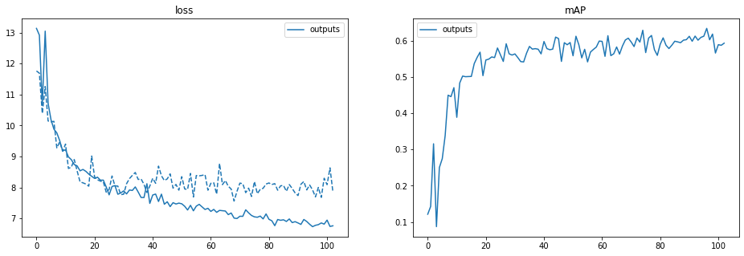
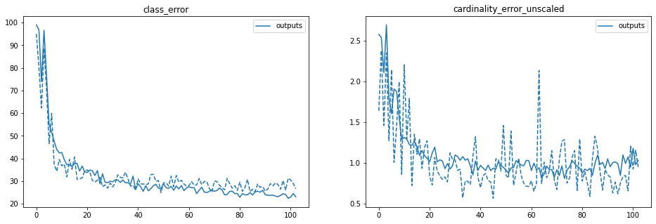
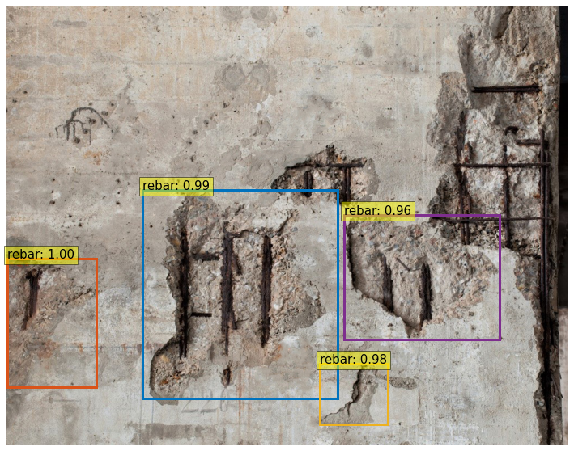
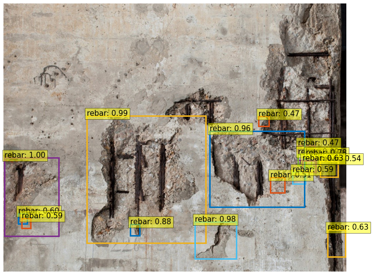

# Session 16.0 Capstone

PART I - QnA
-------------------------

- We take the encoded image (d x H/32 x W/32) and send it to Multi-Head Attention (FROM WHERE DO WE TAKE THIS ENCODED IMAGE?)

  The encoded image is the output of DETR’s encoder. 

  Image (ximg ∈ R3 x H x W) → 
  Resnet50 penultimate layer activation (f ∈ Rd' x H/32 x W/32 , d'=2048) →
  1x1 convolution (f ∈ Rd x H/32 x W/32, d=transformer inner dimension) + pos embeddings →
  Transformer encoder  (f ∈ Rd x H/32 x W/32, d=transformer inner dimension)

  The input to the ResNet50 is an image (ximg ∈ R3 x H x W) which generates a lower resolution activation map (f ∈ Rd' x H/32 x W/32) as the forward pass from the ResNet50 with fixed weights by discarding the last classification layer. This activation map along with sinusoidal positional encodings becomes the input to the DETR’s encoder. The output of the encoder is concatenated to form the image (eimg ∈ Rd x H/32 x W/32) which is sent to the Multi-Head Attention block.

- We also send dxN Box embeddings to the Multi-Head Attention. We do something here to generate NxMxH/32xW/32 maps. (WHAT DO WE DO HERE?)

  The output of the DETR’s decoder is bbox embeddings (d x N), where N = 100 is the fixed number of total instances of objects of all classes. For object detection where bbox predictions are required along with class labels, these embeddings go through FFN for final detection predictions. But for the case of panoptic segmentations, M multi-heads calculate attention scores for each N object embedding with the output of the encoder (eimg ∈ Rd x H/32 x W/32) described in the above answer.

- Then we concatenate these maps with Res5 Block (WHERE IS THIS COMING FROM?)

  Res5 block comes from the Resnet50 encoder’s Conv5 block which is 7x7x2048 i.e. input dimensions have been reduced by 32x. This matches the encoder output shape and concatenation can be performed.

- Then we perform the above steps (EXPLAIN THESE STEPS)

1. For segmentations that follow UNet kind of approach, the first part encodes and downsamples dimensions and increases channels (till the bottom of the ‘U’). The second part then does upsampling, and decreases channels.
2. The inputs to each upsampling step are the outputs of the previous step concatenated with the encoder output on the downsampling path. Adding the encoder outputs from downsampling path preserves finer level details to retain during upsampling. In this case the encoder is Resnet-50, and we concatenate Res5, Res4, and Res3 outputs as we move up on the other arm of ‘U’
3. Hence in the DETR modified for panoptic segmentation, as upsampling is performed, the corresponding activation from the downsampling path of the Resnet-50 encoder is concatenated 
4. Upsampling is followed by same padding convolution, normalization, ReLU
5. With 3 upsampling steps, the inputs which were at H/32,W/32 are resized to H/4,W/4 (i.e. 8x upsampling). At the same time the number of channels increases. A final extra convolution on the last step of the fpn-style cnn brings the number of channels to N. This is so that the output masks can be mutually exclusive in each of the N channels. Finally an argmax at every pixel across the stack of masks sets the pixel membership in the appropriate mask

  Plan for training:
  The training for this is split into two parts. 

1. In the first part, the DETR is trained to recognize the new type of objects and emit BB, like usual. Since the final ground truth is specified as segmentation masks, we will use cv2.getRectange(contour) API to convert that to bounding box ground truth
  - If the classid for stuff and concrete defect are overlapping with default COCO dataset, we will need to assign new ones. Then finetune the backbone as indicated [here](https://wandb.ai/veri/detr/reports/DETR-Panoptic-segmentation-on-Cityscapes-dataset--Vmlldzo2ODg3NjE) in Step 4.1
  - Once above model detects BB for concrete defects, we proceed to next training
2. The second part of the training, the DETR weights are frozen and we train the segmentation model for 25 epochs.
  - Queries corresponding to BB filtered with a high threshold (e.g. 0.85) from Step 1. are part of input to this Step 2.
  - The fpn-style cnn is trained to convert DETR object queries + Resnet-50 encodings to emit N channel output panoptic masks - one channel for each object query.
  - Essentially we are doing the second arm of the UNet with ground truth being N channel masks, and loss function to be focal or dice loss. We may use dice or focal (TBD), focal helps with focussing the loss on hard to classify pixels

PART II - BBOX Detection
-------------------------

### Data generation 

The  creates the required .json files for fine tuning detr as done in [Session 14 assignment](https://github.com/lavanyanemani96/TSAI-EVA-7.0/tree/master/14_DETR_End_to_end_Object_Detection_with_transformers) where we used [fine tune detr example colab file](https://colab.research.google.com/github/woctezuma/finetune-detr/blob/master/finetune_detr.ipynb) for bbox detection on our custom face-masks dataset. 

There are now four classes = ['N/A', 'rebar', 'crack', 'spall'] in our concrete defects dataset which is split in 60/20/20 ratio of train/val/test datasets. The notebook creates annotations consisting of ids, bbox, filenames for the train/val/test datasets.

### Fine tuning 

With the  and setting the first_class_index = 1, and the total number of classes = 4, we train our network for 100 epochs. The results are as follows: 

1. Metrics 

2. Prediction examples 

3. The training logs: 

Not using distributed mode
git:
  sha: e42a3b174d2325c28f82d7114138c755ac7c095a, status: has uncommited changes, branch: finetune

Namespace(lr=0.0001, lr_backbone=1e-05, batch_size=2, weight_decay=0.0001, epochs=100, lr_drop=200, clip_max_norm=0.1, frozen_weights=None, backbone='resnet50', dilation=False, position_embedding='sine', enc_layers=6, dec_layers=6, dim_feedforward=2048, hidden_dim=256, dropout=0.1, nheads=8, num_queries=100, pre_norm=False, masks=False, aux_loss=True, set_cost_class=1, set_cost_bbox=5, set_cost_giou=2, mask_loss_coef=1, dice_loss_coef=1, bbox_loss_coef=5, giou_loss_coef=2, eos_coef=0.1, num_classes=4, dataset_file='custom', coco_path='/media/App/tsai/capstone/', coco_panoptic_path=None, remove_difficult=False, output_dir='outputs', device='cuda', seed=42, resume='detr-r50_no-class-head.pth', start_epoch=0, eval=False, num_workers=2, world_size=1, dist_url='env://', distributed=False)
number of params: 41280009
loading annotations into memory...
Done (t=0.00s)
creating index...
index created!
loading annotations into memory...
Done (t=0.00s)
creating index...
index created!
Start training
Epoch: [0]  [  0/433]  eta: 0:09:45  lr: 0.000100  class_error: 100.00  loss: 38.7165 (38.7165)  loss_ce: 1.7760 (1.7760)  loss_bbox: 2.0710 (2.0710)  loss_giou: 2.4745 (2.4745)  loss_ce_0: 2.1780 (2.1780)  loss_bbox_0: 2.1927 (2.1927)  loss_giou_0: 2.3756 (2.3756)  loss_ce_1: 2.0230 (2.0230)  loss_bbox_1: 2.0824 (2.0824)  loss_giou_1: 2.4664 (2.4664)  loss_ce_2: 1.8718 (1.8718)  loss_bbox_2: 2.1031 (2.1031)  loss_giou_2: 2.4230 (2.4230)  loss_ce_3: 1.7873 (1.7873)  loss_bbox_3: 2.0547 (2.0547)  loss_giou_3: 2.4752 (2.4752)  loss_ce_4: 1.7862 (1.7862)  loss_bbox_4: 2.1462 (2.1462)  loss_giou_4: 2.4294 (2.4294)  loss_ce_unscaled: 1.7760 (1.7760)  class_error_unscaled: 100.0000 (100.0000)  loss_bbox_unscaled: 0.4142 (0.4142)  loss_giou_unscaled: 1.2372 (1.2372)  cardinality_error_unscaled: 78.0000 (78.0000)  loss_ce_0_unscaled: 2.1780 (2.1780)  loss_bbox_0_unscaled: 0.4385 (0.4385)  loss_giou_0_unscaled: 1.1878 (1.1878)  cardinality_error_0_unscaled: 95.0000 (95.0000)  loss_ce_1_unscaled: 2.0230 (2.0230)  loss_bbox_1_unscaled: 0.4165 (0.4165)  loss_giou_1_unscaled: 1.2332 (1.2332)  cardinality_error_1_unscaled: 95.0000 (95.0000)  loss_ce_2_unscaled: 1.8718 (1.8718)  loss_bbox_2_unscaled: 0.4206 (0.4206)  loss_giou_2_unscaled: 1.2115 (1.2115)  cardinality_error_2_unscaled: 91.0000 (91.0000)  loss_ce_3_unscaled: 1.7873 (1.7873)  loss_bbox_3_unscaled: 0.4109 (0.4109)  loss_giou_3_unscaled: 1.2376 (1.2376)  cardinality_error_3_unscaled: 82.0000 (82.0000)  loss_ce_4_unscaled: 1.7862 (1.7862)  loss_bbox_4_unscaled: 0.4292 (0.4292)  loss_giou_4_unscaled: 1.2147 (1.2147)  cardinality_error_4_unscaled: 81.5000 (81.5000)  time: 1.3524  data: 0.2859  max mem: 1908
Epoch: [0]  [432/433]  eta: 0:00:00  lr: 0.000100  class_error: 100.00  loss: 11.2537 (13.0446)  loss_ce: 0.4398 (0.5318)  loss_bbox: 0.4238 (0.6373)  loss_giou: 0.8808 (0.9193)  loss_ce_0: 0.4583 (0.6527)  loss_bbox_0: 0.5843 (0.7241)  loss_giou_0: 0.9327 (0.9824)  loss_ce_1: 0.4463 (0.6100)  loss_bbox_1: 0.4959 (0.6765)  loss_giou_1: 0.9074 (0.9351)  loss_ce_2: 0.4399 (0.5769)  loss_bbox_2: 0.5206 (0.6593)  loss_giou_2: 0.9370 (0.9340)  loss_ce_3: 0.4331 (0.5511)  loss_bbox_3: 0.4798 (0.6383)  loss_giou_3: 0.9674 (0.9244)  loss_ce_4: 0.4258 (0.5406)  loss_bbox_4: 0.4495 (0.6299)  loss_giou_4: 0.9738 (0.9212)  loss_ce_unscaled: 0.4398 (0.5318)  class_error_unscaled: 100.0000 (96.6260)  loss_bbox_unscaled: 0.0848 (0.1275)  loss_giou_unscaled: 0.4404 (0.4596)  cardinality_error_unscaled: 1.5000 (2.6963)  loss_ce_0_unscaled: 0.4583 (0.6527)  loss_bbox_0_unscaled: 0.1169 (0.1448)  loss_giou_0_unscaled: 0.4663 (0.4912)  cardinality_error_0_unscaled: 1.5000 (6.5000)  loss_ce_1_unscaled: 0.4463 (0.6100)  loss_bbox_1_unscaled: 0.0992 (0.1353)  loss_giou_1_unscaled: 0.4537 (0.4675)  cardinality_error_1_unscaled: 1.5000 (4.7587)  loss_ce_2_unscaled: 0.4399 (0.5769)  loss_bbox_2_unscaled: 0.1041 (0.1319)  loss_giou_2_unscaled: 0.4685 (0.4670)  cardinality_error_2_unscaled: 1.5000 (3.8360)  loss_ce_3_unscaled: 0.4331 (0.5511)  loss_bbox_3_unscaled: 0.0960 (0.1277)  loss_giou_3_unscaled: 0.4837 (0.4622)  cardinality_error_3_unscaled: 1.5000 (3.1270)  loss_ce_4_unscaled: 0.4258 (0.5406)  loss_bbox_4_unscaled: 0.0899 (0.1260)  loss_giou_4_unscaled: 0.4869 (0.4606)  cardinality_error_4_unscaled: 1.5000 (2.8210)  time: 0.2161  data: 0.0086  max mem: 3816
Epoch: [0] Total time: 0:01:36 (0.2226 s / it)
Averaged stats: lr: 0.000100  class_error: 100.00  loss: 11.2537 (13.0446)  loss_ce: 0.4398 (0.5318)  loss_bbox: 0.4238 (0.6373)  loss_giou: 0.8808 (0.9193)  loss_ce_0: 0.4583 (0.6527)  loss_bbox_0: 0.5843 (0.7241)  loss_giou_0: 0.9327 (0.9824)  loss_ce_1: 0.4463 (0.6100)  loss_bbox_1: 0.4959 (0.6765)  loss_giou_1: 0.9074 (0.9351)  loss_ce_2: 0.4399 (0.5769)  loss_bbox_2: 0.5206 (0.6593)  loss_giou_2: 0.9370 (0.9340)  loss_ce_3: 0.4331 (0.5511)  loss_bbox_3: 0.4798 (0.6383)  loss_giou_3: 0.9674 (0.9244)  loss_ce_4: 0.4258 (0.5406)  loss_bbox_4: 0.4495 (0.6299)  loss_giou_4: 0.9738 (0.9212)  loss_ce_unscaled: 0.4398 (0.5318)  class_error_unscaled: 100.0000 (96.6260)  loss_bbox_unscaled: 0.0848 (0.1275)  loss_giou_unscaled: 0.4404 (0.4596)  cardinality_error_unscaled: 1.5000 (2.6963)  loss_ce_0_unscaled: 0.4583 (0.6527)  loss_bbox_0_unscaled: 0.1169 (0.1448)  loss_giou_0_unscaled: 0.4663 (0.4912)  cardinality_error_0_unscaled: 1.5000 (6.5000)  loss_ce_1_unscaled: 0.4463 (0.6100)  loss_bbox_1_unscaled: 0.0992 (0.1353)  loss_giou_1_unscaled: 0.4537 (0.4675)  cardinality_error_1_unscaled: 1.5000 (4.7587)  loss_ce_2_unscaled: 0.4399 (0.5769)  loss_bbox_2_unscaled: 0.1041 (0.1319)  loss_giou_2_unscaled: 0.4685 (0.4670)  cardinality_error_2_unscaled: 1.5000 (3.8360)  loss_ce_3_unscaled: 0.4331 (0.5511)  loss_bbox_3_unscaled: 0.0960 (0.1277)  loss_giou_3_unscaled: 0.4837 (0.4622)  cardinality_error_3_unscaled: 1.5000 (3.1270)  loss_ce_4_unscaled: 0.4258 (0.5406)  loss_bbox_4_unscaled: 0.0899 (0.1260)  loss_giou_4_unscaled: 0.4869 (0.4606)  cardinality_error_4_unscaled: 1.5000 (2.8210)
Test:  [  0/144]  eta: 0:01:01  class_error: 100.00  loss: 4.3274 (4.3274)  loss_ce: 0.2492 (0.2492)  loss_bbox: 0.2259 (0.2259)  loss_giou: 0.1688 (0.1688)  loss_ce_0: 0.3042 (0.3042)  loss_bbox_0: 0.3165 (0.3165)  loss_giou_0: 0.1909 (0.1909)  loss_ce_1: 0.2987 (0.2987)  loss_bbox_1: 0.3559 (0.3559)  loss_giou_1: 0.2027 (0.2027)  loss_ce_2: 0.2784 (0.2784)  loss_bbox_2: 0.2711 (0.2711)  loss_giou_2: 0.1671 (0.1671)  loss_ce_3: 0.2859 (0.2859)  loss_bbox_3: 0.2208 (0.2208)  loss_giou_3: 0.1490 (0.1490)  loss_ce_4: 0.2570 (0.2570)  loss_bbox_4: 0.2320 (0.2320)  loss_giou_4: 0.1534 (0.1534)  loss_ce_unscaled: 0.2492 (0.2492)  class_error_unscaled: 100.0000 (100.0000)  loss_bbox_unscaled: 0.0452 (0.0452)  loss_giou_unscaled: 0.0844 (0.0844)  cardinality_error_unscaled: 1.0000 (1.0000)  loss_ce_0_unscaled: 0.3042 (0.3042)  loss_bbox_0_unscaled: 0.0633 (0.0633)  loss_giou_0_unscaled: 0.0954 (0.0954)  cardinality_error_0_unscaled: 1.0000 (1.0000)  loss_ce_1_unscaled: 0.2987 (0.2987)  loss_bbox_1_unscaled: 0.0712 (0.0712)  loss_giou_1_unscaled: 0.1014 (0.1014)  cardinality_error_1_unscaled: 1.0000 (1.0000)  loss_ce_2_unscaled: 0.2784 (0.2784)  loss_bbox_2_unscaled: 0.0542 (0.0542)  loss_giou_2_unscaled: 0.0836 (0.0836)  cardinality_error_2_unscaled: 0.5000 (0.5000)  loss_ce_3_unscaled: 0.2859 (0.2859)  loss_bbox_3_unscaled: 0.0442 (0.0442)  loss_giou_3_unscaled: 0.0745 (0.0745)  cardinality_error_3_unscaled: 0.5000 (0.5000)  loss_ce_4_unscaled: 0.2570 (0.2570)  loss_bbox_4_unscaled: 0.0464 (0.0464)  loss_giou_4_unscaled: 0.0767 (0.0767)  cardinality_error_4_unscaled: 2.5000 (2.5000)  time: 0.4242  data: 0.3203  max mem: 3816
Test:  [100/144]  eta: 0:00:05  class_error: 100.00  loss: 12.5301 (11.6386)  loss_ce: 0.4102 (0.4501)  loss_bbox: 0.5897 (0.5354)  loss_giou: 0.7916 (0.9390)  loss_ce_0: 0.4318 (0.4850)  loss_bbox_0: 0.7710 (0.6322)  loss_giou_0: 0.8704 (0.9249)  loss_ce_1: 0.4320 (0.4806)  loss_bbox_1: 0.6351 (0.5845)  loss_giou_1: 0.8865 (0.8760)  loss_ce_2: 0.4217 (0.4782)  loss_bbox_2: 0.5826 (0.5362)  loss_giou_2: 0.7434 (0.8945)  loss_ce_3: 0.4231 (0.4609)  loss_bbox_3: 0.5769 (0.5370)  loss_giou_3: 0.7724 (0.9232)  loss_ce_4: 0.4226 (0.4559)  loss_bbox_4: 0.5721 (0.5228)  loss_giou_4: 0.7977 (0.9223)  loss_ce_unscaled: 0.4102 (0.4501)  class_error_unscaled: 100.0000 (88.3086)  loss_bbox_unscaled: 0.1179 (0.1071)  loss_giou_unscaled: 0.3958 (0.4695)  cardinality_error_unscaled: 1.5000 (2.2178)  loss_ce_0_unscaled: 0.4318 (0.4850)  loss_bbox_0_unscaled: 0.1542 (0.1264)  loss_giou_0_unscaled: 0.4352 (0.4625)  cardinality_error_0_unscaled: 1.5000 (1.6337)  loss_ce_1_unscaled: 0.4320 (0.4806)  loss_bbox_1_unscaled: 0.1270 (0.1169)  loss_giou_1_unscaled: 0.4433 (0.4380)  cardinality_error_1_unscaled: 1.5000 (1.6238)  loss_ce_2_unscaled: 0.4217 (0.4782)  loss_bbox_2_unscaled: 0.1165 (0.1072)  loss_giou_2_unscaled: 0.3717 (0.4473)  cardinality_error_2_unscaled: 1.5000 (1.7574)  loss_ce_3_unscaled: 0.4231 (0.4609)  loss_bbox_3_unscaled: 0.1154 (0.1074)  loss_giou_3_unscaled: 0.3862 (0.4616)  cardinality_error_3_unscaled: 1.5000 (1.7178)  loss_ce_4_unscaled: 0.4226 (0.4559)  loss_bbox_4_unscaled: 0.1144 (0.1046)  loss_giou_4_unscaled: 0.3989 (0.4611)  cardinality_error_4_unscaled: 1.5000 (2.1337)  time: 0.1130  data: 0.0106  max mem: 3816
Test:  [143/144]  eta: 0:00:00  class_error: 100.00  loss: 7.7727 (11.2568)  loss_ce: 0.3570 (0.4561)  loss_bbox: 0.3165 (0.5121)  loss_giou: 0.6371 (0.9068)  loss_ce_0: 0.4180 (0.4928)  loss_bbox_0: 0.3612 (0.5813)  loss_giou_0: 0.4939 (0.8808)  loss_ce_1: 0.4001 (0.4866)  loss_bbox_1: 0.3347 (0.5451)  loss_giou_1: 0.5564 (0.8411)  loss_ce_2: 0.4161 (0.4858)  loss_bbox_2: 0.3143 (0.4991)  loss_giou_2: 0.5451 (0.8631)  loss_ce_3: 0.3850 (0.4697)  loss_bbox_3: 0.3362 (0.5050)  loss_giou_3: 0.5877 (0.8863)  loss_ce_4: 0.3788 (0.4621)  loss_bbox_4: 0.3231 (0.4979)  loss_giou_4: 0.5337 (0.8851)  loss_ce_unscaled: 0.3570 (0.4561)  class_error_unscaled: 100.0000 (88.5899)  loss_bbox_unscaled: 0.0633 (0.1024)  loss_giou_unscaled: 0.3185 (0.4534)  cardinality_error_unscaled: 1.5000 (2.3507)  loss_ce_0_unscaled: 0.4180 (0.4928)  loss_bbox_0_unscaled: 0.0722 (0.1163)  loss_giou_0_unscaled: 0.2470 (0.4404)  cardinality_error_0_unscaled: 1.5000 (1.6944)  loss_ce_1_unscaled: 0.4001 (0.4866)  loss_bbox_1_unscaled: 0.0669 (0.1090)  loss_giou_1_unscaled: 0.2782 (0.4206)  cardinality_error_1_unscaled: 1.5000 (1.6736)  loss_ce_2_unscaled: 0.4161 (0.4858)  loss_bbox_2_unscaled: 0.0629 (0.0998)  loss_giou_2_unscaled: 0.2726 (0.4316)  cardinality_error_2_unscaled: 1.5000 (1.8264)  loss_ce_3_unscaled: 0.3850 (0.4697)  loss_bbox_3_unscaled: 0.0672 (0.1010)  loss_giou_3_unscaled: 0.2939 (0.4431)  cardinality_error_3_unscaled: 1.5000 (1.8160)  loss_ce_4_unscaled: 0.3788 (0.4621)  loss_bbox_4_unscaled: 0.0646 (0.0996)  loss_giou_4_unscaled: 0.2668 (0.4426)  cardinality_error_4_unscaled: 1.5000 (2.2986)  time: 0.1106  data: 0.0120  max mem: 3816
Test: Total time: 0:00:16 (0.1140 s / it)
Averaged stats: class_error: 100.00  loss: 7.7727 (11.2568)  loss_ce: 0.3570 (0.4561)  loss_bbox: 0.3165 (0.5121)  loss_giou: 0.6371 (0.9068)  loss_ce_0: 0.4180 (0.4928)  loss_bbox_0: 0.3612 (0.5813)  loss_giou_0: 0.4939 (0.8808)  loss_ce_1: 0.4001 (0.4866)  loss_bbox_1: 0.3347 (0.5451)  loss_giou_1: 0.5564 (0.8411)  loss_ce_2: 0.4161 (0.4858)  loss_bbox_2: 0.3143 (0.4991)  loss_giou_2: 0.5451 (0.8631)  loss_ce_3: 0.3850 (0.4697)  loss_bbox_3: 0.3362 (0.5050)  loss_giou_3: 0.5877 (0.8863)  loss_ce_4: 0.3788 (0.4621)  loss_bbox_4: 0.3231 (0.4979)  loss_giou_4: 0.5337 (0.8851)  loss_ce_unscaled: 0.3570 (0.4561)  class_error_unscaled: 100.0000 (88.5899)  loss_bbox_unscaled: 0.0633 (0.1024)  loss_giou_unscaled: 0.3185 (0.4534)  cardinality_error_unscaled: 1.5000 (2.3507)  loss_ce_0_unscaled: 0.4180 (0.4928)  loss_bbox_0_unscaled: 0.0722 (0.1163)  loss_giou_0_unscaled: 0.2470 (0.4404)  cardinality_error_0_unscaled: 1.5000 (1.6944)  loss_ce_1_unscaled: 0.4001 (0.4866)  loss_bbox_1_unscaled: 0.0669 (0.1090)  loss_giou_1_unscaled: 0.2782 (0.4206)  cardinality_error_1_unscaled: 1.5000 (1.6736)  loss_ce_2_unscaled: 0.4161 (0.4858)  loss_bbox_2_unscaled: 0.0629 (0.0998)  loss_giou_2_unscaled: 0.2726 (0.4316)  cardinality_error_2_unscaled: 1.5000 (1.8264)  loss_ce_3_unscaled: 0.3850 (0.4697)  loss_bbox_3_unscaled: 0.0672 (0.1010)  loss_giou_3_unscaled: 0.2939 (0.4431)  cardinality_error_3_unscaled: 1.5000 (1.8160)  loss_ce_4_unscaled: 0.3788 (0.4621)  loss_bbox_4_unscaled: 0.0646 (0.0996)  loss_giou_4_unscaled: 0.2668 (0.4426)  cardinality_error_4_unscaled: 1.5000 (2.2986)
Accumulating evaluation results...
DONE (t=0.35s).
IoU metric: bbox
 Average Precision  (AP) @[ IoU=0.50:0.95 | area=   all | maxDets=100 ] = 0.062
 Average Precision  (AP) @[ IoU=0.50      | area=   all | maxDets=100 ] = 0.087
 Average Precision  (AP) @[ IoU=0.75      | area=   all | maxDets=100 ] = 0.067
 Average Precision  (AP) @[ IoU=0.50:0.95 | area= small | maxDets=100 ] = 0.059
 Average Precision  (AP) @[ IoU=0.50:0.95 | area=medium | maxDets=100 ] = 0.223
 Average Precision  (AP) @[ IoU=0.50:0.95 | area= large | maxDets=100 ] = 0.078
 Average Recall     (AR) @[ IoU=0.50:0.95 | area=   all | maxDets=  1 ] = 0.229
 Average Recall     (AR) @[ IoU=0.50:0.95 | area=   all | maxDets= 10 ] = 0.327
 Average Recall     (AR) @[ IoU=0.50:0.95 | area=   all | maxDets=100 ] = 0.376
 Average Recall     (AR) @[ IoU=0.50:0.95 | area= small | maxDets=100 ] = 0.089
 Average Recall     (AR) @[ IoU=0.50:0.95 | area=medium | maxDets=100 ] = 0.364
 Average Recall     (AR) @[ IoU=0.50:0.95 | area= large | maxDets=100 ] = 0.646
Epoch: [1]  [  0/433]  eta: 0:03:52  lr: 0.000100  class_error: 100.00  loss: 17.1395 (17.1395)  loss_ce: 0.8161 (0.8161)  loss_bbox: 0.5661 (0.5661)  loss_giou: 1.7719 (1.7719)  loss_ce_0: 0.7324 (0.7324)  loss_bbox_0: 0.7521 (0.7521)  loss_giou_0: 1.3168 (1.3168)  loss_ce_1: 0.7739 (0.7739)  loss_bbox_1: 0.8382 (0.8382)  loss_giou_1: 1.2772 (1.2772)  loss_ce_2: 0.7911 (0.7911)  loss_bbox_2: 0.4996 (0.4996)  loss_giou_2: 1.3507 (1.3507)  loss_ce_3: 0.8062 (0.8062)  loss_bbox_3: 0.4441 (0.4441)  loss_giou_3: 1.5667 (1.5667)  loss_ce_4: 0.7998 (0.7998)  loss_bbox_4: 0.4906 (0.4906)  loss_giou_4: 1.5461 (1.5461)  loss_ce_unscaled: 0.8161 (0.8161)  class_error_unscaled: 100.0000 (100.0000)  loss_bbox_unscaled: 0.1132 (0.1132)  loss_giou_unscaled: 0.8859 (0.8859)  cardinality_error_unscaled: 2.5000 (2.5000)  loss_ce_0_unscaled: 0.7324 (0.7324)  loss_bbox_0_unscaled: 0.1504 (0.1504)  loss_giou_0_unscaled: 0.6584 (0.6584)  cardinality_error_0_unscaled: 2.5000 (2.5000)  loss_ce_1_unscaled: 0.7739 (0.7739)  loss_bbox_1_unscaled: 0.1676 (0.1676)  loss_giou_1_unscaled: 0.6386 (0.6386)  cardinality_error_1_unscaled: 2.5000 (2.5000)  loss_ce_2_unscaled: 0.7911 (0.7911)  loss_bbox_2_unscaled: 0.0999 (0.0999)  loss_giou_2_unscaled: 0.6753 (0.6753)  cardinality_error_2_unscaled: 2.5000 (2.5000)  loss_ce_3_unscaled: 0.8062 (0.8062)  loss_bbox_3_unscaled: 0.0888 (0.0888)  loss_giou_3_unscaled: 0.7833 (0.7833)  cardinality_error_3_unscaled: 2.5000 (2.5000)  loss_ce_4_unscaled: 0.7998 (0.7998)  loss_bbox_4_unscaled: 0.0981 (0.0981)  loss_giou_4_unscaled: 0.7731 (0.7731)  cardinality_error_4_unscaled: 2.5000 (2.5000)  time: 0.5379  data: 0.3049  max mem: 3816
Epoch: [1]  [432/433]  eta: 0:00:00  lr: 0.000100  class_error: 85.71  loss: 11.3493 (10.7176)  loss_ce: 0.3211 (0.3980)  loss_bbox: 0.3932 (0.4978)  loss_giou: 0.9518 (0.8611)  loss_ce_0: 0.3410 (0.4543)  loss_bbox_0: 0.5466 (0.5494)  loss_giou_0: 0.9795 (0.8816)  loss_ce_1: 0.3295 (0.4353)  loss_bbox_1: 0.4863 (0.5196)  loss_giou_1: 0.9987 (0.8456)  loss_ce_2: 0.3387 (0.4199)  loss_bbox_2: 0.5062 (0.4985)  loss_giou_2: 1.0599 (0.8574)  loss_ce_3: 0.3230 (0.4045)  loss_bbox_3: 0.4551 (0.4881)  loss_giou_3: 0.9917 (0.8537)  loss_ce_4: 0.3312 (0.3988)  loss_bbox_4: 0.4114 (0.4942)  loss_giou_4: 0.9015 (0.8598)  loss_ce_unscaled: 0.3211 (0.3980)  class_error_unscaled: 50.0000 (76.1834)  loss_bbox_unscaled: 0.0786 (0.0996)  loss_giou_unscaled: 0.4759 (0.4305)  cardinality_error_unscaled: 1.5000 (1.7783)  loss_ce_0_unscaled: 0.3410 (0.4543)  loss_bbox_0_unscaled: 0.1093 (0.1099)  loss_giou_0_unscaled: 0.4897 (0.4408)  cardinality_error_0_unscaled: 1.0000 (1.7090)  loss_ce_1_unscaled: 0.3295 (0.4353)  loss_bbox_1_unscaled: 0.0973 (0.1039)  loss_giou_1_unscaled: 0.4993 (0.4228)  cardinality_error_1_unscaled: 1.5000 (1.6836)  loss_ce_2_unscaled: 0.3387 (0.4199)  loss_bbox_2_unscaled: 0.1012 (0.0997)  loss_giou_2_unscaled: 0.5299 (0.4287)  cardinality_error_2_unscaled: 1.5000 (1.5993)  loss_ce_3_unscaled: 0.3230 (0.4045)  loss_bbox_3_unscaled: 0.0910 (0.0976)  loss_giou_3_unscaled: 0.4958 (0.4269)  cardinality_error_3_unscaled: 2.0000 (1.6905)  loss_ce_4_unscaled: 0.3312 (0.3988)  loss_bbox_4_unscaled: 0.0823 (0.0988)  loss_giou_4_unscaled: 0.4507 (0.4299)  cardinality_error_4_unscaled: 2.0000 (1.6559)  time: 0.2186  data: 0.0086  max mem: 3816
Epoch: [1] Total time: 0:01:35 (0.2194 s / it)
Averaged stats: lr: 0.000100  class_error: 85.71  loss: 11.3493 (10.7176)  loss_ce: 0.3211 (0.3980)  loss_bbox: 0.3932 (0.4978)  loss_giou: 0.9518 (0.8611)  loss_ce_0: 0.3410 (0.4543)  loss_bbox_0: 0.5466 (0.5494)  loss_giou_0: 0.9795 (0.8816)  loss_ce_1: 0.3295 (0.4353)  loss_bbox_1: 0.4863 (0.5196)  loss_giou_1: 0.9987 (0.8456)  loss_ce_2: 0.3387 (0.4199)  loss_bbox_2: 0.5062 (0.4985)  loss_giou_2: 1.0599 (0.8574)  loss_ce_3: 0.3230 (0.4045)  loss_bbox_3: 0.4551 (0.4881)  loss_giou_3: 0.9917 (0.8537)  loss_ce_4: 0.3312 (0.3988)  loss_bbox_4: 0.4114 (0.4942)  loss_giou_4: 0.9015 (0.8598)  loss_ce_unscaled: 0.3211 (0.3980)  class_error_unscaled: 50.0000 (76.1834)  loss_bbox_unscaled: 0.0786 (0.0996)  loss_giou_unscaled: 0.4759 (0.4305)  cardinality_error_unscaled: 1.5000 (1.7783)  loss_ce_0_unscaled: 0.3410 (0.4543)  loss_bbox_0_unscaled: 0.1093 (0.1099)  loss_giou_0_unscaled: 0.4897 (0.4408)  cardinality_error_0_unscaled: 1.0000 (1.7090)  loss_ce_1_unscaled: 0.3295 (0.4353)  loss_bbox_1_unscaled: 0.0973 (0.1039)  loss_giou_1_unscaled: 0.4993 (0.4228)  cardinality_error_1_unscaled: 1.5000 (1.6836)  loss_ce_2_unscaled: 0.3387 (0.4199)  loss_bbox_2_unscaled: 0.1012 (0.0997)  loss_giou_2_unscaled: 0.5299 (0.4287)  cardinality_error_2_unscaled: 1.5000 (1.5993)  loss_ce_3_unscaled: 0.3230 (0.4045)  loss_bbox_3_unscaled: 0.0910 (0.0976)  loss_giou_3_unscaled: 0.4958 (0.4269)  cardinality_error_3_unscaled: 2.0000 (1.6905)  loss_ce_4_unscaled: 0.3312 (0.3988)  loss_bbox_4_unscaled: 0.0823 (0.0988)  loss_giou_4_unscaled: 0.4507 (0.4299)  cardinality_error_4_unscaled: 2.0000 (1.6559)
Test:  [  0/144]  eta: 0:01:03  class_error: 100.00  loss: 7.8560 (7.8560)  loss_ce: 0.2951 (0.2951)  loss_bbox: 0.4410 (0.4410)  loss_giou: 0.3565 (0.3565)  loss_ce_0: 0.3523 (0.3523)  loss_bbox_0: 0.7756 (0.7756)  loss_giou_0: 0.6025 (0.6025)  loss_ce_1: 0.3404 (0.3404)  loss_bbox_1: 0.7069 (0.7069)  loss_giou_1: 0.4149 (0.4149)  loss_ce_2: 0.2845 (0.2845)  loss_bbox_2: 0.5246 (0.5246)  loss_giou_2: 0.4079 (0.4079)  loss_ce_3: 0.2851 (0.2851)  loss_bbox_3: 0.4990 (0.4990)  loss_giou_3: 0.2930 (0.2930)  loss_ce_4: 0.2963 (0.2963)  loss_bbox_4: 0.5885 (0.5885)  loss_giou_4: 0.3919 (0.3919)  loss_ce_unscaled: 0.2951 (0.2951)  class_error_unscaled: 100.0000 (100.0000)  loss_bbox_unscaled: 0.0882 (0.0882)  loss_giou_unscaled: 0.1782 (0.1782)  cardinality_error_unscaled: 1.5000 (1.5000)  loss_ce_0_unscaled: 0.3523 (0.3523)  loss_bbox_0_unscaled: 0.1551 (0.1551)  loss_giou_0_unscaled: 0.3012 (0.3012)  cardinality_error_0_unscaled: 1.0000 (1.0000)  loss_ce_1_unscaled: 0.3404 (0.3404)  loss_bbox_1_unscaled: 0.1414 (0.1414)  loss_giou_1_unscaled: 0.2075 (0.2075)  cardinality_error_1_unscaled: 0.5000 (0.5000)  loss_ce_2_unscaled: 0.2845 (0.2845)  loss_bbox_2_unscaled: 0.1049 (0.1049)  loss_giou_2_unscaled: 0.2039 (0.2039)  cardinality_error_2_unscaled: 1.0000 (1.0000)  loss_ce_3_unscaled: 0.2851 (0.2851)  loss_bbox_3_unscaled: 0.0998 (0.0998)  loss_giou_3_unscaled: 0.1465 (0.1465)  cardinality_error_3_unscaled: 2.0000 (2.0000)  loss_ce_4_unscaled: 0.2963 (0.2963)  loss_bbox_4_unscaled: 0.1177 (0.1177)  loss_giou_4_unscaled: 0.1960 (0.1960)  cardinality_error_4_unscaled: 1.5000 (1.5000)  time: 0.4444  data: 0.3405  max mem: 3816
Test:  [100/144]  eta: 0:00:04  class_error: 50.00  loss: 9.9930 (10.4061)  loss_ce: 0.3393 (0.3508)  loss_bbox: 0.5339 (0.4806)  loss_giou: 0.7619 (0.8619)  loss_ce_0: 0.3720 (0.4044)  loss_bbox_0: 0.6108 (0.5473)  loss_giou_0: 0.9297 (0.9282)  loss_ce_1: 0.3283 (0.3830)  loss_bbox_1: 0.5863 (0.4951)  loss_giou_1: 0.7967 (0.8765)  loss_ce_2: 0.3186 (0.3747)  loss_bbox_2: 0.5550 (0.4831)  loss_giou_2: 0.7741 (0.8492)  loss_ce_3: 0.3125 (0.3534)  loss_bbox_3: 0.5165 (0.4864)  loss_giou_3: 0.7576 (0.8573)  loss_ce_4: 0.3361 (0.3512)  loss_bbox_4: 0.4986 (0.4729)  loss_giou_4: 0.7828 (0.8503)  loss_ce_unscaled: 0.3393 (0.3508)  class_error_unscaled: 75.0000 (70.0153)  loss_bbox_unscaled: 0.1068 (0.0961)  loss_giou_unscaled: 0.3809 (0.4309)  cardinality_error_unscaled: 1.0000 (1.2624)  loss_ce_0_unscaled: 0.3720 (0.4044)  loss_bbox_0_unscaled: 0.1222 (0.1095)  loss_giou_0_unscaled: 0.4648 (0.4641)  cardinality_error_0_unscaled: 1.0000 (1.5792)  loss_ce_1_unscaled: 0.3283 (0.3830)  loss_bbox_1_unscaled: 0.1173 (0.0990)  loss_giou_1_unscaled: 0.3983 (0.4382)  cardinality_error_1_unscaled: 1.0000 (1.2525)  loss_ce_2_unscaled: 0.3186 (0.3747)  loss_bbox_2_unscaled: 0.1110 (0.0966)  loss_giou_2_unscaled: 0.3871 (0.4246)  cardinality_error_2_unscaled: 1.0000 (1.3366)  loss_ce_3_unscaled: 0.3125 (0.3534)  loss_bbox_3_unscaled: 0.1033 (0.0973)  loss_giou_3_unscaled: 0.3788 (0.4286)  cardinality_error_3_unscaled: 1.0000 (1.3317)  loss_ce_4_unscaled: 0.3361 (0.3512)  loss_bbox_4_unscaled: 0.0997 (0.0946)  loss_giou_4_unscaled: 0.3914 (0.4251)  cardinality_error_4_unscaled: 1.0000 (1.2178)  time: 0.1104  data: 0.0108  max mem: 3816
Test:  [143/144]  eta: 0:00:00  class_error: 50.00  loss: 7.0159 (10.1446)  loss_ce: 0.2494 (0.3580)  loss_bbox: 0.2953 (0.4600)  loss_giou: 0.5327 (0.8370)  loss_ce_0: 0.3171 (0.4186)  loss_bbox_0: 0.3438 (0.5256)  loss_giou_0: 0.6759 (0.9037)  loss_ce_1: 0.2738 (0.3884)  loss_bbox_1: 0.3456 (0.4740)  loss_giou_1: 0.4482 (0.8461)  loss_ce_2: 0.2638 (0.3804)  loss_bbox_2: 0.2437 (0.4555)  loss_giou_2: 0.4963 (0.8187)  loss_ce_3: 0.2537 (0.3600)  loss_bbox_3: 0.3021 (0.4577)  loss_giou_3: 0.4633 (0.8263)  loss_ce_4: 0.2588 (0.3574)  loss_bbox_4: 0.3115 (0.4521)  loss_giou_4: 0.5027 (0.8250)  loss_ce_unscaled: 0.2494 (0.3580)  class_error_unscaled: 66.6667 (70.1207)  loss_bbox_unscaled: 0.0591 (0.0920)  loss_giou_unscaled: 0.2663 (0.4185)  cardinality_error_unscaled: 0.5000 (1.2708)  loss_ce_0_unscaled: 0.3171 (0.4186)  loss_bbox_0_unscaled: 0.0688 (0.1051)  loss_giou_0_unscaled: 0.3379 (0.4518)  cardinality_error_0_unscaled: 1.5000 (1.6667)  loss_ce_1_unscaled: 0.2738 (0.3884)  loss_bbox_1_unscaled: 0.0691 (0.0948)  loss_giou_1_unscaled: 0.2241 (0.4230)  cardinality_error_1_unscaled: 1.0000 (1.3160)  loss_ce_2_unscaled: 0.2638 (0.3804)  loss_bbox_2_unscaled: 0.0487 (0.0911)  loss_giou_2_unscaled: 0.2481 (0.4094)  cardinality_error_2_unscaled: 1.0000 (1.3889)  loss_ce_3_unscaled: 0.2537 (0.3600)  loss_bbox_3_unscaled: 0.0604 (0.0915)  loss_giou_3_unscaled: 0.2317 (0.4132)  cardinality_error_3_unscaled: 1.0000 (1.3299)  loss_ce_4_unscaled: 0.2588 (0.3574)  loss_bbox_4_unscaled: 0.0623 (0.0904)  loss_giou_4_unscaled: 0.2513 (0.4125)  cardinality_error_4_unscaled: 0.5000 (1.2118)  time: 0.1074  data: 0.0098  max mem: 3816
Test: Total time: 0:00:16 (0.1129 s / it)
Averaged stats: class_error: 50.00  loss: 7.0159 (10.1446)  loss_ce: 0.2494 (0.3580)  loss_bbox: 0.2953 (0.4600)  loss_giou: 0.5327 (0.8370)  loss_ce_0: 0.3171 (0.4186)  loss_bbox_0: 0.3438 (0.5256)  loss_giou_0: 0.6759 (0.9037)  loss_ce_1: 0.2738 (0.3884)  loss_bbox_1: 0.3456 (0.4740)  loss_giou_1: 0.4482 (0.8461)  loss_ce_2: 0.2638 (0.3804)  loss_bbox_2: 0.2437 (0.4555)  loss_giou_2: 0.4963 (0.8187)  loss_ce_3: 0.2537 (0.3600)  loss_bbox_3: 0.3021 (0.4577)  loss_giou_3: 0.4633 (0.8263)  loss_ce_4: 0.2588 (0.3574)  loss_bbox_4: 0.3115 (0.4521)  loss_giou_4: 0.5027 (0.8250)  loss_ce_unscaled: 0.2494 (0.3580)  class_error_unscaled: 66.6667 (70.1207)  loss_bbox_unscaled: 0.0591 (0.0920)  loss_giou_unscaled: 0.2663 (0.4185)  cardinality_error_unscaled: 0.5000 (1.2708)  loss_ce_0_unscaled: 0.3171 (0.4186)  loss_bbox_0_unscaled: 0.0688 (0.1051)  loss_giou_0_unscaled: 0.3379 (0.4518)  cardinality_error_0_unscaled: 1.5000 (1.6667)  loss_ce_1_unscaled: 0.2738 (0.3884)  loss_bbox_1_unscaled: 0.0691 (0.0948)  loss_giou_1_unscaled: 0.2241 (0.4230)  cardinality_error_1_unscaled: 1.0000 (1.3160)  loss_ce_2_unscaled: 0.2638 (0.3804)  loss_bbox_2_unscaled: 0.0487 (0.0911)  loss_giou_2_unscaled: 0.2481 (0.4094)  cardinality_error_2_unscaled: 1.0000 (1.3889)  loss_ce_3_unscaled: 0.2537 (0.3600)  loss_bbox_3_unscaled: 0.0604 (0.0915)  loss_giou_3_unscaled: 0.2317 (0.4132)  cardinality_error_3_unscaled: 1.0000 (1.3299)  loss_ce_4_unscaled: 0.2588 (0.3574)  loss_bbox_4_unscaled: 0.0623 (0.0904)  loss_giou_4_unscaled: 0.2513 (0.4125)  cardinality_error_4_unscaled: 0.5000 (1.2118)
Accumulating evaluation results...
DONE (t=0.34s).
IoU metric: bbox
 Average Precision  (AP) @[ IoU=0.50:0.95 | area=   all | maxDets=100 ] = 0.144
 Average Precision  (AP) @[ IoU=0.50      | area=   all | maxDets=100 ] = 0.250
 Average Precision  (AP) @[ IoU=0.75      | area=   all | maxDets=100 ] = 0.146
 Average Precision  (AP) @[ IoU=0.50:0.95 | area= small | maxDets=100 ] = 0.085
 Average Precision  (AP) @[ IoU=0.50:0.95 | area=medium | maxDets=100 ] = 0.222
 Average Precision  (AP) @[ IoU=0.50:0.95 | area= large | maxDets=100 ] = 0.207
 Average Recall     (AR) @[ IoU=0.50:0.95 | area=   all | maxDets=  1 ] = 0.251
 Average Recall     (AR) @[ IoU=0.50:0.95 | area=   all | maxDets= 10 ] = 0.364
 Average Recall     (AR) @[ IoU=0.50:0.95 | area=   all | maxDets=100 ] = 0.411
 Average Recall     (AR) @[ IoU=0.50:0.95 | area= small | maxDets=100 ] = 0.118
 Average Recall     (AR) @[ IoU=0.50:0.95 | area=medium | maxDets=100 ] = 0.424
 Average Recall     (AR) @[ IoU=0.50:0.95 | area= large | maxDets=100 ] = 0.652
Epoch: [2]  [  0/433]  eta: 0:03:29  lr: 0.000100  class_error: 66.67  loss: 7.8639 (7.8639)  loss_ce: 0.2746 (0.2746)  loss_bbox: 0.2922 (0.2922)  loss_giou: 0.6832 (0.6832)  loss_ce_0: 0.3132 (0.3132)  loss_bbox_0: 0.3009 (0.3009)  loss_giou_0: 0.7860 (0.7860)  loss_ce_1: 0.2679 (0.2679)  loss_bbox_1: 0.3502 (0.3502)  loss_giou_1: 0.6695 (0.6695)  loss_ce_2: 0.2225 (0.2225)  loss_bbox_2: 0.4020 (0.4020)  loss_giou_2: 0.7234 (0.7234)  loss_ce_3: 0.2499 (0.2499)  loss_bbox_3: 0.3327 (0.3327)  loss_giou_3: 0.7498 (0.7498)  loss_ce_4: 0.2770 (0.2770)  loss_bbox_4: 0.2980 (0.2980)  loss_giou_4: 0.6708 (0.6708)  loss_ce_unscaled: 0.2746 (0.2746)  class_error_unscaled: 66.6667 (66.6667)  loss_bbox_unscaled: 0.0584 (0.0584)  loss_giou_unscaled: 0.3416 (0.3416)  cardinality_error_unscaled: 2.5000 (2.5000)  loss_ce_0_unscaled: 0.3132 (0.3132)  loss_bbox_0_unscaled: 0.0602 (0.0602)  loss_giou_0_unscaled: 0.3930 (0.3930)  cardinality_error_0_unscaled: 1.0000 (1.0000)  loss_ce_1_unscaled: 0.2679 (0.2679)  loss_bbox_1_unscaled: 0.0700 (0.0700)  loss_giou_1_unscaled: 0.3347 (0.3347)  cardinality_error_1_unscaled: 4.0000 (4.0000)  loss_ce_2_unscaled: 0.2225 (0.2225)  loss_bbox_2_unscaled: 0.0804 (0.0804)  loss_giou_2_unscaled: 0.3617 (0.3617)  cardinality_error_2_unscaled: 3.5000 (3.5000)  loss_ce_3_unscaled: 0.2499 (0.2499)  loss_bbox_3_unscaled: 0.0665 (0.0665)  loss_giou_3_unscaled: 0.3749 (0.3749)  cardinality_error_3_unscaled: 5.0000 (5.0000)  loss_ce_4_unscaled: 0.2770 (0.2770)  loss_bbox_4_unscaled: 0.0596 (0.0596)  loss_giou_4_unscaled: 0.3354 (0.3354)  cardinality_error_4_unscaled: 3.0000 (3.0000)  time: 0.4849  data: 0.2516  max mem: 3816
Epoch: [2]  [432/433]  eta: 0:00:00  lr: 0.000100  class_error: 66.67  loss: 8.5234 (10.1845)  loss_ce: 0.2612 (0.3430)  loss_bbox: 0.3243 (0.4778)  loss_giou: 0.7927 (0.8512)  loss_ce_0: 0.3200 (0.4051)  loss_bbox_0: 0.2779 (0.5302)  loss_giou_0: 0.8363 (0.8566)  loss_ce_1: 0.3083 (0.3876)  loss_bbox_1: 0.2892 (0.4916)  loss_giou_1: 0.7566 (0.8312)  loss_ce_2: 0.3048 (0.3725)  loss_bbox_2: 0.2771 (0.4670)  loss_giou_2: 0.7783 (0.8394)  loss_ce_3: 0.2698 (0.3524)  loss_bbox_3: 0.3275 (0.4654)  loss_giou_3: 0.8413 (0.8450)  loss_ce_4: 0.2547 (0.3445)  loss_bbox_4: 0.3195 (0.4722)  loss_giou_4: 0.8331 (0.8518)  loss_ce_unscaled: 0.2612 (0.3430)  class_error_unscaled: 33.3333 (54.8757)  loss_bbox_unscaled: 0.0649 (0.0956)  loss_giou_unscaled: 0.3964 (0.4256)  cardinality_error_unscaled: 1.5000 (1.6028)  loss_ce_0_unscaled: 0.3200 (0.4051)  loss_bbox_0_unscaled: 0.0556 (0.1060)  loss_giou_0_unscaled: 0.4181 (0.4283)  cardinality_error_0_unscaled: 2.5000 (1.8337)  loss_ce_1_unscaled: 0.3083 (0.3876)  loss_bbox_1_unscaled: 0.0578 (0.0983)  loss_giou_1_unscaled: 0.3783 (0.4156)  cardinality_error_1_unscaled: 2.0000 (1.7875)  loss_ce_2_unscaled: 0.3048 (0.3725)  loss_bbox_2_unscaled: 0.0554 (0.0934)  loss_giou_2_unscaled: 0.3892 (0.4197)  cardinality_error_2_unscaled: 1.5000 (1.6928)  loss_ce_3_unscaled: 0.2698 (0.3524)  loss_bbox_3_unscaled: 0.0655 (0.0931)  loss_giou_3_unscaled: 0.4207 (0.4225)  cardinality_error_3_unscaled: 1.5000 (1.7402)  loss_ce_4_unscaled: 0.2547 (0.3445)  loss_bbox_4_unscaled: 0.0639 (0.0944)  loss_giou_4_unscaled: 0.4165 (0.4259)  cardinality_error_4_unscaled: 1.5000 (1.5681)  time: 0.2112  data: 0.0088  max mem: 4045
Epoch: [2] Total time: 0:01:35 (0.2196 s / it)
Averaged stats: lr: 0.000100  class_error: 66.67  loss: 8.5234 (10.1845)  loss_ce: 0.2612 (0.3430)  loss_bbox: 0.3243 (0.4778)  loss_giou: 0.7927 (0.8512)  loss_ce_0: 0.3200 (0.4051)  loss_bbox_0: 0.2779 (0.5302)  loss_giou_0: 0.8363 (0.8566)  loss_ce_1: 0.3083 (0.3876)  loss_bbox_1: 0.2892 (0.4916)  loss_giou_1: 0.7566 (0.8312)  loss_ce_2: 0.3048 (0.3725)  loss_bbox_2: 0.2771 (0.4670)  loss_giou_2: 0.7783 (0.8394)  loss_ce_3: 0.2698 (0.3524)  loss_bbox_3: 0.3275 (0.4654)  loss_giou_3: 0.8413 (0.8450)  loss_ce_4: 0.2547 (0.3445)  loss_bbox_4: 0.3195 (0.4722)  loss_giou_4: 0.8331 (0.8518)  loss_ce_unscaled: 0.2612 (0.3430)  class_error_unscaled: 33.3333 (54.8757)  loss_bbox_unscaled: 0.0649 (0.0956)  loss_giou_unscaled: 0.3964 (0.4256)  cardinality_error_unscaled: 1.5000 (1.6028)  loss_ce_0_unscaled: 0.3200 (0.4051)  loss_bbox_0_unscaled: 0.0556 (0.1060)  loss_giou_0_unscaled: 0.4181 (0.4283)  cardinality_error_0_unscaled: 2.5000 (1.8337)  loss_ce_1_unscaled: 0.3083 (0.3876)  loss_bbox_1_unscaled: 0.0578 (0.0983)  loss_giou_1_unscaled: 0.3783 (0.4156)  cardinality_error_1_unscaled: 2.0000 (1.7875)  loss_ce_2_unscaled: 0.3048 (0.3725)  loss_bbox_2_unscaled: 0.0554 (0.0934)  loss_giou_2_unscaled: 0.3892 (0.4197)  cardinality_error_2_unscaled: 1.5000 (1.6928)  loss_ce_3_unscaled: 0.2698 (0.3524)  loss_bbox_3_unscaled: 0.0655 (0.0931)  loss_giou_3_unscaled: 0.4207 (0.4225)  cardinality_error_3_unscaled: 1.5000 (1.7402)  loss_ce_4_unscaled: 0.2547 (0.3445)  loss_bbox_4_unscaled: 0.0639 (0.0944)  loss_giou_4_unscaled: 0.4165 (0.4259)  cardinality_error_4_unscaled: 1.5000 (1.5681)
Test:  [  0/144]  eta: 0:01:01  class_error: 50.00  loss: 5.1814 (5.1814)  loss_ce: 0.1346 (0.1346)  loss_bbox: 0.4623 (0.4623)  loss_giou: 0.3125 (0.3125)  loss_ce_0: 0.3076 (0.3076)  loss_bbox_0: 0.3317 (0.3317)  loss_giou_0: 0.2021 (0.2021)  loss_ce_1: 0.2622 (0.2622)  loss_bbox_1: 0.3413 (0.3413)  loss_giou_1: 0.2156 (0.2156)  loss_ce_2: 0.1842 (0.1842)  loss_bbox_2: 0.3900 (0.3900)  loss_giou_2: 0.2199 (0.2199)  loss_ce_3: 0.1628 (0.1628)  loss_bbox_3: 0.4339 (0.4339)  loss_giou_3: 0.3075 (0.3075)  loss_ce_4: 0.1350 (0.1350)  loss_bbox_4: 0.4624 (0.4624)  loss_giou_4: 0.3158 (0.3158)  loss_ce_unscaled: 0.1346 (0.1346)  class_error_unscaled: 50.0000 (50.0000)  loss_bbox_unscaled: 0.0925 (0.0925)  loss_giou_unscaled: 0.1563 (0.1563)  cardinality_error_unscaled: 1.5000 (1.5000)  loss_ce_0_unscaled: 0.3076 (0.3076)  loss_bbox_0_unscaled: 0.0663 (0.0663)  loss_giou_0_unscaled: 0.1010 (0.1010)  cardinality_error_0_unscaled: 3.5000 (3.5000)  loss_ce_1_unscaled: 0.2622 (0.2622)  loss_bbox_1_unscaled: 0.0683 (0.0683)  loss_giou_1_unscaled: 0.1078 (0.1078)  cardinality_error_1_unscaled: 3.0000 (3.0000)  loss_ce_2_unscaled: 0.1842 (0.1842)  loss_bbox_2_unscaled: 0.0780 (0.0780)  loss_giou_2_unscaled: 0.1099 (0.1099)  cardinality_error_2_unscaled: 2.0000 (2.0000)  loss_ce_3_unscaled: 0.1628 (0.1628)  loss_bbox_3_unscaled: 0.0868 (0.0868)  loss_giou_3_unscaled: 0.1538 (0.1538)  cardinality_error_3_unscaled: 2.5000 (2.5000)  loss_ce_4_unscaled: 0.1350 (0.1350)  loss_bbox_4_unscaled: 0.0925 (0.0925)  loss_giou_4_unscaled: 0.1579 (0.1579)  cardinality_error_4_unscaled: 2.0000 (2.0000)  time: 0.4243  data: 0.3192  max mem: 4045
Test:  [100/144]  eta: 0:00:05  class_error: 0.00  loss: 12.0433 (10.3688)  loss_ce: 0.2779 (0.3234)  loss_bbox: 0.5175 (0.4594)  loss_giou: 0.8702 (0.9071)  loss_ce_0: 0.3700 (0.4001)  loss_bbox_0: 0.5784 (0.4961)  loss_giou_0: 0.8345 (0.9030)  loss_ce_1: 0.3686 (0.3923)  loss_bbox_1: 0.5520 (0.4868)  loss_giou_1: 0.8506 (0.8833)  loss_ce_2: 0.3388 (0.3649)  loss_bbox_2: 0.5527 (0.4645)  loss_giou_2: 0.9131 (0.8726)  loss_ce_3: 0.3230 (0.3399)  loss_bbox_3: 0.4663 (0.4643)  loss_giou_3: 0.9686 (0.9044)  loss_ce_4: 0.2986 (0.3276)  loss_bbox_4: 0.5462 (0.4665)  loss_giou_4: 0.8947 (0.9126)  loss_ce_unscaled: 0.2779 (0.3234)  class_error_unscaled: 50.0000 (46.0467)  loss_bbox_unscaled: 0.1035 (0.0919)  loss_giou_unscaled: 0.4351 (0.4536)  cardinality_error_unscaled: 1.5000 (2.3069)  loss_ce_0_unscaled: 0.3700 (0.4001)  loss_bbox_0_unscaled: 0.1157 (0.0992)  loss_giou_0_unscaled: 0.4173 (0.4515)  cardinality_error_0_unscaled: 1.5000 (2.8416)  loss_ce_1_unscaled: 0.3686 (0.3923)  loss_bbox_1_unscaled: 0.1104 (0.0974)  loss_giou_1_unscaled: 0.4253 (0.4417)  cardinality_error_1_unscaled: 1.5000 (2.6733)  loss_ce_2_unscaled: 0.3388 (0.3649)  loss_bbox_2_unscaled: 0.1105 (0.0929)  loss_giou_2_unscaled: 0.4565 (0.4363)  cardinality_error_2_unscaled: 1.5000 (2.0990)  loss_ce_3_unscaled: 0.3230 (0.3399)  loss_bbox_3_unscaled: 0.0933 (0.0929)  loss_giou_3_unscaled: 0.4843 (0.4522)  cardinality_error_3_unscaled: 2.0000 (2.4752)  loss_ce_4_unscaled: 0.2986 (0.3276)  loss_bbox_4_unscaled: 0.1092 (0.0933)  loss_giou_4_unscaled: 0.4474 (0.4563)  cardinality_error_4_unscaled: 1.5000 (2.2129)  time: 0.1095  data: 0.0093  max mem: 4045
Test:  [143/144]  eta: 0:00:00  class_error: 50.00  loss: 8.8242 (10.1160)  loss_ce: 0.2872 (0.3272)  loss_bbox: 0.4121 (0.4420)  loss_giou: 0.7004 (0.8837)  loss_ce_0: 0.3491 (0.4046)  loss_bbox_0: 0.3195 (0.4698)  loss_giou_0: 0.6804 (0.8701)  loss_ce_1: 0.3154 (0.3941)  loss_bbox_1: 0.4074 (0.4675)  loss_giou_1: 0.6105 (0.8613)  loss_ce_2: 0.2950 (0.3670)  loss_bbox_2: 0.3386 (0.4449)  loss_giou_2: 0.6444 (0.8548)  loss_ce_3: 0.2698 (0.3405)  loss_bbox_3: 0.3230 (0.4455)  loss_giou_3: 0.7061 (0.8809)  loss_ce_4: 0.3047 (0.3311)  loss_bbox_4: 0.3052 (0.4457)  loss_giou_4: 0.5560 (0.8851)  loss_ce_unscaled: 0.2872 (0.3272)  class_error_unscaled: 50.0000 (46.5002)  loss_bbox_unscaled: 0.0824 (0.0884)  loss_giou_unscaled: 0.3502 (0.4419)  cardinality_error_unscaled: 1.5000 (2.1458)  loss_ce_0_unscaled: 0.3491 (0.4046)  loss_bbox_0_unscaled: 0.0639 (0.0940)  loss_giou_0_unscaled: 0.3402 (0.4351)  cardinality_error_0_unscaled: 2.5000 (2.8160)  loss_ce_1_unscaled: 0.3154 (0.3941)  loss_bbox_1_unscaled: 0.0815 (0.0935)  loss_giou_1_unscaled: 0.3053 (0.4306)  cardinality_error_1_unscaled: 2.5000 (2.6632)  loss_ce_2_unscaled: 0.2950 (0.3670)  loss_bbox_2_unscaled: 0.0677 (0.0890)  loss_giou_2_unscaled: 0.3222 (0.4274)  cardinality_error_2_unscaled: 1.5000 (2.0069)  loss_ce_3_unscaled: 0.2698 (0.3405)  loss_bbox_3_unscaled: 0.0646 (0.0891)  loss_giou_3_unscaled: 0.3530 (0.4405)  cardinality_error_3_unscaled: 2.0000 (2.3160)  loss_ce_4_unscaled: 0.3047 (0.3311)  loss_bbox_4_unscaled: 0.0610 (0.0891)  loss_giou_4_unscaled: 0.2780 (0.4426)  cardinality_error_4_unscaled: 1.5000 (2.0729)  time: 0.1094  data: 0.0109  max mem: 4045
Test: Total time: 0:00:16 (0.1142 s / it)
Averaged stats: class_error: 50.00  loss: 8.8242 (10.1160)  loss_ce: 0.2872 (0.3272)  loss_bbox: 0.4121 (0.4420)  loss_giou: 0.7004 (0.8837)  loss_ce_0: 0.3491 (0.4046)  loss_bbox_0: 0.3195 (0.4698)  loss_giou_0: 0.6804 (0.8701)  loss_ce_1: 0.3154 (0.3941)  loss_bbox_1: 0.4074 (0.4675)  loss_giou_1: 0.6105 (0.8613)  loss_ce_2: 0.2950 (0.3670)  loss_bbox_2: 0.3386 (0.4449)  loss_giou_2: 0.6444 (0.8548)  loss_ce_3: 0.2698 (0.3405)  loss_bbox_3: 0.3230 (0.4455)  loss_giou_3: 0.7061 (0.8809)  loss_ce_4: 0.3047 (0.3311)  loss_bbox_4: 0.3052 (0.4457)  loss_giou_4: 0.5560 (0.8851)  loss_ce_unscaled: 0.2872 (0.3272)  class_error_unscaled: 50.0000 (46.5002)  loss_bbox_unscaled: 0.0824 (0.0884)  loss_giou_unscaled: 0.3502 (0.4419)  cardinality_error_unscaled: 1.5000 (2.1458)  loss_ce_0_unscaled: 0.3491 (0.4046)  loss_bbox_0_unscaled: 0.0639 (0.0940)  loss_giou_0_unscaled: 0.3402 (0.4351)  cardinality_error_0_unscaled: 2.5000 (2.8160)  loss_ce_1_unscaled: 0.3154 (0.3941)  loss_bbox_1_unscaled: 0.0815 (0.0935)  loss_giou_1_unscaled: 0.3053 (0.4306)  cardinality_error_1_unscaled: 2.5000 (2.6632)  loss_ce_2_unscaled: 0.2950 (0.3670)  loss_bbox_2_unscaled: 0.0677 (0.0890)  loss_giou_2_unscaled: 0.3222 (0.4274)  cardinality_error_2_unscaled: 1.5000 (2.0069)  loss_ce_3_unscaled: 0.2698 (0.3405)  loss_bbox_3_unscaled: 0.0646 (0.0891)  loss_giou_3_unscaled: 0.3530 (0.4405)  cardinality_error_3_unscaled: 2.0000 (2.3160)  loss_ce_4_unscaled: 0.3047 (0.3311)  loss_bbox_4_unscaled: 0.0610 (0.0891)  loss_giou_4_unscaled: 0.2780 (0.4426)  cardinality_error_4_unscaled: 1.5000 (2.0729)
Accumulating evaluation results...
DONE (t=0.35s).
IoU metric: bbox
 Average Precision  (AP) @[ IoU=0.50:0.95 | area=   all | maxDets=100 ] = 0.153
 Average Precision  (AP) @[ IoU=0.50      | area=   all | maxDets=100 ] = 0.274
 Average Precision  (AP) @[ IoU=0.75      | area=   all | maxDets=100 ] = 0.149
 Average Precision  (AP) @[ IoU=0.50:0.95 | area= small | maxDets=100 ] = 0.087
 Average Precision  (AP) @[ IoU=0.50:0.95 | area=medium | maxDets=100 ] = 0.249
 Average Precision  (AP) @[ IoU=0.50:0.95 | area= large | maxDets=100 ] = 0.254
 Average Recall     (AR) @[ IoU=0.50:0.95 | area=   all | maxDets=  1 ] = 0.249
 Average Recall     (AR) @[ IoU=0.50:0.95 | area=   all | maxDets= 10 ] = 0.377
 Average Recall     (AR) @[ IoU=0.50:0.95 | area=   all | maxDets=100 ] = 0.421
 Average Recall     (AR) @[ IoU=0.50:0.95 | area= small | maxDets=100 ] = 0.118
 Average Recall     (AR) @[ IoU=0.50:0.95 | area=medium | maxDets=100 ] = 0.435
 Average Recall     (AR) @[ IoU=0.50:0.95 | area= large | maxDets=100 ] = 0.654
Epoch: [3]  [  0/433]  eta: 0:04:15  lr: 0.000100  class_error: 0.00  loss: 4.1547 (4.1547)  loss_ce: 0.1111 (0.1111)  loss_bbox: 0.1266 (0.1266)  loss_giou: 0.4615 (0.4615)  loss_ce_0: 0.1629 (0.1629)  loss_bbox_0: 0.1024 (0.1024)  loss_giou_0: 0.3723 (0.3723)  loss_ce_1: 0.1864 (0.1864)  loss_bbox_1: 0.1142 (0.1142)  loss_giou_1: 0.4513 (0.4513)  loss_ce_2: 0.1548 (0.1548)  loss_bbox_2: 0.0762 (0.0762)  loss_giou_2: 0.4751 (0.4751)  loss_ce_3: 0.1345 (0.1345)  loss_bbox_3: 0.0858 (0.0858)  loss_giou_3: 0.4155 (0.4155)  loss_ce_4: 0.1240 (0.1240)  loss_bbox_4: 0.1150 (0.1150)  loss_giou_4: 0.4853 (0.4853)  loss_ce_unscaled: 0.1111 (0.1111)  class_error_unscaled: 0.0000 (0.0000)  loss_bbox_unscaled: 0.0253 (0.0253)  loss_giou_unscaled: 0.2307 (0.2307)  cardinality_error_unscaled: 1.5000 (1.5000)  loss_ce_0_unscaled: 0.1629 (0.1629)  loss_bbox_0_unscaled: 0.0205 (0.0205)  loss_giou_0_unscaled: 0.1861 (0.1861)  cardinality_error_0_unscaled: 1.0000 (1.0000)  loss_ce_1_unscaled: 0.1864 (0.1864)  loss_bbox_1_unscaled: 0.0228 (0.0228)  loss_giou_1_unscaled: 0.2256 (0.2256)  cardinality_error_1_unscaled: 2.0000 (2.0000)  loss_ce_2_unscaled: 0.1548 (0.1548)  loss_bbox_2_unscaled: 0.0152 (0.0152)  loss_giou_2_unscaled: 0.2375 (0.2375)  cardinality_error_2_unscaled: 2.0000 (2.0000)  loss_ce_3_unscaled: 0.1345 (0.1345)  loss_bbox_3_unscaled: 0.0172 (0.0172)  loss_giou_3_unscaled: 0.2077 (0.2077)  cardinality_error_3_unscaled: 1.5000 (1.5000)  loss_ce_4_unscaled: 0.1240 (0.1240)  loss_bbox_4_unscaled: 0.0230 (0.0230)  loss_giou_4_unscaled: 0.2426 (0.2426)  cardinality_error_4_unscaled: 1.5000 (1.5000)  time: 0.5896  data: 0.3240  max mem: 4045
Epoch: [3]  [432/433]  eta: 0:00:00  lr: 0.000100  class_error: 50.00  loss: 7.6323 (9.8814)  loss_ce: 0.2432 (0.3272)  loss_bbox: 0.3648 (0.4497)  loss_giou: 0.7127 (0.8414)  loss_ce_0: 0.2592 (0.3775)  loss_bbox_0: 0.4847 (0.4959)  loss_giou_0: 0.7873 (0.8672)  loss_ce_1: 0.2706 (0.3638)  loss_bbox_1: 0.3502 (0.4593)  loss_giou_1: 0.6780 (0.8284)  loss_ce_2: 0.2603 (0.3469)  loss_bbox_2: 0.3264 (0.4496)  loss_giou_2: 0.6924 (0.8335)  loss_ce_3: 0.2435 (0.3317)  loss_bbox_3: 0.3814 (0.4509)  loss_giou_3: 0.7303 (0.8433)  loss_ce_4: 0.2257 (0.3272)  loss_bbox_4: 0.3632 (0.4498)  loss_giou_4: 0.7445 (0.8382)  loss_ce_unscaled: 0.2432 (0.3272)  class_error_unscaled: 50.0000 (51.5194)  loss_bbox_unscaled: 0.0730 (0.0899)  loss_giou_unscaled: 0.3563 (0.4207)  cardinality_error_unscaled: 1.5000 (1.9065)  loss_ce_0_unscaled: 0.2592 (0.3775)  loss_bbox_0_unscaled: 0.0969 (0.0992)  loss_giou_0_unscaled: 0.3937 (0.4336)  cardinality_error_0_unscaled: 1.5000 (2.1409)  loss_ce_1_unscaled: 0.2706 (0.3638)  loss_bbox_1_unscaled: 0.0700 (0.0919)  loss_giou_1_unscaled: 0.3390 (0.4142)  cardinality_error_1_unscaled: 2.0000 (2.1998)  loss_ce_2_unscaled: 0.2603 (0.3469)  loss_bbox_2_unscaled: 0.0653 (0.0899)  loss_giou_2_unscaled: 0.3462 (0.4167)  cardinality_error_2_unscaled: 1.5000 (1.8730)  loss_ce_3_unscaled: 0.2435 (0.3317)  loss_bbox_3_unscaled: 0.0763 (0.0902)  loss_giou_3_unscaled: 0.3652 (0.4217)  cardinality_error_3_unscaled: 1.5000 (1.8972)  loss_ce_4_unscaled: 0.2257 (0.3272)  loss_bbox_4_unscaled: 0.0726 (0.0900)  loss_giou_4_unscaled: 0.3722 (0.4191)  cardinality_error_4_unscaled: 2.0000 (1.9134)  time: 0.2157  data: 0.0077  max mem: 4045
Epoch: [3] Total time: 0:01:35 (0.2206 s / it)
Averaged stats: lr: 0.000100  class_error: 50.00  loss: 7.6323 (9.8814)  loss_ce: 0.2432 (0.3272)  loss_bbox: 0.3648 (0.4497)  loss_giou: 0.7127 (0.8414)  loss_ce_0: 0.2592 (0.3775)  loss_bbox_0: 0.4847 (0.4959)  loss_giou_0: 0.7873 (0.8672)  loss_ce_1: 0.2706 (0.3638)  loss_bbox_1: 0.3502 (0.4593)  loss_giou_1: 0.6780 (0.8284)  loss_ce_2: 0.2603 (0.3469)  loss_bbox_2: 0.3264 (0.4496)  loss_giou_2: 0.6924 (0.8335)  loss_ce_3: 0.2435 (0.3317)  loss_bbox_3: 0.3814 (0.4509)  loss_giou_3: 0.7303 (0.8433)  loss_ce_4: 0.2257 (0.3272)  loss_bbox_4: 0.3632 (0.4498)  loss_giou_4: 0.7445 (0.8382)  loss_ce_unscaled: 0.2432 (0.3272)  class_error_unscaled: 50.0000 (51.5194)  loss_bbox_unscaled: 0.0730 (0.0899)  loss_giou_unscaled: 0.3563 (0.4207)  cardinality_error_unscaled: 1.5000 (1.9065)  loss_ce_0_unscaled: 0.2592 (0.3775)  loss_bbox_0_unscaled: 0.0969 (0.0992)  loss_giou_0_unscaled: 0.3937 (0.4336)  cardinality_error_0_unscaled: 1.5000 (2.1409)  loss_ce_1_unscaled: 0.2706 (0.3638)  loss_bbox_1_unscaled: 0.0700 (0.0919)  loss_giou_1_unscaled: 0.3390 (0.4142)  cardinality_error_1_unscaled: 2.0000 (2.1998)  loss_ce_2_unscaled: 0.2603 (0.3469)  loss_bbox_2_unscaled: 0.0653 (0.0899)  loss_giou_2_unscaled: 0.3462 (0.4167)  cardinality_error_2_unscaled: 1.5000 (1.8730)  loss_ce_3_unscaled: 0.2435 (0.3317)  loss_bbox_3_unscaled: 0.0763 (0.0902)  loss_giou_3_unscaled: 0.3652 (0.4217)  cardinality_error_3_unscaled: 1.5000 (1.8972)  loss_ce_4_unscaled: 0.2257 (0.3272)  loss_bbox_4_unscaled: 0.0726 (0.0900)  loss_giou_4_unscaled: 0.3722 (0.4191)  cardinality_error_4_unscaled: 2.0000 (1.9134)
Test:  [  0/144]  eta: 0:01:08  class_error: 50.00  loss: 4.3565 (4.3565)  loss_ce: 0.1937 (0.1937)  loss_bbox: 0.2184 (0.2184)  loss_giou: 0.2706 (0.2706)  loss_ce_0: 0.1494 (0.1494)  loss_bbox_0: 0.2560 (0.2560)  loss_giou_0: 0.3077 (0.3077)  loss_ce_1: 0.1467 (0.1467)  loss_bbox_1: 0.3377 (0.3377)  loss_giou_1: 0.2584 (0.2584)  loss_ce_2: 0.1523 (0.1523)  loss_bbox_2: 0.3315 (0.3315)  loss_giou_2: 0.2526 (0.2526)  loss_ce_3: 0.1653 (0.1653)  loss_bbox_3: 0.3438 (0.3438)  loss_giou_3: 0.2385 (0.2385)  loss_ce_4: 0.1640 (0.1640)  loss_bbox_4: 0.3367 (0.3367)  loss_giou_4: 0.2334 (0.2334)  loss_ce_unscaled: 0.1937 (0.1937)  class_error_unscaled: 50.0000 (50.0000)  loss_bbox_unscaled: 0.0437 (0.0437)  loss_giou_unscaled: 0.1353 (0.1353)  cardinality_error_unscaled: 0.0000 (0.0000)  loss_ce_0_unscaled: 0.1494 (0.1494)  loss_bbox_0_unscaled: 0.0512 (0.0512)  loss_giou_0_unscaled: 0.1538 (0.1538)  cardinality_error_0_unscaled: 2.0000 (2.0000)  loss_ce_1_unscaled: 0.1467 (0.1467)  loss_bbox_1_unscaled: 0.0675 (0.0675)  loss_giou_1_unscaled: 0.1292 (0.1292)  cardinality_error_1_unscaled: 2.0000 (2.0000)  loss_ce_2_unscaled: 0.1523 (0.1523)  loss_bbox_2_unscaled: 0.0663 (0.0663)  loss_giou_2_unscaled: 0.1263 (0.1263)  cardinality_error_2_unscaled: 0.5000 (0.5000)  loss_ce_3_unscaled: 0.1653 (0.1653)  loss_bbox_3_unscaled: 0.0688 (0.0688)  loss_giou_3_unscaled: 0.1192 (0.1192)  cardinality_error_3_unscaled: 0.0000 (0.0000)  loss_ce_4_unscaled: 0.1640 (0.1640)  loss_bbox_4_unscaled: 0.0673 (0.0673)  loss_giou_4_unscaled: 0.1167 (0.1167)  cardinality_error_4_unscaled: 0.0000 (0.0000)  time: 0.4740  data: 0.3753  max mem: 4045
Test:  [100/144]  eta: 0:00:05  class_error: 50.00  loss: 11.6667 (10.3319)  loss_ce: 0.3500 (0.3496)  loss_bbox: 0.4112 (0.4625)  loss_giou: 0.8023 (0.8992)  loss_ce_0: 0.3458 (0.3767)  loss_bbox_0: 0.5263 (0.5132)  loss_giou_0: 0.9089 (0.9043)  loss_ce_1: 0.3686 (0.3638)  loss_bbox_1: 0.4604 (0.4856)  loss_giou_1: 0.9199 (0.8726)  loss_ce_2: 0.3496 (0.3505)  loss_bbox_2: 0.4629 (0.4940)  loss_giou_2: 0.8051 (0.8655)  loss_ce_3: 0.3422 (0.3440)  loss_bbox_3: 0.5109 (0.4740)  loss_giou_3: 0.7924 (0.8808)  loss_ce_4: 0.3531 (0.3471)  loss_bbox_4: 0.4014 (0.4614)  loss_giou_4: 0.8012 (0.8870)  loss_ce_unscaled: 0.3500 (0.3496)  class_error_unscaled: 66.6667 (59.0665)  loss_bbox_unscaled: 0.0822 (0.0925)  loss_giou_unscaled: 0.4011 (0.4496)  cardinality_error_unscaled: 1.0000 (0.9901)  loss_ce_0_unscaled: 0.3458 (0.3767)  loss_bbox_0_unscaled: 0.1053 (0.1026)  loss_giou_0_unscaled: 0.4544 (0.4522)  cardinality_error_0_unscaled: 1.5000 (1.6287)  loss_ce_1_unscaled: 0.3686 (0.3638)  loss_bbox_1_unscaled: 0.0921 (0.0971)  loss_giou_1_unscaled: 0.4599 (0.4363)  cardinality_error_1_unscaled: 2.0000 (1.7178)  loss_ce_2_unscaled: 0.3496 (0.3505)  loss_bbox_2_unscaled: 0.0926 (0.0988)  loss_giou_2_unscaled: 0.4025 (0.4328)  cardinality_error_2_unscaled: 1.5000 (1.2178)  loss_ce_3_unscaled: 0.3422 (0.3440)  loss_bbox_3_unscaled: 0.1022 (0.0948)  loss_giou_3_unscaled: 0.3962 (0.4404)  cardinality_error_3_unscaled: 1.0000 (1.0990)  loss_ce_4_unscaled: 0.3531 (0.3471)  loss_bbox_4_unscaled: 0.0803 (0.0923)  loss_giou_4_unscaled: 0.4006 (0.4435)  cardinality_error_4_unscaled: 1.0000 (0.9554)  time: 0.1108  data: 0.0102  max mem: 4045
Test:  [143/144]  eta: 0:00:00  class_error: 100.00  loss: 8.4689 (10.1323)  loss_ce: 0.2485 (0.3535)  loss_bbox: 0.3439 (0.4488)  loss_giou: 0.7349 (0.8778)  loss_ce_0: 0.2963 (0.3857)  loss_bbox_0: 0.2868 (0.4893)  loss_giou_0: 0.7742 (0.8746)  loss_ce_1: 0.2801 (0.3656)  loss_bbox_1: 0.2942 (0.4665)  loss_giou_1: 0.6866 (0.8486)  loss_ce_2: 0.2599 (0.3569)  loss_bbox_2: 0.2782 (0.4766)  loss_giou_2: 0.6683 (0.8450)  loss_ce_3: 0.2461 (0.3458)  loss_bbox_3: 0.4030 (0.4649)  loss_giou_3: 0.6884 (0.8666)  loss_ce_4: 0.2773 (0.3510)  loss_bbox_4: 0.3403 (0.4491)  loss_giou_4: 0.7225 (0.8663)  loss_ce_unscaled: 0.2485 (0.3535)  class_error_unscaled: 66.6667 (59.9058)  loss_bbox_unscaled: 0.0688 (0.0898)  loss_giou_unscaled: 0.3674 (0.4389)  cardinality_error_unscaled: 0.5000 (1.0035)  loss_ce_0_unscaled: 0.2963 (0.3857)  loss_bbox_0_unscaled: 0.0574 (0.0979)  loss_giou_0_unscaled: 0.3871 (0.4373)  cardinality_error_0_unscaled: 1.0000 (1.6042)  loss_ce_1_unscaled: 0.2801 (0.3656)  loss_bbox_1_unscaled: 0.0588 (0.0933)  loss_giou_1_unscaled: 0.3433 (0.4243)  cardinality_error_1_unscaled: 1.5000 (1.6840)  loss_ce_2_unscaled: 0.2599 (0.3569)  loss_bbox_2_unscaled: 0.0556 (0.0953)  loss_giou_2_unscaled: 0.3341 (0.4225)  cardinality_error_2_unscaled: 1.0000 (1.2674)  loss_ce_3_unscaled: 0.2461 (0.3458)  loss_bbox_3_unscaled: 0.0806 (0.0930)  loss_giou_3_unscaled: 0.3442 (0.4333)  cardinality_error_3_unscaled: 0.5000 (1.1111)  loss_ce_4_unscaled: 0.2773 (0.3510)  loss_bbox_4_unscaled: 0.0681 (0.0898)  loss_giou_4_unscaled: 0.3612 (0.4331)  cardinality_error_4_unscaled: 0.5000 (0.9965)  time: 0.1054  data: 0.0112  max mem: 4045
Test: Total time: 0:00:16 (0.1129 s / it)
Averaged stats: class_error: 100.00  loss: 8.4689 (10.1323)  loss_ce: 0.2485 (0.3535)  loss_bbox: 0.3439 (0.4488)  loss_giou: 0.7349 (0.8778)  loss_ce_0: 0.2963 (0.3857)  loss_bbox_0: 0.2868 (0.4893)  loss_giou_0: 0.7742 (0.8746)  loss_ce_1: 0.2801 (0.3656)  loss_bbox_1: 0.2942 (0.4665)  loss_giou_1: 0.6866 (0.8486)  loss_ce_2: 0.2599 (0.3569)  loss_bbox_2: 0.2782 (0.4766)  loss_giou_2: 0.6683 (0.8450)  loss_ce_3: 0.2461 (0.3458)  loss_bbox_3: 0.4030 (0.4649)  loss_giou_3: 0.6884 (0.8666)  loss_ce_4: 0.2773 (0.3510)  loss_bbox_4: 0.3403 (0.4491)  loss_giou_4: 0.7225 (0.8663)  loss_ce_unscaled: 0.2485 (0.3535)  class_error_unscaled: 66.6667 (59.9058)  loss_bbox_unscaled: 0.0688 (0.0898)  loss_giou_unscaled: 0.3674 (0.4389)  cardinality_error_unscaled: 0.5000 (1.0035)  loss_ce_0_unscaled: 0.2963 (0.3857)  loss_bbox_0_unscaled: 0.0574 (0.0979)  loss_giou_0_unscaled: 0.3871 (0.4373)  cardinality_error_0_unscaled: 1.0000 (1.6042)  loss_ce_1_unscaled: 0.2801 (0.3656)  loss_bbox_1_unscaled: 0.0588 (0.0933)  loss_giou_1_unscaled: 0.3433 (0.4243)  cardinality_error_1_unscaled: 1.5000 (1.6840)  loss_ce_2_unscaled: 0.2599 (0.3569)  loss_bbox_2_unscaled: 0.0556 (0.0953)  loss_giou_2_unscaled: 0.3341 (0.4225)  cardinality_error_2_unscaled: 1.0000 (1.2674)  loss_ce_3_unscaled: 0.2461 (0.3458)  loss_bbox_3_unscaled: 0.0806 (0.0930)  loss_giou_3_unscaled: 0.3442 (0.4333)  cardinality_error_3_unscaled: 0.5000 (1.1111)  loss_ce_4_unscaled: 0.2773 (0.3510)  loss_bbox_4_unscaled: 0.0681 (0.0898)  loss_giou_4_unscaled: 0.3612 (0.4331)  cardinality_error_4_unscaled: 0.5000 (0.9965)
Accumulating evaluation results...
DONE (t=0.35s).
IoU metric: bbox
 Average Precision  (AP) @[ IoU=0.50:0.95 | area=   all | maxDets=100 ] = 0.205
 Average Precision  (AP) @[ IoU=0.50      | area=   all | maxDets=100 ] = 0.338
 Average Precision  (AP) @[ IoU=0.75      | area=   all | maxDets=100 ] = 0.224
 Average Precision  (AP) @[ IoU=0.50:0.95 | area= small | maxDets=100 ] = 0.093
 Average Precision  (AP) @[ IoU=0.50:0.95 | area=medium | maxDets=100 ] = 0.257
 Average Precision  (AP) @[ IoU=0.50:0.95 | area= large | maxDets=100 ] = 0.344
 Average Recall     (AR) @[ IoU=0.50:0.95 | area=   all | maxDets=  1 ] = 0.276
 Average Recall     (AR) @[ IoU=0.50:0.95 | area=   all | maxDets= 10 ] = 0.378
 Average Recall     (AR) @[ IoU=0.50:0.95 | area=   all | maxDets=100 ] = 0.406
 Average Recall     (AR) @[ IoU=0.50:0.95 | area= small | maxDets=100 ] = 0.128
 Average Recall     (AR) @[ IoU=0.50:0.95 | area=medium | maxDets=100 ] = 0.398
 Average Recall     (AR) @[ IoU=0.50:0.95 | area= large | maxDets=100 ] = 0.652
Epoch: [4]  [  0/433]  eta: 0:03:59  lr: 0.000100  class_error: 25.00  loss: 9.3202 (9.3202)  loss_ce: 0.1937 (0.1937)  loss_bbox: 0.4737 (0.4737)  loss_giou: 0.9755 (0.9755)  loss_ce_0: 0.3051 (0.3051)  loss_bbox_0: 0.2828 (0.2828)  loss_giou_0: 1.0028 (1.0028)  loss_ce_1: 0.2827 (0.2827)  loss_bbox_1: 0.2925 (0.2925)  loss_giou_1: 0.9396 (0.9396)  loss_ce_2: 0.2984 (0.2984)  loss_bbox_2: 0.4029 (0.4029)  loss_giou_2: 0.9940 (0.9940)  loss_ce_3: 0.2477 (0.2477)  loss_bbox_3: 0.3583 (0.3583)  loss_giou_3: 0.7841 (0.7841)  loss_ce_4: 0.2594 (0.2594)  loss_bbox_4: 0.3601 (0.3601)  loss_giou_4: 0.8668 (0.8668)  loss_ce_unscaled: 0.1937 (0.1937)  class_error_unscaled: 25.0000 (25.0000)  loss_bbox_unscaled: 0.0947 (0.0947)  loss_giou_unscaled: 0.4877 (0.4877)  cardinality_error_unscaled: 2.0000 (2.0000)  loss_ce_0_unscaled: 0.3051 (0.3051)  loss_bbox_0_unscaled: 0.0566 (0.0566)  loss_giou_0_unscaled: 0.5014 (0.5014)  cardinality_error_0_unscaled: 2.0000 (2.0000)  loss_ce_1_unscaled: 0.2827 (0.2827)  loss_bbox_1_unscaled: 0.0585 (0.0585)  loss_giou_1_unscaled: 0.4698 (0.4698)  cardinality_error_1_unscaled: 2.5000 (2.5000)  loss_ce_2_unscaled: 0.2984 (0.2984)  loss_bbox_2_unscaled: 0.0806 (0.0806)  loss_giou_2_unscaled: 0.4970 (0.4970)  cardinality_error_2_unscaled: 2.0000 (2.0000)  loss_ce_3_unscaled: 0.2477 (0.2477)  loss_bbox_3_unscaled: 0.0717 (0.0717)  loss_giou_3_unscaled: 0.3920 (0.3920)  cardinality_error_3_unscaled: 2.0000 (2.0000)  loss_ce_4_unscaled: 0.2594 (0.2594)  loss_bbox_4_unscaled: 0.0720 (0.0720)  loss_giou_4_unscaled: 0.4334 (0.4334)  cardinality_error_4_unscaled: 1.5000 (1.5000)  time: 0.5533  data: 0.3073  max mem: 4045
Epoch: [4]  [432/433]  eta: 0:00:00  lr: 0.000100  class_error: 50.00  loss: 8.2706 (9.7606)  loss_ce: 0.2500 (0.3146)  loss_bbox: 0.3342 (0.4619)  loss_giou: 0.7772 (0.8442)  loss_ce_0: 0.2964 (0.3631)  loss_bbox_0: 0.3852 (0.4833)  loss_giou_0: 0.8584 (0.8523)  loss_ce_1: 0.2817 (0.3461)  loss_bbox_1: 0.3421 (0.4595)  loss_giou_1: 0.7988 (0.8257)  loss_ce_2: 0.2644 (0.3290)  loss_bbox_2: 0.3562 (0.4550)  loss_giou_2: 0.7641 (0.8258)  loss_ce_3: 0.2524 (0.3154)  loss_bbox_3: 0.3489 (0.4454)  loss_giou_3: 0.7505 (0.8345)  loss_ce_4: 0.2450 (0.3113)  loss_bbox_4: 0.3435 (0.4573)  loss_giou_4: 0.7467 (0.8363)  loss_ce_unscaled: 0.2500 (0.3146)  class_error_unscaled: 50.0000 (47.5279)  loss_bbox_unscaled: 0.0668 (0.0924)  loss_giou_unscaled: 0.3886 (0.4221)  cardinality_error_unscaled: 1.0000 (1.8764)  loss_ce_0_unscaled: 0.2964 (0.3631)  loss_bbox_0_unscaled: 0.0770 (0.0967)  loss_giou_0_unscaled: 0.4292 (0.4261)  cardinality_error_0_unscaled: 2.5000 (1.9688)  loss_ce_1_unscaled: 0.2817 (0.3461)  loss_bbox_1_unscaled: 0.0684 (0.0919)  loss_giou_1_unscaled: 0.3994 (0.4129)  cardinality_error_1_unscaled: 2.0000 (1.9815)  loss_ce_2_unscaled: 0.2644 (0.3290)  loss_bbox_2_unscaled: 0.0712 (0.0910)  loss_giou_2_unscaled: 0.3821 (0.4129)  cardinality_error_2_unscaled: 1.0000 (1.7540)  loss_ce_3_unscaled: 0.2524 (0.3154)  loss_bbox_3_unscaled: 0.0698 (0.0891)  loss_giou_3_unscaled: 0.3753 (0.4172)  cardinality_error_3_unscaled: 1.0000 (1.7356)  loss_ce_4_unscaled: 0.2450 (0.3113)  loss_bbox_4_unscaled: 0.0687 (0.0915)  loss_giou_4_unscaled: 0.3733 (0.4182)  cardinality_error_4_unscaled: 1.0000 (1.7829)  time: 0.2148  data: 0.0088  max mem: 4045
Epoch: [4] Total time: 0:01:35 (0.2197 s / it)
Averaged stats: lr: 0.000100  class_error: 50.00  loss: 8.2706 (9.7606)  loss_ce: 0.2500 (0.3146)  loss_bbox: 0.3342 (0.4619)  loss_giou: 0.7772 (0.8442)  loss_ce_0: 0.2964 (0.3631)  loss_bbox_0: 0.3852 (0.4833)  loss_giou_0: 0.8584 (0.8523)  loss_ce_1: 0.2817 (0.3461)  loss_bbox_1: 0.3421 (0.4595)  loss_giou_1: 0.7988 (0.8257)  loss_ce_2: 0.2644 (0.3290)  loss_bbox_2: 0.3562 (0.4550)  loss_giou_2: 0.7641 (0.8258)  loss_ce_3: 0.2524 (0.3154)  loss_bbox_3: 0.3489 (0.4454)  loss_giou_3: 0.7505 (0.8345)  loss_ce_4: 0.2450 (0.3113)  loss_bbox_4: 0.3435 (0.4573)  loss_giou_4: 0.7467 (0.8363)  loss_ce_unscaled: 0.2500 (0.3146)  class_error_unscaled: 50.0000 (47.5279)  loss_bbox_unscaled: 0.0668 (0.0924)  loss_giou_unscaled: 0.3886 (0.4221)  cardinality_error_unscaled: 1.0000 (1.8764)  loss_ce_0_unscaled: 0.2964 (0.3631)  loss_bbox_0_unscaled: 0.0770 (0.0967)  loss_giou_0_unscaled: 0.4292 (0.4261)  cardinality_error_0_unscaled: 2.5000 (1.9688)  loss_ce_1_unscaled: 0.2817 (0.3461)  loss_bbox_1_unscaled: 0.0684 (0.0919)  loss_giou_1_unscaled: 0.3994 (0.4129)  cardinality_error_1_unscaled: 2.0000 (1.9815)  loss_ce_2_unscaled: 0.2644 (0.3290)  loss_bbox_2_unscaled: 0.0712 (0.0910)  loss_giou_2_unscaled: 0.3821 (0.4129)  cardinality_error_2_unscaled: 1.0000 (1.7540)  loss_ce_3_unscaled: 0.2524 (0.3154)  loss_bbox_3_unscaled: 0.0698 (0.0891)  loss_giou_3_unscaled: 0.3753 (0.4172)  cardinality_error_3_unscaled: 1.0000 (1.7356)  loss_ce_4_unscaled: 0.2450 (0.3113)  loss_bbox_4_unscaled: 0.0687 (0.0915)  loss_giou_4_unscaled: 0.3733 (0.4182)  cardinality_error_4_unscaled: 1.0000 (1.7829)
Test:  [  0/144]  eta: 0:01:05  class_error: 50.00  loss: 1.9083 (1.9083)  loss_ce: 0.1278 (0.1278)  loss_bbox: 0.1184 (0.1184)  loss_giou: 0.0803 (0.0803)  loss_ce_0: 0.1797 (0.1797)  loss_bbox_0: 0.2168 (0.2168)  loss_giou_0: 0.1142 (0.1142)  loss_ce_1: 0.1638 (0.1638)  loss_bbox_1: 0.0491 (0.0491)  loss_giou_1: 0.0471 (0.0471)  loss_ce_2: 0.0942 (0.0942)  loss_bbox_2: 0.1364 (0.1364)  loss_giou_2: 0.0818 (0.0818)  loss_ce_3: 0.1042 (0.1042)  loss_bbox_3: 0.0737 (0.0737)  loss_giou_3: 0.0737 (0.0737)  loss_ce_4: 0.1257 (0.1257)  loss_bbox_4: 0.0677 (0.0677)  loss_giou_4: 0.0538 (0.0538)  loss_ce_unscaled: 0.1278 (0.1278)  class_error_unscaled: 50.0000 (50.0000)  loss_bbox_unscaled: 0.0237 (0.0237)  loss_giou_unscaled: 0.0401 (0.0401)  cardinality_error_unscaled: 0.0000 (0.0000)  loss_ce_0_unscaled: 0.1797 (0.1797)  loss_bbox_0_unscaled: 0.0434 (0.0434)  loss_giou_0_unscaled: 0.0571 (0.0571)  cardinality_error_0_unscaled: 2.0000 (2.0000)  loss_ce_1_unscaled: 0.1638 (0.1638)  loss_bbox_1_unscaled: 0.0098 (0.0098)  loss_giou_1_unscaled: 0.0236 (0.0236)  cardinality_error_1_unscaled: 0.0000 (0.0000)  loss_ce_2_unscaled: 0.0942 (0.0942)  loss_bbox_2_unscaled: 0.0273 (0.0273)  loss_giou_2_unscaled: 0.0409 (0.0409)  cardinality_error_2_unscaled: 0.5000 (0.5000)  loss_ce_3_unscaled: 0.1042 (0.1042)  loss_bbox_3_unscaled: 0.0147 (0.0147)  loss_giou_3_unscaled: 0.0368 (0.0368)  cardinality_error_3_unscaled: 0.5000 (0.5000)  loss_ce_4_unscaled: 0.1257 (0.1257)  loss_bbox_4_unscaled: 0.0135 (0.0135)  loss_giou_4_unscaled: 0.0269 (0.0269)  cardinality_error_4_unscaled: 0.0000 (0.0000)  time: 0.4539  data: 0.3298  max mem: 4045
Test:  [100/144]  eta: 0:00:04  class_error: 0.00  loss: 10.7963 (9.5910)  loss_ce: 0.2469 (0.2602)  loss_bbox: 0.4860 (0.4591)  loss_giou: 0.8057 (0.8537)  loss_ce_0: 0.2934 (0.3374)  loss_bbox_0: 0.4646 (0.4482)  loss_giou_0: 0.8496 (0.8601)  loss_ce_1: 0.3192 (0.3109)  loss_bbox_1: 0.3773 (0.4471)  loss_giou_1: 0.7140 (0.8491)  loss_ce_2: 0.2501 (0.2861)  loss_bbox_2: 0.5657 (0.4675)  loss_giou_2: 0.9080 (0.8476)  loss_ce_3: 0.2358 (0.2720)  loss_bbox_3: 0.4690 (0.4555)  loss_giou_3: 0.7596 (0.8519)  loss_ce_4: 0.2209 (0.2596)  loss_bbox_4: 0.4903 (0.4666)  loss_giou_4: 0.8166 (0.8585)  loss_ce_unscaled: 0.2469 (0.2602)  class_error_unscaled: 33.3333 (37.7628)  loss_bbox_unscaled: 0.0972 (0.0918)  loss_giou_unscaled: 0.4028 (0.4268)  cardinality_error_unscaled: 2.0000 (1.5198)  loss_ce_0_unscaled: 0.2934 (0.3374)  loss_bbox_0_unscaled: 0.0929 (0.0896)  loss_giou_0_unscaled: 0.4248 (0.4301)  cardinality_error_0_unscaled: 3.5000 (3.7030)  loss_ce_1_unscaled: 0.3192 (0.3109)  loss_bbox_1_unscaled: 0.0755 (0.0894)  loss_giou_1_unscaled: 0.3570 (0.4245)  cardinality_error_1_unscaled: 2.0000 (2.4505)  loss_ce_2_unscaled: 0.2501 (0.2861)  loss_bbox_2_unscaled: 0.1131 (0.0935)  loss_giou_2_unscaled: 0.4540 (0.4238)  cardinality_error_2_unscaled: 1.5000 (1.5594)  loss_ce_3_unscaled: 0.2358 (0.2720)  loss_bbox_3_unscaled: 0.0938 (0.0911)  loss_giou_3_unscaled: 0.3798 (0.4259)  cardinality_error_3_unscaled: 2.0000 (1.5495)  loss_ce_4_unscaled: 0.2209 (0.2596)  loss_bbox_4_unscaled: 0.0981 (0.0933)  loss_giou_4_unscaled: 0.4083 (0.4293)  cardinality_error_4_unscaled: 1.5000 (1.5297)  time: 0.1071  data: 0.0101  max mem: 4045
Test:  [143/144]  eta: 0:00:00  class_error: 50.00  loss: 7.0898 (9.2748)  loss_ce: 0.1521 (0.2670)  loss_bbox: 0.2818 (0.4291)  loss_giou: 0.5664 (0.8236)  loss_ce_0: 0.2748 (0.3424)  loss_bbox_0: 0.4081 (0.4325)  loss_giou_0: 0.5100 (0.8323)  loss_ce_1: 0.2385 (0.3139)  loss_bbox_1: 0.2685 (0.4200)  loss_giou_1: 0.4906 (0.8188)  loss_ce_2: 0.2164 (0.2922)  loss_bbox_2: 0.2691 (0.4379)  loss_giou_2: 0.4494 (0.8212)  loss_ce_3: 0.1696 (0.2750)  loss_bbox_3: 0.3380 (0.4308)  loss_giou_3: 0.4898 (0.8164)  loss_ce_4: 0.1523 (0.2666)  loss_bbox_4: 0.2753 (0.4322)  loss_giou_4: 0.5082 (0.8229)  loss_ce_unscaled: 0.1521 (0.2670)  class_error_unscaled: 33.3333 (37.3415)  loss_bbox_unscaled: 0.0564 (0.0858)  loss_giou_unscaled: 0.2832 (0.4118)  cardinality_error_unscaled: 0.5000 (1.4514)  loss_ce_0_unscaled: 0.2748 (0.3424)  loss_bbox_0_unscaled: 0.0816 (0.0865)  loss_giou_0_unscaled: 0.2550 (0.4161)  cardinality_error_0_unscaled: 3.0000 (3.7431)  loss_ce_1_unscaled: 0.2385 (0.3139)  loss_bbox_1_unscaled: 0.0537 (0.0840)  loss_giou_1_unscaled: 0.2453 (0.4094)  cardinality_error_1_unscaled: 2.0000 (2.5035)  loss_ce_2_unscaled: 0.2164 (0.2922)  loss_bbox_2_unscaled: 0.0538 (0.0876)  loss_giou_2_unscaled: 0.2247 (0.4106)  cardinality_error_2_unscaled: 1.0000 (1.4826)  loss_ce_3_unscaled: 0.1696 (0.2750)  loss_bbox_3_unscaled: 0.0676 (0.0862)  loss_giou_3_unscaled: 0.2449 (0.4082)  cardinality_error_3_unscaled: 0.5000 (1.4826)  loss_ce_4_unscaled: 0.1523 (0.2666)  loss_bbox_4_unscaled: 0.0551 (0.0864)  loss_giou_4_unscaled: 0.2541 (0.4115)  cardinality_error_4_unscaled: 0.5000 (1.4896)  time: 0.1087  data: 0.0141  max mem: 4045
Test: Total time: 0:00:16 (0.1124 s / it)
Averaged stats: class_error: 50.00  loss: 7.0898 (9.2748)  loss_ce: 0.1521 (0.2670)  loss_bbox: 0.2818 (0.4291)  loss_giou: 0.5664 (0.8236)  loss_ce_0: 0.2748 (0.3424)  loss_bbox_0: 0.4081 (0.4325)  loss_giou_0: 0.5100 (0.8323)  loss_ce_1: 0.2385 (0.3139)  loss_bbox_1: 0.2685 (0.4200)  loss_giou_1: 0.4906 (0.8188)  loss_ce_2: 0.2164 (0.2922)  loss_bbox_2: 0.2691 (0.4379)  loss_giou_2: 0.4494 (0.8212)  loss_ce_3: 0.1696 (0.2750)  loss_bbox_3: 0.3380 (0.4308)  loss_giou_3: 0.4898 (0.8164)  loss_ce_4: 0.1523 (0.2666)  loss_bbox_4: 0.2753 (0.4322)  loss_giou_4: 0.5082 (0.8229)  loss_ce_unscaled: 0.1521 (0.2670)  class_error_unscaled: 33.3333 (37.3415)  loss_bbox_unscaled: 0.0564 (0.0858)  loss_giou_unscaled: 0.2832 (0.4118)  cardinality_error_unscaled: 0.5000 (1.4514)  loss_ce_0_unscaled: 0.2748 (0.3424)  loss_bbox_0_unscaled: 0.0816 (0.0865)  loss_giou_0_unscaled: 0.2550 (0.4161)  cardinality_error_0_unscaled: 3.0000 (3.7431)  loss_ce_1_unscaled: 0.2385 (0.3139)  loss_bbox_1_unscaled: 0.0537 (0.0840)  loss_giou_1_unscaled: 0.2453 (0.4094)  cardinality_error_1_unscaled: 2.0000 (2.5035)  loss_ce_2_unscaled: 0.2164 (0.2922)  loss_bbox_2_unscaled: 0.0538 (0.0876)  loss_giou_2_unscaled: 0.2247 (0.4106)  cardinality_error_2_unscaled: 1.0000 (1.4826)  loss_ce_3_unscaled: 0.1696 (0.2750)  loss_bbox_3_unscaled: 0.0676 (0.0862)  loss_giou_3_unscaled: 0.2449 (0.4082)  cardinality_error_3_unscaled: 0.5000 (1.4826)  loss_ce_4_unscaled: 0.1523 (0.2666)  loss_bbox_4_unscaled: 0.0551 (0.0864)  loss_giou_4_unscaled: 0.2541 (0.4115)  cardinality_error_4_unscaled: 0.5000 (1.4896)
Accumulating evaluation results...
DONE (t=0.32s).
IoU metric: bbox
 Average Precision  (AP) @[ IoU=0.50:0.95 | area=   all | maxDets=100 ] = 0.281
 Average Precision  (AP) @[ IoU=0.50      | area=   all | maxDets=100 ] = 0.449
 Average Precision  (AP) @[ IoU=0.75      | area=   all | maxDets=100 ] = 0.298
 Average Precision  (AP) @[ IoU=0.50:0.95 | area= small | maxDets=100 ] = 0.109
 Average Precision  (AP) @[ IoU=0.50:0.95 | area=medium | maxDets=100 ] = 0.302
 Average Precision  (AP) @[ IoU=0.50:0.95 | area= large | maxDets=100 ] = 0.459
 Average Recall     (AR) @[ IoU=0.50:0.95 | area=   all | maxDets=  1 ] = 0.319
 Average Recall     (AR) @[ IoU=0.50:0.95 | area=   all | maxDets= 10 ] = 0.433
 Average Recall     (AR) @[ IoU=0.50:0.95 | area=   all | maxDets=100 ] = 0.473
 Average Recall     (AR) @[ IoU=0.50:0.95 | area= small | maxDets=100 ] = 0.126
 Average Recall     (AR) @[ IoU=0.50:0.95 | area=medium | maxDets=100 ] = 0.468
 Average Recall     (AR) @[ IoU=0.50:0.95 | area= large | maxDets=100 ] = 0.753
Epoch: [5]  [  0/433]  eta: 0:03:33  lr: 0.000100  class_error: 41.18  loss: 10.3832 (10.3832)  loss_ce: 0.5509 (0.5509)  loss_bbox: 0.2918 (0.2918)  loss_giou: 0.8600 (0.8600)  loss_ce_0: 0.6901 (0.6901)  loss_bbox_0: 0.2769 (0.2769)  loss_giou_0: 0.8434 (0.8434)  loss_ce_1: 0.5804 (0.5804)  loss_bbox_1: 0.2686 (0.2686)  loss_giou_1: 0.8869 (0.8869)  loss_ce_2: 0.5600 (0.5600)  loss_bbox_2: 0.2777 (0.2777)  loss_giou_2: 0.8536 (0.8536)  loss_ce_3: 0.5188 (0.5188)  loss_bbox_3: 0.3172 (0.3172)  loss_giou_3: 0.8856 (0.8856)  loss_ce_4: 0.5461 (0.5461)  loss_bbox_4: 0.3048 (0.3048)  loss_giou_4: 0.8705 (0.8705)  loss_ce_unscaled: 0.5509 (0.5509)  class_error_unscaled: 41.1765 (41.1765)  loss_bbox_unscaled: 0.0584 (0.0584)  loss_giou_unscaled: 0.4300 (0.4300)  cardinality_error_unscaled: 7.0000 (7.0000)  loss_ce_0_unscaled: 0.6901 (0.6901)  loss_bbox_0_unscaled: 0.0554 (0.0554)  loss_giou_0_unscaled: 0.4217 (0.4217)  cardinality_error_0_unscaled: 10.5000 (10.5000)  loss_ce_1_unscaled: 0.5804 (0.5804)  loss_bbox_1_unscaled: 0.0537 (0.0537)  loss_giou_1_unscaled: 0.4434 (0.4434)  cardinality_error_1_unscaled: 12.5000 (12.5000)  loss_ce_2_unscaled: 0.5600 (0.5600)  loss_bbox_2_unscaled: 0.0555 (0.0555)  loss_giou_2_unscaled: 0.4268 (0.4268)  cardinality_error_2_unscaled: 5.5000 (5.5000)  loss_ce_3_unscaled: 0.5188 (0.5188)  loss_bbox_3_unscaled: 0.0634 (0.0634)  loss_giou_3_unscaled: 0.4428 (0.4428)  cardinality_error_3_unscaled: 7.0000 (7.0000)  loss_ce_4_unscaled: 0.5461 (0.5461)  loss_bbox_4_unscaled: 0.0610 (0.0610)  loss_giou_4_unscaled: 0.4353 (0.4353)  cardinality_error_4_unscaled: 6.0000 (6.0000)  time: 0.4934  data: 0.2521  max mem: 4045
Epoch: [5]  [432/433]  eta: 0:00:00  lr: 0.000100  class_error: 50.00  loss: 8.6339 (9.5085)  loss_ce: 0.3109 (0.2875)  loss_bbox: 0.5084 (0.4385)  loss_giou: 0.6458 (0.8394)  loss_ce_0: 0.2992 (0.3533)  loss_bbox_0: 0.5958 (0.4631)  loss_giou_0: 0.7147 (0.8372)  loss_ce_1: 0.3478 (0.3363)  loss_bbox_1: 0.4318 (0.4376)  loss_giou_1: 0.6581 (0.8139)  loss_ce_2: 0.2422 (0.3064)  loss_bbox_2: 0.5031 (0.4379)  loss_giou_2: 0.5924 (0.8284)  loss_ce_3: 0.2774 (0.2926)  loss_bbox_3: 0.4702 (0.4409)  loss_giou_3: 0.6114 (0.8375)  loss_ce_4: 0.3115 (0.2882)  loss_bbox_4: 0.4179 (0.4338)  loss_giou_4: 0.7021 (0.8359)  loss_ce_unscaled: 0.3109 (0.2875)  class_error_unscaled: 50.0000 (43.9610)  loss_bbox_unscaled: 0.1017 (0.0877)  loss_giou_unscaled: 0.3229 (0.4197)  cardinality_error_unscaled: 1.5000 (1.5612)  loss_ce_0_unscaled: 0.2992 (0.3533)  loss_bbox_0_unscaled: 0.1192 (0.0926)  loss_giou_0_unscaled: 0.3574 (0.4186)  cardinality_error_0_unscaled: 2.0000 (2.6674)  loss_ce_1_unscaled: 0.3478 (0.3363)  loss_bbox_1_unscaled: 0.0864 (0.0875)  loss_giou_1_unscaled: 0.3291 (0.4070)  cardinality_error_1_unscaled: 3.5000 (2.0831)  loss_ce_2_unscaled: 0.2422 (0.3064)  loss_bbox_2_unscaled: 0.1006 (0.0876)  loss_giou_2_unscaled: 0.2962 (0.4142)  cardinality_error_2_unscaled: 2.0000 (1.7529)  loss_ce_3_unscaled: 0.2774 (0.2926)  loss_bbox_3_unscaled: 0.0940 (0.0882)  loss_giou_3_unscaled: 0.3057 (0.4187)  cardinality_error_3_unscaled: 1.5000 (1.7148)  loss_ce_4_unscaled: 0.3115 (0.2882)  loss_bbox_4_unscaled: 0.0836 (0.0868)  loss_giou_4_unscaled: 0.3511 (0.4180)  cardinality_error_4_unscaled: 1.5000 (1.6039)  time: 0.2178  data: 0.0086  max mem: 4045
Epoch: [5] Total time: 0:01:35 (0.2196 s / it)
Averaged stats: lr: 0.000100  class_error: 50.00  loss: 8.6339 (9.5085)  loss_ce: 0.3109 (0.2875)  loss_bbox: 0.5084 (0.4385)  loss_giou: 0.6458 (0.8394)  loss_ce_0: 0.2992 (0.3533)  loss_bbox_0: 0.5958 (0.4631)  loss_giou_0: 0.7147 (0.8372)  loss_ce_1: 0.3478 (0.3363)  loss_bbox_1: 0.4318 (0.4376)  loss_giou_1: 0.6581 (0.8139)  loss_ce_2: 0.2422 (0.3064)  loss_bbox_2: 0.5031 (0.4379)  loss_giou_2: 0.5924 (0.8284)  loss_ce_3: 0.2774 (0.2926)  loss_bbox_3: 0.4702 (0.4409)  loss_giou_3: 0.6114 (0.8375)  loss_ce_4: 0.3115 (0.2882)  loss_bbox_4: 0.4179 (0.4338)  loss_giou_4: 0.7021 (0.8359)  loss_ce_unscaled: 0.3109 (0.2875)  class_error_unscaled: 50.0000 (43.9610)  loss_bbox_unscaled: 0.1017 (0.0877)  loss_giou_unscaled: 0.3229 (0.4197)  cardinality_error_unscaled: 1.5000 (1.5612)  loss_ce_0_unscaled: 0.2992 (0.3533)  loss_bbox_0_unscaled: 0.1192 (0.0926)  loss_giou_0_unscaled: 0.3574 (0.4186)  cardinality_error_0_unscaled: 2.0000 (2.6674)  loss_ce_1_unscaled: 0.3478 (0.3363)  loss_bbox_1_unscaled: 0.0864 (0.0875)  loss_giou_1_unscaled: 0.3291 (0.4070)  cardinality_error_1_unscaled: 3.5000 (2.0831)  loss_ce_2_unscaled: 0.2422 (0.3064)  loss_bbox_2_unscaled: 0.1006 (0.0876)  loss_giou_2_unscaled: 0.2962 (0.4142)  cardinality_error_2_unscaled: 2.0000 (1.7529)  loss_ce_3_unscaled: 0.2774 (0.2926)  loss_bbox_3_unscaled: 0.0940 (0.0882)  loss_giou_3_unscaled: 0.3057 (0.4187)  cardinality_error_3_unscaled: 1.5000 (1.7148)  loss_ce_4_unscaled: 0.3115 (0.2882)  loss_bbox_4_unscaled: 0.0836 (0.0868)  loss_giou_4_unscaled: 0.3511 (0.4180)  cardinality_error_4_unscaled: 1.5000 (1.6039)
Test:  [  0/144]  eta: 0:01:01  class_error: 50.00  loss: 3.3439 (3.3439)  loss_ce: 0.1381 (0.1381)  loss_bbox: 0.1581 (0.1581)  loss_giou: 0.0976 (0.0976)  loss_ce_0: 0.2006 (0.2006)  loss_bbox_0: 0.3637 (0.3637)  loss_giou_0: 0.2603 (0.2603)  loss_ce_1: 0.1748 (0.1748)  loss_bbox_1: 0.3163 (0.3163)  loss_giou_1: 0.1949 (0.1949)  loss_ce_2: 0.1279 (0.1279)  loss_bbox_2: 0.2243 (0.2243)  loss_giou_2: 0.1380 (0.1380)  loss_ce_3: 0.1664 (0.1664)  loss_bbox_3: 0.2944 (0.2944)  loss_giou_3: 0.1634 (0.1634)  loss_ce_4: 0.1321 (0.1321)  loss_bbox_4: 0.1177 (0.1177)  loss_giou_4: 0.0753 (0.0753)  loss_ce_unscaled: 0.1381 (0.1381)  class_error_unscaled: 50.0000 (50.0000)  loss_bbox_unscaled: 0.0316 (0.0316)  loss_giou_unscaled: 0.0488 (0.0488)  cardinality_error_unscaled: 0.5000 (0.5000)  loss_ce_0_unscaled: 0.2006 (0.2006)  loss_bbox_0_unscaled: 0.0727 (0.0727)  loss_giou_0_unscaled: 0.1301 (0.1301)  cardinality_error_0_unscaled: 0.5000 (0.5000)  loss_ce_1_unscaled: 0.1748 (0.1748)  loss_bbox_1_unscaled: 0.0633 (0.0633)  loss_giou_1_unscaled: 0.0975 (0.0975)  cardinality_error_1_unscaled: 1.5000 (1.5000)  loss_ce_2_unscaled: 0.1279 (0.1279)  loss_bbox_2_unscaled: 0.0449 (0.0449)  loss_giou_2_unscaled: 0.0690 (0.0690)  cardinality_error_2_unscaled: 0.5000 (0.5000)  loss_ce_3_unscaled: 0.1664 (0.1664)  loss_bbox_3_unscaled: 0.0589 (0.0589)  loss_giou_3_unscaled: 0.0817 (0.0817)  cardinality_error_3_unscaled: 0.0000 (0.0000)  loss_ce_4_unscaled: 0.1321 (0.1321)  loss_bbox_4_unscaled: 0.0235 (0.0235)  loss_giou_4_unscaled: 0.0376 (0.0376)  cardinality_error_4_unscaled: 0.5000 (0.5000)  time: 0.4263  data: 0.3235  max mem: 4045
Test:  [100/144]  eta: 0:00:05  class_error: 0.00  loss: 11.2987 (9.7465)  loss_ce: 0.2492 (0.2685)  loss_bbox: 0.5256 (0.4579)  loss_giou: 0.7520 (0.8593)  loss_ce_0: 0.2780 (0.3332)  loss_bbox_0: 0.4402 (0.4547)  loss_giou_0: 0.7786 (0.9154)  loss_ce_1: 0.2846 (0.3163)  loss_bbox_1: 0.6063 (0.4826)  loss_giou_1: 0.7859 (0.8634)  loss_ce_2: 0.2712 (0.2845)  loss_bbox_2: 0.4923 (0.4734)  loss_giou_2: 0.8333 (0.8639)  loss_ce_3: 0.2462 (0.2779)  loss_bbox_3: 0.5183 (0.4643)  loss_giou_3: 0.7205 (0.8665)  loss_ce_4: 0.2511 (0.2668)  loss_bbox_4: 0.5198 (0.4457)  loss_giou_4: 0.7046 (0.8524)  loss_ce_unscaled: 0.2492 (0.2685)  class_error_unscaled: 33.3333 (35.8404)  loss_bbox_unscaled: 0.1051 (0.0916)  loss_giou_unscaled: 0.3760 (0.4296)  cardinality_error_unscaled: 2.5000 (2.0644)  loss_ce_0_unscaled: 0.2780 (0.3332)  loss_bbox_0_unscaled: 0.0880 (0.0909)  loss_giou_0_unscaled: 0.3893 (0.4577)  cardinality_error_0_unscaled: 2.5000 (3.2723)  loss_ce_1_unscaled: 0.2846 (0.3163)  loss_bbox_1_unscaled: 0.1213 (0.0965)  loss_giou_1_unscaled: 0.3929 (0.4317)  cardinality_error_1_unscaled: 3.0000 (3.5990)  loss_ce_2_unscaled: 0.2712 (0.2845)  loss_bbox_2_unscaled: 0.0985 (0.0947)  loss_giou_2_unscaled: 0.4167 (0.4319)  cardinality_error_2_unscaled: 2.0000 (2.5099)  loss_ce_3_unscaled: 0.2462 (0.2779)  loss_bbox_3_unscaled: 0.1037 (0.0929)  loss_giou_3_unscaled: 0.3602 (0.4333)  cardinality_error_3_unscaled: 2.5000 (1.9752)  loss_ce_4_unscaled: 0.2511 (0.2668)  loss_bbox_4_unscaled: 0.1040 (0.0891)  loss_giou_4_unscaled: 0.3523 (0.4262)  cardinality_error_4_unscaled: 2.0000 (1.9208)  time: 0.1103  data: 0.0100  max mem: 4045
Test:  [143/144]  eta: 0:00:00  class_error: 0.00  loss: 7.5617 (9.4725)  loss_ce: 0.2162 (0.2671)  loss_bbox: 0.3585 (0.4348)  loss_giou: 0.6446 (0.8383)  loss_ce_0: 0.2650 (0.3393)  loss_bbox_0: 0.3622 (0.4323)  loss_giou_0: 0.6760 (0.8864)  loss_ce_1: 0.2721 (0.3228)  loss_bbox_1: 0.3083 (0.4593)  loss_giou_1: 0.4386 (0.8262)  loss_ce_2: 0.2095 (0.2888)  loss_bbox_2: 0.3971 (0.4524)  loss_giou_2: 0.5986 (0.8381)  loss_ce_3: 0.1922 (0.2765)  loss_bbox_3: 0.4521 (0.4445)  loss_giou_3: 0.5895 (0.8448)  loss_ce_4: 0.2090 (0.2671)  loss_bbox_4: 0.3678 (0.4230)  loss_giou_4: 0.6987 (0.8310)  loss_ce_unscaled: 0.2162 (0.2671)  class_error_unscaled: 33.3333 (34.3177)  loss_bbox_unscaled: 0.0717 (0.0870)  loss_giou_unscaled: 0.3223 (0.4191)  cardinality_error_unscaled: 1.5000 (1.9965)  loss_ce_0_unscaled: 0.2650 (0.3393)  loss_bbox_0_unscaled: 0.0724 (0.0865)  loss_giou_0_unscaled: 0.3380 (0.4432)  cardinality_error_0_unscaled: 3.0000 (3.2222)  loss_ce_1_unscaled: 0.2721 (0.3228)  loss_bbox_1_unscaled: 0.0617 (0.0919)  loss_giou_1_unscaled: 0.2193 (0.4131)  cardinality_error_1_unscaled: 3.5000 (3.5729)  loss_ce_2_unscaled: 0.2095 (0.2888)  loss_bbox_2_unscaled: 0.0794 (0.0905)  loss_giou_2_unscaled: 0.2993 (0.4190)  cardinality_error_2_unscaled: 2.5000 (2.5451)  loss_ce_3_unscaled: 0.1922 (0.2765)  loss_bbox_3_unscaled: 0.0904 (0.0889)  loss_giou_3_unscaled: 0.2947 (0.4224)  cardinality_error_3_unscaled: 1.5000 (1.8993)  loss_ce_4_unscaled: 0.2090 (0.2671)  loss_bbox_4_unscaled: 0.0736 (0.0846)  loss_giou_4_unscaled: 0.3494 (0.4155)  cardinality_error_4_unscaled: 1.5000 (1.8819)  time: 0.1104  data: 0.0132  max mem: 4045
Test: Total time: 0:00:16 (0.1145 s / it)
Averaged stats: class_error: 0.00  loss: 7.5617 (9.4725)  loss_ce: 0.2162 (0.2671)  loss_bbox: 0.3585 (0.4348)  loss_giou: 0.6446 (0.8383)  loss_ce_0: 0.2650 (0.3393)  loss_bbox_0: 0.3622 (0.4323)  loss_giou_0: 0.6760 (0.8864)  loss_ce_1: 0.2721 (0.3228)  loss_bbox_1: 0.3083 (0.4593)  loss_giou_1: 0.4386 (0.8262)  loss_ce_2: 0.2095 (0.2888)  loss_bbox_2: 0.3971 (0.4524)  loss_giou_2: 0.5986 (0.8381)  loss_ce_3: 0.1922 (0.2765)  loss_bbox_3: 0.4521 (0.4445)  loss_giou_3: 0.5895 (0.8448)  loss_ce_4: 0.2090 (0.2671)  loss_bbox_4: 0.3678 (0.4230)  loss_giou_4: 0.6987 (0.8310)  loss_ce_unscaled: 0.2162 (0.2671)  class_error_unscaled: 33.3333 (34.3177)  loss_bbox_unscaled: 0.0717 (0.0870)  loss_giou_unscaled: 0.3223 (0.4191)  cardinality_error_unscaled: 1.5000 (1.9965)  loss_ce_0_unscaled: 0.2650 (0.3393)  loss_bbox_0_unscaled: 0.0724 (0.0865)  loss_giou_0_unscaled: 0.3380 (0.4432)  cardinality_error_0_unscaled: 3.0000 (3.2222)  loss_ce_1_unscaled: 0.2721 (0.3228)  loss_bbox_1_unscaled: 0.0617 (0.0919)  loss_giou_1_unscaled: 0.2193 (0.4131)  cardinality_error_1_unscaled: 3.5000 (3.5729)  loss_ce_2_unscaled: 0.2095 (0.2888)  loss_bbox_2_unscaled: 0.0794 (0.0905)  loss_giou_2_unscaled: 0.2993 (0.4190)  cardinality_error_2_unscaled: 2.5000 (2.5451)  loss_ce_3_unscaled: 0.1922 (0.2765)  loss_bbox_3_unscaled: 0.0904 (0.0889)  loss_giou_3_unscaled: 0.2947 (0.4224)  cardinality_error_3_unscaled: 1.5000 (1.8993)  loss_ce_4_unscaled: 0.2090 (0.2671)  loss_bbox_4_unscaled: 0.0736 (0.0846)  loss_giou_4_unscaled: 0.3494 (0.4155)  cardinality_error_4_unscaled: 1.5000 (1.8819)
Accumulating evaluation results...
DONE (t=0.33s).
IoU metric: bbox
 Average Precision  (AP) @[ IoU=0.50:0.95 | area=   all | maxDets=100 ] = 0.263
 Average Precision  (AP) @[ IoU=0.50      | area=   all | maxDets=100 ] = 0.446
 Average Precision  (AP) @[ IoU=0.75      | area=   all | maxDets=100 ] = 0.288
 Average Precision  (AP) @[ IoU=0.50:0.95 | area= small | maxDets=100 ] = 0.096
 Average Precision  (AP) @[ IoU=0.50:0.95 | area=medium | maxDets=100 ] = 0.268
 Average Precision  (AP) @[ IoU=0.50:0.95 | area= large | maxDets=100 ] = 0.467
 Average Recall     (AR) @[ IoU=0.50:0.95 | area=   all | maxDets=  1 ] = 0.309
 Average Recall     (AR) @[ IoU=0.50:0.95 | area=   all | maxDets= 10 ] = 0.424
 Average Recall     (AR) @[ IoU=0.50:0.95 | area=   all | maxDets=100 ] = 0.474
 Average Recall     (AR) @[ IoU=0.50:0.95 | area= small | maxDets=100 ] = 0.118
 Average Recall     (AR) @[ IoU=0.50:0.95 | area=medium | maxDets=100 ] = 0.468
 Average Recall     (AR) @[ IoU=0.50:0.95 | area= large | maxDets=100 ] = 0.764
Epoch: [6]  [  0/433]  eta: 0:03:35  lr: 0.000100  class_error: 57.14  loss: 15.3804 (15.3804)  loss_ce: 0.4513 (0.4513)  loss_bbox: 0.5192 (0.5192)  loss_giou: 1.4390 (1.4390)  loss_ce_0: 0.5740 (0.5740)  loss_bbox_0: 0.6210 (0.6210)  loss_giou_0: 1.6942 (1.6942)  loss_ce_1: 0.5423 (0.5423)  loss_bbox_1: 0.6719 (0.6719)  loss_giou_1: 1.3089 (1.3089)  loss_ce_2: 0.4826 (0.4826)  loss_bbox_2: 0.7219 (0.7219)  loss_giou_2: 1.3479 (1.3479)  loss_ce_3: 0.4579 (0.4579)  loss_bbox_3: 0.6120 (0.6120)  loss_giou_3: 1.3831 (1.3831)  loss_ce_4: 0.4749 (0.4749)  loss_bbox_4: 0.5389 (0.5389)  loss_giou_4: 1.5394 (1.5394)  loss_ce_unscaled: 0.4513 (0.4513)  class_error_unscaled: 57.1429 (57.1429)  loss_bbox_unscaled: 0.1038 (0.1038)  loss_giou_unscaled: 0.7195 (0.7195)  cardinality_error_unscaled: 4.0000 (4.0000)  loss_ce_0_unscaled: 0.5740 (0.5740)  loss_bbox_0_unscaled: 0.1242 (0.1242)  loss_giou_0_unscaled: 0.8471 (0.8471)  cardinality_error_0_unscaled: 4.5000 (4.5000)  loss_ce_1_unscaled: 0.5423 (0.5423)  loss_bbox_1_unscaled: 0.1344 (0.1344)  loss_giou_1_unscaled: 0.6545 (0.6545)  cardinality_error_1_unscaled: 6.5000 (6.5000)  loss_ce_2_unscaled: 0.4826 (0.4826)  loss_bbox_2_unscaled: 0.1444 (0.1444)  loss_giou_2_unscaled: 0.6740 (0.6740)  cardinality_error_2_unscaled: 3.0000 (3.0000)  loss_ce_3_unscaled: 0.4579 (0.4579)  loss_bbox_3_unscaled: 0.1224 (0.1224)  loss_giou_3_unscaled: 0.6915 (0.6915)  cardinality_error_3_unscaled: 1.5000 (1.5000)  loss_ce_4_unscaled: 0.4749 (0.4749)  loss_bbox_4_unscaled: 0.1078 (0.1078)  loss_giou_4_unscaled: 0.7697 (0.7697)  cardinality_error_4_unscaled: 3.0000 (3.0000)  time: 0.4985  data: 0.2706  max mem: 4045
Epoch: [6]  [432/433]  eta: 0:00:00  lr: 0.000100  class_error: 60.00  loss: 7.4586 (9.1785)  loss_ce: 0.2404 (0.2808)  loss_bbox: 0.4122 (0.4117)  loss_giou: 0.6783 (0.8055)  loss_ce_0: 0.3299 (0.3431)  loss_bbox_0: 0.3634 (0.4428)  loss_giou_0: 0.8087 (0.8250)  loss_ce_1: 0.3119 (0.3276)  loss_bbox_1: 0.3554 (0.4169)  loss_giou_1: 0.7052 (0.7937)  loss_ce_2: 0.2659 (0.2973)  loss_bbox_2: 0.3508 (0.4147)  loss_giou_2: 0.7502 (0.8064)  loss_ce_3: 0.2802 (0.2873)  loss_bbox_3: 0.4168 (0.4181)  loss_giou_3: 0.7131 (0.8082)  loss_ce_4: 0.2531 (0.2834)  loss_bbox_4: 0.3623 (0.4104)  loss_giou_4: 0.7262 (0.8058)  loss_ce_unscaled: 0.2404 (0.2808)  class_error_unscaled: 40.0000 (42.4018)  loss_bbox_unscaled: 0.0824 (0.0823)  loss_giou_unscaled: 0.3391 (0.4028)  cardinality_error_unscaled: 1.0000 (1.2875)  loss_ce_0_unscaled: 0.3299 (0.3431)  loss_bbox_0_unscaled: 0.0727 (0.0886)  loss_giou_0_unscaled: 0.4043 (0.4125)  cardinality_error_0_unscaled: 3.0000 (2.4169)  loss_ce_1_unscaled: 0.3119 (0.3276)  loss_bbox_1_unscaled: 0.0711 (0.0834)  loss_giou_1_unscaled: 0.3526 (0.3968)  cardinality_error_1_unscaled: 2.0000 (1.9781)  loss_ce_2_unscaled: 0.2659 (0.2973)  loss_bbox_2_unscaled: 0.0702 (0.0829)  loss_giou_2_unscaled: 0.3751 (0.4032)  cardinality_error_2_unscaled: 1.0000 (1.4908)  loss_ce_3_unscaled: 0.2802 (0.2873)  loss_bbox_3_unscaled: 0.0834 (0.0836)  loss_giou_3_unscaled: 0.3565 (0.4041)  cardinality_error_3_unscaled: 1.0000 (1.3349)  loss_ce_4_unscaled: 0.2531 (0.2834)  loss_bbox_4_unscaled: 0.0725 (0.0821)  loss_giou_4_unscaled: 0.3631 (0.4029)  cardinality_error_4_unscaled: 1.0000 (1.2610)  time: 0.2144  data: 0.0083  max mem: 4088
Epoch: [6] Total time: 0:01:35 (0.2211 s / it)
Averaged stats: lr: 0.000100  class_error: 60.00  loss: 7.4586 (9.1785)  loss_ce: 0.2404 (0.2808)  loss_bbox: 0.4122 (0.4117)  loss_giou: 0.6783 (0.8055)  loss_ce_0: 0.3299 (0.3431)  loss_bbox_0: 0.3634 (0.4428)  loss_giou_0: 0.8087 (0.8250)  loss_ce_1: 0.3119 (0.3276)  loss_bbox_1: 0.3554 (0.4169)  loss_giou_1: 0.7052 (0.7937)  loss_ce_2: 0.2659 (0.2973)  loss_bbox_2: 0.3508 (0.4147)  loss_giou_2: 0.7502 (0.8064)  loss_ce_3: 0.2802 (0.2873)  loss_bbox_3: 0.4168 (0.4181)  loss_giou_3: 0.7131 (0.8082)  loss_ce_4: 0.2531 (0.2834)  loss_bbox_4: 0.3623 (0.4104)  loss_giou_4: 0.7262 (0.8058)  loss_ce_unscaled: 0.2404 (0.2808)  class_error_unscaled: 40.0000 (42.4018)  loss_bbox_unscaled: 0.0824 (0.0823)  loss_giou_unscaled: 0.3391 (0.4028)  cardinality_error_unscaled: 1.0000 (1.2875)  loss_ce_0_unscaled: 0.3299 (0.3431)  loss_bbox_0_unscaled: 0.0727 (0.0886)  loss_giou_0_unscaled: 0.4043 (0.4125)  cardinality_error_0_unscaled: 3.0000 (2.4169)  loss_ce_1_unscaled: 0.3119 (0.3276)  loss_bbox_1_unscaled: 0.0711 (0.0834)  loss_giou_1_unscaled: 0.3526 (0.3968)  cardinality_error_1_unscaled: 2.0000 (1.9781)  loss_ce_2_unscaled: 0.2659 (0.2973)  loss_bbox_2_unscaled: 0.0702 (0.0829)  loss_giou_2_unscaled: 0.3751 (0.4032)  cardinality_error_2_unscaled: 1.0000 (1.4908)  loss_ce_3_unscaled: 0.2802 (0.2873)  loss_bbox_3_unscaled: 0.0834 (0.0836)  loss_giou_3_unscaled: 0.3565 (0.4041)  cardinality_error_3_unscaled: 1.0000 (1.3349)  loss_ce_4_unscaled: 0.2531 (0.2834)  loss_bbox_4_unscaled: 0.0725 (0.0821)  loss_giou_4_unscaled: 0.3631 (0.4029)  cardinality_error_4_unscaled: 1.0000 (1.2610)
Test:  [  0/144]  eta: 0:01:03  class_error: 0.00  loss: 4.8485 (4.8485)  loss_ce: 0.0975 (0.0975)  loss_bbox: 0.4528 (0.4528)  loss_giou: 0.3074 (0.3074)  loss_ce_0: 0.1863 (0.1863)  loss_bbox_0: 0.1930 (0.1930)  loss_giou_0: 0.2369 (0.2369)  loss_ce_1: 0.1284 (0.1284)  loss_bbox_1: 0.4219 (0.4219)  loss_giou_1: 0.2985 (0.2985)  loss_ce_2: 0.1097 (0.1097)  loss_bbox_2: 0.4161 (0.4161)  loss_giou_2: 0.2607 (0.2607)  loss_ce_3: 0.1000 (0.1000)  loss_bbox_3: 0.4467 (0.4467)  loss_giou_3: 0.3481 (0.3481)  loss_ce_4: 0.1006 (0.1006)  loss_bbox_4: 0.4430 (0.4430)  loss_giou_4: 0.3010 (0.3010)  loss_ce_unscaled: 0.0975 (0.0975)  class_error_unscaled: 0.0000 (0.0000)  loss_bbox_unscaled: 0.0906 (0.0906)  loss_giou_unscaled: 0.1537 (0.1537)  cardinality_error_unscaled: 0.5000 (0.5000)  loss_ce_0_unscaled: 0.1863 (0.1863)  loss_bbox_0_unscaled: 0.0386 (0.0386)  loss_giou_0_unscaled: 0.1185 (0.1185)  cardinality_error_0_unscaled: 4.0000 (4.0000)  loss_ce_1_unscaled: 0.1284 (0.1284)  loss_bbox_1_unscaled: 0.0844 (0.0844)  loss_giou_1_unscaled: 0.1493 (0.1493)  cardinality_error_1_unscaled: 2.5000 (2.5000)  loss_ce_2_unscaled: 0.1097 (0.1097)  loss_bbox_2_unscaled: 0.0832 (0.0832)  loss_giou_2_unscaled: 0.1304 (0.1304)  cardinality_error_2_unscaled: 2.5000 (2.5000)  loss_ce_3_unscaled: 0.1000 (0.1000)  loss_bbox_3_unscaled: 0.0893 (0.0893)  loss_giou_3_unscaled: 0.1740 (0.1740)  cardinality_error_3_unscaled: 0.5000 (0.5000)  loss_ce_4_unscaled: 0.1006 (0.1006)  loss_bbox_4_unscaled: 0.0886 (0.0886)  loss_giou_4_unscaled: 0.1505 (0.1505)  cardinality_error_4_unscaled: 0.5000 (0.5000)  time: 0.4434  data: 0.3388  max mem: 4088
Test:  [100/144]  eta: 0:00:05  class_error: 0.00  loss: 10.2527 (9.4467)  loss_ce: 0.2708 (0.2573)  loss_bbox: 0.3913 (0.4173)  loss_giou: 0.6791 (0.8555)  loss_ce_0: 0.2718 (0.3255)  loss_bbox_0: 0.5140 (0.4499)  loss_giou_0: 0.8414 (0.8935)  loss_ce_1: 0.2758 (0.2969)  loss_bbox_1: 0.4256 (0.4355)  loss_giou_1: 0.6822 (0.8994)  loss_ce_2: 0.2329 (0.2708)  loss_bbox_2: 0.4641 (0.4355)  loss_giou_2: 0.6943 (0.8710)  loss_ce_3: 0.2927 (0.2712)  loss_bbox_3: 0.3981 (0.4211)  loss_giou_3: 0.7302 (0.8293)  loss_ce_4: 0.2314 (0.2605)  loss_bbox_4: 0.3838 (0.4143)  loss_giou_4: 0.6837 (0.8421)  loss_ce_unscaled: 0.2708 (0.2573)  class_error_unscaled: 50.0000 (39.7843)  loss_bbox_unscaled: 0.0783 (0.0835)  loss_giou_unscaled: 0.3396 (0.4278)  cardinality_error_unscaled: 0.5000 (0.8168)  loss_ce_0_unscaled: 0.2718 (0.3255)  loss_bbox_0_unscaled: 0.1028 (0.0900)  loss_giou_0_unscaled: 0.4207 (0.4467)  cardinality_error_0_unscaled: 2.5000 (2.3069)  loss_ce_1_unscaled: 0.2758 (0.2969)  loss_bbox_1_unscaled: 0.0851 (0.0871)  loss_giou_1_unscaled: 0.3411 (0.4497)  cardinality_error_1_unscaled: 1.5000 (1.5198)  loss_ce_2_unscaled: 0.2329 (0.2708)  loss_bbox_2_unscaled: 0.0928 (0.0871)  loss_giou_2_unscaled: 0.3471 (0.4355)  cardinality_error_2_unscaled: 1.5000 (1.2525)  loss_ce_3_unscaled: 0.2927 (0.2712)  loss_bbox_3_unscaled: 0.0796 (0.0842)  loss_giou_3_unscaled: 0.3651 (0.4146)  cardinality_error_3_unscaled: 1.0000 (0.9059)  loss_ce_4_unscaled: 0.2314 (0.2605)  loss_bbox_4_unscaled: 0.0768 (0.0829)  loss_giou_4_unscaled: 0.3419 (0.4211)  cardinality_error_4_unscaled: 1.0000 (0.8713)  time: 0.1082  data: 0.0092  max mem: 4088
Test:  [143/144]  eta: 0:00:00  class_error: 100.00  loss: 7.3037 (9.1651)  loss_ce: 0.2293 (0.2617)  loss_bbox: 0.3116 (0.3983)  loss_giou: 0.6220 (0.8291)  loss_ce_0: 0.2893 (0.3357)  loss_bbox_0: 0.3034 (0.4254)  loss_giou_0: 0.5317 (0.8547)  loss_ce_1: 0.2624 (0.3046)  loss_bbox_1: 0.3078 (0.4118)  loss_giou_1: 0.6107 (0.8592)  loss_ce_2: 0.2416 (0.2772)  loss_bbox_2: 0.3165 (0.4185)  loss_giou_2: 0.6470 (0.8418)  loss_ce_3: 0.2439 (0.2759)  loss_bbox_3: 0.3170 (0.4017)  loss_giou_3: 0.4834 (0.7999)  loss_ce_4: 0.2299 (0.2641)  loss_bbox_4: 0.2780 (0.3918)  loss_giou_4: 0.5681 (0.8138)  loss_ce_unscaled: 0.2293 (0.2617)  class_error_unscaled: 33.3333 (39.5133)  loss_bbox_unscaled: 0.0623 (0.0797)  loss_giou_unscaled: 0.3110 (0.4146)  cardinality_error_unscaled: 0.5000 (0.8576)  loss_ce_0_unscaled: 0.2893 (0.3357)  loss_bbox_0_unscaled: 0.0607 (0.0851)  loss_giou_0_unscaled: 0.2659 (0.4274)  cardinality_error_0_unscaled: 2.0000 (2.3681)  loss_ce_1_unscaled: 0.2624 (0.3046)  loss_bbox_1_unscaled: 0.0616 (0.0824)  loss_giou_1_unscaled: 0.3054 (0.4296)  cardinality_error_1_unscaled: 1.5000 (1.6042)  loss_ce_2_unscaled: 0.2416 (0.2772)  loss_bbox_2_unscaled: 0.0633 (0.0837)  loss_giou_2_unscaled: 0.3235 (0.4209)  cardinality_error_2_unscaled: 1.0000 (1.3125)  loss_ce_3_unscaled: 0.2439 (0.2759)  loss_bbox_3_unscaled: 0.0634 (0.0803)  loss_giou_3_unscaled: 0.2417 (0.3999)  cardinality_error_3_unscaled: 1.0000 (0.9618)  loss_ce_4_unscaled: 0.2299 (0.2641)  loss_bbox_4_unscaled: 0.0556 (0.0784)  loss_giou_4_unscaled: 0.2840 (0.4069)  cardinality_error_4_unscaled: 0.5000 (0.9236)  time: 0.1092  data: 0.0108  max mem: 4088
Test: Total time: 0:00:16 (0.1133 s / it)
Averaged stats: class_error: 100.00  loss: 7.3037 (9.1651)  loss_ce: 0.2293 (0.2617)  loss_bbox: 0.3116 (0.3983)  loss_giou: 0.6220 (0.8291)  loss_ce_0: 0.2893 (0.3357)  loss_bbox_0: 0.3034 (0.4254)  loss_giou_0: 0.5317 (0.8547)  loss_ce_1: 0.2624 (0.3046)  loss_bbox_1: 0.3078 (0.4118)  loss_giou_1: 0.6107 (0.8592)  loss_ce_2: 0.2416 (0.2772)  loss_bbox_2: 0.3165 (0.4185)  loss_giou_2: 0.6470 (0.8418)  loss_ce_3: 0.2439 (0.2759)  loss_bbox_3: 0.3170 (0.4017)  loss_giou_3: 0.4834 (0.7999)  loss_ce_4: 0.2299 (0.2641)  loss_bbox_4: 0.2780 (0.3918)  loss_giou_4: 0.5681 (0.8138)  loss_ce_unscaled: 0.2293 (0.2617)  class_error_unscaled: 33.3333 (39.5133)  loss_bbox_unscaled: 0.0623 (0.0797)  loss_giou_unscaled: 0.3110 (0.4146)  cardinality_error_unscaled: 0.5000 (0.8576)  loss_ce_0_unscaled: 0.2893 (0.3357)  loss_bbox_0_unscaled: 0.0607 (0.0851)  loss_giou_0_unscaled: 0.2659 (0.4274)  cardinality_error_0_unscaled: 2.0000 (2.3681)  loss_ce_1_unscaled: 0.2624 (0.3046)  loss_bbox_1_unscaled: 0.0616 (0.0824)  loss_giou_1_unscaled: 0.3054 (0.4296)  cardinality_error_1_unscaled: 1.5000 (1.6042)  loss_ce_2_unscaled: 0.2416 (0.2772)  loss_bbox_2_unscaled: 0.0633 (0.0837)  loss_giou_2_unscaled: 0.3235 (0.4209)  cardinality_error_2_unscaled: 1.0000 (1.3125)  loss_ce_3_unscaled: 0.2439 (0.2759)  loss_bbox_3_unscaled: 0.0634 (0.0803)  loss_giou_3_unscaled: 0.2417 (0.3999)  cardinality_error_3_unscaled: 1.0000 (0.9618)  loss_ce_4_unscaled: 0.2299 (0.2641)  loss_bbox_4_unscaled: 0.0556 (0.0784)  loss_giou_4_unscaled: 0.2840 (0.4069)  cardinality_error_4_unscaled: 0.5000 (0.9236)
Accumulating evaluation results...
DONE (t=0.34s).
IoU metric: bbox
 Average Precision  (AP) @[ IoU=0.50:0.95 | area=   all | maxDets=100 ] = 0.283
 Average Precision  (AP) @[ IoU=0.50      | area=   all | maxDets=100 ] = 0.470
 Average Precision  (AP) @[ IoU=0.75      | area=   all | maxDets=100 ] = 0.298
 Average Precision  (AP) @[ IoU=0.50:0.95 | area= small | maxDets=100 ] = 0.097
 Average Precision  (AP) @[ IoU=0.50:0.95 | area=medium | maxDets=100 ] = 0.266
 Average Precision  (AP) @[ IoU=0.50:0.95 | area= large | maxDets=100 ] = 0.480
 Average Recall     (AR) @[ IoU=0.50:0.95 | area=   all | maxDets=  1 ] = 0.316
 Average Recall     (AR) @[ IoU=0.50:0.95 | area=   all | maxDets= 10 ] = 0.427
 Average Recall     (AR) @[ IoU=0.50:0.95 | area=   all | maxDets=100 ] = 0.473
 Average Recall     (AR) @[ IoU=0.50:0.95 | area= small | maxDets=100 ] = 0.127
 Average Recall     (AR) @[ IoU=0.50:0.95 | area=medium | maxDets=100 ] = 0.462
 Average Recall     (AR) @[ IoU=0.50:0.95 | area= large | maxDets=100 ] = 0.759
Epoch: [7]  [  0/433]  eta: 0:03:21  lr: 0.000100  class_error: 50.00  loss: 6.2170 (6.2170)  loss_ce: 0.1999 (0.1999)  loss_bbox: 0.2951 (0.2951)  loss_giou: 0.3091 (0.3091)  loss_ce_0: 0.2723 (0.2723)  loss_bbox_0: 0.4295 (0.4295)  loss_giou_0: 0.3802 (0.3802)  loss_ce_1: 0.2724 (0.2724)  loss_bbox_1: 0.5397 (0.5397)  loss_giou_1: 0.5057 (0.5057)  loss_ce_2: 0.1100 (0.1100)  loss_bbox_2: 0.7550 (0.7550)  loss_giou_2: 0.6015 (0.6015)  loss_ce_3: 0.2197 (0.2197)  loss_bbox_3: 0.2606 (0.2606)  loss_giou_3: 0.3127 (0.3127)  loss_ce_4: 0.2115 (0.2115)  loss_bbox_4: 0.2831 (0.2831)  loss_giou_4: 0.2592 (0.2592)  loss_ce_unscaled: 0.1999 (0.1999)  class_error_unscaled: 50.0000 (50.0000)  loss_bbox_unscaled: 0.0590 (0.0590)  loss_giou_unscaled: 0.1546 (0.1546)  cardinality_error_unscaled: 0.5000 (0.5000)  loss_ce_0_unscaled: 0.2723 (0.2723)  loss_bbox_0_unscaled: 0.0859 (0.0859)  loss_giou_0_unscaled: 0.1901 (0.1901)  cardinality_error_0_unscaled: 3.0000 (3.0000)  loss_ce_1_unscaled: 0.2724 (0.2724)  loss_bbox_1_unscaled: 0.1079 (0.1079)  loss_giou_1_unscaled: 0.2528 (0.2528)  cardinality_error_1_unscaled: 3.0000 (3.0000)  loss_ce_2_unscaled: 0.1100 (0.1100)  loss_bbox_2_unscaled: 0.1510 (0.1510)  loss_giou_2_unscaled: 0.3008 (0.3008)  cardinality_error_2_unscaled: 2.0000 (2.0000)  loss_ce_3_unscaled: 0.2197 (0.2197)  loss_bbox_3_unscaled: 0.0521 (0.0521)  loss_giou_3_unscaled: 0.1564 (0.1564)  cardinality_error_3_unscaled: 1.0000 (1.0000)  loss_ce_4_unscaled: 0.2115 (0.2115)  loss_bbox_4_unscaled: 0.0566 (0.0566)  loss_giou_4_unscaled: 0.1296 (0.1296)  cardinality_error_4_unscaled: 0.5000 (0.5000)  time: 0.4658  data: 0.2326  max mem: 4088
Epoch: [7]  [432/433]  eta: 0:00:00  lr: 0.000100  class_error: 33.33  loss: 10.1055 (9.2141)  loss_ce: 0.2934 (0.2737)  loss_bbox: 0.4912 (0.4249)  loss_giou: 0.8744 (0.8204)  loss_ce_0: 0.3404 (0.3401)  loss_bbox_0: 0.4683 (0.4554)  loss_giou_0: 0.8250 (0.8409)  loss_ce_1: 0.3664 (0.3150)  loss_bbox_1: 0.4230 (0.4178)  loss_giou_1: 0.8553 (0.8023)  loss_ce_2: 0.3343 (0.2927)  loss_bbox_2: 0.4407 (0.4160)  loss_giou_2: 0.8534 (0.8111)  loss_ce_3: 0.2992 (0.2868)  loss_bbox_3: 0.4563 (0.4117)  loss_giou_3: 0.8552 (0.8028)  loss_ce_4: 0.3101 (0.2778)  loss_bbox_4: 0.4415 (0.4133)  loss_giou_4: 0.8320 (0.8113)  loss_ce_unscaled: 0.2934 (0.2737)  class_error_unscaled: 50.0000 (42.5684)  loss_bbox_unscaled: 0.0982 (0.0850)  loss_giou_unscaled: 0.4372 (0.4102)  cardinality_error_unscaled: 1.5000 (1.3106)  loss_ce_0_unscaled: 0.3404 (0.3401)  loss_bbox_0_unscaled: 0.0937 (0.0911)  loss_giou_0_unscaled: 0.4125 (0.4205)  cardinality_error_0_unscaled: 2.0000 (2.0346)  loss_ce_1_unscaled: 0.3664 (0.3150)  loss_bbox_1_unscaled: 0.0846 (0.0836)  loss_giou_1_unscaled: 0.4277 (0.4012)  cardinality_error_1_unscaled: 1.5000 (2.2275)  loss_ce_2_unscaled: 0.3343 (0.2927)  loss_bbox_2_unscaled: 0.0881 (0.0832)  loss_giou_2_unscaled: 0.4267 (0.4056)  cardinality_error_2_unscaled: 1.5000 (1.5797)  loss_ce_3_unscaled: 0.2992 (0.2868)  loss_bbox_3_unscaled: 0.0913 (0.0823)  loss_giou_3_unscaled: 0.4276 (0.4014)  cardinality_error_3_unscaled: 1.5000 (1.4030)  loss_ce_4_unscaled: 0.3101 (0.2778)  loss_bbox_4_unscaled: 0.0883 (0.0827)  loss_giou_4_unscaled: 0.4160 (0.4057)  cardinality_error_4_unscaled: 1.5000 (1.4157)  time: 0.2166  data: 0.0086  max mem: 4088
Epoch: [7] Total time: 0:01:35 (0.2209 s / it)
Averaged stats: lr: 0.000100  class_error: 33.33  loss: 10.1055 (9.2141)  loss_ce: 0.2934 (0.2737)  loss_bbox: 0.4912 (0.4249)  loss_giou: 0.8744 (0.8204)  loss_ce_0: 0.3404 (0.3401)  loss_bbox_0: 0.4683 (0.4554)  loss_giou_0: 0.8250 (0.8409)  loss_ce_1: 0.3664 (0.3150)  loss_bbox_1: 0.4230 (0.4178)  loss_giou_1: 0.8553 (0.8023)  loss_ce_2: 0.3343 (0.2927)  loss_bbox_2: 0.4407 (0.4160)  loss_giou_2: 0.8534 (0.8111)  loss_ce_3: 0.2992 (0.2868)  loss_bbox_3: 0.4563 (0.4117)  loss_giou_3: 0.8552 (0.8028)  loss_ce_4: 0.3101 (0.2778)  loss_bbox_4: 0.4415 (0.4133)  loss_giou_4: 0.8320 (0.8113)  loss_ce_unscaled: 0.2934 (0.2737)  class_error_unscaled: 50.0000 (42.5684)  loss_bbox_unscaled: 0.0982 (0.0850)  loss_giou_unscaled: 0.4372 (0.4102)  cardinality_error_unscaled: 1.5000 (1.3106)  loss_ce_0_unscaled: 0.3404 (0.3401)  loss_bbox_0_unscaled: 0.0937 (0.0911)  loss_giou_0_unscaled: 0.4125 (0.4205)  cardinality_error_0_unscaled: 2.0000 (2.0346)  loss_ce_1_unscaled: 0.3664 (0.3150)  loss_bbox_1_unscaled: 0.0846 (0.0836)  loss_giou_1_unscaled: 0.4277 (0.4012)  cardinality_error_1_unscaled: 1.5000 (2.2275)  loss_ce_2_unscaled: 0.3343 (0.2927)  loss_bbox_2_unscaled: 0.0881 (0.0832)  loss_giou_2_unscaled: 0.4267 (0.4056)  cardinality_error_2_unscaled: 1.5000 (1.5797)  loss_ce_3_unscaled: 0.2992 (0.2868)  loss_bbox_3_unscaled: 0.0913 (0.0823)  loss_giou_3_unscaled: 0.4276 (0.4014)  cardinality_error_3_unscaled: 1.5000 (1.4030)  loss_ce_4_unscaled: 0.3101 (0.2778)  loss_bbox_4_unscaled: 0.0883 (0.0827)  loss_giou_4_unscaled: 0.4160 (0.4057)  cardinality_error_4_unscaled: 1.5000 (1.4157)
Test:  [  0/144]  eta: 0:01:01  class_error: 50.00  loss: 5.4565 (5.4565)  loss_ce: 0.2385 (0.2385)  loss_bbox: 0.4895 (0.4895)  loss_giou: 0.2388 (0.2388)  loss_ce_0: 0.2004 (0.2004)  loss_bbox_0: 0.4270 (0.4270)  loss_giou_0: 0.3813 (0.3813)  loss_ce_1: 0.1860 (0.1860)  loss_bbox_1: 0.4339 (0.4339)  loss_giou_1: 0.3475 (0.3475)  loss_ce_2: 0.2496 (0.2496)  loss_bbox_2: 0.3760 (0.3760)  loss_giou_2: 0.2450 (0.2450)  loss_ce_3: 0.2632 (0.2632)  loss_bbox_3: 0.3096 (0.3096)  loss_giou_3: 0.1800 (0.1800)  loss_ce_4: 0.2744 (0.2744)  loss_bbox_4: 0.3845 (0.3845)  loss_giou_4: 0.2314 (0.2314)  loss_ce_unscaled: 0.2385 (0.2385)  class_error_unscaled: 50.0000 (50.0000)  loss_bbox_unscaled: 0.0979 (0.0979)  loss_giou_unscaled: 0.1194 (0.1194)  cardinality_error_unscaled: 2.0000 (2.0000)  loss_ce_0_unscaled: 0.2004 (0.2004)  loss_bbox_0_unscaled: 0.0854 (0.0854)  loss_giou_0_unscaled: 0.1906 (0.1906)  cardinality_error_0_unscaled: 4.5000 (4.5000)  loss_ce_1_unscaled: 0.1860 (0.1860)  loss_bbox_1_unscaled: 0.0868 (0.0868)  loss_giou_1_unscaled: 0.1737 (0.1737)  cardinality_error_1_unscaled: 1.5000 (1.5000)  loss_ce_2_unscaled: 0.2496 (0.2496)  loss_bbox_2_unscaled: 0.0752 (0.0752)  loss_giou_2_unscaled: 0.1225 (0.1225)  cardinality_error_2_unscaled: 6.5000 (6.5000)  loss_ce_3_unscaled: 0.2632 (0.2632)  loss_bbox_3_unscaled: 0.0619 (0.0619)  loss_giou_3_unscaled: 0.0900 (0.0900)  cardinality_error_3_unscaled: 3.0000 (3.0000)  loss_ce_4_unscaled: 0.2744 (0.2744)  loss_bbox_4_unscaled: 0.0769 (0.0769)  loss_giou_4_unscaled: 0.1157 (0.1157)  cardinality_error_4_unscaled: 4.0000 (4.0000)  time: 0.4241  data: 0.3179  max mem: 4088
Test:  [100/144]  eta: 0:00:05  class_error: 100.00  loss: 9.4974 (9.4793)  loss_ce: 0.2381 (0.2736)  loss_bbox: 0.4438 (0.4460)  loss_giou: 0.7650 (0.8535)  loss_ce_0: 0.2514 (0.3289)  loss_bbox_0: 0.4770 (0.4613)  loss_giou_0: 0.8998 (0.8538)  loss_ce_1: 0.2922 (0.3126)  loss_bbox_1: 0.4463 (0.4369)  loss_giou_1: 0.7120 (0.8312)  loss_ce_2: 0.2749 (0.2935)  loss_bbox_2: 0.4503 (0.4465)  loss_giou_2: 0.6914 (0.8247)  loss_ce_3: 0.2491 (0.2811)  loss_bbox_3: 0.4452 (0.4572)  loss_giou_3: 0.7185 (0.8294)  loss_ce_4: 0.2401 (0.2837)  loss_bbox_4: 0.4563 (0.4305)  loss_giou_4: 0.7543 (0.8347)  loss_ce_unscaled: 0.2381 (0.2736)  class_error_unscaled: 33.3333 (38.9191)  loss_bbox_unscaled: 0.0888 (0.0892)  loss_giou_unscaled: 0.3825 (0.4268)  cardinality_error_unscaled: 2.5000 (2.1634)  loss_ce_0_unscaled: 0.2514 (0.3289)  loss_bbox_0_unscaled: 0.0954 (0.0923)  loss_giou_0_unscaled: 0.4499 (0.4269)  cardinality_error_0_unscaled: 4.0000 (3.3020)  loss_ce_1_unscaled: 0.2922 (0.3126)  loss_bbox_1_unscaled: 0.0893 (0.0874)  loss_giou_1_unscaled: 0.3560 (0.4156)  cardinality_error_1_unscaled: 2.5000 (2.1089)  loss_ce_2_unscaled: 0.2749 (0.2935)  loss_bbox_2_unscaled: 0.0901 (0.0893)  loss_giou_2_unscaled: 0.3457 (0.4123)  cardinality_error_2_unscaled: 3.5000 (2.6881)  loss_ce_3_unscaled: 0.2491 (0.2811)  loss_bbox_3_unscaled: 0.0890 (0.0914)  loss_giou_3_unscaled: 0.3593 (0.4147)  cardinality_error_3_unscaled: 3.5000 (2.6436)  loss_ce_4_unscaled: 0.2401 (0.2837)  loss_bbox_4_unscaled: 0.0913 (0.0861)  loss_giou_4_unscaled: 0.3771 (0.4174)  cardinality_error_4_unscaled: 3.0000 (2.6386)  time: 0.1094  data: 0.0100  max mem: 4088
Test:  [143/144]  eta: 0:00:00  class_error: 0.00  loss: 7.4175 (9.3978)  loss_ce: 0.1776 (0.2710)  loss_bbox: 0.3952 (0.4558)  loss_giou: 0.6921 (0.8518)  loss_ce_0: 0.2699 (0.3297)  loss_bbox_0: 0.3112 (0.4444)  loss_giou_0: 0.4596 (0.8306)  loss_ce_1: 0.2455 (0.3142)  loss_bbox_1: 0.3325 (0.4334)  loss_giou_1: 0.4309 (0.8167)  loss_ce_2: 0.2374 (0.2972)  loss_bbox_2: 0.3315 (0.4461)  loss_giou_2: 0.5438 (0.8061)  loss_ce_3: 0.1950 (0.2841)  loss_bbox_3: 0.3827 (0.4583)  loss_giou_3: 0.6032 (0.8160)  loss_ce_4: 0.2153 (0.2817)  loss_bbox_4: 0.3947 (0.4343)  loss_giou_4: 0.7002 (0.8265)  loss_ce_unscaled: 0.1776 (0.2710)  class_error_unscaled: 0.0000 (36.6871)  loss_bbox_unscaled: 0.0790 (0.0912)  loss_giou_unscaled: 0.3460 (0.4259)  cardinality_error_unscaled: 2.5000 (2.2049)  loss_ce_0_unscaled: 0.2699 (0.3297)  loss_bbox_0_unscaled: 0.0622 (0.0889)  loss_giou_0_unscaled: 0.2298 (0.4153)  cardinality_error_0_unscaled: 3.0000 (3.2743)  loss_ce_1_unscaled: 0.2455 (0.3142)  loss_bbox_1_unscaled: 0.0665 (0.0867)  loss_giou_1_unscaled: 0.2155 (0.4083)  cardinality_error_1_unscaled: 1.5000 (2.0764)  loss_ce_2_unscaled: 0.2374 (0.2972)  loss_bbox_2_unscaled: 0.0663 (0.0892)  loss_giou_2_unscaled: 0.2719 (0.4031)  cardinality_error_2_unscaled: 3.5000 (2.7882)  loss_ce_3_unscaled: 0.1950 (0.2841)  loss_bbox_3_unscaled: 0.0765 (0.0917)  loss_giou_3_unscaled: 0.3016 (0.4080)  cardinality_error_3_unscaled: 3.0000 (2.7361)  loss_ce_4_unscaled: 0.2153 (0.2817)  loss_bbox_4_unscaled: 0.0789 (0.0869)  loss_giou_4_unscaled: 0.3501 (0.4132)  cardinality_error_4_unscaled: 3.0000 (2.6840)  time: 0.1080  data: 0.0102  max mem: 4088
Test: Total time: 0:00:16 (0.1140 s / it)
Averaged stats: class_error: 0.00  loss: 7.4175 (9.3978)  loss_ce: 0.1776 (0.2710)  loss_bbox: 0.3952 (0.4558)  loss_giou: 0.6921 (0.8518)  loss_ce_0: 0.2699 (0.3297)  loss_bbox_0: 0.3112 (0.4444)  loss_giou_0: 0.4596 (0.8306)  loss_ce_1: 0.2455 (0.3142)  loss_bbox_1: 0.3325 (0.4334)  loss_giou_1: 0.4309 (0.8167)  loss_ce_2: 0.2374 (0.2972)  loss_bbox_2: 0.3315 (0.4461)  loss_giou_2: 0.5438 (0.8061)  loss_ce_3: 0.1950 (0.2841)  loss_bbox_3: 0.3827 (0.4583)  loss_giou_3: 0.6032 (0.8160)  loss_ce_4: 0.2153 (0.2817)  loss_bbox_4: 0.3947 (0.4343)  loss_giou_4: 0.7002 (0.8265)  loss_ce_unscaled: 0.1776 (0.2710)  class_error_unscaled: 0.0000 (36.6871)  loss_bbox_unscaled: 0.0790 (0.0912)  loss_giou_unscaled: 0.3460 (0.4259)  cardinality_error_unscaled: 2.5000 (2.2049)  loss_ce_0_unscaled: 0.2699 (0.3297)  loss_bbox_0_unscaled: 0.0622 (0.0889)  loss_giou_0_unscaled: 0.2298 (0.4153)  cardinality_error_0_unscaled: 3.0000 (3.2743)  loss_ce_1_unscaled: 0.2455 (0.3142)  loss_bbox_1_unscaled: 0.0665 (0.0867)  loss_giou_1_unscaled: 0.2155 (0.4083)  cardinality_error_1_unscaled: 1.5000 (2.0764)  loss_ce_2_unscaled: 0.2374 (0.2972)  loss_bbox_2_unscaled: 0.0663 (0.0892)  loss_giou_2_unscaled: 0.2719 (0.4031)  cardinality_error_2_unscaled: 3.5000 (2.7882)  loss_ce_3_unscaled: 0.1950 (0.2841)  loss_bbox_3_unscaled: 0.0765 (0.0917)  loss_giou_3_unscaled: 0.3016 (0.4080)  cardinality_error_3_unscaled: 3.0000 (2.7361)  loss_ce_4_unscaled: 0.2153 (0.2817)  loss_bbox_4_unscaled: 0.0789 (0.0869)  loss_giou_4_unscaled: 0.3501 (0.4132)  cardinality_error_4_unscaled: 3.0000 (2.6840)
Accumulating evaluation results...
DONE (t=0.32s).
IoU metric: bbox
 Average Precision  (AP) @[ IoU=0.50:0.95 | area=   all | maxDets=100 ] = 0.215
 Average Precision  (AP) @[ IoU=0.50      | area=   all | maxDets=100 ] = 0.388
 Average Precision  (AP) @[ IoU=0.75      | area=   all | maxDets=100 ] = 0.229
 Average Precision  (AP) @[ IoU=0.50:0.95 | area= small | maxDets=100 ] = 0.089
 Average Precision  (AP) @[ IoU=0.50:0.95 | area=medium | maxDets=100 ] = 0.284
 Average Precision  (AP) @[ IoU=0.50:0.95 | area= large | maxDets=100 ] = 0.343
 Average Recall     (AR) @[ IoU=0.50:0.95 | area=   all | maxDets=  1 ] = 0.260
 Average Recall     (AR) @[ IoU=0.50:0.95 | area=   all | maxDets= 10 ] = 0.381
 Average Recall     (AR) @[ IoU=0.50:0.95 | area=   all | maxDets=100 ] = 0.434
 Average Recall     (AR) @[ IoU=0.50:0.95 | area= small | maxDets=100 ] = 0.114
 Average Recall     (AR) @[ IoU=0.50:0.95 | area=medium | maxDets=100 ] = 0.451
 Average Recall     (AR) @[ IoU=0.50:0.95 | area= large | maxDets=100 ] = 0.683
Epoch: [8]  [  0/433]  eta: 0:03:34  lr: 0.000100  class_error: 30.00  loss: 11.0170 (11.0170)  loss_ce: 0.3203 (0.3203)  loss_bbox: 0.4710 (0.4710)  loss_giou: 1.0477 (1.0477)  loss_ce_0: 0.4671 (0.4671)  loss_bbox_0: 0.4495 (0.4495)  loss_giou_0: 1.0118 (1.0118)  loss_ce_1: 0.3894 (0.3894)  loss_bbox_1: 0.4580 (0.4580)  loss_giou_1: 0.9209 (0.9209)  loss_ce_2: 0.3617 (0.3617)  loss_bbox_2: 0.4907 (0.4907)  loss_giou_2: 0.9705 (0.9705)  loss_ce_3: 0.3483 (0.3483)  loss_bbox_3: 0.4760 (0.4760)  loss_giou_3: 1.0249 (1.0249)  loss_ce_4: 0.3220 (0.3220)  loss_bbox_4: 0.4792 (0.4792)  loss_giou_4: 1.0079 (1.0079)  loss_ce_unscaled: 0.3203 (0.3203)  class_error_unscaled: 30.0000 (30.0000)  loss_bbox_unscaled: 0.0942 (0.0942)  loss_giou_unscaled: 0.5238 (0.5238)  cardinality_error_unscaled: 3.0000 (3.0000)  loss_ce_0_unscaled: 0.4671 (0.4671)  loss_bbox_0_unscaled: 0.0899 (0.0899)  loss_giou_0_unscaled: 0.5059 (0.5059)  cardinality_error_0_unscaled: 0.5000 (0.5000)  loss_ce_1_unscaled: 0.3894 (0.3894)  loss_bbox_1_unscaled: 0.0916 (0.0916)  loss_giou_1_unscaled: 0.4604 (0.4604)  cardinality_error_1_unscaled: 0.5000 (0.5000)  loss_ce_2_unscaled: 0.3617 (0.3617)  loss_bbox_2_unscaled: 0.0981 (0.0981)  loss_giou_2_unscaled: 0.4853 (0.4853)  cardinality_error_2_unscaled: 4.5000 (4.5000)  loss_ce_3_unscaled: 0.3483 (0.3483)  loss_bbox_3_unscaled: 0.0952 (0.0952)  loss_giou_3_unscaled: 0.5125 (0.5125)  cardinality_error_3_unscaled: 4.0000 (4.0000)  loss_ce_4_unscaled: 0.3220 (0.3220)  loss_bbox_4_unscaled: 0.0958 (0.0958)  loss_giou_4_unscaled: 0.5039 (0.5039)  cardinality_error_4_unscaled: 4.5000 (4.5000)  time: 0.4960  data: 0.2467  max mem: 4088
Epoch: [8]  [432/433]  eta: 0:00:00  lr: 0.000100  class_error: 0.00  loss: 9.1940 (8.9849)  loss_ce: 0.1929 (0.2566)  loss_bbox: 0.3470 (0.4135)  loss_giou: 0.8095 (0.8188)  loss_ce_0: 0.2837 (0.3220)  loss_bbox_0: 0.3313 (0.4256)  loss_giou_0: 0.8150 (0.8084)  loss_ce_1: 0.2709 (0.3060)  loss_bbox_1: 0.2967 (0.3955)  loss_giou_1: 0.8205 (0.7963)  loss_ce_2: 0.2368 (0.2785)  loss_bbox_2: 0.3380 (0.4009)  loss_giou_2: 0.7935 (0.7982)  loss_ce_3: 0.2215 (0.2654)  loss_bbox_3: 0.3901 (0.4035)  loss_giou_3: 0.8132 (0.8104)  loss_ce_4: 0.1955 (0.2570)  loss_bbox_4: 0.3358 (0.4103)  loss_giou_4: 0.8842 (0.8182)  loss_ce_unscaled: 0.1929 (0.2566)  class_error_unscaled: 25.0000 (39.3118)  loss_bbox_unscaled: 0.0694 (0.0827)  loss_giou_unscaled: 0.4047 (0.4094)  cardinality_error_unscaled: 0.5000 (1.2910)  loss_ce_0_unscaled: 0.2837 (0.3220)  loss_bbox_0_unscaled: 0.0663 (0.0851)  loss_giou_0_unscaled: 0.4075 (0.4042)  cardinality_error_0_unscaled: 2.0000 (2.2298)  loss_ce_1_unscaled: 0.2709 (0.3060)  loss_bbox_1_unscaled: 0.0593 (0.0791)  loss_giou_1_unscaled: 0.4103 (0.3982)  cardinality_error_1_unscaled: 1.0000 (2.2148)  loss_ce_2_unscaled: 0.2368 (0.2785)  loss_bbox_2_unscaled: 0.0676 (0.0802)  loss_giou_2_unscaled: 0.3967 (0.3991)  cardinality_error_2_unscaled: 1.0000 (1.4630)  loss_ce_3_unscaled: 0.2215 (0.2654)  loss_bbox_3_unscaled: 0.0780 (0.0807)  loss_giou_3_unscaled: 0.4066 (0.4052)  cardinality_error_3_unscaled: 1.0000 (1.2991)  loss_ce_4_unscaled: 0.1955 (0.2570)  loss_bbox_4_unscaled: 0.0672 (0.0821)  loss_giou_4_unscaled: 0.4421 (0.4091)  cardinality_error_4_unscaled: 0.5000 (1.3199)  time: 0.2137  data: 0.0086  max mem: 4088
Epoch: [8] Total time: 0:01:34 (0.2184 s / it)
Averaged stats: lr: 0.000100  class_error: 0.00  loss: 9.1940 (8.9849)  loss_ce: 0.1929 (0.2566)  loss_bbox: 0.3470 (0.4135)  loss_giou: 0.8095 (0.8188)  loss_ce_0: 0.2837 (0.3220)  loss_bbox_0: 0.3313 (0.4256)  loss_giou_0: 0.8150 (0.8084)  loss_ce_1: 0.2709 (0.3060)  loss_bbox_1: 0.2967 (0.3955)  loss_giou_1: 0.8205 (0.7963)  loss_ce_2: 0.2368 (0.2785)  loss_bbox_2: 0.3380 (0.4009)  loss_giou_2: 0.7935 (0.7982)  loss_ce_3: 0.2215 (0.2654)  loss_bbox_3: 0.3901 (0.4035)  loss_giou_3: 0.8132 (0.8104)  loss_ce_4: 0.1955 (0.2570)  loss_bbox_4: 0.3358 (0.4103)  loss_giou_4: 0.8842 (0.8182)  loss_ce_unscaled: 0.1929 (0.2566)  class_error_unscaled: 25.0000 (39.3118)  loss_bbox_unscaled: 0.0694 (0.0827)  loss_giou_unscaled: 0.4047 (0.4094)  cardinality_error_unscaled: 0.5000 (1.2910)  loss_ce_0_unscaled: 0.2837 (0.3220)  loss_bbox_0_unscaled: 0.0663 (0.0851)  loss_giou_0_unscaled: 0.4075 (0.4042)  cardinality_error_0_unscaled: 2.0000 (2.2298)  loss_ce_1_unscaled: 0.2709 (0.3060)  loss_bbox_1_unscaled: 0.0593 (0.0791)  loss_giou_1_unscaled: 0.4103 (0.3982)  cardinality_error_1_unscaled: 1.0000 (2.2148)  loss_ce_2_unscaled: 0.2368 (0.2785)  loss_bbox_2_unscaled: 0.0676 (0.0802)  loss_giou_2_unscaled: 0.3967 (0.3991)  cardinality_error_2_unscaled: 1.0000 (1.4630)  loss_ce_3_unscaled: 0.2215 (0.2654)  loss_bbox_3_unscaled: 0.0780 (0.0807)  loss_giou_3_unscaled: 0.4066 (0.4052)  cardinality_error_3_unscaled: 1.0000 (1.2991)  loss_ce_4_unscaled: 0.1955 (0.2570)  loss_bbox_4_unscaled: 0.0672 (0.0821)  loss_giou_4_unscaled: 0.4421 (0.4091)  cardinality_error_4_unscaled: 0.5000 (1.3199)
Test:  [  0/144]  eta: 0:01:02  class_error: 0.00  loss: 2.5831 (2.5831)  loss_ce: 0.0857 (0.0857)  loss_bbox: 0.1588 (0.1588)  loss_giou: 0.1629 (0.1629)  loss_ce_0: 0.1186 (0.1186)  loss_bbox_0: 0.2138 (0.2138)  loss_giou_0: 0.1732 (0.1732)  loss_ce_1: 0.0854 (0.0854)  loss_bbox_1: 0.1221 (0.1221)  loss_giou_1: 0.1068 (0.1068)  loss_ce_2: 0.0657 (0.0657)  loss_bbox_2: 0.2254 (0.2254)  loss_giou_2: 0.1788 (0.1788)  loss_ce_3: 0.0784 (0.0784)  loss_bbox_3: 0.2049 (0.2049)  loss_giou_3: 0.1788 (0.1788)  loss_ce_4: 0.0798 (0.0798)  loss_bbox_4: 0.1737 (0.1737)  loss_giou_4: 0.1701 (0.1701)  loss_ce_unscaled: 0.0857 (0.0857)  class_error_unscaled: 0.0000 (0.0000)  loss_bbox_unscaled: 0.0318 (0.0318)  loss_giou_unscaled: 0.0815 (0.0815)  cardinality_error_unscaled: 0.0000 (0.0000)  loss_ce_0_unscaled: 0.1186 (0.1186)  loss_bbox_0_unscaled: 0.0428 (0.0428)  loss_giou_0_unscaled: 0.0866 (0.0866)  cardinality_error_0_unscaled: 1.0000 (1.0000)  loss_ce_1_unscaled: 0.0854 (0.0854)  loss_bbox_1_unscaled: 0.0244 (0.0244)  loss_giou_1_unscaled: 0.0534 (0.0534)  cardinality_error_1_unscaled: 0.0000 (0.0000)  loss_ce_2_unscaled: 0.0657 (0.0657)  loss_bbox_2_unscaled: 0.0451 (0.0451)  loss_giou_2_unscaled: 0.0894 (0.0894)  cardinality_error_2_unscaled: 0.0000 (0.0000)  loss_ce_3_unscaled: 0.0784 (0.0784)  loss_bbox_3_unscaled: 0.0410 (0.0410)  loss_giou_3_unscaled: 0.0894 (0.0894)  cardinality_error_3_unscaled: 0.0000 (0.0000)  loss_ce_4_unscaled: 0.0798 (0.0798)  loss_bbox_4_unscaled: 0.0347 (0.0347)  loss_giou_4_unscaled: 0.0851 (0.0851)  cardinality_error_4_unscaled: 0.0000 (0.0000)  time: 0.4339  data: 0.3292  max mem: 4088
Test:  [100/144]  eta: 0:00:05  class_error: 0.00  loss: 8.3448 (8.7709)  loss_ce: 0.2555 (0.2415)  loss_bbox: 0.4040 (0.4125)  loss_giou: 0.5554 (0.8196)  loss_ce_0: 0.2774 (0.2995)  loss_bbox_0: 0.4396 (0.3800)  loss_giou_0: 0.8108 (0.7700)  loss_ce_1: 0.2625 (0.2830)  loss_bbox_1: 0.3616 (0.3853)  loss_giou_1: 0.5968 (0.7665)  loss_ce_2: 0.2728 (0.2544)  loss_bbox_2: 0.4710 (0.4150)  loss_giou_2: 0.7555 (0.8030)  loss_ce_3: 0.2854 (0.2511)  loss_bbox_3: 0.3849 (0.4059)  loss_giou_3: 0.5606 (0.8034)  loss_ce_4: 0.1975 (0.2465)  loss_bbox_4: 0.4117 (0.4136)  loss_giou_4: 0.5989 (0.8202)  loss_ce_unscaled: 0.2555 (0.2415)  class_error_unscaled: 50.0000 (39.2562)  loss_bbox_unscaled: 0.0808 (0.0825)  loss_giou_unscaled: 0.2777 (0.4098)  cardinality_error_unscaled: 1.5000 (1.3465)  loss_ce_0_unscaled: 0.2774 (0.2995)  loss_bbox_0_unscaled: 0.0879 (0.0760)  loss_giou_0_unscaled: 0.4054 (0.3850)  cardinality_error_0_unscaled: 1.5000 (1.8861)  loss_ce_1_unscaled: 0.2625 (0.2830)  loss_bbox_1_unscaled: 0.0723 (0.0771)  loss_giou_1_unscaled: 0.2984 (0.3832)  cardinality_error_1_unscaled: 1.0000 (1.2822)  loss_ce_2_unscaled: 0.2728 (0.2544)  loss_bbox_2_unscaled: 0.0942 (0.0830)  loss_giou_2_unscaled: 0.3778 (0.4015)  cardinality_error_2_unscaled: 1.0000 (1.1683)  loss_ce_3_unscaled: 0.2854 (0.2511)  loss_bbox_3_unscaled: 0.0770 (0.0812)  loss_giou_3_unscaled: 0.2803 (0.4017)  cardinality_error_3_unscaled: 1.5000 (1.3020)  loss_ce_4_unscaled: 0.1975 (0.2465)  loss_bbox_4_unscaled: 0.0823 (0.0827)  loss_giou_4_unscaled: 0.2995 (0.4101)  cardinality_error_4_unscaled: 1.5000 (1.1584)  time: 0.1122  data: 0.0100  max mem: 4088
Test:  [143/144]  eta: 0:00:00  class_error: 0.00  loss: 6.8456 (8.6112)  loss_ce: 0.2136 (0.2467)  loss_bbox: 0.2457 (0.3971)  loss_giou: 0.5421 (0.7943)  loss_ce_0: 0.2451 (0.3049)  loss_bbox_0: 0.2771 (0.3782)  loss_giou_0: 0.5593 (0.7623)  loss_ce_1: 0.2264 (0.2862)  loss_bbox_1: 0.2489 (0.3759)  loss_giou_1: 0.3897 (0.7471)  loss_ce_2: 0.2216 (0.2603)  loss_bbox_2: 0.2484 (0.4008)  loss_giou_2: 0.4847 (0.7891)  loss_ce_3: 0.2036 (0.2546)  loss_bbox_3: 0.2397 (0.3961)  loss_giou_3: 0.5603 (0.7785)  loss_ce_4: 0.2085 (0.2501)  loss_bbox_4: 0.2876 (0.3972)  loss_giou_4: 0.4835 (0.7916)  loss_ce_unscaled: 0.2136 (0.2467)  class_error_unscaled: 33.3333 (37.4763)  loss_bbox_unscaled: 0.0491 (0.0794)  loss_giou_unscaled: 0.2711 (0.3972)  cardinality_error_unscaled: 1.0000 (1.2951)  loss_ce_0_unscaled: 0.2451 (0.3049)  loss_bbox_0_unscaled: 0.0554 (0.0756)  loss_giou_0_unscaled: 0.2797 (0.3812)  cardinality_error_0_unscaled: 2.0000 (1.9653)  loss_ce_1_unscaled: 0.2264 (0.2862)  loss_bbox_1_unscaled: 0.0498 (0.0752)  loss_giou_1_unscaled: 0.1949 (0.3736)  cardinality_error_1_unscaled: 1.0000 (1.2708)  loss_ce_2_unscaled: 0.2216 (0.2603)  loss_bbox_2_unscaled: 0.0497 (0.0802)  loss_giou_2_unscaled: 0.2424 (0.3946)  cardinality_error_2_unscaled: 1.0000 (1.1528)  loss_ce_3_unscaled: 0.2036 (0.2546)  loss_bbox_3_unscaled: 0.0479 (0.0792)  loss_giou_3_unscaled: 0.2802 (0.3892)  cardinality_error_3_unscaled: 1.0000 (1.2812)  loss_ce_4_unscaled: 0.2085 (0.2501)  loss_bbox_4_unscaled: 0.0575 (0.0794)  loss_giou_4_unscaled: 0.2417 (0.3958)  cardinality_error_4_unscaled: 1.0000 (1.1458)  time: 0.1070  data: 0.0108  max mem: 4088
Test: Total time: 0:00:16 (0.1131 s / it)
Averaged stats: class_error: 0.00  loss: 6.8456 (8.6112)  loss_ce: 0.2136 (0.2467)  loss_bbox: 0.2457 (0.3971)  loss_giou: 0.5421 (0.7943)  loss_ce_0: 0.2451 (0.3049)  loss_bbox_0: 0.2771 (0.3782)  loss_giou_0: 0.5593 (0.7623)  loss_ce_1: 0.2264 (0.2862)  loss_bbox_1: 0.2489 (0.3759)  loss_giou_1: 0.3897 (0.7471)  loss_ce_2: 0.2216 (0.2603)  loss_bbox_2: 0.2484 (0.4008)  loss_giou_2: 0.4847 (0.7891)  loss_ce_3: 0.2036 (0.2546)  loss_bbox_3: 0.2397 (0.3961)  loss_giou_3: 0.5603 (0.7785)  loss_ce_4: 0.2085 (0.2501)  loss_bbox_4: 0.2876 (0.3972)  loss_giou_4: 0.4835 (0.7916)  loss_ce_unscaled: 0.2136 (0.2467)  class_error_unscaled: 33.3333 (37.4763)  loss_bbox_unscaled: 0.0491 (0.0794)  loss_giou_unscaled: 0.2711 (0.3972)  cardinality_error_unscaled: 1.0000 (1.2951)  loss_ce_0_unscaled: 0.2451 (0.3049)  loss_bbox_0_unscaled: 0.0554 (0.0756)  loss_giou_0_unscaled: 0.2797 (0.3812)  cardinality_error_0_unscaled: 2.0000 (1.9653)  loss_ce_1_unscaled: 0.2264 (0.2862)  loss_bbox_1_unscaled: 0.0498 (0.0752)  loss_giou_1_unscaled: 0.1949 (0.3736)  cardinality_error_1_unscaled: 1.0000 (1.2708)  loss_ce_2_unscaled: 0.2216 (0.2603)  loss_bbox_2_unscaled: 0.0497 (0.0802)  loss_giou_2_unscaled: 0.2424 (0.3946)  cardinality_error_2_unscaled: 1.0000 (1.1528)  loss_ce_3_unscaled: 0.2036 (0.2546)  loss_bbox_3_unscaled: 0.0479 (0.0792)  loss_giou_3_unscaled: 0.2802 (0.3892)  cardinality_error_3_unscaled: 1.0000 (1.2812)  loss_ce_4_unscaled: 0.2085 (0.2501)  loss_bbox_4_unscaled: 0.0575 (0.0794)  loss_giou_4_unscaled: 0.2417 (0.3958)  cardinality_error_4_unscaled: 1.0000 (1.1458)
Accumulating evaluation results...
DONE (t=0.34s).
IoU metric: bbox
 Average Precision  (AP) @[ IoU=0.50:0.95 | area=   all | maxDets=100 ] = 0.311
 Average Precision  (AP) @[ IoU=0.50      | area=   all | maxDets=100 ] = 0.483
 Average Precision  (AP) @[ IoU=0.75      | area=   all | maxDets=100 ] = 0.342
 Average Precision  (AP) @[ IoU=0.50:0.95 | area= small | maxDets=100 ] = 0.103
 Average Precision  (AP) @[ IoU=0.50:0.95 | area=medium | maxDets=100 ] = 0.320
 Average Precision  (AP) @[ IoU=0.50:0.95 | area= large | maxDets=100 ] = 0.518
 Average Recall     (AR) @[ IoU=0.50:0.95 | area=   all | maxDets=  1 ] = 0.334
 Average Recall     (AR) @[ IoU=0.50:0.95 | area=   all | maxDets= 10 ] = 0.439
 Average Recall     (AR) @[ IoU=0.50:0.95 | area=   all | maxDets=100 ] = 0.481
 Average Recall     (AR) @[ IoU=0.50:0.95 | area= small | maxDets=100 ] = 0.135
 Average Recall     (AR) @[ IoU=0.50:0.95 | area=medium | maxDets=100 ] = 0.498
 Average Recall     (AR) @[ IoU=0.50:0.95 | area= large | maxDets=100 ] = 0.746
Epoch: [9]  [  0/433]  eta: 0:03:34  lr: 0.000100  class_error: 50.00  loss: 12.1994 (12.1994)  loss_ce: 0.2618 (0.2618)  loss_bbox: 0.3515 (0.3515)  loss_giou: 1.2281 (1.2281)  loss_ce_0: 0.4493 (0.4493)  loss_bbox_0: 0.5304 (0.5304)  loss_giou_0: 1.2639 (1.2639)  loss_ce_1: 0.3388 (0.3388)  loss_bbox_1: 0.3799 (0.3799)  loss_giou_1: 1.3790 (1.3790)  loss_ce_2: 0.3054 (0.3054)  loss_bbox_2: 0.4025 (0.4025)  loss_giou_2: 1.2616 (1.2616)  loss_ce_3: 0.3254 (0.3254)  loss_bbox_3: 0.3678 (0.3678)  loss_giou_3: 1.3612 (1.3612)  loss_ce_4: 0.2891 (0.2891)  loss_bbox_4: 0.3469 (0.3469)  loss_giou_4: 1.3570 (1.3570)  loss_ce_unscaled: 0.2618 (0.2618)  class_error_unscaled: 50.0000 (50.0000)  loss_bbox_unscaled: 0.0703 (0.0703)  loss_giou_unscaled: 0.6140 (0.6140)  cardinality_error_unscaled: 0.5000 (0.5000)  loss_ce_0_unscaled: 0.4493 (0.4493)  loss_bbox_0_unscaled: 0.1061 (0.1061)  loss_giou_0_unscaled: 0.6319 (0.6319)  cardinality_error_0_unscaled: 1.0000 (1.0000)  loss_ce_1_unscaled: 0.3388 (0.3388)  loss_bbox_1_unscaled: 0.0760 (0.0760)  loss_giou_1_unscaled: 0.6895 (0.6895)  cardinality_error_1_unscaled: 0.0000 (0.0000)  loss_ce_2_unscaled: 0.3054 (0.3054)  loss_bbox_2_unscaled: 0.0805 (0.0805)  loss_giou_2_unscaled: 0.6308 (0.6308)  cardinality_error_2_unscaled: 0.5000 (0.5000)  loss_ce_3_unscaled: 0.3254 (0.3254)  loss_bbox_3_unscaled: 0.0736 (0.0736)  loss_giou_3_unscaled: 0.6806 (0.6806)  cardinality_error_3_unscaled: 0.5000 (0.5000)  loss_ce_4_unscaled: 0.2891 (0.2891)  loss_bbox_4_unscaled: 0.0694 (0.0694)  loss_giou_4_unscaled: 0.6785 (0.6785)  cardinality_error_4_unscaled: 0.5000 (0.5000)  time: 0.4957  data: 0.2379  max mem: 4088
Epoch: [9]  [432/433]  eta: 0:00:00  lr: 0.000100  class_error: 50.00  loss: 7.6330 (8.8956)  loss_ce: 0.1719 (0.2476)  loss_bbox: 0.3563 (0.3999)  loss_giou: 0.8186 (0.8185)  loss_ce_0: 0.2127 (0.3053)  loss_bbox_0: 0.4199 (0.4205)  loss_giou_0: 0.6951 (0.8166)  loss_ce_1: 0.2210 (0.2947)  loss_bbox_1: 0.4010 (0.4062)  loss_giou_1: 0.6942 (0.8011)  loss_ce_2: 0.1884 (0.2671)  loss_bbox_2: 0.3395 (0.3966)  loss_giou_2: 0.8417 (0.8097)  loss_ce_3: 0.2068 (0.2546)  loss_bbox_3: 0.3663 (0.3988)  loss_giou_3: 0.7693 (0.8080)  loss_ce_4: 0.1856 (0.2518)  loss_bbox_4: 0.3796 (0.3931)  loss_giou_4: 0.8137 (0.8055)  loss_ce_unscaled: 0.1719 (0.2476)  class_error_unscaled: 25.0000 (37.1901)  loss_bbox_unscaled: 0.0713 (0.0800)  loss_giou_unscaled: 0.4093 (0.4093)  cardinality_error_unscaled: 1.0000 (1.2252)  loss_ce_0_unscaled: 0.2127 (0.3053)  loss_bbox_0_unscaled: 0.0840 (0.0841)  loss_giou_0_unscaled: 0.3476 (0.4083)  cardinality_error_0_unscaled: 1.5000 (1.9758)  loss_ce_1_unscaled: 0.2210 (0.2947)  loss_bbox_1_unscaled: 0.0802 (0.0812)  loss_giou_1_unscaled: 0.3471 (0.4006)  cardinality_error_1_unscaled: 1.0000 (1.8949)  loss_ce_2_unscaled: 0.1884 (0.2671)  loss_bbox_2_unscaled: 0.0679 (0.0793)  loss_giou_2_unscaled: 0.4209 (0.4049)  cardinality_error_2_unscaled: 1.0000 (1.3949)  loss_ce_3_unscaled: 0.2068 (0.2546)  loss_bbox_3_unscaled: 0.0733 (0.0798)  loss_giou_3_unscaled: 0.3846 (0.4040)  cardinality_error_3_unscaled: 1.0000 (1.2806)  loss_ce_4_unscaled: 0.1856 (0.2518)  loss_bbox_4_unscaled: 0.0759 (0.0786)  loss_giou_4_unscaled: 0.4068 (0.4028)  cardinality_error_4_unscaled: 1.0000 (1.2125)  time: 0.2126  data: 0.0090  max mem: 4273
Epoch: [9] Total time: 0:01:35 (0.2196 s / it)
Averaged stats: lr: 0.000100  class_error: 50.00  loss: 7.6330 (8.8956)  loss_ce: 0.1719 (0.2476)  loss_bbox: 0.3563 (0.3999)  loss_giou: 0.8186 (0.8185)  loss_ce_0: 0.2127 (0.3053)  loss_bbox_0: 0.4199 (0.4205)  loss_giou_0: 0.6951 (0.8166)  loss_ce_1: 0.2210 (0.2947)  loss_bbox_1: 0.4010 (0.4062)  loss_giou_1: 0.6942 (0.8011)  loss_ce_2: 0.1884 (0.2671)  loss_bbox_2: 0.3395 (0.3966)  loss_giou_2: 0.8417 (0.8097)  loss_ce_3: 0.2068 (0.2546)  loss_bbox_3: 0.3663 (0.3988)  loss_giou_3: 0.7693 (0.8080)  loss_ce_4: 0.1856 (0.2518)  loss_bbox_4: 0.3796 (0.3931)  loss_giou_4: 0.8137 (0.8055)  loss_ce_unscaled: 0.1719 (0.2476)  class_error_unscaled: 25.0000 (37.1901)  loss_bbox_unscaled: 0.0713 (0.0800)  loss_giou_unscaled: 0.4093 (0.4093)  cardinality_error_unscaled: 1.0000 (1.2252)  loss_ce_0_unscaled: 0.2127 (0.3053)  loss_bbox_0_unscaled: 0.0840 (0.0841)  loss_giou_0_unscaled: 0.3476 (0.4083)  cardinality_error_0_unscaled: 1.5000 (1.9758)  loss_ce_1_unscaled: 0.2210 (0.2947)  loss_bbox_1_unscaled: 0.0802 (0.0812)  loss_giou_1_unscaled: 0.3471 (0.4006)  cardinality_error_1_unscaled: 1.0000 (1.8949)  loss_ce_2_unscaled: 0.1884 (0.2671)  loss_bbox_2_unscaled: 0.0679 (0.0793)  loss_giou_2_unscaled: 0.4209 (0.4049)  cardinality_error_2_unscaled: 1.0000 (1.3949)  loss_ce_3_unscaled: 0.2068 (0.2546)  loss_bbox_3_unscaled: 0.0733 (0.0798)  loss_giou_3_unscaled: 0.3846 (0.4040)  cardinality_error_3_unscaled: 1.0000 (1.2806)  loss_ce_4_unscaled: 0.1856 (0.2518)  loss_bbox_4_unscaled: 0.0759 (0.0786)  loss_giou_4_unscaled: 0.4068 (0.4028)  cardinality_error_4_unscaled: 1.0000 (1.2125)
Test:  [  0/144]  eta: 0:01:00  class_error: 0.00  loss: 2.3995 (2.3995)  loss_ce: 0.0711 (0.0711)  loss_bbox: 0.1403 (0.1403)  loss_giou: 0.1173 (0.1173)  loss_ce_0: 0.1012 (0.1012)  loss_bbox_0: 0.2263 (0.2263)  loss_giou_0: 0.1434 (0.1434)  loss_ce_1: 0.0775 (0.0775)  loss_bbox_1: 0.1321 (0.1321)  loss_giou_1: 0.1205 (0.1205)  loss_ce_2: 0.0744 (0.0744)  loss_bbox_2: 0.2209 (0.2209)  loss_giou_2: 0.1910 (0.1910)  loss_ce_3: 0.0765 (0.0765)  loss_bbox_3: 0.1673 (0.1673)  loss_giou_3: 0.1333 (0.1333)  loss_ce_4: 0.0740 (0.0740)  loss_bbox_4: 0.1850 (0.1850)  loss_giou_4: 0.1474 (0.1474)  loss_ce_unscaled: 0.0711 (0.0711)  class_error_unscaled: 0.0000 (0.0000)  loss_bbox_unscaled: 0.0281 (0.0281)  loss_giou_unscaled: 0.0586 (0.0586)  cardinality_error_unscaled: 0.5000 (0.5000)  loss_ce_0_unscaled: 0.1012 (0.1012)  loss_bbox_0_unscaled: 0.0453 (0.0453)  loss_giou_0_unscaled: 0.0717 (0.0717)  cardinality_error_0_unscaled: 1.0000 (1.0000)  loss_ce_1_unscaled: 0.0775 (0.0775)  loss_bbox_1_unscaled: 0.0264 (0.0264)  loss_giou_1_unscaled: 0.0602 (0.0602)  cardinality_error_1_unscaled: 0.5000 (0.5000)  loss_ce_2_unscaled: 0.0744 (0.0744)  loss_bbox_2_unscaled: 0.0442 (0.0442)  loss_giou_2_unscaled: 0.0955 (0.0955)  cardinality_error_2_unscaled: 0.0000 (0.0000)  loss_ce_3_unscaled: 0.0765 (0.0765)  loss_bbox_3_unscaled: 0.0335 (0.0335)  loss_giou_3_unscaled: 0.0666 (0.0666)  cardinality_error_3_unscaled: 0.5000 (0.5000)  loss_ce_4_unscaled: 0.0740 (0.0740)  loss_bbox_4_unscaled: 0.0370 (0.0370)  loss_giou_4_unscaled: 0.0737 (0.0737)  cardinality_error_4_unscaled: 0.5000 (0.5000)  time: 0.4212  data: 0.3175  max mem: 4273
Test:  [100/144]  eta: 0:00:05  class_error: 0.00  loss: 9.9302 (8.9589)  loss_ce: 0.2001 (0.2300)  loss_bbox: 0.4433 (0.4270)  loss_giou: 0.8813 (0.8220)  loss_ce_0: 0.2754 (0.2923)  loss_bbox_0: 0.4676 (0.4411)  loss_giou_0: 0.7836 (0.8307)  loss_ce_1: 0.2219 (0.2658)  loss_bbox_1: 0.4807 (0.4267)  loss_giou_1: 0.8075 (0.8137)  loss_ce_2: 0.2050 (0.2461)  loss_bbox_2: 0.4471 (0.4293)  loss_giou_2: 0.8364 (0.8205)  loss_ce_3: 0.2041 (0.2371)  loss_bbox_3: 0.4148 (0.4189)  loss_giou_3: 0.7851 (0.8019)  loss_ce_4: 0.2208 (0.2347)  loss_bbox_4: 0.4185 (0.4160)  loss_giou_4: 0.7881 (0.8050)  loss_ce_unscaled: 0.2001 (0.2300)  class_error_unscaled: 33.3333 (32.1688)  loss_bbox_unscaled: 0.0887 (0.0854)  loss_giou_unscaled: 0.4406 (0.4110)  cardinality_error_unscaled: 1.5000 (1.8564)  loss_ce_0_unscaled: 0.2754 (0.2923)  loss_bbox_0_unscaled: 0.0935 (0.0882)  loss_giou_0_unscaled: 0.3918 (0.4153)  cardinality_error_0_unscaled: 2.0000 (2.3218)  loss_ce_1_unscaled: 0.2219 (0.2658)  loss_bbox_1_unscaled: 0.0961 (0.0853)  loss_giou_1_unscaled: 0.4038 (0.4069)  cardinality_error_1_unscaled: 1.5000 (1.8762)  loss_ce_2_unscaled: 0.2050 (0.2461)  loss_bbox_2_unscaled: 0.0894 (0.0859)  loss_giou_2_unscaled: 0.4182 (0.4103)  cardinality_error_2_unscaled: 1.5000 (1.7475)  loss_ce_3_unscaled: 0.2041 (0.2371)  loss_bbox_3_unscaled: 0.0830 (0.0838)  loss_giou_3_unscaled: 0.3926 (0.4010)  cardinality_error_3_unscaled: 1.5000 (1.6832)  loss_ce_4_unscaled: 0.2208 (0.2347)  loss_bbox_4_unscaled: 0.0837 (0.0832)  loss_giou_4_unscaled: 0.3941 (0.4025)  cardinality_error_4_unscaled: 2.5000 (1.9307)  time: 0.1109  data: 0.0108  max mem: 4273
Test:  [143/144]  eta: 0:00:00  class_error: 50.00  loss: 5.7870 (8.6545)  loss_ce: 0.2050 (0.2311)  loss_bbox: 0.2711 (0.4075)  loss_giou: 0.4077 (0.7867)  loss_ce_0: 0.2474 (0.2975)  loss_bbox_0: 0.3144 (0.4259)  loss_giou_0: 0.4980 (0.7979)  loss_ce_1: 0.2181 (0.2655)  loss_bbox_1: 0.2892 (0.4059)  loss_giou_1: 0.5038 (0.7872)  loss_ce_2: 0.2151 (0.2438)  loss_bbox_2: 0.2551 (0.4098)  loss_giou_2: 0.4315 (0.7862)  loss_ce_3: 0.2063 (0.2368)  loss_bbox_3: 0.2704 (0.3989)  loss_giou_3: 0.4464 (0.7703)  loss_ce_4: 0.1982 (0.2338)  loss_bbox_4: 0.2388 (0.3967)  loss_giou_4: 0.4283 (0.7732)  loss_ce_unscaled: 0.2050 (0.2311)  class_error_unscaled: 33.3333 (31.7965)  loss_bbox_unscaled: 0.0542 (0.0815)  loss_giou_unscaled: 0.2039 (0.3933)  cardinality_error_unscaled: 1.0000 (1.7917)  loss_ce_0_unscaled: 0.2474 (0.2975)  loss_bbox_0_unscaled: 0.0629 (0.0852)  loss_giou_0_unscaled: 0.2490 (0.3989)  cardinality_error_0_unscaled: 2.0000 (2.3264)  loss_ce_1_unscaled: 0.2181 (0.2655)  loss_bbox_1_unscaled: 0.0578 (0.0812)  loss_giou_1_unscaled: 0.2519 (0.3936)  cardinality_error_1_unscaled: 1.5000 (1.8333)  loss_ce_2_unscaled: 0.2151 (0.2438)  loss_bbox_2_unscaled: 0.0510 (0.0820)  loss_giou_2_unscaled: 0.2157 (0.3931)  cardinality_error_2_unscaled: 1.0000 (1.7257)  loss_ce_3_unscaled: 0.2063 (0.2368)  loss_bbox_3_unscaled: 0.0541 (0.0798)  loss_giou_3_unscaled: 0.2232 (0.3851)  cardinality_error_3_unscaled: 1.0000 (1.6007)  loss_ce_4_unscaled: 0.1982 (0.2338)  loss_bbox_4_unscaled: 0.0478 (0.0793)  loss_giou_4_unscaled: 0.2142 (0.3866)  cardinality_error_4_unscaled: 1.5000 (1.8229)  time: 0.1063  data: 0.0101  max mem: 4273
Test: Total time: 0:00:16 (0.1140 s / it)
Averaged stats: class_error: 50.00  loss: 5.7870 (8.6545)  loss_ce: 0.2050 (0.2311)  loss_bbox: 0.2711 (0.4075)  loss_giou: 0.4077 (0.7867)  loss_ce_0: 0.2474 (0.2975)  loss_bbox_0: 0.3144 (0.4259)  loss_giou_0: 0.4980 (0.7979)  loss_ce_1: 0.2181 (0.2655)  loss_bbox_1: 0.2892 (0.4059)  loss_giou_1: 0.5038 (0.7872)  loss_ce_2: 0.2151 (0.2438)  loss_bbox_2: 0.2551 (0.4098)  loss_giou_2: 0.4315 (0.7862)  loss_ce_3: 0.2063 (0.2368)  loss_bbox_3: 0.2704 (0.3989)  loss_giou_3: 0.4464 (0.7703)  loss_ce_4: 0.1982 (0.2338)  loss_bbox_4: 0.2388 (0.3967)  loss_giou_4: 0.4283 (0.7732)  loss_ce_unscaled: 0.2050 (0.2311)  class_error_unscaled: 33.3333 (31.7965)  loss_bbox_unscaled: 0.0542 (0.0815)  loss_giou_unscaled: 0.2039 (0.3933)  cardinality_error_unscaled: 1.0000 (1.7917)  loss_ce_0_unscaled: 0.2474 (0.2975)  loss_bbox_0_unscaled: 0.0629 (0.0852)  loss_giou_0_unscaled: 0.2490 (0.3989)  cardinality_error_0_unscaled: 2.0000 (2.3264)  loss_ce_1_unscaled: 0.2181 (0.2655)  loss_bbox_1_unscaled: 0.0578 (0.0812)  loss_giou_1_unscaled: 0.2519 (0.3936)  cardinality_error_1_unscaled: 1.5000 (1.8333)  loss_ce_2_unscaled: 0.2151 (0.2438)  loss_bbox_2_unscaled: 0.0510 (0.0820)  loss_giou_2_unscaled: 0.2157 (0.3931)  cardinality_error_2_unscaled: 1.0000 (1.7257)  loss_ce_3_unscaled: 0.2063 (0.2368)  loss_bbox_3_unscaled: 0.0541 (0.0798)  loss_giou_3_unscaled: 0.2232 (0.3851)  cardinality_error_3_unscaled: 1.0000 (1.6007)  loss_ce_4_unscaled: 0.1982 (0.2338)  loss_bbox_4_unscaled: 0.0478 (0.0793)  loss_giou_4_unscaled: 0.2142 (0.3866)  cardinality_error_4_unscaled: 1.5000 (1.8229)
Accumulating evaluation results...
DONE (t=0.34s).
IoU metric: bbox
 Average Precision  (AP) @[ IoU=0.50:0.95 | area=   all | maxDets=100 ] = 0.311
 Average Precision  (AP) @[ IoU=0.50      | area=   all | maxDets=100 ] = 0.502
 Average Precision  (AP) @[ IoU=0.75      | area=   all | maxDets=100 ] = 0.322
 Average Precision  (AP) @[ IoU=0.50:0.95 | area= small | maxDets=100 ] = 0.105
 Average Precision  (AP) @[ IoU=0.50:0.95 | area=medium | maxDets=100 ] = 0.335
 Average Precision  (AP) @[ IoU=0.50:0.95 | area= large | maxDets=100 ] = 0.522
 Average Recall     (AR) @[ IoU=0.50:0.95 | area=   all | maxDets=  1 ] = 0.315
 Average Recall     (AR) @[ IoU=0.50:0.95 | area=   all | maxDets= 10 ] = 0.443
 Average Recall     (AR) @[ IoU=0.50:0.95 | area=   all | maxDets=100 ] = 0.478
 Average Recall     (AR) @[ IoU=0.50:0.95 | area= small | maxDets=100 ] = 0.135
 Average Recall     (AR) @[ IoU=0.50:0.95 | area=medium | maxDets=100 ] = 0.543
 Average Recall     (AR) @[ IoU=0.50:0.95 | area= large | maxDets=100 ] = 0.725
Epoch: [10]  [  0/433]  eta: 0:03:28  lr: 0.000100  class_error: 50.00  loss: 10.8483 (10.8483)  loss_ce: 0.2853 (0.2853)  loss_bbox: 0.5197 (0.5197)  loss_giou: 1.2003 (1.2003)  loss_ce_0: 0.3808 (0.3808)  loss_bbox_0: 0.2609 (0.2609)  loss_giou_0: 1.0009 (1.0009)  loss_ce_1: 0.3544 (0.3544)  loss_bbox_1: 0.4167 (0.4167)  loss_giou_1: 1.0772 (1.0772)  loss_ce_2: 0.3224 (0.3224)  loss_bbox_2: 0.2963 (0.2963)  loss_giou_2: 1.0553 (1.0553)  loss_ce_3: 0.3225 (0.3225)  loss_bbox_3: 0.3663 (0.3663)  loss_giou_3: 1.1330 (1.1330)  loss_ce_4: 0.3082 (0.3082)  loss_bbox_4: 0.4377 (0.4377)  loss_giou_4: 1.1104 (1.1104)  loss_ce_unscaled: 0.2853 (0.2853)  class_error_unscaled: 50.0000 (50.0000)  loss_bbox_unscaled: 0.1039 (0.1039)  loss_giou_unscaled: 0.6001 (0.6001)  cardinality_error_unscaled: 0.5000 (0.5000)  loss_ce_0_unscaled: 0.3808 (0.3808)  loss_bbox_0_unscaled: 0.0522 (0.0522)  loss_giou_0_unscaled: 0.5005 (0.5005)  cardinality_error_0_unscaled: 2.0000 (2.0000)  loss_ce_1_unscaled: 0.3544 (0.3544)  loss_bbox_1_unscaled: 0.0833 (0.0833)  loss_giou_1_unscaled: 0.5386 (0.5386)  cardinality_error_1_unscaled: 1.0000 (1.0000)  loss_ce_2_unscaled: 0.3224 (0.3224)  loss_bbox_2_unscaled: 0.0593 (0.0593)  loss_giou_2_unscaled: 0.5276 (0.5276)  cardinality_error_2_unscaled: 0.5000 (0.5000)  loss_ce_3_unscaled: 0.3225 (0.3225)  loss_bbox_3_unscaled: 0.0733 (0.0733)  loss_giou_3_unscaled: 0.5665 (0.5665)  cardinality_error_3_unscaled: 0.5000 (0.5000)  loss_ce_4_unscaled: 0.3082 (0.3082)  loss_bbox_4_unscaled: 0.0875 (0.0875)  loss_giou_4_unscaled: 0.5552 (0.5552)  cardinality_error_4_unscaled: 0.5000 (0.5000)  time: 0.4815  data: 0.2493  max mem: 4273
Epoch: [10]  [432/433]  eta: 0:00:00  lr: 0.000100  class_error: 50.00  loss: 9.9420 (8.7377)  loss_ce: 0.2898 (0.2506)  loss_bbox: 0.4010 (0.3912)  loss_giou: 0.8269 (0.8000)  loss_ce_0: 0.3002 (0.3148)  loss_bbox_0: 0.3861 (0.4108)  loss_giou_0: 0.9382 (0.7935)  loss_ce_1: 0.3188 (0.3013)  loss_bbox_1: 0.3661 (0.3803)  loss_giou_1: 1.0073 (0.7795)  loss_ce_2: 0.2980 (0.2765)  loss_bbox_2: 0.4013 (0.3875)  loss_giou_2: 0.8338 (0.7830)  loss_ce_3: 0.2734 (0.2603)  loss_bbox_3: 0.3758 (0.3858)  loss_giou_3: 0.8034 (0.7966)  loss_ce_4: 0.2586 (0.2513)  loss_bbox_4: 0.3958 (0.3816)  loss_giou_4: 0.8669 (0.7931)  loss_ce_unscaled: 0.2898 (0.2506)  class_error_unscaled: 50.0000 (37.1278)  loss_bbox_unscaled: 0.0802 (0.0782)  loss_giou_unscaled: 0.4135 (0.4000)  cardinality_error_unscaled: 0.5000 (1.2148)  loss_ce_0_unscaled: 0.3002 (0.3148)  loss_bbox_0_unscaled: 0.0772 (0.0822)  loss_giou_0_unscaled: 0.4691 (0.3968)  cardinality_error_0_unscaled: 1.5000 (2.1605)  loss_ce_1_unscaled: 0.3188 (0.3013)  loss_bbox_1_unscaled: 0.0732 (0.0761)  loss_giou_1_unscaled: 0.5036 (0.3897)  cardinality_error_1_unscaled: 1.0000 (1.7483)  loss_ce_2_unscaled: 0.2980 (0.2765)  loss_bbox_2_unscaled: 0.0803 (0.0775)  loss_giou_2_unscaled: 0.4169 (0.3915)  cardinality_error_2_unscaled: 0.5000 (1.4607)  loss_ce_3_unscaled: 0.2734 (0.2603)  loss_bbox_3_unscaled: 0.0752 (0.0772)  loss_giou_3_unscaled: 0.4017 (0.3983)  cardinality_error_3_unscaled: 1.0000 (1.2679)  loss_ce_4_unscaled: 0.2586 (0.2513)  loss_bbox_4_unscaled: 0.0792 (0.0763)  loss_giou_4_unscaled: 0.4335 (0.3966)  cardinality_error_4_unscaled: 1.0000 (1.3510)  time: 0.2166  data: 0.0085  max mem: 4273
Epoch: [10] Total time: 0:01:28 (0.2050 s / it)
Averaged stats: lr: 0.000100  class_error: 50.00  loss: 9.9420 (8.7377)  loss_ce: 0.2898 (0.2506)  loss_bbox: 0.4010 (0.3912)  loss_giou: 0.8269 (0.8000)  loss_ce_0: 0.3002 (0.3148)  loss_bbox_0: 0.3861 (0.4108)  loss_giou_0: 0.9382 (0.7935)  loss_ce_1: 0.3188 (0.3013)  loss_bbox_1: 0.3661 (0.3803)  loss_giou_1: 1.0073 (0.7795)  loss_ce_2: 0.2980 (0.2765)  loss_bbox_2: 0.4013 (0.3875)  loss_giou_2: 0.8338 (0.7830)  loss_ce_3: 0.2734 (0.2603)  loss_bbox_3: 0.3758 (0.3858)  loss_giou_3: 0.8034 (0.7966)  loss_ce_4: 0.2586 (0.2513)  loss_bbox_4: 0.3958 (0.3816)  loss_giou_4: 0.8669 (0.7931)  loss_ce_unscaled: 0.2898 (0.2506)  class_error_unscaled: 50.0000 (37.1278)  loss_bbox_unscaled: 0.0802 (0.0782)  loss_giou_unscaled: 0.4135 (0.4000)  cardinality_error_unscaled: 0.5000 (1.2148)  loss_ce_0_unscaled: 0.3002 (0.3148)  loss_bbox_0_unscaled: 0.0772 (0.0822)  loss_giou_0_unscaled: 0.4691 (0.3968)  cardinality_error_0_unscaled: 1.5000 (2.1605)  loss_ce_1_unscaled: 0.3188 (0.3013)  loss_bbox_1_unscaled: 0.0732 (0.0761)  loss_giou_1_unscaled: 0.5036 (0.3897)  cardinality_error_1_unscaled: 1.0000 (1.7483)  loss_ce_2_unscaled: 0.2980 (0.2765)  loss_bbox_2_unscaled: 0.0803 (0.0775)  loss_giou_2_unscaled: 0.4169 (0.3915)  cardinality_error_2_unscaled: 0.5000 (1.4607)  loss_ce_3_unscaled: 0.2734 (0.2603)  loss_bbox_3_unscaled: 0.0752 (0.0772)  loss_giou_3_unscaled: 0.4017 (0.3983)  cardinality_error_3_unscaled: 1.0000 (1.2679)  loss_ce_4_unscaled: 0.2586 (0.2513)  loss_bbox_4_unscaled: 0.0792 (0.0763)  loss_giou_4_unscaled: 0.4335 (0.3966)  cardinality_error_4_unscaled: 1.0000 (1.3510)
Test:  [  0/144]  eta: 0:01:03  class_error: 50.00  loss: 2.7736 (2.7736)  loss_ce: 0.0747 (0.0747)  loss_bbox: 0.2640 (0.2640)  loss_giou: 0.1540 (0.1540)  loss_ce_0: 0.0971 (0.0971)  loss_bbox_0: 0.2642 (0.2642)  loss_giou_0: 0.2022 (0.2022)  loss_ce_1: 0.0764 (0.0764)  loss_bbox_1: 0.1995 (0.1995)  loss_giou_1: 0.1687 (0.1687)  loss_ce_2: 0.0637 (0.0637)  loss_bbox_2: 0.2172 (0.2172)  loss_giou_2: 0.1610 (0.1610)  loss_ce_3: 0.0755 (0.0755)  loss_bbox_3: 0.1896 (0.1896)  loss_giou_3: 0.1412 (0.1412)  loss_ce_4: 0.0680 (0.0680)  loss_bbox_4: 0.2259 (0.2259)  loss_giou_4: 0.1309 (0.1309)  loss_ce_unscaled: 0.0747 (0.0747)  class_error_unscaled: 50.0000 (50.0000)  loss_bbox_unscaled: 0.0528 (0.0528)  loss_giou_unscaled: 0.0770 (0.0770)  cardinality_error_unscaled: 0.0000 (0.0000)  loss_ce_0_unscaled: 0.0971 (0.0971)  loss_bbox_0_unscaled: 0.0528 (0.0528)  loss_giou_0_unscaled: 0.1011 (0.1011)  cardinality_error_0_unscaled: 1.0000 (1.0000)  loss_ce_1_unscaled: 0.0764 (0.0764)  loss_bbox_1_unscaled: 0.0399 (0.0399)  loss_giou_1_unscaled: 0.0844 (0.0844)  cardinality_error_1_unscaled: 0.5000 (0.5000)  loss_ce_2_unscaled: 0.0637 (0.0637)  loss_bbox_2_unscaled: 0.0434 (0.0434)  loss_giou_2_unscaled: 0.0805 (0.0805)  cardinality_error_2_unscaled: 0.0000 (0.0000)  loss_ce_3_unscaled: 0.0755 (0.0755)  loss_bbox_3_unscaled: 0.0379 (0.0379)  loss_giou_3_unscaled: 0.0706 (0.0706)  cardinality_error_3_unscaled: 0.0000 (0.0000)  loss_ce_4_unscaled: 0.0680 (0.0680)  loss_bbox_4_unscaled: 0.0452 (0.0452)  loss_giou_4_unscaled: 0.0655 (0.0655)  cardinality_error_4_unscaled: 0.0000 (0.0000)  time: 0.4416  data: 0.3389  max mem: 4273
Test:  [100/144]  eta: 0:00:05  class_error: 0.00  loss: 8.7967 (9.0024)  loss_ce: 0.1969 (0.2360)  loss_bbox: 0.3991 (0.3901)  loss_giou: 0.8640 (0.8296)  loss_ce_0: 0.2855 (0.3084)  loss_bbox_0: 0.5436 (0.4610)  loss_giou_0: 0.8488 (0.9091)  loss_ce_1: 0.2629 (0.2937)  loss_bbox_1: 0.3826 (0.3813)  loss_giou_1: 0.7862 (0.8105)  loss_ce_2: 0.2067 (0.2701)  loss_bbox_2: 0.4274 (0.3808)  loss_giou_2: 0.8346 (0.8174)  loss_ce_3: 0.1995 (0.2623)  loss_bbox_3: 0.3874 (0.3723)  loss_giou_3: 0.7485 (0.8250)  loss_ce_4: 0.2074 (0.2409)  loss_bbox_4: 0.4254 (0.3817)  loss_giou_4: 0.7529 (0.8320)  loss_ce_unscaled: 0.1969 (0.2360)  class_error_unscaled: 33.3333 (39.2221)  loss_bbox_unscaled: 0.0798 (0.0780)  loss_giou_unscaled: 0.4320 (0.4148)  cardinality_error_unscaled: 1.0000 (0.6634)  loss_ce_0_unscaled: 0.2855 (0.3084)  loss_bbox_0_unscaled: 0.1087 (0.0922)  loss_giou_0_unscaled: 0.4244 (0.4545)  cardinality_error_0_unscaled: 1.5000 (1.9802)  loss_ce_1_unscaled: 0.2629 (0.2937)  loss_bbox_1_unscaled: 0.0765 (0.0763)  loss_giou_1_unscaled: 0.3931 (0.4053)  cardinality_error_1_unscaled: 1.0000 (0.9356)  loss_ce_2_unscaled: 0.2067 (0.2701)  loss_bbox_2_unscaled: 0.0855 (0.0762)  loss_giou_2_unscaled: 0.4173 (0.4087)  cardinality_error_2_unscaled: 0.5000 (0.7376)  loss_ce_3_unscaled: 0.1995 (0.2623)  loss_bbox_3_unscaled: 0.0775 (0.0745)  loss_giou_3_unscaled: 0.3743 (0.4125)  cardinality_error_3_unscaled: 0.5000 (0.6634)  loss_ce_4_unscaled: 0.2074 (0.2409)  loss_bbox_4_unscaled: 0.0851 (0.0763)  loss_giou_4_unscaled: 0.3764 (0.4160)  cardinality_error_4_unscaled: 0.5000 (0.6238)  time: 0.1091  data: 0.0103  max mem: 4273
Test:  [143/144]  eta: 0:00:00  class_error: 50.00  loss: 7.3152 (8.8990)  loss_ce: 0.2234 (0.2495)  loss_bbox: 0.2923 (0.3783)  loss_giou: 0.5219 (0.8043)  loss_ce_0: 0.2509 (0.3185)  loss_bbox_0: 0.3678 (0.4484)  loss_giou_0: 0.7036 (0.8968)  loss_ce_1: 0.3128 (0.3082)  loss_bbox_1: 0.3309 (0.3766)  loss_giou_1: 0.6572 (0.7992)  loss_ce_2: 0.2567 (0.2822)  loss_bbox_2: 0.2868 (0.3655)  loss_giou_2: 0.5784 (0.7944)  loss_ce_3: 0.1943 (0.2736)  loss_bbox_3: 0.3099 (0.3668)  loss_giou_3: 0.5672 (0.8048)  loss_ce_4: 0.2185 (0.2552)  loss_bbox_4: 0.3109 (0.3711)  loss_giou_4: 0.5464 (0.8057)  loss_ce_unscaled: 0.2234 (0.2495)  class_error_unscaled: 33.3333 (39.5442)  loss_bbox_unscaled: 0.0585 (0.0757)  loss_giou_unscaled: 0.2610 (0.4021)  cardinality_error_unscaled: 0.5000 (0.7188)  loss_ce_0_unscaled: 0.2509 (0.3185)  loss_bbox_0_unscaled: 0.0736 (0.0897)  loss_giou_0_unscaled: 0.3518 (0.4484)  cardinality_error_0_unscaled: 1.5000 (1.9826)  loss_ce_1_unscaled: 0.3128 (0.3082)  loss_bbox_1_unscaled: 0.0662 (0.0753)  loss_giou_1_unscaled: 0.3286 (0.3996)  cardinality_error_1_unscaled: 1.0000 (0.9896)  loss_ce_2_unscaled: 0.2567 (0.2822)  loss_bbox_2_unscaled: 0.0574 (0.0731)  loss_giou_2_unscaled: 0.2892 (0.3972)  cardinality_error_2_unscaled: 1.0000 (0.8368)  loss_ce_3_unscaled: 0.1943 (0.2736)  loss_bbox_3_unscaled: 0.0620 (0.0734)  loss_giou_3_unscaled: 0.2836 (0.4024)  cardinality_error_3_unscaled: 1.0000 (0.7569)  loss_ce_4_unscaled: 0.2185 (0.2552)  loss_bbox_4_unscaled: 0.0622 (0.0742)  loss_giou_4_unscaled: 0.2732 (0.4029)  cardinality_error_4_unscaled: 1.0000 (0.7118)  time: 0.1084  data: 0.0123  max mem: 4273
Test: Total time: 0:00:16 (0.1131 s / it)
Averaged stats: class_error: 50.00  loss: 7.3152 (8.8990)  loss_ce: 0.2234 (0.2495)  loss_bbox: 0.2923 (0.3783)  loss_giou: 0.5219 (0.8043)  loss_ce_0: 0.2509 (0.3185)  loss_bbox_0: 0.3678 (0.4484)  loss_giou_0: 0.7036 (0.8968)  loss_ce_1: 0.3128 (0.3082)  loss_bbox_1: 0.3309 (0.3766)  loss_giou_1: 0.6572 (0.7992)  loss_ce_2: 0.2567 (0.2822)  loss_bbox_2: 0.2868 (0.3655)  loss_giou_2: 0.5784 (0.7944)  loss_ce_3: 0.1943 (0.2736)  loss_bbox_3: 0.3099 (0.3668)  loss_giou_3: 0.5672 (0.8048)  loss_ce_4: 0.2185 (0.2552)  loss_bbox_4: 0.3109 (0.3711)  loss_giou_4: 0.5464 (0.8057)  loss_ce_unscaled: 0.2234 (0.2495)  class_error_unscaled: 33.3333 (39.5442)  loss_bbox_unscaled: 0.0585 (0.0757)  loss_giou_unscaled: 0.2610 (0.4021)  cardinality_error_unscaled: 0.5000 (0.7188)  loss_ce_0_unscaled: 0.2509 (0.3185)  loss_bbox_0_unscaled: 0.0736 (0.0897)  loss_giou_0_unscaled: 0.3518 (0.4484)  cardinality_error_0_unscaled: 1.5000 (1.9826)  loss_ce_1_unscaled: 0.3128 (0.3082)  loss_bbox_1_unscaled: 0.0662 (0.0753)  loss_giou_1_unscaled: 0.3286 (0.3996)  cardinality_error_1_unscaled: 1.0000 (0.9896)  loss_ce_2_unscaled: 0.2567 (0.2822)  loss_bbox_2_unscaled: 0.0574 (0.0731)  loss_giou_2_unscaled: 0.2892 (0.3972)  cardinality_error_2_unscaled: 1.0000 (0.8368)  loss_ce_3_unscaled: 0.1943 (0.2736)  loss_bbox_3_unscaled: 0.0620 (0.0734)  loss_giou_3_unscaled: 0.2836 (0.4024)  cardinality_error_3_unscaled: 1.0000 (0.7569)  loss_ce_4_unscaled: 0.2185 (0.2552)  loss_bbox_4_unscaled: 0.0622 (0.0742)  loss_giou_4_unscaled: 0.2732 (0.4029)  cardinality_error_4_unscaled: 1.0000 (0.7118)
Accumulating evaluation results...
DONE (t=0.34s).
IoU metric: bbox
 Average Precision  (AP) @[ IoU=0.50:0.95 | area=   all | maxDets=100 ] = 0.322
 Average Precision  (AP) @[ IoU=0.50      | area=   all | maxDets=100 ] = 0.500
 Average Precision  (AP) @[ IoU=0.75      | area=   all | maxDets=100 ] = 0.356
 Average Precision  (AP) @[ IoU=0.50:0.95 | area= small | maxDets=100 ] = 0.098
 Average Precision  (AP) @[ IoU=0.50:0.95 | area=medium | maxDets=100 ] = 0.352
 Average Precision  (AP) @[ IoU=0.50:0.95 | area= large | maxDets=100 ] = 0.514
 Average Recall     (AR) @[ IoU=0.50:0.95 | area=   all | maxDets=  1 ] = 0.331
 Average Recall     (AR) @[ IoU=0.50:0.95 | area=   all | maxDets= 10 ] = 0.423
 Average Recall     (AR) @[ IoU=0.50:0.95 | area=   all | maxDets=100 ] = 0.471
 Average Recall     (AR) @[ IoU=0.50:0.95 | area= small | maxDets=100 ] = 0.121
 Average Recall     (AR) @[ IoU=0.50:0.95 | area=medium | maxDets=100 ] = 0.507
 Average Recall     (AR) @[ IoU=0.50:0.95 | area= large | maxDets=100 ] = 0.732
Epoch: [11]  [  0/433]  eta: 0:03:41  lr: 0.000100  class_error: 0.00  loss: 6.5465 (6.5465)  loss_ce: 0.0672 (0.0672)  loss_bbox: 0.3072 (0.3072)  loss_giou: 0.6972 (0.6972)  loss_ce_0: 0.2613 (0.2613)  loss_bbox_0: 0.2043 (0.2043)  loss_giou_0: 0.5051 (0.5051)  loss_ce_1: 0.0938 (0.0938)  loss_bbox_1: 0.2865 (0.2865)  loss_giou_1: 0.7938 (0.7938)  loss_ce_2: 0.0948 (0.0948)  loss_bbox_2: 0.2649 (0.2649)  loss_giou_2: 0.6595 (0.6595)  loss_ce_3: 0.0744 (0.0744)  loss_bbox_3: 0.2988 (0.2988)  loss_giou_3: 0.7834 (0.7834)  loss_ce_4: 0.0668 (0.0668)  loss_bbox_4: 0.3188 (0.3188)  loss_giou_4: 0.7686 (0.7686)  loss_ce_unscaled: 0.0672 (0.0672)  class_error_unscaled: 0.0000 (0.0000)  loss_bbox_unscaled: 0.0614 (0.0614)  loss_giou_unscaled: 0.3486 (0.3486)  cardinality_error_unscaled: 0.0000 (0.0000)  loss_ce_0_unscaled: 0.2613 (0.2613)  loss_bbox_0_unscaled: 0.0409 (0.0409)  loss_giou_0_unscaled: 0.2526 (0.2526)  cardinality_error_0_unscaled: 0.5000 (0.5000)  loss_ce_1_unscaled: 0.0938 (0.0938)  loss_bbox_1_unscaled: 0.0573 (0.0573)  loss_giou_1_unscaled: 0.3969 (0.3969)  cardinality_error_1_unscaled: 0.0000 (0.0000)  loss_ce_2_unscaled: 0.0948 (0.0948)  loss_bbox_2_unscaled: 0.0530 (0.0530)  loss_giou_2_unscaled: 0.3298 (0.3298)  cardinality_error_2_unscaled: 0.0000 (0.0000)  loss_ce_3_unscaled: 0.0744 (0.0744)  loss_bbox_3_unscaled: 0.0598 (0.0598)  loss_giou_3_unscaled: 0.3917 (0.3917)  cardinality_error_3_unscaled: 0.0000 (0.0000)  loss_ce_4_unscaled: 0.0668 (0.0668)  loss_bbox_4_unscaled: 0.0638 (0.0638)  loss_giou_4_unscaled: 0.3843 (0.3843)  cardinality_error_4_unscaled: 0.0000 (0.0000)  time: 0.5125  data: 0.2571  max mem: 4273
Epoch: [11]  [432/433]  eta: 0:00:00  lr: 0.000100  class_error: 50.00  loss: 8.2763 (8.6932)  loss_ce: 0.2443 (0.2421)  loss_bbox: 0.3847 (0.3752)  loss_giou: 0.7909 (0.8032)  loss_ce_0: 0.2799 (0.2912)  loss_bbox_0: 0.3722 (0.4045)  loss_giou_0: 0.8279 (0.8168)  loss_ce_1: 0.2355 (0.2724)  loss_bbox_1: 0.3361 (0.3877)  loss_giou_1: 0.9207 (0.8043)  loss_ce_2: 0.2656 (0.2595)  loss_bbox_2: 0.3720 (0.3832)  loss_giou_2: 0.7778 (0.7997)  loss_ce_3: 0.2961 (0.2452)  loss_bbox_3: 0.3704 (0.3824)  loss_giou_3: 0.7808 (0.8066)  loss_ce_4: 0.2714 (0.2380)  loss_bbox_4: 0.3650 (0.3774)  loss_giou_4: 0.7737 (0.8038)  loss_ce_unscaled: 0.2443 (0.2421)  class_error_unscaled: 50.0000 (36.3155)  loss_bbox_unscaled: 0.0769 (0.0750)  loss_giou_unscaled: 0.3955 (0.4016)  cardinality_error_unscaled: 1.0000 (1.2621)  loss_ce_0_unscaled: 0.2799 (0.2912)  loss_bbox_0_unscaled: 0.0744 (0.0809)  loss_giou_0_unscaled: 0.4140 (0.4084)  cardinality_error_0_unscaled: 1.5000 (2.0485)  loss_ce_1_unscaled: 0.2355 (0.2724)  loss_bbox_1_unscaled: 0.0672 (0.0775)  loss_giou_1_unscaled: 0.4603 (0.4022)  cardinality_error_1_unscaled: 1.5000 (1.4099)  loss_ce_2_unscaled: 0.2656 (0.2595)  loss_bbox_2_unscaled: 0.0744 (0.0766)  loss_giou_2_unscaled: 0.3889 (0.3998)  cardinality_error_2_unscaled: 1.0000 (1.4411)  loss_ce_3_unscaled: 0.2961 (0.2452)  loss_bbox_3_unscaled: 0.0741 (0.0765)  loss_giou_3_unscaled: 0.3904 (0.4033)  cardinality_error_3_unscaled: 1.0000 (1.2390)  loss_ce_4_unscaled: 0.2714 (0.2380)  loss_bbox_4_unscaled: 0.0730 (0.0755)  loss_giou_4_unscaled: 0.3868 (0.4019)  cardinality_error_4_unscaled: 1.0000 (1.2182)  time: 0.2199  data: 0.0088  max mem: 4737
Epoch: [11] Total time: 0:01:35 (0.2204 s / it)
Averaged stats: lr: 0.000100  class_error: 50.00  loss: 8.2763 (8.6932)  loss_ce: 0.2443 (0.2421)  loss_bbox: 0.3847 (0.3752)  loss_giou: 0.7909 (0.8032)  loss_ce_0: 0.2799 (0.2912)  loss_bbox_0: 0.3722 (0.4045)  loss_giou_0: 0.8279 (0.8168)  loss_ce_1: 0.2355 (0.2724)  loss_bbox_1: 0.3361 (0.3877)  loss_giou_1: 0.9207 (0.8043)  loss_ce_2: 0.2656 (0.2595)  loss_bbox_2: 0.3720 (0.3832)  loss_giou_2: 0.7778 (0.7997)  loss_ce_3: 0.2961 (0.2452)  loss_bbox_3: 0.3704 (0.3824)  loss_giou_3: 0.7808 (0.8066)  loss_ce_4: 0.2714 (0.2380)  loss_bbox_4: 0.3650 (0.3774)  loss_giou_4: 0.7737 (0.8038)  loss_ce_unscaled: 0.2443 (0.2421)  class_error_unscaled: 50.0000 (36.3155)  loss_bbox_unscaled: 0.0769 (0.0750)  loss_giou_unscaled: 0.3955 (0.4016)  cardinality_error_unscaled: 1.0000 (1.2621)  loss_ce_0_unscaled: 0.2799 (0.2912)  loss_bbox_0_unscaled: 0.0744 (0.0809)  loss_giou_0_unscaled: 0.4140 (0.4084)  cardinality_error_0_unscaled: 1.5000 (2.0485)  loss_ce_1_unscaled: 0.2355 (0.2724)  loss_bbox_1_unscaled: 0.0672 (0.0775)  loss_giou_1_unscaled: 0.4603 (0.4022)  cardinality_error_1_unscaled: 1.5000 (1.4099)  loss_ce_2_unscaled: 0.2656 (0.2595)  loss_bbox_2_unscaled: 0.0744 (0.0766)  loss_giou_2_unscaled: 0.3889 (0.3998)  cardinality_error_2_unscaled: 1.0000 (1.4411)  loss_ce_3_unscaled: 0.2961 (0.2452)  loss_bbox_3_unscaled: 0.0741 (0.0765)  loss_giou_3_unscaled: 0.3904 (0.4033)  cardinality_error_3_unscaled: 1.0000 (1.2390)  loss_ce_4_unscaled: 0.2714 (0.2380)  loss_bbox_4_unscaled: 0.0730 (0.0755)  loss_giou_4_unscaled: 0.3868 (0.4019)  cardinality_error_4_unscaled: 1.0000 (1.2182)
Test:  [  0/144]  eta: 0:01:03  class_error: 50.00  loss: 4.4294 (4.4294)  loss_ce: 0.2257 (0.2257)  loss_bbox: 0.2412 (0.2412)  loss_giou: 0.1894 (0.1894)  loss_ce_0: 0.0750 (0.0750)  loss_bbox_0: 0.4913 (0.4913)  loss_giou_0: 0.2956 (0.2956)  loss_ce_1: 0.0664 (0.0664)  loss_bbox_1: 0.4260 (0.4260)  loss_giou_1: 0.2437 (0.2437)  loss_ce_2: 0.0607 (0.0607)  loss_bbox_2: 0.5587 (0.5587)  loss_giou_2: 0.3041 (0.3041)  loss_ce_3: 0.2353 (0.2353)  loss_bbox_3: 0.2666 (0.2666)  loss_giou_3: 0.1675 (0.1675)  loss_ce_4: 0.2249 (0.2249)  loss_bbox_4: 0.2090 (0.2090)  loss_giou_4: 0.1483 (0.1483)  loss_ce_unscaled: 0.2257 (0.2257)  class_error_unscaled: 50.0000 (50.0000)  loss_bbox_unscaled: 0.0482 (0.0482)  loss_giou_unscaled: 0.0947 (0.0947)  cardinality_error_unscaled: 0.0000 (0.0000)  loss_ce_0_unscaled: 0.0750 (0.0750)  loss_bbox_0_unscaled: 0.0983 (0.0983)  loss_giou_0_unscaled: 0.1478 (0.1478)  cardinality_error_0_unscaled: 0.5000 (0.5000)  loss_ce_1_unscaled: 0.0664 (0.0664)  loss_bbox_1_unscaled: 0.0852 (0.0852)  loss_giou_1_unscaled: 0.1218 (0.1218)  cardinality_error_1_unscaled: 0.5000 (0.5000)  loss_ce_2_unscaled: 0.0607 (0.0607)  loss_bbox_2_unscaled: 0.1117 (0.1117)  loss_giou_2_unscaled: 0.1521 (0.1521)  cardinality_error_2_unscaled: 0.0000 (0.0000)  loss_ce_3_unscaled: 0.2353 (0.2353)  loss_bbox_3_unscaled: 0.0533 (0.0533)  loss_giou_3_unscaled: 0.0838 (0.0838)  cardinality_error_3_unscaled: 0.0000 (0.0000)  loss_ce_4_unscaled: 0.2249 (0.2249)  loss_bbox_4_unscaled: 0.0418 (0.0418)  loss_giou_4_unscaled: 0.0742 (0.0742)  cardinality_error_4_unscaled: 0.0000 (0.0000)  time: 0.4389  data: 0.3320  max mem: 4737
Test:  [100/144]  eta: 0:00:05  class_error: 0.00  loss: 9.2301 (8.7075)  loss_ce: 0.2057 (0.2517)  loss_bbox: 0.4034 (0.3872)  loss_giou: 0.7437 (0.7786)  loss_ce_0: 0.2664 (0.2898)  loss_bbox_0: 0.4307 (0.4126)  loss_giou_0: 0.8319 (0.8106)  loss_ce_1: 0.1784 (0.2739)  loss_bbox_1: 0.3825 (0.3945)  loss_giou_1: 0.7270 (0.7834)  loss_ce_2: 0.2373 (0.2639)  loss_bbox_2: 0.4169 (0.4017)  loss_giou_2: 0.6895 (0.7963)  loss_ce_3: 0.2529 (0.2568)  loss_bbox_3: 0.4400 (0.3965)  loss_giou_3: 0.6478 (0.7947)  loss_ce_4: 0.1883 (0.2473)  loss_bbox_4: 0.3905 (0.3911)  loss_giou_4: 0.7917 (0.7769)  loss_ce_unscaled: 0.2057 (0.2517)  class_error_unscaled: 33.3333 (35.8239)  loss_bbox_unscaled: 0.0807 (0.0774)  loss_giou_unscaled: 0.3719 (0.3893)  cardinality_error_unscaled: 1.0000 (1.4307)  loss_ce_0_unscaled: 0.2664 (0.2898)  loss_bbox_0_unscaled: 0.0861 (0.0825)  loss_giou_0_unscaled: 0.4159 (0.4053)  cardinality_error_0_unscaled: 1.5000 (1.5941)  loss_ce_1_unscaled: 0.1784 (0.2739)  loss_bbox_1_unscaled: 0.0765 (0.0789)  loss_giou_1_unscaled: 0.3635 (0.3917)  cardinality_error_1_unscaled: 1.0000 (1.0891)  loss_ce_2_unscaled: 0.2373 (0.2639)  loss_bbox_2_unscaled: 0.0834 (0.0803)  loss_giou_2_unscaled: 0.3448 (0.3982)  cardinality_error_2_unscaled: 0.5000 (1.2822)  loss_ce_3_unscaled: 0.2529 (0.2568)  loss_bbox_3_unscaled: 0.0880 (0.0793)  loss_giou_3_unscaled: 0.3239 (0.3973)  cardinality_error_3_unscaled: 1.0000 (1.4109)  loss_ce_4_unscaled: 0.1883 (0.2473)  loss_bbox_4_unscaled: 0.0781 (0.0782)  loss_giou_4_unscaled: 0.3958 (0.3884)  cardinality_error_4_unscaled: 1.0000 (1.4406)  time: 0.1104  data: 0.0114  max mem: 4737
Test:  [143/144]  eta: 0:00:00  class_error: 50.00  loss: 6.1928 (8.5282)  loss_ce: 0.1550 (0.2435)  loss_bbox: 0.2877 (0.3853)  loss_giou: 0.4867 (0.7668)  loss_ce_0: 0.1846 (0.2882)  loss_bbox_0: 0.2939 (0.4030)  loss_giou_0: 0.3950 (0.7890)  loss_ce_1: 0.2013 (0.2697)  loss_bbox_1: 0.2728 (0.3834)  loss_giou_1: 0.4491 (0.7676)  loss_ce_2: 0.2027 (0.2603)  loss_bbox_2: 0.3135 (0.3909)  loss_giou_2: 0.4589 (0.7750)  loss_ce_3: 0.1679 (0.2512)  loss_bbox_3: 0.2955 (0.3884)  loss_giou_3: 0.4484 (0.7771)  loss_ce_4: 0.1455 (0.2425)  loss_bbox_4: 0.2654 (0.3850)  loss_giou_4: 0.4458 (0.7614)  loss_ce_unscaled: 0.1550 (0.2435)  class_error_unscaled: 33.3333 (35.1885)  loss_bbox_unscaled: 0.0575 (0.0771)  loss_giou_unscaled: 0.2434 (0.3834)  cardinality_error_unscaled: 0.5000 (1.3507)  loss_ce_0_unscaled: 0.1846 (0.2882)  loss_bbox_0_unscaled: 0.0588 (0.0806)  loss_giou_0_unscaled: 0.1975 (0.3945)  cardinality_error_0_unscaled: 1.0000 (1.5174)  loss_ce_1_unscaled: 0.2013 (0.2697)  loss_bbox_1_unscaled: 0.0546 (0.0767)  loss_giou_1_unscaled: 0.2245 (0.3838)  cardinality_error_1_unscaled: 0.5000 (1.0625)  loss_ce_2_unscaled: 0.2027 (0.2603)  loss_bbox_2_unscaled: 0.0627 (0.0782)  loss_giou_2_unscaled: 0.2294 (0.3875)  cardinality_error_2_unscaled: 0.5000 (1.2674)  loss_ce_3_unscaled: 0.1679 (0.2512)  loss_bbox_3_unscaled: 0.0591 (0.0777)  loss_giou_3_unscaled: 0.2242 (0.3885)  cardinality_error_3_unscaled: 1.0000 (1.3333)  loss_ce_4_unscaled: 0.1455 (0.2425)  loss_bbox_4_unscaled: 0.0531 (0.0770)  loss_giou_4_unscaled: 0.2229 (0.3807)  cardinality_error_4_unscaled: 1.0000 (1.3646)  time: 0.1084  data: 0.0125  max mem: 4737
Test: Total time: 0:00:16 (0.1136 s / it)
Averaged stats: class_error: 50.00  loss: 6.1928 (8.5282)  loss_ce: 0.1550 (0.2435)  loss_bbox: 0.2877 (0.3853)  loss_giou: 0.4867 (0.7668)  loss_ce_0: 0.1846 (0.2882)  loss_bbox_0: 0.2939 (0.4030)  loss_giou_0: 0.3950 (0.7890)  loss_ce_1: 0.2013 (0.2697)  loss_bbox_1: 0.2728 (0.3834)  loss_giou_1: 0.4491 (0.7676)  loss_ce_2: 0.2027 (0.2603)  loss_bbox_2: 0.3135 (0.3909)  loss_giou_2: 0.4589 (0.7750)  loss_ce_3: 0.1679 (0.2512)  loss_bbox_3: 0.2955 (0.3884)  loss_giou_3: 0.4484 (0.7771)  loss_ce_4: 0.1455 (0.2425)  loss_bbox_4: 0.2654 (0.3850)  loss_giou_4: 0.4458 (0.7614)  loss_ce_unscaled: 0.1550 (0.2435)  class_error_unscaled: 33.3333 (35.1885)  loss_bbox_unscaled: 0.0575 (0.0771)  loss_giou_unscaled: 0.2434 (0.3834)  cardinality_error_unscaled: 0.5000 (1.3507)  loss_ce_0_unscaled: 0.1846 (0.2882)  loss_bbox_0_unscaled: 0.0588 (0.0806)  loss_giou_0_unscaled: 0.1975 (0.3945)  cardinality_error_0_unscaled: 1.0000 (1.5174)  loss_ce_1_unscaled: 0.2013 (0.2697)  loss_bbox_1_unscaled: 0.0546 (0.0767)  loss_giou_1_unscaled: 0.2245 (0.3838)  cardinality_error_1_unscaled: 0.5000 (1.0625)  loss_ce_2_unscaled: 0.2027 (0.2603)  loss_bbox_2_unscaled: 0.0627 (0.0782)  loss_giou_2_unscaled: 0.2294 (0.3875)  cardinality_error_2_unscaled: 0.5000 (1.2674)  loss_ce_3_unscaled: 0.1679 (0.2512)  loss_bbox_3_unscaled: 0.0591 (0.0777)  loss_giou_3_unscaled: 0.2242 (0.3885)  cardinality_error_3_unscaled: 1.0000 (1.3333)  loss_ce_4_unscaled: 0.1455 (0.2425)  loss_bbox_4_unscaled: 0.0531 (0.0770)  loss_giou_4_unscaled: 0.2229 (0.3807)  cardinality_error_4_unscaled: 1.0000 (1.3646)
Accumulating evaluation results...
DONE (t=0.33s).
IoU metric: bbox
 Average Precision  (AP) @[ IoU=0.50:0.95 | area=   all | maxDets=100 ] = 0.319
 Average Precision  (AP) @[ IoU=0.50      | area=   all | maxDets=100 ] = 0.501
 Average Precision  (AP) @[ IoU=0.75      | area=   all | maxDets=100 ] = 0.352
 Average Precision  (AP) @[ IoU=0.50:0.95 | area= small | maxDets=100 ] = 0.107
 Average Precision  (AP) @[ IoU=0.50:0.95 | area=medium | maxDets=100 ] = 0.348
 Average Precision  (AP) @[ IoU=0.50:0.95 | area= large | maxDets=100 ] = 0.528
 Average Recall     (AR) @[ IoU=0.50:0.95 | area=   all | maxDets=  1 ] = 0.344
 Average Recall     (AR) @[ IoU=0.50:0.95 | area=   all | maxDets= 10 ] = 0.441
 Average Recall     (AR) @[ IoU=0.50:0.95 | area=   all | maxDets=100 ] = 0.496
 Average Recall     (AR) @[ IoU=0.50:0.95 | area= small | maxDets=100 ] = 0.148
 Average Recall     (AR) @[ IoU=0.50:0.95 | area=medium | maxDets=100 ] = 0.537
 Average Recall     (AR) @[ IoU=0.50:0.95 | area= large | maxDets=100 ] = 0.754
Epoch: [12]  [  0/433]  eta: 0:04:01  lr: 0.000100  class_error: 25.00  loss: 9.6001 (9.6001)  loss_ce: 0.2414 (0.2414)  loss_bbox: 0.2931 (0.2931)  loss_giou: 0.9479 (0.9479)  loss_ce_0: 0.2827 (0.2827)  loss_bbox_0: 0.2505 (0.2505)  loss_giou_0: 0.9593 (0.9593)  loss_ce_1: 0.1738 (0.1738)  loss_bbox_1: 0.3795 (0.3795)  loss_giou_1: 1.0739 (1.0739)  loss_ce_2: 0.2407 (0.2407)  loss_bbox_2: 0.3175 (0.3175)  loss_giou_2: 1.1248 (1.1248)  loss_ce_3: 0.2303 (0.2303)  loss_bbox_3: 0.3802 (0.3802)  loss_giou_3: 1.1699 (1.1699)  loss_ce_4: 0.2738 (0.2738)  loss_bbox_4: 0.2764 (0.2764)  loss_giou_4: 0.9843 (0.9843)  loss_ce_unscaled: 0.2414 (0.2414)  class_error_unscaled: 25.0000 (25.0000)  loss_bbox_unscaled: 0.0586 (0.0586)  loss_giou_unscaled: 0.4739 (0.4739)  cardinality_error_unscaled: 4.0000 (4.0000)  loss_ce_0_unscaled: 0.2827 (0.2827)  loss_bbox_0_unscaled: 0.0501 (0.0501)  loss_giou_0_unscaled: 0.4796 (0.4796)  cardinality_error_0_unscaled: 1.5000 (1.5000)  loss_ce_1_unscaled: 0.1738 (0.1738)  loss_bbox_1_unscaled: 0.0759 (0.0759)  loss_giou_1_unscaled: 0.5370 (0.5370)  cardinality_error_1_unscaled: 1.5000 (1.5000)  loss_ce_2_unscaled: 0.2407 (0.2407)  loss_bbox_2_unscaled: 0.0635 (0.0635)  loss_giou_2_unscaled: 0.5624 (0.5624)  cardinality_error_2_unscaled: 4.0000 (4.0000)  loss_ce_3_unscaled: 0.2303 (0.2303)  loss_bbox_3_unscaled: 0.0760 (0.0760)  loss_giou_3_unscaled: 0.5849 (0.5849)  cardinality_error_3_unscaled: 5.0000 (5.0000)  loss_ce_4_unscaled: 0.2738 (0.2738)  loss_bbox_4_unscaled: 0.0553 (0.0553)  loss_giou_4_unscaled: 0.4922 (0.4922)  cardinality_error_4_unscaled: 4.5000 (4.5000)  time: 0.5575  data: 0.3001  max mem: 4737
Epoch: [12]  [432/433]  eta: 0:00:00  lr: 0.000100  class_error: 0.00  loss: 7.3519 (8.5356)  loss_ce: 0.1896 (0.2511)  loss_bbox: 0.2950 (0.3798)  loss_giou: 0.5601 (0.7619)  loss_ce_0: 0.2525 (0.2974)  loss_bbox_0: 0.2896 (0.4127)  loss_giou_0: 0.6521 (0.7969)  loss_ce_1: 0.2364 (0.2774)  loss_bbox_1: 0.2764 (0.3857)  loss_giou_1: 0.6487 (0.7777)  loss_ce_2: 0.2137 (0.2686)  loss_bbox_2: 0.2996 (0.3768)  loss_giou_2: 0.5892 (0.7759)  loss_ce_3: 0.1960 (0.2594)  loss_bbox_3: 0.2417 (0.3679)  loss_giou_3: 0.4972 (0.7626)  loss_ce_4: 0.1880 (0.2520)  loss_bbox_4: 0.2991 (0.3742)  loss_giou_4: 0.6368 (0.7576)  loss_ce_unscaled: 0.1896 (0.2511)  class_error_unscaled: 33.3333 (37.6393)  loss_bbox_unscaled: 0.0590 (0.0760)  loss_giou_unscaled: 0.2800 (0.3809)  cardinality_error_unscaled: 1.0000 (1.1963)  loss_ce_0_unscaled: 0.2525 (0.2974)  loss_bbox_0_unscaled: 0.0579 (0.0825)  loss_giou_0_unscaled: 0.3260 (0.3985)  cardinality_error_0_unscaled: 1.5000 (1.8776)  loss_ce_1_unscaled: 0.2364 (0.2774)  loss_bbox_1_unscaled: 0.0553 (0.0771)  loss_giou_1_unscaled: 0.3243 (0.3889)  cardinality_error_1_unscaled: 1.0000 (1.4203)  loss_ce_2_unscaled: 0.2137 (0.2686)  loss_bbox_2_unscaled: 0.0599 (0.0754)  loss_giou_2_unscaled: 0.2946 (0.3880)  cardinality_error_2_unscaled: 1.0000 (1.1547)  loss_ce_3_unscaled: 0.1960 (0.2594)  loss_bbox_3_unscaled: 0.0483 (0.0736)  loss_giou_3_unscaled: 0.2486 (0.3813)  cardinality_error_3_unscaled: 1.0000 (1.1443)  loss_ce_4_unscaled: 0.1880 (0.2520)  loss_bbox_4_unscaled: 0.0598 (0.0748)  loss_giou_4_unscaled: 0.3184 (0.3788)  cardinality_error_4_unscaled: 1.0000 (1.1570)  time: 0.2153  data: 0.0087  max mem: 4737
Epoch: [12] Total time: 0:01:32 (0.2139 s / it)
Averaged stats: lr: 0.000100  class_error: 0.00  loss: 7.3519 (8.5356)  loss_ce: 0.1896 (0.2511)  loss_bbox: 0.2950 (0.3798)  loss_giou: 0.5601 (0.7619)  loss_ce_0: 0.2525 (0.2974)  loss_bbox_0: 0.2896 (0.4127)  loss_giou_0: 0.6521 (0.7969)  loss_ce_1: 0.2364 (0.2774)  loss_bbox_1: 0.2764 (0.3857)  loss_giou_1: 0.6487 (0.7777)  loss_ce_2: 0.2137 (0.2686)  loss_bbox_2: 0.2996 (0.3768)  loss_giou_2: 0.5892 (0.7759)  loss_ce_3: 0.1960 (0.2594)  loss_bbox_3: 0.2417 (0.3679)  loss_giou_3: 0.4972 (0.7626)  loss_ce_4: 0.1880 (0.2520)  loss_bbox_4: 0.2991 (0.3742)  loss_giou_4: 0.6368 (0.7576)  loss_ce_unscaled: 0.1896 (0.2511)  class_error_unscaled: 33.3333 (37.6393)  loss_bbox_unscaled: 0.0590 (0.0760)  loss_giou_unscaled: 0.2800 (0.3809)  cardinality_error_unscaled: 1.0000 (1.1963)  loss_ce_0_unscaled: 0.2525 (0.2974)  loss_bbox_0_unscaled: 0.0579 (0.0825)  loss_giou_0_unscaled: 0.3260 (0.3985)  cardinality_error_0_unscaled: 1.5000 (1.8776)  loss_ce_1_unscaled: 0.2364 (0.2774)  loss_bbox_1_unscaled: 0.0553 (0.0771)  loss_giou_1_unscaled: 0.3243 (0.3889)  cardinality_error_1_unscaled: 1.0000 (1.4203)  loss_ce_2_unscaled: 0.2137 (0.2686)  loss_bbox_2_unscaled: 0.0599 (0.0754)  loss_giou_2_unscaled: 0.2946 (0.3880)  cardinality_error_2_unscaled: 1.0000 (1.1547)  loss_ce_3_unscaled: 0.1960 (0.2594)  loss_bbox_3_unscaled: 0.0483 (0.0736)  loss_giou_3_unscaled: 0.2486 (0.3813)  cardinality_error_3_unscaled: 1.0000 (1.1443)  loss_ce_4_unscaled: 0.1880 (0.2520)  loss_bbox_4_unscaled: 0.0598 (0.0748)  loss_giou_4_unscaled: 0.3184 (0.3788)  cardinality_error_4_unscaled: 1.0000 (1.1570)
Test:  [  0/144]  eta: 0:01:08  class_error: 50.00  loss: 3.2731 (3.2731)  loss_ce: 0.1182 (0.1182)  loss_bbox: 0.1793 (0.1793)  loss_giou: 0.1343 (0.1343)  loss_ce_0: 0.1835 (0.1835)  loss_bbox_0: 0.4092 (0.4092)  loss_giou_0: 0.2260 (0.2260)  loss_ce_1: 0.1389 (0.1389)  loss_bbox_1: 0.3609 (0.3609)  loss_giou_1: 0.2319 (0.2319)  loss_ce_2: 0.1292 (0.1292)  loss_bbox_2: 0.2055 (0.2055)  loss_giou_2: 0.1335 (0.1335)  loss_ce_3: 0.1343 (0.1343)  loss_bbox_3: 0.1890 (0.1890)  loss_giou_3: 0.1141 (0.1141)  loss_ce_4: 0.1161 (0.1161)  loss_bbox_4: 0.1713 (0.1713)  loss_giou_4: 0.0979 (0.0979)  loss_ce_unscaled: 0.1182 (0.1182)  class_error_unscaled: 50.0000 (50.0000)  loss_bbox_unscaled: 0.0359 (0.0359)  loss_giou_unscaled: 0.0672 (0.0672)  cardinality_error_unscaled: 0.5000 (0.5000)  loss_ce_0_unscaled: 0.1835 (0.1835)  loss_bbox_0_unscaled: 0.0818 (0.0818)  loss_giou_0_unscaled: 0.1130 (0.1130)  cardinality_error_0_unscaled: 1.0000 (1.0000)  loss_ce_1_unscaled: 0.1389 (0.1389)  loss_bbox_1_unscaled: 0.0722 (0.0722)  loss_giou_1_unscaled: 0.1159 (0.1159)  cardinality_error_1_unscaled: 0.5000 (0.5000)  loss_ce_2_unscaled: 0.1292 (0.1292)  loss_bbox_2_unscaled: 0.0411 (0.0411)  loss_giou_2_unscaled: 0.0668 (0.0668)  cardinality_error_2_unscaled: 0.0000 (0.0000)  loss_ce_3_unscaled: 0.1343 (0.1343)  loss_bbox_3_unscaled: 0.0378 (0.0378)  loss_giou_3_unscaled: 0.0571 (0.0571)  cardinality_error_3_unscaled: 0.5000 (0.5000)  loss_ce_4_unscaled: 0.1161 (0.1161)  loss_bbox_4_unscaled: 0.0343 (0.0343)  loss_giou_4_unscaled: 0.0489 (0.0489)  cardinality_error_4_unscaled: 0.5000 (0.5000)  time: 0.4779  data: 0.3648  max mem: 4737
Test:  [100/144]  eta: 0:00:04  class_error: 0.00  loss: 8.8945 (8.3384)  loss_ce: 0.2165 (0.2525)  loss_bbox: 0.3475 (0.3350)  loss_giou: 0.7684 (0.7819)  loss_ce_0: 0.2919 (0.3031)  loss_bbox_0: 0.4011 (0.3842)  loss_giou_0: 0.8122 (0.7849)  loss_ce_1: 0.2953 (0.2935)  loss_bbox_1: 0.3133 (0.3517)  loss_giou_1: 0.6682 (0.7550)  loss_ce_2: 0.2873 (0.2697)  loss_bbox_2: 0.3893 (0.3473)  loss_giou_2: 0.6753 (0.7727)  loss_ce_3: 0.2508 (0.2605)  loss_bbox_3: 0.3703 (0.3352)  loss_giou_3: 0.6937 (0.7673)  loss_ce_4: 0.2146 (0.2522)  loss_bbox_4: 0.3583 (0.3258)  loss_giou_4: 0.7511 (0.7662)  loss_ce_unscaled: 0.2165 (0.2525)  class_error_unscaled: 50.0000 (40.9724)  loss_bbox_unscaled: 0.0695 (0.0670)  loss_giou_unscaled: 0.3842 (0.3910)  cardinality_error_unscaled: 1.0000 (1.1436)  loss_ce_0_unscaled: 0.2919 (0.3031)  loss_bbox_0_unscaled: 0.0802 (0.0768)  loss_giou_0_unscaled: 0.4061 (0.3924)  cardinality_error_0_unscaled: 2.5000 (2.3762)  loss_ce_1_unscaled: 0.2953 (0.2935)  loss_bbox_1_unscaled: 0.0627 (0.0703)  loss_giou_1_unscaled: 0.3341 (0.3775)  cardinality_error_1_unscaled: 2.0000 (1.5941)  loss_ce_2_unscaled: 0.2873 (0.2697)  loss_bbox_2_unscaled: 0.0779 (0.0695)  loss_giou_2_unscaled: 0.3377 (0.3863)  cardinality_error_2_unscaled: 1.0000 (1.2327)  loss_ce_3_unscaled: 0.2508 (0.2605)  loss_bbox_3_unscaled: 0.0741 (0.0670)  loss_giou_3_unscaled: 0.3469 (0.3836)  cardinality_error_3_unscaled: 1.5000 (1.3416)  loss_ce_4_unscaled: 0.2146 (0.2522)  loss_bbox_4_unscaled: 0.0717 (0.0652)  loss_giou_4_unscaled: 0.3756 (0.3831)  cardinality_error_4_unscaled: 1.0000 (1.1188)  time: 0.1088  data: 0.0107  max mem: 4737
Test:  [143/144]  eta: 0:00:00  class_error: 0.00  loss: 5.8575 (8.1796)  loss_ce: 0.2173 (0.2551)  loss_bbox: 0.2328 (0.3270)  loss_giou: 0.5189 (0.7583)  loss_ce_0: 0.2420 (0.3037)  loss_bbox_0: 0.2991 (0.3752)  loss_giou_0: 0.4207 (0.7655)  loss_ce_1: 0.2529 (0.2970)  loss_bbox_1: 0.2944 (0.3503)  loss_giou_1: 0.3684 (0.7389)  loss_ce_2: 0.2487 (0.2734)  loss_bbox_2: 0.2284 (0.3418)  loss_giou_2: 0.4189 (0.7438)  loss_ce_3: 0.2403 (0.2630)  loss_bbox_3: 0.2333 (0.3280)  loss_giou_3: 0.3526 (0.7406)  loss_ce_4: 0.2135 (0.2538)  loss_bbox_4: 0.2169 (0.3225)  loss_giou_4: 0.4491 (0.7416)  loss_ce_unscaled: 0.2173 (0.2551)  class_error_unscaled: 33.3333 (40.5715)  loss_bbox_unscaled: 0.0466 (0.0654)  loss_giou_unscaled: 0.2595 (0.3792)  cardinality_error_unscaled: 1.0000 (1.1042)  loss_ce_0_unscaled: 0.2420 (0.3037)  loss_bbox_0_unscaled: 0.0598 (0.0750)  loss_giou_0_unscaled: 0.2104 (0.3827)  cardinality_error_0_unscaled: 2.0000 (2.4653)  loss_ce_1_unscaled: 0.2529 (0.2970)  loss_bbox_1_unscaled: 0.0589 (0.0701)  loss_giou_1_unscaled: 0.1842 (0.3695)  cardinality_error_1_unscaled: 1.5000 (1.5972)  loss_ce_2_unscaled: 0.2487 (0.2734)  loss_bbox_2_unscaled: 0.0457 (0.0684)  loss_giou_2_unscaled: 0.2094 (0.3719)  cardinality_error_2_unscaled: 1.0000 (1.1979)  loss_ce_3_unscaled: 0.2403 (0.2630)  loss_bbox_3_unscaled: 0.0467 (0.0656)  loss_giou_3_unscaled: 0.1763 (0.3703)  cardinality_error_3_unscaled: 1.0000 (1.2951)  loss_ce_4_unscaled: 0.2135 (0.2538)  loss_bbox_4_unscaled: 0.0434 (0.0645)  loss_giou_4_unscaled: 0.2246 (0.3708)  cardinality_error_4_unscaled: 1.0000 (1.0868)  time: 0.1114  data: 0.0119  max mem: 4737
Test: Total time: 0:00:16 (0.1127 s / it)
Averaged stats: class_error: 0.00  loss: 5.8575 (8.1796)  loss_ce: 0.2173 (0.2551)  loss_bbox: 0.2328 (0.3270)  loss_giou: 0.5189 (0.7583)  loss_ce_0: 0.2420 (0.3037)  loss_bbox_0: 0.2991 (0.3752)  loss_giou_0: 0.4207 (0.7655)  loss_ce_1: 0.2529 (0.2970)  loss_bbox_1: 0.2944 (0.3503)  loss_giou_1: 0.3684 (0.7389)  loss_ce_2: 0.2487 (0.2734)  loss_bbox_2: 0.2284 (0.3418)  loss_giou_2: 0.4189 (0.7438)  loss_ce_3: 0.2403 (0.2630)  loss_bbox_3: 0.2333 (0.3280)  loss_giou_3: 0.3526 (0.7406)  loss_ce_4: 0.2135 (0.2538)  loss_bbox_4: 0.2169 (0.3225)  loss_giou_4: 0.4491 (0.7416)  loss_ce_unscaled: 0.2173 (0.2551)  class_error_unscaled: 33.3333 (40.5715)  loss_bbox_unscaled: 0.0466 (0.0654)  loss_giou_unscaled: 0.2595 (0.3792)  cardinality_error_unscaled: 1.0000 (1.1042)  loss_ce_0_unscaled: 0.2420 (0.3037)  loss_bbox_0_unscaled: 0.0598 (0.0750)  loss_giou_0_unscaled: 0.2104 (0.3827)  cardinality_error_0_unscaled: 2.0000 (2.4653)  loss_ce_1_unscaled: 0.2529 (0.2970)  loss_bbox_1_unscaled: 0.0589 (0.0701)  loss_giou_1_unscaled: 0.1842 (0.3695)  cardinality_error_1_unscaled: 1.5000 (1.5972)  loss_ce_2_unscaled: 0.2487 (0.2734)  loss_bbox_2_unscaled: 0.0457 (0.0684)  loss_giou_2_unscaled: 0.2094 (0.3719)  cardinality_error_2_unscaled: 1.0000 (1.1979)  loss_ce_3_unscaled: 0.2403 (0.2630)  loss_bbox_3_unscaled: 0.0467 (0.0656)  loss_giou_3_unscaled: 0.1763 (0.3703)  cardinality_error_3_unscaled: 1.0000 (1.2951)  loss_ce_4_unscaled: 0.2135 (0.2538)  loss_bbox_4_unscaled: 0.0434 (0.0645)  loss_giou_4_unscaled: 0.2246 (0.3708)  cardinality_error_4_unscaled: 1.0000 (1.0868)
Accumulating evaluation results...
DONE (t=0.35s).
IoU metric: bbox
 Average Precision  (AP) @[ IoU=0.50:0.95 | area=   all | maxDets=100 ] = 0.330
 Average Precision  (AP) @[ IoU=0.50      | area=   all | maxDets=100 ] = 0.501
 Average Precision  (AP) @[ IoU=0.75      | area=   all | maxDets=100 ] = 0.374
 Average Precision  (AP) @[ IoU=0.50:0.95 | area= small | maxDets=100 ] = 0.111
 Average Precision  (AP) @[ IoU=0.50:0.95 | area=medium | maxDets=100 ] = 0.346
 Average Precision  (AP) @[ IoU=0.50:0.95 | area= large | maxDets=100 ] = 0.542
 Average Recall     (AR) @[ IoU=0.50:0.95 | area=   all | maxDets=  1 ] = 0.327
 Average Recall     (AR) @[ IoU=0.50:0.95 | area=   all | maxDets= 10 ] = 0.457
 Average Recall     (AR) @[ IoU=0.50:0.95 | area=   all | maxDets=100 ] = 0.497
 Average Recall     (AR) @[ IoU=0.50:0.95 | area= small | maxDets=100 ] = 0.149
 Average Recall     (AR) @[ IoU=0.50:0.95 | area=medium | maxDets=100 ] = 0.522
 Average Recall     (AR) @[ IoU=0.50:0.95 | area= large | maxDets=100 ] = 0.767
Epoch: [13]  [  0/433]  eta: 0:04:21  lr: 0.000100  class_error: 0.00  loss: 2.0483 (2.0483)  loss_ce: 0.1108 (0.1108)  loss_bbox: 0.1067 (0.1067)  loss_giou: 0.0971 (0.0971)  loss_ce_0: 0.1571 (0.1571)  loss_bbox_0: 0.1819 (0.1819)  loss_giou_0: 0.1941 (0.1941)  loss_ce_1: 0.1496 (0.1496)  loss_bbox_1: 0.0918 (0.0918)  loss_giou_1: 0.0816 (0.0816)  loss_ce_2: 0.1302 (0.1302)  loss_bbox_2: 0.1007 (0.1007)  loss_giou_2: 0.0873 (0.0873)  loss_ce_3: 0.1343 (0.1343)  loss_bbox_3: 0.0928 (0.0928)  loss_giou_3: 0.0764 (0.0764)  loss_ce_4: 0.1097 (0.1097)  loss_bbox_4: 0.0750 (0.0750)  loss_giou_4: 0.0712 (0.0712)  loss_ce_unscaled: 0.1108 (0.1108)  class_error_unscaled: 0.0000 (0.0000)  loss_bbox_unscaled: 0.0213 (0.0213)  loss_giou_unscaled: 0.0485 (0.0485)  cardinality_error_unscaled: 1.0000 (1.0000)  loss_ce_0_unscaled: 0.1571 (0.1571)  loss_bbox_0_unscaled: 0.0364 (0.0364)  loss_giou_0_unscaled: 0.0971 (0.0971)  cardinality_error_0_unscaled: 0.0000 (0.0000)  loss_ce_1_unscaled: 0.1496 (0.1496)  loss_bbox_1_unscaled: 0.0184 (0.0184)  loss_giou_1_unscaled: 0.0408 (0.0408)  cardinality_error_1_unscaled: 2.5000 (2.5000)  loss_ce_2_unscaled: 0.1302 (0.1302)  loss_bbox_2_unscaled: 0.0201 (0.0201)  loss_giou_2_unscaled: 0.0436 (0.0436)  cardinality_error_2_unscaled: 1.5000 (1.5000)  loss_ce_3_unscaled: 0.1343 (0.1343)  loss_bbox_3_unscaled: 0.0186 (0.0186)  loss_giou_3_unscaled: 0.0382 (0.0382)  cardinality_error_3_unscaled: 1.0000 (1.0000)  loss_ce_4_unscaled: 0.1097 (0.1097)  loss_bbox_4_unscaled: 0.0150 (0.0150)  loss_giou_4_unscaled: 0.0356 (0.0356)  cardinality_error_4_unscaled: 1.0000 (1.0000)  time: 0.6040  data: 0.3382  max mem: 4737
Epoch: [13]  [432/433]  eta: 0:00:00  lr: 0.000100  class_error: 33.33  loss: 8.8737 (8.5804)  loss_ce: 0.2846 (0.2374)  loss_bbox: 0.3751 (0.3827)  loss_giou: 0.6919 (0.7809)  loss_ce_0: 0.2553 (0.2878)  loss_bbox_0: 0.4086 (0.4151)  loss_giou_0: 0.8174 (0.7935)  loss_ce_1: 0.2520 (0.2669)  loss_bbox_1: 0.4315 (0.4031)  loss_giou_1: 0.8344 (0.7831)  loss_ce_2: 0.2315 (0.2494)  loss_bbox_2: 0.3934 (0.3973)  loss_giou_2: 0.8177 (0.7836)  loss_ce_3: 0.2185 (0.2449)  loss_bbox_3: 0.3441 (0.3843)  loss_giou_3: 0.7412 (0.7710)  loss_ce_4: 0.2120 (0.2392)  loss_bbox_4: 0.3433 (0.3818)  loss_giou_4: 0.7149 (0.7785)  loss_ce_unscaled: 0.2846 (0.2374)  class_error_unscaled: 40.0000 (37.7394)  loss_bbox_unscaled: 0.0750 (0.0765)  loss_giou_unscaled: 0.3460 (0.3904)  cardinality_error_unscaled: 1.0000 (1.0901)  loss_ce_0_unscaled: 0.2553 (0.2878)  loss_bbox_0_unscaled: 0.0817 (0.0830)  loss_giou_0_unscaled: 0.4087 (0.3968)  cardinality_error_0_unscaled: 2.0000 (2.3164)  loss_ce_1_unscaled: 0.2520 (0.2669)  loss_bbox_1_unscaled: 0.0863 (0.0806)  loss_giou_1_unscaled: 0.4172 (0.3915)  cardinality_error_1_unscaled: 1.0000 (1.5069)  loss_ce_2_unscaled: 0.2315 (0.2494)  loss_bbox_2_unscaled: 0.0787 (0.0795)  loss_giou_2_unscaled: 0.4089 (0.3918)  cardinality_error_2_unscaled: 1.0000 (1.0739)  loss_ce_3_unscaled: 0.2185 (0.2449)  loss_bbox_3_unscaled: 0.0688 (0.0769)  loss_giou_3_unscaled: 0.3706 (0.3855)  cardinality_error_3_unscaled: 1.0000 (1.0716)  loss_ce_4_unscaled: 0.2120 (0.2392)  loss_bbox_4_unscaled: 0.0687 (0.0764)  loss_giou_4_unscaled: 0.3575 (0.3892)  cardinality_error_4_unscaled: 1.0000 (1.0670)  time: 0.1966  data: 0.0082  max mem: 4737
Epoch: [13] Total time: 0:01:35 (0.2202 s / it)
Averaged stats: lr: 0.000100  class_error: 33.33  loss: 8.8737 (8.5804)  loss_ce: 0.2846 (0.2374)  loss_bbox: 0.3751 (0.3827)  loss_giou: 0.6919 (0.7809)  loss_ce_0: 0.2553 (0.2878)  loss_bbox_0: 0.4086 (0.4151)  loss_giou_0: 0.8174 (0.7935)  loss_ce_1: 0.2520 (0.2669)  loss_bbox_1: 0.4315 (0.4031)  loss_giou_1: 0.8344 (0.7831)  loss_ce_2: 0.2315 (0.2494)  loss_bbox_2: 0.3934 (0.3973)  loss_giou_2: 0.8177 (0.7836)  loss_ce_3: 0.2185 (0.2449)  loss_bbox_3: 0.3441 (0.3843)  loss_giou_3: 0.7412 (0.7710)  loss_ce_4: 0.2120 (0.2392)  loss_bbox_4: 0.3433 (0.3818)  loss_giou_4: 0.7149 (0.7785)  loss_ce_unscaled: 0.2846 (0.2374)  class_error_unscaled: 40.0000 (37.7394)  loss_bbox_unscaled: 0.0750 (0.0765)  loss_giou_unscaled: 0.3460 (0.3904)  cardinality_error_unscaled: 1.0000 (1.0901)  loss_ce_0_unscaled: 0.2553 (0.2878)  loss_bbox_0_unscaled: 0.0817 (0.0830)  loss_giou_0_unscaled: 0.4087 (0.3968)  cardinality_error_0_unscaled: 2.0000 (2.3164)  loss_ce_1_unscaled: 0.2520 (0.2669)  loss_bbox_1_unscaled: 0.0863 (0.0806)  loss_giou_1_unscaled: 0.4172 (0.3915)  cardinality_error_1_unscaled: 1.0000 (1.5069)  loss_ce_2_unscaled: 0.2315 (0.2494)  loss_bbox_2_unscaled: 0.0787 (0.0795)  loss_giou_2_unscaled: 0.4089 (0.3918)  cardinality_error_2_unscaled: 1.0000 (1.0739)  loss_ce_3_unscaled: 0.2185 (0.2449)  loss_bbox_3_unscaled: 0.0688 (0.0769)  loss_giou_3_unscaled: 0.3706 (0.3855)  cardinality_error_3_unscaled: 1.0000 (1.0716)  loss_ce_4_unscaled: 0.2120 (0.2392)  loss_bbox_4_unscaled: 0.0687 (0.0764)  loss_giou_4_unscaled: 0.3575 (0.3892)  cardinality_error_4_unscaled: 1.0000 (1.0670)
Test:  [  0/144]  eta: 0:01:06  class_error: 0.00  loss: 2.4848 (2.4848)  loss_ce: 0.1031 (0.1031)  loss_bbox: 0.1454 (0.1454)  loss_giou: 0.0852 (0.0852)  loss_ce_0: 0.1222 (0.1222)  loss_bbox_0: 0.2305 (0.2305)  loss_giou_0: 0.1222 (0.1222)  loss_ce_1: 0.1310 (0.1310)  loss_bbox_1: 0.1332 (0.1332)  loss_giou_1: 0.0913 (0.0913)  loss_ce_2: 0.0690 (0.0690)  loss_bbox_2: 0.2553 (0.2553)  loss_giou_2: 0.1347 (0.1347)  loss_ce_3: 0.0808 (0.0808)  loss_bbox_3: 0.2387 (0.2387)  loss_giou_3: 0.1224 (0.1224)  loss_ce_4: 0.0983 (0.0983)  loss_bbox_4: 0.2069 (0.2069)  loss_giou_4: 0.1146 (0.1146)  loss_ce_unscaled: 0.1031 (0.1031)  class_error_unscaled: 0.0000 (0.0000)  loss_bbox_unscaled: 0.0291 (0.0291)  loss_giou_unscaled: 0.0426 (0.0426)  cardinality_error_unscaled: 1.0000 (1.0000)  loss_ce_0_unscaled: 0.1222 (0.1222)  loss_bbox_0_unscaled: 0.0461 (0.0461)  loss_giou_0_unscaled: 0.0611 (0.0611)  cardinality_error_0_unscaled: 1.5000 (1.5000)  loss_ce_1_unscaled: 0.1310 (0.1310)  loss_bbox_1_unscaled: 0.0266 (0.0266)  loss_giou_1_unscaled: 0.0456 (0.0456)  cardinality_error_1_unscaled: 1.5000 (1.5000)  loss_ce_2_unscaled: 0.0690 (0.0690)  loss_bbox_2_unscaled: 0.0511 (0.0511)  loss_giou_2_unscaled: 0.0673 (0.0673)  cardinality_error_2_unscaled: 0.0000 (0.0000)  loss_ce_3_unscaled: 0.0808 (0.0808)  loss_bbox_3_unscaled: 0.0477 (0.0477)  loss_giou_3_unscaled: 0.0612 (0.0612)  cardinality_error_3_unscaled: 0.0000 (0.0000)  loss_ce_4_unscaled: 0.0983 (0.0983)  loss_bbox_4_unscaled: 0.0414 (0.0414)  loss_giou_4_unscaled: 0.0573 (0.0573)  cardinality_error_4_unscaled: 1.0000 (1.0000)  time: 0.4622  data: 0.3571  max mem: 4737
Test:  [100/144]  eta: 0:00:05  class_error: 0.00  loss: 9.1703 (8.4038)  loss_ce: 0.1477 (0.2069)  loss_bbox: 0.4334 (0.3844)  loss_giou: 0.7790 (0.7910)  loss_ce_0: 0.2372 (0.2579)  loss_bbox_0: 0.4060 (0.3971)  loss_giou_0: 0.7709 (0.7852)  loss_ce_1: 0.1866 (0.2322)  loss_bbox_1: 0.4704 (0.4037)  loss_giou_1: 0.8180 (0.7968)  loss_ce_2: 0.1826 (0.2123)  loss_bbox_2: 0.4917 (0.3859)  loss_giou_2: 0.9131 (0.7935)  loss_ce_3: 0.1712 (0.2061)  loss_bbox_3: 0.4759 (0.3875)  loss_giou_3: 0.8472 (0.7794)  loss_ce_4: 0.1585 (0.2030)  loss_bbox_4: 0.4507 (0.3864)  loss_giou_4: 0.8087 (0.7946)  loss_ce_unscaled: 0.1477 (0.2069)  class_error_unscaled: 33.3333 (31.7621)  loss_bbox_unscaled: 0.0867 (0.0769)  loss_giou_unscaled: 0.3895 (0.3955)  cardinality_error_unscaled: 1.5000 (1.2772)  loss_ce_0_unscaled: 0.2372 (0.2579)  loss_bbox_0_unscaled: 0.0812 (0.0794)  loss_giou_0_unscaled: 0.3855 (0.3926)  cardinality_error_0_unscaled: 3.0000 (2.7970)  loss_ce_1_unscaled: 0.1866 (0.2322)  loss_bbox_1_unscaled: 0.0941 (0.0807)  loss_giou_1_unscaled: 0.4090 (0.3984)  cardinality_error_1_unscaled: 1.0000 (1.5347)  loss_ce_2_unscaled: 0.1826 (0.2123)  loss_bbox_2_unscaled: 0.0983 (0.0772)  loss_giou_2_unscaled: 0.4565 (0.3968)  cardinality_error_2_unscaled: 1.0000 (1.0347)  loss_ce_3_unscaled: 0.1712 (0.2061)  loss_bbox_3_unscaled: 0.0952 (0.0775)  loss_giou_3_unscaled: 0.4236 (0.3897)  cardinality_error_3_unscaled: 1.5000 (1.1089)  loss_ce_4_unscaled: 0.1585 (0.2030)  loss_bbox_4_unscaled: 0.0901 (0.0773)  loss_giou_4_unscaled: 0.4044 (0.3973)  cardinality_error_4_unscaled: 1.5000 (1.2426)  time: 0.1144  data: 0.0106  max mem: 4737
Test:  [143/144]  eta: 0:00:00  class_error: 50.00  loss: 5.5874 (8.1473)  loss_ce: 0.1530 (0.2074)  loss_bbox: 0.2163 (0.3684)  loss_giou: 0.4390 (0.7668)  loss_ce_0: 0.2207 (0.2585)  loss_bbox_0: 0.2984 (0.3832)  loss_giou_0: 0.3419 (0.7594)  loss_ce_1: 0.1839 (0.2314)  loss_bbox_1: 0.2483 (0.3845)  loss_giou_1: 0.4303 (0.7710)  loss_ce_2: 0.1982 (0.2169)  loss_bbox_2: 0.2570 (0.3659)  loss_giou_2: 0.3905 (0.7628)  loss_ce_3: 0.1581 (0.2093)  loss_bbox_3: 0.2279 (0.3690)  loss_giou_3: 0.4013 (0.7501)  loss_ce_4: 0.1535 (0.2053)  loss_bbox_4: 0.2683 (0.3691)  loss_giou_4: 0.3648 (0.7683)  loss_ce_unscaled: 0.1530 (0.2074)  class_error_unscaled: 33.3333 (30.7011)  loss_bbox_unscaled: 0.0433 (0.0737)  loss_giou_unscaled: 0.2195 (0.3834)  cardinality_error_unscaled: 1.0000 (1.2951)  loss_ce_0_unscaled: 0.2207 (0.2585)  loss_bbox_0_unscaled: 0.0597 (0.0766)  loss_giou_0_unscaled: 0.1709 (0.3797)  cardinality_error_0_unscaled: 1.5000 (2.8160)  loss_ce_1_unscaled: 0.1839 (0.2314)  loss_bbox_1_unscaled: 0.0497 (0.0769)  loss_giou_1_unscaled: 0.2152 (0.3855)  cardinality_error_1_unscaled: 1.0000 (1.4896)  loss_ce_2_unscaled: 0.1982 (0.2169)  loss_bbox_2_unscaled: 0.0514 (0.0732)  loss_giou_2_unscaled: 0.1953 (0.3814)  cardinality_error_2_unscaled: 1.0000 (1.0694)  loss_ce_3_unscaled: 0.1581 (0.2093)  loss_bbox_3_unscaled: 0.0456 (0.0738)  loss_giou_3_unscaled: 0.2006 (0.3751)  cardinality_error_3_unscaled: 1.0000 (1.1319)  loss_ce_4_unscaled: 0.1535 (0.2053)  loss_bbox_4_unscaled: 0.0537 (0.0738)  loss_giou_4_unscaled: 0.1824 (0.3842)  cardinality_error_4_unscaled: 1.0000 (1.2604)  time: 0.1106  data: 0.0140  max mem: 4737
Test: Total time: 0:00:16 (0.1142 s / it)
Averaged stats: class_error: 50.00  loss: 5.5874 (8.1473)  loss_ce: 0.1530 (0.2074)  loss_bbox: 0.2163 (0.3684)  loss_giou: 0.4390 (0.7668)  loss_ce_0: 0.2207 (0.2585)  loss_bbox_0: 0.2984 (0.3832)  loss_giou_0: 0.3419 (0.7594)  loss_ce_1: 0.1839 (0.2314)  loss_bbox_1: 0.2483 (0.3845)  loss_giou_1: 0.4303 (0.7710)  loss_ce_2: 0.1982 (0.2169)  loss_bbox_2: 0.2570 (0.3659)  loss_giou_2: 0.3905 (0.7628)  loss_ce_3: 0.1581 (0.2093)  loss_bbox_3: 0.2279 (0.3690)  loss_giou_3: 0.4013 (0.7501)  loss_ce_4: 0.1535 (0.2053)  loss_bbox_4: 0.2683 (0.3691)  loss_giou_4: 0.3648 (0.7683)  loss_ce_unscaled: 0.1530 (0.2074)  class_error_unscaled: 33.3333 (30.7011)  loss_bbox_unscaled: 0.0433 (0.0737)  loss_giou_unscaled: 0.2195 (0.3834)  cardinality_error_unscaled: 1.0000 (1.2951)  loss_ce_0_unscaled: 0.2207 (0.2585)  loss_bbox_0_unscaled: 0.0597 (0.0766)  loss_giou_0_unscaled: 0.1709 (0.3797)  cardinality_error_0_unscaled: 1.5000 (2.8160)  loss_ce_1_unscaled: 0.1839 (0.2314)  loss_bbox_1_unscaled: 0.0497 (0.0769)  loss_giou_1_unscaled: 0.2152 (0.3855)  cardinality_error_1_unscaled: 1.0000 (1.4896)  loss_ce_2_unscaled: 0.1982 (0.2169)  loss_bbox_2_unscaled: 0.0514 (0.0732)  loss_giou_2_unscaled: 0.1953 (0.3814)  cardinality_error_2_unscaled: 1.0000 (1.0694)  loss_ce_3_unscaled: 0.1581 (0.2093)  loss_bbox_3_unscaled: 0.0456 (0.0738)  loss_giou_3_unscaled: 0.2006 (0.3751)  cardinality_error_3_unscaled: 1.0000 (1.1319)  loss_ce_4_unscaled: 0.1535 (0.2053)  loss_bbox_4_unscaled: 0.0537 (0.0738)  loss_giou_4_unscaled: 0.1824 (0.3842)  cardinality_error_4_unscaled: 1.0000 (1.2604)
Accumulating evaluation results...
DONE (t=0.34s).
IoU metric: bbox
 Average Precision  (AP) @[ IoU=0.50:0.95 | area=   all | maxDets=100 ] = 0.352
 Average Precision  (AP) @[ IoU=0.50      | area=   all | maxDets=100 ] = 0.537
 Average Precision  (AP) @[ IoU=0.75      | area=   all | maxDets=100 ] = 0.371
 Average Precision  (AP) @[ IoU=0.50:0.95 | area= small | maxDets=100 ] = 0.114
 Average Precision  (AP) @[ IoU=0.50:0.95 | area=medium | maxDets=100 ] = 0.366
 Average Precision  (AP) @[ IoU=0.50:0.95 | area= large | maxDets=100 ] = 0.588
 Average Recall     (AR) @[ IoU=0.50:0.95 | area=   all | maxDets=  1 ] = 0.354
 Average Recall     (AR) @[ IoU=0.50:0.95 | area=   all | maxDets= 10 ] = 0.474
 Average Recall     (AR) @[ IoU=0.50:0.95 | area=   all | maxDets=100 ] = 0.514
 Average Recall     (AR) @[ IoU=0.50:0.95 | area= small | maxDets=100 ] = 0.142
 Average Recall     (AR) @[ IoU=0.50:0.95 | area=medium | maxDets=100 ] = 0.533
 Average Recall     (AR) @[ IoU=0.50:0.95 | area= large | maxDets=100 ] = 0.794
Epoch: [14]  [  0/433]  eta: 0:03:38  lr: 0.000100  class_error: 0.00  loss: 3.6016 (3.6016)  loss_ce: 0.0927 (0.0927)  loss_bbox: 0.2483 (0.2483)  loss_giou: 0.1980 (0.1980)  loss_ce_0: 0.2285 (0.2285)  loss_bbox_0: 0.1977 (0.1977)  loss_giou_0: 0.2471 (0.2471)  loss_ce_1: 0.1623 (0.1623)  loss_bbox_1: 0.2949 (0.2949)  loss_giou_1: 0.2551 (0.2551)  loss_ce_2: 0.1459 (0.1459)  loss_bbox_2: 0.2208 (0.2208)  loss_giou_2: 0.1835 (0.1835)  loss_ce_3: 0.1152 (0.1152)  loss_bbox_3: 0.2605 (0.2605)  loss_giou_3: 0.2028 (0.2028)  loss_ce_4: 0.0947 (0.0947)  loss_bbox_4: 0.2543 (0.2543)  loss_giou_4: 0.1995 (0.1995)  loss_ce_unscaled: 0.0927 (0.0927)  class_error_unscaled: 0.0000 (0.0000)  loss_bbox_unscaled: 0.0497 (0.0497)  loss_giou_unscaled: 0.0990 (0.0990)  cardinality_error_unscaled: 1.0000 (1.0000)  loss_ce_0_unscaled: 0.2285 (0.2285)  loss_bbox_0_unscaled: 0.0395 (0.0395)  loss_giou_0_unscaled: 0.1235 (0.1235)  cardinality_error_0_unscaled: 1.0000 (1.0000)  loss_ce_1_unscaled: 0.1623 (0.1623)  loss_bbox_1_unscaled: 0.0590 (0.0590)  loss_giou_1_unscaled: 0.1275 (0.1275)  cardinality_error_1_unscaled: 1.0000 (1.0000)  loss_ce_2_unscaled: 0.1459 (0.1459)  loss_bbox_2_unscaled: 0.0442 (0.0442)  loss_giou_2_unscaled: 0.0917 (0.0917)  cardinality_error_2_unscaled: 0.5000 (0.5000)  loss_ce_3_unscaled: 0.1152 (0.1152)  loss_bbox_3_unscaled: 0.0521 (0.0521)  loss_giou_3_unscaled: 0.1014 (0.1014)  cardinality_error_3_unscaled: 0.0000 (0.0000)  loss_ce_4_unscaled: 0.0947 (0.0947)  loss_bbox_4_unscaled: 0.0509 (0.0509)  loss_giou_4_unscaled: 0.0997 (0.0997)  cardinality_error_4_unscaled: 1.0000 (1.0000)  time: 0.5044  data: 0.2565  max mem: 4737
Epoch: [14]  [432/433]  eta: 0:00:00  lr: 0.000100  class_error: 80.00  loss: 7.0391 (8.5186)  loss_ce: 0.1599 (0.2283)  loss_bbox: 0.2762 (0.3681)  loss_giou: 0.8221 (0.7970)  loss_ce_0: 0.2484 (0.2754)  loss_bbox_0: 0.4176 (0.4136)  loss_giou_0: 0.9585 (0.8189)  loss_ce_1: 0.2423 (0.2539)  loss_bbox_1: 0.3518 (0.3795)  loss_giou_1: 0.8704 (0.8040)  loss_ce_2: 0.1926 (0.2408)  loss_bbox_2: 0.3167 (0.3712)  loss_giou_2: 0.7480 (0.7901)  loss_ce_3: 0.1851 (0.2381)  loss_bbox_3: 0.3420 (0.3629)  loss_giou_3: 0.8103 (0.7938)  loss_ce_4: 0.1633 (0.2295)  loss_bbox_4: 0.3121 (0.3654)  loss_giou_4: 0.8227 (0.7880)  loss_ce_unscaled: 0.1599 (0.2283)  class_error_unscaled: 33.3333 (34.3871)  loss_bbox_unscaled: 0.0552 (0.0736)  loss_giou_unscaled: 0.4111 (0.3985)  cardinality_error_unscaled: 1.0000 (1.1501)  loss_ce_0_unscaled: 0.2484 (0.2754)  loss_bbox_0_unscaled: 0.0835 (0.0827)  loss_giou_0_unscaled: 0.4792 (0.4094)  cardinality_error_0_unscaled: 2.0000 (2.2471)  loss_ce_1_unscaled: 0.2423 (0.2539)  loss_bbox_1_unscaled: 0.0704 (0.0759)  loss_giou_1_unscaled: 0.4352 (0.4020)  cardinality_error_1_unscaled: 1.0000 (1.5647)  loss_ce_2_unscaled: 0.1926 (0.2408)  loss_bbox_2_unscaled: 0.0633 (0.0742)  loss_giou_2_unscaled: 0.3740 (0.3950)  cardinality_error_2_unscaled: 1.0000 (1.3545)  loss_ce_3_unscaled: 0.1851 (0.2381)  loss_bbox_3_unscaled: 0.0684 (0.0726)  loss_giou_3_unscaled: 0.4051 (0.3969)  cardinality_error_3_unscaled: 1.0000 (1.1386)  loss_ce_4_unscaled: 0.1633 (0.2295)  loss_bbox_4_unscaled: 0.0624 (0.0731)  loss_giou_4_unscaled: 0.4114 (0.3940)  cardinality_error_4_unscaled: 1.0000 (1.1443)  time: 0.2184  data: 0.0089  max mem: 4737
Epoch: [14] Total time: 0:01:35 (0.2200 s / it)
Averaged stats: lr: 0.000100  class_error: 80.00  loss: 7.0391 (8.5186)  loss_ce: 0.1599 (0.2283)  loss_bbox: 0.2762 (0.3681)  loss_giou: 0.8221 (0.7970)  loss_ce_0: 0.2484 (0.2754)  loss_bbox_0: 0.4176 (0.4136)  loss_giou_0: 0.9585 (0.8189)  loss_ce_1: 0.2423 (0.2539)  loss_bbox_1: 0.3518 (0.3795)  loss_giou_1: 0.8704 (0.8040)  loss_ce_2: 0.1926 (0.2408)  loss_bbox_2: 0.3167 (0.3712)  loss_giou_2: 0.7480 (0.7901)  loss_ce_3: 0.1851 (0.2381)  loss_bbox_3: 0.3420 (0.3629)  loss_giou_3: 0.8103 (0.7938)  loss_ce_4: 0.1633 (0.2295)  loss_bbox_4: 0.3121 (0.3654)  loss_giou_4: 0.8227 (0.7880)  loss_ce_unscaled: 0.1599 (0.2283)  class_error_unscaled: 33.3333 (34.3871)  loss_bbox_unscaled: 0.0552 (0.0736)  loss_giou_unscaled: 0.4111 (0.3985)  cardinality_error_unscaled: 1.0000 (1.1501)  loss_ce_0_unscaled: 0.2484 (0.2754)  loss_bbox_0_unscaled: 0.0835 (0.0827)  loss_giou_0_unscaled: 0.4792 (0.4094)  cardinality_error_0_unscaled: 2.0000 (2.2471)  loss_ce_1_unscaled: 0.2423 (0.2539)  loss_bbox_1_unscaled: 0.0704 (0.0759)  loss_giou_1_unscaled: 0.4352 (0.4020)  cardinality_error_1_unscaled: 1.0000 (1.5647)  loss_ce_2_unscaled: 0.1926 (0.2408)  loss_bbox_2_unscaled: 0.0633 (0.0742)  loss_giou_2_unscaled: 0.3740 (0.3950)  cardinality_error_2_unscaled: 1.0000 (1.3545)  loss_ce_3_unscaled: 0.1851 (0.2381)  loss_bbox_3_unscaled: 0.0684 (0.0726)  loss_giou_3_unscaled: 0.4051 (0.3969)  cardinality_error_3_unscaled: 1.0000 (1.1386)  loss_ce_4_unscaled: 0.1633 (0.2295)  loss_bbox_4_unscaled: 0.0624 (0.0731)  loss_giou_4_unscaled: 0.4114 (0.3940)  cardinality_error_4_unscaled: 1.0000 (1.1443)
Test:  [  0/144]  eta: 0:01:07  class_error: 0.00  loss: 4.5252 (4.5252)  loss_ce: 0.0519 (0.0519)  loss_bbox: 0.5122 (0.5122)  loss_giou: 0.2830 (0.2830)  loss_ce_0: 0.2170 (0.2170)  loss_bbox_0: 0.1712 (0.1712)  loss_giou_0: 0.1397 (0.1397)  loss_ce_1: 0.2063 (0.2063)  loss_bbox_1: 0.2438 (0.2438)  loss_giou_1: 0.2531 (0.2531)  loss_ce_2: 0.0679 (0.0679)  loss_bbox_2: 0.5568 (0.5568)  loss_giou_2: 0.2723 (0.2723)  loss_ce_3: 0.1953 (0.1953)  loss_bbox_3: 0.3472 (0.3472)  loss_giou_3: 0.1826 (0.1826)  loss_ce_4: 0.0543 (0.0543)  loss_bbox_4: 0.5184 (0.5184)  loss_giou_4: 0.2522 (0.2522)  loss_ce_unscaled: 0.0519 (0.0519)  class_error_unscaled: 0.0000 (0.0000)  loss_bbox_unscaled: 0.1024 (0.1024)  loss_giou_unscaled: 0.1415 (0.1415)  cardinality_error_unscaled: 0.5000 (0.5000)  loss_ce_0_unscaled: 0.2170 (0.2170)  loss_bbox_0_unscaled: 0.0342 (0.0342)  loss_giou_0_unscaled: 0.0698 (0.0698)  cardinality_error_0_unscaled: 1.0000 (1.0000)  loss_ce_1_unscaled: 0.2063 (0.2063)  loss_bbox_1_unscaled: 0.0488 (0.0488)  loss_giou_1_unscaled: 0.1266 (0.1266)  cardinality_error_1_unscaled: 0.5000 (0.5000)  loss_ce_2_unscaled: 0.0679 (0.0679)  loss_bbox_2_unscaled: 0.1114 (0.1114)  loss_giou_2_unscaled: 0.1362 (0.1362)  cardinality_error_2_unscaled: 0.5000 (0.5000)  loss_ce_3_unscaled: 0.1953 (0.1953)  loss_bbox_3_unscaled: 0.0694 (0.0694)  loss_giou_3_unscaled: 0.0913 (0.0913)  cardinality_error_3_unscaled: 0.5000 (0.5000)  loss_ce_4_unscaled: 0.0543 (0.0543)  loss_bbox_4_unscaled: 0.1037 (0.1037)  loss_giou_4_unscaled: 0.1261 (0.1261)  cardinality_error_4_unscaled: 0.5000 (0.5000)  time: 0.4658  data: 0.3508  max mem: 4737
Test:  [100/144]  eta: 0:00:04  class_error: 0.00  loss: 8.7978 (8.3444)  loss_ce: 0.2346 (0.2073)  loss_bbox: 0.3745 (0.3662)  loss_giou: 0.7319 (0.7880)  loss_ce_0: 0.2386 (0.2543)  loss_bbox_0: 0.3524 (0.4000)  loss_giou_0: 0.8087 (0.8086)  loss_ce_1: 0.1741 (0.2272)  loss_bbox_1: 0.4027 (0.3958)  loss_giou_1: 0.7847 (0.7966)  loss_ce_2: 0.1820 (0.2231)  loss_bbox_2: 0.4263 (0.3849)  loss_giou_2: 0.7631 (0.7890)  loss_ce_3: 0.1935 (0.2176)  loss_bbox_3: 0.3838 (0.3563)  loss_giou_3: 0.7557 (0.7773)  loss_ce_4: 0.1884 (0.2112)  loss_bbox_4: 0.3840 (0.3593)  loss_giou_4: 0.7824 (0.7818)  loss_ce_unscaled: 0.2346 (0.2073)  class_error_unscaled: 33.3333 (31.9625)  loss_bbox_unscaled: 0.0749 (0.0732)  loss_giou_unscaled: 0.3659 (0.3940)  cardinality_error_unscaled: 1.0000 (0.8762)  loss_ce_0_unscaled: 0.2386 (0.2543)  loss_bbox_0_unscaled: 0.0705 (0.0800)  loss_giou_0_unscaled: 0.4044 (0.4043)  cardinality_error_0_unscaled: 1.0000 (1.7475)  loss_ce_1_unscaled: 0.1741 (0.2272)  loss_bbox_1_unscaled: 0.0805 (0.0792)  loss_giou_1_unscaled: 0.3924 (0.3983)  cardinality_error_1_unscaled: 1.0000 (1.0842)  loss_ce_2_unscaled: 0.1820 (0.2231)  loss_bbox_2_unscaled: 0.0853 (0.0770)  loss_giou_2_unscaled: 0.3815 (0.3945)  cardinality_error_2_unscaled: 1.0000 (0.9505)  loss_ce_3_unscaled: 0.1935 (0.2176)  loss_bbox_3_unscaled: 0.0768 (0.0713)  loss_giou_3_unscaled: 0.3779 (0.3886)  cardinality_error_3_unscaled: 1.0000 (0.8861)  loss_ce_4_unscaled: 0.1884 (0.2112)  loss_bbox_4_unscaled: 0.0768 (0.0719)  loss_giou_4_unscaled: 0.3912 (0.3909)  cardinality_error_4_unscaled: 1.0000 (0.9010)  time: 0.1089  data: 0.0102  max mem: 4737
Test:  [143/144]  eta: 0:00:00  class_error: 50.00  loss: 5.8093 (8.1092)  loss_ce: 0.1391 (0.2101)  loss_bbox: 0.2475 (0.3522)  loss_giou: 0.4233 (0.7567)  loss_ce_0: 0.1422 (0.2531)  loss_bbox_0: 0.3069 (0.3902)  loss_giou_0: 0.4498 (0.7819)  loss_ce_1: 0.1617 (0.2362)  loss_bbox_1: 0.2962 (0.3748)  loss_giou_1: 0.4600 (0.7711)  loss_ce_2: 0.1110 (0.2258)  loss_bbox_2: 0.2698 (0.3694)  loss_giou_2: 0.4355 (0.7656)  loss_ce_3: 0.1101 (0.2214)  loss_bbox_3: 0.2493 (0.3435)  loss_giou_3: 0.4822 (0.7479)  loss_ce_4: 0.1222 (0.2150)  loss_bbox_4: 0.2357 (0.3448)  loss_giou_4: 0.4224 (0.7495)  loss_ce_unscaled: 0.1391 (0.2101)  class_error_unscaled: 33.3333 (30.9438)  loss_bbox_unscaled: 0.0495 (0.0704)  loss_giou_unscaled: 0.2116 (0.3784)  cardinality_error_unscaled: 0.5000 (0.9306)  loss_ce_0_unscaled: 0.1422 (0.2531)  loss_bbox_0_unscaled: 0.0614 (0.0780)  loss_giou_0_unscaled: 0.2249 (0.3910)  cardinality_error_0_unscaled: 1.5000 (1.7951)  loss_ce_1_unscaled: 0.1617 (0.2362)  loss_bbox_1_unscaled: 0.0592 (0.0750)  loss_giou_1_unscaled: 0.2300 (0.3855)  cardinality_error_1_unscaled: 1.0000 (1.1736)  loss_ce_2_unscaled: 0.1110 (0.2258)  loss_bbox_2_unscaled: 0.0540 (0.0739)  loss_giou_2_unscaled: 0.2178 (0.3828)  cardinality_error_2_unscaled: 1.0000 (0.9861)  loss_ce_3_unscaled: 0.1101 (0.2214)  loss_bbox_3_unscaled: 0.0499 (0.0687)  loss_giou_3_unscaled: 0.2411 (0.3740)  cardinality_error_3_unscaled: 1.0000 (0.9375)  loss_ce_4_unscaled: 0.1222 (0.2150)  loss_bbox_4_unscaled: 0.0471 (0.0690)  loss_giou_4_unscaled: 0.2112 (0.3747)  cardinality_error_4_unscaled: 1.0000 (0.9618)  time: 0.1095  data: 0.0103  max mem: 4737
Test: Total time: 0:00:16 (0.1130 s / it)
Averaged stats: class_error: 50.00  loss: 5.8093 (8.1092)  loss_ce: 0.1391 (0.2101)  loss_bbox: 0.2475 (0.3522)  loss_giou: 0.4233 (0.7567)  loss_ce_0: 0.1422 (0.2531)  loss_bbox_0: 0.3069 (0.3902)  loss_giou_0: 0.4498 (0.7819)  loss_ce_1: 0.1617 (0.2362)  loss_bbox_1: 0.2962 (0.3748)  loss_giou_1: 0.4600 (0.7711)  loss_ce_2: 0.1110 (0.2258)  loss_bbox_2: 0.2698 (0.3694)  loss_giou_2: 0.4355 (0.7656)  loss_ce_3: 0.1101 (0.2214)  loss_bbox_3: 0.2493 (0.3435)  loss_giou_3: 0.4822 (0.7479)  loss_ce_4: 0.1222 (0.2150)  loss_bbox_4: 0.2357 (0.3448)  loss_giou_4: 0.4224 (0.7495)  loss_ce_unscaled: 0.1391 (0.2101)  class_error_unscaled: 33.3333 (30.9438)  loss_bbox_unscaled: 0.0495 (0.0704)  loss_giou_unscaled: 0.2116 (0.3784)  cardinality_error_unscaled: 0.5000 (0.9306)  loss_ce_0_unscaled: 0.1422 (0.2531)  loss_bbox_0_unscaled: 0.0614 (0.0780)  loss_giou_0_unscaled: 0.2249 (0.3910)  cardinality_error_0_unscaled: 1.5000 (1.7951)  loss_ce_1_unscaled: 0.1617 (0.2362)  loss_bbox_1_unscaled: 0.0592 (0.0750)  loss_giou_1_unscaled: 0.2300 (0.3855)  cardinality_error_1_unscaled: 1.0000 (1.1736)  loss_ce_2_unscaled: 0.1110 (0.2258)  loss_bbox_2_unscaled: 0.0540 (0.0739)  loss_giou_2_unscaled: 0.2178 (0.3828)  cardinality_error_2_unscaled: 1.0000 (0.9861)  loss_ce_3_unscaled: 0.1101 (0.2214)  loss_bbox_3_unscaled: 0.0499 (0.0687)  loss_giou_3_unscaled: 0.2411 (0.3740)  cardinality_error_3_unscaled: 1.0000 (0.9375)  loss_ce_4_unscaled: 0.1222 (0.2150)  loss_bbox_4_unscaled: 0.0471 (0.0690)  loss_giou_4_unscaled: 0.2112 (0.3747)  cardinality_error_4_unscaled: 1.0000 (0.9618)
Accumulating evaluation results...
DONE (t=0.33s).
IoU metric: bbox
 Average Precision  (AP) @[ IoU=0.50:0.95 | area=   all | maxDets=100 ] = 0.354
 Average Precision  (AP) @[ IoU=0.50      | area=   all | maxDets=100 ] = 0.554
 Average Precision  (AP) @[ IoU=0.75      | area=   all | maxDets=100 ] = 0.380
 Average Precision  (AP) @[ IoU=0.50:0.95 | area= small | maxDets=100 ] = 0.105
 Average Precision  (AP) @[ IoU=0.50:0.95 | area=medium | maxDets=100 ] = 0.342
 Average Precision  (AP) @[ IoU=0.50:0.95 | area= large | maxDets=100 ] = 0.596
 Average Recall     (AR) @[ IoU=0.50:0.95 | area=   all | maxDets=  1 ] = 0.353
 Average Recall     (AR) @[ IoU=0.50:0.95 | area=   all | maxDets= 10 ] = 0.475
 Average Recall     (AR) @[ IoU=0.50:0.95 | area=   all | maxDets=100 ] = 0.510
 Average Recall     (AR) @[ IoU=0.50:0.95 | area= small | maxDets=100 ] = 0.134
 Average Recall     (AR) @[ IoU=0.50:0.95 | area=medium | maxDets=100 ] = 0.531
 Average Recall     (AR) @[ IoU=0.50:0.95 | area= large | maxDets=100 ] = 0.801
Epoch: [15]  [  0/433]  eta: 0:03:39  lr: 0.000100  class_error: 17.65  loss: 9.1659 (9.1659)  loss_ce: 0.3220 (0.3220)  loss_bbox: 0.3171 (0.3171)  loss_giou: 0.8950 (0.8950)  loss_ce_0: 0.3633 (0.3633)  loss_bbox_0: 0.3089 (0.3089)  loss_giou_0: 0.8753 (0.8753)  loss_ce_1: 0.3111 (0.3111)  loss_bbox_1: 0.3512 (0.3512)  loss_giou_1: 0.9583 (0.9583)  loss_ce_2: 0.3177 (0.3177)  loss_bbox_2: 0.3067 (0.3067)  loss_giou_2: 0.8820 (0.8820)  loss_ce_3: 0.2993 (0.2993)  loss_bbox_3: 0.2924 (0.2924)  loss_giou_3: 0.8850 (0.8850)  loss_ce_4: 0.2701 (0.2701)  loss_bbox_4: 0.3118 (0.3118)  loss_giou_4: 0.8988 (0.8988)  loss_ce_unscaled: 0.3220 (0.3220)  class_error_unscaled: 17.6471 (17.6471)  loss_bbox_unscaled: 0.0634 (0.0634)  loss_giou_unscaled: 0.4475 (0.4475)  cardinality_error_unscaled: 4.0000 (4.0000)  loss_ce_0_unscaled: 0.3633 (0.3633)  loss_bbox_0_unscaled: 0.0618 (0.0618)  loss_giou_0_unscaled: 0.4376 (0.4376)  cardinality_error_0_unscaled: 14.0000 (14.0000)  loss_ce_1_unscaled: 0.3111 (0.3111)  loss_bbox_1_unscaled: 0.0702 (0.0702)  loss_giou_1_unscaled: 0.4792 (0.4792)  cardinality_error_1_unscaled: 9.0000 (9.0000)  loss_ce_2_unscaled: 0.3177 (0.3177)  loss_bbox_2_unscaled: 0.0613 (0.0613)  loss_giou_2_unscaled: 0.4410 (0.4410)  cardinality_error_2_unscaled: 6.5000 (6.5000)  loss_ce_3_unscaled: 0.2993 (0.2993)  loss_bbox_3_unscaled: 0.0585 (0.0585)  loss_giou_3_unscaled: 0.4425 (0.4425)  cardinality_error_3_unscaled: 4.5000 (4.5000)  loss_ce_4_unscaled: 0.2701 (0.2701)  loss_bbox_4_unscaled: 0.0624 (0.0624)  loss_giou_4_unscaled: 0.4494 (0.4494)  cardinality_error_4_unscaled: 4.0000 (4.0000)  time: 0.5075  data: 0.2757  max mem: 4737
Epoch: [15]  [432/433]  eta: 0:00:00  lr: 0.000100  class_error: 0.00  loss: 9.1481 (8.4297)  loss_ce: 0.2295 (0.2336)  loss_bbox: 0.3078 (0.3767)  loss_giou: 0.8593 (0.7785)  loss_ce_0: 0.2873 (0.2763)  loss_bbox_0: 0.3786 (0.4123)  loss_giou_0: 0.9217 (0.7993)  loss_ce_1: 0.2887 (0.2597)  loss_bbox_1: 0.3537 (0.3708)  loss_giou_1: 0.9336 (0.7809)  loss_ce_2: 0.2709 (0.2457)  loss_bbox_2: 0.3188 (0.3740)  loss_giou_2: 0.8625 (0.7747)  loss_ce_3: 0.2607 (0.2446)  loss_bbox_3: 0.2799 (0.3564)  loss_giou_3: 0.8156 (0.7649)  loss_ce_4: 0.2104 (0.2373)  loss_bbox_4: 0.3062 (0.3699)  loss_giou_4: 0.8764 (0.7743)  loss_ce_unscaled: 0.2295 (0.2336)  class_error_unscaled: 37.5000 (36.5914)  loss_bbox_unscaled: 0.0616 (0.0753)  loss_giou_unscaled: 0.4296 (0.3892)  cardinality_error_unscaled: 1.0000 (1.0855)  loss_ce_0_unscaled: 0.2873 (0.2763)  loss_bbox_0_unscaled: 0.0757 (0.0825)  loss_giou_0_unscaled: 0.4608 (0.3996)  cardinality_error_0_unscaled: 1.0000 (1.7286)  loss_ce_1_unscaled: 0.2887 (0.2597)  loss_bbox_1_unscaled: 0.0707 (0.0742)  loss_giou_1_unscaled: 0.4668 (0.3904)  cardinality_error_1_unscaled: 1.5000 (1.5508)  loss_ce_2_unscaled: 0.2709 (0.2457)  loss_bbox_2_unscaled: 0.0638 (0.0748)  loss_giou_2_unscaled: 0.4312 (0.3873)  cardinality_error_2_unscaled: 1.5000 (1.3326)  loss_ce_3_unscaled: 0.2607 (0.2446)  loss_bbox_3_unscaled: 0.0560 (0.0713)  loss_giou_3_unscaled: 0.4078 (0.3824)  cardinality_error_3_unscaled: 1.0000 (1.1097)  loss_ce_4_unscaled: 0.2104 (0.2373)  loss_bbox_4_unscaled: 0.0612 (0.0740)  loss_giou_4_unscaled: 0.4382 (0.3871)  cardinality_error_4_unscaled: 1.0000 (1.1339)  time: 0.2226  data: 0.0092  max mem: 4737
Epoch: [15] Total time: 0:01:36 (0.2222 s / it)
Averaged stats: lr: 0.000100  class_error: 0.00  loss: 9.1481 (8.4297)  loss_ce: 0.2295 (0.2336)  loss_bbox: 0.3078 (0.3767)  loss_giou: 0.8593 (0.7785)  loss_ce_0: 0.2873 (0.2763)  loss_bbox_0: 0.3786 (0.4123)  loss_giou_0: 0.9217 (0.7993)  loss_ce_1: 0.2887 (0.2597)  loss_bbox_1: 0.3537 (0.3708)  loss_giou_1: 0.9336 (0.7809)  loss_ce_2: 0.2709 (0.2457)  loss_bbox_2: 0.3188 (0.3740)  loss_giou_2: 0.8625 (0.7747)  loss_ce_3: 0.2607 (0.2446)  loss_bbox_3: 0.2799 (0.3564)  loss_giou_3: 0.8156 (0.7649)  loss_ce_4: 0.2104 (0.2373)  loss_bbox_4: 0.3062 (0.3699)  loss_giou_4: 0.8764 (0.7743)  loss_ce_unscaled: 0.2295 (0.2336)  class_error_unscaled: 37.5000 (36.5914)  loss_bbox_unscaled: 0.0616 (0.0753)  loss_giou_unscaled: 0.4296 (0.3892)  cardinality_error_unscaled: 1.0000 (1.0855)  loss_ce_0_unscaled: 0.2873 (0.2763)  loss_bbox_0_unscaled: 0.0757 (0.0825)  loss_giou_0_unscaled: 0.4608 (0.3996)  cardinality_error_0_unscaled: 1.0000 (1.7286)  loss_ce_1_unscaled: 0.2887 (0.2597)  loss_bbox_1_unscaled: 0.0707 (0.0742)  loss_giou_1_unscaled: 0.4668 (0.3904)  cardinality_error_1_unscaled: 1.5000 (1.5508)  loss_ce_2_unscaled: 0.2709 (0.2457)  loss_bbox_2_unscaled: 0.0638 (0.0748)  loss_giou_2_unscaled: 0.4312 (0.3873)  cardinality_error_2_unscaled: 1.5000 (1.3326)  loss_ce_3_unscaled: 0.2607 (0.2446)  loss_bbox_3_unscaled: 0.0560 (0.0713)  loss_giou_3_unscaled: 0.4078 (0.3824)  cardinality_error_3_unscaled: 1.0000 (1.1097)  loss_ce_4_unscaled: 0.2104 (0.2373)  loss_bbox_4_unscaled: 0.0612 (0.0740)  loss_giou_4_unscaled: 0.4382 (0.3871)  cardinality_error_4_unscaled: 1.0000 (1.1339)
Test:  [  0/144]  eta: 0:01:10  class_error: 0.00  loss: 4.5122 (4.5122)  loss_ce: 0.0433 (0.0433)  loss_bbox: 0.3794 (0.3794)  loss_giou: 0.1915 (0.1915)  loss_ce_0: 0.0913 (0.0913)  loss_bbox_0: 0.5779 (0.5779)  loss_giou_0: 0.3427 (0.3427)  loss_ce_1: 0.0618 (0.0618)  loss_bbox_1: 0.4636 (0.4636)  loss_giou_1: 0.2528 (0.2528)  loss_ce_2: 0.0522 (0.0522)  loss_bbox_2: 0.4524 (0.4524)  loss_giou_2: 0.2366 (0.2366)  loss_ce_3: 0.0469 (0.0469)  loss_bbox_3: 0.4354 (0.4354)  loss_giou_3: 0.2230 (0.2230)  loss_ce_4: 0.0486 (0.0486)  loss_bbox_4: 0.4044 (0.4044)  loss_giou_4: 0.2081 (0.2081)  loss_ce_unscaled: 0.0433 (0.0433)  class_error_unscaled: 0.0000 (0.0000)  loss_bbox_unscaled: 0.0759 (0.0759)  loss_giou_unscaled: 0.0958 (0.0958)  cardinality_error_unscaled: 0.0000 (0.0000)  loss_ce_0_unscaled: 0.0913 (0.0913)  loss_bbox_0_unscaled: 0.1156 (0.1156)  loss_giou_0_unscaled: 0.1714 (0.1714)  cardinality_error_0_unscaled: 0.5000 (0.5000)  loss_ce_1_unscaled: 0.0618 (0.0618)  loss_bbox_1_unscaled: 0.0927 (0.0927)  loss_giou_1_unscaled: 0.1264 (0.1264)  cardinality_error_1_unscaled: 0.5000 (0.5000)  loss_ce_2_unscaled: 0.0522 (0.0522)  loss_bbox_2_unscaled: 0.0905 (0.0905)  loss_giou_2_unscaled: 0.1183 (0.1183)  cardinality_error_2_unscaled: 0.0000 (0.0000)  loss_ce_3_unscaled: 0.0469 (0.0469)  loss_bbox_3_unscaled: 0.0871 (0.0871)  loss_giou_3_unscaled: 0.1115 (0.1115)  cardinality_error_3_unscaled: 0.0000 (0.0000)  loss_ce_4_unscaled: 0.0486 (0.0486)  loss_bbox_4_unscaled: 0.0809 (0.0809)  loss_giou_4_unscaled: 0.1040 (0.1040)  cardinality_error_4_unscaled: 0.0000 (0.0000)  time: 0.4864  data: 0.3700  max mem: 4737
Test:  [100/144]  eta: 0:00:05  class_error: 0.00  loss: 7.8247 (8.3421)  loss_ce: 0.2178 (0.2180)  loss_bbox: 0.3647 (0.3426)  loss_giou: 0.6975 (0.8282)  loss_ce_0: 0.2634 (0.2621)  loss_bbox_0: 0.3898 (0.3783)  loss_giou_0: 0.7848 (0.7949)  loss_ce_1: 0.2602 (0.2438)  loss_bbox_1: 0.2855 (0.3450)  loss_giou_1: 0.7214 (0.7874)  loss_ce_2: 0.2371 (0.2295)  loss_bbox_2: 0.3705 (0.3432)  loss_giou_2: 0.7544 (0.8040)  loss_ce_3: 0.2126 (0.2168)  loss_bbox_3: 0.3645 (0.3420)  loss_giou_3: 0.7483 (0.8301)  loss_ce_4: 0.2313 (0.2103)  loss_bbox_4: 0.3530 (0.3456)  loss_giou_4: 0.7541 (0.8205)  loss_ce_unscaled: 0.2178 (0.2180)  class_error_unscaled: 33.3333 (31.3190)  loss_bbox_unscaled: 0.0729 (0.0685)  loss_giou_unscaled: 0.3488 (0.4141)  cardinality_error_unscaled: 1.5000 (1.2475)  loss_ce_0_unscaled: 0.2634 (0.2621)  loss_bbox_0_unscaled: 0.0780 (0.0757)  loss_giou_0_unscaled: 0.3924 (0.3975)  cardinality_error_0_unscaled: 3.0000 (3.1188)  loss_ce_1_unscaled: 0.2602 (0.2438)  loss_bbox_1_unscaled: 0.0571 (0.0690)  loss_giou_1_unscaled: 0.3607 (0.3937)  cardinality_error_1_unscaled: 3.0000 (3.1386)  loss_ce_2_unscaled: 0.2371 (0.2295)  loss_bbox_2_unscaled: 0.0741 (0.0686)  loss_giou_2_unscaled: 0.3772 (0.4020)  cardinality_error_2_unscaled: 2.5000 (2.2178)  loss_ce_3_unscaled: 0.2126 (0.2168)  loss_bbox_3_unscaled: 0.0729 (0.0684)  loss_giou_3_unscaled: 0.3742 (0.4150)  cardinality_error_3_unscaled: 1.5000 (1.5446)  loss_ce_4_unscaled: 0.2313 (0.2103)  loss_bbox_4_unscaled: 0.0706 (0.0691)  loss_giou_4_unscaled: 0.3771 (0.4103)  cardinality_error_4_unscaled: 1.5000 (1.4406)  time: 0.1096  data: 0.0102  max mem: 4737
Test:  [143/144]  eta: 0:00:00  class_error: 0.00  loss: 5.6927 (8.0395)  loss_ce: 0.1171 (0.2172)  loss_bbox: 0.3024 (0.3261)  loss_giou: 0.5187 (0.7884)  loss_ce_0: 0.1888 (0.2615)  loss_bbox_0: 0.2866 (0.3606)  loss_giou_0: 0.3746 (0.7656)  loss_ce_1: 0.1906 (0.2451)  loss_bbox_1: 0.2976 (0.3381)  loss_giou_1: 0.3899 (0.7575)  loss_ce_2: 0.1790 (0.2304)  loss_bbox_2: 0.2889 (0.3326)  loss_giou_2: 0.3824 (0.7613)  loss_ce_3: 0.1840 (0.2192)  loss_bbox_3: 0.2914 (0.3279)  loss_giou_3: 0.5098 (0.7902)  loss_ce_4: 0.1598 (0.2128)  loss_bbox_4: 0.2784 (0.3269)  loss_giou_4: 0.4559 (0.7780)  loss_ce_unscaled: 0.1171 (0.2172)  class_error_unscaled: 33.3333 (31.3616)  loss_bbox_unscaled: 0.0605 (0.0652)  loss_giou_unscaled: 0.2593 (0.3942)  cardinality_error_unscaled: 1.0000 (1.1910)  loss_ce_0_unscaled: 0.1888 (0.2615)  loss_bbox_0_unscaled: 0.0573 (0.0721)  loss_giou_0_unscaled: 0.1873 (0.3828)  cardinality_error_0_unscaled: 2.0000 (3.1076)  loss_ce_1_unscaled: 0.1906 (0.2451)  loss_bbox_1_unscaled: 0.0595 (0.0676)  loss_giou_1_unscaled: 0.1949 (0.3788)  cardinality_error_1_unscaled: 1.5000 (3.1076)  loss_ce_2_unscaled: 0.1790 (0.2304)  loss_bbox_2_unscaled: 0.0578 (0.0665)  loss_giou_2_unscaled: 0.1912 (0.3807)  cardinality_error_2_unscaled: 1.5000 (2.1528)  loss_ce_3_unscaled: 0.1840 (0.2192)  loss_bbox_3_unscaled: 0.0583 (0.0656)  loss_giou_3_unscaled: 0.2549 (0.3951)  cardinality_error_3_unscaled: 1.0000 (1.5278)  loss_ce_4_unscaled: 0.1598 (0.2128)  loss_bbox_4_unscaled: 0.0557 (0.0654)  loss_giou_4_unscaled: 0.2279 (0.3890)  cardinality_error_4_unscaled: 1.0000 (1.3750)  time: 0.1091  data: 0.0123  max mem: 4737
Test: Total time: 0:00:16 (0.1146 s / it)
Averaged stats: class_error: 0.00  loss: 5.6927 (8.0395)  loss_ce: 0.1171 (0.2172)  loss_bbox: 0.3024 (0.3261)  loss_giou: 0.5187 (0.7884)  loss_ce_0: 0.1888 (0.2615)  loss_bbox_0: 0.2866 (0.3606)  loss_giou_0: 0.3746 (0.7656)  loss_ce_1: 0.1906 (0.2451)  loss_bbox_1: 0.2976 (0.3381)  loss_giou_1: 0.3899 (0.7575)  loss_ce_2: 0.1790 (0.2304)  loss_bbox_2: 0.2889 (0.3326)  loss_giou_2: 0.3824 (0.7613)  loss_ce_3: 0.1840 (0.2192)  loss_bbox_3: 0.2914 (0.3279)  loss_giou_3: 0.5098 (0.7902)  loss_ce_4: 0.1598 (0.2128)  loss_bbox_4: 0.2784 (0.3269)  loss_giou_4: 0.4559 (0.7780)  loss_ce_unscaled: 0.1171 (0.2172)  class_error_unscaled: 33.3333 (31.3616)  loss_bbox_unscaled: 0.0605 (0.0652)  loss_giou_unscaled: 0.2593 (0.3942)  cardinality_error_unscaled: 1.0000 (1.1910)  loss_ce_0_unscaled: 0.1888 (0.2615)  loss_bbox_0_unscaled: 0.0573 (0.0721)  loss_giou_0_unscaled: 0.1873 (0.3828)  cardinality_error_0_unscaled: 2.0000 (3.1076)  loss_ce_1_unscaled: 0.1906 (0.2451)  loss_bbox_1_unscaled: 0.0595 (0.0676)  loss_giou_1_unscaled: 0.1949 (0.3788)  cardinality_error_1_unscaled: 1.5000 (3.1076)  loss_ce_2_unscaled: 0.1790 (0.2304)  loss_bbox_2_unscaled: 0.0578 (0.0665)  loss_giou_2_unscaled: 0.1912 (0.3807)  cardinality_error_2_unscaled: 1.5000 (2.1528)  loss_ce_3_unscaled: 0.1840 (0.2192)  loss_bbox_3_unscaled: 0.0583 (0.0656)  loss_giou_3_unscaled: 0.2549 (0.3951)  cardinality_error_3_unscaled: 1.0000 (1.5278)  loss_ce_4_unscaled: 0.1598 (0.2128)  loss_bbox_4_unscaled: 0.0557 (0.0654)  loss_giou_4_unscaled: 0.2279 (0.3890)  cardinality_error_4_unscaled: 1.0000 (1.3750)
Accumulating evaluation results...
DONE (t=0.34s).
IoU metric: bbox
 Average Precision  (AP) @[ IoU=0.50:0.95 | area=   all | maxDets=100 ] = 0.374
 Average Precision  (AP) @[ IoU=0.50      | area=   all | maxDets=100 ] = 0.568
 Average Precision  (AP) @[ IoU=0.75      | area=   all | maxDets=100 ] = 0.397
 Average Precision  (AP) @[ IoU=0.50:0.95 | area= small | maxDets=100 ] = 0.102
 Average Precision  (AP) @[ IoU=0.50:0.95 | area=medium | maxDets=100 ] = 0.343
 Average Precision  (AP) @[ IoU=0.50:0.95 | area= large | maxDets=100 ] = 0.647
 Average Recall     (AR) @[ IoU=0.50:0.95 | area=   all | maxDets=  1 ] = 0.352
 Average Recall     (AR) @[ IoU=0.50:0.95 | area=   all | maxDets= 10 ] = 0.471
 Average Recall     (AR) @[ IoU=0.50:0.95 | area=   all | maxDets=100 ] = 0.521
 Average Recall     (AR) @[ IoU=0.50:0.95 | area= small | maxDets=100 ] = 0.141
 Average Recall     (AR) @[ IoU=0.50:0.95 | area=medium | maxDets=100 ] = 0.529
 Average Recall     (AR) @[ IoU=0.50:0.95 | area= large | maxDets=100 ] = 0.823
Epoch: [16]  [  0/433]  eta: 0:03:55  lr: 0.000100  class_error: 50.00  loss: 3.2760 (3.2760)  loss_ce: 0.2407 (0.2407)  loss_bbox: 0.0886 (0.0886)  loss_giou: 0.1493 (0.1493)  loss_ce_0: 0.1865 (0.1865)  loss_bbox_0: 0.0979 (0.0979)  loss_giou_0: 0.0993 (0.0993)  loss_ce_1: 0.1867 (0.1867)  loss_bbox_1: 0.1479 (0.1479)  loss_giou_1: 0.1480 (0.1480)  loss_ce_2: 0.1713 (0.1713)  loss_bbox_2: 0.1894 (0.1894)  loss_giou_2: 0.2194 (0.2194)  loss_ce_3: 0.1598 (0.1598)  loss_bbox_3: 0.2718 (0.2718)  loss_giou_3: 0.2880 (0.2880)  loss_ce_4: 0.1448 (0.1448)  loss_bbox_4: 0.2253 (0.2253)  loss_giou_4: 0.2613 (0.2613)  loss_ce_unscaled: 0.2407 (0.2407)  class_error_unscaled: 50.0000 (50.0000)  loss_bbox_unscaled: 0.0177 (0.0177)  loss_giou_unscaled: 0.0746 (0.0746)  cardinality_error_unscaled: 1.5000 (1.5000)  loss_ce_0_unscaled: 0.1865 (0.1865)  loss_bbox_0_unscaled: 0.0196 (0.0196)  loss_giou_0_unscaled: 0.0496 (0.0496)  cardinality_error_0_unscaled: 1.0000 (1.0000)  loss_ce_1_unscaled: 0.1867 (0.1867)  loss_bbox_1_unscaled: 0.0296 (0.0296)  loss_giou_1_unscaled: 0.0740 (0.0740)  cardinality_error_1_unscaled: 3.0000 (3.0000)  loss_ce_2_unscaled: 0.1713 (0.1713)  loss_bbox_2_unscaled: 0.0379 (0.0379)  loss_giou_2_unscaled: 0.1097 (0.1097)  cardinality_error_2_unscaled: 2.0000 (2.0000)  loss_ce_3_unscaled: 0.1598 (0.1598)  loss_bbox_3_unscaled: 0.0544 (0.0544)  loss_giou_3_unscaled: 0.1440 (0.1440)  cardinality_error_3_unscaled: 2.5000 (2.5000)  loss_ce_4_unscaled: 0.1448 (0.1448)  loss_bbox_4_unscaled: 0.0451 (0.0451)  loss_giou_4_unscaled: 0.1307 (0.1307)  cardinality_error_4_unscaled: 2.5000 (2.5000)  time: 0.5429  data: 0.2870  max mem: 4737
Epoch: [16]  [432/433]  eta: 0:00:00  lr: 0.000100  class_error: 33.33  loss: 8.3417 (8.3593)  loss_ce: 0.1900 (0.2284)  loss_bbox: 0.2956 (0.3612)  loss_giou: 0.8200 (0.7829)  loss_ce_0: 0.2319 (0.2721)  loss_bbox_0: 0.3695 (0.3948)  loss_giou_0: 0.8299 (0.7801)  loss_ce_1: 0.2040 (0.2544)  loss_bbox_1: 0.3637 (0.3807)  loss_giou_1: 0.8240 (0.7730)  loss_ce_2: 0.2471 (0.2347)  loss_bbox_2: 0.3472 (0.3732)  loss_giou_2: 0.8857 (0.7807)  loss_ce_3: 0.2285 (0.2322)  loss_bbox_3: 0.2976 (0.3653)  loss_giou_3: 0.8140 (0.7764)  loss_ce_4: 0.2394 (0.2317)  loss_bbox_4: 0.2859 (0.3605)  loss_giou_4: 0.8063 (0.7768)  loss_ce_unscaled: 0.1900 (0.2284)  class_error_unscaled: 33.3333 (34.1150)  loss_bbox_unscaled: 0.0591 (0.0722)  loss_giou_unscaled: 0.4100 (0.3915)  cardinality_error_unscaled: 1.0000 (1.0554)  loss_ce_0_unscaled: 0.2319 (0.2721)  loss_bbox_0_unscaled: 0.0739 (0.0790)  loss_giou_0_unscaled: 0.4149 (0.3901)  cardinality_error_0_unscaled: 1.0000 (1.9330)  loss_ce_1_unscaled: 0.2040 (0.2544)  loss_bbox_1_unscaled: 0.0727 (0.0761)  loss_giou_1_unscaled: 0.4120 (0.3865)  cardinality_error_1_unscaled: 1.5000 (1.4030)  loss_ce_2_unscaled: 0.2471 (0.2347)  loss_bbox_2_unscaled: 0.0694 (0.0746)  loss_giou_2_unscaled: 0.4429 (0.3904)  cardinality_error_2_unscaled: 1.0000 (1.1848)  loss_ce_3_unscaled: 0.2285 (0.2322)  loss_bbox_3_unscaled: 0.0595 (0.0731)  loss_giou_3_unscaled: 0.4070 (0.3882)  cardinality_error_3_unscaled: 1.0000 (1.0727)  loss_ce_4_unscaled: 0.2394 (0.2317)  loss_bbox_4_unscaled: 0.0572 (0.0721)  loss_giou_4_unscaled: 0.4032 (0.3884)  cardinality_error_4_unscaled: 1.0000 (1.0450)  time: 0.2214  data: 0.0087  max mem: 4737
Epoch: [16] Total time: 0:01:36 (0.2227 s / it)
Averaged stats: lr: 0.000100  class_error: 33.33  loss: 8.3417 (8.3593)  loss_ce: 0.1900 (0.2284)  loss_bbox: 0.2956 (0.3612)  loss_giou: 0.8200 (0.7829)  loss_ce_0: 0.2319 (0.2721)  loss_bbox_0: 0.3695 (0.3948)  loss_giou_0: 0.8299 (0.7801)  loss_ce_1: 0.2040 (0.2544)  loss_bbox_1: 0.3637 (0.3807)  loss_giou_1: 0.8240 (0.7730)  loss_ce_2: 0.2471 (0.2347)  loss_bbox_2: 0.3472 (0.3732)  loss_giou_2: 0.8857 (0.7807)  loss_ce_3: 0.2285 (0.2322)  loss_bbox_3: 0.2976 (0.3653)  loss_giou_3: 0.8140 (0.7764)  loss_ce_4: 0.2394 (0.2317)  loss_bbox_4: 0.2859 (0.3605)  loss_giou_4: 0.8063 (0.7768)  loss_ce_unscaled: 0.1900 (0.2284)  class_error_unscaled: 33.3333 (34.1150)  loss_bbox_unscaled: 0.0591 (0.0722)  loss_giou_unscaled: 0.4100 (0.3915)  cardinality_error_unscaled: 1.0000 (1.0554)  loss_ce_0_unscaled: 0.2319 (0.2721)  loss_bbox_0_unscaled: 0.0739 (0.0790)  loss_giou_0_unscaled: 0.4149 (0.3901)  cardinality_error_0_unscaled: 1.0000 (1.9330)  loss_ce_1_unscaled: 0.2040 (0.2544)  loss_bbox_1_unscaled: 0.0727 (0.0761)  loss_giou_1_unscaled: 0.4120 (0.3865)  cardinality_error_1_unscaled: 1.5000 (1.4030)  loss_ce_2_unscaled: 0.2471 (0.2347)  loss_bbox_2_unscaled: 0.0694 (0.0746)  loss_giou_2_unscaled: 0.4429 (0.3904)  cardinality_error_2_unscaled: 1.0000 (1.1848)  loss_ce_3_unscaled: 0.2285 (0.2322)  loss_bbox_3_unscaled: 0.0595 (0.0731)  loss_giou_3_unscaled: 0.4070 (0.3882)  cardinality_error_3_unscaled: 1.0000 (1.0727)  loss_ce_4_unscaled: 0.2394 (0.2317)  loss_bbox_4_unscaled: 0.0572 (0.0721)  loss_giou_4_unscaled: 0.4032 (0.3884)  cardinality_error_4_unscaled: 1.0000 (1.0450)
Test:  [  0/144]  eta: 0:01:05  class_error: 0.00  loss: 4.7287 (4.7287)  loss_ce: 0.0837 (0.0837)  loss_bbox: 0.4038 (0.4038)  loss_giou: 0.2798 (0.2798)  loss_ce_0: 0.0762 (0.0762)  loss_bbox_0: 0.4928 (0.4928)  loss_giou_0: 0.3452 (0.3452)  loss_ce_1: 0.0798 (0.0798)  loss_bbox_1: 0.4145 (0.4145)  loss_giou_1: 0.3173 (0.3173)  loss_ce_2: 0.0820 (0.0820)  loss_bbox_2: 0.3861 (0.3861)  loss_giou_2: 0.2703 (0.2703)  loss_ce_3: 0.0889 (0.0889)  loss_bbox_3: 0.3914 (0.3914)  loss_giou_3: 0.2705 (0.2705)  loss_ce_4: 0.0749 (0.0749)  loss_bbox_4: 0.4005 (0.4005)  loss_giou_4: 0.2708 (0.2708)  loss_ce_unscaled: 0.0837 (0.0837)  class_error_unscaled: 0.0000 (0.0000)  loss_bbox_unscaled: 0.0808 (0.0808)  loss_giou_unscaled: 0.1399 (0.1399)  cardinality_error_unscaled: 0.0000 (0.0000)  loss_ce_0_unscaled: 0.0762 (0.0762)  loss_bbox_0_unscaled: 0.0986 (0.0986)  loss_giou_0_unscaled: 0.1726 (0.1726)  cardinality_error_0_unscaled: 0.0000 (0.0000)  loss_ce_1_unscaled: 0.0798 (0.0798)  loss_bbox_1_unscaled: 0.0829 (0.0829)  loss_giou_1_unscaled: 0.1586 (0.1586)  cardinality_error_1_unscaled: 0.0000 (0.0000)  loss_ce_2_unscaled: 0.0820 (0.0820)  loss_bbox_2_unscaled: 0.0772 (0.0772)  loss_giou_2_unscaled: 0.1352 (0.1352)  cardinality_error_2_unscaled: 0.0000 (0.0000)  loss_ce_3_unscaled: 0.0889 (0.0889)  loss_bbox_3_unscaled: 0.0783 (0.0783)  loss_giou_3_unscaled: 0.1353 (0.1353)  cardinality_error_3_unscaled: 0.0000 (0.0000)  loss_ce_4_unscaled: 0.0749 (0.0749)  loss_bbox_4_unscaled: 0.0801 (0.0801)  loss_giou_4_unscaled: 0.1354 (0.1354)  cardinality_error_4_unscaled: 0.0000 (0.0000)  time: 0.4551  data: 0.3478  max mem: 4737
Test:  [100/144]  eta: 0:00:05  class_error: 0.00  loss: 8.7846 (9.1759)  loss_ce: 0.2401 (0.2284)  loss_bbox: 0.3849 (0.4270)  loss_giou: 0.7751 (0.8761)  loss_ce_0: 0.2294 (0.2606)  loss_bbox_0: 0.4341 (0.4598)  loss_giou_0: 0.7013 (0.8579)  loss_ce_1: 0.2805 (0.2518)  loss_bbox_1: 0.3900 (0.4359)  loss_giou_1: 0.7092 (0.8393)  loss_ce_2: 0.2820 (0.2394)  loss_bbox_2: 0.4265 (0.4355)  loss_giou_2: 0.6608 (0.8447)  loss_ce_3: 0.2763 (0.2394)  loss_bbox_3: 0.4169 (0.4325)  loss_giou_3: 0.7454 (0.8457)  loss_ce_4: 0.2261 (0.2293)  loss_bbox_4: 0.3900 (0.4213)  loss_giou_4: 0.7314 (0.8514)  loss_ce_unscaled: 0.2401 (0.2284)  class_error_unscaled: 33.3333 (30.4267)  loss_bbox_unscaled: 0.0770 (0.0854)  loss_giou_unscaled: 0.3875 (0.4380)  cardinality_error_unscaled: 1.0000 (1.2673)  loss_ce_0_unscaled: 0.2294 (0.2606)  loss_bbox_0_unscaled: 0.0868 (0.0920)  loss_giou_0_unscaled: 0.3506 (0.4289)  cardinality_error_0_unscaled: 1.0000 (1.7525)  loss_ce_1_unscaled: 0.2805 (0.2518)  loss_bbox_1_unscaled: 0.0780 (0.0872)  loss_giou_1_unscaled: 0.3546 (0.4196)  cardinality_error_1_unscaled: 1.0000 (1.9307)  loss_ce_2_unscaled: 0.2820 (0.2394)  loss_bbox_2_unscaled: 0.0853 (0.0871)  loss_giou_2_unscaled: 0.3304 (0.4224)  cardinality_error_2_unscaled: 1.0000 (1.2822)  loss_ce_3_unscaled: 0.2763 (0.2394)  loss_bbox_3_unscaled: 0.0834 (0.0865)  loss_giou_3_unscaled: 0.3727 (0.4229)  cardinality_error_3_unscaled: 1.0000 (1.2376)  loss_ce_4_unscaled: 0.2261 (0.2293)  loss_bbox_4_unscaled: 0.0780 (0.0843)  loss_giou_4_unscaled: 0.3657 (0.4257)  cardinality_error_4_unscaled: 1.0000 (1.2772)  time: 0.1091  data: 0.0102  max mem: 4737
Test:  [143/144]  eta: 0:00:00  class_error: 0.00  loss: 6.9105 (9.0118)  loss_ce: 0.2483 (0.2433)  loss_bbox: 0.2593 (0.4114)  loss_giou: 0.4998 (0.8316)  loss_ce_0: 0.2421 (0.2666)  loss_bbox_0: 0.3506 (0.4531)  loss_giou_0: 0.5994 (0.8465)  loss_ce_1: 0.2029 (0.2572)  loss_bbox_1: 0.3234 (0.4307)  loss_giou_1: 0.5345 (0.8245)  loss_ce_2: 0.1909 (0.2485)  loss_bbox_2: 0.3601 (0.4220)  loss_giou_2: 0.5384 (0.8202)  loss_ce_3: 0.1815 (0.2482)  loss_bbox_3: 0.3695 (0.4217)  loss_giou_3: 0.5599 (0.8176)  loss_ce_4: 0.1909 (0.2434)  loss_bbox_4: 0.3515 (0.4094)  loss_giou_4: 0.5705 (0.8159)  loss_ce_unscaled: 0.2483 (0.2433)  class_error_unscaled: 33.3333 (34.5191)  loss_bbox_unscaled: 0.0519 (0.0823)  loss_giou_unscaled: 0.2499 (0.4158)  cardinality_error_unscaled: 1.0000 (1.2708)  loss_ce_0_unscaled: 0.2421 (0.2666)  loss_bbox_0_unscaled: 0.0701 (0.0906)  loss_giou_0_unscaled: 0.2997 (0.4232)  cardinality_error_0_unscaled: 1.5000 (1.6701)  loss_ce_1_unscaled: 0.2029 (0.2572)  loss_bbox_1_unscaled: 0.0647 (0.0861)  loss_giou_1_unscaled: 0.2672 (0.4123)  cardinality_error_1_unscaled: 1.0000 (1.9167)  loss_ce_2_unscaled: 0.1909 (0.2485)  loss_bbox_2_unscaled: 0.0720 (0.0844)  loss_giou_2_unscaled: 0.2692 (0.4101)  cardinality_error_2_unscaled: 0.5000 (1.2674)  loss_ce_3_unscaled: 0.1815 (0.2482)  loss_bbox_3_unscaled: 0.0739 (0.0843)  loss_giou_3_unscaled: 0.2800 (0.4088)  cardinality_error_3_unscaled: 1.0000 (1.2500)  loss_ce_4_unscaled: 0.1909 (0.2434)  loss_bbox_4_unscaled: 0.0703 (0.0819)  loss_giou_4_unscaled: 0.2853 (0.4080)  cardinality_error_4_unscaled: 1.0000 (1.2604)  time: 0.1078  data: 0.0109  max mem: 4737
Test: Total time: 0:00:16 (0.1141 s / it)
Averaged stats: class_error: 0.00  loss: 6.9105 (9.0118)  loss_ce: 0.2483 (0.2433)  loss_bbox: 0.2593 (0.4114)  loss_giou: 0.4998 (0.8316)  loss_ce_0: 0.2421 (0.2666)  loss_bbox_0: 0.3506 (0.4531)  loss_giou_0: 0.5994 (0.8465)  loss_ce_1: 0.2029 (0.2572)  loss_bbox_1: 0.3234 (0.4307)  loss_giou_1: 0.5345 (0.8245)  loss_ce_2: 0.1909 (0.2485)  loss_bbox_2: 0.3601 (0.4220)  loss_giou_2: 0.5384 (0.8202)  loss_ce_3: 0.1815 (0.2482)  loss_bbox_3: 0.3695 (0.4217)  loss_giou_3: 0.5599 (0.8176)  loss_ce_4: 0.1909 (0.2434)  loss_bbox_4: 0.3515 (0.4094)  loss_giou_4: 0.5705 (0.8159)  loss_ce_unscaled: 0.2483 (0.2433)  class_error_unscaled: 33.3333 (34.5191)  loss_bbox_unscaled: 0.0519 (0.0823)  loss_giou_unscaled: 0.2499 (0.4158)  cardinality_error_unscaled: 1.0000 (1.2708)  loss_ce_0_unscaled: 0.2421 (0.2666)  loss_bbox_0_unscaled: 0.0701 (0.0906)  loss_giou_0_unscaled: 0.2997 (0.4232)  cardinality_error_0_unscaled: 1.5000 (1.6701)  loss_ce_1_unscaled: 0.2029 (0.2572)  loss_bbox_1_unscaled: 0.0647 (0.0861)  loss_giou_1_unscaled: 0.2672 (0.4123)  cardinality_error_1_unscaled: 1.0000 (1.9167)  loss_ce_2_unscaled: 0.1909 (0.2485)  loss_bbox_2_unscaled: 0.0720 (0.0844)  loss_giou_2_unscaled: 0.2692 (0.4101)  cardinality_error_2_unscaled: 0.5000 (1.2674)  loss_ce_3_unscaled: 0.1815 (0.2482)  loss_bbox_3_unscaled: 0.0739 (0.0843)  loss_giou_3_unscaled: 0.2800 (0.4088)  cardinality_error_3_unscaled: 1.0000 (1.2500)  loss_ce_4_unscaled: 0.1909 (0.2434)  loss_bbox_4_unscaled: 0.0703 (0.0819)  loss_giou_4_unscaled: 0.2853 (0.4080)  cardinality_error_4_unscaled: 1.0000 (1.2604)
Accumulating evaluation results...
DONE (t=0.35s).
IoU metric: bbox
 Average Precision  (AP) @[ IoU=0.50:0.95 | area=   all | maxDets=100 ] = 0.295
 Average Precision  (AP) @[ IoU=0.50      | area=   all | maxDets=100 ] = 0.503
 Average Precision  (AP) @[ IoU=0.75      | area=   all | maxDets=100 ] = 0.314
 Average Precision  (AP) @[ IoU=0.50:0.95 | area= small | maxDets=100 ] = 0.073
 Average Precision  (AP) @[ IoU=0.50:0.95 | area=medium | maxDets=100 ] = 0.294
 Average Precision  (AP) @[ IoU=0.50:0.95 | area= large | maxDets=100 ] = 0.507
 Average Recall     (AR) @[ IoU=0.50:0.95 | area=   all | maxDets=  1 ] = 0.304
 Average Recall     (AR) @[ IoU=0.50:0.95 | area=   all | maxDets= 10 ] = 0.422
 Average Recall     (AR) @[ IoU=0.50:0.95 | area=   all | maxDets=100 ] = 0.492
 Average Recall     (AR) @[ IoU=0.50:0.95 | area= small | maxDets=100 ] = 0.119
 Average Recall     (AR) @[ IoU=0.50:0.95 | area=medium | maxDets=100 ] = 0.507
 Average Recall     (AR) @[ IoU=0.50:0.95 | area= large | maxDets=100 ] = 0.786
Epoch: [17]  [  0/433]  eta: 0:03:45  lr: 0.000100  class_error: 20.00  loss: 4.6252 (4.6252)  loss_ce: 0.2131 (0.2131)  loss_bbox: 0.1700 (0.1700)  loss_giou: 0.2621 (0.2621)  loss_ce_0: 0.1994 (0.1994)  loss_bbox_0: 0.2759 (0.2759)  loss_giou_0: 0.3990 (0.3990)  loss_ce_1: 0.2105 (0.2105)  loss_bbox_1: 0.2107 (0.2107)  loss_giou_1: 0.3707 (0.3707)  loss_ce_2: 0.1573 (0.1573)  loss_bbox_2: 0.1748 (0.1748)  loss_giou_2: 0.3374 (0.3374)  loss_ce_3: 0.1663 (0.1663)  loss_bbox_3: 0.2059 (0.2059)  loss_giou_3: 0.4251 (0.4251)  loss_ce_4: 0.1595 (0.1595)  loss_bbox_4: 0.2280 (0.2280)  loss_giou_4: 0.4593 (0.4593)  loss_ce_unscaled: 0.2131 (0.2131)  class_error_unscaled: 20.0000 (20.0000)  loss_bbox_unscaled: 0.0340 (0.0340)  loss_giou_unscaled: 0.1311 (0.1311)  cardinality_error_unscaled: 4.0000 (4.0000)  loss_ce_0_unscaled: 0.1994 (0.1994)  loss_bbox_0_unscaled: 0.0552 (0.0552)  loss_giou_0_unscaled: 0.1995 (0.1995)  cardinality_error_0_unscaled: 8.5000 (8.5000)  loss_ce_1_unscaled: 0.2105 (0.2105)  loss_bbox_1_unscaled: 0.0421 (0.0421)  loss_giou_1_unscaled: 0.1854 (0.1854)  cardinality_error_1_unscaled: 10.0000 (10.0000)  loss_ce_2_unscaled: 0.1573 (0.1573)  loss_bbox_2_unscaled: 0.0350 (0.0350)  loss_giou_2_unscaled: 0.1687 (0.1687)  cardinality_error_2_unscaled: 3.5000 (3.5000)  loss_ce_3_unscaled: 0.1663 (0.1663)  loss_bbox_3_unscaled: 0.0412 (0.0412)  loss_giou_3_unscaled: 0.2126 (0.2126)  cardinality_error_3_unscaled: 6.0000 (6.0000)  loss_ce_4_unscaled: 0.1595 (0.1595)  loss_bbox_4_unscaled: 0.0456 (0.0456)  loss_giou_4_unscaled: 0.2296 (0.2296)  cardinality_error_4_unscaled: 5.0000 (5.0000)  time: 0.5217  data: 0.2849  max mem: 4737
Epoch: [17]  [432/433]  eta: 0:00:00  lr: 0.000100  class_error: 20.00  loss: 9.2383 (8.2897)  loss_ce: 0.2835 (0.2262)  loss_bbox: 0.4088 (0.3714)  loss_giou: 0.9069 (0.7661)  loss_ce_0: 0.3308 (0.2781)  loss_bbox_0: 0.4440 (0.3958)  loss_giou_0: 0.8796 (0.7795)  loss_ce_1: 0.2976 (0.2567)  loss_bbox_1: 0.3799 (0.3680)  loss_giou_1: 0.9156 (0.7628)  loss_ce_2: 0.2668 (0.2444)  loss_bbox_2: 0.3814 (0.3586)  loss_giou_2: 0.9439 (0.7599)  loss_ce_3: 0.2662 (0.2288)  loss_bbox_3: 0.3711 (0.3635)  loss_giou_3: 0.9387 (0.7694)  loss_ce_4: 0.3011 (0.2274)  loss_bbox_4: 0.3694 (0.3670)  loss_giou_4: 0.9034 (0.7659)  loss_ce_unscaled: 0.2835 (0.2262)  class_error_unscaled: 33.3333 (33.7360)  loss_bbox_unscaled: 0.0818 (0.0743)  loss_giou_unscaled: 0.4534 (0.3830)  cardinality_error_unscaled: 1.0000 (1.0127)  loss_ce_0_unscaled: 0.3308 (0.2781)  loss_bbox_0_unscaled: 0.0888 (0.0792)  loss_giou_0_unscaled: 0.4398 (0.3898)  cardinality_error_0_unscaled: 1.5000 (1.8222)  loss_ce_1_unscaled: 0.2976 (0.2567)  loss_bbox_1_unscaled: 0.0760 (0.0736)  loss_giou_1_unscaled: 0.4578 (0.3814)  cardinality_error_1_unscaled: 1.0000 (1.4099)  loss_ce_2_unscaled: 0.2668 (0.2444)  loss_bbox_2_unscaled: 0.0763 (0.0717)  loss_giou_2_unscaled: 0.4720 (0.3799)  cardinality_error_2_unscaled: 1.0000 (1.1374)  loss_ce_3_unscaled: 0.2662 (0.2288)  loss_bbox_3_unscaled: 0.0742 (0.0727)  loss_giou_3_unscaled: 0.4694 (0.3847)  cardinality_error_3_unscaled: 1.0000 (1.0404)  loss_ce_4_unscaled: 0.3011 (0.2274)  loss_bbox_4_unscaled: 0.0739 (0.0734)  loss_giou_4_unscaled: 0.4517 (0.3830)  cardinality_error_4_unscaled: 1.0000 (1.0370)  time: 0.2191  data: 0.0083  max mem: 4737
Epoch: [17] Total time: 0:01:34 (0.2177 s / it)
Averaged stats: lr: 0.000100  class_error: 20.00  loss: 9.2383 (8.2897)  loss_ce: 0.2835 (0.2262)  loss_bbox: 0.4088 (0.3714)  loss_giou: 0.9069 (0.7661)  loss_ce_0: 0.3308 (0.2781)  loss_bbox_0: 0.4440 (0.3958)  loss_giou_0: 0.8796 (0.7795)  loss_ce_1: 0.2976 (0.2567)  loss_bbox_1: 0.3799 (0.3680)  loss_giou_1: 0.9156 (0.7628)  loss_ce_2: 0.2668 (0.2444)  loss_bbox_2: 0.3814 (0.3586)  loss_giou_2: 0.9439 (0.7599)  loss_ce_3: 0.2662 (0.2288)  loss_bbox_3: 0.3711 (0.3635)  loss_giou_3: 0.9387 (0.7694)  loss_ce_4: 0.3011 (0.2274)  loss_bbox_4: 0.3694 (0.3670)  loss_giou_4: 0.9034 (0.7659)  loss_ce_unscaled: 0.2835 (0.2262)  class_error_unscaled: 33.3333 (33.7360)  loss_bbox_unscaled: 0.0818 (0.0743)  loss_giou_unscaled: 0.4534 (0.3830)  cardinality_error_unscaled: 1.0000 (1.0127)  loss_ce_0_unscaled: 0.3308 (0.2781)  loss_bbox_0_unscaled: 0.0888 (0.0792)  loss_giou_0_unscaled: 0.4398 (0.3898)  cardinality_error_0_unscaled: 1.5000 (1.8222)  loss_ce_1_unscaled: 0.2976 (0.2567)  loss_bbox_1_unscaled: 0.0760 (0.0736)  loss_giou_1_unscaled: 0.4578 (0.3814)  cardinality_error_1_unscaled: 1.0000 (1.4099)  loss_ce_2_unscaled: 0.2668 (0.2444)  loss_bbox_2_unscaled: 0.0763 (0.0717)  loss_giou_2_unscaled: 0.4720 (0.3799)  cardinality_error_2_unscaled: 1.0000 (1.1374)  loss_ce_3_unscaled: 0.2662 (0.2288)  loss_bbox_3_unscaled: 0.0742 (0.0727)  loss_giou_3_unscaled: 0.4694 (0.3847)  cardinality_error_3_unscaled: 1.0000 (1.0404)  loss_ce_4_unscaled: 0.3011 (0.2274)  loss_bbox_4_unscaled: 0.0739 (0.0734)  loss_giou_4_unscaled: 0.4517 (0.3830)  cardinality_error_4_unscaled: 1.0000 (1.0370)
Test:  [  0/144]  eta: 0:01:12  class_error: 0.00  loss: 3.2626 (3.2626)  loss_ce: 0.0880 (0.0880)  loss_bbox: 0.3003 (0.3003)  loss_giou: 0.1636 (0.1636)  loss_ce_0: 0.1039 (0.1039)  loss_bbox_0: 0.3152 (0.3152)  loss_giou_0: 0.2246 (0.2246)  loss_ce_1: 0.0716 (0.0716)  loss_bbox_1: 0.3228 (0.3228)  loss_giou_1: 0.2283 (0.2283)  loss_ce_2: 0.0671 (0.0671)  loss_bbox_2: 0.2810 (0.2810)  loss_giou_2: 0.1886 (0.1886)  loss_ce_3: 0.0707 (0.0707)  loss_bbox_3: 0.2340 (0.2340)  loss_giou_3: 0.1500 (0.1500)  loss_ce_4: 0.0777 (0.0777)  loss_bbox_4: 0.2395 (0.2395)  loss_giou_4: 0.1360 (0.1360)  loss_ce_unscaled: 0.0880 (0.0880)  class_error_unscaled: 0.0000 (0.0000)  loss_bbox_unscaled: 0.0601 (0.0601)  loss_giou_unscaled: 0.0818 (0.0818)  cardinality_error_unscaled: 0.0000 (0.0000)  loss_ce_0_unscaled: 0.1039 (0.1039)  loss_bbox_0_unscaled: 0.0630 (0.0630)  loss_giou_0_unscaled: 0.1123 (0.1123)  cardinality_error_0_unscaled: 1.0000 (1.0000)  loss_ce_1_unscaled: 0.0716 (0.0716)  loss_bbox_1_unscaled: 0.0646 (0.0646)  loss_giou_1_unscaled: 0.1142 (0.1142)  cardinality_error_1_unscaled: 0.0000 (0.0000)  loss_ce_2_unscaled: 0.0671 (0.0671)  loss_bbox_2_unscaled: 0.0562 (0.0562)  loss_giou_2_unscaled: 0.0943 (0.0943)  cardinality_error_2_unscaled: 0.0000 (0.0000)  loss_ce_3_unscaled: 0.0707 (0.0707)  loss_bbox_3_unscaled: 0.0468 (0.0468)  loss_giou_3_unscaled: 0.0750 (0.0750)  cardinality_error_3_unscaled: 0.0000 (0.0000)  loss_ce_4_unscaled: 0.0777 (0.0777)  loss_bbox_4_unscaled: 0.0479 (0.0479)  loss_giou_4_unscaled: 0.0680 (0.0680)  cardinality_error_4_unscaled: 0.0000 (0.0000)  time: 0.5003  data: 0.3950  max mem: 4737
Test:  [100/144]  eta: 0:00:05  class_error: 0.00  loss: 7.6083 (8.5410)  loss_ce: 0.1887 (0.2226)  loss_bbox: 0.3343 (0.3782)  loss_giou: 0.6263 (0.8243)  loss_ce_0: 0.2048 (0.2508)  loss_bbox_0: 0.3488 (0.4238)  loss_giou_0: 0.6460 (0.8282)  loss_ce_1: 0.2152 (0.2257)  loss_bbox_1: 0.3055 (0.3787)  loss_giou_1: 0.6275 (0.7995)  loss_ce_2: 0.2115 (0.2262)  loss_bbox_2: 0.3333 (0.3782)  loss_giou_2: 0.4727 (0.8079)  loss_ce_3: 0.1795 (0.2114)  loss_bbox_3: 0.3566 (0.3772)  loss_giou_3: 0.5484 (0.8064)  loss_ce_4: 0.1788 (0.2114)  loss_bbox_4: 0.3758 (0.3819)  loss_giou_4: 0.6273 (0.8086)  loss_ce_unscaled: 0.1887 (0.2226)  class_error_unscaled: 33.3333 (35.1061)  loss_bbox_unscaled: 0.0669 (0.0756)  loss_giou_unscaled: 0.3131 (0.4122)  cardinality_error_unscaled: 0.5000 (0.8020)  loss_ce_0_unscaled: 0.2048 (0.2508)  loss_bbox_0_unscaled: 0.0698 (0.0848)  loss_giou_0_unscaled: 0.3230 (0.4141)  cardinality_error_0_unscaled: 1.0000 (1.8168)  loss_ce_1_unscaled: 0.2152 (0.2257)  loss_bbox_1_unscaled: 0.0611 (0.0757)  loss_giou_1_unscaled: 0.3137 (0.3998)  cardinality_error_1_unscaled: 1.0000 (1.0743)  loss_ce_2_unscaled: 0.2115 (0.2262)  loss_bbox_2_unscaled: 0.0667 (0.0756)  loss_giou_2_unscaled: 0.2363 (0.4039)  cardinality_error_2_unscaled: 0.5000 (0.8416)  loss_ce_3_unscaled: 0.1795 (0.2114)  loss_bbox_3_unscaled: 0.0713 (0.0754)  loss_giou_3_unscaled: 0.2742 (0.4032)  cardinality_error_3_unscaled: 0.5000 (0.7327)  loss_ce_4_unscaled: 0.1788 (0.2114)  loss_bbox_4_unscaled: 0.0752 (0.0764)  loss_giou_4_unscaled: 0.3136 (0.4043)  cardinality_error_4_unscaled: 1.0000 (0.8069)  time: 0.1096  data: 0.0103  max mem: 4737
Test:  [143/144]  eta: 0:00:00  class_error: 50.00  loss: 5.5646 (8.3373)  loss_ce: 0.1861 (0.2248)  loss_bbox: 0.2085 (0.3629)  loss_giou: 0.3989 (0.7954)  loss_ce_0: 0.1798 (0.2510)  loss_bbox_0: 0.2691 (0.4028)  loss_giou_0: 0.4305 (0.7909)  loss_ce_1: 0.1644 (0.2227)  loss_bbox_1: 0.2458 (0.3740)  loss_giou_1: 0.4573 (0.7799)  loss_ce_2: 0.2210 (0.2287)  loss_bbox_2: 0.2297 (0.3660)  loss_giou_2: 0.4114 (0.7801)  loss_ce_3: 0.1871 (0.2149)  loss_bbox_3: 0.2376 (0.3796)  loss_giou_3: 0.4001 (0.7931)  loss_ce_4: 0.1772 (0.2131)  loss_bbox_4: 0.2295 (0.3706)  loss_giou_4: 0.3945 (0.7867)  loss_ce_unscaled: 0.1861 (0.2248)  class_error_unscaled: 33.3333 (34.8644)  loss_bbox_unscaled: 0.0417 (0.0726)  loss_giou_unscaled: 0.1994 (0.3977)  cardinality_error_unscaled: 0.5000 (0.8333)  loss_ce_0_unscaled: 0.1798 (0.2510)  loss_bbox_0_unscaled: 0.0538 (0.0806)  loss_giou_0_unscaled: 0.2152 (0.3954)  cardinality_error_0_unscaled: 1.5000 (1.9062)  loss_ce_1_unscaled: 0.1644 (0.2227)  loss_bbox_1_unscaled: 0.0492 (0.0748)  loss_giou_1_unscaled: 0.2287 (0.3900)  cardinality_error_1_unscaled: 1.0000 (1.0799)  loss_ce_2_unscaled: 0.2210 (0.2287)  loss_bbox_2_unscaled: 0.0459 (0.0732)  loss_giou_2_unscaled: 0.2057 (0.3900)  cardinality_error_2_unscaled: 1.0000 (0.8924)  loss_ce_3_unscaled: 0.1871 (0.2149)  loss_bbox_3_unscaled: 0.0475 (0.0759)  loss_giou_3_unscaled: 0.2000 (0.3965)  cardinality_error_3_unscaled: 0.5000 (0.7257)  loss_ce_4_unscaled: 0.1772 (0.2131)  loss_bbox_4_unscaled: 0.0459 (0.0741)  loss_giou_4_unscaled: 0.1972 (0.3933)  cardinality_error_4_unscaled: 0.5000 (0.8333)  time: 0.1094  data: 0.0101  max mem: 4737
Test: Total time: 0:00:16 (0.1133 s / it)
Averaged stats: class_error: 50.00  loss: 5.5646 (8.3373)  loss_ce: 0.1861 (0.2248)  loss_bbox: 0.2085 (0.3629)  loss_giou: 0.3989 (0.7954)  loss_ce_0: 0.1798 (0.2510)  loss_bbox_0: 0.2691 (0.4028)  loss_giou_0: 0.4305 (0.7909)  loss_ce_1: 0.1644 (0.2227)  loss_bbox_1: 0.2458 (0.3740)  loss_giou_1: 0.4573 (0.7799)  loss_ce_2: 0.2210 (0.2287)  loss_bbox_2: 0.2297 (0.3660)  loss_giou_2: 0.4114 (0.7801)  loss_ce_3: 0.1871 (0.2149)  loss_bbox_3: 0.2376 (0.3796)  loss_giou_3: 0.4001 (0.7931)  loss_ce_4: 0.1772 (0.2131)  loss_bbox_4: 0.2295 (0.3706)  loss_giou_4: 0.3945 (0.7867)  loss_ce_unscaled: 0.1861 (0.2248)  class_error_unscaled: 33.3333 (34.8644)  loss_bbox_unscaled: 0.0417 (0.0726)  loss_giou_unscaled: 0.1994 (0.3977)  cardinality_error_unscaled: 0.5000 (0.8333)  loss_ce_0_unscaled: 0.1798 (0.2510)  loss_bbox_0_unscaled: 0.0538 (0.0806)  loss_giou_0_unscaled: 0.2152 (0.3954)  cardinality_error_0_unscaled: 1.5000 (1.9062)  loss_ce_1_unscaled: 0.1644 (0.2227)  loss_bbox_1_unscaled: 0.0492 (0.0748)  loss_giou_1_unscaled: 0.2287 (0.3900)  cardinality_error_1_unscaled: 1.0000 (1.0799)  loss_ce_2_unscaled: 0.2210 (0.2287)  loss_bbox_2_unscaled: 0.0459 (0.0732)  loss_giou_2_unscaled: 0.2057 (0.3900)  cardinality_error_2_unscaled: 1.0000 (0.8924)  loss_ce_3_unscaled: 0.1871 (0.2149)  loss_bbox_3_unscaled: 0.0475 (0.0759)  loss_giou_3_unscaled: 0.2000 (0.3965)  cardinality_error_3_unscaled: 0.5000 (0.7257)  loss_ce_4_unscaled: 0.1772 (0.2131)  loss_bbox_4_unscaled: 0.0459 (0.0741)  loss_giou_4_unscaled: 0.1972 (0.3933)  cardinality_error_4_unscaled: 0.5000 (0.8333)
Accumulating evaluation results...
DONE (t=0.35s).
IoU metric: bbox
 Average Precision  (AP) @[ IoU=0.50:0.95 | area=   all | maxDets=100 ] = 0.340
 Average Precision  (AP) @[ IoU=0.50      | area=   all | maxDets=100 ] = 0.546
 Average Precision  (AP) @[ IoU=0.75      | area=   all | maxDets=100 ] = 0.354
 Average Precision  (AP) @[ IoU=0.50:0.95 | area= small | maxDets=100 ] = 0.102
 Average Precision  (AP) @[ IoU=0.50:0.95 | area=medium | maxDets=100 ] = 0.373
 Average Precision  (AP) @[ IoU=0.50:0.95 | area= large | maxDets=100 ] = 0.544
 Average Recall     (AR) @[ IoU=0.50:0.95 | area=   all | maxDets=  1 ] = 0.348
 Average Recall     (AR) @[ IoU=0.50:0.95 | area=   all | maxDets= 10 ] = 0.460
 Average Recall     (AR) @[ IoU=0.50:0.95 | area=   all | maxDets=100 ] = 0.504
 Average Recall     (AR) @[ IoU=0.50:0.95 | area= small | maxDets=100 ] = 0.134
 Average Recall     (AR) @[ IoU=0.50:0.95 | area=medium | maxDets=100 ] = 0.543
 Average Recall     (AR) @[ IoU=0.50:0.95 | area= large | maxDets=100 ] = 0.782
Epoch: [18]  [  0/433]  eta: 0:03:40  lr: 0.000100  class_error: 40.00  loss: 10.6134 (10.6134)  loss_ce: 0.2545 (0.2545)  loss_bbox: 0.3994 (0.3994)  loss_giou: 1.2234 (1.2234)  loss_ce_0: 0.2847 (0.2847)  loss_bbox_0: 0.4176 (0.4176)  loss_giou_0: 1.2122 (1.2122)  loss_ce_1: 0.2370 (0.2370)  loss_bbox_1: 0.2787 (0.2787)  loss_giou_1: 1.0731 (1.0731)  loss_ce_2: 0.2217 (0.2217)  loss_bbox_2: 0.2862 (0.2862)  loss_giou_2: 1.0823 (1.0823)  loss_ce_3: 0.2203 (0.2203)  loss_bbox_3: 0.3452 (0.3452)  loss_giou_3: 1.1659 (1.1659)  loss_ce_4: 0.2230 (0.2230)  loss_bbox_4: 0.4125 (0.4125)  loss_giou_4: 1.2756 (1.2756)  loss_ce_unscaled: 0.2545 (0.2545)  class_error_unscaled: 40.0000 (40.0000)  loss_bbox_unscaled: 0.0799 (0.0799)  loss_giou_unscaled: 0.6117 (0.6117)  cardinality_error_unscaled: 0.5000 (0.5000)  loss_ce_0_unscaled: 0.2847 (0.2847)  loss_bbox_0_unscaled: 0.0835 (0.0835)  loss_giou_0_unscaled: 0.6061 (0.6061)  cardinality_error_0_unscaled: 1.5000 (1.5000)  loss_ce_1_unscaled: 0.2370 (0.2370)  loss_bbox_1_unscaled: 0.0557 (0.0557)  loss_giou_1_unscaled: 0.5366 (0.5366)  cardinality_error_1_unscaled: 0.5000 (0.5000)  loss_ce_2_unscaled: 0.2217 (0.2217)  loss_bbox_2_unscaled: 0.0572 (0.0572)  loss_giou_2_unscaled: 0.5412 (0.5412)  cardinality_error_2_unscaled: 1.0000 (1.0000)  loss_ce_3_unscaled: 0.2203 (0.2203)  loss_bbox_3_unscaled: 0.0690 (0.0690)  loss_giou_3_unscaled: 0.5830 (0.5830)  cardinality_error_3_unscaled: 1.0000 (1.0000)  loss_ce_4_unscaled: 0.2230 (0.2230)  loss_bbox_4_unscaled: 0.0825 (0.0825)  loss_giou_4_unscaled: 0.6378 (0.6378)  cardinality_error_4_unscaled: 1.0000 (1.0000)  time: 0.5090  data: 0.2679  max mem: 4737
Epoch: [18]  [432/433]  eta: 0:00:00  lr: 0.000100  class_error: 25.00  loss: 8.0467 (8.3303)  loss_ce: 0.1653 (0.2238)  loss_bbox: 0.3066 (0.3633)  loss_giou: 0.7377 (0.7768)  loss_ce_0: 0.2221 (0.2778)  loss_bbox_0: 0.3607 (0.3992)  loss_giou_0: 0.9247 (0.7886)  loss_ce_1: 0.1945 (0.2558)  loss_bbox_1: 0.3146 (0.3754)  loss_giou_1: 0.7381 (0.7617)  loss_ce_2: 0.1946 (0.2335)  loss_bbox_2: 0.2576 (0.3843)  loss_giou_2: 0.8011 (0.7666)  loss_ce_3: 0.1498 (0.2280)  loss_bbox_3: 0.3487 (0.3701)  loss_giou_3: 0.7435 (0.7693)  loss_ce_4: 0.1593 (0.2243)  loss_bbox_4: 0.3668 (0.3626)  loss_giou_4: 0.7390 (0.7692)  loss_ce_unscaled: 0.1653 (0.2238)  class_error_unscaled: 25.0000 (34.8832)  loss_bbox_unscaled: 0.0613 (0.0727)  loss_giou_unscaled: 0.3689 (0.3884)  cardinality_error_unscaled: 1.0000 (1.1189)  loss_ce_0_unscaled: 0.2221 (0.2778)  loss_bbox_0_unscaled: 0.0721 (0.0798)  loss_giou_0_unscaled: 0.4624 (0.3943)  cardinality_error_0_unscaled: 1.0000 (2.2113)  loss_ce_1_unscaled: 0.1945 (0.2558)  loss_bbox_1_unscaled: 0.0629 (0.0751)  loss_giou_1_unscaled: 0.3690 (0.3808)  cardinality_error_1_unscaled: 1.0000 (1.5670)  loss_ce_2_unscaled: 0.1946 (0.2335)  loss_bbox_2_unscaled: 0.0515 (0.0769)  loss_giou_2_unscaled: 0.4005 (0.3833)  cardinality_error_2_unscaled: 1.0000 (1.3360)  loss_ce_3_unscaled: 0.1498 (0.2280)  loss_bbox_3_unscaled: 0.0697 (0.0740)  loss_giou_3_unscaled: 0.3717 (0.3846)  cardinality_error_3_unscaled: 1.0000 (1.1201)  loss_ce_4_unscaled: 0.1593 (0.2243)  loss_bbox_4_unscaled: 0.0734 (0.0725)  loss_giou_4_unscaled: 0.3695 (0.3846)  cardinality_error_4_unscaled: 1.0000 (1.1490)  time: 0.2164  data: 0.0087  max mem: 4737
Epoch: [18] Total time: 0:01:35 (0.2212 s / it)
Averaged stats: lr: 0.000100  class_error: 25.00  loss: 8.0467 (8.3303)  loss_ce: 0.1653 (0.2238)  loss_bbox: 0.3066 (0.3633)  loss_giou: 0.7377 (0.7768)  loss_ce_0: 0.2221 (0.2778)  loss_bbox_0: 0.3607 (0.3992)  loss_giou_0: 0.9247 (0.7886)  loss_ce_1: 0.1945 (0.2558)  loss_bbox_1: 0.3146 (0.3754)  loss_giou_1: 0.7381 (0.7617)  loss_ce_2: 0.1946 (0.2335)  loss_bbox_2: 0.2576 (0.3843)  loss_giou_2: 0.8011 (0.7666)  loss_ce_3: 0.1498 (0.2280)  loss_bbox_3: 0.3487 (0.3701)  loss_giou_3: 0.7435 (0.7693)  loss_ce_4: 0.1593 (0.2243)  loss_bbox_4: 0.3668 (0.3626)  loss_giou_4: 0.7390 (0.7692)  loss_ce_unscaled: 0.1653 (0.2238)  class_error_unscaled: 25.0000 (34.8832)  loss_bbox_unscaled: 0.0613 (0.0727)  loss_giou_unscaled: 0.3689 (0.3884)  cardinality_error_unscaled: 1.0000 (1.1189)  loss_ce_0_unscaled: 0.2221 (0.2778)  loss_bbox_0_unscaled: 0.0721 (0.0798)  loss_giou_0_unscaled: 0.4624 (0.3943)  cardinality_error_0_unscaled: 1.0000 (2.2113)  loss_ce_1_unscaled: 0.1945 (0.2558)  loss_bbox_1_unscaled: 0.0629 (0.0751)  loss_giou_1_unscaled: 0.3690 (0.3808)  cardinality_error_1_unscaled: 1.0000 (1.5670)  loss_ce_2_unscaled: 0.1946 (0.2335)  loss_bbox_2_unscaled: 0.0515 (0.0769)  loss_giou_2_unscaled: 0.4005 (0.3833)  cardinality_error_2_unscaled: 1.0000 (1.3360)  loss_ce_3_unscaled: 0.1498 (0.2280)  loss_bbox_3_unscaled: 0.0697 (0.0740)  loss_giou_3_unscaled: 0.3717 (0.3846)  cardinality_error_3_unscaled: 1.0000 (1.1201)  loss_ce_4_unscaled: 0.1593 (0.2243)  loss_bbox_4_unscaled: 0.0734 (0.0725)  loss_giou_4_unscaled: 0.3695 (0.3846)  cardinality_error_4_unscaled: 1.0000 (1.1490)
Test:  [  0/144]  eta: 0:01:01  class_error: 0.00  loss: 3.6235 (3.6235)  loss_ce: 0.0387 (0.0387)  loss_bbox: 0.3474 (0.3474)  loss_giou: 0.2220 (0.2220)  loss_ce_0: 0.1884 (0.1884)  loss_bbox_0: 0.1584 (0.1584)  loss_giou_0: 0.1025 (0.1025)  loss_ce_1: 0.0463 (0.0463)  loss_bbox_1: 0.3852 (0.3852)  loss_giou_1: 0.2215 (0.2215)  loss_ce_2: 0.0407 (0.0407)  loss_bbox_2: 0.3673 (0.3673)  loss_giou_2: 0.2462 (0.2462)  loss_ce_3: 0.0438 (0.0438)  loss_bbox_3: 0.2452 (0.2452)  loss_giou_3: 0.1802 (0.1802)  loss_ce_4: 0.0435 (0.0435)  loss_bbox_4: 0.4674 (0.4674)  loss_giou_4: 0.2788 (0.2788)  loss_ce_unscaled: 0.0387 (0.0387)  class_error_unscaled: 0.0000 (0.0000)  loss_bbox_unscaled: 0.0695 (0.0695)  loss_giou_unscaled: 0.1110 (0.1110)  cardinality_error_unscaled: 0.0000 (0.0000)  loss_ce_0_unscaled: 0.1884 (0.1884)  loss_bbox_0_unscaled: 0.0317 (0.0317)  loss_giou_0_unscaled: 0.0513 (0.0513)  cardinality_error_0_unscaled: 0.5000 (0.5000)  loss_ce_1_unscaled: 0.0463 (0.0463)  loss_bbox_1_unscaled: 0.0770 (0.0770)  loss_giou_1_unscaled: 0.1108 (0.1108)  cardinality_error_1_unscaled: 0.0000 (0.0000)  loss_ce_2_unscaled: 0.0407 (0.0407)  loss_bbox_2_unscaled: 0.0735 (0.0735)  loss_giou_2_unscaled: 0.1231 (0.1231)  cardinality_error_2_unscaled: 0.0000 (0.0000)  loss_ce_3_unscaled: 0.0438 (0.0438)  loss_bbox_3_unscaled: 0.0490 (0.0490)  loss_giou_3_unscaled: 0.0901 (0.0901)  cardinality_error_3_unscaled: 0.0000 (0.0000)  loss_ce_4_unscaled: 0.0435 (0.0435)  loss_bbox_4_unscaled: 0.0935 (0.0935)  loss_giou_4_unscaled: 0.1394 (0.1394)  cardinality_error_4_unscaled: 0.0000 (0.0000)  time: 0.4298  data: 0.3220  max mem: 4737
Test:  [100/144]  eta: 0:00:04  class_error: 0.00  loss: 8.7305 (8.5141)  loss_ce: 0.1731 (0.2247)  loss_bbox: 0.3551 (0.3871)  loss_giou: 0.7227 (0.8180)  loss_ce_0: 0.2206 (0.2769)  loss_bbox_0: 0.3604 (0.3683)  loss_giou_0: 0.7857 (0.8137)  loss_ce_1: 0.2006 (0.2415)  loss_bbox_1: 0.3831 (0.3565)  loss_giou_1: 0.6753 (0.7749)  loss_ce_2: 0.2113 (0.2326)  loss_bbox_2: 0.4035 (0.3826)  loss_giou_2: 0.7425 (0.8104)  loss_ce_3: 0.1828 (0.2210)  loss_bbox_3: 0.4335 (0.3718)  loss_giou_3: 0.7448 (0.8113)  loss_ce_4: 0.1630 (0.2183)  loss_bbox_4: 0.4543 (0.3870)  loss_giou_4: 0.7238 (0.8174)  loss_ce_unscaled: 0.1731 (0.2247)  class_error_unscaled: 33.3333 (35.9653)  loss_bbox_unscaled: 0.0710 (0.0774)  loss_giou_unscaled: 0.3614 (0.4090)  cardinality_error_unscaled: 0.5000 (0.6980)  loss_ce_0_unscaled: 0.2206 (0.2769)  loss_bbox_0_unscaled: 0.0721 (0.0737)  loss_giou_0_unscaled: 0.3928 (0.4068)  cardinality_error_0_unscaled: 0.5000 (1.2129)  loss_ce_1_unscaled: 0.2006 (0.2415)  loss_bbox_1_unscaled: 0.0766 (0.0713)  loss_giou_1_unscaled: 0.3376 (0.3875)  cardinality_error_1_unscaled: 0.5000 (0.9059)  loss_ce_2_unscaled: 0.2113 (0.2326)  loss_bbox_2_unscaled: 0.0807 (0.0765)  loss_giou_2_unscaled: 0.3712 (0.4052)  cardinality_error_2_unscaled: 0.5000 (0.7723)  loss_ce_3_unscaled: 0.1828 (0.2210)  loss_bbox_3_unscaled: 0.0867 (0.0744)  loss_giou_3_unscaled: 0.3724 (0.4056)  cardinality_error_3_unscaled: 0.5000 (0.8267)  loss_ce_4_unscaled: 0.1630 (0.2183)  loss_bbox_4_unscaled: 0.0909 (0.0774)  loss_giou_4_unscaled: 0.3619 (0.4087)  cardinality_error_4_unscaled: 0.5000 (0.7723)  time: 0.1089  data: 0.0103  max mem: 4737
Test:  [143/144]  eta: 0:00:00  class_error: 0.00  loss: 5.7007 (8.2463)  loss_ce: 0.1041 (0.2204)  loss_bbox: 0.2535 (0.3690)  loss_giou: 0.4924 (0.7900)  loss_ce_0: 0.1747 (0.2743)  loss_bbox_0: 0.2502 (0.3633)  loss_giou_0: 0.4973 (0.7911)  loss_ce_1: 0.1646 (0.2388)  loss_bbox_1: 0.2184 (0.3462)  loss_giou_1: 0.6153 (0.7548)  loss_ce_2: 0.2024 (0.2328)  loss_bbox_2: 0.2294 (0.3598)  loss_giou_2: 0.4764 (0.7783)  loss_ce_3: 0.1594 (0.2217)  loss_bbox_3: 0.2711 (0.3525)  loss_giou_3: 0.4703 (0.7822)  loss_ce_4: 0.1271 (0.2148)  loss_bbox_4: 0.2581 (0.3684)  loss_giou_4: 0.3947 (0.7880)  loss_ce_unscaled: 0.1041 (0.2204)  class_error_unscaled: 20.0000 (34.0214)  loss_bbox_unscaled: 0.0507 (0.0738)  loss_giou_unscaled: 0.2462 (0.3950)  cardinality_error_unscaled: 0.5000 (0.7257)  loss_ce_0_unscaled: 0.1747 (0.2743)  loss_bbox_0_unscaled: 0.0500 (0.0727)  loss_giou_0_unscaled: 0.2486 (0.3956)  cardinality_error_0_unscaled: 1.0000 (1.2604)  loss_ce_1_unscaled: 0.1646 (0.2388)  loss_bbox_1_unscaled: 0.0437 (0.0692)  loss_giou_1_unscaled: 0.3077 (0.3774)  cardinality_error_1_unscaled: 1.0000 (0.9896)  loss_ce_2_unscaled: 0.2024 (0.2328)  loss_bbox_2_unscaled: 0.0459 (0.0720)  loss_giou_2_unscaled: 0.2382 (0.3891)  cardinality_error_2_unscaled: 0.5000 (0.7535)  loss_ce_3_unscaled: 0.1594 (0.2217)  loss_bbox_3_unscaled: 0.0542 (0.0705)  loss_giou_3_unscaled: 0.2351 (0.3911)  cardinality_error_3_unscaled: 0.5000 (0.8438)  loss_ce_4_unscaled: 0.1271 (0.2148)  loss_bbox_4_unscaled: 0.0516 (0.0737)  loss_giou_4_unscaled: 0.1974 (0.3940)  cardinality_error_4_unscaled: 0.5000 (0.8125)  time: 0.1105  data: 0.0119  max mem: 4737
Test: Total time: 0:00:16 (0.1132 s / it)
Averaged stats: class_error: 0.00  loss: 5.7007 (8.2463)  loss_ce: 0.1041 (0.2204)  loss_bbox: 0.2535 (0.3690)  loss_giou: 0.4924 (0.7900)  loss_ce_0: 0.1747 (0.2743)  loss_bbox_0: 0.2502 (0.3633)  loss_giou_0: 0.4973 (0.7911)  loss_ce_1: 0.1646 (0.2388)  loss_bbox_1: 0.2184 (0.3462)  loss_giou_1: 0.6153 (0.7548)  loss_ce_2: 0.2024 (0.2328)  loss_bbox_2: 0.2294 (0.3598)  loss_giou_2: 0.4764 (0.7783)  loss_ce_3: 0.1594 (0.2217)  loss_bbox_3: 0.2711 (0.3525)  loss_giou_3: 0.4703 (0.7822)  loss_ce_4: 0.1271 (0.2148)  loss_bbox_4: 0.2581 (0.3684)  loss_giou_4: 0.3947 (0.7880)  loss_ce_unscaled: 0.1041 (0.2204)  class_error_unscaled: 20.0000 (34.0214)  loss_bbox_unscaled: 0.0507 (0.0738)  loss_giou_unscaled: 0.2462 (0.3950)  cardinality_error_unscaled: 0.5000 (0.7257)  loss_ce_0_unscaled: 0.1747 (0.2743)  loss_bbox_0_unscaled: 0.0500 (0.0727)  loss_giou_0_unscaled: 0.2486 (0.3956)  cardinality_error_0_unscaled: 1.0000 (1.2604)  loss_ce_1_unscaled: 0.1646 (0.2388)  loss_bbox_1_unscaled: 0.0437 (0.0692)  loss_giou_1_unscaled: 0.3077 (0.3774)  cardinality_error_1_unscaled: 1.0000 (0.9896)  loss_ce_2_unscaled: 0.2024 (0.2328)  loss_bbox_2_unscaled: 0.0459 (0.0720)  loss_giou_2_unscaled: 0.2382 (0.3891)  cardinality_error_2_unscaled: 0.5000 (0.7535)  loss_ce_3_unscaled: 0.1594 (0.2217)  loss_bbox_3_unscaled: 0.0542 (0.0705)  loss_giou_3_unscaled: 0.2351 (0.3911)  cardinality_error_3_unscaled: 0.5000 (0.8438)  loss_ce_4_unscaled: 0.1271 (0.2148)  loss_bbox_4_unscaled: 0.0516 (0.0737)  loss_giou_4_unscaled: 0.1974 (0.3940)  cardinality_error_4_unscaled: 0.5000 (0.8125)
Accumulating evaluation results...
DONE (t=0.34s).
IoU metric: bbox
 Average Precision  (AP) @[ IoU=0.50:0.95 | area=   all | maxDets=100 ] = 0.342
 Average Precision  (AP) @[ IoU=0.50      | area=   all | maxDets=100 ] = 0.549
 Average Precision  (AP) @[ IoU=0.75      | area=   all | maxDets=100 ] = 0.363
 Average Precision  (AP) @[ IoU=0.50:0.95 | area= small | maxDets=100 ] = 0.097
 Average Precision  (AP) @[ IoU=0.50:0.95 | area=medium | maxDets=100 ] = 0.332
 Average Precision  (AP) @[ IoU=0.50:0.95 | area= large | maxDets=100 ] = 0.583
 Average Recall     (AR) @[ IoU=0.50:0.95 | area=   all | maxDets=  1 ] = 0.338
 Average Recall     (AR) @[ IoU=0.50:0.95 | area=   all | maxDets= 10 ] = 0.455
 Average Recall     (AR) @[ IoU=0.50:0.95 | area=   all | maxDets=100 ] = 0.502
 Average Recall     (AR) @[ IoU=0.50:0.95 | area= small | maxDets=100 ] = 0.124
 Average Recall     (AR) @[ IoU=0.50:0.95 | area=medium | maxDets=100 ] = 0.521
 Average Recall     (AR) @[ IoU=0.50:0.95 | area= large | maxDets=100 ] = 0.796
Epoch: [19]  [  0/433]  eta: 0:03:41  lr: 0.000100  class_error: 50.00  loss: 4.2507 (4.2507)  loss_ce: 0.1853 (0.1853)  loss_bbox: 0.1530 (0.1530)  loss_giou: 0.3824 (0.3824)  loss_ce_0: 0.1539 (0.1539)  loss_bbox_0: 0.1775 (0.1775)  loss_giou_0: 0.5214 (0.5214)  loss_ce_1: 0.1397 (0.1397)  loss_bbox_1: 0.1173 (0.1173)  loss_giou_1: 0.2472 (0.2472)  loss_ce_2: 0.1797 (0.1797)  loss_bbox_2: 0.1209 (0.1209)  loss_giou_2: 0.3897 (0.3897)  loss_ce_3: 0.1214 (0.1214)  loss_bbox_3: 0.1754 (0.1754)  loss_giou_3: 0.4788 (0.4788)  loss_ce_4: 0.1141 (0.1141)  loss_bbox_4: 0.1484 (0.1484)  loss_giou_4: 0.4448 (0.4448)  loss_ce_unscaled: 0.1853 (0.1853)  class_error_unscaled: 50.0000 (50.0000)  loss_bbox_unscaled: 0.0306 (0.0306)  loss_giou_unscaled: 0.1912 (0.1912)  cardinality_error_unscaled: 1.0000 (1.0000)  loss_ce_0_unscaled: 0.1539 (0.1539)  loss_bbox_0_unscaled: 0.0355 (0.0355)  loss_giou_0_unscaled: 0.2607 (0.2607)  cardinality_error_0_unscaled: 2.0000 (2.0000)  loss_ce_1_unscaled: 0.1397 (0.1397)  loss_bbox_1_unscaled: 0.0235 (0.0235)  loss_giou_1_unscaled: 0.1236 (0.1236)  cardinality_error_1_unscaled: 1.5000 (1.5000)  loss_ce_2_unscaled: 0.1797 (0.1797)  loss_bbox_2_unscaled: 0.0242 (0.0242)  loss_giou_2_unscaled: 0.1948 (0.1948)  cardinality_error_2_unscaled: 1.5000 (1.5000)  loss_ce_3_unscaled: 0.1214 (0.1214)  loss_bbox_3_unscaled: 0.0351 (0.0351)  loss_giou_3_unscaled: 0.2394 (0.2394)  cardinality_error_3_unscaled: 1.5000 (1.5000)  loss_ce_4_unscaled: 0.1141 (0.1141)  loss_bbox_4_unscaled: 0.0297 (0.0297)  loss_giou_4_unscaled: 0.2224 (0.2224)  cardinality_error_4_unscaled: 1.0000 (1.0000)  time: 0.5125  data: 0.2683  max mem: 4737
Epoch: [19]  [432/433]  eta: 0:00:00  lr: 0.000100  class_error: 66.67  loss: 7.8375 (8.2340)  loss_ce: 0.2009 (0.2209)  loss_bbox: 0.2812 (0.3514)  loss_giou: 0.8412 (0.7827)  loss_ce_0: 0.2296 (0.2695)  loss_bbox_0: 0.3833 (0.3804)  loss_giou_0: 0.8387 (0.7860)  loss_ce_1: 0.2253 (0.2414)  loss_bbox_1: 0.3179 (0.3718)  loss_giou_1: 0.8034 (0.7690)  loss_ce_2: 0.1618 (0.2292)  loss_bbox_2: 0.4362 (0.3630)  loss_giou_2: 0.7892 (0.7727)  loss_ce_3: 0.1538 (0.2246)  loss_bbox_3: 0.3661 (0.3511)  loss_giou_3: 0.7954 (0.7732)  loss_ce_4: 0.1450 (0.2217)  loss_bbox_4: 0.3185 (0.3523)  loss_giou_4: 0.8067 (0.7729)  loss_ce_unscaled: 0.2009 (0.2209)  class_error_unscaled: 33.3333 (34.5181)  loss_bbox_unscaled: 0.0562 (0.0703)  loss_giou_unscaled: 0.4206 (0.3913)  cardinality_error_unscaled: 0.5000 (1.1928)  loss_ce_0_unscaled: 0.2296 (0.2695)  loss_bbox_0_unscaled: 0.0767 (0.0761)  loss_giou_0_unscaled: 0.4193 (0.3930)  cardinality_error_0_unscaled: 1.0000 (1.9457)  loss_ce_1_unscaled: 0.2253 (0.2414)  loss_bbox_1_unscaled: 0.0636 (0.0744)  loss_giou_1_unscaled: 0.4017 (0.3845)  cardinality_error_1_unscaled: 1.0000 (1.5393)  loss_ce_2_unscaled: 0.1618 (0.2292)  loss_bbox_2_unscaled: 0.0872 (0.0726)  loss_giou_2_unscaled: 0.3946 (0.3863)  cardinality_error_2_unscaled: 1.0000 (1.3545)  loss_ce_3_unscaled: 0.1538 (0.2246)  loss_bbox_3_unscaled: 0.0732 (0.0702)  loss_giou_3_unscaled: 0.3977 (0.3866)  cardinality_error_3_unscaled: 1.0000 (1.1605)  loss_ce_4_unscaled: 0.1450 (0.2217)  loss_bbox_4_unscaled: 0.0637 (0.0705)  loss_giou_4_unscaled: 0.4033 (0.3865)  cardinality_error_4_unscaled: 0.5000 (1.2032)  time: 0.2168  data: 0.0085  max mem: 4737
Epoch: [19] Total time: 0:01:35 (0.2213 s / it)
Averaged stats: lr: 0.000100  class_error: 66.67  loss: 7.8375 (8.2340)  loss_ce: 0.2009 (0.2209)  loss_bbox: 0.2812 (0.3514)  loss_giou: 0.8412 (0.7827)  loss_ce_0: 0.2296 (0.2695)  loss_bbox_0: 0.3833 (0.3804)  loss_giou_0: 0.8387 (0.7860)  loss_ce_1: 0.2253 (0.2414)  loss_bbox_1: 0.3179 (0.3718)  loss_giou_1: 0.8034 (0.7690)  loss_ce_2: 0.1618 (0.2292)  loss_bbox_2: 0.4362 (0.3630)  loss_giou_2: 0.7892 (0.7727)  loss_ce_3: 0.1538 (0.2246)  loss_bbox_3: 0.3661 (0.3511)  loss_giou_3: 0.7954 (0.7732)  loss_ce_4: 0.1450 (0.2217)  loss_bbox_4: 0.3185 (0.3523)  loss_giou_4: 0.8067 (0.7729)  loss_ce_unscaled: 0.2009 (0.2209)  class_error_unscaled: 33.3333 (34.5181)  loss_bbox_unscaled: 0.0562 (0.0703)  loss_giou_unscaled: 0.4206 (0.3913)  cardinality_error_unscaled: 0.5000 (1.1928)  loss_ce_0_unscaled: 0.2296 (0.2695)  loss_bbox_0_unscaled: 0.0767 (0.0761)  loss_giou_0_unscaled: 0.4193 (0.3930)  cardinality_error_0_unscaled: 1.0000 (1.9457)  loss_ce_1_unscaled: 0.2253 (0.2414)  loss_bbox_1_unscaled: 0.0636 (0.0744)  loss_giou_1_unscaled: 0.4017 (0.3845)  cardinality_error_1_unscaled: 1.0000 (1.5393)  loss_ce_2_unscaled: 0.1618 (0.2292)  loss_bbox_2_unscaled: 0.0872 (0.0726)  loss_giou_2_unscaled: 0.3946 (0.3863)  cardinality_error_2_unscaled: 1.0000 (1.3545)  loss_ce_3_unscaled: 0.1538 (0.2246)  loss_bbox_3_unscaled: 0.0732 (0.0702)  loss_giou_3_unscaled: 0.3977 (0.3866)  cardinality_error_3_unscaled: 1.0000 (1.1605)  loss_ce_4_unscaled: 0.1450 (0.2217)  loss_bbox_4_unscaled: 0.0637 (0.0705)  loss_giou_4_unscaled: 0.4033 (0.3865)  cardinality_error_4_unscaled: 0.5000 (1.2032)
Test:  [  0/144]  eta: 0:01:02  class_error: 0.00  loss: 4.9847 (4.9847)  loss_ce: 0.0677 (0.0677)  loss_bbox: 0.5439 (0.5439)  loss_giou: 0.3287 (0.3287)  loss_ce_0: 0.2600 (0.2600)  loss_bbox_0: 0.2172 (0.2172)  loss_giou_0: 0.1404 (0.1404)  loss_ce_1: 0.0661 (0.0661)  loss_bbox_1: 0.5076 (0.5076)  loss_giou_1: 0.3150 (0.3150)  loss_ce_2: 0.2412 (0.2412)  loss_bbox_2: 0.1910 (0.1910)  loss_giou_2: 0.1748 (0.1748)  loss_ce_3: 0.0711 (0.0711)  loss_bbox_3: 0.5600 (0.5600)  loss_giou_3: 0.3858 (0.3858)  loss_ce_4: 0.0647 (0.0647)  loss_bbox_4: 0.5262 (0.5262)  loss_giou_4: 0.3233 (0.3233)  loss_ce_unscaled: 0.0677 (0.0677)  class_error_unscaled: 0.0000 (0.0000)  loss_bbox_unscaled: 0.1088 (0.1088)  loss_giou_unscaled: 0.1644 (0.1644)  cardinality_error_unscaled: 0.0000 (0.0000)  loss_ce_0_unscaled: 0.2600 (0.2600)  loss_bbox_0_unscaled: 0.0434 (0.0434)  loss_giou_0_unscaled: 0.0702 (0.0702)  cardinality_error_0_unscaled: 2.0000 (2.0000)  loss_ce_1_unscaled: 0.0661 (0.0661)  loss_bbox_1_unscaled: 0.1015 (0.1015)  loss_giou_1_unscaled: 0.1575 (0.1575)  cardinality_error_1_unscaled: 0.0000 (0.0000)  loss_ce_2_unscaled: 0.2412 (0.2412)  loss_bbox_2_unscaled: 0.0382 (0.0382)  loss_giou_2_unscaled: 0.0874 (0.0874)  cardinality_error_2_unscaled: 0.0000 (0.0000)  loss_ce_3_unscaled: 0.0711 (0.0711)  loss_bbox_3_unscaled: 0.1120 (0.1120)  loss_giou_3_unscaled: 0.1929 (0.1929)  cardinality_error_3_unscaled: 0.0000 (0.0000)  loss_ce_4_unscaled: 0.0647 (0.0647)  loss_bbox_4_unscaled: 0.1052 (0.1052)  loss_giou_4_unscaled: 0.1617 (0.1617)  cardinality_error_4_unscaled: 0.0000 (0.0000)  time: 0.4322  data: 0.3307  max mem: 4737
Test:  [100/144]  eta: 0:00:05  class_error: 0.00  loss: 8.6139 (8.4928)  loss_ce: 0.2305 (0.2192)  loss_bbox: 0.3235 (0.3735)  loss_giou: 0.5506 (0.8056)  loss_ce_0: 0.2694 (0.2591)  loss_bbox_0: 0.4244 (0.3949)  loss_giou_0: 0.7160 (0.8028)  loss_ce_1: 0.2313 (0.2337)  loss_bbox_1: 0.4274 (0.4075)  loss_giou_1: 0.6741 (0.7990)  loss_ce_2: 0.2351 (0.2242)  loss_bbox_2: 0.3833 (0.3833)  loss_giou_2: 0.7464 (0.7954)  loss_ce_3: 0.2073 (0.2157)  loss_bbox_3: 0.4046 (0.3814)  loss_giou_3: 0.8233 (0.8129)  loss_ce_4: 0.2152 (0.2162)  loss_bbox_4: 0.3483 (0.3735)  loss_giou_4: 0.6182 (0.7949)  loss_ce_unscaled: 0.2305 (0.2192)  class_error_unscaled: 50.0000 (32.2006)  loss_bbox_unscaled: 0.0647 (0.0747)  loss_giou_unscaled: 0.2753 (0.4028)  cardinality_error_unscaled: 1.0000 (1.0842)  loss_ce_0_unscaled: 0.2694 (0.2591)  loss_bbox_0_unscaled: 0.0849 (0.0790)  loss_giou_0_unscaled: 0.3580 (0.4014)  cardinality_error_0_unscaled: 2.0000 (2.1832)  loss_ce_1_unscaled: 0.2313 (0.2337)  loss_bbox_1_unscaled: 0.0855 (0.0815)  loss_giou_1_unscaled: 0.3371 (0.3995)  cardinality_error_1_unscaled: 1.5000 (1.7871)  loss_ce_2_unscaled: 0.2351 (0.2242)  loss_bbox_2_unscaled: 0.0767 (0.0767)  loss_giou_2_unscaled: 0.3732 (0.3977)  cardinality_error_2_unscaled: 1.0000 (1.3663)  loss_ce_3_unscaled: 0.2073 (0.2157)  loss_bbox_3_unscaled: 0.0809 (0.0763)  loss_giou_3_unscaled: 0.4117 (0.4064)  cardinality_error_3_unscaled: 1.5000 (1.1337)  loss_ce_4_unscaled: 0.2152 (0.2162)  loss_bbox_4_unscaled: 0.0697 (0.0747)  loss_giou_4_unscaled: 0.3091 (0.3975)  cardinality_error_4_unscaled: 1.0000 (1.1683)  time: 0.1129  data: 0.0106  max mem: 4737
Test:  [143/144]  eta: 0:00:00  class_error: 0.00  loss: 4.7291 (8.2025)  loss_ce: 0.0990 (0.2115)  loss_bbox: 0.2732 (0.3607)  loss_giou: 0.4234 (0.7781)  loss_ce_0: 0.1535 (0.2541)  loss_bbox_0: 0.2483 (0.3842)  loss_giou_0: 0.4004 (0.7754)  loss_ce_1: 0.1435 (0.2328)  loss_bbox_1: 0.2493 (0.3826)  loss_giou_1: 0.3934 (0.7663)  loss_ce_2: 0.1230 (0.2169)  loss_bbox_2: 0.2752 (0.3734)  loss_giou_2: 0.4429 (0.7674)  loss_ce_3: 0.1076 (0.2099)  loss_bbox_3: 0.2474 (0.3660)  loss_giou_3: 0.4116 (0.7810)  loss_ce_4: 0.0983 (0.2090)  loss_bbox_4: 0.2750 (0.3624)  loss_giou_4: 0.4067 (0.7706)  loss_ce_unscaled: 0.0990 (0.2115)  class_error_unscaled: 0.0000 (30.2938)  loss_bbox_unscaled: 0.0546 (0.0721)  loss_giou_unscaled: 0.2117 (0.3890)  cardinality_error_unscaled: 0.5000 (1.0660)  loss_ce_0_unscaled: 0.1535 (0.2541)  loss_bbox_0_unscaled: 0.0497 (0.0768)  loss_giou_0_unscaled: 0.2002 (0.3877)  cardinality_error_0_unscaled: 2.0000 (2.2222)  loss_ce_1_unscaled: 0.1435 (0.2328)  loss_bbox_1_unscaled: 0.0499 (0.0765)  loss_giou_1_unscaled: 0.1967 (0.3832)  cardinality_error_1_unscaled: 2.0000 (1.8542)  loss_ce_2_unscaled: 0.1230 (0.2169)  loss_bbox_2_unscaled: 0.0550 (0.0747)  loss_giou_2_unscaled: 0.2215 (0.3837)  cardinality_error_2_unscaled: 1.0000 (1.3264)  loss_ce_3_unscaled: 0.1076 (0.2099)  loss_bbox_3_unscaled: 0.0495 (0.0732)  loss_giou_3_unscaled: 0.2058 (0.3905)  cardinality_error_3_unscaled: 0.5000 (1.1042)  loss_ce_4_unscaled: 0.0983 (0.2090)  loss_bbox_4_unscaled: 0.0550 (0.0725)  loss_giou_4_unscaled: 0.2033 (0.3853)  cardinality_error_4_unscaled: 0.5000 (1.1250)  time: 0.1065  data: 0.0127  max mem: 4737
Test: Total time: 0:00:16 (0.1128 s / it)
Averaged stats: class_error: 0.00  loss: 4.7291 (8.2025)  loss_ce: 0.0990 (0.2115)  loss_bbox: 0.2732 (0.3607)  loss_giou: 0.4234 (0.7781)  loss_ce_0: 0.1535 (0.2541)  loss_bbox_0: 0.2483 (0.3842)  loss_giou_0: 0.4004 (0.7754)  loss_ce_1: 0.1435 (0.2328)  loss_bbox_1: 0.2493 (0.3826)  loss_giou_1: 0.3934 (0.7663)  loss_ce_2: 0.1230 (0.2169)  loss_bbox_2: 0.2752 (0.3734)  loss_giou_2: 0.4429 (0.7674)  loss_ce_3: 0.1076 (0.2099)  loss_bbox_3: 0.2474 (0.3660)  loss_giou_3: 0.4116 (0.7810)  loss_ce_4: 0.0983 (0.2090)  loss_bbox_4: 0.2750 (0.3624)  loss_giou_4: 0.4067 (0.7706)  loss_ce_unscaled: 0.0990 (0.2115)  class_error_unscaled: 0.0000 (30.2938)  loss_bbox_unscaled: 0.0546 (0.0721)  loss_giou_unscaled: 0.2117 (0.3890)  cardinality_error_unscaled: 0.5000 (1.0660)  loss_ce_0_unscaled: 0.1535 (0.2541)  loss_bbox_0_unscaled: 0.0497 (0.0768)  loss_giou_0_unscaled: 0.2002 (0.3877)  cardinality_error_0_unscaled: 2.0000 (2.2222)  loss_ce_1_unscaled: 0.1435 (0.2328)  loss_bbox_1_unscaled: 0.0499 (0.0765)  loss_giou_1_unscaled: 0.1967 (0.3832)  cardinality_error_1_unscaled: 2.0000 (1.8542)  loss_ce_2_unscaled: 0.1230 (0.2169)  loss_bbox_2_unscaled: 0.0550 (0.0747)  loss_giou_2_unscaled: 0.2215 (0.3837)  cardinality_error_2_unscaled: 1.0000 (1.3264)  loss_ce_3_unscaled: 0.1076 (0.2099)  loss_bbox_3_unscaled: 0.0495 (0.0732)  loss_giou_3_unscaled: 0.2058 (0.3905)  cardinality_error_3_unscaled: 0.5000 (1.1042)  loss_ce_4_unscaled: 0.0983 (0.2090)  loss_bbox_4_unscaled: 0.0550 (0.0725)  loss_giou_4_unscaled: 0.2033 (0.3853)  cardinality_error_4_unscaled: 0.5000 (1.1250)
Accumulating evaluation results...
DONE (t=0.32s).
IoU metric: bbox
 Average Precision  (AP) @[ IoU=0.50:0.95 | area=   all | maxDets=100 ] = 0.336
 Average Precision  (AP) @[ IoU=0.50      | area=   all | maxDets=100 ] = 0.555
 Average Precision  (AP) @[ IoU=0.75      | area=   all | maxDets=100 ] = 0.349
 Average Precision  (AP) @[ IoU=0.50:0.95 | area= small | maxDets=100 ] = 0.086
 Average Precision  (AP) @[ IoU=0.50:0.95 | area=medium | maxDets=100 ] = 0.346
 Average Precision  (AP) @[ IoU=0.50:0.95 | area= large | maxDets=100 ] = 0.573
 Average Recall     (AR) @[ IoU=0.50:0.95 | area=   all | maxDets=  1 ] = 0.354
 Average Recall     (AR) @[ IoU=0.50:0.95 | area=   all | maxDets= 10 ] = 0.447
 Average Recall     (AR) @[ IoU=0.50:0.95 | area=   all | maxDets=100 ] = 0.512
 Average Recall     (AR) @[ IoU=0.50:0.95 | area= small | maxDets=100 ] = 0.134
 Average Recall     (AR) @[ IoU=0.50:0.95 | area=medium | maxDets=100 ] = 0.535
 Average Recall     (AR) @[ IoU=0.50:0.95 | area= large | maxDets=100 ] = 0.806
Epoch: [20]  [  0/433]  eta: 0:03:29  lr: 0.000100  class_error: 33.33  loss: 7.8932 (7.8932)  loss_ce: 0.1174 (0.1174)  loss_bbox: 0.2236 (0.2236)  loss_giou: 0.8964 (0.8964)  loss_ce_0: 0.2888 (0.2888)  loss_bbox_0: 0.2808 (0.2808)  loss_giou_0: 0.8491 (0.8491)  loss_ce_1: 0.2172 (0.2172)  loss_bbox_1: 0.2771 (0.2771)  loss_giou_1: 0.9033 (0.9033)  loss_ce_2: 0.1798 (0.1798)  loss_bbox_2: 0.2456 (0.2456)  loss_giou_2: 0.8807 (0.8807)  loss_ce_3: 0.1125 (0.1125)  loss_bbox_3: 0.2483 (0.2483)  loss_giou_3: 0.9253 (0.9253)  loss_ce_4: 0.1153 (0.1153)  loss_bbox_4: 0.2276 (0.2276)  loss_giou_4: 0.9044 (0.9044)  loss_ce_unscaled: 0.1174 (0.1174)  class_error_unscaled: 33.3333 (33.3333)  loss_bbox_unscaled: 0.0447 (0.0447)  loss_giou_unscaled: 0.4482 (0.4482)  cardinality_error_unscaled: 0.5000 (0.5000)  loss_ce_0_unscaled: 0.2888 (0.2888)  loss_bbox_0_unscaled: 0.0562 (0.0562)  loss_giou_0_unscaled: 0.4245 (0.4245)  cardinality_error_0_unscaled: 2.5000 (2.5000)  loss_ce_1_unscaled: 0.2172 (0.2172)  loss_bbox_1_unscaled: 0.0554 (0.0554)  loss_giou_1_unscaled: 0.4517 (0.4517)  cardinality_error_1_unscaled: 0.5000 (0.5000)  loss_ce_2_unscaled: 0.1798 (0.1798)  loss_bbox_2_unscaled: 0.0491 (0.0491)  loss_giou_2_unscaled: 0.4403 (0.4403)  cardinality_error_2_unscaled: 0.5000 (0.5000)  loss_ce_3_unscaled: 0.1125 (0.1125)  loss_bbox_3_unscaled: 0.0497 (0.0497)  loss_giou_3_unscaled: 0.4626 (0.4626)  cardinality_error_3_unscaled: 0.5000 (0.5000)  loss_ce_4_unscaled: 0.1153 (0.1153)  loss_bbox_4_unscaled: 0.0455 (0.0455)  loss_giou_4_unscaled: 0.4522 (0.4522)  cardinality_error_4_unscaled: 0.5000 (0.5000)  time: 0.4829  data: 0.2379  max mem: 4737
Epoch: [20]  [432/433]  eta: 0:00:00  lr: 0.000100  class_error: 0.00  loss: 6.8834 (8.2354)  loss_ce: 0.1753 (0.2050)  loss_bbox: 0.2807 (0.3753)  loss_giou: 0.8240 (0.7712)  loss_ce_0: 0.2304 (0.2648)  loss_bbox_0: 0.3806 (0.3878)  loss_giou_0: 0.8387 (0.7783)  loss_ce_1: 0.2041 (0.2394)  loss_bbox_1: 0.3706 (0.3766)  loss_giou_1: 0.7065 (0.7656)  loss_ce_2: 0.2118 (0.2265)  loss_bbox_2: 0.3680 (0.3749)  loss_giou_2: 0.7151 (0.7677)  loss_ce_3: 0.2016 (0.2201)  loss_bbox_3: 0.2628 (0.3629)  loss_giou_3: 0.7412 (0.7647)  loss_ce_4: 0.1963 (0.2100)  loss_bbox_4: 0.2793 (0.3716)  loss_giou_4: 0.7769 (0.7730)  loss_ce_unscaled: 0.1753 (0.2050)  class_error_unscaled: 33.3333 (32.4446)  loss_bbox_unscaled: 0.0561 (0.0751)  loss_giou_unscaled: 0.4120 (0.3856)  cardinality_error_unscaled: 1.0000 (1.0115)  loss_ce_0_unscaled: 0.2304 (0.2648)  loss_bbox_0_unscaled: 0.0761 (0.0776)  loss_giou_0_unscaled: 0.4193 (0.3892)  cardinality_error_0_unscaled: 2.0000 (1.9007)  loss_ce_1_unscaled: 0.2041 (0.2394)  loss_bbox_1_unscaled: 0.0741 (0.0753)  loss_giou_1_unscaled: 0.3532 (0.3828)  cardinality_error_1_unscaled: 1.5000 (1.5958)  loss_ce_2_unscaled: 0.2118 (0.2265)  loss_bbox_2_unscaled: 0.0736 (0.0750)  loss_giou_2_unscaled: 0.3575 (0.3838)  cardinality_error_2_unscaled: 1.0000 (1.1455)  loss_ce_3_unscaled: 0.2016 (0.2201)  loss_bbox_3_unscaled: 0.0526 (0.0726)  loss_giou_3_unscaled: 0.3706 (0.3823)  cardinality_error_3_unscaled: 1.0000 (0.9734)  loss_ce_4_unscaled: 0.1963 (0.2100)  loss_bbox_4_unscaled: 0.0559 (0.0743)  loss_giou_4_unscaled: 0.3884 (0.3865)  cardinality_error_4_unscaled: 1.0000 (1.0162)  time: 0.2175  data: 0.0089  max mem: 4737
Epoch: [20] Total time: 0:01:32 (0.2138 s / it)
Averaged stats: lr: 0.000100  class_error: 0.00  loss: 6.8834 (8.2354)  loss_ce: 0.1753 (0.2050)  loss_bbox: 0.2807 (0.3753)  loss_giou: 0.8240 (0.7712)  loss_ce_0: 0.2304 (0.2648)  loss_bbox_0: 0.3806 (0.3878)  loss_giou_0: 0.8387 (0.7783)  loss_ce_1: 0.2041 (0.2394)  loss_bbox_1: 0.3706 (0.3766)  loss_giou_1: 0.7065 (0.7656)  loss_ce_2: 0.2118 (0.2265)  loss_bbox_2: 0.3680 (0.3749)  loss_giou_2: 0.7151 (0.7677)  loss_ce_3: 0.2016 (0.2201)  loss_bbox_3: 0.2628 (0.3629)  loss_giou_3: 0.7412 (0.7647)  loss_ce_4: 0.1963 (0.2100)  loss_bbox_4: 0.2793 (0.3716)  loss_giou_4: 0.7769 (0.7730)  loss_ce_unscaled: 0.1753 (0.2050)  class_error_unscaled: 33.3333 (32.4446)  loss_bbox_unscaled: 0.0561 (0.0751)  loss_giou_unscaled: 0.4120 (0.3856)  cardinality_error_unscaled: 1.0000 (1.0115)  loss_ce_0_unscaled: 0.2304 (0.2648)  loss_bbox_0_unscaled: 0.0761 (0.0776)  loss_giou_0_unscaled: 0.4193 (0.3892)  cardinality_error_0_unscaled: 2.0000 (1.9007)  loss_ce_1_unscaled: 0.2041 (0.2394)  loss_bbox_1_unscaled: 0.0741 (0.0753)  loss_giou_1_unscaled: 0.3532 (0.3828)  cardinality_error_1_unscaled: 1.5000 (1.5958)  loss_ce_2_unscaled: 0.2118 (0.2265)  loss_bbox_2_unscaled: 0.0736 (0.0750)  loss_giou_2_unscaled: 0.3575 (0.3838)  cardinality_error_2_unscaled: 1.0000 (1.1455)  loss_ce_3_unscaled: 0.2016 (0.2201)  loss_bbox_3_unscaled: 0.0526 (0.0726)  loss_giou_3_unscaled: 0.3706 (0.3823)  cardinality_error_3_unscaled: 1.0000 (0.9734)  loss_ce_4_unscaled: 0.1963 (0.2100)  loss_bbox_4_unscaled: 0.0559 (0.0743)  loss_giou_4_unscaled: 0.3884 (0.3865)  cardinality_error_4_unscaled: 1.0000 (1.0162)
Test:  [  0/144]  eta: 0:01:01  class_error: 0.00  loss: 1.9395 (1.9395)  loss_ce: 0.0756 (0.0756)  loss_bbox: 0.1374 (0.1374)  loss_giou: 0.0959 (0.0959)  loss_ce_0: 0.0832 (0.0832)  loss_bbox_0: 0.1829 (0.1829)  loss_giou_0: 0.1299 (0.1299)  loss_ce_1: 0.0795 (0.0795)  loss_bbox_1: 0.1330 (0.1330)  loss_giou_1: 0.0799 (0.0799)  loss_ce_2: 0.0694 (0.0694)  loss_bbox_2: 0.1202 (0.1202)  loss_giou_2: 0.0870 (0.0870)  loss_ce_3: 0.0881 (0.0881)  loss_bbox_3: 0.1000 (0.1000)  loss_giou_3: 0.0887 (0.0887)  loss_ce_4: 0.0644 (0.0644)  loss_bbox_4: 0.1946 (0.1946)  loss_giou_4: 0.1301 (0.1301)  loss_ce_unscaled: 0.0756 (0.0756)  class_error_unscaled: 0.0000 (0.0000)  loss_bbox_unscaled: 0.0275 (0.0275)  loss_giou_unscaled: 0.0479 (0.0479)  cardinality_error_unscaled: 0.0000 (0.0000)  loss_ce_0_unscaled: 0.0832 (0.0832)  loss_bbox_0_unscaled: 0.0366 (0.0366)  loss_giou_0_unscaled: 0.0649 (0.0649)  cardinality_error_0_unscaled: 1.0000 (1.0000)  loss_ce_1_unscaled: 0.0795 (0.0795)  loss_bbox_1_unscaled: 0.0266 (0.0266)  loss_giou_1_unscaled: 0.0399 (0.0399)  cardinality_error_1_unscaled: 0.5000 (0.5000)  loss_ce_2_unscaled: 0.0694 (0.0694)  loss_bbox_2_unscaled: 0.0240 (0.0240)  loss_giou_2_unscaled: 0.0435 (0.0435)  cardinality_error_2_unscaled: 0.0000 (0.0000)  loss_ce_3_unscaled: 0.0881 (0.0881)  loss_bbox_3_unscaled: 0.0200 (0.0200)  loss_giou_3_unscaled: 0.0443 (0.0443)  cardinality_error_3_unscaled: 0.0000 (0.0000)  loss_ce_4_unscaled: 0.0644 (0.0644)  loss_bbox_4_unscaled: 0.0389 (0.0389)  loss_giou_4_unscaled: 0.0651 (0.0651)  cardinality_error_4_unscaled: 0.0000 (0.0000)  time: 0.4268  data: 0.3236  max mem: 4737
Test:  [100/144]  eta: 0:00:05  class_error: 0.00  loss: 8.2383 (8.3842)  loss_ce: 0.1933 (0.2094)  loss_bbox: 0.4229 (0.3778)  loss_giou: 0.6644 (0.8128)  loss_ce_0: 0.2385 (0.2585)  loss_bbox_0: 0.3834 (0.3780)  loss_giou_0: 0.5847 (0.8210)  loss_ce_1: 0.2244 (0.2440)  loss_bbox_1: 0.4054 (0.3619)  loss_giou_1: 0.6149 (0.7847)  loss_ce_2: 0.2308 (0.2300)  loss_bbox_2: 0.3903 (0.3638)  loss_giou_2: 0.7362 (0.7850)  loss_ce_3: 0.2130 (0.2111)  loss_bbox_3: 0.3916 (0.3659)  loss_giou_3: 0.7177 (0.7936)  loss_ce_4: 0.2098 (0.2112)  loss_bbox_4: 0.4288 (0.3706)  loss_giou_4: 0.6164 (0.8050)  loss_ce_unscaled: 0.1933 (0.2094)  class_error_unscaled: 33.3333 (31.7397)  loss_bbox_unscaled: 0.0846 (0.0756)  loss_giou_unscaled: 0.3322 (0.4064)  cardinality_error_unscaled: 0.5000 (0.8366)  loss_ce_0_unscaled: 0.2385 (0.2585)  loss_bbox_0_unscaled: 0.0767 (0.0756)  loss_giou_0_unscaled: 0.2924 (0.4105)  cardinality_error_0_unscaled: 2.0000 (2.4901)  loss_ce_1_unscaled: 0.2244 (0.2440)  loss_bbox_1_unscaled: 0.0811 (0.0724)  loss_giou_1_unscaled: 0.3074 (0.3923)  cardinality_error_1_unscaled: 1.5000 (1.7673)  loss_ce_2_unscaled: 0.2308 (0.2300)  loss_bbox_2_unscaled: 0.0781 (0.0728)  loss_giou_2_unscaled: 0.3681 (0.3925)  cardinality_error_2_unscaled: 1.0000 (1.0149)  loss_ce_3_unscaled: 0.2130 (0.2111)  loss_bbox_3_unscaled: 0.0783 (0.0732)  loss_giou_3_unscaled: 0.3588 (0.3968)  cardinality_error_3_unscaled: 1.0000 (0.9010)  loss_ce_4_unscaled: 0.2098 (0.2112)  loss_bbox_4_unscaled: 0.0858 (0.0741)  loss_giou_4_unscaled: 0.3082 (0.4025)  cardinality_error_4_unscaled: 0.5000 (0.7673)  time: 0.1115  data: 0.0112  max mem: 4737
Test:  [143/144]  eta: 0:00:00  class_error: 0.00  loss: 5.6221 (8.1814)  loss_ce: 0.1092 (0.2072)  loss_bbox: 0.3380 (0.3674)  loss_giou: 0.5763 (0.7865)  loss_ce_0: 0.2329 (0.2591)  loss_bbox_0: 0.3032 (0.3718)  loss_giou_0: 0.5489 (0.7950)  loss_ce_1: 0.1876 (0.2429)  loss_bbox_1: 0.3106 (0.3548)  loss_giou_1: 0.4119 (0.7625)  loss_ce_2: 0.1792 (0.2241)  loss_bbox_2: 0.2886 (0.3597)  loss_giou_2: 0.4778 (0.7656)  loss_ce_3: 0.1880 (0.2106)  loss_bbox_3: 0.2789 (0.3552)  loss_giou_3: 0.4704 (0.7678)  loss_ce_4: 0.1139 (0.2065)  loss_bbox_4: 0.2889 (0.3612)  loss_giou_4: 0.5032 (0.7835)  loss_ce_unscaled: 0.1092 (0.2072)  class_error_unscaled: 0.0000 (29.5434)  loss_bbox_unscaled: 0.0676 (0.0735)  loss_giou_unscaled: 0.2882 (0.3932)  cardinality_error_unscaled: 1.0000 (0.8958)  loss_ce_0_unscaled: 0.2329 (0.2591)  loss_bbox_0_unscaled: 0.0606 (0.0744)  loss_giou_0_unscaled: 0.2745 (0.3975)  cardinality_error_0_unscaled: 2.0000 (2.6215)  loss_ce_1_unscaled: 0.1876 (0.2429)  loss_bbox_1_unscaled: 0.0621 (0.0710)  loss_giou_1_unscaled: 0.2060 (0.3812)  cardinality_error_1_unscaled: 1.5000 (1.8750)  loss_ce_2_unscaled: 0.1792 (0.2241)  loss_bbox_2_unscaled: 0.0577 (0.0719)  loss_giou_2_unscaled: 0.2389 (0.3828)  cardinality_error_2_unscaled: 1.0000 (1.0347)  loss_ce_3_unscaled: 0.1880 (0.2106)  loss_bbox_3_unscaled: 0.0558 (0.0710)  loss_giou_3_unscaled: 0.2352 (0.3839)  cardinality_error_3_unscaled: 0.5000 (0.9479)  loss_ce_4_unscaled: 0.1139 (0.2065)  loss_bbox_4_unscaled: 0.0578 (0.0722)  loss_giou_4_unscaled: 0.2516 (0.3917)  cardinality_error_4_unscaled: 0.5000 (0.8264)  time: 0.1084  data: 0.0118  max mem: 4737
Test: Total time: 0:00:16 (0.1147 s / it)
Averaged stats: class_error: 0.00  loss: 5.6221 (8.1814)  loss_ce: 0.1092 (0.2072)  loss_bbox: 0.3380 (0.3674)  loss_giou: 0.5763 (0.7865)  loss_ce_0: 0.2329 (0.2591)  loss_bbox_0: 0.3032 (0.3718)  loss_giou_0: 0.5489 (0.7950)  loss_ce_1: 0.1876 (0.2429)  loss_bbox_1: 0.3106 (0.3548)  loss_giou_1: 0.4119 (0.7625)  loss_ce_2: 0.1792 (0.2241)  loss_bbox_2: 0.2886 (0.3597)  loss_giou_2: 0.4778 (0.7656)  loss_ce_3: 0.1880 (0.2106)  loss_bbox_3: 0.2789 (0.3552)  loss_giou_3: 0.4704 (0.7678)  loss_ce_4: 0.1139 (0.2065)  loss_bbox_4: 0.2889 (0.3612)  loss_giou_4: 0.5032 (0.7835)  loss_ce_unscaled: 0.1092 (0.2072)  class_error_unscaled: 0.0000 (29.5434)  loss_bbox_unscaled: 0.0676 (0.0735)  loss_giou_unscaled: 0.2882 (0.3932)  cardinality_error_unscaled: 1.0000 (0.8958)  loss_ce_0_unscaled: 0.2329 (0.2591)  loss_bbox_0_unscaled: 0.0606 (0.0744)  loss_giou_0_unscaled: 0.2745 (0.3975)  cardinality_error_0_unscaled: 2.0000 (2.6215)  loss_ce_1_unscaled: 0.1876 (0.2429)  loss_bbox_1_unscaled: 0.0621 (0.0710)  loss_giou_1_unscaled: 0.2060 (0.3812)  cardinality_error_1_unscaled: 1.5000 (1.8750)  loss_ce_2_unscaled: 0.1792 (0.2241)  loss_bbox_2_unscaled: 0.0577 (0.0719)  loss_giou_2_unscaled: 0.2389 (0.3828)  cardinality_error_2_unscaled: 1.0000 (1.0347)  loss_ce_3_unscaled: 0.1880 (0.2106)  loss_bbox_3_unscaled: 0.0558 (0.0710)  loss_giou_3_unscaled: 0.2352 (0.3839)  cardinality_error_3_unscaled: 0.5000 (0.9479)  loss_ce_4_unscaled: 0.1139 (0.2065)  loss_bbox_4_unscaled: 0.0578 (0.0722)  loss_giou_4_unscaled: 0.2516 (0.3917)  cardinality_error_4_unscaled: 0.5000 (0.8264)
Accumulating evaluation results...
DONE (t=0.33s).
IoU metric: bbox
 Average Precision  (AP) @[ IoU=0.50:0.95 | area=   all | maxDets=100 ] = 0.334
 Average Precision  (AP) @[ IoU=0.50      | area=   all | maxDets=100 ] = 0.553
 Average Precision  (AP) @[ IoU=0.75      | area=   all | maxDets=100 ] = 0.361
 Average Precision  (AP) @[ IoU=0.50:0.95 | area= small | maxDets=100 ] = 0.095
 Average Precision  (AP) @[ IoU=0.50:0.95 | area=medium | maxDets=100 ] = 0.337
 Average Precision  (AP) @[ IoU=0.50:0.95 | area= large | maxDets=100 ] = 0.577
 Average Recall     (AR) @[ IoU=0.50:0.95 | area=   all | maxDets=  1 ] = 0.348
 Average Recall     (AR) @[ IoU=0.50:0.95 | area=   all | maxDets= 10 ] = 0.450
 Average Recall     (AR) @[ IoU=0.50:0.95 | area=   all | maxDets=100 ] = 0.516
 Average Recall     (AR) @[ IoU=0.50:0.95 | area= small | maxDets=100 ] = 0.129
 Average Recall     (AR) @[ IoU=0.50:0.95 | area=medium | maxDets=100 ] = 0.553
 Average Recall     (AR) @[ IoU=0.50:0.95 | area= large | maxDets=100 ] = 0.811
Epoch: [21]  [  0/433]  eta: 0:04:22  lr: 0.000100  class_error: 66.67  loss: 9.7416 (9.7416)  loss_ce: 0.2794 (0.2794)  loss_bbox: 0.2090 (0.2090)  loss_giou: 0.8986 (0.8986)  loss_ce_0: 0.2431 (0.2431)  loss_bbox_0: 0.2961 (0.2961)  loss_giou_0: 1.3499 (1.3499)  loss_ce_1: 0.1949 (0.1949)  loss_bbox_1: 0.3032 (0.3032)  loss_giou_1: 1.2999 (1.2999)  loss_ce_2: 0.1789 (0.1789)  loss_bbox_2: 0.3018 (0.3018)  loss_giou_2: 1.2746 (1.2746)  loss_ce_3: 0.2858 (0.2858)  loss_bbox_3: 0.2405 (0.2405)  loss_giou_3: 0.9675 (0.9675)  loss_ce_4: 0.2731 (0.2731)  loss_bbox_4: 0.2098 (0.2098)  loss_giou_4: 0.9353 (0.9353)  loss_ce_unscaled: 0.2794 (0.2794)  class_error_unscaled: 66.6667 (66.6667)  loss_bbox_unscaled: 0.0418 (0.0418)  loss_giou_unscaled: 0.4493 (0.4493)  cardinality_error_unscaled: 1.0000 (1.0000)  loss_ce_0_unscaled: 0.2431 (0.2431)  loss_bbox_0_unscaled: 0.0592 (0.0592)  loss_giou_0_unscaled: 0.6750 (0.6750)  cardinality_error_0_unscaled: 2.0000 (2.0000)  loss_ce_1_unscaled: 0.1949 (0.1949)  loss_bbox_1_unscaled: 0.0606 (0.0606)  loss_giou_1_unscaled: 0.6500 (0.6500)  cardinality_error_1_unscaled: 1.5000 (1.5000)  loss_ce_2_unscaled: 0.1789 (0.1789)  loss_bbox_2_unscaled: 0.0604 (0.0604)  loss_giou_2_unscaled: 0.6373 (0.6373)  cardinality_error_2_unscaled: 1.5000 (1.5000)  loss_ce_3_unscaled: 0.2858 (0.2858)  loss_bbox_3_unscaled: 0.0481 (0.0481)  loss_giou_3_unscaled: 0.4837 (0.4837)  cardinality_error_3_unscaled: 1.0000 (1.0000)  loss_ce_4_unscaled: 0.2731 (0.2731)  loss_bbox_4_unscaled: 0.0420 (0.0420)  loss_giou_4_unscaled: 0.4677 (0.4677)  cardinality_error_4_unscaled: 1.0000 (1.0000)  time: 0.6059  data: 0.3451  max mem: 4737
Epoch: [21]  [432/433]  eta: 0:00:00  lr: 0.000100  class_error: 0.00  loss: 6.2556 (8.0143)  loss_ce: 0.1786 (0.2113)  loss_bbox: 0.2464 (0.3515)  loss_giou: 0.6024 (0.7499)  loss_ce_0: 0.2277 (0.2541)  loss_bbox_0: 0.2751 (0.3796)  loss_giou_0: 0.5761 (0.7722)  loss_ce_1: 0.2085 (0.2402)  loss_bbox_1: 0.2531 (0.3648)  loss_giou_1: 0.5317 (0.7362)  loss_ce_2: 0.2161 (0.2250)  loss_bbox_2: 0.2241 (0.3572)  loss_giou_2: 0.5099 (0.7445)  loss_ce_3: 0.1763 (0.2208)  loss_bbox_3: 0.2874 (0.3555)  loss_giou_3: 0.5931 (0.7414)  loss_ce_4: 0.1917 (0.2126)  loss_bbox_4: 0.2565 (0.3511)  loss_giou_4: 0.5823 (0.7465)  loss_ce_unscaled: 0.1786 (0.2113)  class_error_unscaled: 25.0000 (34.6195)  loss_bbox_unscaled: 0.0493 (0.0703)  loss_giou_unscaled: 0.3012 (0.3750)  cardinality_error_unscaled: 1.5000 (1.0358)  loss_ce_0_unscaled: 0.2277 (0.2541)  loss_bbox_0_unscaled: 0.0550 (0.0759)  loss_giou_0_unscaled: 0.2881 (0.3861)  cardinality_error_0_unscaled: 2.0000 (1.7737)  loss_ce_1_unscaled: 0.2085 (0.2402)  loss_bbox_1_unscaled: 0.0506 (0.0730)  loss_giou_1_unscaled: 0.2659 (0.3681)  cardinality_error_1_unscaled: 2.0000 (1.4700)  loss_ce_2_unscaled: 0.2161 (0.2250)  loss_bbox_2_unscaled: 0.0448 (0.0714)  loss_giou_2_unscaled: 0.2549 (0.3722)  cardinality_error_2_unscaled: 1.5000 (1.2125)  loss_ce_3_unscaled: 0.1763 (0.2208)  loss_bbox_3_unscaled: 0.0575 (0.0711)  loss_giou_3_unscaled: 0.2965 (0.3707)  cardinality_error_3_unscaled: 1.5000 (1.0600)  loss_ce_4_unscaled: 0.1917 (0.2126)  loss_bbox_4_unscaled: 0.0513 (0.0702)  loss_giou_4_unscaled: 0.2912 (0.3732)  cardinality_error_4_unscaled: 1.5000 (1.0000)  time: 0.2176  data: 0.0084  max mem: 4737
Epoch: [21] Total time: 0:01:34 (0.2191 s / it)
Averaged stats: lr: 0.000100  class_error: 0.00  loss: 6.2556 (8.0143)  loss_ce: 0.1786 (0.2113)  loss_bbox: 0.2464 (0.3515)  loss_giou: 0.6024 (0.7499)  loss_ce_0: 0.2277 (0.2541)  loss_bbox_0: 0.2751 (0.3796)  loss_giou_0: 0.5761 (0.7722)  loss_ce_1: 0.2085 (0.2402)  loss_bbox_1: 0.2531 (0.3648)  loss_giou_1: 0.5317 (0.7362)  loss_ce_2: 0.2161 (0.2250)  loss_bbox_2: 0.2241 (0.3572)  loss_giou_2: 0.5099 (0.7445)  loss_ce_3: 0.1763 (0.2208)  loss_bbox_3: 0.2874 (0.3555)  loss_giou_3: 0.5931 (0.7414)  loss_ce_4: 0.1917 (0.2126)  loss_bbox_4: 0.2565 (0.3511)  loss_giou_4: 0.5823 (0.7465)  loss_ce_unscaled: 0.1786 (0.2113)  class_error_unscaled: 25.0000 (34.6195)  loss_bbox_unscaled: 0.0493 (0.0703)  loss_giou_unscaled: 0.3012 (0.3750)  cardinality_error_unscaled: 1.5000 (1.0358)  loss_ce_0_unscaled: 0.2277 (0.2541)  loss_bbox_0_unscaled: 0.0550 (0.0759)  loss_giou_0_unscaled: 0.2881 (0.3861)  cardinality_error_0_unscaled: 2.0000 (1.7737)  loss_ce_1_unscaled: 0.2085 (0.2402)  loss_bbox_1_unscaled: 0.0506 (0.0730)  loss_giou_1_unscaled: 0.2659 (0.3681)  cardinality_error_1_unscaled: 2.0000 (1.4700)  loss_ce_2_unscaled: 0.2161 (0.2250)  loss_bbox_2_unscaled: 0.0448 (0.0714)  loss_giou_2_unscaled: 0.2549 (0.3722)  cardinality_error_2_unscaled: 1.5000 (1.2125)  loss_ce_3_unscaled: 0.1763 (0.2208)  loss_bbox_3_unscaled: 0.0575 (0.0711)  loss_giou_3_unscaled: 0.2965 (0.3707)  cardinality_error_3_unscaled: 1.5000 (1.0600)  loss_ce_4_unscaled: 0.1917 (0.2126)  loss_bbox_4_unscaled: 0.0513 (0.0702)  loss_giou_4_unscaled: 0.2912 (0.3732)  cardinality_error_4_unscaled: 1.5000 (1.0000)
Test:  [  0/144]  eta: 0:01:04  class_error: 0.00  loss: 2.6664 (2.6664)  loss_ce: 0.0488 (0.0488)  loss_bbox: 0.1606 (0.1606)  loss_giou: 0.1375 (0.1375)  loss_ce_0: 0.0662 (0.0662)  loss_bbox_0: 0.2870 (0.2870)  loss_giou_0: 0.1712 (0.1712)  loss_ce_1: 0.0550 (0.0550)  loss_bbox_1: 0.2478 (0.2478)  loss_giou_1: 0.1929 (0.1929)  loss_ce_2: 0.0569 (0.0569)  loss_bbox_2: 0.2809 (0.2809)  loss_giou_2: 0.1699 (0.1699)  loss_ce_3: 0.0615 (0.0615)  loss_bbox_3: 0.2306 (0.2306)  loss_giou_3: 0.1604 (0.1604)  loss_ce_4: 0.0528 (0.0528)  loss_bbox_4: 0.1656 (0.1656)  loss_giou_4: 0.1209 (0.1209)  loss_ce_unscaled: 0.0488 (0.0488)  class_error_unscaled: 0.0000 (0.0000)  loss_bbox_unscaled: 0.0321 (0.0321)  loss_giou_unscaled: 0.0687 (0.0687)  cardinality_error_unscaled: 0.0000 (0.0000)  loss_ce_0_unscaled: 0.0662 (0.0662)  loss_bbox_0_unscaled: 0.0574 (0.0574)  loss_giou_0_unscaled: 0.0856 (0.0856)  cardinality_error_0_unscaled: 0.5000 (0.5000)  loss_ce_1_unscaled: 0.0550 (0.0550)  loss_bbox_1_unscaled: 0.0496 (0.0496)  loss_giou_1_unscaled: 0.0965 (0.0965)  cardinality_error_1_unscaled: 0.0000 (0.0000)  loss_ce_2_unscaled: 0.0569 (0.0569)  loss_bbox_2_unscaled: 0.0562 (0.0562)  loss_giou_2_unscaled: 0.0849 (0.0849)  cardinality_error_2_unscaled: 0.0000 (0.0000)  loss_ce_3_unscaled: 0.0615 (0.0615)  loss_bbox_3_unscaled: 0.0461 (0.0461)  loss_giou_3_unscaled: 0.0802 (0.0802)  cardinality_error_3_unscaled: 0.0000 (0.0000)  loss_ce_4_unscaled: 0.0528 (0.0528)  loss_bbox_4_unscaled: 0.0331 (0.0331)  loss_giou_4_unscaled: 0.0605 (0.0605)  cardinality_error_4_unscaled: 0.0000 (0.0000)  time: 0.4453  data: 0.3398  max mem: 4737
Test:  [100/144]  eta: 0:00:05  class_error: 0.00  loss: 8.9033 (8.0617)  loss_ce: 0.1660 (0.1987)  loss_bbox: 0.3153 (0.3675)  loss_giou: 0.7220 (0.7803)  loss_ce_0: 0.1955 (0.2330)  loss_bbox_0: 0.3443 (0.3803)  loss_giou_0: 0.6758 (0.7726)  loss_ce_1: 0.1911 (0.2226)  loss_bbox_1: 0.3195 (0.3380)  loss_giou_1: 0.7369 (0.7563)  loss_ce_2: 0.1794 (0.2058)  loss_bbox_2: 0.3240 (0.3475)  loss_giou_2: 0.7669 (0.7820)  loss_ce_3: 0.1573 (0.2012)  loss_bbox_3: 0.3092 (0.3582)  loss_giou_3: 0.7422 (0.7758)  loss_ce_4: 0.1766 (0.1956)  loss_bbox_4: 0.2985 (0.3623)  loss_giou_4: 0.7397 (0.7841)  loss_ce_unscaled: 0.1660 (0.1987)  class_error_unscaled: 33.3333 (32.2831)  loss_bbox_unscaled: 0.0631 (0.0735)  loss_giou_unscaled: 0.3610 (0.3901)  cardinality_error_unscaled: 0.5000 (0.7574)  loss_ce_0_unscaled: 0.1955 (0.2330)  loss_bbox_0_unscaled: 0.0689 (0.0761)  loss_giou_0_unscaled: 0.3379 (0.3863)  cardinality_error_0_unscaled: 1.0000 (1.6287)  loss_ce_1_unscaled: 0.1911 (0.2226)  loss_bbox_1_unscaled: 0.0639 (0.0676)  loss_giou_1_unscaled: 0.3685 (0.3781)  cardinality_error_1_unscaled: 1.0000 (1.3812)  loss_ce_2_unscaled: 0.1794 (0.2058)  loss_bbox_2_unscaled: 0.0648 (0.0695)  loss_giou_2_unscaled: 0.3835 (0.3910)  cardinality_error_2_unscaled: 1.0000 (1.1535)  loss_ce_3_unscaled: 0.1573 (0.2012)  loss_bbox_3_unscaled: 0.0618 (0.0716)  loss_giou_3_unscaled: 0.3711 (0.3879)  cardinality_error_3_unscaled: 1.0000 (0.7822)  loss_ce_4_unscaled: 0.1766 (0.1956)  loss_bbox_4_unscaled: 0.0597 (0.0725)  loss_giou_4_unscaled: 0.3699 (0.3920)  cardinality_error_4_unscaled: 0.5000 (0.7277)  time: 0.1089  data: 0.0101  max mem: 4737
Test:  [143/144]  eta: 0:00:00  class_error: 0.00  loss: 5.2552 (7.8456)  loss_ce: 0.1027 (0.1953)  loss_bbox: 0.2375 (0.3579)  loss_giou: 0.5173 (0.7608)  loss_ce_0: 0.1571 (0.2324)  loss_bbox_0: 0.2481 (0.3646)  loss_giou_0: 0.4911 (0.7540)  loss_ce_1: 0.1557 (0.2184)  loss_bbox_1: 0.2984 (0.3287)  loss_giou_1: 0.4792 (0.7266)  loss_ce_2: 0.1239 (0.2007)  loss_bbox_2: 0.2750 (0.3385)  loss_giou_2: 0.4782 (0.7563)  loss_ce_3: 0.1199 (0.1979)  loss_bbox_3: 0.2961 (0.3498)  loss_giou_3: 0.5086 (0.7545)  loss_ce_4: 0.0982 (0.1938)  loss_bbox_4: 0.3001 (0.3536)  loss_giou_4: 0.5127 (0.7619)  loss_ce_unscaled: 0.1027 (0.1953)  class_error_unscaled: 0.0000 (30.3767)  loss_bbox_unscaled: 0.0475 (0.0716)  loss_giou_unscaled: 0.2587 (0.3804)  cardinality_error_unscaled: 0.5000 (0.8403)  loss_ce_0_unscaled: 0.1571 (0.2324)  loss_bbox_0_unscaled: 0.0496 (0.0729)  loss_giou_0_unscaled: 0.2456 (0.3770)  cardinality_error_0_unscaled: 1.5000 (1.7535)  loss_ce_1_unscaled: 0.1557 (0.2184)  loss_bbox_1_unscaled: 0.0597 (0.0657)  loss_giou_1_unscaled: 0.2396 (0.3633)  cardinality_error_1_unscaled: 1.5000 (1.4722)  loss_ce_2_unscaled: 0.1239 (0.2007)  loss_bbox_2_unscaled: 0.0550 (0.0677)  loss_giou_2_unscaled: 0.2391 (0.3781)  cardinality_error_2_unscaled: 0.5000 (1.2118)  loss_ce_3_unscaled: 0.1199 (0.1979)  loss_bbox_3_unscaled: 0.0592 (0.0700)  loss_giou_3_unscaled: 0.2543 (0.3773)  cardinality_error_3_unscaled: 0.5000 (0.8611)  loss_ce_4_unscaled: 0.0982 (0.1938)  loss_bbox_4_unscaled: 0.0600 (0.0707)  loss_giou_4_unscaled: 0.2564 (0.3809)  cardinality_error_4_unscaled: 0.5000 (0.7951)  time: 0.1066  data: 0.0103  max mem: 4737
Test: Total time: 0:00:16 (0.1134 s / it)
Averaged stats: class_error: 0.00  loss: 5.2552 (7.8456)  loss_ce: 0.1027 (0.1953)  loss_bbox: 0.2375 (0.3579)  loss_giou: 0.5173 (0.7608)  loss_ce_0: 0.1571 (0.2324)  loss_bbox_0: 0.2481 (0.3646)  loss_giou_0: 0.4911 (0.7540)  loss_ce_1: 0.1557 (0.2184)  loss_bbox_1: 0.2984 (0.3287)  loss_giou_1: 0.4792 (0.7266)  loss_ce_2: 0.1239 (0.2007)  loss_bbox_2: 0.2750 (0.3385)  loss_giou_2: 0.4782 (0.7563)  loss_ce_3: 0.1199 (0.1979)  loss_bbox_3: 0.2961 (0.3498)  loss_giou_3: 0.5086 (0.7545)  loss_ce_4: 0.0982 (0.1938)  loss_bbox_4: 0.3001 (0.3536)  loss_giou_4: 0.5127 (0.7619)  loss_ce_unscaled: 0.1027 (0.1953)  class_error_unscaled: 0.0000 (30.3767)  loss_bbox_unscaled: 0.0475 (0.0716)  loss_giou_unscaled: 0.2587 (0.3804)  cardinality_error_unscaled: 0.5000 (0.8403)  loss_ce_0_unscaled: 0.1571 (0.2324)  loss_bbox_0_unscaled: 0.0496 (0.0729)  loss_giou_0_unscaled: 0.2456 (0.3770)  cardinality_error_0_unscaled: 1.5000 (1.7535)  loss_ce_1_unscaled: 0.1557 (0.2184)  loss_bbox_1_unscaled: 0.0597 (0.0657)  loss_giou_1_unscaled: 0.2396 (0.3633)  cardinality_error_1_unscaled: 1.5000 (1.4722)  loss_ce_2_unscaled: 0.1239 (0.2007)  loss_bbox_2_unscaled: 0.0550 (0.0677)  loss_giou_2_unscaled: 0.2391 (0.3781)  cardinality_error_2_unscaled: 0.5000 (1.2118)  loss_ce_3_unscaled: 0.1199 (0.1979)  loss_bbox_3_unscaled: 0.0592 (0.0700)  loss_giou_3_unscaled: 0.2543 (0.3773)  cardinality_error_3_unscaled: 0.5000 (0.8611)  loss_ce_4_unscaled: 0.0982 (0.1938)  loss_bbox_4_unscaled: 0.0600 (0.0707)  loss_giou_4_unscaled: 0.2564 (0.3809)  cardinality_error_4_unscaled: 0.5000 (0.7951)
Accumulating evaluation results...
DONE (t=0.33s).
IoU metric: bbox
 Average Precision  (AP) @[ IoU=0.50:0.95 | area=   all | maxDets=100 ] = 0.371
 Average Precision  (AP) @[ IoU=0.50      | area=   all | maxDets=100 ] = 0.580
 Average Precision  (AP) @[ IoU=0.75      | area=   all | maxDets=100 ] = 0.397
 Average Precision  (AP) @[ IoU=0.50:0.95 | area= small | maxDets=100 ] = 0.115
 Average Precision  (AP) @[ IoU=0.50:0.95 | area=medium | maxDets=100 ] = 0.361
 Average Precision  (AP) @[ IoU=0.50:0.95 | area= large | maxDets=100 ] = 0.607
 Average Recall     (AR) @[ IoU=0.50:0.95 | area=   all | maxDets=  1 ] = 0.360
 Average Recall     (AR) @[ IoU=0.50:0.95 | area=   all | maxDets= 10 ] = 0.475
 Average Recall     (AR) @[ IoU=0.50:0.95 | area=   all | maxDets=100 ] = 0.527
 Average Recall     (AR) @[ IoU=0.50:0.95 | area= small | maxDets=100 ] = 0.151
 Average Recall     (AR) @[ IoU=0.50:0.95 | area=medium | maxDets=100 ] = 0.576
 Average Recall     (AR) @[ IoU=0.50:0.95 | area= large | maxDets=100 ] = 0.803
Epoch: [22]  [  0/433]  eta: 0:03:32  lr: 0.000100  class_error: 50.00  loss: 11.1401 (11.1401)  loss_ce: 0.1649 (0.1649)  loss_bbox: 0.3805 (0.3805)  loss_giou: 1.1945 (1.1945)  loss_ce_0: 0.0768 (0.0768)  loss_bbox_0: 0.4050 (0.4050)  loss_giou_0: 1.4475 (1.4475)  loss_ce_1: 0.0606 (0.0606)  loss_bbox_1: 0.3998 (0.3998)  loss_giou_1: 1.4727 (1.4727)  loss_ce_2: 0.2120 (0.2120)  loss_bbox_2: 0.3830 (0.3830)  loss_giou_2: 1.3296 (1.3296)  loss_ce_3: 0.1909 (0.1909)  loss_bbox_3: 0.3132 (0.3132)  loss_giou_3: 1.3344 (1.3344)  loss_ce_4: 0.1768 (0.1768)  loss_bbox_4: 0.3791 (0.3791)  loss_giou_4: 1.2189 (1.2189)  loss_ce_unscaled: 0.1649 (0.1649)  class_error_unscaled: 50.0000 (50.0000)  loss_bbox_unscaled: 0.0761 (0.0761)  loss_giou_unscaled: 0.5972 (0.5972)  cardinality_error_unscaled: 1.0000 (1.0000)  loss_ce_0_unscaled: 0.0768 (0.0768)  loss_bbox_0_unscaled: 0.0810 (0.0810)  loss_giou_0_unscaled: 0.7237 (0.7237)  cardinality_error_0_unscaled: 0.5000 (0.5000)  loss_ce_1_unscaled: 0.0606 (0.0606)  loss_bbox_1_unscaled: 0.0800 (0.0800)  loss_giou_1_unscaled: 0.7364 (0.7364)  cardinality_error_1_unscaled: 0.0000 (0.0000)  loss_ce_2_unscaled: 0.2120 (0.2120)  loss_bbox_2_unscaled: 0.0766 (0.0766)  loss_giou_2_unscaled: 0.6648 (0.6648)  cardinality_error_2_unscaled: 0.5000 (0.5000)  loss_ce_3_unscaled: 0.1909 (0.1909)  loss_bbox_3_unscaled: 0.0626 (0.0626)  loss_giou_3_unscaled: 0.6672 (0.6672)  cardinality_error_3_unscaled: 1.0000 (1.0000)  loss_ce_4_unscaled: 0.1768 (0.1768)  loss_bbox_4_unscaled: 0.0758 (0.0758)  loss_giou_4_unscaled: 0.6094 (0.6094)  cardinality_error_4_unscaled: 1.0000 (1.0000)  time: 0.4914  data: 0.2563  max mem: 4737
Epoch: [22]  [432/433]  eta: 0:00:00  lr: 0.000100  class_error: 33.33  loss: 5.4577 (7.7598)  loss_ce: 0.1602 (0.1920)  loss_bbox: 0.2768 (0.3348)  loss_giou: 0.4976 (0.7447)  loss_ce_0: 0.1858 (0.2324)  loss_bbox_0: 0.3023 (0.3724)  loss_giou_0: 0.5610 (0.7642)  loss_ce_1: 0.1680 (0.2144)  loss_bbox_1: 0.2962 (0.3471)  loss_giou_1: 0.5187 (0.7376)  loss_ce_2: 0.1515 (0.1991)  loss_bbox_2: 0.3290 (0.3383)  loss_giou_2: 0.5486 (0.7418)  loss_ce_3: 0.1658 (0.1922)  loss_bbox_3: 0.2939 (0.3348)  loss_giou_3: 0.4878 (0.7434)  loss_ce_4: 0.1734 (0.1914)  loss_bbox_4: 0.2867 (0.3345)  loss_giou_4: 0.4966 (0.7449)  loss_ce_unscaled: 0.1602 (0.1920)  class_error_unscaled: 25.0000 (28.7709)  loss_bbox_unscaled: 0.0554 (0.0670)  loss_giou_unscaled: 0.2488 (0.3723)  cardinality_error_unscaled: 0.5000 (1.0208)  loss_ce_0_unscaled: 0.1858 (0.2324)  loss_bbox_0_unscaled: 0.0605 (0.0745)  loss_giou_0_unscaled: 0.2805 (0.3821)  cardinality_error_0_unscaled: 1.5000 (1.7517)  loss_ce_1_unscaled: 0.1680 (0.2144)  loss_bbox_1_unscaled: 0.0592 (0.0694)  loss_giou_1_unscaled: 0.2594 (0.3688)  cardinality_error_1_unscaled: 1.0000 (1.5023)  loss_ce_2_unscaled: 0.1515 (0.1991)  loss_bbox_2_unscaled: 0.0658 (0.0677)  loss_giou_2_unscaled: 0.2743 (0.3709)  cardinality_error_2_unscaled: 0.5000 (1.1755)  loss_ce_3_unscaled: 0.1658 (0.1922)  loss_bbox_3_unscaled: 0.0588 (0.0670)  loss_giou_3_unscaled: 0.2439 (0.3717)  cardinality_error_3_unscaled: 0.5000 (0.9677)  loss_ce_4_unscaled: 0.1734 (0.1914)  loss_bbox_4_unscaled: 0.0573 (0.0669)  loss_giou_4_unscaled: 0.2483 (0.3725)  cardinality_error_4_unscaled: 0.5000 (0.9122)  time: 0.2169  data: 0.0087  max mem: 4737
Epoch: [22] Total time: 0:01:34 (0.2178 s / it)
Averaged stats: lr: 0.000100  class_error: 33.33  loss: 5.4577 (7.7598)  loss_ce: 0.1602 (0.1920)  loss_bbox: 0.2768 (0.3348)  loss_giou: 0.4976 (0.7447)  loss_ce_0: 0.1858 (0.2324)  loss_bbox_0: 0.3023 (0.3724)  loss_giou_0: 0.5610 (0.7642)  loss_ce_1: 0.1680 (0.2144)  loss_bbox_1: 0.2962 (0.3471)  loss_giou_1: 0.5187 (0.7376)  loss_ce_2: 0.1515 (0.1991)  loss_bbox_2: 0.3290 (0.3383)  loss_giou_2: 0.5486 (0.7418)  loss_ce_3: 0.1658 (0.1922)  loss_bbox_3: 0.2939 (0.3348)  loss_giou_3: 0.4878 (0.7434)  loss_ce_4: 0.1734 (0.1914)  loss_bbox_4: 0.2867 (0.3345)  loss_giou_4: 0.4966 (0.7449)  loss_ce_unscaled: 0.1602 (0.1920)  class_error_unscaled: 25.0000 (28.7709)  loss_bbox_unscaled: 0.0554 (0.0670)  loss_giou_unscaled: 0.2488 (0.3723)  cardinality_error_unscaled: 0.5000 (1.0208)  loss_ce_0_unscaled: 0.1858 (0.2324)  loss_bbox_0_unscaled: 0.0605 (0.0745)  loss_giou_0_unscaled: 0.2805 (0.3821)  cardinality_error_0_unscaled: 1.5000 (1.7517)  loss_ce_1_unscaled: 0.1680 (0.2144)  loss_bbox_1_unscaled: 0.0592 (0.0694)  loss_giou_1_unscaled: 0.2594 (0.3688)  cardinality_error_1_unscaled: 1.0000 (1.5023)  loss_ce_2_unscaled: 0.1515 (0.1991)  loss_bbox_2_unscaled: 0.0658 (0.0677)  loss_giou_2_unscaled: 0.2743 (0.3709)  cardinality_error_2_unscaled: 0.5000 (1.1755)  loss_ce_3_unscaled: 0.1658 (0.1922)  loss_bbox_3_unscaled: 0.0588 (0.0670)  loss_giou_3_unscaled: 0.2439 (0.3717)  cardinality_error_3_unscaled: 0.5000 (0.9677)  loss_ce_4_unscaled: 0.1734 (0.1914)  loss_bbox_4_unscaled: 0.0573 (0.0669)  loss_giou_4_unscaled: 0.2483 (0.3725)  cardinality_error_4_unscaled: 0.5000 (0.9122)
Test:  [  0/144]  eta: 0:01:04  class_error: 0.00  loss: 2.9596 (2.9596)  loss_ce: 0.0682 (0.0682)  loss_bbox: 0.2277 (0.2277)  loss_giou: 0.1695 (0.1695)  loss_ce_0: 0.0891 (0.0891)  loss_bbox_0: 0.3102 (0.3102)  loss_giou_0: 0.1737 (0.1737)  loss_ce_1: 0.0567 (0.0567)  loss_bbox_1: 0.2853 (0.2853)  loss_giou_1: 0.1922 (0.1922)  loss_ce_2: 0.0640 (0.0640)  loss_bbox_2: 0.2599 (0.2599)  loss_giou_2: 0.1774 (0.1774)  loss_ce_3: 0.0692 (0.0692)  loss_bbox_3: 0.2443 (0.2443)  loss_giou_3: 0.1637 (0.1637)  loss_ce_4: 0.0732 (0.0732)  loss_bbox_4: 0.1964 (0.1964)  loss_giou_4: 0.1389 (0.1389)  loss_ce_unscaled: 0.0682 (0.0682)  class_error_unscaled: 0.0000 (0.0000)  loss_bbox_unscaled: 0.0455 (0.0455)  loss_giou_unscaled: 0.0848 (0.0848)  cardinality_error_unscaled: 0.0000 (0.0000)  loss_ce_0_unscaled: 0.0891 (0.0891)  loss_bbox_0_unscaled: 0.0620 (0.0620)  loss_giou_0_unscaled: 0.0869 (0.0869)  cardinality_error_0_unscaled: 0.5000 (0.5000)  loss_ce_1_unscaled: 0.0567 (0.0567)  loss_bbox_1_unscaled: 0.0571 (0.0571)  loss_giou_1_unscaled: 0.0961 (0.0961)  cardinality_error_1_unscaled: 0.0000 (0.0000)  loss_ce_2_unscaled: 0.0640 (0.0640)  loss_bbox_2_unscaled: 0.0520 (0.0520)  loss_giou_2_unscaled: 0.0887 (0.0887)  cardinality_error_2_unscaled: 0.0000 (0.0000)  loss_ce_3_unscaled: 0.0692 (0.0692)  loss_bbox_3_unscaled: 0.0489 (0.0489)  loss_giou_3_unscaled: 0.0818 (0.0818)  cardinality_error_3_unscaled: 0.0000 (0.0000)  loss_ce_4_unscaled: 0.0732 (0.0732)  loss_bbox_4_unscaled: 0.0393 (0.0393)  loss_giou_4_unscaled: 0.0694 (0.0694)  cardinality_error_4_unscaled: 0.0000 (0.0000)  time: 0.4455  data: 0.3247  max mem: 4737
Test:  [100/144]  eta: 0:00:05  class_error: 0.00  loss: 8.0937 (8.2435)  loss_ce: 0.1934 (0.2043)  loss_bbox: 0.3266 (0.3438)  loss_giou: 0.7806 (0.8143)  loss_ce_0: 0.1922 (0.2377)  loss_bbox_0: 0.3496 (0.3843)  loss_giou_0: 0.6981 (0.8049)  loss_ce_1: 0.1699 (0.2229)  loss_bbox_1: 0.3446 (0.3564)  loss_giou_1: 0.5821 (0.7959)  loss_ce_2: 0.1740 (0.2044)  loss_bbox_2: 0.3218 (0.3555)  loss_giou_2: 0.6721 (0.8297)  loss_ce_3: 0.1726 (0.2049)  loss_bbox_3: 0.3536 (0.3507)  loss_giou_3: 0.7272 (0.8039)  loss_ce_4: 0.1922 (0.1975)  loss_bbox_4: 0.3045 (0.3389)  loss_giou_4: 0.6424 (0.7932)  loss_ce_unscaled: 0.1934 (0.2043)  class_error_unscaled: 33.3333 (31.8128)  loss_bbox_unscaled: 0.0653 (0.0688)  loss_giou_unscaled: 0.3903 (0.4072)  cardinality_error_unscaled: 0.5000 (0.7970)  loss_ce_0_unscaled: 0.1922 (0.2377)  loss_bbox_0_unscaled: 0.0699 (0.0769)  loss_giou_0_unscaled: 0.3490 (0.4025)  cardinality_error_0_unscaled: 0.5000 (2.3515)  loss_ce_1_unscaled: 0.1699 (0.2229)  loss_bbox_1_unscaled: 0.0689 (0.0713)  loss_giou_1_unscaled: 0.2911 (0.3980)  cardinality_error_1_unscaled: 1.0000 (1.1188)  loss_ce_2_unscaled: 0.1740 (0.2044)  loss_bbox_2_unscaled: 0.0644 (0.0711)  loss_giou_2_unscaled: 0.3360 (0.4149)  cardinality_error_2_unscaled: 1.0000 (0.9455)  loss_ce_3_unscaled: 0.1726 (0.2049)  loss_bbox_3_unscaled: 0.0707 (0.0701)  loss_giou_3_unscaled: 0.3636 (0.4020)  cardinality_error_3_unscaled: 0.5000 (0.7277)  loss_ce_4_unscaled: 0.1922 (0.1975)  loss_bbox_4_unscaled: 0.0609 (0.0678)  loss_giou_4_unscaled: 0.3212 (0.3966)  cardinality_error_4_unscaled: 0.5000 (0.7277)  time: 0.1084  data: 0.0093  max mem: 4737
Test:  [143/144]  eta: 0:00:00  class_error: 0.00  loss: 5.1844 (7.9352)  loss_ce: 0.1237 (0.2037)  loss_bbox: 0.2512 (0.3259)  loss_giou: 0.4186 (0.7809)  loss_ce_0: 0.1864 (0.2364)  loss_bbox_0: 0.3032 (0.3727)  loss_giou_0: 0.4298 (0.7718)  loss_ce_1: 0.1489 (0.2219)  loss_bbox_1: 0.2834 (0.3364)  loss_giou_1: 0.3672 (0.7585)  loss_ce_2: 0.1309 (0.2060)  loss_bbox_2: 0.2773 (0.3389)  loss_giou_2: 0.4266 (0.7888)  loss_ce_3: 0.1283 (0.2059)  loss_bbox_3: 0.2806 (0.3330)  loss_giou_3: 0.4806 (0.7726)  loss_ce_4: 0.1280 (0.2011)  loss_bbox_4: 0.2624 (0.3213)  loss_giou_4: 0.4240 (0.7594)  loss_ce_unscaled: 0.1237 (0.2037)  class_error_unscaled: 33.3333 (31.6460)  loss_bbox_unscaled: 0.0502 (0.0652)  loss_giou_unscaled: 0.2093 (0.3904)  cardinality_error_unscaled: 0.5000 (0.7951)  loss_ce_0_unscaled: 0.1864 (0.2364)  loss_bbox_0_unscaled: 0.0606 (0.0745)  loss_giou_0_unscaled: 0.2149 (0.3859)  cardinality_error_0_unscaled: 2.0000 (2.3438)  loss_ce_1_unscaled: 0.1489 (0.2219)  loss_bbox_1_unscaled: 0.0567 (0.0673)  loss_giou_1_unscaled: 0.1836 (0.3793)  cardinality_error_1_unscaled: 1.0000 (1.1910)  loss_ce_2_unscaled: 0.1309 (0.2060)  loss_bbox_2_unscaled: 0.0555 (0.0678)  loss_giou_2_unscaled: 0.2133 (0.3944)  cardinality_error_2_unscaled: 1.0000 (0.9549)  loss_ce_3_unscaled: 0.1283 (0.2059)  loss_bbox_3_unscaled: 0.0561 (0.0666)  loss_giou_3_unscaled: 0.2403 (0.3863)  cardinality_error_3_unscaled: 0.5000 (0.7257)  loss_ce_4_unscaled: 0.1280 (0.2011)  loss_bbox_4_unscaled: 0.0525 (0.0643)  loss_giou_4_unscaled: 0.2120 (0.3797)  cardinality_error_4_unscaled: 0.5000 (0.7569)  time: 0.1129  data: 0.0135  max mem: 4737
Test: Total time: 0:00:16 (0.1142 s / it)
Averaged stats: class_error: 0.00  loss: 5.1844 (7.9352)  loss_ce: 0.1237 (0.2037)  loss_bbox: 0.2512 (0.3259)  loss_giou: 0.4186 (0.7809)  loss_ce_0: 0.1864 (0.2364)  loss_bbox_0: 0.3032 (0.3727)  loss_giou_0: 0.4298 (0.7718)  loss_ce_1: 0.1489 (0.2219)  loss_bbox_1: 0.2834 (0.3364)  loss_giou_1: 0.3672 (0.7585)  loss_ce_2: 0.1309 (0.2060)  loss_bbox_2: 0.2773 (0.3389)  loss_giou_2: 0.4266 (0.7888)  loss_ce_3: 0.1283 (0.2059)  loss_bbox_3: 0.2806 (0.3330)  loss_giou_3: 0.4806 (0.7726)  loss_ce_4: 0.1280 (0.2011)  loss_bbox_4: 0.2624 (0.3213)  loss_giou_4: 0.4240 (0.7594)  loss_ce_unscaled: 0.1237 (0.2037)  class_error_unscaled: 33.3333 (31.6460)  loss_bbox_unscaled: 0.0502 (0.0652)  loss_giou_unscaled: 0.2093 (0.3904)  cardinality_error_unscaled: 0.5000 (0.7951)  loss_ce_0_unscaled: 0.1864 (0.2364)  loss_bbox_0_unscaled: 0.0606 (0.0745)  loss_giou_0_unscaled: 0.2149 (0.3859)  cardinality_error_0_unscaled: 2.0000 (2.3438)  loss_ce_1_unscaled: 0.1489 (0.2219)  loss_bbox_1_unscaled: 0.0567 (0.0673)  loss_giou_1_unscaled: 0.1836 (0.3793)  cardinality_error_1_unscaled: 1.0000 (1.1910)  loss_ce_2_unscaled: 0.1309 (0.2060)  loss_bbox_2_unscaled: 0.0555 (0.0678)  loss_giou_2_unscaled: 0.2133 (0.3944)  cardinality_error_2_unscaled: 1.0000 (0.9549)  loss_ce_3_unscaled: 0.1283 (0.2059)  loss_bbox_3_unscaled: 0.0561 (0.0666)  loss_giou_3_unscaled: 0.2403 (0.3863)  cardinality_error_3_unscaled: 0.5000 (0.7257)  loss_ce_4_unscaled: 0.1280 (0.2011)  loss_bbox_4_unscaled: 0.0525 (0.0643)  loss_giou_4_unscaled: 0.2120 (0.3797)  cardinality_error_4_unscaled: 0.5000 (0.7569)
Accumulating evaluation results...
DONE (t=0.33s).
IoU metric: bbox
 Average Precision  (AP) @[ IoU=0.50:0.95 | area=   all | maxDets=100 ] = 0.376
 Average Precision  (AP) @[ IoU=0.50      | area=   all | maxDets=100 ] = 0.561
 Average Precision  (AP) @[ IoU=0.75      | area=   all | maxDets=100 ] = 0.428
 Average Precision  (AP) @[ IoU=0.50:0.95 | area= small | maxDets=100 ] = 0.119
 Average Precision  (AP) @[ IoU=0.50:0.95 | area=medium | maxDets=100 ] = 0.356
 Average Precision  (AP) @[ IoU=0.50:0.95 | area= large | maxDets=100 ] = 0.602
 Average Recall     (AR) @[ IoU=0.50:0.95 | area=   all | maxDets=  1 ] = 0.367
 Average Recall     (AR) @[ IoU=0.50:0.95 | area=   all | maxDets= 10 ] = 0.486
 Average Recall     (AR) @[ IoU=0.50:0.95 | area=   all | maxDets=100 ] = 0.516
 Average Recall     (AR) @[ IoU=0.50:0.95 | area= small | maxDets=100 ] = 0.137
 Average Recall     (AR) @[ IoU=0.50:0.95 | area=medium | maxDets=100 ] = 0.536
 Average Recall     (AR) @[ IoU=0.50:0.95 | area= large | maxDets=100 ] = 0.805
Epoch: [23]  [  0/433]  eta: 0:03:53  lr: 0.000100  class_error: 75.00  loss: 11.5508 (11.5508)  loss_ce: 0.4165 (0.4165)  loss_bbox: 0.5844 (0.5844)  loss_giou: 0.7443 (0.7443)  loss_ce_0: 0.6443 (0.6443)  loss_bbox_0: 0.3546 (0.3546)  loss_giou_0: 0.8803 (0.8803)  loss_ce_1: 0.5266 (0.5266)  loss_bbox_1: 0.5032 (0.5032)  loss_giou_1: 0.7994 (0.7994)  loss_ce_2: 0.6051 (0.6051)  loss_bbox_2: 0.6284 (0.6284)  loss_giou_2: 0.8046 (0.8046)  loss_ce_3: 0.3719 (0.3719)  loss_bbox_3: 0.7497 (0.7497)  loss_giou_3: 0.9229 (0.9229)  loss_ce_4: 0.3492 (0.3492)  loss_bbox_4: 0.7734 (0.7734)  loss_giou_4: 0.8920 (0.8920)  loss_ce_unscaled: 0.4165 (0.4165)  class_error_unscaled: 75.0000 (75.0000)  loss_bbox_unscaled: 0.1169 (0.1169)  loss_giou_unscaled: 0.3721 (0.3721)  cardinality_error_unscaled: 1.0000 (1.0000)  loss_ce_0_unscaled: 0.6443 (0.6443)  loss_bbox_0_unscaled: 0.0709 (0.0709)  loss_giou_0_unscaled: 0.4401 (0.4401)  cardinality_error_0_unscaled: 3.0000 (3.0000)  loss_ce_1_unscaled: 0.5266 (0.5266)  loss_bbox_1_unscaled: 0.1006 (0.1006)  loss_giou_1_unscaled: 0.3997 (0.3997)  cardinality_error_1_unscaled: 0.0000 (0.0000)  loss_ce_2_unscaled: 0.6051 (0.6051)  loss_bbox_2_unscaled: 0.1257 (0.1257)  loss_giou_2_unscaled: 0.4023 (0.4023)  cardinality_error_2_unscaled: 1.0000 (1.0000)  loss_ce_3_unscaled: 0.3719 (0.3719)  loss_bbox_3_unscaled: 0.1499 (0.1499)  loss_giou_3_unscaled: 0.4615 (0.4615)  cardinality_error_3_unscaled: 1.0000 (1.0000)  loss_ce_4_unscaled: 0.3492 (0.3492)  loss_bbox_4_unscaled: 0.1547 (0.1547)  loss_giou_4_unscaled: 0.4460 (0.4460)  cardinality_error_4_unscaled: 1.0000 (1.0000)  time: 0.5385  data: 0.2728  max mem: 4737
Epoch: [23]  [432/433]  eta: 0:00:00  lr: 0.000100  class_error: 50.00  loss: 6.8423 (8.0295)  loss_ce: 0.1332 (0.2107)  loss_bbox: 0.2419 (0.3399)  loss_giou: 0.7248 (0.7566)  loss_ce_0: 0.1468 (0.2507)  loss_bbox_0: 0.3308 (0.3807)  loss_giou_0: 0.7582 (0.7765)  loss_ce_1: 0.1340 (0.2305)  loss_bbox_1: 0.2700 (0.3622)  loss_giou_1: 0.7244 (0.7634)  loss_ce_2: 0.1442 (0.2195)  loss_bbox_2: 0.2649 (0.3534)  loss_giou_2: 0.7240 (0.7630)  loss_ce_3: 0.1239 (0.2134)  loss_bbox_3: 0.2393 (0.3439)  loss_giou_3: 0.7272 (0.7593)  loss_ce_4: 0.1131 (0.2111)  loss_bbox_4: 0.2475 (0.3421)  loss_giou_4: 0.7294 (0.7526)  loss_ce_unscaled: 0.1332 (0.2107)  class_error_unscaled: 0.0000 (33.1983)  loss_bbox_unscaled: 0.0484 (0.0680)  loss_giou_unscaled: 0.3624 (0.3783)  cardinality_error_unscaled: 1.0000 (0.9284)  loss_ce_0_unscaled: 0.1468 (0.2507)  loss_bbox_0_unscaled: 0.0662 (0.0761)  loss_giou_0_unscaled: 0.3791 (0.3882)  cardinality_error_0_unscaled: 1.5000 (1.6132)  loss_ce_1_unscaled: 0.1340 (0.2305)  loss_bbox_1_unscaled: 0.0540 (0.0724)  loss_giou_1_unscaled: 0.3622 (0.3817)  cardinality_error_1_unscaled: 1.0000 (1.3210)  loss_ce_2_unscaled: 0.1442 (0.2195)  loss_bbox_2_unscaled: 0.0530 (0.0707)  loss_giou_2_unscaled: 0.3620 (0.3815)  cardinality_error_2_unscaled: 1.0000 (1.0739)  loss_ce_3_unscaled: 0.1239 (0.2134)  loss_bbox_3_unscaled: 0.0479 (0.0688)  loss_giou_3_unscaled: 0.3636 (0.3797)  cardinality_error_3_unscaled: 1.0000 (0.9873)  loss_ce_4_unscaled: 0.1131 (0.2111)  loss_bbox_4_unscaled: 0.0495 (0.0684)  loss_giou_4_unscaled: 0.3647 (0.3763)  cardinality_error_4_unscaled: 1.0000 (0.9215)  time: 0.2179  data: 0.0089  max mem: 4737
Epoch: [23] Total time: 0:01:33 (0.2165 s / it)
Averaged stats: lr: 0.000100  class_error: 50.00  loss: 6.8423 (8.0295)  loss_ce: 0.1332 (0.2107)  loss_bbox: 0.2419 (0.3399)  loss_giou: 0.7248 (0.7566)  loss_ce_0: 0.1468 (0.2507)  loss_bbox_0: 0.3308 (0.3807)  loss_giou_0: 0.7582 (0.7765)  loss_ce_1: 0.1340 (0.2305)  loss_bbox_1: 0.2700 (0.3622)  loss_giou_1: 0.7244 (0.7634)  loss_ce_2: 0.1442 (0.2195)  loss_bbox_2: 0.2649 (0.3534)  loss_giou_2: 0.7240 (0.7630)  loss_ce_3: 0.1239 (0.2134)  loss_bbox_3: 0.2393 (0.3439)  loss_giou_3: 0.7272 (0.7593)  loss_ce_4: 0.1131 (0.2111)  loss_bbox_4: 0.2475 (0.3421)  loss_giou_4: 0.7294 (0.7526)  loss_ce_unscaled: 0.1332 (0.2107)  class_error_unscaled: 0.0000 (33.1983)  loss_bbox_unscaled: 0.0484 (0.0680)  loss_giou_unscaled: 0.3624 (0.3783)  cardinality_error_unscaled: 1.0000 (0.9284)  loss_ce_0_unscaled: 0.1468 (0.2507)  loss_bbox_0_unscaled: 0.0662 (0.0761)  loss_giou_0_unscaled: 0.3791 (0.3882)  cardinality_error_0_unscaled: 1.5000 (1.6132)  loss_ce_1_unscaled: 0.1340 (0.2305)  loss_bbox_1_unscaled: 0.0540 (0.0724)  loss_giou_1_unscaled: 0.3622 (0.3817)  cardinality_error_1_unscaled: 1.0000 (1.3210)  loss_ce_2_unscaled: 0.1442 (0.2195)  loss_bbox_2_unscaled: 0.0530 (0.0707)  loss_giou_2_unscaled: 0.3620 (0.3815)  cardinality_error_2_unscaled: 1.0000 (1.0739)  loss_ce_3_unscaled: 0.1239 (0.2134)  loss_bbox_3_unscaled: 0.0479 (0.0688)  loss_giou_3_unscaled: 0.3636 (0.3797)  cardinality_error_3_unscaled: 1.0000 (0.9873)  loss_ce_4_unscaled: 0.1131 (0.2111)  loss_bbox_4_unscaled: 0.0495 (0.0684)  loss_giou_4_unscaled: 0.3647 (0.3763)  cardinality_error_4_unscaled: 1.0000 (0.9215)
Test:  [  0/144]  eta: 0:01:02  class_error: 0.00  loss: 4.2937 (4.2937)  loss_ce: 0.0488 (0.0488)  loss_bbox: 0.3046 (0.3046)  loss_giou: 0.2121 (0.2121)  loss_ce_0: 0.2104 (0.2104)  loss_bbox_0: 0.3575 (0.3575)  loss_giou_0: 0.2399 (0.2399)  loss_ce_1: 0.0399 (0.0399)  loss_bbox_1: 0.5330 (0.5330)  loss_giou_1: 0.3087 (0.3087)  loss_ce_2: 0.0497 (0.0497)  loss_bbox_2: 0.4448 (0.4448)  loss_giou_2: 0.2829 (0.2829)  loss_ce_3: 0.0518 (0.0518)  loss_bbox_3: 0.4099 (0.4099)  loss_giou_3: 0.2495 (0.2495)  loss_ce_4: 0.0484 (0.0484)  loss_bbox_4: 0.3005 (0.3005)  loss_giou_4: 0.2012 (0.2012)  loss_ce_unscaled: 0.0488 (0.0488)  class_error_unscaled: 0.0000 (0.0000)  loss_bbox_unscaled: 0.0609 (0.0609)  loss_giou_unscaled: 0.1061 (0.1061)  cardinality_error_unscaled: 0.0000 (0.0000)  loss_ce_0_unscaled: 0.2104 (0.2104)  loss_bbox_0_unscaled: 0.0715 (0.0715)  loss_giou_0_unscaled: 0.1200 (0.1200)  cardinality_error_0_unscaled: 0.0000 (0.0000)  loss_ce_1_unscaled: 0.0399 (0.0399)  loss_bbox_1_unscaled: 0.1066 (0.1066)  loss_giou_1_unscaled: 0.1543 (0.1543)  cardinality_error_1_unscaled: 0.0000 (0.0000)  loss_ce_2_unscaled: 0.0497 (0.0497)  loss_bbox_2_unscaled: 0.0890 (0.0890)  loss_giou_2_unscaled: 0.1415 (0.1415)  cardinality_error_2_unscaled: 0.0000 (0.0000)  loss_ce_3_unscaled: 0.0518 (0.0518)  loss_bbox_3_unscaled: 0.0820 (0.0820)  loss_giou_3_unscaled: 0.1247 (0.1247)  cardinality_error_3_unscaled: 0.0000 (0.0000)  loss_ce_4_unscaled: 0.0484 (0.0484)  loss_bbox_4_unscaled: 0.0601 (0.0601)  loss_giou_4_unscaled: 0.1006 (0.1006)  cardinality_error_4_unscaled: 0.0000 (0.0000)  time: 0.4372  data: 0.3277  max mem: 4737
Test:  [100/144]  eta: 0:00:05  class_error: 0.00  loss: 8.6863 (8.5875)  loss_ce: 0.1623 (0.1979)  loss_bbox: 0.4100 (0.3833)  loss_giou: 0.7497 (0.8317)  loss_ce_0: 0.1845 (0.2384)  loss_bbox_0: 0.4314 (0.4045)  loss_giou_0: 0.6846 (0.8474)  loss_ce_1: 0.1701 (0.2171)  loss_bbox_1: 0.4350 (0.3938)  loss_giou_1: 0.7705 (0.8318)  loss_ce_2: 0.1831 (0.2085)  loss_bbox_2: 0.3737 (0.3780)  loss_giou_2: 0.6791 (0.8291)  loss_ce_3: 0.1798 (0.2014)  loss_bbox_3: 0.3477 (0.3877)  loss_giou_3: 0.7051 (0.8326)  loss_ce_4: 0.1747 (0.1967)  loss_bbox_4: 0.3537 (0.3779)  loss_giou_4: 0.7211 (0.8299)  loss_ce_unscaled: 0.1623 (0.1979)  class_error_unscaled: 33.3333 (28.5962)  loss_bbox_unscaled: 0.0820 (0.0767)  loss_giou_unscaled: 0.3748 (0.4159)  cardinality_error_unscaled: 0.5000 (0.8465)  loss_ce_0_unscaled: 0.1845 (0.2384)  loss_bbox_0_unscaled: 0.0863 (0.0809)  loss_giou_0_unscaled: 0.3423 (0.4237)  cardinality_error_0_unscaled: 1.5000 (1.9703)  loss_ce_1_unscaled: 0.1701 (0.2171)  loss_bbox_1_unscaled: 0.0870 (0.0788)  loss_giou_1_unscaled: 0.3852 (0.4159)  cardinality_error_1_unscaled: 1.0000 (1.3713)  loss_ce_2_unscaled: 0.1831 (0.2085)  loss_bbox_2_unscaled: 0.0747 (0.0756)  loss_giou_2_unscaled: 0.3395 (0.4146)  cardinality_error_2_unscaled: 1.0000 (1.1287)  loss_ce_3_unscaled: 0.1798 (0.2014)  loss_bbox_3_unscaled: 0.0695 (0.0775)  loss_giou_3_unscaled: 0.3525 (0.4163)  cardinality_error_3_unscaled: 0.5000 (0.9554)  loss_ce_4_unscaled: 0.1747 (0.1967)  loss_bbox_4_unscaled: 0.0707 (0.0756)  loss_giou_4_unscaled: 0.3606 (0.4149)  cardinality_error_4_unscaled: 0.5000 (0.9059)  time: 0.1120  data: 0.0108  max mem: 4737
Test:  [143/144]  eta: 0:00:00  class_error: 0.00  loss: 5.5299 (8.3685)  loss_ce: 0.0815 (0.1948)  loss_bbox: 0.3010 (0.3732)  loss_giou: 0.4402 (0.8101)  loss_ce_0: 0.1725 (0.2326)  loss_bbox_0: 0.2996 (0.3972)  loss_giou_0: 0.5711 (0.8335)  loss_ce_1: 0.1162 (0.2129)  loss_bbox_1: 0.3128 (0.3821)  loss_giou_1: 0.4982 (0.8065)  loss_ce_2: 0.1153 (0.2049)  loss_bbox_2: 0.3253 (0.3697)  loss_giou_2: 0.4416 (0.8007)  loss_ce_3: 0.0940 (0.1989)  loss_bbox_3: 0.2813 (0.3766)  loss_giou_3: 0.4540 (0.8065)  loss_ce_4: 0.0831 (0.1948)  loss_bbox_4: 0.3017 (0.3673)  loss_giou_4: 0.4407 (0.8061)  loss_ce_unscaled: 0.0815 (0.1948)  class_error_unscaled: 0.0000 (27.5025)  loss_bbox_unscaled: 0.0602 (0.0746)  loss_giou_unscaled: 0.2201 (0.4050)  cardinality_error_unscaled: 0.5000 (0.8264)  loss_ce_0_unscaled: 0.1725 (0.2326)  loss_bbox_0_unscaled: 0.0599 (0.0794)  loss_giou_0_unscaled: 0.2856 (0.4167)  cardinality_error_0_unscaled: 2.5000 (2.0729)  loss_ce_1_unscaled: 0.1162 (0.2129)  loss_bbox_1_unscaled: 0.0626 (0.0764)  loss_giou_1_unscaled: 0.2491 (0.4033)  cardinality_error_1_unscaled: 1.5000 (1.4306)  loss_ce_2_unscaled: 0.1153 (0.2049)  loss_bbox_2_unscaled: 0.0651 (0.0739)  loss_giou_2_unscaled: 0.2208 (0.4004)  cardinality_error_2_unscaled: 1.0000 (1.1042)  loss_ce_3_unscaled: 0.0940 (0.1989)  loss_bbox_3_unscaled: 0.0563 (0.0753)  loss_giou_3_unscaled: 0.2270 (0.4033)  cardinality_error_3_unscaled: 0.5000 (0.9132)  loss_ce_4_unscaled: 0.0831 (0.1948)  loss_bbox_4_unscaled: 0.0603 (0.0735)  loss_giou_4_unscaled: 0.2204 (0.4030)  cardinality_error_4_unscaled: 0.5000 (0.8576)  time: 0.1078  data: 0.0119  max mem: 4737
Test: Total time: 0:00:16 (0.1135 s / it)
Averaged stats: class_error: 0.00  loss: 5.5299 (8.3685)  loss_ce: 0.0815 (0.1948)  loss_bbox: 0.3010 (0.3732)  loss_giou: 0.4402 (0.8101)  loss_ce_0: 0.1725 (0.2326)  loss_bbox_0: 0.2996 (0.3972)  loss_giou_0: 0.5711 (0.8335)  loss_ce_1: 0.1162 (0.2129)  loss_bbox_1: 0.3128 (0.3821)  loss_giou_1: 0.4982 (0.8065)  loss_ce_2: 0.1153 (0.2049)  loss_bbox_2: 0.3253 (0.3697)  loss_giou_2: 0.4416 (0.8007)  loss_ce_3: 0.0940 (0.1989)  loss_bbox_3: 0.2813 (0.3766)  loss_giou_3: 0.4540 (0.8065)  loss_ce_4: 0.0831 (0.1948)  loss_bbox_4: 0.3017 (0.3673)  loss_giou_4: 0.4407 (0.8061)  loss_ce_unscaled: 0.0815 (0.1948)  class_error_unscaled: 0.0000 (27.5025)  loss_bbox_unscaled: 0.0602 (0.0746)  loss_giou_unscaled: 0.2201 (0.4050)  cardinality_error_unscaled: 0.5000 (0.8264)  loss_ce_0_unscaled: 0.1725 (0.2326)  loss_bbox_0_unscaled: 0.0599 (0.0794)  loss_giou_0_unscaled: 0.2856 (0.4167)  cardinality_error_0_unscaled: 2.5000 (2.0729)  loss_ce_1_unscaled: 0.1162 (0.2129)  loss_bbox_1_unscaled: 0.0626 (0.0764)  loss_giou_1_unscaled: 0.2491 (0.4033)  cardinality_error_1_unscaled: 1.5000 (1.4306)  loss_ce_2_unscaled: 0.1153 (0.2049)  loss_bbox_2_unscaled: 0.0651 (0.0739)  loss_giou_2_unscaled: 0.2208 (0.4004)  cardinality_error_2_unscaled: 1.0000 (1.1042)  loss_ce_3_unscaled: 0.0940 (0.1989)  loss_bbox_3_unscaled: 0.0563 (0.0753)  loss_giou_3_unscaled: 0.2270 (0.4033)  cardinality_error_3_unscaled: 0.5000 (0.9132)  loss_ce_4_unscaled: 0.0831 (0.1948)  loss_bbox_4_unscaled: 0.0603 (0.0735)  loss_giou_4_unscaled: 0.2204 (0.4030)  cardinality_error_4_unscaled: 0.5000 (0.8576)
Accumulating evaluation results...
DONE (t=0.33s).
IoU metric: bbox
 Average Precision  (AP) @[ IoU=0.50:0.95 | area=   all | maxDets=100 ] = 0.324
 Average Precision  (AP) @[ IoU=0.50      | area=   all | maxDets=100 ] = 0.543
 Average Precision  (AP) @[ IoU=0.75      | area=   all | maxDets=100 ] = 0.346
 Average Precision  (AP) @[ IoU=0.50:0.95 | area= small | maxDets=100 ] = 0.111
 Average Precision  (AP) @[ IoU=0.50:0.95 | area=medium | maxDets=100 ] = 0.300
 Average Precision  (AP) @[ IoU=0.50:0.95 | area= large | maxDets=100 ] = 0.541
 Average Recall     (AR) @[ IoU=0.50:0.95 | area=   all | maxDets=  1 ] = 0.348
 Average Recall     (AR) @[ IoU=0.50:0.95 | area=   all | maxDets= 10 ] = 0.443
 Average Recall     (AR) @[ IoU=0.50:0.95 | area=   all | maxDets=100 ] = 0.479
 Average Recall     (AR) @[ IoU=0.50:0.95 | area= small | maxDets=100 ] = 0.133
 Average Recall     (AR) @[ IoU=0.50:0.95 | area=medium | maxDets=100 ] = 0.477
 Average Recall     (AR) @[ IoU=0.50:0.95 | area= large | maxDets=100 ] = 0.755
Epoch: [24]  [  0/433]  eta: 0:03:34  lr: 0.000100  class_error: 0.00  loss: 3.7653 (3.7653)  loss_ce: 0.0310 (0.0310)  loss_bbox: 0.3332 (0.3332)  loss_giou: 0.2338 (0.2338)  loss_ce_0: 0.0924 (0.0924)  loss_bbox_0: 0.3154 (0.3154)  loss_giou_0: 0.3294 (0.3294)  loss_ce_1: 0.0504 (0.0504)  loss_bbox_1: 0.2842 (0.2842)  loss_giou_1: 0.1941 (0.1941)  loss_ce_2: 0.0418 (0.0418)  loss_bbox_2: 0.2571 (0.2571)  loss_giou_2: 0.2745 (0.2745)  loss_ce_3: 0.0350 (0.0350)  loss_bbox_3: 0.3722 (0.3722)  loss_giou_3: 0.3092 (0.3092)  loss_ce_4: 0.0278 (0.0278)  loss_bbox_4: 0.3290 (0.3290)  loss_giou_4: 0.2547 (0.2547)  loss_ce_unscaled: 0.0310 (0.0310)  class_error_unscaled: 0.0000 (0.0000)  loss_bbox_unscaled: 0.0666 (0.0666)  loss_giou_unscaled: 0.1169 (0.1169)  cardinality_error_unscaled: 0.0000 (0.0000)  loss_ce_0_unscaled: 0.0924 (0.0924)  loss_bbox_0_unscaled: 0.0631 (0.0631)  loss_giou_0_unscaled: 0.1647 (0.1647)  cardinality_error_0_unscaled: 2.5000 (2.5000)  loss_ce_1_unscaled: 0.0504 (0.0504)  loss_bbox_1_unscaled: 0.0568 (0.0568)  loss_giou_1_unscaled: 0.0971 (0.0971)  cardinality_error_1_unscaled: 0.0000 (0.0000)  loss_ce_2_unscaled: 0.0418 (0.0418)  loss_bbox_2_unscaled: 0.0514 (0.0514)  loss_giou_2_unscaled: 0.1372 (0.1372)  cardinality_error_2_unscaled: 0.5000 (0.5000)  loss_ce_3_unscaled: 0.0350 (0.0350)  loss_bbox_3_unscaled: 0.0744 (0.0744)  loss_giou_3_unscaled: 0.1546 (0.1546)  cardinality_error_3_unscaled: 0.0000 (0.0000)  loss_ce_4_unscaled: 0.0278 (0.0278)  loss_bbox_4_unscaled: 0.0658 (0.0658)  loss_giou_4_unscaled: 0.1274 (0.1274)  cardinality_error_4_unscaled: 0.0000 (0.0000)  time: 0.4949  data: 0.2465  max mem: 4737
Epoch: [24]  [432/433]  eta: 0:00:00  lr: 0.000100  class_error: 0.00  loss: 7.4255 (8.0602)  loss_ce: 0.1488 (0.1929)  loss_bbox: 0.2547 (0.3604)  loss_giou: 0.7705 (0.7671)  loss_ce_0: 0.1847 (0.2336)  loss_bbox_0: 0.3382 (0.4010)  loss_giou_0: 0.8740 (0.7839)  loss_ce_1: 0.1651 (0.2186)  loss_bbox_1: 0.3075 (0.3705)  loss_giou_1: 0.8520 (0.7581)  loss_ce_2: 0.1658 (0.2072)  loss_bbox_2: 0.3109 (0.3700)  loss_giou_2: 0.8533 (0.7587)  loss_ce_3: 0.1368 (0.1978)  loss_bbox_3: 0.3009 (0.3615)  loss_giou_3: 0.7806 (0.7613)  loss_ce_4: 0.1329 (0.1951)  loss_bbox_4: 0.2551 (0.3601)  loss_giou_4: 0.7759 (0.7623)  loss_ce_unscaled: 0.1488 (0.1929)  class_error_unscaled: 33.3333 (29.4625)  loss_bbox_unscaled: 0.0509 (0.0721)  loss_giou_unscaled: 0.3852 (0.3836)  cardinality_error_unscaled: 0.5000 (0.9908)  loss_ce_0_unscaled: 0.1847 (0.2336)  loss_bbox_0_unscaled: 0.0676 (0.0802)  loss_giou_0_unscaled: 0.4370 (0.3920)  cardinality_error_0_unscaled: 1.0000 (1.6801)  loss_ce_1_unscaled: 0.1651 (0.2186)  loss_bbox_1_unscaled: 0.0615 (0.0741)  loss_giou_1_unscaled: 0.4260 (0.3791)  cardinality_error_1_unscaled: 1.0000 (1.5173)  loss_ce_2_unscaled: 0.1658 (0.2072)  loss_bbox_2_unscaled: 0.0622 (0.0740)  loss_giou_2_unscaled: 0.4266 (0.3794)  cardinality_error_2_unscaled: 0.5000 (1.0855)  loss_ce_3_unscaled: 0.1368 (0.1978)  loss_bbox_3_unscaled: 0.0602 (0.0723)  loss_giou_3_unscaled: 0.3903 (0.3806)  cardinality_error_3_unscaled: 0.5000 (0.9226)  loss_ce_4_unscaled: 0.1329 (0.1951)  loss_bbox_4_unscaled: 0.0510 (0.0720)  loss_giou_4_unscaled: 0.3879 (0.3812)  cardinality_error_4_unscaled: 0.5000 (0.9457)  time: 0.2165  data: 0.0086  max mem: 4796
Epoch: [24] Total time: 0:01:34 (0.2181 s / it)
Averaged stats: lr: 0.000100  class_error: 0.00  loss: 7.4255 (8.0602)  loss_ce: 0.1488 (0.1929)  loss_bbox: 0.2547 (0.3604)  loss_giou: 0.7705 (0.7671)  loss_ce_0: 0.1847 (0.2336)  loss_bbox_0: 0.3382 (0.4010)  loss_giou_0: 0.8740 (0.7839)  loss_ce_1: 0.1651 (0.2186)  loss_bbox_1: 0.3075 (0.3705)  loss_giou_1: 0.8520 (0.7581)  loss_ce_2: 0.1658 (0.2072)  loss_bbox_2: 0.3109 (0.3700)  loss_giou_2: 0.8533 (0.7587)  loss_ce_3: 0.1368 (0.1978)  loss_bbox_3: 0.3009 (0.3615)  loss_giou_3: 0.7806 (0.7613)  loss_ce_4: 0.1329 (0.1951)  loss_bbox_4: 0.2551 (0.3601)  loss_giou_4: 0.7759 (0.7623)  loss_ce_unscaled: 0.1488 (0.1929)  class_error_unscaled: 33.3333 (29.4625)  loss_bbox_unscaled: 0.0509 (0.0721)  loss_giou_unscaled: 0.3852 (0.3836)  cardinality_error_unscaled: 0.5000 (0.9908)  loss_ce_0_unscaled: 0.1847 (0.2336)  loss_bbox_0_unscaled: 0.0676 (0.0802)  loss_giou_0_unscaled: 0.4370 (0.3920)  cardinality_error_0_unscaled: 1.0000 (1.6801)  loss_ce_1_unscaled: 0.1651 (0.2186)  loss_bbox_1_unscaled: 0.0615 (0.0741)  loss_giou_1_unscaled: 0.4260 (0.3791)  cardinality_error_1_unscaled: 1.0000 (1.5173)  loss_ce_2_unscaled: 0.1658 (0.2072)  loss_bbox_2_unscaled: 0.0622 (0.0740)  loss_giou_2_unscaled: 0.4266 (0.3794)  cardinality_error_2_unscaled: 0.5000 (1.0855)  loss_ce_3_unscaled: 0.1368 (0.1978)  loss_bbox_3_unscaled: 0.0602 (0.0723)  loss_giou_3_unscaled: 0.3903 (0.3806)  cardinality_error_3_unscaled: 0.5000 (0.9226)  loss_ce_4_unscaled: 0.1329 (0.1951)  loss_bbox_4_unscaled: 0.0510 (0.0720)  loss_giou_4_unscaled: 0.3879 (0.3812)  cardinality_error_4_unscaled: 0.5000 (0.9457)
Test:  [  0/144]  eta: 0:01:01  class_error: 0.00  loss: 4.4821 (4.4821)  loss_ce: 0.0472 (0.0472)  loss_bbox: 0.5261 (0.5261)  loss_giou: 0.2644 (0.2644)  loss_ce_0: 0.0330 (0.0330)  loss_bbox_0: 0.4771 (0.4771)  loss_giou_0: 0.2463 (0.2463)  loss_ce_1: 0.0328 (0.0328)  loss_bbox_1: 0.4101 (0.4101)  loss_giou_1: 0.2335 (0.2335)  loss_ce_2: 0.0337 (0.0337)  loss_bbox_2: 0.4458 (0.4458)  loss_giou_2: 0.2515 (0.2515)  loss_ce_3: 0.0434 (0.0434)  loss_bbox_3: 0.4409 (0.4409)  loss_giou_3: 0.2203 (0.2203)  loss_ce_4: 0.0425 (0.0425)  loss_bbox_4: 0.4839 (0.4839)  loss_giou_4: 0.2496 (0.2496)  loss_ce_unscaled: 0.0472 (0.0472)  class_error_unscaled: 0.0000 (0.0000)  loss_bbox_unscaled: 0.1052 (0.1052)  loss_giou_unscaled: 0.1322 (0.1322)  cardinality_error_unscaled: 0.0000 (0.0000)  loss_ce_0_unscaled: 0.0330 (0.0330)  loss_bbox_0_unscaled: 0.0954 (0.0954)  loss_giou_0_unscaled: 0.1232 (0.1232)  cardinality_error_0_unscaled: 0.0000 (0.0000)  loss_ce_1_unscaled: 0.0328 (0.0328)  loss_bbox_1_unscaled: 0.0820 (0.0820)  loss_giou_1_unscaled: 0.1167 (0.1167)  cardinality_error_1_unscaled: 0.0000 (0.0000)  loss_ce_2_unscaled: 0.0337 (0.0337)  loss_bbox_2_unscaled: 0.0892 (0.0892)  loss_giou_2_unscaled: 0.1258 (0.1258)  cardinality_error_2_unscaled: 0.0000 (0.0000)  loss_ce_3_unscaled: 0.0434 (0.0434)  loss_bbox_3_unscaled: 0.0882 (0.0882)  loss_giou_3_unscaled: 0.1101 (0.1101)  cardinality_error_3_unscaled: 0.0000 (0.0000)  loss_ce_4_unscaled: 0.0425 (0.0425)  loss_bbox_4_unscaled: 0.0968 (0.0968)  loss_giou_4_unscaled: 0.1248 (0.1248)  cardinality_error_4_unscaled: 0.0000 (0.0000)  time: 0.4293  data: 0.3269  max mem: 4796
Test:  [100/144]  eta: 0:00:05  class_error: 50.00  loss: 9.0570 (8.2340)  loss_ce: 0.2196 (0.1938)  loss_bbox: 0.3878 (0.3577)  loss_giou: 0.7962 (0.8041)  loss_ce_0: 0.2047 (0.2254)  loss_bbox_0: 0.5012 (0.3870)  loss_giou_0: 0.8467 (0.8454)  loss_ce_1: 0.2141 (0.2118)  loss_bbox_1: 0.4018 (0.3628)  loss_giou_1: 0.7925 (0.7965)  loss_ce_2: 0.2060 (0.2006)  loss_bbox_2: 0.4507 (0.3567)  loss_giou_2: 0.8169 (0.8142)  loss_ce_3: 0.2182 (0.1960)  loss_bbox_3: 0.4329 (0.3514)  loss_giou_3: 0.7454 (0.7840)  loss_ce_4: 0.2077 (0.1911)  loss_bbox_4: 0.3776 (0.3576)  loss_giou_4: 0.7789 (0.7980)  loss_ce_unscaled: 0.2196 (0.1938)  class_error_unscaled: 33.3333 (28.7023)  loss_bbox_unscaled: 0.0776 (0.0715)  loss_giou_unscaled: 0.3981 (0.4021)  cardinality_error_unscaled: 1.0000 (0.7871)  loss_ce_0_unscaled: 0.2047 (0.2254)  loss_bbox_0_unscaled: 0.1002 (0.0774)  loss_giou_0_unscaled: 0.4234 (0.4227)  cardinality_error_0_unscaled: 0.5000 (1.2921)  loss_ce_1_unscaled: 0.2141 (0.2118)  loss_bbox_1_unscaled: 0.0804 (0.0726)  loss_giou_1_unscaled: 0.3963 (0.3982)  cardinality_error_1_unscaled: 0.5000 (0.8960)  loss_ce_2_unscaled: 0.2060 (0.2006)  loss_bbox_2_unscaled: 0.0901 (0.0713)  loss_giou_2_unscaled: 0.4084 (0.4071)  cardinality_error_2_unscaled: 0.5000 (0.7475)  loss_ce_3_unscaled: 0.2182 (0.1960)  loss_bbox_3_unscaled: 0.0866 (0.0703)  loss_giou_3_unscaled: 0.3727 (0.3920)  cardinality_error_3_unscaled: 1.0000 (0.7030)  loss_ce_4_unscaled: 0.2077 (0.1911)  loss_bbox_4_unscaled: 0.0755 (0.0715)  loss_giou_4_unscaled: 0.3895 (0.3990)  cardinality_error_4_unscaled: 1.0000 (0.7723)  time: 0.1107  data: 0.0093  max mem: 4796
Test:  [143/144]  eta: 0:00:00  class_error: 0.00  loss: 6.1517 (8.0488)  loss_ce: 0.1225 (0.1969)  loss_bbox: 0.2451 (0.3443)  loss_giou: 0.4037 (0.7794)  loss_ce_0: 0.1270 (0.2227)  loss_bbox_0: 0.3252 (0.3840)  loss_giou_0: 0.5172 (0.8145)  loss_ce_1: 0.0962 (0.2085)  loss_bbox_1: 0.2971 (0.3586)  loss_giou_1: 0.5129 (0.7739)  loss_ce_2: 0.1086 (0.2002)  loss_bbox_2: 0.3026 (0.3493)  loss_giou_2: 0.4489 (0.7882)  loss_ce_3: 0.0976 (0.1949)  loss_bbox_3: 0.3019 (0.3501)  loss_giou_3: 0.4164 (0.7666)  loss_ce_4: 0.1053 (0.1918)  loss_bbox_4: 0.2479 (0.3503)  loss_giou_4: 0.4499 (0.7747)  loss_ce_unscaled: 0.1225 (0.1969)  class_error_unscaled: 0.0000 (28.3022)  loss_bbox_unscaled: 0.0490 (0.0689)  loss_giou_unscaled: 0.2019 (0.3897)  cardinality_error_unscaled: 0.5000 (0.7639)  loss_ce_0_unscaled: 0.1270 (0.2227)  loss_bbox_0_unscaled: 0.0650 (0.0768)  loss_giou_0_unscaled: 0.2586 (0.4072)  cardinality_error_0_unscaled: 1.5000 (1.3299)  loss_ce_1_unscaled: 0.0962 (0.2085)  loss_bbox_1_unscaled: 0.0594 (0.0717)  loss_giou_1_unscaled: 0.2565 (0.3870)  cardinality_error_1_unscaled: 0.5000 (0.9028)  loss_ce_2_unscaled: 0.1086 (0.2002)  loss_bbox_2_unscaled: 0.0605 (0.0699)  loss_giou_2_unscaled: 0.2244 (0.3941)  cardinality_error_2_unscaled: 0.5000 (0.7500)  loss_ce_3_unscaled: 0.0976 (0.1949)  loss_bbox_3_unscaled: 0.0604 (0.0700)  loss_giou_3_unscaled: 0.2082 (0.3833)  cardinality_error_3_unscaled: 0.5000 (0.6979)  loss_ce_4_unscaled: 0.1053 (0.1918)  loss_bbox_4_unscaled: 0.0496 (0.0701)  loss_giou_4_unscaled: 0.2249 (0.3874)  cardinality_error_4_unscaled: 0.5000 (0.7292)  time: 0.1050  data: 0.0111  max mem: 4796
Test: Total time: 0:00:16 (0.1124 s / it)
Averaged stats: class_error: 0.00  loss: 6.1517 (8.0488)  loss_ce: 0.1225 (0.1969)  loss_bbox: 0.2451 (0.3443)  loss_giou: 0.4037 (0.7794)  loss_ce_0: 0.1270 (0.2227)  loss_bbox_0: 0.3252 (0.3840)  loss_giou_0: 0.5172 (0.8145)  loss_ce_1: 0.0962 (0.2085)  loss_bbox_1: 0.2971 (0.3586)  loss_giou_1: 0.5129 (0.7739)  loss_ce_2: 0.1086 (0.2002)  loss_bbox_2: 0.3026 (0.3493)  loss_giou_2: 0.4489 (0.7882)  loss_ce_3: 0.0976 (0.1949)  loss_bbox_3: 0.3019 (0.3501)  loss_giou_3: 0.4164 (0.7666)  loss_ce_4: 0.1053 (0.1918)  loss_bbox_4: 0.2479 (0.3503)  loss_giou_4: 0.4499 (0.7747)  loss_ce_unscaled: 0.1225 (0.1969)  class_error_unscaled: 0.0000 (28.3022)  loss_bbox_unscaled: 0.0490 (0.0689)  loss_giou_unscaled: 0.2019 (0.3897)  cardinality_error_unscaled: 0.5000 (0.7639)  loss_ce_0_unscaled: 0.1270 (0.2227)  loss_bbox_0_unscaled: 0.0650 (0.0768)  loss_giou_0_unscaled: 0.2586 (0.4072)  cardinality_error_0_unscaled: 1.5000 (1.3299)  loss_ce_1_unscaled: 0.0962 (0.2085)  loss_bbox_1_unscaled: 0.0594 (0.0717)  loss_giou_1_unscaled: 0.2565 (0.3870)  cardinality_error_1_unscaled: 0.5000 (0.9028)  loss_ce_2_unscaled: 0.1086 (0.2002)  loss_bbox_2_unscaled: 0.0605 (0.0699)  loss_giou_2_unscaled: 0.2244 (0.3941)  cardinality_error_2_unscaled: 0.5000 (0.7500)  loss_ce_3_unscaled: 0.0976 (0.1949)  loss_bbox_3_unscaled: 0.0604 (0.0700)  loss_giou_3_unscaled: 0.2082 (0.3833)  cardinality_error_3_unscaled: 0.5000 (0.6979)  loss_ce_4_unscaled: 0.1053 (0.1918)  loss_bbox_4_unscaled: 0.0496 (0.0701)  loss_giou_4_unscaled: 0.2249 (0.3874)  cardinality_error_4_unscaled: 0.5000 (0.7292)
Accumulating evaluation results...
DONE (t=0.31s).
IoU metric: bbox
 Average Precision  (AP) @[ IoU=0.50:0.95 | area=   all | maxDets=100 ] = 0.371
 Average Precision  (AP) @[ IoU=0.50      | area=   all | maxDets=100 ] = 0.591
 Average Precision  (AP) @[ IoU=0.75      | area=   all | maxDets=100 ] = 0.407
 Average Precision  (AP) @[ IoU=0.50:0.95 | area= small | maxDets=100 ] = 0.120
 Average Precision  (AP) @[ IoU=0.50:0.95 | area=medium | maxDets=100 ] = 0.378
 Average Precision  (AP) @[ IoU=0.50:0.95 | area= large | maxDets=100 ] = 0.596
 Average Recall     (AR) @[ IoU=0.50:0.95 | area=   all | maxDets=  1 ] = 0.373
 Average Recall     (AR) @[ IoU=0.50:0.95 | area=   all | maxDets= 10 ] = 0.473
 Average Recall     (AR) @[ IoU=0.50:0.95 | area=   all | maxDets=100 ] = 0.509
 Average Recall     (AR) @[ IoU=0.50:0.95 | area= small | maxDets=100 ] = 0.147
 Average Recall     (AR) @[ IoU=0.50:0.95 | area=medium | maxDets=100 ] = 0.532
 Average Recall     (AR) @[ IoU=0.50:0.95 | area= large | maxDets=100 ] = 0.786
Epoch: [25]  [  0/433]  eta: 0:03:44  lr: 0.000100  class_error: 0.00  loss: 3.9261 (3.9261)  loss_ce: 0.0804 (0.0804)  loss_bbox: 0.1269 (0.1269)  loss_giou: 0.3265 (0.3265)  loss_ce_0: 0.0850 (0.0850)  loss_bbox_0: 0.1908 (0.1908)  loss_giou_0: 0.5697 (0.5697)  loss_ce_1: 0.1028 (0.1028)  loss_bbox_1: 0.2146 (0.2146)  loss_giou_1: 0.4258 (0.4258)  loss_ce_2: 0.0997 (0.0997)  loss_bbox_2: 0.1345 (0.1345)  loss_giou_2: 0.4713 (0.4713)  loss_ce_3: 0.0852 (0.0852)  loss_bbox_3: 0.1070 (0.1070)  loss_giou_3: 0.3564 (0.3564)  loss_ce_4: 0.0782 (0.0782)  loss_bbox_4: 0.1272 (0.1272)  loss_giou_4: 0.3443 (0.3443)  loss_ce_unscaled: 0.0804 (0.0804)  class_error_unscaled: 0.0000 (0.0000)  loss_bbox_unscaled: 0.0254 (0.0254)  loss_giou_unscaled: 0.1632 (0.1632)  cardinality_error_unscaled: 1.0000 (1.0000)  loss_ce_0_unscaled: 0.0850 (0.0850)  loss_bbox_0_unscaled: 0.0382 (0.0382)  loss_giou_0_unscaled: 0.2848 (0.2848)  cardinality_error_0_unscaled: 1.5000 (1.5000)  loss_ce_1_unscaled: 0.1028 (0.1028)  loss_bbox_1_unscaled: 0.0429 (0.0429)  loss_giou_1_unscaled: 0.2129 (0.2129)  cardinality_error_1_unscaled: 1.5000 (1.5000)  loss_ce_2_unscaled: 0.0997 (0.0997)  loss_bbox_2_unscaled: 0.0269 (0.0269)  loss_giou_2_unscaled: 0.2356 (0.2356)  cardinality_error_2_unscaled: 0.5000 (0.5000)  loss_ce_3_unscaled: 0.0852 (0.0852)  loss_bbox_3_unscaled: 0.0214 (0.0214)  loss_giou_3_unscaled: 0.1782 (0.1782)  cardinality_error_3_unscaled: 1.0000 (1.0000)  loss_ce_4_unscaled: 0.0782 (0.0782)  loss_bbox_4_unscaled: 0.0254 (0.0254)  loss_giou_4_unscaled: 0.1722 (0.1722)  cardinality_error_4_unscaled: 1.0000 (1.0000)  time: 0.5193  data: 0.2638  max mem: 4796
Epoch: [25]  [432/433]  eta: 0:00:00  lr: 0.000100  class_error: 0.00  loss: 7.8559 (7.7795)  loss_ce: 0.1805 (0.2011)  loss_bbox: 0.2193 (0.3317)  loss_giou: 0.7929 (0.7306)  loss_ce_0: 0.2324 (0.2394)  loss_bbox_0: 0.3274 (0.3711)  loss_giou_0: 0.8421 (0.7612)  loss_ce_1: 0.2085 (0.2272)  loss_bbox_1: 0.2402 (0.3436)  loss_giou_1: 0.7268 (0.7402)  loss_ce_2: 0.1895 (0.2076)  loss_bbox_2: 0.2535 (0.3437)  loss_giou_2: 0.7709 (0.7450)  loss_ce_3: 0.1797 (0.2001)  loss_bbox_3: 0.2700 (0.3348)  loss_giou_3: 0.8500 (0.7388)  loss_ce_4: 0.1814 (0.2012)  loss_bbox_4: 0.2300 (0.3304)  loss_giou_4: 0.8078 (0.7317)  loss_ce_unscaled: 0.1805 (0.2011)  class_error_unscaled: 25.0000 (29.2674)  loss_bbox_unscaled: 0.0439 (0.0663)  loss_giou_unscaled: 0.3964 (0.3653)  cardinality_error_unscaled: 0.5000 (0.9226)  loss_ce_0_unscaled: 0.2324 (0.2394)  loss_bbox_0_unscaled: 0.0655 (0.0742)  loss_giou_0_unscaled: 0.4211 (0.3806)  cardinality_error_0_unscaled: 2.0000 (1.8834)  loss_ce_1_unscaled: 0.2085 (0.2272)  loss_bbox_1_unscaled: 0.0480 (0.0687)  loss_giou_1_unscaled: 0.3634 (0.3701)  cardinality_error_1_unscaled: 1.5000 (1.5531)  loss_ce_2_unscaled: 0.1895 (0.2076)  loss_bbox_2_unscaled: 0.0507 (0.0687)  loss_giou_2_unscaled: 0.3854 (0.3725)  cardinality_error_2_unscaled: 0.5000 (0.9700)  loss_ce_3_unscaled: 0.1797 (0.2001)  loss_bbox_3_unscaled: 0.0540 (0.0670)  loss_giou_3_unscaled: 0.4250 (0.3694)  cardinality_error_3_unscaled: 0.5000 (0.9630)  loss_ce_4_unscaled: 0.1814 (0.2012)  loss_bbox_4_unscaled: 0.0460 (0.0661)  loss_giou_4_unscaled: 0.4039 (0.3658)  cardinality_error_4_unscaled: 0.5000 (0.8972)  time: 0.2185  data: 0.0086  max mem: 4796
Epoch: [25] Total time: 0:01:33 (0.2150 s / it)
Averaged stats: lr: 0.000100  class_error: 0.00  loss: 7.8559 (7.7795)  loss_ce: 0.1805 (0.2011)  loss_bbox: 0.2193 (0.3317)  loss_giou: 0.7929 (0.7306)  loss_ce_0: 0.2324 (0.2394)  loss_bbox_0: 0.3274 (0.3711)  loss_giou_0: 0.8421 (0.7612)  loss_ce_1: 0.2085 (0.2272)  loss_bbox_1: 0.2402 (0.3436)  loss_giou_1: 0.7268 (0.7402)  loss_ce_2: 0.1895 (0.2076)  loss_bbox_2: 0.2535 (0.3437)  loss_giou_2: 0.7709 (0.7450)  loss_ce_3: 0.1797 (0.2001)  loss_bbox_3: 0.2700 (0.3348)  loss_giou_3: 0.8500 (0.7388)  loss_ce_4: 0.1814 (0.2012)  loss_bbox_4: 0.2300 (0.3304)  loss_giou_4: 0.8078 (0.7317)  loss_ce_unscaled: 0.1805 (0.2011)  class_error_unscaled: 25.0000 (29.2674)  loss_bbox_unscaled: 0.0439 (0.0663)  loss_giou_unscaled: 0.3964 (0.3653)  cardinality_error_unscaled: 0.5000 (0.9226)  loss_ce_0_unscaled: 0.2324 (0.2394)  loss_bbox_0_unscaled: 0.0655 (0.0742)  loss_giou_0_unscaled: 0.4211 (0.3806)  cardinality_error_0_unscaled: 2.0000 (1.8834)  loss_ce_1_unscaled: 0.2085 (0.2272)  loss_bbox_1_unscaled: 0.0480 (0.0687)  loss_giou_1_unscaled: 0.3634 (0.3701)  cardinality_error_1_unscaled: 1.5000 (1.5531)  loss_ce_2_unscaled: 0.1895 (0.2076)  loss_bbox_2_unscaled: 0.0507 (0.0687)  loss_giou_2_unscaled: 0.3854 (0.3725)  cardinality_error_2_unscaled: 0.5000 (0.9700)  loss_ce_3_unscaled: 0.1797 (0.2001)  loss_bbox_3_unscaled: 0.0540 (0.0670)  loss_giou_3_unscaled: 0.4250 (0.3694)  cardinality_error_3_unscaled: 0.5000 (0.9630)  loss_ce_4_unscaled: 0.1814 (0.2012)  loss_bbox_4_unscaled: 0.0460 (0.0661)  loss_giou_4_unscaled: 0.4039 (0.3658)  cardinality_error_4_unscaled: 0.5000 (0.8972)
Test:  [  0/144]  eta: 0:01:03  class_error: 0.00  loss: 4.2749 (4.2749)  loss_ce: 0.0646 (0.0646)  loss_bbox: 0.4293 (0.4293)  loss_giou: 0.2383 (0.2383)  loss_ce_0: 0.0815 (0.0815)  loss_bbox_0: 0.4228 (0.4228)  loss_giou_0: 0.2306 (0.2306)  loss_ce_1: 0.0832 (0.0832)  loss_bbox_1: 0.4122 (0.4122)  loss_giou_1: 0.2552 (0.2552)  loss_ce_2: 0.0649 (0.0649)  loss_bbox_2: 0.3726 (0.3726)  loss_giou_2: 0.2596 (0.2596)  loss_ce_3: 0.0587 (0.0587)  loss_bbox_3: 0.3520 (0.3520)  loss_giou_3: 0.2408 (0.2408)  loss_ce_4: 0.0660 (0.0660)  loss_bbox_4: 0.4154 (0.4154)  loss_giou_4: 0.2272 (0.2272)  loss_ce_unscaled: 0.0646 (0.0646)  class_error_unscaled: 0.0000 (0.0000)  loss_bbox_unscaled: 0.0859 (0.0859)  loss_giou_unscaled: 0.1192 (0.1192)  cardinality_error_unscaled: 0.0000 (0.0000)  loss_ce_0_unscaled: 0.0815 (0.0815)  loss_bbox_0_unscaled: 0.0846 (0.0846)  loss_giou_0_unscaled: 0.1153 (0.1153)  cardinality_error_0_unscaled: 1.0000 (1.0000)  loss_ce_1_unscaled: 0.0832 (0.0832)  loss_bbox_1_unscaled: 0.0824 (0.0824)  loss_giou_1_unscaled: 0.1276 (0.1276)  cardinality_error_1_unscaled: 1.0000 (1.0000)  loss_ce_2_unscaled: 0.0649 (0.0649)  loss_bbox_2_unscaled: 0.0745 (0.0745)  loss_giou_2_unscaled: 0.1298 (0.1298)  cardinality_error_2_unscaled: 0.5000 (0.5000)  loss_ce_3_unscaled: 0.0587 (0.0587)  loss_bbox_3_unscaled: 0.0704 (0.0704)  loss_giou_3_unscaled: 0.1204 (0.1204)  cardinality_error_3_unscaled: 0.0000 (0.0000)  loss_ce_4_unscaled: 0.0660 (0.0660)  loss_bbox_4_unscaled: 0.0831 (0.0831)  loss_giou_4_unscaled: 0.1136 (0.1136)  cardinality_error_4_unscaled: 0.0000 (0.0000)  time: 0.4410  data: 0.3327  max mem: 4796
Test:  [100/144]  eta: 0:00:05  class_error: 0.00  loss: 8.2187 (8.2905)  loss_ce: 0.1841 (0.2012)  loss_bbox: 0.4121 (0.3685)  loss_giou: 0.7144 (0.8136)  loss_ce_0: 0.2373 (0.2549)  loss_bbox_0: 0.4282 (0.3831)  loss_giou_0: 0.6362 (0.7962)  loss_ce_1: 0.2226 (0.2368)  loss_bbox_1: 0.3431 (0.3641)  loss_giou_1: 0.7368 (0.7710)  loss_ce_2: 0.1904 (0.2105)  loss_bbox_2: 0.3568 (0.3584)  loss_giou_2: 0.7305 (0.7821)  loss_ce_3: 0.2034 (0.2019)  loss_bbox_3: 0.4213 (0.3673)  loss_giou_3: 0.7281 (0.8036)  loss_ce_4: 0.1873 (0.2019)  loss_bbox_4: 0.3758 (0.3591)  loss_giou_4: 0.7359 (0.8163)  loss_ce_unscaled: 0.1841 (0.2012)  class_error_unscaled: 33.3333 (28.1907)  loss_bbox_unscaled: 0.0824 (0.0737)  loss_giou_unscaled: 0.3572 (0.4068)  cardinality_error_unscaled: 1.0000 (1.1683)  loss_ce_0_unscaled: 0.2373 (0.2549)  loss_bbox_0_unscaled: 0.0856 (0.0766)  loss_giou_0_unscaled: 0.3181 (0.3981)  cardinality_error_0_unscaled: 4.0000 (3.6881)  loss_ce_1_unscaled: 0.2226 (0.2368)  loss_bbox_1_unscaled: 0.0686 (0.0728)  loss_giou_1_unscaled: 0.3684 (0.3855)  cardinality_error_1_unscaled: 2.5000 (2.5941)  loss_ce_2_unscaled: 0.1904 (0.2105)  loss_bbox_2_unscaled: 0.0714 (0.0717)  loss_giou_2_unscaled: 0.3653 (0.3911)  cardinality_error_2_unscaled: 1.0000 (1.4158)  loss_ce_3_unscaled: 0.2034 (0.2019)  loss_bbox_3_unscaled: 0.0843 (0.0735)  loss_giou_3_unscaled: 0.3641 (0.4018)  cardinality_error_3_unscaled: 1.0000 (1.3218)  loss_ce_4_unscaled: 0.1873 (0.2019)  loss_bbox_4_unscaled: 0.0752 (0.0718)  loss_giou_4_unscaled: 0.3680 (0.4081)  cardinality_error_4_unscaled: 1.0000 (1.2475)  time: 0.1108  data: 0.0105  max mem: 4796
Test:  [143/144]  eta: 0:00:00  class_error: 0.00  loss: 4.8728 (8.0423)  loss_ce: 0.1252 (0.2005)  loss_bbox: 0.2389 (0.3557)  loss_giou: 0.4468 (0.7907)  loss_ce_0: 0.1647 (0.2496)  loss_bbox_0: 0.2625 (0.3778)  loss_giou_0: 0.4158 (0.7724)  loss_ce_1: 0.1675 (0.2334)  loss_bbox_1: 0.2432 (0.3524)  loss_giou_1: 0.3987 (0.7381)  loss_ce_2: 0.1145 (0.2039)  loss_bbox_2: 0.2589 (0.3527)  loss_giou_2: 0.3720 (0.7542)  loss_ce_3: 0.1729 (0.2023)  loss_bbox_3: 0.2350 (0.3488)  loss_giou_3: 0.3563 (0.7735)  loss_ce_4: 0.1329 (0.2002)  loss_bbox_4: 0.2277 (0.3494)  loss_giou_4: 0.4149 (0.7866)  loss_ce_unscaled: 0.1252 (0.2005)  class_error_unscaled: 0.0000 (26.8229)  loss_bbox_unscaled: 0.0478 (0.0711)  loss_giou_unscaled: 0.2234 (0.3953)  cardinality_error_unscaled: 0.5000 (1.1215)  loss_ce_0_unscaled: 0.1647 (0.2496)  loss_bbox_0_unscaled: 0.0525 (0.0756)  loss_giou_0_unscaled: 0.2079 (0.3862)  cardinality_error_0_unscaled: 3.5000 (3.8056)  loss_ce_1_unscaled: 0.1675 (0.2334)  loss_bbox_1_unscaled: 0.0486 (0.0705)  loss_giou_1_unscaled: 0.1994 (0.3691)  cardinality_error_1_unscaled: 2.5000 (2.6771)  loss_ce_2_unscaled: 0.1145 (0.2039)  loss_bbox_2_unscaled: 0.0518 (0.0705)  loss_giou_2_unscaled: 0.1860 (0.3771)  cardinality_error_2_unscaled: 1.0000 (1.3715)  loss_ce_3_unscaled: 0.1729 (0.2023)  loss_bbox_3_unscaled: 0.0470 (0.0698)  loss_giou_3_unscaled: 0.1781 (0.3867)  cardinality_error_3_unscaled: 1.0000 (1.2604)  loss_ce_4_unscaled: 0.1329 (0.2002)  loss_bbox_4_unscaled: 0.0455 (0.0699)  loss_giou_4_unscaled: 0.2075 (0.3933)  cardinality_error_4_unscaled: 0.5000 (1.1701)  time: 0.1076  data: 0.0099  max mem: 4796
Test: Total time: 0:00:16 (0.1151 s / it)
Averaged stats: class_error: 0.00  loss: 4.8728 (8.0423)  loss_ce: 0.1252 (0.2005)  loss_bbox: 0.2389 (0.3557)  loss_giou: 0.4468 (0.7907)  loss_ce_0: 0.1647 (0.2496)  loss_bbox_0: 0.2625 (0.3778)  loss_giou_0: 0.4158 (0.7724)  loss_ce_1: 0.1675 (0.2334)  loss_bbox_1: 0.2432 (0.3524)  loss_giou_1: 0.3987 (0.7381)  loss_ce_2: 0.1145 (0.2039)  loss_bbox_2: 0.2589 (0.3527)  loss_giou_2: 0.3720 (0.7542)  loss_ce_3: 0.1729 (0.2023)  loss_bbox_3: 0.2350 (0.3488)  loss_giou_3: 0.3563 (0.7735)  loss_ce_4: 0.1329 (0.2002)  loss_bbox_4: 0.2277 (0.3494)  loss_giou_4: 0.4149 (0.7866)  loss_ce_unscaled: 0.1252 (0.2005)  class_error_unscaled: 0.0000 (26.8229)  loss_bbox_unscaled: 0.0478 (0.0711)  loss_giou_unscaled: 0.2234 (0.3953)  cardinality_error_unscaled: 0.5000 (1.1215)  loss_ce_0_unscaled: 0.1647 (0.2496)  loss_bbox_0_unscaled: 0.0525 (0.0756)  loss_giou_0_unscaled: 0.2079 (0.3862)  cardinality_error_0_unscaled: 3.5000 (3.8056)  loss_ce_1_unscaled: 0.1675 (0.2334)  loss_bbox_1_unscaled: 0.0486 (0.0705)  loss_giou_1_unscaled: 0.1994 (0.3691)  cardinality_error_1_unscaled: 2.5000 (2.6771)  loss_ce_2_unscaled: 0.1145 (0.2039)  loss_bbox_2_unscaled: 0.0518 (0.0705)  loss_giou_2_unscaled: 0.1860 (0.3771)  cardinality_error_2_unscaled: 1.0000 (1.3715)  loss_ce_3_unscaled: 0.1729 (0.2023)  loss_bbox_3_unscaled: 0.0470 (0.0698)  loss_giou_3_unscaled: 0.1781 (0.3867)  cardinality_error_3_unscaled: 1.0000 (1.2604)  loss_ce_4_unscaled: 0.1329 (0.2002)  loss_bbox_4_unscaled: 0.0455 (0.0699)  loss_giou_4_unscaled: 0.2075 (0.3933)  cardinality_error_4_unscaled: 0.5000 (1.1701)
Accumulating evaluation results...
DONE (t=0.34s).
IoU metric: bbox
 Average Precision  (AP) @[ IoU=0.50:0.95 | area=   all | maxDets=100 ] = 0.361
 Average Precision  (AP) @[ IoU=0.50      | area=   all | maxDets=100 ] = 0.564
 Average Precision  (AP) @[ IoU=0.75      | area=   all | maxDets=100 ] = 0.389
 Average Precision  (AP) @[ IoU=0.50:0.95 | area= small | maxDets=100 ] = 0.112
 Average Precision  (AP) @[ IoU=0.50:0.95 | area=medium | maxDets=100 ] = 0.356
 Average Precision  (AP) @[ IoU=0.50:0.95 | area= large | maxDets=100 ] = 0.606
 Average Recall     (AR) @[ IoU=0.50:0.95 | area=   all | maxDets=  1 ] = 0.364
 Average Recall     (AR) @[ IoU=0.50:0.95 | area=   all | maxDets= 10 ] = 0.471
 Average Recall     (AR) @[ IoU=0.50:0.95 | area=   all | maxDets=100 ] = 0.505
 Average Recall     (AR) @[ IoU=0.50:0.95 | area= small | maxDets=100 ] = 0.144
 Average Recall     (AR) @[ IoU=0.50:0.95 | area=medium | maxDets=100 ] = 0.505
 Average Recall     (AR) @[ IoU=0.50:0.95 | area= large | maxDets=100 ] = 0.788
Epoch: [26]  [  0/433]  eta: 0:03:46  lr: 0.000100  class_error: 40.00  loss: 11.9826 (11.9826)  loss_ce: 0.2105 (0.2105)  loss_bbox: 0.3967 (0.3967)  loss_giou: 1.4061 (1.4061)  loss_ce_0: 0.4037 (0.4037)  loss_bbox_0: 0.4057 (0.4057)  loss_giou_0: 1.3105 (1.3105)  loss_ce_1: 0.2482 (0.2482)  loss_bbox_1: 0.3708 (0.3708)  loss_giou_1: 1.3025 (1.3025)  loss_ce_2: 0.2050 (0.2050)  loss_bbox_2: 0.4172 (0.4172)  loss_giou_2: 1.3241 (1.3241)  loss_ce_3: 0.2517 (0.2517)  loss_bbox_3: 0.3450 (0.3450)  loss_giou_3: 1.3905 (1.3905)  loss_ce_4: 0.2450 (0.2450)  loss_bbox_4: 0.3704 (0.3704)  loss_giou_4: 1.3790 (1.3790)  loss_ce_unscaled: 0.2105 (0.2105)  class_error_unscaled: 40.0000 (40.0000)  loss_bbox_unscaled: 0.0793 (0.0793)  loss_giou_unscaled: 0.7031 (0.7031)  cardinality_error_unscaled: 0.0000 (0.0000)  loss_ce_0_unscaled: 0.4037 (0.4037)  loss_bbox_0_unscaled: 0.0811 (0.0811)  loss_giou_0_unscaled: 0.6553 (0.6553)  cardinality_error_0_unscaled: 0.0000 (0.0000)  loss_ce_1_unscaled: 0.2482 (0.2482)  loss_bbox_1_unscaled: 0.0742 (0.0742)  loss_giou_1_unscaled: 0.6513 (0.6513)  cardinality_error_1_unscaled: 0.5000 (0.5000)  loss_ce_2_unscaled: 0.2050 (0.2050)  loss_bbox_2_unscaled: 0.0834 (0.0834)  loss_giou_2_unscaled: 0.6620 (0.6620)  cardinality_error_2_unscaled: 0.5000 (0.5000)  loss_ce_3_unscaled: 0.2517 (0.2517)  loss_bbox_3_unscaled: 0.0690 (0.0690)  loss_giou_3_unscaled: 0.6952 (0.6952)  cardinality_error_3_unscaled: 1.0000 (1.0000)  loss_ce_4_unscaled: 0.2450 (0.2450)  loss_bbox_4_unscaled: 0.0741 (0.0741)  loss_giou_4_unscaled: 0.6895 (0.6895)  cardinality_error_4_unscaled: 0.5000 (0.5000)  time: 0.5228  data: 0.2946  max mem: 4796
Epoch: [26]  [432/433]  eta: 0:00:00  lr: 0.000100  class_error: 0.00  loss: 7.8023 (7.8214)  loss_ce: 0.1346 (0.2008)  loss_bbox: 0.3186 (0.3256)  loss_giou: 0.7518 (0.7514)  loss_ce_0: 0.2083 (0.2360)  loss_bbox_0: 0.3549 (0.3748)  loss_giou_0: 0.7632 (0.7742)  loss_ce_1: 0.1568 (0.2231)  loss_bbox_1: 0.3365 (0.3351)  loss_giou_1: 0.8165 (0.7496)  loss_ce_2: 0.1383 (0.2102)  loss_bbox_2: 0.3270 (0.3357)  loss_giou_2: 0.8072 (0.7496)  loss_ce_3: 0.1733 (0.2029)  loss_bbox_3: 0.3128 (0.3264)  loss_giou_3: 0.7835 (0.7556)  loss_ce_4: 0.1982 (0.2042)  loss_bbox_4: 0.3229 (0.3193)  loss_giou_4: 0.7600 (0.7470)  loss_ce_unscaled: 0.1346 (0.2008)  class_error_unscaled: 33.3333 (29.9054)  loss_bbox_unscaled: 0.0637 (0.0651)  loss_giou_unscaled: 0.3759 (0.3757)  cardinality_error_unscaled: 1.0000 (0.9642)  loss_ce_0_unscaled: 0.2083 (0.2360)  loss_bbox_0_unscaled: 0.0710 (0.0750)  loss_giou_0_unscaled: 0.3816 (0.3871)  cardinality_error_0_unscaled: 1.5000 (1.7852)  loss_ce_1_unscaled: 0.1568 (0.2231)  loss_bbox_1_unscaled: 0.0673 (0.0670)  loss_giou_1_unscaled: 0.4083 (0.3748)  cardinality_error_1_unscaled: 1.0000 (1.5958)  loss_ce_2_unscaled: 0.1383 (0.2102)  loss_bbox_2_unscaled: 0.0654 (0.0671)  loss_giou_2_unscaled: 0.4036 (0.3748)  cardinality_error_2_unscaled: 0.5000 (1.0219)  loss_ce_3_unscaled: 0.1733 (0.2029)  loss_bbox_3_unscaled: 0.0626 (0.0653)  loss_giou_3_unscaled: 0.3918 (0.3778)  cardinality_error_3_unscaled: 1.0000 (1.0566)  loss_ce_4_unscaled: 0.1982 (0.2042)  loss_bbox_4_unscaled: 0.0646 (0.0639)  loss_giou_4_unscaled: 0.3800 (0.3735)  cardinality_error_4_unscaled: 1.0000 (1.0058)  time: 0.2162  data: 0.0078  max mem: 4796
Epoch: [26] Total time: 0:01:34 (0.2179 s / it)
Averaged stats: lr: 0.000100  class_error: 0.00  loss: 7.8023 (7.8214)  loss_ce: 0.1346 (0.2008)  loss_bbox: 0.3186 (0.3256)  loss_giou: 0.7518 (0.7514)  loss_ce_0: 0.2083 (0.2360)  loss_bbox_0: 0.3549 (0.3748)  loss_giou_0: 0.7632 (0.7742)  loss_ce_1: 0.1568 (0.2231)  loss_bbox_1: 0.3365 (0.3351)  loss_giou_1: 0.8165 (0.7496)  loss_ce_2: 0.1383 (0.2102)  loss_bbox_2: 0.3270 (0.3357)  loss_giou_2: 0.8072 (0.7496)  loss_ce_3: 0.1733 (0.2029)  loss_bbox_3: 0.3128 (0.3264)  loss_giou_3: 0.7835 (0.7556)  loss_ce_4: 0.1982 (0.2042)  loss_bbox_4: 0.3229 (0.3193)  loss_giou_4: 0.7600 (0.7470)  loss_ce_unscaled: 0.1346 (0.2008)  class_error_unscaled: 33.3333 (29.9054)  loss_bbox_unscaled: 0.0637 (0.0651)  loss_giou_unscaled: 0.3759 (0.3757)  cardinality_error_unscaled: 1.0000 (0.9642)  loss_ce_0_unscaled: 0.2083 (0.2360)  loss_bbox_0_unscaled: 0.0710 (0.0750)  loss_giou_0_unscaled: 0.3816 (0.3871)  cardinality_error_0_unscaled: 1.5000 (1.7852)  loss_ce_1_unscaled: 0.1568 (0.2231)  loss_bbox_1_unscaled: 0.0673 (0.0670)  loss_giou_1_unscaled: 0.4083 (0.3748)  cardinality_error_1_unscaled: 1.0000 (1.5958)  loss_ce_2_unscaled: 0.1383 (0.2102)  loss_bbox_2_unscaled: 0.0654 (0.0671)  loss_giou_2_unscaled: 0.4036 (0.3748)  cardinality_error_2_unscaled: 0.5000 (1.0219)  loss_ce_3_unscaled: 0.1733 (0.2029)  loss_bbox_3_unscaled: 0.0626 (0.0653)  loss_giou_3_unscaled: 0.3918 (0.3778)  cardinality_error_3_unscaled: 1.0000 (1.0566)  loss_ce_4_unscaled: 0.1982 (0.2042)  loss_bbox_4_unscaled: 0.0646 (0.0639)  loss_giou_4_unscaled: 0.3800 (0.3735)  cardinality_error_4_unscaled: 1.0000 (1.0058)
Test:  [  0/144]  eta: 0:01:02  class_error: 0.00  loss: 5.5222 (5.5222)  loss_ce: 0.0625 (0.0625)  loss_bbox: 0.4980 (0.4980)  loss_giou: 0.2752 (0.2752)  loss_ce_0: 0.0636 (0.0636)  loss_bbox_0: 0.6174 (0.6174)  loss_giou_0: 0.3387 (0.3387)  loss_ce_1: 0.0506 (0.0506)  loss_bbox_1: 0.5568 (0.5568)  loss_giou_1: 0.3176 (0.3176)  loss_ce_2: 0.0576 (0.0576)  loss_bbox_2: 0.5606 (0.5606)  loss_giou_2: 0.3338 (0.3338)  loss_ce_3: 0.0603 (0.0603)  loss_bbox_3: 0.5545 (0.5545)  loss_giou_3: 0.3233 (0.3233)  loss_ce_4: 0.0728 (0.0728)  loss_bbox_4: 0.4969 (0.4969)  loss_giou_4: 0.2821 (0.2821)  loss_ce_unscaled: 0.0625 (0.0625)  class_error_unscaled: 0.0000 (0.0000)  loss_bbox_unscaled: 0.0996 (0.0996)  loss_giou_unscaled: 0.1376 (0.1376)  cardinality_error_unscaled: 0.0000 (0.0000)  loss_ce_0_unscaled: 0.0636 (0.0636)  loss_bbox_0_unscaled: 0.1235 (0.1235)  loss_giou_0_unscaled: 0.1693 (0.1693)  cardinality_error_0_unscaled: 0.0000 (0.0000)  loss_ce_1_unscaled: 0.0506 (0.0506)  loss_bbox_1_unscaled: 0.1114 (0.1114)  loss_giou_1_unscaled: 0.1588 (0.1588)  cardinality_error_1_unscaled: 0.0000 (0.0000)  loss_ce_2_unscaled: 0.0576 (0.0576)  loss_bbox_2_unscaled: 0.1121 (0.1121)  loss_giou_2_unscaled: 0.1669 (0.1669)  cardinality_error_2_unscaled: 0.0000 (0.0000)  loss_ce_3_unscaled: 0.0603 (0.0603)  loss_bbox_3_unscaled: 0.1109 (0.1109)  loss_giou_3_unscaled: 0.1616 (0.1616)  cardinality_error_3_unscaled: 0.0000 (0.0000)  loss_ce_4_unscaled: 0.0728 (0.0728)  loss_bbox_4_unscaled: 0.0994 (0.0994)  loss_giou_4_unscaled: 0.1410 (0.1410)  cardinality_error_4_unscaled: 0.0000 (0.0000)  time: 0.4307  data: 0.3235  max mem: 4796
Test:  [100/144]  eta: 0:00:05  class_error: 0.00  loss: 8.5184 (7.9251)  loss_ce: 0.1760 (0.2032)  loss_bbox: 0.3106 (0.3294)  loss_giou: 0.7446 (0.7549)  loss_ce_0: 0.2532 (0.2421)  loss_bbox_0: 0.4356 (0.3665)  loss_giou_0: 0.7791 (0.7811)  loss_ce_1: 0.1984 (0.2199)  loss_bbox_1: 0.3735 (0.3334)  loss_giou_1: 0.7739 (0.7675)  loss_ce_2: 0.1753 (0.2124)  loss_bbox_2: 0.3438 (0.3403)  loss_giou_2: 0.7835 (0.7817)  loss_ce_3: 0.1722 (0.2012)  loss_bbox_3: 0.3551 (0.3454)  loss_giou_3: 0.6779 (0.7676)  loss_ce_4: 0.1774 (0.2058)  loss_bbox_4: 0.3146 (0.3235)  loss_giou_4: 0.7521 (0.7492)  loss_ce_unscaled: 0.1760 (0.2032)  class_error_unscaled: 33.3333 (30.9477)  loss_bbox_unscaled: 0.0621 (0.0659)  loss_giou_unscaled: 0.3723 (0.3774)  cardinality_error_unscaled: 1.5000 (1.0297)  loss_ce_0_unscaled: 0.2532 (0.2421)  loss_bbox_0_unscaled: 0.0871 (0.0733)  loss_giou_0_unscaled: 0.3895 (0.3906)  cardinality_error_0_unscaled: 1.5000 (1.7871)  loss_ce_1_unscaled: 0.1984 (0.2199)  loss_bbox_1_unscaled: 0.0747 (0.0667)  loss_giou_1_unscaled: 0.3869 (0.3838)  cardinality_error_1_unscaled: 1.0000 (1.2475)  loss_ce_2_unscaled: 0.1753 (0.2124)  loss_bbox_2_unscaled: 0.0688 (0.0681)  loss_giou_2_unscaled: 0.3918 (0.3909)  cardinality_error_2_unscaled: 1.0000 (0.9802)  loss_ce_3_unscaled: 0.1722 (0.2012)  loss_bbox_3_unscaled: 0.0710 (0.0691)  loss_giou_3_unscaled: 0.3389 (0.3838)  cardinality_error_3_unscaled: 1.0000 (0.9950)  loss_ce_4_unscaled: 0.1774 (0.2058)  loss_bbox_4_unscaled: 0.0629 (0.0647)  loss_giou_4_unscaled: 0.3760 (0.3746)  cardinality_error_4_unscaled: 1.0000 (1.0743)  time: 0.1088  data: 0.0095  max mem: 4796
Test:  [143/144]  eta: 0:00:00  class_error: 0.00  loss: 5.0418 (7.7660)  loss_ce: 0.1327 (0.2056)  loss_bbox: 0.2399 (0.3225)  loss_giou: 0.3184 (0.7380)  loss_ce_0: 0.1546 (0.2430)  loss_bbox_0: 0.3210 (0.3540)  loss_giou_0: 0.5416 (0.7620)  loss_ce_1: 0.1342 (0.2232)  loss_bbox_1: 0.2649 (0.3243)  loss_giou_1: 0.3700 (0.7487)  loss_ce_2: 0.1877 (0.2186)  loss_bbox_2: 0.2665 (0.3260)  loss_giou_2: 0.3484 (0.7559)  loss_ce_3: 0.1790 (0.2052)  loss_bbox_3: 0.2596 (0.3392)  loss_giou_3: 0.3490 (0.7430)  loss_ce_4: 0.1396 (0.2072)  loss_bbox_4: 0.2267 (0.3178)  loss_giou_4: 0.2929 (0.7317)  loss_ce_unscaled: 0.1327 (0.2056)  class_error_unscaled: 0.0000 (29.0890)  loss_bbox_unscaled: 0.0480 (0.0645)  loss_giou_unscaled: 0.1592 (0.3690)  cardinality_error_unscaled: 0.5000 (1.0417)  loss_ce_0_unscaled: 0.1546 (0.2430)  loss_bbox_0_unscaled: 0.0642 (0.0708)  loss_giou_0_unscaled: 0.2708 (0.3810)  cardinality_error_0_unscaled: 2.0000 (1.8889)  loss_ce_1_unscaled: 0.1342 (0.2232)  loss_bbox_1_unscaled: 0.0530 (0.0649)  loss_giou_1_unscaled: 0.1850 (0.3744)  cardinality_error_1_unscaled: 1.0000 (1.2743)  loss_ce_2_unscaled: 0.1877 (0.2186)  loss_bbox_2_unscaled: 0.0533 (0.0652)  loss_giou_2_unscaled: 0.1742 (0.3779)  cardinality_error_2_unscaled: 0.5000 (1.0174)  loss_ce_3_unscaled: 0.1790 (0.2052)  loss_bbox_3_unscaled: 0.0519 (0.0678)  loss_giou_3_unscaled: 0.1745 (0.3715)  cardinality_error_3_unscaled: 0.5000 (1.0069)  loss_ce_4_unscaled: 0.1396 (0.2072)  loss_bbox_4_unscaled: 0.0453 (0.0636)  loss_giou_4_unscaled: 0.1464 (0.3658)  cardinality_error_4_unscaled: 0.5000 (1.0972)  time: 0.1089  data: 0.0106  max mem: 4796
Test: Total time: 0:00:16 (0.1139 s / it)
Averaged stats: class_error: 0.00  loss: 5.0418 (7.7660)  loss_ce: 0.1327 (0.2056)  loss_bbox: 0.2399 (0.3225)  loss_giou: 0.3184 (0.7380)  loss_ce_0: 0.1546 (0.2430)  loss_bbox_0: 0.3210 (0.3540)  loss_giou_0: 0.5416 (0.7620)  loss_ce_1: 0.1342 (0.2232)  loss_bbox_1: 0.2649 (0.3243)  loss_giou_1: 0.3700 (0.7487)  loss_ce_2: 0.1877 (0.2186)  loss_bbox_2: 0.2665 (0.3260)  loss_giou_2: 0.3484 (0.7559)  loss_ce_3: 0.1790 (0.2052)  loss_bbox_3: 0.2596 (0.3392)  loss_giou_3: 0.3490 (0.7430)  loss_ce_4: 0.1396 (0.2072)  loss_bbox_4: 0.2267 (0.3178)  loss_giou_4: 0.2929 (0.7317)  loss_ce_unscaled: 0.1327 (0.2056)  class_error_unscaled: 0.0000 (29.0890)  loss_bbox_unscaled: 0.0480 (0.0645)  loss_giou_unscaled: 0.1592 (0.3690)  cardinality_error_unscaled: 0.5000 (1.0417)  loss_ce_0_unscaled: 0.1546 (0.2430)  loss_bbox_0_unscaled: 0.0642 (0.0708)  loss_giou_0_unscaled: 0.2708 (0.3810)  cardinality_error_0_unscaled: 2.0000 (1.8889)  loss_ce_1_unscaled: 0.1342 (0.2232)  loss_bbox_1_unscaled: 0.0530 (0.0649)  loss_giou_1_unscaled: 0.1850 (0.3744)  cardinality_error_1_unscaled: 1.0000 (1.2743)  loss_ce_2_unscaled: 0.1877 (0.2186)  loss_bbox_2_unscaled: 0.0533 (0.0652)  loss_giou_2_unscaled: 0.1742 (0.3779)  cardinality_error_2_unscaled: 0.5000 (1.0174)  loss_ce_3_unscaled: 0.1790 (0.2052)  loss_bbox_3_unscaled: 0.0519 (0.0678)  loss_giou_3_unscaled: 0.1745 (0.3715)  cardinality_error_3_unscaled: 0.5000 (1.0069)  loss_ce_4_unscaled: 0.1396 (0.2072)  loss_bbox_4_unscaled: 0.0453 (0.0636)  loss_giou_4_unscaled: 0.1464 (0.3658)  cardinality_error_4_unscaled: 0.5000 (1.0972)
Accumulating evaluation results...
DONE (t=0.32s).
IoU metric: bbox
 Average Precision  (AP) @[ IoU=0.50:0.95 | area=   all | maxDets=100 ] = 0.373
 Average Precision  (AP) @[ IoU=0.50      | area=   all | maxDets=100 ] = 0.560
 Average Precision  (AP) @[ IoU=0.75      | area=   all | maxDets=100 ] = 0.409
 Average Precision  (AP) @[ IoU=0.50:0.95 | area= small | maxDets=100 ] = 0.105
 Average Precision  (AP) @[ IoU=0.50:0.95 | area=medium | maxDets=100 ] = 0.352
 Average Precision  (AP) @[ IoU=0.50:0.95 | area= large | maxDets=100 ] = 0.628
 Average Recall     (AR) @[ IoU=0.50:0.95 | area=   all | maxDets=  1 ] = 0.373
 Average Recall     (AR) @[ IoU=0.50:0.95 | area=   all | maxDets= 10 ] = 0.474
 Average Recall     (AR) @[ IoU=0.50:0.95 | area=   all | maxDets=100 ] = 0.505
 Average Recall     (AR) @[ IoU=0.50:0.95 | area= small | maxDets=100 ] = 0.135
 Average Recall     (AR) @[ IoU=0.50:0.95 | area=medium | maxDets=100 ] = 0.511
 Average Recall     (AR) @[ IoU=0.50:0.95 | area= large | maxDets=100 ] = 0.797
Epoch: [27]  [  0/433]  eta: 0:03:51  lr: 0.000100  class_error: 33.33  loss: 8.4613 (8.4613)  loss_ce: 0.3667 (0.3667)  loss_bbox: 0.3616 (0.3616)  loss_giou: 0.7424 (0.7424)  loss_ce_0: 0.2530 (0.2530)  loss_bbox_0: 0.4153 (0.4153)  loss_giou_0: 0.7993 (0.7993)  loss_ce_1: 0.2543 (0.2543)  loss_bbox_1: 0.3716 (0.3716)  loss_giou_1: 0.7723 (0.7723)  loss_ce_2: 0.2798 (0.2798)  loss_bbox_2: 0.2978 (0.2978)  loss_giou_2: 0.7517 (0.7517)  loss_ce_3: 0.2708 (0.2708)  loss_bbox_3: 0.3415 (0.3415)  loss_giou_3: 0.7909 (0.7909)  loss_ce_4: 0.2843 (0.2843)  loss_bbox_4: 0.3007 (0.3007)  loss_giou_4: 0.8071 (0.8071)  loss_ce_unscaled: 0.3667 (0.3667)  class_error_unscaled: 33.3333 (33.3333)  loss_bbox_unscaled: 0.0723 (0.0723)  loss_giou_unscaled: 0.3712 (0.3712)  cardinality_error_unscaled: 0.0000 (0.0000)  loss_ce_0_unscaled: 0.2530 (0.2530)  loss_bbox_0_unscaled: 0.0831 (0.0831)  loss_giou_0_unscaled: 0.3996 (0.3996)  cardinality_error_0_unscaled: 1.0000 (1.0000)  loss_ce_1_unscaled: 0.2543 (0.2543)  loss_bbox_1_unscaled: 0.0743 (0.0743)  loss_giou_1_unscaled: 0.3862 (0.3862)  cardinality_error_1_unscaled: 0.5000 (0.5000)  loss_ce_2_unscaled: 0.2798 (0.2798)  loss_bbox_2_unscaled: 0.0596 (0.0596)  loss_giou_2_unscaled: 0.3759 (0.3759)  cardinality_error_2_unscaled: 1.0000 (1.0000)  loss_ce_3_unscaled: 0.2708 (0.2708)  loss_bbox_3_unscaled: 0.0683 (0.0683)  loss_giou_3_unscaled: 0.3954 (0.3954)  cardinality_error_3_unscaled: 1.0000 (1.0000)  loss_ce_4_unscaled: 0.2843 (0.2843)  loss_bbox_4_unscaled: 0.0601 (0.0601)  loss_giou_4_unscaled: 0.4036 (0.4036)  cardinality_error_4_unscaled: 1.5000 (1.5000)  time: 0.5352  data: 0.2838  max mem: 4796
Epoch: [27]  [432/433]  eta: 0:00:00  lr: 0.000100  class_error: 0.00  loss: 6.9829 (7.8878)  loss_ce: 0.1579 (0.2044)  loss_bbox: 0.3323 (0.3305)  loss_giou: 0.6521 (0.7462)  loss_ce_0: 0.2040 (0.2423)  loss_bbox_0: 0.4338 (0.3770)  loss_giou_0: 0.7254 (0.7760)  loss_ce_1: 0.1827 (0.2380)  loss_bbox_1: 0.3508 (0.3461)  loss_giou_1: 0.5681 (0.7403)  loss_ce_2: 0.1673 (0.2222)  loss_bbox_2: 0.3313 (0.3398)  loss_giou_2: 0.6771 (0.7516)  loss_ce_3: 0.1628 (0.2093)  loss_bbox_3: 0.2932 (0.3298)  loss_giou_3: 0.6509 (0.7472)  loss_ce_4: 0.1494 (0.2051)  loss_bbox_4: 0.3252 (0.3342)  loss_giou_4: 0.6720 (0.7478)  loss_ce_unscaled: 0.1579 (0.2044)  class_error_unscaled: 16.6667 (29.6475)  loss_bbox_unscaled: 0.0665 (0.0661)  loss_giou_unscaled: 0.3261 (0.3731)  cardinality_error_unscaled: 1.0000 (1.0958)  loss_ce_0_unscaled: 0.2040 (0.2423)  loss_bbox_0_unscaled: 0.0868 (0.0754)  loss_giou_0_unscaled: 0.3627 (0.3880)  cardinality_error_0_unscaled: 1.0000 (1.6570)  loss_ce_1_unscaled: 0.1827 (0.2380)  loss_bbox_1_unscaled: 0.0702 (0.0692)  loss_giou_1_unscaled: 0.2841 (0.3701)  cardinality_error_1_unscaled: 1.0000 (1.3984)  loss_ce_2_unscaled: 0.1673 (0.2222)  loss_bbox_2_unscaled: 0.0663 (0.0680)  loss_giou_2_unscaled: 0.3386 (0.3758)  cardinality_error_2_unscaled: 0.5000 (1.0462)  loss_ce_3_unscaled: 0.1628 (0.2093)  loss_bbox_3_unscaled: 0.0586 (0.0660)  loss_giou_3_unscaled: 0.3254 (0.3736)  cardinality_error_3_unscaled: 1.0000 (1.1259)  loss_ce_4_unscaled: 0.1494 (0.2051)  loss_bbox_4_unscaled: 0.0650 (0.0668)  loss_giou_4_unscaled: 0.3360 (0.3739)  cardinality_error_4_unscaled: 1.0000 (1.0219)  time: 0.2150  data: 0.0086  max mem: 4796
Epoch: [27] Total time: 0:01:33 (0.2150 s / it)
Averaged stats: lr: 0.000100  class_error: 0.00  loss: 6.9829 (7.8878)  loss_ce: 0.1579 (0.2044)  loss_bbox: 0.3323 (0.3305)  loss_giou: 0.6521 (0.7462)  loss_ce_0: 0.2040 (0.2423)  loss_bbox_0: 0.4338 (0.3770)  loss_giou_0: 0.7254 (0.7760)  loss_ce_1: 0.1827 (0.2380)  loss_bbox_1: 0.3508 (0.3461)  loss_giou_1: 0.5681 (0.7403)  loss_ce_2: 0.1673 (0.2222)  loss_bbox_2: 0.3313 (0.3398)  loss_giou_2: 0.6771 (0.7516)  loss_ce_3: 0.1628 (0.2093)  loss_bbox_3: 0.2932 (0.3298)  loss_giou_3: 0.6509 (0.7472)  loss_ce_4: 0.1494 (0.2051)  loss_bbox_4: 0.3252 (0.3342)  loss_giou_4: 0.6720 (0.7478)  loss_ce_unscaled: 0.1579 (0.2044)  class_error_unscaled: 16.6667 (29.6475)  loss_bbox_unscaled: 0.0665 (0.0661)  loss_giou_unscaled: 0.3261 (0.3731)  cardinality_error_unscaled: 1.0000 (1.0958)  loss_ce_0_unscaled: 0.2040 (0.2423)  loss_bbox_0_unscaled: 0.0868 (0.0754)  loss_giou_0_unscaled: 0.3627 (0.3880)  cardinality_error_0_unscaled: 1.0000 (1.6570)  loss_ce_1_unscaled: 0.1827 (0.2380)  loss_bbox_1_unscaled: 0.0702 (0.0692)  loss_giou_1_unscaled: 0.2841 (0.3701)  cardinality_error_1_unscaled: 1.0000 (1.3984)  loss_ce_2_unscaled: 0.1673 (0.2222)  loss_bbox_2_unscaled: 0.0663 (0.0680)  loss_giou_2_unscaled: 0.3386 (0.3758)  cardinality_error_2_unscaled: 0.5000 (1.0462)  loss_ce_3_unscaled: 0.1628 (0.2093)  loss_bbox_3_unscaled: 0.0586 (0.0660)  loss_giou_3_unscaled: 0.3254 (0.3736)  cardinality_error_3_unscaled: 1.0000 (1.1259)  loss_ce_4_unscaled: 0.1494 (0.2051)  loss_bbox_4_unscaled: 0.0650 (0.0668)  loss_giou_4_unscaled: 0.3360 (0.3739)  cardinality_error_4_unscaled: 1.0000 (1.0219)
Test:  [  0/144]  eta: 0:01:03  class_error: 0.00  loss: 3.9168 (3.9168)  loss_ce: 0.0372 (0.0372)  loss_bbox: 0.3183 (0.3183)  loss_giou: 0.1684 (0.1684)  loss_ce_0: 0.0443 (0.0443)  loss_bbox_0: 0.5278 (0.5278)  loss_giou_0: 0.2870 (0.2870)  loss_ce_1: 0.0454 (0.0454)  loss_bbox_1: 0.4667 (0.4667)  loss_giou_1: 0.2622 (0.2622)  loss_ce_2: 0.0392 (0.0392)  loss_bbox_2: 0.3812 (0.3812)  loss_giou_2: 0.2429 (0.2429)  loss_ce_3: 0.0413 (0.0413)  loss_bbox_3: 0.3134 (0.3134)  loss_giou_3: 0.1650 (0.1650)  loss_ce_4: 0.0412 (0.0412)  loss_bbox_4: 0.3548 (0.3548)  loss_giou_4: 0.1806 (0.1806)  loss_ce_unscaled: 0.0372 (0.0372)  class_error_unscaled: 0.0000 (0.0000)  loss_bbox_unscaled: 0.0637 (0.0637)  loss_giou_unscaled: 0.0842 (0.0842)  cardinality_error_unscaled: 0.0000 (0.0000)  loss_ce_0_unscaled: 0.0443 (0.0443)  loss_bbox_0_unscaled: 0.1056 (0.1056)  loss_giou_0_unscaled: 0.1435 (0.1435)  cardinality_error_0_unscaled: 0.0000 (0.0000)  loss_ce_1_unscaled: 0.0454 (0.0454)  loss_bbox_1_unscaled: 0.0933 (0.0933)  loss_giou_1_unscaled: 0.1311 (0.1311)  cardinality_error_1_unscaled: 0.0000 (0.0000)  loss_ce_2_unscaled: 0.0392 (0.0392)  loss_bbox_2_unscaled: 0.0762 (0.0762)  loss_giou_2_unscaled: 0.1214 (0.1214)  cardinality_error_2_unscaled: 0.0000 (0.0000)  loss_ce_3_unscaled: 0.0413 (0.0413)  loss_bbox_3_unscaled: 0.0627 (0.0627)  loss_giou_3_unscaled: 0.0825 (0.0825)  cardinality_error_3_unscaled: 0.0000 (0.0000)  loss_ce_4_unscaled: 0.0412 (0.0412)  loss_bbox_4_unscaled: 0.0710 (0.0710)  loss_giou_4_unscaled: 0.0903 (0.0903)  cardinality_error_4_unscaled: 0.0000 (0.0000)  time: 0.4401  data: 0.3247  max mem: 4796
Test:  [100/144]  eta: 0:00:05  class_error: 0.00  loss: 7.3570 (7.9582)  loss_ce: 0.1392 (0.2016)  loss_bbox: 0.3187 (0.3310)  loss_giou: 0.7181 (0.7476)  loss_ce_0: 0.1886 (0.2367)  loss_bbox_0: 0.3905 (0.3736)  loss_giou_0: 0.6182 (0.8271)  loss_ce_1: 0.1860 (0.2267)  loss_bbox_1: 0.3312 (0.3516)  loss_giou_1: 0.5713 (0.7673)  loss_ce_2: 0.1841 (0.2175)  loss_bbox_2: 0.3186 (0.3434)  loss_giou_2: 0.5253 (0.7682)  loss_ce_3: 0.1861 (0.2133)  loss_bbox_3: 0.2978 (0.3191)  loss_giou_3: 0.5187 (0.7513)  loss_ce_4: 0.1895 (0.2032)  loss_bbox_4: 0.2985 (0.3316)  loss_giou_4: 0.7201 (0.7474)  loss_ce_unscaled: 0.1392 (0.2016)  class_error_unscaled: 33.3333 (29.7926)  loss_bbox_unscaled: 0.0637 (0.0662)  loss_giou_unscaled: 0.3591 (0.3738)  cardinality_error_unscaled: 0.5000 (1.0792)  loss_ce_0_unscaled: 0.1886 (0.2367)  loss_bbox_0_unscaled: 0.0781 (0.0747)  loss_giou_0_unscaled: 0.3091 (0.4135)  cardinality_error_0_unscaled: 1.0000 (1.6881)  loss_ce_1_unscaled: 0.1860 (0.2267)  loss_bbox_1_unscaled: 0.0662 (0.0703)  loss_giou_1_unscaled: 0.2856 (0.3837)  cardinality_error_1_unscaled: 1.0000 (1.3465)  loss_ce_2_unscaled: 0.1841 (0.2175)  loss_bbox_2_unscaled: 0.0637 (0.0687)  loss_giou_2_unscaled: 0.2627 (0.3841)  cardinality_error_2_unscaled: 0.5000 (1.0149)  loss_ce_3_unscaled: 0.1861 (0.2133)  loss_bbox_3_unscaled: 0.0596 (0.0638)  loss_giou_3_unscaled: 0.2593 (0.3757)  cardinality_error_3_unscaled: 1.0000 (1.1683)  loss_ce_4_unscaled: 0.1895 (0.2032)  loss_bbox_4_unscaled: 0.0597 (0.0663)  loss_giou_4_unscaled: 0.3601 (0.3737)  cardinality_error_4_unscaled: 0.5000 (1.0594)  time: 0.1149  data: 0.0115  max mem: 4796
Test:  [143/144]  eta: 0:00:00  class_error: 0.00  loss: 5.1434 (7.7803)  loss_ce: 0.0765 (0.2000)  loss_bbox: 0.2753 (0.3281)  loss_giou: 0.3909 (0.7365)  loss_ce_0: 0.1445 (0.2357)  loss_bbox_0: 0.3209 (0.3601)  loss_giou_0: 0.3816 (0.7894)  loss_ce_1: 0.1450 (0.2259)  loss_bbox_1: 0.2676 (0.3431)  loss_giou_1: 0.3639 (0.7438)  loss_ce_2: 0.0741 (0.2137)  loss_bbox_2: 0.2906 (0.3364)  loss_giou_2: 0.3831 (0.7478)  loss_ce_3: 0.1043 (0.2103)  loss_bbox_3: 0.2535 (0.3124)  loss_giou_3: 0.4481 (0.7342)  loss_ce_4: 0.0797 (0.2009)  loss_bbox_4: 0.2717 (0.3272)  loss_giou_4: 0.4473 (0.7347)  loss_ce_unscaled: 0.0765 (0.2000)  class_error_unscaled: 0.0000 (27.4099)  loss_bbox_unscaled: 0.0551 (0.0656)  loss_giou_unscaled: 0.1954 (0.3682)  cardinality_error_unscaled: 0.5000 (1.0347)  loss_ce_0_unscaled: 0.1445 (0.2357)  loss_bbox_0_unscaled: 0.0642 (0.0720)  loss_giou_0_unscaled: 0.1908 (0.3947)  cardinality_error_0_unscaled: 1.5000 (1.7083)  loss_ce_1_unscaled: 0.1450 (0.2259)  loss_bbox_1_unscaled: 0.0535 (0.0686)  loss_giou_1_unscaled: 0.1819 (0.3719)  cardinality_error_1_unscaled: 1.5000 (1.3542)  loss_ce_2_unscaled: 0.0741 (0.2137)  loss_bbox_2_unscaled: 0.0581 (0.0673)  loss_giou_2_unscaled: 0.1916 (0.3739)  cardinality_error_2_unscaled: 0.5000 (0.9688)  loss_ce_3_unscaled: 0.1043 (0.2103)  loss_bbox_3_unscaled: 0.0507 (0.0625)  loss_giou_3_unscaled: 0.2241 (0.3671)  cardinality_error_3_unscaled: 1.0000 (1.1840)  loss_ce_4_unscaled: 0.0797 (0.2009)  loss_bbox_4_unscaled: 0.0543 (0.0654)  loss_giou_4_unscaled: 0.2237 (0.3674)  cardinality_error_4_unscaled: 0.5000 (1.0451)  time: 0.1092  data: 0.0121  max mem: 4796
Test: Total time: 0:00:16 (0.1137 s / it)
Averaged stats: class_error: 0.00  loss: 5.1434 (7.7803)  loss_ce: 0.0765 (0.2000)  loss_bbox: 0.2753 (0.3281)  loss_giou: 0.3909 (0.7365)  loss_ce_0: 0.1445 (0.2357)  loss_bbox_0: 0.3209 (0.3601)  loss_giou_0: 0.3816 (0.7894)  loss_ce_1: 0.1450 (0.2259)  loss_bbox_1: 0.2676 (0.3431)  loss_giou_1: 0.3639 (0.7438)  loss_ce_2: 0.0741 (0.2137)  loss_bbox_2: 0.2906 (0.3364)  loss_giou_2: 0.3831 (0.7478)  loss_ce_3: 0.1043 (0.2103)  loss_bbox_3: 0.2535 (0.3124)  loss_giou_3: 0.4481 (0.7342)  loss_ce_4: 0.0797 (0.2009)  loss_bbox_4: 0.2717 (0.3272)  loss_giou_4: 0.4473 (0.7347)  loss_ce_unscaled: 0.0765 (0.2000)  class_error_unscaled: 0.0000 (27.4099)  loss_bbox_unscaled: 0.0551 (0.0656)  loss_giou_unscaled: 0.1954 (0.3682)  cardinality_error_unscaled: 0.5000 (1.0347)  loss_ce_0_unscaled: 0.1445 (0.2357)  loss_bbox_0_unscaled: 0.0642 (0.0720)  loss_giou_0_unscaled: 0.1908 (0.3947)  cardinality_error_0_unscaled: 1.5000 (1.7083)  loss_ce_1_unscaled: 0.1450 (0.2259)  loss_bbox_1_unscaled: 0.0535 (0.0686)  loss_giou_1_unscaled: 0.1819 (0.3719)  cardinality_error_1_unscaled: 1.5000 (1.3542)  loss_ce_2_unscaled: 0.0741 (0.2137)  loss_bbox_2_unscaled: 0.0581 (0.0673)  loss_giou_2_unscaled: 0.1916 (0.3739)  cardinality_error_2_unscaled: 0.5000 (0.9688)  loss_ce_3_unscaled: 0.1043 (0.2103)  loss_bbox_3_unscaled: 0.0507 (0.0625)  loss_giou_3_unscaled: 0.2241 (0.3671)  cardinality_error_3_unscaled: 1.0000 (1.1840)  loss_ce_4_unscaled: 0.0797 (0.2009)  loss_bbox_4_unscaled: 0.0543 (0.0654)  loss_giou_4_unscaled: 0.2237 (0.3674)  cardinality_error_4_unscaled: 0.5000 (1.0451)
Accumulating evaluation results...
DONE (t=0.34s).
IoU metric: bbox
 Average Precision  (AP) @[ IoU=0.50:0.95 | area=   all | maxDets=100 ] = 0.369
 Average Precision  (AP) @[ IoU=0.50      | area=   all | maxDets=100 ] = 0.563
 Average Precision  (AP) @[ IoU=0.75      | area=   all | maxDets=100 ] = 0.387
 Average Precision  (AP) @[ IoU=0.50:0.95 | area= small | maxDets=100 ] = 0.104
 Average Precision  (AP) @[ IoU=0.50:0.95 | area=medium | maxDets=100 ] = 0.390
 Average Precision  (AP) @[ IoU=0.50:0.95 | area= large | maxDets=100 ] = 0.622
 Average Recall     (AR) @[ IoU=0.50:0.95 | area=   all | maxDets=  1 ] = 0.373
 Average Recall     (AR) @[ IoU=0.50:0.95 | area=   all | maxDets= 10 ] = 0.488
 Average Recall     (AR) @[ IoU=0.50:0.95 | area=   all | maxDets=100 ] = 0.522
 Average Recall     (AR) @[ IoU=0.50:0.95 | area= small | maxDets=100 ] = 0.141
 Average Recall     (AR) @[ IoU=0.50:0.95 | area=medium | maxDets=100 ] = 0.551
 Average Recall     (AR) @[ IoU=0.50:0.95 | area= large | maxDets=100 ] = 0.812
Epoch: [28]  [  0/433]  eta: 0:04:03  lr: 0.000100  class_error: 75.00  loss: 13.3240 (13.3240)  loss_ce: 0.3281 (0.3281)  loss_bbox: 0.4479 (0.4479)  loss_giou: 1.3039 (1.3039)  loss_ce_0: 0.2561 (0.2561)  loss_bbox_0: 0.6466 (0.6466)  loss_giou_0: 1.4570 (1.4570)  loss_ce_1: 0.3749 (0.3749)  loss_bbox_1: 0.4916 (0.4916)  loss_giou_1: 1.3484 (1.3484)  loss_ce_2: 0.3527 (0.3527)  loss_bbox_2: 0.5643 (0.5643)  loss_giou_2: 1.4227 (1.4227)  loss_ce_3: 0.3612 (0.3612)  loss_bbox_3: 0.5083 (0.5083)  loss_giou_3: 1.3649 (1.3649)  loss_ce_4: 0.3262 (0.3262)  loss_bbox_4: 0.4580 (0.4580)  loss_giou_4: 1.3111 (1.3111)  loss_ce_unscaled: 0.3281 (0.3281)  class_error_unscaled: 75.0000 (75.0000)  loss_bbox_unscaled: 0.0896 (0.0896)  loss_giou_unscaled: 0.6520 (0.6520)  cardinality_error_unscaled: 1.5000 (1.5000)  loss_ce_0_unscaled: 0.2561 (0.2561)  loss_bbox_0_unscaled: 0.1293 (0.1293)  loss_giou_0_unscaled: 0.7285 (0.7285)  cardinality_error_0_unscaled: 2.0000 (2.0000)  loss_ce_1_unscaled: 0.3749 (0.3749)  loss_bbox_1_unscaled: 0.0983 (0.0983)  loss_giou_1_unscaled: 0.6742 (0.6742)  cardinality_error_1_unscaled: 0.5000 (0.5000)  loss_ce_2_unscaled: 0.3527 (0.3527)  loss_bbox_2_unscaled: 0.1129 (0.1129)  loss_giou_2_unscaled: 0.7114 (0.7114)  cardinality_error_2_unscaled: 1.0000 (1.0000)  loss_ce_3_unscaled: 0.3612 (0.3612)  loss_bbox_3_unscaled: 0.1017 (0.1017)  loss_giou_3_unscaled: 0.6824 (0.6824)  cardinality_error_3_unscaled: 1.5000 (1.5000)  loss_ce_4_unscaled: 0.3262 (0.3262)  loss_bbox_4_unscaled: 0.0916 (0.0916)  loss_giou_4_unscaled: 0.6555 (0.6555)  cardinality_error_4_unscaled: 1.0000 (1.0000)  time: 0.5624  data: 0.2988  max mem: 4796
Epoch: [28]  [432/433]  eta: 0:00:00  lr: 0.000100  class_error: 33.33  loss: 7.9462 (7.7900)  loss_ce: 0.1622 (0.2026)  loss_bbox: 0.3048 (0.3262)  loss_giou: 0.7555 (0.7383)  loss_ce_0: 0.2069 (0.2454)  loss_bbox_0: 0.3175 (0.3631)  loss_giou_0: 0.8475 (0.7684)  loss_ce_1: 0.2012 (0.2298)  loss_bbox_1: 0.3027 (0.3402)  loss_giou_1: 0.7853 (0.7456)  loss_ce_2: 0.1610 (0.2154)  loss_bbox_2: 0.2800 (0.3347)  loss_giou_2: 0.8047 (0.7433)  loss_ce_3: 0.1741 (0.2110)  loss_bbox_3: 0.2956 (0.3227)  loss_giou_3: 0.7881 (0.7410)  loss_ce_4: 0.1604 (0.2033)  loss_bbox_4: 0.3098 (0.3216)  loss_giou_4: 0.7430 (0.7375)  loss_ce_unscaled: 0.1622 (0.2026)  class_error_unscaled: 33.3333 (30.5723)  loss_bbox_unscaled: 0.0610 (0.0652)  loss_giou_unscaled: 0.3777 (0.3691)  cardinality_error_unscaled: 0.5000 (1.0762)  loss_ce_0_unscaled: 0.2069 (0.2454)  loss_bbox_0_unscaled: 0.0635 (0.0726)  loss_giou_0_unscaled: 0.4237 (0.3842)  cardinality_error_0_unscaled: 1.5000 (1.7217)  loss_ce_1_unscaled: 0.2012 (0.2298)  loss_bbox_1_unscaled: 0.0605 (0.0680)  loss_giou_1_unscaled: 0.3926 (0.3728)  cardinality_error_1_unscaled: 1.0000 (1.4053)  loss_ce_2_unscaled: 0.1610 (0.2154)  loss_bbox_2_unscaled: 0.0560 (0.0669)  loss_giou_2_unscaled: 0.4024 (0.3717)  cardinality_error_2_unscaled: 0.5000 (1.1420)  loss_ce_3_unscaled: 0.1741 (0.2110)  loss_bbox_3_unscaled: 0.0591 (0.0645)  loss_giou_3_unscaled: 0.3941 (0.3705)  cardinality_error_3_unscaled: 0.5000 (1.1074)  loss_ce_4_unscaled: 0.1604 (0.2033)  loss_bbox_4_unscaled: 0.0620 (0.0643)  loss_giou_4_unscaled: 0.3715 (0.3688)  cardinality_error_4_unscaled: 0.5000 (1.0508)  time: 0.2178  data: 0.0089  max mem: 4796
Epoch: [28] Total time: 0:01:35 (0.2216 s / it)
Averaged stats: lr: 0.000100  class_error: 33.33  loss: 7.9462 (7.7900)  loss_ce: 0.1622 (0.2026)  loss_bbox: 0.3048 (0.3262)  loss_giou: 0.7555 (0.7383)  loss_ce_0: 0.2069 (0.2454)  loss_bbox_0: 0.3175 (0.3631)  loss_giou_0: 0.8475 (0.7684)  loss_ce_1: 0.2012 (0.2298)  loss_bbox_1: 0.3027 (0.3402)  loss_giou_1: 0.7853 (0.7456)  loss_ce_2: 0.1610 (0.2154)  loss_bbox_2: 0.2800 (0.3347)  loss_giou_2: 0.8047 (0.7433)  loss_ce_3: 0.1741 (0.2110)  loss_bbox_3: 0.2956 (0.3227)  loss_giou_3: 0.7881 (0.7410)  loss_ce_4: 0.1604 (0.2033)  loss_bbox_4: 0.3098 (0.3216)  loss_giou_4: 0.7430 (0.7375)  loss_ce_unscaled: 0.1622 (0.2026)  class_error_unscaled: 33.3333 (30.5723)  loss_bbox_unscaled: 0.0610 (0.0652)  loss_giou_unscaled: 0.3777 (0.3691)  cardinality_error_unscaled: 0.5000 (1.0762)  loss_ce_0_unscaled: 0.2069 (0.2454)  loss_bbox_0_unscaled: 0.0635 (0.0726)  loss_giou_0_unscaled: 0.4237 (0.3842)  cardinality_error_0_unscaled: 1.5000 (1.7217)  loss_ce_1_unscaled: 0.2012 (0.2298)  loss_bbox_1_unscaled: 0.0605 (0.0680)  loss_giou_1_unscaled: 0.3926 (0.3728)  cardinality_error_1_unscaled: 1.0000 (1.4053)  loss_ce_2_unscaled: 0.1610 (0.2154)  loss_bbox_2_unscaled: 0.0560 (0.0669)  loss_giou_2_unscaled: 0.4024 (0.3717)  cardinality_error_2_unscaled: 0.5000 (1.1420)  loss_ce_3_unscaled: 0.1741 (0.2110)  loss_bbox_3_unscaled: 0.0591 (0.0645)  loss_giou_3_unscaled: 0.3941 (0.3705)  cardinality_error_3_unscaled: 0.5000 (1.1074)  loss_ce_4_unscaled: 0.1604 (0.2033)  loss_bbox_4_unscaled: 0.0620 (0.0643)  loss_giou_4_unscaled: 0.3715 (0.3688)  cardinality_error_4_unscaled: 0.5000 (1.0508)
Test:  [  0/144]  eta: 0:01:02  class_error: 0.00  loss: 4.4795 (4.4795)  loss_ce: 0.0522 (0.0522)  loss_bbox: 0.4660 (0.4660)  loss_giou: 0.2545 (0.2545)  loss_ce_0: 0.0820 (0.0820)  loss_bbox_0: 0.3844 (0.3844)  loss_giou_0: 0.2600 (0.2600)  loss_ce_1: 0.0537 (0.0537)  loss_bbox_1: 0.4388 (0.4388)  loss_giou_1: 0.2625 (0.2625)  loss_ce_2: 0.0620 (0.0620)  loss_bbox_2: 0.3857 (0.3857)  loss_giou_2: 0.2587 (0.2587)  loss_ce_3: 0.0635 (0.0635)  loss_bbox_3: 0.4698 (0.4698)  loss_giou_3: 0.2399 (0.2399)  loss_ce_4: 0.0543 (0.0543)  loss_bbox_4: 0.4503 (0.4503)  loss_giou_4: 0.2415 (0.2415)  loss_ce_unscaled: 0.0522 (0.0522)  class_error_unscaled: 0.0000 (0.0000)  loss_bbox_unscaled: 0.0932 (0.0932)  loss_giou_unscaled: 0.1272 (0.1272)  cardinality_error_unscaled: 0.5000 (0.5000)  loss_ce_0_unscaled: 0.0820 (0.0820)  loss_bbox_0_unscaled: 0.0769 (0.0769)  loss_giou_0_unscaled: 0.1300 (0.1300)  cardinality_error_0_unscaled: 2.0000 (2.0000)  loss_ce_1_unscaled: 0.0537 (0.0537)  loss_bbox_1_unscaled: 0.0878 (0.0878)  loss_giou_1_unscaled: 0.1312 (0.1312)  cardinality_error_1_unscaled: 0.0000 (0.0000)  loss_ce_2_unscaled: 0.0620 (0.0620)  loss_bbox_2_unscaled: 0.0771 (0.0771)  loss_giou_2_unscaled: 0.1293 (0.1293)  cardinality_error_2_unscaled: 0.5000 (0.5000)  loss_ce_3_unscaled: 0.0635 (0.0635)  loss_bbox_3_unscaled: 0.0940 (0.0940)  loss_giou_3_unscaled: 0.1200 (0.1200)  cardinality_error_3_unscaled: 0.5000 (0.5000)  loss_ce_4_unscaled: 0.0543 (0.0543)  loss_bbox_4_unscaled: 0.0901 (0.0901)  loss_giou_4_unscaled: 0.1207 (0.1207)  cardinality_error_4_unscaled: 0.5000 (0.5000)  time: 0.4331  data: 0.3209  max mem: 4796
Test:  [100/144]  eta: 0:00:05  class_error: 0.00  loss: 8.4007 (8.3095)  loss_ce: 0.1680 (0.2030)  loss_bbox: 0.3775 (0.3690)  loss_giou: 0.7454 (0.7772)  loss_ce_0: 0.2371 (0.2423)  loss_bbox_0: 0.3700 (0.3962)  loss_giou_0: 0.6926 (0.7968)  loss_ce_1: 0.1667 (0.2229)  loss_bbox_1: 0.3860 (0.3928)  loss_giou_1: 0.7242 (0.8086)  loss_ce_2: 0.1603 (0.2101)  loss_bbox_2: 0.4009 (0.4016)  loss_giou_2: 0.6959 (0.8008)  loss_ce_3: 0.1722 (0.2065)  loss_bbox_3: 0.3833 (0.3661)  loss_giou_3: 0.6390 (0.7820)  loss_ce_4: 0.1684 (0.2097)  loss_bbox_4: 0.3777 (0.3578)  loss_giou_4: 0.7505 (0.7664)  loss_ce_unscaled: 0.1680 (0.2030)  class_error_unscaled: 33.3333 (30.5281)  loss_bbox_unscaled: 0.0755 (0.0738)  loss_giou_unscaled: 0.3727 (0.3886)  cardinality_error_unscaled: 0.5000 (0.8317)  loss_ce_0_unscaled: 0.2371 (0.2423)  loss_bbox_0_unscaled: 0.0740 (0.0792)  loss_giou_0_unscaled: 0.3463 (0.3984)  cardinality_error_0_unscaled: 1.5000 (1.7376)  loss_ce_1_unscaled: 0.1667 (0.2229)  loss_bbox_1_unscaled: 0.0772 (0.0786)  loss_giou_1_unscaled: 0.3621 (0.4043)  cardinality_error_1_unscaled: 0.5000 (1.0446)  loss_ce_2_unscaled: 0.1603 (0.2101)  loss_bbox_2_unscaled: 0.0802 (0.0803)  loss_giou_2_unscaled: 0.3479 (0.4004)  cardinality_error_2_unscaled: 1.0000 (1.1485)  loss_ce_3_unscaled: 0.1722 (0.2065)  loss_bbox_3_unscaled: 0.0767 (0.0732)  loss_giou_3_unscaled: 0.3195 (0.3910)  cardinality_error_3_unscaled: 0.5000 (0.9604)  loss_ce_4_unscaled: 0.1684 (0.2097)  loss_bbox_4_unscaled: 0.0755 (0.0716)  loss_giou_4_unscaled: 0.3752 (0.3832)  cardinality_error_4_unscaled: 0.5000 (0.8465)  time: 0.1127  data: 0.0106  max mem: 4796
Test:  [143/144]  eta: 0:00:00  class_error: 0.00  loss: 5.7784 (8.1190)  loss_ce: 0.1025 (0.2010)  loss_bbox: 0.2758 (0.3562)  loss_giou: 0.4625 (0.7592)  loss_ce_0: 0.1667 (0.2426)  loss_bbox_0: 0.3699 (0.3885)  loss_giou_0: 0.4952 (0.7798)  loss_ce_1: 0.1457 (0.2229)  loss_bbox_1: 0.3266 (0.3850)  loss_giou_1: 0.5754 (0.7894)  loss_ce_2: 0.1375 (0.2070)  loss_bbox_2: 0.3110 (0.3889)  loss_giou_2: 0.4351 (0.7785)  loss_ce_3: 0.1158 (0.2040)  loss_bbox_3: 0.2936 (0.3557)  loss_giou_3: 0.4370 (0.7602)  loss_ce_4: 0.1028 (0.2034)  loss_bbox_4: 0.2450 (0.3476)  loss_giou_4: 0.4584 (0.7494)  loss_ce_unscaled: 0.1025 (0.2010)  class_error_unscaled: 0.0000 (29.1595)  loss_bbox_unscaled: 0.0552 (0.0712)  loss_giou_unscaled: 0.2313 (0.3796)  cardinality_error_unscaled: 0.5000 (0.9062)  loss_ce_0_unscaled: 0.1667 (0.2426)  loss_bbox_0_unscaled: 0.0740 (0.0777)  loss_giou_0_unscaled: 0.2476 (0.3899)  cardinality_error_0_unscaled: 2.0000 (1.8021)  loss_ce_1_unscaled: 0.1457 (0.2229)  loss_bbox_1_unscaled: 0.0653 (0.0770)  loss_giou_1_unscaled: 0.2877 (0.3947)  cardinality_error_1_unscaled: 1.0000 (1.1181)  loss_ce_2_unscaled: 0.1375 (0.2070)  loss_bbox_2_unscaled: 0.0622 (0.0778)  loss_giou_2_unscaled: 0.2175 (0.3892)  cardinality_error_2_unscaled: 0.5000 (1.1910)  loss_ce_3_unscaled: 0.1158 (0.2040)  loss_bbox_3_unscaled: 0.0587 (0.0711)  loss_giou_3_unscaled: 0.2185 (0.3801)  cardinality_error_3_unscaled: 0.5000 (1.0764)  loss_ce_4_unscaled: 0.1028 (0.2034)  loss_bbox_4_unscaled: 0.0490 (0.0695)  loss_giou_4_unscaled: 0.2292 (0.3747)  cardinality_error_4_unscaled: 0.5000 (0.9062)  time: 0.1150  data: 0.0108  max mem: 4796
Test: Total time: 0:00:16 (0.1160 s / it)
Averaged stats: class_error: 0.00  loss: 5.7784 (8.1190)  loss_ce: 0.1025 (0.2010)  loss_bbox: 0.2758 (0.3562)  loss_giou: 0.4625 (0.7592)  loss_ce_0: 0.1667 (0.2426)  loss_bbox_0: 0.3699 (0.3885)  loss_giou_0: 0.4952 (0.7798)  loss_ce_1: 0.1457 (0.2229)  loss_bbox_1: 0.3266 (0.3850)  loss_giou_1: 0.5754 (0.7894)  loss_ce_2: 0.1375 (0.2070)  loss_bbox_2: 0.3110 (0.3889)  loss_giou_2: 0.4351 (0.7785)  loss_ce_3: 0.1158 (0.2040)  loss_bbox_3: 0.2936 (0.3557)  loss_giou_3: 0.4370 (0.7602)  loss_ce_4: 0.1028 (0.2034)  loss_bbox_4: 0.2450 (0.3476)  loss_giou_4: 0.4584 (0.7494)  loss_ce_unscaled: 0.1025 (0.2010)  class_error_unscaled: 0.0000 (29.1595)  loss_bbox_unscaled: 0.0552 (0.0712)  loss_giou_unscaled: 0.2313 (0.3796)  cardinality_error_unscaled: 0.5000 (0.9062)  loss_ce_0_unscaled: 0.1667 (0.2426)  loss_bbox_0_unscaled: 0.0740 (0.0777)  loss_giou_0_unscaled: 0.2476 (0.3899)  cardinality_error_0_unscaled: 2.0000 (1.8021)  loss_ce_1_unscaled: 0.1457 (0.2229)  loss_bbox_1_unscaled: 0.0653 (0.0770)  loss_giou_1_unscaled: 0.2877 (0.3947)  cardinality_error_1_unscaled: 1.0000 (1.1181)  loss_ce_2_unscaled: 0.1375 (0.2070)  loss_bbox_2_unscaled: 0.0622 (0.0778)  loss_giou_2_unscaled: 0.2175 (0.3892)  cardinality_error_2_unscaled: 0.5000 (1.1910)  loss_ce_3_unscaled: 0.1158 (0.2040)  loss_bbox_3_unscaled: 0.0587 (0.0711)  loss_giou_3_unscaled: 0.2185 (0.3801)  cardinality_error_3_unscaled: 0.5000 (1.0764)  loss_ce_4_unscaled: 0.1028 (0.2034)  loss_bbox_4_unscaled: 0.0490 (0.0695)  loss_giou_4_unscaled: 0.2292 (0.3747)  cardinality_error_4_unscaled: 0.5000 (0.9062)
Accumulating evaluation results...
DONE (t=0.37s).
IoU metric: bbox
 Average Precision  (AP) @[ IoU=0.50:0.95 | area=   all | maxDets=100 ] = 0.368
 Average Precision  (AP) @[ IoU=0.50      | area=   all | maxDets=100 ] = 0.553
 Average Precision  (AP) @[ IoU=0.75      | area=   all | maxDets=100 ] = 0.395
 Average Precision  (AP) @[ IoU=0.50:0.95 | area= small | maxDets=100 ] = 0.101
 Average Precision  (AP) @[ IoU=0.50:0.95 | area=medium | maxDets=100 ] = 0.354
 Average Precision  (AP) @[ IoU=0.50:0.95 | area= large | maxDets=100 ] = 0.637
 Average Recall     (AR) @[ IoU=0.50:0.95 | area=   all | maxDets=  1 ] = 0.373
 Average Recall     (AR) @[ IoU=0.50:0.95 | area=   all | maxDets= 10 ] = 0.472
 Average Recall     (AR) @[ IoU=0.50:0.95 | area=   all | maxDets=100 ] = 0.518
 Average Recall     (AR) @[ IoU=0.50:0.95 | area= small | maxDets=100 ] = 0.138
 Average Recall     (AR) @[ IoU=0.50:0.95 | area=medium | maxDets=100 ] = 0.529
 Average Recall     (AR) @[ IoU=0.50:0.95 | area= large | maxDets=100 ] = 0.817
Epoch: [29]  [  0/433]  eta: 0:03:48  lr: 0.000100  class_error: 33.33  loss: 12.7814 (12.7814)  loss_ce: 0.1913 (0.1913)  loss_bbox: 0.8508 (0.8508)  loss_giou: 1.1275 (1.1275)  loss_ce_0: 0.1840 (0.1840)  loss_bbox_0: 0.8158 (0.8158)  loss_giou_0: 1.3391 (1.3391)  loss_ce_1: 0.2459 (0.2459)  loss_bbox_1: 0.9109 (0.9109)  loss_giou_1: 0.9668 (0.9668)  loss_ce_2: 0.3453 (0.3453)  loss_bbox_2: 0.6683 (0.6683)  loss_giou_2: 1.0378 (1.0378)  loss_ce_3: 0.3991 (0.3991)  loss_bbox_3: 0.5159 (0.5159)  loss_giou_3: 1.0029 (1.0029)  loss_ce_4: 0.1815 (0.1815)  loss_bbox_4: 0.8244 (0.8244)  loss_giou_4: 1.1740 (1.1740)  loss_ce_unscaled: 0.1913 (0.1913)  class_error_unscaled: 33.3333 (33.3333)  loss_bbox_unscaled: 0.1702 (0.1702)  loss_giou_unscaled: 0.5637 (0.5637)  cardinality_error_unscaled: 0.5000 (0.5000)  loss_ce_0_unscaled: 0.1840 (0.1840)  loss_bbox_0_unscaled: 0.1632 (0.1632)  loss_giou_0_unscaled: 0.6696 (0.6696)  cardinality_error_0_unscaled: 1.5000 (1.5000)  loss_ce_1_unscaled: 0.2459 (0.2459)  loss_bbox_1_unscaled: 0.1822 (0.1822)  loss_giou_1_unscaled: 0.4834 (0.4834)  cardinality_error_1_unscaled: 0.5000 (0.5000)  loss_ce_2_unscaled: 0.3453 (0.3453)  loss_bbox_2_unscaled: 0.1337 (0.1337)  loss_giou_2_unscaled: 0.5189 (0.5189)  cardinality_error_2_unscaled: 0.5000 (0.5000)  loss_ce_3_unscaled: 0.3991 (0.3991)  loss_bbox_3_unscaled: 0.1032 (0.1032)  loss_giou_3_unscaled: 0.5014 (0.5014)  cardinality_error_3_unscaled: 0.5000 (0.5000)  loss_ce_4_unscaled: 0.1815 (0.1815)  loss_bbox_4_unscaled: 0.1649 (0.1649)  loss_giou_4_unscaled: 0.5870 (0.5870)  cardinality_error_4_unscaled: 0.5000 (0.5000)  time: 0.5279  data: 0.2693  max mem: 4796
Epoch: [29]  [432/433]  eta: 0:00:00  lr: 0.000100  class_error: 0.00  loss: 6.3558 (7.9166)  loss_ce: 0.1202 (0.2003)  loss_bbox: 0.3086 (0.3430)  loss_giou: 0.5842 (0.7532)  loss_ce_0: 0.2138 (0.2450)  loss_bbox_0: 0.3417 (0.3714)  loss_giou_0: 0.5123 (0.7737)  loss_ce_1: 0.1841 (0.2258)  loss_bbox_1: 0.3223 (0.3490)  loss_giou_1: 0.5368 (0.7579)  loss_ce_2: 0.1403 (0.2140)  loss_bbox_2: 0.3360 (0.3434)  loss_giou_2: 0.4751 (0.7556)  loss_ce_3: 0.1183 (0.2051)  loss_bbox_3: 0.2625 (0.3349)  loss_giou_3: 0.4481 (0.7535)  loss_ce_4: 0.1245 (0.2027)  loss_bbox_4: 0.2640 (0.3334)  loss_giou_4: 0.5291 (0.7546)  loss_ce_unscaled: 0.1202 (0.2003)  class_error_unscaled: 0.0000 (30.4593)  loss_bbox_unscaled: 0.0617 (0.0686)  loss_giou_unscaled: 0.2921 (0.3766)  cardinality_error_unscaled: 0.5000 (1.0300)  loss_ce_0_unscaled: 0.2138 (0.2450)  loss_bbox_0_unscaled: 0.0683 (0.0743)  loss_giou_0_unscaled: 0.2561 (0.3868)  cardinality_error_0_unscaled: 1.0000 (1.8938)  loss_ce_1_unscaled: 0.1841 (0.2258)  loss_bbox_1_unscaled: 0.0645 (0.0698)  loss_giou_1_unscaled: 0.2684 (0.3789)  cardinality_error_1_unscaled: 1.0000 (1.5866)  loss_ce_2_unscaled: 0.1403 (0.2140)  loss_bbox_2_unscaled: 0.0672 (0.0687)  loss_giou_2_unscaled: 0.2375 (0.3778)  cardinality_error_2_unscaled: 0.5000 (1.3337)  loss_ce_3_unscaled: 0.1183 (0.2051)  loss_bbox_3_unscaled: 0.0525 (0.0670)  loss_giou_3_unscaled: 0.2241 (0.3768)  cardinality_error_3_unscaled: 1.0000 (1.0531)  loss_ce_4_unscaled: 0.1245 (0.2027)  loss_bbox_4_unscaled: 0.0528 (0.0667)  loss_giou_4_unscaled: 0.2645 (0.3773)  cardinality_error_4_unscaled: 1.0000 (1.0277)  time: 0.2150  data: 0.0091  max mem: 4886
Epoch: [29] Total time: 0:01:36 (0.2222 s / it)
Averaged stats: lr: 0.000100  class_error: 0.00  loss: 6.3558 (7.9166)  loss_ce: 0.1202 (0.2003)  loss_bbox: 0.3086 (0.3430)  loss_giou: 0.5842 (0.7532)  loss_ce_0: 0.2138 (0.2450)  loss_bbox_0: 0.3417 (0.3714)  loss_giou_0: 0.5123 (0.7737)  loss_ce_1: 0.1841 (0.2258)  loss_bbox_1: 0.3223 (0.3490)  loss_giou_1: 0.5368 (0.7579)  loss_ce_2: 0.1403 (0.2140)  loss_bbox_2: 0.3360 (0.3434)  loss_giou_2: 0.4751 (0.7556)  loss_ce_3: 0.1183 (0.2051)  loss_bbox_3: 0.2625 (0.3349)  loss_giou_3: 0.4481 (0.7535)  loss_ce_4: 0.1245 (0.2027)  loss_bbox_4: 0.2640 (0.3334)  loss_giou_4: 0.5291 (0.7546)  loss_ce_unscaled: 0.1202 (0.2003)  class_error_unscaled: 0.0000 (30.4593)  loss_bbox_unscaled: 0.0617 (0.0686)  loss_giou_unscaled: 0.2921 (0.3766)  cardinality_error_unscaled: 0.5000 (1.0300)  loss_ce_0_unscaled: 0.2138 (0.2450)  loss_bbox_0_unscaled: 0.0683 (0.0743)  loss_giou_0_unscaled: 0.2561 (0.3868)  cardinality_error_0_unscaled: 1.0000 (1.8938)  loss_ce_1_unscaled: 0.1841 (0.2258)  loss_bbox_1_unscaled: 0.0645 (0.0698)  loss_giou_1_unscaled: 0.2684 (0.3789)  cardinality_error_1_unscaled: 1.0000 (1.5866)  loss_ce_2_unscaled: 0.1403 (0.2140)  loss_bbox_2_unscaled: 0.0672 (0.0687)  loss_giou_2_unscaled: 0.2375 (0.3778)  cardinality_error_2_unscaled: 0.5000 (1.3337)  loss_ce_3_unscaled: 0.1183 (0.2051)  loss_bbox_3_unscaled: 0.0525 (0.0670)  loss_giou_3_unscaled: 0.2241 (0.3768)  cardinality_error_3_unscaled: 1.0000 (1.0531)  loss_ce_4_unscaled: 0.1245 (0.2027)  loss_bbox_4_unscaled: 0.0528 (0.0667)  loss_giou_4_unscaled: 0.2645 (0.3773)  cardinality_error_4_unscaled: 1.0000 (1.0277)
Test:  [  0/144]  eta: 0:01:01  class_error: 0.00  loss: 3.1440 (3.1440)  loss_ce: 0.0479 (0.0479)  loss_bbox: 0.2684 (0.2684)  loss_giou: 0.1693 (0.1693)  loss_ce_0: 0.0505 (0.0505)  loss_bbox_0: 0.2585 (0.2585)  loss_giou_0: 0.1814 (0.1814)  loss_ce_1: 0.0467 (0.0467)  loss_bbox_1: 0.3172 (0.3172)  loss_giou_1: 0.2206 (0.2206)  loss_ce_2: 0.0571 (0.0571)  loss_bbox_2: 0.3394 (0.3394)  loss_giou_2: 0.2206 (0.2206)  loss_ce_3: 0.0590 (0.0590)  loss_bbox_3: 0.2509 (0.2509)  loss_giou_3: 0.1730 (0.1730)  loss_ce_4: 0.0532 (0.0532)  loss_bbox_4: 0.2540 (0.2540)  loss_giou_4: 0.1765 (0.1765)  loss_ce_unscaled: 0.0479 (0.0479)  class_error_unscaled: 0.0000 (0.0000)  loss_bbox_unscaled: 0.0537 (0.0537)  loss_giou_unscaled: 0.0847 (0.0847)  cardinality_error_unscaled: 0.0000 (0.0000)  loss_ce_0_unscaled: 0.0505 (0.0505)  loss_bbox_0_unscaled: 0.0517 (0.0517)  loss_giou_0_unscaled: 0.0907 (0.0907)  cardinality_error_0_unscaled: 1.0000 (1.0000)  loss_ce_1_unscaled: 0.0467 (0.0467)  loss_bbox_1_unscaled: 0.0634 (0.0634)  loss_giou_1_unscaled: 0.1103 (0.1103)  cardinality_error_1_unscaled: 0.0000 (0.0000)  loss_ce_2_unscaled: 0.0571 (0.0571)  loss_bbox_2_unscaled: 0.0679 (0.0679)  loss_giou_2_unscaled: 0.1103 (0.1103)  cardinality_error_2_unscaled: 0.0000 (0.0000)  loss_ce_3_unscaled: 0.0590 (0.0590)  loss_bbox_3_unscaled: 0.0502 (0.0502)  loss_giou_3_unscaled: 0.0865 (0.0865)  cardinality_error_3_unscaled: 0.0000 (0.0000)  loss_ce_4_unscaled: 0.0532 (0.0532)  loss_bbox_4_unscaled: 0.0508 (0.0508)  loss_giou_4_unscaled: 0.0883 (0.0883)  cardinality_error_4_unscaled: 0.0000 (0.0000)  time: 0.4270  data: 0.3249  max mem: 4886
Test:  [100/144]  eta: 0:00:04  class_error: 0.00  loss: 8.3311 (8.4389)  loss_ce: 0.2016 (0.2261)  loss_bbox: 0.3749 (0.3469)  loss_giou: 0.7897 (0.8124)  loss_ce_0: 0.2363 (0.2455)  loss_bbox_0: 0.3554 (0.3851)  loss_giou_0: 0.7055 (0.8293)  loss_ce_1: 0.2186 (0.2390)  loss_bbox_1: 0.4121 (0.3648)  loss_giou_1: 0.7893 (0.8248)  loss_ce_2: 0.2297 (0.2400)  loss_bbox_2: 0.3329 (0.3524)  loss_giou_2: 0.7222 (0.8228)  loss_ce_3: 0.1989 (0.2264)  loss_bbox_3: 0.3990 (0.3447)  loss_giou_3: 0.7422 (0.8176)  loss_ce_4: 0.2204 (0.2220)  loss_bbox_4: 0.3847 (0.3457)  loss_giou_4: 0.7272 (0.7933)  loss_ce_unscaled: 0.2016 (0.2261)  class_error_unscaled: 33.3333 (36.0785)  loss_bbox_unscaled: 0.0750 (0.0694)  loss_giou_unscaled: 0.3948 (0.4062)  cardinality_error_unscaled: 0.5000 (0.9307)  loss_ce_0_unscaled: 0.2363 (0.2455)  loss_bbox_0_unscaled: 0.0711 (0.0770)  loss_giou_0_unscaled: 0.3528 (0.4147)  cardinality_error_0_unscaled: 1.0000 (1.3465)  loss_ce_1_unscaled: 0.2186 (0.2390)  loss_bbox_1_unscaled: 0.0824 (0.0730)  loss_giou_1_unscaled: 0.3947 (0.4124)  cardinality_error_1_unscaled: 1.5000 (1.3218)  loss_ce_2_unscaled: 0.2297 (0.2400)  loss_bbox_2_unscaled: 0.0666 (0.0705)  loss_giou_2_unscaled: 0.3611 (0.4114)  cardinality_error_2_unscaled: 1.0000 (1.0347)  loss_ce_3_unscaled: 0.1989 (0.2264)  loss_bbox_3_unscaled: 0.0798 (0.0689)  loss_giou_3_unscaled: 0.3711 (0.4088)  cardinality_error_3_unscaled: 0.5000 (0.9851)  loss_ce_4_unscaled: 0.2204 (0.2220)  loss_bbox_4_unscaled: 0.0769 (0.0691)  loss_giou_4_unscaled: 0.3636 (0.3967)  cardinality_error_4_unscaled: 0.5000 (0.9505)  time: 0.1115  data: 0.0103  max mem: 4886
Test:  [143/144]  eta: 0:00:00  class_error: 0.00  loss: 4.9853 (8.2846)  loss_ce: 0.1072 (0.2246)  loss_bbox: 0.2832 (0.3416)  loss_giou: 0.4320 (0.7927)  loss_ce_0: 0.1531 (0.2469)  loss_bbox_0: 0.3024 (0.3794)  loss_giou_0: 0.3832 (0.7998)  loss_ce_1: 0.1378 (0.2404)  loss_bbox_1: 0.3102 (0.3604)  loss_giou_1: 0.3857 (0.8000)  loss_ce_2: 0.1777 (0.2418)  loss_bbox_2: 0.2592 (0.3504)  loss_giou_2: 0.3632 (0.8031)  loss_ce_3: 0.1766 (0.2280)  loss_bbox_3: 0.2917 (0.3443)  loss_giou_3: 0.4486 (0.7965)  loss_ce_4: 0.1087 (0.2212)  loss_bbox_4: 0.2949 (0.3400)  loss_giou_4: 0.3885 (0.7733)  loss_ce_unscaled: 0.1072 (0.2246)  class_error_unscaled: 0.0000 (32.7736)  loss_bbox_unscaled: 0.0566 (0.0683)  loss_giou_unscaled: 0.2160 (0.3963)  cardinality_error_unscaled: 0.5000 (0.9201)  loss_ce_0_unscaled: 0.1531 (0.2469)  loss_bbox_0_unscaled: 0.0605 (0.0759)  loss_giou_0_unscaled: 0.1916 (0.3999)  cardinality_error_0_unscaled: 1.0000 (1.3993)  loss_ce_1_unscaled: 0.1378 (0.2404)  loss_bbox_1_unscaled: 0.0620 (0.0721)  loss_giou_1_unscaled: 0.1929 (0.4000)  cardinality_error_1_unscaled: 1.0000 (1.3333)  loss_ce_2_unscaled: 0.1777 (0.2418)  loss_bbox_2_unscaled: 0.0518 (0.0701)  loss_giou_2_unscaled: 0.1816 (0.4016)  cardinality_error_2_unscaled: 0.5000 (1.0035)  loss_ce_3_unscaled: 0.1766 (0.2280)  loss_bbox_3_unscaled: 0.0583 (0.0689)  loss_giou_3_unscaled: 0.2243 (0.3983)  cardinality_error_3_unscaled: 0.5000 (0.9757)  loss_ce_4_unscaled: 0.1087 (0.2212)  loss_bbox_4_unscaled: 0.0590 (0.0680)  loss_giou_4_unscaled: 0.1942 (0.3867)  cardinality_error_4_unscaled: 0.5000 (0.9201)  time: 0.1078  data: 0.0103  max mem: 4886
Test: Total time: 0:00:16 (0.1120 s / it)
Averaged stats: class_error: 0.00  loss: 4.9853 (8.2846)  loss_ce: 0.1072 (0.2246)  loss_bbox: 0.2832 (0.3416)  loss_giou: 0.4320 (0.7927)  loss_ce_0: 0.1531 (0.2469)  loss_bbox_0: 0.3024 (0.3794)  loss_giou_0: 0.3832 (0.7998)  loss_ce_1: 0.1378 (0.2404)  loss_bbox_1: 0.3102 (0.3604)  loss_giou_1: 0.3857 (0.8000)  loss_ce_2: 0.1777 (0.2418)  loss_bbox_2: 0.2592 (0.3504)  loss_giou_2: 0.3632 (0.8031)  loss_ce_3: 0.1766 (0.2280)  loss_bbox_3: 0.2917 (0.3443)  loss_giou_3: 0.4486 (0.7965)  loss_ce_4: 0.1087 (0.2212)  loss_bbox_4: 0.2949 (0.3400)  loss_giou_4: 0.3885 (0.7733)  loss_ce_unscaled: 0.1072 (0.2246)  class_error_unscaled: 0.0000 (32.7736)  loss_bbox_unscaled: 0.0566 (0.0683)  loss_giou_unscaled: 0.2160 (0.3963)  cardinality_error_unscaled: 0.5000 (0.9201)  loss_ce_0_unscaled: 0.1531 (0.2469)  loss_bbox_0_unscaled: 0.0605 (0.0759)  loss_giou_0_unscaled: 0.1916 (0.3999)  cardinality_error_0_unscaled: 1.0000 (1.3993)  loss_ce_1_unscaled: 0.1378 (0.2404)  loss_bbox_1_unscaled: 0.0620 (0.0721)  loss_giou_1_unscaled: 0.1929 (0.4000)  cardinality_error_1_unscaled: 1.0000 (1.3333)  loss_ce_2_unscaled: 0.1777 (0.2418)  loss_bbox_2_unscaled: 0.0518 (0.0701)  loss_giou_2_unscaled: 0.1816 (0.4016)  cardinality_error_2_unscaled: 0.5000 (1.0035)  loss_ce_3_unscaled: 0.1766 (0.2280)  loss_bbox_3_unscaled: 0.0583 (0.0689)  loss_giou_3_unscaled: 0.2243 (0.3983)  cardinality_error_3_unscaled: 0.5000 (0.9757)  loss_ce_4_unscaled: 0.1087 (0.2212)  loss_bbox_4_unscaled: 0.0590 (0.0680)  loss_giou_4_unscaled: 0.1942 (0.3867)  cardinality_error_4_unscaled: 0.5000 (0.9201)
Accumulating evaluation results...
DONE (t=0.33s).
IoU metric: bbox
 Average Precision  (AP) @[ IoU=0.50:0.95 | area=   all | maxDets=100 ] = 0.354
 Average Precision  (AP) @[ IoU=0.50      | area=   all | maxDets=100 ] = 0.542
 Average Precision  (AP) @[ IoU=0.75      | area=   all | maxDets=100 ] = 0.395
 Average Precision  (AP) @[ IoU=0.50:0.95 | area= small | maxDets=100 ] = 0.104
 Average Precision  (AP) @[ IoU=0.50:0.95 | area=medium | maxDets=100 ] = 0.316
 Average Precision  (AP) @[ IoU=0.50:0.95 | area= large | maxDets=100 ] = 0.602
 Average Recall     (AR) @[ IoU=0.50:0.95 | area=   all | maxDets=  1 ] = 0.352
 Average Recall     (AR) @[ IoU=0.50:0.95 | area=   all | maxDets= 10 ] = 0.454
 Average Recall     (AR) @[ IoU=0.50:0.95 | area=   all | maxDets=100 ] = 0.510
 Average Recall     (AR) @[ IoU=0.50:0.95 | area= small | maxDets=100 ] = 0.146
 Average Recall     (AR) @[ IoU=0.50:0.95 | area=medium | maxDets=100 ] = 0.509
 Average Recall     (AR) @[ IoU=0.50:0.95 | area= large | maxDets=100 ] = 0.799
Epoch: [30]  [  0/433]  eta: 0:03:37  lr: 0.000100  class_error: 0.00  loss: 4.1428 (4.1428)  loss_ce: 0.0936 (0.0936)  loss_bbox: 0.4243 (0.4243)  loss_giou: 0.1965 (0.1965)  loss_ce_0: 0.0624 (0.0624)  loss_bbox_0: 0.6731 (0.6731)  loss_giou_0: 0.2288 (0.2288)  loss_ce_1: 0.0765 (0.0765)  loss_bbox_1: 0.3978 (0.3978)  loss_giou_1: 0.1365 (0.1365)  loss_ce_2: 0.0707 (0.0707)  loss_bbox_2: 0.3749 (0.3749)  loss_giou_2: 0.1310 (0.1310)  loss_ce_3: 0.0865 (0.0865)  loss_bbox_3: 0.4290 (0.4290)  loss_giou_3: 0.1746 (0.1746)  loss_ce_4: 0.0948 (0.0948)  loss_bbox_4: 0.3396 (0.3396)  loss_giou_4: 0.1521 (0.1521)  loss_ce_unscaled: 0.0936 (0.0936)  class_error_unscaled: 0.0000 (0.0000)  loss_bbox_unscaled: 0.0849 (0.0849)  loss_giou_unscaled: 0.0983 (0.0983)  cardinality_error_unscaled: 1.0000 (1.0000)  loss_ce_0_unscaled: 0.0624 (0.0624)  loss_bbox_0_unscaled: 0.1346 (0.1346)  loss_giou_0_unscaled: 0.1144 (0.1144)  cardinality_error_0_unscaled: 0.5000 (0.5000)  loss_ce_1_unscaled: 0.0765 (0.0765)  loss_bbox_1_unscaled: 0.0796 (0.0796)  loss_giou_1_unscaled: 0.0683 (0.0683)  cardinality_error_1_unscaled: 0.5000 (0.5000)  loss_ce_2_unscaled: 0.0707 (0.0707)  loss_bbox_2_unscaled: 0.0750 (0.0750)  loss_giou_2_unscaled: 0.0655 (0.0655)  cardinality_error_2_unscaled: 0.5000 (0.5000)  loss_ce_3_unscaled: 0.0865 (0.0865)  loss_bbox_3_unscaled: 0.0858 (0.0858)  loss_giou_3_unscaled: 0.0873 (0.0873)  cardinality_error_3_unscaled: 1.0000 (1.0000)  loss_ce_4_unscaled: 0.0948 (0.0948)  loss_bbox_4_unscaled: 0.0679 (0.0679)  loss_giou_4_unscaled: 0.0761 (0.0761)  cardinality_error_4_unscaled: 0.5000 (0.5000)  time: 0.5031  data: 0.2504  max mem: 4886
Epoch: [30]  [432/433]  eta: 0:00:00  lr: 0.000100  class_error: 33.33  loss: 6.7506 (7.9021)  loss_ce: 0.1429 (0.1937)  loss_bbox: 0.3162 (0.3377)  loss_giou: 0.6618 (0.7656)  loss_ce_0: 0.2257 (0.2389)  loss_bbox_0: 0.3496 (0.3809)  loss_giou_0: 0.7046 (0.7823)  loss_ce_1: 0.1743 (0.2202)  loss_bbox_1: 0.2976 (0.3540)  loss_giou_1: 0.7392 (0.7587)  loss_ce_2: 0.1624 (0.2062)  loss_bbox_2: 0.2977 (0.3376)  loss_giou_2: 0.7123 (0.7512)  loss_ce_3: 0.1467 (0.1975)  loss_bbox_3: 0.3154 (0.3374)  loss_giou_3: 0.6866 (0.7552)  loss_ce_4: 0.1434 (0.1925)  loss_bbox_4: 0.3061 (0.3369)  loss_giou_4: 0.6645 (0.7556)  loss_ce_unscaled: 0.1429 (0.1937)  class_error_unscaled: 33.3333 (29.3589)  loss_bbox_unscaled: 0.0632 (0.0675)  loss_giou_unscaled: 0.3309 (0.3828)  cardinality_error_unscaled: 0.5000 (1.0762)  loss_ce_0_unscaled: 0.2257 (0.2389)  loss_bbox_0_unscaled: 0.0699 (0.0762)  loss_giou_0_unscaled: 0.3523 (0.3912)  cardinality_error_0_unscaled: 1.0000 (2.1051)  loss_ce_1_unscaled: 0.1743 (0.2202)  loss_bbox_1_unscaled: 0.0595 (0.0708)  loss_giou_1_unscaled: 0.3696 (0.3793)  cardinality_error_1_unscaled: 1.0000 (1.7367)  loss_ce_2_unscaled: 0.1624 (0.2062)  loss_bbox_2_unscaled: 0.0595 (0.0675)  loss_giou_2_unscaled: 0.3561 (0.3756)  cardinality_error_2_unscaled: 0.5000 (1.0635)  loss_ce_3_unscaled: 0.1467 (0.1975)  loss_bbox_3_unscaled: 0.0631 (0.0675)  loss_giou_3_unscaled: 0.3433 (0.3776)  cardinality_error_3_unscaled: 0.5000 (1.0231)  loss_ce_4_unscaled: 0.1434 (0.1925)  loss_bbox_4_unscaled: 0.0612 (0.0674)  loss_giou_4_unscaled: 0.3323 (0.3778)  cardinality_error_4_unscaled: 0.5000 (1.0104)  time: 0.2140  data: 0.0087  max mem: 4886
Epoch: [30] Total time: 0:01:35 (0.2207 s / it)
Averaged stats: lr: 0.000100  class_error: 33.33  loss: 6.7506 (7.9021)  loss_ce: 0.1429 (0.1937)  loss_bbox: 0.3162 (0.3377)  loss_giou: 0.6618 (0.7656)  loss_ce_0: 0.2257 (0.2389)  loss_bbox_0: 0.3496 (0.3809)  loss_giou_0: 0.7046 (0.7823)  loss_ce_1: 0.1743 (0.2202)  loss_bbox_1: 0.2976 (0.3540)  loss_giou_1: 0.7392 (0.7587)  loss_ce_2: 0.1624 (0.2062)  loss_bbox_2: 0.2977 (0.3376)  loss_giou_2: 0.7123 (0.7512)  loss_ce_3: 0.1467 (0.1975)  loss_bbox_3: 0.3154 (0.3374)  loss_giou_3: 0.6866 (0.7552)  loss_ce_4: 0.1434 (0.1925)  loss_bbox_4: 0.3061 (0.3369)  loss_giou_4: 0.6645 (0.7556)  loss_ce_unscaled: 0.1429 (0.1937)  class_error_unscaled: 33.3333 (29.3589)  loss_bbox_unscaled: 0.0632 (0.0675)  loss_giou_unscaled: 0.3309 (0.3828)  cardinality_error_unscaled: 0.5000 (1.0762)  loss_ce_0_unscaled: 0.2257 (0.2389)  loss_bbox_0_unscaled: 0.0699 (0.0762)  loss_giou_0_unscaled: 0.3523 (0.3912)  cardinality_error_0_unscaled: 1.0000 (2.1051)  loss_ce_1_unscaled: 0.1743 (0.2202)  loss_bbox_1_unscaled: 0.0595 (0.0708)  loss_giou_1_unscaled: 0.3696 (0.3793)  cardinality_error_1_unscaled: 1.0000 (1.7367)  loss_ce_2_unscaled: 0.1624 (0.2062)  loss_bbox_2_unscaled: 0.0595 (0.0675)  loss_giou_2_unscaled: 0.3561 (0.3756)  cardinality_error_2_unscaled: 0.5000 (1.0635)  loss_ce_3_unscaled: 0.1467 (0.1975)  loss_bbox_3_unscaled: 0.0631 (0.0675)  loss_giou_3_unscaled: 0.3433 (0.3776)  cardinality_error_3_unscaled: 0.5000 (1.0231)  loss_ce_4_unscaled: 0.1434 (0.1925)  loss_bbox_4_unscaled: 0.0612 (0.0674)  loss_giou_4_unscaled: 0.3323 (0.3778)  cardinality_error_4_unscaled: 0.5000 (1.0104)
Test:  [  0/144]  eta: 0:01:00  class_error: 0.00  loss: 4.2924 (4.2924)  loss_ce: 0.0195 (0.0195)  loss_bbox: 0.4831 (0.4831)  loss_giou: 0.2468 (0.2468)  loss_ce_0: 0.0257 (0.0257)  loss_bbox_0: 0.5143 (0.5143)  loss_giou_0: 0.2693 (0.2693)  loss_ce_1: 0.0227 (0.0227)  loss_bbox_1: 0.4783 (0.4783)  loss_giou_1: 0.2556 (0.2556)  loss_ce_2: 0.0236 (0.0236)  loss_bbox_2: 0.4563 (0.4563)  loss_giou_2: 0.2393 (0.2393)  loss_ce_3: 0.0221 (0.0221)  loss_bbox_3: 0.3606 (0.3606)  loss_giou_3: 0.1878 (0.1878)  loss_ce_4: 0.0192 (0.0192)  loss_bbox_4: 0.4451 (0.4451)  loss_giou_4: 0.2231 (0.2231)  loss_ce_unscaled: 0.0195 (0.0195)  class_error_unscaled: 0.0000 (0.0000)  loss_bbox_unscaled: 0.0966 (0.0966)  loss_giou_unscaled: 0.1234 (0.1234)  cardinality_error_unscaled: 0.0000 (0.0000)  loss_ce_0_unscaled: 0.0257 (0.0257)  loss_bbox_0_unscaled: 0.1029 (0.1029)  loss_giou_0_unscaled: 0.1347 (0.1347)  cardinality_error_0_unscaled: 0.0000 (0.0000)  loss_ce_1_unscaled: 0.0227 (0.0227)  loss_bbox_1_unscaled: 0.0957 (0.0957)  loss_giou_1_unscaled: 0.1278 (0.1278)  cardinality_error_1_unscaled: 0.0000 (0.0000)  loss_ce_2_unscaled: 0.0236 (0.0236)  loss_bbox_2_unscaled: 0.0913 (0.0913)  loss_giou_2_unscaled: 0.1197 (0.1197)  cardinality_error_2_unscaled: 0.0000 (0.0000)  loss_ce_3_unscaled: 0.0221 (0.0221)  loss_bbox_3_unscaled: 0.0721 (0.0721)  loss_giou_3_unscaled: 0.0939 (0.0939)  cardinality_error_3_unscaled: 0.0000 (0.0000)  loss_ce_4_unscaled: 0.0192 (0.0192)  loss_bbox_4_unscaled: 0.0890 (0.0890)  loss_giou_4_unscaled: 0.1115 (0.1115)  cardinality_error_4_unscaled: 0.0000 (0.0000)  time: 0.4209  data: 0.3154  max mem: 4886
Test:  [100/144]  eta: 0:00:05  class_error: 0.00  loss: 9.0746 (8.5810)  loss_ce: 0.2060 (0.2290)  loss_bbox: 0.4155 (0.3809)  loss_giou: 0.8590 (0.8131)  loss_ce_0: 0.3093 (0.2757)  loss_bbox_0: 0.4695 (0.4141)  loss_giou_0: 0.6902 (0.8374)  loss_ce_1: 0.3093 (0.2633)  loss_bbox_1: 0.3808 (0.3706)  loss_giou_1: 0.7498 (0.7877)  loss_ce_2: 0.2890 (0.2570)  loss_bbox_2: 0.3822 (0.3735)  loss_giou_2: 0.7579 (0.7913)  loss_ce_3: 0.2804 (0.2364)  loss_bbox_3: 0.3738 (0.3763)  loss_giou_3: 0.7640 (0.7840)  loss_ce_4: 0.2546 (0.2337)  loss_bbox_4: 0.4119 (0.3696)  loss_giou_4: 0.7696 (0.7873)  loss_ce_unscaled: 0.2060 (0.2290)  class_error_unscaled: 50.0000 (33.8508)  loss_bbox_unscaled: 0.0831 (0.0762)  loss_giou_unscaled: 0.4295 (0.4066)  cardinality_error_unscaled: 0.5000 (0.5347)  loss_ce_0_unscaled: 0.3093 (0.2757)  loss_bbox_0_unscaled: 0.0939 (0.0828)  loss_giou_0_unscaled: 0.3451 (0.4187)  cardinality_error_0_unscaled: 0.5000 (1.0396)  loss_ce_1_unscaled: 0.3093 (0.2633)  loss_bbox_1_unscaled: 0.0762 (0.0741)  loss_giou_1_unscaled: 0.3749 (0.3939)  cardinality_error_1_unscaled: 0.5000 (0.9703)  loss_ce_2_unscaled: 0.2890 (0.2570)  loss_bbox_2_unscaled: 0.0764 (0.0747)  loss_giou_2_unscaled: 0.3790 (0.3957)  cardinality_error_2_unscaled: 0.5000 (0.6139)  loss_ce_3_unscaled: 0.2804 (0.2364)  loss_bbox_3_unscaled: 0.0748 (0.0753)  loss_giou_3_unscaled: 0.3820 (0.3920)  cardinality_error_3_unscaled: 0.5000 (0.5495)  loss_ce_4_unscaled: 0.2546 (0.2337)  loss_bbox_4_unscaled: 0.0824 (0.0739)  loss_giou_4_unscaled: 0.3848 (0.3937)  cardinality_error_4_unscaled: 0.5000 (0.5396)  time: 0.1080  data: 0.0100  max mem: 4886
Test:  [143/144]  eta: 0:00:00  class_error: 0.00  loss: 5.8086 (8.3896)  loss_ce: 0.0584 (0.2254)  loss_bbox: 0.2951 (0.3688)  loss_giou: 0.6054 (0.7924)  loss_ce_0: 0.1276 (0.2713)  loss_bbox_0: 0.2609 (0.3949)  loss_giou_0: 0.5076 (0.8173)  loss_ce_1: 0.1421 (0.2559)  loss_bbox_1: 0.2476 (0.3635)  loss_giou_1: 0.4387 (0.7682)  loss_ce_2: 0.0736 (0.2477)  loss_bbox_2: 0.3149 (0.3669)  loss_giou_2: 0.4779 (0.7796)  loss_ce_3: 0.0597 (0.2311)  loss_bbox_3: 0.3188 (0.3726)  loss_giou_3: 0.5186 (0.7717)  loss_ce_4: 0.0522 (0.2263)  loss_bbox_4: 0.2930 (0.3618)  loss_giou_4: 0.5363 (0.7740)  loss_ce_unscaled: 0.0584 (0.2254)  class_error_unscaled: 0.0000 (31.6314)  loss_bbox_unscaled: 0.0590 (0.0738)  loss_giou_unscaled: 0.3027 (0.3962)  cardinality_error_unscaled: 0.5000 (0.5694)  loss_ce_0_unscaled: 0.1276 (0.2713)  loss_bbox_0_unscaled: 0.0522 (0.0790)  loss_giou_0_unscaled: 0.2538 (0.4087)  cardinality_error_0_unscaled: 0.5000 (1.0729)  loss_ce_1_unscaled: 0.1421 (0.2559)  loss_bbox_1_unscaled: 0.0495 (0.0727)  loss_giou_1_unscaled: 0.2193 (0.3841)  cardinality_error_1_unscaled: 0.5000 (1.0174)  loss_ce_2_unscaled: 0.0736 (0.2477)  loss_bbox_2_unscaled: 0.0630 (0.0734)  loss_giou_2_unscaled: 0.2390 (0.3898)  cardinality_error_2_unscaled: 0.5000 (0.6771)  loss_ce_3_unscaled: 0.0597 (0.2311)  loss_bbox_3_unscaled: 0.0638 (0.0745)  loss_giou_3_unscaled: 0.2593 (0.3858)  cardinality_error_3_unscaled: 0.5000 (0.6111)  loss_ce_4_unscaled: 0.0522 (0.2263)  loss_bbox_4_unscaled: 0.0586 (0.0724)  loss_giou_4_unscaled: 0.2682 (0.3870)  cardinality_error_4_unscaled: 0.5000 (0.5764)  time: 0.1079  data: 0.0113  max mem: 4886
Test: Total time: 0:00:16 (0.1139 s / it)
Averaged stats: class_error: 0.00  loss: 5.8086 (8.3896)  loss_ce: 0.0584 (0.2254)  loss_bbox: 0.2951 (0.3688)  loss_giou: 0.6054 (0.7924)  loss_ce_0: 0.1276 (0.2713)  loss_bbox_0: 0.2609 (0.3949)  loss_giou_0: 0.5076 (0.8173)  loss_ce_1: 0.1421 (0.2559)  loss_bbox_1: 0.2476 (0.3635)  loss_giou_1: 0.4387 (0.7682)  loss_ce_2: 0.0736 (0.2477)  loss_bbox_2: 0.3149 (0.3669)  loss_giou_2: 0.4779 (0.7796)  loss_ce_3: 0.0597 (0.2311)  loss_bbox_3: 0.3188 (0.3726)  loss_giou_3: 0.5186 (0.7717)  loss_ce_4: 0.0522 (0.2263)  loss_bbox_4: 0.2930 (0.3618)  loss_giou_4: 0.5363 (0.7740)  loss_ce_unscaled: 0.0584 (0.2254)  class_error_unscaled: 0.0000 (31.6314)  loss_bbox_unscaled: 0.0590 (0.0738)  loss_giou_unscaled: 0.3027 (0.3962)  cardinality_error_unscaled: 0.5000 (0.5694)  loss_ce_0_unscaled: 0.1276 (0.2713)  loss_bbox_0_unscaled: 0.0522 (0.0790)  loss_giou_0_unscaled: 0.2538 (0.4087)  cardinality_error_0_unscaled: 0.5000 (1.0729)  loss_ce_1_unscaled: 0.1421 (0.2559)  loss_bbox_1_unscaled: 0.0495 (0.0727)  loss_giou_1_unscaled: 0.2193 (0.3841)  cardinality_error_1_unscaled: 0.5000 (1.0174)  loss_ce_2_unscaled: 0.0736 (0.2477)  loss_bbox_2_unscaled: 0.0630 (0.0734)  loss_giou_2_unscaled: 0.2390 (0.3898)  cardinality_error_2_unscaled: 0.5000 (0.6771)  loss_ce_3_unscaled: 0.0597 (0.2311)  loss_bbox_3_unscaled: 0.0638 (0.0745)  loss_giou_3_unscaled: 0.2593 (0.3858)  cardinality_error_3_unscaled: 0.5000 (0.6111)  loss_ce_4_unscaled: 0.0522 (0.2263)  loss_bbox_4_unscaled: 0.0586 (0.0724)  loss_giou_4_unscaled: 0.2682 (0.3870)  cardinality_error_4_unscaled: 0.5000 (0.5764)
Accumulating evaluation results...
DONE (t=0.34s).
IoU metric: bbox
 Average Precision  (AP) @[ IoU=0.50:0.95 | area=   all | maxDets=100 ] = 0.344
 Average Precision  (AP) @[ IoU=0.50      | area=   all | maxDets=100 ] = 0.541
 Average Precision  (AP) @[ IoU=0.75      | area=   all | maxDets=100 ] = 0.359
 Average Precision  (AP) @[ IoU=0.50:0.95 | area= small | maxDets=100 ] = 0.092
 Average Precision  (AP) @[ IoU=0.50:0.95 | area=medium | maxDets=100 ] = 0.343
 Average Precision  (AP) @[ IoU=0.50:0.95 | area= large | maxDets=100 ] = 0.587
 Average Recall     (AR) @[ IoU=0.50:0.95 | area=   all | maxDets=  1 ] = 0.359
 Average Recall     (AR) @[ IoU=0.50:0.95 | area=   all | maxDets= 10 ] = 0.439
 Average Recall     (AR) @[ IoU=0.50:0.95 | area=   all | maxDets=100 ] = 0.482
 Average Recall     (AR) @[ IoU=0.50:0.95 | area= small | maxDets=100 ] = 0.130
 Average Recall     (AR) @[ IoU=0.50:0.95 | area=medium | maxDets=100 ] = 0.489
 Average Recall     (AR) @[ IoU=0.50:0.95 | area= large | maxDets=100 ] = 0.765
Epoch: [31]  [  0/433]  eta: 0:04:08  lr: 0.000100  class_error: 50.00  loss: 7.3040 (7.3040)  loss_ce: 0.4284 (0.4284)  loss_bbox: 0.2214 (0.2214)  loss_giou: 0.4693 (0.4693)  loss_ce_0: 0.4265 (0.4265)  loss_bbox_0: 0.2890 (0.2890)  loss_giou_0: 0.7133 (0.7133)  loss_ce_1: 0.3365 (0.3365)  loss_bbox_1: 0.2780 (0.2780)  loss_giou_1: 0.6418 (0.6418)  loss_ce_2: 0.2643 (0.2643)  loss_bbox_2: 0.2466 (0.2466)  loss_giou_2: 0.6480 (0.6480)  loss_ce_3: 0.2575 (0.2575)  loss_bbox_3: 0.2973 (0.2973)  loss_giou_3: 0.6765 (0.6765)  loss_ce_4: 0.3870 (0.3870)  loss_bbox_4: 0.1923 (0.1923)  loss_giou_4: 0.5304 (0.5304)  loss_ce_unscaled: 0.4284 (0.4284)  class_error_unscaled: 50.0000 (50.0000)  loss_bbox_unscaled: 0.0443 (0.0443)  loss_giou_unscaled: 0.2346 (0.2346)  cardinality_error_unscaled: 0.5000 (0.5000)  loss_ce_0_unscaled: 0.4265 (0.4265)  loss_bbox_0_unscaled: 0.0578 (0.0578)  loss_giou_0_unscaled: 0.3567 (0.3567)  cardinality_error_0_unscaled: 1.0000 (1.0000)  loss_ce_1_unscaled: 0.3365 (0.3365)  loss_bbox_1_unscaled: 0.0556 (0.0556)  loss_giou_1_unscaled: 0.3209 (0.3209)  cardinality_error_1_unscaled: 1.5000 (1.5000)  loss_ce_2_unscaled: 0.2643 (0.2643)  loss_bbox_2_unscaled: 0.0493 (0.0493)  loss_giou_2_unscaled: 0.3240 (0.3240)  cardinality_error_2_unscaled: 0.5000 (0.5000)  loss_ce_3_unscaled: 0.2575 (0.2575)  loss_bbox_3_unscaled: 0.0595 (0.0595)  loss_giou_3_unscaled: 0.3382 (0.3382)  cardinality_error_3_unscaled: 0.5000 (0.5000)  loss_ce_4_unscaled: 0.3870 (0.3870)  loss_bbox_4_unscaled: 0.0385 (0.0385)  loss_giou_4_unscaled: 0.2652 (0.2652)  cardinality_error_4_unscaled: 0.0000 (0.0000)  time: 0.5740  data: 0.3161  max mem: 4886
Epoch: [31]  [432/433]  eta: 0:00:00  lr: 0.000100  class_error: 50.00  loss: 6.8226 (8.0163)  loss_ce: 0.1366 (0.1988)  loss_bbox: 0.2557 (0.3485)  loss_giou: 0.6611 (0.7639)  loss_ce_0: 0.1644 (0.2415)  loss_bbox_0: 0.2853 (0.3830)  loss_giou_0: 0.7249 (0.7872)  loss_ce_1: 0.1100 (0.2236)  loss_bbox_1: 0.2752 (0.3624)  loss_giou_1: 0.6951 (0.7663)  loss_ce_2: 0.1675 (0.2082)  loss_bbox_2: 0.2806 (0.3507)  loss_giou_2: 0.6721 (0.7710)  loss_ce_3: 0.1058 (0.2004)  loss_bbox_3: 0.2680 (0.3420)  loss_giou_3: 0.7149 (0.7623)  loss_ce_4: 0.1275 (0.1977)  loss_bbox_4: 0.2433 (0.3479)  loss_giou_4: 0.6880 (0.7610)  loss_ce_unscaled: 0.1366 (0.1988)  class_error_unscaled: 33.3333 (30.4432)  loss_bbox_unscaled: 0.0511 (0.0697)  loss_giou_unscaled: 0.3305 (0.3820)  cardinality_error_unscaled: 0.5000 (1.0312)  loss_ce_0_unscaled: 0.1644 (0.2415)  loss_bbox_0_unscaled: 0.0571 (0.0766)  loss_giou_0_unscaled: 0.3625 (0.3936)  cardinality_error_0_unscaled: 0.5000 (1.7471)  loss_ce_1_unscaled: 0.1100 (0.2236)  loss_bbox_1_unscaled: 0.0550 (0.0725)  loss_giou_1_unscaled: 0.3475 (0.3832)  cardinality_error_1_unscaled: 0.5000 (1.6005)  loss_ce_2_unscaled: 0.1675 (0.2082)  loss_bbox_2_unscaled: 0.0561 (0.0701)  loss_giou_2_unscaled: 0.3361 (0.3855)  cardinality_error_2_unscaled: 0.5000 (1.0485)  loss_ce_3_unscaled: 0.1058 (0.2004)  loss_bbox_3_unscaled: 0.0536 (0.0684)  loss_giou_3_unscaled: 0.3574 (0.3812)  cardinality_error_3_unscaled: 0.5000 (0.9677)  loss_ce_4_unscaled: 0.1275 (0.1977)  loss_bbox_4_unscaled: 0.0487 (0.0696)  loss_giou_4_unscaled: 0.3440 (0.3805)  cardinality_error_4_unscaled: 0.5000 (0.9723)  time: 0.2142  data: 0.0090  max mem: 4886
Epoch: [31] Total time: 0:01:36 (0.2222 s / it)
Averaged stats: lr: 0.000100  class_error: 50.00  loss: 6.8226 (8.0163)  loss_ce: 0.1366 (0.1988)  loss_bbox: 0.2557 (0.3485)  loss_giou: 0.6611 (0.7639)  loss_ce_0: 0.1644 (0.2415)  loss_bbox_0: 0.2853 (0.3830)  loss_giou_0: 0.7249 (0.7872)  loss_ce_1: 0.1100 (0.2236)  loss_bbox_1: 0.2752 (0.3624)  loss_giou_1: 0.6951 (0.7663)  loss_ce_2: 0.1675 (0.2082)  loss_bbox_2: 0.2806 (0.3507)  loss_giou_2: 0.6721 (0.7710)  loss_ce_3: 0.1058 (0.2004)  loss_bbox_3: 0.2680 (0.3420)  loss_giou_3: 0.7149 (0.7623)  loss_ce_4: 0.1275 (0.1977)  loss_bbox_4: 0.2433 (0.3479)  loss_giou_4: 0.6880 (0.7610)  loss_ce_unscaled: 0.1366 (0.1988)  class_error_unscaled: 33.3333 (30.4432)  loss_bbox_unscaled: 0.0511 (0.0697)  loss_giou_unscaled: 0.3305 (0.3820)  cardinality_error_unscaled: 0.5000 (1.0312)  loss_ce_0_unscaled: 0.1644 (0.2415)  loss_bbox_0_unscaled: 0.0571 (0.0766)  loss_giou_0_unscaled: 0.3625 (0.3936)  cardinality_error_0_unscaled: 0.5000 (1.7471)  loss_ce_1_unscaled: 0.1100 (0.2236)  loss_bbox_1_unscaled: 0.0550 (0.0725)  loss_giou_1_unscaled: 0.3475 (0.3832)  cardinality_error_1_unscaled: 0.5000 (1.6005)  loss_ce_2_unscaled: 0.1675 (0.2082)  loss_bbox_2_unscaled: 0.0561 (0.0701)  loss_giou_2_unscaled: 0.3361 (0.3855)  cardinality_error_2_unscaled: 0.5000 (1.0485)  loss_ce_3_unscaled: 0.1058 (0.2004)  loss_bbox_3_unscaled: 0.0536 (0.0684)  loss_giou_3_unscaled: 0.3574 (0.3812)  cardinality_error_3_unscaled: 0.5000 (0.9677)  loss_ce_4_unscaled: 0.1275 (0.1977)  loss_bbox_4_unscaled: 0.0487 (0.0696)  loss_giou_4_unscaled: 0.3440 (0.3805)  cardinality_error_4_unscaled: 0.5000 (0.9723)
Test:  [  0/144]  eta: 0:00:59  class_error: 0.00  loss: 4.8253 (4.8253)  loss_ce: 0.0356 (0.0356)  loss_bbox: 0.5076 (0.5076)  loss_giou: 0.3253 (0.3253)  loss_ce_0: 0.0359 (0.0359)  loss_bbox_0: 0.3768 (0.3768)  loss_giou_0: 0.3077 (0.3077)  loss_ce_1: 0.0381 (0.0381)  loss_bbox_1: 0.4250 (0.4250)  loss_giou_1: 0.3008 (0.3008)  loss_ce_2: 0.0362 (0.0362)  loss_bbox_2: 0.4286 (0.4286)  loss_giou_2: 0.3006 (0.3006)  loss_ce_3: 0.0357 (0.0357)  loss_bbox_3: 0.4752 (0.4752)  loss_giou_3: 0.3147 (0.3147)  loss_ce_4: 0.0375 (0.0375)  loss_bbox_4: 0.5132 (0.5132)  loss_giou_4: 0.3310 (0.3310)  loss_ce_unscaled: 0.0356 (0.0356)  class_error_unscaled: 0.0000 (0.0000)  loss_bbox_unscaled: 0.1015 (0.1015)  loss_giou_unscaled: 0.1627 (0.1627)  cardinality_error_unscaled: 0.0000 (0.0000)  loss_ce_0_unscaled: 0.0359 (0.0359)  loss_bbox_0_unscaled: 0.0754 (0.0754)  loss_giou_0_unscaled: 0.1538 (0.1538)  cardinality_error_0_unscaled: 0.0000 (0.0000)  loss_ce_1_unscaled: 0.0381 (0.0381)  loss_bbox_1_unscaled: 0.0850 (0.0850)  loss_giou_1_unscaled: 0.1504 (0.1504)  cardinality_error_1_unscaled: 0.0000 (0.0000)  loss_ce_2_unscaled: 0.0362 (0.0362)  loss_bbox_2_unscaled: 0.0857 (0.0857)  loss_giou_2_unscaled: 0.1503 (0.1503)  cardinality_error_2_unscaled: 0.0000 (0.0000)  loss_ce_3_unscaled: 0.0357 (0.0357)  loss_bbox_3_unscaled: 0.0950 (0.0950)  loss_giou_3_unscaled: 0.1574 (0.1574)  cardinality_error_3_unscaled: 0.0000 (0.0000)  loss_ce_4_unscaled: 0.0375 (0.0375)  loss_bbox_4_unscaled: 0.1026 (0.1026)  loss_giou_4_unscaled: 0.1655 (0.1655)  cardinality_error_4_unscaled: 0.0000 (0.0000)  time: 0.4156  data: 0.3104  max mem: 4886
Test:  [100/144]  eta: 0:00:04  class_error: 0.00  loss: 8.2715 (8.6050)  loss_ce: 0.1327 (0.2142)  loss_bbox: 0.3222 (0.3919)  loss_giou: 0.6875 (0.7990)  loss_ce_0: 0.1857 (0.2633)  loss_bbox_0: 0.3456 (0.4002)  loss_giou_0: 0.7777 (0.8385)  loss_ce_1: 0.1992 (0.2403)  loss_bbox_1: 0.3486 (0.3893)  loss_giou_1: 0.5999 (0.8030)  loss_ce_2: 0.1678 (0.2306)  loss_bbox_2: 0.3667 (0.3883)  loss_giou_2: 0.6494 (0.8110)  loss_ce_3: 0.1670 (0.2278)  loss_bbox_3: 0.3661 (0.3842)  loss_giou_3: 0.6666 (0.8077)  loss_ce_4: 0.2069 (0.2186)  loss_bbox_4: 0.3548 (0.3919)  loss_giou_4: 0.7377 (0.8054)  loss_ce_unscaled: 0.1327 (0.2142)  class_error_unscaled: 33.3333 (31.7303)  loss_bbox_unscaled: 0.0644 (0.0784)  loss_giou_unscaled: 0.3438 (0.3995)  cardinality_error_unscaled: 0.5000 (0.7079)  loss_ce_0_unscaled: 0.1857 (0.2633)  loss_bbox_0_unscaled: 0.0691 (0.0800)  loss_giou_0_unscaled: 0.3888 (0.4192)  cardinality_error_0_unscaled: 0.5000 (0.9356)  loss_ce_1_unscaled: 0.1992 (0.2403)  loss_bbox_1_unscaled: 0.0697 (0.0779)  loss_giou_1_unscaled: 0.3000 (0.4015)  cardinality_error_1_unscaled: 1.0000 (0.9356)  loss_ce_2_unscaled: 0.1678 (0.2306)  loss_bbox_2_unscaled: 0.0733 (0.0777)  loss_giou_2_unscaled: 0.3247 (0.4055)  cardinality_error_2_unscaled: 0.5000 (0.5990)  loss_ce_3_unscaled: 0.1670 (0.2278)  loss_bbox_3_unscaled: 0.0732 (0.0768)  loss_giou_3_unscaled: 0.3333 (0.4038)  cardinality_error_3_unscaled: 0.5000 (0.6683)  loss_ce_4_unscaled: 0.2069 (0.2186)  loss_bbox_4_unscaled: 0.0710 (0.0784)  loss_giou_4_unscaled: 0.3689 (0.4027)  cardinality_error_4_unscaled: 0.5000 (0.6683)  time: 0.1101  data: 0.0104  max mem: 4886
Test:  [143/144]  eta: 0:00:00  class_error: 0.00  loss: 5.0457 (8.4824)  loss_ce: 0.1118 (0.2213)  loss_bbox: 0.2336 (0.3787)  loss_giou: 0.4995 (0.7810)  loss_ce_0: 0.1226 (0.2672)  loss_bbox_0: 0.3033 (0.4020)  loss_giou_0: 0.5954 (0.8254)  loss_ce_1: 0.1046 (0.2448)  loss_bbox_1: 0.2407 (0.3788)  loss_giou_1: 0.4102 (0.7849)  loss_ce_2: 0.1315 (0.2360)  loss_bbox_2: 0.2666 (0.3789)  loss_giou_2: 0.4650 (0.7959)  loss_ce_3: 0.1213 (0.2334)  loss_bbox_3: 0.2718 (0.3739)  loss_giou_3: 0.4300 (0.7874)  loss_ce_4: 0.1107 (0.2249)  loss_bbox_4: 0.2398 (0.3801)  loss_giou_4: 0.4891 (0.7879)  loss_ce_unscaled: 0.1118 (0.2213)  class_error_unscaled: 0.0000 (31.3440)  loss_bbox_unscaled: 0.0467 (0.0757)  loss_giou_unscaled: 0.2498 (0.3905)  cardinality_error_unscaled: 0.5000 (0.7778)  loss_ce_0_unscaled: 0.1226 (0.2672)  loss_bbox_0_unscaled: 0.0607 (0.0804)  loss_giou_0_unscaled: 0.2977 (0.4127)  cardinality_error_0_unscaled: 1.0000 (1.0174)  loss_ce_1_unscaled: 0.1046 (0.2448)  loss_bbox_1_unscaled: 0.0481 (0.0758)  loss_giou_1_unscaled: 0.2051 (0.3924)  cardinality_error_1_unscaled: 0.5000 (0.9514)  loss_ce_2_unscaled: 0.1315 (0.2360)  loss_bbox_2_unscaled: 0.0533 (0.0758)  loss_giou_2_unscaled: 0.2325 (0.3980)  cardinality_error_2_unscaled: 0.5000 (0.6458)  loss_ce_3_unscaled: 0.1213 (0.2334)  loss_bbox_3_unscaled: 0.0544 (0.0748)  loss_giou_3_unscaled: 0.2150 (0.3937)  cardinality_error_3_unscaled: 0.5000 (0.7292)  loss_ce_4_unscaled: 0.1107 (0.2249)  loss_bbox_4_unscaled: 0.0480 (0.0760)  loss_giou_4_unscaled: 0.2446 (0.3940)  cardinality_error_4_unscaled: 0.5000 (0.7361)  time: 0.1104  data: 0.0130  max mem: 4886
Test: Total time: 0:00:16 (0.1132 s / it)
Averaged stats: class_error: 0.00  loss: 5.0457 (8.4824)  loss_ce: 0.1118 (0.2213)  loss_bbox: 0.2336 (0.3787)  loss_giou: 0.4995 (0.7810)  loss_ce_0: 0.1226 (0.2672)  loss_bbox_0: 0.3033 (0.4020)  loss_giou_0: 0.5954 (0.8254)  loss_ce_1: 0.1046 (0.2448)  loss_bbox_1: 0.2407 (0.3788)  loss_giou_1: 0.4102 (0.7849)  loss_ce_2: 0.1315 (0.2360)  loss_bbox_2: 0.2666 (0.3789)  loss_giou_2: 0.4650 (0.7959)  loss_ce_3: 0.1213 (0.2334)  loss_bbox_3: 0.2718 (0.3739)  loss_giou_3: 0.4300 (0.7874)  loss_ce_4: 0.1107 (0.2249)  loss_bbox_4: 0.2398 (0.3801)  loss_giou_4: 0.4891 (0.7879)  loss_ce_unscaled: 0.1118 (0.2213)  class_error_unscaled: 0.0000 (31.3440)  loss_bbox_unscaled: 0.0467 (0.0757)  loss_giou_unscaled: 0.2498 (0.3905)  cardinality_error_unscaled: 0.5000 (0.7778)  loss_ce_0_unscaled: 0.1226 (0.2672)  loss_bbox_0_unscaled: 0.0607 (0.0804)  loss_giou_0_unscaled: 0.2977 (0.4127)  cardinality_error_0_unscaled: 1.0000 (1.0174)  loss_ce_1_unscaled: 0.1046 (0.2448)  loss_bbox_1_unscaled: 0.0481 (0.0758)  loss_giou_1_unscaled: 0.2051 (0.3924)  cardinality_error_1_unscaled: 0.5000 (0.9514)  loss_ce_2_unscaled: 0.1315 (0.2360)  loss_bbox_2_unscaled: 0.0533 (0.0758)  loss_giou_2_unscaled: 0.2325 (0.3980)  cardinality_error_2_unscaled: 0.5000 (0.6458)  loss_ce_3_unscaled: 0.1213 (0.2334)  loss_bbox_3_unscaled: 0.0544 (0.0748)  loss_giou_3_unscaled: 0.2150 (0.3937)  cardinality_error_3_unscaled: 0.5000 (0.7292)  loss_ce_4_unscaled: 0.1107 (0.2249)  loss_bbox_4_unscaled: 0.0480 (0.0760)  loss_giou_4_unscaled: 0.2446 (0.3940)  cardinality_error_4_unscaled: 0.5000 (0.7361)
Accumulating evaluation results...
DONE (t=0.34s).
IoU metric: bbox
 Average Precision  (AP) @[ IoU=0.50:0.95 | area=   all | maxDets=100 ] = 0.354
 Average Precision  (AP) @[ IoU=0.50      | area=   all | maxDets=100 ] = 0.565
 Average Precision  (AP) @[ IoU=0.75      | area=   all | maxDets=100 ] = 0.360
 Average Precision  (AP) @[ IoU=0.50:0.95 | area= small | maxDets=100 ] = 0.123
 Average Precision  (AP) @[ IoU=0.50:0.95 | area=medium | maxDets=100 ] = 0.366
 Average Precision  (AP) @[ IoU=0.50:0.95 | area= large | maxDets=100 ] = 0.553
 Average Recall     (AR) @[ IoU=0.50:0.95 | area=   all | maxDets=  1 ] = 0.340
 Average Recall     (AR) @[ IoU=0.50:0.95 | area=   all | maxDets= 10 ] = 0.455
 Average Recall     (AR) @[ IoU=0.50:0.95 | area=   all | maxDets=100 ] = 0.506
 Average Recall     (AR) @[ IoU=0.50:0.95 | area= small | maxDets=100 ] = 0.156
 Average Recall     (AR) @[ IoU=0.50:0.95 | area=medium | maxDets=100 ] = 0.529
 Average Recall     (AR) @[ IoU=0.50:0.95 | area= large | maxDets=100 ] = 0.771
Epoch: [32]  [  0/433]  eta: 0:04:40  lr: 0.000100  class_error: 33.33  loss: 10.2404 (10.2404)  loss_ce: 0.2315 (0.2315)  loss_bbox: 0.4175 (0.4175)  loss_giou: 1.0121 (1.0121)  loss_ce_0: 0.5396 (0.5396)  loss_bbox_0: 0.3030 (0.3030)  loss_giou_0: 1.0566 (1.0566)  loss_ce_1: 0.2124 (0.2124)  loss_bbox_1: 0.3837 (0.3837)  loss_giou_1: 0.9778 (0.9778)  loss_ce_2: 0.2121 (0.2121)  loss_bbox_2: 0.4169 (0.4169)  loss_giou_2: 1.0498 (1.0498)  loss_ce_3: 0.1652 (0.1652)  loss_bbox_3: 0.4610 (0.4610)  loss_giou_3: 1.0929 (1.0929)  loss_ce_4: 0.2073 (0.2073)  loss_bbox_4: 0.4567 (0.4567)  loss_giou_4: 1.0445 (1.0445)  loss_ce_unscaled: 0.2315 (0.2315)  class_error_unscaled: 33.3333 (33.3333)  loss_bbox_unscaled: 0.0835 (0.0835)  loss_giou_unscaled: 0.5060 (0.5060)  cardinality_error_unscaled: 0.5000 (0.5000)  loss_ce_0_unscaled: 0.5396 (0.5396)  loss_bbox_0_unscaled: 0.0606 (0.0606)  loss_giou_0_unscaled: 0.5283 (0.5283)  cardinality_error_0_unscaled: 1.5000 (1.5000)  loss_ce_1_unscaled: 0.2124 (0.2124)  loss_bbox_1_unscaled: 0.0767 (0.0767)  loss_giou_1_unscaled: 0.4889 (0.4889)  cardinality_error_1_unscaled: 1.0000 (1.0000)  loss_ce_2_unscaled: 0.2121 (0.2121)  loss_bbox_2_unscaled: 0.0834 (0.0834)  loss_giou_2_unscaled: 0.5249 (0.5249)  cardinality_error_2_unscaled: 1.0000 (1.0000)  loss_ce_3_unscaled: 0.1652 (0.1652)  loss_bbox_3_unscaled: 0.0922 (0.0922)  loss_giou_3_unscaled: 0.5464 (0.5464)  cardinality_error_3_unscaled: 0.5000 (0.5000)  loss_ce_4_unscaled: 0.2073 (0.2073)  loss_bbox_4_unscaled: 0.0913 (0.0913)  loss_giou_4_unscaled: 0.5222 (0.5222)  cardinality_error_4_unscaled: 1.0000 (1.0000)  time: 0.6472  data: 0.3838  max mem: 4886
Epoch: [32]  [432/433]  eta: 0:00:00  lr: 0.000100  class_error: 0.00  loss: 7.8657 (7.8514)  loss_ce: 0.1717 (0.2011)  loss_bbox: 0.2760 (0.3370)  loss_giou: 0.7899 (0.7523)  loss_ce_0: 0.2023 (0.2377)  loss_bbox_0: 0.3335 (0.3808)  loss_giou_0: 0.7899 (0.7706)  loss_ce_1: 0.1807 (0.2207)  loss_bbox_1: 0.3271 (0.3495)  loss_giou_1: 0.8004 (0.7436)  loss_ce_2: 0.1727 (0.2073)  loss_bbox_2: 0.2767 (0.3374)  loss_giou_2: 0.8068 (0.7475)  loss_ce_3: 0.1638 (0.2010)  loss_bbox_3: 0.2472 (0.3351)  loss_giou_3: 0.7863 (0.7458)  loss_ce_4: 0.1534 (0.1996)  loss_bbox_4: 0.2695 (0.3365)  loss_giou_4: 0.8067 (0.7480)  loss_ce_unscaled: 0.1717 (0.2011)  class_error_unscaled: 33.3333 (29.2299)  loss_bbox_unscaled: 0.0552 (0.0674)  loss_giou_unscaled: 0.3949 (0.3762)  cardinality_error_unscaled: 0.5000 (1.0497)  loss_ce_0_unscaled: 0.2023 (0.2377)  loss_bbox_0_unscaled: 0.0667 (0.0762)  loss_giou_0_unscaled: 0.3949 (0.3853)  cardinality_error_0_unscaled: 0.5000 (1.2852)  loss_ce_1_unscaled: 0.1807 (0.2207)  loss_bbox_1_unscaled: 0.0654 (0.0699)  loss_giou_1_unscaled: 0.4002 (0.3718)  cardinality_error_1_unscaled: 0.5000 (1.3926)  loss_ce_2_unscaled: 0.1727 (0.2073)  loss_bbox_2_unscaled: 0.0553 (0.0675)  loss_giou_2_unscaled: 0.4034 (0.3738)  cardinality_error_2_unscaled: 0.5000 (1.2875)  loss_ce_3_unscaled: 0.1638 (0.2010)  loss_bbox_3_unscaled: 0.0494 (0.0670)  loss_giou_3_unscaled: 0.3931 (0.3729)  cardinality_error_3_unscaled: 0.5000 (1.0092)  loss_ce_4_unscaled: 0.1534 (0.1996)  loss_bbox_4_unscaled: 0.0539 (0.0673)  loss_giou_4_unscaled: 0.4034 (0.3740)  cardinality_error_4_unscaled: 1.0000 (1.0173)  time: 0.2174  data: 0.0083  max mem: 5183
Epoch: [32] Total time: 0:01:31 (0.2117 s / it)
Averaged stats: lr: 0.000100  class_error: 0.00  loss: 7.8657 (7.8514)  loss_ce: 0.1717 (0.2011)  loss_bbox: 0.2760 (0.3370)  loss_giou: 0.7899 (0.7523)  loss_ce_0: 0.2023 (0.2377)  loss_bbox_0: 0.3335 (0.3808)  loss_giou_0: 0.7899 (0.7706)  loss_ce_1: 0.1807 (0.2207)  loss_bbox_1: 0.3271 (0.3495)  loss_giou_1: 0.8004 (0.7436)  loss_ce_2: 0.1727 (0.2073)  loss_bbox_2: 0.2767 (0.3374)  loss_giou_2: 0.8068 (0.7475)  loss_ce_3: 0.1638 (0.2010)  loss_bbox_3: 0.2472 (0.3351)  loss_giou_3: 0.7863 (0.7458)  loss_ce_4: 0.1534 (0.1996)  loss_bbox_4: 0.2695 (0.3365)  loss_giou_4: 0.8067 (0.7480)  loss_ce_unscaled: 0.1717 (0.2011)  class_error_unscaled: 33.3333 (29.2299)  loss_bbox_unscaled: 0.0552 (0.0674)  loss_giou_unscaled: 0.3949 (0.3762)  cardinality_error_unscaled: 0.5000 (1.0497)  loss_ce_0_unscaled: 0.2023 (0.2377)  loss_bbox_0_unscaled: 0.0667 (0.0762)  loss_giou_0_unscaled: 0.3949 (0.3853)  cardinality_error_0_unscaled: 0.5000 (1.2852)  loss_ce_1_unscaled: 0.1807 (0.2207)  loss_bbox_1_unscaled: 0.0654 (0.0699)  loss_giou_1_unscaled: 0.4002 (0.3718)  cardinality_error_1_unscaled: 0.5000 (1.3926)  loss_ce_2_unscaled: 0.1727 (0.2073)  loss_bbox_2_unscaled: 0.0553 (0.0675)  loss_giou_2_unscaled: 0.4034 (0.3738)  cardinality_error_2_unscaled: 0.5000 (1.2875)  loss_ce_3_unscaled: 0.1638 (0.2010)  loss_bbox_3_unscaled: 0.0494 (0.0670)  loss_giou_3_unscaled: 0.3931 (0.3729)  cardinality_error_3_unscaled: 0.5000 (1.0092)  loss_ce_4_unscaled: 0.1534 (0.1996)  loss_bbox_4_unscaled: 0.0539 (0.0673)  loss_giou_4_unscaled: 0.4034 (0.3740)  cardinality_error_4_unscaled: 1.0000 (1.0173)
Test:  [  0/144]  eta: 0:01:00  class_error: 0.00  loss: 3.7751 (3.7751)  loss_ce: 0.0355 (0.0355)  loss_bbox: 0.3824 (0.3824)  loss_giou: 0.2081 (0.2081)  loss_ce_0: 0.0511 (0.0511)  loss_bbox_0: 0.4724 (0.4724)  loss_giou_0: 0.3047 (0.3047)  loss_ce_1: 0.0465 (0.0465)  loss_bbox_1: 0.3792 (0.3792)  loss_giou_1: 0.1904 (0.1904)  loss_ce_2: 0.0417 (0.0417)  loss_bbox_2: 0.3401 (0.3401)  loss_giou_2: 0.1849 (0.1849)  loss_ce_3: 0.0390 (0.0390)  loss_bbox_3: 0.3573 (0.3573)  loss_giou_3: 0.1841 (0.1841)  loss_ce_4: 0.0403 (0.0403)  loss_bbox_4: 0.3339 (0.3339)  loss_giou_4: 0.1834 (0.1834)  loss_ce_unscaled: 0.0355 (0.0355)  class_error_unscaled: 0.0000 (0.0000)  loss_bbox_unscaled: 0.0765 (0.0765)  loss_giou_unscaled: 0.1041 (0.1041)  cardinality_error_unscaled: 0.0000 (0.0000)  loss_ce_0_unscaled: 0.0511 (0.0511)  loss_bbox_0_unscaled: 0.0945 (0.0945)  loss_giou_0_unscaled: 0.1524 (0.1524)  cardinality_error_0_unscaled: 0.0000 (0.0000)  loss_ce_1_unscaled: 0.0465 (0.0465)  loss_bbox_1_unscaled: 0.0758 (0.0758)  loss_giou_1_unscaled: 0.0952 (0.0952)  cardinality_error_1_unscaled: 0.0000 (0.0000)  loss_ce_2_unscaled: 0.0417 (0.0417)  loss_bbox_2_unscaled: 0.0680 (0.0680)  loss_giou_2_unscaled: 0.0925 (0.0925)  cardinality_error_2_unscaled: 0.0000 (0.0000)  loss_ce_3_unscaled: 0.0390 (0.0390)  loss_bbox_3_unscaled: 0.0715 (0.0715)  loss_giou_3_unscaled: 0.0920 (0.0920)  cardinality_error_3_unscaled: 0.0000 (0.0000)  loss_ce_4_unscaled: 0.0403 (0.0403)  loss_bbox_4_unscaled: 0.0668 (0.0668)  loss_giou_4_unscaled: 0.0917 (0.0917)  cardinality_error_4_unscaled: 0.0000 (0.0000)  time: 0.4227  data: 0.3172  max mem: 5183
Test:  [100/144]  eta: 0:00:04  class_error: 0.00  loss: 8.8948 (8.3838)  loss_ce: 0.2149 (0.2080)  loss_bbox: 0.3628 (0.3668)  loss_giou: 0.8168 (0.8211)  loss_ce_0: 0.2640 (0.2433)  loss_bbox_0: 0.3798 (0.3641)  loss_giou_0: 0.7193 (0.8126)  loss_ce_1: 0.2248 (0.2321)  loss_bbox_1: 0.3687 (0.3308)  loss_giou_1: 0.7706 (0.8171)  loss_ce_2: 0.2165 (0.2242)  loss_bbox_2: 0.3921 (0.3547)  loss_giou_2: 0.7318 (0.8283)  loss_ce_3: 0.1894 (0.2133)  loss_bbox_3: 0.3928 (0.3559)  loss_giou_3: 0.7059 (0.8298)  loss_ce_4: 0.2021 (0.2087)  loss_bbox_4: 0.3767 (0.3512)  loss_giou_4: 0.7412 (0.8217)  loss_ce_unscaled: 0.2149 (0.2080)  class_error_unscaled: 40.0000 (33.2496)  loss_bbox_unscaled: 0.0726 (0.0734)  loss_giou_unscaled: 0.4084 (0.4106)  cardinality_error_unscaled: 0.5000 (0.7426)  loss_ce_0_unscaled: 0.2640 (0.2433)  loss_bbox_0_unscaled: 0.0760 (0.0728)  loss_giou_0_unscaled: 0.3596 (0.4063)  cardinality_error_0_unscaled: 1.0000 (1.2327)  loss_ce_1_unscaled: 0.2248 (0.2321)  loss_bbox_1_unscaled: 0.0737 (0.0662)  loss_giou_1_unscaled: 0.3853 (0.4086)  cardinality_error_1_unscaled: 0.5000 (1.0743)  loss_ce_2_unscaled: 0.2165 (0.2242)  loss_bbox_2_unscaled: 0.0784 (0.0709)  loss_giou_2_unscaled: 0.3659 (0.4142)  cardinality_error_2_unscaled: 0.5000 (0.8663)  loss_ce_3_unscaled: 0.1894 (0.2133)  loss_bbox_3_unscaled: 0.0786 (0.0712)  loss_giou_3_unscaled: 0.3529 (0.4149)  cardinality_error_3_unscaled: 0.5000 (0.8069)  loss_ce_4_unscaled: 0.2021 (0.2087)  loss_bbox_4_unscaled: 0.0753 (0.0702)  loss_giou_4_unscaled: 0.3706 (0.4109)  cardinality_error_4_unscaled: 0.5000 (0.8564)  time: 0.1089  data: 0.0098  max mem: 5183
Test:  [143/144]  eta: 0:00:00  class_error: 0.00  loss: 6.6714 (8.2580)  loss_ce: 0.1272 (0.2151)  loss_bbox: 0.2917 (0.3595)  loss_giou: 0.5812 (0.7998)  loss_ce_0: 0.2092 (0.2495)  loss_bbox_0: 0.2867 (0.3606)  loss_giou_0: 0.4641 (0.7932)  loss_ce_1: 0.1793 (0.2330)  loss_bbox_1: 0.2899 (0.3358)  loss_giou_1: 0.4949 (0.7903)  loss_ce_2: 0.1365 (0.2278)  loss_bbox_2: 0.3001 (0.3561)  loss_giou_2: 0.5055 (0.7975)  loss_ce_3: 0.1199 (0.2207)  loss_bbox_3: 0.2903 (0.3542)  loss_giou_3: 0.5396 (0.8025)  loss_ce_4: 0.1154 (0.2099)  loss_bbox_4: 0.2921 (0.3505)  loss_giou_4: 0.5785 (0.8019)  loss_ce_unscaled: 0.1272 (0.2151)  class_error_unscaled: 33.3333 (33.8594)  loss_bbox_unscaled: 0.0583 (0.0719)  loss_giou_unscaled: 0.2906 (0.3999)  cardinality_error_unscaled: 0.5000 (0.7708)  loss_ce_0_unscaled: 0.2092 (0.2495)  loss_bbox_0_unscaled: 0.0573 (0.0721)  loss_giou_0_unscaled: 0.2321 (0.3966)  cardinality_error_0_unscaled: 1.5000 (1.2674)  loss_ce_1_unscaled: 0.1793 (0.2330)  loss_bbox_1_unscaled: 0.0580 (0.0672)  loss_giou_1_unscaled: 0.2474 (0.3951)  cardinality_error_1_unscaled: 1.0000 (1.0764)  loss_ce_2_unscaled: 0.1365 (0.2278)  loss_bbox_2_unscaled: 0.0600 (0.0712)  loss_giou_2_unscaled: 0.2528 (0.3988)  cardinality_error_2_unscaled: 0.5000 (0.8611)  loss_ce_3_unscaled: 0.1199 (0.2207)  loss_bbox_3_unscaled: 0.0581 (0.0708)  loss_giou_3_unscaled: 0.2698 (0.4013)  cardinality_error_3_unscaled: 0.5000 (0.8229)  loss_ce_4_unscaled: 0.1154 (0.2099)  loss_bbox_4_unscaled: 0.0584 (0.0701)  loss_giou_4_unscaled: 0.2892 (0.4010)  cardinality_error_4_unscaled: 0.5000 (0.8681)  time: 0.1092  data: 0.0117  max mem: 5183
Test: Total time: 0:00:16 (0.1125 s / it)
Averaged stats: class_error: 0.00  loss: 6.6714 (8.2580)  loss_ce: 0.1272 (0.2151)  loss_bbox: 0.2917 (0.3595)  loss_giou: 0.5812 (0.7998)  loss_ce_0: 0.2092 (0.2495)  loss_bbox_0: 0.2867 (0.3606)  loss_giou_0: 0.4641 (0.7932)  loss_ce_1: 0.1793 (0.2330)  loss_bbox_1: 0.2899 (0.3358)  loss_giou_1: 0.4949 (0.7903)  loss_ce_2: 0.1365 (0.2278)  loss_bbox_2: 0.3001 (0.3561)  loss_giou_2: 0.5055 (0.7975)  loss_ce_3: 0.1199 (0.2207)  loss_bbox_3: 0.2903 (0.3542)  loss_giou_3: 0.5396 (0.8025)  loss_ce_4: 0.1154 (0.2099)  loss_bbox_4: 0.2921 (0.3505)  loss_giou_4: 0.5785 (0.8019)  loss_ce_unscaled: 0.1272 (0.2151)  class_error_unscaled: 33.3333 (33.8594)  loss_bbox_unscaled: 0.0583 (0.0719)  loss_giou_unscaled: 0.2906 (0.3999)  cardinality_error_unscaled: 0.5000 (0.7708)  loss_ce_0_unscaled: 0.2092 (0.2495)  loss_bbox_0_unscaled: 0.0573 (0.0721)  loss_giou_0_unscaled: 0.2321 (0.3966)  cardinality_error_0_unscaled: 1.5000 (1.2674)  loss_ce_1_unscaled: 0.1793 (0.2330)  loss_bbox_1_unscaled: 0.0580 (0.0672)  loss_giou_1_unscaled: 0.2474 (0.3951)  cardinality_error_1_unscaled: 1.0000 (1.0764)  loss_ce_2_unscaled: 0.1365 (0.2278)  loss_bbox_2_unscaled: 0.0600 (0.0712)  loss_giou_2_unscaled: 0.2528 (0.3988)  cardinality_error_2_unscaled: 0.5000 (0.8611)  loss_ce_3_unscaled: 0.1199 (0.2207)  loss_bbox_3_unscaled: 0.0581 (0.0708)  loss_giou_3_unscaled: 0.2698 (0.4013)  cardinality_error_3_unscaled: 0.5000 (0.8229)  loss_ce_4_unscaled: 0.1154 (0.2099)  loss_bbox_4_unscaled: 0.0584 (0.0701)  loss_giou_4_unscaled: 0.2892 (0.4010)  cardinality_error_4_unscaled: 0.5000 (0.8681)
Accumulating evaluation results...
DONE (t=0.32s).
IoU metric: bbox
 Average Precision  (AP) @[ IoU=0.50:0.95 | area=   all | maxDets=100 ] = 0.367
 Average Precision  (AP) @[ IoU=0.50      | area=   all | maxDets=100 ] = 0.584
 Average Precision  (AP) @[ IoU=0.75      | area=   all | maxDets=100 ] = 0.387
 Average Precision  (AP) @[ IoU=0.50:0.95 | area= small | maxDets=100 ] = 0.093
 Average Precision  (AP) @[ IoU=0.50:0.95 | area=medium | maxDets=100 ] = 0.363
 Average Precision  (AP) @[ IoU=0.50:0.95 | area= large | maxDets=100 ] = 0.603
 Average Recall     (AR) @[ IoU=0.50:0.95 | area=   all | maxDets=  1 ] = 0.359
 Average Recall     (AR) @[ IoU=0.50:0.95 | area=   all | maxDets= 10 ] = 0.459
 Average Recall     (AR) @[ IoU=0.50:0.95 | area=   all | maxDets=100 ] = 0.506
 Average Recall     (AR) @[ IoU=0.50:0.95 | area= small | maxDets=100 ] = 0.141
 Average Recall     (AR) @[ IoU=0.50:0.95 | area=medium | maxDets=100 ] = 0.521
 Average Recall     (AR) @[ IoU=0.50:0.95 | area= large | maxDets=100 ] = 0.791
Epoch: [33]  [  0/433]  eta: 0:03:47  lr: 0.000100  class_error: 0.00  loss: 7.0522 (7.0522)  loss_ce: 0.0491 (0.0491)  loss_bbox: 0.2369 (0.2369)  loss_giou: 0.8381 (0.8381)  loss_ce_0: 0.0985 (0.0985)  loss_bbox_0: 0.2746 (0.2746)  loss_giou_0: 0.9208 (0.9208)  loss_ce_1: 0.0989 (0.0989)  loss_bbox_1: 0.2038 (0.2038)  loss_giou_1: 0.8240 (0.8240)  loss_ce_2: 0.0637 (0.0637)  loss_bbox_2: 0.2288 (0.2288)  loss_giou_2: 0.8918 (0.8918)  loss_ce_3: 0.0490 (0.0490)  loss_bbox_3: 0.2130 (0.2130)  loss_giou_3: 0.8672 (0.8672)  loss_ce_4: 0.0518 (0.0518)  loss_bbox_4: 0.2654 (0.2654)  loss_giou_4: 0.8768 (0.8768)  loss_ce_unscaled: 0.0491 (0.0491)  class_error_unscaled: 0.0000 (0.0000)  loss_bbox_unscaled: 0.0474 (0.0474)  loss_giou_unscaled: 0.4191 (0.4191)  cardinality_error_unscaled: 1.0000 (1.0000)  loss_ce_0_unscaled: 0.0985 (0.0985)  loss_bbox_0_unscaled: 0.0549 (0.0549)  loss_giou_0_unscaled: 0.4604 (0.4604)  cardinality_error_0_unscaled: 1.0000 (1.0000)  loss_ce_1_unscaled: 0.0989 (0.0989)  loss_bbox_1_unscaled: 0.0408 (0.0408)  loss_giou_1_unscaled: 0.4120 (0.4120)  cardinality_error_1_unscaled: 1.0000 (1.0000)  loss_ce_2_unscaled: 0.0637 (0.0637)  loss_bbox_2_unscaled: 0.0458 (0.0458)  loss_giou_2_unscaled: 0.4459 (0.4459)  cardinality_error_2_unscaled: 1.0000 (1.0000)  loss_ce_3_unscaled: 0.0490 (0.0490)  loss_bbox_3_unscaled: 0.0426 (0.0426)  loss_giou_3_unscaled: 0.4336 (0.4336)  cardinality_error_3_unscaled: 1.0000 (1.0000)  loss_ce_4_unscaled: 0.0518 (0.0518)  loss_bbox_4_unscaled: 0.0531 (0.0531)  loss_giou_4_unscaled: 0.4384 (0.4384)  cardinality_error_4_unscaled: 1.0000 (1.0000)  time: 0.5247  data: 0.2738  max mem: 5183
Epoch: [33]  [432/433]  eta: 0:00:00  lr: 0.000100  class_error: 0.00  loss: 7.0574 (7.6749)  loss_ce: 0.1743 (0.1933)  loss_bbox: 0.2509 (0.3294)  loss_giou: 0.7228 (0.7323)  loss_ce_0: 0.1736 (0.2277)  loss_bbox_0: 0.3079 (0.3588)  loss_giou_0: 0.7821 (0.7589)  loss_ce_1: 0.1743 (0.2147)  loss_bbox_1: 0.2866 (0.3344)  loss_giou_1: 0.7946 (0.7397)  loss_ce_2: 0.1717 (0.2028)  loss_bbox_2: 0.2375 (0.3346)  loss_giou_2: 0.8194 (0.7362)  loss_ce_3: 0.1626 (0.1939)  loss_bbox_3: 0.2411 (0.3261)  loss_giou_3: 0.8217 (0.7404)  loss_ce_4: 0.1880 (0.1954)  loss_bbox_4: 0.2683 (0.3269)  loss_giou_4: 0.7393 (0.7294)  loss_ce_unscaled: 0.1743 (0.1933)  class_error_unscaled: 33.3333 (29.2310)  loss_bbox_unscaled: 0.0502 (0.0659)  loss_giou_unscaled: 0.3614 (0.3661)  cardinality_error_unscaled: 0.5000 (0.9642)  loss_ce_0_unscaled: 0.1736 (0.2277)  loss_bbox_0_unscaled: 0.0616 (0.0718)  loss_giou_0_unscaled: 0.3911 (0.3795)  cardinality_error_0_unscaled: 1.0000 (1.7032)  loss_ce_1_unscaled: 0.1743 (0.2147)  loss_bbox_1_unscaled: 0.0573 (0.0669)  loss_giou_1_unscaled: 0.3973 (0.3698)  cardinality_error_1_unscaled: 0.5000 (1.5577)  loss_ce_2_unscaled: 0.1717 (0.2028)  loss_bbox_2_unscaled: 0.0475 (0.0669)  loss_giou_2_unscaled: 0.4097 (0.3681)  cardinality_error_2_unscaled: 0.5000 (1.1386)  loss_ce_3_unscaled: 0.1626 (0.1939)  loss_bbox_3_unscaled: 0.0482 (0.0652)  loss_giou_3_unscaled: 0.4109 (0.3702)  cardinality_error_3_unscaled: 0.5000 (1.0023)  loss_ce_4_unscaled: 0.1880 (0.1954)  loss_bbox_4_unscaled: 0.0537 (0.0654)  loss_giou_4_unscaled: 0.3697 (0.3647)  cardinality_error_4_unscaled: 0.5000 (1.0035)  time: 0.2222  data: 0.0092  max mem: 5183
Epoch: [33] Total time: 0:01:32 (0.2142 s / it)
Averaged stats: lr: 0.000100  class_error: 0.00  loss: 7.0574 (7.6749)  loss_ce: 0.1743 (0.1933)  loss_bbox: 0.2509 (0.3294)  loss_giou: 0.7228 (0.7323)  loss_ce_0: 0.1736 (0.2277)  loss_bbox_0: 0.3079 (0.3588)  loss_giou_0: 0.7821 (0.7589)  loss_ce_1: 0.1743 (0.2147)  loss_bbox_1: 0.2866 (0.3344)  loss_giou_1: 0.7946 (0.7397)  loss_ce_2: 0.1717 (0.2028)  loss_bbox_2: 0.2375 (0.3346)  loss_giou_2: 0.8194 (0.7362)  loss_ce_3: 0.1626 (0.1939)  loss_bbox_3: 0.2411 (0.3261)  loss_giou_3: 0.8217 (0.7404)  loss_ce_4: 0.1880 (0.1954)  loss_bbox_4: 0.2683 (0.3269)  loss_giou_4: 0.7393 (0.7294)  loss_ce_unscaled: 0.1743 (0.1933)  class_error_unscaled: 33.3333 (29.2310)  loss_bbox_unscaled: 0.0502 (0.0659)  loss_giou_unscaled: 0.3614 (0.3661)  cardinality_error_unscaled: 0.5000 (0.9642)  loss_ce_0_unscaled: 0.1736 (0.2277)  loss_bbox_0_unscaled: 0.0616 (0.0718)  loss_giou_0_unscaled: 0.3911 (0.3795)  cardinality_error_0_unscaled: 1.0000 (1.7032)  loss_ce_1_unscaled: 0.1743 (0.2147)  loss_bbox_1_unscaled: 0.0573 (0.0669)  loss_giou_1_unscaled: 0.3973 (0.3698)  cardinality_error_1_unscaled: 0.5000 (1.5577)  loss_ce_2_unscaled: 0.1717 (0.2028)  loss_bbox_2_unscaled: 0.0475 (0.0669)  loss_giou_2_unscaled: 0.4097 (0.3681)  cardinality_error_2_unscaled: 0.5000 (1.1386)  loss_ce_3_unscaled: 0.1626 (0.1939)  loss_bbox_3_unscaled: 0.0482 (0.0652)  loss_giou_3_unscaled: 0.4109 (0.3702)  cardinality_error_3_unscaled: 0.5000 (1.0023)  loss_ce_4_unscaled: 0.1880 (0.1954)  loss_bbox_4_unscaled: 0.0537 (0.0654)  loss_giou_4_unscaled: 0.3697 (0.3647)  cardinality_error_4_unscaled: 0.5000 (1.0035)
Test:  [  0/144]  eta: 0:01:18  class_error: 0.00  loss: 7.3353 (7.3353)  loss_ce: 0.0703 (0.0703)  loss_bbox: 0.7809 (0.7809)  loss_giou: 0.4110 (0.4110)  loss_ce_0: 0.0707 (0.0707)  loss_bbox_0: 0.7577 (0.7577)  loss_giou_0: 0.4225 (0.4225)  loss_ce_1: 0.0629 (0.0629)  loss_bbox_1: 0.8031 (0.8031)  loss_giou_1: 0.4014 (0.4014)  loss_ce_2: 0.0669 (0.0669)  loss_bbox_2: 0.7122 (0.7122)  loss_giou_2: 0.3641 (0.3641)  loss_ce_3: 0.0718 (0.0718)  loss_bbox_3: 0.7150 (0.7150)  loss_giou_3: 0.3544 (0.3544)  loss_ce_4: 0.0731 (0.0731)  loss_bbox_4: 0.7867 (0.7867)  loss_giou_4: 0.4104 (0.4104)  loss_ce_unscaled: 0.0703 (0.0703)  class_error_unscaled: 0.0000 (0.0000)  loss_bbox_unscaled: 0.1562 (0.1562)  loss_giou_unscaled: 0.2055 (0.2055)  cardinality_error_unscaled: 0.0000 (0.0000)  loss_ce_0_unscaled: 0.0707 (0.0707)  loss_bbox_0_unscaled: 0.1515 (0.1515)  loss_giou_0_unscaled: 0.2113 (0.2113)  cardinality_error_0_unscaled: 0.5000 (0.5000)  loss_ce_1_unscaled: 0.0629 (0.0629)  loss_bbox_1_unscaled: 0.1606 (0.1606)  loss_giou_1_unscaled: 0.2007 (0.2007)  cardinality_error_1_unscaled: 0.0000 (0.0000)  loss_ce_2_unscaled: 0.0669 (0.0669)  loss_bbox_2_unscaled: 0.1424 (0.1424)  loss_giou_2_unscaled: 0.1821 (0.1821)  cardinality_error_2_unscaled: 0.0000 (0.0000)  loss_ce_3_unscaled: 0.0718 (0.0718)  loss_bbox_3_unscaled: 0.1430 (0.1430)  loss_giou_3_unscaled: 0.1772 (0.1772)  cardinality_error_3_unscaled: 0.0000 (0.0000)  loss_ce_4_unscaled: 0.0731 (0.0731)  loss_bbox_4_unscaled: 0.1573 (0.1573)  loss_giou_4_unscaled: 0.2052 (0.2052)  cardinality_error_4_unscaled: 0.0000 (0.0000)  time: 0.5439  data: 0.3837  max mem: 5183
Test:  [100/144]  eta: 0:00:05  class_error: 0.00  loss: 8.1297 (8.4085)  loss_ce: 0.1924 (0.2087)  loss_bbox: 0.4003 (0.3569)  loss_giou: 0.6769 (0.7745)  loss_ce_0: 0.2481 (0.2365)  loss_bbox_0: 0.4776 (0.4073)  loss_giou_0: 0.7330 (0.8387)  loss_ce_1: 0.2041 (0.2184)  loss_bbox_1: 0.3812 (0.3861)  loss_giou_1: 0.7928 (0.8297)  loss_ce_2: 0.1815 (0.2079)  loss_bbox_2: 0.4392 (0.3761)  loss_giou_2: 0.8267 (0.8283)  loss_ce_3: 0.1888 (0.2082)  loss_bbox_3: 0.3892 (0.3683)  loss_giou_3: 0.7172 (0.8114)  loss_ce_4: 0.1866 (0.2087)  loss_bbox_4: 0.3826 (0.3578)  loss_giou_4: 0.6829 (0.7851)  loss_ce_unscaled: 0.1924 (0.2087)  class_error_unscaled: 33.3333 (32.5637)  loss_bbox_unscaled: 0.0801 (0.0714)  loss_giou_unscaled: 0.3385 (0.3872)  cardinality_error_unscaled: 0.5000 (0.7079)  loss_ce_0_unscaled: 0.2481 (0.2365)  loss_bbox_0_unscaled: 0.0955 (0.0815)  loss_giou_0_unscaled: 0.3665 (0.4193)  cardinality_error_0_unscaled: 1.0000 (1.3069)  loss_ce_1_unscaled: 0.2041 (0.2184)  loss_bbox_1_unscaled: 0.0762 (0.0772)  loss_giou_1_unscaled: 0.3964 (0.4149)  cardinality_error_1_unscaled: 0.5000 (1.0248)  loss_ce_2_unscaled: 0.1815 (0.2079)  loss_bbox_2_unscaled: 0.0878 (0.0752)  loss_giou_2_unscaled: 0.4133 (0.4141)  cardinality_error_2_unscaled: 0.5000 (0.6980)  loss_ce_3_unscaled: 0.1888 (0.2082)  loss_bbox_3_unscaled: 0.0778 (0.0737)  loss_giou_3_unscaled: 0.3586 (0.4057)  cardinality_error_3_unscaled: 0.5000 (0.7228)  loss_ce_4_unscaled: 0.1866 (0.2087)  loss_bbox_4_unscaled: 0.0765 (0.0716)  loss_giou_4_unscaled: 0.3414 (0.3925)  cardinality_error_4_unscaled: 0.5000 (0.7079)  time: 0.1144  data: 0.0107  max mem: 5183
Test:  [143/144]  eta: 0:00:00  class_error: 0.00  loss: 6.9024 (8.2721)  loss_ce: 0.1135 (0.2144)  loss_bbox: 0.2892 (0.3570)  loss_giou: 0.5640 (0.7570)  loss_ce_0: 0.1314 (0.2401)  loss_bbox_0: 0.3194 (0.3923)  loss_giou_0: 0.5502 (0.8124)  loss_ce_1: 0.1074 (0.2255)  loss_bbox_1: 0.3075 (0.3724)  loss_giou_1: 0.5143 (0.8045)  loss_ce_2: 0.1086 (0.2139)  loss_bbox_2: 0.3313 (0.3711)  loss_giou_2: 0.5503 (0.8053)  loss_ce_3: 0.1172 (0.2112)  loss_bbox_3: 0.3158 (0.3651)  loss_giou_3: 0.5310 (0.7928)  loss_ce_4: 0.0964 (0.2142)  loss_bbox_4: 0.2914 (0.3591)  loss_giou_4: 0.5374 (0.7639)  loss_ce_unscaled: 0.1135 (0.2144)  class_error_unscaled: 0.0000 (31.0257)  loss_bbox_unscaled: 0.0578 (0.0714)  loss_giou_unscaled: 0.2820 (0.3785)  cardinality_error_unscaled: 0.5000 (0.7326)  loss_ce_0_unscaled: 0.1314 (0.2401)  loss_bbox_0_unscaled: 0.0639 (0.0785)  loss_giou_0_unscaled: 0.2751 (0.4062)  cardinality_error_0_unscaled: 1.5000 (1.3368)  loss_ce_1_unscaled: 0.1074 (0.2255)  loss_bbox_1_unscaled: 0.0615 (0.0745)  loss_giou_1_unscaled: 0.2572 (0.4022)  cardinality_error_1_unscaled: 1.0000 (1.0278)  loss_ce_2_unscaled: 0.1086 (0.2139)  loss_bbox_2_unscaled: 0.0663 (0.0742)  loss_giou_2_unscaled: 0.2751 (0.4026)  cardinality_error_2_unscaled: 0.5000 (0.7500)  loss_ce_3_unscaled: 0.1172 (0.2112)  loss_bbox_3_unscaled: 0.0632 (0.0730)  loss_giou_3_unscaled: 0.2655 (0.3964)  cardinality_error_3_unscaled: 0.5000 (0.7812)  loss_ce_4_unscaled: 0.0964 (0.2142)  loss_bbox_4_unscaled: 0.0583 (0.0718)  loss_giou_4_unscaled: 0.2687 (0.3819)  cardinality_error_4_unscaled: 0.5000 (0.7396)  time: 0.1118  data: 0.0109  max mem: 5183
Test: Total time: 0:00:16 (0.1159 s / it)
Averaged stats: class_error: 0.00  loss: 6.9024 (8.2721)  loss_ce: 0.1135 (0.2144)  loss_bbox: 0.2892 (0.3570)  loss_giou: 0.5640 (0.7570)  loss_ce_0: 0.1314 (0.2401)  loss_bbox_0: 0.3194 (0.3923)  loss_giou_0: 0.5502 (0.8124)  loss_ce_1: 0.1074 (0.2255)  loss_bbox_1: 0.3075 (0.3724)  loss_giou_1: 0.5143 (0.8045)  loss_ce_2: 0.1086 (0.2139)  loss_bbox_2: 0.3313 (0.3711)  loss_giou_2: 0.5503 (0.8053)  loss_ce_3: 0.1172 (0.2112)  loss_bbox_3: 0.3158 (0.3651)  loss_giou_3: 0.5310 (0.7928)  loss_ce_4: 0.0964 (0.2142)  loss_bbox_4: 0.2914 (0.3591)  loss_giou_4: 0.5374 (0.7639)  loss_ce_unscaled: 0.1135 (0.2144)  class_error_unscaled: 0.0000 (31.0257)  loss_bbox_unscaled: 0.0578 (0.0714)  loss_giou_unscaled: 0.2820 (0.3785)  cardinality_error_unscaled: 0.5000 (0.7326)  loss_ce_0_unscaled: 0.1314 (0.2401)  loss_bbox_0_unscaled: 0.0639 (0.0785)  loss_giou_0_unscaled: 0.2751 (0.4062)  cardinality_error_0_unscaled: 1.5000 (1.3368)  loss_ce_1_unscaled: 0.1074 (0.2255)  loss_bbox_1_unscaled: 0.0615 (0.0745)  loss_giou_1_unscaled: 0.2572 (0.4022)  cardinality_error_1_unscaled: 1.0000 (1.0278)  loss_ce_2_unscaled: 0.1086 (0.2139)  loss_bbox_2_unscaled: 0.0663 (0.0742)  loss_giou_2_unscaled: 0.2751 (0.4026)  cardinality_error_2_unscaled: 0.5000 (0.7500)  loss_ce_3_unscaled: 0.1172 (0.2112)  loss_bbox_3_unscaled: 0.0632 (0.0730)  loss_giou_3_unscaled: 0.2655 (0.3964)  cardinality_error_3_unscaled: 0.5000 (0.7812)  loss_ce_4_unscaled: 0.0964 (0.2142)  loss_bbox_4_unscaled: 0.0583 (0.0718)  loss_giou_4_unscaled: 0.2687 (0.3819)  cardinality_error_4_unscaled: 0.5000 (0.7396)
Accumulating evaluation results...
DONE (t=0.33s).
IoU metric: bbox
 Average Precision  (AP) @[ IoU=0.50:0.95 | area=   all | maxDets=100 ] = 0.397
 Average Precision  (AP) @[ IoU=0.50      | area=   all | maxDets=100 ] = 0.576
 Average Precision  (AP) @[ IoU=0.75      | area=   all | maxDets=100 ] = 0.441
 Average Precision  (AP) @[ IoU=0.50:0.95 | area= small | maxDets=100 ] = 0.115
 Average Precision  (AP) @[ IoU=0.50:0.95 | area=medium | maxDets=100 ] = 0.359
 Average Precision  (AP) @[ IoU=0.50:0.95 | area= large | maxDets=100 ] = 0.642
 Average Recall     (AR) @[ IoU=0.50:0.95 | area=   all | maxDets=  1 ] = 0.377
 Average Recall     (AR) @[ IoU=0.50:0.95 | area=   all | maxDets= 10 ] = 0.476
 Average Recall     (AR) @[ IoU=0.50:0.95 | area=   all | maxDets=100 ] = 0.520
 Average Recall     (AR) @[ IoU=0.50:0.95 | area= small | maxDets=100 ] = 0.157
 Average Recall     (AR) @[ IoU=0.50:0.95 | area=medium | maxDets=100 ] = 0.559
 Average Recall     (AR) @[ IoU=0.50:0.95 | area= large | maxDets=100 ] = 0.795
Epoch: [34]  [  0/433]  eta: 0:04:13  lr: 0.000100  class_error: 0.00  loss: 2.6891 (2.6891)  loss_ce: 0.0565 (0.0565)  loss_bbox: 0.1603 (0.1603)  loss_giou: 0.3003 (0.3003)  loss_ce_0: 0.0947 (0.0947)  loss_bbox_0: 0.0705 (0.0705)  loss_giou_0: 0.2127 (0.2127)  loss_ce_1: 0.0509 (0.0509)  loss_bbox_1: 0.0690 (0.0690)  loss_giou_1: 0.1881 (0.1881)  loss_ce_2: 0.0388 (0.0388)  loss_bbox_2: 0.1339 (0.1339)  loss_giou_2: 0.3348 (0.3348)  loss_ce_3: 0.0479 (0.0479)  loss_bbox_3: 0.1518 (0.1518)  loss_giou_3: 0.2960 (0.2960)  loss_ce_4: 0.0448 (0.0448)  loss_bbox_4: 0.1326 (0.1326)  loss_giou_4: 0.3054 (0.3054)  loss_ce_unscaled: 0.0565 (0.0565)  class_error_unscaled: 0.0000 (0.0000)  loss_bbox_unscaled: 0.0321 (0.0321)  loss_giou_unscaled: 0.1502 (0.1502)  cardinality_error_unscaled: 0.0000 (0.0000)  loss_ce_0_unscaled: 0.0947 (0.0947)  loss_bbox_0_unscaled: 0.0141 (0.0141)  loss_giou_0_unscaled: 0.1064 (0.1064)  cardinality_error_0_unscaled: 1.0000 (1.0000)  loss_ce_1_unscaled: 0.0509 (0.0509)  loss_bbox_1_unscaled: 0.0138 (0.0138)  loss_giou_1_unscaled: 0.0940 (0.0940)  cardinality_error_1_unscaled: 0.0000 (0.0000)  loss_ce_2_unscaled: 0.0388 (0.0388)  loss_bbox_2_unscaled: 0.0268 (0.0268)  loss_giou_2_unscaled: 0.1674 (0.1674)  cardinality_error_2_unscaled: 0.0000 (0.0000)  loss_ce_3_unscaled: 0.0479 (0.0479)  loss_bbox_3_unscaled: 0.0304 (0.0304)  loss_giou_3_unscaled: 0.1480 (0.1480)  cardinality_error_3_unscaled: 0.0000 (0.0000)  loss_ce_4_unscaled: 0.0448 (0.0448)  loss_bbox_4_unscaled: 0.0265 (0.0265)  loss_giou_4_unscaled: 0.1527 (0.1527)  cardinality_error_4_unscaled: 0.0000 (0.0000)  time: 0.5857  data: 0.3301  max mem: 5183
Epoch: [34]  [432/433]  eta: 0:00:00  lr: 0.000100  class_error: 0.00  loss: 8.1182 (7.6740)  loss_ce: 0.2314 (0.1905)  loss_bbox: 0.2949 (0.3302)  loss_giou: 0.8892 (0.7320)  loss_ce_0: 0.2380 (0.2285)  loss_bbox_0: 0.3586 (0.3759)  loss_giou_0: 0.9411 (0.7532)  loss_ce_1: 0.2543 (0.2175)  loss_bbox_1: 0.3562 (0.3455)  loss_giou_1: 0.8733 (0.7260)  loss_ce_2: 0.2339 (0.1992)  loss_bbox_2: 0.3749 (0.3390)  loss_giou_2: 0.8443 (0.7315)  loss_ce_3: 0.2394 (0.1933)  loss_bbox_3: 0.3485 (0.3329)  loss_giou_3: 0.9356 (0.7295)  loss_ce_4: 0.2390 (0.1926)  loss_bbox_4: 0.3185 (0.3258)  loss_giou_4: 0.9112 (0.7310)  loss_ce_unscaled: 0.2314 (0.1905)  class_error_unscaled: 33.3333 (28.5731)  loss_bbox_unscaled: 0.0590 (0.0660)  loss_giou_unscaled: 0.4446 (0.3660)  cardinality_error_unscaled: 1.0000 (0.8510)  loss_ce_0_unscaled: 0.2380 (0.2285)  loss_bbox_0_unscaled: 0.0717 (0.0752)  loss_giou_0_unscaled: 0.4706 (0.3766)  cardinality_error_0_unscaled: 1.5000 (1.5439)  loss_ce_1_unscaled: 0.2543 (0.2175)  loss_bbox_1_unscaled: 0.0712 (0.0691)  loss_giou_1_unscaled: 0.4367 (0.3630)  cardinality_error_1_unscaled: 1.5000 (1.2113)  loss_ce_2_unscaled: 0.2339 (0.1992)  loss_bbox_2_unscaled: 0.0750 (0.0678)  loss_giou_2_unscaled: 0.4221 (0.3657)  cardinality_error_2_unscaled: 1.0000 (0.9781)  loss_ce_3_unscaled: 0.2394 (0.1933)  loss_bbox_3_unscaled: 0.0697 (0.0666)  loss_giou_3_unscaled: 0.4678 (0.3647)  cardinality_error_3_unscaled: 1.0000 (0.8291)  loss_ce_4_unscaled: 0.2390 (0.1926)  loss_bbox_4_unscaled: 0.0637 (0.0652)  loss_giou_4_unscaled: 0.4556 (0.3655)  cardinality_error_4_unscaled: 0.5000 (0.8152)  time: 0.2207  data: 0.0091  max mem: 5183
Epoch: [34] Total time: 0:01:35 (0.2205 s / it)
Averaged stats: lr: 0.000100  class_error: 0.00  loss: 8.1182 (7.6740)  loss_ce: 0.2314 (0.1905)  loss_bbox: 0.2949 (0.3302)  loss_giou: 0.8892 (0.7320)  loss_ce_0: 0.2380 (0.2285)  loss_bbox_0: 0.3586 (0.3759)  loss_giou_0: 0.9411 (0.7532)  loss_ce_1: 0.2543 (0.2175)  loss_bbox_1: 0.3562 (0.3455)  loss_giou_1: 0.8733 (0.7260)  loss_ce_2: 0.2339 (0.1992)  loss_bbox_2: 0.3749 (0.3390)  loss_giou_2: 0.8443 (0.7315)  loss_ce_3: 0.2394 (0.1933)  loss_bbox_3: 0.3485 (0.3329)  loss_giou_3: 0.9356 (0.7295)  loss_ce_4: 0.2390 (0.1926)  loss_bbox_4: 0.3185 (0.3258)  loss_giou_4: 0.9112 (0.7310)  loss_ce_unscaled: 0.2314 (0.1905)  class_error_unscaled: 33.3333 (28.5731)  loss_bbox_unscaled: 0.0590 (0.0660)  loss_giou_unscaled: 0.4446 (0.3660)  cardinality_error_unscaled: 1.0000 (0.8510)  loss_ce_0_unscaled: 0.2380 (0.2285)  loss_bbox_0_unscaled: 0.0717 (0.0752)  loss_giou_0_unscaled: 0.4706 (0.3766)  cardinality_error_0_unscaled: 1.5000 (1.5439)  loss_ce_1_unscaled: 0.2543 (0.2175)  loss_bbox_1_unscaled: 0.0712 (0.0691)  loss_giou_1_unscaled: 0.4367 (0.3630)  cardinality_error_1_unscaled: 1.5000 (1.2113)  loss_ce_2_unscaled: 0.2339 (0.1992)  loss_bbox_2_unscaled: 0.0750 (0.0678)  loss_giou_2_unscaled: 0.4221 (0.3657)  cardinality_error_2_unscaled: 1.0000 (0.9781)  loss_ce_3_unscaled: 0.2394 (0.1933)  loss_bbox_3_unscaled: 0.0697 (0.0666)  loss_giou_3_unscaled: 0.4678 (0.3647)  cardinality_error_3_unscaled: 1.0000 (0.8291)  loss_ce_4_unscaled: 0.2390 (0.1926)  loss_bbox_4_unscaled: 0.0637 (0.0652)  loss_giou_4_unscaled: 0.4556 (0.3655)  cardinality_error_4_unscaled: 0.5000 (0.8152)
Test:  [  0/144]  eta: 0:01:01  class_error: 0.00  loss: 3.1767 (3.1767)  loss_ce: 0.0772 (0.0772)  loss_bbox: 0.1943 (0.1943)  loss_giou: 0.1561 (0.1561)  loss_ce_0: 0.0582 (0.0582)  loss_bbox_0: 0.3080 (0.3080)  loss_giou_0: 0.2207 (0.2207)  loss_ce_1: 0.0663 (0.0663)  loss_bbox_1: 0.3778 (0.3778)  loss_giou_1: 0.2222 (0.2222)  loss_ce_2: 0.0648 (0.0648)  loss_bbox_2: 0.2868 (0.2868)  loss_giou_2: 0.2210 (0.2210)  loss_ce_3: 0.0661 (0.0661)  loss_bbox_3: 0.2248 (0.2248)  loss_giou_3: 0.1846 (0.1846)  loss_ce_4: 0.0684 (0.0684)  loss_bbox_4: 0.2152 (0.2152)  loss_giou_4: 0.1639 (0.1639)  loss_ce_unscaled: 0.0772 (0.0772)  class_error_unscaled: 0.0000 (0.0000)  loss_bbox_unscaled: 0.0389 (0.0389)  loss_giou_unscaled: 0.0781 (0.0781)  cardinality_error_unscaled: 0.0000 (0.0000)  loss_ce_0_unscaled: 0.0582 (0.0582)  loss_bbox_0_unscaled: 0.0616 (0.0616)  loss_giou_0_unscaled: 0.1104 (0.1104)  cardinality_error_0_unscaled: 0.0000 (0.0000)  loss_ce_1_unscaled: 0.0663 (0.0663)  loss_bbox_1_unscaled: 0.0756 (0.0756)  loss_giou_1_unscaled: 0.1111 (0.1111)  cardinality_error_1_unscaled: 0.0000 (0.0000)  loss_ce_2_unscaled: 0.0648 (0.0648)  loss_bbox_2_unscaled: 0.0574 (0.0574)  loss_giou_2_unscaled: 0.1105 (0.1105)  cardinality_error_2_unscaled: 0.0000 (0.0000)  loss_ce_3_unscaled: 0.0661 (0.0661)  loss_bbox_3_unscaled: 0.0450 (0.0450)  loss_giou_3_unscaled: 0.0923 (0.0923)  cardinality_error_3_unscaled: 0.0000 (0.0000)  loss_ce_4_unscaled: 0.0684 (0.0684)  loss_bbox_4_unscaled: 0.0430 (0.0430)  loss_giou_4_unscaled: 0.0819 (0.0819)  cardinality_error_4_unscaled: 0.0000 (0.0000)  time: 0.4265  data: 0.3223  max mem: 5183
Test:  [100/144]  eta: 0:00:05  class_error: 0.00  loss: 8.2899 (8.3315)  loss_ce: 0.1991 (0.2156)  loss_bbox: 0.3441 (0.3523)  loss_giou: 0.7945 (0.8040)  loss_ce_0: 0.2295 (0.2390)  loss_bbox_0: 0.4602 (0.3903)  loss_giou_0: 0.7976 (0.8087)  loss_ce_1: 0.2094 (0.2241)  loss_bbox_1: 0.4131 (0.3734)  loss_giou_1: 0.8052 (0.8143)  loss_ce_2: 0.2482 (0.2256)  loss_bbox_2: 0.3462 (0.3539)  loss_giou_2: 0.6983 (0.7916)  loss_ce_3: 0.2323 (0.2184)  loss_bbox_3: 0.3540 (0.3489)  loss_giou_3: 0.7913 (0.8120)  loss_ce_4: 0.2046 (0.2167)  loss_bbox_4: 0.3583 (0.3437)  loss_giou_4: 0.7606 (0.7991)  loss_ce_unscaled: 0.1991 (0.2156)  class_error_unscaled: 33.3333 (28.8520)  loss_bbox_unscaled: 0.0688 (0.0705)  loss_giou_unscaled: 0.3973 (0.4020)  cardinality_error_unscaled: 1.0000 (1.0297)  loss_ce_0_unscaled: 0.2295 (0.2390)  loss_bbox_0_unscaled: 0.0920 (0.0781)  loss_giou_0_unscaled: 0.3988 (0.4044)  cardinality_error_0_unscaled: 1.0000 (1.5594)  loss_ce_1_unscaled: 0.2094 (0.2241)  loss_bbox_1_unscaled: 0.0826 (0.0747)  loss_giou_1_unscaled: 0.4026 (0.4071)  cardinality_error_1_unscaled: 1.0000 (1.4455)  loss_ce_2_unscaled: 0.2482 (0.2256)  loss_bbox_2_unscaled: 0.0692 (0.0708)  loss_giou_2_unscaled: 0.3492 (0.3958)  cardinality_error_2_unscaled: 1.5000 (1.1436)  loss_ce_3_unscaled: 0.2323 (0.2184)  loss_bbox_3_unscaled: 0.0708 (0.0698)  loss_giou_3_unscaled: 0.3957 (0.4060)  cardinality_error_3_unscaled: 1.0000 (1.0891)  loss_ce_4_unscaled: 0.2046 (0.2167)  loss_bbox_4_unscaled: 0.0717 (0.0687)  loss_giou_4_unscaled: 0.3803 (0.3995)  cardinality_error_4_unscaled: 1.0000 (0.9554)  time: 0.1102  data: 0.0114  max mem: 5183
Test:  [143/144]  eta: 0:00:00  class_error: 0.00  loss: 4.9295 (8.0986)  loss_ce: 0.1433 (0.2141)  loss_bbox: 0.2713 (0.3408)  loss_giou: 0.4812 (0.7741)  loss_ce_0: 0.1465 (0.2386)  loss_bbox_0: 0.2509 (0.3861)  loss_giou_0: 0.4298 (0.7947)  loss_ce_1: 0.1496 (0.2238)  loss_bbox_1: 0.2357 (0.3631)  loss_giou_1: 0.4303 (0.7806)  loss_ce_2: 0.1328 (0.2255)  loss_bbox_2: 0.2769 (0.3436)  loss_giou_2: 0.4475 (0.7601)  loss_ce_3: 0.1327 (0.2198)  loss_bbox_3: 0.2635 (0.3372)  loss_giou_3: 0.4143 (0.7771)  loss_ce_4: 0.1313 (0.2139)  loss_bbox_4: 0.2641 (0.3341)  loss_giou_4: 0.4737 (0.7715)  loss_ce_unscaled: 0.1433 (0.2141)  class_error_unscaled: 0.0000 (27.7290)  loss_bbox_unscaled: 0.0543 (0.0682)  loss_giou_unscaled: 0.2406 (0.3870)  cardinality_error_unscaled: 0.5000 (1.0799)  loss_ce_0_unscaled: 0.1465 (0.2386)  loss_bbox_0_unscaled: 0.0502 (0.0772)  loss_giou_0_unscaled: 0.2149 (0.3974)  cardinality_error_0_unscaled: 1.0000 (1.5799)  loss_ce_1_unscaled: 0.1496 (0.2238)  loss_bbox_1_unscaled: 0.0471 (0.0726)  loss_giou_1_unscaled: 0.2152 (0.3903)  cardinality_error_1_unscaled: 1.0000 (1.4167)  loss_ce_2_unscaled: 0.1328 (0.2255)  loss_bbox_2_unscaled: 0.0554 (0.0687)  loss_giou_2_unscaled: 0.2238 (0.3800)  cardinality_error_2_unscaled: 1.0000 (1.1979)  loss_ce_3_unscaled: 0.1327 (0.2198)  loss_bbox_3_unscaled: 0.0527 (0.0674)  loss_giou_3_unscaled: 0.2072 (0.3886)  cardinality_error_3_unscaled: 1.0000 (1.0868)  loss_ce_4_unscaled: 0.1313 (0.2139)  loss_bbox_4_unscaled: 0.0528 (0.0668)  loss_giou_4_unscaled: 0.2369 (0.3858)  cardinality_error_4_unscaled: 1.0000 (1.0174)  time: 0.1078  data: 0.0116  max mem: 5183
Test: Total time: 0:00:16 (0.1148 s / it)
Averaged stats: class_error: 0.00  loss: 4.9295 (8.0986)  loss_ce: 0.1433 (0.2141)  loss_bbox: 0.2713 (0.3408)  loss_giou: 0.4812 (0.7741)  loss_ce_0: 0.1465 (0.2386)  loss_bbox_0: 0.2509 (0.3861)  loss_giou_0: 0.4298 (0.7947)  loss_ce_1: 0.1496 (0.2238)  loss_bbox_1: 0.2357 (0.3631)  loss_giou_1: 0.4303 (0.7806)  loss_ce_2: 0.1328 (0.2255)  loss_bbox_2: 0.2769 (0.3436)  loss_giou_2: 0.4475 (0.7601)  loss_ce_3: 0.1327 (0.2198)  loss_bbox_3: 0.2635 (0.3372)  loss_giou_3: 0.4143 (0.7771)  loss_ce_4: 0.1313 (0.2139)  loss_bbox_4: 0.2641 (0.3341)  loss_giou_4: 0.4737 (0.7715)  loss_ce_unscaled: 0.1433 (0.2141)  class_error_unscaled: 0.0000 (27.7290)  loss_bbox_unscaled: 0.0543 (0.0682)  loss_giou_unscaled: 0.2406 (0.3870)  cardinality_error_unscaled: 0.5000 (1.0799)  loss_ce_0_unscaled: 0.1465 (0.2386)  loss_bbox_0_unscaled: 0.0502 (0.0772)  loss_giou_0_unscaled: 0.2149 (0.3974)  cardinality_error_0_unscaled: 1.0000 (1.5799)  loss_ce_1_unscaled: 0.1496 (0.2238)  loss_bbox_1_unscaled: 0.0471 (0.0726)  loss_giou_1_unscaled: 0.2152 (0.3903)  cardinality_error_1_unscaled: 1.0000 (1.4167)  loss_ce_2_unscaled: 0.1328 (0.2255)  loss_bbox_2_unscaled: 0.0554 (0.0687)  loss_giou_2_unscaled: 0.2238 (0.3800)  cardinality_error_2_unscaled: 1.0000 (1.1979)  loss_ce_3_unscaled: 0.1327 (0.2198)  loss_bbox_3_unscaled: 0.0527 (0.0674)  loss_giou_3_unscaled: 0.2072 (0.3886)  cardinality_error_3_unscaled: 1.0000 (1.0868)  loss_ce_4_unscaled: 0.1313 (0.2139)  loss_bbox_4_unscaled: 0.0528 (0.0668)  loss_giou_4_unscaled: 0.2369 (0.3858)  cardinality_error_4_unscaled: 1.0000 (1.0174)
Accumulating evaluation results...
DONE (t=0.32s).
IoU metric: bbox
 Average Precision  (AP) @[ IoU=0.50:0.95 | area=   all | maxDets=100 ] = 0.384
 Average Precision  (AP) @[ IoU=0.50      | area=   all | maxDets=100 ] = 0.578
 Average Precision  (AP) @[ IoU=0.75      | area=   all | maxDets=100 ] = 0.417
 Average Precision  (AP) @[ IoU=0.50:0.95 | area= small | maxDets=100 ] = 0.116
 Average Precision  (AP) @[ IoU=0.50:0.95 | area=medium | maxDets=100 ] = 0.374
 Average Precision  (AP) @[ IoU=0.50:0.95 | area= large | maxDets=100 ] = 0.613
 Average Recall     (AR) @[ IoU=0.50:0.95 | area=   all | maxDets=  1 ] = 0.374
 Average Recall     (AR) @[ IoU=0.50:0.95 | area=   all | maxDets= 10 ] = 0.482
 Average Recall     (AR) @[ IoU=0.50:0.95 | area=   all | maxDets=100 ] = 0.514
 Average Recall     (AR) @[ IoU=0.50:0.95 | area= small | maxDets=100 ] = 0.157
 Average Recall     (AR) @[ IoU=0.50:0.95 | area=medium | maxDets=100 ] = 0.547
 Average Recall     (AR) @[ IoU=0.50:0.95 | area= large | maxDets=100 ] = 0.782
Epoch: [35]  [  0/433]  eta: 0:04:06  lr: 0.000100  class_error: 0.00  loss: 2.6789 (2.6789)  loss_ce: 0.0599 (0.0599)  loss_bbox: 0.2725 (0.2725)  loss_giou: 0.1337 (0.1337)  loss_ce_0: 0.0497 (0.0497)  loss_bbox_0: 0.2974 (0.2974)  loss_giou_0: 0.1253 (0.1253)  loss_ce_1: 0.0442 (0.0442)  loss_bbox_1: 0.2138 (0.2138)  loss_giou_1: 0.1154 (0.1154)  loss_ce_2: 0.0465 (0.0465)  loss_bbox_2: 0.2699 (0.2699)  loss_giou_2: 0.1114 (0.1114)  loss_ce_3: 0.0683 (0.0683)  loss_bbox_3: 0.2332 (0.2332)  loss_giou_3: 0.1180 (0.1180)  loss_ce_4: 0.0531 (0.0531)  loss_bbox_4: 0.3141 (0.3141)  loss_giou_4: 0.1526 (0.1526)  loss_ce_unscaled: 0.0599 (0.0599)  class_error_unscaled: 0.0000 (0.0000)  loss_bbox_unscaled: 0.0545 (0.0545)  loss_giou_unscaled: 0.0669 (0.0669)  cardinality_error_unscaled: 0.5000 (0.5000)  loss_ce_0_unscaled: 0.0497 (0.0497)  loss_bbox_0_unscaled: 0.0595 (0.0595)  loss_giou_0_unscaled: 0.0626 (0.0626)  cardinality_error_0_unscaled: 0.0000 (0.0000)  loss_ce_1_unscaled: 0.0442 (0.0442)  loss_bbox_1_unscaled: 0.0428 (0.0428)  loss_giou_1_unscaled: 0.0577 (0.0577)  cardinality_error_1_unscaled: 0.0000 (0.0000)  loss_ce_2_unscaled: 0.0465 (0.0465)  loss_bbox_2_unscaled: 0.0540 (0.0540)  loss_giou_2_unscaled: 0.0557 (0.0557)  cardinality_error_2_unscaled: 0.5000 (0.5000)  loss_ce_3_unscaled: 0.0683 (0.0683)  loss_bbox_3_unscaled: 0.0466 (0.0466)  loss_giou_3_unscaled: 0.0590 (0.0590)  cardinality_error_3_unscaled: 0.5000 (0.5000)  loss_ce_4_unscaled: 0.0531 (0.0531)  loss_bbox_4_unscaled: 0.0628 (0.0628)  loss_giou_4_unscaled: 0.0763 (0.0763)  cardinality_error_4_unscaled: 0.5000 (0.5000)  time: 0.5704  data: 0.3247  max mem: 5183
Epoch: [35]  [432/433]  eta: 0:00:00  lr: 0.000100  class_error: 25.00  loss: 7.2095 (8.1197)  loss_ce: 0.1700 (0.2089)  loss_bbox: 0.2849 (0.3451)  loss_giou: 0.7299 (0.7618)  loss_ce_0: 0.2032 (0.2375)  loss_bbox_0: 0.3293 (0.4109)  loss_giou_0: 0.7421 (0.8068)  loss_ce_1: 0.1996 (0.2219)  loss_bbox_1: 0.3261 (0.3705)  loss_giou_1: 0.7508 (0.7758)  loss_ce_2: 0.2039 (0.2130)  loss_bbox_2: 0.3117 (0.3581)  loss_giou_2: 0.7292 (0.7692)  loss_ce_3: 0.2017 (0.2100)  loss_bbox_3: 0.2769 (0.3523)  loss_giou_3: 0.7275 (0.7665)  loss_ce_4: 0.1948 (0.2050)  loss_bbox_4: 0.3161 (0.3421)  loss_giou_4: 0.7344 (0.7643)  loss_ce_unscaled: 0.1700 (0.2089)  class_error_unscaled: 33.3333 (32.1469)  loss_bbox_unscaled: 0.0570 (0.0690)  loss_giou_unscaled: 0.3650 (0.3809)  cardinality_error_unscaled: 1.0000 (1.0219)  loss_ce_0_unscaled: 0.2032 (0.2375)  loss_bbox_0_unscaled: 0.0659 (0.0822)  loss_giou_0_unscaled: 0.3711 (0.4034)  cardinality_error_0_unscaled: 1.0000 (1.7968)  loss_ce_1_unscaled: 0.1996 (0.2219)  loss_bbox_1_unscaled: 0.0652 (0.0741)  loss_giou_1_unscaled: 0.3754 (0.3879)  cardinality_error_1_unscaled: 1.0000 (1.3441)  loss_ce_2_unscaled: 0.2039 (0.2130)  loss_bbox_2_unscaled: 0.0623 (0.0716)  loss_giou_2_unscaled: 0.3646 (0.3846)  cardinality_error_2_unscaled: 0.5000 (1.1570)  loss_ce_3_unscaled: 0.2017 (0.2100)  loss_bbox_3_unscaled: 0.0554 (0.0705)  loss_giou_3_unscaled: 0.3637 (0.3833)  cardinality_error_3_unscaled: 0.5000 (1.0219)  loss_ce_4_unscaled: 0.1948 (0.2050)  loss_bbox_4_unscaled: 0.0632 (0.0684)  loss_giou_4_unscaled: 0.3672 (0.3822)  cardinality_error_4_unscaled: 1.0000 (1.0092)  time: 0.2206  data: 0.0090  max mem: 5183
Epoch: [35] Total time: 0:01:35 (0.2208 s / it)
Averaged stats: lr: 0.000100  class_error: 25.00  loss: 7.2095 (8.1197)  loss_ce: 0.1700 (0.2089)  loss_bbox: 0.2849 (0.3451)  loss_giou: 0.7299 (0.7618)  loss_ce_0: 0.2032 (0.2375)  loss_bbox_0: 0.3293 (0.4109)  loss_giou_0: 0.7421 (0.8068)  loss_ce_1: 0.1996 (0.2219)  loss_bbox_1: 0.3261 (0.3705)  loss_giou_1: 0.7508 (0.7758)  loss_ce_2: 0.2039 (0.2130)  loss_bbox_2: 0.3117 (0.3581)  loss_giou_2: 0.7292 (0.7692)  loss_ce_3: 0.2017 (0.2100)  loss_bbox_3: 0.2769 (0.3523)  loss_giou_3: 0.7275 (0.7665)  loss_ce_4: 0.1948 (0.2050)  loss_bbox_4: 0.3161 (0.3421)  loss_giou_4: 0.7344 (0.7643)  loss_ce_unscaled: 0.1700 (0.2089)  class_error_unscaled: 33.3333 (32.1469)  loss_bbox_unscaled: 0.0570 (0.0690)  loss_giou_unscaled: 0.3650 (0.3809)  cardinality_error_unscaled: 1.0000 (1.0219)  loss_ce_0_unscaled: 0.2032 (0.2375)  loss_bbox_0_unscaled: 0.0659 (0.0822)  loss_giou_0_unscaled: 0.3711 (0.4034)  cardinality_error_0_unscaled: 1.0000 (1.7968)  loss_ce_1_unscaled: 0.1996 (0.2219)  loss_bbox_1_unscaled: 0.0652 (0.0741)  loss_giou_1_unscaled: 0.3754 (0.3879)  cardinality_error_1_unscaled: 1.0000 (1.3441)  loss_ce_2_unscaled: 0.2039 (0.2130)  loss_bbox_2_unscaled: 0.0623 (0.0716)  loss_giou_2_unscaled: 0.3646 (0.3846)  cardinality_error_2_unscaled: 0.5000 (1.1570)  loss_ce_3_unscaled: 0.2017 (0.2100)  loss_bbox_3_unscaled: 0.0554 (0.0705)  loss_giou_3_unscaled: 0.3637 (0.3833)  cardinality_error_3_unscaled: 0.5000 (1.0219)  loss_ce_4_unscaled: 0.1948 (0.2050)  loss_bbox_4_unscaled: 0.0632 (0.0684)  loss_giou_4_unscaled: 0.3672 (0.3822)  cardinality_error_4_unscaled: 1.0000 (1.0092)
Test:  [  0/144]  eta: 0:01:03  class_error: 0.00  loss: 4.5146 (4.5146)  loss_ce: 0.0482 (0.0482)  loss_bbox: 0.4297 (0.4297)  loss_giou: 0.2553 (0.2553)  loss_ce_0: 0.0405 (0.0405)  loss_bbox_0: 0.5668 (0.5668)  loss_giou_0: 0.3370 (0.3370)  loss_ce_1: 0.0416 (0.0416)  loss_bbox_1: 0.3829 (0.3829)  loss_giou_1: 0.2392 (0.2392)  loss_ce_2: 0.0525 (0.0525)  loss_bbox_2: 0.3847 (0.3847)  loss_giou_2: 0.2205 (0.2205)  loss_ce_3: 0.0504 (0.0504)  loss_bbox_3: 0.4580 (0.4580)  loss_giou_3: 0.2489 (0.2489)  loss_ce_4: 0.0516 (0.0516)  loss_bbox_4: 0.4554 (0.4554)  loss_giou_4: 0.2512 (0.2512)  loss_ce_unscaled: 0.0482 (0.0482)  class_error_unscaled: 0.0000 (0.0000)  loss_bbox_unscaled: 0.0859 (0.0859)  loss_giou_unscaled: 0.1276 (0.1276)  cardinality_error_unscaled: 0.5000 (0.5000)  loss_ce_0_unscaled: 0.0405 (0.0405)  loss_bbox_0_unscaled: 0.1134 (0.1134)  loss_giou_0_unscaled: 0.1685 (0.1685)  cardinality_error_0_unscaled: 0.0000 (0.0000)  loss_ce_1_unscaled: 0.0416 (0.0416)  loss_bbox_1_unscaled: 0.0766 (0.0766)  loss_giou_1_unscaled: 0.1196 (0.1196)  cardinality_error_1_unscaled: 0.0000 (0.0000)  loss_ce_2_unscaled: 0.0525 (0.0525)  loss_bbox_2_unscaled: 0.0769 (0.0769)  loss_giou_2_unscaled: 0.1103 (0.1103)  cardinality_error_2_unscaled: 0.5000 (0.5000)  loss_ce_3_unscaled: 0.0504 (0.0504)  loss_bbox_3_unscaled: 0.0916 (0.0916)  loss_giou_3_unscaled: 0.1244 (0.1244)  cardinality_error_3_unscaled: 0.5000 (0.5000)  loss_ce_4_unscaled: 0.0516 (0.0516)  loss_bbox_4_unscaled: 0.0911 (0.0911)  loss_giou_4_unscaled: 0.1256 (0.1256)  cardinality_error_4_unscaled: 0.5000 (0.5000)  time: 0.4397  data: 0.3088  max mem: 5183
Test:  [100/144]  eta: 0:00:05  class_error: 0.00  loss: 8.8313 (8.0909)  loss_ce: 0.1806 (0.2079)  loss_bbox: 0.3637 (0.3462)  loss_giou: 0.6585 (0.7702)  loss_ce_0: 0.2171 (0.2356)  loss_bbox_0: 0.3587 (0.3931)  loss_giou_0: 0.6651 (0.8056)  loss_ce_1: 0.1975 (0.2240)  loss_bbox_1: 0.3326 (0.3430)  loss_giou_1: 0.7276 (0.7738)  loss_ce_2: 0.2015 (0.2145)  loss_bbox_2: 0.4083 (0.3441)  loss_giou_2: 0.7585 (0.7847)  loss_ce_3: 0.2085 (0.2112)  loss_bbox_3: 0.3857 (0.3500)  loss_giou_3: 0.8206 (0.7736)  loss_ce_4: 0.1992 (0.2077)  loss_bbox_4: 0.3499 (0.3388)  loss_giou_4: 0.7692 (0.7670)  loss_ce_unscaled: 0.1806 (0.2079)  class_error_unscaled: 33.3333 (29.7914)  loss_bbox_unscaled: 0.0727 (0.0692)  loss_giou_unscaled: 0.3292 (0.3851)  cardinality_error_unscaled: 1.0000 (1.3020)  loss_ce_0_unscaled: 0.2171 (0.2356)  loss_bbox_0_unscaled: 0.0717 (0.0786)  loss_giou_0_unscaled: 0.3326 (0.4028)  cardinality_error_0_unscaled: 1.0000 (1.7277)  loss_ce_1_unscaled: 0.1975 (0.2240)  loss_bbox_1_unscaled: 0.0665 (0.0686)  loss_giou_1_unscaled: 0.3638 (0.3869)  cardinality_error_1_unscaled: 1.0000 (1.4505)  loss_ce_2_unscaled: 0.2015 (0.2145)  loss_bbox_2_unscaled: 0.0817 (0.0688)  loss_giou_2_unscaled: 0.3793 (0.3923)  cardinality_error_2_unscaled: 1.5000 (1.6733)  loss_ce_3_unscaled: 0.2085 (0.2112)  loss_bbox_3_unscaled: 0.0771 (0.0700)  loss_giou_3_unscaled: 0.4103 (0.3868)  cardinality_error_3_unscaled: 1.5000 (1.3416)  loss_ce_4_unscaled: 0.1992 (0.2077)  loss_bbox_4_unscaled: 0.0700 (0.0678)  loss_giou_4_unscaled: 0.3846 (0.3835)  cardinality_error_4_unscaled: 1.5000 (1.3515)  time: 0.1123  data: 0.0093  max mem: 5183
Test:  [143/144]  eta: 0:00:00  class_error: 0.00  loss: 5.1243 (7.8325)  loss_ce: 0.1021 (0.2037)  loss_bbox: 0.2532 (0.3343)  loss_giou: 0.5160 (0.7454)  loss_ce_0: 0.1606 (0.2342)  loss_bbox_0: 0.2658 (0.3864)  loss_giou_0: 0.4306 (0.7801)  loss_ce_1: 0.1311 (0.2200)  loss_bbox_1: 0.2531 (0.3349)  loss_giou_1: 0.2938 (0.7429)  loss_ce_2: 0.1355 (0.2131)  loss_bbox_2: 0.2747 (0.3321)  loss_giou_2: 0.3446 (0.7468)  loss_ce_3: 0.1154 (0.2093)  loss_bbox_3: 0.2281 (0.3337)  loss_giou_3: 0.4531 (0.7439)  loss_ce_4: 0.1219 (0.2036)  loss_bbox_4: 0.2547 (0.3290)  loss_giou_4: 0.4665 (0.7390)  loss_ce_unscaled: 0.1021 (0.2037)  class_error_unscaled: 0.0000 (28.1316)  loss_bbox_unscaled: 0.0506 (0.0669)  loss_giou_unscaled: 0.2580 (0.3727)  cardinality_error_unscaled: 1.0000 (1.3194)  loss_ce_0_unscaled: 0.1606 (0.2342)  loss_bbox_0_unscaled: 0.0532 (0.0773)  loss_giou_0_unscaled: 0.2153 (0.3900)  cardinality_error_0_unscaled: 1.5000 (1.7708)  loss_ce_1_unscaled: 0.1311 (0.2200)  loss_bbox_1_unscaled: 0.0506 (0.0670)  loss_giou_1_unscaled: 0.1469 (0.3714)  cardinality_error_1_unscaled: 1.5000 (1.4826)  loss_ce_2_unscaled: 0.1355 (0.2131)  loss_bbox_2_unscaled: 0.0549 (0.0664)  loss_giou_2_unscaled: 0.1723 (0.3734)  cardinality_error_2_unscaled: 1.0000 (1.6632)  loss_ce_3_unscaled: 0.1154 (0.2093)  loss_bbox_3_unscaled: 0.0456 (0.0667)  loss_giou_3_unscaled: 0.2266 (0.3720)  cardinality_error_3_unscaled: 1.5000 (1.3507)  loss_ce_4_unscaled: 0.1219 (0.2036)  loss_bbox_4_unscaled: 0.0509 (0.0658)  loss_giou_4_unscaled: 0.2332 (0.3695)  cardinality_error_4_unscaled: 1.5000 (1.3611)  time: 0.1108  data: 0.0132  max mem: 5183
Test: Total time: 0:00:16 (0.1143 s / it)
Averaged stats: class_error: 0.00  loss: 5.1243 (7.8325)  loss_ce: 0.1021 (0.2037)  loss_bbox: 0.2532 (0.3343)  loss_giou: 0.5160 (0.7454)  loss_ce_0: 0.1606 (0.2342)  loss_bbox_0: 0.2658 (0.3864)  loss_giou_0: 0.4306 (0.7801)  loss_ce_1: 0.1311 (0.2200)  loss_bbox_1: 0.2531 (0.3349)  loss_giou_1: 0.2938 (0.7429)  loss_ce_2: 0.1355 (0.2131)  loss_bbox_2: 0.2747 (0.3321)  loss_giou_2: 0.3446 (0.7468)  loss_ce_3: 0.1154 (0.2093)  loss_bbox_3: 0.2281 (0.3337)  loss_giou_3: 0.4531 (0.7439)  loss_ce_4: 0.1219 (0.2036)  loss_bbox_4: 0.2547 (0.3290)  loss_giou_4: 0.4665 (0.7390)  loss_ce_unscaled: 0.1021 (0.2037)  class_error_unscaled: 0.0000 (28.1316)  loss_bbox_unscaled: 0.0506 (0.0669)  loss_giou_unscaled: 0.2580 (0.3727)  cardinality_error_unscaled: 1.0000 (1.3194)  loss_ce_0_unscaled: 0.1606 (0.2342)  loss_bbox_0_unscaled: 0.0532 (0.0773)  loss_giou_0_unscaled: 0.2153 (0.3900)  cardinality_error_0_unscaled: 1.5000 (1.7708)  loss_ce_1_unscaled: 0.1311 (0.2200)  loss_bbox_1_unscaled: 0.0506 (0.0670)  loss_giou_1_unscaled: 0.1469 (0.3714)  cardinality_error_1_unscaled: 1.5000 (1.4826)  loss_ce_2_unscaled: 0.1355 (0.2131)  loss_bbox_2_unscaled: 0.0549 (0.0664)  loss_giou_2_unscaled: 0.1723 (0.3734)  cardinality_error_2_unscaled: 1.0000 (1.6632)  loss_ce_3_unscaled: 0.1154 (0.2093)  loss_bbox_3_unscaled: 0.0456 (0.0667)  loss_giou_3_unscaled: 0.2266 (0.3720)  cardinality_error_3_unscaled: 1.5000 (1.3507)  loss_ce_4_unscaled: 0.1219 (0.2036)  loss_bbox_4_unscaled: 0.0509 (0.0658)  loss_giou_4_unscaled: 0.2332 (0.3695)  cardinality_error_4_unscaled: 1.5000 (1.3611)
Accumulating evaluation results...
DONE (t=0.32s).
IoU metric: bbox
 Average Precision  (AP) @[ IoU=0.50:0.95 | area=   all | maxDets=100 ] = 0.375
 Average Precision  (AP) @[ IoU=0.50      | area=   all | maxDets=100 ] = 0.576
 Average Precision  (AP) @[ IoU=0.75      | area=   all | maxDets=100 ] = 0.408
 Average Precision  (AP) @[ IoU=0.50:0.95 | area= small | maxDets=100 ] = 0.117
 Average Precision  (AP) @[ IoU=0.50:0.95 | area=medium | maxDets=100 ] = 0.385
 Average Precision  (AP) @[ IoU=0.50:0.95 | area= large | maxDets=100 ] = 0.603
 Average Recall     (AR) @[ IoU=0.50:0.95 | area=   all | maxDets=  1 ] = 0.368
 Average Recall     (AR) @[ IoU=0.50:0.95 | area=   all | maxDets= 10 ] = 0.484
 Average Recall     (AR) @[ IoU=0.50:0.95 | area=   all | maxDets=100 ] = 0.516
 Average Recall     (AR) @[ IoU=0.50:0.95 | area= small | maxDets=100 ] = 0.155
 Average Recall     (AR) @[ IoU=0.50:0.95 | area=medium | maxDets=100 ] = 0.549
 Average Recall     (AR) @[ IoU=0.50:0.95 | area= large | maxDets=100 ] = 0.788
Epoch: [36]  [  0/433]  eta: 0:03:34  lr: 0.000100  class_error: 0.00  loss: 2.4518 (2.4518)  loss_ce: 0.0587 (0.0587)  loss_bbox: 0.1660 (0.1660)  loss_giou: 0.1897 (0.1897)  loss_ce_0: 0.0640 (0.0640)  loss_bbox_0: 0.2420 (0.2420)  loss_giou_0: 0.2496 (0.2496)  loss_ce_1: 0.0673 (0.0673)  loss_bbox_1: 0.1672 (0.1672)  loss_giou_1: 0.1585 (0.1585)  loss_ce_2: 0.0616 (0.0616)  loss_bbox_2: 0.1423 (0.1423)  loss_giou_2: 0.1385 (0.1385)  loss_ce_3: 0.0528 (0.0528)  loss_bbox_3: 0.1729 (0.1729)  loss_giou_3: 0.1349 (0.1349)  loss_ce_4: 0.0589 (0.0589)  loss_bbox_4: 0.1667 (0.1667)  loss_giou_4: 0.1602 (0.1602)  loss_ce_unscaled: 0.0587 (0.0587)  class_error_unscaled: 0.0000 (0.0000)  loss_bbox_unscaled: 0.0332 (0.0332)  loss_giou_unscaled: 0.0949 (0.0949)  cardinality_error_unscaled: 0.5000 (0.5000)  loss_ce_0_unscaled: 0.0640 (0.0640)  loss_bbox_0_unscaled: 0.0484 (0.0484)  loss_giou_0_unscaled: 0.1248 (0.1248)  cardinality_error_0_unscaled: 0.5000 (0.5000)  loss_ce_1_unscaled: 0.0673 (0.0673)  loss_bbox_1_unscaled: 0.0334 (0.0334)  loss_giou_1_unscaled: 0.0792 (0.0792)  cardinality_error_1_unscaled: 0.0000 (0.0000)  loss_ce_2_unscaled: 0.0616 (0.0616)  loss_bbox_2_unscaled: 0.0285 (0.0285)  loss_giou_2_unscaled: 0.0692 (0.0692)  cardinality_error_2_unscaled: 0.5000 (0.5000)  loss_ce_3_unscaled: 0.0528 (0.0528)  loss_bbox_3_unscaled: 0.0346 (0.0346)  loss_giou_3_unscaled: 0.0674 (0.0674)  cardinality_error_3_unscaled: 0.0000 (0.0000)  loss_ce_4_unscaled: 0.0589 (0.0589)  loss_bbox_4_unscaled: 0.0333 (0.0333)  loss_giou_4_unscaled: 0.0801 (0.0801)  cardinality_error_4_unscaled: 1.0000 (1.0000)  time: 0.4964  data: 0.2621  max mem: 5183
Epoch: [36]  [432/433]  eta: 0:00:00  lr: 0.000100  class_error: 0.00  loss: 7.4537 (7.4841)  loss_ce: 0.1513 (0.1787)  loss_bbox: 0.2531 (0.3235)  loss_giou: 0.7992 (0.7220)  loss_ce_0: 0.2048 (0.2185)  loss_bbox_0: 0.2756 (0.3605)  loss_giou_0: 0.8437 (0.7286)  loss_ce_1: 0.2162 (0.2027)  loss_bbox_1: 0.2737 (0.3359)  loss_giou_1: 0.7880 (0.7207)  loss_ce_2: 0.1726 (0.1883)  loss_bbox_2: 0.2221 (0.3344)  loss_giou_2: 0.8254 (0.7227)  loss_ce_3: 0.1611 (0.1838)  loss_bbox_3: 0.2705 (0.3270)  loss_giou_3: 0.7841 (0.7236)  loss_ce_4: 0.1580 (0.1803)  loss_bbox_4: 0.2383 (0.3188)  loss_giou_4: 0.7512 (0.7141)  loss_ce_unscaled: 0.1513 (0.1787)  class_error_unscaled: 25.0000 (26.3666)  loss_bbox_unscaled: 0.0506 (0.0647)  loss_giou_unscaled: 0.3996 (0.3610)  cardinality_error_unscaled: 1.0000 (0.9076)  loss_ce_0_unscaled: 0.2048 (0.2185)  loss_bbox_0_unscaled: 0.0551 (0.0721)  loss_giou_0_unscaled: 0.4219 (0.3643)  cardinality_error_0_unscaled: 1.5000 (1.6397)  loss_ce_1_unscaled: 0.2162 (0.2027)  loss_bbox_1_unscaled: 0.0547 (0.0672)  loss_giou_1_unscaled: 0.3940 (0.3603)  cardinality_error_1_unscaled: 1.0000 (1.1536)  loss_ce_2_unscaled: 0.1726 (0.1883)  loss_bbox_2_unscaled: 0.0444 (0.0669)  loss_giou_2_unscaled: 0.4127 (0.3613)  cardinality_error_2_unscaled: 1.0000 (1.0266)  loss_ce_3_unscaled: 0.1611 (0.1838)  loss_bbox_3_unscaled: 0.0541 (0.0654)  loss_giou_3_unscaled: 0.3921 (0.3618)  cardinality_error_3_unscaled: 0.5000 (0.8891)  loss_ce_4_unscaled: 0.1580 (0.1803)  loss_bbox_4_unscaled: 0.0477 (0.0638)  loss_giou_4_unscaled: 0.3756 (0.3571)  cardinality_error_4_unscaled: 0.5000 (0.9203)  time: 0.2187  data: 0.0089  max mem: 5183
Epoch: [36] Total time: 0:01:34 (0.2188 s / it)
Averaged stats: lr: 0.000100  class_error: 0.00  loss: 7.4537 (7.4841)  loss_ce: 0.1513 (0.1787)  loss_bbox: 0.2531 (0.3235)  loss_giou: 0.7992 (0.7220)  loss_ce_0: 0.2048 (0.2185)  loss_bbox_0: 0.2756 (0.3605)  loss_giou_0: 0.8437 (0.7286)  loss_ce_1: 0.2162 (0.2027)  loss_bbox_1: 0.2737 (0.3359)  loss_giou_1: 0.7880 (0.7207)  loss_ce_2: 0.1726 (0.1883)  loss_bbox_2: 0.2221 (0.3344)  loss_giou_2: 0.8254 (0.7227)  loss_ce_3: 0.1611 (0.1838)  loss_bbox_3: 0.2705 (0.3270)  loss_giou_3: 0.7841 (0.7236)  loss_ce_4: 0.1580 (0.1803)  loss_bbox_4: 0.2383 (0.3188)  loss_giou_4: 0.7512 (0.7141)  loss_ce_unscaled: 0.1513 (0.1787)  class_error_unscaled: 25.0000 (26.3666)  loss_bbox_unscaled: 0.0506 (0.0647)  loss_giou_unscaled: 0.3996 (0.3610)  cardinality_error_unscaled: 1.0000 (0.9076)  loss_ce_0_unscaled: 0.2048 (0.2185)  loss_bbox_0_unscaled: 0.0551 (0.0721)  loss_giou_0_unscaled: 0.4219 (0.3643)  cardinality_error_0_unscaled: 1.5000 (1.6397)  loss_ce_1_unscaled: 0.2162 (0.2027)  loss_bbox_1_unscaled: 0.0547 (0.0672)  loss_giou_1_unscaled: 0.3940 (0.3603)  cardinality_error_1_unscaled: 1.0000 (1.1536)  loss_ce_2_unscaled: 0.1726 (0.1883)  loss_bbox_2_unscaled: 0.0444 (0.0669)  loss_giou_2_unscaled: 0.4127 (0.3613)  cardinality_error_2_unscaled: 1.0000 (1.0266)  loss_ce_3_unscaled: 0.1611 (0.1838)  loss_bbox_3_unscaled: 0.0541 (0.0654)  loss_giou_3_unscaled: 0.3921 (0.3618)  cardinality_error_3_unscaled: 0.5000 (0.8891)  loss_ce_4_unscaled: 0.1580 (0.1803)  loss_bbox_4_unscaled: 0.0477 (0.0638)  loss_giou_4_unscaled: 0.3756 (0.3571)  cardinality_error_4_unscaled: 0.5000 (0.9203)
Test:  [  0/144]  eta: 0:01:01  class_error: 0.00  loss: 4.6069 (4.6069)  loss_ce: 0.0511 (0.0511)  loss_bbox: 0.4597 (0.4597)  loss_giou: 0.2338 (0.2338)  loss_ce_0: 0.0648 (0.0648)  loss_bbox_0: 0.4595 (0.4595)  loss_giou_0: 0.2326 (0.2326)  loss_ce_1: 0.0716 (0.0716)  loss_bbox_1: 0.4886 (0.4886)  loss_giou_1: 0.2308 (0.2308)  loss_ce_2: 0.0704 (0.0704)  loss_bbox_2: 0.5053 (0.5053)  loss_giou_2: 0.2484 (0.2484)  loss_ce_3: 0.0642 (0.0642)  loss_bbox_3: 0.4576 (0.4576)  loss_giou_3: 0.2481 (0.2481)  loss_ce_4: 0.0622 (0.0622)  loss_bbox_4: 0.4326 (0.4326)  loss_giou_4: 0.2255 (0.2255)  loss_ce_unscaled: 0.0511 (0.0511)  class_error_unscaled: 0.0000 (0.0000)  loss_bbox_unscaled: 0.0919 (0.0919)  loss_giou_unscaled: 0.1169 (0.1169)  cardinality_error_unscaled: 0.0000 (0.0000)  loss_ce_0_unscaled: 0.0648 (0.0648)  loss_bbox_0_unscaled: 0.0919 (0.0919)  loss_giou_0_unscaled: 0.1163 (0.1163)  cardinality_error_0_unscaled: 0.0000 (0.0000)  loss_ce_1_unscaled: 0.0716 (0.0716)  loss_bbox_1_unscaled: 0.0977 (0.0977)  loss_giou_1_unscaled: 0.1154 (0.1154)  cardinality_error_1_unscaled: 0.0000 (0.0000)  loss_ce_2_unscaled: 0.0704 (0.0704)  loss_bbox_2_unscaled: 0.1011 (0.1011)  loss_giou_2_unscaled: 0.1242 (0.1242)  cardinality_error_2_unscaled: 0.0000 (0.0000)  loss_ce_3_unscaled: 0.0642 (0.0642)  loss_bbox_3_unscaled: 0.0915 (0.0915)  loss_giou_3_unscaled: 0.1241 (0.1241)  cardinality_error_3_unscaled: 0.0000 (0.0000)  loss_ce_4_unscaled: 0.0622 (0.0622)  loss_bbox_4_unscaled: 0.0865 (0.0865)  loss_giou_4_unscaled: 0.1128 (0.1128)  cardinality_error_4_unscaled: 0.0000 (0.0000)  time: 0.4276  data: 0.3221  max mem: 5183
Test:  [100/144]  eta: 0:00:05  class_error: 0.00  loss: 9.2121 (8.2223)  loss_ce: 0.1782 (0.1753)  loss_bbox: 0.4446 (0.3703)  loss_giou: 0.7127 (0.8203)  loss_ce_0: 0.2307 (0.2204)  loss_bbox_0: 0.3810 (0.3740)  loss_giou_0: 0.7852 (0.8226)  loss_ce_1: 0.1734 (0.2013)  loss_bbox_1: 0.4721 (0.3596)  loss_giou_1: 0.6596 (0.7965)  loss_ce_2: 0.1917 (0.1931)  loss_bbox_2: 0.4149 (0.3709)  loss_giou_2: 0.7445 (0.8045)  loss_ce_3: 0.1863 (0.1818)  loss_bbox_3: 0.3941 (0.3597)  loss_giou_3: 0.7107 (0.8117)  loss_ce_4: 0.1872 (0.1830)  loss_bbox_4: 0.4027 (0.3670)  loss_giou_4: 0.7274 (0.8104)  loss_ce_unscaled: 0.1782 (0.1753)  class_error_unscaled: 33.3333 (27.4646)  loss_bbox_unscaled: 0.0889 (0.0741)  loss_giou_unscaled: 0.3564 (0.4101)  cardinality_error_unscaled: 0.5000 (0.8317)  loss_ce_0_unscaled: 0.2307 (0.2204)  loss_bbox_0_unscaled: 0.0762 (0.0748)  loss_giou_0_unscaled: 0.3926 (0.4113)  cardinality_error_0_unscaled: 0.5000 (1.0891)  loss_ce_1_unscaled: 0.1734 (0.2013)  loss_bbox_1_unscaled: 0.0944 (0.0719)  loss_giou_1_unscaled: 0.3298 (0.3983)  cardinality_error_1_unscaled: 0.5000 (1.1782)  loss_ce_2_unscaled: 0.1917 (0.1931)  loss_bbox_2_unscaled: 0.0830 (0.0742)  loss_giou_2_unscaled: 0.3723 (0.4023)  cardinality_error_2_unscaled: 1.0000 (1.0198)  loss_ce_3_unscaled: 0.1863 (0.1818)  loss_bbox_3_unscaled: 0.0788 (0.0719)  loss_giou_3_unscaled: 0.3554 (0.4059)  cardinality_error_3_unscaled: 0.5000 (1.0248)  loss_ce_4_unscaled: 0.1872 (0.1830)  loss_bbox_4_unscaled: 0.0805 (0.0734)  loss_giou_4_unscaled: 0.3637 (0.4052)  cardinality_error_4_unscaled: 1.0000 (0.9901)  time: 0.1095  data: 0.0115  max mem: 5183
Test:  [143/144]  eta: 0:00:00  class_error: 0.00  loss: 6.0711 (8.0449)  loss_ce: 0.0616 (0.1782)  loss_bbox: 0.2368 (0.3578)  loss_giou: 0.5814 (0.7940)  loss_ce_0: 0.1058 (0.2149)  loss_bbox_0: 0.2775 (0.3712)  loss_giou_0: 0.4816 (0.8053)  loss_ce_1: 0.1136 (0.1969)  loss_bbox_1: 0.2441 (0.3582)  loss_giou_1: 0.5971 (0.7765)  loss_ce_2: 0.1067 (0.1936)  loss_bbox_2: 0.2497 (0.3602)  loss_giou_2: 0.5620 (0.7862)  loss_ce_3: 0.0897 (0.1832)  loss_bbox_3: 0.2331 (0.3532)  loss_giou_3: 0.5674 (0.7916)  loss_ce_4: 0.0752 (0.1845)  loss_bbox_4: 0.2509 (0.3554)  loss_giou_4: 0.5507 (0.7840)  loss_ce_unscaled: 0.0616 (0.1782)  class_error_unscaled: 0.0000 (25.8300)  loss_bbox_unscaled: 0.0474 (0.0716)  loss_giou_unscaled: 0.2907 (0.3970)  cardinality_error_unscaled: 0.5000 (0.8160)  loss_ce_0_unscaled: 0.1058 (0.2149)  loss_bbox_0_unscaled: 0.0555 (0.0742)  loss_giou_0_unscaled: 0.2408 (0.4026)  cardinality_error_0_unscaled: 1.0000 (1.1771)  loss_ce_1_unscaled: 0.1136 (0.1969)  loss_bbox_1_unscaled: 0.0488 (0.0716)  loss_giou_1_unscaled: 0.2985 (0.3882)  cardinality_error_1_unscaled: 1.0000 (1.2118)  loss_ce_2_unscaled: 0.1067 (0.1936)  loss_bbox_2_unscaled: 0.0499 (0.0720)  loss_giou_2_unscaled: 0.2810 (0.3931)  cardinality_error_2_unscaled: 0.5000 (1.0174)  loss_ce_3_unscaled: 0.0897 (0.1832)  loss_bbox_3_unscaled: 0.0466 (0.0706)  loss_giou_3_unscaled: 0.2837 (0.3958)  cardinality_error_3_unscaled: 1.0000 (1.0069)  loss_ce_4_unscaled: 0.0752 (0.1845)  loss_bbox_4_unscaled: 0.0502 (0.0711)  loss_giou_4_unscaled: 0.2754 (0.3920)  cardinality_error_4_unscaled: 0.5000 (0.9653)  time: 0.1055  data: 0.0099  max mem: 5183
Test: Total time: 0:00:16 (0.1145 s / it)
Averaged stats: class_error: 0.00  loss: 6.0711 (8.0449)  loss_ce: 0.0616 (0.1782)  loss_bbox: 0.2368 (0.3578)  loss_giou: 0.5814 (0.7940)  loss_ce_0: 0.1058 (0.2149)  loss_bbox_0: 0.2775 (0.3712)  loss_giou_0: 0.4816 (0.8053)  loss_ce_1: 0.1136 (0.1969)  loss_bbox_1: 0.2441 (0.3582)  loss_giou_1: 0.5971 (0.7765)  loss_ce_2: 0.1067 (0.1936)  loss_bbox_2: 0.2497 (0.3602)  loss_giou_2: 0.5620 (0.7862)  loss_ce_3: 0.0897 (0.1832)  loss_bbox_3: 0.2331 (0.3532)  loss_giou_3: 0.5674 (0.7916)  loss_ce_4: 0.0752 (0.1845)  loss_bbox_4: 0.2509 (0.3554)  loss_giou_4: 0.5507 (0.7840)  loss_ce_unscaled: 0.0616 (0.1782)  class_error_unscaled: 0.0000 (25.8300)  loss_bbox_unscaled: 0.0474 (0.0716)  loss_giou_unscaled: 0.2907 (0.3970)  cardinality_error_unscaled: 0.5000 (0.8160)  loss_ce_0_unscaled: 0.1058 (0.2149)  loss_bbox_0_unscaled: 0.0555 (0.0742)  loss_giou_0_unscaled: 0.2408 (0.4026)  cardinality_error_0_unscaled: 1.0000 (1.1771)  loss_ce_1_unscaled: 0.1136 (0.1969)  loss_bbox_1_unscaled: 0.0488 (0.0716)  loss_giou_1_unscaled: 0.2985 (0.3882)  cardinality_error_1_unscaled: 1.0000 (1.2118)  loss_ce_2_unscaled: 0.1067 (0.1936)  loss_bbox_2_unscaled: 0.0499 (0.0720)  loss_giou_2_unscaled: 0.2810 (0.3931)  cardinality_error_2_unscaled: 0.5000 (1.0174)  loss_ce_3_unscaled: 0.0897 (0.1832)  loss_bbox_3_unscaled: 0.0466 (0.0706)  loss_giou_3_unscaled: 0.2837 (0.3958)  cardinality_error_3_unscaled: 1.0000 (1.0069)  loss_ce_4_unscaled: 0.0752 (0.1845)  loss_bbox_4_unscaled: 0.0502 (0.0711)  loss_giou_4_unscaled: 0.2754 (0.3920)  cardinality_error_4_unscaled: 0.5000 (0.9653)
Accumulating evaluation results...
DONE (t=0.35s).
IoU metric: bbox
 Average Precision  (AP) @[ IoU=0.50:0.95 | area=   all | maxDets=100 ] = 0.364
 Average Precision  (AP) @[ IoU=0.50      | area=   all | maxDets=100 ] = 0.563
 Average Precision  (AP) @[ IoU=0.75      | area=   all | maxDets=100 ] = 0.402
 Average Precision  (AP) @[ IoU=0.50:0.95 | area= small | maxDets=100 ] = 0.104
 Average Precision  (AP) @[ IoU=0.50:0.95 | area=medium | maxDets=100 ] = 0.334
 Average Precision  (AP) @[ IoU=0.50:0.95 | area= large | maxDets=100 ] = 0.605
 Average Recall     (AR) @[ IoU=0.50:0.95 | area=   all | maxDets=  1 ] = 0.364
 Average Recall     (AR) @[ IoU=0.50:0.95 | area=   all | maxDets= 10 ] = 0.457
 Average Recall     (AR) @[ IoU=0.50:0.95 | area=   all | maxDets=100 ] = 0.479
 Average Recall     (AR) @[ IoU=0.50:0.95 | area= small | maxDets=100 ] = 0.134
 Average Recall     (AR) @[ IoU=0.50:0.95 | area=medium | maxDets=100 ] = 0.469
 Average Recall     (AR) @[ IoU=0.50:0.95 | area= large | maxDets=100 ] = 0.763
Epoch: [37]  [  0/433]  eta: 0:03:50  lr: 0.000100  class_error: 60.00  loss: 13.2370 (13.2370)  loss_ce: 0.2821 (0.2821)  loss_bbox: 0.4638 (0.4638)  loss_giou: 1.4995 (1.4995)  loss_ce_0: 0.3990 (0.3990)  loss_bbox_0: 0.4816 (0.4816)  loss_giou_0: 1.4508 (1.4508)  loss_ce_1: 0.3347 (0.3347)  loss_bbox_1: 0.4429 (0.4429)  loss_giou_1: 1.3800 (1.3800)  loss_ce_2: 0.3580 (0.3580)  loss_bbox_2: 0.4734 (0.4734)  loss_giou_2: 1.3327 (1.3327)  loss_ce_3: 0.3268 (0.3268)  loss_bbox_3: 0.4675 (0.4675)  loss_giou_3: 1.3626 (1.3626)  loss_ce_4: 0.2770 (0.2770)  loss_bbox_4: 0.4577 (0.4577)  loss_giou_4: 1.4468 (1.4468)  loss_ce_unscaled: 0.2821 (0.2821)  class_error_unscaled: 60.0000 (60.0000)  loss_bbox_unscaled: 0.0928 (0.0928)  loss_giou_unscaled: 0.7497 (0.7497)  cardinality_error_unscaled: 1.5000 (1.5000)  loss_ce_0_unscaled: 0.3990 (0.3990)  loss_bbox_0_unscaled: 0.0963 (0.0963)  loss_giou_0_unscaled: 0.7254 (0.7254)  cardinality_error_0_unscaled: 1.5000 (1.5000)  loss_ce_1_unscaled: 0.3347 (0.3347)  loss_bbox_1_unscaled: 0.0886 (0.0886)  loss_giou_1_unscaled: 0.6900 (0.6900)  cardinality_error_1_unscaled: 1.0000 (1.0000)  loss_ce_2_unscaled: 0.3580 (0.3580)  loss_bbox_2_unscaled: 0.0947 (0.0947)  loss_giou_2_unscaled: 0.6664 (0.6664)  cardinality_error_2_unscaled: 1.5000 (1.5000)  loss_ce_3_unscaled: 0.3268 (0.3268)  loss_bbox_3_unscaled: 0.0935 (0.0935)  loss_giou_3_unscaled: 0.6813 (0.6813)  cardinality_error_3_unscaled: 1.5000 (1.5000)  loss_ce_4_unscaled: 0.2770 (0.2770)  loss_bbox_4_unscaled: 0.0915 (0.0915)  loss_giou_4_unscaled: 0.7234 (0.7234)  cardinality_error_4_unscaled: 1.5000 (1.5000)  time: 0.5325  data: 0.2811  max mem: 5183
Epoch: [37]  [432/433]  eta: 0:00:00  lr: 0.000100  class_error: 33.33  loss: 8.1121 (7.7550)  loss_ce: 0.1746 (0.1953)  loss_bbox: 0.2904 (0.3289)  loss_giou: 0.7640 (0.7425)  loss_ce_0: 0.2325 (0.2252)  loss_bbox_0: 0.3161 (0.3751)  loss_giou_0: 0.7584 (0.7665)  loss_ce_1: 0.2160 (0.2166)  loss_bbox_1: 0.2794 (0.3485)  loss_giou_1: 0.8219 (0.7447)  loss_ce_2: 0.1867 (0.2006)  loss_bbox_2: 0.2819 (0.3401)  loss_giou_2: 0.7882 (0.7453)  loss_ce_3: 0.1930 (0.1945)  loss_bbox_3: 0.3218 (0.3296)  loss_giou_3: 0.7809 (0.7433)  loss_ce_4: 0.1712 (0.1922)  loss_bbox_4: 0.2650 (0.3266)  loss_giou_4: 0.7738 (0.7395)  loss_ce_unscaled: 0.1746 (0.1953)  class_error_unscaled: 25.0000 (28.7758)  loss_bbox_unscaled: 0.0581 (0.0658)  loss_giou_unscaled: 0.3820 (0.3712)  cardinality_error_unscaled: 0.5000 (0.9677)  loss_ce_0_unscaled: 0.2325 (0.2252)  loss_bbox_0_unscaled: 0.0632 (0.0750)  loss_giou_0_unscaled: 0.3792 (0.3833)  cardinality_error_0_unscaled: 1.5000 (1.5023)  loss_ce_1_unscaled: 0.2160 (0.2166)  loss_bbox_1_unscaled: 0.0559 (0.0697)  loss_giou_1_unscaled: 0.4110 (0.3724)  cardinality_error_1_unscaled: 1.0000 (1.4711)  loss_ce_2_unscaled: 0.1867 (0.2006)  loss_bbox_2_unscaled: 0.0564 (0.0680)  loss_giou_2_unscaled: 0.3941 (0.3726)  cardinality_error_2_unscaled: 0.5000 (1.2021)  loss_ce_3_unscaled: 0.1930 (0.1945)  loss_bbox_3_unscaled: 0.0644 (0.0659)  loss_giou_3_unscaled: 0.3905 (0.3716)  cardinality_error_3_unscaled: 0.5000 (0.9896)  loss_ce_4_unscaled: 0.1712 (0.1922)  loss_bbox_4_unscaled: 0.0530 (0.0653)  loss_giou_4_unscaled: 0.3869 (0.3698)  cardinality_error_4_unscaled: 0.5000 (0.9965)  time: 0.2146  data: 0.0083  max mem: 5396
Epoch: [37] Total time: 0:01:35 (0.2216 s / it)
Averaged stats: lr: 0.000100  class_error: 33.33  loss: 8.1121 (7.7550)  loss_ce: 0.1746 (0.1953)  loss_bbox: 0.2904 (0.3289)  loss_giou: 0.7640 (0.7425)  loss_ce_0: 0.2325 (0.2252)  loss_bbox_0: 0.3161 (0.3751)  loss_giou_0: 0.7584 (0.7665)  loss_ce_1: 0.2160 (0.2166)  loss_bbox_1: 0.2794 (0.3485)  loss_giou_1: 0.8219 (0.7447)  loss_ce_2: 0.1867 (0.2006)  loss_bbox_2: 0.2819 (0.3401)  loss_giou_2: 0.7882 (0.7453)  loss_ce_3: 0.1930 (0.1945)  loss_bbox_3: 0.3218 (0.3296)  loss_giou_3: 0.7809 (0.7433)  loss_ce_4: 0.1712 (0.1922)  loss_bbox_4: 0.2650 (0.3266)  loss_giou_4: 0.7738 (0.7395)  loss_ce_unscaled: 0.1746 (0.1953)  class_error_unscaled: 25.0000 (28.7758)  loss_bbox_unscaled: 0.0581 (0.0658)  loss_giou_unscaled: 0.3820 (0.3712)  cardinality_error_unscaled: 0.5000 (0.9677)  loss_ce_0_unscaled: 0.2325 (0.2252)  loss_bbox_0_unscaled: 0.0632 (0.0750)  loss_giou_0_unscaled: 0.3792 (0.3833)  cardinality_error_0_unscaled: 1.5000 (1.5023)  loss_ce_1_unscaled: 0.2160 (0.2166)  loss_bbox_1_unscaled: 0.0559 (0.0697)  loss_giou_1_unscaled: 0.4110 (0.3724)  cardinality_error_1_unscaled: 1.0000 (1.4711)  loss_ce_2_unscaled: 0.1867 (0.2006)  loss_bbox_2_unscaled: 0.0564 (0.0680)  loss_giou_2_unscaled: 0.3941 (0.3726)  cardinality_error_2_unscaled: 0.5000 (1.2021)  loss_ce_3_unscaled: 0.1930 (0.1945)  loss_bbox_3_unscaled: 0.0644 (0.0659)  loss_giou_3_unscaled: 0.3905 (0.3716)  cardinality_error_3_unscaled: 0.5000 (0.9896)  loss_ce_4_unscaled: 0.1712 (0.1922)  loss_bbox_4_unscaled: 0.0530 (0.0653)  loss_giou_4_unscaled: 0.3869 (0.3698)  cardinality_error_4_unscaled: 0.5000 (0.9965)
Test:  [  0/144]  eta: 0:01:01  class_error: 0.00  loss: 5.3594 (5.3594)  loss_ce: 0.0401 (0.0401)  loss_bbox: 0.4993 (0.4993)  loss_giou: 0.2805 (0.2805)  loss_ce_0: 0.0617 (0.0617)  loss_bbox_0: 0.5239 (0.5239)  loss_giou_0: 0.3066 (0.3066)  loss_ce_1: 0.0411 (0.0411)  loss_bbox_1: 0.5693 (0.5693)  loss_giou_1: 0.3087 (0.3087)  loss_ce_2: 0.0358 (0.0358)  loss_bbox_2: 0.5959 (0.5959)  loss_giou_2: 0.3019 (0.3019)  loss_ce_3: 0.0411 (0.0411)  loss_bbox_3: 0.6078 (0.6078)  loss_giou_3: 0.3075 (0.3075)  loss_ce_4: 0.0410 (0.0410)  loss_bbox_4: 0.5078 (0.5078)  loss_giou_4: 0.2893 (0.2893)  loss_ce_unscaled: 0.0401 (0.0401)  class_error_unscaled: 0.0000 (0.0000)  loss_bbox_unscaled: 0.0999 (0.0999)  loss_giou_unscaled: 0.1403 (0.1403)  cardinality_error_unscaled: 0.0000 (0.0000)  loss_ce_0_unscaled: 0.0617 (0.0617)  loss_bbox_0_unscaled: 0.1048 (0.1048)  loss_giou_0_unscaled: 0.1533 (0.1533)  cardinality_error_0_unscaled: 1.5000 (1.5000)  loss_ce_1_unscaled: 0.0411 (0.0411)  loss_bbox_1_unscaled: 0.1139 (0.1139)  loss_giou_1_unscaled: 0.1544 (0.1544)  cardinality_error_1_unscaled: 0.0000 (0.0000)  loss_ce_2_unscaled: 0.0358 (0.0358)  loss_bbox_2_unscaled: 0.1192 (0.1192)  loss_giou_2_unscaled: 0.1509 (0.1509)  cardinality_error_2_unscaled: 0.0000 (0.0000)  loss_ce_3_unscaled: 0.0411 (0.0411)  loss_bbox_3_unscaled: 0.1216 (0.1216)  loss_giou_3_unscaled: 0.1538 (0.1538)  cardinality_error_3_unscaled: 0.0000 (0.0000)  loss_ce_4_unscaled: 0.0410 (0.0410)  loss_bbox_4_unscaled: 0.1016 (0.1016)  loss_giou_4_unscaled: 0.1446 (0.1446)  cardinality_error_4_unscaled: 0.0000 (0.0000)  time: 0.4304  data: 0.3271  max mem: 5396
Test:  [100/144]  eta: 0:00:05  class_error: 0.00  loss: 8.5291 (8.5610)  loss_ce: 0.1641 (0.2036)  loss_bbox: 0.3801 (0.3829)  loss_giou: 0.6874 (0.8170)  loss_ce_0: 0.1901 (0.2307)  loss_bbox_0: 0.3508 (0.4066)  loss_giou_0: 0.6062 (0.8541)  loss_ce_1: 0.1983 (0.2172)  loss_bbox_1: 0.4280 (0.3930)  loss_giou_1: 0.5921 (0.8218)  loss_ce_2: 0.1689 (0.2130)  loss_bbox_2: 0.3687 (0.3805)  loss_giou_2: 0.6314 (0.8170)  loss_ce_3: 0.1798 (0.2018)  loss_bbox_3: 0.3736 (0.3806)  loss_giou_3: 0.6289 (0.8231)  loss_ce_4: 0.1806 (0.2029)  loss_bbox_4: 0.3536 (0.3830)  loss_giou_4: 0.6707 (0.8322)  loss_ce_unscaled: 0.1641 (0.2036)  class_error_unscaled: 33.3333 (31.5665)  loss_bbox_unscaled: 0.0760 (0.0766)  loss_giou_unscaled: 0.3437 (0.4085)  cardinality_error_unscaled: 0.5000 (0.6881)  loss_ce_0_unscaled: 0.1901 (0.2307)  loss_bbox_0_unscaled: 0.0702 (0.0813)  loss_giou_0_unscaled: 0.3031 (0.4271)  cardinality_error_0_unscaled: 0.5000 (1.4554)  loss_ce_1_unscaled: 0.1983 (0.2172)  loss_bbox_1_unscaled: 0.0856 (0.0786)  loss_giou_1_unscaled: 0.2960 (0.4109)  cardinality_error_1_unscaled: 0.5000 (0.9752)  loss_ce_2_unscaled: 0.1689 (0.2130)  loss_bbox_2_unscaled: 0.0737 (0.0761)  loss_giou_2_unscaled: 0.3157 (0.4085)  cardinality_error_2_unscaled: 0.5000 (0.7327)  loss_ce_3_unscaled: 0.1798 (0.2018)  loss_bbox_3_unscaled: 0.0747 (0.0761)  loss_giou_3_unscaled: 0.3144 (0.4115)  cardinality_error_3_unscaled: 0.5000 (0.6980)  loss_ce_4_unscaled: 0.1806 (0.2029)  loss_bbox_4_unscaled: 0.0707 (0.0766)  loss_giou_4_unscaled: 0.3353 (0.4161)  cardinality_error_4_unscaled: 0.5000 (0.7129)  time: 0.1101  data: 0.0102  max mem: 5396
Test:  [143/144]  eta: 0:00:00  class_error: 0.00  loss: 5.8546 (8.2936)  loss_ce: 0.0779 (0.2092)  loss_bbox: 0.2436 (0.3657)  loss_giou: 0.3423 (0.7814)  loss_ce_0: 0.1319 (0.2338)  loss_bbox_0: 0.2402 (0.3825)  loss_giou_0: 0.4276 (0.8207)  loss_ce_1: 0.0914 (0.2168)  loss_bbox_1: 0.2402 (0.3756)  loss_giou_1: 0.4721 (0.7919)  loss_ce_2: 0.0937 (0.2230)  loss_bbox_2: 0.2563 (0.3664)  loss_giou_2: 0.4050 (0.7916)  loss_ce_3: 0.1082 (0.2123)  loss_bbox_3: 0.2405 (0.3631)  loss_giou_3: 0.3972 (0.7888)  loss_ce_4: 0.0996 (0.2101)  loss_bbox_4: 0.2656 (0.3651)  loss_giou_4: 0.3074 (0.7955)  loss_ce_unscaled: 0.0779 (0.2092)  class_error_unscaled: 33.3333 (30.8876)  loss_bbox_unscaled: 0.0487 (0.0731)  loss_giou_unscaled: 0.1712 (0.3907)  cardinality_error_unscaled: 0.5000 (0.6944)  loss_ce_0_unscaled: 0.1319 (0.2338)  loss_bbox_0_unscaled: 0.0480 (0.0765)  loss_giou_0_unscaled: 0.2138 (0.4104)  cardinality_error_0_unscaled: 1.5000 (1.4965)  loss_ce_1_unscaled: 0.0914 (0.2168)  loss_bbox_1_unscaled: 0.0480 (0.0751)  loss_giou_1_unscaled: 0.2361 (0.3960)  cardinality_error_1_unscaled: 0.5000 (1.0104)  loss_ce_2_unscaled: 0.0937 (0.2230)  loss_bbox_2_unscaled: 0.0513 (0.0733)  loss_giou_2_unscaled: 0.2025 (0.3958)  cardinality_error_2_unscaled: 0.5000 (0.7153)  loss_ce_3_unscaled: 0.1082 (0.2123)  loss_bbox_3_unscaled: 0.0481 (0.0726)  loss_giou_3_unscaled: 0.1986 (0.3944)  cardinality_error_3_unscaled: 0.5000 (0.6806)  loss_ce_4_unscaled: 0.0996 (0.2101)  loss_bbox_4_unscaled: 0.0531 (0.0730)  loss_giou_4_unscaled: 0.1537 (0.3977)  cardinality_error_4_unscaled: 0.5000 (0.7118)  time: 0.1112  data: 0.0119  max mem: 5396
Test: Total time: 0:00:16 (0.1143 s / it)
Averaged stats: class_error: 0.00  loss: 5.8546 (8.2936)  loss_ce: 0.0779 (0.2092)  loss_bbox: 0.2436 (0.3657)  loss_giou: 0.3423 (0.7814)  loss_ce_0: 0.1319 (0.2338)  loss_bbox_0: 0.2402 (0.3825)  loss_giou_0: 0.4276 (0.8207)  loss_ce_1: 0.0914 (0.2168)  loss_bbox_1: 0.2402 (0.3756)  loss_giou_1: 0.4721 (0.7919)  loss_ce_2: 0.0937 (0.2230)  loss_bbox_2: 0.2563 (0.3664)  loss_giou_2: 0.4050 (0.7916)  loss_ce_3: 0.1082 (0.2123)  loss_bbox_3: 0.2405 (0.3631)  loss_giou_3: 0.3972 (0.7888)  loss_ce_4: 0.0996 (0.2101)  loss_bbox_4: 0.2656 (0.3651)  loss_giou_4: 0.3074 (0.7955)  loss_ce_unscaled: 0.0779 (0.2092)  class_error_unscaled: 33.3333 (30.8876)  loss_bbox_unscaled: 0.0487 (0.0731)  loss_giou_unscaled: 0.1712 (0.3907)  cardinality_error_unscaled: 0.5000 (0.6944)  loss_ce_0_unscaled: 0.1319 (0.2338)  loss_bbox_0_unscaled: 0.0480 (0.0765)  loss_giou_0_unscaled: 0.2138 (0.4104)  cardinality_error_0_unscaled: 1.5000 (1.4965)  loss_ce_1_unscaled: 0.0914 (0.2168)  loss_bbox_1_unscaled: 0.0480 (0.0751)  loss_giou_1_unscaled: 0.2361 (0.3960)  cardinality_error_1_unscaled: 0.5000 (1.0104)  loss_ce_2_unscaled: 0.0937 (0.2230)  loss_bbox_2_unscaled: 0.0513 (0.0733)  loss_giou_2_unscaled: 0.2025 (0.3958)  cardinality_error_2_unscaled: 0.5000 (0.7153)  loss_ce_3_unscaled: 0.1082 (0.2123)  loss_bbox_3_unscaled: 0.0481 (0.0726)  loss_giou_3_unscaled: 0.1986 (0.3944)  cardinality_error_3_unscaled: 0.5000 (0.6806)  loss_ce_4_unscaled: 0.0996 (0.2101)  loss_bbox_4_unscaled: 0.0531 (0.0730)  loss_giou_4_unscaled: 0.1537 (0.3977)  cardinality_error_4_unscaled: 0.5000 (0.7118)
Accumulating evaluation results...
DONE (t=0.35s).
IoU metric: bbox
 Average Precision  (AP) @[ IoU=0.50:0.95 | area=   all | maxDets=100 ] = 0.392
 Average Precision  (AP) @[ IoU=0.50      | area=   all | maxDets=100 ] = 0.598
 Average Precision  (AP) @[ IoU=0.75      | area=   all | maxDets=100 ] = 0.418
 Average Precision  (AP) @[ IoU=0.50:0.95 | area= small | maxDets=100 ] = 0.115
 Average Precision  (AP) @[ IoU=0.50:0.95 | area=medium | maxDets=100 ] = 0.393
 Average Precision  (AP) @[ IoU=0.50:0.95 | area= large | maxDets=100 ] = 0.625
 Average Recall     (AR) @[ IoU=0.50:0.95 | area=   all | maxDets=  1 ] = 0.376
 Average Recall     (AR) @[ IoU=0.50:0.95 | area=   all | maxDets= 10 ] = 0.459
 Average Recall     (AR) @[ IoU=0.50:0.95 | area=   all | maxDets=100 ] = 0.495
 Average Recall     (AR) @[ IoU=0.50:0.95 | area= small | maxDets=100 ] = 0.156
 Average Recall     (AR) @[ IoU=0.50:0.95 | area=medium | maxDets=100 ] = 0.518
 Average Recall     (AR) @[ IoU=0.50:0.95 | area= large | maxDets=100 ] = 0.758
Epoch: [38]  [  0/433]  eta: 0:03:22  lr: 0.000100  class_error: 33.33  loss: 6.0295 (6.0295)  loss_ce: 0.0734 (0.0734)  loss_bbox: 0.1613 (0.1613)  loss_giou: 0.7988 (0.7988)  loss_ce_0: 0.1519 (0.1519)  loss_bbox_0: 0.1410 (0.1410)  loss_giou_0: 0.7111 (0.7111)  loss_ce_1: 0.1526 (0.1526)  loss_bbox_1: 0.1758 (0.1758)  loss_giou_1: 0.6431 (0.6431)  loss_ce_2: 0.1035 (0.1035)  loss_bbox_2: 0.1524 (0.1524)  loss_giou_2: 0.7452 (0.7452)  loss_ce_3: 0.0814 (0.0814)  loss_bbox_3: 0.1750 (0.1750)  loss_giou_3: 0.7435 (0.7435)  loss_ce_4: 0.1116 (0.1116)  loss_bbox_4: 0.1576 (0.1576)  loss_giou_4: 0.7505 (0.7505)  loss_ce_unscaled: 0.0734 (0.0734)  class_error_unscaled: 33.3333 (33.3333)  loss_bbox_unscaled: 0.0323 (0.0323)  loss_giou_unscaled: 0.3994 (0.3994)  cardinality_error_unscaled: 0.0000 (0.0000)  loss_ce_0_unscaled: 0.1519 (0.1519)  loss_bbox_0_unscaled: 0.0282 (0.0282)  loss_giou_0_unscaled: 0.3555 (0.3555)  cardinality_error_0_unscaled: 0.5000 (0.5000)  loss_ce_1_unscaled: 0.1526 (0.1526)  loss_bbox_1_unscaled: 0.0352 (0.0352)  loss_giou_1_unscaled: 0.3215 (0.3215)  cardinality_error_1_unscaled: 0.5000 (0.5000)  loss_ce_2_unscaled: 0.1035 (0.1035)  loss_bbox_2_unscaled: 0.0305 (0.0305)  loss_giou_2_unscaled: 0.3726 (0.3726)  cardinality_error_2_unscaled: 0.5000 (0.5000)  loss_ce_3_unscaled: 0.0814 (0.0814)  loss_bbox_3_unscaled: 0.0350 (0.0350)  loss_giou_3_unscaled: 0.3718 (0.3718)  cardinality_error_3_unscaled: 0.5000 (0.5000)  loss_ce_4_unscaled: 0.1116 (0.1116)  loss_bbox_4_unscaled: 0.0315 (0.0315)  loss_giou_4_unscaled: 0.3753 (0.3753)  cardinality_error_4_unscaled: 0.0000 (0.0000)  time: 0.4683  data: 0.2280  max mem: 5396
Epoch: [38]  [432/433]  eta: 0:00:00  lr: 0.000100  class_error: 20.00  loss: 8.2513 (7.7851)  loss_ce: 0.1432 (0.1884)  loss_bbox: 0.3240 (0.3347)  loss_giou: 0.8293 (0.7433)  loss_ce_0: 0.1959 (0.2250)  loss_bbox_0: 0.3293 (0.3687)  loss_giou_0: 0.9068 (0.7685)  loss_ce_1: 0.1777 (0.2164)  loss_bbox_1: 0.2781 (0.3466)  loss_giou_1: 0.7888 (0.7508)  loss_ce_2: 0.1695 (0.2011)  loss_bbox_2: 0.2895 (0.3462)  loss_giou_2: 0.8266 (0.7474)  loss_ce_3: 0.1577 (0.1931)  loss_bbox_3: 0.3103 (0.3343)  loss_giou_3: 0.8365 (0.7450)  loss_ce_4: 0.1473 (0.1861)  loss_bbox_4: 0.3440 (0.3391)  loss_giou_4: 0.8150 (0.7503)  loss_ce_unscaled: 0.1432 (0.1884)  class_error_unscaled: 33.3333 (27.4674)  loss_bbox_unscaled: 0.0648 (0.0669)  loss_giou_unscaled: 0.4146 (0.3717)  cardinality_error_unscaled: 0.5000 (0.9342)  loss_ce_0_unscaled: 0.1959 (0.2250)  loss_bbox_0_unscaled: 0.0659 (0.0737)  loss_giou_0_unscaled: 0.4534 (0.3842)  cardinality_error_0_unscaled: 2.0000 (1.7852)  loss_ce_1_unscaled: 0.1777 (0.2164)  loss_bbox_1_unscaled: 0.0556 (0.0693)  loss_giou_1_unscaled: 0.3944 (0.3754)  cardinality_error_1_unscaled: 1.0000 (1.2309)  loss_ce_2_unscaled: 0.1695 (0.2011)  loss_bbox_2_unscaled: 0.0579 (0.0692)  loss_giou_2_unscaled: 0.4133 (0.3737)  cardinality_error_2_unscaled: 0.5000 (0.9931)  loss_ce_3_unscaled: 0.1577 (0.1931)  loss_bbox_3_unscaled: 0.0621 (0.0669)  loss_giou_3_unscaled: 0.4182 (0.3725)  cardinality_error_3_unscaled: 0.5000 (0.9076)  loss_ce_4_unscaled: 0.1473 (0.1861)  loss_bbox_4_unscaled: 0.0688 (0.0678)  loss_giou_4_unscaled: 0.4075 (0.3752)  cardinality_error_4_unscaled: 0.5000 (0.9330)  time: 0.2165  data: 0.0086  max mem: 5396
Epoch: [38] Total time: 0:01:36 (0.2222 s / it)
Averaged stats: lr: 0.000100  class_error: 20.00  loss: 8.2513 (7.7851)  loss_ce: 0.1432 (0.1884)  loss_bbox: 0.3240 (0.3347)  loss_giou: 0.8293 (0.7433)  loss_ce_0: 0.1959 (0.2250)  loss_bbox_0: 0.3293 (0.3687)  loss_giou_0: 0.9068 (0.7685)  loss_ce_1: 0.1777 (0.2164)  loss_bbox_1: 0.2781 (0.3466)  loss_giou_1: 0.7888 (0.7508)  loss_ce_2: 0.1695 (0.2011)  loss_bbox_2: 0.2895 (0.3462)  loss_giou_2: 0.8266 (0.7474)  loss_ce_3: 0.1577 (0.1931)  loss_bbox_3: 0.3103 (0.3343)  loss_giou_3: 0.8365 (0.7450)  loss_ce_4: 0.1473 (0.1861)  loss_bbox_4: 0.3440 (0.3391)  loss_giou_4: 0.8150 (0.7503)  loss_ce_unscaled: 0.1432 (0.1884)  class_error_unscaled: 33.3333 (27.4674)  loss_bbox_unscaled: 0.0648 (0.0669)  loss_giou_unscaled: 0.4146 (0.3717)  cardinality_error_unscaled: 0.5000 (0.9342)  loss_ce_0_unscaled: 0.1959 (0.2250)  loss_bbox_0_unscaled: 0.0659 (0.0737)  loss_giou_0_unscaled: 0.4534 (0.3842)  cardinality_error_0_unscaled: 2.0000 (1.7852)  loss_ce_1_unscaled: 0.1777 (0.2164)  loss_bbox_1_unscaled: 0.0556 (0.0693)  loss_giou_1_unscaled: 0.3944 (0.3754)  cardinality_error_1_unscaled: 1.0000 (1.2309)  loss_ce_2_unscaled: 0.1695 (0.2011)  loss_bbox_2_unscaled: 0.0579 (0.0692)  loss_giou_2_unscaled: 0.4133 (0.3737)  cardinality_error_2_unscaled: 0.5000 (0.9931)  loss_ce_3_unscaled: 0.1577 (0.1931)  loss_bbox_3_unscaled: 0.0621 (0.0669)  loss_giou_3_unscaled: 0.4182 (0.3725)  cardinality_error_3_unscaled: 0.5000 (0.9076)  loss_ce_4_unscaled: 0.1473 (0.1861)  loss_bbox_4_unscaled: 0.0688 (0.0678)  loss_giou_4_unscaled: 0.4075 (0.3752)  cardinality_error_4_unscaled: 0.5000 (0.9330)
Test:  [  0/144]  eta: 0:01:02  class_error: 0.00  loss: 5.1864 (5.1864)  loss_ce: 0.0608 (0.0608)  loss_bbox: 0.4739 (0.4739)  loss_giou: 0.2977 (0.2977)  loss_ce_0: 0.0707 (0.0707)  loss_bbox_0: 0.5969 (0.5969)  loss_giou_0: 0.3699 (0.3699)  loss_ce_1: 0.0685 (0.0685)  loss_bbox_1: 0.5394 (0.5394)  loss_giou_1: 0.3622 (0.3622)  loss_ce_2: 0.0753 (0.0753)  loss_bbox_2: 0.5134 (0.5134)  loss_giou_2: 0.3156 (0.3156)  loss_ce_3: 0.1970 (0.1970)  loss_bbox_3: 0.1826 (0.1826)  loss_giou_3: 0.1791 (0.1791)  loss_ce_4: 0.0577 (0.0577)  loss_bbox_4: 0.5215 (0.5215)  loss_giou_4: 0.3042 (0.3042)  loss_ce_unscaled: 0.0608 (0.0608)  class_error_unscaled: 0.0000 (0.0000)  loss_bbox_unscaled: 0.0948 (0.0948)  loss_giou_unscaled: 0.1488 (0.1488)  cardinality_error_unscaled: 0.0000 (0.0000)  loss_ce_0_unscaled: 0.0707 (0.0707)  loss_bbox_0_unscaled: 0.1194 (0.1194)  loss_giou_0_unscaled: 0.1849 (0.1849)  cardinality_error_0_unscaled: 0.0000 (0.0000)  loss_ce_1_unscaled: 0.0685 (0.0685)  loss_bbox_1_unscaled: 0.1079 (0.1079)  loss_giou_1_unscaled: 0.1811 (0.1811)  cardinality_error_1_unscaled: 0.0000 (0.0000)  loss_ce_2_unscaled: 0.0753 (0.0753)  loss_bbox_2_unscaled: 0.1027 (0.1027)  loss_giou_2_unscaled: 0.1578 (0.1578)  cardinality_error_2_unscaled: 0.0000 (0.0000)  loss_ce_3_unscaled: 0.1970 (0.1970)  loss_bbox_3_unscaled: 0.0365 (0.0365)  loss_giou_3_unscaled: 0.0895 (0.0895)  cardinality_error_3_unscaled: 0.0000 (0.0000)  loss_ce_4_unscaled: 0.0577 (0.0577)  loss_bbox_4_unscaled: 0.1043 (0.1043)  loss_giou_4_unscaled: 0.1521 (0.1521)  cardinality_error_4_unscaled: 0.0000 (0.0000)  time: 0.4331  data: 0.3274  max mem: 5396
Test:  [100/144]  eta: 0:00:05  class_error: 0.00  loss: 8.9921 (8.3892)  loss_ce: 0.2156 (0.2067)  loss_bbox: 0.4016 (0.3918)  loss_giou: 0.6825 (0.8162)  loss_ce_0: 0.1899 (0.2435)  loss_bbox_0: 0.3942 (0.3794)  loss_giou_0: 0.7611 (0.7876)  loss_ce_1: 0.2316 (0.2347)  loss_bbox_1: 0.3860 (0.3769)  loss_giou_1: 0.7682 (0.7994)  loss_ce_2: 0.2626 (0.2111)  loss_bbox_2: 0.4052 (0.3815)  loss_giou_2: 0.7541 (0.7949)  loss_ce_3: 0.2451 (0.2074)  loss_bbox_3: 0.4159 (0.3676)  loss_giou_3: 0.6972 (0.7858)  loss_ce_4: 0.2293 (0.2046)  loss_bbox_4: 0.4686 (0.3924)  loss_giou_4: 0.6790 (0.8078)  loss_ce_unscaled: 0.2156 (0.2067)  class_error_unscaled: 33.3333 (31.6325)  loss_bbox_unscaled: 0.0803 (0.0784)  loss_giou_unscaled: 0.3413 (0.4081)  cardinality_error_unscaled: 0.5000 (0.8317)  loss_ce_0_unscaled: 0.1899 (0.2435)  loss_bbox_0_unscaled: 0.0788 (0.0759)  loss_giou_0_unscaled: 0.3805 (0.3938)  cardinality_error_0_unscaled: 1.0000 (2.1733)  loss_ce_1_unscaled: 0.2316 (0.2347)  loss_bbox_1_unscaled: 0.0772 (0.0754)  loss_giou_1_unscaled: 0.3841 (0.3997)  cardinality_error_1_unscaled: 1.5000 (1.5347)  loss_ce_2_unscaled: 0.2626 (0.2111)  loss_bbox_2_unscaled: 0.0810 (0.0763)  loss_giou_2_unscaled: 0.3771 (0.3975)  cardinality_error_2_unscaled: 1.0000 (1.1188)  loss_ce_3_unscaled: 0.2451 (0.2074)  loss_bbox_3_unscaled: 0.0832 (0.0735)  loss_giou_3_unscaled: 0.3486 (0.3929)  cardinality_error_3_unscaled: 0.5000 (0.9307)  loss_ce_4_unscaled: 0.2293 (0.2046)  loss_bbox_4_unscaled: 0.0937 (0.0785)  loss_giou_4_unscaled: 0.3395 (0.4039)  cardinality_error_4_unscaled: 0.5000 (0.8218)  time: 0.1081  data: 0.0104  max mem: 5396
Test:  [143/144]  eta: 0:00:00  class_error: 0.00  loss: 6.2920 (8.1329)  loss_ce: 0.1151 (0.1970)  loss_bbox: 0.2649 (0.3786)  loss_giou: 0.5130 (0.7923)  loss_ce_0: 0.1500 (0.2376)  loss_bbox_0: 0.3236 (0.3665)  loss_giou_0: 0.4975 (0.7738)  loss_ce_1: 0.1682 (0.2246)  loss_bbox_1: 0.2593 (0.3629)  loss_giou_1: 0.4583 (0.7768)  loss_ce_2: 0.1053 (0.2036)  loss_bbox_2: 0.2822 (0.3691)  loss_giou_2: 0.5635 (0.7692)  loss_ce_3: 0.0960 (0.1966)  loss_bbox_3: 0.2901 (0.3618)  loss_giou_3: 0.6020 (0.7673)  loss_ce_4: 0.0797 (0.1954)  loss_bbox_4: 0.2943 (0.3767)  loss_giou_4: 0.5607 (0.7832)  loss_ce_unscaled: 0.1151 (0.1970)  class_error_unscaled: 0.0000 (28.7235)  loss_bbox_unscaled: 0.0530 (0.0757)  loss_giou_unscaled: 0.2565 (0.3961)  cardinality_error_unscaled: 0.5000 (0.8438)  loss_ce_0_unscaled: 0.1500 (0.2376)  loss_bbox_0_unscaled: 0.0647 (0.0733)  loss_giou_0_unscaled: 0.2487 (0.3869)  cardinality_error_0_unscaled: 1.5000 (2.2257)  loss_ce_1_unscaled: 0.1682 (0.2246)  loss_bbox_1_unscaled: 0.0519 (0.0726)  loss_giou_1_unscaled: 0.2292 (0.3884)  cardinality_error_1_unscaled: 1.0000 (1.6007)  loss_ce_2_unscaled: 0.1053 (0.2036)  loss_bbox_2_unscaled: 0.0564 (0.0738)  loss_giou_2_unscaled: 0.2817 (0.3846)  cardinality_error_2_unscaled: 0.5000 (1.1111)  loss_ce_3_unscaled: 0.0960 (0.1966)  loss_bbox_3_unscaled: 0.0580 (0.0724)  loss_giou_3_unscaled: 0.3010 (0.3836)  cardinality_error_3_unscaled: 0.5000 (0.9201)  loss_ce_4_unscaled: 0.0797 (0.1954)  loss_bbox_4_unscaled: 0.0589 (0.0753)  loss_giou_4_unscaled: 0.2803 (0.3916)  cardinality_error_4_unscaled: 0.5000 (0.8194)  time: 0.1068  data: 0.0106  max mem: 5396
Test: Total time: 0:00:16 (0.1135 s / it)
Averaged stats: class_error: 0.00  loss: 6.2920 (8.1329)  loss_ce: 0.1151 (0.1970)  loss_bbox: 0.2649 (0.3786)  loss_giou: 0.5130 (0.7923)  loss_ce_0: 0.1500 (0.2376)  loss_bbox_0: 0.3236 (0.3665)  loss_giou_0: 0.4975 (0.7738)  loss_ce_1: 0.1682 (0.2246)  loss_bbox_1: 0.2593 (0.3629)  loss_giou_1: 0.4583 (0.7768)  loss_ce_2: 0.1053 (0.2036)  loss_bbox_2: 0.2822 (0.3691)  loss_giou_2: 0.5635 (0.7692)  loss_ce_3: 0.0960 (0.1966)  loss_bbox_3: 0.2901 (0.3618)  loss_giou_3: 0.6020 (0.7673)  loss_ce_4: 0.0797 (0.1954)  loss_bbox_4: 0.2943 (0.3767)  loss_giou_4: 0.5607 (0.7832)  loss_ce_unscaled: 0.1151 (0.1970)  class_error_unscaled: 0.0000 (28.7235)  loss_bbox_unscaled: 0.0530 (0.0757)  loss_giou_unscaled: 0.2565 (0.3961)  cardinality_error_unscaled: 0.5000 (0.8438)  loss_ce_0_unscaled: 0.1500 (0.2376)  loss_bbox_0_unscaled: 0.0647 (0.0733)  loss_giou_0_unscaled: 0.2487 (0.3869)  cardinality_error_0_unscaled: 1.5000 (2.2257)  loss_ce_1_unscaled: 0.1682 (0.2246)  loss_bbox_1_unscaled: 0.0519 (0.0726)  loss_giou_1_unscaled: 0.2292 (0.3884)  cardinality_error_1_unscaled: 1.0000 (1.6007)  loss_ce_2_unscaled: 0.1053 (0.2036)  loss_bbox_2_unscaled: 0.0564 (0.0738)  loss_giou_2_unscaled: 0.2817 (0.3846)  cardinality_error_2_unscaled: 0.5000 (1.1111)  loss_ce_3_unscaled: 0.0960 (0.1966)  loss_bbox_3_unscaled: 0.0580 (0.0724)  loss_giou_3_unscaled: 0.3010 (0.3836)  cardinality_error_3_unscaled: 0.5000 (0.9201)  loss_ce_4_unscaled: 0.0797 (0.1954)  loss_bbox_4_unscaled: 0.0589 (0.0753)  loss_giou_4_unscaled: 0.2803 (0.3916)  cardinality_error_4_unscaled: 0.5000 (0.8194)
Accumulating evaluation results...
DONE (t=0.30s).
IoU metric: bbox
 Average Precision  (AP) @[ IoU=0.50:0.95 | area=   all | maxDets=100 ] = 0.368
 Average Precision  (AP) @[ IoU=0.50      | area=   all | maxDets=100 ] = 0.578
 Average Precision  (AP) @[ IoU=0.75      | area=   all | maxDets=100 ] = 0.383
 Average Precision  (AP) @[ IoU=0.50:0.95 | area= small | maxDets=100 ] = 0.112
 Average Precision  (AP) @[ IoU=0.50:0.95 | area=medium | maxDets=100 ] = 0.343
 Average Precision  (AP) @[ IoU=0.50:0.95 | area= large | maxDets=100 ] = 0.595
 Average Recall     (AR) @[ IoU=0.50:0.95 | area=   all | maxDets=  1 ] = 0.362
 Average Recall     (AR) @[ IoU=0.50:0.95 | area=   all | maxDets= 10 ] = 0.470
 Average Recall     (AR) @[ IoU=0.50:0.95 | area=   all | maxDets=100 ] = 0.498
 Average Recall     (AR) @[ IoU=0.50:0.95 | area= small | maxDets=100 ] = 0.152
 Average Recall     (AR) @[ IoU=0.50:0.95 | area=medium | maxDets=100 ] = 0.528
 Average Recall     (AR) @[ IoU=0.50:0.95 | area= large | maxDets=100 ] = 0.768
Epoch: [39]  [  0/433]  eta: 0:04:05  lr: 0.000100  class_error: 33.33  loss: 11.1567 (11.1567)  loss_ce: 0.2402 (0.2402)  loss_bbox: 0.7398 (0.7398)  loss_giou: 1.3916 (1.3916)  loss_ce_0: 0.2615 (0.2615)  loss_bbox_0: 0.4299 (0.4299)  loss_giou_0: 0.8226 (0.8226)  loss_ce_1: 0.2394 (0.2394)  loss_bbox_1: 0.4243 (0.4243)  loss_giou_1: 0.9530 (0.9530)  loss_ce_2: 0.1980 (0.1980)  loss_bbox_2: 0.4322 (0.4322)  loss_giou_2: 0.7913 (0.7913)  loss_ce_3: 0.2116 (0.2116)  loss_bbox_3: 0.6401 (0.6401)  loss_giou_3: 0.9509 (0.9509)  loss_ce_4: 0.2984 (0.2984)  loss_bbox_4: 1.0713 (1.0713)  loss_giou_4: 1.0607 (1.0607)  loss_ce_unscaled: 0.2402 (0.2402)  class_error_unscaled: 33.3333 (33.3333)  loss_bbox_unscaled: 0.1480 (0.1480)  loss_giou_unscaled: 0.6958 (0.6958)  cardinality_error_unscaled: 4.0000 (4.0000)  loss_ce_0_unscaled: 0.2615 (0.2615)  loss_bbox_0_unscaled: 0.0860 (0.0860)  loss_giou_0_unscaled: 0.4113 (0.4113)  cardinality_error_0_unscaled: 1.5000 (1.5000)  loss_ce_1_unscaled: 0.2394 (0.2394)  loss_bbox_1_unscaled: 0.0849 (0.0849)  loss_giou_1_unscaled: 0.4765 (0.4765)  cardinality_error_1_unscaled: 1.5000 (1.5000)  loss_ce_2_unscaled: 0.1980 (0.1980)  loss_bbox_2_unscaled: 0.0864 (0.0864)  loss_giou_2_unscaled: 0.3956 (0.3956)  cardinality_error_2_unscaled: 3.5000 (3.5000)  loss_ce_3_unscaled: 0.2116 (0.2116)  loss_bbox_3_unscaled: 0.1280 (0.1280)  loss_giou_3_unscaled: 0.4755 (0.4755)  cardinality_error_3_unscaled: 4.0000 (4.0000)  loss_ce_4_unscaled: 0.2984 (0.2984)  loss_bbox_4_unscaled: 0.2143 (0.2143)  loss_giou_4_unscaled: 0.5304 (0.5304)  cardinality_error_4_unscaled: 4.5000 (4.5000)  time: 0.5667  data: 0.3131  max mem: 5396
Epoch: [39]  [432/433]  eta: 0:00:00  lr: 0.000100  class_error: 0.00  loss: 5.9337 (7.5457)  loss_ce: 0.0617 (0.1738)  loss_bbox: 0.2600 (0.3273)  loss_giou: 0.6290 (0.7406)  loss_ce_0: 0.1509 (0.2225)  loss_bbox_0: 0.2186 (0.3478)  loss_giou_0: 0.4430 (0.7471)  loss_ce_1: 0.1263 (0.1996)  loss_bbox_1: 0.2338 (0.3318)  loss_giou_1: 0.5898 (0.7306)  loss_ce_2: 0.0810 (0.1848)  loss_bbox_2: 0.2902 (0.3271)  loss_giou_2: 0.5966 (0.7427)  loss_ce_3: 0.1026 (0.1804)  loss_bbox_3: 0.2508 (0.3228)  loss_giou_3: 0.6496 (0.7327)  loss_ce_4: 0.0598 (0.1772)  loss_bbox_4: 0.2578 (0.3206)  loss_giou_4: 0.7564 (0.7365)  loss_ce_unscaled: 0.0617 (0.1738)  class_error_unscaled: 0.0000 (25.4464)  loss_bbox_unscaled: 0.0520 (0.0655)  loss_giou_unscaled: 0.3145 (0.3703)  cardinality_error_unscaled: 0.5000 (0.9053)  loss_ce_0_unscaled: 0.1509 (0.2225)  loss_bbox_0_unscaled: 0.0437 (0.0696)  loss_giou_0_unscaled: 0.2215 (0.3735)  cardinality_error_0_unscaled: 1.5000 (1.8891)  loss_ce_1_unscaled: 0.1263 (0.1996)  loss_bbox_1_unscaled: 0.0468 (0.0664)  loss_giou_1_unscaled: 0.2949 (0.3653)  cardinality_error_1_unscaled: 1.0000 (1.3707)  loss_ce_2_unscaled: 0.0810 (0.1848)  loss_bbox_2_unscaled: 0.0580 (0.0654)  loss_giou_2_unscaled: 0.2983 (0.3714)  cardinality_error_2_unscaled: 0.5000 (0.9885)  loss_ce_3_unscaled: 0.1026 (0.1804)  loss_bbox_3_unscaled: 0.0502 (0.0646)  loss_giou_3_unscaled: 0.3248 (0.3663)  cardinality_error_3_unscaled: 0.5000 (0.8360)  loss_ce_4_unscaled: 0.0598 (0.1772)  loss_bbox_4_unscaled: 0.0516 (0.0641)  loss_giou_4_unscaled: 0.3782 (0.3682)  cardinality_error_4_unscaled: 0.5000 (0.8915)  time: 0.2217  data: 0.0089  max mem: 5396
Epoch: [39] Total time: 0:01:34 (0.2191 s / it)
Averaged stats: lr: 0.000100  class_error: 0.00  loss: 5.9337 (7.5457)  loss_ce: 0.0617 (0.1738)  loss_bbox: 0.2600 (0.3273)  loss_giou: 0.6290 (0.7406)  loss_ce_0: 0.1509 (0.2225)  loss_bbox_0: 0.2186 (0.3478)  loss_giou_0: 0.4430 (0.7471)  loss_ce_1: 0.1263 (0.1996)  loss_bbox_1: 0.2338 (0.3318)  loss_giou_1: 0.5898 (0.7306)  loss_ce_2: 0.0810 (0.1848)  loss_bbox_2: 0.2902 (0.3271)  loss_giou_2: 0.5966 (0.7427)  loss_ce_3: 0.1026 (0.1804)  loss_bbox_3: 0.2508 (0.3228)  loss_giou_3: 0.6496 (0.7327)  loss_ce_4: 0.0598 (0.1772)  loss_bbox_4: 0.2578 (0.3206)  loss_giou_4: 0.7564 (0.7365)  loss_ce_unscaled: 0.0617 (0.1738)  class_error_unscaled: 0.0000 (25.4464)  loss_bbox_unscaled: 0.0520 (0.0655)  loss_giou_unscaled: 0.3145 (0.3703)  cardinality_error_unscaled: 0.5000 (0.9053)  loss_ce_0_unscaled: 0.1509 (0.2225)  loss_bbox_0_unscaled: 0.0437 (0.0696)  loss_giou_0_unscaled: 0.2215 (0.3735)  cardinality_error_0_unscaled: 1.5000 (1.8891)  loss_ce_1_unscaled: 0.1263 (0.1996)  loss_bbox_1_unscaled: 0.0468 (0.0664)  loss_giou_1_unscaled: 0.2949 (0.3653)  cardinality_error_1_unscaled: 1.0000 (1.3707)  loss_ce_2_unscaled: 0.0810 (0.1848)  loss_bbox_2_unscaled: 0.0580 (0.0654)  loss_giou_2_unscaled: 0.2983 (0.3714)  cardinality_error_2_unscaled: 0.5000 (0.9885)  loss_ce_3_unscaled: 0.1026 (0.1804)  loss_bbox_3_unscaled: 0.0502 (0.0646)  loss_giou_3_unscaled: 0.3248 (0.3663)  cardinality_error_3_unscaled: 0.5000 (0.8360)  loss_ce_4_unscaled: 0.0598 (0.1772)  loss_bbox_4_unscaled: 0.0516 (0.0641)  loss_giou_4_unscaled: 0.3782 (0.3682)  cardinality_error_4_unscaled: 0.5000 (0.8915)
Test:  [  0/144]  eta: 0:01:00  class_error: 0.00  loss: 4.3305 (4.3305)  loss_ce: 0.0383 (0.0383)  loss_bbox: 0.4553 (0.4553)  loss_giou: 0.2686 (0.2686)  loss_ce_0: 0.0408 (0.0408)  loss_bbox_0: 0.4073 (0.4073)  loss_giou_0: 0.2474 (0.2474)  loss_ce_1: 0.0382 (0.0382)  loss_bbox_1: 0.5025 (0.5025)  loss_giou_1: 0.3084 (0.3084)  loss_ce_2: 0.0397 (0.0397)  loss_bbox_2: 0.3888 (0.3888)  loss_giou_2: 0.2079 (0.2079)  loss_ce_3: 0.0363 (0.0363)  loss_bbox_3: 0.3998 (0.3998)  loss_giou_3: 0.2302 (0.2302)  loss_ce_4: 0.0376 (0.0376)  loss_bbox_4: 0.4218 (0.4218)  loss_giou_4: 0.2617 (0.2617)  loss_ce_unscaled: 0.0383 (0.0383)  class_error_unscaled: 0.0000 (0.0000)  loss_bbox_unscaled: 0.0911 (0.0911)  loss_giou_unscaled: 0.1343 (0.1343)  cardinality_error_unscaled: 0.0000 (0.0000)  loss_ce_0_unscaled: 0.0408 (0.0408)  loss_bbox_0_unscaled: 0.0815 (0.0815)  loss_giou_0_unscaled: 0.1237 (0.1237)  cardinality_error_0_unscaled: 0.0000 (0.0000)  loss_ce_1_unscaled: 0.0382 (0.0382)  loss_bbox_1_unscaled: 0.1005 (0.1005)  loss_giou_1_unscaled: 0.1542 (0.1542)  cardinality_error_1_unscaled: 0.0000 (0.0000)  loss_ce_2_unscaled: 0.0397 (0.0397)  loss_bbox_2_unscaled: 0.0778 (0.0778)  loss_giou_2_unscaled: 0.1039 (0.1039)  cardinality_error_2_unscaled: 0.0000 (0.0000)  loss_ce_3_unscaled: 0.0363 (0.0363)  loss_bbox_3_unscaled: 0.0800 (0.0800)  loss_giou_3_unscaled: 0.1151 (0.1151)  cardinality_error_3_unscaled: 0.0000 (0.0000)  loss_ce_4_unscaled: 0.0376 (0.0376)  loss_bbox_4_unscaled: 0.0844 (0.0844)  loss_giou_4_unscaled: 0.1308 (0.1308)  cardinality_error_4_unscaled: 0.0000 (0.0000)  time: 0.4219  data: 0.3151  max mem: 5396
Test:  [100/144]  eta: 0:00:05  class_error: 0.00  loss: 9.5792 (9.1617)  loss_ce: 0.2015 (0.1967)  loss_bbox: 0.4347 (0.4312)  loss_giou: 0.7518 (0.8619)  loss_ce_0: 0.2257 (0.2313)  loss_bbox_0: 0.4722 (0.4453)  loss_giou_0: 0.9086 (0.9121)  loss_ce_1: 0.2411 (0.2353)  loss_bbox_1: 0.3740 (0.4420)  loss_giou_1: 0.7710 (0.8643)  loss_ce_2: 0.1987 (0.2123)  loss_bbox_2: 0.3625 (0.4282)  loss_giou_2: 0.8631 (0.8554)  loss_ce_3: 0.2062 (0.2080)  loss_bbox_3: 0.4451 (0.4352)  loss_giou_3: 0.7119 (0.8830)  loss_ce_4: 0.1998 (0.1969)  loss_bbox_4: 0.4403 (0.4349)  loss_giou_4: 0.8888 (0.8876)  loss_ce_unscaled: 0.2015 (0.1967)  class_error_unscaled: 33.3333 (30.7485)  loss_bbox_unscaled: 0.0869 (0.0862)  loss_giou_unscaled: 0.3759 (0.4310)  cardinality_error_unscaled: 0.5000 (0.8515)  loss_ce_0_unscaled: 0.2257 (0.2313)  loss_bbox_0_unscaled: 0.0944 (0.0891)  loss_giou_0_unscaled: 0.4543 (0.4561)  cardinality_error_0_unscaled: 1.5000 (1.9703)  loss_ce_1_unscaled: 0.2411 (0.2353)  loss_bbox_1_unscaled: 0.0748 (0.0884)  loss_giou_1_unscaled: 0.3855 (0.4322)  cardinality_error_1_unscaled: 1.0000 (1.2525)  loss_ce_2_unscaled: 0.1987 (0.2123)  loss_bbox_2_unscaled: 0.0725 (0.0856)  loss_giou_2_unscaled: 0.4315 (0.4277)  cardinality_error_2_unscaled: 1.0000 (0.8614)  loss_ce_3_unscaled: 0.2062 (0.2080)  loss_bbox_3_unscaled: 0.0890 (0.0870)  loss_giou_3_unscaled: 0.3560 (0.4415)  cardinality_error_3_unscaled: 0.5000 (0.8119)  loss_ce_4_unscaled: 0.1998 (0.1969)  loss_bbox_4_unscaled: 0.0881 (0.0870)  loss_giou_4_unscaled: 0.4444 (0.4438)  cardinality_error_4_unscaled: 0.5000 (0.8515)  time: 0.1093  data: 0.0094  max mem: 5396
Test:  [143/144]  eta: 0:00:00  class_error: 0.00  loss: 5.8943 (8.6881)  loss_ce: 0.0749 (0.1984)  loss_bbox: 0.2480 (0.3940)  loss_giou: 0.4134 (0.8125)  loss_ce_0: 0.1389 (0.2293)  loss_bbox_0: 0.3559 (0.4146)  loss_giou_0: 0.5483 (0.8749)  loss_ce_1: 0.0821 (0.2263)  loss_bbox_1: 0.3260 (0.4099)  loss_giou_1: 0.4892 (0.8285)  loss_ce_2: 0.0802 (0.2109)  loss_bbox_2: 0.2813 (0.3950)  loss_giou_2: 0.4507 (0.8160)  loss_ce_3: 0.0685 (0.2095)  loss_bbox_3: 0.3158 (0.4001)  loss_giou_3: 0.4704 (0.8364)  loss_ce_4: 0.0715 (0.2006)  loss_bbox_4: 0.2413 (0.3963)  loss_giou_4: 0.4184 (0.8350)  loss_ce_unscaled: 0.0749 (0.1984)  class_error_unscaled: 0.0000 (28.6610)  loss_bbox_unscaled: 0.0496 (0.0788)  loss_giou_unscaled: 0.2067 (0.4063)  cardinality_error_unscaled: 0.5000 (0.8681)  loss_ce_0_unscaled: 0.1389 (0.2293)  loss_bbox_0_unscaled: 0.0712 (0.0829)  loss_giou_0_unscaled: 0.2741 (0.4375)  cardinality_error_0_unscaled: 1.5000 (2.0347)  loss_ce_1_unscaled: 0.0821 (0.2263)  loss_bbox_1_unscaled: 0.0652 (0.0820)  loss_giou_1_unscaled: 0.2446 (0.4142)  cardinality_error_1_unscaled: 0.5000 (1.3194)  loss_ce_2_unscaled: 0.0802 (0.2109)  loss_bbox_2_unscaled: 0.0563 (0.0790)  loss_giou_2_unscaled: 0.2254 (0.4080)  cardinality_error_2_unscaled: 0.5000 (0.8264)  loss_ce_3_unscaled: 0.0685 (0.2095)  loss_bbox_3_unscaled: 0.0632 (0.0800)  loss_giou_3_unscaled: 0.2352 (0.4182)  cardinality_error_3_unscaled: 0.5000 (0.7951)  loss_ce_4_unscaled: 0.0715 (0.2006)  loss_bbox_4_unscaled: 0.0483 (0.0793)  loss_giou_4_unscaled: 0.2092 (0.4175)  cardinality_error_4_unscaled: 0.5000 (0.8403)  time: 0.1092  data: 0.0101  max mem: 5396
Test: Total time: 0:00:16 (0.1134 s / it)
Averaged stats: class_error: 0.00  loss: 5.8943 (8.6881)  loss_ce: 0.0749 (0.1984)  loss_bbox: 0.2480 (0.3940)  loss_giou: 0.4134 (0.8125)  loss_ce_0: 0.1389 (0.2293)  loss_bbox_0: 0.3559 (0.4146)  loss_giou_0: 0.5483 (0.8749)  loss_ce_1: 0.0821 (0.2263)  loss_bbox_1: 0.3260 (0.4099)  loss_giou_1: 0.4892 (0.8285)  loss_ce_2: 0.0802 (0.2109)  loss_bbox_2: 0.2813 (0.3950)  loss_giou_2: 0.4507 (0.8160)  loss_ce_3: 0.0685 (0.2095)  loss_bbox_3: 0.3158 (0.4001)  loss_giou_3: 0.4704 (0.8364)  loss_ce_4: 0.0715 (0.2006)  loss_bbox_4: 0.2413 (0.3963)  loss_giou_4: 0.4184 (0.8350)  loss_ce_unscaled: 0.0749 (0.1984)  class_error_unscaled: 0.0000 (28.6610)  loss_bbox_unscaled: 0.0496 (0.0788)  loss_giou_unscaled: 0.2067 (0.4063)  cardinality_error_unscaled: 0.5000 (0.8681)  loss_ce_0_unscaled: 0.1389 (0.2293)  loss_bbox_0_unscaled: 0.0712 (0.0829)  loss_giou_0_unscaled: 0.2741 (0.4375)  cardinality_error_0_unscaled: 1.5000 (2.0347)  loss_ce_1_unscaled: 0.0821 (0.2263)  loss_bbox_1_unscaled: 0.0652 (0.0820)  loss_giou_1_unscaled: 0.2446 (0.4142)  cardinality_error_1_unscaled: 0.5000 (1.3194)  loss_ce_2_unscaled: 0.0802 (0.2109)  loss_bbox_2_unscaled: 0.0563 (0.0790)  loss_giou_2_unscaled: 0.2254 (0.4080)  cardinality_error_2_unscaled: 0.5000 (0.8264)  loss_ce_3_unscaled: 0.0685 (0.2095)  loss_bbox_3_unscaled: 0.0632 (0.0800)  loss_giou_3_unscaled: 0.2352 (0.4182)  cardinality_error_3_unscaled: 0.5000 (0.7951)  loss_ce_4_unscaled: 0.0715 (0.2006)  loss_bbox_4_unscaled: 0.0483 (0.0793)  loss_giou_4_unscaled: 0.2092 (0.4175)  cardinality_error_4_unscaled: 0.5000 (0.8403)
Accumulating evaluation results...
DONE (t=0.34s).
IoU metric: bbox
 Average Precision  (AP) @[ IoU=0.50:0.95 | area=   all | maxDets=100 ] = 0.369
 Average Precision  (AP) @[ IoU=0.50      | area=   all | maxDets=100 ] = 0.575
 Average Precision  (AP) @[ IoU=0.75      | area=   all | maxDets=100 ] = 0.400
 Average Precision  (AP) @[ IoU=0.50:0.95 | area= small | maxDets=100 ] = 0.085
 Average Precision  (AP) @[ IoU=0.50:0.95 | area=medium | maxDets=100 ] = 0.357
 Average Precision  (AP) @[ IoU=0.50:0.95 | area= large | maxDets=100 ] = 0.613
 Average Recall     (AR) @[ IoU=0.50:0.95 | area=   all | maxDets=  1 ] = 0.353
 Average Recall     (AR) @[ IoU=0.50:0.95 | area=   all | maxDets= 10 ] = 0.450
 Average Recall     (AR) @[ IoU=0.50:0.95 | area=   all | maxDets=100 ] = 0.490
 Average Recall     (AR) @[ IoU=0.50:0.95 | area= small | maxDets=100 ] = 0.126
 Average Recall     (AR) @[ IoU=0.50:0.95 | area=medium | maxDets=100 ] = 0.538
 Average Recall     (AR) @[ IoU=0.50:0.95 | area= large | maxDets=100 ] = 0.760
Epoch: [40]  [  0/433]  eta: 0:03:51  lr: 0.000100  class_error: 40.00  loss: 9.5904 (9.5904)  loss_ce: 0.1905 (0.1905)  loss_bbox: 0.2850 (0.2850)  loss_giou: 1.2006 (1.2006)  loss_ce_0: 0.2616 (0.2616)  loss_bbox_0: 0.3051 (0.3051)  loss_giou_0: 1.0538 (1.0538)  loss_ce_1: 0.2617 (0.2617)  loss_bbox_1: 0.3321 (0.3321)  loss_giou_1: 1.0690 (1.0690)  loss_ce_2: 0.2523 (0.2523)  loss_bbox_2: 0.2746 (0.2746)  loss_giou_2: 0.9940 (0.9940)  loss_ce_3: 0.2067 (0.2067)  loss_bbox_3: 0.2627 (0.2627)  loss_giou_3: 1.0239 (1.0239)  loss_ce_4: 0.1869 (0.1869)  loss_bbox_4: 0.2835 (0.2835)  loss_giou_4: 1.1465 (1.1465)  loss_ce_unscaled: 0.1905 (0.1905)  class_error_unscaled: 40.0000 (40.0000)  loss_bbox_unscaled: 0.0570 (0.0570)  loss_giou_unscaled: 0.6003 (0.6003)  cardinality_error_unscaled: 1.0000 (1.0000)  loss_ce_0_unscaled: 0.2616 (0.2616)  loss_bbox_0_unscaled: 0.0610 (0.0610)  loss_giou_0_unscaled: 0.5269 (0.5269)  cardinality_error_0_unscaled: 3.5000 (3.5000)  loss_ce_1_unscaled: 0.2617 (0.2617)  loss_bbox_1_unscaled: 0.0664 (0.0664)  loss_giou_1_unscaled: 0.5345 (0.5345)  cardinality_error_1_unscaled: 3.5000 (3.5000)  loss_ce_2_unscaled: 0.2523 (0.2523)  loss_bbox_2_unscaled: 0.0549 (0.0549)  loss_giou_2_unscaled: 0.4970 (0.4970)  cardinality_error_2_unscaled: 1.5000 (1.5000)  loss_ce_3_unscaled: 0.2067 (0.2067)  loss_bbox_3_unscaled: 0.0525 (0.0525)  loss_giou_3_unscaled: 0.5120 (0.5120)  cardinality_error_3_unscaled: 1.0000 (1.0000)  loss_ce_4_unscaled: 0.1869 (0.1869)  loss_bbox_4_unscaled: 0.0567 (0.0567)  loss_giou_4_unscaled: 0.5732 (0.5732)  cardinality_error_4_unscaled: 1.0000 (1.0000)  time: 0.5351  data: 0.2815  max mem: 5396
Epoch: [40]  [432/433]  eta: 0:00:00  lr: 0.000100  class_error: 33.33  loss: 6.4833 (7.7824)  loss_ce: 0.1701 (0.1848)  loss_bbox: 0.3260 (0.3359)  loss_giou: 0.6665 (0.7555)  loss_ce_0: 0.2244 (0.2316)  loss_bbox_0: 0.3305 (0.3721)  loss_giou_0: 0.6584 (0.7687)  loss_ce_1: 0.2014 (0.2103)  loss_bbox_1: 0.3537 (0.3451)  loss_giou_1: 0.4355 (0.7483)  loss_ce_2: 0.1893 (0.1986)  loss_bbox_2: 0.2575 (0.3350)  loss_giou_2: 0.6097 (0.7542)  loss_ce_3: 0.1648 (0.1871)  loss_bbox_3: 0.3135 (0.3339)  loss_giou_3: 0.6041 (0.7472)  loss_ce_4: 0.1686 (0.1857)  loss_bbox_4: 0.2892 (0.3335)  loss_giou_4: 0.5930 (0.7550)  loss_ce_unscaled: 0.1701 (0.1848)  class_error_unscaled: 33.3333 (27.9502)  loss_bbox_unscaled: 0.0652 (0.0672)  loss_giou_unscaled: 0.3333 (0.3778)  cardinality_error_unscaled: 0.5000 (0.9711)  loss_ce_0_unscaled: 0.2244 (0.2316)  loss_bbox_0_unscaled: 0.0661 (0.0744)  loss_giou_0_unscaled: 0.3292 (0.3843)  cardinality_error_0_unscaled: 1.0000 (1.7309)  loss_ce_1_unscaled: 0.2014 (0.2103)  loss_bbox_1_unscaled: 0.0707 (0.0690)  loss_giou_1_unscaled: 0.2177 (0.3742)  cardinality_error_1_unscaled: 1.0000 (1.3106)  loss_ce_2_unscaled: 0.1893 (0.1986)  loss_bbox_2_unscaled: 0.0515 (0.0670)  loss_giou_2_unscaled: 0.3049 (0.3771)  cardinality_error_2_unscaled: 1.0000 (1.0704)  loss_ce_3_unscaled: 0.1648 (0.1871)  loss_bbox_3_unscaled: 0.0627 (0.0668)  loss_giou_3_unscaled: 0.3020 (0.3736)  cardinality_error_3_unscaled: 0.5000 (0.9030)  loss_ce_4_unscaled: 0.1686 (0.1857)  loss_bbox_4_unscaled: 0.0578 (0.0667)  loss_giou_4_unscaled: 0.2965 (0.3775)  cardinality_error_4_unscaled: 0.5000 (0.9434)  time: 0.2139  data: 0.0081  max mem: 5396
Epoch: [40] Total time: 0:01:33 (0.2150 s / it)
Averaged stats: lr: 0.000100  class_error: 33.33  loss: 6.4833 (7.7824)  loss_ce: 0.1701 (0.1848)  loss_bbox: 0.3260 (0.3359)  loss_giou: 0.6665 (0.7555)  loss_ce_0: 0.2244 (0.2316)  loss_bbox_0: 0.3305 (0.3721)  loss_giou_0: 0.6584 (0.7687)  loss_ce_1: 0.2014 (0.2103)  loss_bbox_1: 0.3537 (0.3451)  loss_giou_1: 0.4355 (0.7483)  loss_ce_2: 0.1893 (0.1986)  loss_bbox_2: 0.2575 (0.3350)  loss_giou_2: 0.6097 (0.7542)  loss_ce_3: 0.1648 (0.1871)  loss_bbox_3: 0.3135 (0.3339)  loss_giou_3: 0.6041 (0.7472)  loss_ce_4: 0.1686 (0.1857)  loss_bbox_4: 0.2892 (0.3335)  loss_giou_4: 0.5930 (0.7550)  loss_ce_unscaled: 0.1701 (0.1848)  class_error_unscaled: 33.3333 (27.9502)  loss_bbox_unscaled: 0.0652 (0.0672)  loss_giou_unscaled: 0.3333 (0.3778)  cardinality_error_unscaled: 0.5000 (0.9711)  loss_ce_0_unscaled: 0.2244 (0.2316)  loss_bbox_0_unscaled: 0.0661 (0.0744)  loss_giou_0_unscaled: 0.3292 (0.3843)  cardinality_error_0_unscaled: 1.0000 (1.7309)  loss_ce_1_unscaled: 0.2014 (0.2103)  loss_bbox_1_unscaled: 0.0707 (0.0690)  loss_giou_1_unscaled: 0.2177 (0.3742)  cardinality_error_1_unscaled: 1.0000 (1.3106)  loss_ce_2_unscaled: 0.1893 (0.1986)  loss_bbox_2_unscaled: 0.0515 (0.0670)  loss_giou_2_unscaled: 0.3049 (0.3771)  cardinality_error_2_unscaled: 1.0000 (1.0704)  loss_ce_3_unscaled: 0.1648 (0.1871)  loss_bbox_3_unscaled: 0.0627 (0.0668)  loss_giou_3_unscaled: 0.3020 (0.3736)  cardinality_error_3_unscaled: 0.5000 (0.9030)  loss_ce_4_unscaled: 0.1686 (0.1857)  loss_bbox_4_unscaled: 0.0578 (0.0667)  loss_giou_4_unscaled: 0.2965 (0.3775)  cardinality_error_4_unscaled: 0.5000 (0.9434)
Test:  [  0/144]  eta: 0:01:01  class_error: 50.00  loss: 4.0101 (4.0101)  loss_ce: 0.1059 (0.1059)  loss_bbox: 0.3649 (0.3649)  loss_giou: 0.2649 (0.2649)  loss_ce_0: 0.1278 (0.1278)  loss_bbox_0: 0.3692 (0.3692)  loss_giou_0: 0.2166 (0.2166)  loss_ce_1: 0.1776 (0.1776)  loss_bbox_1: 0.2111 (0.2111)  loss_giou_1: 0.1783 (0.1783)  loss_ce_2: 0.2301 (0.2301)  loss_bbox_2: 0.2056 (0.2056)  loss_giou_2: 0.1315 (0.1315)  loss_ce_3: 0.1200 (0.1200)  loss_bbox_3: 0.3127 (0.3127)  loss_giou_3: 0.2814 (0.2814)  loss_ce_4: 0.1066 (0.1066)  loss_bbox_4: 0.3667 (0.3667)  loss_giou_4: 0.2392 (0.2392)  loss_ce_unscaled: 0.1059 (0.1059)  class_error_unscaled: 50.0000 (50.0000)  loss_bbox_unscaled: 0.0730 (0.0730)  loss_giou_unscaled: 0.1325 (0.1325)  cardinality_error_unscaled: 0.0000 (0.0000)  loss_ce_0_unscaled: 0.1278 (0.1278)  loss_bbox_0_unscaled: 0.0738 (0.0738)  loss_giou_0_unscaled: 0.1083 (0.1083)  cardinality_error_0_unscaled: 0.0000 (0.0000)  loss_ce_1_unscaled: 0.1776 (0.1776)  loss_bbox_1_unscaled: 0.0422 (0.0422)  loss_giou_1_unscaled: 0.0892 (0.0892)  cardinality_error_1_unscaled: 0.0000 (0.0000)  loss_ce_2_unscaled: 0.2301 (0.2301)  loss_bbox_2_unscaled: 0.0411 (0.0411)  loss_giou_2_unscaled: 0.0658 (0.0658)  cardinality_error_2_unscaled: 0.0000 (0.0000)  loss_ce_3_unscaled: 0.1200 (0.1200)  loss_bbox_3_unscaled: 0.0625 (0.0625)  loss_giou_3_unscaled: 0.1407 (0.1407)  cardinality_error_3_unscaled: 0.0000 (0.0000)  loss_ce_4_unscaled: 0.1066 (0.1066)  loss_bbox_4_unscaled: 0.0733 (0.0733)  loss_giou_4_unscaled: 0.1196 (0.1196)  cardinality_error_4_unscaled: 0.0000 (0.0000)  time: 0.4261  data: 0.3225  max mem: 5396
Test:  [100/144]  eta: 0:00:05  class_error: 50.00  loss: 8.8956 (8.5370)  loss_ce: 0.1647 (0.1869)  loss_bbox: 0.4610 (0.3984)  loss_giou: 0.7756 (0.8190)  loss_ce_0: 0.2017 (0.2232)  loss_bbox_0: 0.4167 (0.4196)  loss_giou_0: 0.7541 (0.8517)  loss_ce_1: 0.2182 (0.2099)  loss_bbox_1: 0.3884 (0.3843)  loss_giou_1: 0.7880 (0.8196)  loss_ce_2: 0.1822 (0.1998)  loss_bbox_2: 0.4067 (0.3909)  loss_giou_2: 0.8058 (0.8248)  loss_ce_3: 0.1716 (0.1870)  loss_bbox_3: 0.4356 (0.3981)  loss_giou_3: 0.8371 (0.8230)  loss_ce_4: 0.1883 (0.1868)  loss_bbox_4: 0.4405 (0.3904)  loss_giou_4: 0.7761 (0.8236)  loss_ce_unscaled: 0.1647 (0.1869)  class_error_unscaled: 33.3333 (29.8574)  loss_bbox_unscaled: 0.0922 (0.0797)  loss_giou_unscaled: 0.3878 (0.4095)  cardinality_error_unscaled: 0.5000 (0.7723)  loss_ce_0_unscaled: 0.2017 (0.2232)  loss_bbox_0_unscaled: 0.0833 (0.0839)  loss_giou_0_unscaled: 0.3770 (0.4259)  cardinality_error_0_unscaled: 1.0000 (1.3465)  loss_ce_1_unscaled: 0.2182 (0.2099)  loss_bbox_1_unscaled: 0.0777 (0.0769)  loss_giou_1_unscaled: 0.3940 (0.4098)  cardinality_error_1_unscaled: 1.0000 (1.1535)  loss_ce_2_unscaled: 0.1822 (0.1998)  loss_bbox_2_unscaled: 0.0813 (0.0782)  loss_giou_2_unscaled: 0.4029 (0.4124)  cardinality_error_2_unscaled: 1.0000 (0.9356)  loss_ce_3_unscaled: 0.1716 (0.1870)  loss_bbox_3_unscaled: 0.0871 (0.0796)  loss_giou_3_unscaled: 0.4185 (0.4115)  cardinality_error_3_unscaled: 0.5000 (0.7772)  loss_ce_4_unscaled: 0.1883 (0.1868)  loss_bbox_4_unscaled: 0.0881 (0.0781)  loss_giou_4_unscaled: 0.3880 (0.4118)  cardinality_error_4_unscaled: 0.5000 (0.7723)  time: 0.1110  data: 0.0099  max mem: 5396
Test:  [143/144]  eta: 0:00:00  class_error: 0.00  loss: 6.5843 (8.3774)  loss_ce: 0.0616 (0.1920)  loss_bbox: 0.3151 (0.3877)  loss_giou: 0.4805 (0.7926)  loss_ce_0: 0.1453 (0.2256)  loss_bbox_0: 0.2944 (0.4133)  loss_giou_0: 0.5242 (0.8363)  loss_ce_1: 0.1085 (0.2080)  loss_bbox_1: 0.2893 (0.3808)  loss_giou_1: 0.5493 (0.7982)  loss_ce_2: 0.0867 (0.2036)  loss_bbox_2: 0.3193 (0.3788)  loss_giou_2: 0.4960 (0.7989)  loss_ce_3: 0.0675 (0.1913)  loss_bbox_3: 0.3202 (0.3898)  loss_giou_3: 0.4678 (0.8028)  loss_ce_4: 0.0602 (0.1906)  loss_bbox_4: 0.3019 (0.3853)  loss_giou_4: 0.4877 (0.8020)  loss_ce_unscaled: 0.0616 (0.1920)  class_error_unscaled: 0.0000 (28.4121)  loss_bbox_unscaled: 0.0630 (0.0775)  loss_giou_unscaled: 0.2402 (0.3963)  cardinality_error_unscaled: 0.5000 (0.7812)  loss_ce_0_unscaled: 0.1453 (0.2256)  loss_bbox_0_unscaled: 0.0589 (0.0827)  loss_giou_0_unscaled: 0.2621 (0.4181)  cardinality_error_0_unscaled: 1.5000 (1.4236)  loss_ce_1_unscaled: 0.1085 (0.2080)  loss_bbox_1_unscaled: 0.0579 (0.0762)  loss_giou_1_unscaled: 0.2747 (0.3991)  cardinality_error_1_unscaled: 1.0000 (1.2500)  loss_ce_2_unscaled: 0.0867 (0.2036)  loss_bbox_2_unscaled: 0.0639 (0.0758)  loss_giou_2_unscaled: 0.2480 (0.3995)  cardinality_error_2_unscaled: 1.0000 (0.9861)  loss_ce_3_unscaled: 0.0675 (0.1913)  loss_bbox_3_unscaled: 0.0640 (0.0780)  loss_giou_3_unscaled: 0.2339 (0.4014)  cardinality_error_3_unscaled: 0.5000 (0.7917)  loss_ce_4_unscaled: 0.0602 (0.1906)  loss_bbox_4_unscaled: 0.0604 (0.0771)  loss_giou_4_unscaled: 0.2438 (0.4010)  cardinality_error_4_unscaled: 0.5000 (0.7708)  time: 0.1083  data: 0.0112  max mem: 5396
Test: Total time: 0:00:16 (0.1142 s / it)
Averaged stats: class_error: 0.00  loss: 6.5843 (8.3774)  loss_ce: 0.0616 (0.1920)  loss_bbox: 0.3151 (0.3877)  loss_giou: 0.4805 (0.7926)  loss_ce_0: 0.1453 (0.2256)  loss_bbox_0: 0.2944 (0.4133)  loss_giou_0: 0.5242 (0.8363)  loss_ce_1: 0.1085 (0.2080)  loss_bbox_1: 0.2893 (0.3808)  loss_giou_1: 0.5493 (0.7982)  loss_ce_2: 0.0867 (0.2036)  loss_bbox_2: 0.3193 (0.3788)  loss_giou_2: 0.4960 (0.7989)  loss_ce_3: 0.0675 (0.1913)  loss_bbox_3: 0.3202 (0.3898)  loss_giou_3: 0.4678 (0.8028)  loss_ce_4: 0.0602 (0.1906)  loss_bbox_4: 0.3019 (0.3853)  loss_giou_4: 0.4877 (0.8020)  loss_ce_unscaled: 0.0616 (0.1920)  class_error_unscaled: 0.0000 (28.4121)  loss_bbox_unscaled: 0.0630 (0.0775)  loss_giou_unscaled: 0.2402 (0.3963)  cardinality_error_unscaled: 0.5000 (0.7812)  loss_ce_0_unscaled: 0.1453 (0.2256)  loss_bbox_0_unscaled: 0.0589 (0.0827)  loss_giou_0_unscaled: 0.2621 (0.4181)  cardinality_error_0_unscaled: 1.5000 (1.4236)  loss_ce_1_unscaled: 0.1085 (0.2080)  loss_bbox_1_unscaled: 0.0579 (0.0762)  loss_giou_1_unscaled: 0.2747 (0.3991)  cardinality_error_1_unscaled: 1.0000 (1.2500)  loss_ce_2_unscaled: 0.0867 (0.2036)  loss_bbox_2_unscaled: 0.0639 (0.0758)  loss_giou_2_unscaled: 0.2480 (0.3995)  cardinality_error_2_unscaled: 1.0000 (0.9861)  loss_ce_3_unscaled: 0.0675 (0.1913)  loss_bbox_3_unscaled: 0.0640 (0.0780)  loss_giou_3_unscaled: 0.2339 (0.4014)  cardinality_error_3_unscaled: 0.5000 (0.7917)  loss_ce_4_unscaled: 0.0602 (0.1906)  loss_bbox_4_unscaled: 0.0604 (0.0771)  loss_giou_4_unscaled: 0.2438 (0.4010)  cardinality_error_4_unscaled: 0.5000 (0.7708)
Accumulating evaluation results...
DONE (t=0.34s).
IoU metric: bbox
 Average Precision  (AP) @[ IoU=0.50:0.95 | area=   all | maxDets=100 ] = 0.382
 Average Precision  (AP) @[ IoU=0.50      | area=   all | maxDets=100 ] = 0.576
 Average Precision  (AP) @[ IoU=0.75      | area=   all | maxDets=100 ] = 0.420
 Average Precision  (AP) @[ IoU=0.50:0.95 | area= small | maxDets=100 ] = 0.108
 Average Precision  (AP) @[ IoU=0.50:0.95 | area=medium | maxDets=100 ] = 0.369
 Average Precision  (AP) @[ IoU=0.50:0.95 | area= large | maxDets=100 ] = 0.635
 Average Recall     (AR) @[ IoU=0.50:0.95 | area=   all | maxDets=  1 ] = 0.365
 Average Recall     (AR) @[ IoU=0.50:0.95 | area=   all | maxDets= 10 ] = 0.470
 Average Recall     (AR) @[ IoU=0.50:0.95 | area=   all | maxDets=100 ] = 0.502
 Average Recall     (AR) @[ IoU=0.50:0.95 | area= small | maxDets=100 ] = 0.140
 Average Recall     (AR) @[ IoU=0.50:0.95 | area=medium | maxDets=100 ] = 0.507
 Average Recall     (AR) @[ IoU=0.50:0.95 | area= large | maxDets=100 ] = 0.790
Epoch: [41]  [  0/433]  eta: 0:03:55  lr: 0.000100  class_error: 66.67  loss: 14.3821 (14.3821)  loss_ce: 0.4581 (0.4581)  loss_bbox: 0.4230 (0.4230)  loss_giou: 1.4131 (1.4131)  loss_ce_0: 0.4172 (0.4172)  loss_bbox_0: 0.4371 (0.4371)  loss_giou_0: 1.4812 (1.4812)  loss_ce_1: 0.4802 (0.4802)  loss_bbox_1: 0.4176 (0.4176)  loss_giou_1: 1.5333 (1.5333)  loss_ce_2: 0.4722 (0.4722)  loss_bbox_2: 0.4273 (0.4273)  loss_giou_2: 1.5175 (1.5175)  loss_ce_3: 0.4792 (0.4792)  loss_bbox_3: 0.4472 (0.4472)  loss_giou_3: 1.6202 (1.6202)  loss_ce_4: 0.4494 (0.4494)  loss_bbox_4: 0.4207 (0.4207)  loss_giou_4: 1.4876 (1.4876)  loss_ce_unscaled: 0.4581 (0.4581)  class_error_unscaled: 66.6667 (66.6667)  loss_bbox_unscaled: 0.0846 (0.0846)  loss_giou_unscaled: 0.7065 (0.7065)  cardinality_error_unscaled: 1.5000 (1.5000)  loss_ce_0_unscaled: 0.4172 (0.4172)  loss_bbox_0_unscaled: 0.0874 (0.0874)  loss_giou_0_unscaled: 0.7406 (0.7406)  cardinality_error_0_unscaled: 2.0000 (2.0000)  loss_ce_1_unscaled: 0.4802 (0.4802)  loss_bbox_1_unscaled: 0.0835 (0.0835)  loss_giou_1_unscaled: 0.7667 (0.7667)  cardinality_error_1_unscaled: 1.5000 (1.5000)  loss_ce_2_unscaled: 0.4722 (0.4722)  loss_bbox_2_unscaled: 0.0855 (0.0855)  loss_giou_2_unscaled: 0.7587 (0.7587)  cardinality_error_2_unscaled: 1.5000 (1.5000)  loss_ce_3_unscaled: 0.4792 (0.4792)  loss_bbox_3_unscaled: 0.0894 (0.0894)  loss_giou_3_unscaled: 0.8101 (0.8101)  cardinality_error_3_unscaled: 1.5000 (1.5000)  loss_ce_4_unscaled: 0.4494 (0.4494)  loss_bbox_4_unscaled: 0.0841 (0.0841)  loss_giou_4_unscaled: 0.7438 (0.7438)  cardinality_error_4_unscaled: 1.5000 (1.5000)  time: 0.5432  data: 0.2868  max mem: 5396
Epoch: [41]  [432/433]  eta: 0:00:00  lr: 0.000100  class_error: 50.00  loss: 7.1603 (7.4568)  loss_ce: 0.1847 (0.1709)  loss_bbox: 0.2175 (0.3271)  loss_giou: 0.8225 (0.7277)  loss_ce_0: 0.1904 (0.2145)  loss_bbox_0: 0.2800 (0.3545)  loss_giou_0: 0.8036 (0.7446)  loss_ce_1: 0.1609 (0.1964)  loss_bbox_1: 0.2122 (0.3341)  loss_giou_1: 0.7583 (0.7239)  loss_ce_2: 0.1757 (0.1897)  loss_bbox_2: 0.2114 (0.3158)  loss_giou_2: 0.7504 (0.7174)  loss_ce_3: 0.1682 (0.1761)  loss_bbox_3: 0.2068 (0.3237)  loss_giou_3: 0.7515 (0.7246)  loss_ce_4: 0.1879 (0.1724)  loss_bbox_4: 0.2168 (0.3231)  loss_giou_4: 0.7708 (0.7203)  loss_ce_unscaled: 0.1847 (0.1709)  class_error_unscaled: 33.3333 (25.6612)  loss_bbox_unscaled: 0.0435 (0.0654)  loss_giou_unscaled: 0.4112 (0.3639)  cardinality_error_unscaled: 0.5000 (0.9030)  loss_ce_0_unscaled: 0.1904 (0.2145)  loss_bbox_0_unscaled: 0.0560 (0.0709)  loss_giou_0_unscaled: 0.4018 (0.3723)  cardinality_error_0_unscaled: 1.0000 (1.6490)  loss_ce_1_unscaled: 0.1609 (0.1964)  loss_bbox_1_unscaled: 0.0424 (0.0668)  loss_giou_1_unscaled: 0.3792 (0.3620)  cardinality_error_1_unscaled: 1.0000 (1.4596)  loss_ce_2_unscaled: 0.1757 (0.1897)  loss_bbox_2_unscaled: 0.0423 (0.0632)  loss_giou_2_unscaled: 0.3752 (0.3587)  cardinality_error_2_unscaled: 1.0000 (1.0843)  loss_ce_3_unscaled: 0.1682 (0.1761)  loss_bbox_3_unscaled: 0.0414 (0.0647)  loss_giou_3_unscaled: 0.3758 (0.3623)  cardinality_error_3_unscaled: 0.5000 (0.9353)  loss_ce_4_unscaled: 0.1879 (0.1724)  loss_bbox_4_unscaled: 0.0434 (0.0646)  loss_giou_4_unscaled: 0.3854 (0.3602)  cardinality_error_4_unscaled: 0.5000 (0.8984)  time: 0.2073  data: 0.0084  max mem: 5396
Epoch: [41] Total time: 0:01:33 (0.2149 s / it)
Averaged stats: lr: 0.000100  class_error: 50.00  loss: 7.1603 (7.4568)  loss_ce: 0.1847 (0.1709)  loss_bbox: 0.2175 (0.3271)  loss_giou: 0.8225 (0.7277)  loss_ce_0: 0.1904 (0.2145)  loss_bbox_0: 0.2800 (0.3545)  loss_giou_0: 0.8036 (0.7446)  loss_ce_1: 0.1609 (0.1964)  loss_bbox_1: 0.2122 (0.3341)  loss_giou_1: 0.7583 (0.7239)  loss_ce_2: 0.1757 (0.1897)  loss_bbox_2: 0.2114 (0.3158)  loss_giou_2: 0.7504 (0.7174)  loss_ce_3: 0.1682 (0.1761)  loss_bbox_3: 0.2068 (0.3237)  loss_giou_3: 0.7515 (0.7246)  loss_ce_4: 0.1879 (0.1724)  loss_bbox_4: 0.2168 (0.3231)  loss_giou_4: 0.7708 (0.7203)  loss_ce_unscaled: 0.1847 (0.1709)  class_error_unscaled: 33.3333 (25.6612)  loss_bbox_unscaled: 0.0435 (0.0654)  loss_giou_unscaled: 0.4112 (0.3639)  cardinality_error_unscaled: 0.5000 (0.9030)  loss_ce_0_unscaled: 0.1904 (0.2145)  loss_bbox_0_unscaled: 0.0560 (0.0709)  loss_giou_0_unscaled: 0.4018 (0.3723)  cardinality_error_0_unscaled: 1.0000 (1.6490)  loss_ce_1_unscaled: 0.1609 (0.1964)  loss_bbox_1_unscaled: 0.0424 (0.0668)  loss_giou_1_unscaled: 0.3792 (0.3620)  cardinality_error_1_unscaled: 1.0000 (1.4596)  loss_ce_2_unscaled: 0.1757 (0.1897)  loss_bbox_2_unscaled: 0.0423 (0.0632)  loss_giou_2_unscaled: 0.3752 (0.3587)  cardinality_error_2_unscaled: 1.0000 (1.0843)  loss_ce_3_unscaled: 0.1682 (0.1761)  loss_bbox_3_unscaled: 0.0414 (0.0647)  loss_giou_3_unscaled: 0.3758 (0.3623)  cardinality_error_3_unscaled: 0.5000 (0.9353)  loss_ce_4_unscaled: 0.1879 (0.1724)  loss_bbox_4_unscaled: 0.0434 (0.0646)  loss_giou_4_unscaled: 0.3854 (0.3602)  cardinality_error_4_unscaled: 0.5000 (0.8984)
Test:  [  0/144]  eta: 0:01:03  class_error: 0.00  loss: 5.8614 (5.8614)  loss_ce: 0.0311 (0.0311)  loss_bbox: 0.5064 (0.5064)  loss_giou: 0.3383 (0.3383)  loss_ce_0: 0.0388 (0.0388)  loss_bbox_0: 0.6514 (0.6514)  loss_giou_0: 0.4005 (0.4005)  loss_ce_1: 0.0338 (0.0338)  loss_bbox_1: 0.6032 (0.6032)  loss_giou_1: 0.3825 (0.3825)  loss_ce_2: 0.0300 (0.0300)  loss_bbox_2: 0.5639 (0.5639)  loss_giou_2: 0.3532 (0.3532)  loss_ce_3: 0.0341 (0.0341)  loss_bbox_3: 0.6001 (0.6001)  loss_giou_3: 0.3935 (0.3935)  loss_ce_4: 0.0334 (0.0334)  loss_bbox_4: 0.5063 (0.5063)  loss_giou_4: 0.3609 (0.3609)  loss_ce_unscaled: 0.0311 (0.0311)  class_error_unscaled: 0.0000 (0.0000)  loss_bbox_unscaled: 0.1013 (0.1013)  loss_giou_unscaled: 0.1691 (0.1691)  cardinality_error_unscaled: 0.0000 (0.0000)  loss_ce_0_unscaled: 0.0388 (0.0388)  loss_bbox_0_unscaled: 0.1303 (0.1303)  loss_giou_0_unscaled: 0.2003 (0.2003)  cardinality_error_0_unscaled: 0.0000 (0.0000)  loss_ce_1_unscaled: 0.0338 (0.0338)  loss_bbox_1_unscaled: 0.1206 (0.1206)  loss_giou_1_unscaled: 0.1912 (0.1912)  cardinality_error_1_unscaled: 0.0000 (0.0000)  loss_ce_2_unscaled: 0.0300 (0.0300)  loss_bbox_2_unscaled: 0.1128 (0.1128)  loss_giou_2_unscaled: 0.1766 (0.1766)  cardinality_error_2_unscaled: 0.0000 (0.0000)  loss_ce_3_unscaled: 0.0341 (0.0341)  loss_bbox_3_unscaled: 0.1200 (0.1200)  loss_giou_3_unscaled: 0.1967 (0.1967)  cardinality_error_3_unscaled: 0.0000 (0.0000)  loss_ce_4_unscaled: 0.0334 (0.0334)  loss_bbox_4_unscaled: 0.1013 (0.1013)  loss_giou_4_unscaled: 0.1805 (0.1805)  cardinality_error_4_unscaled: 0.0000 (0.0000)  time: 0.4407  data: 0.3311  max mem: 5396
Test:  [100/144]  eta: 0:00:05  class_error: 0.00  loss: 8.7203 (8.3778)  loss_ce: 0.1605 (0.2038)  loss_bbox: 0.4235 (0.3530)  loss_giou: 0.6295 (0.8123)  loss_ce_0: 0.1972 (0.2387)  loss_bbox_0: 0.3643 (0.3690)  loss_giou_0: 0.7333 (0.8335)  loss_ce_1: 0.2175 (0.2299)  loss_bbox_1: 0.4096 (0.3634)  loss_giou_1: 0.7420 (0.8290)  loss_ce_2: 0.1733 (0.2121)  loss_bbox_2: 0.4185 (0.3558)  loss_giou_2: 0.6875 (0.8152)  loss_ce_3: 0.2096 (0.2066)  loss_bbox_3: 0.3971 (0.3544)  loss_giou_3: 0.6837 (0.8120)  loss_ce_4: 0.1646 (0.2104)  loss_bbox_4: 0.4245 (0.3498)  loss_giou_4: 0.6713 (0.8288)  loss_ce_unscaled: 0.1605 (0.2038)  class_error_unscaled: 33.3333 (31.4415)  loss_bbox_unscaled: 0.0847 (0.0706)  loss_giou_unscaled: 0.3147 (0.4062)  cardinality_error_unscaled: 0.5000 (0.7723)  loss_ce_0_unscaled: 0.1972 (0.2387)  loss_bbox_0_unscaled: 0.0729 (0.0738)  loss_giou_0_unscaled: 0.3666 (0.4168)  cardinality_error_0_unscaled: 1.0000 (1.4158)  loss_ce_1_unscaled: 0.2175 (0.2299)  loss_bbox_1_unscaled: 0.0819 (0.0727)  loss_giou_1_unscaled: 0.3710 (0.4145)  cardinality_error_1_unscaled: 1.0000 (1.4802)  loss_ce_2_unscaled: 0.1733 (0.2121)  loss_bbox_2_unscaled: 0.0837 (0.0712)  loss_giou_2_unscaled: 0.3437 (0.4076)  cardinality_error_2_unscaled: 0.5000 (0.9010)  loss_ce_3_unscaled: 0.2096 (0.2066)  loss_bbox_3_unscaled: 0.0794 (0.0709)  loss_giou_3_unscaled: 0.3419 (0.4060)  cardinality_error_3_unscaled: 0.5000 (0.7970)  loss_ce_4_unscaled: 0.1646 (0.2104)  loss_bbox_4_unscaled: 0.0849 (0.0700)  loss_giou_4_unscaled: 0.3357 (0.4144)  cardinality_error_4_unscaled: 0.5000 (0.8960)  time: 0.1056  data: 0.0094  max mem: 5396
Test:  [143/144]  eta: 0:00:00  class_error: 0.00  loss: 5.9839 (8.2223)  loss_ce: 0.0774 (0.1964)  loss_bbox: 0.2824 (0.3491)  loss_giou: 0.4303 (0.8005)  loss_ce_0: 0.1236 (0.2382)  loss_bbox_0: 0.2626 (0.3649)  loss_giou_0: 0.4976 (0.8121)  loss_ce_1: 0.1183 (0.2211)  loss_bbox_1: 0.2870 (0.3526)  loss_giou_1: 0.4789 (0.8143)  loss_ce_2: 0.0665 (0.2060)  loss_bbox_2: 0.3256 (0.3498)  loss_giou_2: 0.4373 (0.8028)  loss_ce_3: 0.0658 (0.2005)  loss_bbox_3: 0.3112 (0.3516)  loss_giou_3: 0.4495 (0.8000)  loss_ce_4: 0.0760 (0.2029)  loss_bbox_4: 0.3016 (0.3477)  loss_giou_4: 0.4378 (0.8118)  loss_ce_unscaled: 0.0774 (0.1964)  class_error_unscaled: 0.0000 (28.6965)  loss_bbox_unscaled: 0.0565 (0.0698)  loss_giou_unscaled: 0.2152 (0.4003)  cardinality_error_unscaled: 0.5000 (0.7639)  loss_ce_0_unscaled: 0.1236 (0.2382)  loss_bbox_0_unscaled: 0.0525 (0.0730)  loss_giou_0_unscaled: 0.2488 (0.4061)  cardinality_error_0_unscaled: 1.0000 (1.4618)  loss_ce_1_unscaled: 0.1183 (0.2211)  loss_bbox_1_unscaled: 0.0574 (0.0705)  loss_giou_1_unscaled: 0.2394 (0.4072)  cardinality_error_1_unscaled: 1.0000 (1.5833)  loss_ce_2_unscaled: 0.0665 (0.2060)  loss_bbox_2_unscaled: 0.0651 (0.0700)  loss_giou_2_unscaled: 0.2186 (0.4014)  cardinality_error_2_unscaled: 0.5000 (0.8819)  loss_ce_3_unscaled: 0.0658 (0.2005)  loss_bbox_3_unscaled: 0.0622 (0.0703)  loss_giou_3_unscaled: 0.2248 (0.4000)  cardinality_error_3_unscaled: 0.5000 (0.7743)  loss_ce_4_unscaled: 0.0760 (0.2029)  loss_bbox_4_unscaled: 0.0603 (0.0695)  loss_giou_4_unscaled: 0.2189 (0.4059)  cardinality_error_4_unscaled: 0.5000 (0.8715)  time: 0.1053  data: 0.0119  max mem: 5396
Test: Total time: 0:00:16 (0.1124 s / it)
Averaged stats: class_error: 0.00  loss: 5.9839 (8.2223)  loss_ce: 0.0774 (0.1964)  loss_bbox: 0.2824 (0.3491)  loss_giou: 0.4303 (0.8005)  loss_ce_0: 0.1236 (0.2382)  loss_bbox_0: 0.2626 (0.3649)  loss_giou_0: 0.4976 (0.8121)  loss_ce_1: 0.1183 (0.2211)  loss_bbox_1: 0.2870 (0.3526)  loss_giou_1: 0.4789 (0.8143)  loss_ce_2: 0.0665 (0.2060)  loss_bbox_2: 0.3256 (0.3498)  loss_giou_2: 0.4373 (0.8028)  loss_ce_3: 0.0658 (0.2005)  loss_bbox_3: 0.3112 (0.3516)  loss_giou_3: 0.4495 (0.8000)  loss_ce_4: 0.0760 (0.2029)  loss_bbox_4: 0.3016 (0.3477)  loss_giou_4: 0.4378 (0.8118)  loss_ce_unscaled: 0.0774 (0.1964)  class_error_unscaled: 0.0000 (28.6965)  loss_bbox_unscaled: 0.0565 (0.0698)  loss_giou_unscaled: 0.2152 (0.4003)  cardinality_error_unscaled: 0.5000 (0.7639)  loss_ce_0_unscaled: 0.1236 (0.2382)  loss_bbox_0_unscaled: 0.0525 (0.0730)  loss_giou_0_unscaled: 0.2488 (0.4061)  cardinality_error_0_unscaled: 1.0000 (1.4618)  loss_ce_1_unscaled: 0.1183 (0.2211)  loss_bbox_1_unscaled: 0.0574 (0.0705)  loss_giou_1_unscaled: 0.2394 (0.4072)  cardinality_error_1_unscaled: 1.0000 (1.5833)  loss_ce_2_unscaled: 0.0665 (0.2060)  loss_bbox_2_unscaled: 0.0651 (0.0700)  loss_giou_2_unscaled: 0.2186 (0.4014)  cardinality_error_2_unscaled: 0.5000 (0.8819)  loss_ce_3_unscaled: 0.0658 (0.2005)  loss_bbox_3_unscaled: 0.0622 (0.0703)  loss_giou_3_unscaled: 0.2248 (0.4000)  cardinality_error_3_unscaled: 0.5000 (0.7743)  loss_ce_4_unscaled: 0.0760 (0.2029)  loss_bbox_4_unscaled: 0.0603 (0.0695)  loss_giou_4_unscaled: 0.2189 (0.4059)  cardinality_error_4_unscaled: 0.5000 (0.8715)
Accumulating evaluation results...
DONE (t=0.32s).
IoU metric: bbox
 Average Precision  (AP) @[ IoU=0.50:0.95 | area=   all | maxDets=100 ] = 0.388
 Average Precision  (AP) @[ IoU=0.50      | area=   all | maxDets=100 ] = 0.610
 Average Precision  (AP) @[ IoU=0.75      | area=   all | maxDets=100 ] = 0.423
 Average Precision  (AP) @[ IoU=0.50:0.95 | area= small | maxDets=100 ] = 0.117
 Average Precision  (AP) @[ IoU=0.50:0.95 | area=medium | maxDets=100 ] = 0.381
 Average Precision  (AP) @[ IoU=0.50:0.95 | area= large | maxDets=100 ] = 0.631
 Average Recall     (AR) @[ IoU=0.50:0.95 | area=   all | maxDets=  1 ] = 0.363
 Average Recall     (AR) @[ IoU=0.50:0.95 | area=   all | maxDets= 10 ] = 0.473
 Average Recall     (AR) @[ IoU=0.50:0.95 | area=   all | maxDets=100 ] = 0.511
 Average Recall     (AR) @[ IoU=0.50:0.95 | area= small | maxDets=100 ] = 0.154
 Average Recall     (AR) @[ IoU=0.50:0.95 | area=medium | maxDets=100 ] = 0.547
 Average Recall     (AR) @[ IoU=0.50:0.95 | area= large | maxDets=100 ] = 0.774
Epoch: [42]  [  0/433]  eta: 0:03:28  lr: 0.000100  class_error: 33.33  loss: 10.0743 (10.0743)  loss_ce: 0.2304 (0.2304)  loss_bbox: 0.4491 (0.4491)  loss_giou: 0.8986 (0.8986)  loss_ce_0: 0.2837 (0.2837)  loss_bbox_0: 0.4515 (0.4515)  loss_giou_0: 0.8052 (0.8052)  loss_ce_1: 0.2621 (0.2621)  loss_bbox_1: 0.4608 (0.4608)  loss_giou_1: 0.9620 (0.9620)  loss_ce_2: 0.2166 (0.2166)  loss_bbox_2: 0.4736 (0.4736)  loss_giou_2: 1.0771 (1.0771)  loss_ce_3: 0.2327 (0.2327)  loss_bbox_3: 0.5397 (0.5397)  loss_giou_3: 1.0967 (1.0967)  loss_ce_4: 0.2308 (0.2308)  loss_bbox_4: 0.4698 (0.4698)  loss_giou_4: 0.9339 (0.9339)  loss_ce_unscaled: 0.2304 (0.2304)  class_error_unscaled: 33.3333 (33.3333)  loss_bbox_unscaled: 0.0898 (0.0898)  loss_giou_unscaled: 0.4493 (0.4493)  cardinality_error_unscaled: 0.5000 (0.5000)  loss_ce_0_unscaled: 0.2837 (0.2837)  loss_bbox_0_unscaled: 0.0903 (0.0903)  loss_giou_0_unscaled: 0.4026 (0.4026)  cardinality_error_0_unscaled: 1.5000 (1.5000)  loss_ce_1_unscaled: 0.2621 (0.2621)  loss_bbox_1_unscaled: 0.0922 (0.0922)  loss_giou_1_unscaled: 0.4810 (0.4810)  cardinality_error_1_unscaled: 2.5000 (2.5000)  loss_ce_2_unscaled: 0.2166 (0.2166)  loss_bbox_2_unscaled: 0.0947 (0.0947)  loss_giou_2_unscaled: 0.5385 (0.5385)  cardinality_error_2_unscaled: 0.5000 (0.5000)  loss_ce_3_unscaled: 0.2327 (0.2327)  loss_bbox_3_unscaled: 0.1079 (0.1079)  loss_giou_3_unscaled: 0.5484 (0.5484)  cardinality_error_3_unscaled: 0.5000 (0.5000)  loss_ce_4_unscaled: 0.2308 (0.2308)  loss_bbox_4_unscaled: 0.0940 (0.0940)  loss_giou_4_unscaled: 0.4669 (0.4669)  cardinality_error_4_unscaled: 0.5000 (0.5000)  time: 0.4821  data: 0.2582  max mem: 5396
Epoch: [42]  [432/433]  eta: 0:00:00  lr: 0.000100  class_error: 33.33  loss: 5.8844 (7.5373)  loss_ce: 0.0886 (0.1818)  loss_bbox: 0.2437 (0.3211)  loss_giou: 0.5661 (0.7352)  loss_ce_0: 0.1866 (0.2198)  loss_bbox_0: 0.2463 (0.3551)  loss_giou_0: 0.4574 (0.7498)  loss_ce_1: 0.1351 (0.2066)  loss_bbox_1: 0.2511 (0.3308)  loss_giou_1: 0.4767 (0.7304)  loss_ce_2: 0.1111 (0.1953)  loss_bbox_2: 0.2280 (0.3213)  loss_giou_2: 0.4630 (0.7330)  loss_ce_3: 0.0741 (0.1858)  loss_bbox_3: 0.2964 (0.3100)  loss_giou_3: 0.6203 (0.7278)  loss_ce_4: 0.1021 (0.1812)  loss_bbox_4: 0.2590 (0.3189)  loss_giou_4: 0.5509 (0.7333)  loss_ce_unscaled: 0.0886 (0.1818)  class_error_unscaled: 16.6667 (26.6119)  loss_bbox_unscaled: 0.0487 (0.0642)  loss_giou_unscaled: 0.2831 (0.3676)  cardinality_error_unscaled: 0.5000 (0.9342)  loss_ce_0_unscaled: 0.1866 (0.2198)  loss_bbox_0_unscaled: 0.0493 (0.0710)  loss_giou_0_unscaled: 0.2287 (0.3749)  cardinality_error_0_unscaled: 1.0000 (1.5577)  loss_ce_1_unscaled: 0.1351 (0.2066)  loss_bbox_1_unscaled: 0.0502 (0.0662)  loss_giou_1_unscaled: 0.2383 (0.3652)  cardinality_error_1_unscaled: 1.5000 (1.5727)  loss_ce_2_unscaled: 0.1111 (0.1953)  loss_bbox_2_unscaled: 0.0456 (0.0643)  loss_giou_2_unscaled: 0.2315 (0.3665)  cardinality_error_2_unscaled: 0.5000 (1.0808)  loss_ce_3_unscaled: 0.0741 (0.1858)  loss_bbox_3_unscaled: 0.0593 (0.0620)  loss_giou_3_unscaled: 0.3101 (0.3639)  cardinality_error_3_unscaled: 0.5000 (0.9665)  loss_ce_4_unscaled: 0.1021 (0.1812)  loss_bbox_4_unscaled: 0.0518 (0.0638)  loss_giou_4_unscaled: 0.2754 (0.3666)  cardinality_error_4_unscaled: 0.5000 (1.0497)  time: 0.2153  data: 0.0087  max mem: 5396
Epoch: [42] Total time: 0:01:35 (0.2213 s / it)
Averaged stats: lr: 0.000100  class_error: 33.33  loss: 5.8844 (7.5373)  loss_ce: 0.0886 (0.1818)  loss_bbox: 0.2437 (0.3211)  loss_giou: 0.5661 (0.7352)  loss_ce_0: 0.1866 (0.2198)  loss_bbox_0: 0.2463 (0.3551)  loss_giou_0: 0.4574 (0.7498)  loss_ce_1: 0.1351 (0.2066)  loss_bbox_1: 0.2511 (0.3308)  loss_giou_1: 0.4767 (0.7304)  loss_ce_2: 0.1111 (0.1953)  loss_bbox_2: 0.2280 (0.3213)  loss_giou_2: 0.4630 (0.7330)  loss_ce_3: 0.0741 (0.1858)  loss_bbox_3: 0.2964 (0.3100)  loss_giou_3: 0.6203 (0.7278)  loss_ce_4: 0.1021 (0.1812)  loss_bbox_4: 0.2590 (0.3189)  loss_giou_4: 0.5509 (0.7333)  loss_ce_unscaled: 0.0886 (0.1818)  class_error_unscaled: 16.6667 (26.6119)  loss_bbox_unscaled: 0.0487 (0.0642)  loss_giou_unscaled: 0.2831 (0.3676)  cardinality_error_unscaled: 0.5000 (0.9342)  loss_ce_0_unscaled: 0.1866 (0.2198)  loss_bbox_0_unscaled: 0.0493 (0.0710)  loss_giou_0_unscaled: 0.2287 (0.3749)  cardinality_error_0_unscaled: 1.0000 (1.5577)  loss_ce_1_unscaled: 0.1351 (0.2066)  loss_bbox_1_unscaled: 0.0502 (0.0662)  loss_giou_1_unscaled: 0.2383 (0.3652)  cardinality_error_1_unscaled: 1.5000 (1.5727)  loss_ce_2_unscaled: 0.1111 (0.1953)  loss_bbox_2_unscaled: 0.0456 (0.0643)  loss_giou_2_unscaled: 0.2315 (0.3665)  cardinality_error_2_unscaled: 0.5000 (1.0808)  loss_ce_3_unscaled: 0.0741 (0.1858)  loss_bbox_3_unscaled: 0.0593 (0.0620)  loss_giou_3_unscaled: 0.3101 (0.3639)  cardinality_error_3_unscaled: 0.5000 (0.9665)  loss_ce_4_unscaled: 0.1021 (0.1812)  loss_bbox_4_unscaled: 0.0518 (0.0638)  loss_giou_4_unscaled: 0.2754 (0.3666)  cardinality_error_4_unscaled: 0.5000 (1.0497)
Test:  [  0/144]  eta: 0:01:08  class_error: 0.00  loss: 4.3596 (4.3596)  loss_ce: 0.0234 (0.0234)  loss_bbox: 0.4820 (0.4820)  loss_giou: 0.2405 (0.2405)  loss_ce_0: 0.0290 (0.0290)  loss_bbox_0: 0.4426 (0.4426)  loss_giou_0: 0.2521 (0.2521)  loss_ce_1: 0.0307 (0.0307)  loss_bbox_1: 0.4334 (0.4334)  loss_giou_1: 0.2372 (0.2372)  loss_ce_2: 0.0249 (0.0249)  loss_bbox_2: 0.5154 (0.5154)  loss_giou_2: 0.2618 (0.2618)  loss_ce_3: 0.0257 (0.0257)  loss_bbox_3: 0.4382 (0.4382)  loss_giou_3: 0.2263 (0.2263)  loss_ce_4: 0.0250 (0.0250)  loss_bbox_4: 0.4405 (0.4405)  loss_giou_4: 0.2310 (0.2310)  loss_ce_unscaled: 0.0234 (0.0234)  class_error_unscaled: 0.0000 (0.0000)  loss_bbox_unscaled: 0.0964 (0.0964)  loss_giou_unscaled: 0.1202 (0.1202)  cardinality_error_unscaled: 0.0000 (0.0000)  loss_ce_0_unscaled: 0.0290 (0.0290)  loss_bbox_0_unscaled: 0.0885 (0.0885)  loss_giou_0_unscaled: 0.1260 (0.1260)  cardinality_error_0_unscaled: 0.0000 (0.0000)  loss_ce_1_unscaled: 0.0307 (0.0307)  loss_bbox_1_unscaled: 0.0867 (0.0867)  loss_giou_1_unscaled: 0.1186 (0.1186)  cardinality_error_1_unscaled: 0.0000 (0.0000)  loss_ce_2_unscaled: 0.0249 (0.0249)  loss_bbox_2_unscaled: 0.1031 (0.1031)  loss_giou_2_unscaled: 0.1309 (0.1309)  cardinality_error_2_unscaled: 0.0000 (0.0000)  loss_ce_3_unscaled: 0.0257 (0.0257)  loss_bbox_3_unscaled: 0.0876 (0.0876)  loss_giou_3_unscaled: 0.1132 (0.1132)  cardinality_error_3_unscaled: 0.0000 (0.0000)  loss_ce_4_unscaled: 0.0250 (0.0250)  loss_bbox_4_unscaled: 0.0881 (0.0881)  loss_giou_4_unscaled: 0.1155 (0.1155)  cardinality_error_4_unscaled: 0.0000 (0.0000)  time: 0.4724  data: 0.3621  max mem: 5396
Test:  [100/144]  eta: 0:00:05  class_error: 0.00  loss: 9.5673 (8.5018)  loss_ce: 0.1610 (0.2165)  loss_bbox: 0.3542 (0.3725)  loss_giou: 0.6928 (0.7934)  loss_ce_0: 0.2099 (0.2472)  loss_bbox_0: 0.3820 (0.3661)  loss_giou_0: 0.7809 (0.7992)  loss_ce_1: 0.2014 (0.2309)  loss_bbox_1: 0.3674 (0.3878)  loss_giou_1: 0.7276 (0.8082)  loss_ce_2: 0.1731 (0.2363)  loss_bbox_2: 0.3637 (0.4055)  loss_giou_2: 0.6679 (0.8183)  loss_ce_3: 0.1611 (0.2105)  loss_bbox_3: 0.3952 (0.3996)  loss_giou_3: 0.6171 (0.8235)  loss_ce_4: 0.1581 (0.2123)  loss_bbox_4: 0.3846 (0.3774)  loss_giou_4: 0.6290 (0.7965)  loss_ce_unscaled: 0.1610 (0.2165)  class_error_unscaled: 33.3333 (35.4844)  loss_bbox_unscaled: 0.0708 (0.0745)  loss_giou_unscaled: 0.3464 (0.3967)  cardinality_error_unscaled: 0.5000 (0.5297)  loss_ce_0_unscaled: 0.2099 (0.2472)  loss_bbox_0_unscaled: 0.0764 (0.0732)  loss_giou_0_unscaled: 0.3905 (0.3996)  cardinality_error_0_unscaled: 0.5000 (0.8218)  loss_ce_1_unscaled: 0.2014 (0.2309)  loss_bbox_1_unscaled: 0.0735 (0.0776)  loss_giou_1_unscaled: 0.3638 (0.4041)  cardinality_error_1_unscaled: 0.5000 (0.8663)  loss_ce_2_unscaled: 0.1731 (0.2363)  loss_bbox_2_unscaled: 0.0727 (0.0811)  loss_giou_2_unscaled: 0.3340 (0.4092)  cardinality_error_2_unscaled: 0.5000 (0.6238)  loss_ce_3_unscaled: 0.1611 (0.2105)  loss_bbox_3_unscaled: 0.0790 (0.0799)  loss_giou_3_unscaled: 0.3085 (0.4117)  cardinality_error_3_unscaled: 0.5000 (0.6089)  loss_ce_4_unscaled: 0.1581 (0.2123)  loss_bbox_4_unscaled: 0.0769 (0.0755)  loss_giou_4_unscaled: 0.3145 (0.3983)  cardinality_error_4_unscaled: 0.5000 (0.5545)  time: 0.1055  data: 0.0098  max mem: 5396
Test:  [143/144]  eta: 0:00:00  class_error: 0.00  loss: 5.4558 (8.2750)  loss_ce: 0.0767 (0.2171)  loss_bbox: 0.3321 (0.3644)  loss_giou: 0.4728 (0.7701)  loss_ce_0: 0.1681 (0.2444)  loss_bbox_0: 0.3624 (0.3592)  loss_giou_0: 0.4371 (0.7704)  loss_ce_1: 0.0963 (0.2283)  loss_bbox_1: 0.3257 (0.3741)  loss_giou_1: 0.4770 (0.7768)  loss_ce_2: 0.1284 (0.2376)  loss_bbox_2: 0.3029 (0.3930)  loss_giou_2: 0.4458 (0.7880)  loss_ce_3: 0.0964 (0.2168)  loss_bbox_3: 0.3449 (0.3911)  loss_giou_3: 0.4946 (0.7887)  loss_ce_4: 0.0962 (0.2114)  loss_bbox_4: 0.3365 (0.3725)  loss_giou_4: 0.4957 (0.7711)  loss_ce_unscaled: 0.0767 (0.2171)  class_error_unscaled: 0.0000 (32.8401)  loss_bbox_unscaled: 0.0664 (0.0729)  loss_giou_unscaled: 0.2364 (0.3851)  cardinality_error_unscaled: 0.0000 (0.5625)  loss_ce_0_unscaled: 0.1681 (0.2444)  loss_bbox_0_unscaled: 0.0725 (0.0718)  loss_giou_0_unscaled: 0.2186 (0.3852)  cardinality_error_0_unscaled: 1.0000 (0.8889)  loss_ce_1_unscaled: 0.0963 (0.2283)  loss_bbox_1_unscaled: 0.0651 (0.0748)  loss_giou_1_unscaled: 0.2385 (0.3884)  cardinality_error_1_unscaled: 0.5000 (0.9688)  loss_ce_2_unscaled: 0.1284 (0.2376)  loss_bbox_2_unscaled: 0.0606 (0.0786)  loss_giou_2_unscaled: 0.2229 (0.3940)  cardinality_error_2_unscaled: 0.5000 (0.6701)  loss_ce_3_unscaled: 0.0964 (0.2168)  loss_bbox_3_unscaled: 0.0690 (0.0782)  loss_giou_3_unscaled: 0.2473 (0.3944)  cardinality_error_3_unscaled: 0.0000 (0.6389)  loss_ce_4_unscaled: 0.0962 (0.2114)  loss_bbox_4_unscaled: 0.0673 (0.0745)  loss_giou_4_unscaled: 0.2479 (0.3856)  cardinality_error_4_unscaled: 0.0000 (0.5729)  time: 0.1038  data: 0.0116  max mem: 5396
Test: Total time: 0:00:16 (0.1120 s / it)
Averaged stats: class_error: 0.00  loss: 5.4558 (8.2750)  loss_ce: 0.0767 (0.2171)  loss_bbox: 0.3321 (0.3644)  loss_giou: 0.4728 (0.7701)  loss_ce_0: 0.1681 (0.2444)  loss_bbox_0: 0.3624 (0.3592)  loss_giou_0: 0.4371 (0.7704)  loss_ce_1: 0.0963 (0.2283)  loss_bbox_1: 0.3257 (0.3741)  loss_giou_1: 0.4770 (0.7768)  loss_ce_2: 0.1284 (0.2376)  loss_bbox_2: 0.3029 (0.3930)  loss_giou_2: 0.4458 (0.7880)  loss_ce_3: 0.0964 (0.2168)  loss_bbox_3: 0.3449 (0.3911)  loss_giou_3: 0.4946 (0.7887)  loss_ce_4: 0.0962 (0.2114)  loss_bbox_4: 0.3365 (0.3725)  loss_giou_4: 0.4957 (0.7711)  loss_ce_unscaled: 0.0767 (0.2171)  class_error_unscaled: 0.0000 (32.8401)  loss_bbox_unscaled: 0.0664 (0.0729)  loss_giou_unscaled: 0.2364 (0.3851)  cardinality_error_unscaled: 0.0000 (0.5625)  loss_ce_0_unscaled: 0.1681 (0.2444)  loss_bbox_0_unscaled: 0.0725 (0.0718)  loss_giou_0_unscaled: 0.2186 (0.3852)  cardinality_error_0_unscaled: 1.0000 (0.8889)  loss_ce_1_unscaled: 0.0963 (0.2283)  loss_bbox_1_unscaled: 0.0651 (0.0748)  loss_giou_1_unscaled: 0.2385 (0.3884)  cardinality_error_1_unscaled: 0.5000 (0.9688)  loss_ce_2_unscaled: 0.1284 (0.2376)  loss_bbox_2_unscaled: 0.0606 (0.0786)  loss_giou_2_unscaled: 0.2229 (0.3940)  cardinality_error_2_unscaled: 0.5000 (0.6701)  loss_ce_3_unscaled: 0.0964 (0.2168)  loss_bbox_3_unscaled: 0.0690 (0.0782)  loss_giou_3_unscaled: 0.2473 (0.3944)  cardinality_error_3_unscaled: 0.0000 (0.6389)  loss_ce_4_unscaled: 0.0962 (0.2114)  loss_bbox_4_unscaled: 0.0673 (0.0745)  loss_giou_4_unscaled: 0.2479 (0.3856)  cardinality_error_4_unscaled: 0.0000 (0.5729)
Accumulating evaluation results...
DONE (t=0.33s).
IoU metric: bbox
 Average Precision  (AP) @[ IoU=0.50:0.95 | area=   all | maxDets=100 ] = 0.387
 Average Precision  (AP) @[ IoU=0.50      | area=   all | maxDets=100 ] = 0.606
 Average Precision  (AP) @[ IoU=0.75      | area=   all | maxDets=100 ] = 0.409
 Average Precision  (AP) @[ IoU=0.50:0.95 | area= small | maxDets=100 ] = 0.109
 Average Precision  (AP) @[ IoU=0.50:0.95 | area=medium | maxDets=100 ] = 0.368
 Average Precision  (AP) @[ IoU=0.50:0.95 | area= large | maxDets=100 ] = 0.642
 Average Recall     (AR) @[ IoU=0.50:0.95 | area=   all | maxDets=  1 ] = 0.371
 Average Recall     (AR) @[ IoU=0.50:0.95 | area=   all | maxDets= 10 ] = 0.476
 Average Recall     (AR) @[ IoU=0.50:0.95 | area=   all | maxDets=100 ] = 0.506
 Average Recall     (AR) @[ IoU=0.50:0.95 | area= small | maxDets=100 ] = 0.142
 Average Recall     (AR) @[ IoU=0.50:0.95 | area=medium | maxDets=100 ] = 0.509
 Average Recall     (AR) @[ IoU=0.50:0.95 | area= large | maxDets=100 ] = 0.802
Epoch: [43]  [  0/433]  eta: 0:03:47  lr: 0.000100  class_error: 50.00  loss: 7.9374 (7.9374)  loss_ce: 0.1768 (0.1768)  loss_bbox: 0.3665 (0.3665)  loss_giou: 0.7728 (0.7728)  loss_ce_0: 0.3236 (0.3236)  loss_bbox_0: 0.3326 (0.3326)  loss_giou_0: 0.7138 (0.7138)  loss_ce_1: 0.2486 (0.2486)  loss_bbox_1: 0.2672 (0.2672)  loss_giou_1: 0.6991 (0.6991)  loss_ce_2: 0.1919 (0.1919)  loss_bbox_2: 0.3383 (0.3383)  loss_giou_2: 0.7428 (0.7428)  loss_ce_3: 0.1808 (0.1808)  loss_bbox_3: 0.4032 (0.4032)  loss_giou_3: 0.7996 (0.7996)  loss_ce_4: 0.1791 (0.1791)  loss_bbox_4: 0.3998 (0.3998)  loss_giou_4: 0.8009 (0.8009)  loss_ce_unscaled: 0.1768 (0.1768)  class_error_unscaled: 50.0000 (50.0000)  loss_bbox_unscaled: 0.0733 (0.0733)  loss_giou_unscaled: 0.3864 (0.3864)  cardinality_error_unscaled: 1.5000 (1.5000)  loss_ce_0_unscaled: 0.3236 (0.3236)  loss_bbox_0_unscaled: 0.0665 (0.0665)  loss_giou_0_unscaled: 0.3569 (0.3569)  cardinality_error_0_unscaled: 0.5000 (0.5000)  loss_ce_1_unscaled: 0.2486 (0.2486)  loss_bbox_1_unscaled: 0.0534 (0.0534)  loss_giou_1_unscaled: 0.3495 (0.3495)  cardinality_error_1_unscaled: 1.0000 (1.0000)  loss_ce_2_unscaled: 0.1919 (0.1919)  loss_bbox_2_unscaled: 0.0677 (0.0677)  loss_giou_2_unscaled: 0.3714 (0.3714)  cardinality_error_2_unscaled: 1.5000 (1.5000)  loss_ce_3_unscaled: 0.1808 (0.1808)  loss_bbox_3_unscaled: 0.0806 (0.0806)  loss_giou_3_unscaled: 0.3998 (0.3998)  cardinality_error_3_unscaled: 2.0000 (2.0000)  loss_ce_4_unscaled: 0.1791 (0.1791)  loss_bbox_4_unscaled: 0.0800 (0.0800)  loss_giou_4_unscaled: 0.4004 (0.4004)  cardinality_error_4_unscaled: 1.5000 (1.5000)  time: 0.5265  data: 0.2883  max mem: 5396
Epoch: [43]  [432/433]  eta: 0:00:00  lr: 0.000100  class_error: 60.00  loss: 5.4824 (7.3804)  loss_ce: 0.0636 (0.1805)  loss_bbox: 0.2496 (0.3039)  loss_giou: 0.5851 (0.7219)  loss_ce_0: 0.1592 (0.2178)  loss_bbox_0: 0.2526 (0.3395)  loss_giou_0: 0.4268 (0.7389)  loss_ce_1: 0.1575 (0.2058)  loss_bbox_1: 0.2563 (0.3130)  loss_giou_1: 0.4437 (0.7274)  loss_ce_2: 0.1169 (0.1907)  loss_bbox_2: 0.2273 (0.3129)  loss_giou_2: 0.5303 (0.7266)  loss_ce_3: 0.1220 (0.1844)  loss_bbox_3: 0.2168 (0.3012)  loss_giou_3: 0.5779 (0.7171)  loss_ce_4: 0.0581 (0.1817)  loss_bbox_4: 0.2535 (0.3001)  loss_giou_4: 0.6549 (0.7168)  loss_ce_unscaled: 0.0636 (0.1805)  class_error_unscaled: 0.0000 (27.8793)  loss_bbox_unscaled: 0.0499 (0.0608)  loss_giou_unscaled: 0.2926 (0.3610)  cardinality_error_unscaled: 0.5000 (0.9226)  loss_ce_0_unscaled: 0.1592 (0.2178)  loss_bbox_0_unscaled: 0.0505 (0.0679)  loss_giou_0_unscaled: 0.2134 (0.3695)  cardinality_error_0_unscaled: 1.0000 (1.7286)  loss_ce_1_unscaled: 0.1575 (0.2058)  loss_bbox_1_unscaled: 0.0513 (0.0626)  loss_giou_1_unscaled: 0.2218 (0.3637)  cardinality_error_1_unscaled: 1.0000 (1.4596)  loss_ce_2_unscaled: 0.1169 (0.1907)  loss_bbox_2_unscaled: 0.0455 (0.0626)  loss_giou_2_unscaled: 0.2652 (0.3633)  cardinality_error_2_unscaled: 0.5000 (1.0473)  loss_ce_3_unscaled: 0.1220 (0.1844)  loss_bbox_3_unscaled: 0.0434 (0.0602)  loss_giou_3_unscaled: 0.2889 (0.3586)  cardinality_error_3_unscaled: 0.5000 (0.9919)  loss_ce_4_unscaled: 0.0581 (0.1817)  loss_bbox_4_unscaled: 0.0507 (0.0600)  loss_giou_4_unscaled: 0.3275 (0.3584)  cardinality_error_4_unscaled: 0.5000 (0.8903)  time: 0.2169  data: 0.0088  max mem: 5396
Epoch: [43] Total time: 0:01:33 (0.2158 s / it)
Averaged stats: lr: 0.000100  class_error: 60.00  loss: 5.4824 (7.3804)  loss_ce: 0.0636 (0.1805)  loss_bbox: 0.2496 (0.3039)  loss_giou: 0.5851 (0.7219)  loss_ce_0: 0.1592 (0.2178)  loss_bbox_0: 0.2526 (0.3395)  loss_giou_0: 0.4268 (0.7389)  loss_ce_1: 0.1575 (0.2058)  loss_bbox_1: 0.2563 (0.3130)  loss_giou_1: 0.4437 (0.7274)  loss_ce_2: 0.1169 (0.1907)  loss_bbox_2: 0.2273 (0.3129)  loss_giou_2: 0.5303 (0.7266)  loss_ce_3: 0.1220 (0.1844)  loss_bbox_3: 0.2168 (0.3012)  loss_giou_3: 0.5779 (0.7171)  loss_ce_4: 0.0581 (0.1817)  loss_bbox_4: 0.2535 (0.3001)  loss_giou_4: 0.6549 (0.7168)  loss_ce_unscaled: 0.0636 (0.1805)  class_error_unscaled: 0.0000 (27.8793)  loss_bbox_unscaled: 0.0499 (0.0608)  loss_giou_unscaled: 0.2926 (0.3610)  cardinality_error_unscaled: 0.5000 (0.9226)  loss_ce_0_unscaled: 0.1592 (0.2178)  loss_bbox_0_unscaled: 0.0505 (0.0679)  loss_giou_0_unscaled: 0.2134 (0.3695)  cardinality_error_0_unscaled: 1.0000 (1.7286)  loss_ce_1_unscaled: 0.1575 (0.2058)  loss_bbox_1_unscaled: 0.0513 (0.0626)  loss_giou_1_unscaled: 0.2218 (0.3637)  cardinality_error_1_unscaled: 1.0000 (1.4596)  loss_ce_2_unscaled: 0.1169 (0.1907)  loss_bbox_2_unscaled: 0.0455 (0.0626)  loss_giou_2_unscaled: 0.2652 (0.3633)  cardinality_error_2_unscaled: 0.5000 (1.0473)  loss_ce_3_unscaled: 0.1220 (0.1844)  loss_bbox_3_unscaled: 0.0434 (0.0602)  loss_giou_3_unscaled: 0.2889 (0.3586)  cardinality_error_3_unscaled: 0.5000 (0.9919)  loss_ce_4_unscaled: 0.0581 (0.1817)  loss_bbox_4_unscaled: 0.0507 (0.0600)  loss_giou_4_unscaled: 0.3275 (0.3584)  cardinality_error_4_unscaled: 0.5000 (0.8903)
Test:  [  0/144]  eta: 0:01:02  class_error: 0.00  loss: 5.4580 (5.4580)  loss_ce: 0.0597 (0.0597)  loss_bbox: 0.5054 (0.5054)  loss_giou: 0.2775 (0.2775)  loss_ce_0: 0.0414 (0.0414)  loss_bbox_0: 0.6102 (0.6102)  loss_giou_0: 0.3782 (0.3782)  loss_ce_1: 0.0437 (0.0437)  loss_bbox_1: 0.5572 (0.5572)  loss_giou_1: 0.2978 (0.2978)  loss_ce_2: 0.0443 (0.0443)  loss_bbox_2: 0.5414 (0.5414)  loss_giou_2: 0.3149 (0.3149)  loss_ce_3: 0.0569 (0.0569)  loss_bbox_3: 0.5312 (0.5312)  loss_giou_3: 0.3147 (0.3147)  loss_ce_4: 0.0592 (0.0592)  loss_bbox_4: 0.5322 (0.5322)  loss_giou_4: 0.2920 (0.2920)  loss_ce_unscaled: 0.0597 (0.0597)  class_error_unscaled: 0.0000 (0.0000)  loss_bbox_unscaled: 0.1011 (0.1011)  loss_giou_unscaled: 0.1388 (0.1388)  cardinality_error_unscaled: 0.0000 (0.0000)  loss_ce_0_unscaled: 0.0414 (0.0414)  loss_bbox_0_unscaled: 0.1220 (0.1220)  loss_giou_0_unscaled: 0.1891 (0.1891)  cardinality_error_0_unscaled: 0.0000 (0.0000)  loss_ce_1_unscaled: 0.0437 (0.0437)  loss_bbox_1_unscaled: 0.1114 (0.1114)  loss_giou_1_unscaled: 0.1489 (0.1489)  cardinality_error_1_unscaled: 0.0000 (0.0000)  loss_ce_2_unscaled: 0.0443 (0.0443)  loss_bbox_2_unscaled: 0.1083 (0.1083)  loss_giou_2_unscaled: 0.1574 (0.1574)  cardinality_error_2_unscaled: 0.0000 (0.0000)  loss_ce_3_unscaled: 0.0569 (0.0569)  loss_bbox_3_unscaled: 0.1062 (0.1062)  loss_giou_3_unscaled: 0.1573 (0.1573)  cardinality_error_3_unscaled: 0.0000 (0.0000)  loss_ce_4_unscaled: 0.0592 (0.0592)  loss_bbox_4_unscaled: 0.1064 (0.1064)  loss_giou_4_unscaled: 0.1460 (0.1460)  cardinality_error_4_unscaled: 0.0000 (0.0000)  time: 0.4371  data: 0.3331  max mem: 5396
Test:  [100/144]  eta: 0:00:05  class_error: 0.00  loss: 8.3800 (8.6030)  loss_ce: 0.1678 (0.2034)  loss_bbox: 0.3912 (0.3951)  loss_giou: 0.7534 (0.8375)  loss_ce_0: 0.2312 (0.2483)  loss_bbox_0: 0.3848 (0.3988)  loss_giou_0: 0.7712 (0.8386)  loss_ce_1: 0.1884 (0.2266)  loss_bbox_1: 0.3811 (0.3653)  loss_giou_1: 0.7525 (0.8093)  loss_ce_2: 0.1864 (0.2213)  loss_bbox_2: 0.3768 (0.3684)  loss_giou_2: 0.7659 (0.8274)  loss_ce_3: 0.2131 (0.2081)  loss_bbox_3: 0.3848 (0.3708)  loss_giou_3: 0.7626 (0.8487)  loss_ce_4: 0.1990 (0.2081)  loss_bbox_4: 0.3480 (0.3818)  loss_giou_4: 0.7538 (0.8455)  loss_ce_unscaled: 0.1678 (0.2034)  class_error_unscaled: 33.3333 (34.8574)  loss_bbox_unscaled: 0.0782 (0.0790)  loss_giou_unscaled: 0.3767 (0.4188)  cardinality_error_unscaled: 0.5000 (1.0198)  loss_ce_0_unscaled: 0.2312 (0.2483)  loss_bbox_0_unscaled: 0.0770 (0.0798)  loss_giou_0_unscaled: 0.3856 (0.4193)  cardinality_error_0_unscaled: 0.5000 (1.1733)  loss_ce_1_unscaled: 0.1884 (0.2266)  loss_bbox_1_unscaled: 0.0762 (0.0731)  loss_giou_1_unscaled: 0.3762 (0.4046)  cardinality_error_1_unscaled: 0.5000 (1.1188)  loss_ce_2_unscaled: 0.1864 (0.2213)  loss_bbox_2_unscaled: 0.0754 (0.0737)  loss_giou_2_unscaled: 0.3830 (0.4137)  cardinality_error_2_unscaled: 0.5000 (0.8564)  loss_ce_3_unscaled: 0.2131 (0.2081)  loss_bbox_3_unscaled: 0.0770 (0.0742)  loss_giou_3_unscaled: 0.3813 (0.4244)  cardinality_error_3_unscaled: 0.5000 (0.9455)  loss_ce_4_unscaled: 0.1990 (0.2081)  loss_bbox_4_unscaled: 0.0696 (0.0764)  loss_giou_4_unscaled: 0.3769 (0.4228)  cardinality_error_4_unscaled: 1.0000 (0.9455)  time: 0.1105  data: 0.0108  max mem: 5396
Test:  [143/144]  eta: 0:00:00  class_error: 0.00  loss: 5.8357 (8.4367)  loss_ce: 0.1225 (0.2044)  loss_bbox: 0.3253 (0.3788)  loss_giou: 0.5450 (0.8279)  loss_ce_0: 0.1270 (0.2456)  loss_bbox_0: 0.3342 (0.3820)  loss_giou_0: 0.5853 (0.8273)  loss_ce_1: 0.0964 (0.2212)  loss_bbox_1: 0.3341 (0.3609)  loss_giou_1: 0.5009 (0.7939)  loss_ce_2: 0.1241 (0.2203)  loss_bbox_2: 0.2629 (0.3580)  loss_giou_2: 0.5404 (0.8106)  loss_ce_3: 0.1104 (0.2066)  loss_bbox_3: 0.3062 (0.3642)  loss_giou_3: 0.5258 (0.8292)  loss_ce_4: 0.1200 (0.2050)  loss_bbox_4: 0.3164 (0.3728)  loss_giou_4: 0.4905 (0.8280)  loss_ce_unscaled: 0.1225 (0.2044)  class_error_unscaled: 33.3333 (32.9434)  loss_bbox_unscaled: 0.0651 (0.0758)  loss_giou_unscaled: 0.2725 (0.4140)  cardinality_error_unscaled: 1.0000 (1.0486)  loss_ce_0_unscaled: 0.1270 (0.2456)  loss_bbox_0_unscaled: 0.0668 (0.0764)  loss_giou_0_unscaled: 0.2927 (0.4137)  cardinality_error_0_unscaled: 1.5000 (1.2708)  loss_ce_1_unscaled: 0.0964 (0.2212)  loss_bbox_1_unscaled: 0.0668 (0.0722)  loss_giou_1_unscaled: 0.2504 (0.3970)  cardinality_error_1_unscaled: 1.0000 (1.1667)  loss_ce_2_unscaled: 0.1241 (0.2203)  loss_bbox_2_unscaled: 0.0526 (0.0716)  loss_giou_2_unscaled: 0.2702 (0.4053)  cardinality_error_2_unscaled: 0.5000 (0.8368)  loss_ce_3_unscaled: 0.1104 (0.2066)  loss_bbox_3_unscaled: 0.0612 (0.0728)  loss_giou_3_unscaled: 0.2629 (0.4146)  cardinality_error_3_unscaled: 1.0000 (0.9375)  loss_ce_4_unscaled: 0.1200 (0.2050)  loss_bbox_4_unscaled: 0.0633 (0.0746)  loss_giou_4_unscaled: 0.2453 (0.4140)  cardinality_error_4_unscaled: 1.0000 (0.9583)  time: 0.1088  data: 0.0108  max mem: 5396
Test: Total time: 0:00:16 (0.1136 s / it)
Averaged stats: class_error: 0.00  loss: 5.8357 (8.4367)  loss_ce: 0.1225 (0.2044)  loss_bbox: 0.3253 (0.3788)  loss_giou: 0.5450 (0.8279)  loss_ce_0: 0.1270 (0.2456)  loss_bbox_0: 0.3342 (0.3820)  loss_giou_0: 0.5853 (0.8273)  loss_ce_1: 0.0964 (0.2212)  loss_bbox_1: 0.3341 (0.3609)  loss_giou_1: 0.5009 (0.7939)  loss_ce_2: 0.1241 (0.2203)  loss_bbox_2: 0.2629 (0.3580)  loss_giou_2: 0.5404 (0.8106)  loss_ce_3: 0.1104 (0.2066)  loss_bbox_3: 0.3062 (0.3642)  loss_giou_3: 0.5258 (0.8292)  loss_ce_4: 0.1200 (0.2050)  loss_bbox_4: 0.3164 (0.3728)  loss_giou_4: 0.4905 (0.8280)  loss_ce_unscaled: 0.1225 (0.2044)  class_error_unscaled: 33.3333 (32.9434)  loss_bbox_unscaled: 0.0651 (0.0758)  loss_giou_unscaled: 0.2725 (0.4140)  cardinality_error_unscaled: 1.0000 (1.0486)  loss_ce_0_unscaled: 0.1270 (0.2456)  loss_bbox_0_unscaled: 0.0668 (0.0764)  loss_giou_0_unscaled: 0.2927 (0.4137)  cardinality_error_0_unscaled: 1.5000 (1.2708)  loss_ce_1_unscaled: 0.0964 (0.2212)  loss_bbox_1_unscaled: 0.0668 (0.0722)  loss_giou_1_unscaled: 0.2504 (0.3970)  cardinality_error_1_unscaled: 1.0000 (1.1667)  loss_ce_2_unscaled: 0.1241 (0.2203)  loss_bbox_2_unscaled: 0.0526 (0.0716)  loss_giou_2_unscaled: 0.2702 (0.4053)  cardinality_error_2_unscaled: 0.5000 (0.8368)  loss_ce_3_unscaled: 0.1104 (0.2066)  loss_bbox_3_unscaled: 0.0612 (0.0728)  loss_giou_3_unscaled: 0.2629 (0.4146)  cardinality_error_3_unscaled: 1.0000 (0.9375)  loss_ce_4_unscaled: 0.1200 (0.2050)  loss_bbox_4_unscaled: 0.0633 (0.0746)  loss_giou_4_unscaled: 0.2453 (0.4140)  cardinality_error_4_unscaled: 1.0000 (0.9583)
Accumulating evaluation results...
DONE (t=0.34s).
IoU metric: bbox
 Average Precision  (AP) @[ IoU=0.50:0.95 | area=   all | maxDets=100 ] = 0.340
 Average Precision  (AP) @[ IoU=0.50      | area=   all | maxDets=100 ] = 0.543
 Average Precision  (AP) @[ IoU=0.75      | area=   all | maxDets=100 ] = 0.345
 Average Precision  (AP) @[ IoU=0.50:0.95 | area= small | maxDets=100 ] = 0.094
 Average Precision  (AP) @[ IoU=0.50:0.95 | area=medium | maxDets=100 ] = 0.315
 Average Precision  (AP) @[ IoU=0.50:0.95 | area= large | maxDets=100 ] = 0.582
 Average Recall     (AR) @[ IoU=0.50:0.95 | area=   all | maxDets=  1 ] = 0.334
 Average Recall     (AR) @[ IoU=0.50:0.95 | area=   all | maxDets= 10 ] = 0.433
 Average Recall     (AR) @[ IoU=0.50:0.95 | area=   all | maxDets=100 ] = 0.473
 Average Recall     (AR) @[ IoU=0.50:0.95 | area= small | maxDets=100 ] = 0.116
 Average Recall     (AR) @[ IoU=0.50:0.95 | area=medium | maxDets=100 ] = 0.452
 Average Recall     (AR) @[ IoU=0.50:0.95 | area= large | maxDets=100 ] = 0.765
Epoch: [44]  [  0/433]  eta: 0:03:19  lr: 0.000100  class_error: 0.00  loss: 6.0780 (6.0780)  loss_ce: 0.0409 (0.0409)  loss_bbox: 0.2631 (0.2631)  loss_giou: 0.7987 (0.7987)  loss_ce_0: 0.0990 (0.0990)  loss_bbox_0: 0.2184 (0.2184)  loss_giou_0: 0.6680 (0.6680)  loss_ce_1: 0.1219 (0.1219)  loss_bbox_1: 0.1360 (0.1360)  loss_giou_1: 0.7293 (0.7293)  loss_ce_2: 0.0484 (0.0484)  loss_bbox_2: 0.2645 (0.2645)  loss_giou_2: 0.6978 (0.6978)  loss_ce_3: 0.0513 (0.0513)  loss_bbox_3: 0.2023 (0.2023)  loss_giou_3: 0.7109 (0.7109)  loss_ce_4: 0.1648 (0.1648)  loss_bbox_4: 0.2215 (0.2215)  loss_giou_4: 0.6412 (0.6412)  loss_ce_unscaled: 0.0409 (0.0409)  class_error_unscaled: 0.0000 (0.0000)  loss_bbox_unscaled: 0.0526 (0.0526)  loss_giou_unscaled: 0.3993 (0.3993)  cardinality_error_unscaled: 0.5000 (0.5000)  loss_ce_0_unscaled: 0.0990 (0.0990)  loss_bbox_0_unscaled: 0.0437 (0.0437)  loss_giou_0_unscaled: 0.3340 (0.3340)  cardinality_error_0_unscaled: 2.0000 (2.0000)  loss_ce_1_unscaled: 0.1219 (0.1219)  loss_bbox_1_unscaled: 0.0272 (0.0272)  loss_giou_1_unscaled: 0.3646 (0.3646)  cardinality_error_1_unscaled: 1.0000 (1.0000)  loss_ce_2_unscaled: 0.0484 (0.0484)  loss_bbox_2_unscaled: 0.0529 (0.0529)  loss_giou_2_unscaled: 0.3489 (0.3489)  cardinality_error_2_unscaled: 1.0000 (1.0000)  loss_ce_3_unscaled: 0.0513 (0.0513)  loss_bbox_3_unscaled: 0.0405 (0.0405)  loss_giou_3_unscaled: 0.3554 (0.3554)  cardinality_error_3_unscaled: 1.0000 (1.0000)  loss_ce_4_unscaled: 0.1648 (0.1648)  loss_bbox_4_unscaled: 0.0443 (0.0443)  loss_giou_4_unscaled: 0.3206 (0.3206)  cardinality_error_4_unscaled: 0.5000 (0.5000)  time: 0.4605  data: 0.2356  max mem: 5396
Epoch: [44]  [432/433]  eta: 0:00:00  lr: 0.000100  class_error: 0.00  loss: 7.0374 (7.5073)  loss_ce: 0.1647 (0.1861)  loss_bbox: 0.3275 (0.3119)  loss_giou: 0.6881 (0.7287)  loss_ce_0: 0.1370 (0.2235)  loss_bbox_0: 0.3558 (0.3490)  loss_giou_0: 0.6633 (0.7548)  loss_ce_1: 0.1592 (0.2093)  loss_bbox_1: 0.2986 (0.3203)  loss_giou_1: 0.7706 (0.7363)  loss_ce_2: 0.1485 (0.2009)  loss_bbox_2: 0.3262 (0.3118)  loss_giou_2: 0.7219 (0.7271)  loss_ce_3: 0.1612 (0.1919)  loss_bbox_3: 0.3307 (0.3093)  loss_giou_3: 0.7711 (0.7227)  loss_ce_4: 0.1678 (0.1867)  loss_bbox_4: 0.3422 (0.3072)  loss_giou_4: 0.7528 (0.7299)  loss_ce_unscaled: 0.1647 (0.1861)  class_error_unscaled: 20.0000 (28.6002)  loss_bbox_unscaled: 0.0655 (0.0624)  loss_giou_unscaled: 0.3440 (0.3643)  cardinality_error_unscaled: 0.5000 (1.0104)  loss_ce_0_unscaled: 0.1370 (0.2235)  loss_bbox_0_unscaled: 0.0712 (0.0698)  loss_giou_0_unscaled: 0.3317 (0.3774)  cardinality_error_0_unscaled: 0.5000 (1.9319)  loss_ce_1_unscaled: 0.1592 (0.2093)  loss_bbox_1_unscaled: 0.0597 (0.0641)  loss_giou_1_unscaled: 0.3853 (0.3681)  cardinality_error_1_unscaled: 0.5000 (1.5370)  loss_ce_2_unscaled: 0.1485 (0.2009)  loss_bbox_2_unscaled: 0.0652 (0.0624)  loss_giou_2_unscaled: 0.3610 (0.3635)  cardinality_error_2_unscaled: 0.5000 (1.1236)  loss_ce_3_unscaled: 0.1612 (0.1919)  loss_bbox_3_unscaled: 0.0661 (0.0619)  loss_giou_3_unscaled: 0.3855 (0.3613)  cardinality_error_3_unscaled: 0.5000 (1.0242)  loss_ce_4_unscaled: 0.1678 (0.1867)  loss_bbox_4_unscaled: 0.0684 (0.0614)  loss_giou_4_unscaled: 0.3764 (0.3650)  cardinality_error_4_unscaled: 0.5000 (0.9988)  time: 0.2153  data: 0.0086  max mem: 5396
Epoch: [44] Total time: 0:01:34 (0.2177 s / it)
Averaged stats: lr: 0.000100  class_error: 0.00  loss: 7.0374 (7.5073)  loss_ce: 0.1647 (0.1861)  loss_bbox: 0.3275 (0.3119)  loss_giou: 0.6881 (0.7287)  loss_ce_0: 0.1370 (0.2235)  loss_bbox_0: 0.3558 (0.3490)  loss_giou_0: 0.6633 (0.7548)  loss_ce_1: 0.1592 (0.2093)  loss_bbox_1: 0.2986 (0.3203)  loss_giou_1: 0.7706 (0.7363)  loss_ce_2: 0.1485 (0.2009)  loss_bbox_2: 0.3262 (0.3118)  loss_giou_2: 0.7219 (0.7271)  loss_ce_3: 0.1612 (0.1919)  loss_bbox_3: 0.3307 (0.3093)  loss_giou_3: 0.7711 (0.7227)  loss_ce_4: 0.1678 (0.1867)  loss_bbox_4: 0.3422 (0.3072)  loss_giou_4: 0.7528 (0.7299)  loss_ce_unscaled: 0.1647 (0.1861)  class_error_unscaled: 20.0000 (28.6002)  loss_bbox_unscaled: 0.0655 (0.0624)  loss_giou_unscaled: 0.3440 (0.3643)  cardinality_error_unscaled: 0.5000 (1.0104)  loss_ce_0_unscaled: 0.1370 (0.2235)  loss_bbox_0_unscaled: 0.0712 (0.0698)  loss_giou_0_unscaled: 0.3317 (0.3774)  cardinality_error_0_unscaled: 0.5000 (1.9319)  loss_ce_1_unscaled: 0.1592 (0.2093)  loss_bbox_1_unscaled: 0.0597 (0.0641)  loss_giou_1_unscaled: 0.3853 (0.3681)  cardinality_error_1_unscaled: 0.5000 (1.5370)  loss_ce_2_unscaled: 0.1485 (0.2009)  loss_bbox_2_unscaled: 0.0652 (0.0624)  loss_giou_2_unscaled: 0.3610 (0.3635)  cardinality_error_2_unscaled: 0.5000 (1.1236)  loss_ce_3_unscaled: 0.1612 (0.1919)  loss_bbox_3_unscaled: 0.0661 (0.0619)  loss_giou_3_unscaled: 0.3855 (0.3613)  cardinality_error_3_unscaled: 0.5000 (1.0242)  loss_ce_4_unscaled: 0.1678 (0.1867)  loss_bbox_4_unscaled: 0.0684 (0.0614)  loss_giou_4_unscaled: 0.3764 (0.3650)  cardinality_error_4_unscaled: 0.5000 (0.9988)
Test:  [  0/144]  eta: 0:01:01  class_error: 0.00  loss: 5.8958 (5.8958)  loss_ce: 0.0423 (0.0423)  loss_bbox: 0.6149 (0.6149)  loss_giou: 0.2883 (0.2883)  loss_ce_0: 0.0338 (0.0338)  loss_bbox_0: 0.6700 (0.6700)  loss_giou_0: 0.3524 (0.3524)  loss_ce_1: 0.0526 (0.0526)  loss_bbox_1: 0.6152 (0.6152)  loss_giou_1: 0.3104 (0.3104)  loss_ce_2: 0.0597 (0.0597)  loss_bbox_2: 0.6002 (0.6002)  loss_giou_2: 0.2881 (0.2881)  loss_ce_3: 0.0594 (0.0594)  loss_bbox_3: 0.6262 (0.6262)  loss_giou_3: 0.3031 (0.3031)  loss_ce_4: 0.0497 (0.0497)  loss_bbox_4: 0.6211 (0.6211)  loss_giou_4: 0.3083 (0.3083)  loss_ce_unscaled: 0.0423 (0.0423)  class_error_unscaled: 0.0000 (0.0000)  loss_bbox_unscaled: 0.1230 (0.1230)  loss_giou_unscaled: 0.1442 (0.1442)  cardinality_error_unscaled: 0.0000 (0.0000)  loss_ce_0_unscaled: 0.0338 (0.0338)  loss_bbox_0_unscaled: 0.1340 (0.1340)  loss_giou_0_unscaled: 0.1762 (0.1762)  cardinality_error_0_unscaled: 0.0000 (0.0000)  loss_ce_1_unscaled: 0.0526 (0.0526)  loss_bbox_1_unscaled: 0.1230 (0.1230)  loss_giou_1_unscaled: 0.1552 (0.1552)  cardinality_error_1_unscaled: 0.0000 (0.0000)  loss_ce_2_unscaled: 0.0597 (0.0597)  loss_bbox_2_unscaled: 0.1200 (0.1200)  loss_giou_2_unscaled: 0.1441 (0.1441)  cardinality_error_2_unscaled: 0.0000 (0.0000)  loss_ce_3_unscaled: 0.0594 (0.0594)  loss_bbox_3_unscaled: 0.1252 (0.1252)  loss_giou_3_unscaled: 0.1516 (0.1516)  cardinality_error_3_unscaled: 0.0000 (0.0000)  loss_ce_4_unscaled: 0.0497 (0.0497)  loss_bbox_4_unscaled: 0.1242 (0.1242)  loss_giou_4_unscaled: 0.1542 (0.1542)  cardinality_error_4_unscaled: 0.0000 (0.0000)  time: 0.4251  data: 0.3182  max mem: 5396
Test:  [100/144]  eta: 0:00:04  class_error: 0.00  loss: 9.4182 (8.3240)  loss_ce: 0.2126 (0.2086)  loss_bbox: 0.3579 (0.3715)  loss_giou: 0.8117 (0.7899)  loss_ce_0: 0.2027 (0.2360)  loss_bbox_0: 0.4191 (0.3926)  loss_giou_0: 0.7677 (0.8292)  loss_ce_1: 0.2097 (0.2348)  loss_bbox_1: 0.4352 (0.3452)  loss_giou_1: 0.7907 (0.7790)  loss_ce_2: 0.2307 (0.2177)  loss_bbox_2: 0.4047 (0.3612)  loss_giou_2: 0.7808 (0.7845)  loss_ce_3: 0.2299 (0.2132)  loss_bbox_3: 0.3966 (0.3831)  loss_giou_3: 0.8010 (0.8057)  loss_ce_4: 0.2268 (0.2111)  loss_bbox_4: 0.3471 (0.3789)  loss_giou_4: 0.8257 (0.7819)  loss_ce_unscaled: 0.2126 (0.2086)  class_error_unscaled: 40.0000 (31.9861)  loss_bbox_unscaled: 0.0716 (0.0743)  loss_giou_unscaled: 0.4059 (0.3950)  cardinality_error_unscaled: 0.5000 (1.0594)  loss_ce_0_unscaled: 0.2027 (0.2360)  loss_bbox_0_unscaled: 0.0838 (0.0785)  loss_giou_0_unscaled: 0.3838 (0.4146)  cardinality_error_0_unscaled: 0.5000 (1.5743)  loss_ce_1_unscaled: 0.2097 (0.2348)  loss_bbox_1_unscaled: 0.0870 (0.0690)  loss_giou_1_unscaled: 0.3954 (0.3895)  cardinality_error_1_unscaled: 1.0000 (1.6782)  loss_ce_2_unscaled: 0.2307 (0.2177)  loss_bbox_2_unscaled: 0.0809 (0.0722)  loss_giou_2_unscaled: 0.3904 (0.3922)  cardinality_error_2_unscaled: 1.0000 (1.0743)  loss_ce_3_unscaled: 0.2299 (0.2132)  loss_bbox_3_unscaled: 0.0793 (0.0766)  loss_giou_3_unscaled: 0.4005 (0.4029)  cardinality_error_3_unscaled: 0.5000 (1.0743)  loss_ce_4_unscaled: 0.2268 (0.2111)  loss_bbox_4_unscaled: 0.0694 (0.0758)  loss_giou_4_unscaled: 0.4128 (0.3910)  cardinality_error_4_unscaled: 0.5000 (1.0594)  time: 0.1098  data: 0.0110  max mem: 5396
Test:  [143/144]  eta: 0:00:00  class_error: 0.00  loss: 4.9633 (7.9761)  loss_ce: 0.0988 (0.2046)  loss_bbox: 0.2471 (0.3453)  loss_giou: 0.4989 (0.7588)  loss_ce_0: 0.1278 (0.2345)  loss_bbox_0: 0.2759 (0.3695)  loss_giou_0: 0.5010 (0.7939)  loss_ce_1: 0.1035 (0.2264)  loss_bbox_1: 0.2665 (0.3281)  loss_giou_1: 0.3853 (0.7536)  loss_ce_2: 0.1028 (0.2161)  loss_bbox_2: 0.2646 (0.3368)  loss_giou_2: 0.4258 (0.7570)  loss_ce_3: 0.0891 (0.2083)  loss_bbox_3: 0.2555 (0.3575)  loss_giou_3: 0.4279 (0.7764)  loss_ce_4: 0.0813 (0.2052)  loss_bbox_4: 0.2452 (0.3505)  loss_giou_4: 0.4300 (0.7537)  loss_ce_unscaled: 0.0988 (0.2046)  class_error_unscaled: 0.0000 (29.8531)  loss_bbox_unscaled: 0.0494 (0.0691)  loss_giou_unscaled: 0.2495 (0.3794)  cardinality_error_unscaled: 0.5000 (1.0417)  loss_ce_0_unscaled: 0.1278 (0.2345)  loss_bbox_0_unscaled: 0.0552 (0.0739)  loss_giou_0_unscaled: 0.2505 (0.3969)  cardinality_error_0_unscaled: 1.5000 (1.5938)  loss_ce_1_unscaled: 0.1035 (0.2264)  loss_bbox_1_unscaled: 0.0533 (0.0656)  loss_giou_1_unscaled: 0.1926 (0.3768)  cardinality_error_1_unscaled: 1.0000 (1.7396)  loss_ce_2_unscaled: 0.1028 (0.2161)  loss_bbox_2_unscaled: 0.0529 (0.0674)  loss_giou_2_unscaled: 0.2129 (0.3785)  cardinality_error_2_unscaled: 1.0000 (1.1424)  loss_ce_3_unscaled: 0.0891 (0.2083)  loss_bbox_3_unscaled: 0.0511 (0.0715)  loss_giou_3_unscaled: 0.2140 (0.3882)  cardinality_error_3_unscaled: 0.5000 (1.0833)  loss_ce_4_unscaled: 0.0813 (0.2052)  loss_bbox_4_unscaled: 0.0490 (0.0701)  loss_giou_4_unscaled: 0.2150 (0.3769)  cardinality_error_4_unscaled: 0.5000 (1.0694)  time: 0.1125  data: 0.0127  max mem: 5396
Test: Total time: 0:00:16 (0.1132 s / it)
Averaged stats: class_error: 0.00  loss: 4.9633 (7.9761)  loss_ce: 0.0988 (0.2046)  loss_bbox: 0.2471 (0.3453)  loss_giou: 0.4989 (0.7588)  loss_ce_0: 0.1278 (0.2345)  loss_bbox_0: 0.2759 (0.3695)  loss_giou_0: 0.5010 (0.7939)  loss_ce_1: 0.1035 (0.2264)  loss_bbox_1: 0.2665 (0.3281)  loss_giou_1: 0.3853 (0.7536)  loss_ce_2: 0.1028 (0.2161)  loss_bbox_2: 0.2646 (0.3368)  loss_giou_2: 0.4258 (0.7570)  loss_ce_3: 0.0891 (0.2083)  loss_bbox_3: 0.2555 (0.3575)  loss_giou_3: 0.4279 (0.7764)  loss_ce_4: 0.0813 (0.2052)  loss_bbox_4: 0.2452 (0.3505)  loss_giou_4: 0.4300 (0.7537)  loss_ce_unscaled: 0.0988 (0.2046)  class_error_unscaled: 0.0000 (29.8531)  loss_bbox_unscaled: 0.0494 (0.0691)  loss_giou_unscaled: 0.2495 (0.3794)  cardinality_error_unscaled: 0.5000 (1.0417)  loss_ce_0_unscaled: 0.1278 (0.2345)  loss_bbox_0_unscaled: 0.0552 (0.0739)  loss_giou_0_unscaled: 0.2505 (0.3969)  cardinality_error_0_unscaled: 1.5000 (1.5938)  loss_ce_1_unscaled: 0.1035 (0.2264)  loss_bbox_1_unscaled: 0.0533 (0.0656)  loss_giou_1_unscaled: 0.1926 (0.3768)  cardinality_error_1_unscaled: 1.0000 (1.7396)  loss_ce_2_unscaled: 0.1028 (0.2161)  loss_bbox_2_unscaled: 0.0529 (0.0674)  loss_giou_2_unscaled: 0.2129 (0.3785)  cardinality_error_2_unscaled: 1.0000 (1.1424)  loss_ce_3_unscaled: 0.0891 (0.2083)  loss_bbox_3_unscaled: 0.0511 (0.0715)  loss_giou_3_unscaled: 0.2140 (0.3882)  cardinality_error_3_unscaled: 0.5000 (1.0833)  loss_ce_4_unscaled: 0.0813 (0.2052)  loss_bbox_4_unscaled: 0.0490 (0.0701)  loss_giou_4_unscaled: 0.2150 (0.3769)  cardinality_error_4_unscaled: 0.5000 (1.0694)
Accumulating evaluation results...
DONE (t=0.33s).
IoU metric: bbox
 Average Precision  (AP) @[ IoU=0.50:0.95 | area=   all | maxDets=100 ] = 0.399
 Average Precision  (AP) @[ IoU=0.50      | area=   all | maxDets=100 ] = 0.594
 Average Precision  (AP) @[ IoU=0.75      | area=   all | maxDets=100 ] = 0.444
 Average Precision  (AP) @[ IoU=0.50:0.95 | area= small | maxDets=100 ] = 0.115
 Average Precision  (AP) @[ IoU=0.50:0.95 | area=medium | maxDets=100 ] = 0.397
 Average Precision  (AP) @[ IoU=0.50:0.95 | area= large | maxDets=100 ] = 0.656
 Average Recall     (AR) @[ IoU=0.50:0.95 | area=   all | maxDets=  1 ] = 0.382
 Average Recall     (AR) @[ IoU=0.50:0.95 | area=   all | maxDets= 10 ] = 0.486
 Average Recall     (AR) @[ IoU=0.50:0.95 | area=   all | maxDets=100 ] = 0.531
 Average Recall     (AR) @[ IoU=0.50:0.95 | area= small | maxDets=100 ] = 0.155
 Average Recall     (AR) @[ IoU=0.50:0.95 | area=medium | maxDets=100 ] = 0.575
 Average Recall     (AR) @[ IoU=0.50:0.95 | area= large | maxDets=100 ] = 0.807
Epoch: [45]  [  0/433]  eta: 0:04:07  lr: 0.000100  class_error: 25.00  loss: 7.9978 (7.9978)  loss_ce: 0.2229 (0.2229)  loss_bbox: 0.1793 (0.1793)  loss_giou: 0.7595 (0.7595)  loss_ce_0: 0.2811 (0.2811)  loss_bbox_0: 0.2839 (0.2839)  loss_giou_0: 1.1376 (1.1376)  loss_ce_1: 0.2662 (0.2662)  loss_bbox_1: 0.2307 (0.2307)  loss_giou_1: 0.9727 (0.9727)  loss_ce_2: 0.2312 (0.2312)  loss_bbox_2: 0.2084 (0.2084)  loss_giou_2: 0.8705 (0.8705)  loss_ce_3: 0.2177 (0.2177)  loss_bbox_3: 0.1994 (0.1994)  loss_giou_3: 0.8058 (0.8058)  loss_ce_4: 0.2216 (0.2216)  loss_bbox_4: 0.1743 (0.1743)  loss_giou_4: 0.7350 (0.7350)  loss_ce_unscaled: 0.2229 (0.2229)  class_error_unscaled: 25.0000 (25.0000)  loss_bbox_unscaled: 0.0359 (0.0359)  loss_giou_unscaled: 0.3797 (0.3797)  cardinality_error_unscaled: 1.5000 (1.5000)  loss_ce_0_unscaled: 0.2811 (0.2811)  loss_bbox_0_unscaled: 0.0568 (0.0568)  loss_giou_0_unscaled: 0.5688 (0.5688)  cardinality_error_0_unscaled: 5.5000 (5.5000)  loss_ce_1_unscaled: 0.2662 (0.2662)  loss_bbox_1_unscaled: 0.0461 (0.0461)  loss_giou_1_unscaled: 0.4863 (0.4863)  cardinality_error_1_unscaled: 4.5000 (4.5000)  loss_ce_2_unscaled: 0.2312 (0.2312)  loss_bbox_2_unscaled: 0.0417 (0.0417)  loss_giou_2_unscaled: 0.4353 (0.4353)  cardinality_error_2_unscaled: 0.5000 (0.5000)  loss_ce_3_unscaled: 0.2177 (0.2177)  loss_bbox_3_unscaled: 0.0399 (0.0399)  loss_giou_3_unscaled: 0.4029 (0.4029)  cardinality_error_3_unscaled: 1.5000 (1.5000)  loss_ce_4_unscaled: 0.2216 (0.2216)  loss_bbox_4_unscaled: 0.0349 (0.0349)  loss_giou_4_unscaled: 0.3675 (0.3675)  cardinality_error_4_unscaled: 1.5000 (1.5000)  time: 0.5714  data: 0.3328  max mem: 5396
Epoch: [45]  [432/433]  eta: 0:00:00  lr: 0.000100  class_error: 33.33  loss: 5.6667 (7.4646)  loss_ce: 0.1878 (0.1796)  loss_bbox: 0.2568 (0.3128)  loss_giou: 0.4474 (0.7219)  loss_ce_0: 0.2671 (0.2198)  loss_bbox_0: 0.3129 (0.3529)  loss_giou_0: 0.5174 (0.7444)  loss_ce_1: 0.1797 (0.2029)  loss_bbox_1: 0.2810 (0.3338)  loss_giou_1: 0.5099 (0.7188)  loss_ce_2: 0.1787 (0.1884)  loss_bbox_2: 0.2760 (0.3248)  loss_giou_2: 0.5019 (0.7253)  loss_ce_3: 0.1772 (0.1844)  loss_bbox_3: 0.2645 (0.3183)  loss_giou_3: 0.4144 (0.7202)  loss_ce_4: 0.1730 (0.1787)  loss_bbox_4: 0.2378 (0.3159)  loss_giou_4: 0.4552 (0.7217)  loss_ce_unscaled: 0.1878 (0.1796)  class_error_unscaled: 25.0000 (26.7685)  loss_bbox_unscaled: 0.0514 (0.0626)  loss_giou_unscaled: 0.2237 (0.3609)  cardinality_error_unscaled: 0.5000 (0.9642)  loss_ce_0_unscaled: 0.2671 (0.2198)  loss_bbox_0_unscaled: 0.0626 (0.0706)  loss_giou_0_unscaled: 0.2587 (0.3722)  cardinality_error_0_unscaled: 1.0000 (1.8256)  loss_ce_1_unscaled: 0.1797 (0.2029)  loss_bbox_1_unscaled: 0.0562 (0.0668)  loss_giou_1_unscaled: 0.2549 (0.3594)  cardinality_error_1_unscaled: 1.0000 (1.4076)  loss_ce_2_unscaled: 0.1787 (0.1884)  loss_bbox_2_unscaled: 0.0552 (0.0650)  loss_giou_2_unscaled: 0.2510 (0.3626)  cardinality_error_2_unscaled: 0.5000 (0.9492)  loss_ce_3_unscaled: 0.1772 (0.1844)  loss_bbox_3_unscaled: 0.0529 (0.0637)  loss_giou_3_unscaled: 0.2072 (0.3601)  cardinality_error_3_unscaled: 0.5000 (0.9503)  loss_ce_4_unscaled: 0.1730 (0.1787)  loss_bbox_4_unscaled: 0.0476 (0.0632)  loss_giou_4_unscaled: 0.2276 (0.3608)  cardinality_error_4_unscaled: 0.5000 (0.9619)  time: 0.2127  data: 0.0083  max mem: 5396
Epoch: [45] Total time: 0:01:35 (0.2215 s / it)
Averaged stats: lr: 0.000100  class_error: 33.33  loss: 5.6667 (7.4646)  loss_ce: 0.1878 (0.1796)  loss_bbox: 0.2568 (0.3128)  loss_giou: 0.4474 (0.7219)  loss_ce_0: 0.2671 (0.2198)  loss_bbox_0: 0.3129 (0.3529)  loss_giou_0: 0.5174 (0.7444)  loss_ce_1: 0.1797 (0.2029)  loss_bbox_1: 0.2810 (0.3338)  loss_giou_1: 0.5099 (0.7188)  loss_ce_2: 0.1787 (0.1884)  loss_bbox_2: 0.2760 (0.3248)  loss_giou_2: 0.5019 (0.7253)  loss_ce_3: 0.1772 (0.1844)  loss_bbox_3: 0.2645 (0.3183)  loss_giou_3: 0.4144 (0.7202)  loss_ce_4: 0.1730 (0.1787)  loss_bbox_4: 0.2378 (0.3159)  loss_giou_4: 0.4552 (0.7217)  loss_ce_unscaled: 0.1878 (0.1796)  class_error_unscaled: 25.0000 (26.7685)  loss_bbox_unscaled: 0.0514 (0.0626)  loss_giou_unscaled: 0.2237 (0.3609)  cardinality_error_unscaled: 0.5000 (0.9642)  loss_ce_0_unscaled: 0.2671 (0.2198)  loss_bbox_0_unscaled: 0.0626 (0.0706)  loss_giou_0_unscaled: 0.2587 (0.3722)  cardinality_error_0_unscaled: 1.0000 (1.8256)  loss_ce_1_unscaled: 0.1797 (0.2029)  loss_bbox_1_unscaled: 0.0562 (0.0668)  loss_giou_1_unscaled: 0.2549 (0.3594)  cardinality_error_1_unscaled: 1.0000 (1.4076)  loss_ce_2_unscaled: 0.1787 (0.1884)  loss_bbox_2_unscaled: 0.0552 (0.0650)  loss_giou_2_unscaled: 0.2510 (0.3626)  cardinality_error_2_unscaled: 0.5000 (0.9492)  loss_ce_3_unscaled: 0.1772 (0.1844)  loss_bbox_3_unscaled: 0.0529 (0.0637)  loss_giou_3_unscaled: 0.2072 (0.3601)  cardinality_error_3_unscaled: 0.5000 (0.9503)  loss_ce_4_unscaled: 0.1730 (0.1787)  loss_bbox_4_unscaled: 0.0476 (0.0632)  loss_giou_4_unscaled: 0.2276 (0.3608)  cardinality_error_4_unscaled: 0.5000 (0.9619)
Test:  [  0/144]  eta: 0:01:03  class_error: 0.00  loss: 3.3728 (3.3728)  loss_ce: 0.0243 (0.0243)  loss_bbox: 0.2211 (0.2211)  loss_giou: 0.1417 (0.1417)  loss_ce_0: 0.0318 (0.0318)  loss_bbox_0: 0.4611 (0.4611)  loss_giou_0: 0.2589 (0.2589)  loss_ce_1: 0.2946 (0.2946)  loss_bbox_1: 0.1146 (0.1146)  loss_giou_1: 0.0914 (0.0914)  loss_ce_2: 0.0315 (0.0315)  loss_bbox_2: 0.4222 (0.4222)  loss_giou_2: 0.2249 (0.2249)  loss_ce_3: 0.0290 (0.0290)  loss_bbox_3: 0.3883 (0.3883)  loss_giou_3: 0.2138 (0.2138)  loss_ce_4: 0.0288 (0.0288)  loss_bbox_4: 0.2410 (0.2410)  loss_giou_4: 0.1537 (0.1537)  loss_ce_unscaled: 0.0243 (0.0243)  class_error_unscaled: 0.0000 (0.0000)  loss_bbox_unscaled: 0.0442 (0.0442)  loss_giou_unscaled: 0.0709 (0.0709)  cardinality_error_unscaled: 0.0000 (0.0000)  loss_ce_0_unscaled: 0.0318 (0.0318)  loss_bbox_0_unscaled: 0.0922 (0.0922)  loss_giou_0_unscaled: 0.1294 (0.1294)  cardinality_error_0_unscaled: 0.5000 (0.5000)  loss_ce_1_unscaled: 0.2946 (0.2946)  loss_bbox_1_unscaled: 0.0229 (0.0229)  loss_giou_1_unscaled: 0.0457 (0.0457)  cardinality_error_1_unscaled: 0.0000 (0.0000)  loss_ce_2_unscaled: 0.0315 (0.0315)  loss_bbox_2_unscaled: 0.0844 (0.0844)  loss_giou_2_unscaled: 0.1124 (0.1124)  cardinality_error_2_unscaled: 0.0000 (0.0000)  loss_ce_3_unscaled: 0.0290 (0.0290)  loss_bbox_3_unscaled: 0.0777 (0.0777)  loss_giou_3_unscaled: 0.1069 (0.1069)  cardinality_error_3_unscaled: 0.0000 (0.0000)  loss_ce_4_unscaled: 0.0288 (0.0288)  loss_bbox_4_unscaled: 0.0482 (0.0482)  loss_giou_4_unscaled: 0.0769 (0.0769)  cardinality_error_4_unscaled: 0.0000 (0.0000)  time: 0.4406  data: 0.3325  max mem: 5396
Test:  [100/144]  eta: 0:00:05  class_error: 0.00  loss: 8.5169 (8.4059)  loss_ce: 0.1801 (0.2085)  loss_bbox: 0.4707 (0.3983)  loss_giou: 0.6574 (0.7959)  loss_ce_0: 0.2243 (0.2534)  loss_bbox_0: 0.3491 (0.3771)  loss_giou_0: 0.6959 (0.7980)  loss_ce_1: 0.2072 (0.2376)  loss_bbox_1: 0.3543 (0.3795)  loss_giou_1: 0.7755 (0.7839)  loss_ce_2: 0.1882 (0.2231)  loss_bbox_2: 0.3590 (0.3864)  loss_giou_2: 0.7673 (0.7707)  loss_ce_3: 0.1721 (0.2111)  loss_bbox_3: 0.4397 (0.3983)  loss_giou_3: 0.7020 (0.7805)  loss_ce_4: 0.1903 (0.2146)  loss_bbox_4: 0.4177 (0.4014)  loss_giou_4: 0.6671 (0.7876)  loss_ce_unscaled: 0.1801 (0.2085)  class_error_unscaled: 33.3333 (31.7386)  loss_bbox_unscaled: 0.0941 (0.0797)  loss_giou_unscaled: 0.3287 (0.3980)  cardinality_error_unscaled: 0.5000 (0.8762)  loss_ce_0_unscaled: 0.2243 (0.2534)  loss_bbox_0_unscaled: 0.0698 (0.0754)  loss_giou_0_unscaled: 0.3479 (0.3990)  cardinality_error_0_unscaled: 1.0000 (1.6188)  loss_ce_1_unscaled: 0.2072 (0.2376)  loss_bbox_1_unscaled: 0.0709 (0.0759)  loss_giou_1_unscaled: 0.3877 (0.3919)  cardinality_error_1_unscaled: 0.5000 (1.2129)  loss_ce_2_unscaled: 0.1882 (0.2231)  loss_bbox_2_unscaled: 0.0718 (0.0773)  loss_giou_2_unscaled: 0.3837 (0.3853)  cardinality_error_2_unscaled: 0.5000 (0.8663)  loss_ce_3_unscaled: 0.1721 (0.2111)  loss_bbox_3_unscaled: 0.0879 (0.0797)  loss_giou_3_unscaled: 0.3510 (0.3902)  cardinality_error_3_unscaled: 0.5000 (0.8515)  loss_ce_4_unscaled: 0.1903 (0.2146)  loss_bbox_4_unscaled: 0.0835 (0.0803)  loss_giou_4_unscaled: 0.3336 (0.3938)  cardinality_error_4_unscaled: 0.5000 (0.9059)  time: 0.1101  data: 0.0096  max mem: 5396
Test:  [143/144]  eta: 0:00:00  class_error: 0.00  loss: 5.0188 (8.0969)  loss_ce: 0.0773 (0.2143)  loss_bbox: 0.3046 (0.3675)  loss_giou: 0.5240 (0.7590)  loss_ce_0: 0.1174 (0.2542)  loss_bbox_0: 0.3155 (0.3617)  loss_giou_0: 0.4513 (0.7726)  loss_ce_1: 0.1152 (0.2408)  loss_bbox_1: 0.3051 (0.3597)  loss_giou_1: 0.4525 (0.7529)  loss_ce_2: 0.0896 (0.2221)  loss_bbox_2: 0.3240 (0.3654)  loss_giou_2: 0.5863 (0.7486)  loss_ce_3: 0.0821 (0.2169)  loss_bbox_3: 0.3134 (0.3670)  loss_giou_3: 0.5523 (0.7503)  loss_ce_4: 0.0776 (0.2180)  loss_bbox_4: 0.3072 (0.3688)  loss_giou_4: 0.4982 (0.7571)  loss_ce_unscaled: 0.0773 (0.2143)  class_error_unscaled: 0.0000 (30.2455)  loss_bbox_unscaled: 0.0609 (0.0735)  loss_giou_unscaled: 0.2620 (0.3795)  cardinality_error_unscaled: 0.5000 (0.8993)  loss_ce_0_unscaled: 0.1174 (0.2542)  loss_bbox_0_unscaled: 0.0631 (0.0723)  loss_giou_0_unscaled: 0.2257 (0.3863)  cardinality_error_0_unscaled: 1.5000 (1.7118)  loss_ce_1_unscaled: 0.1152 (0.2408)  loss_bbox_1_unscaled: 0.0610 (0.0719)  loss_giou_1_unscaled: 0.2263 (0.3765)  cardinality_error_1_unscaled: 1.0000 (1.2674)  loss_ce_2_unscaled: 0.0896 (0.2221)  loss_bbox_2_unscaled: 0.0648 (0.0731)  loss_giou_2_unscaled: 0.2932 (0.3743)  cardinality_error_2_unscaled: 0.5000 (0.8542)  loss_ce_3_unscaled: 0.0821 (0.2169)  loss_bbox_3_unscaled: 0.0627 (0.0734)  loss_giou_3_unscaled: 0.2761 (0.3752)  cardinality_error_3_unscaled: 0.5000 (0.8090)  loss_ce_4_unscaled: 0.0776 (0.2180)  loss_bbox_4_unscaled: 0.0614 (0.0738)  loss_giou_4_unscaled: 0.2491 (0.3785)  cardinality_error_4_unscaled: 0.5000 (0.9062)  time: 0.1103  data: 0.0115  max mem: 5396
Test: Total time: 0:00:16 (0.1149 s / it)
Averaged stats: class_error: 0.00  loss: 5.0188 (8.0969)  loss_ce: 0.0773 (0.2143)  loss_bbox: 0.3046 (0.3675)  loss_giou: 0.5240 (0.7590)  loss_ce_0: 0.1174 (0.2542)  loss_bbox_0: 0.3155 (0.3617)  loss_giou_0: 0.4513 (0.7726)  loss_ce_1: 0.1152 (0.2408)  loss_bbox_1: 0.3051 (0.3597)  loss_giou_1: 0.4525 (0.7529)  loss_ce_2: 0.0896 (0.2221)  loss_bbox_2: 0.3240 (0.3654)  loss_giou_2: 0.5863 (0.7486)  loss_ce_3: 0.0821 (0.2169)  loss_bbox_3: 0.3134 (0.3670)  loss_giou_3: 0.5523 (0.7503)  loss_ce_4: 0.0776 (0.2180)  loss_bbox_4: 0.3072 (0.3688)  loss_giou_4: 0.4982 (0.7571)  loss_ce_unscaled: 0.0773 (0.2143)  class_error_unscaled: 0.0000 (30.2455)  loss_bbox_unscaled: 0.0609 (0.0735)  loss_giou_unscaled: 0.2620 (0.3795)  cardinality_error_unscaled: 0.5000 (0.8993)  loss_ce_0_unscaled: 0.1174 (0.2542)  loss_bbox_0_unscaled: 0.0631 (0.0723)  loss_giou_0_unscaled: 0.2257 (0.3863)  cardinality_error_0_unscaled: 1.5000 (1.7118)  loss_ce_1_unscaled: 0.1152 (0.2408)  loss_bbox_1_unscaled: 0.0610 (0.0719)  loss_giou_1_unscaled: 0.2263 (0.3765)  cardinality_error_1_unscaled: 1.0000 (1.2674)  loss_ce_2_unscaled: 0.0896 (0.2221)  loss_bbox_2_unscaled: 0.0648 (0.0731)  loss_giou_2_unscaled: 0.2932 (0.3743)  cardinality_error_2_unscaled: 0.5000 (0.8542)  loss_ce_3_unscaled: 0.0821 (0.2169)  loss_bbox_3_unscaled: 0.0627 (0.0734)  loss_giou_3_unscaled: 0.2761 (0.3752)  cardinality_error_3_unscaled: 0.5000 (0.8090)  loss_ce_4_unscaled: 0.0776 (0.2180)  loss_bbox_4_unscaled: 0.0614 (0.0738)  loss_giou_4_unscaled: 0.2491 (0.3785)  cardinality_error_4_unscaled: 0.5000 (0.9062)
Accumulating evaluation results...
DONE (t=0.33s).
IoU metric: bbox
 Average Precision  (AP) @[ IoU=0.50:0.95 | area=   all | maxDets=100 ] = 0.393
 Average Precision  (AP) @[ IoU=0.50      | area=   all | maxDets=100 ] = 0.589
 Average Precision  (AP) @[ IoU=0.75      | area=   all | maxDets=100 ] = 0.424
 Average Precision  (AP) @[ IoU=0.50:0.95 | area= small | maxDets=100 ] = 0.110
 Average Precision  (AP) @[ IoU=0.50:0.95 | area=medium | maxDets=100 ] = 0.347
 Average Precision  (AP) @[ IoU=0.50:0.95 | area= large | maxDets=100 ] = 0.643
 Average Recall     (AR) @[ IoU=0.50:0.95 | area=   all | maxDets=  1 ] = 0.368
 Average Recall     (AR) @[ IoU=0.50:0.95 | area=   all | maxDets= 10 ] = 0.477
 Average Recall     (AR) @[ IoU=0.50:0.95 | area=   all | maxDets=100 ] = 0.523
 Average Recall     (AR) @[ IoU=0.50:0.95 | area= small | maxDets=100 ] = 0.148
 Average Recall     (AR) @[ IoU=0.50:0.95 | area=medium | maxDets=100 ] = 0.559
 Average Recall     (AR) @[ IoU=0.50:0.95 | area= large | maxDets=100 ] = 0.807
Epoch: [46]  [  0/433]  eta: 0:04:08  lr: 0.000100  class_error: 75.00  loss: 16.8254 (16.8254)  loss_ce: 0.4960 (0.4960)  loss_bbox: 0.7079 (0.7079)  loss_giou: 1.5791 (1.5791)  loss_ce_0: 0.5364 (0.5364)  loss_bbox_0: 0.9791 (0.9791)  loss_giou_0: 1.5249 (1.5249)  loss_ce_1: 0.4789 (0.4789)  loss_bbox_1: 0.7188 (0.7188)  loss_giou_1: 1.5132 (1.5132)  loss_ce_2: 0.4928 (0.4928)  loss_bbox_2: 0.7168 (0.7168)  loss_giou_2: 1.6150 (1.6150)  loss_ce_3: 0.5039 (0.5039)  loss_bbox_3: 0.6180 (0.6180)  loss_giou_3: 1.6117 (1.6117)  loss_ce_4: 0.5736 (0.5736)  loss_bbox_4: 0.6006 (0.6006)  loss_giou_4: 1.5588 (1.5588)  loss_ce_unscaled: 0.4960 (0.4960)  class_error_unscaled: 75.0000 (75.0000)  loss_bbox_unscaled: 0.1416 (0.1416)  loss_giou_unscaled: 0.7895 (0.7895)  cardinality_error_unscaled: 1.0000 (1.0000)  loss_ce_0_unscaled: 0.5364 (0.5364)  loss_bbox_0_unscaled: 0.1958 (0.1958)  loss_giou_0_unscaled: 0.7625 (0.7625)  cardinality_error_0_unscaled: 1.5000 (1.5000)  loss_ce_1_unscaled: 0.4789 (0.4789)  loss_bbox_1_unscaled: 0.1438 (0.1438)  loss_giou_1_unscaled: 0.7566 (0.7566)  cardinality_error_1_unscaled: 1.0000 (1.0000)  loss_ce_2_unscaled: 0.4928 (0.4928)  loss_bbox_2_unscaled: 0.1434 (0.1434)  loss_giou_2_unscaled: 0.8075 (0.8075)  cardinality_error_2_unscaled: 1.0000 (1.0000)  loss_ce_3_unscaled: 0.5039 (0.5039)  loss_bbox_3_unscaled: 0.1236 (0.1236)  loss_giou_3_unscaled: 0.8059 (0.8059)  cardinality_error_3_unscaled: 1.0000 (1.0000)  loss_ce_4_unscaled: 0.5736 (0.5736)  loss_bbox_4_unscaled: 0.1201 (0.1201)  loss_giou_4_unscaled: 0.7794 (0.7794)  cardinality_error_4_unscaled: 1.0000 (1.0000)  time: 0.5742  data: 0.3121  max mem: 5396
Epoch: [46]  [432/433]  eta: 0:00:00  lr: 0.000100  class_error: 0.00  loss: 9.5955 (7.4932)  loss_ce: 0.2370 (0.1809)  loss_bbox: 0.3318 (0.3026)  loss_giou: 0.9106 (0.7452)  loss_ce_0: 0.2679 (0.2225)  loss_bbox_0: 0.3697 (0.3447)  loss_giou_0: 0.9430 (0.7537)  loss_ce_1: 0.2847 (0.2090)  loss_bbox_1: 0.3461 (0.3140)  loss_giou_1: 0.9973 (0.7288)  loss_ce_2: 0.2306 (0.1948)  loss_bbox_2: 0.3430 (0.3062)  loss_giou_2: 1.0543 (0.7369)  loss_ce_3: 0.2743 (0.1866)  loss_bbox_3: 0.3090 (0.3011)  loss_giou_3: 0.9038 (0.7379)  loss_ce_4: 0.2515 (0.1832)  loss_bbox_4: 0.3002 (0.3026)  loss_giou_4: 0.9553 (0.7424)  loss_ce_unscaled: 0.2370 (0.1809)  class_error_unscaled: 33.3333 (26.7011)  loss_bbox_unscaled: 0.0664 (0.0605)  loss_giou_unscaled: 0.4553 (0.3726)  cardinality_error_unscaled: 1.0000 (0.9434)  loss_ce_0_unscaled: 0.2679 (0.2225)  loss_bbox_0_unscaled: 0.0739 (0.0689)  loss_giou_0_unscaled: 0.4715 (0.3769)  cardinality_error_0_unscaled: 0.5000 (1.6039)  loss_ce_1_unscaled: 0.2847 (0.2090)  loss_bbox_1_unscaled: 0.0692 (0.0628)  loss_giou_1_unscaled: 0.4986 (0.3644)  cardinality_error_1_unscaled: 1.0000 (1.4746)  loss_ce_2_unscaled: 0.2306 (0.1948)  loss_bbox_2_unscaled: 0.0686 (0.0612)  loss_giou_2_unscaled: 0.5271 (0.3685)  cardinality_error_2_unscaled: 1.0000 (1.0993)  loss_ce_3_unscaled: 0.2743 (0.1866)  loss_bbox_3_unscaled: 0.0618 (0.0602)  loss_giou_3_unscaled: 0.4519 (0.3689)  cardinality_error_3_unscaled: 1.0000 (0.9388)  loss_ce_4_unscaled: 0.2515 (0.1832)  loss_bbox_4_unscaled: 0.0600 (0.0605)  loss_giou_4_unscaled: 0.4777 (0.3712)  cardinality_error_4_unscaled: 1.0000 (0.9411)  time: 0.2168  data: 0.0088  max mem: 6245
Epoch: [46] Total time: 0:01:34 (0.2191 s / it)
Averaged stats: lr: 0.000100  class_error: 0.00  loss: 9.5955 (7.4932)  loss_ce: 0.2370 (0.1809)  loss_bbox: 0.3318 (0.3026)  loss_giou: 0.9106 (0.7452)  loss_ce_0: 0.2679 (0.2225)  loss_bbox_0: 0.3697 (0.3447)  loss_giou_0: 0.9430 (0.7537)  loss_ce_1: 0.2847 (0.2090)  loss_bbox_1: 0.3461 (0.3140)  loss_giou_1: 0.9973 (0.7288)  loss_ce_2: 0.2306 (0.1948)  loss_bbox_2: 0.3430 (0.3062)  loss_giou_2: 1.0543 (0.7369)  loss_ce_3: 0.2743 (0.1866)  loss_bbox_3: 0.3090 (0.3011)  loss_giou_3: 0.9038 (0.7379)  loss_ce_4: 0.2515 (0.1832)  loss_bbox_4: 0.3002 (0.3026)  loss_giou_4: 0.9553 (0.7424)  loss_ce_unscaled: 0.2370 (0.1809)  class_error_unscaled: 33.3333 (26.7011)  loss_bbox_unscaled: 0.0664 (0.0605)  loss_giou_unscaled: 0.4553 (0.3726)  cardinality_error_unscaled: 1.0000 (0.9434)  loss_ce_0_unscaled: 0.2679 (0.2225)  loss_bbox_0_unscaled: 0.0739 (0.0689)  loss_giou_0_unscaled: 0.4715 (0.3769)  cardinality_error_0_unscaled: 0.5000 (1.6039)  loss_ce_1_unscaled: 0.2847 (0.2090)  loss_bbox_1_unscaled: 0.0692 (0.0628)  loss_giou_1_unscaled: 0.4986 (0.3644)  cardinality_error_1_unscaled: 1.0000 (1.4746)  loss_ce_2_unscaled: 0.2306 (0.1948)  loss_bbox_2_unscaled: 0.0686 (0.0612)  loss_giou_2_unscaled: 0.5271 (0.3685)  cardinality_error_2_unscaled: 1.0000 (1.0993)  loss_ce_3_unscaled: 0.2743 (0.1866)  loss_bbox_3_unscaled: 0.0618 (0.0602)  loss_giou_3_unscaled: 0.4519 (0.3689)  cardinality_error_3_unscaled: 1.0000 (0.9388)  loss_ce_4_unscaled: 0.2515 (0.1832)  loss_bbox_4_unscaled: 0.0600 (0.0605)  loss_giou_4_unscaled: 0.4777 (0.3712)  cardinality_error_4_unscaled: 1.0000 (0.9411)
Test:  [  0/144]  eta: 0:01:05  class_error: 0.00  loss: 5.1298 (5.1298)  loss_ce: 0.0548 (0.0548)  loss_bbox: 0.5089 (0.5089)  loss_giou: 0.2580 (0.2580)  loss_ce_0: 0.0459 (0.0459)  loss_bbox_0: 0.5126 (0.5126)  loss_giou_0: 0.2679 (0.2679)  loss_ce_1: 0.0530 (0.0530)  loss_bbox_1: 0.5614 (0.5614)  loss_giou_1: 0.2985 (0.2985)  loss_ce_2: 0.0520 (0.0520)  loss_bbox_2: 0.5478 (0.5478)  loss_giou_2: 0.2902 (0.2902)  loss_ce_3: 0.0573 (0.0573)  loss_bbox_3: 0.5464 (0.5464)  loss_giou_3: 0.2768 (0.2768)  loss_ce_4: 0.0598 (0.0598)  loss_bbox_4: 0.4970 (0.4970)  loss_giou_4: 0.2413 (0.2413)  loss_ce_unscaled: 0.0548 (0.0548)  class_error_unscaled: 0.0000 (0.0000)  loss_bbox_unscaled: 0.1018 (0.1018)  loss_giou_unscaled: 0.1290 (0.1290)  cardinality_error_unscaled: 0.0000 (0.0000)  loss_ce_0_unscaled: 0.0459 (0.0459)  loss_bbox_0_unscaled: 0.1025 (0.1025)  loss_giou_0_unscaled: 0.1340 (0.1340)  cardinality_error_0_unscaled: 0.0000 (0.0000)  loss_ce_1_unscaled: 0.0530 (0.0530)  loss_bbox_1_unscaled: 0.1123 (0.1123)  loss_giou_1_unscaled: 0.1493 (0.1493)  cardinality_error_1_unscaled: 0.0000 (0.0000)  loss_ce_2_unscaled: 0.0520 (0.0520)  loss_bbox_2_unscaled: 0.1096 (0.1096)  loss_giou_2_unscaled: 0.1451 (0.1451)  cardinality_error_2_unscaled: 0.0000 (0.0000)  loss_ce_3_unscaled: 0.0573 (0.0573)  loss_bbox_3_unscaled: 0.1093 (0.1093)  loss_giou_3_unscaled: 0.1384 (0.1384)  cardinality_error_3_unscaled: 0.0000 (0.0000)  loss_ce_4_unscaled: 0.0598 (0.0598)  loss_bbox_4_unscaled: 0.0994 (0.0994)  loss_giou_4_unscaled: 0.1207 (0.1207)  cardinality_error_4_unscaled: 0.0000 (0.0000)  time: 0.4526  data: 0.3350  max mem: 6245
Test:  [100/144]  eta: 0:00:05  class_error: 0.00  loss: 8.5160 (8.1720)  loss_ce: 0.2584 (0.1966)  loss_bbox: 0.3651 (0.3630)  loss_giou: 0.7736 (0.8042)  loss_ce_0: 0.2707 (0.2372)  loss_bbox_0: 0.3871 (0.3731)  loss_giou_0: 0.8036 (0.7882)  loss_ce_1: 0.2653 (0.2219)  loss_bbox_1: 0.3950 (0.3476)  loss_giou_1: 0.8052 (0.7818)  loss_ce_2: 0.2386 (0.2047)  loss_bbox_2: 0.4341 (0.3527)  loss_giou_2: 0.7659 (0.7919)  loss_ce_3: 0.2388 (0.1990)  loss_bbox_3: 0.3928 (0.3600)  loss_giou_3: 0.7735 (0.7955)  loss_ce_4: 0.2325 (0.1913)  loss_bbox_4: 0.3965 (0.3629)  loss_giou_4: 0.7293 (0.8003)  loss_ce_unscaled: 0.2584 (0.1966)  class_error_unscaled: 33.3333 (25.5670)  loss_bbox_unscaled: 0.0730 (0.0726)  loss_giou_unscaled: 0.3868 (0.4021)  cardinality_error_unscaled: 1.0000 (1.5000)  loss_ce_0_unscaled: 0.2707 (0.2372)  loss_bbox_0_unscaled: 0.0774 (0.0746)  loss_giou_0_unscaled: 0.4018 (0.3941)  cardinality_error_0_unscaled: 1.5000 (2.1980)  loss_ce_1_unscaled: 0.2653 (0.2219)  loss_bbox_1_unscaled: 0.0790 (0.0695)  loss_giou_1_unscaled: 0.4026 (0.3909)  cardinality_error_1_unscaled: 1.5000 (1.8366)  loss_ce_2_unscaled: 0.2386 (0.2047)  loss_bbox_2_unscaled: 0.0868 (0.0705)  loss_giou_2_unscaled: 0.3830 (0.3959)  cardinality_error_2_unscaled: 1.0000 (1.4307)  loss_ce_3_unscaled: 0.2388 (0.1990)  loss_bbox_3_unscaled: 0.0786 (0.0720)  loss_giou_3_unscaled: 0.3867 (0.3978)  cardinality_error_3_unscaled: 1.0000 (1.4455)  loss_ce_4_unscaled: 0.2325 (0.1913)  loss_bbox_4_unscaled: 0.0793 (0.0726)  loss_giou_4_unscaled: 0.3647 (0.4001)  cardinality_error_4_unscaled: 1.0000 (1.2723)  time: 0.1133  data: 0.0103  max mem: 6245
Test:  [143/144]  eta: 0:00:00  class_error: 0.00  loss: 5.1320 (7.9112)  loss_ce: 0.1074 (0.2001)  loss_bbox: 0.2603 (0.3483)  loss_giou: 0.5495 (0.7782)  loss_ce_0: 0.1636 (0.2299)  loss_bbox_0: 0.3000 (0.3599)  loss_giou_0: 0.5729 (0.7673)  loss_ce_1: 0.1473 (0.2203)  loss_bbox_1: 0.2539 (0.3330)  loss_giou_1: 0.4512 (0.7484)  loss_ce_2: 0.1387 (0.2023)  loss_bbox_2: 0.2332 (0.3362)  loss_giou_2: 0.4593 (0.7605)  loss_ce_3: 0.1216 (0.1965)  loss_bbox_3: 0.2397 (0.3444)  loss_giou_3: 0.4703 (0.7669)  loss_ce_4: 0.1030 (0.1941)  loss_bbox_4: 0.2586 (0.3479)  loss_giou_4: 0.5185 (0.7768)  loss_ce_unscaled: 0.1074 (0.2001)  class_error_unscaled: 0.0000 (24.8898)  loss_bbox_unscaled: 0.0521 (0.0697)  loss_giou_unscaled: 0.2747 (0.3891)  cardinality_error_unscaled: 1.0000 (1.4583)  loss_ce_0_unscaled: 0.1636 (0.2299)  loss_bbox_0_unscaled: 0.0600 (0.0720)  loss_giou_0_unscaled: 0.2864 (0.3836)  cardinality_error_0_unscaled: 2.5000 (2.2569)  loss_ce_1_unscaled: 0.1473 (0.2203)  loss_bbox_1_unscaled: 0.0508 (0.0666)  loss_giou_1_unscaled: 0.2256 (0.3742)  cardinality_error_1_unscaled: 2.0000 (1.9549)  loss_ce_2_unscaled: 0.1387 (0.2023)  loss_bbox_2_unscaled: 0.0466 (0.0672)  loss_giou_2_unscaled: 0.2297 (0.3803)  cardinality_error_2_unscaled: 1.0000 (1.4201)  loss_ce_3_unscaled: 0.1216 (0.1965)  loss_bbox_3_unscaled: 0.0479 (0.0689)  loss_giou_3_unscaled: 0.2352 (0.3835)  cardinality_error_3_unscaled: 1.0000 (1.4236)  loss_ce_4_unscaled: 0.1030 (0.1941)  loss_bbox_4_unscaled: 0.0517 (0.0696)  loss_giou_4_unscaled: 0.2593 (0.3884)  cardinality_error_4_unscaled: 0.5000 (1.2361)  time: 0.1079  data: 0.0103  max mem: 6245
Test: Total time: 0:00:16 (0.1137 s / it)
Averaged stats: class_error: 0.00  loss: 5.1320 (7.9112)  loss_ce: 0.1074 (0.2001)  loss_bbox: 0.2603 (0.3483)  loss_giou: 0.5495 (0.7782)  loss_ce_0: 0.1636 (0.2299)  loss_bbox_0: 0.3000 (0.3599)  loss_giou_0: 0.5729 (0.7673)  loss_ce_1: 0.1473 (0.2203)  loss_bbox_1: 0.2539 (0.3330)  loss_giou_1: 0.4512 (0.7484)  loss_ce_2: 0.1387 (0.2023)  loss_bbox_2: 0.2332 (0.3362)  loss_giou_2: 0.4593 (0.7605)  loss_ce_3: 0.1216 (0.1965)  loss_bbox_3: 0.2397 (0.3444)  loss_giou_3: 0.4703 (0.7669)  loss_ce_4: 0.1030 (0.1941)  loss_bbox_4: 0.2586 (0.3479)  loss_giou_4: 0.5185 (0.7768)  loss_ce_unscaled: 0.1074 (0.2001)  class_error_unscaled: 0.0000 (24.8898)  loss_bbox_unscaled: 0.0521 (0.0697)  loss_giou_unscaled: 0.2747 (0.3891)  cardinality_error_unscaled: 1.0000 (1.4583)  loss_ce_0_unscaled: 0.1636 (0.2299)  loss_bbox_0_unscaled: 0.0600 (0.0720)  loss_giou_0_unscaled: 0.2864 (0.3836)  cardinality_error_0_unscaled: 2.5000 (2.2569)  loss_ce_1_unscaled: 0.1473 (0.2203)  loss_bbox_1_unscaled: 0.0508 (0.0666)  loss_giou_1_unscaled: 0.2256 (0.3742)  cardinality_error_1_unscaled: 2.0000 (1.9549)  loss_ce_2_unscaled: 0.1387 (0.2023)  loss_bbox_2_unscaled: 0.0466 (0.0672)  loss_giou_2_unscaled: 0.2297 (0.3803)  cardinality_error_2_unscaled: 1.0000 (1.4201)  loss_ce_3_unscaled: 0.1216 (0.1965)  loss_bbox_3_unscaled: 0.0479 (0.0689)  loss_giou_3_unscaled: 0.2352 (0.3835)  cardinality_error_3_unscaled: 1.0000 (1.4236)  loss_ce_4_unscaled: 0.1030 (0.1941)  loss_bbox_4_unscaled: 0.0517 (0.0696)  loss_giou_4_unscaled: 0.2593 (0.3884)  cardinality_error_4_unscaled: 0.5000 (1.2361)
Accumulating evaluation results...
DONE (t=0.32s).
IoU metric: bbox
 Average Precision  (AP) @[ IoU=0.50:0.95 | area=   all | maxDets=100 ] = 0.397
 Average Precision  (AP) @[ IoU=0.50      | area=   all | maxDets=100 ] = 0.595
 Average Precision  (AP) @[ IoU=0.75      | area=   all | maxDets=100 ] = 0.411
 Average Precision  (AP) @[ IoU=0.50:0.95 | area= small | maxDets=100 ] = 0.110
 Average Precision  (AP) @[ IoU=0.50:0.95 | area=medium | maxDets=100 ] = 0.371
 Average Precision  (AP) @[ IoU=0.50:0.95 | area= large | maxDets=100 ] = 0.641
 Average Recall     (AR) @[ IoU=0.50:0.95 | area=   all | maxDets=  1 ] = 0.378
 Average Recall     (AR) @[ IoU=0.50:0.95 | area=   all | maxDets= 10 ] = 0.468
 Average Recall     (AR) @[ IoU=0.50:0.95 | area=   all | maxDets=100 ] = 0.500
 Average Recall     (AR) @[ IoU=0.50:0.95 | area= small | maxDets=100 ] = 0.136
 Average Recall     (AR) @[ IoU=0.50:0.95 | area=medium | maxDets=100 ] = 0.518
 Average Recall     (AR) @[ IoU=0.50:0.95 | area= large | maxDets=100 ] = 0.777
Epoch: [47]  [  0/433]  eta: 0:03:52  lr: 0.000100  class_error: 50.00  loss: 10.7563 (10.7563)  loss_ce: 0.3048 (0.3048)  loss_bbox: 0.3476 (0.3476)  loss_giou: 1.1908 (1.1908)  loss_ce_0: 0.3448 (0.3448)  loss_bbox_0: 0.4277 (0.4277)  loss_giou_0: 1.2258 (1.2258)  loss_ce_1: 0.3686 (0.3686)  loss_bbox_1: 0.3240 (0.3240)  loss_giou_1: 1.0900 (1.0900)  loss_ce_2: 0.2890 (0.2890)  loss_bbox_2: 0.3676 (0.3676)  loss_giou_2: 1.0812 (1.0812)  loss_ce_3: 0.2651 (0.2651)  loss_bbox_3: 0.3732 (0.3732)  loss_giou_3: 1.0763 (1.0763)  loss_ce_4: 0.2867 (0.2867)  loss_bbox_4: 0.3340 (0.3340)  loss_giou_4: 1.0589 (1.0589)  loss_ce_unscaled: 0.3048 (0.3048)  class_error_unscaled: 50.0000 (50.0000)  loss_bbox_unscaled: 0.0695 (0.0695)  loss_giou_unscaled: 0.5954 (0.5954)  cardinality_error_unscaled: 1.0000 (1.0000)  loss_ce_0_unscaled: 0.3448 (0.3448)  loss_bbox_0_unscaled: 0.0855 (0.0855)  loss_giou_0_unscaled: 0.6129 (0.6129)  cardinality_error_0_unscaled: 0.5000 (0.5000)  loss_ce_1_unscaled: 0.3686 (0.3686)  loss_bbox_1_unscaled: 0.0648 (0.0648)  loss_giou_1_unscaled: 0.5450 (0.5450)  cardinality_error_1_unscaled: 0.0000 (0.0000)  loss_ce_2_unscaled: 0.2890 (0.2890)  loss_bbox_2_unscaled: 0.0735 (0.0735)  loss_giou_2_unscaled: 0.5406 (0.5406)  cardinality_error_2_unscaled: 0.5000 (0.5000)  loss_ce_3_unscaled: 0.2651 (0.2651)  loss_bbox_3_unscaled: 0.0746 (0.0746)  loss_giou_3_unscaled: 0.5382 (0.5382)  cardinality_error_3_unscaled: 0.5000 (0.5000)  loss_ce_4_unscaled: 0.2867 (0.2867)  loss_bbox_4_unscaled: 0.0668 (0.0668)  loss_giou_4_unscaled: 0.5294 (0.5294)  cardinality_error_4_unscaled: 1.0000 (1.0000)  time: 0.5372  data: 0.2702  max mem: 6245
Epoch: [47]  [432/433]  eta: 0:00:00  lr: 0.000100  class_error: 0.00  loss: 8.6442 (7.4713)  loss_ce: 0.1978 (0.1834)  loss_bbox: 0.2836 (0.3004)  loss_giou: 0.8743 (0.7391)  loss_ce_0: 0.2357 (0.2155)  loss_bbox_0: 0.3159 (0.3403)  loss_giou_0: 0.9532 (0.7662)  loss_ce_1: 0.1954 (0.2029)  loss_bbox_1: 0.3069 (0.3106)  loss_giou_1: 0.8785 (0.7376)  loss_ce_2: 0.1726 (0.1854)  loss_bbox_2: 0.3048 (0.3097)  loss_giou_2: 0.9253 (0.7427)  loss_ce_3: 0.1815 (0.1814)  loss_bbox_3: 0.2896 (0.2975)  loss_giou_3: 0.9713 (0.7407)  loss_ce_4: 0.1984 (0.1795)  loss_bbox_4: 0.3006 (0.2984)  loss_giou_4: 0.8688 (0.7399)  loss_ce_unscaled: 0.1978 (0.1834)  class_error_unscaled: 33.3333 (28.7489)  loss_bbox_unscaled: 0.0567 (0.0601)  loss_giou_unscaled: 0.4371 (0.3696)  cardinality_error_unscaled: 0.5000 (0.9076)  loss_ce_0_unscaled: 0.2357 (0.2155)  loss_bbox_0_unscaled: 0.0632 (0.0681)  loss_giou_0_unscaled: 0.4766 (0.3831)  cardinality_error_0_unscaled: 1.5000 (1.7979)  loss_ce_1_unscaled: 0.1954 (0.2029)  loss_bbox_1_unscaled: 0.0614 (0.0621)  loss_giou_1_unscaled: 0.4392 (0.3688)  cardinality_error_1_unscaled: 1.0000 (1.2656)  loss_ce_2_unscaled: 0.1726 (0.1854)  loss_bbox_2_unscaled: 0.0610 (0.0619)  loss_giou_2_unscaled: 0.4626 (0.3713)  cardinality_error_2_unscaled: 1.0000 (0.8395)  loss_ce_3_unscaled: 0.1815 (0.1814)  loss_bbox_3_unscaled: 0.0579 (0.0595)  loss_giou_3_unscaled: 0.4856 (0.3704)  cardinality_error_3_unscaled: 0.5000 (0.8464)  loss_ce_4_unscaled: 0.1984 (0.1795)  loss_bbox_4_unscaled: 0.0601 (0.0597)  loss_giou_4_unscaled: 0.4344 (0.3700)  cardinality_error_4_unscaled: 0.5000 (0.8776)  time: 0.2189  data: 0.0091  max mem: 6245
Epoch: [47] Total time: 0:01:36 (0.2225 s / it)
Averaged stats: lr: 0.000100  class_error: 0.00  loss: 8.6442 (7.4713)  loss_ce: 0.1978 (0.1834)  loss_bbox: 0.2836 (0.3004)  loss_giou: 0.8743 (0.7391)  loss_ce_0: 0.2357 (0.2155)  loss_bbox_0: 0.3159 (0.3403)  loss_giou_0: 0.9532 (0.7662)  loss_ce_1: 0.1954 (0.2029)  loss_bbox_1: 0.3069 (0.3106)  loss_giou_1: 0.8785 (0.7376)  loss_ce_2: 0.1726 (0.1854)  loss_bbox_2: 0.3048 (0.3097)  loss_giou_2: 0.9253 (0.7427)  loss_ce_3: 0.1815 (0.1814)  loss_bbox_3: 0.2896 (0.2975)  loss_giou_3: 0.9713 (0.7407)  loss_ce_4: 0.1984 (0.1795)  loss_bbox_4: 0.3006 (0.2984)  loss_giou_4: 0.8688 (0.7399)  loss_ce_unscaled: 0.1978 (0.1834)  class_error_unscaled: 33.3333 (28.7489)  loss_bbox_unscaled: 0.0567 (0.0601)  loss_giou_unscaled: 0.4371 (0.3696)  cardinality_error_unscaled: 0.5000 (0.9076)  loss_ce_0_unscaled: 0.2357 (0.2155)  loss_bbox_0_unscaled: 0.0632 (0.0681)  loss_giou_0_unscaled: 0.4766 (0.3831)  cardinality_error_0_unscaled: 1.5000 (1.7979)  loss_ce_1_unscaled: 0.1954 (0.2029)  loss_bbox_1_unscaled: 0.0614 (0.0621)  loss_giou_1_unscaled: 0.4392 (0.3688)  cardinality_error_1_unscaled: 1.0000 (1.2656)  loss_ce_2_unscaled: 0.1726 (0.1854)  loss_bbox_2_unscaled: 0.0610 (0.0619)  loss_giou_2_unscaled: 0.4626 (0.3713)  cardinality_error_2_unscaled: 1.0000 (0.8395)  loss_ce_3_unscaled: 0.1815 (0.1814)  loss_bbox_3_unscaled: 0.0579 (0.0595)  loss_giou_3_unscaled: 0.4856 (0.3704)  cardinality_error_3_unscaled: 0.5000 (0.8464)  loss_ce_4_unscaled: 0.1984 (0.1795)  loss_bbox_4_unscaled: 0.0601 (0.0597)  loss_giou_4_unscaled: 0.4344 (0.3700)  cardinality_error_4_unscaled: 0.5000 (0.8776)
Test:  [  0/144]  eta: 0:01:03  class_error: 0.00  loss: 5.5332 (5.5332)  loss_ce: 0.0408 (0.0408)  loss_bbox: 0.5409 (0.5409)  loss_giou: 0.3249 (0.3249)  loss_ce_0: 0.0434 (0.0434)  loss_bbox_0: 0.4816 (0.4816)  loss_giou_0: 0.2750 (0.2750)  loss_ce_1: 0.0404 (0.0404)  loss_bbox_1: 0.5814 (0.5814)  loss_giou_1: 0.3632 (0.3632)  loss_ce_2: 0.0477 (0.0477)  loss_bbox_2: 0.5136 (0.5136)  loss_giou_2: 0.3241 (0.3241)  loss_ce_3: 0.0439 (0.0439)  loss_bbox_3: 0.6082 (0.6082)  loss_giou_3: 0.3527 (0.3527)  loss_ce_4: 0.0457 (0.0457)  loss_bbox_4: 0.5790 (0.5790)  loss_giou_4: 0.3266 (0.3266)  loss_ce_unscaled: 0.0408 (0.0408)  class_error_unscaled: 0.0000 (0.0000)  loss_bbox_unscaled: 0.1082 (0.1082)  loss_giou_unscaled: 0.1624 (0.1624)  cardinality_error_unscaled: 0.0000 (0.0000)  loss_ce_0_unscaled: 0.0434 (0.0434)  loss_bbox_0_unscaled: 0.0963 (0.0963)  loss_giou_0_unscaled: 0.1375 (0.1375)  cardinality_error_0_unscaled: 0.0000 (0.0000)  loss_ce_1_unscaled: 0.0404 (0.0404)  loss_bbox_1_unscaled: 0.1163 (0.1163)  loss_giou_1_unscaled: 0.1816 (0.1816)  cardinality_error_1_unscaled: 0.0000 (0.0000)  loss_ce_2_unscaled: 0.0477 (0.0477)  loss_bbox_2_unscaled: 0.1027 (0.1027)  loss_giou_2_unscaled: 0.1621 (0.1621)  cardinality_error_2_unscaled: 0.0000 (0.0000)  loss_ce_3_unscaled: 0.0439 (0.0439)  loss_bbox_3_unscaled: 0.1216 (0.1216)  loss_giou_3_unscaled: 0.1763 (0.1763)  cardinality_error_3_unscaled: 0.0000 (0.0000)  loss_ce_4_unscaled: 0.0457 (0.0457)  loss_bbox_4_unscaled: 0.1158 (0.1158)  loss_giou_4_unscaled: 0.1633 (0.1633)  cardinality_error_4_unscaled: 0.0000 (0.0000)  time: 0.4436  data: 0.3362  max mem: 6245
Test:  [100/144]  eta: 0:00:05  class_error: 0.00  loss: 8.9392 (8.5522)  loss_ce: 0.2714 (0.2208)  loss_bbox: 0.3122 (0.3617)  loss_giou: 0.7638 (0.8208)  loss_ce_0: 0.2463 (0.2459)  loss_bbox_0: 0.4856 (0.3723)  loss_giou_0: 0.7224 (0.8612)  loss_ce_1: 0.2220 (0.2469)  loss_bbox_1: 0.4374 (0.3620)  loss_giou_1: 0.7852 (0.8487)  loss_ce_2: 0.1667 (0.2200)  loss_bbox_2: 0.3575 (0.3608)  loss_giou_2: 0.8315 (0.8363)  loss_ce_3: 0.2783 (0.2238)  loss_bbox_3: 0.3180 (0.3536)  loss_giou_3: 0.8041 (0.8171)  loss_ce_4: 0.2732 (0.2197)  loss_bbox_4: 0.3039 (0.3614)  loss_giou_4: 0.7525 (0.8191)  loss_ce_unscaled: 0.2714 (0.2208)  class_error_unscaled: 33.3333 (30.8310)  loss_bbox_unscaled: 0.0624 (0.0723)  loss_giou_unscaled: 0.3819 (0.4104)  cardinality_error_unscaled: 1.0000 (0.8911)  loss_ce_0_unscaled: 0.2463 (0.2459)  loss_bbox_0_unscaled: 0.0971 (0.0745)  loss_giou_0_unscaled: 0.3612 (0.4306)  cardinality_error_0_unscaled: 1.0000 (1.6386)  loss_ce_1_unscaled: 0.2220 (0.2469)  loss_bbox_1_unscaled: 0.0875 (0.0724)  loss_giou_1_unscaled: 0.3926 (0.4244)  cardinality_error_1_unscaled: 0.5000 (0.9950)  loss_ce_2_unscaled: 0.1667 (0.2200)  loss_bbox_2_unscaled: 0.0715 (0.0722)  loss_giou_2_unscaled: 0.4157 (0.4182)  cardinality_error_2_unscaled: 1.0000 (1.0149)  loss_ce_3_unscaled: 0.2783 (0.2238)  loss_bbox_3_unscaled: 0.0636 (0.0707)  loss_giou_3_unscaled: 0.4021 (0.4086)  cardinality_error_3_unscaled: 1.0000 (0.9010)  loss_ce_4_unscaled: 0.2732 (0.2197)  loss_bbox_4_unscaled: 0.0608 (0.0723)  loss_giou_4_unscaled: 0.3763 (0.4095)  cardinality_error_4_unscaled: 0.5000 (0.8218)  time: 0.1096  data: 0.0099  max mem: 6245
Test:  [143/144]  eta: 0:00:00  class_error: 0.00  loss: 5.7583 (8.3472)  loss_ce: 0.0768 (0.2188)  loss_bbox: 0.2931 (0.3491)  loss_giou: 0.6484 (0.7994)  loss_ce_0: 0.1486 (0.2456)  loss_bbox_0: 0.3145 (0.3631)  loss_giou_0: 0.4900 (0.8353)  loss_ce_1: 0.0987 (0.2440)  loss_bbox_1: 0.2785 (0.3510)  loss_giou_1: 0.5369 (0.8245)  loss_ce_2: 0.0897 (0.2204)  loss_bbox_2: 0.2932 (0.3481)  loss_giou_2: 0.6137 (0.8181)  loss_ce_3: 0.0821 (0.2229)  loss_bbox_3: 0.2695 (0.3428)  loss_giou_3: 0.6189 (0.8000)  loss_ce_4: 0.0772 (0.2200)  loss_bbox_4: 0.2725 (0.3465)  loss_giou_4: 0.5868 (0.7976)  loss_ce_unscaled: 0.0768 (0.2188)  class_error_unscaled: 0.0000 (29.1876)  loss_bbox_unscaled: 0.0586 (0.0698)  loss_giou_unscaled: 0.3242 (0.3997)  cardinality_error_unscaled: 0.5000 (0.8472)  loss_ce_0_unscaled: 0.1486 (0.2456)  loss_bbox_0_unscaled: 0.0629 (0.0726)  loss_giou_0_unscaled: 0.2450 (0.4177)  cardinality_error_0_unscaled: 1.5000 (1.6979)  loss_ce_1_unscaled: 0.0987 (0.2440)  loss_bbox_1_unscaled: 0.0557 (0.0702)  loss_giou_1_unscaled: 0.2685 (0.4123)  cardinality_error_1_unscaled: 1.0000 (1.0000)  loss_ce_2_unscaled: 0.0897 (0.2204)  loss_bbox_2_unscaled: 0.0586 (0.0696)  loss_giou_2_unscaled: 0.3068 (0.4090)  cardinality_error_2_unscaled: 1.0000 (0.9618)  loss_ce_3_unscaled: 0.0821 (0.2229)  loss_bbox_3_unscaled: 0.0539 (0.0686)  loss_giou_3_unscaled: 0.3094 (0.4000)  cardinality_error_3_unscaled: 0.5000 (0.8299)  loss_ce_4_unscaled: 0.0772 (0.2200)  loss_bbox_4_unscaled: 0.0545 (0.0693)  loss_giou_4_unscaled: 0.2934 (0.3988)  cardinality_error_4_unscaled: 0.5000 (0.7951)  time: 0.1105  data: 0.0125  max mem: 6245
Test: Total time: 0:00:16 (0.1171 s / it)
Averaged stats: class_error: 0.00  loss: 5.7583 (8.3472)  loss_ce: 0.0768 (0.2188)  loss_bbox: 0.2931 (0.3491)  loss_giou: 0.6484 (0.7994)  loss_ce_0: 0.1486 (0.2456)  loss_bbox_0: 0.3145 (0.3631)  loss_giou_0: 0.4900 (0.8353)  loss_ce_1: 0.0987 (0.2440)  loss_bbox_1: 0.2785 (0.3510)  loss_giou_1: 0.5369 (0.8245)  loss_ce_2: 0.0897 (0.2204)  loss_bbox_2: 0.2932 (0.3481)  loss_giou_2: 0.6137 (0.8181)  loss_ce_3: 0.0821 (0.2229)  loss_bbox_3: 0.2695 (0.3428)  loss_giou_3: 0.6189 (0.8000)  loss_ce_4: 0.0772 (0.2200)  loss_bbox_4: 0.2725 (0.3465)  loss_giou_4: 0.5868 (0.7976)  loss_ce_unscaled: 0.0768 (0.2188)  class_error_unscaled: 0.0000 (29.1876)  loss_bbox_unscaled: 0.0586 (0.0698)  loss_giou_unscaled: 0.3242 (0.3997)  cardinality_error_unscaled: 0.5000 (0.8472)  loss_ce_0_unscaled: 0.1486 (0.2456)  loss_bbox_0_unscaled: 0.0629 (0.0726)  loss_giou_0_unscaled: 0.2450 (0.4177)  cardinality_error_0_unscaled: 1.5000 (1.6979)  loss_ce_1_unscaled: 0.0987 (0.2440)  loss_bbox_1_unscaled: 0.0557 (0.0702)  loss_giou_1_unscaled: 0.2685 (0.4123)  cardinality_error_1_unscaled: 1.0000 (1.0000)  loss_ce_2_unscaled: 0.0897 (0.2204)  loss_bbox_2_unscaled: 0.0586 (0.0696)  loss_giou_2_unscaled: 0.3068 (0.4090)  cardinality_error_2_unscaled: 1.0000 (0.9618)  loss_ce_3_unscaled: 0.0821 (0.2229)  loss_bbox_3_unscaled: 0.0539 (0.0686)  loss_giou_3_unscaled: 0.3094 (0.4000)  cardinality_error_3_unscaled: 0.5000 (0.8299)  loss_ce_4_unscaled: 0.0772 (0.2200)  loss_bbox_4_unscaled: 0.0545 (0.0693)  loss_giou_4_unscaled: 0.2934 (0.3988)  cardinality_error_4_unscaled: 0.5000 (0.7951)
Accumulating evaluation results...
DONE (t=0.33s).
IoU metric: bbox
 Average Precision  (AP) @[ IoU=0.50:0.95 | area=   all | maxDets=100 ] = 0.371
 Average Precision  (AP) @[ IoU=0.50      | area=   all | maxDets=100 ] = 0.558
 Average Precision  (AP) @[ IoU=0.75      | area=   all | maxDets=100 ] = 0.397
 Average Precision  (AP) @[ IoU=0.50:0.95 | area= small | maxDets=100 ] = 0.105
 Average Precision  (AP) @[ IoU=0.50:0.95 | area=medium | maxDets=100 ] = 0.326
 Average Precision  (AP) @[ IoU=0.50:0.95 | area= large | maxDets=100 ] = 0.626
 Average Recall     (AR) @[ IoU=0.50:0.95 | area=   all | maxDets=  1 ] = 0.362
 Average Recall     (AR) @[ IoU=0.50:0.95 | area=   all | maxDets= 10 ] = 0.441
 Average Recall     (AR) @[ IoU=0.50:0.95 | area=   all | maxDets=100 ] = 0.497
 Average Recall     (AR) @[ IoU=0.50:0.95 | area= small | maxDets=100 ] = 0.152
 Average Recall     (AR) @[ IoU=0.50:0.95 | area=medium | maxDets=100 ] = 0.492
 Average Recall     (AR) @[ IoU=0.50:0.95 | area= large | maxDets=100 ] = 0.778
Epoch: [48]  [  0/433]  eta: 0:04:11  lr: 0.000100  class_error: 0.00  loss: 3.5283 (3.5283)  loss_ce: 0.0282 (0.0282)  loss_bbox: 0.1238 (0.1238)  loss_giou: 0.4471 (0.4471)  loss_ce_0: 0.1031 (0.1031)  loss_bbox_0: 0.1194 (0.1194)  loss_giou_0: 0.4178 (0.4178)  loss_ce_1: 0.1861 (0.1861)  loss_bbox_1: 0.0714 (0.0714)  loss_giou_1: 0.1902 (0.1902)  loss_ce_2: 0.0262 (0.0262)  loss_bbox_2: 0.1745 (0.1745)  loss_giou_2: 0.3841 (0.3841)  loss_ce_3: 0.0240 (0.0240)  loss_bbox_3: 0.1549 (0.1549)  loss_giou_3: 0.4648 (0.4648)  loss_ce_4: 0.0268 (0.0268)  loss_bbox_4: 0.1246 (0.1246)  loss_giou_4: 0.4613 (0.4613)  loss_ce_unscaled: 0.0282 (0.0282)  class_error_unscaled: 0.0000 (0.0000)  loss_bbox_unscaled: 0.0248 (0.0248)  loss_giou_unscaled: 0.2235 (0.2235)  cardinality_error_unscaled: 0.0000 (0.0000)  loss_ce_0_unscaled: 0.1031 (0.1031)  loss_bbox_0_unscaled: 0.0239 (0.0239)  loss_giou_0_unscaled: 0.2089 (0.2089)  cardinality_error_0_unscaled: 1.5000 (1.5000)  loss_ce_1_unscaled: 0.1861 (0.1861)  loss_bbox_1_unscaled: 0.0143 (0.0143)  loss_giou_1_unscaled: 0.0951 (0.0951)  cardinality_error_1_unscaled: 1.0000 (1.0000)  loss_ce_2_unscaled: 0.0262 (0.0262)  loss_bbox_2_unscaled: 0.0349 (0.0349)  loss_giou_2_unscaled: 0.1921 (0.1921)  cardinality_error_2_unscaled: 0.0000 (0.0000)  loss_ce_3_unscaled: 0.0240 (0.0240)  loss_bbox_3_unscaled: 0.0310 (0.0310)  loss_giou_3_unscaled: 0.2324 (0.2324)  cardinality_error_3_unscaled: 0.0000 (0.0000)  loss_ce_4_unscaled: 0.0268 (0.0268)  loss_bbox_4_unscaled: 0.0249 (0.0249)  loss_giou_4_unscaled: 0.2307 (0.2307)  cardinality_error_4_unscaled: 0.0000 (0.0000)  time: 0.5801  data: 0.3382  max mem: 6245
Epoch: [48]  [432/433]  eta: 0:00:00  lr: 0.000100  class_error: 50.00  loss: 6.2437 (7.3919)  loss_ce: 0.1482 (0.1803)  loss_bbox: 0.2101 (0.3056)  loss_giou: 0.6439 (0.7277)  loss_ce_0: 0.1809 (0.2154)  loss_bbox_0: 0.2551 (0.3437)  loss_giou_0: 0.7030 (0.7574)  loss_ce_1: 0.1465 (0.2051)  loss_bbox_1: 0.2538 (0.3087)  loss_giou_1: 0.6492 (0.7245)  loss_ce_2: 0.1388 (0.1864)  loss_bbox_2: 0.2155 (0.2969)  loss_giou_2: 0.6714 (0.7314)  loss_ce_3: 0.1468 (0.1859)  loss_bbox_3: 0.2268 (0.2936)  loss_giou_3: 0.6556 (0.7276)  loss_ce_4: 0.1614 (0.1838)  loss_bbox_4: 0.2150 (0.2957)  loss_giou_4: 0.6207 (0.7222)  loss_ce_unscaled: 0.1482 (0.1803)  class_error_unscaled: 25.0000 (27.0128)  loss_bbox_unscaled: 0.0420 (0.0611)  loss_giou_unscaled: 0.3219 (0.3638)  cardinality_error_unscaled: 0.5000 (0.8718)  loss_ce_0_unscaled: 0.1809 (0.2154)  loss_bbox_0_unscaled: 0.0510 (0.0687)  loss_giou_0_unscaled: 0.3515 (0.3787)  cardinality_error_0_unscaled: 0.5000 (1.6178)  loss_ce_1_unscaled: 0.1465 (0.2051)  loss_bbox_1_unscaled: 0.0508 (0.0617)  loss_giou_1_unscaled: 0.3246 (0.3622)  cardinality_error_1_unscaled: 1.0000 (1.4815)  loss_ce_2_unscaled: 0.1388 (0.1864)  loss_bbox_2_unscaled: 0.0431 (0.0594)  loss_giou_2_unscaled: 0.3357 (0.3657)  cardinality_error_2_unscaled: 0.5000 (0.9896)  loss_ce_3_unscaled: 0.1468 (0.1859)  loss_bbox_3_unscaled: 0.0454 (0.0587)  loss_giou_3_unscaled: 0.3278 (0.3638)  cardinality_error_3_unscaled: 0.5000 (0.9122)  loss_ce_4_unscaled: 0.1614 (0.1838)  loss_bbox_4_unscaled: 0.0430 (0.0591)  loss_giou_4_unscaled: 0.3104 (0.3611)  cardinality_error_4_unscaled: 0.5000 (0.8383)  time: 0.2138  data: 0.0082  max mem: 6245
Epoch: [48] Total time: 0:01:35 (0.2216 s / it)
Averaged stats: lr: 0.000100  class_error: 50.00  loss: 6.2437 (7.3919)  loss_ce: 0.1482 (0.1803)  loss_bbox: 0.2101 (0.3056)  loss_giou: 0.6439 (0.7277)  loss_ce_0: 0.1809 (0.2154)  loss_bbox_0: 0.2551 (0.3437)  loss_giou_0: 0.7030 (0.7574)  loss_ce_1: 0.1465 (0.2051)  loss_bbox_1: 0.2538 (0.3087)  loss_giou_1: 0.6492 (0.7245)  loss_ce_2: 0.1388 (0.1864)  loss_bbox_2: 0.2155 (0.2969)  loss_giou_2: 0.6714 (0.7314)  loss_ce_3: 0.1468 (0.1859)  loss_bbox_3: 0.2268 (0.2936)  loss_giou_3: 0.6556 (0.7276)  loss_ce_4: 0.1614 (0.1838)  loss_bbox_4: 0.2150 (0.2957)  loss_giou_4: 0.6207 (0.7222)  loss_ce_unscaled: 0.1482 (0.1803)  class_error_unscaled: 25.0000 (27.0128)  loss_bbox_unscaled: 0.0420 (0.0611)  loss_giou_unscaled: 0.3219 (0.3638)  cardinality_error_unscaled: 0.5000 (0.8718)  loss_ce_0_unscaled: 0.1809 (0.2154)  loss_bbox_0_unscaled: 0.0510 (0.0687)  loss_giou_0_unscaled: 0.3515 (0.3787)  cardinality_error_0_unscaled: 0.5000 (1.6178)  loss_ce_1_unscaled: 0.1465 (0.2051)  loss_bbox_1_unscaled: 0.0508 (0.0617)  loss_giou_1_unscaled: 0.3246 (0.3622)  cardinality_error_1_unscaled: 1.0000 (1.4815)  loss_ce_2_unscaled: 0.1388 (0.1864)  loss_bbox_2_unscaled: 0.0431 (0.0594)  loss_giou_2_unscaled: 0.3357 (0.3657)  cardinality_error_2_unscaled: 0.5000 (0.9896)  loss_ce_3_unscaled: 0.1468 (0.1859)  loss_bbox_3_unscaled: 0.0454 (0.0587)  loss_giou_3_unscaled: 0.3278 (0.3638)  cardinality_error_3_unscaled: 0.5000 (0.9122)  loss_ce_4_unscaled: 0.1614 (0.1838)  loss_bbox_4_unscaled: 0.0430 (0.0591)  loss_giou_4_unscaled: 0.3104 (0.3611)  cardinality_error_4_unscaled: 0.5000 (0.8383)
Test:  [  0/144]  eta: 0:01:03  class_error: 0.00  loss: 4.4418 (4.4418)  loss_ce: 0.0289 (0.0289)  loss_bbox: 0.4311 (0.4311)  loss_giou: 0.2425 (0.2425)  loss_ce_0: 0.0375 (0.0375)  loss_bbox_0: 0.5325 (0.5325)  loss_giou_0: 0.3290 (0.3290)  loss_ce_1: 0.0337 (0.0337)  loss_bbox_1: 0.4260 (0.4260)  loss_giou_1: 0.2667 (0.2667)  loss_ce_2: 0.0327 (0.0327)  loss_bbox_2: 0.4045 (0.4045)  loss_giou_2: 0.2698 (0.2698)  loss_ce_3: 0.0360 (0.0360)  loss_bbox_3: 0.4241 (0.4241)  loss_giou_3: 0.2567 (0.2567)  loss_ce_4: 0.0291 (0.0291)  loss_bbox_4: 0.4086 (0.4086)  loss_giou_4: 0.2524 (0.2524)  loss_ce_unscaled: 0.0289 (0.0289)  class_error_unscaled: 0.0000 (0.0000)  loss_bbox_unscaled: 0.0862 (0.0862)  loss_giou_unscaled: 0.1213 (0.1213)  cardinality_error_unscaled: 0.0000 (0.0000)  loss_ce_0_unscaled: 0.0375 (0.0375)  loss_bbox_0_unscaled: 0.1065 (0.1065)  loss_giou_0_unscaled: 0.1645 (0.1645)  cardinality_error_0_unscaled: 0.0000 (0.0000)  loss_ce_1_unscaled: 0.0337 (0.0337)  loss_bbox_1_unscaled: 0.0852 (0.0852)  loss_giou_1_unscaled: 0.1333 (0.1333)  cardinality_error_1_unscaled: 0.0000 (0.0000)  loss_ce_2_unscaled: 0.0327 (0.0327)  loss_bbox_2_unscaled: 0.0809 (0.0809)  loss_giou_2_unscaled: 0.1349 (0.1349)  cardinality_error_2_unscaled: 0.0000 (0.0000)  loss_ce_3_unscaled: 0.0360 (0.0360)  loss_bbox_3_unscaled: 0.0848 (0.0848)  loss_giou_3_unscaled: 0.1284 (0.1284)  cardinality_error_3_unscaled: 0.0000 (0.0000)  loss_ce_4_unscaled: 0.0291 (0.0291)  loss_bbox_4_unscaled: 0.0817 (0.0817)  loss_giou_4_unscaled: 0.1262 (0.1262)  cardinality_error_4_unscaled: 0.0000 (0.0000)  time: 0.4410  data: 0.3342  max mem: 6245
Test:  [100/144]  eta: 0:00:05  class_error: 0.00  loss: 8.0065 (8.2248)  loss_ce: 0.1532 (0.2083)  loss_bbox: 0.3682 (0.3616)  loss_giou: 0.6203 (0.7846)  loss_ce_0: 0.2146 (0.2372)  loss_bbox_0: 0.3814 (0.3676)  loss_giou_0: 0.6547 (0.8227)  loss_ce_1: 0.1607 (0.2244)  loss_bbox_1: 0.3010 (0.3516)  loss_giou_1: 0.6287 (0.7819)  loss_ce_2: 0.1526 (0.2165)  loss_bbox_2: 0.3299 (0.3565)  loss_giou_2: 0.5978 (0.7880)  loss_ce_3: 0.1372 (0.2074)  loss_bbox_3: 0.3768 (0.3631)  loss_giou_3: 0.6480 (0.7972)  loss_ce_4: 0.1405 (0.2093)  loss_bbox_4: 0.3760 (0.3573)  loss_giou_4: 0.6096 (0.7897)  loss_ce_unscaled: 0.1532 (0.2083)  class_error_unscaled: 33.3333 (31.1445)  loss_bbox_unscaled: 0.0736 (0.0723)  loss_giou_unscaled: 0.3102 (0.3923)  cardinality_error_unscaled: 0.5000 (0.8069)  loss_ce_0_unscaled: 0.2146 (0.2372)  loss_bbox_0_unscaled: 0.0763 (0.0735)  loss_giou_0_unscaled: 0.3273 (0.4113)  cardinality_error_0_unscaled: 0.5000 (1.2376)  loss_ce_1_unscaled: 0.1607 (0.2244)  loss_bbox_1_unscaled: 0.0602 (0.0703)  loss_giou_1_unscaled: 0.3143 (0.3909)  cardinality_error_1_unscaled: 0.5000 (1.1485)  loss_ce_2_unscaled: 0.1526 (0.2165)  loss_bbox_2_unscaled: 0.0660 (0.0713)  loss_giou_2_unscaled: 0.2989 (0.3940)  cardinality_error_2_unscaled: 1.0000 (1.0000)  loss_ce_3_unscaled: 0.1372 (0.2074)  loss_bbox_3_unscaled: 0.0754 (0.0726)  loss_giou_3_unscaled: 0.3240 (0.3986)  cardinality_error_3_unscaled: 0.5000 (0.8911)  loss_ce_4_unscaled: 0.1405 (0.2093)  loss_bbox_4_unscaled: 0.0752 (0.0715)  loss_giou_4_unscaled: 0.3048 (0.3948)  cardinality_error_4_unscaled: 0.5000 (0.8168)  time: 0.1096  data: 0.0105  max mem: 6245
Test:  [143/144]  eta: 0:00:00  class_error: 0.00  loss: 4.2727 (7.9503)  loss_ce: 0.0913 (0.2051)  loss_bbox: 0.2621 (0.3433)  loss_giou: 0.3531 (0.7571)  loss_ce_0: 0.1416 (0.2390)  loss_bbox_0: 0.2971 (0.3553)  loss_giou_0: 0.4051 (0.7959)  loss_ce_1: 0.1150 (0.2237)  loss_bbox_1: 0.2674 (0.3354)  loss_giou_1: 0.3318 (0.7501)  loss_ce_2: 0.0915 (0.2150)  loss_bbox_2: 0.2874 (0.3410)  loss_giou_2: 0.4243 (0.7635)  loss_ce_3: 0.0862 (0.2048)  loss_bbox_3: 0.2610 (0.3435)  loss_giou_3: 0.3536 (0.7693)  loss_ce_4: 0.0846 (0.2053)  loss_bbox_4: 0.2869 (0.3408)  loss_giou_4: 0.3403 (0.7620)  loss_ce_unscaled: 0.0913 (0.2051)  class_error_unscaled: 0.0000 (29.1906)  loss_bbox_unscaled: 0.0524 (0.0687)  loss_giou_unscaled: 0.1765 (0.3786)  cardinality_error_unscaled: 0.5000 (0.8125)  loss_ce_0_unscaled: 0.1416 (0.2390)  loss_bbox_0_unscaled: 0.0594 (0.0711)  loss_giou_0_unscaled: 0.2025 (0.3980)  cardinality_error_0_unscaled: 1.0000 (1.2465)  loss_ce_1_unscaled: 0.1150 (0.2237)  loss_bbox_1_unscaled: 0.0535 (0.0671)  loss_giou_1_unscaled: 0.1659 (0.3751)  cardinality_error_1_unscaled: 0.5000 (1.1562)  loss_ce_2_unscaled: 0.0915 (0.2150)  loss_bbox_2_unscaled: 0.0575 (0.0682)  loss_giou_2_unscaled: 0.2122 (0.3818)  cardinality_error_2_unscaled: 1.0000 (0.9583)  loss_ce_3_unscaled: 0.0862 (0.2048)  loss_bbox_3_unscaled: 0.0522 (0.0687)  loss_giou_3_unscaled: 0.1768 (0.3847)  cardinality_error_3_unscaled: 0.5000 (0.8854)  loss_ce_4_unscaled: 0.0846 (0.2053)  loss_bbox_4_unscaled: 0.0574 (0.0682)  loss_giou_4_unscaled: 0.1701 (0.3810)  cardinality_error_4_unscaled: 0.5000 (0.8056)  time: 0.1097  data: 0.0104  max mem: 6245
Test: Total time: 0:00:16 (0.1150 s / it)
Averaged stats: class_error: 0.00  loss: 4.2727 (7.9503)  loss_ce: 0.0913 (0.2051)  loss_bbox: 0.2621 (0.3433)  loss_giou: 0.3531 (0.7571)  loss_ce_0: 0.1416 (0.2390)  loss_bbox_0: 0.2971 (0.3553)  loss_giou_0: 0.4051 (0.7959)  loss_ce_1: 0.1150 (0.2237)  loss_bbox_1: 0.2674 (0.3354)  loss_giou_1: 0.3318 (0.7501)  loss_ce_2: 0.0915 (0.2150)  loss_bbox_2: 0.2874 (0.3410)  loss_giou_2: 0.4243 (0.7635)  loss_ce_3: 0.0862 (0.2048)  loss_bbox_3: 0.2610 (0.3435)  loss_giou_3: 0.3536 (0.7693)  loss_ce_4: 0.0846 (0.2053)  loss_bbox_4: 0.2869 (0.3408)  loss_giou_4: 0.3403 (0.7620)  loss_ce_unscaled: 0.0913 (0.2051)  class_error_unscaled: 0.0000 (29.1906)  loss_bbox_unscaled: 0.0524 (0.0687)  loss_giou_unscaled: 0.1765 (0.3786)  cardinality_error_unscaled: 0.5000 (0.8125)  loss_ce_0_unscaled: 0.1416 (0.2390)  loss_bbox_0_unscaled: 0.0594 (0.0711)  loss_giou_0_unscaled: 0.2025 (0.3980)  cardinality_error_0_unscaled: 1.0000 (1.2465)  loss_ce_1_unscaled: 0.1150 (0.2237)  loss_bbox_1_unscaled: 0.0535 (0.0671)  loss_giou_1_unscaled: 0.1659 (0.3751)  cardinality_error_1_unscaled: 0.5000 (1.1562)  loss_ce_2_unscaled: 0.0915 (0.2150)  loss_bbox_2_unscaled: 0.0575 (0.0682)  loss_giou_2_unscaled: 0.2122 (0.3818)  cardinality_error_2_unscaled: 1.0000 (0.9583)  loss_ce_3_unscaled: 0.0862 (0.2048)  loss_bbox_3_unscaled: 0.0522 (0.0687)  loss_giou_3_unscaled: 0.1768 (0.3847)  cardinality_error_3_unscaled: 0.5000 (0.8854)  loss_ce_4_unscaled: 0.0846 (0.2053)  loss_bbox_4_unscaled: 0.0574 (0.0682)  loss_giou_4_unscaled: 0.1701 (0.3810)  cardinality_error_4_unscaled: 0.5000 (0.8056)
Accumulating evaluation results...
DONE (t=0.33s).
IoU metric: bbox
 Average Precision  (AP) @[ IoU=0.50:0.95 | area=   all | maxDets=100 ] = 0.393
 Average Precision  (AP) @[ IoU=0.50      | area=   all | maxDets=100 ] = 0.612
 Average Precision  (AP) @[ IoU=0.75      | area=   all | maxDets=100 ] = 0.419
 Average Precision  (AP) @[ IoU=0.50:0.95 | area= small | maxDets=100 ] = 0.121
 Average Precision  (AP) @[ IoU=0.50:0.95 | area=medium | maxDets=100 ] = 0.366
 Average Precision  (AP) @[ IoU=0.50:0.95 | area= large | maxDets=100 ] = 0.631
 Average Recall     (AR) @[ IoU=0.50:0.95 | area=   all | maxDets=  1 ] = 0.371
 Average Recall     (AR) @[ IoU=0.50:0.95 | area=   all | maxDets= 10 ] = 0.471
 Average Recall     (AR) @[ IoU=0.50:0.95 | area=   all | maxDets=100 ] = 0.507
 Average Recall     (AR) @[ IoU=0.50:0.95 | area= small | maxDets=100 ] = 0.156
 Average Recall     (AR) @[ IoU=0.50:0.95 | area=medium | maxDets=100 ] = 0.525
 Average Recall     (AR) @[ IoU=0.50:0.95 | area= large | maxDets=100 ] = 0.784
Epoch: [49]  [  0/433]  eta: 0:04:00  lr: 0.000100  class_error: 0.00  loss: 4.1546 (4.1546)  loss_ce: 0.0284 (0.0284)  loss_bbox: 0.0692 (0.0692)  loss_giou: 0.7618 (0.7618)  loss_ce_0: 0.0559 (0.0559)  loss_bbox_0: 0.0764 (0.0764)  loss_giou_0: 0.2107 (0.2107)  loss_ce_1: 0.0580 (0.0580)  loss_bbox_1: 0.1280 (0.1280)  loss_giou_1: 0.5580 (0.5580)  loss_ce_2: 0.0266 (0.0266)  loss_bbox_2: 0.1022 (0.1022)  loss_giou_2: 0.4173 (0.4173)  loss_ce_3: 0.0245 (0.0245)  loss_bbox_3: 0.1276 (0.1276)  loss_giou_3: 0.6008 (0.6008)  loss_ce_4: 0.0265 (0.0265)  loss_bbox_4: 0.0884 (0.0884)  loss_giou_4: 0.7943 (0.7943)  loss_ce_unscaled: 0.0284 (0.0284)  class_error_unscaled: 0.0000 (0.0000)  loss_bbox_unscaled: 0.0138 (0.0138)  loss_giou_unscaled: 0.3809 (0.3809)  cardinality_error_unscaled: 0.0000 (0.0000)  loss_ce_0_unscaled: 0.0559 (0.0559)  loss_bbox_0_unscaled: 0.0153 (0.0153)  loss_giou_0_unscaled: 0.1053 (0.1053)  cardinality_error_0_unscaled: 1.0000 (1.0000)  loss_ce_1_unscaled: 0.0580 (0.0580)  loss_bbox_1_unscaled: 0.0256 (0.0256)  loss_giou_1_unscaled: 0.2790 (0.2790)  cardinality_error_1_unscaled: 1.5000 (1.5000)  loss_ce_2_unscaled: 0.0266 (0.0266)  loss_bbox_2_unscaled: 0.0204 (0.0204)  loss_giou_2_unscaled: 0.2086 (0.2086)  cardinality_error_2_unscaled: 0.0000 (0.0000)  loss_ce_3_unscaled: 0.0245 (0.0245)  loss_bbox_3_unscaled: 0.0255 (0.0255)  loss_giou_3_unscaled: 0.3004 (0.3004)  cardinality_error_3_unscaled: 0.0000 (0.0000)  loss_ce_4_unscaled: 0.0265 (0.0265)  loss_bbox_4_unscaled: 0.0177 (0.0177)  loss_giou_4_unscaled: 0.3972 (0.3972)  cardinality_error_4_unscaled: 0.0000 (0.0000)  time: 0.5564  data: 0.3093  max mem: 6245
Epoch: [49]  [432/433]  eta: 0:00:00  lr: 0.000100  class_error: 0.00  loss: 8.3536 (7.2708)  loss_ce: 0.1963 (0.1768)  loss_bbox: 0.2991 (0.2959)  loss_giou: 0.8487 (0.7174)  loss_ce_0: 0.2270 (0.2185)  loss_bbox_0: 0.3209 (0.3267)  loss_giou_0: 0.8435 (0.7303)  loss_ce_1: 0.1649 (0.2049)  loss_bbox_1: 0.3116 (0.3047)  loss_giou_1: 0.8632 (0.7063)  loss_ce_2: 0.1812 (0.1877)  loss_bbox_2: 0.2993 (0.3050)  loss_giou_2: 0.8608 (0.7209)  loss_ce_3: 0.2101 (0.1772)  loss_bbox_3: 0.2891 (0.2979)  loss_giou_3: 0.7944 (0.7174)  loss_ce_4: 0.1981 (0.1805)  loss_bbox_4: 0.2925 (0.2956)  loss_giou_4: 0.8391 (0.7072)  loss_ce_unscaled: 0.1963 (0.1768)  class_error_unscaled: 33.3333 (26.7769)  loss_bbox_unscaled: 0.0598 (0.0592)  loss_giou_unscaled: 0.4243 (0.3587)  cardinality_error_unscaled: 0.5000 (0.9353)  loss_ce_0_unscaled: 0.2270 (0.2185)  loss_bbox_0_unscaled: 0.0642 (0.0653)  loss_giou_0_unscaled: 0.4218 (0.3651)  cardinality_error_0_unscaled: 1.5000 (1.8557)  loss_ce_1_unscaled: 0.1649 (0.2049)  loss_bbox_1_unscaled: 0.0623 (0.0609)  loss_giou_1_unscaled: 0.4316 (0.3531)  cardinality_error_1_unscaled: 1.0000 (1.5866)  loss_ce_2_unscaled: 0.1812 (0.1877)  loss_bbox_2_unscaled: 0.0599 (0.0610)  loss_giou_2_unscaled: 0.4304 (0.3605)  cardinality_error_2_unscaled: 1.0000 (1.1432)  loss_ce_3_unscaled: 0.2101 (0.1772)  loss_bbox_3_unscaled: 0.0578 (0.0596)  loss_giou_3_unscaled: 0.3972 (0.3587)  cardinality_error_3_unscaled: 0.5000 (0.9873)  loss_ce_4_unscaled: 0.1981 (0.1805)  loss_bbox_4_unscaled: 0.0585 (0.0591)  loss_giou_4_unscaled: 0.4195 (0.3536)  cardinality_error_4_unscaled: 0.5000 (0.9827)  time: 0.2166  data: 0.0089  max mem: 6245
Epoch: [49] Total time: 0:01:35 (0.2206 s / it)
Averaged stats: lr: 0.000100  class_error: 0.00  loss: 8.3536 (7.2708)  loss_ce: 0.1963 (0.1768)  loss_bbox: 0.2991 (0.2959)  loss_giou: 0.8487 (0.7174)  loss_ce_0: 0.2270 (0.2185)  loss_bbox_0: 0.3209 (0.3267)  loss_giou_0: 0.8435 (0.7303)  loss_ce_1: 0.1649 (0.2049)  loss_bbox_1: 0.3116 (0.3047)  loss_giou_1: 0.8632 (0.7063)  loss_ce_2: 0.1812 (0.1877)  loss_bbox_2: 0.2993 (0.3050)  loss_giou_2: 0.8608 (0.7209)  loss_ce_3: 0.2101 (0.1772)  loss_bbox_3: 0.2891 (0.2979)  loss_giou_3: 0.7944 (0.7174)  loss_ce_4: 0.1981 (0.1805)  loss_bbox_4: 0.2925 (0.2956)  loss_giou_4: 0.8391 (0.7072)  loss_ce_unscaled: 0.1963 (0.1768)  class_error_unscaled: 33.3333 (26.7769)  loss_bbox_unscaled: 0.0598 (0.0592)  loss_giou_unscaled: 0.4243 (0.3587)  cardinality_error_unscaled: 0.5000 (0.9353)  loss_ce_0_unscaled: 0.2270 (0.2185)  loss_bbox_0_unscaled: 0.0642 (0.0653)  loss_giou_0_unscaled: 0.4218 (0.3651)  cardinality_error_0_unscaled: 1.5000 (1.8557)  loss_ce_1_unscaled: 0.1649 (0.2049)  loss_bbox_1_unscaled: 0.0623 (0.0609)  loss_giou_1_unscaled: 0.4316 (0.3531)  cardinality_error_1_unscaled: 1.0000 (1.5866)  loss_ce_2_unscaled: 0.1812 (0.1877)  loss_bbox_2_unscaled: 0.0599 (0.0610)  loss_giou_2_unscaled: 0.4304 (0.3605)  cardinality_error_2_unscaled: 1.0000 (1.1432)  loss_ce_3_unscaled: 0.2101 (0.1772)  loss_bbox_3_unscaled: 0.0578 (0.0596)  loss_giou_3_unscaled: 0.3972 (0.3587)  cardinality_error_3_unscaled: 0.5000 (0.9873)  loss_ce_4_unscaled: 0.1981 (0.1805)  loss_bbox_4_unscaled: 0.0585 (0.0591)  loss_giou_4_unscaled: 0.4195 (0.3536)  cardinality_error_4_unscaled: 0.5000 (0.9827)
Test:  [  0/144]  eta: 0:01:03  class_error: 0.00  loss: 5.0801 (5.0801)  loss_ce: 0.0522 (0.0522)  loss_bbox: 0.4339 (0.4339)  loss_giou: 0.2498 (0.2498)  loss_ce_0: 0.0516 (0.0516)  loss_bbox_0: 0.5787 (0.5787)  loss_giou_0: 0.2883 (0.2883)  loss_ce_1: 0.0557 (0.0557)  loss_bbox_1: 0.6031 (0.6031)  loss_giou_1: 0.2874 (0.2874)  loss_ce_2: 0.0615 (0.0615)  loss_bbox_2: 0.5434 (0.5434)  loss_giou_2: 0.2558 (0.2558)  loss_ce_3: 0.0607 (0.0607)  loss_bbox_3: 0.5275 (0.5275)  loss_giou_3: 0.2601 (0.2601)  loss_ce_4: 0.0634 (0.0634)  loss_bbox_4: 0.4555 (0.4555)  loss_giou_4: 0.2515 (0.2515)  loss_ce_unscaled: 0.0522 (0.0522)  class_error_unscaled: 0.0000 (0.0000)  loss_bbox_unscaled: 0.0868 (0.0868)  loss_giou_unscaled: 0.1249 (0.1249)  cardinality_error_unscaled: 0.0000 (0.0000)  loss_ce_0_unscaled: 0.0516 (0.0516)  loss_bbox_0_unscaled: 0.1157 (0.1157)  loss_giou_0_unscaled: 0.1441 (0.1441)  cardinality_error_0_unscaled: 0.0000 (0.0000)  loss_ce_1_unscaled: 0.0557 (0.0557)  loss_bbox_1_unscaled: 0.1206 (0.1206)  loss_giou_1_unscaled: 0.1437 (0.1437)  cardinality_error_1_unscaled: 0.0000 (0.0000)  loss_ce_2_unscaled: 0.0615 (0.0615)  loss_bbox_2_unscaled: 0.1087 (0.1087)  loss_giou_2_unscaled: 0.1279 (0.1279)  cardinality_error_2_unscaled: 0.5000 (0.5000)  loss_ce_3_unscaled: 0.0607 (0.0607)  loss_bbox_3_unscaled: 0.1055 (0.1055)  loss_giou_3_unscaled: 0.1301 (0.1301)  cardinality_error_3_unscaled: 0.5000 (0.5000)  loss_ce_4_unscaled: 0.0634 (0.0634)  loss_bbox_4_unscaled: 0.0911 (0.0911)  loss_giou_4_unscaled: 0.1258 (0.1258)  cardinality_error_4_unscaled: 0.0000 (0.0000)  time: 0.4411  data: 0.3327  max mem: 6245
Test:  [100/144]  eta: 0:00:05  class_error: 0.00  loss: 8.0767 (8.1489)  loss_ce: 0.1859 (0.2024)  loss_bbox: 0.3349 (0.3470)  loss_giou: 0.7846 (0.7945)  loss_ce_0: 0.2018 (0.2319)  loss_bbox_0: 0.4090 (0.3807)  loss_giou_0: 0.8284 (0.8138)  loss_ce_1: 0.1941 (0.2241)  loss_bbox_1: 0.3135 (0.3430)  loss_giou_1: 0.7452 (0.7782)  loss_ce_2: 0.2147 (0.2169)  loss_bbox_2: 0.3942 (0.3482)  loss_giou_2: 0.7482 (0.7642)  loss_ce_3: 0.2236 (0.2133)  loss_bbox_3: 0.3586 (0.3574)  loss_giou_3: 0.7225 (0.7974)  loss_ce_4: 0.2225 (0.2049)  loss_bbox_4: 0.3520 (0.3485)  loss_giou_4: 0.7321 (0.7827)  loss_ce_unscaled: 0.1859 (0.2024)  class_error_unscaled: 33.3333 (29.5769)  loss_bbox_unscaled: 0.0670 (0.0694)  loss_giou_unscaled: 0.3923 (0.3972)  cardinality_error_unscaled: 1.5000 (1.4505)  loss_ce_0_unscaled: 0.2018 (0.2319)  loss_bbox_0_unscaled: 0.0818 (0.0761)  loss_giou_0_unscaled: 0.4142 (0.4069)  cardinality_error_0_unscaled: 1.5000 (2.3713)  loss_ce_1_unscaled: 0.1941 (0.2241)  loss_bbox_1_unscaled: 0.0627 (0.0686)  loss_giou_1_unscaled: 0.3726 (0.3891)  cardinality_error_1_unscaled: 1.5000 (1.8317)  loss_ce_2_unscaled: 0.2147 (0.2169)  loss_bbox_2_unscaled: 0.0788 (0.0696)  loss_giou_2_unscaled: 0.3741 (0.3821)  cardinality_error_2_unscaled: 1.5000 (1.4604)  loss_ce_3_unscaled: 0.2236 (0.2133)  loss_bbox_3_unscaled: 0.0717 (0.0715)  loss_giou_3_unscaled: 0.3612 (0.3987)  cardinality_error_3_unscaled: 1.0000 (1.4356)  loss_ce_4_unscaled: 0.2225 (0.2049)  loss_bbox_4_unscaled: 0.0704 (0.0697)  loss_giou_4_unscaled: 0.3660 (0.3913)  cardinality_error_4_unscaled: 1.5000 (1.4554)  time: 0.1111  data: 0.0131  max mem: 6245
Test:  [143/144]  eta: 0:00:00  class_error: 0.00  loss: 6.0973 (7.9348)  loss_ce: 0.1132 (0.2024)  loss_bbox: 0.3266 (0.3421)  loss_giou: 0.5352 (0.7703)  loss_ce_0: 0.1613 (0.2301)  loss_bbox_0: 0.2754 (0.3662)  loss_giou_0: 0.5116 (0.7851)  loss_ce_1: 0.1214 (0.2241)  loss_bbox_1: 0.2793 (0.3363)  loss_giou_1: 0.4008 (0.7504)  loss_ce_2: 0.0895 (0.2180)  loss_bbox_2: 0.3001 (0.3409)  loss_giou_2: 0.3965 (0.7398)  loss_ce_3: 0.0956 (0.2079)  loss_bbox_3: 0.3442 (0.3484)  loss_giou_3: 0.4904 (0.7671)  loss_ce_4: 0.1207 (0.2033)  loss_bbox_4: 0.3272 (0.3446)  loss_giou_4: 0.5494 (0.7578)  loss_ce_unscaled: 0.1132 (0.2024)  class_error_unscaled: 0.0000 (27.7659)  loss_bbox_unscaled: 0.0653 (0.0684)  loss_giou_unscaled: 0.2676 (0.3852)  cardinality_error_unscaled: 1.0000 (1.3889)  loss_ce_0_unscaled: 0.1613 (0.2301)  loss_bbox_0_unscaled: 0.0551 (0.0732)  loss_giou_0_unscaled: 0.2558 (0.3926)  cardinality_error_0_unscaled: 2.0000 (2.4479)  loss_ce_1_unscaled: 0.1214 (0.2241)  loss_bbox_1_unscaled: 0.0559 (0.0673)  loss_giou_1_unscaled: 0.2004 (0.3752)  cardinality_error_1_unscaled: 1.0000 (1.9167)  loss_ce_2_unscaled: 0.0895 (0.2180)  loss_bbox_2_unscaled: 0.0600 (0.0682)  loss_giou_2_unscaled: 0.1983 (0.3699)  cardinality_error_2_unscaled: 1.0000 (1.4132)  loss_ce_3_unscaled: 0.0956 (0.2079)  loss_bbox_3_unscaled: 0.0688 (0.0697)  loss_giou_3_unscaled: 0.2452 (0.3835)  cardinality_error_3_unscaled: 1.0000 (1.4028)  loss_ce_4_unscaled: 0.1207 (0.2033)  loss_bbox_4_unscaled: 0.0654 (0.0689)  loss_giou_4_unscaled: 0.2747 (0.3789)  cardinality_error_4_unscaled: 0.5000 (1.4340)  time: 0.1116  data: 0.0111  max mem: 6245
Test: Total time: 0:00:16 (0.1139 s / it)
Averaged stats: class_error: 0.00  loss: 6.0973 (7.9348)  loss_ce: 0.1132 (0.2024)  loss_bbox: 0.3266 (0.3421)  loss_giou: 0.5352 (0.7703)  loss_ce_0: 0.1613 (0.2301)  loss_bbox_0: 0.2754 (0.3662)  loss_giou_0: 0.5116 (0.7851)  loss_ce_1: 0.1214 (0.2241)  loss_bbox_1: 0.2793 (0.3363)  loss_giou_1: 0.4008 (0.7504)  loss_ce_2: 0.0895 (0.2180)  loss_bbox_2: 0.3001 (0.3409)  loss_giou_2: 0.3965 (0.7398)  loss_ce_3: 0.0956 (0.2079)  loss_bbox_3: 0.3442 (0.3484)  loss_giou_3: 0.4904 (0.7671)  loss_ce_4: 0.1207 (0.2033)  loss_bbox_4: 0.3272 (0.3446)  loss_giou_4: 0.5494 (0.7578)  loss_ce_unscaled: 0.1132 (0.2024)  class_error_unscaled: 0.0000 (27.7659)  loss_bbox_unscaled: 0.0653 (0.0684)  loss_giou_unscaled: 0.2676 (0.3852)  cardinality_error_unscaled: 1.0000 (1.3889)  loss_ce_0_unscaled: 0.1613 (0.2301)  loss_bbox_0_unscaled: 0.0551 (0.0732)  loss_giou_0_unscaled: 0.2558 (0.3926)  cardinality_error_0_unscaled: 2.0000 (2.4479)  loss_ce_1_unscaled: 0.1214 (0.2241)  loss_bbox_1_unscaled: 0.0559 (0.0673)  loss_giou_1_unscaled: 0.2004 (0.3752)  cardinality_error_1_unscaled: 1.0000 (1.9167)  loss_ce_2_unscaled: 0.0895 (0.2180)  loss_bbox_2_unscaled: 0.0600 (0.0682)  loss_giou_2_unscaled: 0.1983 (0.3699)  cardinality_error_2_unscaled: 1.0000 (1.4132)  loss_ce_3_unscaled: 0.0956 (0.2079)  loss_bbox_3_unscaled: 0.0688 (0.0697)  loss_giou_3_unscaled: 0.2452 (0.3835)  cardinality_error_3_unscaled: 1.0000 (1.4028)  loss_ce_4_unscaled: 0.1207 (0.2033)  loss_bbox_4_unscaled: 0.0654 (0.0689)  loss_giou_4_unscaled: 0.2747 (0.3789)  cardinality_error_4_unscaled: 0.5000 (1.4340)
Accumulating evaluation results...
DONE (t=0.33s).
IoU metric: bbox
 Average Precision  (AP) @[ IoU=0.50:0.95 | area=   all | maxDets=100 ] = 0.384
 Average Precision  (AP) @[ IoU=0.50      | area=   all | maxDets=100 ] = 0.588
 Average Precision  (AP) @[ IoU=0.75      | area=   all | maxDets=100 ] = 0.417
 Average Precision  (AP) @[ IoU=0.50:0.95 | area= small | maxDets=100 ] = 0.096
 Average Precision  (AP) @[ IoU=0.50:0.95 | area=medium | maxDets=100 ] = 0.372
 Average Precision  (AP) @[ IoU=0.50:0.95 | area= large | maxDets=100 ] = 0.626
 Average Recall     (AR) @[ IoU=0.50:0.95 | area=   all | maxDets=  1 ] = 0.372
 Average Recall     (AR) @[ IoU=0.50:0.95 | area=   all | maxDets= 10 ] = 0.471
 Average Recall     (AR) @[ IoU=0.50:0.95 | area=   all | maxDets=100 ] = 0.511
 Average Recall     (AR) @[ IoU=0.50:0.95 | area= small | maxDets=100 ] = 0.140
 Average Recall     (AR) @[ IoU=0.50:0.95 | area=medium | maxDets=100 ] = 0.517
 Average Recall     (AR) @[ IoU=0.50:0.95 | area= large | maxDets=100 ] = 0.809
Epoch: [50]  [  0/433]  eta: 0:03:52  lr: 0.000100  class_error: 33.33  loss: 7.6488 (7.6488)  loss_ce: 0.1496 (0.1496)  loss_bbox: 0.3262 (0.3262)  loss_giou: 0.8594 (0.8594)  loss_ce_0: 0.1991 (0.1991)  loss_bbox_0: 0.2815 (0.2815)  loss_giou_0: 0.7251 (0.7251)  loss_ce_1: 0.2044 (0.2044)  loss_bbox_1: 0.3615 (0.3615)  loss_giou_1: 0.8505 (0.8505)  loss_ce_2: 0.1771 (0.1771)  loss_bbox_2: 0.2830 (0.2830)  loss_giou_2: 0.7159 (0.7159)  loss_ce_3: 0.1672 (0.1672)  loss_bbox_3: 0.2972 (0.2972)  loss_giou_3: 0.7306 (0.7306)  loss_ce_4: 0.1436 (0.1436)  loss_bbox_4: 0.3067 (0.3067)  loss_giou_4: 0.8703 (0.8703)  loss_ce_unscaled: 0.1496 (0.1496)  class_error_unscaled: 33.3333 (33.3333)  loss_bbox_unscaled: 0.0652 (0.0652)  loss_giou_unscaled: 0.4297 (0.4297)  cardinality_error_unscaled: 0.5000 (0.5000)  loss_ce_0_unscaled: 0.1991 (0.1991)  loss_bbox_0_unscaled: 0.0563 (0.0563)  loss_giou_0_unscaled: 0.3625 (0.3625)  cardinality_error_0_unscaled: 0.5000 (0.5000)  loss_ce_1_unscaled: 0.2044 (0.2044)  loss_bbox_1_unscaled: 0.0723 (0.0723)  loss_giou_1_unscaled: 0.4252 (0.4252)  cardinality_error_1_unscaled: 0.5000 (0.5000)  loss_ce_2_unscaled: 0.1771 (0.1771)  loss_bbox_2_unscaled: 0.0566 (0.0566)  loss_giou_2_unscaled: 0.3579 (0.3579)  cardinality_error_2_unscaled: 0.5000 (0.5000)  loss_ce_3_unscaled: 0.1672 (0.1672)  loss_bbox_3_unscaled: 0.0594 (0.0594)  loss_giou_3_unscaled: 0.3653 (0.3653)  cardinality_error_3_unscaled: 0.5000 (0.5000)  loss_ce_4_unscaled: 0.1436 (0.1436)  loss_bbox_4_unscaled: 0.0613 (0.0613)  loss_giou_4_unscaled: 0.4352 (0.4352)  cardinality_error_4_unscaled: 0.5000 (0.5000)  time: 0.5358  data: 0.2686  max mem: 6245
Epoch: [50]  [432/433]  eta: 0:00:00  lr: 0.000100  class_error: 20.00  loss: 5.8681 (7.4227)  loss_ce: 0.0679 (0.1822)  loss_bbox: 0.2981 (0.3038)  loss_giou: 0.5163 (0.7295)  loss_ce_0: 0.1433 (0.2176)  loss_bbox_0: 0.2933 (0.3485)  loss_giou_0: 0.6616 (0.7387)  loss_ce_1: 0.1859 (0.2039)  loss_bbox_1: 0.2422 (0.3248)  loss_giou_1: 0.4620 (0.7309)  loss_ce_2: 0.0698 (0.1863)  loss_bbox_2: 0.2491 (0.3113)  loss_giou_2: 0.5965 (0.7289)  loss_ce_3: 0.0634 (0.1801)  loss_bbox_3: 0.2526 (0.3103)  loss_giou_3: 0.6629 (0.7266)  loss_ce_4: 0.0708 (0.1795)  loss_bbox_4: 0.2496 (0.2995)  loss_giou_4: 0.7281 (0.7203)  loss_ce_unscaled: 0.0679 (0.1822)  class_error_unscaled: 0.0000 (27.6253)  loss_bbox_unscaled: 0.0596 (0.0608)  loss_giou_unscaled: 0.2581 (0.3647)  cardinality_error_unscaled: 1.0000 (0.9446)  loss_ce_0_unscaled: 0.1433 (0.2176)  loss_bbox_0_unscaled: 0.0587 (0.0697)  loss_giou_0_unscaled: 0.3308 (0.3694)  cardinality_error_0_unscaled: 1.5000 (1.8868)  loss_ce_1_unscaled: 0.1859 (0.2039)  loss_bbox_1_unscaled: 0.0484 (0.0650)  loss_giou_1_unscaled: 0.2310 (0.3654)  cardinality_error_1_unscaled: 1.0000 (1.3002)  loss_ce_2_unscaled: 0.0698 (0.1863)  loss_bbox_2_unscaled: 0.0498 (0.0623)  loss_giou_2_unscaled: 0.2983 (0.3644)  cardinality_error_2_unscaled: 1.0000 (0.9919)  loss_ce_3_unscaled: 0.0634 (0.1801)  loss_bbox_3_unscaled: 0.0505 (0.0621)  loss_giou_3_unscaled: 0.3315 (0.3633)  cardinality_error_3_unscaled: 0.5000 (0.9515)  loss_ce_4_unscaled: 0.0708 (0.1795)  loss_bbox_4_unscaled: 0.0499 (0.0599)  loss_giou_4_unscaled: 0.3641 (0.3601)  cardinality_error_4_unscaled: 0.5000 (0.9885)  time: 0.2143  data: 0.0085  max mem: 6245
Epoch: [50] Total time: 0:01:35 (0.2214 s / it)
Averaged stats: lr: 0.000100  class_error: 20.00  loss: 5.8681 (7.4227)  loss_ce: 0.0679 (0.1822)  loss_bbox: 0.2981 (0.3038)  loss_giou: 0.5163 (0.7295)  loss_ce_0: 0.1433 (0.2176)  loss_bbox_0: 0.2933 (0.3485)  loss_giou_0: 0.6616 (0.7387)  loss_ce_1: 0.1859 (0.2039)  loss_bbox_1: 0.2422 (0.3248)  loss_giou_1: 0.4620 (0.7309)  loss_ce_2: 0.0698 (0.1863)  loss_bbox_2: 0.2491 (0.3113)  loss_giou_2: 0.5965 (0.7289)  loss_ce_3: 0.0634 (0.1801)  loss_bbox_3: 0.2526 (0.3103)  loss_giou_3: 0.6629 (0.7266)  loss_ce_4: 0.0708 (0.1795)  loss_bbox_4: 0.2496 (0.2995)  loss_giou_4: 0.7281 (0.7203)  loss_ce_unscaled: 0.0679 (0.1822)  class_error_unscaled: 0.0000 (27.6253)  loss_bbox_unscaled: 0.0596 (0.0608)  loss_giou_unscaled: 0.2581 (0.3647)  cardinality_error_unscaled: 1.0000 (0.9446)  loss_ce_0_unscaled: 0.1433 (0.2176)  loss_bbox_0_unscaled: 0.0587 (0.0697)  loss_giou_0_unscaled: 0.3308 (0.3694)  cardinality_error_0_unscaled: 1.5000 (1.8868)  loss_ce_1_unscaled: 0.1859 (0.2039)  loss_bbox_1_unscaled: 0.0484 (0.0650)  loss_giou_1_unscaled: 0.2310 (0.3654)  cardinality_error_1_unscaled: 1.0000 (1.3002)  loss_ce_2_unscaled: 0.0698 (0.1863)  loss_bbox_2_unscaled: 0.0498 (0.0623)  loss_giou_2_unscaled: 0.2983 (0.3644)  cardinality_error_2_unscaled: 1.0000 (0.9919)  loss_ce_3_unscaled: 0.0634 (0.1801)  loss_bbox_3_unscaled: 0.0505 (0.0621)  loss_giou_3_unscaled: 0.3315 (0.3633)  cardinality_error_3_unscaled: 0.5000 (0.9515)  loss_ce_4_unscaled: 0.0708 (0.1795)  loss_bbox_4_unscaled: 0.0499 (0.0599)  loss_giou_4_unscaled: 0.3641 (0.3601)  cardinality_error_4_unscaled: 0.5000 (0.9885)
Test:  [  0/144]  eta: 0:01:01  class_error: 0.00  loss: 2.7422 (2.7422)  loss_ce: 0.0308 (0.0308)  loss_bbox: 0.2291 (0.2291)  loss_giou: 0.1632 (0.1632)  loss_ce_0: 0.0380 (0.0380)  loss_bbox_0: 0.3055 (0.3055)  loss_giou_0: 0.2096 (0.2096)  loss_ce_1: 0.0388 (0.0388)  loss_bbox_1: 0.2887 (0.2887)  loss_giou_1: 0.1922 (0.1922)  loss_ce_2: 0.0382 (0.0382)  loss_bbox_2: 0.2209 (0.2209)  loss_giou_2: 0.1770 (0.1770)  loss_ce_3: 0.0358 (0.0358)  loss_bbox_3: 0.2373 (0.2373)  loss_giou_3: 0.1513 (0.1513)  loss_ce_4: 0.0314 (0.0314)  loss_bbox_4: 0.2079 (0.2079)  loss_giou_4: 0.1466 (0.1466)  loss_ce_unscaled: 0.0308 (0.0308)  class_error_unscaled: 0.0000 (0.0000)  loss_bbox_unscaled: 0.0458 (0.0458)  loss_giou_unscaled: 0.0816 (0.0816)  cardinality_error_unscaled: 0.0000 (0.0000)  loss_ce_0_unscaled: 0.0380 (0.0380)  loss_bbox_0_unscaled: 0.0611 (0.0611)  loss_giou_0_unscaled: 0.1048 (0.1048)  cardinality_error_0_unscaled: 0.0000 (0.0000)  loss_ce_1_unscaled: 0.0388 (0.0388)  loss_bbox_1_unscaled: 0.0577 (0.0577)  loss_giou_1_unscaled: 0.0961 (0.0961)  cardinality_error_1_unscaled: 0.0000 (0.0000)  loss_ce_2_unscaled: 0.0382 (0.0382)  loss_bbox_2_unscaled: 0.0442 (0.0442)  loss_giou_2_unscaled: 0.0885 (0.0885)  cardinality_error_2_unscaled: 0.0000 (0.0000)  loss_ce_3_unscaled: 0.0358 (0.0358)  loss_bbox_3_unscaled: 0.0475 (0.0475)  loss_giou_3_unscaled: 0.0757 (0.0757)  cardinality_error_3_unscaled: 0.0000 (0.0000)  loss_ce_4_unscaled: 0.0314 (0.0314)  loss_bbox_4_unscaled: 0.0416 (0.0416)  loss_giou_4_unscaled: 0.0733 (0.0733)  cardinality_error_4_unscaled: 0.0000 (0.0000)  time: 0.4301  data: 0.3209  max mem: 6245
Test:  [100/144]  eta: 0:00:05  class_error: 0.00  loss: 8.7680 (8.6045)  loss_ce: 0.2827 (0.2284)  loss_bbox: 0.3816 (0.3631)  loss_giou: 0.7401 (0.8116)  loss_ce_0: 0.1843 (0.2516)  loss_bbox_0: 0.4254 (0.3898)  loss_giou_0: 0.7872 (0.8450)  loss_ce_1: 0.1989 (0.2420)  loss_bbox_1: 0.4170 (0.3732)  loss_giou_1: 0.7448 (0.8459)  loss_ce_2: 0.2090 (0.2190)  loss_bbox_2: 0.4276 (0.3823)  loss_giou_2: 0.7189 (0.8230)  loss_ce_3: 0.1936 (0.2108)  loss_bbox_3: 0.4128 (0.3854)  loss_giou_3: 0.7521 (0.8260)  loss_ce_4: 0.1947 (0.2202)  loss_bbox_4: 0.3669 (0.3644)  loss_giou_4: 0.7567 (0.8225)  loss_ce_unscaled: 0.2827 (0.2284)  class_error_unscaled: 33.3333 (34.1148)  loss_bbox_unscaled: 0.0763 (0.0726)  loss_giou_unscaled: 0.3701 (0.4058)  cardinality_error_unscaled: 0.5000 (0.7129)  loss_ce_0_unscaled: 0.1843 (0.2516)  loss_bbox_0_unscaled: 0.0851 (0.0780)  loss_giou_0_unscaled: 0.3936 (0.4225)  cardinality_error_0_unscaled: 0.5000 (1.0297)  loss_ce_1_unscaled: 0.1989 (0.2420)  loss_bbox_1_unscaled: 0.0834 (0.0746)  loss_giou_1_unscaled: 0.3724 (0.4230)  cardinality_error_1_unscaled: 0.5000 (0.8317)  loss_ce_2_unscaled: 0.2090 (0.2190)  loss_bbox_2_unscaled: 0.0855 (0.0765)  loss_giou_2_unscaled: 0.3595 (0.4115)  cardinality_error_2_unscaled: 0.5000 (0.8119)  loss_ce_3_unscaled: 0.1936 (0.2108)  loss_bbox_3_unscaled: 0.0826 (0.0771)  loss_giou_3_unscaled: 0.3761 (0.4130)  cardinality_error_3_unscaled: 0.5000 (0.7277)  loss_ce_4_unscaled: 0.1947 (0.2202)  loss_bbox_4_unscaled: 0.0734 (0.0729)  loss_giou_4_unscaled: 0.3784 (0.4113)  cardinality_error_4_unscaled: 0.5000 (0.7277)  time: 0.1089  data: 0.0104  max mem: 6245
Test:  [143/144]  eta: 0:00:00  class_error: 0.00  loss: 6.0288 (8.4518)  loss_ce: 0.1704 (0.2297)  loss_bbox: 0.3215 (0.3654)  loss_giou: 0.4365 (0.7910)  loss_ce_0: 0.1183 (0.2529)  loss_bbox_0: 0.2866 (0.3769)  loss_giou_0: 0.4873 (0.8135)  loss_ce_1: 0.1672 (0.2497)  loss_bbox_1: 0.2043 (0.3599)  loss_giou_1: 0.5106 (0.8132)  loss_ce_2: 0.0698 (0.2248)  loss_bbox_2: 0.3091 (0.3747)  loss_giou_2: 0.4909 (0.8066)  loss_ce_3: 0.0624 (0.2130)  loss_bbox_3: 0.3167 (0.3823)  loss_giou_3: 0.4685 (0.8057)  loss_ce_4: 0.0580 (0.2199)  loss_bbox_4: 0.3093 (0.3682)  loss_giou_4: 0.6325 (0.8045)  loss_ce_unscaled: 0.1704 (0.2297)  class_error_unscaled: 33.3333 (32.1544)  loss_bbox_unscaled: 0.0643 (0.0731)  loss_giou_unscaled: 0.2182 (0.3955)  cardinality_error_unscaled: 0.5000 (0.7222)  loss_ce_0_unscaled: 0.1183 (0.2529)  loss_bbox_0_unscaled: 0.0573 (0.0754)  loss_giou_0_unscaled: 0.2437 (0.4067)  cardinality_error_0_unscaled: 1.5000 (1.0903)  loss_ce_1_unscaled: 0.1672 (0.2497)  loss_bbox_1_unscaled: 0.0409 (0.0720)  loss_giou_1_unscaled: 0.2553 (0.4066)  cardinality_error_1_unscaled: 1.0000 (0.8854)  loss_ce_2_unscaled: 0.0698 (0.2248)  loss_bbox_2_unscaled: 0.0618 (0.0749)  loss_giou_2_unscaled: 0.2455 (0.4033)  cardinality_error_2_unscaled: 0.5000 (0.8542)  loss_ce_3_unscaled: 0.0624 (0.2130)  loss_bbox_3_unscaled: 0.0633 (0.0765)  loss_giou_3_unscaled: 0.2342 (0.4029)  cardinality_error_3_unscaled: 0.5000 (0.7118)  loss_ce_4_unscaled: 0.0580 (0.2199)  loss_bbox_4_unscaled: 0.0619 (0.0736)  loss_giou_4_unscaled: 0.3162 (0.4022)  cardinality_error_4_unscaled: 0.5000 (0.7083)  time: 0.1060  data: 0.0101  max mem: 6245
Test: Total time: 0:00:16 (0.1135 s / it)
Averaged stats: class_error: 0.00  loss: 6.0288 (8.4518)  loss_ce: 0.1704 (0.2297)  loss_bbox: 0.3215 (0.3654)  loss_giou: 0.4365 (0.7910)  loss_ce_0: 0.1183 (0.2529)  loss_bbox_0: 0.2866 (0.3769)  loss_giou_0: 0.4873 (0.8135)  loss_ce_1: 0.1672 (0.2497)  loss_bbox_1: 0.2043 (0.3599)  loss_giou_1: 0.5106 (0.8132)  loss_ce_2: 0.0698 (0.2248)  loss_bbox_2: 0.3091 (0.3747)  loss_giou_2: 0.4909 (0.8066)  loss_ce_3: 0.0624 (0.2130)  loss_bbox_3: 0.3167 (0.3823)  loss_giou_3: 0.4685 (0.8057)  loss_ce_4: 0.0580 (0.2199)  loss_bbox_4: 0.3093 (0.3682)  loss_giou_4: 0.6325 (0.8045)  loss_ce_unscaled: 0.1704 (0.2297)  class_error_unscaled: 33.3333 (32.1544)  loss_bbox_unscaled: 0.0643 (0.0731)  loss_giou_unscaled: 0.2182 (0.3955)  cardinality_error_unscaled: 0.5000 (0.7222)  loss_ce_0_unscaled: 0.1183 (0.2529)  loss_bbox_0_unscaled: 0.0573 (0.0754)  loss_giou_0_unscaled: 0.2437 (0.4067)  cardinality_error_0_unscaled: 1.5000 (1.0903)  loss_ce_1_unscaled: 0.1672 (0.2497)  loss_bbox_1_unscaled: 0.0409 (0.0720)  loss_giou_1_unscaled: 0.2553 (0.4066)  cardinality_error_1_unscaled: 1.0000 (0.8854)  loss_ce_2_unscaled: 0.0698 (0.2248)  loss_bbox_2_unscaled: 0.0618 (0.0749)  loss_giou_2_unscaled: 0.2455 (0.4033)  cardinality_error_2_unscaled: 0.5000 (0.8542)  loss_ce_3_unscaled: 0.0624 (0.2130)  loss_bbox_3_unscaled: 0.0633 (0.0765)  loss_giou_3_unscaled: 0.2342 (0.4029)  cardinality_error_3_unscaled: 0.5000 (0.7118)  loss_ce_4_unscaled: 0.0580 (0.2199)  loss_bbox_4_unscaled: 0.0619 (0.0736)  loss_giou_4_unscaled: 0.3162 (0.4022)  cardinality_error_4_unscaled: 0.5000 (0.7083)
Accumulating evaluation results...
DONE (t=0.33s).
IoU metric: bbox
 Average Precision  (AP) @[ IoU=0.50:0.95 | area=   all | maxDets=100 ] = 0.340
 Average Precision  (AP) @[ IoU=0.50      | area=   all | maxDets=100 ] = 0.552
 Average Precision  (AP) @[ IoU=0.75      | area=   all | maxDets=100 ] = 0.357
 Average Precision  (AP) @[ IoU=0.50:0.95 | area= small | maxDets=100 ] = 0.101
 Average Precision  (AP) @[ IoU=0.50:0.95 | area=medium | maxDets=100 ] = 0.335
 Average Precision  (AP) @[ IoU=0.50:0.95 | area= large | maxDets=100 ] = 0.542
 Average Recall     (AR) @[ IoU=0.50:0.95 | area=   all | maxDets=  1 ] = 0.359
 Average Recall     (AR) @[ IoU=0.50:0.95 | area=   all | maxDets= 10 ] = 0.447
 Average Recall     (AR) @[ IoU=0.50:0.95 | area=   all | maxDets=100 ] = 0.483
 Average Recall     (AR) @[ IoU=0.50:0.95 | area= small | maxDets=100 ] = 0.140
 Average Recall     (AR) @[ IoU=0.50:0.95 | area=medium | maxDets=100 ] = 0.495
 Average Recall     (AR) @[ IoU=0.50:0.95 | area= large | maxDets=100 ] = 0.750
Epoch: [51]  [  0/433]  eta: 0:03:41  lr: 0.000100  class_error: 0.00  loss: 4.3808 (4.3808)  loss_ce: 0.0688 (0.0688)  loss_bbox: 0.1769 (0.1769)  loss_giou: 0.4929 (0.4929)  loss_ce_0: 0.1266 (0.1266)  loss_bbox_0: 0.2243 (0.2243)  loss_giou_0: 0.4890 (0.4890)  loss_ce_1: 0.2659 (0.2659)  loss_bbox_1: 0.1620 (0.1620)  loss_giou_1: 0.2738 (0.2738)  loss_ce_2: 0.0635 (0.0635)  loss_bbox_2: 0.1953 (0.1953)  loss_giou_2: 0.4127 (0.4127)  loss_ce_3: 0.0565 (0.0565)  loss_bbox_3: 0.1909 (0.1909)  loss_giou_3: 0.4429 (0.4429)  loss_ce_4: 0.0685 (0.0685)  loss_bbox_4: 0.1773 (0.1773)  loss_giou_4: 0.4930 (0.4930)  loss_ce_unscaled: 0.0688 (0.0688)  class_error_unscaled: 0.0000 (0.0000)  loss_bbox_unscaled: 0.0354 (0.0354)  loss_giou_unscaled: 0.2464 (0.2464)  cardinality_error_unscaled: 1.5000 (1.5000)  loss_ce_0_unscaled: 0.1266 (0.1266)  loss_bbox_0_unscaled: 0.0449 (0.0449)  loss_giou_0_unscaled: 0.2445 (0.2445)  cardinality_error_0_unscaled: 4.5000 (4.5000)  loss_ce_1_unscaled: 0.2659 (0.2659)  loss_bbox_1_unscaled: 0.0324 (0.0324)  loss_giou_1_unscaled: 0.1369 (0.1369)  cardinality_error_1_unscaled: 3.5000 (3.5000)  loss_ce_2_unscaled: 0.0635 (0.0635)  loss_bbox_2_unscaled: 0.0391 (0.0391)  loss_giou_2_unscaled: 0.2063 (0.2063)  cardinality_error_2_unscaled: 2.0000 (2.0000)  loss_ce_3_unscaled: 0.0565 (0.0565)  loss_bbox_3_unscaled: 0.0382 (0.0382)  loss_giou_3_unscaled: 0.2214 (0.2214)  cardinality_error_3_unscaled: 1.5000 (1.5000)  loss_ce_4_unscaled: 0.0685 (0.0685)  loss_bbox_4_unscaled: 0.0355 (0.0355)  loss_giou_4_unscaled: 0.2465 (0.2465)  cardinality_error_4_unscaled: 1.5000 (1.5000)  time: 0.5124  data: 0.2772  max mem: 6245
Epoch: [51]  [432/433]  eta: 0:00:00  lr: 0.000100  class_error: 0.00  loss: 6.5334 (7.2443)  loss_ce: 0.1102 (0.1727)  loss_bbox: 0.2610 (0.2930)  loss_giou: 0.6851 (0.7131)  loss_ce_0: 0.1567 (0.2127)  loss_bbox_0: 0.2714 (0.3335)  loss_giou_0: 0.7720 (0.7436)  loss_ce_1: 0.1370 (0.1986)  loss_bbox_1: 0.2511 (0.3130)  loss_giou_1: 0.6726 (0.7125)  loss_ce_2: 0.1263 (0.1837)  loss_bbox_2: 0.2820 (0.3010)  loss_giou_2: 0.7137 (0.7079)  loss_ce_3: 0.1089 (0.1781)  loss_bbox_3: 0.2577 (0.2944)  loss_giou_3: 0.6715 (0.7130)  loss_ce_4: 0.1227 (0.1752)  loss_bbox_4: 0.2391 (0.2863)  loss_giou_4: 0.6803 (0.7123)  loss_ce_unscaled: 0.1102 (0.1727)  class_error_unscaled: 0.0000 (25.9044)  loss_bbox_unscaled: 0.0522 (0.0586)  loss_giou_unscaled: 0.3425 (0.3565)  cardinality_error_unscaled: 1.0000 (1.0266)  loss_ce_0_unscaled: 0.1567 (0.2127)  loss_bbox_0_unscaled: 0.0543 (0.0667)  loss_giou_0_unscaled: 0.3860 (0.3718)  cardinality_error_0_unscaled: 1.0000 (1.6721)  loss_ce_1_unscaled: 0.1370 (0.1986)  loss_bbox_1_unscaled: 0.0502 (0.0626)  loss_giou_1_unscaled: 0.3363 (0.3563)  cardinality_error_1_unscaled: 1.5000 (1.2818)  loss_ce_2_unscaled: 0.1263 (0.1837)  loss_bbox_2_unscaled: 0.0564 (0.0602)  loss_giou_2_unscaled: 0.3568 (0.3539)  cardinality_error_2_unscaled: 1.5000 (1.1732)  loss_ce_3_unscaled: 0.1089 (0.1781)  loss_bbox_3_unscaled: 0.0515 (0.0589)  loss_giou_3_unscaled: 0.3357 (0.3565)  cardinality_error_3_unscaled: 1.0000 (1.0658)  loss_ce_4_unscaled: 0.1227 (0.1752)  loss_bbox_4_unscaled: 0.0478 (0.0573)  loss_giou_4_unscaled: 0.3402 (0.3561)  cardinality_error_4_unscaled: 0.5000 (1.0531)  time: 0.2158  data: 0.0088  max mem: 6245
Epoch: [51] Total time: 0:01:34 (0.2187 s / it)
Averaged stats: lr: 0.000100  class_error: 0.00  loss: 6.5334 (7.2443)  loss_ce: 0.1102 (0.1727)  loss_bbox: 0.2610 (0.2930)  loss_giou: 0.6851 (0.7131)  loss_ce_0: 0.1567 (0.2127)  loss_bbox_0: 0.2714 (0.3335)  loss_giou_0: 0.7720 (0.7436)  loss_ce_1: 0.1370 (0.1986)  loss_bbox_1: 0.2511 (0.3130)  loss_giou_1: 0.6726 (0.7125)  loss_ce_2: 0.1263 (0.1837)  loss_bbox_2: 0.2820 (0.3010)  loss_giou_2: 0.7137 (0.7079)  loss_ce_3: 0.1089 (0.1781)  loss_bbox_3: 0.2577 (0.2944)  loss_giou_3: 0.6715 (0.7130)  loss_ce_4: 0.1227 (0.1752)  loss_bbox_4: 0.2391 (0.2863)  loss_giou_4: 0.6803 (0.7123)  loss_ce_unscaled: 0.1102 (0.1727)  class_error_unscaled: 0.0000 (25.9044)  loss_bbox_unscaled: 0.0522 (0.0586)  loss_giou_unscaled: 0.3425 (0.3565)  cardinality_error_unscaled: 1.0000 (1.0266)  loss_ce_0_unscaled: 0.1567 (0.2127)  loss_bbox_0_unscaled: 0.0543 (0.0667)  loss_giou_0_unscaled: 0.3860 (0.3718)  cardinality_error_0_unscaled: 1.0000 (1.6721)  loss_ce_1_unscaled: 0.1370 (0.1986)  loss_bbox_1_unscaled: 0.0502 (0.0626)  loss_giou_1_unscaled: 0.3363 (0.3563)  cardinality_error_1_unscaled: 1.5000 (1.2818)  loss_ce_2_unscaled: 0.1263 (0.1837)  loss_bbox_2_unscaled: 0.0564 (0.0602)  loss_giou_2_unscaled: 0.3568 (0.3539)  cardinality_error_2_unscaled: 1.5000 (1.1732)  loss_ce_3_unscaled: 0.1089 (0.1781)  loss_bbox_3_unscaled: 0.0515 (0.0589)  loss_giou_3_unscaled: 0.3357 (0.3565)  cardinality_error_3_unscaled: 1.0000 (1.0658)  loss_ce_4_unscaled: 0.1227 (0.1752)  loss_bbox_4_unscaled: 0.0478 (0.0573)  loss_giou_4_unscaled: 0.3402 (0.3561)  cardinality_error_4_unscaled: 0.5000 (1.0531)
Test:  [  0/144]  eta: 0:01:06  class_error: 0.00  loss: 4.2450 (4.2450)  loss_ce: 0.0394 (0.0394)  loss_bbox: 0.3797 (0.3797)  loss_giou: 0.2843 (0.2843)  loss_ce_0: 0.0448 (0.0448)  loss_bbox_0: 0.4497 (0.4497)  loss_giou_0: 0.2424 (0.2424)  loss_ce_1: 0.0508 (0.0508)  loss_bbox_1: 0.3734 (0.3734)  loss_giou_1: 0.2509 (0.2509)  loss_ce_2: 0.0492 (0.0492)  loss_bbox_2: 0.3780 (0.3780)  loss_giou_2: 0.2673 (0.2673)  loss_ce_3: 0.0452 (0.0452)  loss_bbox_3: 0.3865 (0.3865)  loss_giou_3: 0.2649 (0.2649)  loss_ce_4: 0.0444 (0.0444)  loss_bbox_4: 0.4015 (0.4015)  loss_giou_4: 0.2927 (0.2927)  loss_ce_unscaled: 0.0394 (0.0394)  class_error_unscaled: 0.0000 (0.0000)  loss_bbox_unscaled: 0.0759 (0.0759)  loss_giou_unscaled: 0.1421 (0.1421)  cardinality_error_unscaled: 0.0000 (0.0000)  loss_ce_0_unscaled: 0.0448 (0.0448)  loss_bbox_0_unscaled: 0.0899 (0.0899)  loss_giou_0_unscaled: 0.1212 (0.1212)  cardinality_error_0_unscaled: 0.0000 (0.0000)  loss_ce_1_unscaled: 0.0508 (0.0508)  loss_bbox_1_unscaled: 0.0747 (0.0747)  loss_giou_1_unscaled: 0.1255 (0.1255)  cardinality_error_1_unscaled: 0.0000 (0.0000)  loss_ce_2_unscaled: 0.0492 (0.0492)  loss_bbox_2_unscaled: 0.0756 (0.0756)  loss_giou_2_unscaled: 0.1337 (0.1337)  cardinality_error_2_unscaled: 0.0000 (0.0000)  loss_ce_3_unscaled: 0.0452 (0.0452)  loss_bbox_3_unscaled: 0.0773 (0.0773)  loss_giou_3_unscaled: 0.1325 (0.1325)  cardinality_error_3_unscaled: 0.0000 (0.0000)  loss_ce_4_unscaled: 0.0444 (0.0444)  loss_bbox_4_unscaled: 0.0803 (0.0803)  loss_giou_4_unscaled: 0.1463 (0.1463)  cardinality_error_4_unscaled: 0.0000 (0.0000)  time: 0.4639  data: 0.3517  max mem: 6245
Test:  [100/144]  eta: 0:00:05  class_error: 0.00  loss: 8.2749 (7.8622)  loss_ce: 0.1758 (0.2016)  loss_bbox: 0.3392 (0.3352)  loss_giou: 0.7252 (0.7598)  loss_ce_0: 0.1960 (0.2244)  loss_bbox_0: 0.3745 (0.3453)  loss_giou_0: 0.7696 (0.7872)  loss_ce_1: 0.1785 (0.2045)  loss_bbox_1: 0.3787 (0.3441)  loss_giou_1: 0.7756 (0.7752)  loss_ce_2: 0.1746 (0.2078)  loss_bbox_2: 0.3734 (0.3350)  loss_giou_2: 0.7006 (0.7603)  loss_ce_3: 0.1674 (0.2026)  loss_bbox_3: 0.3535 (0.3273)  loss_giou_3: 0.6626 (0.7640)  loss_ce_4: 0.1619 (0.2086)  loss_bbox_4: 0.3538 (0.3246)  loss_giou_4: 0.7326 (0.7546)  loss_ce_unscaled: 0.1758 (0.2016)  class_error_unscaled: 33.3333 (29.1242)  loss_bbox_unscaled: 0.0678 (0.0670)  loss_giou_unscaled: 0.3626 (0.3799)  cardinality_error_unscaled: 0.5000 (0.8960)  loss_ce_0_unscaled: 0.1960 (0.2244)  loss_bbox_0_unscaled: 0.0749 (0.0691)  loss_giou_0_unscaled: 0.3848 (0.3936)  cardinality_error_0_unscaled: 0.5000 (1.3713)  loss_ce_1_unscaled: 0.1785 (0.2045)  loss_bbox_1_unscaled: 0.0757 (0.0688)  loss_giou_1_unscaled: 0.3878 (0.3876)  cardinality_error_1_unscaled: 0.5000 (1.1931)  loss_ce_2_unscaled: 0.1746 (0.2078)  loss_bbox_2_unscaled: 0.0747 (0.0670)  loss_giou_2_unscaled: 0.3503 (0.3801)  cardinality_error_2_unscaled: 1.5000 (1.2772)  loss_ce_3_unscaled: 0.1674 (0.2026)  loss_bbox_3_unscaled: 0.0707 (0.0655)  loss_giou_3_unscaled: 0.3313 (0.3820)  cardinality_error_3_unscaled: 1.0000 (0.9851)  loss_ce_4_unscaled: 0.1619 (0.2086)  loss_bbox_4_unscaled: 0.0708 (0.0649)  loss_giou_4_unscaled: 0.3663 (0.3773)  cardinality_error_4_unscaled: 0.5000 (0.9307)  time: 0.1148  data: 0.0105  max mem: 6245
Test:  [143/144]  eta: 0:00:00  class_error: 0.00  loss: 5.2984 (7.6904)  loss_ce: 0.0767 (0.2005)  loss_bbox: 0.2683 (0.3326)  loss_giou: 0.3689 (0.7519)  loss_ce_0: 0.1130 (0.2235)  loss_bbox_0: 0.2444 (0.3361)  loss_giou_0: 0.3952 (0.7643)  loss_ce_1: 0.0935 (0.2056)  loss_bbox_1: 0.2517 (0.3298)  loss_giou_1: 0.3754 (0.7461)  loss_ce_2: 0.1027 (0.2054)  loss_bbox_2: 0.2386 (0.3230)  loss_giou_2: 0.3905 (0.7389)  loss_ce_3: 0.0793 (0.2019)  loss_bbox_3: 0.2538 (0.3195)  loss_giou_3: 0.3744 (0.7452)  loss_ce_4: 0.0791 (0.2083)  loss_bbox_4: 0.2598 (0.3213)  loss_giou_4: 0.3388 (0.7364)  loss_ce_unscaled: 0.0767 (0.2005)  class_error_unscaled: 0.0000 (27.4774)  loss_bbox_unscaled: 0.0537 (0.0665)  loss_giou_unscaled: 0.1844 (0.3759)  cardinality_error_unscaled: 0.5000 (0.8854)  loss_ce_0_unscaled: 0.1130 (0.2235)  loss_bbox_0_unscaled: 0.0489 (0.0672)  loss_giou_0_unscaled: 0.1976 (0.3822)  cardinality_error_0_unscaled: 1.0000 (1.4861)  loss_ce_1_unscaled: 0.0935 (0.2056)  loss_bbox_1_unscaled: 0.0503 (0.0660)  loss_giou_1_unscaled: 0.1877 (0.3730)  cardinality_error_1_unscaled: 1.0000 (1.2639)  loss_ce_2_unscaled: 0.1027 (0.2054)  loss_bbox_2_unscaled: 0.0477 (0.0646)  loss_giou_2_unscaled: 0.1952 (0.3695)  cardinality_error_2_unscaled: 1.0000 (1.2604)  loss_ce_3_unscaled: 0.0793 (0.2019)  loss_bbox_3_unscaled: 0.0508 (0.0639)  loss_giou_3_unscaled: 0.1872 (0.3726)  cardinality_error_3_unscaled: 0.5000 (0.9757)  loss_ce_4_unscaled: 0.0791 (0.2083)  loss_bbox_4_unscaled: 0.0520 (0.0643)  loss_giou_4_unscaled: 0.1694 (0.3682)  cardinality_error_4_unscaled: 0.5000 (0.9236)  time: 0.1089  data: 0.0120  max mem: 6245
Test: Total time: 0:00:16 (0.1156 s / it)
Averaged stats: class_error: 0.00  loss: 5.2984 (7.6904)  loss_ce: 0.0767 (0.2005)  loss_bbox: 0.2683 (0.3326)  loss_giou: 0.3689 (0.7519)  loss_ce_0: 0.1130 (0.2235)  loss_bbox_0: 0.2444 (0.3361)  loss_giou_0: 0.3952 (0.7643)  loss_ce_1: 0.0935 (0.2056)  loss_bbox_1: 0.2517 (0.3298)  loss_giou_1: 0.3754 (0.7461)  loss_ce_2: 0.1027 (0.2054)  loss_bbox_2: 0.2386 (0.3230)  loss_giou_2: 0.3905 (0.7389)  loss_ce_3: 0.0793 (0.2019)  loss_bbox_3: 0.2538 (0.3195)  loss_giou_3: 0.3744 (0.7452)  loss_ce_4: 0.0791 (0.2083)  loss_bbox_4: 0.2598 (0.3213)  loss_giou_4: 0.3388 (0.7364)  loss_ce_unscaled: 0.0767 (0.2005)  class_error_unscaled: 0.0000 (27.4774)  loss_bbox_unscaled: 0.0537 (0.0665)  loss_giou_unscaled: 0.1844 (0.3759)  cardinality_error_unscaled: 0.5000 (0.8854)  loss_ce_0_unscaled: 0.1130 (0.2235)  loss_bbox_0_unscaled: 0.0489 (0.0672)  loss_giou_0_unscaled: 0.1976 (0.3822)  cardinality_error_0_unscaled: 1.0000 (1.4861)  loss_ce_1_unscaled: 0.0935 (0.2056)  loss_bbox_1_unscaled: 0.0503 (0.0660)  loss_giou_1_unscaled: 0.1877 (0.3730)  cardinality_error_1_unscaled: 1.0000 (1.2639)  loss_ce_2_unscaled: 0.1027 (0.2054)  loss_bbox_2_unscaled: 0.0477 (0.0646)  loss_giou_2_unscaled: 0.1952 (0.3695)  cardinality_error_2_unscaled: 1.0000 (1.2604)  loss_ce_3_unscaled: 0.0793 (0.2019)  loss_bbox_3_unscaled: 0.0508 (0.0639)  loss_giou_3_unscaled: 0.1872 (0.3726)  cardinality_error_3_unscaled: 0.5000 (0.9757)  loss_ce_4_unscaled: 0.0791 (0.2083)  loss_bbox_4_unscaled: 0.0520 (0.0643)  loss_giou_4_unscaled: 0.1694 (0.3682)  cardinality_error_4_unscaled: 0.5000 (0.9236)
Accumulating evaluation results...
DONE (t=0.33s).
IoU metric: bbox
 Average Precision  (AP) @[ IoU=0.50:0.95 | area=   all | maxDets=100 ] = 0.365
 Average Precision  (AP) @[ IoU=0.50      | area=   all | maxDets=100 ] = 0.576
 Average Precision  (AP) @[ IoU=0.75      | area=   all | maxDets=100 ] = 0.393
 Average Precision  (AP) @[ IoU=0.50:0.95 | area= small | maxDets=100 ] = 0.119
 Average Precision  (AP) @[ IoU=0.50:0.95 | area=medium | maxDets=100 ] = 0.361
 Average Precision  (AP) @[ IoU=0.50:0.95 | area= large | maxDets=100 ] = 0.598
 Average Recall     (AR) @[ IoU=0.50:0.95 | area=   all | maxDets=  1 ] = 0.373
 Average Recall     (AR) @[ IoU=0.50:0.95 | area=   all | maxDets= 10 ] = 0.467
 Average Recall     (AR) @[ IoU=0.50:0.95 | area=   all | maxDets=100 ] = 0.504
 Average Recall     (AR) @[ IoU=0.50:0.95 | area= small | maxDets=100 ] = 0.148
 Average Recall     (AR) @[ IoU=0.50:0.95 | area=medium | maxDets=100 ] = 0.503
 Average Recall     (AR) @[ IoU=0.50:0.95 | area= large | maxDets=100 ] = 0.783
Epoch: [52]  [  0/433]  eta: 0:03:41  lr: 0.000100  class_error: 0.00  loss: 4.8633 (4.8633)  loss_ce: 0.0615 (0.0615)  loss_bbox: 0.1535 (0.1535)  loss_giou: 0.5765 (0.5765)  loss_ce_0: 0.0776 (0.0776)  loss_bbox_0: 0.1949 (0.1949)  loss_giou_0: 0.6604 (0.6604)  loss_ce_1: 0.1209 (0.1209)  loss_bbox_1: 0.1448 (0.1448)  loss_giou_1: 0.5969 (0.5969)  loss_ce_2: 0.0664 (0.0664)  loss_bbox_2: 0.1518 (0.1518)  loss_giou_2: 0.4415 (0.4415)  loss_ce_3: 0.0642 (0.0642)  loss_bbox_3: 0.1578 (0.1578)  loss_giou_3: 0.5683 (0.5683)  loss_ce_4: 0.0616 (0.0616)  loss_bbox_4: 0.1717 (0.1717)  loss_giou_4: 0.5930 (0.5930)  loss_ce_unscaled: 0.0615 (0.0615)  class_error_unscaled: 0.0000 (0.0000)  loss_bbox_unscaled: 0.0307 (0.0307)  loss_giou_unscaled: 0.2883 (0.2883)  cardinality_error_unscaled: 0.5000 (0.5000)  loss_ce_0_unscaled: 0.0776 (0.0776)  loss_bbox_0_unscaled: 0.0390 (0.0390)  loss_giou_0_unscaled: 0.3302 (0.3302)  cardinality_error_0_unscaled: 0.5000 (0.5000)  loss_ce_1_unscaled: 0.1209 (0.1209)  loss_bbox_1_unscaled: 0.0290 (0.0290)  loss_giou_1_unscaled: 0.2985 (0.2985)  cardinality_error_1_unscaled: 0.5000 (0.5000)  loss_ce_2_unscaled: 0.0664 (0.0664)  loss_bbox_2_unscaled: 0.0304 (0.0304)  loss_giou_2_unscaled: 0.2207 (0.2207)  cardinality_error_2_unscaled: 0.5000 (0.5000)  loss_ce_3_unscaled: 0.0642 (0.0642)  loss_bbox_3_unscaled: 0.0316 (0.0316)  loss_giou_3_unscaled: 0.2841 (0.2841)  cardinality_error_3_unscaled: 1.0000 (1.0000)  loss_ce_4_unscaled: 0.0616 (0.0616)  loss_bbox_4_unscaled: 0.0343 (0.0343)  loss_giou_4_unscaled: 0.2965 (0.2965)  cardinality_error_4_unscaled: 0.5000 (0.5000)  time: 0.5105  data: 0.2818  max mem: 6245
Epoch: [52]  [432/433]  eta: 0:00:00  lr: 0.000100  class_error: 0.00  loss: 7.8072 (7.3965)  loss_ce: 0.1740 (0.1831)  loss_bbox: 0.2241 (0.3048)  loss_giou: 0.7672 (0.7247)  loss_ce_0: 0.2322 (0.2219)  loss_bbox_0: 0.2881 (0.3333)  loss_giou_0: 0.8150 (0.7482)  loss_ce_1: 0.2213 (0.2100)  loss_bbox_1: 0.2692 (0.3100)  loss_giou_1: 0.8819 (0.7207)  loss_ce_2: 0.2092 (0.1969)  loss_bbox_2: 0.2744 (0.3005)  loss_giou_2: 0.8660 (0.7243)  loss_ce_3: 0.1805 (0.1850)  loss_bbox_3: 0.2633 (0.2973)  loss_giou_3: 0.7873 (0.7273)  loss_ce_4: 0.1909 (0.1869)  loss_bbox_4: 0.2123 (0.3032)  loss_giou_4: 0.7583 (0.7185)  loss_ce_unscaled: 0.1740 (0.1831)  class_error_unscaled: 33.3333 (27.8028)  loss_bbox_unscaled: 0.0448 (0.0610)  loss_giou_unscaled: 0.3836 (0.3624)  cardinality_error_unscaled: 1.0000 (0.9977)  loss_ce_0_unscaled: 0.2322 (0.2219)  loss_bbox_0_unscaled: 0.0576 (0.0667)  loss_giou_0_unscaled: 0.4075 (0.3741)  cardinality_error_0_unscaled: 1.0000 (1.7321)  loss_ce_1_unscaled: 0.2213 (0.2100)  loss_bbox_1_unscaled: 0.0538 (0.0620)  loss_giou_1_unscaled: 0.4410 (0.3604)  cardinality_error_1_unscaled: 1.5000 (1.4723)  loss_ce_2_unscaled: 0.2092 (0.1969)  loss_bbox_2_unscaled: 0.0549 (0.0601)  loss_giou_2_unscaled: 0.4330 (0.3621)  cardinality_error_2_unscaled: 1.0000 (1.1409)  loss_ce_3_unscaled: 0.1805 (0.1850)  loss_bbox_3_unscaled: 0.0527 (0.0595)  loss_giou_3_unscaled: 0.3936 (0.3636)  cardinality_error_3_unscaled: 1.0000 (0.9988)  loss_ce_4_unscaled: 0.1909 (0.1869)  loss_bbox_4_unscaled: 0.0425 (0.0606)  loss_giou_4_unscaled: 0.3792 (0.3593)  cardinality_error_4_unscaled: 0.5000 (1.0023)  time: 0.2207  data: 0.0092  max mem: 6245
Epoch: [52] Total time: 0:01:33 (0.2168 s / it)
Averaged stats: lr: 0.000100  class_error: 0.00  loss: 7.8072 (7.3965)  loss_ce: 0.1740 (0.1831)  loss_bbox: 0.2241 (0.3048)  loss_giou: 0.7672 (0.7247)  loss_ce_0: 0.2322 (0.2219)  loss_bbox_0: 0.2881 (0.3333)  loss_giou_0: 0.8150 (0.7482)  loss_ce_1: 0.2213 (0.2100)  loss_bbox_1: 0.2692 (0.3100)  loss_giou_1: 0.8819 (0.7207)  loss_ce_2: 0.2092 (0.1969)  loss_bbox_2: 0.2744 (0.3005)  loss_giou_2: 0.8660 (0.7243)  loss_ce_3: 0.1805 (0.1850)  loss_bbox_3: 0.2633 (0.2973)  loss_giou_3: 0.7873 (0.7273)  loss_ce_4: 0.1909 (0.1869)  loss_bbox_4: 0.2123 (0.3032)  loss_giou_4: 0.7583 (0.7185)  loss_ce_unscaled: 0.1740 (0.1831)  class_error_unscaled: 33.3333 (27.8028)  loss_bbox_unscaled: 0.0448 (0.0610)  loss_giou_unscaled: 0.3836 (0.3624)  cardinality_error_unscaled: 1.0000 (0.9977)  loss_ce_0_unscaled: 0.2322 (0.2219)  loss_bbox_0_unscaled: 0.0576 (0.0667)  loss_giou_0_unscaled: 0.4075 (0.3741)  cardinality_error_0_unscaled: 1.0000 (1.7321)  loss_ce_1_unscaled: 0.2213 (0.2100)  loss_bbox_1_unscaled: 0.0538 (0.0620)  loss_giou_1_unscaled: 0.4410 (0.3604)  cardinality_error_1_unscaled: 1.5000 (1.4723)  loss_ce_2_unscaled: 0.2092 (0.1969)  loss_bbox_2_unscaled: 0.0549 (0.0601)  loss_giou_2_unscaled: 0.4330 (0.3621)  cardinality_error_2_unscaled: 1.0000 (1.1409)  loss_ce_3_unscaled: 0.1805 (0.1850)  loss_bbox_3_unscaled: 0.0527 (0.0595)  loss_giou_3_unscaled: 0.3936 (0.3636)  cardinality_error_3_unscaled: 1.0000 (0.9988)  loss_ce_4_unscaled: 0.1909 (0.1869)  loss_bbox_4_unscaled: 0.0425 (0.0606)  loss_giou_4_unscaled: 0.3792 (0.3593)  cardinality_error_4_unscaled: 0.5000 (1.0023)
Test:  [  0/144]  eta: 0:01:03  class_error: 0.00  loss: 4.1347 (4.1347)  loss_ce: 0.0536 (0.0536)  loss_bbox: 0.3176 (0.3176)  loss_giou: 0.2325 (0.2325)  loss_ce_0: 0.0598 (0.0598)  loss_bbox_0: 0.3379 (0.3379)  loss_giou_0: 0.1997 (0.1997)  loss_ce_1: 0.0587 (0.0587)  loss_bbox_1: 0.4247 (0.4247)  loss_giou_1: 0.2673 (0.2673)  loss_ce_2: 0.0589 (0.0589)  loss_bbox_2: 0.4118 (0.4118)  loss_giou_2: 0.2535 (0.2535)  loss_ce_3: 0.0609 (0.0609)  loss_bbox_3: 0.4394 (0.4394)  loss_giou_3: 0.2605 (0.2605)  loss_ce_4: 0.0602 (0.0602)  loss_bbox_4: 0.3832 (0.3832)  loss_giou_4: 0.2544 (0.2544)  loss_ce_unscaled: 0.0536 (0.0536)  class_error_unscaled: 0.0000 (0.0000)  loss_bbox_unscaled: 0.0635 (0.0635)  loss_giou_unscaled: 0.1162 (0.1162)  cardinality_error_unscaled: 0.0000 (0.0000)  loss_ce_0_unscaled: 0.0598 (0.0598)  loss_bbox_0_unscaled: 0.0676 (0.0676)  loss_giou_0_unscaled: 0.0998 (0.0998)  cardinality_error_0_unscaled: 0.5000 (0.5000)  loss_ce_1_unscaled: 0.0587 (0.0587)  loss_bbox_1_unscaled: 0.0849 (0.0849)  loss_giou_1_unscaled: 0.1337 (0.1337)  cardinality_error_1_unscaled: 0.0000 (0.0000)  loss_ce_2_unscaled: 0.0589 (0.0589)  loss_bbox_2_unscaled: 0.0824 (0.0824)  loss_giou_2_unscaled: 0.1268 (0.1268)  cardinality_error_2_unscaled: 0.0000 (0.0000)  loss_ce_3_unscaled: 0.0609 (0.0609)  loss_bbox_3_unscaled: 0.0879 (0.0879)  loss_giou_3_unscaled: 0.1302 (0.1302)  cardinality_error_3_unscaled: 0.0000 (0.0000)  loss_ce_4_unscaled: 0.0602 (0.0602)  loss_bbox_4_unscaled: 0.0766 (0.0766)  loss_giou_4_unscaled: 0.1272 (0.1272)  cardinality_error_4_unscaled: 0.0000 (0.0000)  time: 0.4421  data: 0.3349  max mem: 6245
Test:  [100/144]  eta: 0:00:05  class_error: 0.00  loss: 10.3549 (8.6514)  loss_ce: 0.2957 (0.2373)  loss_bbox: 0.4505 (0.3972)  loss_giou: 0.6026 (0.8043)  loss_ce_0: 0.2576 (0.2495)  loss_bbox_0: 0.4818 (0.3991)  loss_giou_0: 0.7496 (0.8296)  loss_ce_1: 0.2652 (0.2504)  loss_bbox_1: 0.4612 (0.3863)  loss_giou_1: 0.7619 (0.8052)  loss_ce_2: 0.2644 (0.2443)  loss_bbox_2: 0.4230 (0.3926)  loss_giou_2: 0.7542 (0.8077)  loss_ce_3: 0.2730 (0.2326)  loss_bbox_3: 0.4284 (0.3941)  loss_giou_3: 0.8132 (0.8068)  loss_ce_4: 0.3031 (0.2445)  loss_bbox_4: 0.4417 (0.3873)  loss_giou_4: 0.5785 (0.7825)  loss_ce_unscaled: 0.2957 (0.2373)  class_error_unscaled: 33.3333 (35.0224)  loss_bbox_unscaled: 0.0901 (0.0794)  loss_giou_unscaled: 0.3013 (0.4022)  cardinality_error_unscaled: 1.0000 (1.1386)  loss_ce_0_unscaled: 0.2576 (0.2495)  loss_bbox_0_unscaled: 0.0964 (0.0798)  loss_giou_0_unscaled: 0.3748 (0.4148)  cardinality_error_0_unscaled: 1.0000 (1.8267)  loss_ce_1_unscaled: 0.2652 (0.2504)  loss_bbox_1_unscaled: 0.0922 (0.0773)  loss_giou_1_unscaled: 0.3810 (0.4026)  cardinality_error_1_unscaled: 1.0000 (1.3020)  loss_ce_2_unscaled: 0.2644 (0.2443)  loss_bbox_2_unscaled: 0.0846 (0.0785)  loss_giou_2_unscaled: 0.3771 (0.4039)  cardinality_error_2_unscaled: 1.0000 (1.1436)  loss_ce_3_unscaled: 0.2730 (0.2326)  loss_bbox_3_unscaled: 0.0857 (0.0788)  loss_giou_3_unscaled: 0.4066 (0.4034)  cardinality_error_3_unscaled: 1.0000 (1.1436)  loss_ce_4_unscaled: 0.3031 (0.2445)  loss_bbox_4_unscaled: 0.0883 (0.0775)  loss_giou_4_unscaled: 0.2893 (0.3913)  cardinality_error_4_unscaled: 1.0000 (1.2129)  time: 0.1107  data: 0.0109  max mem: 6245
Test:  [143/144]  eta: 0:00:00  class_error: 0.00  loss: 5.6336 (8.3839)  loss_ce: 0.1087 (0.2315)  loss_bbox: 0.3535 (0.3838)  loss_giou: 0.5579 (0.7833)  loss_ce_0: 0.1654 (0.2477)  loss_bbox_0: 0.3049 (0.3792)  loss_giou_0: 0.5019 (0.7990)  loss_ce_1: 0.1415 (0.2448)  loss_bbox_1: 0.2791 (0.3761)  loss_giou_1: 0.5273 (0.7822)  loss_ce_2: 0.1015 (0.2358)  loss_bbox_2: 0.2939 (0.3758)  loss_giou_2: 0.4870 (0.7810)  loss_ce_3: 0.1027 (0.2281)  loss_bbox_3: 0.3020 (0.3782)  loss_giou_3: 0.4938 (0.7850)  loss_ce_4: 0.1132 (0.2362)  loss_bbox_4: 0.3102 (0.3699)  loss_giou_4: 0.4366 (0.7662)  loss_ce_unscaled: 0.1087 (0.2315)  class_error_unscaled: 0.0000 (32.4523)  loss_bbox_unscaled: 0.0707 (0.0768)  loss_giou_unscaled: 0.2790 (0.3916)  cardinality_error_unscaled: 1.0000 (1.0556)  loss_ce_0_unscaled: 0.1654 (0.2477)  loss_bbox_0_unscaled: 0.0610 (0.0758)  loss_giou_0_unscaled: 0.2509 (0.3995)  cardinality_error_0_unscaled: 2.0000 (1.9479)  loss_ce_1_unscaled: 0.1415 (0.2448)  loss_bbox_1_unscaled: 0.0558 (0.0752)  loss_giou_1_unscaled: 0.2636 (0.3911)  cardinality_error_1_unscaled: 1.0000 (1.3090)  loss_ce_2_unscaled: 0.1015 (0.2358)  loss_bbox_2_unscaled: 0.0588 (0.0752)  loss_giou_2_unscaled: 0.2435 (0.3905)  cardinality_error_2_unscaled: 0.5000 (1.1424)  loss_ce_3_unscaled: 0.1027 (0.2281)  loss_bbox_3_unscaled: 0.0604 (0.0756)  loss_giou_3_unscaled: 0.2469 (0.3925)  cardinality_error_3_unscaled: 0.5000 (1.1111)  loss_ce_4_unscaled: 0.1132 (0.2362)  loss_bbox_4_unscaled: 0.0620 (0.0740)  loss_giou_4_unscaled: 0.2183 (0.3831)  cardinality_error_4_unscaled: 0.5000 (1.1493)  time: 0.1082  data: 0.0094  max mem: 6245
Test: Total time: 0:00:16 (0.1142 s / it)
Averaged stats: class_error: 0.00  loss: 5.6336 (8.3839)  loss_ce: 0.1087 (0.2315)  loss_bbox: 0.3535 (0.3838)  loss_giou: 0.5579 (0.7833)  loss_ce_0: 0.1654 (0.2477)  loss_bbox_0: 0.3049 (0.3792)  loss_giou_0: 0.5019 (0.7990)  loss_ce_1: 0.1415 (0.2448)  loss_bbox_1: 0.2791 (0.3761)  loss_giou_1: 0.5273 (0.7822)  loss_ce_2: 0.1015 (0.2358)  loss_bbox_2: 0.2939 (0.3758)  loss_giou_2: 0.4870 (0.7810)  loss_ce_3: 0.1027 (0.2281)  loss_bbox_3: 0.3020 (0.3782)  loss_giou_3: 0.4938 (0.7850)  loss_ce_4: 0.1132 (0.2362)  loss_bbox_4: 0.3102 (0.3699)  loss_giou_4: 0.4366 (0.7662)  loss_ce_unscaled: 0.1087 (0.2315)  class_error_unscaled: 0.0000 (32.4523)  loss_bbox_unscaled: 0.0707 (0.0768)  loss_giou_unscaled: 0.2790 (0.3916)  cardinality_error_unscaled: 1.0000 (1.0556)  loss_ce_0_unscaled: 0.1654 (0.2477)  loss_bbox_0_unscaled: 0.0610 (0.0758)  loss_giou_0_unscaled: 0.2509 (0.3995)  cardinality_error_0_unscaled: 2.0000 (1.9479)  loss_ce_1_unscaled: 0.1415 (0.2448)  loss_bbox_1_unscaled: 0.0558 (0.0752)  loss_giou_1_unscaled: 0.2636 (0.3911)  cardinality_error_1_unscaled: 1.0000 (1.3090)  loss_ce_2_unscaled: 0.1015 (0.2358)  loss_bbox_2_unscaled: 0.0588 (0.0752)  loss_giou_2_unscaled: 0.2435 (0.3905)  cardinality_error_2_unscaled: 0.5000 (1.1424)  loss_ce_3_unscaled: 0.1027 (0.2281)  loss_bbox_3_unscaled: 0.0604 (0.0756)  loss_giou_3_unscaled: 0.2469 (0.3925)  cardinality_error_3_unscaled: 0.5000 (1.1111)  loss_ce_4_unscaled: 0.1132 (0.2362)  loss_bbox_4_unscaled: 0.0620 (0.0740)  loss_giou_4_unscaled: 0.2183 (0.3831)  cardinality_error_4_unscaled: 0.5000 (1.1493)
Accumulating evaluation results...
DONE (t=0.34s).
IoU metric: bbox
 Average Precision  (AP) @[ IoU=0.50:0.95 | area=   all | maxDets=100 ] = 0.354
 Average Precision  (AP) @[ IoU=0.50      | area=   all | maxDets=100 ] = 0.541
 Average Precision  (AP) @[ IoU=0.75      | area=   all | maxDets=100 ] = 0.383
 Average Precision  (AP) @[ IoU=0.50:0.95 | area= small | maxDets=100 ] = 0.095
 Average Precision  (AP) @[ IoU=0.50:0.95 | area=medium | maxDets=100 ] = 0.319
 Average Precision  (AP) @[ IoU=0.50:0.95 | area= large | maxDets=100 ] = 0.597
 Average Recall     (AR) @[ IoU=0.50:0.95 | area=   all | maxDets=  1 ] = 0.338
 Average Recall     (AR) @[ IoU=0.50:0.95 | area=   all | maxDets= 10 ] = 0.432
 Average Recall     (AR) @[ IoU=0.50:0.95 | area=   all | maxDets=100 ] = 0.466
 Average Recall     (AR) @[ IoU=0.50:0.95 | area= small | maxDets=100 ] = 0.138
 Average Recall     (AR) @[ IoU=0.50:0.95 | area=medium | maxDets=100 ] = 0.462
 Average Recall     (AR) @[ IoU=0.50:0.95 | area= large | maxDets=100 ] = 0.739
Epoch: [53]  [  0/433]  eta: 0:04:16  lr: 0.000100  class_error: 25.00  loss: 10.1341 (10.1341)  loss_ce: 0.0942 (0.0942)  loss_bbox: 0.4489 (0.4489)  loss_giou: 1.2595 (1.2595)  loss_ce_0: 0.2520 (0.2520)  loss_bbox_0: 0.3996 (0.3996)  loss_giou_0: 1.1119 (1.1119)  loss_ce_1: 0.2663 (0.2663)  loss_bbox_1: 0.3386 (0.3386)  loss_giou_1: 1.1130 (1.1130)  loss_ce_2: 0.1432 (0.1432)  loss_bbox_2: 0.3778 (0.3778)  loss_giou_2: 1.0600 (1.0600)  loss_ce_3: 0.1010 (0.1010)  loss_bbox_3: 0.3933 (0.3933)  loss_giou_3: 1.0873 (1.0873)  loss_ce_4: 0.0927 (0.0927)  loss_bbox_4: 0.4173 (0.4173)  loss_giou_4: 1.1772 (1.1772)  loss_ce_unscaled: 0.0942 (0.0942)  class_error_unscaled: 25.0000 (25.0000)  loss_bbox_unscaled: 0.0898 (0.0898)  loss_giou_unscaled: 0.6298 (0.6298)  cardinality_error_unscaled: 0.0000 (0.0000)  loss_ce_0_unscaled: 0.2520 (0.2520)  loss_bbox_0_unscaled: 0.0799 (0.0799)  loss_giou_0_unscaled: 0.5560 (0.5560)  cardinality_error_0_unscaled: 1.0000 (1.0000)  loss_ce_1_unscaled: 0.2663 (0.2663)  loss_bbox_1_unscaled: 0.0677 (0.0677)  loss_giou_1_unscaled: 0.5565 (0.5565)  cardinality_error_1_unscaled: 1.0000 (1.0000)  loss_ce_2_unscaled: 0.1432 (0.1432)  loss_bbox_2_unscaled: 0.0756 (0.0756)  loss_giou_2_unscaled: 0.5300 (0.5300)  cardinality_error_2_unscaled: 1.5000 (1.5000)  loss_ce_3_unscaled: 0.1010 (0.1010)  loss_bbox_3_unscaled: 0.0787 (0.0787)  loss_giou_3_unscaled: 0.5437 (0.5437)  cardinality_error_3_unscaled: 0.5000 (0.5000)  loss_ce_4_unscaled: 0.0927 (0.0927)  loss_bbox_4_unscaled: 0.0835 (0.0835)  loss_giou_4_unscaled: 0.5886 (0.5886)  cardinality_error_4_unscaled: 0.5000 (0.5000)  time: 0.5915  data: 0.3231  max mem: 6245
Epoch: [53]  [432/433]  eta: 0:00:00  lr: 0.000100  class_error: 33.33  loss: 6.3046 (7.4534)  loss_ce: 0.1568 (0.1797)  loss_bbox: 0.2528 (0.3201)  loss_giou: 0.6934 (0.7274)  loss_ce_0: 0.1549 (0.2206)  loss_bbox_0: 0.3464 (0.3536)  loss_giou_0: 0.6797 (0.7467)  loss_ce_1: 0.1774 (0.2057)  loss_bbox_1: 0.2661 (0.3230)  loss_giou_1: 0.6015 (0.7180)  loss_ce_2: 0.1733 (0.1924)  loss_bbox_2: 0.2829 (0.3182)  loss_giou_2: 0.5872 (0.7179)  loss_ce_3: 0.1753 (0.1857)  loss_bbox_3: 0.2853 (0.3096)  loss_giou_3: 0.6239 (0.7215)  loss_ce_4: 0.1850 (0.1802)  loss_bbox_4: 0.2431 (0.3131)  loss_giou_4: 0.6850 (0.7201)  loss_ce_unscaled: 0.1568 (0.1797)  class_error_unscaled: 20.0000 (26.5025)  loss_bbox_unscaled: 0.0506 (0.0640)  loss_giou_unscaled: 0.3467 (0.3637)  cardinality_error_unscaled: 0.5000 (0.9711)  loss_ce_0_unscaled: 0.1549 (0.2206)  loss_bbox_0_unscaled: 0.0693 (0.0707)  loss_giou_0_unscaled: 0.3398 (0.3733)  cardinality_error_0_unscaled: 1.0000 (1.6917)  loss_ce_1_unscaled: 0.1774 (0.2057)  loss_bbox_1_unscaled: 0.0532 (0.0646)  loss_giou_1_unscaled: 0.3008 (0.3590)  cardinality_error_1_unscaled: 1.0000 (1.2667)  loss_ce_2_unscaled: 0.1733 (0.1924)  loss_bbox_2_unscaled: 0.0566 (0.0636)  loss_giou_2_unscaled: 0.2936 (0.3590)  cardinality_error_2_unscaled: 0.5000 (1.1143)  loss_ce_3_unscaled: 0.1753 (0.1857)  loss_bbox_3_unscaled: 0.0571 (0.0619)  loss_giou_3_unscaled: 0.3119 (0.3607)  cardinality_error_3_unscaled: 0.5000 (1.0404)  loss_ce_4_unscaled: 0.1850 (0.1802)  loss_bbox_4_unscaled: 0.0486 (0.0626)  loss_giou_4_unscaled: 0.3425 (0.3601)  cardinality_error_4_unscaled: 0.5000 (0.9815)  time: 0.2089  data: 0.0071  max mem: 6245
Epoch: [53] Total time: 0:01:35 (0.2196 s / it)
Averaged stats: lr: 0.000100  class_error: 33.33  loss: 6.3046 (7.4534)  loss_ce: 0.1568 (0.1797)  loss_bbox: 0.2528 (0.3201)  loss_giou: 0.6934 (0.7274)  loss_ce_0: 0.1549 (0.2206)  loss_bbox_0: 0.3464 (0.3536)  loss_giou_0: 0.6797 (0.7467)  loss_ce_1: 0.1774 (0.2057)  loss_bbox_1: 0.2661 (0.3230)  loss_giou_1: 0.6015 (0.7180)  loss_ce_2: 0.1733 (0.1924)  loss_bbox_2: 0.2829 (0.3182)  loss_giou_2: 0.5872 (0.7179)  loss_ce_3: 0.1753 (0.1857)  loss_bbox_3: 0.2853 (0.3096)  loss_giou_3: 0.6239 (0.7215)  loss_ce_4: 0.1850 (0.1802)  loss_bbox_4: 0.2431 (0.3131)  loss_giou_4: 0.6850 (0.7201)  loss_ce_unscaled: 0.1568 (0.1797)  class_error_unscaled: 20.0000 (26.5025)  loss_bbox_unscaled: 0.0506 (0.0640)  loss_giou_unscaled: 0.3467 (0.3637)  cardinality_error_unscaled: 0.5000 (0.9711)  loss_ce_0_unscaled: 0.1549 (0.2206)  loss_bbox_0_unscaled: 0.0693 (0.0707)  loss_giou_0_unscaled: 0.3398 (0.3733)  cardinality_error_0_unscaled: 1.0000 (1.6917)  loss_ce_1_unscaled: 0.1774 (0.2057)  loss_bbox_1_unscaled: 0.0532 (0.0646)  loss_giou_1_unscaled: 0.3008 (0.3590)  cardinality_error_1_unscaled: 1.0000 (1.2667)  loss_ce_2_unscaled: 0.1733 (0.1924)  loss_bbox_2_unscaled: 0.0566 (0.0636)  loss_giou_2_unscaled: 0.2936 (0.3590)  cardinality_error_2_unscaled: 0.5000 (1.1143)  loss_ce_3_unscaled: 0.1753 (0.1857)  loss_bbox_3_unscaled: 0.0571 (0.0619)  loss_giou_3_unscaled: 0.3119 (0.3607)  cardinality_error_3_unscaled: 0.5000 (1.0404)  loss_ce_4_unscaled: 0.1850 (0.1802)  loss_bbox_4_unscaled: 0.0486 (0.0626)  loss_giou_4_unscaled: 0.3425 (0.3601)  cardinality_error_4_unscaled: 0.5000 (0.9815)
Test:  [  0/144]  eta: 0:01:03  class_error: 0.00  loss: 4.8686 (4.8686)  loss_ce: 0.0511 (0.0511)  loss_bbox: 0.4549 (0.4549)  loss_giou: 0.2546 (0.2546)  loss_ce_0: 0.0560 (0.0560)  loss_bbox_0: 0.4915 (0.4915)  loss_giou_0: 0.3037 (0.3037)  loss_ce_1: 0.0608 (0.0608)  loss_bbox_1: 0.5311 (0.5311)  loss_giou_1: 0.2632 (0.2632)  loss_ce_2: 0.0549 (0.0549)  loss_bbox_2: 0.5330 (0.5330)  loss_giou_2: 0.2785 (0.2785)  loss_ce_3: 0.0584 (0.0584)  loss_bbox_3: 0.4671 (0.4671)  loss_giou_3: 0.2462 (0.2462)  loss_ce_4: 0.0531 (0.0531)  loss_bbox_4: 0.4528 (0.4528)  loss_giou_4: 0.2577 (0.2577)  loss_ce_unscaled: 0.0511 (0.0511)  class_error_unscaled: 0.0000 (0.0000)  loss_bbox_unscaled: 0.0910 (0.0910)  loss_giou_unscaled: 0.1273 (0.1273)  cardinality_error_unscaled: 0.0000 (0.0000)  loss_ce_0_unscaled: 0.0560 (0.0560)  loss_bbox_0_unscaled: 0.0983 (0.0983)  loss_giou_0_unscaled: 0.1519 (0.1519)  cardinality_error_0_unscaled: 0.0000 (0.0000)  loss_ce_1_unscaled: 0.0608 (0.0608)  loss_bbox_1_unscaled: 0.1062 (0.1062)  loss_giou_1_unscaled: 0.1316 (0.1316)  cardinality_error_1_unscaled: 0.0000 (0.0000)  loss_ce_2_unscaled: 0.0549 (0.0549)  loss_bbox_2_unscaled: 0.1066 (0.1066)  loss_giou_2_unscaled: 0.1393 (0.1393)  cardinality_error_2_unscaled: 0.0000 (0.0000)  loss_ce_3_unscaled: 0.0584 (0.0584)  loss_bbox_3_unscaled: 0.0934 (0.0934)  loss_giou_3_unscaled: 0.1231 (0.1231)  cardinality_error_3_unscaled: 0.0000 (0.0000)  loss_ce_4_unscaled: 0.0531 (0.0531)  loss_bbox_4_unscaled: 0.0906 (0.0906)  loss_giou_4_unscaled: 0.1289 (0.1289)  cardinality_error_4_unscaled: 0.0000 (0.0000)  time: 0.4383  data: 0.3307  max mem: 6245
Test:  [100/144]  eta: 0:00:05  class_error: 0.00  loss: 7.8282 (8.5452)  loss_ce: 0.1223 (0.2022)  loss_bbox: 0.3888 (0.3993)  loss_giou: 0.6811 (0.8417)  loss_ce_0: 0.2246 (0.2360)  loss_bbox_0: 0.3830 (0.3901)  loss_giou_0: 0.6894 (0.8127)  loss_ce_1: 0.1896 (0.2161)  loss_bbox_1: 0.4063 (0.4004)  loss_giou_1: 0.6652 (0.8133)  loss_ce_2: 0.1761 (0.2111)  loss_bbox_2: 0.3812 (0.3863)  loss_giou_2: 0.6881 (0.8079)  loss_ce_3: 0.1370 (0.1994)  loss_bbox_3: 0.3686 (0.4026)  loss_giou_3: 0.7159 (0.8169)  loss_ce_4: 0.1765 (0.2043)  loss_bbox_4: 0.3708 (0.3848)  loss_giou_4: 0.5834 (0.8203)  loss_ce_unscaled: 0.1223 (0.2022)  class_error_unscaled: 16.6667 (30.5009)  loss_bbox_unscaled: 0.0778 (0.0799)  loss_giou_unscaled: 0.3405 (0.4209)  cardinality_error_unscaled: 0.5000 (0.7871)  loss_ce_0_unscaled: 0.2246 (0.2360)  loss_bbox_0_unscaled: 0.0766 (0.0780)  loss_giou_0_unscaled: 0.3447 (0.4063)  cardinality_error_0_unscaled: 1.5000 (1.3119)  loss_ce_1_unscaled: 0.1896 (0.2161)  loss_bbox_1_unscaled: 0.0813 (0.0801)  loss_giou_1_unscaled: 0.3326 (0.4067)  cardinality_error_1_unscaled: 1.0000 (1.1139)  loss_ce_2_unscaled: 0.1761 (0.2111)  loss_bbox_2_unscaled: 0.0762 (0.0773)  loss_giou_2_unscaled: 0.3441 (0.4040)  cardinality_error_2_unscaled: 0.5000 (0.8218)  loss_ce_3_unscaled: 0.1370 (0.1994)  loss_bbox_3_unscaled: 0.0737 (0.0805)  loss_giou_3_unscaled: 0.3580 (0.4084)  cardinality_error_3_unscaled: 0.5000 (0.7970)  loss_ce_4_unscaled: 0.1765 (0.2043)  loss_bbox_4_unscaled: 0.0742 (0.0770)  loss_giou_4_unscaled: 0.2917 (0.4101)  cardinality_error_4_unscaled: 0.5000 (0.7327)  time: 0.1127  data: 0.0104  max mem: 6245
Test:  [143/144]  eta: 0:00:00  class_error: 50.00  loss: 5.3648 (8.3742)  loss_ce: 0.1399 (0.2047)  loss_bbox: 0.3110 (0.3878)  loss_giou: 0.6336 (0.8268)  loss_ce_0: 0.1389 (0.2425)  loss_bbox_0: 0.3271 (0.3746)  loss_giou_0: 0.4814 (0.7933)  loss_ce_1: 0.1877 (0.2247)  loss_bbox_1: 0.3121 (0.3806)  loss_giou_1: 0.4467 (0.7850)  loss_ce_2: 0.1352 (0.2144)  loss_bbox_2: 0.3244 (0.3745)  loss_giou_2: 0.4733 (0.7952)  loss_ce_3: 0.1127 (0.2054)  loss_bbox_3: 0.3277 (0.3844)  loss_giou_3: 0.5573 (0.7988)  loss_ce_4: 0.1134 (0.2083)  loss_bbox_4: 0.2915 (0.3725)  loss_giou_4: 0.5235 (0.8007)  loss_ce_unscaled: 0.1399 (0.2047)  class_error_unscaled: 33.3333 (29.5031)  loss_bbox_unscaled: 0.0622 (0.0776)  loss_giou_unscaled: 0.3168 (0.4134)  cardinality_error_unscaled: 1.0000 (0.8438)  loss_ce_0_unscaled: 0.1389 (0.2425)  loss_bbox_0_unscaled: 0.0654 (0.0749)  loss_giou_0_unscaled: 0.2407 (0.3967)  cardinality_error_0_unscaled: 1.5000 (1.4340)  loss_ce_1_unscaled: 0.1877 (0.2247)  loss_bbox_1_unscaled: 0.0624 (0.0761)  loss_giou_1_unscaled: 0.2234 (0.3925)  cardinality_error_1_unscaled: 1.0000 (1.2396)  loss_ce_2_unscaled: 0.1352 (0.2144)  loss_bbox_2_unscaled: 0.0649 (0.0749)  loss_giou_2_unscaled: 0.2366 (0.3976)  cardinality_error_2_unscaled: 0.5000 (0.8750)  loss_ce_3_unscaled: 0.1127 (0.2054)  loss_bbox_3_unscaled: 0.0655 (0.0769)  loss_giou_3_unscaled: 0.2786 (0.3994)  cardinality_error_3_unscaled: 0.5000 (0.8229)  loss_ce_4_unscaled: 0.1134 (0.2083)  loss_bbox_4_unscaled: 0.0583 (0.0745)  loss_giou_4_unscaled: 0.2618 (0.4004)  cardinality_error_4_unscaled: 0.5000 (0.7847)  time: 0.1098  data: 0.0102  max mem: 6245
Test: Total time: 0:00:16 (0.1175 s / it)
Averaged stats: class_error: 50.00  loss: 5.3648 (8.3742)  loss_ce: 0.1399 (0.2047)  loss_bbox: 0.3110 (0.3878)  loss_giou: 0.6336 (0.8268)  loss_ce_0: 0.1389 (0.2425)  loss_bbox_0: 0.3271 (0.3746)  loss_giou_0: 0.4814 (0.7933)  loss_ce_1: 0.1877 (0.2247)  loss_bbox_1: 0.3121 (0.3806)  loss_giou_1: 0.4467 (0.7850)  loss_ce_2: 0.1352 (0.2144)  loss_bbox_2: 0.3244 (0.3745)  loss_giou_2: 0.4733 (0.7952)  loss_ce_3: 0.1127 (0.2054)  loss_bbox_3: 0.3277 (0.3844)  loss_giou_3: 0.5573 (0.7988)  loss_ce_4: 0.1134 (0.2083)  loss_bbox_4: 0.2915 (0.3725)  loss_giou_4: 0.5235 (0.8007)  loss_ce_unscaled: 0.1399 (0.2047)  class_error_unscaled: 33.3333 (29.5031)  loss_bbox_unscaled: 0.0622 (0.0776)  loss_giou_unscaled: 0.3168 (0.4134)  cardinality_error_unscaled: 1.0000 (0.8438)  loss_ce_0_unscaled: 0.1389 (0.2425)  loss_bbox_0_unscaled: 0.0654 (0.0749)  loss_giou_0_unscaled: 0.2407 (0.3967)  cardinality_error_0_unscaled: 1.5000 (1.4340)  loss_ce_1_unscaled: 0.1877 (0.2247)  loss_bbox_1_unscaled: 0.0624 (0.0761)  loss_giou_1_unscaled: 0.2234 (0.3925)  cardinality_error_1_unscaled: 1.0000 (1.2396)  loss_ce_2_unscaled: 0.1352 (0.2144)  loss_bbox_2_unscaled: 0.0649 (0.0749)  loss_giou_2_unscaled: 0.2366 (0.3976)  cardinality_error_2_unscaled: 0.5000 (0.8750)  loss_ce_3_unscaled: 0.1127 (0.2054)  loss_bbox_3_unscaled: 0.0655 (0.0769)  loss_giou_3_unscaled: 0.2786 (0.3994)  cardinality_error_3_unscaled: 0.5000 (0.8229)  loss_ce_4_unscaled: 0.1134 (0.2083)  loss_bbox_4_unscaled: 0.0583 (0.0745)  loss_giou_4_unscaled: 0.2618 (0.4004)  cardinality_error_4_unscaled: 0.5000 (0.7847)
Accumulating evaluation results...
DONE (t=0.37s).
IoU metric: bbox
 Average Precision  (AP) @[ IoU=0.50:0.95 | area=   all | maxDets=100 ] = 0.351
 Average Precision  (AP) @[ IoU=0.50      | area=   all | maxDets=100 ] = 0.568
 Average Precision  (AP) @[ IoU=0.75      | area=   all | maxDets=100 ] = 0.361
 Average Precision  (AP) @[ IoU=0.50:0.95 | area= small | maxDets=100 ] = 0.095
 Average Precision  (AP) @[ IoU=0.50:0.95 | area=medium | maxDets=100 ] = 0.308
 Average Precision  (AP) @[ IoU=0.50:0.95 | area= large | maxDets=100 ] = 0.573
 Average Recall     (AR) @[ IoU=0.50:0.95 | area=   all | maxDets=  1 ] = 0.362
 Average Recall     (AR) @[ IoU=0.50:0.95 | area=   all | maxDets= 10 ] = 0.449
 Average Recall     (AR) @[ IoU=0.50:0.95 | area=   all | maxDets=100 ] = 0.483
 Average Recall     (AR) @[ IoU=0.50:0.95 | area= small | maxDets=100 ] = 0.124
 Average Recall     (AR) @[ IoU=0.50:0.95 | area=medium | maxDets=100 ] = 0.460
 Average Recall     (AR) @[ IoU=0.50:0.95 | area= large | maxDets=100 ] = 0.784
Epoch: [54]  [  0/433]  eta: 0:04:05  lr: 0.000100  class_error: 33.33  loss: 8.6663 (8.6663)  loss_ce: 0.1839 (0.1839)  loss_bbox: 0.3254 (0.3254)  loss_giou: 0.9582 (0.9582)  loss_ce_0: 0.2117 (0.2117)  loss_bbox_0: 0.2564 (0.2564)  loss_giou_0: 0.8610 (0.8610)  loss_ce_1: 0.2122 (0.2122)  loss_bbox_1: 0.2871 (0.2871)  loss_giou_1: 0.9653 (0.9653)  loss_ce_2: 0.1829 (0.1829)  loss_bbox_2: 0.3463 (0.3463)  loss_giou_2: 0.9400 (0.9400)  loss_ce_3: 0.1750 (0.1750)  loss_bbox_3: 0.3310 (0.3310)  loss_giou_3: 0.9364 (0.9364)  loss_ce_4: 0.2251 (0.2251)  loss_bbox_4: 0.2860 (0.2860)  loss_giou_4: 0.9824 (0.9824)  loss_ce_unscaled: 0.1839 (0.1839)  class_error_unscaled: 33.3333 (33.3333)  loss_bbox_unscaled: 0.0651 (0.0651)  loss_giou_unscaled: 0.4791 (0.4791)  cardinality_error_unscaled: 0.5000 (0.5000)  loss_ce_0_unscaled: 0.2117 (0.2117)  loss_bbox_0_unscaled: 0.0513 (0.0513)  loss_giou_0_unscaled: 0.4305 (0.4305)  cardinality_error_0_unscaled: 1.5000 (1.5000)  loss_ce_1_unscaled: 0.2122 (0.2122)  loss_bbox_1_unscaled: 0.0574 (0.0574)  loss_giou_1_unscaled: 0.4826 (0.4826)  cardinality_error_1_unscaled: 1.0000 (1.0000)  loss_ce_2_unscaled: 0.1829 (0.1829)  loss_bbox_2_unscaled: 0.0693 (0.0693)  loss_giou_2_unscaled: 0.4700 (0.4700)  cardinality_error_2_unscaled: 1.5000 (1.5000)  loss_ce_3_unscaled: 0.1750 (0.1750)  loss_bbox_3_unscaled: 0.0662 (0.0662)  loss_giou_3_unscaled: 0.4682 (0.4682)  cardinality_error_3_unscaled: 1.0000 (1.0000)  loss_ce_4_unscaled: 0.2251 (0.2251)  loss_bbox_4_unscaled: 0.0572 (0.0572)  loss_giou_4_unscaled: 0.4912 (0.4912)  cardinality_error_4_unscaled: 0.5000 (0.5000)  time: 0.5666  data: 0.3117  max mem: 6245
Epoch: [54]  [432/433]  eta: 0:00:00  lr: 0.000100  class_error: 50.00  loss: 8.2387 (7.3705)  loss_ce: 0.1841 (0.1768)  loss_bbox: 0.2420 (0.2961)  loss_giou: 0.9181 (0.7247)  loss_ce_0: 0.1847 (0.2167)  loss_bbox_0: 0.3489 (0.3328)  loss_giou_0: 0.9251 (0.7453)  loss_ce_1: 0.1637 (0.1969)  loss_bbox_1: 0.2911 (0.3137)  loss_giou_1: 0.9210 (0.7269)  loss_ce_2: 0.1624 (0.1865)  loss_bbox_2: 0.3106 (0.3082)  loss_giou_2: 0.8299 (0.7320)  loss_ce_3: 0.1429 (0.1805)  loss_bbox_3: 0.2813 (0.3048)  loss_giou_3: 0.9203 (0.7273)  loss_ce_4: 0.1617 (0.1798)  loss_bbox_4: 0.2744 (0.2948)  loss_giou_4: 0.8441 (0.7267)  loss_ce_unscaled: 0.1841 (0.1768)  class_error_unscaled: 33.3333 (27.9630)  loss_bbox_unscaled: 0.0484 (0.0592)  loss_giou_unscaled: 0.4590 (0.3623)  cardinality_error_unscaled: 0.5000 (0.9630)  loss_ce_0_unscaled: 0.1847 (0.2167)  loss_bbox_0_unscaled: 0.0698 (0.0666)  loss_giou_0_unscaled: 0.4625 (0.3727)  cardinality_error_0_unscaled: 1.0000 (1.6651)  loss_ce_1_unscaled: 0.1637 (0.1969)  loss_bbox_1_unscaled: 0.0582 (0.0627)  loss_giou_1_unscaled: 0.4605 (0.3634)  cardinality_error_1_unscaled: 1.0000 (1.4376)  loss_ce_2_unscaled: 0.1624 (0.1865)  loss_bbox_2_unscaled: 0.0621 (0.0616)  loss_giou_2_unscaled: 0.4150 (0.3660)  cardinality_error_2_unscaled: 1.0000 (1.0970)  loss_ce_3_unscaled: 0.1429 (0.1805)  loss_bbox_3_unscaled: 0.0563 (0.0610)  loss_giou_3_unscaled: 0.4602 (0.3636)  cardinality_error_3_unscaled: 1.0000 (0.9988)  loss_ce_4_unscaled: 0.1617 (0.1798)  loss_bbox_4_unscaled: 0.0549 (0.0590)  loss_giou_4_unscaled: 0.4221 (0.3634)  cardinality_error_4_unscaled: 0.5000 (1.0127)  time: 0.2179  data: 0.0086  max mem: 6245
Epoch: [54] Total time: 0:01:37 (0.2245 s / it)
Averaged stats: lr: 0.000100  class_error: 50.00  loss: 8.2387 (7.3705)  loss_ce: 0.1841 (0.1768)  loss_bbox: 0.2420 (0.2961)  loss_giou: 0.9181 (0.7247)  loss_ce_0: 0.1847 (0.2167)  loss_bbox_0: 0.3489 (0.3328)  loss_giou_0: 0.9251 (0.7453)  loss_ce_1: 0.1637 (0.1969)  loss_bbox_1: 0.2911 (0.3137)  loss_giou_1: 0.9210 (0.7269)  loss_ce_2: 0.1624 (0.1865)  loss_bbox_2: 0.3106 (0.3082)  loss_giou_2: 0.8299 (0.7320)  loss_ce_3: 0.1429 (0.1805)  loss_bbox_3: 0.2813 (0.3048)  loss_giou_3: 0.9203 (0.7273)  loss_ce_4: 0.1617 (0.1798)  loss_bbox_4: 0.2744 (0.2948)  loss_giou_4: 0.8441 (0.7267)  loss_ce_unscaled: 0.1841 (0.1768)  class_error_unscaled: 33.3333 (27.9630)  loss_bbox_unscaled: 0.0484 (0.0592)  loss_giou_unscaled: 0.4590 (0.3623)  cardinality_error_unscaled: 0.5000 (0.9630)  loss_ce_0_unscaled: 0.1847 (0.2167)  loss_bbox_0_unscaled: 0.0698 (0.0666)  loss_giou_0_unscaled: 0.4625 (0.3727)  cardinality_error_0_unscaled: 1.0000 (1.6651)  loss_ce_1_unscaled: 0.1637 (0.1969)  loss_bbox_1_unscaled: 0.0582 (0.0627)  loss_giou_1_unscaled: 0.4605 (0.3634)  cardinality_error_1_unscaled: 1.0000 (1.4376)  loss_ce_2_unscaled: 0.1624 (0.1865)  loss_bbox_2_unscaled: 0.0621 (0.0616)  loss_giou_2_unscaled: 0.4150 (0.3660)  cardinality_error_2_unscaled: 1.0000 (1.0970)  loss_ce_3_unscaled: 0.1429 (0.1805)  loss_bbox_3_unscaled: 0.0563 (0.0610)  loss_giou_3_unscaled: 0.4602 (0.3636)  cardinality_error_3_unscaled: 1.0000 (0.9988)  loss_ce_4_unscaled: 0.1617 (0.1798)  loss_bbox_4_unscaled: 0.0549 (0.0590)  loss_giou_4_unscaled: 0.4221 (0.3634)  cardinality_error_4_unscaled: 0.5000 (1.0127)
Test:  [  0/144]  eta: 0:01:01  class_error: 0.00  loss: 2.0856 (2.0856)  loss_ce: 0.0512 (0.0512)  loss_bbox: 0.1461 (0.1461)  loss_giou: 0.1081 (0.1081)  loss_ce_0: 0.0591 (0.0591)  loss_bbox_0: 0.2294 (0.2294)  loss_giou_0: 0.1348 (0.1348)  loss_ce_1: 0.0525 (0.0525)  loss_bbox_1: 0.1675 (0.1675)  loss_giou_1: 0.1022 (0.1022)  loss_ce_2: 0.0447 (0.0447)  loss_bbox_2: 0.1717 (0.1717)  loss_giou_2: 0.1094 (0.1094)  loss_ce_3: 0.0477 (0.0477)  loss_bbox_3: 0.1789 (0.1789)  loss_giou_3: 0.1214 (0.1214)  loss_ce_4: 0.0566 (0.0566)  loss_bbox_4: 0.1772 (0.1772)  loss_giou_4: 0.1269 (0.1269)  loss_ce_unscaled: 0.0512 (0.0512)  class_error_unscaled: 0.0000 (0.0000)  loss_bbox_unscaled: 0.0292 (0.0292)  loss_giou_unscaled: 0.0541 (0.0541)  cardinality_error_unscaled: 0.0000 (0.0000)  loss_ce_0_unscaled: 0.0591 (0.0591)  loss_bbox_0_unscaled: 0.0459 (0.0459)  loss_giou_0_unscaled: 0.0674 (0.0674)  cardinality_error_0_unscaled: 0.0000 (0.0000)  loss_ce_1_unscaled: 0.0525 (0.0525)  loss_bbox_1_unscaled: 0.0335 (0.0335)  loss_giou_1_unscaled: 0.0511 (0.0511)  cardinality_error_1_unscaled: 0.0000 (0.0000)  loss_ce_2_unscaled: 0.0447 (0.0447)  loss_bbox_2_unscaled: 0.0343 (0.0343)  loss_giou_2_unscaled: 0.0547 (0.0547)  cardinality_error_2_unscaled: 0.0000 (0.0000)  loss_ce_3_unscaled: 0.0477 (0.0477)  loss_bbox_3_unscaled: 0.0358 (0.0358)  loss_giou_3_unscaled: 0.0607 (0.0607)  cardinality_error_3_unscaled: 0.0000 (0.0000)  loss_ce_4_unscaled: 0.0566 (0.0566)  loss_bbox_4_unscaled: 0.0354 (0.0354)  loss_giou_4_unscaled: 0.0635 (0.0635)  cardinality_error_4_unscaled: 0.0000 (0.0000)  time: 0.4283  data: 0.3219  max mem: 6245
Test:  [100/144]  eta: 0:00:05  class_error: 0.00  loss: 8.3142 (8.6068)  loss_ce: 0.1460 (0.2092)  loss_bbox: 0.4279 (0.4247)  loss_giou: 0.8313 (0.8272)  loss_ce_0: 0.1561 (0.2124)  loss_bbox_0: 0.4091 (0.4022)  loss_giou_0: 0.8150 (0.8131)  loss_ce_1: 0.1835 (0.2128)  loss_bbox_1: 0.3609 (0.3765)  loss_giou_1: 0.7638 (0.7834)  loss_ce_2: 0.1906 (0.2146)  loss_bbox_2: 0.4216 (0.4064)  loss_giou_2: 0.7765 (0.7944)  loss_ce_3: 0.1636 (0.1974)  loss_bbox_3: 0.4382 (0.4474)  loss_giou_3: 0.8061 (0.8247)  loss_ce_4: 0.1408 (0.2056)  loss_bbox_4: 0.4286 (0.4310)  loss_giou_4: 0.8302 (0.8239)  loss_ce_unscaled: 0.1460 (0.2092)  class_error_unscaled: 33.3333 (31.6490)  loss_bbox_unscaled: 0.0856 (0.0849)  loss_giou_unscaled: 0.4157 (0.4136)  cardinality_error_unscaled: 0.5000 (0.6584)  loss_ce_0_unscaled: 0.1561 (0.2124)  loss_bbox_0_unscaled: 0.0818 (0.0804)  loss_giou_0_unscaled: 0.4075 (0.4065)  cardinality_error_0_unscaled: 1.0000 (1.2228)  loss_ce_1_unscaled: 0.1835 (0.2128)  loss_bbox_1_unscaled: 0.0722 (0.0753)  loss_giou_1_unscaled: 0.3819 (0.3917)  cardinality_error_1_unscaled: 0.5000 (1.1188)  loss_ce_2_unscaled: 0.1906 (0.2146)  loss_bbox_2_unscaled: 0.0843 (0.0813)  loss_giou_2_unscaled: 0.3883 (0.3972)  cardinality_error_2_unscaled: 0.5000 (0.6782)  loss_ce_3_unscaled: 0.1636 (0.1974)  loss_bbox_3_unscaled: 0.0876 (0.0895)  loss_giou_3_unscaled: 0.4030 (0.4123)  cardinality_error_3_unscaled: 0.5000 (0.6089)  loss_ce_4_unscaled: 0.1408 (0.2056)  loss_bbox_4_unscaled: 0.0857 (0.0862)  loss_giou_4_unscaled: 0.4151 (0.4119)  cardinality_error_4_unscaled: 0.5000 (0.6782)  time: 0.1104  data: 0.0104  max mem: 6245
Test:  [143/144]  eta: 0:00:00  class_error: 0.00  loss: 5.3772 (8.3881)  loss_ce: 0.1323 (0.2132)  loss_bbox: 0.3038 (0.4081)  loss_giou: 0.5760 (0.7965)  loss_ce_0: 0.1619 (0.2191)  loss_bbox_0: 0.3019 (0.3887)  loss_giou_0: 0.3955 (0.7842)  loss_ce_1: 0.1319 (0.2154)  loss_bbox_1: 0.2958 (0.3682)  loss_giou_1: 0.4827 (0.7636)  loss_ce_2: 0.0981 (0.2231)  loss_bbox_2: 0.3262 (0.3929)  loss_giou_2: 0.5562 (0.7745)  loss_ce_3: 0.1255 (0.2057)  loss_bbox_3: 0.3189 (0.4221)  loss_giou_3: 0.5547 (0.7924)  loss_ce_4: 0.1410 (0.2107)  loss_bbox_4: 0.3178 (0.4147)  loss_giou_4: 0.6187 (0.7950)  loss_ce_unscaled: 0.1323 (0.2132)  class_error_unscaled: 16.6667 (30.3640)  loss_bbox_unscaled: 0.0608 (0.0816)  loss_giou_unscaled: 0.2880 (0.3983)  cardinality_error_unscaled: 0.5000 (0.7500)  loss_ce_0_unscaled: 0.1619 (0.2191)  loss_bbox_0_unscaled: 0.0604 (0.0777)  loss_giou_0_unscaled: 0.1977 (0.3921)  cardinality_error_0_unscaled: 1.5000 (1.3889)  loss_ce_1_unscaled: 0.1319 (0.2154)  loss_bbox_1_unscaled: 0.0592 (0.0736)  loss_giou_1_unscaled: 0.2413 (0.3818)  cardinality_error_1_unscaled: 1.0000 (1.2118)  loss_ce_2_unscaled: 0.0981 (0.2231)  loss_bbox_2_unscaled: 0.0652 (0.0786)  loss_giou_2_unscaled: 0.2781 (0.3872)  cardinality_error_2_unscaled: 0.5000 (0.7535)  loss_ce_3_unscaled: 0.1255 (0.2057)  loss_bbox_3_unscaled: 0.0638 (0.0844)  loss_giou_3_unscaled: 0.2773 (0.3962)  cardinality_error_3_unscaled: 0.5000 (0.6979)  loss_ce_4_unscaled: 0.1410 (0.2107)  loss_bbox_4_unscaled: 0.0636 (0.0829)  loss_giou_4_unscaled: 0.3094 (0.3975)  cardinality_error_4_unscaled: 0.5000 (0.8021)  time: 0.1068  data: 0.0099  max mem: 6245
Test: Total time: 0:00:16 (0.1142 s / it)
Averaged stats: class_error: 0.00  loss: 5.3772 (8.3881)  loss_ce: 0.1323 (0.2132)  loss_bbox: 0.3038 (0.4081)  loss_giou: 0.5760 (0.7965)  loss_ce_0: 0.1619 (0.2191)  loss_bbox_0: 0.3019 (0.3887)  loss_giou_0: 0.3955 (0.7842)  loss_ce_1: 0.1319 (0.2154)  loss_bbox_1: 0.2958 (0.3682)  loss_giou_1: 0.4827 (0.7636)  loss_ce_2: 0.0981 (0.2231)  loss_bbox_2: 0.3262 (0.3929)  loss_giou_2: 0.5562 (0.7745)  loss_ce_3: 0.1255 (0.2057)  loss_bbox_3: 0.3189 (0.4221)  loss_giou_3: 0.5547 (0.7924)  loss_ce_4: 0.1410 (0.2107)  loss_bbox_4: 0.3178 (0.4147)  loss_giou_4: 0.6187 (0.7950)  loss_ce_unscaled: 0.1323 (0.2132)  class_error_unscaled: 16.6667 (30.3640)  loss_bbox_unscaled: 0.0608 (0.0816)  loss_giou_unscaled: 0.2880 (0.3983)  cardinality_error_unscaled: 0.5000 (0.7500)  loss_ce_0_unscaled: 0.1619 (0.2191)  loss_bbox_0_unscaled: 0.0604 (0.0777)  loss_giou_0_unscaled: 0.1977 (0.3921)  cardinality_error_0_unscaled: 1.5000 (1.3889)  loss_ce_1_unscaled: 0.1319 (0.2154)  loss_bbox_1_unscaled: 0.0592 (0.0736)  loss_giou_1_unscaled: 0.2413 (0.3818)  cardinality_error_1_unscaled: 1.0000 (1.2118)  loss_ce_2_unscaled: 0.0981 (0.2231)  loss_bbox_2_unscaled: 0.0652 (0.0786)  loss_giou_2_unscaled: 0.2781 (0.3872)  cardinality_error_2_unscaled: 0.5000 (0.7535)  loss_ce_3_unscaled: 0.1255 (0.2057)  loss_bbox_3_unscaled: 0.0638 (0.0844)  loss_giou_3_unscaled: 0.2773 (0.3962)  cardinality_error_3_unscaled: 0.5000 (0.6979)  loss_ce_4_unscaled: 0.1410 (0.2107)  loss_bbox_4_unscaled: 0.0636 (0.0829)  loss_giou_4_unscaled: 0.3094 (0.3975)  cardinality_error_4_unscaled: 0.5000 (0.8021)
Accumulating evaluation results...
DONE (t=0.33s).
IoU metric: bbox
 Average Precision  (AP) @[ IoU=0.50:0.95 | area=   all | maxDets=100 ] = 0.359
 Average Precision  (AP) @[ IoU=0.50      | area=   all | maxDets=100 ] = 0.576
 Average Precision  (AP) @[ IoU=0.75      | area=   all | maxDets=100 ] = 0.391
 Average Precision  (AP) @[ IoU=0.50:0.95 | area= small | maxDets=100 ] = 0.103
 Average Precision  (AP) @[ IoU=0.50:0.95 | area=medium | maxDets=100 ] = 0.342
 Average Precision  (AP) @[ IoU=0.50:0.95 | area= large | maxDets=100 ] = 0.566
 Average Recall     (AR) @[ IoU=0.50:0.95 | area=   all | maxDets=  1 ] = 0.356
 Average Recall     (AR) @[ IoU=0.50:0.95 | area=   all | maxDets= 10 ] = 0.450
 Average Recall     (AR) @[ IoU=0.50:0.95 | area=   all | maxDets=100 ] = 0.481
 Average Recall     (AR) @[ IoU=0.50:0.95 | area= small | maxDets=100 ] = 0.133
 Average Recall     (AR) @[ IoU=0.50:0.95 | area=medium | maxDets=100 ] = 0.489
 Average Recall     (AR) @[ IoU=0.50:0.95 | area= large | maxDets=100 ] = 0.756
Epoch: [55]  [  0/433]  eta: 0:04:13  lr: 0.000100  class_error: 0.00  loss: 3.4568 (3.4568)  loss_ce: 0.0359 (0.0359)  loss_bbox: 0.2168 (0.2168)  loss_giou: 0.2151 (0.2151)  loss_ce_0: 0.2166 (0.2166)  loss_bbox_0: 0.2170 (0.2170)  loss_giou_0: 0.2129 (0.2129)  loss_ce_1: 0.0459 (0.0459)  loss_bbox_1: 0.2970 (0.2970)  loss_giou_1: 0.3463 (0.3463)  loss_ce_2: 0.0345 (0.0345)  loss_bbox_2: 0.3068 (0.3068)  loss_giou_2: 0.2931 (0.2931)  loss_ce_3: 0.0352 (0.0352)  loss_bbox_3: 0.2570 (0.2570)  loss_giou_3: 0.2489 (0.2489)  loss_ce_4: 0.0371 (0.0371)  loss_bbox_4: 0.2216 (0.2216)  loss_giou_4: 0.2191 (0.2191)  loss_ce_unscaled: 0.0359 (0.0359)  class_error_unscaled: 0.0000 (0.0000)  loss_bbox_unscaled: 0.0434 (0.0434)  loss_giou_unscaled: 0.1076 (0.1076)  cardinality_error_unscaled: 0.0000 (0.0000)  loss_ce_0_unscaled: 0.2166 (0.2166)  loss_bbox_0_unscaled: 0.0434 (0.0434)  loss_giou_0_unscaled: 0.1065 (0.1065)  cardinality_error_0_unscaled: 0.0000 (0.0000)  loss_ce_1_unscaled: 0.0459 (0.0459)  loss_bbox_1_unscaled: 0.0594 (0.0594)  loss_giou_1_unscaled: 0.1732 (0.1732)  cardinality_error_1_unscaled: 0.0000 (0.0000)  loss_ce_2_unscaled: 0.0345 (0.0345)  loss_bbox_2_unscaled: 0.0614 (0.0614)  loss_giou_2_unscaled: 0.1465 (0.1465)  cardinality_error_2_unscaled: 0.0000 (0.0000)  loss_ce_3_unscaled: 0.0352 (0.0352)  loss_bbox_3_unscaled: 0.0514 (0.0514)  loss_giou_3_unscaled: 0.1244 (0.1244)  cardinality_error_3_unscaled: 0.0000 (0.0000)  loss_ce_4_unscaled: 0.0371 (0.0371)  loss_bbox_4_unscaled: 0.0443 (0.0443)  loss_giou_4_unscaled: 0.1096 (0.1096)  cardinality_error_4_unscaled: 0.0000 (0.0000)  time: 0.5860  data: 0.3238  max mem: 6245
Epoch: [55]  [432/433]  eta: 0:00:00  lr: 0.000100  class_error: 33.33  loss: 7.6301 (7.2887)  loss_ce: 0.1712 (0.1687)  loss_bbox: 0.2991 (0.2948)  loss_giou: 0.7326 (0.7237)  loss_ce_0: 0.2109 (0.2133)  loss_bbox_0: 0.3310 (0.3352)  loss_giou_0: 0.7750 (0.7451)  loss_ce_1: 0.2021 (0.2003)  loss_bbox_1: 0.2985 (0.3050)  loss_giou_1: 0.7662 (0.7183)  loss_ce_2: 0.1786 (0.1868)  loss_bbox_2: 0.2520 (0.3001)  loss_giou_2: 0.7244 (0.7227)  loss_ce_3: 0.1844 (0.1775)  loss_bbox_3: 0.2798 (0.2931)  loss_giou_3: 0.6946 (0.7221)  loss_ce_4: 0.1762 (0.1705)  loss_bbox_4: 0.2984 (0.2928)  loss_giou_4: 0.7591 (0.7187)  loss_ce_unscaled: 0.1712 (0.1687)  class_error_unscaled: 33.3333 (25.7496)  loss_bbox_unscaled: 0.0598 (0.0590)  loss_giou_unscaled: 0.3663 (0.3618)  cardinality_error_unscaled: 1.0000 (1.0300)  loss_ce_0_unscaled: 0.2109 (0.2133)  loss_bbox_0_unscaled: 0.0662 (0.0670)  loss_giou_0_unscaled: 0.3875 (0.3726)  cardinality_error_0_unscaled: 1.0000 (1.6628)  loss_ce_1_unscaled: 0.2021 (0.2003)  loss_bbox_1_unscaled: 0.0597 (0.0610)  loss_giou_1_unscaled: 0.3831 (0.3591)  cardinality_error_1_unscaled: 1.0000 (1.7471)  loss_ce_2_unscaled: 0.1786 (0.1868)  loss_bbox_2_unscaled: 0.0504 (0.0600)  loss_giou_2_unscaled: 0.3622 (0.3613)  cardinality_error_2_unscaled: 0.5000 (1.0370)  loss_ce_3_unscaled: 0.1844 (0.1775)  loss_bbox_3_unscaled: 0.0560 (0.0586)  loss_giou_3_unscaled: 0.3473 (0.3610)  cardinality_error_3_unscaled: 1.0000 (0.9203)  loss_ce_4_unscaled: 0.1762 (0.1705)  loss_bbox_4_unscaled: 0.0597 (0.0586)  loss_giou_4_unscaled: 0.3795 (0.3594)  cardinality_error_4_unscaled: 1.0000 (1.1051)  time: 0.2160  data: 0.0089  max mem: 6245
Epoch: [55] Total time: 0:01:35 (0.2210 s / it)
Averaged stats: lr: 0.000100  class_error: 33.33  loss: 7.6301 (7.2887)  loss_ce: 0.1712 (0.1687)  loss_bbox: 0.2991 (0.2948)  loss_giou: 0.7326 (0.7237)  loss_ce_0: 0.2109 (0.2133)  loss_bbox_0: 0.3310 (0.3352)  loss_giou_0: 0.7750 (0.7451)  loss_ce_1: 0.2021 (0.2003)  loss_bbox_1: 0.2985 (0.3050)  loss_giou_1: 0.7662 (0.7183)  loss_ce_2: 0.1786 (0.1868)  loss_bbox_2: 0.2520 (0.3001)  loss_giou_2: 0.7244 (0.7227)  loss_ce_3: 0.1844 (0.1775)  loss_bbox_3: 0.2798 (0.2931)  loss_giou_3: 0.6946 (0.7221)  loss_ce_4: 0.1762 (0.1705)  loss_bbox_4: 0.2984 (0.2928)  loss_giou_4: 0.7591 (0.7187)  loss_ce_unscaled: 0.1712 (0.1687)  class_error_unscaled: 33.3333 (25.7496)  loss_bbox_unscaled: 0.0598 (0.0590)  loss_giou_unscaled: 0.3663 (0.3618)  cardinality_error_unscaled: 1.0000 (1.0300)  loss_ce_0_unscaled: 0.2109 (0.2133)  loss_bbox_0_unscaled: 0.0662 (0.0670)  loss_giou_0_unscaled: 0.3875 (0.3726)  cardinality_error_0_unscaled: 1.0000 (1.6628)  loss_ce_1_unscaled: 0.2021 (0.2003)  loss_bbox_1_unscaled: 0.0597 (0.0610)  loss_giou_1_unscaled: 0.3831 (0.3591)  cardinality_error_1_unscaled: 1.0000 (1.7471)  loss_ce_2_unscaled: 0.1786 (0.1868)  loss_bbox_2_unscaled: 0.0504 (0.0600)  loss_giou_2_unscaled: 0.3622 (0.3613)  cardinality_error_2_unscaled: 0.5000 (1.0370)  loss_ce_3_unscaled: 0.1844 (0.1775)  loss_bbox_3_unscaled: 0.0560 (0.0586)  loss_giou_3_unscaled: 0.3473 (0.3610)  cardinality_error_3_unscaled: 1.0000 (0.9203)  loss_ce_4_unscaled: 0.1762 (0.1705)  loss_bbox_4_unscaled: 0.0597 (0.0586)  loss_giou_4_unscaled: 0.3795 (0.3594)  cardinality_error_4_unscaled: 1.0000 (1.1051)
Test:  [  0/144]  eta: 0:01:02  class_error: 0.00  loss: 2.5835 (2.5835)  loss_ce: 0.0641 (0.0641)  loss_bbox: 0.1749 (0.1749)  loss_giou: 0.0889 (0.0889)  loss_ce_0: 0.0630 (0.0630)  loss_bbox_0: 0.2227 (0.2227)  loss_giou_0: 0.1197 (0.1197)  loss_ce_1: 0.0634 (0.0634)  loss_bbox_1: 0.2451 (0.2451)  loss_giou_1: 0.1239 (0.1239)  loss_ce_2: 0.0569 (0.0569)  loss_bbox_2: 0.3110 (0.3110)  loss_giou_2: 0.1407 (0.1407)  loss_ce_3: 0.0623 (0.0623)  loss_bbox_3: 0.2910 (0.2910)  loss_giou_3: 0.1412 (0.1412)  loss_ce_4: 0.0643 (0.0643)  loss_bbox_4: 0.2370 (0.2370)  loss_giou_4: 0.1134 (0.1134)  loss_ce_unscaled: 0.0641 (0.0641)  class_error_unscaled: 0.0000 (0.0000)  loss_bbox_unscaled: 0.0350 (0.0350)  loss_giou_unscaled: 0.0444 (0.0444)  cardinality_error_unscaled: 0.5000 (0.5000)  loss_ce_0_unscaled: 0.0630 (0.0630)  loss_bbox_0_unscaled: 0.0445 (0.0445)  loss_giou_0_unscaled: 0.0599 (0.0599)  cardinality_error_0_unscaled: 0.5000 (0.5000)  loss_ce_1_unscaled: 0.0634 (0.0634)  loss_bbox_1_unscaled: 0.0490 (0.0490)  loss_giou_1_unscaled: 0.0620 (0.0620)  cardinality_error_1_unscaled: 0.0000 (0.0000)  loss_ce_2_unscaled: 0.0569 (0.0569)  loss_bbox_2_unscaled: 0.0622 (0.0622)  loss_giou_2_unscaled: 0.0703 (0.0703)  cardinality_error_2_unscaled: 0.0000 (0.0000)  loss_ce_3_unscaled: 0.0623 (0.0623)  loss_bbox_3_unscaled: 0.0582 (0.0582)  loss_giou_3_unscaled: 0.0706 (0.0706)  cardinality_error_3_unscaled: 0.5000 (0.5000)  loss_ce_4_unscaled: 0.0643 (0.0643)  loss_bbox_4_unscaled: 0.0474 (0.0474)  loss_giou_4_unscaled: 0.0567 (0.0567)  cardinality_error_4_unscaled: 0.5000 (0.5000)  time: 0.4315  data: 0.3203  max mem: 6245
Test:  [100/144]  eta: 0:00:04  class_error: 0.00  loss: 10.2220 (8.5864)  loss_ce: 0.2014 (0.1936)  loss_bbox: 0.4245 (0.3976)  loss_giou: 0.8074 (0.8370)  loss_ce_0: 0.2499 (0.2361)  loss_bbox_0: 0.4190 (0.3849)  loss_giou_0: 0.8213 (0.8326)  loss_ce_1: 0.2569 (0.2287)  loss_bbox_1: 0.3543 (0.3749)  loss_giou_1: 0.8024 (0.8376)  loss_ce_2: 0.2373 (0.2131)  loss_bbox_2: 0.3656 (0.3805)  loss_giou_2: 0.8278 (0.8045)  loss_ce_3: 0.2251 (0.2038)  loss_bbox_3: 0.3876 (0.3925)  loss_giou_3: 0.7259 (0.8239)  loss_ce_4: 0.2050 (0.1987)  loss_bbox_4: 0.3931 (0.3941)  loss_giou_4: 0.7603 (0.8526)  loss_ce_unscaled: 0.2014 (0.1936)  class_error_unscaled: 33.3333 (30.7414)  loss_bbox_unscaled: 0.0849 (0.0795)  loss_giou_unscaled: 0.4037 (0.4185)  cardinality_error_unscaled: 0.5000 (0.6485)  loss_ce_0_unscaled: 0.2499 (0.2361)  loss_bbox_0_unscaled: 0.0838 (0.0770)  loss_giou_0_unscaled: 0.4106 (0.4163)  cardinality_error_0_unscaled: 1.0000 (0.9901)  loss_ce_1_unscaled: 0.2569 (0.2287)  loss_bbox_1_unscaled: 0.0709 (0.0750)  loss_giou_1_unscaled: 0.4012 (0.4188)  cardinality_error_1_unscaled: 0.5000 (1.0495)  loss_ce_2_unscaled: 0.2373 (0.2131)  loss_bbox_2_unscaled: 0.0731 (0.0761)  loss_giou_2_unscaled: 0.4139 (0.4022)  cardinality_error_2_unscaled: 0.5000 (0.6040)  loss_ce_3_unscaled: 0.2251 (0.2038)  loss_bbox_3_unscaled: 0.0775 (0.0785)  loss_giou_3_unscaled: 0.3630 (0.4119)  cardinality_error_3_unscaled: 0.5000 (0.6287)  loss_ce_4_unscaled: 0.2050 (0.1987)  loss_bbox_4_unscaled: 0.0786 (0.0788)  loss_giou_4_unscaled: 0.3802 (0.4263)  cardinality_error_4_unscaled: 0.5000 (0.7079)  time: 0.1105  data: 0.0103  max mem: 6245
Test:  [143/144]  eta: 0:00:00  class_error: 0.00  loss: 5.6338 (8.4131)  loss_ce: 0.0905 (0.1952)  loss_bbox: 0.3068 (0.3940)  loss_giou: 0.5410 (0.8172)  loss_ce_0: 0.1799 (0.2407)  loss_bbox_0: 0.2970 (0.3797)  loss_giou_0: 0.5539 (0.8028)  loss_ce_1: 0.1582 (0.2283)  loss_bbox_1: 0.2773 (0.3702)  loss_giou_1: 0.5118 (0.8058)  loss_ce_2: 0.1255 (0.2115)  loss_bbox_2: 0.3218 (0.3710)  loss_giou_2: 0.4802 (0.7815)  loss_ce_3: 0.1008 (0.2076)  loss_bbox_3: 0.3066 (0.3884)  loss_giou_3: 0.4695 (0.8007)  loss_ce_4: 0.1306 (0.2013)  loss_bbox_4: 0.3303 (0.3892)  loss_giou_4: 0.5617 (0.8280)  loss_ce_unscaled: 0.0905 (0.1952)  class_error_unscaled: 16.6667 (28.7370)  loss_bbox_unscaled: 0.0614 (0.0788)  loss_giou_unscaled: 0.2705 (0.4086)  cardinality_error_unscaled: 0.5000 (0.7118)  loss_ce_0_unscaled: 0.1799 (0.2407)  loss_bbox_0_unscaled: 0.0594 (0.0759)  loss_giou_0_unscaled: 0.2769 (0.4014)  cardinality_error_0_unscaled: 1.0000 (1.1042)  loss_ce_1_unscaled: 0.1582 (0.2283)  loss_bbox_1_unscaled: 0.0555 (0.0740)  loss_giou_1_unscaled: 0.2559 (0.4029)  cardinality_error_1_unscaled: 0.5000 (1.0694)  loss_ce_2_unscaled: 0.1255 (0.2115)  loss_bbox_2_unscaled: 0.0644 (0.0742)  loss_giou_2_unscaled: 0.2401 (0.3907)  cardinality_error_2_unscaled: 0.5000 (0.6701)  loss_ce_3_unscaled: 0.1008 (0.2076)  loss_bbox_3_unscaled: 0.0613 (0.0777)  loss_giou_3_unscaled: 0.2348 (0.4004)  cardinality_error_3_unscaled: 0.5000 (0.6736)  loss_ce_4_unscaled: 0.1306 (0.2013)  loss_bbox_4_unscaled: 0.0661 (0.0778)  loss_giou_4_unscaled: 0.2809 (0.4140)  cardinality_error_4_unscaled: 0.5000 (0.7049)  time: 0.1107  data: 0.0109  max mem: 6245
Test: Total time: 0:00:16 (0.1131 s / it)
Averaged stats: class_error: 0.00  loss: 5.6338 (8.4131)  loss_ce: 0.0905 (0.1952)  loss_bbox: 0.3068 (0.3940)  loss_giou: 0.5410 (0.8172)  loss_ce_0: 0.1799 (0.2407)  loss_bbox_0: 0.2970 (0.3797)  loss_giou_0: 0.5539 (0.8028)  loss_ce_1: 0.1582 (0.2283)  loss_bbox_1: 0.2773 (0.3702)  loss_giou_1: 0.5118 (0.8058)  loss_ce_2: 0.1255 (0.2115)  loss_bbox_2: 0.3218 (0.3710)  loss_giou_2: 0.4802 (0.7815)  loss_ce_3: 0.1008 (0.2076)  loss_bbox_3: 0.3066 (0.3884)  loss_giou_3: 0.4695 (0.8007)  loss_ce_4: 0.1306 (0.2013)  loss_bbox_4: 0.3303 (0.3892)  loss_giou_4: 0.5617 (0.8280)  loss_ce_unscaled: 0.0905 (0.1952)  class_error_unscaled: 16.6667 (28.7370)  loss_bbox_unscaled: 0.0614 (0.0788)  loss_giou_unscaled: 0.2705 (0.4086)  cardinality_error_unscaled: 0.5000 (0.7118)  loss_ce_0_unscaled: 0.1799 (0.2407)  loss_bbox_0_unscaled: 0.0594 (0.0759)  loss_giou_0_unscaled: 0.2769 (0.4014)  cardinality_error_0_unscaled: 1.0000 (1.1042)  loss_ce_1_unscaled: 0.1582 (0.2283)  loss_bbox_1_unscaled: 0.0555 (0.0740)  loss_giou_1_unscaled: 0.2559 (0.4029)  cardinality_error_1_unscaled: 0.5000 (1.0694)  loss_ce_2_unscaled: 0.1255 (0.2115)  loss_bbox_2_unscaled: 0.0644 (0.0742)  loss_giou_2_unscaled: 0.2401 (0.3907)  cardinality_error_2_unscaled: 0.5000 (0.6701)  loss_ce_3_unscaled: 0.1008 (0.2076)  loss_bbox_3_unscaled: 0.0613 (0.0777)  loss_giou_3_unscaled: 0.2348 (0.4004)  cardinality_error_3_unscaled: 0.5000 (0.6736)  loss_ce_4_unscaled: 0.1306 (0.2013)  loss_bbox_4_unscaled: 0.0661 (0.0778)  loss_giou_4_unscaled: 0.2809 (0.4140)  cardinality_error_4_unscaled: 0.5000 (0.7049)
Accumulating evaluation results...
DONE (t=0.34s).
IoU metric: bbox
 Average Precision  (AP) @[ IoU=0.50:0.95 | area=   all | maxDets=100 ] = 0.384
 Average Precision  (AP) @[ IoU=0.50      | area=   all | maxDets=100 ] = 0.582
 Average Precision  (AP) @[ IoU=0.75      | area=   all | maxDets=100 ] = 0.419
 Average Precision  (AP) @[ IoU=0.50:0.95 | area= small | maxDets=100 ] = 0.099
 Average Precision  (AP) @[ IoU=0.50:0.95 | area=medium | maxDets=100 ] = 0.330
 Average Precision  (AP) @[ IoU=0.50:0.95 | area= large | maxDets=100 ] = 0.652
 Average Recall     (AR) @[ IoU=0.50:0.95 | area=   all | maxDets=  1 ] = 0.362
 Average Recall     (AR) @[ IoU=0.50:0.95 | area=   all | maxDets= 10 ] = 0.455
 Average Recall     (AR) @[ IoU=0.50:0.95 | area=   all | maxDets=100 ] = 0.489
 Average Recall     (AR) @[ IoU=0.50:0.95 | area= small | maxDets=100 ] = 0.135
 Average Recall     (AR) @[ IoU=0.50:0.95 | area=medium | maxDets=100 ] = 0.474
 Average Recall     (AR) @[ IoU=0.50:0.95 | area= large | maxDets=100 ] = 0.787
Epoch: [56]  [  0/433]  eta: 0:03:52  lr: 0.000100  class_error: 66.67  loss: 21.7228 (21.7228)  loss_ce: 0.3954 (0.3954)  loss_bbox: 1.6026 (1.6026)  loss_giou: 1.3578 (1.3578)  loss_ce_0: 0.4907 (0.4907)  loss_bbox_0: 1.1364 (1.1364)  loss_giou_0: 1.8545 (1.8545)  loss_ce_1: 0.4586 (0.4586)  loss_bbox_1: 1.8385 (1.8385)  loss_giou_1: 1.5960 (1.5960)  loss_ce_2: 0.4237 (0.4237)  loss_bbox_2: 1.7253 (1.7253)  loss_giou_2: 1.6591 (1.6591)  loss_ce_3: 0.3559 (0.3559)  loss_bbox_3: 1.7851 (1.7851)  loss_giou_3: 1.5318 (1.5318)  loss_ce_4: 0.3577 (0.3577)  loss_bbox_4: 1.6974 (1.6974)  loss_giou_4: 1.4563 (1.4563)  loss_ce_unscaled: 0.3954 (0.3954)  class_error_unscaled: 66.6667 (66.6667)  loss_bbox_unscaled: 0.3205 (0.3205)  loss_giou_unscaled: 0.6789 (0.6789)  cardinality_error_unscaled: 2.5000 (2.5000)  loss_ce_0_unscaled: 0.4907 (0.4907)  loss_bbox_0_unscaled: 0.2273 (0.2273)  loss_giou_0_unscaled: 0.9272 (0.9272)  cardinality_error_0_unscaled: 1.0000 (1.0000)  loss_ce_1_unscaled: 0.4586 (0.4586)  loss_bbox_1_unscaled: 0.3677 (0.3677)  loss_giou_1_unscaled: 0.7980 (0.7980)  cardinality_error_1_unscaled: 1.0000 (1.0000)  loss_ce_2_unscaled: 0.4237 (0.4237)  loss_bbox_2_unscaled: 0.3451 (0.3451)  loss_giou_2_unscaled: 0.8296 (0.8296)  cardinality_error_2_unscaled: 1.5000 (1.5000)  loss_ce_3_unscaled: 0.3559 (0.3559)  loss_bbox_3_unscaled: 0.3570 (0.3570)  loss_giou_3_unscaled: 0.7659 (0.7659)  cardinality_error_3_unscaled: 1.5000 (1.5000)  loss_ce_4_unscaled: 0.3577 (0.3577)  loss_bbox_4_unscaled: 0.3395 (0.3395)  loss_giou_4_unscaled: 0.7281 (0.7281)  cardinality_error_4_unscaled: 2.5000 (2.5000)  time: 0.5363  data: 0.2830  max mem: 6245
Epoch: [56]  [432/433]  eta: 0:00:00  lr: 0.000100  class_error: 0.00  loss: 6.5080 (7.3250)  loss_ce: 0.1210 (0.1758)  loss_bbox: 0.2742 (0.3071)  loss_giou: 0.7495 (0.7251)  loss_ce_0: 0.1554 (0.2186)  loss_bbox_0: 0.2643 (0.3234)  loss_giou_0: 0.6677 (0.7448)  loss_ce_1: 0.1317 (0.2025)  loss_bbox_1: 0.2417 (0.2982)  loss_giou_1: 0.7670 (0.7120)  loss_ce_2: 0.1299 (0.1908)  loss_bbox_2: 0.2559 (0.2995)  loss_giou_2: 0.7649 (0.7165)  loss_ce_3: 0.1250 (0.1784)  loss_bbox_3: 0.2475 (0.3053)  loss_giou_3: 0.7583 (0.7231)  loss_ce_4: 0.1161 (0.1768)  loss_bbox_4: 0.2522 (0.3035)  loss_giou_4: 0.7497 (0.7237)  loss_ce_unscaled: 0.1210 (0.1758)  class_error_unscaled: 0.0000 (26.8534)  loss_bbox_unscaled: 0.0548 (0.0614)  loss_giou_unscaled: 0.3748 (0.3625)  cardinality_error_unscaled: 0.5000 (1.0254)  loss_ce_0_unscaled: 0.1554 (0.2186)  loss_bbox_0_unscaled: 0.0529 (0.0647)  loss_giou_0_unscaled: 0.3339 (0.3724)  cardinality_error_0_unscaled: 1.0000 (1.6928)  loss_ce_1_unscaled: 0.1317 (0.2025)  loss_bbox_1_unscaled: 0.0483 (0.0596)  loss_giou_1_unscaled: 0.3835 (0.3560)  cardinality_error_1_unscaled: 1.0000 (1.8176)  loss_ce_2_unscaled: 0.1299 (0.1908)  loss_bbox_2_unscaled: 0.0512 (0.0599)  loss_giou_2_unscaled: 0.3825 (0.3582)  cardinality_error_2_unscaled: 1.0000 (1.2113)  loss_ce_3_unscaled: 0.1250 (0.1784)  loss_bbox_3_unscaled: 0.0495 (0.0611)  loss_giou_3_unscaled: 0.3792 (0.3616)  cardinality_error_3_unscaled: 0.5000 (1.0046)  loss_ce_4_unscaled: 0.1161 (0.1768)  loss_bbox_4_unscaled: 0.0504 (0.0607)  loss_giou_4_unscaled: 0.3749 (0.3619)  cardinality_error_4_unscaled: 0.5000 (1.0358)  time: 0.2204  data: 0.0090  max mem: 6245
Epoch: [56] Total time: 0:01:33 (0.2169 s / it)
Averaged stats: lr: 0.000100  class_error: 0.00  loss: 6.5080 (7.3250)  loss_ce: 0.1210 (0.1758)  loss_bbox: 0.2742 (0.3071)  loss_giou: 0.7495 (0.7251)  loss_ce_0: 0.1554 (0.2186)  loss_bbox_0: 0.2643 (0.3234)  loss_giou_0: 0.6677 (0.7448)  loss_ce_1: 0.1317 (0.2025)  loss_bbox_1: 0.2417 (0.2982)  loss_giou_1: 0.7670 (0.7120)  loss_ce_2: 0.1299 (0.1908)  loss_bbox_2: 0.2559 (0.2995)  loss_giou_2: 0.7649 (0.7165)  loss_ce_3: 0.1250 (0.1784)  loss_bbox_3: 0.2475 (0.3053)  loss_giou_3: 0.7583 (0.7231)  loss_ce_4: 0.1161 (0.1768)  loss_bbox_4: 0.2522 (0.3035)  loss_giou_4: 0.7497 (0.7237)  loss_ce_unscaled: 0.1210 (0.1758)  class_error_unscaled: 0.0000 (26.8534)  loss_bbox_unscaled: 0.0548 (0.0614)  loss_giou_unscaled: 0.3748 (0.3625)  cardinality_error_unscaled: 0.5000 (1.0254)  loss_ce_0_unscaled: 0.1554 (0.2186)  loss_bbox_0_unscaled: 0.0529 (0.0647)  loss_giou_0_unscaled: 0.3339 (0.3724)  cardinality_error_0_unscaled: 1.0000 (1.6928)  loss_ce_1_unscaled: 0.1317 (0.2025)  loss_bbox_1_unscaled: 0.0483 (0.0596)  loss_giou_1_unscaled: 0.3835 (0.3560)  cardinality_error_1_unscaled: 1.0000 (1.8176)  loss_ce_2_unscaled: 0.1299 (0.1908)  loss_bbox_2_unscaled: 0.0512 (0.0599)  loss_giou_2_unscaled: 0.3825 (0.3582)  cardinality_error_2_unscaled: 1.0000 (1.2113)  loss_ce_3_unscaled: 0.1250 (0.1784)  loss_bbox_3_unscaled: 0.0495 (0.0611)  loss_giou_3_unscaled: 0.3792 (0.3616)  cardinality_error_3_unscaled: 0.5000 (1.0046)  loss_ce_4_unscaled: 0.1161 (0.1768)  loss_bbox_4_unscaled: 0.0504 (0.0607)  loss_giou_4_unscaled: 0.3749 (0.3619)  cardinality_error_4_unscaled: 0.5000 (1.0358)
Test:  [  0/144]  eta: 0:01:02  class_error: 0.00  loss: 2.2174 (2.2174)  loss_ce: 0.0356 (0.0356)  loss_bbox: 0.1445 (0.1445)  loss_giou: 0.1095 (0.1095)  loss_ce_0: 0.0415 (0.0415)  loss_bbox_0: 0.1593 (0.1593)  loss_giou_0: 0.1312 (0.1312)  loss_ce_1: 0.0497 (0.0497)  loss_bbox_1: 0.1961 (0.1961)  loss_giou_1: 0.1183 (0.1183)  loss_ce_2: 0.0605 (0.0605)  loss_bbox_2: 0.2260 (0.2260)  loss_giou_2: 0.1375 (0.1375)  loss_ce_3: 0.0584 (0.0584)  loss_bbox_3: 0.2594 (0.2594)  loss_giou_3: 0.1737 (0.1737)  loss_ce_4: 0.0378 (0.0378)  loss_bbox_4: 0.1679 (0.1679)  loss_giou_4: 0.1104 (0.1104)  loss_ce_unscaled: 0.0356 (0.0356)  class_error_unscaled: 0.0000 (0.0000)  loss_bbox_unscaled: 0.0289 (0.0289)  loss_giou_unscaled: 0.0548 (0.0548)  cardinality_error_unscaled: 0.0000 (0.0000)  loss_ce_0_unscaled: 0.0415 (0.0415)  loss_bbox_0_unscaled: 0.0319 (0.0319)  loss_giou_0_unscaled: 0.0656 (0.0656)  cardinality_error_0_unscaled: 0.0000 (0.0000)  loss_ce_1_unscaled: 0.0497 (0.0497)  loss_bbox_1_unscaled: 0.0392 (0.0392)  loss_giou_1_unscaled: 0.0591 (0.0591)  cardinality_error_1_unscaled: 0.5000 (0.5000)  loss_ce_2_unscaled: 0.0605 (0.0605)  loss_bbox_2_unscaled: 0.0452 (0.0452)  loss_giou_2_unscaled: 0.0688 (0.0688)  cardinality_error_2_unscaled: 1.0000 (1.0000)  loss_ce_3_unscaled: 0.0584 (0.0584)  loss_bbox_3_unscaled: 0.0519 (0.0519)  loss_giou_3_unscaled: 0.0869 (0.0869)  cardinality_error_3_unscaled: 1.0000 (1.0000)  loss_ce_4_unscaled: 0.0378 (0.0378)  loss_bbox_4_unscaled: 0.0336 (0.0336)  loss_giou_4_unscaled: 0.0552 (0.0552)  cardinality_error_4_unscaled: 0.0000 (0.0000)  time: 0.4356  data: 0.3296  max mem: 6245
Test:  [100/144]  eta: 0:00:05  class_error: 0.00  loss: 9.0961 (8.0383)  loss_ce: 0.2225 (0.1954)  loss_bbox: 0.3514 (0.3772)  loss_giou: 0.6954 (0.7701)  loss_ce_0: 0.2563 (0.2370)  loss_bbox_0: 0.3411 (0.3514)  loss_giou_0: 0.6135 (0.7632)  loss_ce_1: 0.2178 (0.2229)  loss_bbox_1: 0.4437 (0.3393)  loss_giou_1: 0.5980 (0.7530)  loss_ce_2: 0.2101 (0.2144)  loss_bbox_2: 0.3890 (0.3296)  loss_giou_2: 0.6192 (0.7661)  loss_ce_3: 0.2029 (0.2028)  loss_bbox_3: 0.3933 (0.3788)  loss_giou_3: 0.7310 (0.7934)  loss_ce_4: 0.2174 (0.1963)  loss_bbox_4: 0.3794 (0.3745)  loss_giou_4: 0.6979 (0.7729)  loss_ce_unscaled: 0.2225 (0.1954)  class_error_unscaled: 25.0000 (28.2732)  loss_bbox_unscaled: 0.0703 (0.0754)  loss_giou_unscaled: 0.3477 (0.3851)  cardinality_error_unscaled: 0.5000 (0.6584)  loss_ce_0_unscaled: 0.2563 (0.2370)  loss_bbox_0_unscaled: 0.0682 (0.0703)  loss_giou_0_unscaled: 0.3068 (0.3816)  cardinality_error_0_unscaled: 1.0000 (1.4059)  loss_ce_1_unscaled: 0.2178 (0.2229)  loss_bbox_1_unscaled: 0.0887 (0.0679)  loss_giou_1_unscaled: 0.2990 (0.3765)  cardinality_error_1_unscaled: 0.5000 (1.0743)  loss_ce_2_unscaled: 0.2101 (0.2144)  loss_bbox_2_unscaled: 0.0778 (0.0659)  loss_giou_2_unscaled: 0.3096 (0.3830)  cardinality_error_2_unscaled: 0.5000 (0.8317)  loss_ce_3_unscaled: 0.2029 (0.2028)  loss_bbox_3_unscaled: 0.0787 (0.0758)  loss_giou_3_unscaled: 0.3655 (0.3967)  cardinality_error_3_unscaled: 0.5000 (0.7228)  loss_ce_4_unscaled: 0.2174 (0.1963)  loss_bbox_4_unscaled: 0.0759 (0.0749)  loss_giou_4_unscaled: 0.3489 (0.3864)  cardinality_error_4_unscaled: 0.5000 (0.6485)  time: 0.1105  data: 0.0102  max mem: 6245
Test:  [143/144]  eta: 0:00:00  class_error: 0.00  loss: 6.5453 (7.9101)  loss_ce: 0.1140 (0.2003)  loss_bbox: 0.3049 (0.3705)  loss_giou: 0.5548 (0.7490)  loss_ce_0: 0.1680 (0.2433)  loss_bbox_0: 0.3250 (0.3448)  loss_giou_0: 0.4866 (0.7374)  loss_ce_1: 0.1089 (0.2243)  loss_bbox_1: 0.3058 (0.3373)  loss_giou_1: 0.5010 (0.7323)  loss_ce_2: 0.0948 (0.2134)  loss_bbox_2: 0.3219 (0.3313)  loss_giou_2: 0.5719 (0.7474)  loss_ce_3: 0.0778 (0.2022)  loss_bbox_3: 0.3269 (0.3767)  loss_giou_3: 0.5843 (0.7749)  loss_ce_4: 0.0666 (0.1971)  loss_bbox_4: 0.3050 (0.3734)  loss_giou_4: 0.5808 (0.7545)  loss_ce_unscaled: 0.1140 (0.2003)  class_error_unscaled: 16.6667 (27.7235)  loss_bbox_unscaled: 0.0610 (0.0741)  loss_giou_unscaled: 0.2774 (0.3745)  cardinality_error_unscaled: 0.5000 (0.7083)  loss_ce_0_unscaled: 0.1680 (0.2433)  loss_bbox_0_unscaled: 0.0650 (0.0690)  loss_giou_0_unscaled: 0.2433 (0.3687)  cardinality_error_0_unscaled: 1.0000 (1.5035)  loss_ce_1_unscaled: 0.1089 (0.2243)  loss_bbox_1_unscaled: 0.0612 (0.0675)  loss_giou_1_unscaled: 0.2505 (0.3661)  cardinality_error_1_unscaled: 1.0000 (1.2049)  loss_ce_2_unscaled: 0.0948 (0.2134)  loss_bbox_2_unscaled: 0.0644 (0.0663)  loss_giou_2_unscaled: 0.2860 (0.3737)  cardinality_error_2_unscaled: 0.5000 (0.8681)  loss_ce_3_unscaled: 0.0778 (0.2022)  loss_bbox_3_unscaled: 0.0654 (0.0753)  loss_giou_3_unscaled: 0.2921 (0.3874)  cardinality_error_3_unscaled: 0.5000 (0.7292)  loss_ce_4_unscaled: 0.0666 (0.1971)  loss_bbox_4_unscaled: 0.0610 (0.0747)  loss_giou_4_unscaled: 0.2904 (0.3773)  cardinality_error_4_unscaled: 0.5000 (0.6806)  time: 0.1091  data: 0.0111  max mem: 6245
Test: Total time: 0:00:16 (0.1150 s / it)
Averaged stats: class_error: 0.00  loss: 6.5453 (7.9101)  loss_ce: 0.1140 (0.2003)  loss_bbox: 0.3049 (0.3705)  loss_giou: 0.5548 (0.7490)  loss_ce_0: 0.1680 (0.2433)  loss_bbox_0: 0.3250 (0.3448)  loss_giou_0: 0.4866 (0.7374)  loss_ce_1: 0.1089 (0.2243)  loss_bbox_1: 0.3058 (0.3373)  loss_giou_1: 0.5010 (0.7323)  loss_ce_2: 0.0948 (0.2134)  loss_bbox_2: 0.3219 (0.3313)  loss_giou_2: 0.5719 (0.7474)  loss_ce_3: 0.0778 (0.2022)  loss_bbox_3: 0.3269 (0.3767)  loss_giou_3: 0.5843 (0.7749)  loss_ce_4: 0.0666 (0.1971)  loss_bbox_4: 0.3050 (0.3734)  loss_giou_4: 0.5808 (0.7545)  loss_ce_unscaled: 0.1140 (0.2003)  class_error_unscaled: 16.6667 (27.7235)  loss_bbox_unscaled: 0.0610 (0.0741)  loss_giou_unscaled: 0.2774 (0.3745)  cardinality_error_unscaled: 0.5000 (0.7083)  loss_ce_0_unscaled: 0.1680 (0.2433)  loss_bbox_0_unscaled: 0.0650 (0.0690)  loss_giou_0_unscaled: 0.2433 (0.3687)  cardinality_error_0_unscaled: 1.0000 (1.5035)  loss_ce_1_unscaled: 0.1089 (0.2243)  loss_bbox_1_unscaled: 0.0612 (0.0675)  loss_giou_1_unscaled: 0.2505 (0.3661)  cardinality_error_1_unscaled: 1.0000 (1.2049)  loss_ce_2_unscaled: 0.0948 (0.2134)  loss_bbox_2_unscaled: 0.0644 (0.0663)  loss_giou_2_unscaled: 0.2860 (0.3737)  cardinality_error_2_unscaled: 0.5000 (0.8681)  loss_ce_3_unscaled: 0.0778 (0.2022)  loss_bbox_3_unscaled: 0.0654 (0.0753)  loss_giou_3_unscaled: 0.2921 (0.3874)  cardinality_error_3_unscaled: 0.5000 (0.7292)  loss_ce_4_unscaled: 0.0666 (0.1971)  loss_bbox_4_unscaled: 0.0610 (0.0747)  loss_giou_4_unscaled: 0.2904 (0.3773)  cardinality_error_4_unscaled: 0.5000 (0.6806)
Accumulating evaluation results...
DONE (t=0.35s).
IoU metric: bbox
 Average Precision  (AP) @[ IoU=0.50:0.95 | area=   all | maxDets=100 ] = 0.413
 Average Precision  (AP) @[ IoU=0.50      | area=   all | maxDets=100 ] = 0.599
 Average Precision  (AP) @[ IoU=0.75      | area=   all | maxDets=100 ] = 0.450
 Average Precision  (AP) @[ IoU=0.50:0.95 | area= small | maxDets=100 ] = 0.119
 Average Precision  (AP) @[ IoU=0.50:0.95 | area=medium | maxDets=100 ] = 0.418
 Average Precision  (AP) @[ IoU=0.50:0.95 | area= large | maxDets=100 ] = 0.652
 Average Recall     (AR) @[ IoU=0.50:0.95 | area=   all | maxDets=  1 ] = 0.382
 Average Recall     (AR) @[ IoU=0.50:0.95 | area=   all | maxDets= 10 ] = 0.495
 Average Recall     (AR) @[ IoU=0.50:0.95 | area=   all | maxDets=100 ] = 0.535
 Average Recall     (AR) @[ IoU=0.50:0.95 | area= small | maxDets=100 ] = 0.157
 Average Recall     (AR) @[ IoU=0.50:0.95 | area=medium | maxDets=100 ] = 0.574
 Average Recall     (AR) @[ IoU=0.50:0.95 | area= large | maxDets=100 ] = 0.814
Epoch: [57]  [  0/433]  eta: 0:03:35  lr: 0.000100  class_error: 33.33  loss: 8.3792 (8.3792)  loss_ce: 0.1673 (0.1673)  loss_bbox: 0.8073 (0.8073)  loss_giou: 0.3362 (0.3362)  loss_ce_0: 0.2742 (0.2742)  loss_bbox_0: 0.5202 (0.5202)  loss_giou_0: 0.4635 (0.4635)  loss_ce_1: 0.0794 (0.0794)  loss_bbox_1: 0.8964 (0.8964)  loss_giou_1: 0.5818 (0.5818)  loss_ce_2: 0.0789 (0.0789)  loss_bbox_2: 0.8791 (0.8791)  loss_giou_2: 0.5234 (0.5234)  loss_ce_3: 0.2093 (0.2093)  loss_bbox_3: 0.6762 (0.6762)  loss_giou_3: 0.4367 (0.4367)  loss_ce_4: 0.1905 (0.1905)  loss_bbox_4: 0.8516 (0.8516)  loss_giou_4: 0.4071 (0.4071)  loss_ce_unscaled: 0.1673 (0.1673)  class_error_unscaled: 33.3333 (33.3333)  loss_bbox_unscaled: 0.1615 (0.1615)  loss_giou_unscaled: 0.1681 (0.1681)  cardinality_error_unscaled: 0.5000 (0.5000)  loss_ce_0_unscaled: 0.2742 (0.2742)  loss_bbox_0_unscaled: 0.1040 (0.1040)  loss_giou_0_unscaled: 0.2317 (0.2317)  cardinality_error_0_unscaled: 1.0000 (1.0000)  loss_ce_1_unscaled: 0.0794 (0.0794)  loss_bbox_1_unscaled: 0.1793 (0.1793)  loss_giou_1_unscaled: 0.2909 (0.2909)  cardinality_error_1_unscaled: 1.0000 (1.0000)  loss_ce_2_unscaled: 0.0789 (0.0789)  loss_bbox_2_unscaled: 0.1758 (0.1758)  loss_giou_2_unscaled: 0.2617 (0.2617)  cardinality_error_2_unscaled: 0.5000 (0.5000)  loss_ce_3_unscaled: 0.2093 (0.2093)  loss_bbox_3_unscaled: 0.1352 (0.1352)  loss_giou_3_unscaled: 0.2184 (0.2184)  cardinality_error_3_unscaled: 0.5000 (0.5000)  loss_ce_4_unscaled: 0.1905 (0.1905)  loss_bbox_4_unscaled: 0.1703 (0.1703)  loss_giou_4_unscaled: 0.2036 (0.2036)  cardinality_error_4_unscaled: 0.0000 (0.0000)  time: 0.4986  data: 0.2208  max mem: 6245
Epoch: [57]  [432/433]  eta: 0:00:00  lr: 0.000100  class_error: 33.33  loss: 5.2035 (7.2256)  loss_ce: 0.1312 (0.1770)  loss_bbox: 0.2904 (0.2978)  loss_giou: 0.4650 (0.7077)  loss_ce_0: 0.1927 (0.2144)  loss_bbox_0: 0.3095 (0.3301)  loss_giou_0: 0.5302 (0.7314)  loss_ce_1: 0.1552 (0.2078)  loss_bbox_1: 0.2583 (0.2945)  loss_giou_1: 0.5527 (0.7033)  loss_ce_2: 0.1424 (0.1847)  loss_bbox_2: 0.2712 (0.2956)  loss_giou_2: 0.5934 (0.7077)  loss_ce_3: 0.1349 (0.1802)  loss_bbox_3: 0.2796 (0.2964)  loss_giou_3: 0.4466 (0.7145)  loss_ce_4: 0.1365 (0.1778)  loss_bbox_4: 0.2939 (0.2956)  loss_giou_4: 0.3959 (0.7090)  loss_ce_unscaled: 0.1312 (0.1770)  class_error_unscaled: 25.0000 (27.4714)  loss_bbox_unscaled: 0.0581 (0.0596)  loss_giou_unscaled: 0.2325 (0.3539)  cardinality_error_unscaled: 0.5000 (0.9042)  loss_ce_0_unscaled: 0.1927 (0.2144)  loss_bbox_0_unscaled: 0.0619 (0.0660)  loss_giou_0_unscaled: 0.2651 (0.3657)  cardinality_error_0_unscaled: 1.5000 (1.7252)  loss_ce_1_unscaled: 0.1552 (0.2078)  loss_bbox_1_unscaled: 0.0517 (0.0589)  loss_giou_1_unscaled: 0.2763 (0.3517)  cardinality_error_1_unscaled: 1.0000 (1.3187)  loss_ce_2_unscaled: 0.1424 (0.1847)  loss_bbox_2_unscaled: 0.0542 (0.0591)  loss_giou_2_unscaled: 0.2967 (0.3538)  cardinality_error_2_unscaled: 0.5000 (1.0774)  loss_ce_3_unscaled: 0.1349 (0.1802)  loss_bbox_3_unscaled: 0.0559 (0.0593)  loss_giou_3_unscaled: 0.2233 (0.3573)  cardinality_error_3_unscaled: 0.5000 (0.8741)  loss_ce_4_unscaled: 0.1365 (0.1778)  loss_bbox_4_unscaled: 0.0588 (0.0591)  loss_giou_4_unscaled: 0.1980 (0.3545)  cardinality_error_4_unscaled: 0.5000 (0.8915)  time: 0.2167  data: 0.0088  max mem: 6245
Epoch: [57] Total time: 0:01:35 (0.2216 s / it)
Averaged stats: lr: 0.000100  class_error: 33.33  loss: 5.2035 (7.2256)  loss_ce: 0.1312 (0.1770)  loss_bbox: 0.2904 (0.2978)  loss_giou: 0.4650 (0.7077)  loss_ce_0: 0.1927 (0.2144)  loss_bbox_0: 0.3095 (0.3301)  loss_giou_0: 0.5302 (0.7314)  loss_ce_1: 0.1552 (0.2078)  loss_bbox_1: 0.2583 (0.2945)  loss_giou_1: 0.5527 (0.7033)  loss_ce_2: 0.1424 (0.1847)  loss_bbox_2: 0.2712 (0.2956)  loss_giou_2: 0.5934 (0.7077)  loss_ce_3: 0.1349 (0.1802)  loss_bbox_3: 0.2796 (0.2964)  loss_giou_3: 0.4466 (0.7145)  loss_ce_4: 0.1365 (0.1778)  loss_bbox_4: 0.2939 (0.2956)  loss_giou_4: 0.3959 (0.7090)  loss_ce_unscaled: 0.1312 (0.1770)  class_error_unscaled: 25.0000 (27.4714)  loss_bbox_unscaled: 0.0581 (0.0596)  loss_giou_unscaled: 0.2325 (0.3539)  cardinality_error_unscaled: 0.5000 (0.9042)  loss_ce_0_unscaled: 0.1927 (0.2144)  loss_bbox_0_unscaled: 0.0619 (0.0660)  loss_giou_0_unscaled: 0.2651 (0.3657)  cardinality_error_0_unscaled: 1.5000 (1.7252)  loss_ce_1_unscaled: 0.1552 (0.2078)  loss_bbox_1_unscaled: 0.0517 (0.0589)  loss_giou_1_unscaled: 0.2763 (0.3517)  cardinality_error_1_unscaled: 1.0000 (1.3187)  loss_ce_2_unscaled: 0.1424 (0.1847)  loss_bbox_2_unscaled: 0.0542 (0.0591)  loss_giou_2_unscaled: 0.2967 (0.3538)  cardinality_error_2_unscaled: 0.5000 (1.0774)  loss_ce_3_unscaled: 0.1349 (0.1802)  loss_bbox_3_unscaled: 0.0559 (0.0593)  loss_giou_3_unscaled: 0.2233 (0.3573)  cardinality_error_3_unscaled: 0.5000 (0.8741)  loss_ce_4_unscaled: 0.1365 (0.1778)  loss_bbox_4_unscaled: 0.0588 (0.0591)  loss_giou_4_unscaled: 0.1980 (0.3545)  cardinality_error_4_unscaled: 0.5000 (0.8915)
Test:  [  0/144]  eta: 0:01:03  class_error: 0.00  loss: 2.3314 (2.3314)  loss_ce: 0.0310 (0.0310)  loss_bbox: 0.2144 (0.2144)  loss_giou: 0.1642 (0.1642)  loss_ce_0: 0.0368 (0.0368)  loss_bbox_0: 0.1746 (0.1746)  loss_giou_0: 0.1474 (0.1474)  loss_ce_1: 0.0405 (0.0405)  loss_bbox_1: 0.1864 (0.1864)  loss_giou_1: 0.1652 (0.1652)  loss_ce_2: 0.0373 (0.0373)  loss_bbox_2: 0.1946 (0.1946)  loss_giou_2: 0.1424 (0.1424)  loss_ce_3: 0.0430 (0.0430)  loss_bbox_3: 0.2092 (0.2092)  loss_giou_3: 0.1394 (0.1394)  loss_ce_4: 0.0361 (0.0361)  loss_bbox_4: 0.2046 (0.2046)  loss_giou_4: 0.1642 (0.1642)  loss_ce_unscaled: 0.0310 (0.0310)  class_error_unscaled: 0.0000 (0.0000)  loss_bbox_unscaled: 0.0429 (0.0429)  loss_giou_unscaled: 0.0821 (0.0821)  cardinality_error_unscaled: 0.0000 (0.0000)  loss_ce_0_unscaled: 0.0368 (0.0368)  loss_bbox_0_unscaled: 0.0349 (0.0349)  loss_giou_0_unscaled: 0.0737 (0.0737)  cardinality_error_0_unscaled: 0.0000 (0.0000)  loss_ce_1_unscaled: 0.0405 (0.0405)  loss_bbox_1_unscaled: 0.0373 (0.0373)  loss_giou_1_unscaled: 0.0826 (0.0826)  cardinality_error_1_unscaled: 0.0000 (0.0000)  loss_ce_2_unscaled: 0.0373 (0.0373)  loss_bbox_2_unscaled: 0.0389 (0.0389)  loss_giou_2_unscaled: 0.0712 (0.0712)  cardinality_error_2_unscaled: 0.0000 (0.0000)  loss_ce_3_unscaled: 0.0430 (0.0430)  loss_bbox_3_unscaled: 0.0418 (0.0418)  loss_giou_3_unscaled: 0.0697 (0.0697)  cardinality_error_3_unscaled: 0.0000 (0.0000)  loss_ce_4_unscaled: 0.0361 (0.0361)  loss_bbox_4_unscaled: 0.0409 (0.0409)  loss_giou_4_unscaled: 0.0821 (0.0821)  cardinality_error_4_unscaled: 0.0000 (0.0000)  time: 0.4435  data: 0.3366  max mem: 6245
Test:  [100/144]  eta: 0:00:05  class_error: 0.00  loss: 8.0190 (8.2981)  loss_ce: 0.1953 (0.2085)  loss_bbox: 0.3389 (0.3620)  loss_giou: 0.7511 (0.8113)  loss_ce_0: 0.2095 (0.2310)  loss_bbox_0: 0.3389 (0.3486)  loss_giou_0: 0.5831 (0.8111)  loss_ce_1: 0.2409 (0.2242)  loss_bbox_1: 0.3370 (0.3499)  loss_giou_1: 0.6706 (0.8124)  loss_ce_2: 0.1947 (0.2077)  loss_bbox_2: 0.3935 (0.3685)  loss_giou_2: 0.6523 (0.8018)  loss_ce_3: 0.1866 (0.2087)  loss_bbox_3: 0.2994 (0.3608)  loss_giou_3: 0.8167 (0.8167)  loss_ce_4: 0.1944 (0.2059)  loss_bbox_4: 0.3779 (0.3598)  loss_giou_4: 0.8179 (0.8092)  loss_ce_unscaled: 0.1953 (0.2085)  class_error_unscaled: 33.3333 (30.0153)  loss_bbox_unscaled: 0.0678 (0.0724)  loss_giou_unscaled: 0.3755 (0.4056)  cardinality_error_unscaled: 0.5000 (0.8168)  loss_ce_0_unscaled: 0.2095 (0.2310)  loss_bbox_0_unscaled: 0.0678 (0.0697)  loss_giou_0_unscaled: 0.2915 (0.4055)  cardinality_error_0_unscaled: 1.0000 (1.3861)  loss_ce_1_unscaled: 0.2409 (0.2242)  loss_bbox_1_unscaled: 0.0674 (0.0700)  loss_giou_1_unscaled: 0.3353 (0.4062)  cardinality_error_1_unscaled: 1.0000 (1.0693)  loss_ce_2_unscaled: 0.1947 (0.2077)  loss_bbox_2_unscaled: 0.0787 (0.0737)  loss_giou_2_unscaled: 0.3261 (0.4009)  cardinality_error_2_unscaled: 1.0000 (0.8317)  loss_ce_3_unscaled: 0.1866 (0.2087)  loss_bbox_3_unscaled: 0.0599 (0.0722)  loss_giou_3_unscaled: 0.4084 (0.4083)  cardinality_error_3_unscaled: 1.0000 (0.8465)  loss_ce_4_unscaled: 0.1944 (0.2059)  loss_bbox_4_unscaled: 0.0756 (0.0720)  loss_giou_4_unscaled: 0.4089 (0.4046)  cardinality_error_4_unscaled: 1.0000 (0.8564)  time: 0.1096  data: 0.0104  max mem: 6245
Test:  [143/144]  eta: 0:00:00  class_error: 0.00  loss: 6.5463 (8.1326)  loss_ce: 0.0724 (0.2068)  loss_bbox: 0.2876 (0.3586)  loss_giou: 0.5080 (0.7892)  loss_ce_0: 0.0977 (0.2401)  loss_bbox_0: 0.2792 (0.3437)  loss_giou_0: 0.4841 (0.7833)  loss_ce_1: 0.1044 (0.2242)  loss_bbox_1: 0.3198 (0.3413)  loss_giou_1: 0.3798 (0.7861)  loss_ce_2: 0.0791 (0.2118)  loss_bbox_2: 0.2949 (0.3603)  loss_giou_2: 0.4262 (0.7790)  loss_ce_3: 0.0661 (0.2068)  loss_bbox_3: 0.2975 (0.3592)  loss_giou_3: 0.5248 (0.7934)  loss_ce_4: 0.0887 (0.2037)  loss_bbox_4: 0.2781 (0.3555)  loss_giou_4: 0.5156 (0.7896)  loss_ce_unscaled: 0.0724 (0.2068)  class_error_unscaled: 0.0000 (27.9412)  loss_bbox_unscaled: 0.0575 (0.0717)  loss_giou_unscaled: 0.2540 (0.3946)  cardinality_error_unscaled: 0.5000 (0.7778)  loss_ce_0_unscaled: 0.0977 (0.2401)  loss_bbox_0_unscaled: 0.0558 (0.0687)  loss_giou_0_unscaled: 0.2421 (0.3916)  cardinality_error_0_unscaled: 1.0000 (1.4479)  loss_ce_1_unscaled: 0.1044 (0.2242)  loss_bbox_1_unscaled: 0.0640 (0.0683)  loss_giou_1_unscaled: 0.1899 (0.3931)  cardinality_error_1_unscaled: 1.0000 (1.0903)  loss_ce_2_unscaled: 0.0791 (0.2118)  loss_bbox_2_unscaled: 0.0590 (0.0721)  loss_giou_2_unscaled: 0.2131 (0.3895)  cardinality_error_2_unscaled: 0.5000 (0.8264)  loss_ce_3_unscaled: 0.0661 (0.2068)  loss_bbox_3_unscaled: 0.0595 (0.0718)  loss_giou_3_unscaled: 0.2624 (0.3967)  cardinality_error_3_unscaled: 0.5000 (0.8229)  loss_ce_4_unscaled: 0.0887 (0.2037)  loss_bbox_4_unscaled: 0.0556 (0.0711)  loss_giou_4_unscaled: 0.2578 (0.3948)  cardinality_error_4_unscaled: 0.5000 (0.8299)  time: 0.1080  data: 0.0109  max mem: 6245
Test: Total time: 0:00:16 (0.1134 s / it)
Averaged stats: class_error: 0.00  loss: 6.5463 (8.1326)  loss_ce: 0.0724 (0.2068)  loss_bbox: 0.2876 (0.3586)  loss_giou: 0.5080 (0.7892)  loss_ce_0: 0.0977 (0.2401)  loss_bbox_0: 0.2792 (0.3437)  loss_giou_0: 0.4841 (0.7833)  loss_ce_1: 0.1044 (0.2242)  loss_bbox_1: 0.3198 (0.3413)  loss_giou_1: 0.3798 (0.7861)  loss_ce_2: 0.0791 (0.2118)  loss_bbox_2: 0.2949 (0.3603)  loss_giou_2: 0.4262 (0.7790)  loss_ce_3: 0.0661 (0.2068)  loss_bbox_3: 0.2975 (0.3592)  loss_giou_3: 0.5248 (0.7934)  loss_ce_4: 0.0887 (0.2037)  loss_bbox_4: 0.2781 (0.3555)  loss_giou_4: 0.5156 (0.7896)  loss_ce_unscaled: 0.0724 (0.2068)  class_error_unscaled: 0.0000 (27.9412)  loss_bbox_unscaled: 0.0575 (0.0717)  loss_giou_unscaled: 0.2540 (0.3946)  cardinality_error_unscaled: 0.5000 (0.7778)  loss_ce_0_unscaled: 0.0977 (0.2401)  loss_bbox_0_unscaled: 0.0558 (0.0687)  loss_giou_0_unscaled: 0.2421 (0.3916)  cardinality_error_0_unscaled: 1.0000 (1.4479)  loss_ce_1_unscaled: 0.1044 (0.2242)  loss_bbox_1_unscaled: 0.0640 (0.0683)  loss_giou_1_unscaled: 0.1899 (0.3931)  cardinality_error_1_unscaled: 1.0000 (1.0903)  loss_ce_2_unscaled: 0.0791 (0.2118)  loss_bbox_2_unscaled: 0.0590 (0.0721)  loss_giou_2_unscaled: 0.2131 (0.3895)  cardinality_error_2_unscaled: 0.5000 (0.8264)  loss_ce_3_unscaled: 0.0661 (0.2068)  loss_bbox_3_unscaled: 0.0595 (0.0718)  loss_giou_3_unscaled: 0.2624 (0.3967)  cardinality_error_3_unscaled: 0.5000 (0.8229)  loss_ce_4_unscaled: 0.0887 (0.2037)  loss_bbox_4_unscaled: 0.0556 (0.0711)  loss_giou_4_unscaled: 0.2578 (0.3948)  cardinality_error_4_unscaled: 0.5000 (0.8299)
Accumulating evaluation results...
DONE (t=0.34s).
IoU metric: bbox
 Average Precision  (AP) @[ IoU=0.50:0.95 | area=   all | maxDets=100 ] = 0.378
 Average Precision  (AP) @[ IoU=0.50      | area=   all | maxDets=100 ] = 0.598
 Average Precision  (AP) @[ IoU=0.75      | area=   all | maxDets=100 ] = 0.423
 Average Precision  (AP) @[ IoU=0.50:0.95 | area= small | maxDets=100 ] = 0.095
 Average Precision  (AP) @[ IoU=0.50:0.95 | area=medium | maxDets=100 ] = 0.408
 Average Precision  (AP) @[ IoU=0.50:0.95 | area= large | maxDets=100 ] = 0.595
 Average Recall     (AR) @[ IoU=0.50:0.95 | area=   all | maxDets=  1 ] = 0.366
 Average Recall     (AR) @[ IoU=0.50:0.95 | area=   all | maxDets= 10 ] = 0.474
 Average Recall     (AR) @[ IoU=0.50:0.95 | area=   all | maxDets=100 ] = 0.511
 Average Recall     (AR) @[ IoU=0.50:0.95 | area= small | maxDets=100 ] = 0.134
 Average Recall     (AR) @[ IoU=0.50:0.95 | area=medium | maxDets=100 ] = 0.563
 Average Recall     (AR) @[ IoU=0.50:0.95 | area= large | maxDets=100 ] = 0.776
Epoch: [58]  [  0/433]  eta: 0:03:27  lr: 0.000100  class_error: 23.08  loss: 11.3305 (11.3305)  loss_ce: 0.2527 (0.2527)  loss_bbox: 0.2973 (0.2973)  loss_giou: 1.2474 (1.2474)  loss_ce_0: 0.4291 (0.4291)  loss_bbox_0: 0.4575 (0.4575)  loss_giou_0: 1.2832 (1.2832)  loss_ce_1: 0.3817 (0.3817)  loss_bbox_1: 0.3509 (0.3509)  loss_giou_1: 1.1931 (1.1931)  loss_ce_2: 0.3237 (0.3237)  loss_bbox_2: 0.3280 (0.3280)  loss_giou_2: 1.1826 (1.1826)  loss_ce_3: 0.4093 (0.4093)  loss_bbox_3: 0.3299 (0.3299)  loss_giou_3: 1.0966 (1.0966)  loss_ce_4: 0.2763 (0.2763)  loss_bbox_4: 0.3199 (0.3199)  loss_giou_4: 1.1715 (1.1715)  loss_ce_unscaled: 0.2527 (0.2527)  class_error_unscaled: 23.0769 (23.0769)  loss_bbox_unscaled: 0.0595 (0.0595)  loss_giou_unscaled: 0.6237 (0.6237)  cardinality_error_unscaled: 6.0000 (6.0000)  loss_ce_0_unscaled: 0.4291 (0.4291)  loss_bbox_0_unscaled: 0.0915 (0.0915)  loss_giou_0_unscaled: 0.6416 (0.6416)  cardinality_error_0_unscaled: 10.5000 (10.5000)  loss_ce_1_unscaled: 0.3817 (0.3817)  loss_bbox_1_unscaled: 0.0702 (0.0702)  loss_giou_1_unscaled: 0.5965 (0.5965)  cardinality_error_1_unscaled: 12.5000 (12.5000)  loss_ce_2_unscaled: 0.3237 (0.3237)  loss_bbox_2_unscaled: 0.0656 (0.0656)  loss_giou_2_unscaled: 0.5913 (0.5913)  cardinality_error_2_unscaled: 10.0000 (10.0000)  loss_ce_3_unscaled: 0.4093 (0.4093)  loss_bbox_3_unscaled: 0.0660 (0.0660)  loss_giou_3_unscaled: 0.5483 (0.5483)  cardinality_error_3_unscaled: 7.0000 (7.0000)  loss_ce_4_unscaled: 0.2763 (0.2763)  loss_bbox_4_unscaled: 0.0640 (0.0640)  loss_giou_4_unscaled: 0.5858 (0.5858)  cardinality_error_4_unscaled: 8.0000 (8.0000)  time: 0.4794  data: 0.2319  max mem: 6245
Epoch: [58]  [432/433]  eta: 0:00:00  lr: 0.000100  class_error: 0.00  loss: 5.7041 (7.2902)  loss_ce: 0.0846 (0.1738)  loss_bbox: 0.2652 (0.2961)  loss_giou: 0.5734 (0.7221)  loss_ce_0: 0.1697 (0.2160)  loss_bbox_0: 0.2785 (0.3292)  loss_giou_0: 0.5126 (0.7403)  loss_ce_1: 0.1743 (0.2046)  loss_bbox_1: 0.2569 (0.3021)  loss_giou_1: 0.4641 (0.7199)  loss_ce_2: 0.1151 (0.1874)  loss_bbox_2: 0.2838 (0.3017)  loss_giou_2: 0.5471 (0.7211)  loss_ce_3: 0.0879 (0.1792)  loss_bbox_3: 0.2662 (0.2942)  loss_giou_3: 0.6305 (0.7197)  loss_ce_4: 0.0905 (0.1756)  loss_bbox_4: 0.2507 (0.2897)  loss_giou_4: 0.4587 (0.7177)  loss_ce_unscaled: 0.0846 (0.1738)  class_error_unscaled: 16.6667 (27.0272)  loss_bbox_unscaled: 0.0530 (0.0592)  loss_giou_unscaled: 0.2867 (0.3610)  cardinality_error_unscaled: 0.5000 (0.9954)  loss_ce_0_unscaled: 0.1697 (0.2160)  loss_bbox_0_unscaled: 0.0557 (0.0658)  loss_giou_0_unscaled: 0.2563 (0.3701)  cardinality_error_0_unscaled: 1.0000 (1.6952)  loss_ce_1_unscaled: 0.1743 (0.2046)  loss_bbox_1_unscaled: 0.0514 (0.0604)  loss_giou_1_unscaled: 0.2321 (0.3599)  cardinality_error_1_unscaled: 0.5000 (1.5323)  loss_ce_2_unscaled: 0.1151 (0.1874)  loss_bbox_2_unscaled: 0.0568 (0.0603)  loss_giou_2_unscaled: 0.2736 (0.3605)  cardinality_error_2_unscaled: 0.5000 (1.0912)  loss_ce_3_unscaled: 0.0879 (0.1792)  loss_bbox_3_unscaled: 0.0532 (0.0588)  loss_giou_3_unscaled: 0.3153 (0.3599)  cardinality_error_3_unscaled: 0.5000 (0.9931)  loss_ce_4_unscaled: 0.0905 (0.1756)  loss_bbox_4_unscaled: 0.0501 (0.0579)  loss_giou_4_unscaled: 0.2294 (0.3588)  cardinality_error_4_unscaled: 0.5000 (1.0162)  time: 0.1972  data: 0.0089  max mem: 6245
Epoch: [58] Total time: 0:01:30 (0.2086 s / it)
Averaged stats: lr: 0.000100  class_error: 0.00  loss: 5.7041 (7.2902)  loss_ce: 0.0846 (0.1738)  loss_bbox: 0.2652 (0.2961)  loss_giou: 0.5734 (0.7221)  loss_ce_0: 0.1697 (0.2160)  loss_bbox_0: 0.2785 (0.3292)  loss_giou_0: 0.5126 (0.7403)  loss_ce_1: 0.1743 (0.2046)  loss_bbox_1: 0.2569 (0.3021)  loss_giou_1: 0.4641 (0.7199)  loss_ce_2: 0.1151 (0.1874)  loss_bbox_2: 0.2838 (0.3017)  loss_giou_2: 0.5471 (0.7211)  loss_ce_3: 0.0879 (0.1792)  loss_bbox_3: 0.2662 (0.2942)  loss_giou_3: 0.6305 (0.7197)  loss_ce_4: 0.0905 (0.1756)  loss_bbox_4: 0.2507 (0.2897)  loss_giou_4: 0.4587 (0.7177)  loss_ce_unscaled: 0.0846 (0.1738)  class_error_unscaled: 16.6667 (27.0272)  loss_bbox_unscaled: 0.0530 (0.0592)  loss_giou_unscaled: 0.2867 (0.3610)  cardinality_error_unscaled: 0.5000 (0.9954)  loss_ce_0_unscaled: 0.1697 (0.2160)  loss_bbox_0_unscaled: 0.0557 (0.0658)  loss_giou_0_unscaled: 0.2563 (0.3701)  cardinality_error_0_unscaled: 1.0000 (1.6952)  loss_ce_1_unscaled: 0.1743 (0.2046)  loss_bbox_1_unscaled: 0.0514 (0.0604)  loss_giou_1_unscaled: 0.2321 (0.3599)  cardinality_error_1_unscaled: 0.5000 (1.5323)  loss_ce_2_unscaled: 0.1151 (0.1874)  loss_bbox_2_unscaled: 0.0568 (0.0603)  loss_giou_2_unscaled: 0.2736 (0.3605)  cardinality_error_2_unscaled: 0.5000 (1.0912)  loss_ce_3_unscaled: 0.0879 (0.1792)  loss_bbox_3_unscaled: 0.0532 (0.0588)  loss_giou_3_unscaled: 0.3153 (0.3599)  cardinality_error_3_unscaled: 0.5000 (0.9931)  loss_ce_4_unscaled: 0.0905 (0.1756)  loss_bbox_4_unscaled: 0.0501 (0.0579)  loss_giou_4_unscaled: 0.2294 (0.3588)  cardinality_error_4_unscaled: 0.5000 (1.0162)
Test:  [  0/144]  eta: 0:01:03  class_error: 0.00  loss: 2.9377 (2.9377)  loss_ce: 0.0272 (0.0272)  loss_bbox: 0.1888 (0.1888)  loss_giou: 0.1691 (0.1691)  loss_ce_0: 0.0358 (0.0358)  loss_bbox_0: 0.3037 (0.3037)  loss_giou_0: 0.2164 (0.2164)  loss_ce_1: 0.0337 (0.0337)  loss_bbox_1: 0.2912 (0.2912)  loss_giou_1: 0.1947 (0.1947)  loss_ce_2: 0.0332 (0.0332)  loss_bbox_2: 0.3217 (0.3217)  loss_giou_2: 0.2088 (0.2088)  loss_ce_3: 0.0348 (0.0348)  loss_bbox_3: 0.2802 (0.2802)  loss_giou_3: 0.1860 (0.1860)  loss_ce_4: 0.0280 (0.0280)  loss_bbox_4: 0.2118 (0.2118)  loss_giou_4: 0.1726 (0.1726)  loss_ce_unscaled: 0.0272 (0.0272)  class_error_unscaled: 0.0000 (0.0000)  loss_bbox_unscaled: 0.0378 (0.0378)  loss_giou_unscaled: 0.0845 (0.0845)  cardinality_error_unscaled: 0.0000 (0.0000)  loss_ce_0_unscaled: 0.0358 (0.0358)  loss_bbox_0_unscaled: 0.0607 (0.0607)  loss_giou_0_unscaled: 0.1082 (0.1082)  cardinality_error_0_unscaled: 0.5000 (0.5000)  loss_ce_1_unscaled: 0.0337 (0.0337)  loss_bbox_1_unscaled: 0.0582 (0.0582)  loss_giou_1_unscaled: 0.0974 (0.0974)  cardinality_error_1_unscaled: 0.0000 (0.0000)  loss_ce_2_unscaled: 0.0332 (0.0332)  loss_bbox_2_unscaled: 0.0643 (0.0643)  loss_giou_2_unscaled: 0.1044 (0.1044)  cardinality_error_2_unscaled: 0.0000 (0.0000)  loss_ce_3_unscaled: 0.0348 (0.0348)  loss_bbox_3_unscaled: 0.0560 (0.0560)  loss_giou_3_unscaled: 0.0930 (0.0930)  cardinality_error_3_unscaled: 0.0000 (0.0000)  loss_ce_4_unscaled: 0.0280 (0.0280)  loss_bbox_4_unscaled: 0.0424 (0.0424)  loss_giou_4_unscaled: 0.0863 (0.0863)  cardinality_error_4_unscaled: 0.0000 (0.0000)  time: 0.4398  data: 0.3349  max mem: 6245
Test:  [100/144]  eta: 0:00:05  class_error: 0.00  loss: 9.2786 (8.3189)  loss_ce: 0.1714 (0.2311)  loss_bbox: 0.3361 (0.3515)  loss_giou: 0.8037 (0.8003)  loss_ce_0: 0.2391 (0.2570)  loss_bbox_0: 0.3621 (0.3560)  loss_giou_0: 0.8258 (0.8083)  loss_ce_1: 0.2280 (0.2521)  loss_bbox_1: 0.3804 (0.3495)  loss_giou_1: 0.8241 (0.8004)  loss_ce_2: 0.1604 (0.2149)  loss_bbox_2: 0.4640 (0.3654)  loss_giou_2: 0.7955 (0.7941)  loss_ce_3: 0.1816 (0.2159)  loss_bbox_3: 0.4520 (0.3665)  loss_giou_3: 0.8056 (0.7874)  loss_ce_4: 0.1840 (0.2302)  loss_bbox_4: 0.3584 (0.3464)  loss_giou_4: 0.7924 (0.7917)  loss_ce_unscaled: 0.1714 (0.2311)  class_error_unscaled: 33.3333 (30.9135)  loss_bbox_unscaled: 0.0672 (0.0703)  loss_giou_unscaled: 0.4019 (0.4002)  cardinality_error_unscaled: 0.5000 (0.6980)  loss_ce_0_unscaled: 0.2391 (0.2570)  loss_bbox_0_unscaled: 0.0724 (0.0712)  loss_giou_0_unscaled: 0.4129 (0.4041)  cardinality_error_0_unscaled: 1.0000 (0.9802)  loss_ce_1_unscaled: 0.2280 (0.2521)  loss_bbox_1_unscaled: 0.0761 (0.0699)  loss_giou_1_unscaled: 0.4121 (0.4002)  cardinality_error_1_unscaled: 0.5000 (1.0099)  loss_ce_2_unscaled: 0.1604 (0.2149)  loss_bbox_2_unscaled: 0.0928 (0.0731)  loss_giou_2_unscaled: 0.3978 (0.3971)  cardinality_error_2_unscaled: 0.5000 (0.7772)  loss_ce_3_unscaled: 0.1816 (0.2159)  loss_bbox_3_unscaled: 0.0904 (0.0733)  loss_giou_3_unscaled: 0.4028 (0.3937)  cardinality_error_3_unscaled: 0.5000 (0.7624)  loss_ce_4_unscaled: 0.1840 (0.2302)  loss_bbox_4_unscaled: 0.0717 (0.0693)  loss_giou_4_unscaled: 0.3962 (0.3959)  cardinality_error_4_unscaled: 0.5000 (0.6881)  time: 0.1108  data: 0.0104  max mem: 6245
Test:  [143/144]  eta: 0:00:00  class_error: 0.00  loss: 6.1900 (8.1496)  loss_ce: 0.1807 (0.2317)  loss_bbox: 0.3128 (0.3520)  loss_giou: 0.4796 (0.7775)  loss_ce_0: 0.1145 (0.2636)  loss_bbox_0: 0.2519 (0.3451)  loss_giou_0: 0.4277 (0.7709)  loss_ce_1: 0.1739 (0.2505)  loss_bbox_1: 0.3139 (0.3453)  loss_giou_1: 0.5273 (0.7764)  loss_ce_2: 0.2091 (0.2181)  loss_bbox_2: 0.3268 (0.3554)  loss_giou_2: 0.4973 (0.7653)  loss_ce_3: 0.2108 (0.2177)  loss_bbox_3: 0.3472 (0.3634)  loss_giou_3: 0.5403 (0.7643)  loss_ce_4: 0.1882 (0.2296)  loss_bbox_4: 0.3037 (0.3484)  loss_giou_4: 0.5002 (0.7746)  loss_ce_unscaled: 0.1807 (0.2317)  class_error_unscaled: 16.6667 (29.7385)  loss_bbox_unscaled: 0.0626 (0.0704)  loss_giou_unscaled: 0.2398 (0.3887)  cardinality_error_unscaled: 0.5000 (0.6493)  loss_ce_0_unscaled: 0.1145 (0.2636)  loss_bbox_0_unscaled: 0.0504 (0.0690)  loss_giou_0_unscaled: 0.2139 (0.3854)  cardinality_error_0_unscaled: 1.0000 (1.0451)  loss_ce_1_unscaled: 0.1739 (0.2505)  loss_bbox_1_unscaled: 0.0628 (0.0691)  loss_giou_1_unscaled: 0.2636 (0.3882)  cardinality_error_1_unscaled: 0.5000 (1.0243)  loss_ce_2_unscaled: 0.2091 (0.2181)  loss_bbox_2_unscaled: 0.0654 (0.0711)  loss_giou_2_unscaled: 0.2487 (0.3826)  cardinality_error_2_unscaled: 0.5000 (0.7639)  loss_ce_3_unscaled: 0.2108 (0.2177)  loss_bbox_3_unscaled: 0.0694 (0.0727)  loss_giou_3_unscaled: 0.2701 (0.3822)  cardinality_error_3_unscaled: 0.5000 (0.7465)  loss_ce_4_unscaled: 0.1882 (0.2296)  loss_bbox_4_unscaled: 0.0607 (0.0697)  loss_giou_4_unscaled: 0.2501 (0.3873)  cardinality_error_4_unscaled: 0.5000 (0.6875)  time: 0.1080  data: 0.0105  max mem: 6245
Test: Total time: 0:00:16 (0.1139 s / it)
Averaged stats: class_error: 0.00  loss: 6.1900 (8.1496)  loss_ce: 0.1807 (0.2317)  loss_bbox: 0.3128 (0.3520)  loss_giou: 0.4796 (0.7775)  loss_ce_0: 0.1145 (0.2636)  loss_bbox_0: 0.2519 (0.3451)  loss_giou_0: 0.4277 (0.7709)  loss_ce_1: 0.1739 (0.2505)  loss_bbox_1: 0.3139 (0.3453)  loss_giou_1: 0.5273 (0.7764)  loss_ce_2: 0.2091 (0.2181)  loss_bbox_2: 0.3268 (0.3554)  loss_giou_2: 0.4973 (0.7653)  loss_ce_3: 0.2108 (0.2177)  loss_bbox_3: 0.3472 (0.3634)  loss_giou_3: 0.5403 (0.7643)  loss_ce_4: 0.1882 (0.2296)  loss_bbox_4: 0.3037 (0.3484)  loss_giou_4: 0.5002 (0.7746)  loss_ce_unscaled: 0.1807 (0.2317)  class_error_unscaled: 16.6667 (29.7385)  loss_bbox_unscaled: 0.0626 (0.0704)  loss_giou_unscaled: 0.2398 (0.3887)  cardinality_error_unscaled: 0.5000 (0.6493)  loss_ce_0_unscaled: 0.1145 (0.2636)  loss_bbox_0_unscaled: 0.0504 (0.0690)  loss_giou_0_unscaled: 0.2139 (0.3854)  cardinality_error_0_unscaled: 1.0000 (1.0451)  loss_ce_1_unscaled: 0.1739 (0.2505)  loss_bbox_1_unscaled: 0.0628 (0.0691)  loss_giou_1_unscaled: 0.2636 (0.3882)  cardinality_error_1_unscaled: 0.5000 (1.0243)  loss_ce_2_unscaled: 0.2091 (0.2181)  loss_bbox_2_unscaled: 0.0654 (0.0711)  loss_giou_2_unscaled: 0.2487 (0.3826)  cardinality_error_2_unscaled: 0.5000 (0.7639)  loss_ce_3_unscaled: 0.2108 (0.2177)  loss_bbox_3_unscaled: 0.0694 (0.0727)  loss_giou_3_unscaled: 0.2701 (0.3822)  cardinality_error_3_unscaled: 0.5000 (0.7465)  loss_ce_4_unscaled: 0.1882 (0.2296)  loss_bbox_4_unscaled: 0.0607 (0.0697)  loss_giou_4_unscaled: 0.2501 (0.3873)  cardinality_error_4_unscaled: 0.5000 (0.6875)
Accumulating evaluation results...
DONE (t=0.34s).
IoU metric: bbox
 Average Precision  (AP) @[ IoU=0.50:0.95 | area=   all | maxDets=100 ] = 0.369
 Average Precision  (AP) @[ IoU=0.50      | area=   all | maxDets=100 ] = 0.557
 Average Precision  (AP) @[ IoU=0.75      | area=   all | maxDets=100 ] = 0.403
 Average Precision  (AP) @[ IoU=0.50:0.95 | area= small | maxDets=100 ] = 0.097
 Average Precision  (AP) @[ IoU=0.50:0.95 | area=medium | maxDets=100 ] = 0.360
 Average Precision  (AP) @[ IoU=0.50:0.95 | area= large | maxDets=100 ] = 0.606
 Average Recall     (AR) @[ IoU=0.50:0.95 | area=   all | maxDets=  1 ] = 0.367
 Average Recall     (AR) @[ IoU=0.50:0.95 | area=   all | maxDets= 10 ] = 0.462
 Average Recall     (AR) @[ IoU=0.50:0.95 | area=   all | maxDets=100 ] = 0.510
 Average Recall     (AR) @[ IoU=0.50:0.95 | area= small | maxDets=100 ] = 0.139
 Average Recall     (AR) @[ IoU=0.50:0.95 | area=medium | maxDets=100 ] = 0.541
 Average Recall     (AR) @[ IoU=0.50:0.95 | area= large | maxDets=100 ] = 0.787
Epoch: [59]  [  0/433]  eta: 0:04:05  lr: 0.000100  class_error: 0.00  loss: 2.4553 (2.4553)  loss_ce: 0.0415 (0.0415)  loss_bbox: 0.1517 (0.1517)  loss_giou: 0.2053 (0.2053)  loss_ce_0: 0.0620 (0.0620)  loss_bbox_0: 0.2274 (0.2274)  loss_giou_0: 0.3626 (0.3626)  loss_ce_1: 0.0515 (0.0515)  loss_bbox_1: 0.1568 (0.1568)  loss_giou_1: 0.2566 (0.2566)  loss_ce_2: 0.0406 (0.0406)  loss_bbox_2: 0.1032 (0.1032)  loss_giou_2: 0.1525 (0.1525)  loss_ce_3: 0.0375 (0.0375)  loss_bbox_3: 0.0650 (0.0650)  loss_giou_3: 0.1527 (0.1527)  loss_ce_4: 0.0308 (0.0308)  loss_bbox_4: 0.1291 (0.1291)  loss_giou_4: 0.2285 (0.2285)  loss_ce_unscaled: 0.0415 (0.0415)  class_error_unscaled: 0.0000 (0.0000)  loss_bbox_unscaled: 0.0303 (0.0303)  loss_giou_unscaled: 0.1026 (0.1026)  cardinality_error_unscaled: 0.5000 (0.5000)  loss_ce_0_unscaled: 0.0620 (0.0620)  loss_bbox_0_unscaled: 0.0455 (0.0455)  loss_giou_0_unscaled: 0.1813 (0.1813)  cardinality_error_0_unscaled: 1.0000 (1.0000)  loss_ce_1_unscaled: 0.0515 (0.0515)  loss_bbox_1_unscaled: 0.0314 (0.0314)  loss_giou_1_unscaled: 0.1283 (0.1283)  cardinality_error_1_unscaled: 1.0000 (1.0000)  loss_ce_2_unscaled: 0.0406 (0.0406)  loss_bbox_2_unscaled: 0.0206 (0.0206)  loss_giou_2_unscaled: 0.0762 (0.0762)  cardinality_error_2_unscaled: 0.5000 (0.5000)  loss_ce_3_unscaled: 0.0375 (0.0375)  loss_bbox_3_unscaled: 0.0130 (0.0130)  loss_giou_3_unscaled: 0.0763 (0.0763)  cardinality_error_3_unscaled: 0.5000 (0.5000)  loss_ce_4_unscaled: 0.0308 (0.0308)  loss_bbox_4_unscaled: 0.0258 (0.0258)  loss_giou_4_unscaled: 0.1143 (0.1143)  cardinality_error_4_unscaled: 0.5000 (0.5000)  time: 0.5667  data: 0.3051  max mem: 6245
Epoch: [59]  [432/433]  eta: 0:00:00  lr: 0.000100  class_error: 0.00  loss: 4.5799 (7.1957)  loss_ce: 0.0991 (0.1757)  loss_bbox: 0.2367 (0.2915)  loss_giou: 0.3598 (0.7063)  loss_ce_0: 0.1624 (0.2121)  loss_bbox_0: 0.2985 (0.3254)  loss_giou_0: 0.3719 (0.7273)  loss_ce_1: 0.1364 (0.1988)  loss_bbox_1: 0.2148 (0.3048)  loss_giou_1: 0.3297 (0.7044)  loss_ce_2: 0.1187 (0.1825)  loss_bbox_2: 0.2138 (0.2996)  loss_giou_2: 0.3467 (0.7093)  loss_ce_3: 0.1016 (0.1777)  loss_bbox_3: 0.2109 (0.2950)  loss_giou_3: 0.3848 (0.7101)  loss_ce_4: 0.1288 (0.1759)  loss_bbox_4: 0.2273 (0.2920)  loss_giou_4: 0.4054 (0.7074)  loss_ce_unscaled: 0.0991 (0.1757)  class_error_unscaled: 0.0000 (27.0448)  loss_bbox_unscaled: 0.0473 (0.0583)  loss_giou_unscaled: 0.1799 (0.3532)  cardinality_error_unscaled: 1.0000 (0.9134)  loss_ce_0_unscaled: 0.1624 (0.2121)  loss_bbox_0_unscaled: 0.0597 (0.0651)  loss_giou_0_unscaled: 0.1859 (0.3637)  cardinality_error_0_unscaled: 0.5000 (1.5797)  loss_ce_1_unscaled: 0.1364 (0.1988)  loss_bbox_1_unscaled: 0.0430 (0.0610)  loss_giou_1_unscaled: 0.1649 (0.3522)  cardinality_error_1_unscaled: 0.5000 (1.3510)  loss_ce_2_unscaled: 0.1187 (0.1825)  loss_bbox_2_unscaled: 0.0428 (0.0599)  loss_giou_2_unscaled: 0.1734 (0.3547)  cardinality_error_2_unscaled: 0.5000 (0.9977)  loss_ce_3_unscaled: 0.1016 (0.1777)  loss_bbox_3_unscaled: 0.0422 (0.0590)  loss_giou_3_unscaled: 0.1924 (0.3551)  cardinality_error_3_unscaled: 0.5000 (0.8326)  loss_ce_4_unscaled: 0.1288 (0.1759)  loss_bbox_4_unscaled: 0.0455 (0.0584)  loss_giou_4_unscaled: 0.2027 (0.3537)  cardinality_error_4_unscaled: 1.0000 (0.8603)  time: 0.2197  data: 0.0093  max mem: 6245
Epoch: [59] Total time: 0:01:36 (0.2226 s / it)
Averaged stats: lr: 0.000100  class_error: 0.00  loss: 4.5799 (7.1957)  loss_ce: 0.0991 (0.1757)  loss_bbox: 0.2367 (0.2915)  loss_giou: 0.3598 (0.7063)  loss_ce_0: 0.1624 (0.2121)  loss_bbox_0: 0.2985 (0.3254)  loss_giou_0: 0.3719 (0.7273)  loss_ce_1: 0.1364 (0.1988)  loss_bbox_1: 0.2148 (0.3048)  loss_giou_1: 0.3297 (0.7044)  loss_ce_2: 0.1187 (0.1825)  loss_bbox_2: 0.2138 (0.2996)  loss_giou_2: 0.3467 (0.7093)  loss_ce_3: 0.1016 (0.1777)  loss_bbox_3: 0.2109 (0.2950)  loss_giou_3: 0.3848 (0.7101)  loss_ce_4: 0.1288 (0.1759)  loss_bbox_4: 0.2273 (0.2920)  loss_giou_4: 0.4054 (0.7074)  loss_ce_unscaled: 0.0991 (0.1757)  class_error_unscaled: 0.0000 (27.0448)  loss_bbox_unscaled: 0.0473 (0.0583)  loss_giou_unscaled: 0.1799 (0.3532)  cardinality_error_unscaled: 1.0000 (0.9134)  loss_ce_0_unscaled: 0.1624 (0.2121)  loss_bbox_0_unscaled: 0.0597 (0.0651)  loss_giou_0_unscaled: 0.1859 (0.3637)  cardinality_error_0_unscaled: 0.5000 (1.5797)  loss_ce_1_unscaled: 0.1364 (0.1988)  loss_bbox_1_unscaled: 0.0430 (0.0610)  loss_giou_1_unscaled: 0.1649 (0.3522)  cardinality_error_1_unscaled: 0.5000 (1.3510)  loss_ce_2_unscaled: 0.1187 (0.1825)  loss_bbox_2_unscaled: 0.0428 (0.0599)  loss_giou_2_unscaled: 0.1734 (0.3547)  cardinality_error_2_unscaled: 0.5000 (0.9977)  loss_ce_3_unscaled: 0.1016 (0.1777)  loss_bbox_3_unscaled: 0.0422 (0.0590)  loss_giou_3_unscaled: 0.1924 (0.3551)  cardinality_error_3_unscaled: 0.5000 (0.8326)  loss_ce_4_unscaled: 0.1288 (0.1759)  loss_bbox_4_unscaled: 0.0455 (0.0584)  loss_giou_4_unscaled: 0.2027 (0.3537)  cardinality_error_4_unscaled: 1.0000 (0.8603)
Test:  [  0/144]  eta: 0:00:59  class_error: 0.00  loss: 1.9504 (1.9504)  loss_ce: 0.0341 (0.0341)  loss_bbox: 0.1872 (0.1872)  loss_giou: 0.1257 (0.1257)  loss_ce_0: 0.0301 (0.0301)  loss_bbox_0: 0.2372 (0.2372)  loss_giou_0: 0.1441 (0.1441)  loss_ce_1: 0.0339 (0.0339)  loss_bbox_1: 0.1361 (0.1361)  loss_giou_1: 0.1225 (0.1225)  loss_ce_2: 0.0363 (0.0363)  loss_bbox_2: 0.1272 (0.1272)  loss_giou_2: 0.1204 (0.1204)  loss_ce_3: 0.0326 (0.0326)  loss_bbox_3: 0.1607 (0.1607)  loss_giou_3: 0.1361 (0.1361)  loss_ce_4: 0.0380 (0.0380)  loss_bbox_4: 0.1354 (0.1354)  loss_giou_4: 0.1127 (0.1127)  loss_ce_unscaled: 0.0341 (0.0341)  class_error_unscaled: 0.0000 (0.0000)  loss_bbox_unscaled: 0.0374 (0.0374)  loss_giou_unscaled: 0.0629 (0.0629)  cardinality_error_unscaled: 0.5000 (0.5000)  loss_ce_0_unscaled: 0.0301 (0.0301)  loss_bbox_0_unscaled: 0.0474 (0.0474)  loss_giou_0_unscaled: 0.0721 (0.0721)  cardinality_error_0_unscaled: 0.0000 (0.0000)  loss_ce_1_unscaled: 0.0339 (0.0339)  loss_bbox_1_unscaled: 0.0272 (0.0272)  loss_giou_1_unscaled: 0.0612 (0.0612)  cardinality_error_1_unscaled: 0.0000 (0.0000)  loss_ce_2_unscaled: 0.0363 (0.0363)  loss_bbox_2_unscaled: 0.0254 (0.0254)  loss_giou_2_unscaled: 0.0602 (0.0602)  cardinality_error_2_unscaled: 0.0000 (0.0000)  loss_ce_3_unscaled: 0.0326 (0.0326)  loss_bbox_3_unscaled: 0.0321 (0.0321)  loss_giou_3_unscaled: 0.0680 (0.0680)  cardinality_error_3_unscaled: 0.0000 (0.0000)  loss_ce_4_unscaled: 0.0380 (0.0380)  loss_bbox_4_unscaled: 0.0271 (0.0271)  loss_giou_4_unscaled: 0.0563 (0.0563)  cardinality_error_4_unscaled: 0.0000 (0.0000)  time: 0.4137  data: 0.3099  max mem: 6245
Test:  [100/144]  eta: 0:00:05  class_error: 0.00  loss: 8.2857 (7.9544)  loss_ce: 0.2085 (0.1955)  loss_bbox: 0.3214 (0.3433)  loss_giou: 0.5993 (0.7869)  loss_ce_0: 0.2168 (0.2287)  loss_bbox_0: 0.4161 (0.3643)  loss_giou_0: 0.6266 (0.8034)  loss_ce_1: 0.2117 (0.2121)  loss_bbox_1: 0.3760 (0.3381)  loss_giou_1: 0.6043 (0.7767)  loss_ce_2: 0.2117 (0.2006)  loss_bbox_2: 0.3512 (0.3370)  loss_giou_2: 0.5633 (0.7641)  loss_ce_3: 0.2096 (0.1941)  loss_bbox_3: 0.3312 (0.3440)  loss_giou_3: 0.6026 (0.7762)  loss_ce_4: 0.1984 (0.1966)  loss_bbox_4: 0.3027 (0.3320)  loss_giou_4: 0.5444 (0.7609)  loss_ce_unscaled: 0.2085 (0.1955)  class_error_unscaled: 33.3333 (29.9399)  loss_bbox_unscaled: 0.0643 (0.0687)  loss_giou_unscaled: 0.2996 (0.3934)  cardinality_error_unscaled: 0.5000 (0.7772)  loss_ce_0_unscaled: 0.2168 (0.2287)  loss_bbox_0_unscaled: 0.0832 (0.0729)  loss_giou_0_unscaled: 0.3133 (0.4017)  cardinality_error_0_unscaled: 1.0000 (1.0941)  loss_ce_1_unscaled: 0.2117 (0.2121)  loss_bbox_1_unscaled: 0.0752 (0.0676)  loss_giou_1_unscaled: 0.3022 (0.3883)  cardinality_error_1_unscaled: 0.5000 (0.8762)  loss_ce_2_unscaled: 0.2117 (0.2006)  loss_bbox_2_unscaled: 0.0702 (0.0674)  loss_giou_2_unscaled: 0.2817 (0.3820)  cardinality_error_2_unscaled: 0.5000 (0.8812)  loss_ce_3_unscaled: 0.2096 (0.1941)  loss_bbox_3_unscaled: 0.0662 (0.0688)  loss_giou_3_unscaled: 0.3013 (0.3881)  cardinality_error_3_unscaled: 0.5000 (0.6832)  loss_ce_4_unscaled: 0.1984 (0.1966)  loss_bbox_4_unscaled: 0.0605 (0.0664)  loss_giou_4_unscaled: 0.2722 (0.3804)  cardinality_error_4_unscaled: 0.5000 (0.7723)  time: 0.1093  data: 0.0101  max mem: 6245
Test:  [143/144]  eta: 0:00:00  class_error: 0.00  loss: 5.4582 (7.7816)  loss_ce: 0.1194 (0.1939)  loss_bbox: 0.2846 (0.3409)  loss_giou: 0.5584 (0.7620)  loss_ce_0: 0.2018 (0.2302)  loss_bbox_0: 0.2672 (0.3628)  loss_giou_0: 0.5049 (0.7768)  loss_ce_1: 0.1687 (0.2154)  loss_bbox_1: 0.2471 (0.3314)  loss_giou_1: 0.4528 (0.7469)  loss_ce_2: 0.1828 (0.2048)  loss_bbox_2: 0.2568 (0.3312)  loss_giou_2: 0.4702 (0.7331)  loss_ce_3: 0.1028 (0.1946)  loss_bbox_3: 0.2898 (0.3396)  loss_giou_3: 0.5397 (0.7532)  loss_ce_4: 0.1099 (0.1957)  loss_bbox_4: 0.2713 (0.3324)  loss_giou_4: 0.4754 (0.7366)  loss_ce_unscaled: 0.1194 (0.1939)  class_error_unscaled: 33.3333 (28.1730)  loss_bbox_unscaled: 0.0569 (0.0682)  loss_giou_unscaled: 0.2792 (0.3810)  cardinality_error_unscaled: 0.5000 (0.7465)  loss_ce_0_unscaled: 0.2018 (0.2302)  loss_bbox_0_unscaled: 0.0534 (0.0726)  loss_giou_0_unscaled: 0.2524 (0.3884)  cardinality_error_0_unscaled: 1.0000 (1.1319)  loss_ce_1_unscaled: 0.1687 (0.2154)  loss_bbox_1_unscaled: 0.0494 (0.0663)  loss_giou_1_unscaled: 0.2264 (0.3735)  cardinality_error_1_unscaled: 0.5000 (0.9236)  loss_ce_2_unscaled: 0.1828 (0.2048)  loss_bbox_2_unscaled: 0.0514 (0.0662)  loss_giou_2_unscaled: 0.2351 (0.3666)  cardinality_error_2_unscaled: 0.5000 (0.9306)  loss_ce_3_unscaled: 0.1028 (0.1946)  loss_bbox_3_unscaled: 0.0580 (0.0679)  loss_giou_3_unscaled: 0.2698 (0.3766)  cardinality_error_3_unscaled: 0.5000 (0.6806)  loss_ce_4_unscaled: 0.1099 (0.1957)  loss_bbox_4_unscaled: 0.0543 (0.0665)  loss_giou_4_unscaled: 0.2377 (0.3683)  cardinality_error_4_unscaled: 0.5000 (0.7639)  time: 0.1077  data: 0.0104  max mem: 6245
Test: Total time: 0:00:16 (0.1138 s / it)
Averaged stats: class_error: 0.00  loss: 5.4582 (7.7816)  loss_ce: 0.1194 (0.1939)  loss_bbox: 0.2846 (0.3409)  loss_giou: 0.5584 (0.7620)  loss_ce_0: 0.2018 (0.2302)  loss_bbox_0: 0.2672 (0.3628)  loss_giou_0: 0.5049 (0.7768)  loss_ce_1: 0.1687 (0.2154)  loss_bbox_1: 0.2471 (0.3314)  loss_giou_1: 0.4528 (0.7469)  loss_ce_2: 0.1828 (0.2048)  loss_bbox_2: 0.2568 (0.3312)  loss_giou_2: 0.4702 (0.7331)  loss_ce_3: 0.1028 (0.1946)  loss_bbox_3: 0.2898 (0.3396)  loss_giou_3: 0.5397 (0.7532)  loss_ce_4: 0.1099 (0.1957)  loss_bbox_4: 0.2713 (0.3324)  loss_giou_4: 0.4754 (0.7366)  loss_ce_unscaled: 0.1194 (0.1939)  class_error_unscaled: 33.3333 (28.1730)  loss_bbox_unscaled: 0.0569 (0.0682)  loss_giou_unscaled: 0.2792 (0.3810)  cardinality_error_unscaled: 0.5000 (0.7465)  loss_ce_0_unscaled: 0.2018 (0.2302)  loss_bbox_0_unscaled: 0.0534 (0.0726)  loss_giou_0_unscaled: 0.2524 (0.3884)  cardinality_error_0_unscaled: 1.0000 (1.1319)  loss_ce_1_unscaled: 0.1687 (0.2154)  loss_bbox_1_unscaled: 0.0494 (0.0663)  loss_giou_1_unscaled: 0.2264 (0.3735)  cardinality_error_1_unscaled: 0.5000 (0.9236)  loss_ce_2_unscaled: 0.1828 (0.2048)  loss_bbox_2_unscaled: 0.0514 (0.0662)  loss_giou_2_unscaled: 0.2351 (0.3666)  cardinality_error_2_unscaled: 0.5000 (0.9306)  loss_ce_3_unscaled: 0.1028 (0.1946)  loss_bbox_3_unscaled: 0.0580 (0.0679)  loss_giou_3_unscaled: 0.2698 (0.3766)  cardinality_error_3_unscaled: 0.5000 (0.6806)  loss_ce_4_unscaled: 0.1099 (0.1957)  loss_bbox_4_unscaled: 0.0543 (0.0665)  loss_giou_4_unscaled: 0.2377 (0.3683)  cardinality_error_4_unscaled: 0.5000 (0.7639)
Accumulating evaluation results...
DONE (t=0.32s).
IoU metric: bbox
 Average Precision  (AP) @[ IoU=0.50:0.95 | area=   all | maxDets=100 ] = 0.403
 Average Precision  (AP) @[ IoU=0.50      | area=   all | maxDets=100 ] = 0.613
 Average Precision  (AP) @[ IoU=0.75      | area=   all | maxDets=100 ] = 0.449
 Average Precision  (AP) @[ IoU=0.50:0.95 | area= small | maxDets=100 ] = 0.129
 Average Precision  (AP) @[ IoU=0.50:0.95 | area=medium | maxDets=100 ] = 0.391
 Average Precision  (AP) @[ IoU=0.50:0.95 | area= large | maxDets=100 ] = 0.637
 Average Recall     (AR) @[ IoU=0.50:0.95 | area=   all | maxDets=  1 ] = 0.381
 Average Recall     (AR) @[ IoU=0.50:0.95 | area=   all | maxDets= 10 ] = 0.491
 Average Recall     (AR) @[ IoU=0.50:0.95 | area=   all | maxDets=100 ] = 0.529
 Average Recall     (AR) @[ IoU=0.50:0.95 | area= small | maxDets=100 ] = 0.162
 Average Recall     (AR) @[ IoU=0.50:0.95 | area=medium | maxDets=100 ] = 0.559
 Average Recall     (AR) @[ IoU=0.50:0.95 | area= large | maxDets=100 ] = 0.799
Epoch: [60]  [  0/433]  eta: 0:03:52  lr: 0.000100  class_error: 57.14  loss: 13.4323 (13.4323)  loss_ce: 0.4252 (0.4252)  loss_bbox: 0.5614 (0.5614)  loss_giou: 1.2140 (1.2140)  loss_ce_0: 0.4215 (0.4215)  loss_bbox_0: 0.6631 (0.6631)  loss_giou_0: 1.2333 (1.2333)  loss_ce_1: 0.4087 (0.4087)  loss_bbox_1: 0.6200 (0.6200)  loss_giou_1: 1.3003 (1.3003)  loss_ce_2: 0.3767 (0.3767)  loss_bbox_2: 0.4976 (0.4976)  loss_giou_2: 1.3205 (1.3205)  loss_ce_3: 0.4673 (0.4673)  loss_bbox_3: 0.4829 (0.4829)  loss_giou_3: 1.2536 (1.2536)  loss_ce_4: 0.4333 (0.4333)  loss_bbox_4: 0.5367 (0.5367)  loss_giou_4: 1.2161 (1.2161)  loss_ce_unscaled: 0.4252 (0.4252)  class_error_unscaled: 57.1429 (57.1429)  loss_bbox_unscaled: 0.1123 (0.1123)  loss_giou_unscaled: 0.6070 (0.6070)  cardinality_error_unscaled: 2.0000 (2.0000)  loss_ce_0_unscaled: 0.4215 (0.4215)  loss_bbox_0_unscaled: 0.1326 (0.1326)  loss_giou_0_unscaled: 0.6166 (0.6166)  cardinality_error_0_unscaled: 2.0000 (2.0000)  loss_ce_1_unscaled: 0.4087 (0.4087)  loss_bbox_1_unscaled: 0.1240 (0.1240)  loss_giou_1_unscaled: 0.6501 (0.6501)  cardinality_error_1_unscaled: 2.0000 (2.0000)  loss_ce_2_unscaled: 0.3767 (0.3767)  loss_bbox_2_unscaled: 0.0995 (0.0995)  loss_giou_2_unscaled: 0.6603 (0.6603)  cardinality_error_2_unscaled: 1.5000 (1.5000)  loss_ce_3_unscaled: 0.4673 (0.4673)  loss_bbox_3_unscaled: 0.0966 (0.0966)  loss_giou_3_unscaled: 0.6268 (0.6268)  cardinality_error_3_unscaled: 1.5000 (1.5000)  loss_ce_4_unscaled: 0.4333 (0.4333)  loss_bbox_4_unscaled: 0.1073 (0.1073)  loss_giou_4_unscaled: 0.6080 (0.6080)  cardinality_error_4_unscaled: 2.0000 (2.0000)  time: 0.5371  data: 0.3036  max mem: 6245
Epoch: [60]  [432/433]  eta: 0:00:00  lr: 0.000100  class_error: 50.00  loss: 8.1396 (7.2584)  loss_ce: 0.1289 (0.1665)  loss_bbox: 0.2881 (0.2916)  loss_giou: 0.8333 (0.7306)  loss_ce_0: 0.2415 (0.2094)  loss_bbox_0: 0.3333 (0.3272)  loss_giou_0: 0.8105 (0.7481)  loss_ce_1: 0.2015 (0.1961)  loss_bbox_1: 0.2916 (0.3046)  loss_giou_1: 0.8625 (0.7173)  loss_ce_2: 0.1698 (0.1797)  loss_bbox_2: 0.2871 (0.2967)  loss_giou_2: 0.8353 (0.7173)  loss_ce_3: 0.1717 (0.1733)  loss_bbox_3: 0.2994 (0.2933)  loss_giou_3: 0.8153 (0.7203)  loss_ce_4: 0.1369 (0.1644)  loss_bbox_4: 0.2907 (0.2944)  loss_giou_4: 0.8403 (0.7278)  loss_ce_unscaled: 0.1289 (0.1665)  class_error_unscaled: 25.0000 (24.4310)  loss_bbox_unscaled: 0.0576 (0.0583)  loss_giou_unscaled: 0.4166 (0.3653)  cardinality_error_unscaled: 0.5000 (0.9400)  loss_ce_0_unscaled: 0.2415 (0.2094)  loss_bbox_0_unscaled: 0.0667 (0.0654)  loss_giou_0_unscaled: 0.4053 (0.3740)  cardinality_error_0_unscaled: 0.5000 (1.6259)  loss_ce_1_unscaled: 0.2015 (0.1961)  loss_bbox_1_unscaled: 0.0583 (0.0609)  loss_giou_1_unscaled: 0.4313 (0.3587)  cardinality_error_1_unscaled: 1.0000 (1.2956)  loss_ce_2_unscaled: 0.1698 (0.1797)  loss_bbox_2_unscaled: 0.0574 (0.0593)  loss_giou_2_unscaled: 0.4177 (0.3586)  cardinality_error_2_unscaled: 0.5000 (1.0531)  loss_ce_3_unscaled: 0.1717 (0.1733)  loss_bbox_3_unscaled: 0.0599 (0.0587)  loss_giou_3_unscaled: 0.4076 (0.3601)  cardinality_error_3_unscaled: 0.5000 (0.8741)  loss_ce_4_unscaled: 0.1369 (0.1644)  loss_bbox_4_unscaled: 0.0581 (0.0589)  loss_giou_4_unscaled: 0.4201 (0.3639)  cardinality_error_4_unscaled: 0.5000 (0.8591)  time: 0.2216  data: 0.0094  max mem: 6245
Epoch: [60] Total time: 0:01:35 (0.2209 s / it)
Averaged stats: lr: 0.000100  class_error: 50.00  loss: 8.1396 (7.2584)  loss_ce: 0.1289 (0.1665)  loss_bbox: 0.2881 (0.2916)  loss_giou: 0.8333 (0.7306)  loss_ce_0: 0.2415 (0.2094)  loss_bbox_0: 0.3333 (0.3272)  loss_giou_0: 0.8105 (0.7481)  loss_ce_1: 0.2015 (0.1961)  loss_bbox_1: 0.2916 (0.3046)  loss_giou_1: 0.8625 (0.7173)  loss_ce_2: 0.1698 (0.1797)  loss_bbox_2: 0.2871 (0.2967)  loss_giou_2: 0.8353 (0.7173)  loss_ce_3: 0.1717 (0.1733)  loss_bbox_3: 0.2994 (0.2933)  loss_giou_3: 0.8153 (0.7203)  loss_ce_4: 0.1369 (0.1644)  loss_bbox_4: 0.2907 (0.2944)  loss_giou_4: 0.8403 (0.7278)  loss_ce_unscaled: 0.1289 (0.1665)  class_error_unscaled: 25.0000 (24.4310)  loss_bbox_unscaled: 0.0576 (0.0583)  loss_giou_unscaled: 0.4166 (0.3653)  cardinality_error_unscaled: 0.5000 (0.9400)  loss_ce_0_unscaled: 0.2415 (0.2094)  loss_bbox_0_unscaled: 0.0667 (0.0654)  loss_giou_0_unscaled: 0.4053 (0.3740)  cardinality_error_0_unscaled: 0.5000 (1.6259)  loss_ce_1_unscaled: 0.2015 (0.1961)  loss_bbox_1_unscaled: 0.0583 (0.0609)  loss_giou_1_unscaled: 0.4313 (0.3587)  cardinality_error_1_unscaled: 1.0000 (1.2956)  loss_ce_2_unscaled: 0.1698 (0.1797)  loss_bbox_2_unscaled: 0.0574 (0.0593)  loss_giou_2_unscaled: 0.4177 (0.3586)  cardinality_error_2_unscaled: 0.5000 (1.0531)  loss_ce_3_unscaled: 0.1717 (0.1733)  loss_bbox_3_unscaled: 0.0599 (0.0587)  loss_giou_3_unscaled: 0.4076 (0.3601)  cardinality_error_3_unscaled: 0.5000 (0.8741)  loss_ce_4_unscaled: 0.1369 (0.1644)  loss_bbox_4_unscaled: 0.0581 (0.0589)  loss_giou_4_unscaled: 0.4201 (0.3639)  cardinality_error_4_unscaled: 0.5000 (0.8591)
Test:  [  0/144]  eta: 0:01:07  class_error: 0.00  loss: 6.2901 (6.2901)  loss_ce: 0.1079 (0.1079)  loss_bbox: 0.6091 (0.6091)  loss_giou: 0.3439 (0.3439)  loss_ce_0: 0.0690 (0.0690)  loss_bbox_0: 0.6748 (0.6748)  loss_giou_0: 0.3747 (0.3747)  loss_ce_1: 0.0981 (0.0981)  loss_bbox_1: 0.5940 (0.5940)  loss_giou_1: 0.3379 (0.3379)  loss_ce_2: 0.0866 (0.0866)  loss_bbox_2: 0.6252 (0.6252)  loss_giou_2: 0.3709 (0.3709)  loss_ce_3: 0.0963 (0.0963)  loss_bbox_3: 0.5694 (0.5694)  loss_giou_3: 0.3345 (0.3345)  loss_ce_4: 0.1118 (0.1118)  loss_bbox_4: 0.5599 (0.5599)  loss_giou_4: 0.3262 (0.3262)  loss_ce_unscaled: 0.1079 (0.1079)  class_error_unscaled: 0.0000 (0.0000)  loss_bbox_unscaled: 0.1218 (0.1218)  loss_giou_unscaled: 0.1719 (0.1719)  cardinality_error_unscaled: 1.5000 (1.5000)  loss_ce_0_unscaled: 0.0690 (0.0690)  loss_bbox_0_unscaled: 0.1350 (0.1350)  loss_giou_0_unscaled: 0.1873 (0.1873)  cardinality_error_0_unscaled: 0.0000 (0.0000)  loss_ce_1_unscaled: 0.0981 (0.0981)  loss_bbox_1_unscaled: 0.1188 (0.1188)  loss_giou_1_unscaled: 0.1689 (0.1689)  cardinality_error_1_unscaled: 0.5000 (0.5000)  loss_ce_2_unscaled: 0.0866 (0.0866)  loss_bbox_2_unscaled: 0.1250 (0.1250)  loss_giou_2_unscaled: 0.1854 (0.1854)  cardinality_error_2_unscaled: 0.0000 (0.0000)  loss_ce_3_unscaled: 0.0963 (0.0963)  loss_bbox_3_unscaled: 0.1139 (0.1139)  loss_giou_3_unscaled: 0.1672 (0.1672)  cardinality_error_3_unscaled: 0.0000 (0.0000)  loss_ce_4_unscaled: 0.1118 (0.1118)  loss_bbox_4_unscaled: 0.1120 (0.1120)  loss_giou_4_unscaled: 0.1631 (0.1631)  cardinality_error_4_unscaled: 0.0000 (0.0000)  time: 0.4658  data: 0.3431  max mem: 6245
Test:  [100/144]  eta: 0:00:05  class_error: 0.00  loss: 9.4789 (8.9650)  loss_ce: 0.2518 (0.2219)  loss_bbox: 0.4229 (0.3867)  loss_giou: 0.6804 (0.8600)  loss_ce_0: 0.2808 (0.2591)  loss_bbox_0: 0.3923 (0.4079)  loss_giou_0: 0.7509 (0.9217)  loss_ce_1: 0.2707 (0.2383)  loss_bbox_1: 0.3883 (0.3895)  loss_giou_1: 0.7796 (0.8602)  loss_ce_2: 0.2795 (0.2197)  loss_bbox_2: 0.3728 (0.3959)  loss_giou_2: 0.7903 (0.8761)  loss_ce_3: 0.2420 (0.2152)  loss_bbox_3: 0.3953 (0.3888)  loss_giou_3: 0.6540 (0.8664)  loss_ce_4: 0.2351 (0.2162)  loss_bbox_4: 0.4042 (0.3858)  loss_giou_4: 0.6767 (0.8555)  loss_ce_unscaled: 0.2518 (0.2219)  class_error_unscaled: 33.3333 (29.6924)  loss_bbox_unscaled: 0.0846 (0.0773)  loss_giou_unscaled: 0.3402 (0.4300)  cardinality_error_unscaled: 2.0000 (2.1040)  loss_ce_0_unscaled: 0.2808 (0.2591)  loss_bbox_0_unscaled: 0.0785 (0.0816)  loss_giou_0_unscaled: 0.3755 (0.4609)  cardinality_error_0_unscaled: 1.5000 (1.8515)  loss_ce_1_unscaled: 0.2707 (0.2383)  loss_bbox_1_unscaled: 0.0777 (0.0779)  loss_giou_1_unscaled: 0.3898 (0.4301)  cardinality_error_1_unscaled: 2.0000 (2.4109)  loss_ce_2_unscaled: 0.2795 (0.2197)  loss_bbox_2_unscaled: 0.0746 (0.0792)  loss_giou_2_unscaled: 0.3951 (0.4380)  cardinality_error_2_unscaled: 2.0000 (1.8119)  loss_ce_3_unscaled: 0.2420 (0.2152)  loss_bbox_3_unscaled: 0.0791 (0.0778)  loss_giou_3_unscaled: 0.3270 (0.4332)  cardinality_error_3_unscaled: 1.5000 (1.6337)  loss_ce_4_unscaled: 0.2351 (0.2162)  loss_bbox_4_unscaled: 0.0808 (0.0772)  loss_giou_4_unscaled: 0.3384 (0.4278)  cardinality_error_4_unscaled: 1.5000 (1.7921)  time: 0.1100  data: 0.0105  max mem: 6245
Test:  [143/144]  eta: 0:00:00  class_error: 0.00  loss: 7.6318 (8.7708)  loss_ce: 0.1932 (0.2249)  loss_bbox: 0.3126 (0.3863)  loss_giou: 0.5662 (0.8348)  loss_ce_0: 0.2245 (0.2561)  loss_bbox_0: 0.3165 (0.4006)  loss_giou_0: 0.6874 (0.8910)  loss_ce_1: 0.2362 (0.2389)  loss_bbox_1: 0.2986 (0.3820)  loss_giou_1: 0.5941 (0.8253)  loss_ce_2: 0.1579 (0.2181)  loss_bbox_2: 0.3157 (0.3933)  loss_giou_2: 0.6022 (0.8430)  loss_ce_3: 0.1528 (0.2188)  loss_bbox_3: 0.3467 (0.3849)  loss_giou_3: 0.6242 (0.8382)  loss_ce_4: 0.2303 (0.2223)  loss_bbox_4: 0.2985 (0.3839)  loss_giou_4: 0.5238 (0.8285)  loss_ce_unscaled: 0.1932 (0.2249)  class_error_unscaled: 33.3333 (28.2705)  loss_bbox_unscaled: 0.0625 (0.0773)  loss_giou_unscaled: 0.2831 (0.4174)  cardinality_error_unscaled: 0.5000 (2.1354)  loss_ce_0_unscaled: 0.2245 (0.2561)  loss_bbox_0_unscaled: 0.0633 (0.0801)  loss_giou_0_unscaled: 0.3437 (0.4455)  cardinality_error_0_unscaled: 1.5000 (1.9965)  loss_ce_1_unscaled: 0.2362 (0.2389)  loss_bbox_1_unscaled: 0.0597 (0.0764)  loss_giou_1_unscaled: 0.2971 (0.4127)  cardinality_error_1_unscaled: 1.0000 (2.5382)  loss_ce_2_unscaled: 0.1579 (0.2181)  loss_bbox_2_unscaled: 0.0631 (0.0787)  loss_giou_2_unscaled: 0.3011 (0.4215)  cardinality_error_2_unscaled: 1.0000 (1.8333)  loss_ce_3_unscaled: 0.1528 (0.2188)  loss_bbox_3_unscaled: 0.0693 (0.0770)  loss_giou_3_unscaled: 0.3121 (0.4191)  cardinality_error_3_unscaled: 0.5000 (1.6215)  loss_ce_4_unscaled: 0.2303 (0.2223)  loss_bbox_4_unscaled: 0.0597 (0.0768)  loss_giou_4_unscaled: 0.2619 (0.4143)  cardinality_error_4_unscaled: 0.5000 (1.7951)  time: 0.1153  data: 0.0139  max mem: 6245
Test: Total time: 0:00:16 (0.1151 s / it)
Averaged stats: class_error: 0.00  loss: 7.6318 (8.7708)  loss_ce: 0.1932 (0.2249)  loss_bbox: 0.3126 (0.3863)  loss_giou: 0.5662 (0.8348)  loss_ce_0: 0.2245 (0.2561)  loss_bbox_0: 0.3165 (0.4006)  loss_giou_0: 0.6874 (0.8910)  loss_ce_1: 0.2362 (0.2389)  loss_bbox_1: 0.2986 (0.3820)  loss_giou_1: 0.5941 (0.8253)  loss_ce_2: 0.1579 (0.2181)  loss_bbox_2: 0.3157 (0.3933)  loss_giou_2: 0.6022 (0.8430)  loss_ce_3: 0.1528 (0.2188)  loss_bbox_3: 0.3467 (0.3849)  loss_giou_3: 0.6242 (0.8382)  loss_ce_4: 0.2303 (0.2223)  loss_bbox_4: 0.2985 (0.3839)  loss_giou_4: 0.5238 (0.8285)  loss_ce_unscaled: 0.1932 (0.2249)  class_error_unscaled: 33.3333 (28.2705)  loss_bbox_unscaled: 0.0625 (0.0773)  loss_giou_unscaled: 0.2831 (0.4174)  cardinality_error_unscaled: 0.5000 (2.1354)  loss_ce_0_unscaled: 0.2245 (0.2561)  loss_bbox_0_unscaled: 0.0633 (0.0801)  loss_giou_0_unscaled: 0.3437 (0.4455)  cardinality_error_0_unscaled: 1.5000 (1.9965)  loss_ce_1_unscaled: 0.2362 (0.2389)  loss_bbox_1_unscaled: 0.0597 (0.0764)  loss_giou_1_unscaled: 0.2971 (0.4127)  cardinality_error_1_unscaled: 1.0000 (2.5382)  loss_ce_2_unscaled: 0.1579 (0.2181)  loss_bbox_2_unscaled: 0.0631 (0.0787)  loss_giou_2_unscaled: 0.3011 (0.4215)  cardinality_error_2_unscaled: 1.0000 (1.8333)  loss_ce_3_unscaled: 0.1528 (0.2188)  loss_bbox_3_unscaled: 0.0693 (0.0770)  loss_giou_3_unscaled: 0.3121 (0.4191)  cardinality_error_3_unscaled: 0.5000 (1.6215)  loss_ce_4_unscaled: 0.2303 (0.2223)  loss_bbox_4_unscaled: 0.0597 (0.0768)  loss_giou_4_unscaled: 0.2619 (0.4143)  cardinality_error_4_unscaled: 0.5000 (1.7951)
Accumulating evaluation results...
DONE (t=0.34s).
IoU metric: bbox
 Average Precision  (AP) @[ IoU=0.50:0.95 | area=   all | maxDets=100 ] = 0.345
 Average Precision  (AP) @[ IoU=0.50      | area=   all | maxDets=100 ] = 0.559
 Average Precision  (AP) @[ IoU=0.75      | area=   all | maxDets=100 ] = 0.357
 Average Precision  (AP) @[ IoU=0.50:0.95 | area= small | maxDets=100 ] = 0.124
 Average Precision  (AP) @[ IoU=0.50:0.95 | area=medium | maxDets=100 ] = 0.311
 Average Precision  (AP) @[ IoU=0.50:0.95 | area= large | maxDets=100 ] = 0.563
 Average Recall     (AR) @[ IoU=0.50:0.95 | area=   all | maxDets=  1 ] = 0.350
 Average Recall     (AR) @[ IoU=0.50:0.95 | area=   all | maxDets= 10 ] = 0.438
 Average Recall     (AR) @[ IoU=0.50:0.95 | area=   all | maxDets=100 ] = 0.476
 Average Recall     (AR) @[ IoU=0.50:0.95 | area= small | maxDets=100 ] = 0.142
 Average Recall     (AR) @[ IoU=0.50:0.95 | area=medium | maxDets=100 ] = 0.476
 Average Recall     (AR) @[ IoU=0.50:0.95 | area= large | maxDets=100 ] = 0.743
Epoch: [61]  [  0/433]  eta: 0:04:27  lr: 0.000100  class_error: 57.14  loss: 14.5438 (14.5438)  loss_ce: 0.5304 (0.5304)  loss_bbox: 0.6135 (0.6135)  loss_giou: 1.3154 (1.3154)  loss_ce_0: 0.5307 (0.5307)  loss_bbox_0: 0.3875 (0.3875)  loss_giou_0: 1.2516 (1.2516)  loss_ce_1: 0.5936 (0.5936)  loss_bbox_1: 0.5216 (0.5216)  loss_giou_1: 1.3643 (1.3643)  loss_ce_2: 0.6588 (0.6588)  loss_bbox_2: 0.4924 (0.4924)  loss_giou_2: 1.2410 (1.2410)  loss_ce_3: 0.5010 (0.5010)  loss_bbox_3: 0.6856 (0.6856)  loss_giou_3: 1.3668 (1.3668)  loss_ce_4: 0.5632 (0.5632)  loss_bbox_4: 0.6077 (0.6077)  loss_giou_4: 1.3186 (1.3186)  loss_ce_unscaled: 0.5304 (0.5304)  class_error_unscaled: 57.1429 (57.1429)  loss_bbox_unscaled: 0.1227 (0.1227)  loss_giou_unscaled: 0.6577 (0.6577)  cardinality_error_unscaled: 2.0000 (2.0000)  loss_ce_0_unscaled: 0.5307 (0.5307)  loss_bbox_0_unscaled: 0.0775 (0.0775)  loss_giou_0_unscaled: 0.6258 (0.6258)  cardinality_error_0_unscaled: 3.0000 (3.0000)  loss_ce_1_unscaled: 0.5936 (0.5936)  loss_bbox_1_unscaled: 0.1043 (0.1043)  loss_giou_1_unscaled: 0.6822 (0.6822)  cardinality_error_1_unscaled: 3.0000 (3.0000)  loss_ce_2_unscaled: 0.6588 (0.6588)  loss_bbox_2_unscaled: 0.0985 (0.0985)  loss_giou_2_unscaled: 0.6205 (0.6205)  cardinality_error_2_unscaled: 2.0000 (2.0000)  loss_ce_3_unscaled: 0.5010 (0.5010)  loss_bbox_3_unscaled: 0.1371 (0.1371)  loss_giou_3_unscaled: 0.6834 (0.6834)  cardinality_error_3_unscaled: 2.0000 (2.0000)  loss_ce_4_unscaled: 0.5632 (0.5632)  loss_bbox_4_unscaled: 0.1215 (0.1215)  loss_giou_4_unscaled: 0.6593 (0.6593)  cardinality_error_4_unscaled: 2.0000 (2.0000)  time: 0.6181  data: 0.3454  max mem: 6245
Epoch: [61]  [432/433]  eta: 0:00:00  lr: 0.000100  class_error: 33.33  loss: 8.7858 (7.2478)  loss_ce: 0.1823 (0.1735)  loss_bbox: 0.2785 (0.2958)  loss_giou: 0.8522 (0.7148)  loss_ce_0: 0.2111 (0.2142)  loss_bbox_0: 0.3185 (0.3241)  loss_giou_0: 0.9773 (0.7344)  loss_ce_1: 0.2081 (0.2036)  loss_bbox_1: 0.3283 (0.2998)  loss_giou_1: 1.0028 (0.7148)  loss_ce_2: 0.1819 (0.1843)  loss_bbox_2: 0.2839 (0.3023)  loss_giou_2: 0.8718 (0.7151)  loss_ce_3: 0.1783 (0.1739)  loss_bbox_3: 0.2833 (0.2999)  loss_giou_3: 0.8619 (0.7174)  loss_ce_4: 0.1749 (0.1729)  loss_bbox_4: 0.2889 (0.2954)  loss_giou_4: 0.8207 (0.7117)  loss_ce_unscaled: 0.1823 (0.1735)  class_error_unscaled: 33.3333 (25.8524)  loss_bbox_unscaled: 0.0557 (0.0592)  loss_giou_unscaled: 0.4261 (0.3574)  cardinality_error_unscaled: 0.5000 (0.8141)  loss_ce_0_unscaled: 0.2111 (0.2142)  loss_bbox_0_unscaled: 0.0637 (0.0648)  loss_giou_0_unscaled: 0.4887 (0.3672)  cardinality_error_0_unscaled: 1.0000 (1.6674)  loss_ce_1_unscaled: 0.2081 (0.2036)  loss_bbox_1_unscaled: 0.0657 (0.0600)  loss_giou_1_unscaled: 0.5014 (0.3574)  cardinality_error_1_unscaled: 0.5000 (1.1686)  loss_ce_2_unscaled: 0.1819 (0.1843)  loss_bbox_2_unscaled: 0.0568 (0.0605)  loss_giou_2_unscaled: 0.4359 (0.3576)  cardinality_error_2_unscaled: 1.0000 (0.9261)  loss_ce_3_unscaled: 0.1783 (0.1739)  loss_bbox_3_unscaled: 0.0567 (0.0600)  loss_giou_3_unscaled: 0.4310 (0.3587)  cardinality_error_3_unscaled: 0.5000 (0.8326)  loss_ce_4_unscaled: 0.1749 (0.1729)  loss_bbox_4_unscaled: 0.0578 (0.0591)  loss_giou_4_unscaled: 0.4104 (0.3558)  cardinality_error_4_unscaled: 0.5000 (0.8233)  time: 0.2181  data: 0.0088  max mem: 6245
Epoch: [61] Total time: 0:01:34 (0.2188 s / it)
Averaged stats: lr: 0.000100  class_error: 33.33  loss: 8.7858 (7.2478)  loss_ce: 0.1823 (0.1735)  loss_bbox: 0.2785 (0.2958)  loss_giou: 0.8522 (0.7148)  loss_ce_0: 0.2111 (0.2142)  loss_bbox_0: 0.3185 (0.3241)  loss_giou_0: 0.9773 (0.7344)  loss_ce_1: 0.2081 (0.2036)  loss_bbox_1: 0.3283 (0.2998)  loss_giou_1: 1.0028 (0.7148)  loss_ce_2: 0.1819 (0.1843)  loss_bbox_2: 0.2839 (0.3023)  loss_giou_2: 0.8718 (0.7151)  loss_ce_3: 0.1783 (0.1739)  loss_bbox_3: 0.2833 (0.2999)  loss_giou_3: 0.8619 (0.7174)  loss_ce_4: 0.1749 (0.1729)  loss_bbox_4: 0.2889 (0.2954)  loss_giou_4: 0.8207 (0.7117)  loss_ce_unscaled: 0.1823 (0.1735)  class_error_unscaled: 33.3333 (25.8524)  loss_bbox_unscaled: 0.0557 (0.0592)  loss_giou_unscaled: 0.4261 (0.3574)  cardinality_error_unscaled: 0.5000 (0.8141)  loss_ce_0_unscaled: 0.2111 (0.2142)  loss_bbox_0_unscaled: 0.0637 (0.0648)  loss_giou_0_unscaled: 0.4887 (0.3672)  cardinality_error_0_unscaled: 1.0000 (1.6674)  loss_ce_1_unscaled: 0.2081 (0.2036)  loss_bbox_1_unscaled: 0.0657 (0.0600)  loss_giou_1_unscaled: 0.5014 (0.3574)  cardinality_error_1_unscaled: 0.5000 (1.1686)  loss_ce_2_unscaled: 0.1819 (0.1843)  loss_bbox_2_unscaled: 0.0568 (0.0605)  loss_giou_2_unscaled: 0.4359 (0.3576)  cardinality_error_2_unscaled: 1.0000 (0.9261)  loss_ce_3_unscaled: 0.1783 (0.1739)  loss_bbox_3_unscaled: 0.0567 (0.0600)  loss_giou_3_unscaled: 0.4310 (0.3587)  cardinality_error_3_unscaled: 0.5000 (0.8326)  loss_ce_4_unscaled: 0.1749 (0.1729)  loss_bbox_4_unscaled: 0.0578 (0.0591)  loss_giou_4_unscaled: 0.4104 (0.3558)  cardinality_error_4_unscaled: 0.5000 (0.8233)
Test:  [  0/144]  eta: 0:01:01  class_error: 0.00  loss: 2.4959 (2.4959)  loss_ce: 0.0562 (0.0562)  loss_bbox: 0.2003 (0.2003)  loss_giou: 0.1397 (0.1397)  loss_ce_0: 0.0629 (0.0629)  loss_bbox_0: 0.1917 (0.1917)  loss_giou_0: 0.1546 (0.1546)  loss_ce_1: 0.0595 (0.0595)  loss_bbox_1: 0.2138 (0.2138)  loss_giou_1: 0.1775 (0.1775)  loss_ce_2: 0.0484 (0.0484)  loss_bbox_2: 0.2788 (0.2788)  loss_giou_2: 0.1760 (0.1760)  loss_ce_3: 0.0656 (0.0656)  loss_bbox_3: 0.1731 (0.1731)  loss_giou_3: 0.1379 (0.1379)  loss_ce_4: 0.0570 (0.0570)  loss_bbox_4: 0.1763 (0.1763)  loss_giou_4: 0.1266 (0.1266)  loss_ce_unscaled: 0.0562 (0.0562)  class_error_unscaled: 0.0000 (0.0000)  loss_bbox_unscaled: 0.0401 (0.0401)  loss_giou_unscaled: 0.0698 (0.0698)  cardinality_error_unscaled: 0.0000 (0.0000)  loss_ce_0_unscaled: 0.0629 (0.0629)  loss_bbox_0_unscaled: 0.0383 (0.0383)  loss_giou_0_unscaled: 0.0773 (0.0773)  cardinality_error_0_unscaled: 0.0000 (0.0000)  loss_ce_1_unscaled: 0.0595 (0.0595)  loss_bbox_1_unscaled: 0.0428 (0.0428)  loss_giou_1_unscaled: 0.0887 (0.0887)  cardinality_error_1_unscaled: 0.0000 (0.0000)  loss_ce_2_unscaled: 0.0484 (0.0484)  loss_bbox_2_unscaled: 0.0558 (0.0558)  loss_giou_2_unscaled: 0.0880 (0.0880)  cardinality_error_2_unscaled: 0.0000 (0.0000)  loss_ce_3_unscaled: 0.0656 (0.0656)  loss_bbox_3_unscaled: 0.0346 (0.0346)  loss_giou_3_unscaled: 0.0689 (0.0689)  cardinality_error_3_unscaled: 0.0000 (0.0000)  loss_ce_4_unscaled: 0.0570 (0.0570)  loss_bbox_4_unscaled: 0.0353 (0.0353)  loss_giou_4_unscaled: 0.0633 (0.0633)  cardinality_error_4_unscaled: 0.0000 (0.0000)  time: 0.4289  data: 0.3229  max mem: 6245
Test:  [100/144]  eta: 0:00:05  class_error: 0.00  loss: 8.7540 (8.2726)  loss_ce: 0.2337 (0.2067)  loss_bbox: 0.3239 (0.3424)  loss_giou: 0.7070 (0.8071)  loss_ce_0: 0.2304 (0.2473)  loss_bbox_0: 0.3380 (0.3779)  loss_giou_0: 0.8006 (0.8542)  loss_ce_1: 0.2870 (0.2341)  loss_bbox_1: 0.3552 (0.3513)  loss_giou_1: 0.5675 (0.8382)  loss_ce_2: 0.2214 (0.2148)  loss_bbox_2: 0.3245 (0.3502)  loss_giou_2: 0.5484 (0.7941)  loss_ce_3: 0.2246 (0.2134)  loss_bbox_3: 0.2388 (0.3179)  loss_giou_3: 0.5273 (0.7652)  loss_ce_4: 0.2461 (0.2100)  loss_bbox_4: 0.2757 (0.3356)  loss_giou_4: 0.6977 (0.8121)  loss_ce_unscaled: 0.2337 (0.2067)  class_error_unscaled: 33.3333 (31.7645)  loss_bbox_unscaled: 0.0648 (0.0685)  loss_giou_unscaled: 0.3535 (0.4036)  cardinality_error_unscaled: 0.5000 (0.7475)  loss_ce_0_unscaled: 0.2304 (0.2473)  loss_bbox_0_unscaled: 0.0676 (0.0756)  loss_giou_0_unscaled: 0.4003 (0.4271)  cardinality_error_0_unscaled: 1.0000 (1.0990)  loss_ce_1_unscaled: 0.2870 (0.2341)  loss_bbox_1_unscaled: 0.0710 (0.0703)  loss_giou_1_unscaled: 0.2837 (0.4191)  cardinality_error_1_unscaled: 0.5000 (0.8465)  loss_ce_2_unscaled: 0.2214 (0.2148)  loss_bbox_2_unscaled: 0.0649 (0.0700)  loss_giou_2_unscaled: 0.2742 (0.3970)  cardinality_error_2_unscaled: 1.0000 (0.9950)  loss_ce_3_unscaled: 0.2246 (0.2134)  loss_bbox_3_unscaled: 0.0478 (0.0636)  loss_giou_3_unscaled: 0.2637 (0.3826)  cardinality_error_3_unscaled: 1.0000 (0.8911)  loss_ce_4_unscaled: 0.2461 (0.2100)  loss_bbox_4_unscaled: 0.0551 (0.0671)  loss_giou_4_unscaled: 0.3488 (0.4060)  cardinality_error_4_unscaled: 0.5000 (0.8218)  time: 0.1104  data: 0.0106  max mem: 6245
Test:  [143/144]  eta: 0:00:00  class_error: 0.00  loss: 5.4220 (8.0895)  loss_ce: 0.1305 (0.2099)  loss_bbox: 0.2721 (0.3267)  loss_giou: 0.4247 (0.7845)  loss_ce_0: 0.1851 (0.2561)  loss_bbox_0: 0.2837 (0.3619)  loss_giou_0: 0.6031 (0.8374)  loss_ce_1: 0.1981 (0.2360)  loss_bbox_1: 0.2695 (0.3405)  loss_giou_1: 0.5570 (0.8111)  loss_ce_2: 0.1515 (0.2159)  loss_bbox_2: 0.2716 (0.3388)  loss_giou_2: 0.4847 (0.7715)  loss_ce_3: 0.1361 (0.2112)  loss_bbox_3: 0.2707 (0.3103)  loss_giou_3: 0.3768 (0.7531)  loss_ce_4: 0.1462 (0.2114)  loss_bbox_4: 0.2678 (0.3223)  loss_giou_4: 0.4640 (0.7909)  loss_ce_unscaled: 0.1305 (0.2099)  class_error_unscaled: 0.0000 (31.1155)  loss_bbox_unscaled: 0.0544 (0.0653)  loss_giou_unscaled: 0.2123 (0.3923)  cardinality_error_unscaled: 0.5000 (0.7465)  loss_ce_0_unscaled: 0.1851 (0.2561)  loss_bbox_0_unscaled: 0.0567 (0.0724)  loss_giou_0_unscaled: 0.3015 (0.4187)  cardinality_error_0_unscaled: 1.0000 (1.1493)  loss_ce_1_unscaled: 0.1981 (0.2360)  loss_bbox_1_unscaled: 0.0539 (0.0681)  loss_giou_1_unscaled: 0.2785 (0.4055)  cardinality_error_1_unscaled: 0.5000 (0.8681)  loss_ce_2_unscaled: 0.1515 (0.2159)  loss_bbox_2_unscaled: 0.0543 (0.0678)  loss_giou_2_unscaled: 0.2424 (0.3857)  cardinality_error_2_unscaled: 0.5000 (1.0347)  loss_ce_3_unscaled: 0.1361 (0.2112)  loss_bbox_3_unscaled: 0.0541 (0.0621)  loss_giou_3_unscaled: 0.1884 (0.3766)  cardinality_error_3_unscaled: 0.5000 (0.8819)  loss_ce_4_unscaled: 0.1462 (0.2114)  loss_bbox_4_unscaled: 0.0536 (0.0645)  loss_giou_4_unscaled: 0.2320 (0.3955)  cardinality_error_4_unscaled: 0.5000 (0.8542)  time: 0.1078  data: 0.0107  max mem: 6245
Test: Total time: 0:00:16 (0.1144 s / it)
Averaged stats: class_error: 0.00  loss: 5.4220 (8.0895)  loss_ce: 0.1305 (0.2099)  loss_bbox: 0.2721 (0.3267)  loss_giou: 0.4247 (0.7845)  loss_ce_0: 0.1851 (0.2561)  loss_bbox_0: 0.2837 (0.3619)  loss_giou_0: 0.6031 (0.8374)  loss_ce_1: 0.1981 (0.2360)  loss_bbox_1: 0.2695 (0.3405)  loss_giou_1: 0.5570 (0.8111)  loss_ce_2: 0.1515 (0.2159)  loss_bbox_2: 0.2716 (0.3388)  loss_giou_2: 0.4847 (0.7715)  loss_ce_3: 0.1361 (0.2112)  loss_bbox_3: 0.2707 (0.3103)  loss_giou_3: 0.3768 (0.7531)  loss_ce_4: 0.1462 (0.2114)  loss_bbox_4: 0.2678 (0.3223)  loss_giou_4: 0.4640 (0.7909)  loss_ce_unscaled: 0.1305 (0.2099)  class_error_unscaled: 0.0000 (31.1155)  loss_bbox_unscaled: 0.0544 (0.0653)  loss_giou_unscaled: 0.2123 (0.3923)  cardinality_error_unscaled: 0.5000 (0.7465)  loss_ce_0_unscaled: 0.1851 (0.2561)  loss_bbox_0_unscaled: 0.0567 (0.0724)  loss_giou_0_unscaled: 0.3015 (0.4187)  cardinality_error_0_unscaled: 1.0000 (1.1493)  loss_ce_1_unscaled: 0.1981 (0.2360)  loss_bbox_1_unscaled: 0.0539 (0.0681)  loss_giou_1_unscaled: 0.2785 (0.4055)  cardinality_error_1_unscaled: 0.5000 (0.8681)  loss_ce_2_unscaled: 0.1515 (0.2159)  loss_bbox_2_unscaled: 0.0543 (0.0678)  loss_giou_2_unscaled: 0.2424 (0.3857)  cardinality_error_2_unscaled: 0.5000 (1.0347)  loss_ce_3_unscaled: 0.1361 (0.2112)  loss_bbox_3_unscaled: 0.0541 (0.0621)  loss_giou_3_unscaled: 0.1884 (0.3766)  cardinality_error_3_unscaled: 0.5000 (0.8819)  loss_ce_4_unscaled: 0.1462 (0.2114)  loss_bbox_4_unscaled: 0.0536 (0.0645)  loss_giou_4_unscaled: 0.2320 (0.3955)  cardinality_error_4_unscaled: 0.5000 (0.8542)
Accumulating evaluation results...
DONE (t=0.33s).
IoU metric: bbox
 Average Precision  (AP) @[ IoU=0.50:0.95 | area=   all | maxDets=100 ] = 0.370
 Average Precision  (AP) @[ IoU=0.50      | area=   all | maxDets=100 ] = 0.564
 Average Precision  (AP) @[ IoU=0.75      | area=   all | maxDets=100 ] = 0.393
 Average Precision  (AP) @[ IoU=0.50:0.95 | area= small | maxDets=100 ] = 0.107
 Average Precision  (AP) @[ IoU=0.50:0.95 | area=medium | maxDets=100 ] = 0.350
 Average Precision  (AP) @[ IoU=0.50:0.95 | area= large | maxDets=100 ] = 0.632
 Average Recall     (AR) @[ IoU=0.50:0.95 | area=   all | maxDets=  1 ] = 0.371
 Average Recall     (AR) @[ IoU=0.50:0.95 | area=   all | maxDets= 10 ] = 0.459
 Average Recall     (AR) @[ IoU=0.50:0.95 | area=   all | maxDets=100 ] = 0.496
 Average Recall     (AR) @[ IoU=0.50:0.95 | area= small | maxDets=100 ] = 0.145
 Average Recall     (AR) @[ IoU=0.50:0.95 | area=medium | maxDets=100 ] = 0.485
 Average Recall     (AR) @[ IoU=0.50:0.95 | area= large | maxDets=100 ] = 0.787
Epoch: [62]  [  0/433]  eta: 0:03:55  lr: 0.000100  class_error: 33.33  loss: 9.3737 (9.3737)  loss_ce: 0.1702 (0.1702)  loss_bbox: 0.3120 (0.3120)  loss_giou: 1.1834 (1.1834)  loss_ce_0: 0.2137 (0.2137)  loss_bbox_0: 0.2712 (0.2712)  loss_giou_0: 0.9373 (0.9373)  loss_ce_1: 0.1673 (0.1673)  loss_bbox_1: 0.2891 (0.2891)  loss_giou_1: 0.9846 (0.9846)  loss_ce_2: 0.1909 (0.1909)  loss_bbox_2: 0.3374 (0.3374)  loss_giou_2: 1.0889 (1.0889)  loss_ce_3: 0.2019 (0.2019)  loss_bbox_3: 0.2862 (0.2862)  loss_giou_3: 0.9959 (0.9959)  loss_ce_4: 0.1939 (0.1939)  loss_bbox_4: 0.3189 (0.3189)  loss_giou_4: 1.2310 (1.2310)  loss_ce_unscaled: 0.1702 (0.1702)  class_error_unscaled: 33.3333 (33.3333)  loss_bbox_unscaled: 0.0624 (0.0624)  loss_giou_unscaled: 0.5917 (0.5917)  cardinality_error_unscaled: 0.0000 (0.0000)  loss_ce_0_unscaled: 0.2137 (0.2137)  loss_bbox_0_unscaled: 0.0542 (0.0542)  loss_giou_0_unscaled: 0.4686 (0.4686)  cardinality_error_0_unscaled: 1.5000 (1.5000)  loss_ce_1_unscaled: 0.1673 (0.1673)  loss_bbox_1_unscaled: 0.0578 (0.0578)  loss_giou_1_unscaled: 0.4923 (0.4923)  cardinality_error_1_unscaled: 0.5000 (0.5000)  loss_ce_2_unscaled: 0.1909 (0.1909)  loss_bbox_2_unscaled: 0.0675 (0.0675)  loss_giou_2_unscaled: 0.5445 (0.5445)  cardinality_error_2_unscaled: 0.5000 (0.5000)  loss_ce_3_unscaled: 0.2019 (0.2019)  loss_bbox_3_unscaled: 0.0572 (0.0572)  loss_giou_3_unscaled: 0.4980 (0.4980)  cardinality_error_3_unscaled: 0.0000 (0.0000)  loss_ce_4_unscaled: 0.1939 (0.1939)  loss_bbox_4_unscaled: 0.0638 (0.0638)  loss_giou_4_unscaled: 0.6155 (0.6155)  cardinality_error_4_unscaled: 0.0000 (0.0000)  time: 0.5437  data: 0.2816  max mem: 6245
Epoch: [62]  [432/433]  eta: 0:00:00  lr: 0.000100  class_error: 0.00  loss: 8.2538 (7.2379)  loss_ce: 0.2225 (0.1798)  loss_bbox: 0.3057 (0.2886)  loss_giou: 1.0482 (0.7215)  loss_ce_0: 0.2298 (0.2157)  loss_bbox_0: 0.3981 (0.3250)  loss_giou_0: 0.9614 (0.7324)  loss_ce_1: 0.2088 (0.2047)  loss_bbox_1: 0.3887 (0.2980)  loss_giou_1: 0.9488 (0.7130)  loss_ce_2: 0.1788 (0.1881)  loss_bbox_2: 0.3415 (0.2922)  loss_giou_2: 0.8892 (0.7126)  loss_ce_3: 0.2058 (0.1851)  loss_bbox_3: 0.2919 (0.2866)  loss_giou_3: 0.8853 (0.7159)  loss_ce_4: 0.2051 (0.1818)  loss_bbox_4: 0.3002 (0.2839)  loss_giou_4: 0.9295 (0.7130)  loss_ce_unscaled: 0.2225 (0.1798)  class_error_unscaled: 50.0000 (27.2852)  loss_bbox_unscaled: 0.0611 (0.0577)  loss_giou_unscaled: 0.5241 (0.3608)  cardinality_error_unscaled: 1.0000 (0.8603)  loss_ce_0_unscaled: 0.2298 (0.2157)  loss_bbox_0_unscaled: 0.0796 (0.0650)  loss_giou_0_unscaled: 0.4807 (0.3662)  cardinality_error_0_unscaled: 1.0000 (1.5473)  loss_ce_1_unscaled: 0.2088 (0.2047)  loss_bbox_1_unscaled: 0.0777 (0.0596)  loss_giou_1_unscaled: 0.4744 (0.3565)  cardinality_error_1_unscaled: 1.0000 (1.1166)  loss_ce_2_unscaled: 0.1788 (0.1881)  loss_bbox_2_unscaled: 0.0683 (0.0584)  loss_giou_2_unscaled: 0.4446 (0.3563)  cardinality_error_2_unscaled: 1.0000 (1.1247)  loss_ce_3_unscaled: 0.2058 (0.1851)  loss_bbox_3_unscaled: 0.0584 (0.0573)  loss_giou_3_unscaled: 0.4426 (0.3579)  cardinality_error_3_unscaled: 0.5000 (0.8868)  loss_ce_4_unscaled: 0.2051 (0.1818)  loss_bbox_4_unscaled: 0.0600 (0.0568)  loss_giou_4_unscaled: 0.4647 (0.3565)  cardinality_error_4_unscaled: 0.5000 (0.8303)  time: 0.2187  data: 0.0088  max mem: 6245
Epoch: [62] Total time: 0:01:36 (0.2217 s / it)
Averaged stats: lr: 0.000100  class_error: 0.00  loss: 8.2538 (7.2379)  loss_ce: 0.2225 (0.1798)  loss_bbox: 0.3057 (0.2886)  loss_giou: 1.0482 (0.7215)  loss_ce_0: 0.2298 (0.2157)  loss_bbox_0: 0.3981 (0.3250)  loss_giou_0: 0.9614 (0.7324)  loss_ce_1: 0.2088 (0.2047)  loss_bbox_1: 0.3887 (0.2980)  loss_giou_1: 0.9488 (0.7130)  loss_ce_2: 0.1788 (0.1881)  loss_bbox_2: 0.3415 (0.2922)  loss_giou_2: 0.8892 (0.7126)  loss_ce_3: 0.2058 (0.1851)  loss_bbox_3: 0.2919 (0.2866)  loss_giou_3: 0.8853 (0.7159)  loss_ce_4: 0.2051 (0.1818)  loss_bbox_4: 0.3002 (0.2839)  loss_giou_4: 0.9295 (0.7130)  loss_ce_unscaled: 0.2225 (0.1798)  class_error_unscaled: 50.0000 (27.2852)  loss_bbox_unscaled: 0.0611 (0.0577)  loss_giou_unscaled: 0.5241 (0.3608)  cardinality_error_unscaled: 1.0000 (0.8603)  loss_ce_0_unscaled: 0.2298 (0.2157)  loss_bbox_0_unscaled: 0.0796 (0.0650)  loss_giou_0_unscaled: 0.4807 (0.3662)  cardinality_error_0_unscaled: 1.0000 (1.5473)  loss_ce_1_unscaled: 0.2088 (0.2047)  loss_bbox_1_unscaled: 0.0777 (0.0596)  loss_giou_1_unscaled: 0.4744 (0.3565)  cardinality_error_1_unscaled: 1.0000 (1.1166)  loss_ce_2_unscaled: 0.1788 (0.1881)  loss_bbox_2_unscaled: 0.0683 (0.0584)  loss_giou_2_unscaled: 0.4446 (0.3563)  cardinality_error_2_unscaled: 1.0000 (1.1247)  loss_ce_3_unscaled: 0.2058 (0.1851)  loss_bbox_3_unscaled: 0.0584 (0.0573)  loss_giou_3_unscaled: 0.4426 (0.3579)  cardinality_error_3_unscaled: 0.5000 (0.8868)  loss_ce_4_unscaled: 0.2051 (0.1818)  loss_bbox_4_unscaled: 0.0600 (0.0568)  loss_giou_4_unscaled: 0.4647 (0.3565)  cardinality_error_4_unscaled: 0.5000 (0.8303)
Test:  [  0/144]  eta: 0:01:05  class_error: 0.00  loss: 4.9651 (4.9651)  loss_ce: 0.0716 (0.0716)  loss_bbox: 0.4439 (0.4439)  loss_giou: 0.2981 (0.2981)  loss_ce_0: 0.0568 (0.0568)  loss_bbox_0: 0.5122 (0.5122)  loss_giou_0: 0.3231 (0.3231)  loss_ce_1: 0.0561 (0.0561)  loss_bbox_1: 0.4435 (0.4435)  loss_giou_1: 0.2912 (0.2912)  loss_ce_2: 0.0494 (0.0494)  loss_bbox_2: 0.4877 (0.4877)  loss_giou_2: 0.3315 (0.3315)  loss_ce_3: 0.0614 (0.0614)  loss_bbox_3: 0.4369 (0.4369)  loss_giou_3: 0.3194 (0.3194)  loss_ce_4: 0.0648 (0.0648)  loss_bbox_4: 0.4299 (0.4299)  loss_giou_4: 0.2876 (0.2876)  loss_ce_unscaled: 0.0716 (0.0716)  class_error_unscaled: 0.0000 (0.0000)  loss_bbox_unscaled: 0.0888 (0.0888)  loss_giou_unscaled: 0.1490 (0.1490)  cardinality_error_unscaled: 0.0000 (0.0000)  loss_ce_0_unscaled: 0.0568 (0.0568)  loss_bbox_0_unscaled: 0.1024 (0.1024)  loss_giou_0_unscaled: 0.1616 (0.1616)  cardinality_error_0_unscaled: 0.0000 (0.0000)  loss_ce_1_unscaled: 0.0561 (0.0561)  loss_bbox_1_unscaled: 0.0887 (0.0887)  loss_giou_1_unscaled: 0.1456 (0.1456)  cardinality_error_1_unscaled: 0.0000 (0.0000)  loss_ce_2_unscaled: 0.0494 (0.0494)  loss_bbox_2_unscaled: 0.0975 (0.0975)  loss_giou_2_unscaled: 0.1658 (0.1658)  cardinality_error_2_unscaled: 0.0000 (0.0000)  loss_ce_3_unscaled: 0.0614 (0.0614)  loss_bbox_3_unscaled: 0.0874 (0.0874)  loss_giou_3_unscaled: 0.1597 (0.1597)  cardinality_error_3_unscaled: 0.0000 (0.0000)  loss_ce_4_unscaled: 0.0648 (0.0648)  loss_bbox_4_unscaled: 0.0860 (0.0860)  loss_giou_4_unscaled: 0.1438 (0.1438)  cardinality_error_4_unscaled: 0.0000 (0.0000)  time: 0.4570  data: 0.3500  max mem: 6245
Test:  [100/144]  eta: 0:00:05  class_error: 0.00  loss: 7.8845 (8.4212)  loss_ce: 0.1921 (0.1979)  loss_bbox: 0.3393 (0.3852)  loss_giou: 0.7839 (0.8160)  loss_ce_0: 0.2084 (0.2458)  loss_bbox_0: 0.3340 (0.3636)  loss_giou_0: 0.6524 (0.7933)  loss_ce_1: 0.2187 (0.2235)  loss_bbox_1: 0.3336 (0.3770)  loss_giou_1: 0.7042 (0.8165)  loss_ce_2: 0.2097 (0.2116)  loss_bbox_2: 0.3703 (0.3742)  loss_giou_2: 0.7801 (0.8145)  loss_ce_3: 0.1795 (0.2087)  loss_bbox_3: 0.3318 (0.3757)  loss_giou_3: 0.7874 (0.8179)  loss_ce_4: 0.1747 (0.2029)  loss_bbox_4: 0.3274 (0.3798)  loss_giou_4: 0.7998 (0.8172)  loss_ce_unscaled: 0.1921 (0.1979)  class_error_unscaled: 33.3333 (27.1440)  loss_bbox_unscaled: 0.0679 (0.0770)  loss_giou_unscaled: 0.3919 (0.4080)  cardinality_error_unscaled: 0.5000 (1.0248)  loss_ce_0_unscaled: 0.2084 (0.2458)  loss_bbox_0_unscaled: 0.0668 (0.0727)  loss_giou_0_unscaled: 0.3262 (0.3967)  cardinality_error_0_unscaled: 1.0000 (1.9554)  loss_ce_1_unscaled: 0.2187 (0.2235)  loss_bbox_1_unscaled: 0.0667 (0.0754)  loss_giou_1_unscaled: 0.3521 (0.4083)  cardinality_error_1_unscaled: 0.5000 (1.2030)  loss_ce_2_unscaled: 0.2097 (0.2116)  loss_bbox_2_unscaled: 0.0741 (0.0748)  loss_giou_2_unscaled: 0.3900 (0.4072)  cardinality_error_2_unscaled: 0.5000 (0.7228)  loss_ce_3_unscaled: 0.1795 (0.2087)  loss_bbox_3_unscaled: 0.0664 (0.0751)  loss_giou_3_unscaled: 0.3937 (0.4089)  cardinality_error_3_unscaled: 0.5000 (0.7921)  loss_ce_4_unscaled: 0.1747 (0.2029)  loss_bbox_4_unscaled: 0.0655 (0.0760)  loss_giou_4_unscaled: 0.3999 (0.4086)  cardinality_error_4_unscaled: 0.5000 (0.8069)  time: 0.1139  data: 0.0108  max mem: 6245
Test:  [143/144]  eta: 0:00:00  class_error: 0.00  loss: 5.3670 (8.2222)  loss_ce: 0.1323 (0.2077)  loss_bbox: 0.2829 (0.3725)  loss_giou: 0.5055 (0.7902)  loss_ce_0: 0.1830 (0.2513)  loss_bbox_0: 0.2355 (0.3512)  loss_giou_0: 0.4853 (0.7662)  loss_ce_1: 0.1808 (0.2315)  loss_bbox_1: 0.2332 (0.3640)  loss_giou_1: 0.5459 (0.7963)  loss_ce_2: 0.1046 (0.2171)  loss_bbox_2: 0.2459 (0.3615)  loss_giou_2: 0.5466 (0.7835)  loss_ce_3: 0.1412 (0.2159)  loss_bbox_3: 0.2525 (0.3615)  loss_giou_3: 0.4844 (0.7897)  loss_ce_4: 0.1350 (0.2134)  loss_bbox_4: 0.2679 (0.3638)  loss_giou_4: 0.4480 (0.7849)  loss_ce_unscaled: 0.1323 (0.2077)  class_error_unscaled: 33.3333 (28.3860)  loss_bbox_unscaled: 0.0566 (0.0745)  loss_giou_unscaled: 0.2527 (0.3951)  cardinality_error_unscaled: 0.5000 (1.0069)  loss_ce_0_unscaled: 0.1830 (0.2513)  loss_bbox_0_unscaled: 0.0471 (0.0702)  loss_giou_0_unscaled: 0.2427 (0.3831)  cardinality_error_0_unscaled: 1.5000 (1.9931)  loss_ce_1_unscaled: 0.1808 (0.2315)  loss_bbox_1_unscaled: 0.0466 (0.0728)  loss_giou_1_unscaled: 0.2729 (0.3981)  cardinality_error_1_unscaled: 1.0000 (1.2604)  loss_ce_2_unscaled: 0.1046 (0.2171)  loss_bbox_2_unscaled: 0.0492 (0.0723)  loss_giou_2_unscaled: 0.2733 (0.3918)  cardinality_error_2_unscaled: 0.5000 (0.8125)  loss_ce_3_unscaled: 0.1412 (0.2159)  loss_bbox_3_unscaled: 0.0505 (0.0723)  loss_giou_3_unscaled: 0.2422 (0.3948)  cardinality_error_3_unscaled: 0.5000 (0.8472)  loss_ce_4_unscaled: 0.1350 (0.2134)  loss_bbox_4_unscaled: 0.0536 (0.0728)  loss_giou_4_unscaled: 0.2240 (0.3925)  cardinality_error_4_unscaled: 0.5000 (0.8576)  time: 0.1085  data: 0.0131  max mem: 6245
Test: Total time: 0:00:16 (0.1153 s / it)
Averaged stats: class_error: 0.00  loss: 5.3670 (8.2222)  loss_ce: 0.1323 (0.2077)  loss_bbox: 0.2829 (0.3725)  loss_giou: 0.5055 (0.7902)  loss_ce_0: 0.1830 (0.2513)  loss_bbox_0: 0.2355 (0.3512)  loss_giou_0: 0.4853 (0.7662)  loss_ce_1: 0.1808 (0.2315)  loss_bbox_1: 0.2332 (0.3640)  loss_giou_1: 0.5459 (0.7963)  loss_ce_2: 0.1046 (0.2171)  loss_bbox_2: 0.2459 (0.3615)  loss_giou_2: 0.5466 (0.7835)  loss_ce_3: 0.1412 (0.2159)  loss_bbox_3: 0.2525 (0.3615)  loss_giou_3: 0.4844 (0.7897)  loss_ce_4: 0.1350 (0.2134)  loss_bbox_4: 0.2679 (0.3638)  loss_giou_4: 0.4480 (0.7849)  loss_ce_unscaled: 0.1323 (0.2077)  class_error_unscaled: 33.3333 (28.3860)  loss_bbox_unscaled: 0.0566 (0.0745)  loss_giou_unscaled: 0.2527 (0.3951)  cardinality_error_unscaled: 0.5000 (1.0069)  loss_ce_0_unscaled: 0.1830 (0.2513)  loss_bbox_0_unscaled: 0.0471 (0.0702)  loss_giou_0_unscaled: 0.2427 (0.3831)  cardinality_error_0_unscaled: 1.5000 (1.9931)  loss_ce_1_unscaled: 0.1808 (0.2315)  loss_bbox_1_unscaled: 0.0466 (0.0728)  loss_giou_1_unscaled: 0.2729 (0.3981)  cardinality_error_1_unscaled: 1.0000 (1.2604)  loss_ce_2_unscaled: 0.1046 (0.2171)  loss_bbox_2_unscaled: 0.0492 (0.0723)  loss_giou_2_unscaled: 0.2733 (0.3918)  cardinality_error_2_unscaled: 0.5000 (0.8125)  loss_ce_3_unscaled: 0.1412 (0.2159)  loss_bbox_3_unscaled: 0.0505 (0.0723)  loss_giou_3_unscaled: 0.2422 (0.3948)  cardinality_error_3_unscaled: 0.5000 (0.8472)  loss_ce_4_unscaled: 0.1350 (0.2134)  loss_bbox_4_unscaled: 0.0536 (0.0728)  loss_giou_4_unscaled: 0.2240 (0.3925)  cardinality_error_4_unscaled: 0.5000 (0.8576)
Accumulating evaluation results...
DONE (t=0.32s).
IoU metric: bbox
 Average Precision  (AP) @[ IoU=0.50:0.95 | area=   all | maxDets=100 ] = 0.374
 Average Precision  (AP) @[ IoU=0.50      | area=   all | maxDets=100 ] = 0.582
 Average Precision  (AP) @[ IoU=0.75      | area=   all | maxDets=100 ] = 0.414
 Average Precision  (AP) @[ IoU=0.50:0.95 | area= small | maxDets=100 ] = 0.113
 Average Precision  (AP) @[ IoU=0.50:0.95 | area=medium | maxDets=100 ] = 0.359
 Average Precision  (AP) @[ IoU=0.50:0.95 | area= large | maxDets=100 ] = 0.608
 Average Recall     (AR) @[ IoU=0.50:0.95 | area=   all | maxDets=  1 ] = 0.372
 Average Recall     (AR) @[ IoU=0.50:0.95 | area=   all | maxDets= 10 ] = 0.467
 Average Recall     (AR) @[ IoU=0.50:0.95 | area=   all | maxDets=100 ] = 0.508
 Average Recall     (AR) @[ IoU=0.50:0.95 | area= small | maxDets=100 ] = 0.138
 Average Recall     (AR) @[ IoU=0.50:0.95 | area=medium | maxDets=100 ] = 0.535
 Average Recall     (AR) @[ IoU=0.50:0.95 | area= large | maxDets=100 ] = 0.779
Epoch: [63]  [  0/433]  eta: 0:04:03  lr: 0.000100  class_error: 33.33  loss: 6.1227 (6.1227)  loss_ce: 0.1880 (0.1880)  loss_bbox: 0.4308 (0.4308)  loss_giou: 0.5254 (0.5254)  loss_ce_0: 0.2462 (0.2462)  loss_bbox_0: 0.4636 (0.4636)  loss_giou_0: 0.5652 (0.5652)  loss_ce_1: 0.5079 (0.5079)  loss_bbox_1: 0.1152 (0.1152)  loss_giou_1: 0.2768 (0.2768)  loss_ce_2: 0.2094 (0.2094)  loss_bbox_2: 0.3448 (0.3448)  loss_giou_2: 0.4391 (0.4391)  loss_ce_3: 0.4466 (0.4466)  loss_bbox_3: 0.1482 (0.1482)  loss_giou_3: 0.3822 (0.3822)  loss_ce_4: 0.3404 (0.3404)  loss_bbox_4: 0.1292 (0.1292)  loss_giou_4: 0.3636 (0.3636)  loss_ce_unscaled: 0.1880 (0.1880)  class_error_unscaled: 33.3333 (33.3333)  loss_bbox_unscaled: 0.0862 (0.0862)  loss_giou_unscaled: 0.2627 (0.2627)  cardinality_error_unscaled: 2.0000 (2.0000)  loss_ce_0_unscaled: 0.2462 (0.2462)  loss_bbox_0_unscaled: 0.0927 (0.0927)  loss_giou_0_unscaled: 0.2826 (0.2826)  cardinality_error_0_unscaled: 0.5000 (0.5000)  loss_ce_1_unscaled: 0.5079 (0.5079)  loss_bbox_1_unscaled: 0.0230 (0.0230)  loss_giou_1_unscaled: 0.1384 (0.1384)  cardinality_error_1_unscaled: 1.0000 (1.0000)  loss_ce_2_unscaled: 0.2094 (0.2094)  loss_bbox_2_unscaled: 0.0690 (0.0690)  loss_giou_2_unscaled: 0.2195 (0.2195)  cardinality_error_2_unscaled: 1.0000 (1.0000)  loss_ce_3_unscaled: 0.4466 (0.4466)  loss_bbox_3_unscaled: 0.0296 (0.0296)  loss_giou_3_unscaled: 0.1911 (0.1911)  cardinality_error_3_unscaled: 1.0000 (1.0000)  loss_ce_4_unscaled: 0.3404 (0.3404)  loss_bbox_4_unscaled: 0.0258 (0.0258)  loss_giou_4_unscaled: 0.1818 (0.1818)  cardinality_error_4_unscaled: 1.5000 (1.5000)  time: 0.5625  data: 0.3031  max mem: 6245
Epoch: [63]  [432/433]  eta: 0:00:00  lr: 0.000100  class_error: 50.00  loss: 7.3133 (7.1221)  loss_ce: 0.1754 (0.1690)  loss_bbox: 0.2533 (0.2934)  loss_giou: 0.7468 (0.7044)  loss_ce_0: 0.1656 (0.2085)  loss_bbox_0: 0.2976 (0.3234)  loss_giou_0: 0.7965 (0.7188)  loss_ce_1: 0.2075 (0.1900)  loss_bbox_1: 0.2756 (0.2950)  loss_giou_1: 0.7445 (0.7069)  loss_ce_2: 0.1842 (0.1750)  loss_bbox_2: 0.2964 (0.2981)  loss_giou_2: 0.7534 (0.7083)  loss_ce_3: 0.1624 (0.1718)  loss_bbox_3: 0.2529 (0.2874)  loss_giou_3: 0.7683 (0.7079)  loss_ce_4: 0.1697 (0.1704)  loss_bbox_4: 0.2554 (0.2918)  loss_giou_4: 0.6878 (0.7021)  loss_ce_unscaled: 0.1754 (0.1690)  class_error_unscaled: 25.0000 (25.1447)  loss_bbox_unscaled: 0.0507 (0.0587)  loss_giou_unscaled: 0.3734 (0.3522)  cardinality_error_unscaled: 1.0000 (0.9584)  loss_ce_0_unscaled: 0.1656 (0.2085)  loss_bbox_0_unscaled: 0.0595 (0.0647)  loss_giou_0_unscaled: 0.3983 (0.3594)  cardinality_error_0_unscaled: 1.0000 (1.6928)  loss_ce_1_unscaled: 0.2075 (0.1900)  loss_bbox_1_unscaled: 0.0551 (0.0590)  loss_giou_1_unscaled: 0.3723 (0.3534)  cardinality_error_1_unscaled: 1.0000 (1.4838)  loss_ce_2_unscaled: 0.1842 (0.1750)  loss_bbox_2_unscaled: 0.0593 (0.0596)  loss_giou_2_unscaled: 0.3767 (0.3542)  cardinality_error_2_unscaled: 1.0000 (0.9838)  loss_ce_3_unscaled: 0.1624 (0.1718)  loss_bbox_3_unscaled: 0.0506 (0.0575)  loss_giou_3_unscaled: 0.3841 (0.3540)  cardinality_error_3_unscaled: 1.0000 (0.9376)  loss_ce_4_unscaled: 0.1697 (0.1704)  loss_bbox_4_unscaled: 0.0511 (0.0584)  loss_giou_4_unscaled: 0.3439 (0.3510)  cardinality_error_4_unscaled: 1.0000 (0.9145)  time: 0.2014  data: 0.0089  max mem: 6245
Epoch: [63] Total time: 0:01:29 (0.2072 s / it)
Averaged stats: lr: 0.000100  class_error: 50.00  loss: 7.3133 (7.1221)  loss_ce: 0.1754 (0.1690)  loss_bbox: 0.2533 (0.2934)  loss_giou: 0.7468 (0.7044)  loss_ce_0: 0.1656 (0.2085)  loss_bbox_0: 0.2976 (0.3234)  loss_giou_0: 0.7965 (0.7188)  loss_ce_1: 0.2075 (0.1900)  loss_bbox_1: 0.2756 (0.2950)  loss_giou_1: 0.7445 (0.7069)  loss_ce_2: 0.1842 (0.1750)  loss_bbox_2: 0.2964 (0.2981)  loss_giou_2: 0.7534 (0.7083)  loss_ce_3: 0.1624 (0.1718)  loss_bbox_3: 0.2529 (0.2874)  loss_giou_3: 0.7683 (0.7079)  loss_ce_4: 0.1697 (0.1704)  loss_bbox_4: 0.2554 (0.2918)  loss_giou_4: 0.6878 (0.7021)  loss_ce_unscaled: 0.1754 (0.1690)  class_error_unscaled: 25.0000 (25.1447)  loss_bbox_unscaled: 0.0507 (0.0587)  loss_giou_unscaled: 0.3734 (0.3522)  cardinality_error_unscaled: 1.0000 (0.9584)  loss_ce_0_unscaled: 0.1656 (0.2085)  loss_bbox_0_unscaled: 0.0595 (0.0647)  loss_giou_0_unscaled: 0.3983 (0.3594)  cardinality_error_0_unscaled: 1.0000 (1.6928)  loss_ce_1_unscaled: 0.2075 (0.1900)  loss_bbox_1_unscaled: 0.0551 (0.0590)  loss_giou_1_unscaled: 0.3723 (0.3534)  cardinality_error_1_unscaled: 1.0000 (1.4838)  loss_ce_2_unscaled: 0.1842 (0.1750)  loss_bbox_2_unscaled: 0.0593 (0.0596)  loss_giou_2_unscaled: 0.3767 (0.3542)  cardinality_error_2_unscaled: 1.0000 (0.9838)  loss_ce_3_unscaled: 0.1624 (0.1718)  loss_bbox_3_unscaled: 0.0506 (0.0575)  loss_giou_3_unscaled: 0.3841 (0.3540)  cardinality_error_3_unscaled: 1.0000 (0.9376)  loss_ce_4_unscaled: 0.1697 (0.1704)  loss_bbox_4_unscaled: 0.0511 (0.0584)  loss_giou_4_unscaled: 0.3439 (0.3510)  cardinality_error_4_unscaled: 1.0000 (0.9145)
Test:  [  0/144]  eta: 0:01:03  class_error: 0.00  loss: 1.5268 (1.5268)  loss_ce: 0.0499 (0.0499)  loss_bbox: 0.1235 (0.1235)  loss_giou: 0.0947 (0.0947)  loss_ce_0: 0.0376 (0.0376)  loss_bbox_0: 0.1704 (0.1704)  loss_giou_0: 0.1286 (0.1286)  loss_ce_1: 0.0390 (0.0390)  loss_bbox_1: 0.1152 (0.1152)  loss_giou_1: 0.0740 (0.0740)  loss_ce_2: 0.0356 (0.0356)  loss_bbox_2: 0.0959 (0.0959)  loss_giou_2: 0.0780 (0.0780)  loss_ce_3: 0.0449 (0.0449)  loss_bbox_3: 0.0851 (0.0851)  loss_giou_3: 0.0940 (0.0940)  loss_ce_4: 0.0450 (0.0450)  loss_bbox_4: 0.1278 (0.1278)  loss_giou_4: 0.0876 (0.0876)  loss_ce_unscaled: 0.0499 (0.0499)  class_error_unscaled: 0.0000 (0.0000)  loss_bbox_unscaled: 0.0247 (0.0247)  loss_giou_unscaled: 0.0473 (0.0473)  cardinality_error_unscaled: 0.0000 (0.0000)  loss_ce_0_unscaled: 0.0376 (0.0376)  loss_bbox_0_unscaled: 0.0341 (0.0341)  loss_giou_0_unscaled: 0.0643 (0.0643)  cardinality_error_0_unscaled: 0.0000 (0.0000)  loss_ce_1_unscaled: 0.0390 (0.0390)  loss_bbox_1_unscaled: 0.0230 (0.0230)  loss_giou_1_unscaled: 0.0370 (0.0370)  cardinality_error_1_unscaled: 0.0000 (0.0000)  loss_ce_2_unscaled: 0.0356 (0.0356)  loss_bbox_2_unscaled: 0.0192 (0.0192)  loss_giou_2_unscaled: 0.0390 (0.0390)  cardinality_error_2_unscaled: 0.0000 (0.0000)  loss_ce_3_unscaled: 0.0449 (0.0449)  loss_bbox_3_unscaled: 0.0170 (0.0170)  loss_giou_3_unscaled: 0.0470 (0.0470)  cardinality_error_3_unscaled: 0.0000 (0.0000)  loss_ce_4_unscaled: 0.0450 (0.0450)  loss_bbox_4_unscaled: 0.0256 (0.0256)  loss_giou_4_unscaled: 0.0438 (0.0438)  cardinality_error_4_unscaled: 0.0000 (0.0000)  time: 0.4409  data: 0.3300  max mem: 6245
Test:  [100/144]  eta: 0:00:05  class_error: 0.00  loss: 8.6642 (8.1937)  loss_ce: 0.1606 (0.2130)  loss_bbox: 0.2967 (0.3417)  loss_giou: 0.5483 (0.8190)  loss_ce_0: 0.1871 (0.2244)  loss_bbox_0: 0.3764 (0.3629)  loss_giou_0: 0.7638 (0.8172)  loss_ce_1: 0.2298 (0.2149)  loss_bbox_1: 0.3841 (0.3280)  loss_giou_1: 0.6058 (0.8070)  loss_ce_2: 0.1974 (0.2134)  loss_bbox_2: 0.2658 (0.3388)  loss_giou_2: 0.5839 (0.8070)  loss_ce_3: 0.1485 (0.2049)  loss_bbox_3: 0.2694 (0.3417)  loss_giou_3: 0.5464 (0.8204)  loss_ce_4: 0.1641 (0.2060)  loss_bbox_4: 0.2506 (0.3328)  loss_giou_4: 0.5462 (0.8006)  loss_ce_unscaled: 0.1606 (0.2130)  class_error_unscaled: 33.3333 (29.8668)  loss_bbox_unscaled: 0.0593 (0.0683)  loss_giou_unscaled: 0.2742 (0.4095)  cardinality_error_unscaled: 0.5000 (0.7723)  loss_ce_0_unscaled: 0.1871 (0.2244)  loss_bbox_0_unscaled: 0.0753 (0.0726)  loss_giou_0_unscaled: 0.3819 (0.4086)  cardinality_error_0_unscaled: 1.0000 (1.0891)  loss_ce_1_unscaled: 0.2298 (0.2149)  loss_bbox_1_unscaled: 0.0768 (0.0656)  loss_giou_1_unscaled: 0.3029 (0.4035)  cardinality_error_1_unscaled: 1.0000 (1.1683)  loss_ce_2_unscaled: 0.1974 (0.2134)  loss_bbox_2_unscaled: 0.0532 (0.0678)  loss_giou_2_unscaled: 0.2920 (0.4035)  cardinality_error_2_unscaled: 0.5000 (0.8416)  loss_ce_3_unscaled: 0.1485 (0.2049)  loss_bbox_3_unscaled: 0.0539 (0.0683)  loss_giou_3_unscaled: 0.2732 (0.4102)  cardinality_error_3_unscaled: 0.5000 (0.8069)  loss_ce_4_unscaled: 0.1641 (0.2060)  loss_bbox_4_unscaled: 0.0501 (0.0666)  loss_giou_4_unscaled: 0.2731 (0.4003)  cardinality_error_4_unscaled: 0.5000 (0.7673)  time: 0.1096  data: 0.0103  max mem: 6245
Test:  [143/144]  eta: 0:00:00  class_error: 0.00  loss: 6.0914 (8.0365)  loss_ce: 0.1673 (0.2190)  loss_bbox: 0.2198 (0.3298)  loss_giou: 0.3589 (0.7966)  loss_ce_0: 0.1651 (0.2308)  loss_bbox_0: 0.2339 (0.3463)  loss_giou_0: 0.4741 (0.7968)  loss_ce_1: 0.1613 (0.2237)  loss_bbox_1: 0.2164 (0.3196)  loss_giou_1: 0.3411 (0.7783)  loss_ce_2: 0.1555 (0.2172)  loss_bbox_2: 0.2137 (0.3246)  loss_giou_2: 0.4058 (0.7881)  loss_ce_3: 0.1575 (0.2079)  loss_bbox_3: 0.2312 (0.3350)  loss_giou_3: 0.4854 (0.8038)  loss_ce_4: 0.1464 (0.2069)  loss_bbox_4: 0.2280 (0.3251)  loss_giou_4: 0.4769 (0.7870)  loss_ce_unscaled: 0.1673 (0.2190)  class_error_unscaled: 33.3333 (29.8030)  loss_bbox_unscaled: 0.0440 (0.0660)  loss_giou_unscaled: 0.1795 (0.3983)  cardinality_error_unscaled: 0.5000 (0.8160)  loss_ce_0_unscaled: 0.1651 (0.2308)  loss_bbox_0_unscaled: 0.0468 (0.0693)  loss_giou_0_unscaled: 0.2370 (0.3984)  cardinality_error_0_unscaled: 1.0000 (1.2431)  loss_ce_1_unscaled: 0.1613 (0.2237)  loss_bbox_1_unscaled: 0.0433 (0.0639)  loss_giou_1_unscaled: 0.1706 (0.3892)  cardinality_error_1_unscaled: 1.0000 (1.2292)  loss_ce_2_unscaled: 0.1555 (0.2172)  loss_bbox_2_unscaled: 0.0427 (0.0649)  loss_giou_2_unscaled: 0.2029 (0.3940)  cardinality_error_2_unscaled: 0.5000 (0.9028)  loss_ce_3_unscaled: 0.1575 (0.2079)  loss_bbox_3_unscaled: 0.0462 (0.0670)  loss_giou_3_unscaled: 0.2427 (0.4019)  cardinality_error_3_unscaled: 0.5000 (0.8542)  loss_ce_4_unscaled: 0.1464 (0.2069)  loss_bbox_4_unscaled: 0.0456 (0.0650)  loss_giou_4_unscaled: 0.2385 (0.3935)  cardinality_error_4_unscaled: 0.5000 (0.8125)  time: 0.1071  data: 0.0105  max mem: 6245
Test: Total time: 0:00:16 (0.1139 s / it)
Averaged stats: class_error: 0.00  loss: 6.0914 (8.0365)  loss_ce: 0.1673 (0.2190)  loss_bbox: 0.2198 (0.3298)  loss_giou: 0.3589 (0.7966)  loss_ce_0: 0.1651 (0.2308)  loss_bbox_0: 0.2339 (0.3463)  loss_giou_0: 0.4741 (0.7968)  loss_ce_1: 0.1613 (0.2237)  loss_bbox_1: 0.2164 (0.3196)  loss_giou_1: 0.3411 (0.7783)  loss_ce_2: 0.1555 (0.2172)  loss_bbox_2: 0.2137 (0.3246)  loss_giou_2: 0.4058 (0.7881)  loss_ce_3: 0.1575 (0.2079)  loss_bbox_3: 0.2312 (0.3350)  loss_giou_3: 0.4854 (0.8038)  loss_ce_4: 0.1464 (0.2069)  loss_bbox_4: 0.2280 (0.3251)  loss_giou_4: 0.4769 (0.7870)  loss_ce_unscaled: 0.1673 (0.2190)  class_error_unscaled: 33.3333 (29.8030)  loss_bbox_unscaled: 0.0440 (0.0660)  loss_giou_unscaled: 0.1795 (0.3983)  cardinality_error_unscaled: 0.5000 (0.8160)  loss_ce_0_unscaled: 0.1651 (0.2308)  loss_bbox_0_unscaled: 0.0468 (0.0693)  loss_giou_0_unscaled: 0.2370 (0.3984)  cardinality_error_0_unscaled: 1.0000 (1.2431)  loss_ce_1_unscaled: 0.1613 (0.2237)  loss_bbox_1_unscaled: 0.0433 (0.0639)  loss_giou_1_unscaled: 0.1706 (0.3892)  cardinality_error_1_unscaled: 1.0000 (1.2292)  loss_ce_2_unscaled: 0.1555 (0.2172)  loss_bbox_2_unscaled: 0.0427 (0.0649)  loss_giou_2_unscaled: 0.2029 (0.3940)  cardinality_error_2_unscaled: 0.5000 (0.9028)  loss_ce_3_unscaled: 0.1575 (0.2079)  loss_bbox_3_unscaled: 0.0462 (0.0670)  loss_giou_3_unscaled: 0.2427 (0.4019)  cardinality_error_3_unscaled: 0.5000 (0.8542)  loss_ce_4_unscaled: 0.1464 (0.2069)  loss_bbox_4_unscaled: 0.0456 (0.0650)  loss_giou_4_unscaled: 0.2385 (0.3935)  cardinality_error_4_unscaled: 0.5000 (0.8125)
Accumulating evaluation results...
DONE (t=0.33s).
IoU metric: bbox
 Average Precision  (AP) @[ IoU=0.50:0.95 | area=   all | maxDets=100 ] = 0.368
 Average Precision  (AP) @[ IoU=0.50      | area=   all | maxDets=100 ] = 0.563
 Average Precision  (AP) @[ IoU=0.75      | area=   all | maxDets=100 ] = 0.401
 Average Precision  (AP) @[ IoU=0.50:0.95 | area= small | maxDets=100 ] = 0.107
 Average Precision  (AP) @[ IoU=0.50:0.95 | area=medium | maxDets=100 ] = 0.315
 Average Precision  (AP) @[ IoU=0.50:0.95 | area= large | maxDets=100 ] = 0.634
 Average Recall     (AR) @[ IoU=0.50:0.95 | area=   all | maxDets=  1 ] = 0.368
 Average Recall     (AR) @[ IoU=0.50:0.95 | area=   all | maxDets= 10 ] = 0.459
 Average Recall     (AR) @[ IoU=0.50:0.95 | area=   all | maxDets=100 ] = 0.488
 Average Recall     (AR) @[ IoU=0.50:0.95 | area= small | maxDets=100 ] = 0.137
 Average Recall     (AR) @[ IoU=0.50:0.95 | area=medium | maxDets=100 ] = 0.466
 Average Recall     (AR) @[ IoU=0.50:0.95 | area= large | maxDets=100 ] = 0.782
Epoch: [64]  [  0/433]  eta: 0:03:44  lr: 0.000100  class_error: 66.67  loss: 10.1812 (10.1812)  loss_ce: 0.3116 (0.3116)  loss_bbox: 0.2578 (0.2578)  loss_giou: 0.9397 (0.9397)  loss_ce_0: 0.2203 (0.2203)  loss_bbox_0: 0.4637 (0.4637)  loss_giou_0: 1.2024 (1.2024)  loss_ce_1: 0.3298 (0.3298)  loss_bbox_1: 0.5542 (0.5542)  loss_giou_1: 1.1429 (1.1429)  loss_ce_2: 0.3057 (0.3057)  loss_bbox_2: 0.4182 (0.4182)  loss_giou_2: 1.1110 (1.1110)  loss_ce_3: 0.3233 (0.3233)  loss_bbox_3: 0.2020 (0.2020)  loss_giou_3: 0.8794 (0.8794)  loss_ce_4: 0.2876 (0.2876)  loss_bbox_4: 0.2773 (0.2773)  loss_giou_4: 0.9542 (0.9542)  loss_ce_unscaled: 0.3116 (0.3116)  class_error_unscaled: 66.6667 (66.6667)  loss_bbox_unscaled: 0.0516 (0.0516)  loss_giou_unscaled: 0.4699 (0.4699)  cardinality_error_unscaled: 1.0000 (1.0000)  loss_ce_0_unscaled: 0.2203 (0.2203)  loss_bbox_0_unscaled: 0.0927 (0.0927)  loss_giou_0_unscaled: 0.6012 (0.6012)  cardinality_error_0_unscaled: 1.0000 (1.0000)  loss_ce_1_unscaled: 0.3298 (0.3298)  loss_bbox_1_unscaled: 0.1108 (0.1108)  loss_giou_1_unscaled: 0.5715 (0.5715)  cardinality_error_1_unscaled: 0.5000 (0.5000)  loss_ce_2_unscaled: 0.3057 (0.3057)  loss_bbox_2_unscaled: 0.0836 (0.0836)  loss_giou_2_unscaled: 0.5555 (0.5555)  cardinality_error_2_unscaled: 0.5000 (0.5000)  loss_ce_3_unscaled: 0.3233 (0.3233)  loss_bbox_3_unscaled: 0.0404 (0.0404)  loss_giou_3_unscaled: 0.4397 (0.4397)  cardinality_error_3_unscaled: 0.5000 (0.5000)  loss_ce_4_unscaled: 0.2876 (0.2876)  loss_bbox_4_unscaled: 0.0555 (0.0555)  loss_giou_4_unscaled: 0.4771 (0.4771)  cardinality_error_4_unscaled: 1.0000 (1.0000)  time: 0.5181  data: 0.2740  max mem: 6245
Epoch: [64]  [432/433]  eta: 0:00:00  lr: 0.000100  class_error: 0.00  loss: 8.6993 (7.1741)  loss_ce: 0.2033 (0.1714)  loss_bbox: 0.2363 (0.2803)  loss_giou: 0.8418 (0.7253)  loss_ce_0: 0.2834 (0.2106)  loss_bbox_0: 0.2361 (0.3158)  loss_giou_0: 0.9447 (0.7370)  loss_ce_1: 0.2341 (0.1967)  loss_bbox_1: 0.2239 (0.2960)  loss_giou_1: 0.8136 (0.7118)  loss_ce_2: 0.2377 (0.1834)  loss_bbox_2: 0.2460 (0.2871)  loss_giou_2: 0.8643 (0.7167)  loss_ce_3: 0.1887 (0.1758)  loss_bbox_3: 0.2180 (0.2759)  loss_giou_3: 0.9150 (0.7214)  loss_ce_4: 0.1953 (0.1759)  loss_bbox_4: 0.2166 (0.2741)  loss_giou_4: 0.9106 (0.7187)  loss_ce_unscaled: 0.2033 (0.1714)  class_error_unscaled: 33.3333 (24.8749)  loss_bbox_unscaled: 0.0473 (0.0561)  loss_giou_unscaled: 0.4209 (0.3627)  cardinality_error_unscaled: 0.5000 (0.9169)  loss_ce_0_unscaled: 0.2834 (0.2106)  loss_bbox_0_unscaled: 0.0472 (0.0632)  loss_giou_0_unscaled: 0.4723 (0.3685)  cardinality_error_0_unscaled: 1.0000 (1.7852)  loss_ce_1_unscaled: 0.2341 (0.1967)  loss_bbox_1_unscaled: 0.0448 (0.0592)  loss_giou_1_unscaled: 0.4068 (0.3559)  cardinality_error_1_unscaled: 0.5000 (1.4180)  loss_ce_2_unscaled: 0.2377 (0.1834)  loss_bbox_2_unscaled: 0.0492 (0.0574)  loss_giou_2_unscaled: 0.4321 (0.3584)  cardinality_error_2_unscaled: 0.5000 (1.2136)  loss_ce_3_unscaled: 0.1887 (0.1758)  loss_bbox_3_unscaled: 0.0436 (0.0552)  loss_giou_3_unscaled: 0.4575 (0.3607)  cardinality_error_3_unscaled: 0.5000 (0.9665)  loss_ce_4_unscaled: 0.1953 (0.1759)  loss_bbox_4_unscaled: 0.0433 (0.0548)  loss_giou_4_unscaled: 0.4553 (0.3593)  cardinality_error_4_unscaled: 0.5000 (0.9157)  time: 0.2143  data: 0.0080  max mem: 6245
Epoch: [64] Total time: 0:01:33 (0.2155 s / it)
Averaged stats: lr: 0.000100  class_error: 0.00  loss: 8.6993 (7.1741)  loss_ce: 0.2033 (0.1714)  loss_bbox: 0.2363 (0.2803)  loss_giou: 0.8418 (0.7253)  loss_ce_0: 0.2834 (0.2106)  loss_bbox_0: 0.2361 (0.3158)  loss_giou_0: 0.9447 (0.7370)  loss_ce_1: 0.2341 (0.1967)  loss_bbox_1: 0.2239 (0.2960)  loss_giou_1: 0.8136 (0.7118)  loss_ce_2: 0.2377 (0.1834)  loss_bbox_2: 0.2460 (0.2871)  loss_giou_2: 0.8643 (0.7167)  loss_ce_3: 0.1887 (0.1758)  loss_bbox_3: 0.2180 (0.2759)  loss_giou_3: 0.9150 (0.7214)  loss_ce_4: 0.1953 (0.1759)  loss_bbox_4: 0.2166 (0.2741)  loss_giou_4: 0.9106 (0.7187)  loss_ce_unscaled: 0.2033 (0.1714)  class_error_unscaled: 33.3333 (24.8749)  loss_bbox_unscaled: 0.0473 (0.0561)  loss_giou_unscaled: 0.4209 (0.3627)  cardinality_error_unscaled: 0.5000 (0.9169)  loss_ce_0_unscaled: 0.2834 (0.2106)  loss_bbox_0_unscaled: 0.0472 (0.0632)  loss_giou_0_unscaled: 0.4723 (0.3685)  cardinality_error_0_unscaled: 1.0000 (1.7852)  loss_ce_1_unscaled: 0.2341 (0.1967)  loss_bbox_1_unscaled: 0.0448 (0.0592)  loss_giou_1_unscaled: 0.4068 (0.3559)  cardinality_error_1_unscaled: 0.5000 (1.4180)  loss_ce_2_unscaled: 0.2377 (0.1834)  loss_bbox_2_unscaled: 0.0492 (0.0574)  loss_giou_2_unscaled: 0.4321 (0.3584)  cardinality_error_2_unscaled: 0.5000 (1.2136)  loss_ce_3_unscaled: 0.1887 (0.1758)  loss_bbox_3_unscaled: 0.0436 (0.0552)  loss_giou_3_unscaled: 0.4575 (0.3607)  cardinality_error_3_unscaled: 0.5000 (0.9665)  loss_ce_4_unscaled: 0.1953 (0.1759)  loss_bbox_4_unscaled: 0.0433 (0.0548)  loss_giou_4_unscaled: 0.4553 (0.3593)  cardinality_error_4_unscaled: 0.5000 (0.9157)
Test:  [  0/144]  eta: 0:01:02  class_error: 0.00  loss: 5.1879 (5.1879)  loss_ce: 0.0844 (0.0844)  loss_bbox: 0.4759 (0.4759)  loss_giou: 0.2690 (0.2690)  loss_ce_0: 0.2936 (0.2936)  loss_bbox_0: 0.2615 (0.2615)  loss_giou_0: 0.2288 (0.2288)  loss_ce_1: 0.2284 (0.2284)  loss_bbox_1: 0.3051 (0.3051)  loss_giou_1: 0.2085 (0.2085)  loss_ce_2: 0.0883 (0.0883)  loss_bbox_2: 0.5964 (0.5964)  loss_giou_2: 0.3435 (0.3435)  loss_ce_3: 0.0804 (0.0804)  loss_bbox_3: 0.5307 (0.5307)  loss_giou_3: 0.3049 (0.3049)  loss_ce_4: 0.0916 (0.0916)  loss_bbox_4: 0.5140 (0.5140)  loss_giou_4: 0.2828 (0.2828)  loss_ce_unscaled: 0.0844 (0.0844)  class_error_unscaled: 0.0000 (0.0000)  loss_bbox_unscaled: 0.0952 (0.0952)  loss_giou_unscaled: 0.1345 (0.1345)  cardinality_error_unscaled: 0.0000 (0.0000)  loss_ce_0_unscaled: 0.2936 (0.2936)  loss_bbox_0_unscaled: 0.0523 (0.0523)  loss_giou_0_unscaled: 0.1144 (0.1144)  cardinality_error_0_unscaled: 0.5000 (0.5000)  loss_ce_1_unscaled: 0.2284 (0.2284)  loss_bbox_1_unscaled: 0.0610 (0.0610)  loss_giou_1_unscaled: 0.1042 (0.1042)  cardinality_error_1_unscaled: 0.5000 (0.5000)  loss_ce_2_unscaled: 0.0883 (0.0883)  loss_bbox_2_unscaled: 0.1193 (0.1193)  loss_giou_2_unscaled: 0.1718 (0.1718)  cardinality_error_2_unscaled: 0.5000 (0.5000)  loss_ce_3_unscaled: 0.0804 (0.0804)  loss_bbox_3_unscaled: 0.1061 (0.1061)  loss_giou_3_unscaled: 0.1524 (0.1524)  cardinality_error_3_unscaled: 0.0000 (0.0000)  loss_ce_4_unscaled: 0.0916 (0.0916)  loss_bbox_4_unscaled: 0.1028 (0.1028)  loss_giou_4_unscaled: 0.1414 (0.1414)  cardinality_error_4_unscaled: 0.0000 (0.0000)  time: 0.4339  data: 0.3279  max mem: 6245
Test:  [100/144]  eta: 0:00:04  class_error: 0.00  loss: 6.8244 (8.0433)  loss_ce: 0.1948 (0.2139)  loss_bbox: 0.3604 (0.3268)  loss_giou: 0.6021 (0.8168)  loss_ce_0: 0.2007 (0.2507)  loss_bbox_0: 0.3101 (0.3183)  loss_giou_0: 0.6955 (0.7925)  loss_ce_1: 0.1590 (0.2280)  loss_bbox_1: 0.3911 (0.3111)  loss_giou_1: 0.5759 (0.7731)  loss_ce_2: 0.1472 (0.2271)  loss_bbox_2: 0.3267 (0.3188)  loss_giou_2: 0.5808 (0.7729)  loss_ce_3: 0.1722 (0.2156)  loss_bbox_3: 0.3162 (0.3210)  loss_giou_3: 0.7525 (0.8013)  loss_ce_4: 0.2076 (0.2180)  loss_bbox_4: 0.3151 (0.3247)  loss_giou_4: 0.5549 (0.8127)  loss_ce_unscaled: 0.1948 (0.2139)  class_error_unscaled: 33.3333 (30.7084)  loss_bbox_unscaled: 0.0721 (0.0654)  loss_giou_unscaled: 0.3010 (0.4084)  cardinality_error_unscaled: 0.5000 (0.9109)  loss_ce_0_unscaled: 0.2007 (0.2507)  loss_bbox_0_unscaled: 0.0620 (0.0637)  loss_giou_0_unscaled: 0.3478 (0.3962)  cardinality_error_0_unscaled: 2.0000 (2.2772)  loss_ce_1_unscaled: 0.1590 (0.2280)  loss_bbox_1_unscaled: 0.0782 (0.0622)  loss_giou_1_unscaled: 0.2880 (0.3866)  cardinality_error_1_unscaled: 0.5000 (1.2129)  loss_ce_2_unscaled: 0.1472 (0.2271)  loss_bbox_2_unscaled: 0.0653 (0.0638)  loss_giou_2_unscaled: 0.2904 (0.3865)  cardinality_error_2_unscaled: 0.5000 (1.1733)  loss_ce_3_unscaled: 0.1722 (0.2156)  loss_bbox_3_unscaled: 0.0632 (0.0642)  loss_giou_3_unscaled: 0.3762 (0.4007)  cardinality_error_3_unscaled: 0.5000 (1.1337)  loss_ce_4_unscaled: 0.2076 (0.2180)  loss_bbox_4_unscaled: 0.0630 (0.0649)  loss_giou_4_unscaled: 0.2774 (0.4063)  cardinality_error_4_unscaled: 0.5000 (1.0198)  time: 0.1096  data: 0.0100  max mem: 6245
Test:  [143/144]  eta: 0:00:00  class_error: 0.00  loss: 5.6118 (7.9480)  loss_ce: 0.1537 (0.2239)  loss_bbox: 0.2575 (0.3249)  loss_giou: 0.4126 (0.7977)  loss_ce_0: 0.1537 (0.2559)  loss_bbox_0: 0.1964 (0.3068)  loss_giou_0: 0.3991 (0.7734)  loss_ce_1: 0.1349 (0.2347)  loss_bbox_1: 0.2183 (0.3054)  loss_giou_1: 0.3837 (0.7530)  loss_ce_2: 0.1249 (0.2281)  loss_bbox_2: 0.2418 (0.3193)  loss_giou_2: 0.4396 (0.7588)  loss_ce_3: 0.1375 (0.2267)  loss_bbox_3: 0.2402 (0.3156)  loss_giou_3: 0.3918 (0.7829)  loss_ce_4: 0.1224 (0.2276)  loss_bbox_4: 0.2671 (0.3221)  loss_giou_4: 0.4132 (0.7914)  loss_ce_unscaled: 0.1537 (0.2239)  class_error_unscaled: 0.0000 (29.7275)  loss_bbox_unscaled: 0.0515 (0.0650)  loss_giou_unscaled: 0.2063 (0.3989)  cardinality_error_unscaled: 0.5000 (0.8924)  loss_ce_0_unscaled: 0.1537 (0.2559)  loss_bbox_0_unscaled: 0.0393 (0.0614)  loss_giou_0_unscaled: 0.1995 (0.3867)  cardinality_error_0_unscaled: 2.0000 (2.2917)  loss_ce_1_unscaled: 0.1349 (0.2347)  loss_bbox_1_unscaled: 0.0437 (0.0611)  loss_giou_1_unscaled: 0.1919 (0.3765)  cardinality_error_1_unscaled: 1.5000 (1.1979)  loss_ce_2_unscaled: 0.1249 (0.2281)  loss_bbox_2_unscaled: 0.0484 (0.0639)  loss_giou_2_unscaled: 0.2198 (0.3794)  cardinality_error_2_unscaled: 0.5000 (1.1285)  loss_ce_3_unscaled: 0.1375 (0.2267)  loss_bbox_3_unscaled: 0.0480 (0.0631)  loss_giou_3_unscaled: 0.1959 (0.3914)  cardinality_error_3_unscaled: 0.5000 (1.0694)  loss_ce_4_unscaled: 0.1224 (0.2276)  loss_bbox_4_unscaled: 0.0534 (0.0644)  loss_giou_4_unscaled: 0.2066 (0.3957)  cardinality_error_4_unscaled: 1.0000 (1.0208)  time: 0.1090  data: 0.0115  max mem: 6245
Test: Total time: 0:00:16 (0.1131 s / it)
Averaged stats: class_error: 0.00  loss: 5.6118 (7.9480)  loss_ce: 0.1537 (0.2239)  loss_bbox: 0.2575 (0.3249)  loss_giou: 0.4126 (0.7977)  loss_ce_0: 0.1537 (0.2559)  loss_bbox_0: 0.1964 (0.3068)  loss_giou_0: 0.3991 (0.7734)  loss_ce_1: 0.1349 (0.2347)  loss_bbox_1: 0.2183 (0.3054)  loss_giou_1: 0.3837 (0.7530)  loss_ce_2: 0.1249 (0.2281)  loss_bbox_2: 0.2418 (0.3193)  loss_giou_2: 0.4396 (0.7588)  loss_ce_3: 0.1375 (0.2267)  loss_bbox_3: 0.2402 (0.3156)  loss_giou_3: 0.3918 (0.7829)  loss_ce_4: 0.1224 (0.2276)  loss_bbox_4: 0.2671 (0.3221)  loss_giou_4: 0.4132 (0.7914)  loss_ce_unscaled: 0.1537 (0.2239)  class_error_unscaled: 0.0000 (29.7275)  loss_bbox_unscaled: 0.0515 (0.0650)  loss_giou_unscaled: 0.2063 (0.3989)  cardinality_error_unscaled: 0.5000 (0.8924)  loss_ce_0_unscaled: 0.1537 (0.2559)  loss_bbox_0_unscaled: 0.0393 (0.0614)  loss_giou_0_unscaled: 0.1995 (0.3867)  cardinality_error_0_unscaled: 2.0000 (2.2917)  loss_ce_1_unscaled: 0.1349 (0.2347)  loss_bbox_1_unscaled: 0.0437 (0.0611)  loss_giou_1_unscaled: 0.1919 (0.3765)  cardinality_error_1_unscaled: 1.5000 (1.1979)  loss_ce_2_unscaled: 0.1249 (0.2281)  loss_bbox_2_unscaled: 0.0484 (0.0639)  loss_giou_2_unscaled: 0.2198 (0.3794)  cardinality_error_2_unscaled: 0.5000 (1.1285)  loss_ce_3_unscaled: 0.1375 (0.2267)  loss_bbox_3_unscaled: 0.0480 (0.0631)  loss_giou_3_unscaled: 0.1959 (0.3914)  cardinality_error_3_unscaled: 0.5000 (1.0694)  loss_ce_4_unscaled: 0.1224 (0.2276)  loss_bbox_4_unscaled: 0.0534 (0.0644)  loss_giou_4_unscaled: 0.2066 (0.3957)  cardinality_error_4_unscaled: 1.0000 (1.0208)
Accumulating evaluation results...
DONE (t=0.33s).
IoU metric: bbox
 Average Precision  (AP) @[ IoU=0.50:0.95 | area=   all | maxDets=100 ] = 0.389
 Average Precision  (AP) @[ IoU=0.50      | area=   all | maxDets=100 ] = 0.585
 Average Precision  (AP) @[ IoU=0.75      | area=   all | maxDets=100 ] = 0.417
 Average Precision  (AP) @[ IoU=0.50:0.95 | area= small | maxDets=100 ] = 0.092
 Average Precision  (AP) @[ IoU=0.50:0.95 | area=medium | maxDets=100 ] = 0.337
 Average Precision  (AP) @[ IoU=0.50:0.95 | area= large | maxDets=100 ] = 0.663
 Average Recall     (AR) @[ IoU=0.50:0.95 | area=   all | maxDets=  1 ] = 0.376
 Average Recall     (AR) @[ IoU=0.50:0.95 | area=   all | maxDets= 10 ] = 0.457
 Average Recall     (AR) @[ IoU=0.50:0.95 | area=   all | maxDets=100 ] = 0.502
 Average Recall     (AR) @[ IoU=0.50:0.95 | area= small | maxDets=100 ] = 0.134
 Average Recall     (AR) @[ IoU=0.50:0.95 | area=medium | maxDets=100 ] = 0.496
 Average Recall     (AR) @[ IoU=0.50:0.95 | area= large | maxDets=100 ] = 0.796
Epoch: [65]  [  0/433]  eta: 0:03:44  lr: 0.000100  class_error: 33.33  loss: 6.0678 (6.0678)  loss_ce: 0.2020 (0.2020)  loss_bbox: 0.2190 (0.2190)  loss_giou: 0.3765 (0.3765)  loss_ce_0: 0.2025 (0.2025)  loss_bbox_0: 0.4073 (0.4073)  loss_giou_0: 0.6250 (0.6250)  loss_ce_1: 0.2078 (0.2078)  loss_bbox_1: 0.3404 (0.3404)  loss_giou_1: 0.4741 (0.4741)  loss_ce_2: 0.2075 (0.2075)  loss_bbox_2: 0.1299 (0.1299)  loss_giou_2: 0.2883 (0.2883)  loss_ce_3: 0.0816 (0.0816)  loss_bbox_3: 0.6354 (0.6354)  loss_giou_3: 0.8541 (0.8541)  loss_ce_4: 0.2113 (0.2113)  loss_bbox_4: 0.2267 (0.2267)  loss_giou_4: 0.3783 (0.3783)  loss_ce_unscaled: 0.2020 (0.2020)  class_error_unscaled: 33.3333 (33.3333)  loss_bbox_unscaled: 0.0438 (0.0438)  loss_giou_unscaled: 0.1882 (0.1882)  cardinality_error_unscaled: 0.5000 (0.5000)  loss_ce_0_unscaled: 0.2025 (0.2025)  loss_bbox_0_unscaled: 0.0815 (0.0815)  loss_giou_0_unscaled: 0.3125 (0.3125)  cardinality_error_0_unscaled: 0.5000 (0.5000)  loss_ce_1_unscaled: 0.2078 (0.2078)  loss_bbox_1_unscaled: 0.0681 (0.0681)  loss_giou_1_unscaled: 0.2370 (0.2370)  cardinality_error_1_unscaled: 0.0000 (0.0000)  loss_ce_2_unscaled: 0.2075 (0.2075)  loss_bbox_2_unscaled: 0.0260 (0.0260)  loss_giou_2_unscaled: 0.1442 (0.1442)  cardinality_error_2_unscaled: 0.5000 (0.5000)  loss_ce_3_unscaled: 0.0816 (0.0816)  loss_bbox_3_unscaled: 0.1271 (0.1271)  loss_giou_3_unscaled: 0.4271 (0.4271)  cardinality_error_3_unscaled: 0.0000 (0.0000)  loss_ce_4_unscaled: 0.2113 (0.2113)  loss_bbox_4_unscaled: 0.0453 (0.0453)  loss_giou_4_unscaled: 0.1891 (0.1891)  cardinality_error_4_unscaled: 0.0000 (0.0000)  time: 0.5177  data: 0.2730  max mem: 6245
Epoch: [65]  [432/433]  eta: 0:00:00  lr: 0.000100  class_error: 0.00  loss: 6.5168 (7.0094)  loss_ce: 0.1163 (0.1702)  loss_bbox: 0.2223 (0.2750)  loss_giou: 0.7377 (0.6921)  loss_ce_0: 0.1928 (0.2108)  loss_bbox_0: 0.2219 (0.3126)  loss_giou_0: 0.7944 (0.7179)  loss_ce_1: 0.1974 (0.1920)  loss_bbox_1: 0.2259 (0.2857)  loss_giou_1: 0.6987 (0.6981)  loss_ce_2: 0.1645 (0.1802)  loss_bbox_2: 0.2115 (0.2848)  loss_giou_2: 0.7482 (0.6995)  loss_ce_3: 0.1394 (0.1732)  loss_bbox_3: 0.2285 (0.2790)  loss_giou_3: 0.7508 (0.6969)  loss_ce_4: 0.1311 (0.1678)  loss_bbox_4: 0.2038 (0.2774)  loss_giou_4: 0.7168 (0.6962)  loss_ce_unscaled: 0.1163 (0.1702)  class_error_unscaled: 16.6667 (25.4482)  loss_bbox_unscaled: 0.0445 (0.0550)  loss_giou_unscaled: 0.3688 (0.3461)  cardinality_error_unscaled: 0.5000 (0.9157)  loss_ce_0_unscaled: 0.1928 (0.2108)  loss_bbox_0_unscaled: 0.0444 (0.0625)  loss_giou_0_unscaled: 0.3972 (0.3589)  cardinality_error_0_unscaled: 1.5000 (1.8522)  loss_ce_1_unscaled: 0.1974 (0.1920)  loss_bbox_1_unscaled: 0.0452 (0.0571)  loss_giou_1_unscaled: 0.3493 (0.3490)  cardinality_error_1_unscaled: 1.5000 (1.4145)  loss_ce_2_unscaled: 0.1645 (0.1802)  loss_bbox_2_unscaled: 0.0423 (0.0570)  loss_giou_2_unscaled: 0.3741 (0.3497)  cardinality_error_2_unscaled: 0.5000 (1.0785)  loss_ce_3_unscaled: 0.1394 (0.1732)  loss_bbox_3_unscaled: 0.0457 (0.0558)  loss_giou_3_unscaled: 0.3754 (0.3484)  cardinality_error_3_unscaled: 0.5000 (0.9538)  loss_ce_4_unscaled: 0.1311 (0.1678)  loss_bbox_4_unscaled: 0.0408 (0.0555)  loss_giou_4_unscaled: 0.3584 (0.3481)  cardinality_error_4_unscaled: 0.5000 (0.9480)  time: 0.2209  data: 0.0089  max mem: 6245
Epoch: [65] Total time: 0:01:35 (0.2212 s / it)
Averaged stats: lr: 0.000100  class_error: 0.00  loss: 6.5168 (7.0094)  loss_ce: 0.1163 (0.1702)  loss_bbox: 0.2223 (0.2750)  loss_giou: 0.7377 (0.6921)  loss_ce_0: 0.1928 (0.2108)  loss_bbox_0: 0.2219 (0.3126)  loss_giou_0: 0.7944 (0.7179)  loss_ce_1: 0.1974 (0.1920)  loss_bbox_1: 0.2259 (0.2857)  loss_giou_1: 0.6987 (0.6981)  loss_ce_2: 0.1645 (0.1802)  loss_bbox_2: 0.2115 (0.2848)  loss_giou_2: 0.7482 (0.6995)  loss_ce_3: 0.1394 (0.1732)  loss_bbox_3: 0.2285 (0.2790)  loss_giou_3: 0.7508 (0.6969)  loss_ce_4: 0.1311 (0.1678)  loss_bbox_4: 0.2038 (0.2774)  loss_giou_4: 0.7168 (0.6962)  loss_ce_unscaled: 0.1163 (0.1702)  class_error_unscaled: 16.6667 (25.4482)  loss_bbox_unscaled: 0.0445 (0.0550)  loss_giou_unscaled: 0.3688 (0.3461)  cardinality_error_unscaled: 0.5000 (0.9157)  loss_ce_0_unscaled: 0.1928 (0.2108)  loss_bbox_0_unscaled: 0.0444 (0.0625)  loss_giou_0_unscaled: 0.3972 (0.3589)  cardinality_error_0_unscaled: 1.5000 (1.8522)  loss_ce_1_unscaled: 0.1974 (0.1920)  loss_bbox_1_unscaled: 0.0452 (0.0571)  loss_giou_1_unscaled: 0.3493 (0.3490)  cardinality_error_1_unscaled: 1.5000 (1.4145)  loss_ce_2_unscaled: 0.1645 (0.1802)  loss_bbox_2_unscaled: 0.0423 (0.0570)  loss_giou_2_unscaled: 0.3741 (0.3497)  cardinality_error_2_unscaled: 0.5000 (1.0785)  loss_ce_3_unscaled: 0.1394 (0.1732)  loss_bbox_3_unscaled: 0.0457 (0.0558)  loss_giou_3_unscaled: 0.3754 (0.3484)  cardinality_error_3_unscaled: 0.5000 (0.9538)  loss_ce_4_unscaled: 0.1311 (0.1678)  loss_bbox_4_unscaled: 0.0408 (0.0555)  loss_giou_4_unscaled: 0.3584 (0.3481)  cardinality_error_4_unscaled: 0.5000 (0.9480)
Test:  [  0/144]  eta: 0:01:01  class_error: 0.00  loss: 2.6222 (2.6222)  loss_ce: 0.0634 (0.0634)  loss_bbox: 0.1782 (0.1782)  loss_giou: 0.1652 (0.1652)  loss_ce_0: 0.0595 (0.0595)  loss_bbox_0: 0.3419 (0.3419)  loss_giou_0: 0.2220 (0.2220)  loss_ce_1: 0.0582 (0.0582)  loss_bbox_1: 0.1884 (0.1884)  loss_giou_1: 0.1478 (0.1478)  loss_ce_2: 0.0581 (0.0581)  loss_bbox_2: 0.1830 (0.1830)  loss_giou_2: 0.1584 (0.1584)  loss_ce_3: 0.0705 (0.0705)  loss_bbox_3: 0.1711 (0.1711)  loss_giou_3: 0.1641 (0.1641)  loss_ce_4: 0.0725 (0.0725)  loss_bbox_4: 0.1687 (0.1687)  loss_giou_4: 0.1512 (0.1512)  loss_ce_unscaled: 0.0634 (0.0634)  class_error_unscaled: 0.0000 (0.0000)  loss_bbox_unscaled: 0.0356 (0.0356)  loss_giou_unscaled: 0.0826 (0.0826)  cardinality_error_unscaled: 0.0000 (0.0000)  loss_ce_0_unscaled: 0.0595 (0.0595)  loss_bbox_0_unscaled: 0.0684 (0.0684)  loss_giou_0_unscaled: 0.1110 (0.1110)  cardinality_error_0_unscaled: 1.0000 (1.0000)  loss_ce_1_unscaled: 0.0582 (0.0582)  loss_bbox_1_unscaled: 0.0377 (0.0377)  loss_giou_1_unscaled: 0.0739 (0.0739)  cardinality_error_1_unscaled: 0.0000 (0.0000)  loss_ce_2_unscaled: 0.0581 (0.0581)  loss_bbox_2_unscaled: 0.0366 (0.0366)  loss_giou_2_unscaled: 0.0792 (0.0792)  cardinality_error_2_unscaled: 0.0000 (0.0000)  loss_ce_3_unscaled: 0.0705 (0.0705)  loss_bbox_3_unscaled: 0.0342 (0.0342)  loss_giou_3_unscaled: 0.0820 (0.0820)  cardinality_error_3_unscaled: 0.0000 (0.0000)  loss_ce_4_unscaled: 0.0725 (0.0725)  loss_bbox_4_unscaled: 0.0337 (0.0337)  loss_giou_4_unscaled: 0.0756 (0.0756)  cardinality_error_4_unscaled: 0.0000 (0.0000)  time: 0.4285  data: 0.3211  max mem: 6245
Test:  [100/144]  eta: 0:00:05  class_error: 0.00  loss: 8.4838 (7.7551)  loss_ce: 0.1692 (0.2071)  loss_bbox: 0.3271 (0.3064)  loss_giou: 0.7579 (0.7669)  loss_ce_0: 0.2456 (0.2396)  loss_bbox_0: 0.3190 (0.3194)  loss_giou_0: 0.7945 (0.7631)  loss_ce_1: 0.2212 (0.2199)  loss_bbox_1: 0.3463 (0.3262)  loss_giou_1: 0.7533 (0.7523)  loss_ce_2: 0.1637 (0.2182)  loss_bbox_2: 0.3131 (0.3211)  loss_giou_2: 0.5979 (0.7472)  loss_ce_3: 0.1792 (0.2091)  loss_bbox_3: 0.3542 (0.3092)  loss_giou_3: 0.7404 (0.7653)  loss_ce_4: 0.2459 (0.2142)  loss_bbox_4: 0.3048 (0.3074)  loss_giou_4: 0.7435 (0.7626)  loss_ce_unscaled: 0.1692 (0.2071)  class_error_unscaled: 33.3333 (28.4807)  loss_bbox_unscaled: 0.0654 (0.0613)  loss_giou_unscaled: 0.3790 (0.3835)  cardinality_error_unscaled: 1.0000 (1.0594)  loss_ce_0_unscaled: 0.2456 (0.2396)  loss_bbox_0_unscaled: 0.0638 (0.0639)  loss_giou_0_unscaled: 0.3973 (0.3816)  cardinality_error_0_unscaled: 1.0000 (1.8168)  loss_ce_1_unscaled: 0.2212 (0.2199)  loss_bbox_1_unscaled: 0.0693 (0.0652)  loss_giou_1_unscaled: 0.3767 (0.3761)  cardinality_error_1_unscaled: 1.0000 (1.6188)  loss_ce_2_unscaled: 0.1637 (0.2182)  loss_bbox_2_unscaled: 0.0626 (0.0642)  loss_giou_2_unscaled: 0.2990 (0.3736)  cardinality_error_2_unscaled: 0.5000 (1.2475)  loss_ce_3_unscaled: 0.1792 (0.2091)  loss_bbox_3_unscaled: 0.0708 (0.0618)  loss_giou_3_unscaled: 0.3702 (0.3827)  cardinality_error_3_unscaled: 0.5000 (1.1337)  loss_ce_4_unscaled: 0.2459 (0.2142)  loss_bbox_4_unscaled: 0.0610 (0.0615)  loss_giou_4_unscaled: 0.3717 (0.3813)  cardinality_error_4_unscaled: 1.0000 (1.2921)  time: 0.1143  data: 0.0119  max mem: 6245
Test:  [143/144]  eta: 0:00:00  class_error: 0.00  loss: 4.7454 (7.5590)  loss_ce: 0.0978 (0.2054)  loss_bbox: 0.2835 (0.3048)  loss_giou: 0.4001 (0.7429)  loss_ce_0: 0.1260 (0.2383)  loss_bbox_0: 0.2681 (0.3107)  loss_giou_0: 0.3584 (0.7411)  loss_ce_1: 0.1258 (0.2192)  loss_bbox_1: 0.2815 (0.3172)  loss_giou_1: 0.4107 (0.7243)  loss_ce_2: 0.1193 (0.2130)  loss_bbox_2: 0.2761 (0.3128)  loss_giou_2: 0.4552 (0.7221)  loss_ce_3: 0.1004 (0.2081)  loss_bbox_3: 0.2576 (0.3011)  loss_giou_3: 0.3628 (0.7357)  loss_ce_4: 0.1073 (0.2084)  loss_bbox_4: 0.2719 (0.3101)  loss_giou_4: 0.3528 (0.7436)  loss_ce_unscaled: 0.0978 (0.2054)  class_error_unscaled: 0.0000 (26.7077)  loss_bbox_unscaled: 0.0567 (0.0610)  loss_giou_unscaled: 0.2001 (0.3714)  cardinality_error_unscaled: 0.5000 (1.1493)  loss_ce_0_unscaled: 0.1260 (0.2383)  loss_bbox_0_unscaled: 0.0536 (0.0621)  loss_giou_0_unscaled: 0.1792 (0.3706)  cardinality_error_0_unscaled: 1.5000 (1.9410)  loss_ce_1_unscaled: 0.1258 (0.2192)  loss_bbox_1_unscaled: 0.0563 (0.0634)  loss_giou_1_unscaled: 0.2053 (0.3622)  cardinality_error_1_unscaled: 1.0000 (1.7431)  loss_ce_2_unscaled: 0.1193 (0.2130)  loss_bbox_2_unscaled: 0.0552 (0.0626)  loss_giou_2_unscaled: 0.2276 (0.3610)  cardinality_error_2_unscaled: 0.5000 (1.3090)  loss_ce_3_unscaled: 0.1004 (0.2081)  loss_bbox_3_unscaled: 0.0515 (0.0602)  loss_giou_3_unscaled: 0.1814 (0.3679)  cardinality_error_3_unscaled: 0.5000 (1.1910)  loss_ce_4_unscaled: 0.1073 (0.2084)  loss_bbox_4_unscaled: 0.0544 (0.0620)  loss_giou_4_unscaled: 0.1764 (0.3718)  cardinality_error_4_unscaled: 0.5000 (1.3854)  time: 0.1145  data: 0.0123  max mem: 6245
Test: Total time: 0:00:16 (0.1165 s / it)
Averaged stats: class_error: 0.00  loss: 4.7454 (7.5590)  loss_ce: 0.0978 (0.2054)  loss_bbox: 0.2835 (0.3048)  loss_giou: 0.4001 (0.7429)  loss_ce_0: 0.1260 (0.2383)  loss_bbox_0: 0.2681 (0.3107)  loss_giou_0: 0.3584 (0.7411)  loss_ce_1: 0.1258 (0.2192)  loss_bbox_1: 0.2815 (0.3172)  loss_giou_1: 0.4107 (0.7243)  loss_ce_2: 0.1193 (0.2130)  loss_bbox_2: 0.2761 (0.3128)  loss_giou_2: 0.4552 (0.7221)  loss_ce_3: 0.1004 (0.2081)  loss_bbox_3: 0.2576 (0.3011)  loss_giou_3: 0.3628 (0.7357)  loss_ce_4: 0.1073 (0.2084)  loss_bbox_4: 0.2719 (0.3101)  loss_giou_4: 0.3528 (0.7436)  loss_ce_unscaled: 0.0978 (0.2054)  class_error_unscaled: 0.0000 (26.7077)  loss_bbox_unscaled: 0.0567 (0.0610)  loss_giou_unscaled: 0.2001 (0.3714)  cardinality_error_unscaled: 0.5000 (1.1493)  loss_ce_0_unscaled: 0.1260 (0.2383)  loss_bbox_0_unscaled: 0.0536 (0.0621)  loss_giou_0_unscaled: 0.1792 (0.3706)  cardinality_error_0_unscaled: 1.5000 (1.9410)  loss_ce_1_unscaled: 0.1258 (0.2192)  loss_bbox_1_unscaled: 0.0563 (0.0634)  loss_giou_1_unscaled: 0.2053 (0.3622)  cardinality_error_1_unscaled: 1.0000 (1.7431)  loss_ce_2_unscaled: 0.1193 (0.2130)  loss_bbox_2_unscaled: 0.0552 (0.0626)  loss_giou_2_unscaled: 0.2276 (0.3610)  cardinality_error_2_unscaled: 0.5000 (1.3090)  loss_ce_3_unscaled: 0.1004 (0.2081)  loss_bbox_3_unscaled: 0.0515 (0.0602)  loss_giou_3_unscaled: 0.1814 (0.3679)  cardinality_error_3_unscaled: 0.5000 (1.1910)  loss_ce_4_unscaled: 0.1073 (0.2084)  loss_bbox_4_unscaled: 0.0544 (0.0620)  loss_giou_4_unscaled: 0.1764 (0.3718)  cardinality_error_4_unscaled: 0.5000 (1.3854)
Accumulating evaluation results...
DONE (t=0.34s).
IoU metric: bbox
 Average Precision  (AP) @[ IoU=0.50:0.95 | area=   all | maxDets=100 ] = 0.421
 Average Precision  (AP) @[ IoU=0.50      | area=   all | maxDets=100 ] = 0.602
 Average Precision  (AP) @[ IoU=0.75      | area=   all | maxDets=100 ] = 0.461
 Average Precision  (AP) @[ IoU=0.50:0.95 | area= small | maxDets=100 ] = 0.115
 Average Precision  (AP) @[ IoU=0.50:0.95 | area=medium | maxDets=100 ] = 0.379
 Average Precision  (AP) @[ IoU=0.50:0.95 | area= large | maxDets=100 ] = 0.709
 Average Recall     (AR) @[ IoU=0.50:0.95 | area=   all | maxDets=  1 ] = 0.398
 Average Recall     (AR) @[ IoU=0.50:0.95 | area=   all | maxDets= 10 ] = 0.501
 Average Recall     (AR) @[ IoU=0.50:0.95 | area=   all | maxDets=100 ] = 0.541
 Average Recall     (AR) @[ IoU=0.50:0.95 | area= small | maxDets=100 ] = 0.152
 Average Recall     (AR) @[ IoU=0.50:0.95 | area=medium | maxDets=100 ] = 0.564
 Average Recall     (AR) @[ IoU=0.50:0.95 | area= large | maxDets=100 ] = 0.838
Epoch: [66]  [  0/433]  eta: 0:04:05  lr: 0.000100  class_error: 0.00  loss: 1.6367 (1.6367)  loss_ce: 0.0486 (0.0486)  loss_bbox: 0.1045 (0.1045)  loss_giou: 0.1008 (0.1008)  loss_ce_0: 0.0506 (0.0506)  loss_bbox_0: 0.1517 (0.1517)  loss_giou_0: 0.1034 (0.1034)  loss_ce_1: 0.0564 (0.0564)  loss_bbox_1: 0.1312 (0.1312)  loss_giou_1: 0.1193 (0.1193)  loss_ce_2: 0.0579 (0.0579)  loss_bbox_2: 0.0905 (0.0905)  loss_giou_2: 0.0859 (0.0859)  loss_ce_3: 0.0582 (0.0582)  loss_bbox_3: 0.1082 (0.1082)  loss_giou_3: 0.1020 (0.1020)  loss_ce_4: 0.0558 (0.0558)  loss_bbox_4: 0.1101 (0.1101)  loss_giou_4: 0.1015 (0.1015)  loss_ce_unscaled: 0.0486 (0.0486)  class_error_unscaled: 0.0000 (0.0000)  loss_bbox_unscaled: 0.0209 (0.0209)  loss_giou_unscaled: 0.0504 (0.0504)  cardinality_error_unscaled: 0.0000 (0.0000)  loss_ce_0_unscaled: 0.0506 (0.0506)  loss_bbox_0_unscaled: 0.0303 (0.0303)  loss_giou_0_unscaled: 0.0517 (0.0517)  cardinality_error_0_unscaled: 0.0000 (0.0000)  loss_ce_1_unscaled: 0.0564 (0.0564)  loss_bbox_1_unscaled: 0.0262 (0.0262)  loss_giou_1_unscaled: 0.0596 (0.0596)  cardinality_error_1_unscaled: 0.0000 (0.0000)  loss_ce_2_unscaled: 0.0579 (0.0579)  loss_bbox_2_unscaled: 0.0181 (0.0181)  loss_giou_2_unscaled: 0.0429 (0.0429)  cardinality_error_2_unscaled: 0.0000 (0.0000)  loss_ce_3_unscaled: 0.0582 (0.0582)  loss_bbox_3_unscaled: 0.0216 (0.0216)  loss_giou_3_unscaled: 0.0510 (0.0510)  cardinality_error_3_unscaled: 0.0000 (0.0000)  loss_ce_4_unscaled: 0.0558 (0.0558)  loss_bbox_4_unscaled: 0.0220 (0.0220)  loss_giou_4_unscaled: 0.0508 (0.0508)  cardinality_error_4_unscaled: 0.0000 (0.0000)  time: 0.5679  data: 0.3094  max mem: 6245
Epoch: [66]  [432/433]  eta: 0:00:00  lr: 0.000100  class_error: 33.33  loss: 5.0952 (6.9967)  loss_ce: 0.0718 (0.1701)  loss_bbox: 0.2067 (0.2802)  loss_giou: 0.5111 (0.6883)  loss_ce_0: 0.1136 (0.2072)  loss_bbox_0: 0.2706 (0.3268)  loss_giou_0: 0.6339 (0.7135)  loss_ce_1: 0.1306 (0.1936)  loss_bbox_1: 0.2419 (0.2948)  loss_giou_1: 0.5653 (0.6796)  loss_ce_2: 0.0924 (0.1787)  loss_bbox_2: 0.2102 (0.2972)  loss_giou_2: 0.6018 (0.6883)  loss_ce_3: 0.0827 (0.1733)  loss_bbox_3: 0.2073 (0.2807)  loss_giou_3: 0.6167 (0.6914)  loss_ce_4: 0.0940 (0.1698)  loss_bbox_4: 0.2089 (0.2771)  loss_giou_4: 0.6328 (0.6862)  loss_ce_unscaled: 0.0718 (0.1701)  class_error_unscaled: 0.0000 (26.0846)  loss_bbox_unscaled: 0.0413 (0.0560)  loss_giou_unscaled: 0.2555 (0.3442)  cardinality_error_unscaled: 0.0000 (0.8222)  loss_ce_0_unscaled: 0.1136 (0.2072)  loss_bbox_0_unscaled: 0.0541 (0.0654)  loss_giou_0_unscaled: 0.3170 (0.3567)  cardinality_error_0_unscaled: 1.0000 (1.5335)  loss_ce_1_unscaled: 0.1306 (0.1936)  loss_bbox_1_unscaled: 0.0484 (0.0590)  loss_giou_1_unscaled: 0.2826 (0.3398)  cardinality_error_1_unscaled: 0.5000 (1.2009)  loss_ce_2_unscaled: 0.0924 (0.1787)  loss_bbox_2_unscaled: 0.0420 (0.0594)  loss_giou_2_unscaled: 0.3009 (0.3441)  cardinality_error_2_unscaled: 0.5000 (1.0335)  loss_ce_3_unscaled: 0.0827 (0.1733)  loss_bbox_3_unscaled: 0.0415 (0.0561)  loss_giou_3_unscaled: 0.3084 (0.3457)  cardinality_error_3_unscaled: 0.5000 (0.8476)  loss_ce_4_unscaled: 0.0940 (0.1698)  loss_bbox_4_unscaled: 0.0418 (0.0554)  loss_giou_4_unscaled: 0.3164 (0.3431)  cardinality_error_4_unscaled: 0.5000 (0.8545)  time: 0.2201  data: 0.0085  max mem: 6245
Epoch: [66] Total time: 0:01:36 (0.2221 s / it)
Averaged stats: lr: 0.000100  class_error: 33.33  loss: 5.0952 (6.9967)  loss_ce: 0.0718 (0.1701)  loss_bbox: 0.2067 (0.2802)  loss_giou: 0.5111 (0.6883)  loss_ce_0: 0.1136 (0.2072)  loss_bbox_0: 0.2706 (0.3268)  loss_giou_0: 0.6339 (0.7135)  loss_ce_1: 0.1306 (0.1936)  loss_bbox_1: 0.2419 (0.2948)  loss_giou_1: 0.5653 (0.6796)  loss_ce_2: 0.0924 (0.1787)  loss_bbox_2: 0.2102 (0.2972)  loss_giou_2: 0.6018 (0.6883)  loss_ce_3: 0.0827 (0.1733)  loss_bbox_3: 0.2073 (0.2807)  loss_giou_3: 0.6167 (0.6914)  loss_ce_4: 0.0940 (0.1698)  loss_bbox_4: 0.2089 (0.2771)  loss_giou_4: 0.6328 (0.6862)  loss_ce_unscaled: 0.0718 (0.1701)  class_error_unscaled: 0.0000 (26.0846)  loss_bbox_unscaled: 0.0413 (0.0560)  loss_giou_unscaled: 0.2555 (0.3442)  cardinality_error_unscaled: 0.0000 (0.8222)  loss_ce_0_unscaled: 0.1136 (0.2072)  loss_bbox_0_unscaled: 0.0541 (0.0654)  loss_giou_0_unscaled: 0.3170 (0.3567)  cardinality_error_0_unscaled: 1.0000 (1.5335)  loss_ce_1_unscaled: 0.1306 (0.1936)  loss_bbox_1_unscaled: 0.0484 (0.0590)  loss_giou_1_unscaled: 0.2826 (0.3398)  cardinality_error_1_unscaled: 0.5000 (1.2009)  loss_ce_2_unscaled: 0.0924 (0.1787)  loss_bbox_2_unscaled: 0.0420 (0.0594)  loss_giou_2_unscaled: 0.3009 (0.3441)  cardinality_error_2_unscaled: 0.5000 (1.0335)  loss_ce_3_unscaled: 0.0827 (0.1733)  loss_bbox_3_unscaled: 0.0415 (0.0561)  loss_giou_3_unscaled: 0.3084 (0.3457)  cardinality_error_3_unscaled: 0.5000 (0.8476)  loss_ce_4_unscaled: 0.0940 (0.1698)  loss_bbox_4_unscaled: 0.0418 (0.0554)  loss_giou_4_unscaled: 0.3164 (0.3431)  cardinality_error_4_unscaled: 0.5000 (0.8545)
Test:  [  0/144]  eta: 0:01:07  class_error: 0.00  loss: 2.7784 (2.7784)  loss_ce: 0.0296 (0.0296)  loss_bbox: 0.1760 (0.1760)  loss_giou: 0.1979 (0.1979)  loss_ce_0: 0.0355 (0.0355)  loss_bbox_0: 0.2663 (0.2663)  loss_giou_0: 0.2181 (0.2181)  loss_ce_1: 0.0247 (0.0247)  loss_bbox_1: 0.2812 (0.2812)  loss_giou_1: 0.2259 (0.2259)  loss_ce_2: 0.0242 (0.0242)  loss_bbox_2: 0.2487 (0.2487)  loss_giou_2: 0.2100 (0.2100)  loss_ce_3: 0.0290 (0.0290)  loss_bbox_3: 0.2174 (0.2174)  loss_giou_3: 0.1963 (0.1963)  loss_ce_4: 0.0289 (0.0289)  loss_bbox_4: 0.1782 (0.1782)  loss_giou_4: 0.1904 (0.1904)  loss_ce_unscaled: 0.0296 (0.0296)  class_error_unscaled: 0.0000 (0.0000)  loss_bbox_unscaled: 0.0352 (0.0352)  loss_giou_unscaled: 0.0990 (0.0990)  cardinality_error_unscaled: 0.0000 (0.0000)  loss_ce_0_unscaled: 0.0355 (0.0355)  loss_bbox_0_unscaled: 0.0533 (0.0533)  loss_giou_0_unscaled: 0.1091 (0.1091)  cardinality_error_0_unscaled: 0.0000 (0.0000)  loss_ce_1_unscaled: 0.0247 (0.0247)  loss_bbox_1_unscaled: 0.0562 (0.0562)  loss_giou_1_unscaled: 0.1130 (0.1130)  cardinality_error_1_unscaled: 0.0000 (0.0000)  loss_ce_2_unscaled: 0.0242 (0.0242)  loss_bbox_2_unscaled: 0.0497 (0.0497)  loss_giou_2_unscaled: 0.1050 (0.1050)  cardinality_error_2_unscaled: 0.0000 (0.0000)  loss_ce_3_unscaled: 0.0290 (0.0290)  loss_bbox_3_unscaled: 0.0435 (0.0435)  loss_giou_3_unscaled: 0.0982 (0.0982)  cardinality_error_3_unscaled: 0.0000 (0.0000)  loss_ce_4_unscaled: 0.0289 (0.0289)  loss_bbox_4_unscaled: 0.0356 (0.0356)  loss_giou_4_unscaled: 0.0952 (0.0952)  cardinality_error_4_unscaled: 0.0000 (0.0000)  time: 0.4669  data: 0.3590  max mem: 6245
Test:  [100/144]  eta: 0:00:04  class_error: 0.00  loss: 8.0560 (8.1090)  loss_ce: 0.1922 (0.2055)  loss_bbox: 0.3960 (0.3429)  loss_giou: 0.7430 (0.7942)  loss_ce_0: 0.1856 (0.2325)  loss_bbox_0: 0.3440 (0.3673)  loss_giou_0: 0.7687 (0.8312)  loss_ce_1: 0.2392 (0.2216)  loss_bbox_1: 0.4363 (0.3384)  loss_giou_1: 0.7213 (0.7698)  loss_ce_2: 0.2207 (0.2095)  loss_bbox_2: 0.4330 (0.3455)  loss_giou_2: 0.7274 (0.7693)  loss_ce_3: 0.2222 (0.2008)  loss_bbox_3: 0.4269 (0.3604)  loss_giou_3: 0.6918 (0.7989)  loss_ce_4: 0.2362 (0.2009)  loss_bbox_4: 0.3590 (0.3371)  loss_giou_4: 0.7271 (0.7831)  loss_ce_unscaled: 0.1922 (0.2055)  class_error_unscaled: 33.3333 (27.3491)  loss_bbox_unscaled: 0.0792 (0.0686)  loss_giou_unscaled: 0.3715 (0.3971)  cardinality_error_unscaled: 0.5000 (0.8020)  loss_ce_0_unscaled: 0.1856 (0.2325)  loss_bbox_0_unscaled: 0.0688 (0.0735)  loss_giou_0_unscaled: 0.3844 (0.4156)  cardinality_error_0_unscaled: 1.0000 (1.1931)  loss_ce_1_unscaled: 0.2392 (0.2216)  loss_bbox_1_unscaled: 0.0873 (0.0677)  loss_giou_1_unscaled: 0.3606 (0.3849)  cardinality_error_1_unscaled: 0.5000 (1.1188)  loss_ce_2_unscaled: 0.2207 (0.2095)  loss_bbox_2_unscaled: 0.0866 (0.0691)  loss_giou_2_unscaled: 0.3637 (0.3847)  cardinality_error_2_unscaled: 0.5000 (0.8960)  loss_ce_3_unscaled: 0.2222 (0.2008)  loss_bbox_3_unscaled: 0.0854 (0.0721)  loss_giou_3_unscaled: 0.3459 (0.3995)  cardinality_error_3_unscaled: 0.5000 (0.8168)  loss_ce_4_unscaled: 0.2362 (0.2009)  loss_bbox_4_unscaled: 0.0718 (0.0674)  loss_giou_4_unscaled: 0.3636 (0.3916)  cardinality_error_4_unscaled: 0.5000 (0.7772)  time: 0.1091  data: 0.0103  max mem: 6245
Test:  [143/144]  eta: 0:00:00  class_error: 0.00  loss: 4.3101 (7.8737)  loss_ce: 0.0531 (0.2061)  loss_bbox: 0.2823 (0.3339)  loss_giou: 0.3869 (0.7693)  loss_ce_0: 0.1257 (0.2377)  loss_bbox_0: 0.2652 (0.3481)  loss_giou_0: 0.4980 (0.7980)  loss_ce_1: 0.1273 (0.2225)  loss_bbox_1: 0.2669 (0.3299)  loss_giou_1: 0.3815 (0.7450)  loss_ce_2: 0.0819 (0.2084)  loss_bbox_2: 0.2715 (0.3310)  loss_giou_2: 0.3779 (0.7416)  loss_ce_3: 0.0657 (0.2026)  loss_bbox_3: 0.2839 (0.3424)  loss_giou_3: 0.3898 (0.7672)  loss_ce_4: 0.0524 (0.2006)  loss_bbox_4: 0.2923 (0.3278)  loss_giou_4: 0.3608 (0.7616)  loss_ce_unscaled: 0.0531 (0.2061)  class_error_unscaled: 0.0000 (25.1579)  loss_bbox_unscaled: 0.0565 (0.0668)  loss_giou_unscaled: 0.1935 (0.3846)  cardinality_error_unscaled: 0.5000 (0.7917)  loss_ce_0_unscaled: 0.1257 (0.2377)  loss_bbox_0_unscaled: 0.0530 (0.0696)  loss_giou_0_unscaled: 0.2490 (0.3990)  cardinality_error_0_unscaled: 1.0000 (1.2743)  loss_ce_1_unscaled: 0.1273 (0.2225)  loss_bbox_1_unscaled: 0.0534 (0.0660)  loss_giou_1_unscaled: 0.1908 (0.3725)  cardinality_error_1_unscaled: 0.5000 (1.1285)  loss_ce_2_unscaled: 0.0819 (0.2084)  loss_bbox_2_unscaled: 0.0543 (0.0662)  loss_giou_2_unscaled: 0.1889 (0.3708)  cardinality_error_2_unscaled: 0.5000 (0.9583)  loss_ce_3_unscaled: 0.0657 (0.2026)  loss_bbox_3_unscaled: 0.0568 (0.0685)  loss_giou_3_unscaled: 0.1949 (0.3836)  cardinality_error_3_unscaled: 0.5000 (0.8368)  loss_ce_4_unscaled: 0.0524 (0.2006)  loss_bbox_4_unscaled: 0.0585 (0.0656)  loss_giou_4_unscaled: 0.1804 (0.3808)  cardinality_error_4_unscaled: 0.5000 (0.7917)  time: 0.1140  data: 0.0143  max mem: 6245
Test: Total time: 0:00:16 (0.1140 s / it)
Averaged stats: class_error: 0.00  loss: 4.3101 (7.8737)  loss_ce: 0.0531 (0.2061)  loss_bbox: 0.2823 (0.3339)  loss_giou: 0.3869 (0.7693)  loss_ce_0: 0.1257 (0.2377)  loss_bbox_0: 0.2652 (0.3481)  loss_giou_0: 0.4980 (0.7980)  loss_ce_1: 0.1273 (0.2225)  loss_bbox_1: 0.2669 (0.3299)  loss_giou_1: 0.3815 (0.7450)  loss_ce_2: 0.0819 (0.2084)  loss_bbox_2: 0.2715 (0.3310)  loss_giou_2: 0.3779 (0.7416)  loss_ce_3: 0.0657 (0.2026)  loss_bbox_3: 0.2839 (0.3424)  loss_giou_3: 0.3898 (0.7672)  loss_ce_4: 0.0524 (0.2006)  loss_bbox_4: 0.2923 (0.3278)  loss_giou_4: 0.3608 (0.7616)  loss_ce_unscaled: 0.0531 (0.2061)  class_error_unscaled: 0.0000 (25.1579)  loss_bbox_unscaled: 0.0565 (0.0668)  loss_giou_unscaled: 0.1935 (0.3846)  cardinality_error_unscaled: 0.5000 (0.7917)  loss_ce_0_unscaled: 0.1257 (0.2377)  loss_bbox_0_unscaled: 0.0530 (0.0696)  loss_giou_0_unscaled: 0.2490 (0.3990)  cardinality_error_0_unscaled: 1.0000 (1.2743)  loss_ce_1_unscaled: 0.1273 (0.2225)  loss_bbox_1_unscaled: 0.0534 (0.0660)  loss_giou_1_unscaled: 0.1908 (0.3725)  cardinality_error_1_unscaled: 0.5000 (1.1285)  loss_ce_2_unscaled: 0.0819 (0.2084)  loss_bbox_2_unscaled: 0.0543 (0.0662)  loss_giou_2_unscaled: 0.1889 (0.3708)  cardinality_error_2_unscaled: 0.5000 (0.9583)  loss_ce_3_unscaled: 0.0657 (0.2026)  loss_bbox_3_unscaled: 0.0568 (0.0685)  loss_giou_3_unscaled: 0.1949 (0.3836)  cardinality_error_3_unscaled: 0.5000 (0.8368)  loss_ce_4_unscaled: 0.0524 (0.2006)  loss_bbox_4_unscaled: 0.0585 (0.0656)  loss_giou_4_unscaled: 0.1804 (0.3808)  cardinality_error_4_unscaled: 0.5000 (0.7917)
Accumulating evaluation results...
DONE (t=0.34s).
IoU metric: bbox
 Average Precision  (AP) @[ IoU=0.50:0.95 | area=   all | maxDets=100 ] = 0.411
 Average Precision  (AP) @[ IoU=0.50      | area=   all | maxDets=100 ] = 0.607
 Average Precision  (AP) @[ IoU=0.75      | area=   all | maxDets=100 ] = 0.455
 Average Precision  (AP) @[ IoU=0.50:0.95 | area= small | maxDets=100 ] = 0.097
 Average Precision  (AP) @[ IoU=0.50:0.95 | area=medium | maxDets=100 ] = 0.378
 Average Precision  (AP) @[ IoU=0.50:0.95 | area= large | maxDets=100 ] = 0.683
 Average Recall     (AR) @[ IoU=0.50:0.95 | area=   all | maxDets=  1 ] = 0.387
 Average Recall     (AR) @[ IoU=0.50:0.95 | area=   all | maxDets= 10 ] = 0.484
 Average Recall     (AR) @[ IoU=0.50:0.95 | area=   all | maxDets=100 ] = 0.508
 Average Recall     (AR) @[ IoU=0.50:0.95 | area= small | maxDets=100 ] = 0.126
 Average Recall     (AR) @[ IoU=0.50:0.95 | area=medium | maxDets=100 ] = 0.524
 Average Recall     (AR) @[ IoU=0.50:0.95 | area= large | maxDets=100 ] = 0.805
Epoch: [67]  [  0/433]  eta: 0:03:41  lr: 0.000100  class_error: 33.33  loss: 9.1895 (9.1895)  loss_ce: 0.1745 (0.1745)  loss_bbox: 0.2955 (0.2955)  loss_giou: 0.9358 (0.9358)  loss_ce_0: 0.2130 (0.2130)  loss_bbox_0: 0.3332 (0.3332)  loss_giou_0: 0.9627 (0.9627)  loss_ce_1: 0.1847 (0.1847)  loss_bbox_1: 0.3952 (0.3952)  loss_giou_1: 1.0588 (1.0588)  loss_ce_2: 0.2031 (0.2031)  loss_bbox_2: 0.3895 (0.3895)  loss_giou_2: 0.9648 (0.9648)  loss_ce_3: 0.2115 (0.2115)  loss_bbox_3: 0.3236 (0.3236)  loss_giou_3: 1.0739 (1.0739)  loss_ce_4: 0.1820 (0.1820)  loss_bbox_4: 0.3115 (0.3115)  loss_giou_4: 0.9760 (0.9760)  loss_ce_unscaled: 0.1745 (0.1745)  class_error_unscaled: 33.3333 (33.3333)  loss_bbox_unscaled: 0.0591 (0.0591)  loss_giou_unscaled: 0.4679 (0.4679)  cardinality_error_unscaled: 1.5000 (1.5000)  loss_ce_0_unscaled: 0.2130 (0.2130)  loss_bbox_0_unscaled: 0.0666 (0.0666)  loss_giou_0_unscaled: 0.4814 (0.4814)  cardinality_error_0_unscaled: 1.5000 (1.5000)  loss_ce_1_unscaled: 0.1847 (0.1847)  loss_bbox_1_unscaled: 0.0790 (0.0790)  loss_giou_1_unscaled: 0.5294 (0.5294)  cardinality_error_1_unscaled: 1.5000 (1.5000)  loss_ce_2_unscaled: 0.2031 (0.2031)  loss_bbox_2_unscaled: 0.0779 (0.0779)  loss_giou_2_unscaled: 0.4824 (0.4824)  cardinality_error_2_unscaled: 2.5000 (2.5000)  loss_ce_3_unscaled: 0.2115 (0.2115)  loss_bbox_3_unscaled: 0.0647 (0.0647)  loss_giou_3_unscaled: 0.5370 (0.5370)  cardinality_error_3_unscaled: 1.0000 (1.0000)  loss_ce_4_unscaled: 0.1820 (0.1820)  loss_bbox_4_unscaled: 0.0623 (0.0623)  loss_giou_4_unscaled: 0.4880 (0.4880)  cardinality_error_4_unscaled: 1.0000 (1.0000)  time: 0.5108  data: 0.2437  max mem: 6245
Epoch: [67]  [432/433]  eta: 0:00:00  lr: 0.000100  class_error: 0.00  loss: 5.3729 (7.0696)  loss_ce: 0.1316 (0.1690)  loss_bbox: 0.2611 (0.2731)  loss_giou: 0.4836 (0.7102)  loss_ce_0: 0.1692 (0.2069)  loss_bbox_0: 0.2623 (0.3168)  loss_giou_0: 0.6631 (0.7366)  loss_ce_1: 0.1526 (0.1912)  loss_bbox_1: 0.2244 (0.2904)  loss_giou_1: 0.5782 (0.6999)  loss_ce_2: 0.1102 (0.1781)  loss_bbox_2: 0.2391 (0.2869)  loss_giou_2: 0.5522 (0.7089)  loss_ce_3: 0.1048 (0.1698)  loss_bbox_3: 0.2627 (0.2754)  loss_giou_3: 0.5101 (0.7087)  loss_ce_4: 0.0937 (0.1686)  loss_bbox_4: 0.2311 (0.2722)  loss_giou_4: 0.5897 (0.7068)  loss_ce_unscaled: 0.1316 (0.1690)  class_error_unscaled: 18.1818 (25.4371)  loss_bbox_unscaled: 0.0522 (0.0546)  loss_giou_unscaled: 0.2418 (0.3551)  cardinality_error_unscaled: 0.5000 (0.9134)  loss_ce_0_unscaled: 0.1692 (0.2069)  loss_bbox_0_unscaled: 0.0525 (0.0634)  loss_giou_0_unscaled: 0.3315 (0.3683)  cardinality_error_0_unscaled: 0.5000 (1.6686)  loss_ce_1_unscaled: 0.1526 (0.1912)  loss_bbox_1_unscaled: 0.0449 (0.0581)  loss_giou_1_unscaled: 0.2891 (0.3500)  cardinality_error_1_unscaled: 0.5000 (1.4169)  loss_ce_2_unscaled: 0.1102 (0.1781)  loss_bbox_2_unscaled: 0.0478 (0.0574)  loss_giou_2_unscaled: 0.2761 (0.3545)  cardinality_error_2_unscaled: 0.5000 (1.0485)  loss_ce_3_unscaled: 0.1048 (0.1698)  loss_bbox_3_unscaled: 0.0525 (0.0551)  loss_giou_3_unscaled: 0.2551 (0.3543)  cardinality_error_3_unscaled: 0.5000 (1.0277)  loss_ce_4_unscaled: 0.0937 (0.1686)  loss_bbox_4_unscaled: 0.0462 (0.0544)  loss_giou_4_unscaled: 0.2948 (0.3534)  cardinality_error_4_unscaled: 0.5000 (0.9792)  time: 0.2203  data: 0.0089  max mem: 6245
Epoch: [67] Total time: 0:01:36 (0.2218 s / it)
Averaged stats: lr: 0.000100  class_error: 0.00  loss: 5.3729 (7.0696)  loss_ce: 0.1316 (0.1690)  loss_bbox: 0.2611 (0.2731)  loss_giou: 0.4836 (0.7102)  loss_ce_0: 0.1692 (0.2069)  loss_bbox_0: 0.2623 (0.3168)  loss_giou_0: 0.6631 (0.7366)  loss_ce_1: 0.1526 (0.1912)  loss_bbox_1: 0.2244 (0.2904)  loss_giou_1: 0.5782 (0.6999)  loss_ce_2: 0.1102 (0.1781)  loss_bbox_2: 0.2391 (0.2869)  loss_giou_2: 0.5522 (0.7089)  loss_ce_3: 0.1048 (0.1698)  loss_bbox_3: 0.2627 (0.2754)  loss_giou_3: 0.5101 (0.7087)  loss_ce_4: 0.0937 (0.1686)  loss_bbox_4: 0.2311 (0.2722)  loss_giou_4: 0.5897 (0.7068)  loss_ce_unscaled: 0.1316 (0.1690)  class_error_unscaled: 18.1818 (25.4371)  loss_bbox_unscaled: 0.0522 (0.0546)  loss_giou_unscaled: 0.2418 (0.3551)  cardinality_error_unscaled: 0.5000 (0.9134)  loss_ce_0_unscaled: 0.1692 (0.2069)  loss_bbox_0_unscaled: 0.0525 (0.0634)  loss_giou_0_unscaled: 0.3315 (0.3683)  cardinality_error_0_unscaled: 0.5000 (1.6686)  loss_ce_1_unscaled: 0.1526 (0.1912)  loss_bbox_1_unscaled: 0.0449 (0.0581)  loss_giou_1_unscaled: 0.2891 (0.3500)  cardinality_error_1_unscaled: 0.5000 (1.4169)  loss_ce_2_unscaled: 0.1102 (0.1781)  loss_bbox_2_unscaled: 0.0478 (0.0574)  loss_giou_2_unscaled: 0.2761 (0.3545)  cardinality_error_2_unscaled: 0.5000 (1.0485)  loss_ce_3_unscaled: 0.1048 (0.1698)  loss_bbox_3_unscaled: 0.0525 (0.0551)  loss_giou_3_unscaled: 0.2551 (0.3543)  cardinality_error_3_unscaled: 0.5000 (1.0277)  loss_ce_4_unscaled: 0.0937 (0.1686)  loss_bbox_4_unscaled: 0.0462 (0.0544)  loss_giou_4_unscaled: 0.2948 (0.3534)  cardinality_error_4_unscaled: 0.5000 (0.9792)
Test:  [  0/144]  eta: 0:00:58  class_error: 0.00  loss: 5.5120 (5.5120)  loss_ce: 0.0354 (0.0354)  loss_bbox: 0.4422 (0.4422)  loss_giou: 0.3407 (0.3407)  loss_ce_0: 0.0404 (0.0404)  loss_bbox_0: 0.5436 (0.5436)  loss_giou_0: 0.3791 (0.3791)  loss_ce_1: 0.0487 (0.0487)  loss_bbox_1: 0.5362 (0.5362)  loss_giou_1: 0.4040 (0.4040)  loss_ce_2: 0.0473 (0.0473)  loss_bbox_2: 0.5456 (0.5456)  loss_giou_2: 0.3863 (0.3863)  loss_ce_3: 0.0407 (0.0407)  loss_bbox_3: 0.5478 (0.5478)  loss_giou_3: 0.3701 (0.3701)  loss_ce_4: 0.0443 (0.0443)  loss_bbox_4: 0.4272 (0.4272)  loss_giou_4: 0.3326 (0.3326)  loss_ce_unscaled: 0.0354 (0.0354)  class_error_unscaled: 0.0000 (0.0000)  loss_bbox_unscaled: 0.0884 (0.0884)  loss_giou_unscaled: 0.1703 (0.1703)  cardinality_error_unscaled: 0.0000 (0.0000)  loss_ce_0_unscaled: 0.0404 (0.0404)  loss_bbox_0_unscaled: 0.1087 (0.1087)  loss_giou_0_unscaled: 0.1896 (0.1896)  cardinality_error_0_unscaled: 0.0000 (0.0000)  loss_ce_1_unscaled: 0.0487 (0.0487)  loss_bbox_1_unscaled: 0.1072 (0.1072)  loss_giou_1_unscaled: 0.2020 (0.2020)  cardinality_error_1_unscaled: 0.0000 (0.0000)  loss_ce_2_unscaled: 0.0473 (0.0473)  loss_bbox_2_unscaled: 0.1091 (0.1091)  loss_giou_2_unscaled: 0.1931 (0.1931)  cardinality_error_2_unscaled: 0.0000 (0.0000)  loss_ce_3_unscaled: 0.0407 (0.0407)  loss_bbox_3_unscaled: 0.1096 (0.1096)  loss_giou_3_unscaled: 0.1850 (0.1850)  cardinality_error_3_unscaled: 0.0000 (0.0000)  loss_ce_4_unscaled: 0.0443 (0.0443)  loss_bbox_4_unscaled: 0.0854 (0.0854)  loss_giou_4_unscaled: 0.1663 (0.1663)  cardinality_error_4_unscaled: 0.0000 (0.0000)  time: 0.4091  data: 0.3076  max mem: 6245
Test:  [100/144]  eta: 0:00:05  class_error: 0.00  loss: 8.4148 (8.2703)  loss_ce: 0.1908 (0.1943)  loss_bbox: 0.3111 (0.3720)  loss_giou: 0.7448 (0.8026)  loss_ce_0: 0.2073 (0.2339)  loss_bbox_0: 0.3624 (0.3759)  loss_giou_0: 0.7805 (0.8435)  loss_ce_1: 0.2159 (0.2223)  loss_bbox_1: 0.3324 (0.3555)  loss_giou_1: 0.7380 (0.7918)  loss_ce_2: 0.1744 (0.2030)  loss_bbox_2: 0.2858 (0.3536)  loss_giou_2: 0.7570 (0.7837)  loss_ce_3: 0.1645 (0.1967)  loss_bbox_3: 0.3128 (0.3753)  loss_giou_3: 0.5580 (0.8058)  loss_ce_4: 0.1895 (0.1994)  loss_bbox_4: 0.3151 (0.3651)  loss_giou_4: 0.7058 (0.7959)  loss_ce_unscaled: 0.1908 (0.1943)  class_error_unscaled: 33.3333 (30.3029)  loss_bbox_unscaled: 0.0622 (0.0744)  loss_giou_unscaled: 0.3724 (0.4013)  cardinality_error_unscaled: 0.5000 (0.6485)  loss_ce_0_unscaled: 0.2073 (0.2339)  loss_bbox_0_unscaled: 0.0725 (0.0752)  loss_giou_0_unscaled: 0.3903 (0.4218)  cardinality_error_0_unscaled: 0.5000 (1.0693)  loss_ce_1_unscaled: 0.2159 (0.2223)  loss_bbox_1_unscaled: 0.0665 (0.0711)  loss_giou_1_unscaled: 0.3690 (0.3959)  cardinality_error_1_unscaled: 0.5000 (0.9950)  loss_ce_2_unscaled: 0.1744 (0.2030)  loss_bbox_2_unscaled: 0.0572 (0.0707)  loss_giou_2_unscaled: 0.3785 (0.3919)  cardinality_error_2_unscaled: 0.5000 (0.6980)  loss_ce_3_unscaled: 0.1645 (0.1967)  loss_bbox_3_unscaled: 0.0626 (0.0751)  loss_giou_3_unscaled: 0.2790 (0.4029)  cardinality_error_3_unscaled: 0.5000 (0.7426)  loss_ce_4_unscaled: 0.1895 (0.1994)  loss_bbox_4_unscaled: 0.0630 (0.0730)  loss_giou_4_unscaled: 0.3529 (0.3980)  cardinality_error_4_unscaled: 0.5000 (0.6980)  time: 0.1145  data: 0.0105  max mem: 6245
Test:  [143/144]  eta: 0:00:00  class_error: 0.00  loss: 5.5376 (8.1387)  loss_ce: 0.0626 (0.2066)  loss_bbox: 0.2912 (0.3588)  loss_giou: 0.4341 (0.7780)  loss_ce_0: 0.1094 (0.2358)  loss_bbox_0: 0.3472 (0.3726)  loss_giou_0: 0.5336 (0.8187)  loss_ce_1: 0.1051 (0.2258)  loss_bbox_1: 0.3377 (0.3557)  loss_giou_1: 0.4210 (0.7692)  loss_ce_2: 0.0935 (0.2067)  loss_bbox_2: 0.3597 (0.3498)  loss_giou_2: 0.4706 (0.7647)  loss_ce_3: 0.0942 (0.2086)  loss_bbox_3: 0.3365 (0.3630)  loss_giou_3: 0.3801 (0.7799)  loss_ce_4: 0.0638 (0.2079)  loss_bbox_4: 0.2916 (0.3591)  loss_giou_4: 0.4304 (0.7776)  loss_ce_unscaled: 0.0626 (0.2066)  class_error_unscaled: 0.0000 (29.9650)  loss_bbox_unscaled: 0.0582 (0.0718)  loss_giou_unscaled: 0.2171 (0.3890)  cardinality_error_unscaled: 0.5000 (0.6701)  loss_ce_0_unscaled: 0.1094 (0.2358)  loss_bbox_0_unscaled: 0.0694 (0.0745)  loss_giou_0_unscaled: 0.2668 (0.4094)  cardinality_error_0_unscaled: 1.0000 (1.1562)  loss_ce_1_unscaled: 0.1051 (0.2258)  loss_bbox_1_unscaled: 0.0675 (0.0711)  loss_giou_1_unscaled: 0.2105 (0.3846)  cardinality_error_1_unscaled: 1.0000 (1.0243)  loss_ce_2_unscaled: 0.0935 (0.2067)  loss_bbox_2_unscaled: 0.0719 (0.0700)  loss_giou_2_unscaled: 0.2353 (0.3823)  cardinality_error_2_unscaled: 0.5000 (0.6944)  loss_ce_3_unscaled: 0.0942 (0.2086)  loss_bbox_3_unscaled: 0.0673 (0.0726)  loss_giou_3_unscaled: 0.1900 (0.3900)  cardinality_error_3_unscaled: 0.5000 (0.7118)  loss_ce_4_unscaled: 0.0638 (0.2079)  loss_bbox_4_unscaled: 0.0583 (0.0718)  loss_giou_4_unscaled: 0.2152 (0.3888)  cardinality_error_4_unscaled: 0.5000 (0.7257)  time: 0.1075  data: 0.0108  max mem: 6245
Test: Total time: 0:00:16 (0.1136 s / it)
Averaged stats: class_error: 0.00  loss: 5.5376 (8.1387)  loss_ce: 0.0626 (0.2066)  loss_bbox: 0.2912 (0.3588)  loss_giou: 0.4341 (0.7780)  loss_ce_0: 0.1094 (0.2358)  loss_bbox_0: 0.3472 (0.3726)  loss_giou_0: 0.5336 (0.8187)  loss_ce_1: 0.1051 (0.2258)  loss_bbox_1: 0.3377 (0.3557)  loss_giou_1: 0.4210 (0.7692)  loss_ce_2: 0.0935 (0.2067)  loss_bbox_2: 0.3597 (0.3498)  loss_giou_2: 0.4706 (0.7647)  loss_ce_3: 0.0942 (0.2086)  loss_bbox_3: 0.3365 (0.3630)  loss_giou_3: 0.3801 (0.7799)  loss_ce_4: 0.0638 (0.2079)  loss_bbox_4: 0.2916 (0.3591)  loss_giou_4: 0.4304 (0.7776)  loss_ce_unscaled: 0.0626 (0.2066)  class_error_unscaled: 0.0000 (29.9650)  loss_bbox_unscaled: 0.0582 (0.0718)  loss_giou_unscaled: 0.2171 (0.3890)  cardinality_error_unscaled: 0.5000 (0.6701)  loss_ce_0_unscaled: 0.1094 (0.2358)  loss_bbox_0_unscaled: 0.0694 (0.0745)  loss_giou_0_unscaled: 0.2668 (0.4094)  cardinality_error_0_unscaled: 1.0000 (1.1562)  loss_ce_1_unscaled: 0.1051 (0.2258)  loss_bbox_1_unscaled: 0.0675 (0.0711)  loss_giou_1_unscaled: 0.2105 (0.3846)  cardinality_error_1_unscaled: 1.0000 (1.0243)  loss_ce_2_unscaled: 0.0935 (0.2067)  loss_bbox_2_unscaled: 0.0719 (0.0700)  loss_giou_2_unscaled: 0.2353 (0.3823)  cardinality_error_2_unscaled: 0.5000 (0.6944)  loss_ce_3_unscaled: 0.0942 (0.2086)  loss_bbox_3_unscaled: 0.0673 (0.0726)  loss_giou_3_unscaled: 0.1900 (0.3900)  cardinality_error_3_unscaled: 0.5000 (0.7118)  loss_ce_4_unscaled: 0.0638 (0.2079)  loss_bbox_4_unscaled: 0.0583 (0.0718)  loss_giou_4_unscaled: 0.2152 (0.3888)  cardinality_error_4_unscaled: 0.5000 (0.7257)
Accumulating evaluation results...
DONE (t=0.33s).
IoU metric: bbox
 Average Precision  (AP) @[ IoU=0.50:0.95 | area=   all | maxDets=100 ] = 0.399
 Average Precision  (AP) @[ IoU=0.50      | area=   all | maxDets=100 ] = 0.596
 Average Precision  (AP) @[ IoU=0.75      | area=   all | maxDets=100 ] = 0.445
 Average Precision  (AP) @[ IoU=0.50:0.95 | area= small | maxDets=100 ] = 0.099
 Average Precision  (AP) @[ IoU=0.50:0.95 | area=medium | maxDets=100 ] = 0.343
 Average Precision  (AP) @[ IoU=0.50:0.95 | area= large | maxDets=100 ] = 0.666
 Average Recall     (AR) @[ IoU=0.50:0.95 | area=   all | maxDets=  1 ] = 0.378
 Average Recall     (AR) @[ IoU=0.50:0.95 | area=   all | maxDets= 10 ] = 0.466
 Average Recall     (AR) @[ IoU=0.50:0.95 | area=   all | maxDets=100 ] = 0.495
 Average Recall     (AR) @[ IoU=0.50:0.95 | area= small | maxDets=100 ] = 0.136
 Average Recall     (AR) @[ IoU=0.50:0.95 | area=medium | maxDets=100 ] = 0.484
 Average Recall     (AR) @[ IoU=0.50:0.95 | area= large | maxDets=100 ] = 0.785
Epoch: [68]  [  0/433]  eta: 0:04:02  lr: 0.000100  class_error: 25.00  loss: 6.5751 (6.5751)  loss_ce: 0.1705 (0.1705)  loss_bbox: 0.2670 (0.2670)  loss_giou: 0.5852 (0.5852)  loss_ce_0: 0.1528 (0.1528)  loss_bbox_0: 0.3836 (0.3836)  loss_giou_0: 0.6602 (0.6602)  loss_ce_1: 0.1414 (0.1414)  loss_bbox_1: 0.3650 (0.3650)  loss_giou_1: 0.7204 (0.7204)  loss_ce_2: 0.1903 (0.1903)  loss_bbox_2: 0.3214 (0.3214)  loss_giou_2: 0.6258 (0.6258)  loss_ce_3: 0.1460 (0.1460)  loss_bbox_3: 0.2502 (0.2502)  loss_giou_3: 0.5870 (0.5870)  loss_ce_4: 0.1623 (0.1623)  loss_bbox_4: 0.2571 (0.2571)  loss_giou_4: 0.5888 (0.5888)  loss_ce_unscaled: 0.1705 (0.1705)  class_error_unscaled: 25.0000 (25.0000)  loss_bbox_unscaled: 0.0534 (0.0534)  loss_giou_unscaled: 0.2926 (0.2926)  cardinality_error_unscaled: 0.0000 (0.0000)  loss_ce_0_unscaled: 0.1528 (0.1528)  loss_bbox_0_unscaled: 0.0767 (0.0767)  loss_giou_0_unscaled: 0.3301 (0.3301)  cardinality_error_0_unscaled: 0.5000 (0.5000)  loss_ce_1_unscaled: 0.1414 (0.1414)  loss_bbox_1_unscaled: 0.0730 (0.0730)  loss_giou_1_unscaled: 0.3602 (0.3602)  cardinality_error_1_unscaled: 0.5000 (0.5000)  loss_ce_2_unscaled: 0.1903 (0.1903)  loss_bbox_2_unscaled: 0.0643 (0.0643)  loss_giou_2_unscaled: 0.3129 (0.3129)  cardinality_error_2_unscaled: 0.0000 (0.0000)  loss_ce_3_unscaled: 0.1460 (0.1460)  loss_bbox_3_unscaled: 0.0500 (0.0500)  loss_giou_3_unscaled: 0.2935 (0.2935)  cardinality_error_3_unscaled: 0.0000 (0.0000)  loss_ce_4_unscaled: 0.1623 (0.1623)  loss_bbox_4_unscaled: 0.0514 (0.0514)  loss_giou_4_unscaled: 0.2944 (0.2944)  cardinality_error_4_unscaled: 0.0000 (0.0000)  time: 0.5603  data: 0.3113  max mem: 6245
Epoch: [68]  [432/433]  eta: 0:00:00  lr: 0.000100  class_error: 0.00  loss: 4.2300 (7.0668)  loss_ce: 0.1113 (0.1670)  loss_bbox: 0.2089 (0.2811)  loss_giou: 0.3764 (0.7010)  loss_ce_0: 0.1514 (0.2058)  loss_bbox_0: 0.2742 (0.3321)  loss_giou_0: 0.4961 (0.7284)  loss_ce_1: 0.1964 (0.1920)  loss_bbox_1: 0.2496 (0.2915)  loss_giou_1: 0.4579 (0.6947)  loss_ce_2: 0.1851 (0.1782)  loss_bbox_2: 0.2125 (0.2907)  loss_giou_2: 0.3649 (0.6983)  loss_ce_3: 0.1289 (0.1702)  loss_bbox_3: 0.2038 (0.2870)  loss_giou_3: 0.4544 (0.7004)  loss_ce_4: 0.0970 (0.1700)  loss_bbox_4: 0.2010 (0.2809)  loss_giou_4: 0.5095 (0.6976)  loss_ce_unscaled: 0.1113 (0.1670)  class_error_unscaled: 0.0000 (25.8201)  loss_bbox_unscaled: 0.0418 (0.0562)  loss_giou_unscaled: 0.1882 (0.3505)  cardinality_error_unscaled: 0.5000 (0.8430)  loss_ce_0_unscaled: 0.1514 (0.2058)  loss_bbox_0_unscaled: 0.0548 (0.0664)  loss_giou_0_unscaled: 0.2481 (0.3642)  cardinality_error_0_unscaled: 0.5000 (1.6674)  loss_ce_1_unscaled: 0.1964 (0.1920)  loss_bbox_1_unscaled: 0.0499 (0.0583)  loss_giou_1_unscaled: 0.2290 (0.3473)  cardinality_error_1_unscaled: 1.0000 (1.2910)  loss_ce_2_unscaled: 0.1851 (0.1782)  loss_bbox_2_unscaled: 0.0425 (0.0581)  loss_giou_2_unscaled: 0.1824 (0.3492)  cardinality_error_2_unscaled: 1.0000 (0.9215)  loss_ce_3_unscaled: 0.1289 (0.1702)  loss_bbox_3_unscaled: 0.0408 (0.0574)  loss_giou_3_unscaled: 0.2272 (0.3502)  cardinality_error_3_unscaled: 0.5000 (0.8891)  loss_ce_4_unscaled: 0.0970 (0.1700)  loss_bbox_4_unscaled: 0.0402 (0.0562)  loss_giou_4_unscaled: 0.2547 (0.3488)  cardinality_error_4_unscaled: 0.5000 (0.8764)  time: 0.2178  data: 0.0089  max mem: 6245
Epoch: [68] Total time: 0:01:35 (0.2203 s / it)
Averaged stats: lr: 0.000100  class_error: 0.00  loss: 4.2300 (7.0668)  loss_ce: 0.1113 (0.1670)  loss_bbox: 0.2089 (0.2811)  loss_giou: 0.3764 (0.7010)  loss_ce_0: 0.1514 (0.2058)  loss_bbox_0: 0.2742 (0.3321)  loss_giou_0: 0.4961 (0.7284)  loss_ce_1: 0.1964 (0.1920)  loss_bbox_1: 0.2496 (0.2915)  loss_giou_1: 0.4579 (0.6947)  loss_ce_2: 0.1851 (0.1782)  loss_bbox_2: 0.2125 (0.2907)  loss_giou_2: 0.3649 (0.6983)  loss_ce_3: 0.1289 (0.1702)  loss_bbox_3: 0.2038 (0.2870)  loss_giou_3: 0.4544 (0.7004)  loss_ce_4: 0.0970 (0.1700)  loss_bbox_4: 0.2010 (0.2809)  loss_giou_4: 0.5095 (0.6976)  loss_ce_unscaled: 0.1113 (0.1670)  class_error_unscaled: 0.0000 (25.8201)  loss_bbox_unscaled: 0.0418 (0.0562)  loss_giou_unscaled: 0.1882 (0.3505)  cardinality_error_unscaled: 0.5000 (0.8430)  loss_ce_0_unscaled: 0.1514 (0.2058)  loss_bbox_0_unscaled: 0.0548 (0.0664)  loss_giou_0_unscaled: 0.2481 (0.3642)  cardinality_error_0_unscaled: 0.5000 (1.6674)  loss_ce_1_unscaled: 0.1964 (0.1920)  loss_bbox_1_unscaled: 0.0499 (0.0583)  loss_giou_1_unscaled: 0.2290 (0.3473)  cardinality_error_1_unscaled: 1.0000 (1.2910)  loss_ce_2_unscaled: 0.1851 (0.1782)  loss_bbox_2_unscaled: 0.0425 (0.0581)  loss_giou_2_unscaled: 0.1824 (0.3492)  cardinality_error_2_unscaled: 1.0000 (0.9215)  loss_ce_3_unscaled: 0.1289 (0.1702)  loss_bbox_3_unscaled: 0.0408 (0.0574)  loss_giou_3_unscaled: 0.2272 (0.3502)  cardinality_error_3_unscaled: 0.5000 (0.8891)  loss_ce_4_unscaled: 0.0970 (0.1700)  loss_bbox_4_unscaled: 0.0402 (0.0562)  loss_giou_4_unscaled: 0.2547 (0.3488)  cardinality_error_4_unscaled: 0.5000 (0.8764)
Test:  [  0/144]  eta: 0:01:03  class_error: 0.00  loss: 3.4751 (3.4751)  loss_ce: 0.0343 (0.0343)  loss_bbox: 0.3206 (0.3206)  loss_giou: 0.2560 (0.2560)  loss_ce_0: 0.0519 (0.0519)  loss_bbox_0: 0.4044 (0.4044)  loss_giou_0: 0.2954 (0.2954)  loss_ce_1: 0.0509 (0.0509)  loss_bbox_1: 0.3077 (0.3077)  loss_giou_1: 0.2305 (0.2305)  loss_ce_2: 0.0417 (0.0417)  loss_bbox_2: 0.2129 (0.2129)  loss_giou_2: 0.1726 (0.1726)  loss_ce_3: 0.0363 (0.0363)  loss_bbox_3: 0.2930 (0.2930)  loss_giou_3: 0.2345 (0.2345)  loss_ce_4: 0.0328 (0.0328)  loss_bbox_4: 0.2650 (0.2650)  loss_giou_4: 0.2343 (0.2343)  loss_ce_unscaled: 0.0343 (0.0343)  class_error_unscaled: 0.0000 (0.0000)  loss_bbox_unscaled: 0.0641 (0.0641)  loss_giou_unscaled: 0.1280 (0.1280)  cardinality_error_unscaled: 0.0000 (0.0000)  loss_ce_0_unscaled: 0.0519 (0.0519)  loss_bbox_0_unscaled: 0.0809 (0.0809)  loss_giou_0_unscaled: 0.1477 (0.1477)  cardinality_error_0_unscaled: 0.5000 (0.5000)  loss_ce_1_unscaled: 0.0509 (0.0509)  loss_bbox_1_unscaled: 0.0615 (0.0615)  loss_giou_1_unscaled: 0.1153 (0.1153)  cardinality_error_1_unscaled: 0.0000 (0.0000)  loss_ce_2_unscaled: 0.0417 (0.0417)  loss_bbox_2_unscaled: 0.0426 (0.0426)  loss_giou_2_unscaled: 0.0863 (0.0863)  cardinality_error_2_unscaled: 0.0000 (0.0000)  loss_ce_3_unscaled: 0.0363 (0.0363)  loss_bbox_3_unscaled: 0.0586 (0.0586)  loss_giou_3_unscaled: 0.1172 (0.1172)  cardinality_error_3_unscaled: 0.0000 (0.0000)  loss_ce_4_unscaled: 0.0328 (0.0328)  loss_bbox_4_unscaled: 0.0530 (0.0530)  loss_giou_4_unscaled: 0.1172 (0.1172)  cardinality_error_4_unscaled: 0.0000 (0.0000)  time: 0.4441  data: 0.3361  max mem: 6245
Test:  [100/144]  eta: 0:00:05  class_error: 0.00  loss: 8.1316 (8.2047)  loss_ce: 0.1916 (0.1972)  loss_bbox: 0.3216 (0.3454)  loss_giou: 0.5892 (0.7944)  loss_ce_0: 0.1895 (0.2382)  loss_bbox_0: 0.3617 (0.3722)  loss_giou_0: 0.7549 (0.8337)  loss_ce_1: 0.1788 (0.2260)  loss_bbox_1: 0.4033 (0.3692)  loss_giou_1: 0.6342 (0.7822)  loss_ce_2: 0.1871 (0.2117)  loss_bbox_2: 0.3309 (0.3479)  loss_giou_2: 0.6787 (0.7896)  loss_ce_3: 0.1880 (0.1975)  loss_bbox_3: 0.3009 (0.3446)  loss_giou_3: 0.7316 (0.8128)  loss_ce_4: 0.1785 (0.1996)  loss_bbox_4: 0.2915 (0.3465)  loss_giou_4: 0.7294 (0.7959)  loss_ce_unscaled: 0.1916 (0.1972)  class_error_unscaled: 33.3333 (30.5752)  loss_bbox_unscaled: 0.0643 (0.0691)  loss_giou_unscaled: 0.2946 (0.3972)  cardinality_error_unscaled: 1.0000 (1.0594)  loss_ce_0_unscaled: 0.1895 (0.2382)  loss_bbox_0_unscaled: 0.0723 (0.0744)  loss_giou_0_unscaled: 0.3774 (0.4169)  cardinality_error_0_unscaled: 1.0000 (1.4554)  loss_ce_1_unscaled: 0.1788 (0.2260)  loss_bbox_1_unscaled: 0.0807 (0.0738)  loss_giou_1_unscaled: 0.3171 (0.3911)  cardinality_error_1_unscaled: 1.0000 (1.6832)  loss_ce_2_unscaled: 0.1871 (0.2117)  loss_bbox_2_unscaled: 0.0662 (0.0696)  loss_giou_2_unscaled: 0.3394 (0.3948)  cardinality_error_2_unscaled: 1.0000 (1.2822)  loss_ce_3_unscaled: 0.1880 (0.1975)  loss_bbox_3_unscaled: 0.0602 (0.0689)  loss_giou_3_unscaled: 0.3658 (0.4064)  cardinality_error_3_unscaled: 0.5000 (0.9208)  loss_ce_4_unscaled: 0.1785 (0.1996)  loss_bbox_4_unscaled: 0.0583 (0.0693)  loss_giou_4_unscaled: 0.3647 (0.3980)  cardinality_error_4_unscaled: 0.5000 (0.9653)  time: 0.1123  data: 0.0112  max mem: 6245
Test:  [143/144]  eta: 0:00:00  class_error: 0.00  loss: 5.2437 (8.1191)  loss_ce: 0.1076 (0.2008)  loss_bbox: 0.2727 (0.3325)  loss_giou: 0.4003 (0.7810)  loss_ce_0: 0.1393 (0.2439)  loss_bbox_0: 0.3343 (0.3698)  loss_giou_0: 0.5141 (0.8228)  loss_ce_1: 0.1084 (0.2311)  loss_bbox_1: 0.3235 (0.3627)  loss_giou_1: 0.4129 (0.7705)  loss_ce_2: 0.1263 (0.2195)  loss_bbox_2: 0.3022 (0.3415)  loss_giou_2: 0.3649 (0.7723)  loss_ce_3: 0.1038 (0.2043)  loss_bbox_3: 0.3420 (0.3377)  loss_giou_3: 0.3538 (0.8015)  loss_ce_4: 0.1033 (0.2047)  loss_bbox_4: 0.2979 (0.3379)  loss_giou_4: 0.4674 (0.7845)  loss_ce_unscaled: 0.1076 (0.2008)  class_error_unscaled: 0.0000 (29.7189)  loss_bbox_unscaled: 0.0545 (0.0665)  loss_giou_unscaled: 0.2001 (0.3905)  cardinality_error_unscaled: 0.5000 (1.0451)  loss_ce_0_unscaled: 0.1393 (0.2439)  loss_bbox_0_unscaled: 0.0669 (0.0740)  loss_giou_0_unscaled: 0.2570 (0.4114)  cardinality_error_0_unscaled: 1.0000 (1.5104)  loss_ce_1_unscaled: 0.1084 (0.2311)  loss_bbox_1_unscaled: 0.0647 (0.0725)  loss_giou_1_unscaled: 0.2064 (0.3853)  cardinality_error_1_unscaled: 1.0000 (1.7257)  loss_ce_2_unscaled: 0.1263 (0.2195)  loss_bbox_2_unscaled: 0.0604 (0.0683)  loss_giou_2_unscaled: 0.1825 (0.3861)  cardinality_error_2_unscaled: 1.0000 (1.3368)  loss_ce_3_unscaled: 0.1038 (0.2043)  loss_bbox_3_unscaled: 0.0684 (0.0675)  loss_giou_3_unscaled: 0.1769 (0.4007)  cardinality_error_3_unscaled: 0.5000 (0.9132)  loss_ce_4_unscaled: 0.1033 (0.2047)  loss_bbox_4_unscaled: 0.0596 (0.0676)  loss_giou_4_unscaled: 0.2337 (0.3922)  cardinality_error_4_unscaled: 0.5000 (0.9896)  time: 0.1086  data: 0.0106  max mem: 6245
Test: Total time: 0:00:16 (0.1146 s / it)
Averaged stats: class_error: 0.00  loss: 5.2437 (8.1191)  loss_ce: 0.1076 (0.2008)  loss_bbox: 0.2727 (0.3325)  loss_giou: 0.4003 (0.7810)  loss_ce_0: 0.1393 (0.2439)  loss_bbox_0: 0.3343 (0.3698)  loss_giou_0: 0.5141 (0.8228)  loss_ce_1: 0.1084 (0.2311)  loss_bbox_1: 0.3235 (0.3627)  loss_giou_1: 0.4129 (0.7705)  loss_ce_2: 0.1263 (0.2195)  loss_bbox_2: 0.3022 (0.3415)  loss_giou_2: 0.3649 (0.7723)  loss_ce_3: 0.1038 (0.2043)  loss_bbox_3: 0.3420 (0.3377)  loss_giou_3: 0.3538 (0.8015)  loss_ce_4: 0.1033 (0.2047)  loss_bbox_4: 0.2979 (0.3379)  loss_giou_4: 0.4674 (0.7845)  loss_ce_unscaled: 0.1076 (0.2008)  class_error_unscaled: 0.0000 (29.7189)  loss_bbox_unscaled: 0.0545 (0.0665)  loss_giou_unscaled: 0.2001 (0.3905)  cardinality_error_unscaled: 0.5000 (1.0451)  loss_ce_0_unscaled: 0.1393 (0.2439)  loss_bbox_0_unscaled: 0.0669 (0.0740)  loss_giou_0_unscaled: 0.2570 (0.4114)  cardinality_error_0_unscaled: 1.0000 (1.5104)  loss_ce_1_unscaled: 0.1084 (0.2311)  loss_bbox_1_unscaled: 0.0647 (0.0725)  loss_giou_1_unscaled: 0.2064 (0.3853)  cardinality_error_1_unscaled: 1.0000 (1.7257)  loss_ce_2_unscaled: 0.1263 (0.2195)  loss_bbox_2_unscaled: 0.0604 (0.0683)  loss_giou_2_unscaled: 0.1825 (0.3861)  cardinality_error_2_unscaled: 1.0000 (1.3368)  loss_ce_3_unscaled: 0.1038 (0.2043)  loss_bbox_3_unscaled: 0.0684 (0.0675)  loss_giou_3_unscaled: 0.1769 (0.4007)  cardinality_error_3_unscaled: 0.5000 (0.9132)  loss_ce_4_unscaled: 0.1033 (0.2047)  loss_bbox_4_unscaled: 0.0596 (0.0676)  loss_giou_4_unscaled: 0.2337 (0.3922)  cardinality_error_4_unscaled: 0.5000 (0.9896)
Accumulating evaluation results...
DONE (t=0.33s).
IoU metric: bbox
 Average Precision  (AP) @[ IoU=0.50:0.95 | area=   all | maxDets=100 ] = 0.379
 Average Precision  (AP) @[ IoU=0.50      | area=   all | maxDets=100 ] = 0.584
 Average Precision  (AP) @[ IoU=0.75      | area=   all | maxDets=100 ] = 0.405
 Average Precision  (AP) @[ IoU=0.50:0.95 | area= small | maxDets=100 ] = 0.100
 Average Precision  (AP) @[ IoU=0.50:0.95 | area=medium | maxDets=100 ] = 0.367
 Average Precision  (AP) @[ IoU=0.50:0.95 | area= large | maxDets=100 ] = 0.630
 Average Recall     (AR) @[ IoU=0.50:0.95 | area=   all | maxDets=  1 ] = 0.372
 Average Recall     (AR) @[ IoU=0.50:0.95 | area=   all | maxDets= 10 ] = 0.471
 Average Recall     (AR) @[ IoU=0.50:0.95 | area=   all | maxDets=100 ] = 0.512
 Average Recall     (AR) @[ IoU=0.50:0.95 | area= small | maxDets=100 ] = 0.140
 Average Recall     (AR) @[ IoU=0.50:0.95 | area=medium | maxDets=100 ] = 0.529
 Average Recall     (AR) @[ IoU=0.50:0.95 | area= large | maxDets=100 ] = 0.801
Epoch: [69]  [  0/433]  eta: 0:03:44  lr: 0.000100  class_error: 50.00  loss: 5.1005 (5.1005)  loss_ce: 0.2366 (0.2366)  loss_bbox: 0.2756 (0.2756)  loss_giou: 0.3973 (0.3973)  loss_ce_0: 0.2746 (0.2746)  loss_bbox_0: 0.2373 (0.2373)  loss_giou_0: 0.3686 (0.3686)  loss_ce_1: 0.1846 (0.1846)  loss_bbox_1: 0.2993 (0.2993)  loss_giou_1: 0.3955 (0.3955)  loss_ce_2: 0.2512 (0.2512)  loss_bbox_2: 0.2501 (0.2501)  loss_giou_2: 0.3157 (0.3157)  loss_ce_3: 0.1489 (0.1489)  loss_bbox_3: 0.2770 (0.2770)  loss_giou_3: 0.4121 (0.4121)  loss_ce_4: 0.2229 (0.2229)  loss_bbox_4: 0.1923 (0.1923)  loss_giou_4: 0.3610 (0.3610)  loss_ce_unscaled: 0.2366 (0.2366)  class_error_unscaled: 50.0000 (50.0000)  loss_bbox_unscaled: 0.0551 (0.0551)  loss_giou_unscaled: 0.1986 (0.1986)  cardinality_error_unscaled: 0.0000 (0.0000)  loss_ce_0_unscaled: 0.2746 (0.2746)  loss_bbox_0_unscaled: 0.0475 (0.0475)  loss_giou_0_unscaled: 0.1843 (0.1843)  cardinality_error_0_unscaled: 0.0000 (0.0000)  loss_ce_1_unscaled: 0.1846 (0.1846)  loss_bbox_1_unscaled: 0.0599 (0.0599)  loss_giou_1_unscaled: 0.1978 (0.1978)  cardinality_error_1_unscaled: 0.0000 (0.0000)  loss_ce_2_unscaled: 0.2512 (0.2512)  loss_bbox_2_unscaled: 0.0500 (0.0500)  loss_giou_2_unscaled: 0.1579 (0.1579)  cardinality_error_2_unscaled: 0.0000 (0.0000)  loss_ce_3_unscaled: 0.1489 (0.1489)  loss_bbox_3_unscaled: 0.0554 (0.0554)  loss_giou_3_unscaled: 0.2060 (0.2060)  cardinality_error_3_unscaled: 0.0000 (0.0000)  loss_ce_4_unscaled: 0.2229 (0.2229)  loss_bbox_4_unscaled: 0.0385 (0.0385)  loss_giou_4_unscaled: 0.1805 (0.1805)  cardinality_error_4_unscaled: 0.0000 (0.0000)  time: 0.5179  data: 0.2642  max mem: 6245
Epoch: [69]  [432/433]  eta: 0:00:00  lr: 0.000100  class_error: 0.00  loss: 6.0251 (7.2770)  loss_ce: 0.1039 (0.1730)  loss_bbox: 0.2642 (0.2897)  loss_giou: 0.6428 (0.7183)  loss_ce_0: 0.1905 (0.2180)  loss_bbox_0: 0.2343 (0.3270)  loss_giou_0: 0.5315 (0.7335)  loss_ce_1: 0.1348 (0.1989)  loss_bbox_1: 0.2729 (0.3051)  loss_giou_1: 0.5583 (0.7153)  loss_ce_2: 0.1284 (0.1867)  loss_bbox_2: 0.2713 (0.3023)  loss_giou_2: 0.6390 (0.7249)  loss_ce_3: 0.1396 (0.1787)  loss_bbox_3: 0.2393 (0.2925)  loss_giou_3: 0.5571 (0.7243)  loss_ce_4: 0.1109 (0.1743)  loss_bbox_4: 0.2575 (0.2912)  loss_giou_4: 0.6093 (0.7234)  loss_ce_unscaled: 0.1039 (0.1730)  class_error_unscaled: 25.0000 (26.8874)  loss_bbox_unscaled: 0.0528 (0.0579)  loss_giou_unscaled: 0.3214 (0.3591)  cardinality_error_unscaled: 0.5000 (0.9607)  loss_ce_0_unscaled: 0.1905 (0.2180)  loss_bbox_0_unscaled: 0.0469 (0.0654)  loss_giou_0_unscaled: 0.2657 (0.3667)  cardinality_error_0_unscaled: 1.5000 (1.7333)  loss_ce_1_unscaled: 0.1348 (0.1989)  loss_bbox_1_unscaled: 0.0546 (0.0610)  loss_giou_1_unscaled: 0.2791 (0.3577)  cardinality_error_1_unscaled: 1.0000 (1.3880)  loss_ce_2_unscaled: 0.1284 (0.1867)  loss_bbox_2_unscaled: 0.0543 (0.0605)  loss_giou_2_unscaled: 0.3195 (0.3624)  cardinality_error_2_unscaled: 0.5000 (1.1594)  loss_ce_3_unscaled: 0.1396 (0.1787)  loss_bbox_3_unscaled: 0.0479 (0.0585)  loss_giou_3_unscaled: 0.2786 (0.3621)  cardinality_error_3_unscaled: 0.5000 (0.9838)  loss_ce_4_unscaled: 0.1109 (0.1743)  loss_bbox_4_unscaled: 0.0515 (0.0582)  loss_giou_4_unscaled: 0.3046 (0.3617)  cardinality_error_4_unscaled: 0.5000 (0.9619)  time: 0.1937  data: 0.0085  max mem: 6245
Epoch: [69] Total time: 0:01:30 (0.2084 s / it)
Averaged stats: lr: 0.000100  class_error: 0.00  loss: 6.0251 (7.2770)  loss_ce: 0.1039 (0.1730)  loss_bbox: 0.2642 (0.2897)  loss_giou: 0.6428 (0.7183)  loss_ce_0: 0.1905 (0.2180)  loss_bbox_0: 0.2343 (0.3270)  loss_giou_0: 0.5315 (0.7335)  loss_ce_1: 0.1348 (0.1989)  loss_bbox_1: 0.2729 (0.3051)  loss_giou_1: 0.5583 (0.7153)  loss_ce_2: 0.1284 (0.1867)  loss_bbox_2: 0.2713 (0.3023)  loss_giou_2: 0.6390 (0.7249)  loss_ce_3: 0.1396 (0.1787)  loss_bbox_3: 0.2393 (0.2925)  loss_giou_3: 0.5571 (0.7243)  loss_ce_4: 0.1109 (0.1743)  loss_bbox_4: 0.2575 (0.2912)  loss_giou_4: 0.6093 (0.7234)  loss_ce_unscaled: 0.1039 (0.1730)  class_error_unscaled: 25.0000 (26.8874)  loss_bbox_unscaled: 0.0528 (0.0579)  loss_giou_unscaled: 0.3214 (0.3591)  cardinality_error_unscaled: 0.5000 (0.9607)  loss_ce_0_unscaled: 0.1905 (0.2180)  loss_bbox_0_unscaled: 0.0469 (0.0654)  loss_giou_0_unscaled: 0.2657 (0.3667)  cardinality_error_0_unscaled: 1.5000 (1.7333)  loss_ce_1_unscaled: 0.1348 (0.1989)  loss_bbox_1_unscaled: 0.0546 (0.0610)  loss_giou_1_unscaled: 0.2791 (0.3577)  cardinality_error_1_unscaled: 1.0000 (1.3880)  loss_ce_2_unscaled: 0.1284 (0.1867)  loss_bbox_2_unscaled: 0.0543 (0.0605)  loss_giou_2_unscaled: 0.3195 (0.3624)  cardinality_error_2_unscaled: 0.5000 (1.1594)  loss_ce_3_unscaled: 0.1396 (0.1787)  loss_bbox_3_unscaled: 0.0479 (0.0585)  loss_giou_3_unscaled: 0.2786 (0.3621)  cardinality_error_3_unscaled: 0.5000 (0.9838)  loss_ce_4_unscaled: 0.1109 (0.1743)  loss_bbox_4_unscaled: 0.0515 (0.0582)  loss_giou_4_unscaled: 0.3046 (0.3617)  cardinality_error_4_unscaled: 0.5000 (0.9619)
Test:  [  0/144]  eta: 0:01:04  class_error: 0.00  loss: 2.9499 (2.9499)  loss_ce: 0.0589 (0.0589)  loss_bbox: 0.1752 (0.1752)  loss_giou: 0.1672 (0.1672)  loss_ce_0: 0.0537 (0.0537)  loss_bbox_0: 0.3503 (0.3503)  loss_giou_0: 0.2369 (0.2369)  loss_ce_1: 0.0423 (0.0423)  loss_bbox_1: 0.3411 (0.3411)  loss_giou_1: 0.2673 (0.2673)  loss_ce_2: 0.0555 (0.0555)  loss_bbox_2: 0.1958 (0.1958)  loss_giou_2: 0.1671 (0.1671)  loss_ce_3: 0.0561 (0.0561)  loss_bbox_3: 0.2113 (0.2113)  loss_giou_3: 0.1827 (0.1827)  loss_ce_4: 0.0626 (0.0626)  loss_bbox_4: 0.1706 (0.1706)  loss_giou_4: 0.1554 (0.1554)  loss_ce_unscaled: 0.0589 (0.0589)  class_error_unscaled: 0.0000 (0.0000)  loss_bbox_unscaled: 0.0350 (0.0350)  loss_giou_unscaled: 0.0836 (0.0836)  cardinality_error_unscaled: 0.0000 (0.0000)  loss_ce_0_unscaled: 0.0537 (0.0537)  loss_bbox_0_unscaled: 0.0701 (0.0701)  loss_giou_0_unscaled: 0.1184 (0.1184)  cardinality_error_0_unscaled: 0.5000 (0.5000)  loss_ce_1_unscaled: 0.0423 (0.0423)  loss_bbox_1_unscaled: 0.0682 (0.0682)  loss_giou_1_unscaled: 0.1336 (0.1336)  cardinality_error_1_unscaled: 0.0000 (0.0000)  loss_ce_2_unscaled: 0.0555 (0.0555)  loss_bbox_2_unscaled: 0.0392 (0.0392)  loss_giou_2_unscaled: 0.0836 (0.0836)  cardinality_error_2_unscaled: 0.0000 (0.0000)  loss_ce_3_unscaled: 0.0561 (0.0561)  loss_bbox_3_unscaled: 0.0423 (0.0423)  loss_giou_3_unscaled: 0.0913 (0.0913)  cardinality_error_3_unscaled: 0.0000 (0.0000)  loss_ce_4_unscaled: 0.0626 (0.0626)  loss_bbox_4_unscaled: 0.0341 (0.0341)  loss_giou_4_unscaled: 0.0777 (0.0777)  cardinality_error_4_unscaled: 0.0000 (0.0000)  time: 0.4483  data: 0.3401  max mem: 6245
Test:  [100/144]  eta: 0:00:05  class_error: 0.00  loss: 7.4945 (8.0350)  loss_ce: 0.1947 (0.2101)  loss_bbox: 0.3038 (0.3321)  loss_giou: 0.5215 (0.7738)  loss_ce_0: 0.1935 (0.2309)  loss_bbox_0: 0.3945 (0.3453)  loss_giou_0: 0.5806 (0.7838)  loss_ce_1: 0.1500 (0.2146)  loss_bbox_1: 0.3064 (0.3395)  loss_giou_1: 0.6588 (0.7982)  loss_ce_2: 0.1689 (0.2052)  loss_bbox_2: 0.3253 (0.3590)  loss_giou_2: 0.5399 (0.7956)  loss_ce_3: 0.1738 (0.2033)  loss_bbox_3: 0.2962 (0.3551)  loss_giou_3: 0.5245 (0.7821)  loss_ce_4: 0.1838 (0.2017)  loss_bbox_4: 0.2748 (0.3311)  loss_giou_4: 0.7628 (0.7736)  loss_ce_unscaled: 0.1947 (0.2101)  class_error_unscaled: 33.3333 (30.8227)  loss_bbox_unscaled: 0.0608 (0.0664)  loss_giou_unscaled: 0.2607 (0.3869)  cardinality_error_unscaled: 1.0000 (1.2970)  loss_ce_0_unscaled: 0.1935 (0.2309)  loss_bbox_0_unscaled: 0.0789 (0.0691)  loss_giou_0_unscaled: 0.2903 (0.3919)  cardinality_error_0_unscaled: 1.5000 (1.8812)  loss_ce_1_unscaled: 0.1500 (0.2146)  loss_bbox_1_unscaled: 0.0613 (0.0679)  loss_giou_1_unscaled: 0.3294 (0.3991)  cardinality_error_1_unscaled: 0.5000 (1.3119)  loss_ce_2_unscaled: 0.1689 (0.2052)  loss_bbox_2_unscaled: 0.0651 (0.0718)  loss_giou_2_unscaled: 0.2699 (0.3978)  cardinality_error_2_unscaled: 0.5000 (1.2277)  loss_ce_3_unscaled: 0.1738 (0.2033)  loss_bbox_3_unscaled: 0.0592 (0.0710)  loss_giou_3_unscaled: 0.2623 (0.3911)  cardinality_error_3_unscaled: 1.0000 (1.3267)  loss_ce_4_unscaled: 0.1838 (0.2017)  loss_bbox_4_unscaled: 0.0550 (0.0662)  loss_giou_4_unscaled: 0.3814 (0.3868)  cardinality_error_4_unscaled: 1.0000 (1.4653)  time: 0.1103  data: 0.0097  max mem: 6245
Test:  [143/144]  eta: 0:00:00  class_error: 0.00  loss: 5.3484 (7.8311)  loss_ce: 0.1035 (0.2053)  loss_bbox: 0.2496 (0.3210)  loss_giou: 0.5650 (0.7575)  loss_ce_0: 0.1018 (0.2262)  loss_bbox_0: 0.2701 (0.3366)  loss_giou_0: 0.4864 (0.7654)  loss_ce_1: 0.0845 (0.2115)  loss_bbox_1: 0.2639 (0.3272)  loss_giou_1: 0.4537 (0.7747)  loss_ce_2: 0.0861 (0.1989)  loss_bbox_2: 0.2695 (0.3458)  loss_giou_2: 0.4503 (0.7814)  loss_ce_3: 0.0927 (0.1981)  loss_bbox_3: 0.2670 (0.3424)  loss_giou_3: 0.4656 (0.7662)  loss_ce_4: 0.1005 (0.1969)  loss_bbox_4: 0.2534 (0.3207)  loss_giou_4: 0.4534 (0.7553)  loss_ce_unscaled: 0.1035 (0.2053)  class_error_unscaled: 0.0000 (28.1239)  loss_bbox_unscaled: 0.0499 (0.0642)  loss_giou_unscaled: 0.2825 (0.3788)  cardinality_error_unscaled: 0.5000 (1.2639)  loss_ce_0_unscaled: 0.1018 (0.2262)  loss_bbox_0_unscaled: 0.0540 (0.0673)  loss_giou_0_unscaled: 0.2432 (0.3827)  cardinality_error_0_unscaled: 1.5000 (2.0972)  loss_ce_1_unscaled: 0.0845 (0.2115)  loss_bbox_1_unscaled: 0.0528 (0.0654)  loss_giou_1_unscaled: 0.2269 (0.3874)  cardinality_error_1_unscaled: 0.5000 (1.2986)  loss_ce_2_unscaled: 0.0861 (0.1989)  loss_bbox_2_unscaled: 0.0539 (0.0692)  loss_giou_2_unscaled: 0.2251 (0.3907)  cardinality_error_2_unscaled: 0.5000 (1.1875)  loss_ce_3_unscaled: 0.0927 (0.1981)  loss_bbox_3_unscaled: 0.0534 (0.0685)  loss_giou_3_unscaled: 0.2328 (0.3831)  cardinality_error_3_unscaled: 0.5000 (1.2396)  loss_ce_4_unscaled: 0.1005 (0.1969)  loss_bbox_4_unscaled: 0.0507 (0.0641)  loss_giou_4_unscaled: 0.2267 (0.3777)  cardinality_error_4_unscaled: 0.5000 (1.4271)  time: 0.1084  data: 0.0102  max mem: 6245
Test: Total time: 0:00:16 (0.1134 s / it)
Averaged stats: class_error: 0.00  loss: 5.3484 (7.8311)  loss_ce: 0.1035 (0.2053)  loss_bbox: 0.2496 (0.3210)  loss_giou: 0.5650 (0.7575)  loss_ce_0: 0.1018 (0.2262)  loss_bbox_0: 0.2701 (0.3366)  loss_giou_0: 0.4864 (0.7654)  loss_ce_1: 0.0845 (0.2115)  loss_bbox_1: 0.2639 (0.3272)  loss_giou_1: 0.4537 (0.7747)  loss_ce_2: 0.0861 (0.1989)  loss_bbox_2: 0.2695 (0.3458)  loss_giou_2: 0.4503 (0.7814)  loss_ce_3: 0.0927 (0.1981)  loss_bbox_3: 0.2670 (0.3424)  loss_giou_3: 0.4656 (0.7662)  loss_ce_4: 0.1005 (0.1969)  loss_bbox_4: 0.2534 (0.3207)  loss_giou_4: 0.4534 (0.7553)  loss_ce_unscaled: 0.1035 (0.2053)  class_error_unscaled: 0.0000 (28.1239)  loss_bbox_unscaled: 0.0499 (0.0642)  loss_giou_unscaled: 0.2825 (0.3788)  cardinality_error_unscaled: 0.5000 (1.2639)  loss_ce_0_unscaled: 0.1018 (0.2262)  loss_bbox_0_unscaled: 0.0540 (0.0673)  loss_giou_0_unscaled: 0.2432 (0.3827)  cardinality_error_0_unscaled: 1.5000 (2.0972)  loss_ce_1_unscaled: 0.0845 (0.2115)  loss_bbox_1_unscaled: 0.0528 (0.0654)  loss_giou_1_unscaled: 0.2269 (0.3874)  cardinality_error_1_unscaled: 0.5000 (1.2986)  loss_ce_2_unscaled: 0.0861 (0.1989)  loss_bbox_2_unscaled: 0.0539 (0.0692)  loss_giou_2_unscaled: 0.2251 (0.3907)  cardinality_error_2_unscaled: 0.5000 (1.1875)  loss_ce_3_unscaled: 0.0927 (0.1981)  loss_bbox_3_unscaled: 0.0534 (0.0685)  loss_giou_3_unscaled: 0.2328 (0.3831)  cardinality_error_3_unscaled: 0.5000 (1.2396)  loss_ce_4_unscaled: 0.1005 (0.1969)  loss_bbox_4_unscaled: 0.0507 (0.0641)  loss_giou_4_unscaled: 0.2267 (0.3777)  cardinality_error_4_unscaled: 0.5000 (1.4271)
Accumulating evaluation results...
DONE (t=0.34s).
IoU metric: bbox
 Average Precision  (AP) @[ IoU=0.50:0.95 | area=   all | maxDets=100 ] = 0.383
 Average Precision  (AP) @[ IoU=0.50      | area=   all | maxDets=100 ] = 0.607
 Average Precision  (AP) @[ IoU=0.75      | area=   all | maxDets=100 ] = 0.417
 Average Precision  (AP) @[ IoU=0.50:0.95 | area= small | maxDets=100 ] = 0.093
 Average Precision  (AP) @[ IoU=0.50:0.95 | area=medium | maxDets=100 ] = 0.373
 Average Precision  (AP) @[ IoU=0.50:0.95 | area= large | maxDets=100 ] = 0.647
 Average Recall     (AR) @[ IoU=0.50:0.95 | area=   all | maxDets=  1 ] = 0.371
 Average Recall     (AR) @[ IoU=0.50:0.95 | area=   all | maxDets= 10 ] = 0.467
 Average Recall     (AR) @[ IoU=0.50:0.95 | area=   all | maxDets=100 ] = 0.522
 Average Recall     (AR) @[ IoU=0.50:0.95 | area= small | maxDets=100 ] = 0.159
 Average Recall     (AR) @[ IoU=0.50:0.95 | area=medium | maxDets=100 ] = 0.550
 Average Recall     (AR) @[ IoU=0.50:0.95 | area= large | maxDets=100 ] = 0.793
Epoch: [70]  [  0/433]  eta: 0:03:45  lr: 0.000100  class_error: 50.00  loss: 11.5267 (11.5267)  loss_ce: 0.2365 (0.2365)  loss_bbox: 0.4699 (0.4699)  loss_giou: 1.3018 (1.3018)  loss_ce_0: 0.3177 (0.3177)  loss_bbox_0: 0.3725 (0.3725)  loss_giou_0: 1.2098 (1.2098)  loss_ce_1: 0.3856 (0.3856)  loss_bbox_1: 0.2606 (0.2606)  loss_giou_1: 1.1425 (1.1425)  loss_ce_2: 0.3686 (0.3686)  loss_bbox_2: 0.3055 (0.3055)  loss_giou_2: 1.1215 (1.1215)  loss_ce_3: 0.3103 (0.3103)  loss_bbox_3: 0.4115 (0.4115)  loss_giou_3: 1.2550 (1.2550)  loss_ce_4: 0.2413 (0.2413)  loss_bbox_4: 0.4571 (0.4571)  loss_giou_4: 1.3593 (1.3593)  loss_ce_unscaled: 0.2365 (0.2365)  class_error_unscaled: 50.0000 (50.0000)  loss_bbox_unscaled: 0.0940 (0.0940)  loss_giou_unscaled: 0.6509 (0.6509)  cardinality_error_unscaled: 1.0000 (1.0000)  loss_ce_0_unscaled: 0.3177 (0.3177)  loss_bbox_0_unscaled: 0.0745 (0.0745)  loss_giou_0_unscaled: 0.6049 (0.6049)  cardinality_error_0_unscaled: 2.0000 (2.0000)  loss_ce_1_unscaled: 0.3856 (0.3856)  loss_bbox_1_unscaled: 0.0521 (0.0521)  loss_giou_1_unscaled: 0.5713 (0.5713)  cardinality_error_1_unscaled: 1.5000 (1.5000)  loss_ce_2_unscaled: 0.3686 (0.3686)  loss_bbox_2_unscaled: 0.0611 (0.0611)  loss_giou_2_unscaled: 0.5607 (0.5607)  cardinality_error_2_unscaled: 1.0000 (1.0000)  loss_ce_3_unscaled: 0.3103 (0.3103)  loss_bbox_3_unscaled: 0.0823 (0.0823)  loss_giou_3_unscaled: 0.6275 (0.6275)  cardinality_error_3_unscaled: 0.5000 (0.5000)  loss_ce_4_unscaled: 0.2413 (0.2413)  loss_bbox_4_unscaled: 0.0914 (0.0914)  loss_giou_4_unscaled: 0.6797 (0.6797)  cardinality_error_4_unscaled: 0.5000 (0.5000)  time: 0.5203  data: 0.2690  max mem: 6245
Epoch: [70]  [432/433]  eta: 0:00:00  lr: 0.000100  class_error: 0.00  loss: 7.1166 (7.1782)  loss_ce: 0.1182 (0.1673)  loss_bbox: 0.2615 (0.2932)  loss_giou: 0.7569 (0.7079)  loss_ce_0: 0.1599 (0.2029)  loss_bbox_0: 0.2634 (0.3281)  loss_giou_0: 0.7537 (0.7323)  loss_ce_1: 0.1553 (0.1931)  loss_bbox_1: 0.3040 (0.3024)  loss_giou_1: 0.8066 (0.7129)  loss_ce_2: 0.1495 (0.1732)  loss_bbox_2: 0.2514 (0.3040)  loss_giou_2: 0.7697 (0.7207)  loss_ce_3: 0.1573 (0.1708)  loss_bbox_3: 0.2402 (0.2951)  loss_giou_3: 0.7143 (0.7061)  loss_ce_4: 0.1399 (0.1645)  loss_bbox_4: 0.2502 (0.2970)  loss_giou_4: 0.7294 (0.7067)  loss_ce_unscaled: 0.1182 (0.1673)  class_error_unscaled: 25.0000 (26.0526)  loss_bbox_unscaled: 0.0523 (0.0586)  loss_giou_unscaled: 0.3785 (0.3539)  cardinality_error_unscaled: 0.5000 (0.8072)  loss_ce_0_unscaled: 0.1599 (0.2029)  loss_bbox_0_unscaled: 0.0527 (0.0656)  loss_giou_0_unscaled: 0.3769 (0.3662)  cardinality_error_0_unscaled: 1.5000 (1.7055)  loss_ce_1_unscaled: 0.1553 (0.1931)  loss_bbox_1_unscaled: 0.0608 (0.0605)  loss_giou_1_unscaled: 0.4033 (0.3565)  cardinality_error_1_unscaled: 1.0000 (1.4446)  loss_ce_2_unscaled: 0.1495 (0.1732)  loss_bbox_2_unscaled: 0.0503 (0.0608)  loss_giou_2_unscaled: 0.3848 (0.3604)  cardinality_error_2_unscaled: 1.0000 (0.9931)  loss_ce_3_unscaled: 0.1573 (0.1708)  loss_bbox_3_unscaled: 0.0480 (0.0590)  loss_giou_3_unscaled: 0.3571 (0.3530)  cardinality_error_3_unscaled: 0.5000 (0.8707)  loss_ce_4_unscaled: 0.1399 (0.1645)  loss_bbox_4_unscaled: 0.0500 (0.0594)  loss_giou_4_unscaled: 0.3647 (0.3534)  cardinality_error_4_unscaled: 0.5000 (0.8476)  time: 0.2150  data: 0.0085  max mem: 6245
Epoch: [70] Total time: 0:01:35 (0.2205 s / it)
Averaged stats: lr: 0.000100  class_error: 0.00  loss: 7.1166 (7.1782)  loss_ce: 0.1182 (0.1673)  loss_bbox: 0.2615 (0.2932)  loss_giou: 0.7569 (0.7079)  loss_ce_0: 0.1599 (0.2029)  loss_bbox_0: 0.2634 (0.3281)  loss_giou_0: 0.7537 (0.7323)  loss_ce_1: 0.1553 (0.1931)  loss_bbox_1: 0.3040 (0.3024)  loss_giou_1: 0.8066 (0.7129)  loss_ce_2: 0.1495 (0.1732)  loss_bbox_2: 0.2514 (0.3040)  loss_giou_2: 0.7697 (0.7207)  loss_ce_3: 0.1573 (0.1708)  loss_bbox_3: 0.2402 (0.2951)  loss_giou_3: 0.7143 (0.7061)  loss_ce_4: 0.1399 (0.1645)  loss_bbox_4: 0.2502 (0.2970)  loss_giou_4: 0.7294 (0.7067)  loss_ce_unscaled: 0.1182 (0.1673)  class_error_unscaled: 25.0000 (26.0526)  loss_bbox_unscaled: 0.0523 (0.0586)  loss_giou_unscaled: 0.3785 (0.3539)  cardinality_error_unscaled: 0.5000 (0.8072)  loss_ce_0_unscaled: 0.1599 (0.2029)  loss_bbox_0_unscaled: 0.0527 (0.0656)  loss_giou_0_unscaled: 0.3769 (0.3662)  cardinality_error_0_unscaled: 1.5000 (1.7055)  loss_ce_1_unscaled: 0.1553 (0.1931)  loss_bbox_1_unscaled: 0.0608 (0.0605)  loss_giou_1_unscaled: 0.4033 (0.3565)  cardinality_error_1_unscaled: 1.0000 (1.4446)  loss_ce_2_unscaled: 0.1495 (0.1732)  loss_bbox_2_unscaled: 0.0503 (0.0608)  loss_giou_2_unscaled: 0.3848 (0.3604)  cardinality_error_2_unscaled: 1.0000 (0.9931)  loss_ce_3_unscaled: 0.1573 (0.1708)  loss_bbox_3_unscaled: 0.0480 (0.0590)  loss_giou_3_unscaled: 0.3571 (0.3530)  cardinality_error_3_unscaled: 0.5000 (0.8707)  loss_ce_4_unscaled: 0.1399 (0.1645)  loss_bbox_4_unscaled: 0.0500 (0.0594)  loss_giou_4_unscaled: 0.3647 (0.3534)  cardinality_error_4_unscaled: 0.5000 (0.8476)
Test:  [  0/144]  eta: 0:01:07  class_error: 0.00  loss: 3.8681 (3.8681)  loss_ce: 0.0639 (0.0639)  loss_bbox: 0.3388 (0.3388)  loss_giou: 0.2813 (0.2813)  loss_ce_0: 0.0828 (0.0828)  loss_bbox_0: 0.3587 (0.3587)  loss_giou_0: 0.2467 (0.2467)  loss_ce_1: 0.0769 (0.0769)  loss_bbox_1: 0.3364 (0.3364)  loss_giou_1: 0.2558 (0.2558)  loss_ce_2: 0.0634 (0.0634)  loss_bbox_2: 0.3003 (0.3003)  loss_giou_2: 0.2414 (0.2414)  loss_ce_3: 0.0627 (0.0627)  loss_bbox_3: 0.2492 (0.2492)  loss_giou_3: 0.2656 (0.2656)  loss_ce_4: 0.0557 (0.0557)  loss_bbox_4: 0.3260 (0.3260)  loss_giou_4: 0.2624 (0.2624)  loss_ce_unscaled: 0.0639 (0.0639)  class_error_unscaled: 0.0000 (0.0000)  loss_bbox_unscaled: 0.0678 (0.0678)  loss_giou_unscaled: 0.1407 (0.1407)  cardinality_error_unscaled: 0.0000 (0.0000)  loss_ce_0_unscaled: 0.0828 (0.0828)  loss_bbox_0_unscaled: 0.0717 (0.0717)  loss_giou_0_unscaled: 0.1233 (0.1233)  cardinality_error_0_unscaled: 2.0000 (2.0000)  loss_ce_1_unscaled: 0.0769 (0.0769)  loss_bbox_1_unscaled: 0.0673 (0.0673)  loss_giou_1_unscaled: 0.1279 (0.1279)  cardinality_error_1_unscaled: 0.5000 (0.5000)  loss_ce_2_unscaled: 0.0634 (0.0634)  loss_bbox_2_unscaled: 0.0601 (0.0601)  loss_giou_2_unscaled: 0.1207 (0.1207)  cardinality_error_2_unscaled: 0.5000 (0.5000)  loss_ce_3_unscaled: 0.0627 (0.0627)  loss_bbox_3_unscaled: 0.0498 (0.0498)  loss_giou_3_unscaled: 0.1328 (0.1328)  cardinality_error_3_unscaled: 0.0000 (0.0000)  loss_ce_4_unscaled: 0.0557 (0.0557)  loss_bbox_4_unscaled: 0.0652 (0.0652)  loss_giou_4_unscaled: 0.1312 (0.1312)  cardinality_error_4_unscaled: 0.0000 (0.0000)  time: 0.4714  data: 0.3438  max mem: 6245
Test:  [100/144]  eta: 0:00:05  class_error: 0.00  loss: 9.1855 (8.1577)  loss_ce: 0.1914 (0.2060)  loss_bbox: 0.3721 (0.3370)  loss_giou: 0.7291 (0.7902)  loss_ce_0: 0.2374 (0.2399)  loss_bbox_0: 0.4219 (0.3673)  loss_giou_0: 0.7407 (0.7999)  loss_ce_1: 0.2160 (0.2286)  loss_bbox_1: 0.3905 (0.3473)  loss_giou_1: 0.6361 (0.7798)  loss_ce_2: 0.2439 (0.2230)  loss_bbox_2: 0.3540 (0.3341)  loss_giou_2: 0.7747 (0.7805)  loss_ce_3: 0.2158 (0.2132)  loss_bbox_3: 0.3736 (0.3626)  loss_giou_3: 0.7651 (0.8152)  loss_ce_4: 0.1915 (0.2070)  loss_bbox_4: 0.3598 (0.3381)  loss_giou_4: 0.7546 (0.7880)  loss_ce_unscaled: 0.1914 (0.2060)  class_error_unscaled: 33.3333 (30.2794)  loss_bbox_unscaled: 0.0744 (0.0674)  loss_giou_unscaled: 0.3646 (0.3951)  cardinality_error_unscaled: 0.5000 (1.2970)  loss_ce_0_unscaled: 0.2374 (0.2399)  loss_bbox_0_unscaled: 0.0844 (0.0735)  loss_giou_0_unscaled: 0.3704 (0.4000)  cardinality_error_0_unscaled: 1.0000 (1.8020)  loss_ce_1_unscaled: 0.2160 (0.2286)  loss_bbox_1_unscaled: 0.0781 (0.0695)  loss_giou_1_unscaled: 0.3181 (0.3899)  cardinality_error_1_unscaled: 1.5000 (1.7871)  loss_ce_2_unscaled: 0.2439 (0.2230)  loss_bbox_2_unscaled: 0.0708 (0.0668)  loss_giou_2_unscaled: 0.3873 (0.3903)  cardinality_error_2_unscaled: 1.0000 (0.9950)  loss_ce_3_unscaled: 0.2158 (0.2132)  loss_bbox_3_unscaled: 0.0747 (0.0725)  loss_giou_3_unscaled: 0.3825 (0.4076)  cardinality_error_3_unscaled: 1.0000 (1.0495)  loss_ce_4_unscaled: 0.1915 (0.2070)  loss_bbox_4_unscaled: 0.0720 (0.0676)  loss_giou_4_unscaled: 0.3773 (0.3940)  cardinality_error_4_unscaled: 0.5000 (0.9950)  time: 0.1133  data: 0.0107  max mem: 6245
Test:  [143/144]  eta: 0:00:00  class_error: 0.00  loss: 5.7414 (7.9768)  loss_ce: 0.1022 (0.1993)  loss_bbox: 0.2687 (0.3328)  loss_giou: 0.4240 (0.7721)  loss_ce_0: 0.1326 (0.2368)  loss_bbox_0: 0.2605 (0.3544)  loss_giou_0: 0.5147 (0.7862)  loss_ce_1: 0.1584 (0.2246)  loss_bbox_1: 0.2795 (0.3393)  loss_giou_1: 0.4970 (0.7735)  loss_ce_2: 0.1174 (0.2162)  loss_bbox_2: 0.2981 (0.3284)  loss_giou_2: 0.4814 (0.7658)  loss_ce_3: 0.0974 (0.2077)  loss_bbox_3: 0.2825 (0.3499)  loss_giou_3: 0.4787 (0.7917)  loss_ce_4: 0.0899 (0.1995)  loss_bbox_4: 0.2693 (0.3309)  loss_giou_4: 0.4325 (0.7677)  loss_ce_unscaled: 0.1022 (0.1993)  class_error_unscaled: 0.0000 (27.1021)  loss_bbox_unscaled: 0.0537 (0.0666)  loss_giou_unscaled: 0.2120 (0.3861)  cardinality_error_unscaled: 1.0000 (1.2847)  loss_ce_0_unscaled: 0.1326 (0.2368)  loss_bbox_0_unscaled: 0.0521 (0.0709)  loss_giou_0_unscaled: 0.2574 (0.3931)  cardinality_error_0_unscaled: 2.0000 (2.0000)  loss_ce_1_unscaled: 0.1584 (0.2246)  loss_bbox_1_unscaled: 0.0559 (0.0679)  loss_giou_1_unscaled: 0.2485 (0.3867)  cardinality_error_1_unscaled: 1.5000 (1.8333)  loss_ce_2_unscaled: 0.1174 (0.2162)  loss_bbox_2_unscaled: 0.0596 (0.0657)  loss_giou_2_unscaled: 0.2407 (0.3829)  cardinality_error_2_unscaled: 1.0000 (1.0174)  loss_ce_3_unscaled: 0.0974 (0.2077)  loss_bbox_3_unscaled: 0.0565 (0.0700)  loss_giou_3_unscaled: 0.2393 (0.3959)  cardinality_error_3_unscaled: 1.0000 (1.0486)  loss_ce_4_unscaled: 0.0899 (0.1995)  loss_bbox_4_unscaled: 0.0539 (0.0662)  loss_giou_4_unscaled: 0.2163 (0.3839)  cardinality_error_4_unscaled: 1.0000 (1.0000)  time: 0.1144  data: 0.0148  max mem: 6245
Test: Total time: 0:00:16 (0.1160 s / it)
Averaged stats: class_error: 0.00  loss: 5.7414 (7.9768)  loss_ce: 0.1022 (0.1993)  loss_bbox: 0.2687 (0.3328)  loss_giou: 0.4240 (0.7721)  loss_ce_0: 0.1326 (0.2368)  loss_bbox_0: 0.2605 (0.3544)  loss_giou_0: 0.5147 (0.7862)  loss_ce_1: 0.1584 (0.2246)  loss_bbox_1: 0.2795 (0.3393)  loss_giou_1: 0.4970 (0.7735)  loss_ce_2: 0.1174 (0.2162)  loss_bbox_2: 0.2981 (0.3284)  loss_giou_2: 0.4814 (0.7658)  loss_ce_3: 0.0974 (0.2077)  loss_bbox_3: 0.2825 (0.3499)  loss_giou_3: 0.4787 (0.7917)  loss_ce_4: 0.0899 (0.1995)  loss_bbox_4: 0.2693 (0.3309)  loss_giou_4: 0.4325 (0.7677)  loss_ce_unscaled: 0.1022 (0.1993)  class_error_unscaled: 0.0000 (27.1021)  loss_bbox_unscaled: 0.0537 (0.0666)  loss_giou_unscaled: 0.2120 (0.3861)  cardinality_error_unscaled: 1.0000 (1.2847)  loss_ce_0_unscaled: 0.1326 (0.2368)  loss_bbox_0_unscaled: 0.0521 (0.0709)  loss_giou_0_unscaled: 0.2574 (0.3931)  cardinality_error_0_unscaled: 2.0000 (2.0000)  loss_ce_1_unscaled: 0.1584 (0.2246)  loss_bbox_1_unscaled: 0.0559 (0.0679)  loss_giou_1_unscaled: 0.2485 (0.3867)  cardinality_error_1_unscaled: 1.5000 (1.8333)  loss_ce_2_unscaled: 0.1174 (0.2162)  loss_bbox_2_unscaled: 0.0596 (0.0657)  loss_giou_2_unscaled: 0.2407 (0.3829)  cardinality_error_2_unscaled: 1.0000 (1.0174)  loss_ce_3_unscaled: 0.0974 (0.2077)  loss_bbox_3_unscaled: 0.0565 (0.0700)  loss_giou_3_unscaled: 0.2393 (0.3959)  cardinality_error_3_unscaled: 1.0000 (1.0486)  loss_ce_4_unscaled: 0.0899 (0.1995)  loss_bbox_4_unscaled: 0.0539 (0.0662)  loss_giou_4_unscaled: 0.2163 (0.3839)  cardinality_error_4_unscaled: 1.0000 (1.0000)
Accumulating evaluation results...
DONE (t=0.36s).
IoU metric: bbox
 Average Precision  (AP) @[ IoU=0.50:0.95 | area=   all | maxDets=100 ] = 0.388
 Average Precision  (AP) @[ IoU=0.50      | area=   all | maxDets=100 ] = 0.596
 Average Precision  (AP) @[ IoU=0.75      | area=   all | maxDets=100 ] = 0.412
 Average Precision  (AP) @[ IoU=0.50:0.95 | area= small | maxDets=100 ] = 0.107
 Average Precision  (AP) @[ IoU=0.50:0.95 | area=medium | maxDets=100 ] = 0.379
 Average Precision  (AP) @[ IoU=0.50:0.95 | area= large | maxDets=100 ] = 0.626
 Average Recall     (AR) @[ IoU=0.50:0.95 | area=   all | maxDets=  1 ] = 0.373
 Average Recall     (AR) @[ IoU=0.50:0.95 | area=   all | maxDets= 10 ] = 0.482
 Average Recall     (AR) @[ IoU=0.50:0.95 | area=   all | maxDets=100 ] = 0.513
 Average Recall     (AR) @[ IoU=0.50:0.95 | area= small | maxDets=100 ] = 0.145
 Average Recall     (AR) @[ IoU=0.50:0.95 | area=medium | maxDets=100 ] = 0.549
 Average Recall     (AR) @[ IoU=0.50:0.95 | area= large | maxDets=100 ] = 0.786
Epoch: [71]  [  0/433]  eta: 0:04:11  lr: 0.000100  class_error: 0.00  loss: 4.1257 (4.1257)  loss_ce: 0.0466 (0.0466)  loss_bbox: 0.1772 (0.1772)  loss_giou: 0.4366 (0.4366)  loss_ce_0: 0.1043 (0.1043)  loss_bbox_0: 0.2117 (0.2117)  loss_giou_0: 0.3215 (0.3215)  loss_ce_1: 0.0475 (0.0475)  loss_bbox_1: 0.1680 (0.1680)  loss_giou_1: 0.5336 (0.5336)  loss_ce_2: 0.0346 (0.0346)  loss_bbox_2: 0.1605 (0.1605)  loss_giou_2: 0.4815 (0.4815)  loss_ce_3: 0.0367 (0.0367)  loss_bbox_3: 0.1751 (0.1751)  loss_giou_3: 0.5596 (0.5596)  loss_ce_4: 0.0454 (0.0454)  loss_bbox_4: 0.1271 (0.1271)  loss_giou_4: 0.4583 (0.4583)  loss_ce_unscaled: 0.0466 (0.0466)  class_error_unscaled: 0.0000 (0.0000)  loss_bbox_unscaled: 0.0354 (0.0354)  loss_giou_unscaled: 0.2183 (0.2183)  cardinality_error_unscaled: 0.0000 (0.0000)  loss_ce_0_unscaled: 0.1043 (0.1043)  loss_bbox_0_unscaled: 0.0423 (0.0423)  loss_giou_0_unscaled: 0.1607 (0.1607)  cardinality_error_0_unscaled: 0.5000 (0.5000)  loss_ce_1_unscaled: 0.0475 (0.0475)  loss_bbox_1_unscaled: 0.0336 (0.0336)  loss_giou_1_unscaled: 0.2668 (0.2668)  cardinality_error_1_unscaled: 0.5000 (0.5000)  loss_ce_2_unscaled: 0.0346 (0.0346)  loss_bbox_2_unscaled: 0.0321 (0.0321)  loss_giou_2_unscaled: 0.2407 (0.2407)  cardinality_error_2_unscaled: 0.0000 (0.0000)  loss_ce_3_unscaled: 0.0367 (0.0367)  loss_bbox_3_unscaled: 0.0350 (0.0350)  loss_giou_3_unscaled: 0.2798 (0.2798)  cardinality_error_3_unscaled: 0.0000 (0.0000)  loss_ce_4_unscaled: 0.0454 (0.0454)  loss_bbox_4_unscaled: 0.0254 (0.0254)  loss_giou_4_unscaled: 0.2291 (0.2291)  cardinality_error_4_unscaled: 0.0000 (0.0000)  time: 0.5810  data: 0.3226  max mem: 6245
Epoch: [71]  [432/433]  eta: 0:00:00  lr: 0.000100  class_error: 33.33  loss: 6.2025 (7.0944)  loss_ce: 0.1144 (0.1576)  loss_bbox: 0.2254 (0.2838)  loss_giou: 0.6176 (0.7111)  loss_ce_0: 0.1524 (0.1970)  loss_bbox_0: 0.2727 (0.3256)  loss_giou_0: 0.5901 (0.7353)  loss_ce_1: 0.1632 (0.1826)  loss_bbox_1: 0.2443 (0.3000)  loss_giou_1: 0.5849 (0.7131)  loss_ce_2: 0.1183 (0.1683)  loss_bbox_2: 0.2270 (0.2866)  loss_giou_2: 0.6595 (0.7138)  loss_ce_3: 0.0917 (0.1625)  loss_bbox_3: 0.2385 (0.2903)  loss_giou_3: 0.6557 (0.7163)  loss_ce_4: 0.0834 (0.1623)  loss_bbox_4: 0.2488 (0.2803)  loss_giou_4: 0.6184 (0.7078)  loss_ce_unscaled: 0.1144 (0.1576)  class_error_unscaled: 20.0000 (23.8513)  loss_bbox_unscaled: 0.0451 (0.0568)  loss_giou_unscaled: 0.3088 (0.3555)  cardinality_error_unscaled: 0.5000 (0.9099)  loss_ce_0_unscaled: 0.1524 (0.1970)  loss_bbox_0_unscaled: 0.0545 (0.0651)  loss_giou_0_unscaled: 0.2951 (0.3676)  cardinality_error_0_unscaled: 0.5000 (1.8233)  loss_ce_1_unscaled: 0.1632 (0.1826)  loss_bbox_1_unscaled: 0.0489 (0.0600)  loss_giou_1_unscaled: 0.2925 (0.3565)  cardinality_error_1_unscaled: 0.5000 (1.4954)  loss_ce_2_unscaled: 0.1183 (0.1683)  loss_bbox_2_unscaled: 0.0454 (0.0573)  loss_giou_2_unscaled: 0.3298 (0.3569)  cardinality_error_2_unscaled: 0.5000 (1.1166)  loss_ce_3_unscaled: 0.0917 (0.1625)  loss_bbox_3_unscaled: 0.0477 (0.0581)  loss_giou_3_unscaled: 0.3279 (0.3582)  cardinality_error_3_unscaled: 0.5000 (0.9769)  loss_ce_4_unscaled: 0.0834 (0.1623)  loss_bbox_4_unscaled: 0.0498 (0.0561)  loss_giou_4_unscaled: 0.3092 (0.3539)  cardinality_error_4_unscaled: 0.5000 (0.9330)  time: 0.2031  data: 0.0091  max mem: 6245
Epoch: [71] Total time: 0:01:33 (0.2155 s / it)
Averaged stats: lr: 0.000100  class_error: 33.33  loss: 6.2025 (7.0944)  loss_ce: 0.1144 (0.1576)  loss_bbox: 0.2254 (0.2838)  loss_giou: 0.6176 (0.7111)  loss_ce_0: 0.1524 (0.1970)  loss_bbox_0: 0.2727 (0.3256)  loss_giou_0: 0.5901 (0.7353)  loss_ce_1: 0.1632 (0.1826)  loss_bbox_1: 0.2443 (0.3000)  loss_giou_1: 0.5849 (0.7131)  loss_ce_2: 0.1183 (0.1683)  loss_bbox_2: 0.2270 (0.2866)  loss_giou_2: 0.6595 (0.7138)  loss_ce_3: 0.0917 (0.1625)  loss_bbox_3: 0.2385 (0.2903)  loss_giou_3: 0.6557 (0.7163)  loss_ce_4: 0.0834 (0.1623)  loss_bbox_4: 0.2488 (0.2803)  loss_giou_4: 0.6184 (0.7078)  loss_ce_unscaled: 0.1144 (0.1576)  class_error_unscaled: 20.0000 (23.8513)  loss_bbox_unscaled: 0.0451 (0.0568)  loss_giou_unscaled: 0.3088 (0.3555)  cardinality_error_unscaled: 0.5000 (0.9099)  loss_ce_0_unscaled: 0.1524 (0.1970)  loss_bbox_0_unscaled: 0.0545 (0.0651)  loss_giou_0_unscaled: 0.2951 (0.3676)  cardinality_error_0_unscaled: 0.5000 (1.8233)  loss_ce_1_unscaled: 0.1632 (0.1826)  loss_bbox_1_unscaled: 0.0489 (0.0600)  loss_giou_1_unscaled: 0.2925 (0.3565)  cardinality_error_1_unscaled: 0.5000 (1.4954)  loss_ce_2_unscaled: 0.1183 (0.1683)  loss_bbox_2_unscaled: 0.0454 (0.0573)  loss_giou_2_unscaled: 0.3298 (0.3569)  cardinality_error_2_unscaled: 0.5000 (1.1166)  loss_ce_3_unscaled: 0.0917 (0.1625)  loss_bbox_3_unscaled: 0.0477 (0.0581)  loss_giou_3_unscaled: 0.3279 (0.3582)  cardinality_error_3_unscaled: 0.5000 (0.9769)  loss_ce_4_unscaled: 0.0834 (0.1623)  loss_bbox_4_unscaled: 0.0498 (0.0561)  loss_giou_4_unscaled: 0.3092 (0.3539)  cardinality_error_4_unscaled: 0.5000 (0.9330)
Test:  [  0/144]  eta: 0:01:00  class_error: 0.00  loss: 2.9977 (2.9977)  loss_ce: 0.0487 (0.0487)  loss_bbox: 0.2109 (0.2109)  loss_giou: 0.1931 (0.1931)  loss_ce_0: 0.0535 (0.0535)  loss_bbox_0: 0.2899 (0.2899)  loss_giou_0: 0.2351 (0.2351)  loss_ce_1: 0.0455 (0.0455)  loss_bbox_1: 0.2097 (0.2097)  loss_giou_1: 0.1956 (0.1956)  loss_ce_2: 0.0470 (0.0470)  loss_bbox_2: 0.2526 (0.2526)  loss_giou_2: 0.2146 (0.2146)  loss_ce_3: 0.0489 (0.0489)  loss_bbox_3: 0.2981 (0.2981)  loss_giou_3: 0.2071 (0.2071)  loss_ce_4: 0.0445 (0.0445)  loss_bbox_4: 0.2127 (0.2127)  loss_giou_4: 0.1899 (0.1899)  loss_ce_unscaled: 0.0487 (0.0487)  class_error_unscaled: 0.0000 (0.0000)  loss_bbox_unscaled: 0.0422 (0.0422)  loss_giou_unscaled: 0.0966 (0.0966)  cardinality_error_unscaled: 0.0000 (0.0000)  loss_ce_0_unscaled: 0.0535 (0.0535)  loss_bbox_0_unscaled: 0.0580 (0.0580)  loss_giou_0_unscaled: 0.1176 (0.1176)  cardinality_error_0_unscaled: 0.0000 (0.0000)  loss_ce_1_unscaled: 0.0455 (0.0455)  loss_bbox_1_unscaled: 0.0419 (0.0419)  loss_giou_1_unscaled: 0.0978 (0.0978)  cardinality_error_1_unscaled: 0.0000 (0.0000)  loss_ce_2_unscaled: 0.0470 (0.0470)  loss_bbox_2_unscaled: 0.0505 (0.0505)  loss_giou_2_unscaled: 0.1073 (0.1073)  cardinality_error_2_unscaled: 0.0000 (0.0000)  loss_ce_3_unscaled: 0.0489 (0.0489)  loss_bbox_3_unscaled: 0.0596 (0.0596)  loss_giou_3_unscaled: 0.1036 (0.1036)  cardinality_error_3_unscaled: 0.0000 (0.0000)  loss_ce_4_unscaled: 0.0445 (0.0445)  loss_bbox_4_unscaled: 0.0425 (0.0425)  loss_giou_4_unscaled: 0.0949 (0.0949)  cardinality_error_4_unscaled: 0.0000 (0.0000)  time: 0.4220  data: 0.3140  max mem: 6245
Test:  [100/144]  eta: 0:00:05  class_error: 0.00  loss: 7.6654 (7.9671)  loss_ce: 0.1924 (0.1861)  loss_bbox: 0.2954 (0.3476)  loss_giou: 0.7820 (0.7800)  loss_ce_0: 0.2197 (0.2151)  loss_bbox_0: 0.3725 (0.3734)  loss_giou_0: 0.7479 (0.7902)  loss_ce_1: 0.2141 (0.2147)  loss_bbox_1: 0.3223 (0.3503)  loss_giou_1: 0.7484 (0.7879)  loss_ce_2: 0.1770 (0.1990)  loss_bbox_2: 0.3099 (0.3407)  loss_giou_2: 0.6085 (0.7701)  loss_ce_3: 0.1951 (0.1859)  loss_bbox_3: 0.3096 (0.3422)  loss_giou_3: 0.7633 (0.7791)  loss_ce_4: 0.2028 (0.1889)  loss_bbox_4: 0.2967 (0.3424)  loss_giou_4: 0.8154 (0.7735)  loss_ce_unscaled: 0.1924 (0.1861)  class_error_unscaled: 33.3333 (27.4976)  loss_bbox_unscaled: 0.0591 (0.0695)  loss_giou_unscaled: 0.3910 (0.3900)  cardinality_error_unscaled: 1.0000 (0.7921)  loss_ce_0_unscaled: 0.2197 (0.2151)  loss_bbox_0_unscaled: 0.0745 (0.0747)  loss_giou_0_unscaled: 0.3739 (0.3951)  cardinality_error_0_unscaled: 1.0000 (1.5990)  loss_ce_1_unscaled: 0.2141 (0.2147)  loss_bbox_1_unscaled: 0.0645 (0.0701)  loss_giou_1_unscaled: 0.3742 (0.3939)  cardinality_error_1_unscaled: 0.5000 (1.1287)  loss_ce_2_unscaled: 0.1770 (0.1990)  loss_bbox_2_unscaled: 0.0620 (0.0681)  loss_giou_2_unscaled: 0.3042 (0.3850)  cardinality_error_2_unscaled: 1.0000 (0.9307)  loss_ce_3_unscaled: 0.1951 (0.1859)  loss_bbox_3_unscaled: 0.0619 (0.0684)  loss_giou_3_unscaled: 0.3817 (0.3896)  cardinality_error_3_unscaled: 0.5000 (0.8663)  loss_ce_4_unscaled: 0.2028 (0.1889)  loss_bbox_4_unscaled: 0.0593 (0.0685)  loss_giou_4_unscaled: 0.4077 (0.3868)  cardinality_error_4_unscaled: 1.0000 (0.8168)  time: 0.1092  data: 0.0093  max mem: 6245
Test:  [143/144]  eta: 0:00:00  class_error: 0.00  loss: 5.0424 (7.7081)  loss_ce: 0.0732 (0.1883)  loss_bbox: 0.2486 (0.3315)  loss_giou: 0.4482 (0.7484)  loss_ce_0: 0.0922 (0.2123)  loss_bbox_0: 0.2351 (0.3534)  loss_giou_0: 0.4550 (0.7610)  loss_ce_1: 0.0729 (0.2097)  loss_bbox_1: 0.2886 (0.3418)  loss_giou_1: 0.5531 (0.7597)  loss_ce_2: 0.0691 (0.1998)  loss_bbox_2: 0.2799 (0.3337)  loss_giou_2: 0.4945 (0.7437)  loss_ce_3: 0.0649 (0.1889)  loss_bbox_3: 0.2447 (0.3294)  loss_giou_3: 0.4634 (0.7479)  loss_ce_4: 0.0631 (0.1919)  loss_bbox_4: 0.2410 (0.3263)  loss_giou_4: 0.3970 (0.7404)  loss_ce_unscaled: 0.0732 (0.1883)  class_error_unscaled: 0.0000 (26.0924)  loss_bbox_unscaled: 0.0497 (0.0663)  loss_giou_unscaled: 0.2241 (0.3742)  cardinality_error_unscaled: 0.5000 (0.7500)  loss_ce_0_unscaled: 0.0922 (0.2123)  loss_bbox_0_unscaled: 0.0470 (0.0707)  loss_giou_0_unscaled: 0.2275 (0.3805)  cardinality_error_0_unscaled: 1.5000 (1.7049)  loss_ce_1_unscaled: 0.0729 (0.2097)  loss_bbox_1_unscaled: 0.0577 (0.0684)  loss_giou_1_unscaled: 0.2765 (0.3799)  cardinality_error_1_unscaled: 0.5000 (1.1319)  loss_ce_2_unscaled: 0.0691 (0.1998)  loss_bbox_2_unscaled: 0.0560 (0.0667)  loss_giou_2_unscaled: 0.2473 (0.3719)  cardinality_error_2_unscaled: 0.5000 (0.9375)  loss_ce_3_unscaled: 0.0649 (0.1889)  loss_bbox_3_unscaled: 0.0489 (0.0659)  loss_giou_3_unscaled: 0.2317 (0.3740)  cardinality_error_3_unscaled: 0.5000 (0.8472)  loss_ce_4_unscaled: 0.0631 (0.1919)  loss_bbox_4_unscaled: 0.0482 (0.0653)  loss_giou_4_unscaled: 0.1985 (0.3702)  cardinality_error_4_unscaled: 0.5000 (0.7812)  time: 0.1109  data: 0.0116  max mem: 6245
Test: Total time: 0:00:16 (0.1136 s / it)
Averaged stats: class_error: 0.00  loss: 5.0424 (7.7081)  loss_ce: 0.0732 (0.1883)  loss_bbox: 0.2486 (0.3315)  loss_giou: 0.4482 (0.7484)  loss_ce_0: 0.0922 (0.2123)  loss_bbox_0: 0.2351 (0.3534)  loss_giou_0: 0.4550 (0.7610)  loss_ce_1: 0.0729 (0.2097)  loss_bbox_1: 0.2886 (0.3418)  loss_giou_1: 0.5531 (0.7597)  loss_ce_2: 0.0691 (0.1998)  loss_bbox_2: 0.2799 (0.3337)  loss_giou_2: 0.4945 (0.7437)  loss_ce_3: 0.0649 (0.1889)  loss_bbox_3: 0.2447 (0.3294)  loss_giou_3: 0.4634 (0.7479)  loss_ce_4: 0.0631 (0.1919)  loss_bbox_4: 0.2410 (0.3263)  loss_giou_4: 0.3970 (0.7404)  loss_ce_unscaled: 0.0732 (0.1883)  class_error_unscaled: 0.0000 (26.0924)  loss_bbox_unscaled: 0.0497 (0.0663)  loss_giou_unscaled: 0.2241 (0.3742)  cardinality_error_unscaled: 0.5000 (0.7500)  loss_ce_0_unscaled: 0.0922 (0.2123)  loss_bbox_0_unscaled: 0.0470 (0.0707)  loss_giou_0_unscaled: 0.2275 (0.3805)  cardinality_error_0_unscaled: 1.5000 (1.7049)  loss_ce_1_unscaled: 0.0729 (0.2097)  loss_bbox_1_unscaled: 0.0577 (0.0684)  loss_giou_1_unscaled: 0.2765 (0.3799)  cardinality_error_1_unscaled: 0.5000 (1.1319)  loss_ce_2_unscaled: 0.0691 (0.1998)  loss_bbox_2_unscaled: 0.0560 (0.0667)  loss_giou_2_unscaled: 0.2473 (0.3719)  cardinality_error_2_unscaled: 0.5000 (0.9375)  loss_ce_3_unscaled: 0.0649 (0.1889)  loss_bbox_3_unscaled: 0.0489 (0.0659)  loss_giou_3_unscaled: 0.2317 (0.3740)  cardinality_error_3_unscaled: 0.5000 (0.8472)  loss_ce_4_unscaled: 0.0631 (0.1919)  loss_bbox_4_unscaled: 0.0482 (0.0653)  loss_giou_4_unscaled: 0.1985 (0.3702)  cardinality_error_4_unscaled: 0.5000 (0.7812)
Accumulating evaluation results...
DONE (t=0.31s).
IoU metric: bbox
 Average Precision  (AP) @[ IoU=0.50:0.95 | area=   all | maxDets=100 ] = 0.417
 Average Precision  (AP) @[ IoU=0.50      | area=   all | maxDets=100 ] = 0.629
 Average Precision  (AP) @[ IoU=0.75      | area=   all | maxDets=100 ] = 0.452
 Average Precision  (AP) @[ IoU=0.50:0.95 | area= small | maxDets=100 ] = 0.116
 Average Precision  (AP) @[ IoU=0.50:0.95 | area=medium | maxDets=100 ] = 0.425
 Average Precision  (AP) @[ IoU=0.50:0.95 | area= large | maxDets=100 ] = 0.663
 Average Recall     (AR) @[ IoU=0.50:0.95 | area=   all | maxDets=  1 ] = 0.393
 Average Recall     (AR) @[ IoU=0.50:0.95 | area=   all | maxDets= 10 ] = 0.489
 Average Recall     (AR) @[ IoU=0.50:0.95 | area=   all | maxDets=100 ] = 0.525
 Average Recall     (AR) @[ IoU=0.50:0.95 | area= small | maxDets=100 ] = 0.154
 Average Recall     (AR) @[ IoU=0.50:0.95 | area=medium | maxDets=100 ] = 0.578
 Average Recall     (AR) @[ IoU=0.50:0.95 | area= large | maxDets=100 ] = 0.792
Epoch: [72]  [  0/433]  eta: 0:03:51  lr: 0.000100  class_error: 50.00  loss: 9.6328 (9.6328)  loss_ce: 0.2266 (0.2266)  loss_bbox: 0.2793 (0.2793)  loss_giou: 1.0342 (1.0342)  loss_ce_0: 0.1948 (0.1948)  loss_bbox_0: 0.3005 (0.3005)  loss_giou_0: 1.1480 (1.1480)  loss_ce_1: 0.2568 (0.2568)  loss_bbox_1: 0.2463 (0.2463)  loss_giou_1: 1.1697 (1.1697)  loss_ce_2: 0.1939 (0.1939)  loss_bbox_2: 0.2866 (0.2866)  loss_giou_2: 1.0956 (1.0956)  loss_ce_3: 0.2402 (0.2402)  loss_bbox_3: 0.3298 (0.3298)  loss_giou_3: 1.0721 (1.0721)  loss_ce_4: 0.2256 (0.2256)  loss_bbox_4: 0.2832 (0.2832)  loss_giou_4: 1.0495 (1.0495)  loss_ce_unscaled: 0.2266 (0.2266)  class_error_unscaled: 50.0000 (50.0000)  loss_bbox_unscaled: 0.0559 (0.0559)  loss_giou_unscaled: 0.5171 (0.5171)  cardinality_error_unscaled: 1.0000 (1.0000)  loss_ce_0_unscaled: 0.1948 (0.1948)  loss_bbox_0_unscaled: 0.0601 (0.0601)  loss_giou_0_unscaled: 0.5740 (0.5740)  cardinality_error_0_unscaled: 1.0000 (1.0000)  loss_ce_1_unscaled: 0.2568 (0.2568)  loss_bbox_1_unscaled: 0.0493 (0.0493)  loss_giou_1_unscaled: 0.5849 (0.5849)  cardinality_error_1_unscaled: 1.0000 (1.0000)  loss_ce_2_unscaled: 0.1939 (0.1939)  loss_bbox_2_unscaled: 0.0573 (0.0573)  loss_giou_2_unscaled: 0.5478 (0.5478)  cardinality_error_2_unscaled: 0.5000 (0.5000)  loss_ce_3_unscaled: 0.2402 (0.2402)  loss_bbox_3_unscaled: 0.0660 (0.0660)  loss_giou_3_unscaled: 0.5360 (0.5360)  cardinality_error_3_unscaled: 1.0000 (1.0000)  loss_ce_4_unscaled: 0.2256 (0.2256)  loss_bbox_4_unscaled: 0.0566 (0.0566)  loss_giou_4_unscaled: 0.5247 (0.5247)  cardinality_error_4_unscaled: 1.0000 (1.0000)  time: 0.5355  data: 0.2673  max mem: 6245
Epoch: [72]  [432/433]  eta: 0:00:00  lr: 0.000100  class_error: 25.00  loss: 7.5408 (7.0499)  loss_ce: 0.1466 (0.1619)  loss_bbox: 0.2709 (0.2829)  loss_giou: 0.8327 (0.7074)  loss_ce_0: 0.1729 (0.1939)  loss_bbox_0: 0.2867 (0.3230)  loss_giou_0: 0.7718 (0.7290)  loss_ce_1: 0.1787 (0.1796)  loss_bbox_1: 0.2640 (0.2959)  loss_giou_1: 0.7779 (0.7042)  loss_ce_2: 0.1679 (0.1718)  loss_bbox_2: 0.2655 (0.2843)  loss_giou_2: 0.7637 (0.7084)  loss_ce_3: 0.1501 (0.1620)  loss_bbox_3: 0.2983 (0.2881)  loss_giou_3: 0.7761 (0.7103)  loss_ce_4: 0.1439 (0.1607)  loss_bbox_4: 0.2957 (0.2793)  loss_giou_4: 0.8496 (0.7074)  loss_ce_unscaled: 0.1466 (0.1619)  class_error_unscaled: 25.0000 (24.0634)  loss_bbox_unscaled: 0.0542 (0.0566)  loss_giou_unscaled: 0.4163 (0.3537)  cardinality_error_unscaled: 0.5000 (0.9503)  loss_ce_0_unscaled: 0.1729 (0.1939)  loss_bbox_0_unscaled: 0.0573 (0.0646)  loss_giou_0_unscaled: 0.3859 (0.3645)  cardinality_error_0_unscaled: 1.5000 (1.5358)  loss_ce_1_unscaled: 0.1787 (0.1796)  loss_bbox_1_unscaled: 0.0528 (0.0592)  loss_giou_1_unscaled: 0.3889 (0.3521)  cardinality_error_1_unscaled: 1.0000 (1.3476)  loss_ce_2_unscaled: 0.1679 (0.1718)  loss_bbox_2_unscaled: 0.0531 (0.0569)  loss_giou_2_unscaled: 0.3819 (0.3542)  cardinality_error_2_unscaled: 0.5000 (1.0069)  loss_ce_3_unscaled: 0.1501 (0.1620)  loss_bbox_3_unscaled: 0.0597 (0.0576)  loss_giou_3_unscaled: 0.3881 (0.3551)  cardinality_error_3_unscaled: 0.5000 (0.9688)  loss_ce_4_unscaled: 0.1439 (0.1607)  loss_bbox_4_unscaled: 0.0591 (0.0559)  loss_giou_4_unscaled: 0.4248 (0.3537)  cardinality_error_4_unscaled: 0.5000 (0.9838)  time: 0.2248  data: 0.0097  max mem: 6245
Epoch: [72] Total time: 0:01:36 (0.2227 s / it)
Averaged stats: lr: 0.000100  class_error: 25.00  loss: 7.5408 (7.0499)  loss_ce: 0.1466 (0.1619)  loss_bbox: 0.2709 (0.2829)  loss_giou: 0.8327 (0.7074)  loss_ce_0: 0.1729 (0.1939)  loss_bbox_0: 0.2867 (0.3230)  loss_giou_0: 0.7718 (0.7290)  loss_ce_1: 0.1787 (0.1796)  loss_bbox_1: 0.2640 (0.2959)  loss_giou_1: 0.7779 (0.7042)  loss_ce_2: 0.1679 (0.1718)  loss_bbox_2: 0.2655 (0.2843)  loss_giou_2: 0.7637 (0.7084)  loss_ce_3: 0.1501 (0.1620)  loss_bbox_3: 0.2983 (0.2881)  loss_giou_3: 0.7761 (0.7103)  loss_ce_4: 0.1439 (0.1607)  loss_bbox_4: 0.2957 (0.2793)  loss_giou_4: 0.8496 (0.7074)  loss_ce_unscaled: 0.1466 (0.1619)  class_error_unscaled: 25.0000 (24.0634)  loss_bbox_unscaled: 0.0542 (0.0566)  loss_giou_unscaled: 0.4163 (0.3537)  cardinality_error_unscaled: 0.5000 (0.9503)  loss_ce_0_unscaled: 0.1729 (0.1939)  loss_bbox_0_unscaled: 0.0573 (0.0646)  loss_giou_0_unscaled: 0.3859 (0.3645)  cardinality_error_0_unscaled: 1.5000 (1.5358)  loss_ce_1_unscaled: 0.1787 (0.1796)  loss_bbox_1_unscaled: 0.0528 (0.0592)  loss_giou_1_unscaled: 0.3889 (0.3521)  cardinality_error_1_unscaled: 1.0000 (1.3476)  loss_ce_2_unscaled: 0.1679 (0.1718)  loss_bbox_2_unscaled: 0.0531 (0.0569)  loss_giou_2_unscaled: 0.3819 (0.3542)  cardinality_error_2_unscaled: 0.5000 (1.0069)  loss_ce_3_unscaled: 0.1501 (0.1620)  loss_bbox_3_unscaled: 0.0597 (0.0576)  loss_giou_3_unscaled: 0.3881 (0.3551)  cardinality_error_3_unscaled: 0.5000 (0.9688)  loss_ce_4_unscaled: 0.1439 (0.1607)  loss_bbox_4_unscaled: 0.0591 (0.0559)  loss_giou_4_unscaled: 0.4248 (0.3537)  cardinality_error_4_unscaled: 0.5000 (0.9838)
Test:  [  0/144]  eta: 0:01:02  class_error: 0.00  loss: 6.6752 (6.6752)  loss_ce: 0.0325 (0.0325)  loss_bbox: 0.7698 (0.7698)  loss_giou: 0.3852 (0.3852)  loss_ce_0: 0.0514 (0.0514)  loss_bbox_0: 0.6995 (0.6995)  loss_giou_0: 0.3608 (0.3608)  loss_ce_1: 0.0453 (0.0453)  loss_bbox_1: 0.6290 (0.6290)  loss_giou_1: 0.3201 (0.3201)  loss_ce_2: 0.0523 (0.0523)  loss_bbox_2: 0.7101 (0.7101)  loss_giou_2: 0.3655 (0.3655)  loss_ce_3: 0.0379 (0.0379)  loss_bbox_3: 0.7182 (0.7182)  loss_giou_3: 0.3622 (0.3622)  loss_ce_4: 0.0375 (0.0375)  loss_bbox_4: 0.7346 (0.7346)  loss_giou_4: 0.3635 (0.3635)  loss_ce_unscaled: 0.0325 (0.0325)  class_error_unscaled: 0.0000 (0.0000)  loss_bbox_unscaled: 0.1540 (0.1540)  loss_giou_unscaled: 0.1926 (0.1926)  cardinality_error_unscaled: 0.0000 (0.0000)  loss_ce_0_unscaled: 0.0514 (0.0514)  loss_bbox_0_unscaled: 0.1399 (0.1399)  loss_giou_0_unscaled: 0.1804 (0.1804)  cardinality_error_0_unscaled: 0.0000 (0.0000)  loss_ce_1_unscaled: 0.0453 (0.0453)  loss_bbox_1_unscaled: 0.1258 (0.1258)  loss_giou_1_unscaled: 0.1601 (0.1601)  cardinality_error_1_unscaled: 0.0000 (0.0000)  loss_ce_2_unscaled: 0.0523 (0.0523)  loss_bbox_2_unscaled: 0.1420 (0.1420)  loss_giou_2_unscaled: 0.1828 (0.1828)  cardinality_error_2_unscaled: 0.0000 (0.0000)  loss_ce_3_unscaled: 0.0379 (0.0379)  loss_bbox_3_unscaled: 0.1436 (0.1436)  loss_giou_3_unscaled: 0.1811 (0.1811)  cardinality_error_3_unscaled: 0.0000 (0.0000)  loss_ce_4_unscaled: 0.0375 (0.0375)  loss_bbox_4_unscaled: 0.1469 (0.1469)  loss_giou_4_unscaled: 0.1818 (0.1818)  cardinality_error_4_unscaled: 0.0000 (0.0000)  time: 0.4350  data: 0.3299  max mem: 6245
Test:  [100/144]  eta: 0:00:05  class_error: 0.00  loss: 7.4522 (8.3661)  loss_ce: 0.2286 (0.2191)  loss_bbox: 0.3269 (0.3575)  loss_giou: 0.7759 (0.8894)  loss_ce_0: 0.2065 (0.2282)  loss_bbox_0: 0.3524 (0.3588)  loss_giou_0: 0.5895 (0.8365)  loss_ce_1: 0.2398 (0.2279)  loss_bbox_1: 0.3652 (0.3348)  loss_giou_1: 0.6179 (0.7961)  loss_ce_2: 0.2324 (0.2214)  loss_bbox_2: 0.3696 (0.3372)  loss_giou_2: 0.6351 (0.8178)  loss_ce_3: 0.2081 (0.2173)  loss_bbox_3: 0.3248 (0.3259)  loss_giou_3: 0.6939 (0.8159)  loss_ce_4: 0.2182 (0.2147)  loss_bbox_4: 0.2958 (0.3358)  loss_giou_4: 0.7623 (0.8317)  loss_ce_unscaled: 0.2286 (0.2191)  class_error_unscaled: 33.3333 (30.6671)  loss_bbox_unscaled: 0.0654 (0.0715)  loss_giou_unscaled: 0.3880 (0.4447)  cardinality_error_unscaled: 0.5000 (0.7723)  loss_ce_0_unscaled: 0.2065 (0.2282)  loss_bbox_0_unscaled: 0.0705 (0.0718)  loss_giou_0_unscaled: 0.2947 (0.4183)  cardinality_error_0_unscaled: 0.5000 (0.9703)  loss_ce_1_unscaled: 0.2398 (0.2279)  loss_bbox_1_unscaled: 0.0730 (0.0670)  loss_giou_1_unscaled: 0.3090 (0.3981)  cardinality_error_1_unscaled: 0.5000 (0.8465)  loss_ce_2_unscaled: 0.2324 (0.2214)  loss_bbox_2_unscaled: 0.0739 (0.0674)  loss_giou_2_unscaled: 0.3175 (0.4089)  cardinality_error_2_unscaled: 0.5000 (0.9802)  loss_ce_3_unscaled: 0.2081 (0.2173)  loss_bbox_3_unscaled: 0.0650 (0.0652)  loss_giou_3_unscaled: 0.3469 (0.4079)  cardinality_error_3_unscaled: 0.5000 (0.6931)  loss_ce_4_unscaled: 0.2182 (0.2147)  loss_bbox_4_unscaled: 0.0592 (0.0672)  loss_giou_4_unscaled: 0.3811 (0.4159)  cardinality_error_4_unscaled: 0.5000 (0.7673)  time: 0.1155  data: 0.0111  max mem: 6245
Test:  [143/144]  eta: 0:00:00  class_error: 0.00  loss: 6.3652 (8.1877)  loss_ce: 0.1420 (0.2214)  loss_bbox: 0.2762 (0.3564)  loss_giou: 0.5737 (0.8630)  loss_ce_0: 0.1303 (0.2306)  loss_bbox_0: 0.2686 (0.3445)  loss_giou_0: 0.5593 (0.8063)  loss_ce_1: 0.1974 (0.2270)  loss_bbox_1: 0.2600 (0.3253)  loss_giou_1: 0.4769 (0.7659)  loss_ce_2: 0.0971 (0.2200)  loss_bbox_2: 0.2787 (0.3334)  loss_giou_2: 0.5199 (0.7926)  loss_ce_3: 0.1320 (0.2199)  loss_bbox_3: 0.2723 (0.3239)  loss_giou_3: 0.5529 (0.7973)  loss_ce_4: 0.1339 (0.2181)  loss_bbox_4: 0.2591 (0.3341)  loss_giou_4: 0.5467 (0.8081)  loss_ce_unscaled: 0.1420 (0.2214)  class_error_unscaled: 33.3333 (31.1299)  loss_bbox_unscaled: 0.0552 (0.0713)  loss_giou_unscaled: 0.2869 (0.4315)  cardinality_error_unscaled: 0.5000 (0.8125)  loss_ce_0_unscaled: 0.1303 (0.2306)  loss_bbox_0_unscaled: 0.0537 (0.0689)  loss_giou_0_unscaled: 0.2797 (0.4031)  cardinality_error_0_unscaled: 0.5000 (1.1493)  loss_ce_1_unscaled: 0.1974 (0.2270)  loss_bbox_1_unscaled: 0.0520 (0.0651)  loss_giou_1_unscaled: 0.2385 (0.3829)  cardinality_error_1_unscaled: 0.5000 (0.8681)  loss_ce_2_unscaled: 0.0971 (0.2200)  loss_bbox_2_unscaled: 0.0557 (0.0667)  loss_giou_2_unscaled: 0.2599 (0.3963)  cardinality_error_2_unscaled: 0.5000 (1.0243)  loss_ce_3_unscaled: 0.1320 (0.2199)  loss_bbox_3_unscaled: 0.0545 (0.0648)  loss_giou_3_unscaled: 0.2764 (0.3986)  cardinality_error_3_unscaled: 0.5000 (0.7396)  loss_ce_4_unscaled: 0.1339 (0.2181)  loss_bbox_4_unscaled: 0.0518 (0.0668)  loss_giou_4_unscaled: 0.2734 (0.4041)  cardinality_error_4_unscaled: 0.5000 (0.7986)  time: 0.1073  data: 0.0102  max mem: 6245
Test: Total time: 0:00:16 (0.1147 s / it)
Averaged stats: class_error: 0.00  loss: 6.3652 (8.1877)  loss_ce: 0.1420 (0.2214)  loss_bbox: 0.2762 (0.3564)  loss_giou: 0.5737 (0.8630)  loss_ce_0: 0.1303 (0.2306)  loss_bbox_0: 0.2686 (0.3445)  loss_giou_0: 0.5593 (0.8063)  loss_ce_1: 0.1974 (0.2270)  loss_bbox_1: 0.2600 (0.3253)  loss_giou_1: 0.4769 (0.7659)  loss_ce_2: 0.0971 (0.2200)  loss_bbox_2: 0.2787 (0.3334)  loss_giou_2: 0.5199 (0.7926)  loss_ce_3: 0.1320 (0.2199)  loss_bbox_3: 0.2723 (0.3239)  loss_giou_3: 0.5529 (0.7973)  loss_ce_4: 0.1339 (0.2181)  loss_bbox_4: 0.2591 (0.3341)  loss_giou_4: 0.5467 (0.8081)  loss_ce_unscaled: 0.1420 (0.2214)  class_error_unscaled: 33.3333 (31.1299)  loss_bbox_unscaled: 0.0552 (0.0713)  loss_giou_unscaled: 0.2869 (0.4315)  cardinality_error_unscaled: 0.5000 (0.8125)  loss_ce_0_unscaled: 0.1303 (0.2306)  loss_bbox_0_unscaled: 0.0537 (0.0689)  loss_giou_0_unscaled: 0.2797 (0.4031)  cardinality_error_0_unscaled: 0.5000 (1.1493)  loss_ce_1_unscaled: 0.1974 (0.2270)  loss_bbox_1_unscaled: 0.0520 (0.0651)  loss_giou_1_unscaled: 0.2385 (0.3829)  cardinality_error_1_unscaled: 0.5000 (0.8681)  loss_ce_2_unscaled: 0.0971 (0.2200)  loss_bbox_2_unscaled: 0.0557 (0.0667)  loss_giou_2_unscaled: 0.2599 (0.3963)  cardinality_error_2_unscaled: 0.5000 (1.0243)  loss_ce_3_unscaled: 0.1320 (0.2199)  loss_bbox_3_unscaled: 0.0545 (0.0648)  loss_giou_3_unscaled: 0.2764 (0.3986)  cardinality_error_3_unscaled: 0.5000 (0.7396)  loss_ce_4_unscaled: 0.1339 (0.2181)  loss_bbox_4_unscaled: 0.0518 (0.0668)  loss_giou_4_unscaled: 0.2734 (0.4041)  cardinality_error_4_unscaled: 0.5000 (0.7986)
Accumulating evaluation results...
DONE (t=0.35s).
IoU metric: bbox
 Average Precision  (AP) @[ IoU=0.50:0.95 | area=   all | maxDets=100 ] = 0.352
 Average Precision  (AP) @[ IoU=0.50      | area=   all | maxDets=100 ] = 0.567
 Average Precision  (AP) @[ IoU=0.75      | area=   all | maxDets=100 ] = 0.368
 Average Precision  (AP) @[ IoU=0.50:0.95 | area= small | maxDets=100 ] = 0.089
 Average Precision  (AP) @[ IoU=0.50:0.95 | area=medium | maxDets=100 ] = 0.350
 Average Precision  (AP) @[ IoU=0.50:0.95 | area= large | maxDets=100 ] = 0.581
 Average Recall     (AR) @[ IoU=0.50:0.95 | area=   all | maxDets=  1 ] = 0.350
 Average Recall     (AR) @[ IoU=0.50:0.95 | area=   all | maxDets= 10 ] = 0.424
 Average Recall     (AR) @[ IoU=0.50:0.95 | area=   all | maxDets=100 ] = 0.453
 Average Recall     (AR) @[ IoU=0.50:0.95 | area= small | maxDets=100 ] = 0.106
 Average Recall     (AR) @[ IoU=0.50:0.95 | area=medium | maxDets=100 ] = 0.459
 Average Recall     (AR) @[ IoU=0.50:0.95 | area= large | maxDets=100 ] = 0.735
Epoch: [73]  [  0/433]  eta: 0:03:57  lr: 0.000100  class_error: 0.00  loss: 2.6157 (2.6157)  loss_ce: 0.0632 (0.0632)  loss_bbox: 0.1625 (0.1625)  loss_giou: 0.1724 (0.1724)  loss_ce_0: 0.1141 (0.1141)  loss_bbox_0: 0.2152 (0.2152)  loss_giou_0: 0.2955 (0.2955)  loss_ce_1: 0.0580 (0.0580)  loss_bbox_1: 0.1517 (0.1517)  loss_giou_1: 0.1983 (0.1983)  loss_ce_2: 0.0540 (0.0540)  loss_bbox_2: 0.1663 (0.1663)  loss_giou_2: 0.1840 (0.1840)  loss_ce_3: 0.0480 (0.0480)  loss_bbox_3: 0.1448 (0.1448)  loss_giou_3: 0.1782 (0.1782)  loss_ce_4: 0.0589 (0.0589)  loss_bbox_4: 0.1576 (0.1576)  loss_giou_4: 0.1929 (0.1929)  loss_ce_unscaled: 0.0632 (0.0632)  class_error_unscaled: 0.0000 (0.0000)  loss_bbox_unscaled: 0.0325 (0.0325)  loss_giou_unscaled: 0.0862 (0.0862)  cardinality_error_unscaled: 0.0000 (0.0000)  loss_ce_0_unscaled: 0.1141 (0.1141)  loss_bbox_0_unscaled: 0.0430 (0.0430)  loss_giou_0_unscaled: 0.1478 (0.1478)  cardinality_error_0_unscaled: 1.5000 (1.5000)  loss_ce_1_unscaled: 0.0580 (0.0580)  loss_bbox_1_unscaled: 0.0303 (0.0303)  loss_giou_1_unscaled: 0.0991 (0.0991)  cardinality_error_1_unscaled: 0.5000 (0.5000)  loss_ce_2_unscaled: 0.0540 (0.0540)  loss_bbox_2_unscaled: 0.0333 (0.0333)  loss_giou_2_unscaled: 0.0920 (0.0920)  cardinality_error_2_unscaled: 0.0000 (0.0000)  loss_ce_3_unscaled: 0.0480 (0.0480)  loss_bbox_3_unscaled: 0.0290 (0.0290)  loss_giou_3_unscaled: 0.0891 (0.0891)  cardinality_error_3_unscaled: 0.0000 (0.0000)  loss_ce_4_unscaled: 0.0589 (0.0589)  loss_bbox_4_unscaled: 0.0315 (0.0315)  loss_giou_4_unscaled: 0.0964 (0.0964)  cardinality_error_4_unscaled: 0.0000 (0.0000)  time: 0.5488  data: 0.2965  max mem: 6245
Epoch: [73]  [432/433]  eta: 0:00:00  lr: 0.000100  class_error: 33.33  loss: 7.9955 (7.0373)  loss_ce: 0.1963 (0.1688)  loss_bbox: 0.2516 (0.2775)  loss_giou: 0.8549 (0.6941)  loss_ce_0: 0.1922 (0.2116)  loss_bbox_0: 0.2718 (0.3241)  loss_giou_0: 0.8884 (0.7168)  loss_ce_1: 0.2208 (0.1939)  loss_bbox_1: 0.2569 (0.2970)  loss_giou_1: 0.8087 (0.6968)  loss_ce_2: 0.2039 (0.1788)  loss_bbox_2: 0.2407 (0.2830)  loss_giou_2: 0.7972 (0.7018)  loss_ce_3: 0.1738 (0.1690)  loss_bbox_3: 0.2747 (0.2822)  loss_giou_3: 0.8261 (0.7020)  loss_ce_4: 0.1828 (0.1709)  loss_bbox_4: 0.2576 (0.2771)  loss_giou_4: 0.7973 (0.6917)  loss_ce_unscaled: 0.1963 (0.1688)  class_error_unscaled: 50.0000 (25.4103)  loss_bbox_unscaled: 0.0503 (0.0555)  loss_giou_unscaled: 0.4275 (0.3471)  cardinality_error_unscaled: 0.5000 (1.0266)  loss_ce_0_unscaled: 0.1922 (0.2116)  loss_bbox_0_unscaled: 0.0544 (0.0648)  loss_giou_0_unscaled: 0.4442 (0.3584)  cardinality_error_0_unscaled: 1.0000 (1.8580)  loss_ce_1_unscaled: 0.2208 (0.1939)  loss_bbox_1_unscaled: 0.0514 (0.0594)  loss_giou_1_unscaled: 0.4043 (0.3484)  cardinality_error_1_unscaled: 0.5000 (1.4411)  loss_ce_2_unscaled: 0.2039 (0.1788)  loss_bbox_2_unscaled: 0.0481 (0.0566)  loss_giou_2_unscaled: 0.3986 (0.3509)  cardinality_error_2_unscaled: 0.5000 (1.0624)  loss_ce_3_unscaled: 0.1738 (0.1690)  loss_bbox_3_unscaled: 0.0549 (0.0564)  loss_giou_3_unscaled: 0.4130 (0.3510)  cardinality_error_3_unscaled: 0.5000 (1.1501)  loss_ce_4_unscaled: 0.1828 (0.1709)  loss_bbox_4_unscaled: 0.0515 (0.0554)  loss_giou_4_unscaled: 0.3987 (0.3459)  cardinality_error_4_unscaled: 0.5000 (1.0046)  time: 0.1997  data: 0.0089  max mem: 6245
Epoch: [73] Total time: 0:01:31 (0.2110 s / it)
Averaged stats: lr: 0.000100  class_error: 33.33  loss: 7.9955 (7.0373)  loss_ce: 0.1963 (0.1688)  loss_bbox: 0.2516 (0.2775)  loss_giou: 0.8549 (0.6941)  loss_ce_0: 0.1922 (0.2116)  loss_bbox_0: 0.2718 (0.3241)  loss_giou_0: 0.8884 (0.7168)  loss_ce_1: 0.2208 (0.1939)  loss_bbox_1: 0.2569 (0.2970)  loss_giou_1: 0.8087 (0.6968)  loss_ce_2: 0.2039 (0.1788)  loss_bbox_2: 0.2407 (0.2830)  loss_giou_2: 0.7972 (0.7018)  loss_ce_3: 0.1738 (0.1690)  loss_bbox_3: 0.2747 (0.2822)  loss_giou_3: 0.8261 (0.7020)  loss_ce_4: 0.1828 (0.1709)  loss_bbox_4: 0.2576 (0.2771)  loss_giou_4: 0.7973 (0.6917)  loss_ce_unscaled: 0.1963 (0.1688)  class_error_unscaled: 50.0000 (25.4103)  loss_bbox_unscaled: 0.0503 (0.0555)  loss_giou_unscaled: 0.4275 (0.3471)  cardinality_error_unscaled: 0.5000 (1.0266)  loss_ce_0_unscaled: 0.1922 (0.2116)  loss_bbox_0_unscaled: 0.0544 (0.0648)  loss_giou_0_unscaled: 0.4442 (0.3584)  cardinality_error_0_unscaled: 1.0000 (1.8580)  loss_ce_1_unscaled: 0.2208 (0.1939)  loss_bbox_1_unscaled: 0.0514 (0.0594)  loss_giou_1_unscaled: 0.4043 (0.3484)  cardinality_error_1_unscaled: 0.5000 (1.4411)  loss_ce_2_unscaled: 0.2039 (0.1788)  loss_bbox_2_unscaled: 0.0481 (0.0566)  loss_giou_2_unscaled: 0.3986 (0.3509)  cardinality_error_2_unscaled: 0.5000 (1.0624)  loss_ce_3_unscaled: 0.1738 (0.1690)  loss_bbox_3_unscaled: 0.0549 (0.0564)  loss_giou_3_unscaled: 0.4130 (0.3510)  cardinality_error_3_unscaled: 0.5000 (1.1501)  loss_ce_4_unscaled: 0.1828 (0.1709)  loss_bbox_4_unscaled: 0.0515 (0.0554)  loss_giou_4_unscaled: 0.3987 (0.3459)  cardinality_error_4_unscaled: 0.5000 (1.0046)
Test:  [  0/144]  eta: 0:01:03  class_error: 0.00  loss: 6.0044 (6.0044)  loss_ce: 0.0499 (0.0499)  loss_bbox: 0.6941 (0.6941)  loss_giou: 0.3509 (0.3509)  loss_ce_0: 0.0525 (0.0525)  loss_bbox_0: 0.6385 (0.6385)  loss_giou_0: 0.3538 (0.3538)  loss_ce_1: 0.2974 (0.2974)  loss_bbox_1: 0.2752 (0.2752)  loss_giou_1: 0.1744 (0.1744)  loss_ce_2: 0.1551 (0.1551)  loss_bbox_2: 0.3808 (0.3808)  loss_giou_2: 0.3141 (0.3141)  loss_ce_3: 0.0516 (0.0516)  loss_bbox_3: 0.7203 (0.7203)  loss_giou_3: 0.3570 (0.3570)  loss_ce_4: 0.0482 (0.0482)  loss_bbox_4: 0.7198 (0.7198)  loss_giou_4: 0.3707 (0.3707)  loss_ce_unscaled: 0.0499 (0.0499)  class_error_unscaled: 0.0000 (0.0000)  loss_bbox_unscaled: 0.1388 (0.1388)  loss_giou_unscaled: 0.1755 (0.1755)  cardinality_error_unscaled: 0.0000 (0.0000)  loss_ce_0_unscaled: 0.0525 (0.0525)  loss_bbox_0_unscaled: 0.1277 (0.1277)  loss_giou_0_unscaled: 0.1769 (0.1769)  cardinality_error_0_unscaled: 0.0000 (0.0000)  loss_ce_1_unscaled: 0.2974 (0.2974)  loss_bbox_1_unscaled: 0.0550 (0.0550)  loss_giou_1_unscaled: 0.0872 (0.0872)  cardinality_error_1_unscaled: 0.5000 (0.5000)  loss_ce_2_unscaled: 0.1551 (0.1551)  loss_bbox_2_unscaled: 0.0762 (0.0762)  loss_giou_2_unscaled: 0.1570 (0.1570)  cardinality_error_2_unscaled: 0.0000 (0.0000)  loss_ce_3_unscaled: 0.0516 (0.0516)  loss_bbox_3_unscaled: 0.1441 (0.1441)  loss_giou_3_unscaled: 0.1785 (0.1785)  cardinality_error_3_unscaled: 0.0000 (0.0000)  loss_ce_4_unscaled: 0.0482 (0.0482)  loss_bbox_4_unscaled: 0.1440 (0.1440)  loss_giou_4_unscaled: 0.1853 (0.1853)  cardinality_error_4_unscaled: 0.0000 (0.0000)  time: 0.4438  data: 0.3350  max mem: 6245
Test:  [100/144]  eta: 0:00:05  class_error: 0.00  loss: 7.9197 (8.0301)  loss_ce: 0.1959 (0.1998)  loss_bbox: 0.3671 (0.3684)  loss_giou: 0.7529 (0.7766)  loss_ce_0: 0.1976 (0.2357)  loss_bbox_0: 0.3735 (0.3759)  loss_giou_0: 0.8059 (0.7935)  loss_ce_1: 0.1980 (0.2278)  loss_bbox_1: 0.3366 (0.3346)  loss_giou_1: 0.7544 (0.7476)  loss_ce_2: 0.1886 (0.2064)  loss_bbox_2: 0.3176 (0.3425)  loss_giou_2: 0.7270 (0.7650)  loss_ce_3: 0.2116 (0.1957)  loss_bbox_3: 0.3464 (0.3427)  loss_giou_3: 0.7202 (0.7712)  loss_ce_4: 0.2018 (0.2009)  loss_bbox_4: 0.3971 (0.3602)  loss_giou_4: 0.7121 (0.7855)  loss_ce_unscaled: 0.1959 (0.1998)  class_error_unscaled: 33.3333 (31.0290)  loss_bbox_unscaled: 0.0734 (0.0737)  loss_giou_unscaled: 0.3764 (0.3883)  cardinality_error_unscaled: 0.5000 (1.0990)  loss_ce_0_unscaled: 0.1976 (0.2357)  loss_bbox_0_unscaled: 0.0747 (0.0752)  loss_giou_0_unscaled: 0.4030 (0.3967)  cardinality_error_0_unscaled: 1.0000 (1.6634)  loss_ce_1_unscaled: 0.1980 (0.2278)  loss_bbox_1_unscaled: 0.0673 (0.0669)  loss_giou_1_unscaled: 0.3772 (0.3738)  cardinality_error_1_unscaled: 0.5000 (1.2228)  loss_ce_2_unscaled: 0.1886 (0.2064)  loss_bbox_2_unscaled: 0.0635 (0.0685)  loss_giou_2_unscaled: 0.3635 (0.3825)  cardinality_error_2_unscaled: 0.5000 (1.1980)  loss_ce_3_unscaled: 0.2116 (0.1957)  loss_bbox_3_unscaled: 0.0693 (0.0685)  loss_giou_3_unscaled: 0.3601 (0.3856)  cardinality_error_3_unscaled: 0.5000 (1.2030)  loss_ce_4_unscaled: 0.2018 (0.2009)  loss_bbox_4_unscaled: 0.0794 (0.0720)  loss_giou_4_unscaled: 0.3560 (0.3928)  cardinality_error_4_unscaled: 0.5000 (1.0792)  time: 0.1107  data: 0.0102  max mem: 6245
Test:  [143/144]  eta: 0:00:00  class_error: 0.00  loss: 4.7602 (7.7971)  loss_ce: 0.0869 (0.2005)  loss_bbox: 0.3133 (0.3540)  loss_giou: 0.4254 (0.7554)  loss_ce_0: 0.1081 (0.2337)  loss_bbox_0: 0.2754 (0.3662)  loss_giou_0: 0.4953 (0.7676)  loss_ce_1: 0.0893 (0.2185)  loss_bbox_1: 0.2824 (0.3267)  loss_giou_1: 0.3915 (0.7257)  loss_ce_2: 0.0902 (0.2037)  loss_bbox_2: 0.2766 (0.3340)  loss_giou_2: 0.3410 (0.7390)  loss_ce_3: 0.0787 (0.1952)  loss_bbox_3: 0.2446 (0.3325)  loss_giou_3: 0.3947 (0.7401)  loss_ce_4: 0.0838 (0.2012)  loss_bbox_4: 0.2873 (0.3454)  loss_giou_4: 0.4200 (0.7576)  loss_ce_unscaled: 0.0869 (0.2005)  class_error_unscaled: 0.0000 (28.8850)  loss_bbox_unscaled: 0.0627 (0.0708)  loss_giou_unscaled: 0.2127 (0.3777)  cardinality_error_unscaled: 0.5000 (1.0660)  loss_ce_0_unscaled: 0.1081 (0.2337)  loss_bbox_0_unscaled: 0.0551 (0.0732)  loss_giou_0_unscaled: 0.2476 (0.3838)  cardinality_error_0_unscaled: 2.0000 (1.7674)  loss_ce_1_unscaled: 0.0893 (0.2185)  loss_bbox_1_unscaled: 0.0565 (0.0653)  loss_giou_1_unscaled: 0.1957 (0.3629)  cardinality_error_1_unscaled: 1.0000 (1.2500)  loss_ce_2_unscaled: 0.0902 (0.2037)  loss_bbox_2_unscaled: 0.0553 (0.0668)  loss_giou_2_unscaled: 0.1705 (0.3695)  cardinality_error_2_unscaled: 1.0000 (1.2361)  loss_ce_3_unscaled: 0.0787 (0.1952)  loss_bbox_3_unscaled: 0.0489 (0.0665)  loss_giou_3_unscaled: 0.1973 (0.3701)  cardinality_error_3_unscaled: 0.5000 (1.1736)  loss_ce_4_unscaled: 0.0838 (0.2012)  loss_bbox_4_unscaled: 0.0575 (0.0691)  loss_giou_4_unscaled: 0.2100 (0.3788)  cardinality_error_4_unscaled: 0.5000 (1.0625)  time: 0.1097  data: 0.0107  max mem: 6245
Test: Total time: 0:00:16 (0.1138 s / it)
Averaged stats: class_error: 0.00  loss: 4.7602 (7.7971)  loss_ce: 0.0869 (0.2005)  loss_bbox: 0.3133 (0.3540)  loss_giou: 0.4254 (0.7554)  loss_ce_0: 0.1081 (0.2337)  loss_bbox_0: 0.2754 (0.3662)  loss_giou_0: 0.4953 (0.7676)  loss_ce_1: 0.0893 (0.2185)  loss_bbox_1: 0.2824 (0.3267)  loss_giou_1: 0.3915 (0.7257)  loss_ce_2: 0.0902 (0.2037)  loss_bbox_2: 0.2766 (0.3340)  loss_giou_2: 0.3410 (0.7390)  loss_ce_3: 0.0787 (0.1952)  loss_bbox_3: 0.2446 (0.3325)  loss_giou_3: 0.3947 (0.7401)  loss_ce_4: 0.0838 (0.2012)  loss_bbox_4: 0.2873 (0.3454)  loss_giou_4: 0.4200 (0.7576)  loss_ce_unscaled: 0.0869 (0.2005)  class_error_unscaled: 0.0000 (28.8850)  loss_bbox_unscaled: 0.0627 (0.0708)  loss_giou_unscaled: 0.2127 (0.3777)  cardinality_error_unscaled: 0.5000 (1.0660)  loss_ce_0_unscaled: 0.1081 (0.2337)  loss_bbox_0_unscaled: 0.0551 (0.0732)  loss_giou_0_unscaled: 0.2476 (0.3838)  cardinality_error_0_unscaled: 2.0000 (1.7674)  loss_ce_1_unscaled: 0.0893 (0.2185)  loss_bbox_1_unscaled: 0.0565 (0.0653)  loss_giou_1_unscaled: 0.1957 (0.3629)  cardinality_error_1_unscaled: 1.0000 (1.2500)  loss_ce_2_unscaled: 0.0902 (0.2037)  loss_bbox_2_unscaled: 0.0553 (0.0668)  loss_giou_2_unscaled: 0.1705 (0.3695)  cardinality_error_2_unscaled: 1.0000 (1.2361)  loss_ce_3_unscaled: 0.0787 (0.1952)  loss_bbox_3_unscaled: 0.0489 (0.0665)  loss_giou_3_unscaled: 0.1973 (0.3701)  cardinality_error_3_unscaled: 0.5000 (1.1736)  loss_ce_4_unscaled: 0.0838 (0.2012)  loss_bbox_4_unscaled: 0.0575 (0.0691)  loss_giou_4_unscaled: 0.2100 (0.3788)  cardinality_error_4_unscaled: 0.5000 (1.0625)
Accumulating evaluation results...
DONE (t=0.34s).
IoU metric: bbox
 Average Precision  (AP) @[ IoU=0.50:0.95 | area=   all | maxDets=100 ] = 0.420
 Average Precision  (AP) @[ IoU=0.50      | area=   all | maxDets=100 ] = 0.607
 Average Precision  (AP) @[ IoU=0.75      | area=   all | maxDets=100 ] = 0.458
 Average Precision  (AP) @[ IoU=0.50:0.95 | area= small | maxDets=100 ] = 0.105
 Average Precision  (AP) @[ IoU=0.50:0.95 | area=medium | maxDets=100 ] = 0.422
 Average Precision  (AP) @[ IoU=0.50:0.95 | area= large | maxDets=100 ] = 0.665
 Average Recall     (AR) @[ IoU=0.50:0.95 | area=   all | maxDets=  1 ] = 0.385
 Average Recall     (AR) @[ IoU=0.50:0.95 | area=   all | maxDets= 10 ] = 0.497
 Average Recall     (AR) @[ IoU=0.50:0.95 | area=   all | maxDets=100 ] = 0.527
 Average Recall     (AR) @[ IoU=0.50:0.95 | area= small | maxDets=100 ] = 0.143
 Average Recall     (AR) @[ IoU=0.50:0.95 | area=medium | maxDets=100 ] = 0.603
 Average Recall     (AR) @[ IoU=0.50:0.95 | area= large | maxDets=100 ] = 0.790
Epoch: [74]  [  0/433]  eta: 0:03:58  lr: 0.000100  class_error: 0.00  loss: 4.4793 (4.4793)  loss_ce: 0.0893 (0.0893)  loss_bbox: 0.1215 (0.1215)  loss_giou: 0.4754 (0.4754)  loss_ce_0: 0.1538 (0.1538)  loss_bbox_0: 0.1543 (0.1543)  loss_giou_0: 0.5199 (0.5199)  loss_ce_1: 0.1422 (0.1422)  loss_bbox_1: 0.1118 (0.1118)  loss_giou_1: 0.4623 (0.4623)  loss_ce_2: 0.0792 (0.0792)  loss_bbox_2: 0.1373 (0.1373)  loss_giou_2: 0.5777 (0.5777)  loss_ce_3: 0.1313 (0.1313)  loss_bbox_3: 0.1004 (0.1004)  loss_giou_3: 0.5153 (0.5153)  loss_ce_4: 0.1207 (0.1207)  loss_bbox_4: 0.1031 (0.1031)  loss_giou_4: 0.4839 (0.4839)  loss_ce_unscaled: 0.0893 (0.0893)  class_error_unscaled: 0.0000 (0.0000)  loss_bbox_unscaled: 0.0243 (0.0243)  loss_giou_unscaled: 0.2377 (0.2377)  cardinality_error_unscaled: 2.5000 (2.5000)  loss_ce_0_unscaled: 0.1538 (0.1538)  loss_bbox_0_unscaled: 0.0309 (0.0309)  loss_giou_0_unscaled: 0.2600 (0.2600)  cardinality_error_0_unscaled: 1.5000 (1.5000)  loss_ce_1_unscaled: 0.1422 (0.1422)  loss_bbox_1_unscaled: 0.0224 (0.0224)  loss_giou_1_unscaled: 0.2311 (0.2311)  cardinality_error_1_unscaled: 2.0000 (2.0000)  loss_ce_2_unscaled: 0.0792 (0.0792)  loss_bbox_2_unscaled: 0.0275 (0.0275)  loss_giou_2_unscaled: 0.2888 (0.2888)  cardinality_error_2_unscaled: 1.5000 (1.5000)  loss_ce_3_unscaled: 0.1313 (0.1313)  loss_bbox_3_unscaled: 0.0201 (0.0201)  loss_giou_3_unscaled: 0.2576 (0.2576)  cardinality_error_3_unscaled: 3.0000 (3.0000)  loss_ce_4_unscaled: 0.1207 (0.1207)  loss_bbox_4_unscaled: 0.0206 (0.0206)  loss_giou_4_unscaled: 0.2419 (0.2419)  cardinality_error_4_unscaled: 2.0000 (2.0000)  time: 0.5506  data: 0.2913  max mem: 6245
Epoch: [74]  [432/433]  eta: 0:00:00  lr: 0.000100  class_error: 50.00  loss: 8.4860 (7.0743)  loss_ce: 0.2113 (0.1686)  loss_bbox: 0.2762 (0.2912)  loss_giou: 0.8693 (0.7030)  loss_ce_0: 0.2720 (0.2025)  loss_bbox_0: 0.3417 (0.3144)  loss_giou_0: 0.8400 (0.7184)  loss_ce_1: 0.2331 (0.1877)  loss_bbox_1: 0.2973 (0.2933)  loss_giou_1: 0.8160 (0.7049)  loss_ce_2: 0.2219 (0.1733)  loss_bbox_2: 0.2963 (0.2974)  loss_giou_2: 0.8260 (0.7092)  loss_ce_3: 0.2215 (0.1684)  loss_bbox_3: 0.3010 (0.2901)  loss_giou_3: 0.9064 (0.6992)  loss_ce_4: 0.2337 (0.1664)  loss_bbox_4: 0.2738 (0.2880)  loss_giou_4: 0.8509 (0.6983)  loss_ce_unscaled: 0.2113 (0.1686)  class_error_unscaled: 33.3333 (25.5371)  loss_bbox_unscaled: 0.0552 (0.0582)  loss_giou_unscaled: 0.4346 (0.3515)  cardinality_error_unscaled: 0.5000 (0.9908)  loss_ce_0_unscaled: 0.2720 (0.2025)  loss_bbox_0_unscaled: 0.0683 (0.0629)  loss_giou_0_unscaled: 0.4200 (0.3592)  cardinality_error_0_unscaled: 1.0000 (1.5450)  loss_ce_1_unscaled: 0.2331 (0.1877)  loss_bbox_1_unscaled: 0.0595 (0.0587)  loss_giou_1_unscaled: 0.4080 (0.3524)  cardinality_error_1_unscaled: 1.0000 (1.3637)  loss_ce_2_unscaled: 0.2219 (0.1733)  loss_bbox_2_unscaled: 0.0593 (0.0595)  loss_giou_2_unscaled: 0.4130 (0.3546)  cardinality_error_2_unscaled: 0.5000 (1.0277)  loss_ce_3_unscaled: 0.2215 (0.1684)  loss_bbox_3_unscaled: 0.0602 (0.0580)  loss_giou_3_unscaled: 0.4532 (0.3496)  cardinality_error_3_unscaled: 0.5000 (1.0231)  loss_ce_4_unscaled: 0.2337 (0.1664)  loss_bbox_4_unscaled: 0.0548 (0.0576)  loss_giou_4_unscaled: 0.4255 (0.3491)  cardinality_error_4_unscaled: 0.5000 (0.9965)  time: 0.1938  data: 0.0082  max mem: 6245
Epoch: [74] Total time: 0:01:35 (0.2205 s / it)
Averaged stats: lr: 0.000100  class_error: 50.00  loss: 8.4860 (7.0743)  loss_ce: 0.2113 (0.1686)  loss_bbox: 0.2762 (0.2912)  loss_giou: 0.8693 (0.7030)  loss_ce_0: 0.2720 (0.2025)  loss_bbox_0: 0.3417 (0.3144)  loss_giou_0: 0.8400 (0.7184)  loss_ce_1: 0.2331 (0.1877)  loss_bbox_1: 0.2973 (0.2933)  loss_giou_1: 0.8160 (0.7049)  loss_ce_2: 0.2219 (0.1733)  loss_bbox_2: 0.2963 (0.2974)  loss_giou_2: 0.8260 (0.7092)  loss_ce_3: 0.2215 (0.1684)  loss_bbox_3: 0.3010 (0.2901)  loss_giou_3: 0.9064 (0.6992)  loss_ce_4: 0.2337 (0.1664)  loss_bbox_4: 0.2738 (0.2880)  loss_giou_4: 0.8509 (0.6983)  loss_ce_unscaled: 0.2113 (0.1686)  class_error_unscaled: 33.3333 (25.5371)  loss_bbox_unscaled: 0.0552 (0.0582)  loss_giou_unscaled: 0.4346 (0.3515)  cardinality_error_unscaled: 0.5000 (0.9908)  loss_ce_0_unscaled: 0.2720 (0.2025)  loss_bbox_0_unscaled: 0.0683 (0.0629)  loss_giou_0_unscaled: 0.4200 (0.3592)  cardinality_error_0_unscaled: 1.0000 (1.5450)  loss_ce_1_unscaled: 0.2331 (0.1877)  loss_bbox_1_unscaled: 0.0595 (0.0587)  loss_giou_1_unscaled: 0.4080 (0.3524)  cardinality_error_1_unscaled: 1.0000 (1.3637)  loss_ce_2_unscaled: 0.2219 (0.1733)  loss_bbox_2_unscaled: 0.0593 (0.0595)  loss_giou_2_unscaled: 0.4130 (0.3546)  cardinality_error_2_unscaled: 0.5000 (1.0277)  loss_ce_3_unscaled: 0.2215 (0.1684)  loss_bbox_3_unscaled: 0.0602 (0.0580)  loss_giou_3_unscaled: 0.4532 (0.3496)  cardinality_error_3_unscaled: 0.5000 (1.0231)  loss_ce_4_unscaled: 0.2337 (0.1664)  loss_bbox_4_unscaled: 0.0548 (0.0576)  loss_giou_4_unscaled: 0.4255 (0.3491)  cardinality_error_4_unscaled: 0.5000 (0.9965)
Test:  [  0/144]  eta: 0:01:03  class_error: 0.00  loss: 3.4737 (3.4737)  loss_ce: 0.0377 (0.0377)  loss_bbox: 0.3153 (0.3153)  loss_giou: 0.2138 (0.2138)  loss_ce_0: 0.0365 (0.0365)  loss_bbox_0: 0.3457 (0.3457)  loss_giou_0: 0.2604 (0.2604)  loss_ce_1: 0.0290 (0.0290)  loss_bbox_1: 0.3420 (0.3420)  loss_giou_1: 0.2290 (0.2290)  loss_ce_2: 0.0267 (0.0267)  loss_bbox_2: 0.3302 (0.3302)  loss_giou_2: 0.2520 (0.2520)  loss_ce_3: 0.0370 (0.0370)  loss_bbox_3: 0.2730 (0.2730)  loss_giou_3: 0.2082 (0.2082)  loss_ce_4: 0.0337 (0.0337)  loss_bbox_4: 0.2983 (0.2983)  loss_giou_4: 0.2051 (0.2051)  loss_ce_unscaled: 0.0377 (0.0377)  class_error_unscaled: 0.0000 (0.0000)  loss_bbox_unscaled: 0.0631 (0.0631)  loss_giou_unscaled: 0.1069 (0.1069)  cardinality_error_unscaled: 0.0000 (0.0000)  loss_ce_0_unscaled: 0.0365 (0.0365)  loss_bbox_0_unscaled: 0.0691 (0.0691)  loss_giou_0_unscaled: 0.1302 (0.1302)  cardinality_error_0_unscaled: 0.0000 (0.0000)  loss_ce_1_unscaled: 0.0290 (0.0290)  loss_bbox_1_unscaled: 0.0684 (0.0684)  loss_giou_1_unscaled: 0.1145 (0.1145)  cardinality_error_1_unscaled: 0.0000 (0.0000)  loss_ce_2_unscaled: 0.0267 (0.0267)  loss_bbox_2_unscaled: 0.0660 (0.0660)  loss_giou_2_unscaled: 0.1260 (0.1260)  cardinality_error_2_unscaled: 0.0000 (0.0000)  loss_ce_3_unscaled: 0.0370 (0.0370)  loss_bbox_3_unscaled: 0.0546 (0.0546)  loss_giou_3_unscaled: 0.1041 (0.1041)  cardinality_error_3_unscaled: 0.0000 (0.0000)  loss_ce_4_unscaled: 0.0337 (0.0337)  loss_bbox_4_unscaled: 0.0597 (0.0597)  loss_giou_4_unscaled: 0.1026 (0.1026)  cardinality_error_4_unscaled: 0.0000 (0.0000)  time: 0.4434  data: 0.3342  max mem: 6245
Test:  [100/144]  eta: 0:00:05  class_error: 0.00  loss: 8.3330 (8.2839)  loss_ce: 0.1882 (0.2024)  loss_bbox: 0.3877 (0.3882)  loss_giou: 0.6021 (0.7809)  loss_ce_0: 0.1996 (0.2406)  loss_bbox_0: 0.3840 (0.3757)  loss_giou_0: 0.5919 (0.7814)  loss_ce_1: 0.2128 (0.2279)  loss_bbox_1: 0.4096 (0.3559)  loss_giou_1: 0.5596 (0.7799)  loss_ce_2: 0.2117 (0.2296)  loss_bbox_2: 0.3967 (0.3687)  loss_giou_2: 0.5953 (0.7732)  loss_ce_3: 0.2112 (0.2137)  loss_bbox_3: 0.3772 (0.3830)  loss_giou_3: 0.6072 (0.7884)  loss_ce_4: 0.2042 (0.2017)  loss_bbox_4: 0.4161 (0.3960)  loss_giou_4: 0.6250 (0.7966)  loss_ce_unscaled: 0.1882 (0.2024)  class_error_unscaled: 33.3333 (28.9993)  loss_bbox_unscaled: 0.0775 (0.0776)  loss_giou_unscaled: 0.3010 (0.3904)  cardinality_error_unscaled: 1.0000 (1.2228)  loss_ce_0_unscaled: 0.1996 (0.2406)  loss_bbox_0_unscaled: 0.0768 (0.0751)  loss_giou_0_unscaled: 0.2959 (0.3907)  cardinality_error_0_unscaled: 1.5000 (1.6881)  loss_ce_1_unscaled: 0.2128 (0.2279)  loss_bbox_1_unscaled: 0.0819 (0.0712)  loss_giou_1_unscaled: 0.2798 (0.3899)  cardinality_error_1_unscaled: 1.0000 (1.3960)  loss_ce_2_unscaled: 0.2117 (0.2296)  loss_bbox_2_unscaled: 0.0793 (0.0737)  loss_giou_2_unscaled: 0.2976 (0.3866)  cardinality_error_2_unscaled: 0.5000 (1.1683)  loss_ce_3_unscaled: 0.2112 (0.2137)  loss_bbox_3_unscaled: 0.0754 (0.0766)  loss_giou_3_unscaled: 0.3036 (0.3942)  cardinality_error_3_unscaled: 1.0000 (1.2178)  loss_ce_4_unscaled: 0.2042 (0.2017)  loss_bbox_4_unscaled: 0.0832 (0.0792)  loss_giou_4_unscaled: 0.3125 (0.3983)  cardinality_error_4_unscaled: 1.0000 (1.0495)  time: 0.1114  data: 0.0106  max mem: 6245
Test:  [143/144]  eta: 0:00:00  class_error: 0.00  loss: 4.7477 (7.9389)  loss_ce: 0.0617 (0.2002)  loss_bbox: 0.2608 (0.3545)  loss_giou: 0.3885 (0.7471)  loss_ce_0: 0.1590 (0.2473)  loss_bbox_0: 0.3044 (0.3605)  loss_giou_0: 0.4400 (0.7557)  loss_ce_1: 0.0698 (0.2230)  loss_bbox_1: 0.3081 (0.3442)  loss_giou_1: 0.4504 (0.7487)  loss_ce_2: 0.0650 (0.2229)  loss_bbox_2: 0.2702 (0.3438)  loss_giou_2: 0.4073 (0.7503)  loss_ce_3: 0.0704 (0.2085)  loss_bbox_3: 0.2502 (0.3529)  loss_giou_3: 0.4028 (0.7571)  loss_ce_4: 0.0583 (0.1991)  loss_bbox_4: 0.2382 (0.3617)  loss_giou_4: 0.4656 (0.7614)  loss_ce_unscaled: 0.0617 (0.2002)  class_error_unscaled: 0.0000 (26.8392)  loss_bbox_unscaled: 0.0522 (0.0709)  loss_giou_unscaled: 0.1942 (0.3735)  cardinality_error_unscaled: 0.5000 (1.1493)  loss_ce_0_unscaled: 0.1590 (0.2473)  loss_bbox_0_unscaled: 0.0609 (0.0721)  loss_giou_0_unscaled: 0.2200 (0.3779)  cardinality_error_0_unscaled: 1.5000 (1.8403)  loss_ce_1_unscaled: 0.0698 (0.2230)  loss_bbox_1_unscaled: 0.0616 (0.0688)  loss_giou_1_unscaled: 0.2252 (0.3743)  cardinality_error_1_unscaled: 1.0000 (1.5833)  loss_ce_2_unscaled: 0.0650 (0.2229)  loss_bbox_2_unscaled: 0.0540 (0.0688)  loss_giou_2_unscaled: 0.2036 (0.3752)  cardinality_error_2_unscaled: 0.5000 (1.2465)  loss_ce_3_unscaled: 0.0704 (0.2085)  loss_bbox_3_unscaled: 0.0500 (0.0706)  loss_giou_3_unscaled: 0.2014 (0.3786)  cardinality_error_3_unscaled: 0.5000 (1.1910)  loss_ce_4_unscaled: 0.0583 (0.1991)  loss_bbox_4_unscaled: 0.0476 (0.0723)  loss_giou_4_unscaled: 0.2328 (0.3807)  cardinality_error_4_unscaled: 0.5000 (1.0347)  time: 0.1080  data: 0.0109  max mem: 6245
Test: Total time: 0:00:16 (0.1162 s / it)
Averaged stats: class_error: 0.00  loss: 4.7477 (7.9389)  loss_ce: 0.0617 (0.2002)  loss_bbox: 0.2608 (0.3545)  loss_giou: 0.3885 (0.7471)  loss_ce_0: 0.1590 (0.2473)  loss_bbox_0: 0.3044 (0.3605)  loss_giou_0: 0.4400 (0.7557)  loss_ce_1: 0.0698 (0.2230)  loss_bbox_1: 0.3081 (0.3442)  loss_giou_1: 0.4504 (0.7487)  loss_ce_2: 0.0650 (0.2229)  loss_bbox_2: 0.2702 (0.3438)  loss_giou_2: 0.4073 (0.7503)  loss_ce_3: 0.0704 (0.2085)  loss_bbox_3: 0.2502 (0.3529)  loss_giou_3: 0.4028 (0.7571)  loss_ce_4: 0.0583 (0.1991)  loss_bbox_4: 0.2382 (0.3617)  loss_giou_4: 0.4656 (0.7614)  loss_ce_unscaled: 0.0617 (0.2002)  class_error_unscaled: 0.0000 (26.8392)  loss_bbox_unscaled: 0.0522 (0.0709)  loss_giou_unscaled: 0.1942 (0.3735)  cardinality_error_unscaled: 0.5000 (1.1493)  loss_ce_0_unscaled: 0.1590 (0.2473)  loss_bbox_0_unscaled: 0.0609 (0.0721)  loss_giou_0_unscaled: 0.2200 (0.3779)  cardinality_error_0_unscaled: 1.5000 (1.8403)  loss_ce_1_unscaled: 0.0698 (0.2230)  loss_bbox_1_unscaled: 0.0616 (0.0688)  loss_giou_1_unscaled: 0.2252 (0.3743)  cardinality_error_1_unscaled: 1.0000 (1.5833)  loss_ce_2_unscaled: 0.0650 (0.2229)  loss_bbox_2_unscaled: 0.0540 (0.0688)  loss_giou_2_unscaled: 0.2036 (0.3752)  cardinality_error_2_unscaled: 0.5000 (1.2465)  loss_ce_3_unscaled: 0.0704 (0.2085)  loss_bbox_3_unscaled: 0.0500 (0.0706)  loss_giou_3_unscaled: 0.2014 (0.3786)  cardinality_error_3_unscaled: 0.5000 (1.1910)  loss_ce_4_unscaled: 0.0583 (0.1991)  loss_bbox_4_unscaled: 0.0476 (0.0723)  loss_giou_4_unscaled: 0.2328 (0.3807)  cardinality_error_4_unscaled: 0.5000 (1.0347)
Accumulating evaluation results...
DONE (t=0.35s).
IoU metric: bbox
 Average Precision  (AP) @[ IoU=0.50:0.95 | area=   all | maxDets=100 ] = 0.398
 Average Precision  (AP) @[ IoU=0.50      | area=   all | maxDets=100 ] = 0.614
 Average Precision  (AP) @[ IoU=0.75      | area=   all | maxDets=100 ] = 0.424
 Average Precision  (AP) @[ IoU=0.50:0.95 | area= small | maxDets=100 ] = 0.108
 Average Precision  (AP) @[ IoU=0.50:0.95 | area=medium | maxDets=100 ] = 0.384
 Average Precision  (AP) @[ IoU=0.50:0.95 | area= large | maxDets=100 ] = 0.637
 Average Recall     (AR) @[ IoU=0.50:0.95 | area=   all | maxDets=  1 ] = 0.379
 Average Recall     (AR) @[ IoU=0.50:0.95 | area=   all | maxDets= 10 ] = 0.491
 Average Recall     (AR) @[ IoU=0.50:0.95 | area=   all | maxDets=100 ] = 0.522
 Average Recall     (AR) @[ IoU=0.50:0.95 | area= small | maxDets=100 ] = 0.144
 Average Recall     (AR) @[ IoU=0.50:0.95 | area=medium | maxDets=100 ] = 0.569
 Average Recall     (AR) @[ IoU=0.50:0.95 | area= large | maxDets=100 ] = 0.801
Epoch: [75]  [  0/433]  eta: 0:04:01  lr: 0.000100  class_error: 66.67  loss: 10.4676 (10.4676)  loss_ce: 0.3092 (0.3092)  loss_bbox: 0.3200 (0.3200)  loss_giou: 0.9262 (0.9262)  loss_ce_0: 0.2784 (0.2784)  loss_bbox_0: 0.6810 (0.6810)  loss_giou_0: 1.0048 (1.0048)  loss_ce_1: 0.1817 (0.1817)  loss_bbox_1: 0.5768 (0.5768)  loss_giou_1: 1.0426 (1.0426)  loss_ce_2: 0.2685 (0.2685)  loss_bbox_2: 0.6562 (0.6562)  loss_giou_2: 1.0199 (1.0199)  loss_ce_3: 0.3429 (0.3429)  loss_bbox_3: 0.3259 (0.3259)  loss_giou_3: 0.9098 (0.9098)  loss_ce_4: 0.3433 (0.3433)  loss_bbox_4: 0.3248 (0.3248)  loss_giou_4: 0.9553 (0.9553)  loss_ce_unscaled: 0.3092 (0.3092)  class_error_unscaled: 66.6667 (66.6667)  loss_bbox_unscaled: 0.0640 (0.0640)  loss_giou_unscaled: 0.4631 (0.4631)  cardinality_error_unscaled: 1.0000 (1.0000)  loss_ce_0_unscaled: 0.2784 (0.2784)  loss_bbox_0_unscaled: 0.1362 (0.1362)  loss_giou_0_unscaled: 0.5024 (0.5024)  cardinality_error_0_unscaled: 2.5000 (2.5000)  loss_ce_1_unscaled: 0.1817 (0.1817)  loss_bbox_1_unscaled: 0.1154 (0.1154)  loss_giou_1_unscaled: 0.5213 (0.5213)  cardinality_error_1_unscaled: 1.0000 (1.0000)  loss_ce_2_unscaled: 0.2685 (0.2685)  loss_bbox_2_unscaled: 0.1312 (0.1312)  loss_giou_2_unscaled: 0.5099 (0.5099)  cardinality_error_2_unscaled: 0.5000 (0.5000)  loss_ce_3_unscaled: 0.3429 (0.3429)  loss_bbox_3_unscaled: 0.0652 (0.0652)  loss_giou_3_unscaled: 0.4549 (0.4549)  cardinality_error_3_unscaled: 0.5000 (0.5000)  loss_ce_4_unscaled: 0.3433 (0.3433)  loss_bbox_4_unscaled: 0.0650 (0.0650)  loss_giou_4_unscaled: 0.4776 (0.4776)  cardinality_error_4_unscaled: 0.5000 (0.5000)  time: 0.5587  data: 0.3110  max mem: 6245
Epoch: [75]  [432/433]  eta: 0:00:00  lr: 0.000100  class_error: 60.00  loss: 5.1906 (6.9840)  loss_ce: 0.0634 (0.1645)  loss_bbox: 0.2175 (0.2700)  loss_giou: 0.5888 (0.6961)  loss_ce_0: 0.1515 (0.2066)  loss_bbox_0: 0.2363 (0.3221)  loss_giou_0: 0.5299 (0.7271)  loss_ce_1: 0.1243 (0.1895)  loss_bbox_1: 0.2318 (0.2889)  loss_giou_1: 0.5948 (0.7073)  loss_ce_2: 0.0713 (0.1774)  loss_bbox_2: 0.2012 (0.2758)  loss_giou_2: 0.5451 (0.6942)  loss_ce_3: 0.1152 (0.1728)  loss_bbox_3: 0.2099 (0.2694)  loss_giou_3: 0.4504 (0.6881)  loss_ce_4: 0.0526 (0.1647)  loss_bbox_4: 0.1966 (0.2705)  loss_giou_4: 0.5970 (0.6990)  loss_ce_unscaled: 0.0634 (0.1645)  class_error_unscaled: 0.0000 (24.4453)  loss_bbox_unscaled: 0.0435 (0.0540)  loss_giou_unscaled: 0.2944 (0.3481)  cardinality_error_unscaled: 0.5000 (0.9584)  loss_ce_0_unscaled: 0.1515 (0.2066)  loss_bbox_0_unscaled: 0.0473 (0.0644)  loss_giou_0_unscaled: 0.2649 (0.3635)  cardinality_error_0_unscaled: 0.5000 (1.7252)  loss_ce_1_unscaled: 0.1243 (0.1895)  loss_bbox_1_unscaled: 0.0464 (0.0578)  loss_giou_1_unscaled: 0.2974 (0.3536)  cardinality_error_1_unscaled: 0.5000 (1.5508)  loss_ce_2_unscaled: 0.0713 (0.1774)  loss_bbox_2_unscaled: 0.0402 (0.0552)  loss_giou_2_unscaled: 0.2726 (0.3471)  cardinality_error_2_unscaled: 0.5000 (1.2240)  loss_ce_3_unscaled: 0.1152 (0.1728)  loss_bbox_3_unscaled: 0.0420 (0.0539)  loss_giou_3_unscaled: 0.2252 (0.3441)  cardinality_error_3_unscaled: 0.5000 (1.1305)  loss_ce_4_unscaled: 0.0526 (0.1647)  loss_bbox_4_unscaled: 0.0393 (0.0541)  loss_giou_4_unscaled: 0.2985 (0.3495)  cardinality_error_4_unscaled: 0.5000 (1.0035)  time: 0.2231  data: 0.0097  max mem: 6245
Epoch: [75] Total time: 0:01:35 (0.2197 s / it)
Averaged stats: lr: 0.000100  class_error: 60.00  loss: 5.1906 (6.9840)  loss_ce: 0.0634 (0.1645)  loss_bbox: 0.2175 (0.2700)  loss_giou: 0.5888 (0.6961)  loss_ce_0: 0.1515 (0.2066)  loss_bbox_0: 0.2363 (0.3221)  loss_giou_0: 0.5299 (0.7271)  loss_ce_1: 0.1243 (0.1895)  loss_bbox_1: 0.2318 (0.2889)  loss_giou_1: 0.5948 (0.7073)  loss_ce_2: 0.0713 (0.1774)  loss_bbox_2: 0.2012 (0.2758)  loss_giou_2: 0.5451 (0.6942)  loss_ce_3: 0.1152 (0.1728)  loss_bbox_3: 0.2099 (0.2694)  loss_giou_3: 0.4504 (0.6881)  loss_ce_4: 0.0526 (0.1647)  loss_bbox_4: 0.1966 (0.2705)  loss_giou_4: 0.5970 (0.6990)  loss_ce_unscaled: 0.0634 (0.1645)  class_error_unscaled: 0.0000 (24.4453)  loss_bbox_unscaled: 0.0435 (0.0540)  loss_giou_unscaled: 0.2944 (0.3481)  cardinality_error_unscaled: 0.5000 (0.9584)  loss_ce_0_unscaled: 0.1515 (0.2066)  loss_bbox_0_unscaled: 0.0473 (0.0644)  loss_giou_0_unscaled: 0.2649 (0.3635)  cardinality_error_0_unscaled: 0.5000 (1.7252)  loss_ce_1_unscaled: 0.1243 (0.1895)  loss_bbox_1_unscaled: 0.0464 (0.0578)  loss_giou_1_unscaled: 0.2974 (0.3536)  cardinality_error_1_unscaled: 0.5000 (1.5508)  loss_ce_2_unscaled: 0.0713 (0.1774)  loss_bbox_2_unscaled: 0.0402 (0.0552)  loss_giou_2_unscaled: 0.2726 (0.3471)  cardinality_error_2_unscaled: 0.5000 (1.2240)  loss_ce_3_unscaled: 0.1152 (0.1728)  loss_bbox_3_unscaled: 0.0420 (0.0539)  loss_giou_3_unscaled: 0.2252 (0.3441)  cardinality_error_3_unscaled: 0.5000 (1.1305)  loss_ce_4_unscaled: 0.0526 (0.1647)  loss_bbox_4_unscaled: 0.0393 (0.0541)  loss_giou_4_unscaled: 0.2985 (0.3495)  cardinality_error_4_unscaled: 0.5000 (1.0035)
Test:  [  0/144]  eta: 0:01:03  class_error: 0.00  loss: 5.1317 (5.1317)  loss_ce: 0.0253 (0.0253)  loss_bbox: 0.4764 (0.4764)  loss_giou: 0.2758 (0.2758)  loss_ce_0: 0.0334 (0.0334)  loss_bbox_0: 0.5604 (0.5604)  loss_giou_0: 0.3375 (0.3375)  loss_ce_1: 0.0277 (0.0277)  loss_bbox_1: 0.5754 (0.5754)  loss_giou_1: 0.3105 (0.3105)  loss_ce_2: 0.0254 (0.0254)  loss_bbox_2: 0.5222 (0.5222)  loss_giou_2: 0.3207 (0.3207)  loss_ce_3: 0.0286 (0.0286)  loss_bbox_3: 0.5272 (0.5272)  loss_giou_3: 0.3003 (0.3003)  loss_ce_4: 0.0231 (0.0231)  loss_bbox_4: 0.4898 (0.4898)  loss_giou_4: 0.2720 (0.2720)  loss_ce_unscaled: 0.0253 (0.0253)  class_error_unscaled: 0.0000 (0.0000)  loss_bbox_unscaled: 0.0953 (0.0953)  loss_giou_unscaled: 0.1379 (0.1379)  cardinality_error_unscaled: 0.0000 (0.0000)  loss_ce_0_unscaled: 0.0334 (0.0334)  loss_bbox_0_unscaled: 0.1121 (0.1121)  loss_giou_0_unscaled: 0.1687 (0.1687)  cardinality_error_0_unscaled: 0.0000 (0.0000)  loss_ce_1_unscaled: 0.0277 (0.0277)  loss_bbox_1_unscaled: 0.1151 (0.1151)  loss_giou_1_unscaled: 0.1552 (0.1552)  cardinality_error_1_unscaled: 0.0000 (0.0000)  loss_ce_2_unscaled: 0.0254 (0.0254)  loss_bbox_2_unscaled: 0.1044 (0.1044)  loss_giou_2_unscaled: 0.1603 (0.1603)  cardinality_error_2_unscaled: 0.0000 (0.0000)  loss_ce_3_unscaled: 0.0286 (0.0286)  loss_bbox_3_unscaled: 0.1054 (0.1054)  loss_giou_3_unscaled: 0.1501 (0.1501)  cardinality_error_3_unscaled: 0.0000 (0.0000)  loss_ce_4_unscaled: 0.0231 (0.0231)  loss_bbox_4_unscaled: 0.0980 (0.0980)  loss_giou_4_unscaled: 0.1360 (0.1360)  cardinality_error_4_unscaled: 0.0000 (0.0000)  time: 0.4444  data: 0.3362  max mem: 6245
Test:  [100/144]  eta: 0:00:05  class_error: 0.00  loss: 7.9344 (8.2439)  loss_ce: 0.1548 (0.1934)  loss_bbox: 0.3496 (0.3826)  loss_giou: 0.8268 (0.8016)  loss_ce_0: 0.2140 (0.2576)  loss_bbox_0: 0.3190 (0.3502)  loss_giou_0: 0.6584 (0.8105)  loss_ce_1: 0.2234 (0.2331)  loss_bbox_1: 0.3141 (0.3377)  loss_giou_1: 0.6784 (0.7693)  loss_ce_2: 0.2201 (0.2185)  loss_bbox_2: 0.3011 (0.3619)  loss_giou_2: 0.6927 (0.7730)  loss_ce_3: 0.1557 (0.2039)  loss_bbox_3: 0.3677 (0.3666)  loss_giou_3: 0.7435 (0.8161)  loss_ce_4: 0.1849 (0.2023)  loss_bbox_4: 0.3394 (0.3549)  loss_giou_4: 0.8186 (0.8107)  loss_ce_unscaled: 0.1548 (0.1934)  class_error_unscaled: 25.0000 (28.5620)  loss_bbox_unscaled: 0.0699 (0.0765)  loss_giou_unscaled: 0.4134 (0.4008)  cardinality_error_unscaled: 0.5000 (0.6980)  loss_ce_0_unscaled: 0.2140 (0.2576)  loss_bbox_0_unscaled: 0.0638 (0.0700)  loss_giou_0_unscaled: 0.3292 (0.4053)  cardinality_error_0_unscaled: 1.5000 (1.3861)  loss_ce_1_unscaled: 0.2234 (0.2331)  loss_bbox_1_unscaled: 0.0628 (0.0675)  loss_giou_1_unscaled: 0.3392 (0.3847)  cardinality_error_1_unscaled: 1.0000 (1.0941)  loss_ce_2_unscaled: 0.2201 (0.2185)  loss_bbox_2_unscaled: 0.0602 (0.0724)  loss_giou_2_unscaled: 0.3463 (0.3865)  cardinality_error_2_unscaled: 0.5000 (0.8317)  loss_ce_3_unscaled: 0.1557 (0.2039)  loss_bbox_3_unscaled: 0.0735 (0.0733)  loss_giou_3_unscaled: 0.3718 (0.4081)  cardinality_error_3_unscaled: 0.5000 (0.7772)  loss_ce_4_unscaled: 0.1849 (0.2023)  loss_bbox_4_unscaled: 0.0679 (0.0710)  loss_giou_4_unscaled: 0.4093 (0.4053)  cardinality_error_4_unscaled: 0.5000 (0.7030)  time: 0.1100  data: 0.0105  max mem: 6245
Test:  [143/144]  eta: 0:00:00  class_error: 0.00  loss: 4.8073 (7.9720)  loss_ce: 0.0605 (0.1983)  loss_bbox: 0.2357 (0.3510)  loss_giou: 0.3849 (0.7731)  loss_ce_0: 0.1656 (0.2536)  loss_bbox_0: 0.2724 (0.3420)  loss_giou_0: 0.3657 (0.7789)  loss_ce_1: 0.0981 (0.2290)  loss_bbox_1: 0.2499 (0.3250)  loss_giou_1: 0.4085 (0.7486)  loss_ce_2: 0.0780 (0.2174)  loss_bbox_2: 0.2293 (0.3421)  loss_giou_2: 0.3955 (0.7497)  loss_ce_3: 0.0952 (0.2083)  loss_bbox_3: 0.2585 (0.3433)  loss_giou_3: 0.3327 (0.7914)  loss_ce_4: 0.0571 (0.2028)  loss_bbox_4: 0.2338 (0.3348)  loss_giou_4: 0.4622 (0.7826)  loss_ce_unscaled: 0.0605 (0.1983)  class_error_unscaled: 33.3333 (27.9346)  loss_bbox_unscaled: 0.0471 (0.0702)  loss_giou_unscaled: 0.1925 (0.3865)  cardinality_error_unscaled: 0.5000 (0.6597)  loss_ce_0_unscaled: 0.1656 (0.2536)  loss_bbox_0_unscaled: 0.0545 (0.0684)  loss_giou_0_unscaled: 0.1829 (0.3895)  cardinality_error_0_unscaled: 1.0000 (1.3646)  loss_ce_1_unscaled: 0.0981 (0.2290)  loss_bbox_1_unscaled: 0.0500 (0.0650)  loss_giou_1_unscaled: 0.2043 (0.3743)  cardinality_error_1_unscaled: 0.5000 (1.1181)  loss_ce_2_unscaled: 0.0780 (0.2174)  loss_bbox_2_unscaled: 0.0459 (0.0684)  loss_giou_2_unscaled: 0.1977 (0.3748)  cardinality_error_2_unscaled: 0.5000 (0.8333)  loss_ce_3_unscaled: 0.0952 (0.2083)  loss_bbox_3_unscaled: 0.0517 (0.0687)  loss_giou_3_unscaled: 0.1664 (0.3957)  cardinality_error_3_unscaled: 0.5000 (0.7431)  loss_ce_4_unscaled: 0.0571 (0.2028)  loss_bbox_4_unscaled: 0.0468 (0.0670)  loss_giou_4_unscaled: 0.2311 (0.3913)  cardinality_error_4_unscaled: 0.5000 (0.6736)  time: 0.1065  data: 0.0101  max mem: 6245
Test: Total time: 0:00:16 (0.1138 s / it)
Averaged stats: class_error: 0.00  loss: 4.8073 (7.9720)  loss_ce: 0.0605 (0.1983)  loss_bbox: 0.2357 (0.3510)  loss_giou: 0.3849 (0.7731)  loss_ce_0: 0.1656 (0.2536)  loss_bbox_0: 0.2724 (0.3420)  loss_giou_0: 0.3657 (0.7789)  loss_ce_1: 0.0981 (0.2290)  loss_bbox_1: 0.2499 (0.3250)  loss_giou_1: 0.4085 (0.7486)  loss_ce_2: 0.0780 (0.2174)  loss_bbox_2: 0.2293 (0.3421)  loss_giou_2: 0.3955 (0.7497)  loss_ce_3: 0.0952 (0.2083)  loss_bbox_3: 0.2585 (0.3433)  loss_giou_3: 0.3327 (0.7914)  loss_ce_4: 0.0571 (0.2028)  loss_bbox_4: 0.2338 (0.3348)  loss_giou_4: 0.4622 (0.7826)  loss_ce_unscaled: 0.0605 (0.1983)  class_error_unscaled: 33.3333 (27.9346)  loss_bbox_unscaled: 0.0471 (0.0702)  loss_giou_unscaled: 0.1925 (0.3865)  cardinality_error_unscaled: 0.5000 (0.6597)  loss_ce_0_unscaled: 0.1656 (0.2536)  loss_bbox_0_unscaled: 0.0545 (0.0684)  loss_giou_0_unscaled: 0.1829 (0.3895)  cardinality_error_0_unscaled: 1.0000 (1.3646)  loss_ce_1_unscaled: 0.0981 (0.2290)  loss_bbox_1_unscaled: 0.0500 (0.0650)  loss_giou_1_unscaled: 0.2043 (0.3743)  cardinality_error_1_unscaled: 0.5000 (1.1181)  loss_ce_2_unscaled: 0.0780 (0.2174)  loss_bbox_2_unscaled: 0.0459 (0.0684)  loss_giou_2_unscaled: 0.1977 (0.3748)  cardinality_error_2_unscaled: 0.5000 (0.8333)  loss_ce_3_unscaled: 0.0952 (0.2083)  loss_bbox_3_unscaled: 0.0517 (0.0687)  loss_giou_3_unscaled: 0.1664 (0.3957)  cardinality_error_3_unscaled: 0.5000 (0.7431)  loss_ce_4_unscaled: 0.0571 (0.2028)  loss_bbox_4_unscaled: 0.0468 (0.0670)  loss_giou_4_unscaled: 0.2311 (0.3913)  cardinality_error_4_unscaled: 0.5000 (0.6736)
Accumulating evaluation results...
DONE (t=0.35s).
IoU metric: bbox
 Average Precision  (AP) @[ IoU=0.50:0.95 | area=   all | maxDets=100 ] = 0.403
 Average Precision  (AP) @[ IoU=0.50      | area=   all | maxDets=100 ] = 0.575
 Average Precision  (AP) @[ IoU=0.75      | area=   all | maxDets=100 ] = 0.459
 Average Precision  (AP) @[ IoU=0.50:0.95 | area= small | maxDets=100 ] = 0.113
 Average Precision  (AP) @[ IoU=0.50:0.95 | area=medium | maxDets=100 ] = 0.396
 Average Precision  (AP) @[ IoU=0.50:0.95 | area= large | maxDets=100 ] = 0.637
 Average Recall     (AR) @[ IoU=0.50:0.95 | area=   all | maxDets=  1 ] = 0.389
 Average Recall     (AR) @[ IoU=0.50:0.95 | area=   all | maxDets= 10 ] = 0.484
 Average Recall     (AR) @[ IoU=0.50:0.95 | area=   all | maxDets=100 ] = 0.503
 Average Recall     (AR) @[ IoU=0.50:0.95 | area= small | maxDets=100 ] = 0.146
 Average Recall     (AR) @[ IoU=0.50:0.95 | area=medium | maxDets=100 ] = 0.505
 Average Recall     (AR) @[ IoU=0.50:0.95 | area= large | maxDets=100 ] = 0.788
Epoch: [76]  [  0/433]  eta: 0:03:30  lr: 0.000100  class_error: 0.00  loss: 3.1018 (3.1018)  loss_ce: 0.0383 (0.0383)  loss_bbox: 0.2285 (0.2285)  loss_giou: 0.2145 (0.2145)  loss_ce_0: 0.2451 (0.2451)  loss_bbox_0: 0.2050 (0.2050)  loss_giou_0: 0.1405 (0.1405)  loss_ce_1: 0.0837 (0.0837)  loss_bbox_1: 0.1748 (0.1748)  loss_giou_1: 0.1951 (0.1951)  loss_ce_2: 0.0582 (0.0582)  loss_bbox_2: 0.2550 (0.2550)  loss_giou_2: 0.2096 (0.2096)  loss_ce_3: 0.0537 (0.0537)  loss_bbox_3: 0.2461 (0.2461)  loss_giou_3: 0.2419 (0.2419)  loss_ce_4: 0.0316 (0.0316)  loss_bbox_4: 0.2475 (0.2475)  loss_giou_4: 0.2328 (0.2328)  loss_ce_unscaled: 0.0383 (0.0383)  class_error_unscaled: 0.0000 (0.0000)  loss_bbox_unscaled: 0.0457 (0.0457)  loss_giou_unscaled: 0.1073 (0.1073)  cardinality_error_unscaled: 0.0000 (0.0000)  loss_ce_0_unscaled: 0.2451 (0.2451)  loss_bbox_0_unscaled: 0.0410 (0.0410)  loss_giou_0_unscaled: 0.0703 (0.0703)  cardinality_error_0_unscaled: 0.5000 (0.5000)  loss_ce_1_unscaled: 0.0837 (0.0837)  loss_bbox_1_unscaled: 0.0350 (0.0350)  loss_giou_1_unscaled: 0.0976 (0.0976)  cardinality_error_1_unscaled: 3.0000 (3.0000)  loss_ce_2_unscaled: 0.0582 (0.0582)  loss_bbox_2_unscaled: 0.0510 (0.0510)  loss_giou_2_unscaled: 0.1048 (0.1048)  cardinality_error_2_unscaled: 1.5000 (1.5000)  loss_ce_3_unscaled: 0.0537 (0.0537)  loss_bbox_3_unscaled: 0.0492 (0.0492)  loss_giou_3_unscaled: 0.1209 (0.1209)  cardinality_error_3_unscaled: 2.0000 (2.0000)  loss_ce_4_unscaled: 0.0316 (0.0316)  loss_bbox_4_unscaled: 0.0495 (0.0495)  loss_giou_4_unscaled: 0.1164 (0.1164)  cardinality_error_4_unscaled: 0.0000 (0.0000)  time: 0.4861  data: 0.2355  max mem: 6245
Epoch: [76]  [432/433]  eta: 0:00:00  lr: 0.000100  class_error: 50.00  loss: 8.2745 (7.1441)  loss_ce: 0.1862 (0.1615)  loss_bbox: 0.2473 (0.2921)  loss_giou: 0.8753 (0.7197)  loss_ce_0: 0.1944 (0.1986)  loss_bbox_0: 0.2677 (0.3134)  loss_giou_0: 0.9451 (0.7375)  loss_ce_1: 0.1951 (0.1852)  loss_bbox_1: 0.2306 (0.2987)  loss_giou_1: 0.9762 (0.7217)  loss_ce_2: 0.1962 (0.1733)  loss_bbox_2: 0.2551 (0.2883)  loss_giou_2: 0.9577 (0.7110)  loss_ce_3: 0.1732 (0.1666)  loss_bbox_3: 0.2383 (0.2923)  loss_giou_3: 0.8604 (0.7162)  loss_ce_4: 0.1505 (0.1600)  loss_bbox_4: 0.2309 (0.2880)  loss_giou_4: 0.9159 (0.7200)  loss_ce_unscaled: 0.1862 (0.1615)  class_error_unscaled: 25.0000 (24.4338)  loss_bbox_unscaled: 0.0495 (0.0584)  loss_giou_unscaled: 0.4376 (0.3599)  cardinality_error_unscaled: 1.0000 (0.9342)  loss_ce_0_unscaled: 0.1944 (0.1986)  loss_bbox_0_unscaled: 0.0535 (0.0627)  loss_giou_0_unscaled: 0.4726 (0.3688)  cardinality_error_0_unscaled: 1.0000 (1.5508)  loss_ce_1_unscaled: 0.1951 (0.1852)  loss_bbox_1_unscaled: 0.0461 (0.0597)  loss_giou_1_unscaled: 0.4881 (0.3609)  cardinality_error_1_unscaled: 1.0000 (1.2875)  loss_ce_2_unscaled: 0.1962 (0.1733)  loss_bbox_2_unscaled: 0.0510 (0.0577)  loss_giou_2_unscaled: 0.4789 (0.3555)  cardinality_error_2_unscaled: 1.0000 (1.0774)  loss_ce_3_unscaled: 0.1732 (0.1666)  loss_bbox_3_unscaled: 0.0477 (0.0585)  loss_giou_3_unscaled: 0.4302 (0.3581)  cardinality_error_3_unscaled: 1.0000 (1.0162)  loss_ce_4_unscaled: 0.1505 (0.1600)  loss_bbox_4_unscaled: 0.0462 (0.0576)  loss_giou_4_unscaled: 0.4579 (0.3600)  cardinality_error_4_unscaled: 1.0000 (1.0127)  time: 0.2211  data: 0.0088  max mem: 6245
Epoch: [76] Total time: 0:01:36 (0.2218 s / it)
Averaged stats: lr: 0.000100  class_error: 50.00  loss: 8.2745 (7.1441)  loss_ce: 0.1862 (0.1615)  loss_bbox: 0.2473 (0.2921)  loss_giou: 0.8753 (0.7197)  loss_ce_0: 0.1944 (0.1986)  loss_bbox_0: 0.2677 (0.3134)  loss_giou_0: 0.9451 (0.7375)  loss_ce_1: 0.1951 (0.1852)  loss_bbox_1: 0.2306 (0.2987)  loss_giou_1: 0.9762 (0.7217)  loss_ce_2: 0.1962 (0.1733)  loss_bbox_2: 0.2551 (0.2883)  loss_giou_2: 0.9577 (0.7110)  loss_ce_3: 0.1732 (0.1666)  loss_bbox_3: 0.2383 (0.2923)  loss_giou_3: 0.8604 (0.7162)  loss_ce_4: 0.1505 (0.1600)  loss_bbox_4: 0.2309 (0.2880)  loss_giou_4: 0.9159 (0.7200)  loss_ce_unscaled: 0.1862 (0.1615)  class_error_unscaled: 25.0000 (24.4338)  loss_bbox_unscaled: 0.0495 (0.0584)  loss_giou_unscaled: 0.4376 (0.3599)  cardinality_error_unscaled: 1.0000 (0.9342)  loss_ce_0_unscaled: 0.1944 (0.1986)  loss_bbox_0_unscaled: 0.0535 (0.0627)  loss_giou_0_unscaled: 0.4726 (0.3688)  cardinality_error_0_unscaled: 1.0000 (1.5508)  loss_ce_1_unscaled: 0.1951 (0.1852)  loss_bbox_1_unscaled: 0.0461 (0.0597)  loss_giou_1_unscaled: 0.4881 (0.3609)  cardinality_error_1_unscaled: 1.0000 (1.2875)  loss_ce_2_unscaled: 0.1962 (0.1733)  loss_bbox_2_unscaled: 0.0510 (0.0577)  loss_giou_2_unscaled: 0.4789 (0.3555)  cardinality_error_2_unscaled: 1.0000 (1.0774)  loss_ce_3_unscaled: 0.1732 (0.1666)  loss_bbox_3_unscaled: 0.0477 (0.0585)  loss_giou_3_unscaled: 0.4302 (0.3581)  cardinality_error_3_unscaled: 1.0000 (1.0162)  loss_ce_4_unscaled: 0.1505 (0.1600)  loss_bbox_4_unscaled: 0.0462 (0.0576)  loss_giou_4_unscaled: 0.4579 (0.3600)  cardinality_error_4_unscaled: 1.0000 (1.0127)
Test:  [  0/144]  eta: 0:01:15  class_error: 0.00  loss: 4.6024 (4.6024)  loss_ce: 0.0643 (0.0643)  loss_bbox: 0.4163 (0.4163)  loss_giou: 0.2261 (0.2261)  loss_ce_0: 0.0413 (0.0413)  loss_bbox_0: 0.5729 (0.5729)  loss_giou_0: 0.3417 (0.3417)  loss_ce_1: 0.0581 (0.0581)  loss_bbox_1: 0.4873 (0.4873)  loss_giou_1: 0.2762 (0.2762)  loss_ce_2: 0.0594 (0.0594)  loss_bbox_2: 0.4084 (0.4084)  loss_giou_2: 0.2431 (0.2431)  loss_ce_3: 0.0636 (0.0636)  loss_bbox_3: 0.4262 (0.4262)  loss_giou_3: 0.2250 (0.2250)  loss_ce_4: 0.0533 (0.0533)  loss_bbox_4: 0.4153 (0.4153)  loss_giou_4: 0.2240 (0.2240)  loss_ce_unscaled: 0.0643 (0.0643)  class_error_unscaled: 0.0000 (0.0000)  loss_bbox_unscaled: 0.0833 (0.0833)  loss_giou_unscaled: 0.1130 (0.1130)  cardinality_error_unscaled: 0.0000 (0.0000)  loss_ce_0_unscaled: 0.0413 (0.0413)  loss_bbox_0_unscaled: 0.1146 (0.1146)  loss_giou_0_unscaled: 0.1708 (0.1708)  cardinality_error_0_unscaled: 0.0000 (0.0000)  loss_ce_1_unscaled: 0.0581 (0.0581)  loss_bbox_1_unscaled: 0.0975 (0.0975)  loss_giou_1_unscaled: 0.1381 (0.1381)  cardinality_error_1_unscaled: 0.0000 (0.0000)  loss_ce_2_unscaled: 0.0594 (0.0594)  loss_bbox_2_unscaled: 0.0817 (0.0817)  loss_giou_2_unscaled: 0.1215 (0.1215)  cardinality_error_2_unscaled: 0.0000 (0.0000)  loss_ce_3_unscaled: 0.0636 (0.0636)  loss_bbox_3_unscaled: 0.0852 (0.0852)  loss_giou_3_unscaled: 0.1125 (0.1125)  cardinality_error_3_unscaled: 0.0000 (0.0000)  loss_ce_4_unscaled: 0.0533 (0.0533)  loss_bbox_4_unscaled: 0.0831 (0.0831)  loss_giou_4_unscaled: 0.1120 (0.1120)  cardinality_error_4_unscaled: 0.0000 (0.0000)  time: 0.5226  data: 0.4160  max mem: 6245
Test:  [100/144]  eta: 0:00:05  class_error: 0.00  loss: 9.0820 (8.3372)  loss_ce: 0.2628 (0.2073)  loss_bbox: 0.3532 (0.3707)  loss_giou: 0.7473 (0.8215)  loss_ce_0: 0.2284 (0.2230)  loss_bbox_0: 0.3491 (0.3599)  loss_giou_0: 0.6198 (0.8145)  loss_ce_1: 0.2610 (0.2186)  loss_bbox_1: 0.2995 (0.3489)  loss_giou_1: 0.7079 (0.7909)  loss_ce_2: 0.2333 (0.2151)  loss_bbox_2: 0.3178 (0.3477)  loss_giou_2: 0.7128 (0.8094)  loss_ce_3: 0.2584 (0.2157)  loss_bbox_3: 0.2945 (0.3655)  loss_giou_3: 0.8471 (0.8302)  loss_ce_4: 0.2359 (0.2091)  loss_bbox_4: 0.3484 (0.3621)  loss_giou_4: 0.7484 (0.8273)  loss_ce_unscaled: 0.2628 (0.2073)  class_error_unscaled: 33.3333 (27.0851)  loss_bbox_unscaled: 0.0706 (0.0741)  loss_giou_unscaled: 0.3737 (0.4108)  cardinality_error_unscaled: 0.5000 (1.2673)  loss_ce_0_unscaled: 0.2284 (0.2230)  loss_bbox_0_unscaled: 0.0698 (0.0720)  loss_giou_0_unscaled: 0.3099 (0.4072)  cardinality_error_0_unscaled: 1.0000 (1.1089)  loss_ce_1_unscaled: 0.2610 (0.2186)  loss_bbox_1_unscaled: 0.0599 (0.0698)  loss_giou_1_unscaled: 0.3540 (0.3955)  cardinality_error_1_unscaled: 0.5000 (1.2327)  loss_ce_2_unscaled: 0.2333 (0.2151)  loss_bbox_2_unscaled: 0.0636 (0.0695)  loss_giou_2_unscaled: 0.3564 (0.4047)  cardinality_error_2_unscaled: 0.5000 (0.7772)  loss_ce_3_unscaled: 0.2584 (0.2157)  loss_bbox_3_unscaled: 0.0589 (0.0731)  loss_giou_3_unscaled: 0.4236 (0.4151)  cardinality_error_3_unscaled: 0.5000 (1.1337)  loss_ce_4_unscaled: 0.2359 (0.2091)  loss_bbox_4_unscaled: 0.0697 (0.0724)  loss_giou_4_unscaled: 0.3742 (0.4136)  cardinality_error_4_unscaled: 0.5000 (0.9950)  time: 0.1103  data: 0.0102  max mem: 6245
Test:  [143/144]  eta: 0:00:00  class_error: 0.00  loss: 5.0740 (8.1091)  loss_ce: 0.1019 (0.2082)  loss_bbox: 0.2543 (0.3593)  loss_giou: 0.5161 (0.7935)  loss_ce_0: 0.1261 (0.2312)  loss_bbox_0: 0.2777 (0.3466)  loss_giou_0: 0.4585 (0.7818)  loss_ce_1: 0.1465 (0.2238)  loss_bbox_1: 0.2708 (0.3336)  loss_giou_1: 0.5027 (0.7660)  loss_ce_2: 0.0684 (0.2162)  loss_bbox_2: 0.2894 (0.3441)  loss_giou_2: 0.4877 (0.7783)  loss_ce_3: 0.1125 (0.2192)  loss_bbox_3: 0.2674 (0.3497)  loss_giou_3: 0.5066 (0.7976)  loss_ce_4: 0.0794 (0.2124)  loss_bbox_4: 0.2519 (0.3503)  loss_giou_4: 0.5133 (0.7971)  loss_ce_unscaled: 0.1019 (0.2082)  class_error_unscaled: 0.0000 (25.8196)  loss_bbox_unscaled: 0.0509 (0.0719)  loss_giou_unscaled: 0.2581 (0.3968)  cardinality_error_unscaled: 0.5000 (1.2917)  loss_ce_0_unscaled: 0.1261 (0.2312)  loss_bbox_0_unscaled: 0.0555 (0.0693)  loss_giou_0_unscaled: 0.2292 (0.3909)  cardinality_error_0_unscaled: 1.0000 (1.2014)  loss_ce_1_unscaled: 0.1465 (0.2238)  loss_bbox_1_unscaled: 0.0542 (0.0667)  loss_giou_1_unscaled: 0.2513 (0.3830)  cardinality_error_1_unscaled: 1.0000 (1.3611)  loss_ce_2_unscaled: 0.0684 (0.2162)  loss_bbox_2_unscaled: 0.0579 (0.0688)  loss_giou_2_unscaled: 0.2438 (0.3892)  cardinality_error_2_unscaled: 0.5000 (0.8229)  loss_ce_3_unscaled: 0.1125 (0.2192)  loss_bbox_3_unscaled: 0.0535 (0.0699)  loss_giou_3_unscaled: 0.2533 (0.3988)  cardinality_error_3_unscaled: 0.5000 (1.1458)  loss_ce_4_unscaled: 0.0794 (0.2124)  loss_bbox_4_unscaled: 0.0504 (0.0701)  loss_giou_4_unscaled: 0.2566 (0.3986)  cardinality_error_4_unscaled: 0.5000 (1.0590)  time: 0.1111  data: 0.0109  max mem: 6245
Test: Total time: 0:00:16 (0.1145 s / it)
Averaged stats: class_error: 0.00  loss: 5.0740 (8.1091)  loss_ce: 0.1019 (0.2082)  loss_bbox: 0.2543 (0.3593)  loss_giou: 0.5161 (0.7935)  loss_ce_0: 0.1261 (0.2312)  loss_bbox_0: 0.2777 (0.3466)  loss_giou_0: 0.4585 (0.7818)  loss_ce_1: 0.1465 (0.2238)  loss_bbox_1: 0.2708 (0.3336)  loss_giou_1: 0.5027 (0.7660)  loss_ce_2: 0.0684 (0.2162)  loss_bbox_2: 0.2894 (0.3441)  loss_giou_2: 0.4877 (0.7783)  loss_ce_3: 0.1125 (0.2192)  loss_bbox_3: 0.2674 (0.3497)  loss_giou_3: 0.5066 (0.7976)  loss_ce_4: 0.0794 (0.2124)  loss_bbox_4: 0.2519 (0.3503)  loss_giou_4: 0.5133 (0.7971)  loss_ce_unscaled: 0.1019 (0.2082)  class_error_unscaled: 0.0000 (25.8196)  loss_bbox_unscaled: 0.0509 (0.0719)  loss_giou_unscaled: 0.2581 (0.3968)  cardinality_error_unscaled: 0.5000 (1.2917)  loss_ce_0_unscaled: 0.1261 (0.2312)  loss_bbox_0_unscaled: 0.0555 (0.0693)  loss_giou_0_unscaled: 0.2292 (0.3909)  cardinality_error_0_unscaled: 1.0000 (1.2014)  loss_ce_1_unscaled: 0.1465 (0.2238)  loss_bbox_1_unscaled: 0.0542 (0.0667)  loss_giou_1_unscaled: 0.2513 (0.3830)  cardinality_error_1_unscaled: 1.0000 (1.3611)  loss_ce_2_unscaled: 0.0684 (0.2162)  loss_bbox_2_unscaled: 0.0579 (0.0688)  loss_giou_2_unscaled: 0.2438 (0.3892)  cardinality_error_2_unscaled: 0.5000 (0.8229)  loss_ce_3_unscaled: 0.1125 (0.2192)  loss_bbox_3_unscaled: 0.0535 (0.0699)  loss_giou_3_unscaled: 0.2533 (0.3988)  cardinality_error_3_unscaled: 0.5000 (1.1458)  loss_ce_4_unscaled: 0.0794 (0.2124)  loss_bbox_4_unscaled: 0.0504 (0.0701)  loss_giou_4_unscaled: 0.2566 (0.3986)  cardinality_error_4_unscaled: 0.5000 (1.0590)
Accumulating evaluation results...
DONE (t=0.32s).
IoU metric: bbox
 Average Precision  (AP) @[ IoU=0.50:0.95 | area=   all | maxDets=100 ] = 0.381
 Average Precision  (AP) @[ IoU=0.50      | area=   all | maxDets=100 ] = 0.559
 Average Precision  (AP) @[ IoU=0.75      | area=   all | maxDets=100 ] = 0.409
 Average Precision  (AP) @[ IoU=0.50:0.95 | area= small | maxDets=100 ] = 0.102
 Average Precision  (AP) @[ IoU=0.50:0.95 | area=medium | maxDets=100 ] = 0.378
 Average Precision  (AP) @[ IoU=0.50:0.95 | area= large | maxDets=100 ] = 0.620
 Average Recall     (AR) @[ IoU=0.50:0.95 | area=   all | maxDets=  1 ] = 0.383
 Average Recall     (AR) @[ IoU=0.50:0.95 | area=   all | maxDets= 10 ] = 0.474
 Average Recall     (AR) @[ IoU=0.50:0.95 | area=   all | maxDets=100 ] = 0.508
 Average Recall     (AR) @[ IoU=0.50:0.95 | area= small | maxDets=100 ] = 0.132
 Average Recall     (AR) @[ IoU=0.50:0.95 | area=medium | maxDets=100 ] = 0.551
 Average Recall     (AR) @[ IoU=0.50:0.95 | area= large | maxDets=100 ] = 0.788
Epoch: [77]  [  0/433]  eta: 0:03:30  lr: 0.000100  class_error: 0.00  loss: 7.9873 (7.9873)  loss_ce: 0.0740 (0.0740)  loss_bbox: 0.8250 (0.8250)  loss_giou: 0.5133 (0.5133)  loss_ce_0: 0.4085 (0.4085)  loss_bbox_0: 0.4278 (0.4278)  loss_giou_0: 0.3542 (0.3542)  loss_ce_1: 0.1263 (0.1263)  loss_bbox_1: 0.8546 (0.8546)  loss_giou_1: 0.4816 (0.4816)  loss_ce_2: 0.2172 (0.2172)  loss_bbox_2: 0.5767 (0.5767)  loss_giou_2: 0.3533 (0.3533)  loss_ce_3: 0.0912 (0.0912)  loss_bbox_3: 0.8272 (0.8272)  loss_giou_3: 0.4110 (0.4110)  loss_ce_4: 0.0699 (0.0699)  loss_bbox_4: 0.8869 (0.8869)  loss_giou_4: 0.4885 (0.4885)  loss_ce_unscaled: 0.0740 (0.0740)  class_error_unscaled: 0.0000 (0.0000)  loss_bbox_unscaled: 0.1650 (0.1650)  loss_giou_unscaled: 0.2566 (0.2566)  cardinality_error_unscaled: 0.5000 (0.5000)  loss_ce_0_unscaled: 0.4085 (0.4085)  loss_bbox_0_unscaled: 0.0856 (0.0856)  loss_giou_0_unscaled: 0.1771 (0.1771)  cardinality_error_0_unscaled: 1.0000 (1.0000)  loss_ce_1_unscaled: 0.1263 (0.1263)  loss_bbox_1_unscaled: 0.1709 (0.1709)  loss_giou_1_unscaled: 0.2408 (0.2408)  cardinality_error_1_unscaled: 3.0000 (3.0000)  loss_ce_2_unscaled: 0.2172 (0.2172)  loss_bbox_2_unscaled: 0.1153 (0.1153)  loss_giou_2_unscaled: 0.1767 (0.1767)  cardinality_error_2_unscaled: 0.0000 (0.0000)  loss_ce_3_unscaled: 0.0912 (0.0912)  loss_bbox_3_unscaled: 0.1654 (0.1654)  loss_giou_3_unscaled: 0.2055 (0.2055)  cardinality_error_3_unscaled: 0.0000 (0.0000)  loss_ce_4_unscaled: 0.0699 (0.0699)  loss_bbox_4_unscaled: 0.1774 (0.1774)  loss_giou_4_unscaled: 0.2443 (0.2443)  cardinality_error_4_unscaled: 0.5000 (0.5000)  time: 0.4869  data: 0.2300  max mem: 6245
Epoch: [77]  [432/433]  eta: 0:00:00  lr: 0.000100  class_error: 50.00  loss: 4.4874 (6.9708)  loss_ce: 0.1785 (0.1537)  loss_bbox: 0.2275 (0.2849)  loss_giou: 0.4516 (0.7041)  loss_ce_0: 0.1225 (0.1977)  loss_bbox_0: 0.2923 (0.3046)  loss_giou_0: 0.4207 (0.7213)  loss_ce_1: 0.1255 (0.1773)  loss_bbox_1: 0.2933 (0.2843)  loss_giou_1: 0.4454 (0.6984)  loss_ce_2: 0.1243 (0.1659)  loss_bbox_2: 0.2625 (0.2818)  loss_giou_2: 0.4565 (0.7127)  loss_ce_3: 0.1476 (0.1599)  loss_bbox_3: 0.2366 (0.2783)  loss_giou_3: 0.3826 (0.7020)  loss_ce_4: 0.1255 (0.1582)  loss_bbox_4: 0.2518 (0.2788)  loss_giou_4: 0.5138 (0.7069)  loss_ce_unscaled: 0.1785 (0.1537)  class_error_unscaled: 20.0000 (22.8184)  loss_bbox_unscaled: 0.0455 (0.0570)  loss_giou_unscaled: 0.2258 (0.3521)  cardinality_error_unscaled: 0.5000 (0.8718)  loss_ce_0_unscaled: 0.1225 (0.1977)  loss_bbox_0_unscaled: 0.0585 (0.0609)  loss_giou_0_unscaled: 0.2104 (0.3607)  cardinality_error_0_unscaled: 1.0000 (1.5115)  loss_ce_1_unscaled: 0.1255 (0.1773)  loss_bbox_1_unscaled: 0.0587 (0.0569)  loss_giou_1_unscaled: 0.2227 (0.3492)  cardinality_error_1_unscaled: 0.5000 (1.2691)  loss_ce_2_unscaled: 0.1243 (0.1659)  loss_bbox_2_unscaled: 0.0525 (0.0564)  loss_giou_2_unscaled: 0.2283 (0.3564)  cardinality_error_2_unscaled: 0.5000 (0.8764)  loss_ce_3_unscaled: 0.1476 (0.1599)  loss_bbox_3_unscaled: 0.0473 (0.0557)  loss_giou_3_unscaled: 0.1913 (0.3510)  cardinality_error_3_unscaled: 0.5000 (0.8591)  loss_ce_4_unscaled: 0.1255 (0.1582)  loss_bbox_4_unscaled: 0.0504 (0.0558)  loss_giou_4_unscaled: 0.2569 (0.3534)  cardinality_error_4_unscaled: 0.5000 (0.8626)  time: 0.2083  data: 0.0093  max mem: 6245
Epoch: [77] Total time: 0:01:35 (0.2206 s / it)
Averaged stats: lr: 0.000100  class_error: 50.00  loss: 4.4874 (6.9708)  loss_ce: 0.1785 (0.1537)  loss_bbox: 0.2275 (0.2849)  loss_giou: 0.4516 (0.7041)  loss_ce_0: 0.1225 (0.1977)  loss_bbox_0: 0.2923 (0.3046)  loss_giou_0: 0.4207 (0.7213)  loss_ce_1: 0.1255 (0.1773)  loss_bbox_1: 0.2933 (0.2843)  loss_giou_1: 0.4454 (0.6984)  loss_ce_2: 0.1243 (0.1659)  loss_bbox_2: 0.2625 (0.2818)  loss_giou_2: 0.4565 (0.7127)  loss_ce_3: 0.1476 (0.1599)  loss_bbox_3: 0.2366 (0.2783)  loss_giou_3: 0.3826 (0.7020)  loss_ce_4: 0.1255 (0.1582)  loss_bbox_4: 0.2518 (0.2788)  loss_giou_4: 0.5138 (0.7069)  loss_ce_unscaled: 0.1785 (0.1537)  class_error_unscaled: 20.0000 (22.8184)  loss_bbox_unscaled: 0.0455 (0.0570)  loss_giou_unscaled: 0.2258 (0.3521)  cardinality_error_unscaled: 0.5000 (0.8718)  loss_ce_0_unscaled: 0.1225 (0.1977)  loss_bbox_0_unscaled: 0.0585 (0.0609)  loss_giou_0_unscaled: 0.2104 (0.3607)  cardinality_error_0_unscaled: 1.0000 (1.5115)  loss_ce_1_unscaled: 0.1255 (0.1773)  loss_bbox_1_unscaled: 0.0587 (0.0569)  loss_giou_1_unscaled: 0.2227 (0.3492)  cardinality_error_1_unscaled: 0.5000 (1.2691)  loss_ce_2_unscaled: 0.1243 (0.1659)  loss_bbox_2_unscaled: 0.0525 (0.0564)  loss_giou_2_unscaled: 0.2283 (0.3564)  cardinality_error_2_unscaled: 0.5000 (0.8764)  loss_ce_3_unscaled: 0.1476 (0.1599)  loss_bbox_3_unscaled: 0.0473 (0.0557)  loss_giou_3_unscaled: 0.1913 (0.3510)  cardinality_error_3_unscaled: 0.5000 (0.8591)  loss_ce_4_unscaled: 0.1255 (0.1582)  loss_bbox_4_unscaled: 0.0504 (0.0558)  loss_giou_4_unscaled: 0.2569 (0.3534)  cardinality_error_4_unscaled: 0.5000 (0.8626)
Test:  [  0/144]  eta: 0:01:04  class_error: 0.00  loss: 5.6744 (5.6744)  loss_ce: 0.0498 (0.0498)  loss_bbox: 0.5320 (0.5320)  loss_giou: 0.3064 (0.3064)  loss_ce_0: 0.0441 (0.0441)  loss_bbox_0: 0.6110 (0.6110)  loss_giou_0: 0.3671 (0.3671)  loss_ce_1: 0.0482 (0.0482)  loss_bbox_1: 0.5545 (0.5545)  loss_giou_1: 0.3259 (0.3259)  loss_ce_2: 0.0485 (0.0485)  loss_bbox_2: 0.5629 (0.5629)  loss_giou_2: 0.3274 (0.3274)  loss_ce_3: 0.0514 (0.0514)  loss_bbox_3: 0.5715 (0.5715)  loss_giou_3: 0.3244 (0.3244)  loss_ce_4: 0.0449 (0.0449)  loss_bbox_4: 0.5675 (0.5675)  loss_giou_4: 0.3367 (0.3367)  loss_ce_unscaled: 0.0498 (0.0498)  class_error_unscaled: 0.0000 (0.0000)  loss_bbox_unscaled: 0.1064 (0.1064)  loss_giou_unscaled: 0.1532 (0.1532)  cardinality_error_unscaled: 0.0000 (0.0000)  loss_ce_0_unscaled: 0.0441 (0.0441)  loss_bbox_0_unscaled: 0.1222 (0.1222)  loss_giou_0_unscaled: 0.1836 (0.1836)  cardinality_error_0_unscaled: 0.0000 (0.0000)  loss_ce_1_unscaled: 0.0482 (0.0482)  loss_bbox_1_unscaled: 0.1109 (0.1109)  loss_giou_1_unscaled: 0.1630 (0.1630)  cardinality_error_1_unscaled: 0.0000 (0.0000)  loss_ce_2_unscaled: 0.0485 (0.0485)  loss_bbox_2_unscaled: 0.1126 (0.1126)  loss_giou_2_unscaled: 0.1637 (0.1637)  cardinality_error_2_unscaled: 0.0000 (0.0000)  loss_ce_3_unscaled: 0.0514 (0.0514)  loss_bbox_3_unscaled: 0.1143 (0.1143)  loss_giou_3_unscaled: 0.1622 (0.1622)  cardinality_error_3_unscaled: 0.0000 (0.0000)  loss_ce_4_unscaled: 0.0449 (0.0449)  loss_bbox_4_unscaled: 0.1135 (0.1135)  loss_giou_4_unscaled: 0.1684 (0.1684)  cardinality_error_4_unscaled: 0.0000 (0.0000)  time: 0.4477  data: 0.3375  max mem: 6245
Test:  [100/144]  eta: 0:00:05  class_error: 0.00  loss: 11.0701 (8.3556)  loss_ce: 0.2440 (0.2085)  loss_bbox: 0.3473 (0.3753)  loss_giou: 0.8575 (0.7994)  loss_ce_0: 0.2227 (0.2289)  loss_bbox_0: 0.3392 (0.3690)  loss_giou_0: 0.7745 (0.8199)  loss_ce_1: 0.1994 (0.2333)  loss_bbox_1: 0.4146 (0.3778)  loss_giou_1: 0.7644 (0.8143)  loss_ce_2: 0.2209 (0.2152)  loss_bbox_2: 0.3646 (0.3879)  loss_giou_2: 0.7607 (0.8187)  loss_ce_3: 0.2153 (0.2106)  loss_bbox_3: 0.3472 (0.3653)  loss_giou_3: 0.8407 (0.7818)  loss_ce_4: 0.2454 (0.2026)  loss_bbox_4: 0.3568 (0.3645)  loss_giou_4: 0.8725 (0.7826)  loss_ce_unscaled: 0.2440 (0.2085)  class_error_unscaled: 33.3333 (30.5835)  loss_bbox_unscaled: 0.0695 (0.0751)  loss_giou_unscaled: 0.4288 (0.3997)  cardinality_error_unscaled: 0.5000 (0.7525)  loss_ce_0_unscaled: 0.2227 (0.2289)  loss_bbox_0_unscaled: 0.0678 (0.0738)  loss_giou_0_unscaled: 0.3872 (0.4099)  cardinality_error_0_unscaled: 0.5000 (1.3069)  loss_ce_1_unscaled: 0.1994 (0.2333)  loss_bbox_1_unscaled: 0.0829 (0.0756)  loss_giou_1_unscaled: 0.3822 (0.4072)  cardinality_error_1_unscaled: 0.5000 (1.1386)  loss_ce_2_unscaled: 0.2209 (0.2152)  loss_bbox_2_unscaled: 0.0729 (0.0776)  loss_giou_2_unscaled: 0.3804 (0.4093)  cardinality_error_2_unscaled: 0.5000 (0.7673)  loss_ce_3_unscaled: 0.2153 (0.2106)  loss_bbox_3_unscaled: 0.0694 (0.0731)  loss_giou_3_unscaled: 0.4203 (0.3909)  cardinality_error_3_unscaled: 0.5000 (0.7475)  loss_ce_4_unscaled: 0.2454 (0.2026)  loss_bbox_4_unscaled: 0.0714 (0.0729)  loss_giou_4_unscaled: 0.4363 (0.3913)  cardinality_error_4_unscaled: 0.5000 (0.6980)  time: 0.1097  data: 0.0104  max mem: 6245
Test:  [143/144]  eta: 0:00:00  class_error: 0.00  loss: 5.9576 (8.1436)  loss_ce: 0.0978 (0.2128)  loss_bbox: 0.2769 (0.3670)  loss_giou: 0.5965 (0.7784)  loss_ce_0: 0.1322 (0.2265)  loss_bbox_0: 0.2633 (0.3512)  loss_giou_0: 0.5262 (0.7992)  loss_ce_1: 0.1350 (0.2294)  loss_bbox_1: 0.2438 (0.3656)  loss_giou_1: 0.5244 (0.7897)  loss_ce_2: 0.1577 (0.2126)  loss_bbox_2: 0.2449 (0.3721)  loss_giou_2: 0.5351 (0.8003)  loss_ce_3: 0.1367 (0.2134)  loss_bbox_3: 0.2318 (0.3502)  loss_giou_3: 0.4893 (0.7565)  loss_ce_4: 0.1077 (0.2090)  loss_bbox_4: 0.2615 (0.3542)  loss_giou_4: 0.4954 (0.7555)  loss_ce_unscaled: 0.0978 (0.2128)  class_error_unscaled: 16.6667 (29.4442)  loss_bbox_unscaled: 0.0554 (0.0734)  loss_giou_unscaled: 0.2982 (0.3892)  cardinality_error_unscaled: 0.5000 (0.7743)  loss_ce_0_unscaled: 0.1322 (0.2265)  loss_bbox_0_unscaled: 0.0527 (0.0702)  loss_giou_0_unscaled: 0.2631 (0.3996)  cardinality_error_0_unscaled: 1.0000 (1.5486)  loss_ce_1_unscaled: 0.1350 (0.2294)  loss_bbox_1_unscaled: 0.0488 (0.0731)  loss_giou_1_unscaled: 0.2622 (0.3949)  cardinality_error_1_unscaled: 0.5000 (1.2396)  loss_ce_2_unscaled: 0.1577 (0.2126)  loss_bbox_2_unscaled: 0.0490 (0.0744)  loss_giou_2_unscaled: 0.2675 (0.4002)  cardinality_error_2_unscaled: 0.5000 (0.7778)  loss_ce_3_unscaled: 0.1367 (0.2134)  loss_bbox_3_unscaled: 0.0464 (0.0700)  loss_giou_3_unscaled: 0.2446 (0.3782)  cardinality_error_3_unscaled: 0.5000 (0.7812)  loss_ce_4_unscaled: 0.1077 (0.2090)  loss_bbox_4_unscaled: 0.0523 (0.0708)  loss_giou_4_unscaled: 0.2477 (0.3777)  cardinality_error_4_unscaled: 0.0000 (0.7083)  time: 0.1091  data: 0.0108  max mem: 6245
Test: Total time: 0:00:16 (0.1148 s / it)
Averaged stats: class_error: 0.00  loss: 5.9576 (8.1436)  loss_ce: 0.0978 (0.2128)  loss_bbox: 0.2769 (0.3670)  loss_giou: 0.5965 (0.7784)  loss_ce_0: 0.1322 (0.2265)  loss_bbox_0: 0.2633 (0.3512)  loss_giou_0: 0.5262 (0.7992)  loss_ce_1: 0.1350 (0.2294)  loss_bbox_1: 0.2438 (0.3656)  loss_giou_1: 0.5244 (0.7897)  loss_ce_2: 0.1577 (0.2126)  loss_bbox_2: 0.2449 (0.3721)  loss_giou_2: 0.5351 (0.8003)  loss_ce_3: 0.1367 (0.2134)  loss_bbox_3: 0.2318 (0.3502)  loss_giou_3: 0.4893 (0.7565)  loss_ce_4: 0.1077 (0.2090)  loss_bbox_4: 0.2615 (0.3542)  loss_giou_4: 0.4954 (0.7555)  loss_ce_unscaled: 0.0978 (0.2128)  class_error_unscaled: 16.6667 (29.4442)  loss_bbox_unscaled: 0.0554 (0.0734)  loss_giou_unscaled: 0.2982 (0.3892)  cardinality_error_unscaled: 0.5000 (0.7743)  loss_ce_0_unscaled: 0.1322 (0.2265)  loss_bbox_0_unscaled: 0.0527 (0.0702)  loss_giou_0_unscaled: 0.2631 (0.3996)  cardinality_error_0_unscaled: 1.0000 (1.5486)  loss_ce_1_unscaled: 0.1350 (0.2294)  loss_bbox_1_unscaled: 0.0488 (0.0731)  loss_giou_1_unscaled: 0.2622 (0.3949)  cardinality_error_1_unscaled: 0.5000 (1.2396)  loss_ce_2_unscaled: 0.1577 (0.2126)  loss_bbox_2_unscaled: 0.0490 (0.0744)  loss_giou_2_unscaled: 0.2675 (0.4002)  cardinality_error_2_unscaled: 0.5000 (0.7778)  loss_ce_3_unscaled: 0.1367 (0.2134)  loss_bbox_3_unscaled: 0.0464 (0.0700)  loss_giou_3_unscaled: 0.2446 (0.3782)  cardinality_error_3_unscaled: 0.5000 (0.7812)  loss_ce_4_unscaled: 0.1077 (0.2090)  loss_bbox_4_unscaled: 0.0523 (0.0708)  loss_giou_4_unscaled: 0.2477 (0.3777)  cardinality_error_4_unscaled: 0.0000 (0.7083)
Accumulating evaluation results...
DONE (t=0.35s).
IoU metric: bbox
 Average Precision  (AP) @[ IoU=0.50:0.95 | area=   all | maxDets=100 ] = 0.371
 Average Precision  (AP) @[ IoU=0.50      | area=   all | maxDets=100 ] = 0.590
 Average Precision  (AP) @[ IoU=0.75      | area=   all | maxDets=100 ] = 0.385
 Average Precision  (AP) @[ IoU=0.50:0.95 | area= small | maxDets=100 ] = 0.097
 Average Precision  (AP) @[ IoU=0.50:0.95 | area=medium | maxDets=100 ] = 0.361
 Average Precision  (AP) @[ IoU=0.50:0.95 | area= large | maxDets=100 ] = 0.625
 Average Recall     (AR) @[ IoU=0.50:0.95 | area=   all | maxDets=  1 ] = 0.370
 Average Recall     (AR) @[ IoU=0.50:0.95 | area=   all | maxDets= 10 ] = 0.463
 Average Recall     (AR) @[ IoU=0.50:0.95 | area=   all | maxDets=100 ] = 0.515
 Average Recall     (AR) @[ IoU=0.50:0.95 | area= small | maxDets=100 ] = 0.150
 Average Recall     (AR) @[ IoU=0.50:0.95 | area=medium | maxDets=100 ] = 0.550
 Average Recall     (AR) @[ IoU=0.50:0.95 | area= large | maxDets=100 ] = 0.793
Epoch: [78]  [  0/433]  eta: 0:03:48  lr: 0.000100  class_error: 50.00  loss: 11.2332 (11.2332)  loss_ce: 0.2026 (0.2026)  loss_bbox: 0.3961 (0.3961)  loss_giou: 1.2429 (1.2429)  loss_ce_0: 0.4481 (0.4481)  loss_bbox_0: 0.3877 (0.3877)  loss_giou_0: 1.0952 (1.0952)  loss_ce_1: 0.3176 (0.3176)  loss_bbox_1: 0.3667 (0.3667)  loss_giou_1: 1.1265 (1.1265)  loss_ce_2: 0.3087 (0.3087)  loss_bbox_2: 0.4046 (0.4046)  loss_giou_2: 1.1994 (1.1994)  loss_ce_3: 0.2490 (0.2490)  loss_bbox_3: 0.3852 (0.3852)  loss_giou_3: 1.2195 (1.2195)  loss_ce_4: 0.2195 (0.2195)  loss_bbox_4: 0.4041 (0.4041)  loss_giou_4: 1.2598 (1.2598)  loss_ce_unscaled: 0.2026 (0.2026)  class_error_unscaled: 50.0000 (50.0000)  loss_bbox_unscaled: 0.0792 (0.0792)  loss_giou_unscaled: 0.6215 (0.6215)  cardinality_error_unscaled: 2.0000 (2.0000)  loss_ce_0_unscaled: 0.4481 (0.4481)  loss_bbox_0_unscaled: 0.0775 (0.0775)  loss_giou_0_unscaled: 0.5476 (0.5476)  cardinality_error_0_unscaled: 1.5000 (1.5000)  loss_ce_1_unscaled: 0.3176 (0.3176)  loss_bbox_1_unscaled: 0.0733 (0.0733)  loss_giou_1_unscaled: 0.5632 (0.5632)  cardinality_error_1_unscaled: 2.5000 (2.5000)  loss_ce_2_unscaled: 0.3087 (0.3087)  loss_bbox_2_unscaled: 0.0809 (0.0809)  loss_giou_2_unscaled: 0.5997 (0.5997)  cardinality_error_2_unscaled: 2.0000 (2.0000)  loss_ce_3_unscaled: 0.2490 (0.2490)  loss_bbox_3_unscaled: 0.0770 (0.0770)  loss_giou_3_unscaled: 0.6097 (0.6097)  cardinality_error_3_unscaled: 1.5000 (1.5000)  loss_ce_4_unscaled: 0.2195 (0.2195)  loss_bbox_4_unscaled: 0.0808 (0.0808)  loss_giou_4_unscaled: 0.6299 (0.6299)  cardinality_error_4_unscaled: 2.0000 (2.0000)  time: 0.5273  data: 0.2749  max mem: 6245
Epoch: [78]  [432/433]  eta: 0:00:00  lr: 0.000100  class_error: 0.00  loss: 5.7998 (6.9228)  loss_ce: 0.0852 (0.1672)  loss_bbox: 0.1963 (0.2698)  loss_giou: 0.7068 (0.6927)  loss_ce_0: 0.1890 (0.2028)  loss_bbox_0: 0.2276 (0.3028)  loss_giou_0: 0.5885 (0.7132)  loss_ce_1: 0.1672 (0.1948)  loss_bbox_1: 0.2141 (0.2775)  loss_giou_1: 0.6699 (0.6911)  loss_ce_2: 0.1660 (0.1757)  loss_bbox_2: 0.2273 (0.2726)  loss_giou_2: 0.6592 (0.6998)  loss_ce_3: 0.0892 (0.1734)  loss_bbox_3: 0.2187 (0.2710)  loss_giou_3: 0.6965 (0.6949)  loss_ce_4: 0.1059 (0.1668)  loss_bbox_4: 0.1788 (0.2631)  loss_giou_4: 0.6602 (0.6936)  loss_ce_unscaled: 0.0852 (0.1672)  class_error_unscaled: 0.0000 (24.4325)  loss_bbox_unscaled: 0.0393 (0.0540)  loss_giou_unscaled: 0.3534 (0.3463)  cardinality_error_unscaled: 1.0000 (0.9215)  loss_ce_0_unscaled: 0.1890 (0.2028)  loss_bbox_0_unscaled: 0.0455 (0.0606)  loss_giou_0_unscaled: 0.2942 (0.3566)  cardinality_error_0_unscaled: 2.0000 (1.6420)  loss_ce_1_unscaled: 0.1672 (0.1948)  loss_bbox_1_unscaled: 0.0428 (0.0555)  loss_giou_1_unscaled: 0.3350 (0.3455)  cardinality_error_1_unscaled: 2.5000 (1.3880)  loss_ce_2_unscaled: 0.1660 (0.1757)  loss_bbox_2_unscaled: 0.0455 (0.0545)  loss_giou_2_unscaled: 0.3296 (0.3499)  cardinality_error_2_unscaled: 1.0000 (1.1109)  loss_ce_3_unscaled: 0.0892 (0.1734)  loss_bbox_3_unscaled: 0.0437 (0.0542)  loss_giou_3_unscaled: 0.3483 (0.3475)  cardinality_error_3_unscaled: 1.0000 (0.9584)  loss_ce_4_unscaled: 0.1059 (0.1668)  loss_bbox_4_unscaled: 0.0358 (0.0526)  loss_giou_4_unscaled: 0.3301 (0.3468)  cardinality_error_4_unscaled: 1.0000 (0.9296)  time: 0.2171  data: 0.0087  max mem: 6245
Epoch: [78] Total time: 0:01:36 (0.2224 s / it)
Averaged stats: lr: 0.000100  class_error: 0.00  loss: 5.7998 (6.9228)  loss_ce: 0.0852 (0.1672)  loss_bbox: 0.1963 (0.2698)  loss_giou: 0.7068 (0.6927)  loss_ce_0: 0.1890 (0.2028)  loss_bbox_0: 0.2276 (0.3028)  loss_giou_0: 0.5885 (0.7132)  loss_ce_1: 0.1672 (0.1948)  loss_bbox_1: 0.2141 (0.2775)  loss_giou_1: 0.6699 (0.6911)  loss_ce_2: 0.1660 (0.1757)  loss_bbox_2: 0.2273 (0.2726)  loss_giou_2: 0.6592 (0.6998)  loss_ce_3: 0.0892 (0.1734)  loss_bbox_3: 0.2187 (0.2710)  loss_giou_3: 0.6965 (0.6949)  loss_ce_4: 0.1059 (0.1668)  loss_bbox_4: 0.1788 (0.2631)  loss_giou_4: 0.6602 (0.6936)  loss_ce_unscaled: 0.0852 (0.1672)  class_error_unscaled: 0.0000 (24.4325)  loss_bbox_unscaled: 0.0393 (0.0540)  loss_giou_unscaled: 0.3534 (0.3463)  cardinality_error_unscaled: 1.0000 (0.9215)  loss_ce_0_unscaled: 0.1890 (0.2028)  loss_bbox_0_unscaled: 0.0455 (0.0606)  loss_giou_0_unscaled: 0.2942 (0.3566)  cardinality_error_0_unscaled: 2.0000 (1.6420)  loss_ce_1_unscaled: 0.1672 (0.1948)  loss_bbox_1_unscaled: 0.0428 (0.0555)  loss_giou_1_unscaled: 0.3350 (0.3455)  cardinality_error_1_unscaled: 2.5000 (1.3880)  loss_ce_2_unscaled: 0.1660 (0.1757)  loss_bbox_2_unscaled: 0.0455 (0.0545)  loss_giou_2_unscaled: 0.3296 (0.3499)  cardinality_error_2_unscaled: 1.0000 (1.1109)  loss_ce_3_unscaled: 0.0892 (0.1734)  loss_bbox_3_unscaled: 0.0437 (0.0542)  loss_giou_3_unscaled: 0.3483 (0.3475)  cardinality_error_3_unscaled: 1.0000 (0.9584)  loss_ce_4_unscaled: 0.1059 (0.1668)  loss_bbox_4_unscaled: 0.0358 (0.0526)  loss_giou_4_unscaled: 0.3301 (0.3468)  cardinality_error_4_unscaled: 1.0000 (0.9296)
Test:  [  0/144]  eta: 0:01:02  class_error: 0.00  loss: 4.0290 (4.0290)  loss_ce: 0.0384 (0.0384)  loss_bbox: 0.3876 (0.3876)  loss_giou: 0.2508 (0.2508)  loss_ce_0: 0.0534 (0.0534)  loss_bbox_0: 0.3556 (0.3556)  loss_giou_0: 0.2121 (0.2121)  loss_ce_1: 0.0608 (0.0608)  loss_bbox_1: 0.3491 (0.3491)  loss_giou_1: 0.2357 (0.2357)  loss_ce_2: 0.0548 (0.0548)  loss_bbox_2: 0.4002 (0.4002)  loss_giou_2: 0.2237 (0.2237)  loss_ce_3: 0.0507 (0.0507)  loss_bbox_3: 0.4147 (0.4147)  loss_giou_3: 0.2234 (0.2234)  loss_ce_4: 0.0492 (0.0492)  loss_bbox_4: 0.4028 (0.4028)  loss_giou_4: 0.2660 (0.2660)  loss_ce_unscaled: 0.0384 (0.0384)  class_error_unscaled: 0.0000 (0.0000)  loss_bbox_unscaled: 0.0775 (0.0775)  loss_giou_unscaled: 0.1254 (0.1254)  cardinality_error_unscaled: 0.0000 (0.0000)  loss_ce_0_unscaled: 0.0534 (0.0534)  loss_bbox_0_unscaled: 0.0711 (0.0711)  loss_giou_0_unscaled: 0.1061 (0.1061)  cardinality_error_0_unscaled: 0.5000 (0.5000)  loss_ce_1_unscaled: 0.0608 (0.0608)  loss_bbox_1_unscaled: 0.0698 (0.0698)  loss_giou_1_unscaled: 0.1178 (0.1178)  cardinality_error_1_unscaled: 0.0000 (0.0000)  loss_ce_2_unscaled: 0.0548 (0.0548)  loss_bbox_2_unscaled: 0.0800 (0.0800)  loss_giou_2_unscaled: 0.1119 (0.1119)  cardinality_error_2_unscaled: 0.0000 (0.0000)  loss_ce_3_unscaled: 0.0507 (0.0507)  loss_bbox_3_unscaled: 0.0829 (0.0829)  loss_giou_3_unscaled: 0.1117 (0.1117)  cardinality_error_3_unscaled: 0.0000 (0.0000)  loss_ce_4_unscaled: 0.0492 (0.0492)  loss_bbox_4_unscaled: 0.0806 (0.0806)  loss_giou_4_unscaled: 0.1330 (0.1330)  cardinality_error_4_unscaled: 0.0000 (0.0000)  time: 0.4370  data: 0.3292  max mem: 6245
Test:  [100/144]  eta: 0:00:05  class_error: 0.00  loss: 9.2940 (8.2769)  loss_ce: 0.1817 (0.1793)  loss_bbox: 0.4165 (0.4070)  loss_giou: 0.7684 (0.8153)  loss_ce_0: 0.2123 (0.2185)  loss_bbox_0: 0.4273 (0.3812)  loss_giou_0: 0.7232 (0.8098)  loss_ce_1: 0.2227 (0.2222)  loss_bbox_1: 0.3310 (0.3574)  loss_giou_1: 0.5910 (0.7747)  loss_ce_2: 0.2058 (0.2058)  loss_bbox_2: 0.3981 (0.3695)  loss_giou_2: 0.6929 (0.7778)  loss_ce_3: 0.2192 (0.1913)  loss_bbox_3: 0.4257 (0.3805)  loss_giou_3: 0.7766 (0.8007)  loss_ce_4: 0.1975 (0.1857)  loss_bbox_4: 0.4341 (0.3934)  loss_giou_4: 0.7601 (0.8066)  loss_ce_unscaled: 0.1817 (0.1793)  class_error_unscaled: 33.3333 (26.2199)  loss_bbox_unscaled: 0.0833 (0.0814)  loss_giou_unscaled: 0.3842 (0.4076)  cardinality_error_unscaled: 0.5000 (0.8812)  loss_ce_0_unscaled: 0.2123 (0.2185)  loss_bbox_0_unscaled: 0.0855 (0.0762)  loss_giou_0_unscaled: 0.3616 (0.4049)  cardinality_error_0_unscaled: 1.5000 (1.8564)  loss_ce_1_unscaled: 0.2227 (0.2222)  loss_bbox_1_unscaled: 0.0662 (0.0715)  loss_giou_1_unscaled: 0.2955 (0.3874)  cardinality_error_1_unscaled: 1.0000 (1.6188)  loss_ce_2_unscaled: 0.2058 (0.2058)  loss_bbox_2_unscaled: 0.0796 (0.0739)  loss_giou_2_unscaled: 0.3464 (0.3889)  cardinality_error_2_unscaled: 0.5000 (1.0099)  loss_ce_3_unscaled: 0.2192 (0.1913)  loss_bbox_3_unscaled: 0.0851 (0.0761)  loss_giou_3_unscaled: 0.3883 (0.4003)  cardinality_error_3_unscaled: 1.0000 (1.0198)  loss_ce_4_unscaled: 0.1975 (0.1857)  loss_bbox_4_unscaled: 0.0868 (0.0787)  loss_giou_4_unscaled: 0.3800 (0.4033)  cardinality_error_4_unscaled: 1.0000 (1.1089)  time: 0.1131  data: 0.0104  max mem: 6245
Test:  [143/144]  eta: 0:00:00  class_error: 0.00  loss: 5.3586 (8.0931)  loss_ce: 0.0833 (0.1886)  loss_bbox: 0.3017 (0.3919)  loss_giou: 0.5522 (0.7877)  loss_ce_0: 0.1160 (0.2211)  loss_bbox_0: 0.2808 (0.3730)  loss_giou_0: 0.4705 (0.7838)  loss_ce_1: 0.1142 (0.2235)  loss_bbox_1: 0.2545 (0.3485)  loss_giou_1: 0.4789 (0.7472)  loss_ce_2: 0.0984 (0.2083)  loss_bbox_2: 0.2913 (0.3652)  loss_giou_2: 0.4952 (0.7580)  loss_ce_3: 0.0841 (0.1966)  loss_bbox_3: 0.2615 (0.3699)  loss_giou_3: 0.4906 (0.7747)  loss_ce_4: 0.1033 (0.1927)  loss_bbox_4: 0.2711 (0.3819)  loss_giou_4: 0.5336 (0.7803)  loss_ce_unscaled: 0.0833 (0.1886)  class_error_unscaled: 0.0000 (25.4431)  loss_bbox_unscaled: 0.0603 (0.0784)  loss_giou_unscaled: 0.2761 (0.3939)  cardinality_error_unscaled: 0.5000 (0.8924)  loss_ce_0_unscaled: 0.1160 (0.2211)  loss_bbox_0_unscaled: 0.0562 (0.0746)  loss_giou_0_unscaled: 0.2353 (0.3919)  cardinality_error_0_unscaled: 1.5000 (2.1042)  loss_ce_1_unscaled: 0.1142 (0.2235)  loss_bbox_1_unscaled: 0.0509 (0.0697)  loss_giou_1_unscaled: 0.2394 (0.3736)  cardinality_error_1_unscaled: 1.0000 (1.7604)  loss_ce_2_unscaled: 0.0984 (0.2083)  loss_bbox_2_unscaled: 0.0583 (0.0730)  loss_giou_2_unscaled: 0.2476 (0.3790)  cardinality_error_2_unscaled: 0.5000 (1.1111)  loss_ce_3_unscaled: 0.0841 (0.1966)  loss_bbox_3_unscaled: 0.0523 (0.0740)  loss_giou_3_unscaled: 0.2453 (0.3874)  cardinality_error_3_unscaled: 0.5000 (1.0625)  loss_ce_4_unscaled: 0.1033 (0.1927)  loss_bbox_4_unscaled: 0.0542 (0.0764)  loss_giou_4_unscaled: 0.2668 (0.3902)  cardinality_error_4_unscaled: 1.0000 (1.1458)  time: 0.1068  data: 0.0117  max mem: 6245
Test: Total time: 0:00:16 (0.1148 s / it)
Averaged stats: class_error: 0.00  loss: 5.3586 (8.0931)  loss_ce: 0.0833 (0.1886)  loss_bbox: 0.3017 (0.3919)  loss_giou: 0.5522 (0.7877)  loss_ce_0: 0.1160 (0.2211)  loss_bbox_0: 0.2808 (0.3730)  loss_giou_0: 0.4705 (0.7838)  loss_ce_1: 0.1142 (0.2235)  loss_bbox_1: 0.2545 (0.3485)  loss_giou_1: 0.4789 (0.7472)  loss_ce_2: 0.0984 (0.2083)  loss_bbox_2: 0.2913 (0.3652)  loss_giou_2: 0.4952 (0.7580)  loss_ce_3: 0.0841 (0.1966)  loss_bbox_3: 0.2615 (0.3699)  loss_giou_3: 0.4906 (0.7747)  loss_ce_4: 0.1033 (0.1927)  loss_bbox_4: 0.2711 (0.3819)  loss_giou_4: 0.5336 (0.7803)  loss_ce_unscaled: 0.0833 (0.1886)  class_error_unscaled: 0.0000 (25.4431)  loss_bbox_unscaled: 0.0603 (0.0784)  loss_giou_unscaled: 0.2761 (0.3939)  cardinality_error_unscaled: 0.5000 (0.8924)  loss_ce_0_unscaled: 0.1160 (0.2211)  loss_bbox_0_unscaled: 0.0562 (0.0746)  loss_giou_0_unscaled: 0.2353 (0.3919)  cardinality_error_0_unscaled: 1.5000 (2.1042)  loss_ce_1_unscaled: 0.1142 (0.2235)  loss_bbox_1_unscaled: 0.0509 (0.0697)  loss_giou_1_unscaled: 0.2394 (0.3736)  cardinality_error_1_unscaled: 1.0000 (1.7604)  loss_ce_2_unscaled: 0.0984 (0.2083)  loss_bbox_2_unscaled: 0.0583 (0.0730)  loss_giou_2_unscaled: 0.2476 (0.3790)  cardinality_error_2_unscaled: 0.5000 (1.1111)  loss_ce_3_unscaled: 0.0841 (0.1966)  loss_bbox_3_unscaled: 0.0523 (0.0740)  loss_giou_3_unscaled: 0.2453 (0.3874)  cardinality_error_3_unscaled: 0.5000 (1.0625)  loss_ce_4_unscaled: 0.1033 (0.1927)  loss_bbox_4_unscaled: 0.0542 (0.0764)  loss_giou_4_unscaled: 0.2668 (0.3902)  cardinality_error_4_unscaled: 1.0000 (1.1458)
Accumulating evaluation results...
DONE (t=0.33s).
IoU metric: bbox
 Average Precision  (AP) @[ IoU=0.50:0.95 | area=   all | maxDets=100 ] = 0.396
 Average Precision  (AP) @[ IoU=0.50      | area=   all | maxDets=100 ] = 0.607
 Average Precision  (AP) @[ IoU=0.75      | area=   all | maxDets=100 ] = 0.431
 Average Precision  (AP) @[ IoU=0.50:0.95 | area= small | maxDets=100 ] = 0.113
 Average Precision  (AP) @[ IoU=0.50:0.95 | area=medium | maxDets=100 ] = 0.382
 Average Precision  (AP) @[ IoU=0.50:0.95 | area= large | maxDets=100 ] = 0.634
 Average Recall     (AR) @[ IoU=0.50:0.95 | area=   all | maxDets=  1 ] = 0.374
 Average Recall     (AR) @[ IoU=0.50:0.95 | area=   all | maxDets= 10 ] = 0.473
 Average Recall     (AR) @[ IoU=0.50:0.95 | area=   all | maxDets=100 ] = 0.507
 Average Recall     (AR) @[ IoU=0.50:0.95 | area= small | maxDets=100 ] = 0.146
 Average Recall     (AR) @[ IoU=0.50:0.95 | area=medium | maxDets=100 ] = 0.524
 Average Recall     (AR) @[ IoU=0.50:0.95 | area= large | maxDets=100 ] = 0.784
Epoch: [79]  [  0/433]  eta: 0:03:54  lr: 0.000100  class_error: 16.67  loss: 7.8242 (7.8242)  loss_ce: 0.2503 (0.2503)  loss_bbox: 0.2697 (0.2697)  loss_giou: 0.5856 (0.5856)  loss_ce_0: 0.6580 (0.6580)  loss_bbox_0: 0.3448 (0.3448)  loss_giou_0: 0.6347 (0.6347)  loss_ce_1: 0.4515 (0.4515)  loss_bbox_1: 0.5116 (0.5116)  loss_giou_1: 0.7819 (0.7819)  loss_ce_2: 0.3393 (0.3393)  loss_bbox_2: 0.2941 (0.2941)  loss_giou_2: 0.5188 (0.5188)  loss_ce_3: 0.2699 (0.2699)  loss_bbox_3: 0.2769 (0.2769)  loss_giou_3: 0.5683 (0.5683)  loss_ce_4: 0.2897 (0.2897)  loss_bbox_4: 0.2452 (0.2452)  loss_giou_4: 0.5337 (0.5337)  loss_ce_unscaled: 0.2503 (0.2503)  class_error_unscaled: 16.6667 (16.6667)  loss_bbox_unscaled: 0.0539 (0.0539)  loss_giou_unscaled: 0.2928 (0.2928)  cardinality_error_unscaled: 5.0000 (5.0000)  loss_ce_0_unscaled: 0.6580 (0.6580)  loss_bbox_0_unscaled: 0.0690 (0.0690)  loss_giou_0_unscaled: 0.3173 (0.3173)  cardinality_error_0_unscaled: 4.0000 (4.0000)  loss_ce_1_unscaled: 0.4515 (0.4515)  loss_bbox_1_unscaled: 0.1023 (0.1023)  loss_giou_1_unscaled: 0.3909 (0.3909)  cardinality_error_1_unscaled: 5.5000 (5.5000)  loss_ce_2_unscaled: 0.3393 (0.3393)  loss_bbox_2_unscaled: 0.0588 (0.0588)  loss_giou_2_unscaled: 0.2594 (0.2594)  cardinality_error_2_unscaled: 1.5000 (1.5000)  loss_ce_3_unscaled: 0.2699 (0.2699)  loss_bbox_3_unscaled: 0.0554 (0.0554)  loss_giou_3_unscaled: 0.2842 (0.2842)  cardinality_error_3_unscaled: 4.5000 (4.5000)  loss_ce_4_unscaled: 0.2897 (0.2897)  loss_bbox_4_unscaled: 0.0490 (0.0490)  loss_giou_4_unscaled: 0.2668 (0.2668)  cardinality_error_4_unscaled: 7.5000 (7.5000)  time: 0.5405  data: 0.2802  max mem: 6245
Epoch: [79]  [432/433]  eta: 0:00:00  lr: 0.000100  class_error: 0.00  loss: 7.1578 (6.7652)  loss_ce: 0.1322 (0.1633)  loss_bbox: 0.2593 (0.2673)  loss_giou: 0.7977 (0.6849)  loss_ce_0: 0.2267 (0.1954)  loss_bbox_0: 0.2715 (0.2898)  loss_giou_0: 0.8499 (0.7098)  loss_ce_1: 0.1595 (0.1816)  loss_bbox_1: 0.2554 (0.2751)  loss_giou_1: 0.7975 (0.6833)  loss_ce_2: 0.1350 (0.1700)  loss_bbox_2: 0.2381 (0.2650)  loss_giou_2: 0.7593 (0.6832)  loss_ce_3: 0.1534 (0.1636)  loss_bbox_3: 0.2572 (0.2584)  loss_giou_3: 0.7801 (0.6748)  loss_ce_4: 0.1379 (0.1626)  loss_bbox_4: 0.2350 (0.2567)  loss_giou_4: 0.8181 (0.6801)  loss_ce_unscaled: 0.1322 (0.1633)  class_error_unscaled: 25.0000 (23.8884)  loss_bbox_unscaled: 0.0519 (0.0535)  loss_giou_unscaled: 0.3989 (0.3425)  cardinality_error_unscaled: 0.5000 (0.9042)  loss_ce_0_unscaled: 0.2267 (0.1954)  loss_bbox_0_unscaled: 0.0543 (0.0580)  loss_giou_0_unscaled: 0.4249 (0.3549)  cardinality_error_0_unscaled: 1.0000 (1.6963)  loss_ce_1_unscaled: 0.1595 (0.1816)  loss_bbox_1_unscaled: 0.0511 (0.0550)  loss_giou_1_unscaled: 0.3987 (0.3417)  cardinality_error_1_unscaled: 1.0000 (1.3614)  loss_ce_2_unscaled: 0.1350 (0.1700)  loss_bbox_2_unscaled: 0.0476 (0.0530)  loss_giou_2_unscaled: 0.3797 (0.3416)  cardinality_error_2_unscaled: 1.0000 (1.0012)  loss_ce_3_unscaled: 0.1534 (0.1636)  loss_bbox_3_unscaled: 0.0514 (0.0517)  loss_giou_3_unscaled: 0.3900 (0.3374)  cardinality_error_3_unscaled: 0.5000 (0.9584)  loss_ce_4_unscaled: 0.1379 (0.1626)  loss_bbox_4_unscaled: 0.0470 (0.0513)  loss_giou_4_unscaled: 0.4090 (0.3400)  cardinality_error_4_unscaled: 0.5000 (0.9319)  time: 0.2167  data: 0.0085  max mem: 6245
Epoch: [79] Total time: 0:01:35 (0.2214 s / it)
Averaged stats: lr: 0.000100  class_error: 0.00  loss: 7.1578 (6.7652)  loss_ce: 0.1322 (0.1633)  loss_bbox: 0.2593 (0.2673)  loss_giou: 0.7977 (0.6849)  loss_ce_0: 0.2267 (0.1954)  loss_bbox_0: 0.2715 (0.2898)  loss_giou_0: 0.8499 (0.7098)  loss_ce_1: 0.1595 (0.1816)  loss_bbox_1: 0.2554 (0.2751)  loss_giou_1: 0.7975 (0.6833)  loss_ce_2: 0.1350 (0.1700)  loss_bbox_2: 0.2381 (0.2650)  loss_giou_2: 0.7593 (0.6832)  loss_ce_3: 0.1534 (0.1636)  loss_bbox_3: 0.2572 (0.2584)  loss_giou_3: 0.7801 (0.6748)  loss_ce_4: 0.1379 (0.1626)  loss_bbox_4: 0.2350 (0.2567)  loss_giou_4: 0.8181 (0.6801)  loss_ce_unscaled: 0.1322 (0.1633)  class_error_unscaled: 25.0000 (23.8884)  loss_bbox_unscaled: 0.0519 (0.0535)  loss_giou_unscaled: 0.3989 (0.3425)  cardinality_error_unscaled: 0.5000 (0.9042)  loss_ce_0_unscaled: 0.2267 (0.1954)  loss_bbox_0_unscaled: 0.0543 (0.0580)  loss_giou_0_unscaled: 0.4249 (0.3549)  cardinality_error_0_unscaled: 1.0000 (1.6963)  loss_ce_1_unscaled: 0.1595 (0.1816)  loss_bbox_1_unscaled: 0.0511 (0.0550)  loss_giou_1_unscaled: 0.3987 (0.3417)  cardinality_error_1_unscaled: 1.0000 (1.3614)  loss_ce_2_unscaled: 0.1350 (0.1700)  loss_bbox_2_unscaled: 0.0476 (0.0530)  loss_giou_2_unscaled: 0.3797 (0.3416)  cardinality_error_2_unscaled: 1.0000 (1.0012)  loss_ce_3_unscaled: 0.1534 (0.1636)  loss_bbox_3_unscaled: 0.0514 (0.0517)  loss_giou_3_unscaled: 0.3900 (0.3374)  cardinality_error_3_unscaled: 0.5000 (0.9584)  loss_ce_4_unscaled: 0.1379 (0.1626)  loss_bbox_4_unscaled: 0.0470 (0.0513)  loss_giou_4_unscaled: 0.4090 (0.3400)  cardinality_error_4_unscaled: 0.5000 (0.9319)
Test:  [  0/144]  eta: 0:01:03  class_error: 0.00  loss: 3.5417 (3.5417)  loss_ce: 0.0322 (0.0322)  loss_bbox: 0.3652 (0.3652)  loss_giou: 0.2093 (0.2093)  loss_ce_0: 0.0359 (0.0359)  loss_bbox_0: 0.2850 (0.2850)  loss_giou_0: 0.1708 (0.1708)  loss_ce_1: 0.0385 (0.0385)  loss_bbox_1: 0.3227 (0.3227)  loss_giou_1: 0.1865 (0.1865)  loss_ce_2: 0.0424 (0.0424)  loss_bbox_2: 0.3578 (0.3578)  loss_giou_2: 0.2277 (0.2277)  loss_ce_3: 0.0430 (0.0430)  loss_bbox_3: 0.4009 (0.4009)  loss_giou_3: 0.2297 (0.2297)  loss_ce_4: 0.0336 (0.0336)  loss_bbox_4: 0.3535 (0.3535)  loss_giou_4: 0.2070 (0.2070)  loss_ce_unscaled: 0.0322 (0.0322)  class_error_unscaled: 0.0000 (0.0000)  loss_bbox_unscaled: 0.0730 (0.0730)  loss_giou_unscaled: 0.1046 (0.1046)  cardinality_error_unscaled: 0.0000 (0.0000)  loss_ce_0_unscaled: 0.0359 (0.0359)  loss_bbox_0_unscaled: 0.0570 (0.0570)  loss_giou_0_unscaled: 0.0854 (0.0854)  cardinality_error_0_unscaled: 0.0000 (0.0000)  loss_ce_1_unscaled: 0.0385 (0.0385)  loss_bbox_1_unscaled: 0.0645 (0.0645)  loss_giou_1_unscaled: 0.0933 (0.0933)  cardinality_error_1_unscaled: 0.5000 (0.5000)  loss_ce_2_unscaled: 0.0424 (0.0424)  loss_bbox_2_unscaled: 0.0716 (0.0716)  loss_giou_2_unscaled: 0.1139 (0.1139)  cardinality_error_2_unscaled: 0.0000 (0.0000)  loss_ce_3_unscaled: 0.0430 (0.0430)  loss_bbox_3_unscaled: 0.0802 (0.0802)  loss_giou_3_unscaled: 0.1149 (0.1149)  cardinality_error_3_unscaled: 0.0000 (0.0000)  loss_ce_4_unscaled: 0.0336 (0.0336)  loss_bbox_4_unscaled: 0.0707 (0.0707)  loss_giou_4_unscaled: 0.1035 (0.1035)  cardinality_error_4_unscaled: 0.0000 (0.0000)  time: 0.4431  data: 0.3358  max mem: 6245
Test:  [100/144]  eta: 0:00:05  class_error: 0.00  loss: 8.3102 (8.3432)  loss_ce: 0.1612 (0.2006)  loss_bbox: 0.3101 (0.3582)  loss_giou: 0.8110 (0.8107)  loss_ce_0: 0.2277 (0.2452)  loss_bbox_0: 0.3493 (0.3658)  loss_giou_0: 0.8699 (0.8251)  loss_ce_1: 0.2108 (0.2237)  loss_bbox_1: 0.3286 (0.3746)  loss_giou_1: 0.6443 (0.8205)  loss_ce_2: 0.2067 (0.2044)  loss_bbox_2: 0.3346 (0.3682)  loss_giou_2: 0.7500 (0.8127)  loss_ce_3: 0.1715 (0.2014)  loss_bbox_3: 0.3290 (0.3596)  loss_giou_3: 0.7195 (0.8096)  loss_ce_4: 0.1595 (0.2014)  loss_bbox_4: 0.3165 (0.3543)  loss_giou_4: 0.6640 (0.8075)  loss_ce_unscaled: 0.1612 (0.2006)  class_error_unscaled: 33.3333 (29.4378)  loss_bbox_unscaled: 0.0620 (0.0716)  loss_giou_unscaled: 0.4055 (0.4053)  cardinality_error_unscaled: 0.5000 (0.8020)  loss_ce_0_unscaled: 0.2277 (0.2452)  loss_bbox_0_unscaled: 0.0699 (0.0732)  loss_giou_0_unscaled: 0.4350 (0.4125)  cardinality_error_0_unscaled: 0.5000 (1.4752)  loss_ce_1_unscaled: 0.2108 (0.2237)  loss_bbox_1_unscaled: 0.0657 (0.0749)  loss_giou_1_unscaled: 0.3221 (0.4102)  cardinality_error_1_unscaled: 1.0000 (1.4604)  loss_ce_2_unscaled: 0.2067 (0.2044)  loss_bbox_2_unscaled: 0.0669 (0.0736)  loss_giou_2_unscaled: 0.3750 (0.4064)  cardinality_error_2_unscaled: 0.5000 (0.9257)  loss_ce_3_unscaled: 0.1715 (0.2014)  loss_bbox_3_unscaled: 0.0658 (0.0719)  loss_giou_3_unscaled: 0.3597 (0.4048)  cardinality_error_3_unscaled: 0.5000 (0.7822)  loss_ce_4_unscaled: 0.1595 (0.2014)  loss_bbox_4_unscaled: 0.0633 (0.0709)  loss_giou_4_unscaled: 0.3320 (0.4037)  cardinality_error_4_unscaled: 0.5000 (0.6881)  time: 0.1122  data: 0.0113  max mem: 6245
Test:  [143/144]  eta: 0:00:00  class_error: 0.00  loss: 5.8821 (8.1227)  loss_ce: 0.1181 (0.1991)  loss_bbox: 0.2393 (0.3407)  loss_giou: 0.5079 (0.7960)  loss_ce_0: 0.1367 (0.2425)  loss_bbox_0: 0.2712 (0.3525)  loss_giou_0: 0.5666 (0.8041)  loss_ce_1: 0.1453 (0.2223)  loss_bbox_1: 0.2559 (0.3533)  loss_giou_1: 0.5979 (0.7939)  loss_ce_2: 0.1886 (0.2097)  loss_bbox_2: 0.2488 (0.3496)  loss_giou_2: 0.5683 (0.7946)  loss_ce_3: 0.1245 (0.2049)  loss_bbox_3: 0.2261 (0.3390)  loss_giou_3: 0.5101 (0.7906)  loss_ce_4: 0.1142 (0.2015)  loss_bbox_4: 0.2179 (0.3377)  loss_giou_4: 0.4664 (0.7907)  loss_ce_unscaled: 0.1181 (0.1991)  class_error_unscaled: 0.0000 (27.1464)  loss_bbox_unscaled: 0.0479 (0.0681)  loss_giou_unscaled: 0.2539 (0.3980)  cardinality_error_unscaled: 0.5000 (0.7535)  loss_ce_0_unscaled: 0.1367 (0.2425)  loss_bbox_0_unscaled: 0.0542 (0.0705)  loss_giou_0_unscaled: 0.2833 (0.4021)  cardinality_error_0_unscaled: 1.5000 (1.6701)  loss_ce_1_unscaled: 0.1453 (0.2223)  loss_bbox_1_unscaled: 0.0512 (0.0707)  loss_giou_1_unscaled: 0.2989 (0.3970)  cardinality_error_1_unscaled: 1.0000 (1.5833)  loss_ce_2_unscaled: 0.1886 (0.2097)  loss_bbox_2_unscaled: 0.0498 (0.0699)  loss_giou_2_unscaled: 0.2841 (0.3973)  cardinality_error_2_unscaled: 0.5000 (0.9167)  loss_ce_3_unscaled: 0.1245 (0.2049)  loss_bbox_3_unscaled: 0.0452 (0.0678)  loss_giou_3_unscaled: 0.2551 (0.3953)  cardinality_error_3_unscaled: 0.5000 (0.7326)  loss_ce_4_unscaled: 0.1142 (0.2015)  loss_bbox_4_unscaled: 0.0436 (0.0675)  loss_giou_4_unscaled: 0.2332 (0.3953)  cardinality_error_4_unscaled: 0.5000 (0.6771)  time: 0.1099  data: 0.0110  max mem: 6245
Test: Total time: 0:00:16 (0.1150 s / it)
Averaged stats: class_error: 0.00  loss: 5.8821 (8.1227)  loss_ce: 0.1181 (0.1991)  loss_bbox: 0.2393 (0.3407)  loss_giou: 0.5079 (0.7960)  loss_ce_0: 0.1367 (0.2425)  loss_bbox_0: 0.2712 (0.3525)  loss_giou_0: 0.5666 (0.8041)  loss_ce_1: 0.1453 (0.2223)  loss_bbox_1: 0.2559 (0.3533)  loss_giou_1: 0.5979 (0.7939)  loss_ce_2: 0.1886 (0.2097)  loss_bbox_2: 0.2488 (0.3496)  loss_giou_2: 0.5683 (0.7946)  loss_ce_3: 0.1245 (0.2049)  loss_bbox_3: 0.2261 (0.3390)  loss_giou_3: 0.5101 (0.7906)  loss_ce_4: 0.1142 (0.2015)  loss_bbox_4: 0.2179 (0.3377)  loss_giou_4: 0.4664 (0.7907)  loss_ce_unscaled: 0.1181 (0.1991)  class_error_unscaled: 0.0000 (27.1464)  loss_bbox_unscaled: 0.0479 (0.0681)  loss_giou_unscaled: 0.2539 (0.3980)  cardinality_error_unscaled: 0.5000 (0.7535)  loss_ce_0_unscaled: 0.1367 (0.2425)  loss_bbox_0_unscaled: 0.0542 (0.0705)  loss_giou_0_unscaled: 0.2833 (0.4021)  cardinality_error_0_unscaled: 1.5000 (1.6701)  loss_ce_1_unscaled: 0.1453 (0.2223)  loss_bbox_1_unscaled: 0.0512 (0.0707)  loss_giou_1_unscaled: 0.2989 (0.3970)  cardinality_error_1_unscaled: 1.0000 (1.5833)  loss_ce_2_unscaled: 0.1886 (0.2097)  loss_bbox_2_unscaled: 0.0498 (0.0699)  loss_giou_2_unscaled: 0.2841 (0.3973)  cardinality_error_2_unscaled: 0.5000 (0.9167)  loss_ce_3_unscaled: 0.1245 (0.2049)  loss_bbox_3_unscaled: 0.0452 (0.0678)  loss_giou_3_unscaled: 0.2551 (0.3953)  cardinality_error_3_unscaled: 0.5000 (0.7326)  loss_ce_4_unscaled: 0.1142 (0.2015)  loss_bbox_4_unscaled: 0.0436 (0.0675)  loss_giou_4_unscaled: 0.2332 (0.3953)  cardinality_error_4_unscaled: 0.5000 (0.6771)
Accumulating evaluation results...
DONE (t=0.34s).
IoU metric: bbox
 Average Precision  (AP) @[ IoU=0.50:0.95 | area=   all | maxDets=100 ] = 0.389
 Average Precision  (AP) @[ IoU=0.50      | area=   all | maxDets=100 ] = 0.587
 Average Precision  (AP) @[ IoU=0.75      | area=   all | maxDets=100 ] = 0.430
 Average Precision  (AP) @[ IoU=0.50:0.95 | area= small | maxDets=100 ] = 0.109
 Average Precision  (AP) @[ IoU=0.50:0.95 | area=medium | maxDets=100 ] = 0.346
 Average Precision  (AP) @[ IoU=0.50:0.95 | area= large | maxDets=100 ] = 0.645
 Average Recall     (AR) @[ IoU=0.50:0.95 | area=   all | maxDets=  1 ] = 0.377
 Average Recall     (AR) @[ IoU=0.50:0.95 | area=   all | maxDets= 10 ] = 0.466
 Average Recall     (AR) @[ IoU=0.50:0.95 | area=   all | maxDets=100 ] = 0.508
 Average Recall     (AR) @[ IoU=0.50:0.95 | area= small | maxDets=100 ] = 0.147
 Average Recall     (AR) @[ IoU=0.50:0.95 | area=medium | maxDets=100 ] = 0.495
 Average Recall     (AR) @[ IoU=0.50:0.95 | area= large | maxDets=100 ] = 0.803
Epoch: [80]  [  0/433]  eta: 0:04:01  lr: 0.000100  class_error: 33.33  loss: 10.4371 (10.4371)  loss_ce: 0.1689 (0.1689)  loss_bbox: 0.4364 (0.4364)  loss_giou: 1.1112 (1.1112)  loss_ce_0: 0.2626 (0.2626)  loss_bbox_0: 0.4648 (0.4648)  loss_giou_0: 0.9537 (0.9537)  loss_ce_1: 0.2272 (0.2272)  loss_bbox_1: 0.3724 (0.3724)  loss_giou_1: 1.1362 (1.1362)  loss_ce_2: 0.1808 (0.1808)  loss_bbox_2: 0.5215 (0.5215)  loss_giou_2: 0.9667 (0.9667)  loss_ce_3: 0.1760 (0.1760)  loss_bbox_3: 0.5638 (0.5638)  loss_giou_3: 1.0875 (1.0875)  loss_ce_4: 0.1841 (0.1841)  loss_bbox_4: 0.4769 (0.4769)  loss_giou_4: 1.1465 (1.1465)  loss_ce_unscaled: 0.1689 (0.1689)  class_error_unscaled: 33.3333 (33.3333)  loss_bbox_unscaled: 0.0873 (0.0873)  loss_giou_unscaled: 0.5556 (0.5556)  cardinality_error_unscaled: 0.5000 (0.5000)  loss_ce_0_unscaled: 0.2626 (0.2626)  loss_bbox_0_unscaled: 0.0930 (0.0930)  loss_giou_0_unscaled: 0.4768 (0.4768)  cardinality_error_0_unscaled: 0.5000 (0.5000)  loss_ce_1_unscaled: 0.2272 (0.2272)  loss_bbox_1_unscaled: 0.0745 (0.0745)  loss_giou_1_unscaled: 0.5681 (0.5681)  cardinality_error_1_unscaled: 0.5000 (0.5000)  loss_ce_2_unscaled: 0.1808 (0.1808)  loss_bbox_2_unscaled: 0.1043 (0.1043)  loss_giou_2_unscaled: 0.4834 (0.4834)  cardinality_error_2_unscaled: 0.5000 (0.5000)  loss_ce_3_unscaled: 0.1760 (0.1760)  loss_bbox_3_unscaled: 0.1128 (0.1128)  loss_giou_3_unscaled: 0.5437 (0.5437)  cardinality_error_3_unscaled: 0.5000 (0.5000)  loss_ce_4_unscaled: 0.1841 (0.1841)  loss_bbox_4_unscaled: 0.0954 (0.0954)  loss_giou_4_unscaled: 0.5733 (0.5733)  cardinality_error_4_unscaled: 0.5000 (0.5000)  time: 0.5568  data: 0.3012  max mem: 6245
Epoch: [80]  [432/433]  eta: 0:00:00  lr: 0.000100  class_error: 0.00  loss: 5.0195 (6.9641)  loss_ce: 0.0461 (0.1601)  loss_bbox: 0.2255 (0.2769)  loss_giou: 0.3802 (0.7094)  loss_ce_0: 0.1395 (0.1926)  loss_bbox_0: 0.2044 (0.3037)  loss_giou_0: 0.4235 (0.7264)  loss_ce_1: 0.0635 (0.1845)  loss_bbox_1: 0.2176 (0.2808)  loss_giou_1: 0.4032 (0.6978)  loss_ce_2: 0.0439 (0.1695)  loss_bbox_2: 0.2286 (0.2798)  loss_giou_2: 0.4057 (0.7001)  loss_ce_3: 0.0496 (0.1644)  loss_bbox_3: 0.2371 (0.2715)  loss_giou_3: 0.4239 (0.7079)  loss_ce_4: 0.0503 (0.1623)  loss_bbox_4: 0.2074 (0.2697)  loss_giou_4: 0.3889 (0.7067)  loss_ce_unscaled: 0.0461 (0.1601)  class_error_unscaled: 0.0000 (23.9012)  loss_bbox_unscaled: 0.0451 (0.0554)  loss_giou_unscaled: 0.1901 (0.3547)  cardinality_error_unscaled: 0.0000 (0.9319)  loss_ce_0_unscaled: 0.1395 (0.1926)  loss_bbox_0_unscaled: 0.0409 (0.0607)  loss_giou_0_unscaled: 0.2117 (0.3632)  cardinality_error_0_unscaled: 0.5000 (1.6871)  loss_ce_1_unscaled: 0.0635 (0.1845)  loss_bbox_1_unscaled: 0.0435 (0.0562)  loss_giou_1_unscaled: 0.2016 (0.3489)  cardinality_error_1_unscaled: 0.5000 (1.3383)  loss_ce_2_unscaled: 0.0439 (0.1695)  loss_bbox_2_unscaled: 0.0457 (0.0560)  loss_giou_2_unscaled: 0.2029 (0.3501)  cardinality_error_2_unscaled: 0.0000 (1.0658)  loss_ce_3_unscaled: 0.0496 (0.1644)  loss_bbox_3_unscaled: 0.0474 (0.0543)  loss_giou_3_unscaled: 0.2119 (0.3540)  cardinality_error_3_unscaled: 0.0000 (0.8811)  loss_ce_4_unscaled: 0.0503 (0.1623)  loss_bbox_4_unscaled: 0.0415 (0.0539)  loss_giou_4_unscaled: 0.1945 (0.3534)  cardinality_error_4_unscaled: 0.5000 (0.9353)  time: 0.2145  data: 0.0088  max mem: 6245
Epoch: [80] Total time: 0:01:36 (0.2227 s / it)
Averaged stats: lr: 0.000100  class_error: 0.00  loss: 5.0195 (6.9641)  loss_ce: 0.0461 (0.1601)  loss_bbox: 0.2255 (0.2769)  loss_giou: 0.3802 (0.7094)  loss_ce_0: 0.1395 (0.1926)  loss_bbox_0: 0.2044 (0.3037)  loss_giou_0: 0.4235 (0.7264)  loss_ce_1: 0.0635 (0.1845)  loss_bbox_1: 0.2176 (0.2808)  loss_giou_1: 0.4032 (0.6978)  loss_ce_2: 0.0439 (0.1695)  loss_bbox_2: 0.2286 (0.2798)  loss_giou_2: 0.4057 (0.7001)  loss_ce_3: 0.0496 (0.1644)  loss_bbox_3: 0.2371 (0.2715)  loss_giou_3: 0.4239 (0.7079)  loss_ce_4: 0.0503 (0.1623)  loss_bbox_4: 0.2074 (0.2697)  loss_giou_4: 0.3889 (0.7067)  loss_ce_unscaled: 0.0461 (0.1601)  class_error_unscaled: 0.0000 (23.9012)  loss_bbox_unscaled: 0.0451 (0.0554)  loss_giou_unscaled: 0.1901 (0.3547)  cardinality_error_unscaled: 0.0000 (0.9319)  loss_ce_0_unscaled: 0.1395 (0.1926)  loss_bbox_0_unscaled: 0.0409 (0.0607)  loss_giou_0_unscaled: 0.2117 (0.3632)  cardinality_error_0_unscaled: 0.5000 (1.6871)  loss_ce_1_unscaled: 0.0635 (0.1845)  loss_bbox_1_unscaled: 0.0435 (0.0562)  loss_giou_1_unscaled: 0.2016 (0.3489)  cardinality_error_1_unscaled: 0.5000 (1.3383)  loss_ce_2_unscaled: 0.0439 (0.1695)  loss_bbox_2_unscaled: 0.0457 (0.0560)  loss_giou_2_unscaled: 0.2029 (0.3501)  cardinality_error_2_unscaled: 0.0000 (1.0658)  loss_ce_3_unscaled: 0.0496 (0.1644)  loss_bbox_3_unscaled: 0.0474 (0.0543)  loss_giou_3_unscaled: 0.2119 (0.3540)  cardinality_error_3_unscaled: 0.0000 (0.8811)  loss_ce_4_unscaled: 0.0503 (0.1623)  loss_bbox_4_unscaled: 0.0415 (0.0539)  loss_giou_4_unscaled: 0.1945 (0.3534)  cardinality_error_4_unscaled: 0.5000 (0.9353)
Test:  [  0/144]  eta: 0:01:03  class_error: 0.00  loss: 2.6637 (2.6637)  loss_ce: 0.0089 (0.0089)  loss_bbox: 0.2839 (0.2839)  loss_giou: 0.1586 (0.1586)  loss_ce_0: 0.0220 (0.0220)  loss_bbox_0: 0.2924 (0.2924)  loss_giou_0: 0.1813 (0.1813)  loss_ce_1: 0.0134 (0.0134)  loss_bbox_1: 0.2019 (0.2019)  loss_giou_1: 0.1334 (0.1334)  loss_ce_2: 0.0099 (0.0099)  loss_bbox_2: 0.2522 (0.2522)  loss_giou_2: 0.1506 (0.1506)  loss_ce_3: 0.0120 (0.0120)  loss_bbox_3: 0.2805 (0.2805)  loss_giou_3: 0.1680 (0.1680)  loss_ce_4: 0.0106 (0.0106)  loss_bbox_4: 0.3011 (0.3011)  loss_giou_4: 0.1832 (0.1832)  loss_ce_unscaled: 0.0089 (0.0089)  class_error_unscaled: 0.0000 (0.0000)  loss_bbox_unscaled: 0.0568 (0.0568)  loss_giou_unscaled: 0.0793 (0.0793)  cardinality_error_unscaled: 0.0000 (0.0000)  loss_ce_0_unscaled: 0.0220 (0.0220)  loss_bbox_0_unscaled: 0.0585 (0.0585)  loss_giou_0_unscaled: 0.0907 (0.0907)  cardinality_error_0_unscaled: 0.5000 (0.5000)  loss_ce_1_unscaled: 0.0134 (0.0134)  loss_bbox_1_unscaled: 0.0404 (0.0404)  loss_giou_1_unscaled: 0.0667 (0.0667)  cardinality_error_1_unscaled: 0.0000 (0.0000)  loss_ce_2_unscaled: 0.0099 (0.0099)  loss_bbox_2_unscaled: 0.0504 (0.0504)  loss_giou_2_unscaled: 0.0753 (0.0753)  cardinality_error_2_unscaled: 0.0000 (0.0000)  loss_ce_3_unscaled: 0.0120 (0.0120)  loss_bbox_3_unscaled: 0.0561 (0.0561)  loss_giou_3_unscaled: 0.0840 (0.0840)  cardinality_error_3_unscaled: 0.0000 (0.0000)  loss_ce_4_unscaled: 0.0106 (0.0106)  loss_bbox_4_unscaled: 0.0602 (0.0602)  loss_giou_4_unscaled: 0.0916 (0.0916)  cardinality_error_4_unscaled: 0.0000 (0.0000)  time: 0.4387  data: 0.3335  max mem: 6245
Test:  [100/144]  eta: 0:00:05  class_error: 0.00  loss: 7.8394 (8.1252)  loss_ce: 0.2156 (0.2292)  loss_bbox: 0.2449 (0.3413)  loss_giou: 0.7308 (0.7754)  loss_ce_0: 0.2474 (0.2634)  loss_bbox_0: 0.3040 (0.3438)  loss_giou_0: 0.6296 (0.7929)  loss_ce_1: 0.2308 (0.2425)  loss_bbox_1: 0.2932 (0.3294)  loss_giou_1: 0.4970 (0.7659)  loss_ce_2: 0.1957 (0.2312)  loss_bbox_2: 0.2791 (0.3453)  loss_giou_2: 0.6931 (0.7795)  loss_ce_3: 0.2038 (0.2209)  loss_bbox_3: 0.2738 (0.3506)  loss_giou_3: 0.6485 (0.7814)  loss_ce_4: 0.1912 (0.2257)  loss_bbox_4: 0.2493 (0.3426)  loss_giou_4: 0.6690 (0.7643)  loss_ce_unscaled: 0.2156 (0.2292)  class_error_unscaled: 33.3333 (32.0038)  loss_bbox_unscaled: 0.0490 (0.0683)  loss_giou_unscaled: 0.3654 (0.3877)  cardinality_error_unscaled: 0.5000 (0.5446)  loss_ce_0_unscaled: 0.2474 (0.2634)  loss_bbox_0_unscaled: 0.0608 (0.0688)  loss_giou_0_unscaled: 0.3148 (0.3965)  cardinality_error_0_unscaled: 0.5000 (1.0743)  loss_ce_1_unscaled: 0.2308 (0.2425)  loss_bbox_1_unscaled: 0.0586 (0.0659)  loss_giou_1_unscaled: 0.2485 (0.3830)  cardinality_error_1_unscaled: 0.5000 (0.7376)  loss_ce_2_unscaled: 0.1957 (0.2312)  loss_bbox_2_unscaled: 0.0558 (0.0691)  loss_giou_2_unscaled: 0.3466 (0.3897)  cardinality_error_2_unscaled: 0.5000 (0.5396)  loss_ce_3_unscaled: 0.2038 (0.2209)  loss_bbox_3_unscaled: 0.0548 (0.0701)  loss_giou_3_unscaled: 0.3243 (0.3907)  cardinality_error_3_unscaled: 0.5000 (0.5495)  loss_ce_4_unscaled: 0.1912 (0.2257)  loss_bbox_4_unscaled: 0.0499 (0.0685)  loss_giou_4_unscaled: 0.3345 (0.3822)  cardinality_error_4_unscaled: 0.5000 (0.5594)  time: 0.1106  data: 0.0103  max mem: 6245
Test:  [143/144]  eta: 0:00:00  class_error: 0.00  loss: 4.8340 (7.9091)  loss_ce: 0.0560 (0.2291)  loss_bbox: 0.2747 (0.3271)  loss_giou: 0.4996 (0.7549)  loss_ce_0: 0.1033 (0.2570)  loss_bbox_0: 0.2314 (0.3304)  loss_giou_0: 0.4853 (0.7696)  loss_ce_1: 0.0901 (0.2355)  loss_bbox_1: 0.2521 (0.3193)  loss_giou_1: 0.4831 (0.7469)  loss_ce_2: 0.0528 (0.2259)  loss_bbox_2: 0.2708 (0.3342)  loss_giou_2: 0.4466 (0.7626)  loss_ce_3: 0.0704 (0.2181)  loss_bbox_3: 0.2732 (0.3394)  loss_giou_3: 0.4551 (0.7598)  loss_ce_4: 0.0467 (0.2191)  loss_bbox_4: 0.2530 (0.3329)  loss_giou_4: 0.4627 (0.7474)  loss_ce_unscaled: 0.0560 (0.2291)  class_error_unscaled: 0.0000 (30.7325)  loss_bbox_unscaled: 0.0549 (0.0654)  loss_giou_unscaled: 0.2498 (0.3775)  cardinality_error_unscaled: 0.5000 (0.5868)  loss_ce_0_unscaled: 0.1033 (0.2570)  loss_bbox_0_unscaled: 0.0463 (0.0661)  loss_giou_0_unscaled: 0.2427 (0.3848)  cardinality_error_0_unscaled: 1.0000 (1.0694)  loss_ce_1_unscaled: 0.0901 (0.2355)  loss_bbox_1_unscaled: 0.0504 (0.0639)  loss_giou_1_unscaled: 0.2416 (0.3734)  cardinality_error_1_unscaled: 0.5000 (0.7847)  loss_ce_2_unscaled: 0.0528 (0.2259)  loss_bbox_2_unscaled: 0.0542 (0.0668)  loss_giou_2_unscaled: 0.2233 (0.3813)  cardinality_error_2_unscaled: 0.5000 (0.5972)  loss_ce_3_unscaled: 0.0704 (0.2181)  loss_bbox_3_unscaled: 0.0546 (0.0679)  loss_giou_3_unscaled: 0.2276 (0.3799)  cardinality_error_3_unscaled: 0.5000 (0.6076)  loss_ce_4_unscaled: 0.0467 (0.2191)  loss_bbox_4_unscaled: 0.0506 (0.0666)  loss_giou_4_unscaled: 0.2314 (0.3737)  cardinality_error_4_unscaled: 0.5000 (0.5868)  time: 0.1111  data: 0.0127  max mem: 6245
Test: Total time: 0:00:16 (0.1152 s / it)
Averaged stats: class_error: 0.00  loss: 4.8340 (7.9091)  loss_ce: 0.0560 (0.2291)  loss_bbox: 0.2747 (0.3271)  loss_giou: 0.4996 (0.7549)  loss_ce_0: 0.1033 (0.2570)  loss_bbox_0: 0.2314 (0.3304)  loss_giou_0: 0.4853 (0.7696)  loss_ce_1: 0.0901 (0.2355)  loss_bbox_1: 0.2521 (0.3193)  loss_giou_1: 0.4831 (0.7469)  loss_ce_2: 0.0528 (0.2259)  loss_bbox_2: 0.2708 (0.3342)  loss_giou_2: 0.4466 (0.7626)  loss_ce_3: 0.0704 (0.2181)  loss_bbox_3: 0.2732 (0.3394)  loss_giou_3: 0.4551 (0.7598)  loss_ce_4: 0.0467 (0.2191)  loss_bbox_4: 0.2530 (0.3329)  loss_giou_4: 0.4627 (0.7474)  loss_ce_unscaled: 0.0560 (0.2291)  class_error_unscaled: 0.0000 (30.7325)  loss_bbox_unscaled: 0.0549 (0.0654)  loss_giou_unscaled: 0.2498 (0.3775)  cardinality_error_unscaled: 0.5000 (0.5868)  loss_ce_0_unscaled: 0.1033 (0.2570)  loss_bbox_0_unscaled: 0.0463 (0.0661)  loss_giou_0_unscaled: 0.2427 (0.3848)  cardinality_error_0_unscaled: 1.0000 (1.0694)  loss_ce_1_unscaled: 0.0901 (0.2355)  loss_bbox_1_unscaled: 0.0504 (0.0639)  loss_giou_1_unscaled: 0.2416 (0.3734)  cardinality_error_1_unscaled: 0.5000 (0.7847)  loss_ce_2_unscaled: 0.0528 (0.2259)  loss_bbox_2_unscaled: 0.0542 (0.0668)  loss_giou_2_unscaled: 0.2233 (0.3813)  cardinality_error_2_unscaled: 0.5000 (0.5972)  loss_ce_3_unscaled: 0.0704 (0.2181)  loss_bbox_3_unscaled: 0.0546 (0.0679)  loss_giou_3_unscaled: 0.2276 (0.3799)  cardinality_error_3_unscaled: 0.5000 (0.6076)  loss_ce_4_unscaled: 0.0467 (0.2191)  loss_bbox_4_unscaled: 0.0506 (0.0666)  loss_giou_4_unscaled: 0.2314 (0.3737)  cardinality_error_4_unscaled: 0.5000 (0.5868)
Accumulating evaluation results...
DONE (t=0.34s).
IoU metric: bbox
 Average Precision  (AP) @[ IoU=0.50:0.95 | area=   all | maxDets=100 ] = 0.402
 Average Precision  (AP) @[ IoU=0.50      | area=   all | maxDets=100 ] = 0.578
 Average Precision  (AP) @[ IoU=0.75      | area=   all | maxDets=100 ] = 0.440
 Average Precision  (AP) @[ IoU=0.50:0.95 | area= small | maxDets=100 ] = 0.111
 Average Precision  (AP) @[ IoU=0.50:0.95 | area=medium | maxDets=100 ] = 0.371
 Average Precision  (AP) @[ IoU=0.50:0.95 | area= large | maxDets=100 ] = 0.661
 Average Recall     (AR) @[ IoU=0.50:0.95 | area=   all | maxDets=  1 ] = 0.386
 Average Recall     (AR) @[ IoU=0.50:0.95 | area=   all | maxDets= 10 ] = 0.479
 Average Recall     (AR) @[ IoU=0.50:0.95 | area=   all | maxDets=100 ] = 0.512
 Average Recall     (AR) @[ IoU=0.50:0.95 | area= small | maxDets=100 ] = 0.138
 Average Recall     (AR) @[ IoU=0.50:0.95 | area=medium | maxDets=100 ] = 0.513
 Average Recall     (AR) @[ IoU=0.50:0.95 | area= large | maxDets=100 ] = 0.811
Epoch: [81]  [  0/433]  eta: 0:03:52  lr: 0.000100  class_error: 100.00  loss: 9.1564 (9.1564)  loss_ce: 0.4090 (0.4090)  loss_bbox: 0.2760 (0.2760)  loss_giou: 0.7342 (0.7342)  loss_ce_0: 0.4597 (0.4597)  loss_bbox_0: 0.9781 (0.9781)  loss_giou_0: 0.7397 (0.7397)  loss_ce_1: 0.3775 (0.3775)  loss_bbox_1: 0.3842 (0.3842)  loss_giou_1: 0.7989 (0.7989)  loss_ce_2: 0.2354 (0.2354)  loss_bbox_2: 0.1627 (0.1627)  loss_giou_2: 0.7753 (0.7753)  loss_ce_3: 0.2368 (0.2368)  loss_bbox_3: 0.2484 (0.2484)  loss_giou_3: 0.8459 (0.8459)  loss_ce_4: 0.2236 (0.2236)  loss_bbox_4: 0.3140 (0.3140)  loss_giou_4: 0.9568 (0.9568)  loss_ce_unscaled: 0.4090 (0.4090)  class_error_unscaled: 100.0000 (100.0000)  loss_bbox_unscaled: 0.0552 (0.0552)  loss_giou_unscaled: 0.3671 (0.3671)  cardinality_error_unscaled: 0.5000 (0.5000)  loss_ce_0_unscaled: 0.4597 (0.4597)  loss_bbox_0_unscaled: 0.1956 (0.1956)  loss_giou_0_unscaled: 0.3698 (0.3698)  cardinality_error_0_unscaled: 1.0000 (1.0000)  loss_ce_1_unscaled: 0.3775 (0.3775)  loss_bbox_1_unscaled: 0.0768 (0.0768)  loss_giou_1_unscaled: 0.3995 (0.3995)  cardinality_error_1_unscaled: 0.5000 (0.5000)  loss_ce_2_unscaled: 0.2354 (0.2354)  loss_bbox_2_unscaled: 0.0325 (0.0325)  loss_giou_2_unscaled: 0.3877 (0.3877)  cardinality_error_2_unscaled: 0.5000 (0.5000)  loss_ce_3_unscaled: 0.2368 (0.2368)  loss_bbox_3_unscaled: 0.0497 (0.0497)  loss_giou_3_unscaled: 0.4230 (0.4230)  cardinality_error_3_unscaled: 0.5000 (0.5000)  loss_ce_4_unscaled: 0.2236 (0.2236)  loss_bbox_4_unscaled: 0.0628 (0.0628)  loss_giou_4_unscaled: 0.4784 (0.4784)  cardinality_error_4_unscaled: 0.5000 (0.5000)  time: 0.5379  data: 0.2762  max mem: 6245
Epoch: [81]  [432/433]  eta: 0:00:00  lr: 0.000100  class_error: 57.14  loss: 7.6666 (6.9387)  loss_ce: 0.1471 (0.1607)  loss_bbox: 0.3110 (0.2757)  loss_giou: 0.7619 (0.6967)  loss_ce_0: 0.1732 (0.2013)  loss_bbox_0: 0.2879 (0.3104)  loss_giou_0: 0.7841 (0.7122)  loss_ce_1: 0.1791 (0.1872)  loss_bbox_1: 0.2933 (0.2821)  loss_giou_1: 0.8210 (0.6874)  loss_ce_2: 0.1619 (0.1721)  loss_bbox_2: 0.2751 (0.2806)  loss_giou_2: 0.7731 (0.6917)  loss_ce_3: 0.1529 (0.1646)  loss_bbox_3: 0.2671 (0.2812)  loss_giou_3: 0.7517 (0.7002)  loss_ce_4: 0.1155 (0.1581)  loss_bbox_4: 0.2831 (0.2785)  loss_giou_4: 0.6988 (0.6979)  loss_ce_unscaled: 0.1471 (0.1607)  class_error_unscaled: 33.3333 (24.8833)  loss_bbox_unscaled: 0.0622 (0.0551)  loss_giou_unscaled: 0.3810 (0.3484)  cardinality_error_unscaled: 0.5000 (0.8453)  loss_ce_0_unscaled: 0.1732 (0.2013)  loss_bbox_0_unscaled: 0.0576 (0.0621)  loss_giou_0_unscaled: 0.3921 (0.3561)  cardinality_error_0_unscaled: 1.0000 (1.6536)  loss_ce_1_unscaled: 0.1791 (0.1872)  loss_bbox_1_unscaled: 0.0587 (0.0564)  loss_giou_1_unscaled: 0.4105 (0.3437)  cardinality_error_1_unscaled: 1.0000 (1.3695)  loss_ce_2_unscaled: 0.1619 (0.1721)  loss_bbox_2_unscaled: 0.0550 (0.0561)  loss_giou_2_unscaled: 0.3865 (0.3459)  cardinality_error_2_unscaled: 0.5000 (0.9284)  loss_ce_3_unscaled: 0.1529 (0.1646)  loss_bbox_3_unscaled: 0.0534 (0.0562)  loss_giou_3_unscaled: 0.3758 (0.3501)  cardinality_error_3_unscaled: 0.5000 (0.8476)  loss_ce_4_unscaled: 0.1155 (0.1581)  loss_bbox_4_unscaled: 0.0566 (0.0557)  loss_giou_4_unscaled: 0.3494 (0.3490)  cardinality_error_4_unscaled: 0.5000 (0.8764)  time: 0.2228  data: 0.0088  max mem: 6245
Epoch: [81] Total time: 0:01:36 (0.2227 s / it)
Averaged stats: lr: 0.000100  class_error: 57.14  loss: 7.6666 (6.9387)  loss_ce: 0.1471 (0.1607)  loss_bbox: 0.3110 (0.2757)  loss_giou: 0.7619 (0.6967)  loss_ce_0: 0.1732 (0.2013)  loss_bbox_0: 0.2879 (0.3104)  loss_giou_0: 0.7841 (0.7122)  loss_ce_1: 0.1791 (0.1872)  loss_bbox_1: 0.2933 (0.2821)  loss_giou_1: 0.8210 (0.6874)  loss_ce_2: 0.1619 (0.1721)  loss_bbox_2: 0.2751 (0.2806)  loss_giou_2: 0.7731 (0.6917)  loss_ce_3: 0.1529 (0.1646)  loss_bbox_3: 0.2671 (0.2812)  loss_giou_3: 0.7517 (0.7002)  loss_ce_4: 0.1155 (0.1581)  loss_bbox_4: 0.2831 (0.2785)  loss_giou_4: 0.6988 (0.6979)  loss_ce_unscaled: 0.1471 (0.1607)  class_error_unscaled: 33.3333 (24.8833)  loss_bbox_unscaled: 0.0622 (0.0551)  loss_giou_unscaled: 0.3810 (0.3484)  cardinality_error_unscaled: 0.5000 (0.8453)  loss_ce_0_unscaled: 0.1732 (0.2013)  loss_bbox_0_unscaled: 0.0576 (0.0621)  loss_giou_0_unscaled: 0.3921 (0.3561)  cardinality_error_0_unscaled: 1.0000 (1.6536)  loss_ce_1_unscaled: 0.1791 (0.1872)  loss_bbox_1_unscaled: 0.0587 (0.0564)  loss_giou_1_unscaled: 0.4105 (0.3437)  cardinality_error_1_unscaled: 1.0000 (1.3695)  loss_ce_2_unscaled: 0.1619 (0.1721)  loss_bbox_2_unscaled: 0.0550 (0.0561)  loss_giou_2_unscaled: 0.3865 (0.3459)  cardinality_error_2_unscaled: 0.5000 (0.9284)  loss_ce_3_unscaled: 0.1529 (0.1646)  loss_bbox_3_unscaled: 0.0534 (0.0562)  loss_giou_3_unscaled: 0.3758 (0.3501)  cardinality_error_3_unscaled: 0.5000 (0.8476)  loss_ce_4_unscaled: 0.1155 (0.1581)  loss_bbox_4_unscaled: 0.0566 (0.0557)  loss_giou_4_unscaled: 0.3494 (0.3490)  cardinality_error_4_unscaled: 0.5000 (0.8764)
Test:  [  0/144]  eta: 0:01:02  class_error: 0.00  loss: 5.5958 (5.5958)  loss_ce: 0.0452 (0.0452)  loss_bbox: 0.5182 (0.5182)  loss_giou: 0.3560 (0.3560)  loss_ce_0: 0.0504 (0.0504)  loss_bbox_0: 0.4757 (0.4757)  loss_giou_0: 0.3538 (0.3538)  loss_ce_1: 0.0490 (0.0490)  loss_bbox_1: 0.5540 (0.5540)  loss_giou_1: 0.3633 (0.3633)  loss_ce_2: 0.0424 (0.0424)  loss_bbox_2: 0.5283 (0.5283)  loss_giou_2: 0.3751 (0.3751)  loss_ce_3: 0.0463 (0.0463)  loss_bbox_3: 0.5628 (0.5628)  loss_giou_3: 0.3683 (0.3683)  loss_ce_4: 0.0473 (0.0473)  loss_bbox_4: 0.5105 (0.5105)  loss_giou_4: 0.3493 (0.3493)  loss_ce_unscaled: 0.0452 (0.0452)  class_error_unscaled: 0.0000 (0.0000)  loss_bbox_unscaled: 0.1036 (0.1036)  loss_giou_unscaled: 0.1780 (0.1780)  cardinality_error_unscaled: 0.0000 (0.0000)  loss_ce_0_unscaled: 0.0504 (0.0504)  loss_bbox_0_unscaled: 0.0951 (0.0951)  loss_giou_0_unscaled: 0.1769 (0.1769)  cardinality_error_0_unscaled: 0.0000 (0.0000)  loss_ce_1_unscaled: 0.0490 (0.0490)  loss_bbox_1_unscaled: 0.1108 (0.1108)  loss_giou_1_unscaled: 0.1816 (0.1816)  cardinality_error_1_unscaled: 0.0000 (0.0000)  loss_ce_2_unscaled: 0.0424 (0.0424)  loss_bbox_2_unscaled: 0.1057 (0.1057)  loss_giou_2_unscaled: 0.1876 (0.1876)  cardinality_error_2_unscaled: 0.0000 (0.0000)  loss_ce_3_unscaled: 0.0463 (0.0463)  loss_bbox_3_unscaled: 0.1126 (0.1126)  loss_giou_3_unscaled: 0.1842 (0.1842)  cardinality_error_3_unscaled: 0.0000 (0.0000)  loss_ce_4_unscaled: 0.0473 (0.0473)  loss_bbox_4_unscaled: 0.1021 (0.1021)  loss_giou_4_unscaled: 0.1746 (0.1746)  cardinality_error_4_unscaled: 0.0000 (0.0000)  time: 0.4324  data: 0.3248  max mem: 6245
Test:  [100/144]  eta: 0:00:05  class_error: 0.00  loss: 9.3382 (8.3606)  loss_ce: 0.1622 (0.1942)  loss_bbox: 0.3278 (0.3706)  loss_giou: 0.7110 (0.8081)  loss_ce_0: 0.2210 (0.2366)  loss_bbox_0: 0.3506 (0.3766)  loss_giou_0: 0.7039 (0.8271)  loss_ce_1: 0.2130 (0.2255)  loss_bbox_1: 0.3779 (0.3805)  loss_giou_1: 0.6085 (0.8206)  loss_ce_2: 0.2088 (0.2115)  loss_bbox_2: 0.3553 (0.3665)  loss_giou_2: 0.6346 (0.8064)  loss_ce_3: 0.2082 (0.1973)  loss_bbox_3: 0.3868 (0.3707)  loss_giou_3: 0.6552 (0.8058)  loss_ce_4: 0.1950 (0.1953)  loss_bbox_4: 0.3351 (0.3661)  loss_giou_4: 0.7131 (0.8012)  loss_ce_unscaled: 0.1622 (0.1942)  class_error_unscaled: 20.0000 (29.0323)  loss_bbox_unscaled: 0.0656 (0.0741)  loss_giou_unscaled: 0.3555 (0.4041)  cardinality_error_unscaled: 0.5000 (1.0099)  loss_ce_0_unscaled: 0.2210 (0.2366)  loss_bbox_0_unscaled: 0.0701 (0.0753)  loss_giou_0_unscaled: 0.3520 (0.4135)  cardinality_error_0_unscaled: 1.5000 (2.2525)  loss_ce_1_unscaled: 0.2130 (0.2255)  loss_bbox_1_unscaled: 0.0756 (0.0761)  loss_giou_1_unscaled: 0.3043 (0.4103)  cardinality_error_1_unscaled: 1.5000 (1.7030)  loss_ce_2_unscaled: 0.2088 (0.2115)  loss_bbox_2_unscaled: 0.0711 (0.0733)  loss_giou_2_unscaled: 0.3173 (0.4032)  cardinality_error_2_unscaled: 0.5000 (1.0495)  loss_ce_3_unscaled: 0.2082 (0.1973)  loss_bbox_3_unscaled: 0.0774 (0.0741)  loss_giou_3_unscaled: 0.3276 (0.4029)  cardinality_error_3_unscaled: 0.5000 (1.0941)  loss_ce_4_unscaled: 0.1950 (0.1953)  loss_bbox_4_unscaled: 0.0670 (0.0732)  loss_giou_4_unscaled: 0.3566 (0.4006)  cardinality_error_4_unscaled: 0.5000 (1.0545)  time: 0.1114  data: 0.0110  max mem: 6245
Test:  [143/144]  eta: 0:00:00  class_error: 0.00  loss: 5.5599 (8.0508)  loss_ce: 0.0858 (0.1902)  loss_bbox: 0.2988 (0.3536)  loss_giou: 0.4968 (0.7848)  loss_ce_0: 0.1340 (0.2326)  loss_bbox_0: 0.2833 (0.3624)  loss_giou_0: 0.5343 (0.7927)  loss_ce_1: 0.1132 (0.2158)  loss_bbox_1: 0.2922 (0.3578)  loss_giou_1: 0.4673 (0.7835)  loss_ce_2: 0.1095 (0.2076)  loss_bbox_2: 0.2837 (0.3493)  loss_giou_2: 0.4800 (0.7814)  loss_ce_3: 0.0922 (0.1913)  loss_bbox_3: 0.2903 (0.3529)  loss_giou_3: 0.4319 (0.7819)  loss_ce_4: 0.1029 (0.1913)  loss_bbox_4: 0.2965 (0.3475)  loss_giou_4: 0.5346 (0.7741)  loss_ce_unscaled: 0.0858 (0.1902)  class_error_unscaled: 0.0000 (25.3095)  loss_bbox_unscaled: 0.0598 (0.0707)  loss_giou_unscaled: 0.2484 (0.3924)  cardinality_error_unscaled: 0.5000 (1.0486)  loss_ce_0_unscaled: 0.1340 (0.2326)  loss_bbox_0_unscaled: 0.0567 (0.0725)  loss_giou_0_unscaled: 0.2672 (0.3963)  cardinality_error_0_unscaled: 1.5000 (2.3993)  loss_ce_1_unscaled: 0.1132 (0.2158)  loss_bbox_1_unscaled: 0.0584 (0.0716)  loss_giou_1_unscaled: 0.2336 (0.3918)  cardinality_error_1_unscaled: 1.5000 (1.7465)  loss_ce_2_unscaled: 0.1095 (0.2076)  loss_bbox_2_unscaled: 0.0567 (0.0699)  loss_giou_2_unscaled: 0.2400 (0.3907)  cardinality_error_2_unscaled: 1.0000 (1.0799)  loss_ce_3_unscaled: 0.0922 (0.1913)  loss_bbox_3_unscaled: 0.0581 (0.0706)  loss_giou_3_unscaled: 0.2159 (0.3910)  cardinality_error_3_unscaled: 1.0000 (1.0938)  loss_ce_4_unscaled: 0.1029 (0.1913)  loss_bbox_4_unscaled: 0.0593 (0.0695)  loss_giou_4_unscaled: 0.2673 (0.3871)  cardinality_error_4_unscaled: 1.0000 (1.0521)  time: 0.1147  data: 0.0131  max mem: 6245
Test: Total time: 0:00:16 (0.1152 s / it)
Averaged stats: class_error: 0.00  loss: 5.5599 (8.0508)  loss_ce: 0.0858 (0.1902)  loss_bbox: 0.2988 (0.3536)  loss_giou: 0.4968 (0.7848)  loss_ce_0: 0.1340 (0.2326)  loss_bbox_0: 0.2833 (0.3624)  loss_giou_0: 0.5343 (0.7927)  loss_ce_1: 0.1132 (0.2158)  loss_bbox_1: 0.2922 (0.3578)  loss_giou_1: 0.4673 (0.7835)  loss_ce_2: 0.1095 (0.2076)  loss_bbox_2: 0.2837 (0.3493)  loss_giou_2: 0.4800 (0.7814)  loss_ce_3: 0.0922 (0.1913)  loss_bbox_3: 0.2903 (0.3529)  loss_giou_3: 0.4319 (0.7819)  loss_ce_4: 0.1029 (0.1913)  loss_bbox_4: 0.2965 (0.3475)  loss_giou_4: 0.5346 (0.7741)  loss_ce_unscaled: 0.0858 (0.1902)  class_error_unscaled: 0.0000 (25.3095)  loss_bbox_unscaled: 0.0598 (0.0707)  loss_giou_unscaled: 0.2484 (0.3924)  cardinality_error_unscaled: 0.5000 (1.0486)  loss_ce_0_unscaled: 0.1340 (0.2326)  loss_bbox_0_unscaled: 0.0567 (0.0725)  loss_giou_0_unscaled: 0.2672 (0.3963)  cardinality_error_0_unscaled: 1.5000 (2.3993)  loss_ce_1_unscaled: 0.1132 (0.2158)  loss_bbox_1_unscaled: 0.0584 (0.0716)  loss_giou_1_unscaled: 0.2336 (0.3918)  cardinality_error_1_unscaled: 1.5000 (1.7465)  loss_ce_2_unscaled: 0.1095 (0.2076)  loss_bbox_2_unscaled: 0.0567 (0.0699)  loss_giou_2_unscaled: 0.2400 (0.3907)  cardinality_error_2_unscaled: 1.0000 (1.0799)  loss_ce_3_unscaled: 0.0922 (0.1913)  loss_bbox_3_unscaled: 0.0581 (0.0706)  loss_giou_3_unscaled: 0.2159 (0.3910)  cardinality_error_3_unscaled: 1.0000 (1.0938)  loss_ce_4_unscaled: 0.1029 (0.1913)  loss_bbox_4_unscaled: 0.0593 (0.0695)  loss_giou_4_unscaled: 0.2673 (0.3871)  cardinality_error_4_unscaled: 1.0000 (1.0521)
Accumulating evaluation results...
DONE (t=0.34s).
IoU metric: bbox
 Average Precision  (AP) @[ IoU=0.50:0.95 | area=   all | maxDets=100 ] = 0.380
 Average Precision  (AP) @[ IoU=0.50      | area=   all | maxDets=100 ] = 0.587
 Average Precision  (AP) @[ IoU=0.75      | area=   all | maxDets=100 ] = 0.395
 Average Precision  (AP) @[ IoU=0.50:0.95 | area= small | maxDets=100 ] = 0.110
 Average Precision  (AP) @[ IoU=0.50:0.95 | area=medium | maxDets=100 ] = 0.360
 Average Precision  (AP) @[ IoU=0.50:0.95 | area= large | maxDets=100 ] = 0.615
 Average Recall     (AR) @[ IoU=0.50:0.95 | area=   all | maxDets=  1 ] = 0.360
 Average Recall     (AR) @[ IoU=0.50:0.95 | area=   all | maxDets= 10 ] = 0.466
 Average Recall     (AR) @[ IoU=0.50:0.95 | area=   all | maxDets=100 ] = 0.493
 Average Recall     (AR) @[ IoU=0.50:0.95 | area= small | maxDets=100 ] = 0.136
 Average Recall     (AR) @[ IoU=0.50:0.95 | area=medium | maxDets=100 ] = 0.491
 Average Recall     (AR) @[ IoU=0.50:0.95 | area= large | maxDets=100 ] = 0.778
Epoch: [82]  [  0/433]  eta: 0:03:44  lr: 0.000100  class_error: 0.00  loss: 5.6563 (5.6563)  loss_ce: 0.0275 (0.0275)  loss_bbox: 0.3766 (0.3766)  loss_giou: 0.4880 (0.4880)  loss_ce_0: 0.0689 (0.0689)  loss_bbox_0: 0.5288 (0.5288)  loss_giou_0: 0.5947 (0.5947)  loss_ce_1: 0.0723 (0.0723)  loss_bbox_1: 0.3598 (0.3598)  loss_giou_1: 0.4610 (0.4610)  loss_ce_2: 0.0582 (0.0582)  loss_bbox_2: 0.3953 (0.3953)  loss_giou_2: 0.4997 (0.4997)  loss_ce_3: 0.0361 (0.0361)  loss_bbox_3: 0.3847 (0.3847)  loss_giou_3: 0.4769 (0.4769)  loss_ce_4: 0.0343 (0.0343)  loss_bbox_4: 0.3558 (0.3558)  loss_giou_4: 0.4379 (0.4379)  loss_ce_unscaled: 0.0275 (0.0275)  class_error_unscaled: 0.0000 (0.0000)  loss_bbox_unscaled: 0.0753 (0.0753)  loss_giou_unscaled: 0.2440 (0.2440)  cardinality_error_unscaled: 1.0000 (1.0000)  loss_ce_0_unscaled: 0.0689 (0.0689)  loss_bbox_0_unscaled: 0.1058 (0.1058)  loss_giou_0_unscaled: 0.2973 (0.2973)  cardinality_error_0_unscaled: 1.5000 (1.5000)  loss_ce_1_unscaled: 0.0723 (0.0723)  loss_bbox_1_unscaled: 0.0720 (0.0720)  loss_giou_1_unscaled: 0.2305 (0.2305)  cardinality_error_1_unscaled: 1.5000 (1.5000)  loss_ce_2_unscaled: 0.0582 (0.0582)  loss_bbox_2_unscaled: 0.0791 (0.0791)  loss_giou_2_unscaled: 0.2499 (0.2499)  cardinality_error_2_unscaled: 0.0000 (0.0000)  loss_ce_3_unscaled: 0.0361 (0.0361)  loss_bbox_3_unscaled: 0.0769 (0.0769)  loss_giou_3_unscaled: 0.2384 (0.2384)  cardinality_error_3_unscaled: 1.0000 (1.0000)  loss_ce_4_unscaled: 0.0343 (0.0343)  loss_bbox_4_unscaled: 0.0712 (0.0712)  loss_giou_4_unscaled: 0.2189 (0.2189)  cardinality_error_4_unscaled: 1.0000 (1.0000)  time: 0.5195  data: 0.2565  max mem: 6245
Epoch: [82]  [432/433]  eta: 0:00:00  lr: 0.000100  class_error: 0.00  loss: 8.0550 (6.9552)  loss_ce: 0.1269 (0.1613)  loss_bbox: 0.2260 (0.2769)  loss_giou: 0.8284 (0.7067)  loss_ce_0: 0.1749 (0.1983)  loss_bbox_0: 0.2851 (0.3050)  loss_giou_0: 0.7785 (0.7339)  loss_ce_1: 0.1641 (0.1844)  loss_bbox_1: 0.2493 (0.2748)  loss_giou_1: 0.6957 (0.6999)  loss_ce_2: 0.1846 (0.1745)  loss_bbox_2: 0.2442 (0.2712)  loss_giou_2: 0.7060 (0.7006)  loss_ce_3: 0.1567 (0.1626)  loss_bbox_3: 0.2270 (0.2702)  loss_giou_3: 0.7261 (0.7018)  loss_ce_4: 0.1442 (0.1646)  loss_bbox_4: 0.2253 (0.2681)  loss_giou_4: 0.8172 (0.7005)  loss_ce_unscaled: 0.1269 (0.1613)  class_error_unscaled: 25.0000 (23.8067)  loss_bbox_unscaled: 0.0452 (0.0554)  loss_giou_unscaled: 0.4142 (0.3533)  cardinality_error_unscaled: 0.5000 (0.9919)  loss_ce_0_unscaled: 0.1749 (0.1983)  loss_bbox_0_unscaled: 0.0570 (0.0610)  loss_giou_0_unscaled: 0.3893 (0.3670)  cardinality_error_0_unscaled: 1.0000 (1.6813)  loss_ce_1_unscaled: 0.1641 (0.1844)  loss_bbox_1_unscaled: 0.0499 (0.0550)  loss_giou_1_unscaled: 0.3479 (0.3499)  cardinality_error_1_unscaled: 0.5000 (1.3533)  loss_ce_2_unscaled: 0.1846 (0.1745)  loss_bbox_2_unscaled: 0.0488 (0.0542)  loss_giou_2_unscaled: 0.3530 (0.3503)  cardinality_error_2_unscaled: 0.5000 (1.0069)  loss_ce_3_unscaled: 0.1567 (0.1626)  loss_bbox_3_unscaled: 0.0454 (0.0540)  loss_giou_3_unscaled: 0.3630 (0.3509)  cardinality_error_3_unscaled: 0.5000 (0.9480)  loss_ce_4_unscaled: 0.1442 (0.1646)  loss_bbox_4_unscaled: 0.0451 (0.0536)  loss_giou_4_unscaled: 0.4086 (0.3503)  cardinality_error_4_unscaled: 0.5000 (0.9942)  time: 0.2151  data: 0.0094  max mem: 6245
Epoch: [82] Total time: 0:01:36 (0.2226 s / it)
Averaged stats: lr: 0.000100  class_error: 0.00  loss: 8.0550 (6.9552)  loss_ce: 0.1269 (0.1613)  loss_bbox: 0.2260 (0.2769)  loss_giou: 0.8284 (0.7067)  loss_ce_0: 0.1749 (0.1983)  loss_bbox_0: 0.2851 (0.3050)  loss_giou_0: 0.7785 (0.7339)  loss_ce_1: 0.1641 (0.1844)  loss_bbox_1: 0.2493 (0.2748)  loss_giou_1: 0.6957 (0.6999)  loss_ce_2: 0.1846 (0.1745)  loss_bbox_2: 0.2442 (0.2712)  loss_giou_2: 0.7060 (0.7006)  loss_ce_3: 0.1567 (0.1626)  loss_bbox_3: 0.2270 (0.2702)  loss_giou_3: 0.7261 (0.7018)  loss_ce_4: 0.1442 (0.1646)  loss_bbox_4: 0.2253 (0.2681)  loss_giou_4: 0.8172 (0.7005)  loss_ce_unscaled: 0.1269 (0.1613)  class_error_unscaled: 25.0000 (23.8067)  loss_bbox_unscaled: 0.0452 (0.0554)  loss_giou_unscaled: 0.4142 (0.3533)  cardinality_error_unscaled: 0.5000 (0.9919)  loss_ce_0_unscaled: 0.1749 (0.1983)  loss_bbox_0_unscaled: 0.0570 (0.0610)  loss_giou_0_unscaled: 0.3893 (0.3670)  cardinality_error_0_unscaled: 1.0000 (1.6813)  loss_ce_1_unscaled: 0.1641 (0.1844)  loss_bbox_1_unscaled: 0.0499 (0.0550)  loss_giou_1_unscaled: 0.3479 (0.3499)  cardinality_error_1_unscaled: 0.5000 (1.3533)  loss_ce_2_unscaled: 0.1846 (0.1745)  loss_bbox_2_unscaled: 0.0488 (0.0542)  loss_giou_2_unscaled: 0.3530 (0.3503)  cardinality_error_2_unscaled: 0.5000 (1.0069)  loss_ce_3_unscaled: 0.1567 (0.1626)  loss_bbox_3_unscaled: 0.0454 (0.0540)  loss_giou_3_unscaled: 0.3630 (0.3509)  cardinality_error_3_unscaled: 0.5000 (0.9480)  loss_ce_4_unscaled: 0.1442 (0.1646)  loss_bbox_4_unscaled: 0.0451 (0.0536)  loss_giou_4_unscaled: 0.4086 (0.3503)  cardinality_error_4_unscaled: 0.5000 (0.9942)
Test:  [  0/144]  eta: 0:01:01  class_error: 0.00  loss: 3.0975 (3.0975)  loss_ce: 0.0459 (0.0459)  loss_bbox: 0.2029 (0.2029)  loss_giou: 0.1484 (0.1484)  loss_ce_0: 0.0406 (0.0406)  loss_bbox_0: 0.4054 (0.4054)  loss_giou_0: 0.1940 (0.1940)  loss_ce_1: 0.0448 (0.0448)  loss_bbox_1: 0.2775 (0.2775)  loss_giou_1: 0.1395 (0.1395)  loss_ce_2: 0.0485 (0.0485)  loss_bbox_2: 0.3582 (0.3582)  loss_giou_2: 0.2036 (0.2036)  loss_ce_3: 0.0490 (0.0490)  loss_bbox_3: 0.3279 (0.3279)  loss_giou_3: 0.1890 (0.1890)  loss_ce_4: 0.0425 (0.0425)  loss_bbox_4: 0.2198 (0.2198)  loss_giou_4: 0.1601 (0.1601)  loss_ce_unscaled: 0.0459 (0.0459)  class_error_unscaled: 0.0000 (0.0000)  loss_bbox_unscaled: 0.0406 (0.0406)  loss_giou_unscaled: 0.0742 (0.0742)  cardinality_error_unscaled: 0.0000 (0.0000)  loss_ce_0_unscaled: 0.0406 (0.0406)  loss_bbox_0_unscaled: 0.0811 (0.0811)  loss_giou_0_unscaled: 0.0970 (0.0970)  cardinality_error_0_unscaled: 0.5000 (0.5000)  loss_ce_1_unscaled: 0.0448 (0.0448)  loss_bbox_1_unscaled: 0.0555 (0.0555)  loss_giou_1_unscaled: 0.0697 (0.0697)  cardinality_error_1_unscaled: 0.0000 (0.0000)  loss_ce_2_unscaled: 0.0485 (0.0485)  loss_bbox_2_unscaled: 0.0716 (0.0716)  loss_giou_2_unscaled: 0.1018 (0.1018)  cardinality_error_2_unscaled: 0.0000 (0.0000)  loss_ce_3_unscaled: 0.0490 (0.0490)  loss_bbox_3_unscaled: 0.0656 (0.0656)  loss_giou_3_unscaled: 0.0945 (0.0945)  cardinality_error_3_unscaled: 0.0000 (0.0000)  loss_ce_4_unscaled: 0.0425 (0.0425)  loss_bbox_4_unscaled: 0.0440 (0.0440)  loss_giou_4_unscaled: 0.0800 (0.0800)  cardinality_error_4_unscaled: 0.0000 (0.0000)  time: 0.4257  data: 0.3138  max mem: 6245
Test:  [100/144]  eta: 0:00:05  class_error: 0.00  loss: 8.3535 (8.3370)  loss_ce: 0.2086 (0.2120)  loss_bbox: 0.3330 (0.3601)  loss_giou: 0.7422 (0.8061)  loss_ce_0: 0.1708 (0.2276)  loss_bbox_0: 0.3918 (0.3788)  loss_giou_0: 0.8490 (0.8334)  loss_ce_1: 0.1829 (0.2062)  loss_bbox_1: 0.3566 (0.3615)  loss_giou_1: 0.7156 (0.8247)  loss_ce_2: 0.2008 (0.2117)  loss_bbox_2: 0.3316 (0.3664)  loss_giou_2: 0.6789 (0.8170)  loss_ce_3: 0.2215 (0.2096)  loss_bbox_3: 0.3298 (0.3646)  loss_giou_3: 0.6360 (0.8019)  loss_ce_4: 0.2390 (0.2160)  loss_bbox_4: 0.3115 (0.3426)  loss_giou_4: 0.6323 (0.7969)  loss_ce_unscaled: 0.2086 (0.2120)  class_error_unscaled: 33.3333 (29.0736)  loss_bbox_unscaled: 0.0666 (0.0720)  loss_giou_unscaled: 0.3711 (0.4030)  cardinality_error_unscaled: 0.5000 (1.3416)  loss_ce_0_unscaled: 0.1708 (0.2276)  loss_bbox_0_unscaled: 0.0784 (0.0758)  loss_giou_0_unscaled: 0.4245 (0.4167)  cardinality_error_0_unscaled: 1.0000 (1.6980)  loss_ce_1_unscaled: 0.1829 (0.2062)  loss_bbox_1_unscaled: 0.0713 (0.0723)  loss_giou_1_unscaled: 0.3578 (0.4123)  cardinality_error_1_unscaled: 0.5000 (1.4109)  loss_ce_2_unscaled: 0.2008 (0.2117)  loss_bbox_2_unscaled: 0.0663 (0.0733)  loss_giou_2_unscaled: 0.3395 (0.4085)  cardinality_error_2_unscaled: 1.0000 (1.2129)  loss_ce_3_unscaled: 0.2215 (0.2096)  loss_bbox_3_unscaled: 0.0660 (0.0729)  loss_giou_3_unscaled: 0.3180 (0.4009)  cardinality_error_3_unscaled: 1.0000 (1.2426)  loss_ce_4_unscaled: 0.2390 (0.2160)  loss_bbox_4_unscaled: 0.0623 (0.0685)  loss_giou_4_unscaled: 0.3161 (0.3984)  cardinality_error_4_unscaled: 0.5000 (1.1139)  time: 0.1108  data: 0.0103  max mem: 6245
Test:  [143/144]  eta: 0:00:00  class_error: 0.00  loss: 4.8971 (8.0648)  loss_ce: 0.1106 (0.2075)  loss_bbox: 0.2305 (0.3487)  loss_giou: 0.4517 (0.7777)  loss_ce_0: 0.0959 (0.2318)  loss_bbox_0: 0.2641 (0.3658)  loss_giou_0: 0.5568 (0.8021)  loss_ce_1: 0.1077 (0.2088)  loss_bbox_1: 0.2150 (0.3432)  loss_giou_1: 0.5447 (0.7816)  loss_ce_2: 0.0981 (0.2105)  loss_bbox_2: 0.2455 (0.3521)  loss_giou_2: 0.4730 (0.7836)  loss_ce_3: 0.1134 (0.2102)  loss_bbox_3: 0.2750 (0.3506)  loss_giou_3: 0.4878 (0.7727)  loss_ce_4: 0.1170 (0.2134)  loss_bbox_4: 0.2477 (0.3359)  loss_giou_4: 0.4872 (0.7685)  loss_ce_unscaled: 0.1106 (0.2075)  class_error_unscaled: 0.0000 (26.3470)  loss_bbox_unscaled: 0.0461 (0.0697)  loss_giou_unscaled: 0.2258 (0.3888)  cardinality_error_unscaled: 0.5000 (1.3264)  loss_ce_0_unscaled: 0.0959 (0.2318)  loss_bbox_0_unscaled: 0.0528 (0.0732)  loss_giou_0_unscaled: 0.2784 (0.4011)  cardinality_error_0_unscaled: 1.5000 (1.8333)  loss_ce_1_unscaled: 0.1077 (0.2088)  loss_bbox_1_unscaled: 0.0430 (0.0686)  loss_giou_1_unscaled: 0.2723 (0.3908)  cardinality_error_1_unscaled: 0.5000 (1.5312)  loss_ce_2_unscaled: 0.0981 (0.2105)  loss_bbox_2_unscaled: 0.0491 (0.0704)  loss_giou_2_unscaled: 0.2365 (0.3918)  cardinality_error_2_unscaled: 1.0000 (1.2778)  loss_ce_3_unscaled: 0.1134 (0.2102)  loss_bbox_3_unscaled: 0.0550 (0.0701)  loss_giou_3_unscaled: 0.2439 (0.3864)  cardinality_error_3_unscaled: 0.5000 (1.2986)  loss_ce_4_unscaled: 0.1170 (0.2134)  loss_bbox_4_unscaled: 0.0495 (0.0672)  loss_giou_4_unscaled: 0.2436 (0.3842)  cardinality_error_4_unscaled: 0.5000 (1.1181)  time: 0.1142  data: 0.0136  max mem: 6245
Test: Total time: 0:00:16 (0.1156 s / it)
Averaged stats: class_error: 0.00  loss: 4.8971 (8.0648)  loss_ce: 0.1106 (0.2075)  loss_bbox: 0.2305 (0.3487)  loss_giou: 0.4517 (0.7777)  loss_ce_0: 0.0959 (0.2318)  loss_bbox_0: 0.2641 (0.3658)  loss_giou_0: 0.5568 (0.8021)  loss_ce_1: 0.1077 (0.2088)  loss_bbox_1: 0.2150 (0.3432)  loss_giou_1: 0.5447 (0.7816)  loss_ce_2: 0.0981 (0.2105)  loss_bbox_2: 0.2455 (0.3521)  loss_giou_2: 0.4730 (0.7836)  loss_ce_3: 0.1134 (0.2102)  loss_bbox_3: 0.2750 (0.3506)  loss_giou_3: 0.4878 (0.7727)  loss_ce_4: 0.1170 (0.2134)  loss_bbox_4: 0.2477 (0.3359)  loss_giou_4: 0.4872 (0.7685)  loss_ce_unscaled: 0.1106 (0.2075)  class_error_unscaled: 0.0000 (26.3470)  loss_bbox_unscaled: 0.0461 (0.0697)  loss_giou_unscaled: 0.2258 (0.3888)  cardinality_error_unscaled: 0.5000 (1.3264)  loss_ce_0_unscaled: 0.0959 (0.2318)  loss_bbox_0_unscaled: 0.0528 (0.0732)  loss_giou_0_unscaled: 0.2784 (0.4011)  cardinality_error_0_unscaled: 1.5000 (1.8333)  loss_ce_1_unscaled: 0.1077 (0.2088)  loss_bbox_1_unscaled: 0.0430 (0.0686)  loss_giou_1_unscaled: 0.2723 (0.3908)  cardinality_error_1_unscaled: 0.5000 (1.5312)  loss_ce_2_unscaled: 0.0981 (0.2105)  loss_bbox_2_unscaled: 0.0491 (0.0704)  loss_giou_2_unscaled: 0.2365 (0.3918)  cardinality_error_2_unscaled: 1.0000 (1.2778)  loss_ce_3_unscaled: 0.1134 (0.2102)  loss_bbox_3_unscaled: 0.0550 (0.0701)  loss_giou_3_unscaled: 0.2439 (0.3864)  cardinality_error_3_unscaled: 0.5000 (1.2986)  loss_ce_4_unscaled: 0.1170 (0.2134)  loss_bbox_4_unscaled: 0.0495 (0.0672)  loss_giou_4_unscaled: 0.2436 (0.3842)  cardinality_error_4_unscaled: 0.5000 (1.1181)
Accumulating evaluation results...
DONE (t=0.35s).
IoU metric: bbox
 Average Precision  (AP) @[ IoU=0.50:0.95 | area=   all | maxDets=100 ] = 0.410
 Average Precision  (AP) @[ IoU=0.50      | area=   all | maxDets=100 ] = 0.598
 Average Precision  (AP) @[ IoU=0.75      | area=   all | maxDets=100 ] = 0.444
 Average Precision  (AP) @[ IoU=0.50:0.95 | area= small | maxDets=100 ] = 0.109
 Average Precision  (AP) @[ IoU=0.50:0.95 | area=medium | maxDets=100 ] = 0.381
 Average Precision  (AP) @[ IoU=0.50:0.95 | area= large | maxDets=100 ] = 0.670
 Average Recall     (AR) @[ IoU=0.50:0.95 | area=   all | maxDets=  1 ] = 0.388
 Average Recall     (AR) @[ IoU=0.50:0.95 | area=   all | maxDets= 10 ] = 0.474
 Average Recall     (AR) @[ IoU=0.50:0.95 | area=   all | maxDets=100 ] = 0.504
 Average Recall     (AR) @[ IoU=0.50:0.95 | area= small | maxDets=100 ] = 0.145
 Average Recall     (AR) @[ IoU=0.50:0.95 | area=medium | maxDets=100 ] = 0.521
 Average Recall     (AR) @[ IoU=0.50:0.95 | area= large | maxDets=100 ] = 0.784
Epoch: [83]  [  0/433]  eta: 0:04:10  lr: 0.000100  class_error: 33.33  loss: 7.0292 (7.0292)  loss_ce: 0.1517 (0.1517)  loss_bbox: 0.2551 (0.2551)  loss_giou: 0.8108 (0.8108)  loss_ce_0: 0.1299 (0.1299)  loss_bbox_0: 0.4179 (0.4179)  loss_giou_0: 0.7824 (0.7824)  loss_ce_1: 0.1295 (0.1295)  loss_bbox_1: 0.2278 (0.2278)  loss_giou_1: 0.7223 (0.7223)  loss_ce_2: 0.2071 (0.2071)  loss_bbox_2: 0.2440 (0.2440)  loss_giou_2: 0.7308 (0.7308)  loss_ce_3: 0.1572 (0.1572)  loss_bbox_3: 0.2449 (0.2449)  loss_giou_3: 0.7213 (0.7213)  loss_ce_4: 0.1468 (0.1468)  loss_bbox_4: 0.2339 (0.2339)  loss_giou_4: 0.7159 (0.7159)  loss_ce_unscaled: 0.1517 (0.1517)  class_error_unscaled: 33.3333 (33.3333)  loss_bbox_unscaled: 0.0510 (0.0510)  loss_giou_unscaled: 0.4054 (0.4054)  cardinality_error_unscaled: 0.5000 (0.5000)  loss_ce_0_unscaled: 0.1299 (0.1299)  loss_bbox_0_unscaled: 0.0836 (0.0836)  loss_giou_0_unscaled: 0.3912 (0.3912)  cardinality_error_0_unscaled: 0.5000 (0.5000)  loss_ce_1_unscaled: 0.1295 (0.1295)  loss_bbox_1_unscaled: 0.0456 (0.0456)  loss_giou_1_unscaled: 0.3611 (0.3611)  cardinality_error_1_unscaled: 0.5000 (0.5000)  loss_ce_2_unscaled: 0.2071 (0.2071)  loss_bbox_2_unscaled: 0.0488 (0.0488)  loss_giou_2_unscaled: 0.3654 (0.3654)  cardinality_error_2_unscaled: 0.5000 (0.5000)  loss_ce_3_unscaled: 0.1572 (0.1572)  loss_bbox_3_unscaled: 0.0490 (0.0490)  loss_giou_3_unscaled: 0.3607 (0.3607)  cardinality_error_3_unscaled: 0.5000 (0.5000)  loss_ce_4_unscaled: 0.1468 (0.1468)  loss_bbox_4_unscaled: 0.0468 (0.0468)  loss_giou_4_unscaled: 0.3579 (0.3579)  cardinality_error_4_unscaled: 0.5000 (0.5000)  time: 0.5795  data: 0.3125  max mem: 6245
Epoch: [83]  [432/433]  eta: 0:00:00  lr: 0.000100  class_error: 50.00  loss: 7.4378 (6.9009)  loss_ce: 0.1852 (0.1673)  loss_bbox: 0.2197 (0.2738)  loss_giou: 0.7022 (0.6801)  loss_ce_0: 0.2305 (0.2019)  loss_bbox_0: 0.2367 (0.3134)  loss_giou_0: 0.6645 (0.7128)  loss_ce_1: 0.2135 (0.1872)  loss_bbox_1: 0.2418 (0.2795)  loss_giou_1: 0.7797 (0.6888)  loss_ce_2: 0.1989 (0.1737)  loss_bbox_2: 0.2810 (0.2834)  loss_giou_2: 0.7760 (0.6914)  loss_ce_3: 0.1903 (0.1680)  loss_bbox_3: 0.2140 (0.2768)  loss_giou_3: 0.6845 (0.6878)  loss_ce_4: 0.1945 (0.1691)  loss_bbox_4: 0.2135 (0.2675)  loss_giou_4: 0.7026 (0.6783)  loss_ce_unscaled: 0.1852 (0.1673)  class_error_unscaled: 25.0000 (25.1419)  loss_bbox_unscaled: 0.0439 (0.0548)  loss_giou_unscaled: 0.3511 (0.3401)  cardinality_error_unscaled: 0.5000 (1.0947)  loss_ce_0_unscaled: 0.2305 (0.2019)  loss_bbox_0_unscaled: 0.0473 (0.0627)  loss_giou_0_unscaled: 0.3322 (0.3564)  cardinality_error_0_unscaled: 1.0000 (1.8095)  loss_ce_1_unscaled: 0.2135 (0.1872)  loss_bbox_1_unscaled: 0.0484 (0.0559)  loss_giou_1_unscaled: 0.3898 (0.3444)  cardinality_error_1_unscaled: 1.0000 (1.3603)  loss_ce_2_unscaled: 0.1989 (0.1737)  loss_bbox_2_unscaled: 0.0562 (0.0567)  loss_giou_2_unscaled: 0.3880 (0.3457)  cardinality_error_2_unscaled: 1.0000 (1.0520)  loss_ce_3_unscaled: 0.1903 (0.1680)  loss_bbox_3_unscaled: 0.0428 (0.0554)  loss_giou_3_unscaled: 0.3422 (0.3439)  cardinality_error_3_unscaled: 0.5000 (1.0485)  loss_ce_4_unscaled: 0.1945 (0.1691)  loss_bbox_4_unscaled: 0.0427 (0.0535)  loss_giou_4_unscaled: 0.3513 (0.3391)  cardinality_error_4_unscaled: 0.5000 (1.0139)  time: 0.2162  data: 0.0090  max mem: 6245
Epoch: [83] Total time: 0:01:36 (0.2221 s / it)
Averaged stats: lr: 0.000100  class_error: 50.00  loss: 7.4378 (6.9009)  loss_ce: 0.1852 (0.1673)  loss_bbox: 0.2197 (0.2738)  loss_giou: 0.7022 (0.6801)  loss_ce_0: 0.2305 (0.2019)  loss_bbox_0: 0.2367 (0.3134)  loss_giou_0: 0.6645 (0.7128)  loss_ce_1: 0.2135 (0.1872)  loss_bbox_1: 0.2418 (0.2795)  loss_giou_1: 0.7797 (0.6888)  loss_ce_2: 0.1989 (0.1737)  loss_bbox_2: 0.2810 (0.2834)  loss_giou_2: 0.7760 (0.6914)  loss_ce_3: 0.1903 (0.1680)  loss_bbox_3: 0.2140 (0.2768)  loss_giou_3: 0.6845 (0.6878)  loss_ce_4: 0.1945 (0.1691)  loss_bbox_4: 0.2135 (0.2675)  loss_giou_4: 0.7026 (0.6783)  loss_ce_unscaled: 0.1852 (0.1673)  class_error_unscaled: 25.0000 (25.1419)  loss_bbox_unscaled: 0.0439 (0.0548)  loss_giou_unscaled: 0.3511 (0.3401)  cardinality_error_unscaled: 0.5000 (1.0947)  loss_ce_0_unscaled: 0.2305 (0.2019)  loss_bbox_0_unscaled: 0.0473 (0.0627)  loss_giou_0_unscaled: 0.3322 (0.3564)  cardinality_error_0_unscaled: 1.0000 (1.8095)  loss_ce_1_unscaled: 0.2135 (0.1872)  loss_bbox_1_unscaled: 0.0484 (0.0559)  loss_giou_1_unscaled: 0.3898 (0.3444)  cardinality_error_1_unscaled: 1.0000 (1.3603)  loss_ce_2_unscaled: 0.1989 (0.1737)  loss_bbox_2_unscaled: 0.0562 (0.0567)  loss_giou_2_unscaled: 0.3880 (0.3457)  cardinality_error_2_unscaled: 1.0000 (1.0520)  loss_ce_3_unscaled: 0.1903 (0.1680)  loss_bbox_3_unscaled: 0.0428 (0.0554)  loss_giou_3_unscaled: 0.3422 (0.3439)  cardinality_error_3_unscaled: 0.5000 (1.0485)  loss_ce_4_unscaled: 0.1945 (0.1691)  loss_bbox_4_unscaled: 0.0427 (0.0535)  loss_giou_4_unscaled: 0.3513 (0.3391)  cardinality_error_4_unscaled: 0.5000 (1.0139)
Test:  [  0/144]  eta: 0:01:04  class_error: 0.00  loss: 3.0036 (3.0036)  loss_ce: 0.0429 (0.0429)  loss_bbox: 0.1928 (0.1928)  loss_giou: 0.1511 (0.1511)  loss_ce_0: 0.0421 (0.0421)  loss_bbox_0: 0.4124 (0.4124)  loss_giou_0: 0.2789 (0.2789)  loss_ce_1: 0.0396 (0.0396)  loss_bbox_1: 0.3258 (0.3258)  loss_giou_1: 0.2294 (0.2294)  loss_ce_2: 0.0335 (0.0335)  loss_bbox_2: 0.2343 (0.2343)  loss_giou_2: 0.1799 (0.1799)  loss_ce_3: 0.0349 (0.0349)  loss_bbox_3: 0.2546 (0.2546)  loss_giou_3: 0.1707 (0.1707)  loss_ce_4: 0.0344 (0.0344)  loss_bbox_4: 0.2004 (0.2004)  loss_giou_4: 0.1459 (0.1459)  loss_ce_unscaled: 0.0429 (0.0429)  class_error_unscaled: 0.0000 (0.0000)  loss_bbox_unscaled: 0.0386 (0.0386)  loss_giou_unscaled: 0.0755 (0.0755)  cardinality_error_unscaled: 0.0000 (0.0000)  loss_ce_0_unscaled: 0.0421 (0.0421)  loss_bbox_0_unscaled: 0.0825 (0.0825)  loss_giou_0_unscaled: 0.1395 (0.1395)  cardinality_error_0_unscaled: 0.5000 (0.5000)  loss_ce_1_unscaled: 0.0396 (0.0396)  loss_bbox_1_unscaled: 0.0652 (0.0652)  loss_giou_1_unscaled: 0.1147 (0.1147)  cardinality_error_1_unscaled: 0.0000 (0.0000)  loss_ce_2_unscaled: 0.0335 (0.0335)  loss_bbox_2_unscaled: 0.0469 (0.0469)  loss_giou_2_unscaled: 0.0899 (0.0899)  cardinality_error_2_unscaled: 0.0000 (0.0000)  loss_ce_3_unscaled: 0.0349 (0.0349)  loss_bbox_3_unscaled: 0.0509 (0.0509)  loss_giou_3_unscaled: 0.0854 (0.0854)  cardinality_error_3_unscaled: 0.0000 (0.0000)  loss_ce_4_unscaled: 0.0344 (0.0344)  loss_bbox_4_unscaled: 0.0401 (0.0401)  loss_giou_4_unscaled: 0.0729 (0.0729)  cardinality_error_4_unscaled: 0.0000 (0.0000)  time: 0.4483  data: 0.3388  max mem: 6245
Test:  [100/144]  eta: 0:00:05  class_error: 0.00  loss: 7.4699 (8.1004)  loss_ce: 0.2049 (0.1909)  loss_bbox: 0.3148 (0.3452)  loss_giou: 0.6354 (0.8020)  loss_ce_0: 0.1864 (0.2122)  loss_bbox_0: 0.3808 (0.3633)  loss_giou_0: 0.7905 (0.8153)  loss_ce_1: 0.2242 (0.2046)  loss_bbox_1: 0.3391 (0.3628)  loss_giou_1: 0.6936 (0.7855)  loss_ce_2: 0.1805 (0.1961)  loss_bbox_2: 0.3230 (0.3590)  loss_giou_2: 0.7655 (0.7833)  loss_ce_3: 0.2000 (0.1962)  loss_bbox_3: 0.3346 (0.3564)  loss_giou_3: 0.7215 (0.7992)  loss_ce_4: 0.1996 (0.1934)  loss_bbox_4: 0.3351 (0.3445)  loss_giou_4: 0.6337 (0.7904)  loss_ce_unscaled: 0.2049 (0.1909)  class_error_unscaled: 33.3333 (27.3503)  loss_bbox_unscaled: 0.0630 (0.0690)  loss_giou_unscaled: 0.3177 (0.4010)  cardinality_error_unscaled: 0.5000 (1.1287)  loss_ce_0_unscaled: 0.1864 (0.2122)  loss_bbox_0_unscaled: 0.0762 (0.0727)  loss_giou_0_unscaled: 0.3953 (0.4077)  cardinality_error_0_unscaled: 1.0000 (1.3218)  loss_ce_1_unscaled: 0.2242 (0.2046)  loss_bbox_1_unscaled: 0.0678 (0.0726)  loss_giou_1_unscaled: 0.3468 (0.3927)  cardinality_error_1_unscaled: 0.5000 (1.1980)  loss_ce_2_unscaled: 0.1805 (0.1961)  loss_bbox_2_unscaled: 0.0646 (0.0718)  loss_giou_2_unscaled: 0.3827 (0.3916)  cardinality_error_2_unscaled: 0.5000 (0.7673)  loss_ce_3_unscaled: 0.2000 (0.1962)  loss_bbox_3_unscaled: 0.0669 (0.0713)  loss_giou_3_unscaled: 0.3608 (0.3996)  cardinality_error_3_unscaled: 0.5000 (0.8960)  loss_ce_4_unscaled: 0.1996 (0.1934)  loss_bbox_4_unscaled: 0.0670 (0.0689)  loss_giou_4_unscaled: 0.3168 (0.3952)  cardinality_error_4_unscaled: 0.5000 (0.9604)  time: 0.1137  data: 0.0097  max mem: 6245
Test:  [143/144]  eta: 0:00:00  class_error: 0.00  loss: 5.2802 (7.8755)  loss_ce: 0.1272 (0.1959)  loss_bbox: 0.2470 (0.3305)  loss_giou: 0.5839 (0.7752)  loss_ce_0: 0.1802 (0.2148)  loss_bbox_0: 0.2841 (0.3531)  loss_giou_0: 0.4192 (0.7852)  loss_ce_1: 0.1031 (0.2047)  loss_bbox_1: 0.3011 (0.3570)  loss_giou_1: 0.4472 (0.7574)  loss_ce_2: 0.1057 (0.1954)  loss_bbox_2: 0.2465 (0.3512)  loss_giou_2: 0.4744 (0.7588)  loss_ce_3: 0.1089 (0.1989)  loss_bbox_3: 0.2543 (0.3369)  loss_giou_3: 0.5158 (0.7701)  loss_ce_4: 0.1163 (0.1960)  loss_bbox_4: 0.2427 (0.3306)  loss_giou_4: 0.4525 (0.7639)  loss_ce_unscaled: 0.1272 (0.1959)  class_error_unscaled: 0.0000 (25.2571)  loss_bbox_unscaled: 0.0494 (0.0661)  loss_giou_unscaled: 0.2920 (0.3876)  cardinality_error_unscaled: 0.5000 (1.1806)  loss_ce_0_unscaled: 0.1802 (0.2148)  loss_bbox_0_unscaled: 0.0568 (0.0706)  loss_giou_0_unscaled: 0.2096 (0.3926)  cardinality_error_0_unscaled: 1.5000 (1.5417)  loss_ce_1_unscaled: 0.1031 (0.2047)  loss_bbox_1_unscaled: 0.0602 (0.0714)  loss_giou_1_unscaled: 0.2236 (0.3787)  cardinality_error_1_unscaled: 1.0000 (1.3160)  loss_ce_2_unscaled: 0.1057 (0.1954)  loss_bbox_2_unscaled: 0.0493 (0.0702)  loss_giou_2_unscaled: 0.2372 (0.3794)  cardinality_error_2_unscaled: 0.5000 (0.8299)  loss_ce_3_unscaled: 0.1089 (0.1989)  loss_bbox_3_unscaled: 0.0509 (0.0674)  loss_giou_3_unscaled: 0.2579 (0.3850)  cardinality_error_3_unscaled: 0.5000 (0.9549)  loss_ce_4_unscaled: 0.1163 (0.1960)  loss_bbox_4_unscaled: 0.0485 (0.0661)  loss_giou_4_unscaled: 0.2262 (0.3819)  cardinality_error_4_unscaled: 0.5000 (0.9896)  time: 0.1091  data: 0.0105  max mem: 6245
Test: Total time: 0:00:16 (0.1146 s / it)
Averaged stats: class_error: 0.00  loss: 5.2802 (7.8755)  loss_ce: 0.1272 (0.1959)  loss_bbox: 0.2470 (0.3305)  loss_giou: 0.5839 (0.7752)  loss_ce_0: 0.1802 (0.2148)  loss_bbox_0: 0.2841 (0.3531)  loss_giou_0: 0.4192 (0.7852)  loss_ce_1: 0.1031 (0.2047)  loss_bbox_1: 0.3011 (0.3570)  loss_giou_1: 0.4472 (0.7574)  loss_ce_2: 0.1057 (0.1954)  loss_bbox_2: 0.2465 (0.3512)  loss_giou_2: 0.4744 (0.7588)  loss_ce_3: 0.1089 (0.1989)  loss_bbox_3: 0.2543 (0.3369)  loss_giou_3: 0.5158 (0.7701)  loss_ce_4: 0.1163 (0.1960)  loss_bbox_4: 0.2427 (0.3306)  loss_giou_4: 0.4525 (0.7639)  loss_ce_unscaled: 0.1272 (0.1959)  class_error_unscaled: 0.0000 (25.2571)  loss_bbox_unscaled: 0.0494 (0.0661)  loss_giou_unscaled: 0.2920 (0.3876)  cardinality_error_unscaled: 0.5000 (1.1806)  loss_ce_0_unscaled: 0.1802 (0.2148)  loss_bbox_0_unscaled: 0.0568 (0.0706)  loss_giou_0_unscaled: 0.2096 (0.3926)  cardinality_error_0_unscaled: 1.5000 (1.5417)  loss_ce_1_unscaled: 0.1031 (0.2047)  loss_bbox_1_unscaled: 0.0602 (0.0714)  loss_giou_1_unscaled: 0.2236 (0.3787)  cardinality_error_1_unscaled: 1.0000 (1.3160)  loss_ce_2_unscaled: 0.1057 (0.1954)  loss_bbox_2_unscaled: 0.0493 (0.0702)  loss_giou_2_unscaled: 0.2372 (0.3794)  cardinality_error_2_unscaled: 0.5000 (0.8299)  loss_ce_3_unscaled: 0.1089 (0.1989)  loss_bbox_3_unscaled: 0.0509 (0.0674)  loss_giou_3_unscaled: 0.2579 (0.3850)  cardinality_error_3_unscaled: 0.5000 (0.9549)  loss_ce_4_unscaled: 0.1163 (0.1960)  loss_bbox_4_unscaled: 0.0485 (0.0661)  loss_giou_4_unscaled: 0.2262 (0.3819)  cardinality_error_4_unscaled: 0.5000 (0.9896)
Accumulating evaluation results...
DONE (t=0.34s).
IoU metric: bbox
 Average Precision  (AP) @[ IoU=0.50:0.95 | area=   all | maxDets=100 ] = 0.391
 Average Precision  (AP) @[ IoU=0.50      | area=   all | maxDets=100 ] = 0.596
 Average Precision  (AP) @[ IoU=0.75      | area=   all | maxDets=100 ] = 0.408
 Average Precision  (AP) @[ IoU=0.50:0.95 | area= small | maxDets=100 ] = 0.112
 Average Precision  (AP) @[ IoU=0.50:0.95 | area=medium | maxDets=100 ] = 0.368
 Average Precision  (AP) @[ IoU=0.50:0.95 | area= large | maxDets=100 ] = 0.646
 Average Recall     (AR) @[ IoU=0.50:0.95 | area=   all | maxDets=  1 ] = 0.387
 Average Recall     (AR) @[ IoU=0.50:0.95 | area=   all | maxDets= 10 ] = 0.488
 Average Recall     (AR) @[ IoU=0.50:0.95 | area=   all | maxDets=100 ] = 0.516
 Average Recall     (AR) @[ IoU=0.50:0.95 | area= small | maxDets=100 ] = 0.145
 Average Recall     (AR) @[ IoU=0.50:0.95 | area=medium | maxDets=100 ] = 0.533
 Average Recall     (AR) @[ IoU=0.50:0.95 | area= large | maxDets=100 ] = 0.806
Epoch: [84]  [  0/433]  eta: 0:03:40  lr: 0.000100  class_error: 60.00  loss: 9.6481 (9.6481)  loss_ce: 0.3717 (0.3717)  loss_bbox: 0.3398 (0.3398)  loss_giou: 0.9336 (0.9336)  loss_ce_0: 0.2760 (0.2760)  loss_bbox_0: 0.3727 (0.3727)  loss_giou_0: 1.0825 (1.0825)  loss_ce_1: 0.2962 (0.2962)  loss_bbox_1: 0.2567 (0.2567)  loss_giou_1: 0.9397 (0.9397)  loss_ce_2: 0.2494 (0.2494)  loss_bbox_2: 0.3219 (0.3219)  loss_giou_2: 0.9256 (0.9256)  loss_ce_3: 0.2756 (0.2756)  loss_bbox_3: 0.3683 (0.3683)  loss_giou_3: 0.9950 (0.9950)  loss_ce_4: 0.2916 (0.2916)  loss_bbox_4: 0.3433 (0.3433)  loss_giou_4: 1.0085 (1.0085)  loss_ce_unscaled: 0.3717 (0.3717)  class_error_unscaled: 60.0000 (60.0000)  loss_bbox_unscaled: 0.0680 (0.0680)  loss_giou_unscaled: 0.4668 (0.4668)  cardinality_error_unscaled: 1.0000 (1.0000)  loss_ce_0_unscaled: 0.2760 (0.2760)  loss_bbox_0_unscaled: 0.0745 (0.0745)  loss_giou_0_unscaled: 0.5412 (0.5412)  cardinality_error_0_unscaled: 1.0000 (1.0000)  loss_ce_1_unscaled: 0.2962 (0.2962)  loss_bbox_1_unscaled: 0.0513 (0.0513)  loss_giou_1_unscaled: 0.4698 (0.4698)  cardinality_error_1_unscaled: 1.0000 (1.0000)  loss_ce_2_unscaled: 0.2494 (0.2494)  loss_bbox_2_unscaled: 0.0644 (0.0644)  loss_giou_2_unscaled: 0.4628 (0.4628)  cardinality_error_2_unscaled: 0.5000 (0.5000)  loss_ce_3_unscaled: 0.2756 (0.2756)  loss_bbox_3_unscaled: 0.0737 (0.0737)  loss_giou_3_unscaled: 0.4975 (0.4975)  cardinality_error_3_unscaled: 0.5000 (0.5000)  loss_ce_4_unscaled: 0.2916 (0.2916)  loss_bbox_4_unscaled: 0.0687 (0.0687)  loss_giou_4_unscaled: 0.5042 (0.5042)  cardinality_error_4_unscaled: 1.0000 (1.0000)  time: 0.5091  data: 0.2618  max mem: 6245
Epoch: [84]  [432/433]  eta: 0:00:00  lr: 0.000100  class_error: 33.33  loss: 4.3229 (6.9817)  loss_ce: 0.0731 (0.1704)  loss_bbox: 0.1782 (0.2720)  loss_giou: 0.4480 (0.6997)  loss_ce_0: 0.1403 (0.2094)  loss_bbox_0: 0.2277 (0.3034)  loss_giou_0: 0.5112 (0.7207)  loss_ce_1: 0.0998 (0.1929)  loss_bbox_1: 0.2294 (0.2839)  loss_giou_1: 0.3816 (0.6930)  loss_ce_2: 0.0902 (0.1800)  loss_bbox_2: 0.2166 (0.2780)  loss_giou_2: 0.3372 (0.6960)  loss_ce_3: 0.0693 (0.1728)  loss_bbox_3: 0.2100 (0.2764)  loss_giou_3: 0.4684 (0.6964)  loss_ce_4: 0.0933 (0.1725)  loss_bbox_4: 0.2007 (0.2692)  loss_giou_4: 0.3727 (0.6950)  loss_ce_unscaled: 0.0731 (0.1704)  class_error_unscaled: 0.0000 (25.4809)  loss_bbox_unscaled: 0.0356 (0.0544)  loss_giou_unscaled: 0.2240 (0.3499)  cardinality_error_unscaled: 0.5000 (0.9792)  loss_ce_0_unscaled: 0.1403 (0.2094)  loss_bbox_0_unscaled: 0.0455 (0.0607)  loss_giou_0_unscaled: 0.2556 (0.3603)  cardinality_error_0_unscaled: 1.5000 (1.6940)  loss_ce_1_unscaled: 0.0998 (0.1929)  loss_bbox_1_unscaled: 0.0459 (0.0568)  loss_giou_1_unscaled: 0.1908 (0.3465)  cardinality_error_1_unscaled: 1.0000 (1.4030)  loss_ce_2_unscaled: 0.0902 (0.1800)  loss_bbox_2_unscaled: 0.0433 (0.0556)  loss_giou_2_unscaled: 0.1686 (0.3480)  cardinality_error_2_unscaled: 0.5000 (1.0774)  loss_ce_3_unscaled: 0.0693 (0.1728)  loss_bbox_3_unscaled: 0.0420 (0.0553)  loss_giou_3_unscaled: 0.2342 (0.3482)  cardinality_error_3_unscaled: 0.5000 (0.9596)  loss_ce_4_unscaled: 0.0933 (0.1725)  loss_bbox_4_unscaled: 0.0401 (0.0538)  loss_giou_4_unscaled: 0.1863 (0.3475)  cardinality_error_4_unscaled: 0.5000 (0.9885)  time: 0.2178  data: 0.0089  max mem: 6245
Epoch: [84] Total time: 0:01:35 (0.2215 s / it)
Averaged stats: lr: 0.000100  class_error: 33.33  loss: 4.3229 (6.9817)  loss_ce: 0.0731 (0.1704)  loss_bbox: 0.1782 (0.2720)  loss_giou: 0.4480 (0.6997)  loss_ce_0: 0.1403 (0.2094)  loss_bbox_0: 0.2277 (0.3034)  loss_giou_0: 0.5112 (0.7207)  loss_ce_1: 0.0998 (0.1929)  loss_bbox_1: 0.2294 (0.2839)  loss_giou_1: 0.3816 (0.6930)  loss_ce_2: 0.0902 (0.1800)  loss_bbox_2: 0.2166 (0.2780)  loss_giou_2: 0.3372 (0.6960)  loss_ce_3: 0.0693 (0.1728)  loss_bbox_3: 0.2100 (0.2764)  loss_giou_3: 0.4684 (0.6964)  loss_ce_4: 0.0933 (0.1725)  loss_bbox_4: 0.2007 (0.2692)  loss_giou_4: 0.3727 (0.6950)  loss_ce_unscaled: 0.0731 (0.1704)  class_error_unscaled: 0.0000 (25.4809)  loss_bbox_unscaled: 0.0356 (0.0544)  loss_giou_unscaled: 0.2240 (0.3499)  cardinality_error_unscaled: 0.5000 (0.9792)  loss_ce_0_unscaled: 0.1403 (0.2094)  loss_bbox_0_unscaled: 0.0455 (0.0607)  loss_giou_0_unscaled: 0.2556 (0.3603)  cardinality_error_0_unscaled: 1.5000 (1.6940)  loss_ce_1_unscaled: 0.0998 (0.1929)  loss_bbox_1_unscaled: 0.0459 (0.0568)  loss_giou_1_unscaled: 0.1908 (0.3465)  cardinality_error_1_unscaled: 1.0000 (1.4030)  loss_ce_2_unscaled: 0.0902 (0.1800)  loss_bbox_2_unscaled: 0.0433 (0.0556)  loss_giou_2_unscaled: 0.1686 (0.3480)  cardinality_error_2_unscaled: 0.5000 (1.0774)  loss_ce_3_unscaled: 0.0693 (0.1728)  loss_bbox_3_unscaled: 0.0420 (0.0553)  loss_giou_3_unscaled: 0.2342 (0.3482)  cardinality_error_3_unscaled: 0.5000 (0.9596)  loss_ce_4_unscaled: 0.0933 (0.1725)  loss_bbox_4_unscaled: 0.0401 (0.0538)  loss_giou_4_unscaled: 0.1863 (0.3475)  cardinality_error_4_unscaled: 0.5000 (0.9885)
Test:  [  0/144]  eta: 0:01:07  class_error: 0.00  loss: 4.8800 (4.8800)  loss_ce: 0.0463 (0.0463)  loss_bbox: 0.4252 (0.4252)  loss_giou: 0.2341 (0.2341)  loss_ce_0: 0.0430 (0.0430)  loss_bbox_0: 0.5064 (0.5064)  loss_giou_0: 0.2776 (0.2776)  loss_ce_1: 0.0407 (0.0407)  loss_bbox_1: 0.5434 (0.5434)  loss_giou_1: 0.3091 (0.3091)  loss_ce_2: 0.0369 (0.0369)  loss_bbox_2: 0.5049 (0.5049)  loss_giou_2: 0.2995 (0.2995)  loss_ce_3: 0.0442 (0.0442)  loss_bbox_3: 0.5286 (0.5286)  loss_giou_3: 0.2963 (0.2963)  loss_ce_4: 0.0557 (0.0557)  loss_bbox_4: 0.4445 (0.4445)  loss_giou_4: 0.2436 (0.2436)  loss_ce_unscaled: 0.0463 (0.0463)  class_error_unscaled: 0.0000 (0.0000)  loss_bbox_unscaled: 0.0850 (0.0850)  loss_giou_unscaled: 0.1170 (0.1170)  cardinality_error_unscaled: 0.0000 (0.0000)  loss_ce_0_unscaled: 0.0430 (0.0430)  loss_bbox_0_unscaled: 0.1013 (0.1013)  loss_giou_0_unscaled: 0.1388 (0.1388)  cardinality_error_0_unscaled: 0.0000 (0.0000)  loss_ce_1_unscaled: 0.0407 (0.0407)  loss_bbox_1_unscaled: 0.1087 (0.1087)  loss_giou_1_unscaled: 0.1546 (0.1546)  cardinality_error_1_unscaled: 0.0000 (0.0000)  loss_ce_2_unscaled: 0.0369 (0.0369)  loss_bbox_2_unscaled: 0.1010 (0.1010)  loss_giou_2_unscaled: 0.1498 (0.1498)  cardinality_error_2_unscaled: 0.0000 (0.0000)  loss_ce_3_unscaled: 0.0442 (0.0442)  loss_bbox_3_unscaled: 0.1057 (0.1057)  loss_giou_3_unscaled: 0.1481 (0.1481)  cardinality_error_3_unscaled: 0.0000 (0.0000)  loss_ce_4_unscaled: 0.0557 (0.0557)  loss_bbox_4_unscaled: 0.0889 (0.0889)  loss_giou_4_unscaled: 0.1218 (0.1218)  cardinality_error_4_unscaled: 0.0000 (0.0000)  time: 0.4663  data: 0.3565  max mem: 6245
Test:  [100/144]  eta: 0:00:05  class_error: 0.00  loss: 8.1239 (8.2972)  loss_ce: 0.2191 (0.2112)  loss_bbox: 0.3122 (0.3607)  loss_giou: 0.6302 (0.7831)  loss_ce_0: 0.1667 (0.2218)  loss_bbox_0: 0.4602 (0.3910)  loss_giou_0: 0.7758 (0.8177)  loss_ce_1: 0.2074 (0.2218)  loss_bbox_1: 0.3804 (0.3743)  loss_giou_1: 0.7158 (0.7820)  loss_ce_2: 0.2374 (0.2121)  loss_bbox_2: 0.3251 (0.3795)  loss_giou_2: 0.7704 (0.8069)  loss_ce_3: 0.2043 (0.2056)  loss_bbox_3: 0.3859 (0.3746)  loss_giou_3: 0.7329 (0.7928)  loss_ce_4: 0.2049 (0.2073)  loss_bbox_4: 0.4037 (0.3674)  loss_giou_4: 0.7401 (0.7872)  loss_ce_unscaled: 0.2191 (0.2112)  class_error_unscaled: 33.3333 (31.8953)  loss_bbox_unscaled: 0.0624 (0.0721)  loss_giou_unscaled: 0.3151 (0.3916)  cardinality_error_unscaled: 0.5000 (0.9109)  loss_ce_0_unscaled: 0.1667 (0.2218)  loss_bbox_0_unscaled: 0.0920 (0.0782)  loss_giou_0_unscaled: 0.3879 (0.4089)  cardinality_error_0_unscaled: 1.0000 (1.6188)  loss_ce_1_unscaled: 0.2074 (0.2218)  loss_bbox_1_unscaled: 0.0761 (0.0749)  loss_giou_1_unscaled: 0.3579 (0.3910)  cardinality_error_1_unscaled: 1.0000 (1.3614)  loss_ce_2_unscaled: 0.2374 (0.2121)  loss_bbox_2_unscaled: 0.0650 (0.0759)  loss_giou_2_unscaled: 0.3852 (0.4035)  cardinality_error_2_unscaled: 0.5000 (1.0248)  loss_ce_3_unscaled: 0.2043 (0.2056)  loss_bbox_3_unscaled: 0.0772 (0.0749)  loss_giou_3_unscaled: 0.3665 (0.3964)  cardinality_error_3_unscaled: 0.5000 (0.9604)  loss_ce_4_unscaled: 0.2049 (0.2073)  loss_bbox_4_unscaled: 0.0807 (0.0735)  loss_giou_4_unscaled: 0.3701 (0.3936)  cardinality_error_4_unscaled: 0.5000 (0.9703)  time: 0.1099  data: 0.0105  max mem: 6245
Test:  [143/144]  eta: 0:00:00  class_error: 0.00  loss: 5.1488 (8.0930)  loss_ce: 0.0577 (0.2129)  loss_bbox: 0.2240 (0.3526)  loss_giou: 0.4412 (0.7629)  loss_ce_0: 0.1033 (0.2184)  loss_bbox_0: 0.3061 (0.3804)  loss_giou_0: 0.4609 (0.7904)  loss_ce_1: 0.0992 (0.2183)  loss_bbox_1: 0.2666 (0.3591)  loss_giou_1: 0.3901 (0.7582)  loss_ce_2: 0.0776 (0.2149)  loss_bbox_2: 0.2599 (0.3697)  loss_giou_2: 0.4186 (0.7737)  loss_ce_3: 0.0721 (0.2056)  loss_bbox_3: 0.2658 (0.3650)  loss_giou_3: 0.4816 (0.7733)  loss_ce_4: 0.0737 (0.2080)  loss_bbox_4: 0.2598 (0.3623)  loss_giou_4: 0.4292 (0.7673)  loss_ce_unscaled: 0.0577 (0.2129)  class_error_unscaled: 0.0000 (28.6591)  loss_bbox_unscaled: 0.0448 (0.0705)  loss_giou_unscaled: 0.2206 (0.3815)  cardinality_error_unscaled: 0.5000 (0.8924)  loss_ce_0_unscaled: 0.1033 (0.2184)  loss_bbox_0_unscaled: 0.0612 (0.0761)  loss_giou_0_unscaled: 0.2304 (0.3952)  cardinality_error_0_unscaled: 1.5000 (1.7500)  loss_ce_1_unscaled: 0.0992 (0.2183)  loss_bbox_1_unscaled: 0.0533 (0.0718)  loss_giou_1_unscaled: 0.1951 (0.3791)  cardinality_error_1_unscaled: 1.0000 (1.3715)  loss_ce_2_unscaled: 0.0776 (0.2149)  loss_bbox_2_unscaled: 0.0520 (0.0739)  loss_giou_2_unscaled: 0.2093 (0.3868)  cardinality_error_2_unscaled: 0.5000 (1.0451)  loss_ce_3_unscaled: 0.0721 (0.2056)  loss_bbox_3_unscaled: 0.0532 (0.0730)  loss_giou_3_unscaled: 0.2408 (0.3866)  cardinality_error_3_unscaled: 0.5000 (0.9201)  loss_ce_4_unscaled: 0.0737 (0.2080)  loss_bbox_4_unscaled: 0.0520 (0.0725)  loss_giou_4_unscaled: 0.2146 (0.3836)  cardinality_error_4_unscaled: 0.5000 (0.9514)  time: 0.1074  data: 0.0101  max mem: 6245
Test: Total time: 0:00:16 (0.1139 s / it)
Averaged stats: class_error: 0.00  loss: 5.1488 (8.0930)  loss_ce: 0.0577 (0.2129)  loss_bbox: 0.2240 (0.3526)  loss_giou: 0.4412 (0.7629)  loss_ce_0: 0.1033 (0.2184)  loss_bbox_0: 0.3061 (0.3804)  loss_giou_0: 0.4609 (0.7904)  loss_ce_1: 0.0992 (0.2183)  loss_bbox_1: 0.2666 (0.3591)  loss_giou_1: 0.3901 (0.7582)  loss_ce_2: 0.0776 (0.2149)  loss_bbox_2: 0.2599 (0.3697)  loss_giou_2: 0.4186 (0.7737)  loss_ce_3: 0.0721 (0.2056)  loss_bbox_3: 0.2658 (0.3650)  loss_giou_3: 0.4816 (0.7733)  loss_ce_4: 0.0737 (0.2080)  loss_bbox_4: 0.2598 (0.3623)  loss_giou_4: 0.4292 (0.7673)  loss_ce_unscaled: 0.0577 (0.2129)  class_error_unscaled: 0.0000 (28.6591)  loss_bbox_unscaled: 0.0448 (0.0705)  loss_giou_unscaled: 0.2206 (0.3815)  cardinality_error_unscaled: 0.5000 (0.8924)  loss_ce_0_unscaled: 0.1033 (0.2184)  loss_bbox_0_unscaled: 0.0612 (0.0761)  loss_giou_0_unscaled: 0.2304 (0.3952)  cardinality_error_0_unscaled: 1.5000 (1.7500)  loss_ce_1_unscaled: 0.0992 (0.2183)  loss_bbox_1_unscaled: 0.0533 (0.0718)  loss_giou_1_unscaled: 0.1951 (0.3791)  cardinality_error_1_unscaled: 1.0000 (1.3715)  loss_ce_2_unscaled: 0.0776 (0.2149)  loss_bbox_2_unscaled: 0.0520 (0.0739)  loss_giou_2_unscaled: 0.2093 (0.3868)  cardinality_error_2_unscaled: 0.5000 (1.0451)  loss_ce_3_unscaled: 0.0721 (0.2056)  loss_bbox_3_unscaled: 0.0532 (0.0730)  loss_giou_3_unscaled: 0.2408 (0.3866)  cardinality_error_3_unscaled: 0.5000 (0.9201)  loss_ce_4_unscaled: 0.0737 (0.2080)  loss_bbox_4_unscaled: 0.0520 (0.0725)  loss_giou_4_unscaled: 0.2146 (0.3836)  cardinality_error_4_unscaled: 0.5000 (0.9514)
Accumulating evaluation results...
DONE (t=0.35s).
IoU metric: bbox
 Average Precision  (AP) @[ IoU=0.50:0.95 | area=   all | maxDets=100 ] = 0.409
 Average Precision  (AP) @[ IoU=0.50      | area=   all | maxDets=100 ] = 0.594
 Average Precision  (AP) @[ IoU=0.75      | area=   all | maxDets=100 ] = 0.439
 Average Precision  (AP) @[ IoU=0.50:0.95 | area= small | maxDets=100 ] = 0.107
 Average Precision  (AP) @[ IoU=0.50:0.95 | area=medium | maxDets=100 ] = 0.379
 Average Precision  (AP) @[ IoU=0.50:0.95 | area= large | maxDets=100 ] = 0.686
 Average Recall     (AR) @[ IoU=0.50:0.95 | area=   all | maxDets=  1 ] = 0.386
 Average Recall     (AR) @[ IoU=0.50:0.95 | area=   all | maxDets= 10 ] = 0.483
 Average Recall     (AR) @[ IoU=0.50:0.95 | area=   all | maxDets=100 ] = 0.519
 Average Recall     (AR) @[ IoU=0.50:0.95 | area= small | maxDets=100 ] = 0.152
 Average Recall     (AR) @[ IoU=0.50:0.95 | area=medium | maxDets=100 ] = 0.541
 Average Recall     (AR) @[ IoU=0.50:0.95 | area= large | maxDets=100 ] = 0.803
Epoch: [85]  [  0/433]  eta: 0:03:56  lr: 0.000100  class_error: 50.00  loss: 3.7853 (3.7853)  loss_ce: 0.1905 (0.1905)  loss_bbox: 0.0796 (0.0796)  loss_giou: 0.0626 (0.0626)  loss_ce_0: 0.0394 (0.0394)  loss_bbox_0: 0.5237 (0.5237)  loss_giou_0: 0.3457 (0.3457)  loss_ce_1: 0.0277 (0.0277)  loss_bbox_1: 0.4585 (0.4585)  loss_giou_1: 0.2722 (0.2722)  loss_ce_2: 0.0235 (0.0235)  loss_bbox_2: 0.4726 (0.4726)  loss_giou_2: 0.2795 (0.2795)  loss_ce_3: 0.2351 (0.2351)  loss_bbox_3: 0.1843 (0.1843)  loss_giou_3: 0.1460 (0.1460)  loss_ce_4: 0.2070 (0.2070)  loss_bbox_4: 0.1423 (0.1423)  loss_giou_4: 0.0950 (0.0950)  loss_ce_unscaled: 0.1905 (0.1905)  class_error_unscaled: 50.0000 (50.0000)  loss_bbox_unscaled: 0.0159 (0.0159)  loss_giou_unscaled: 0.0313 (0.0313)  cardinality_error_unscaled: 0.0000 (0.0000)  loss_ce_0_unscaled: 0.0394 (0.0394)  loss_bbox_0_unscaled: 0.1047 (0.1047)  loss_giou_0_unscaled: 0.1729 (0.1729)  cardinality_error_0_unscaled: 1.0000 (1.0000)  loss_ce_1_unscaled: 0.0277 (0.0277)  loss_bbox_1_unscaled: 0.0917 (0.0917)  loss_giou_1_unscaled: 0.1361 (0.1361)  cardinality_error_1_unscaled: 0.0000 (0.0000)  loss_ce_2_unscaled: 0.0235 (0.0235)  loss_bbox_2_unscaled: 0.0945 (0.0945)  loss_giou_2_unscaled: 0.1397 (0.1397)  cardinality_error_2_unscaled: 0.0000 (0.0000)  loss_ce_3_unscaled: 0.2351 (0.2351)  loss_bbox_3_unscaled: 0.0369 (0.0369)  loss_giou_3_unscaled: 0.0730 (0.0730)  cardinality_error_3_unscaled: 0.0000 (0.0000)  loss_ce_4_unscaled: 0.2070 (0.2070)  loss_bbox_4_unscaled: 0.0285 (0.0285)  loss_giou_4_unscaled: 0.0475 (0.0475)  cardinality_error_4_unscaled: 0.0000 (0.0000)  time: 0.5459  data: 0.2854  max mem: 6245
Epoch: [85]  [432/433]  eta: 0:00:00  lr: 0.000100  class_error: 33.33  loss: 6.2040 (6.8645)  loss_ce: 0.1163 (0.1673)  loss_bbox: 0.2046 (0.2761)  loss_giou: 0.6231 (0.6850)  loss_ce_0: 0.1581 (0.2054)  loss_bbox_0: 0.2393 (0.3045)  loss_giou_0: 0.6646 (0.7096)  loss_ce_1: 0.1330 (0.1907)  loss_bbox_1: 0.2158 (0.2740)  loss_giou_1: 0.6676 (0.6830)  loss_ce_2: 0.1160 (0.1797)  loss_bbox_2: 0.2334 (0.2683)  loss_giou_2: 0.6467 (0.6819)  loss_ce_3: 0.0975 (0.1703)  loss_bbox_3: 0.2215 (0.2692)  loss_giou_3: 0.6817 (0.6877)  loss_ce_4: 0.1214 (0.1693)  loss_bbox_4: 0.2436 (0.2655)  loss_giou_4: 0.6512 (0.6770)  loss_ce_unscaled: 0.1163 (0.1673)  class_error_unscaled: 20.0000 (25.0467)  loss_bbox_unscaled: 0.0409 (0.0552)  loss_giou_unscaled: 0.3116 (0.3425)  cardinality_error_unscaled: 0.5000 (1.0035)  loss_ce_0_unscaled: 0.1581 (0.2054)  loss_bbox_0_unscaled: 0.0479 (0.0609)  loss_giou_0_unscaled: 0.3323 (0.3548)  cardinality_error_0_unscaled: 0.5000 (1.8395)  loss_ce_1_unscaled: 0.1330 (0.1907)  loss_bbox_1_unscaled: 0.0432 (0.0548)  loss_giou_1_unscaled: 0.3338 (0.3415)  cardinality_error_1_unscaled: 0.5000 (1.3256)  loss_ce_2_unscaled: 0.1160 (0.1797)  loss_bbox_2_unscaled: 0.0467 (0.0537)  loss_giou_2_unscaled: 0.3234 (0.3409)  cardinality_error_2_unscaled: 0.5000 (1.0704)  loss_ce_3_unscaled: 0.0975 (0.1703)  loss_bbox_3_unscaled: 0.0443 (0.0538)  loss_giou_3_unscaled: 0.3409 (0.3438)  cardinality_error_3_unscaled: 0.5000 (0.9376)  loss_ce_4_unscaled: 0.1214 (0.1693)  loss_bbox_4_unscaled: 0.0487 (0.0531)  loss_giou_4_unscaled: 0.3256 (0.3385)  cardinality_error_4_unscaled: 0.5000 (0.9515)  time: 0.2185  data: 0.0085  max mem: 6245
Epoch: [85] Total time: 0:01:35 (0.2215 s / it)
Averaged stats: lr: 0.000100  class_error: 33.33  loss: 6.2040 (6.8645)  loss_ce: 0.1163 (0.1673)  loss_bbox: 0.2046 (0.2761)  loss_giou: 0.6231 (0.6850)  loss_ce_0: 0.1581 (0.2054)  loss_bbox_0: 0.2393 (0.3045)  loss_giou_0: 0.6646 (0.7096)  loss_ce_1: 0.1330 (0.1907)  loss_bbox_1: 0.2158 (0.2740)  loss_giou_1: 0.6676 (0.6830)  loss_ce_2: 0.1160 (0.1797)  loss_bbox_2: 0.2334 (0.2683)  loss_giou_2: 0.6467 (0.6819)  loss_ce_3: 0.0975 (0.1703)  loss_bbox_3: 0.2215 (0.2692)  loss_giou_3: 0.6817 (0.6877)  loss_ce_4: 0.1214 (0.1693)  loss_bbox_4: 0.2436 (0.2655)  loss_giou_4: 0.6512 (0.6770)  loss_ce_unscaled: 0.1163 (0.1673)  class_error_unscaled: 20.0000 (25.0467)  loss_bbox_unscaled: 0.0409 (0.0552)  loss_giou_unscaled: 0.3116 (0.3425)  cardinality_error_unscaled: 0.5000 (1.0035)  loss_ce_0_unscaled: 0.1581 (0.2054)  loss_bbox_0_unscaled: 0.0479 (0.0609)  loss_giou_0_unscaled: 0.3323 (0.3548)  cardinality_error_0_unscaled: 0.5000 (1.8395)  loss_ce_1_unscaled: 0.1330 (0.1907)  loss_bbox_1_unscaled: 0.0432 (0.0548)  loss_giou_1_unscaled: 0.3338 (0.3415)  cardinality_error_1_unscaled: 0.5000 (1.3256)  loss_ce_2_unscaled: 0.1160 (0.1797)  loss_bbox_2_unscaled: 0.0467 (0.0537)  loss_giou_2_unscaled: 0.3234 (0.3409)  cardinality_error_2_unscaled: 0.5000 (1.0704)  loss_ce_3_unscaled: 0.0975 (0.1703)  loss_bbox_3_unscaled: 0.0443 (0.0538)  loss_giou_3_unscaled: 0.3409 (0.3438)  cardinality_error_3_unscaled: 0.5000 (0.9376)  loss_ce_4_unscaled: 0.1214 (0.1693)  loss_bbox_4_unscaled: 0.0487 (0.0531)  loss_giou_4_unscaled: 0.3256 (0.3385)  cardinality_error_4_unscaled: 0.5000 (0.9515)
Test:  [  0/144]  eta: 0:01:01  class_error: 0.00  loss: 4.0432 (4.0432)  loss_ce: 0.0289 (0.0289)  loss_bbox: 0.4094 (0.4094)  loss_giou: 0.2387 (0.2387)  loss_ce_0: 0.0312 (0.0312)  loss_bbox_0: 0.3881 (0.3881)  loss_giou_0: 0.2113 (0.2113)  loss_ce_1: 0.0298 (0.0298)  loss_bbox_1: 0.4188 (0.4188)  loss_giou_1: 0.2254 (0.2254)  loss_ce_2: 0.0267 (0.0267)  loss_bbox_2: 0.4827 (0.4827)  loss_giou_2: 0.2577 (0.2577)  loss_ce_3: 0.0334 (0.0334)  loss_bbox_3: 0.4027 (0.4027)  loss_giou_3: 0.2143 (0.2143)  loss_ce_4: 0.0305 (0.0305)  loss_bbox_4: 0.3896 (0.3896)  loss_giou_4: 0.2239 (0.2239)  loss_ce_unscaled: 0.0289 (0.0289)  class_error_unscaled: 0.0000 (0.0000)  loss_bbox_unscaled: 0.0819 (0.0819)  loss_giou_unscaled: 0.1194 (0.1194)  cardinality_error_unscaled: 0.0000 (0.0000)  loss_ce_0_unscaled: 0.0312 (0.0312)  loss_bbox_0_unscaled: 0.0776 (0.0776)  loss_giou_0_unscaled: 0.1056 (0.1056)  cardinality_error_0_unscaled: 0.0000 (0.0000)  loss_ce_1_unscaled: 0.0298 (0.0298)  loss_bbox_1_unscaled: 0.0838 (0.0838)  loss_giou_1_unscaled: 0.1127 (0.1127)  cardinality_error_1_unscaled: 0.0000 (0.0000)  loss_ce_2_unscaled: 0.0267 (0.0267)  loss_bbox_2_unscaled: 0.0965 (0.0965)  loss_giou_2_unscaled: 0.1289 (0.1289)  cardinality_error_2_unscaled: 0.0000 (0.0000)  loss_ce_3_unscaled: 0.0334 (0.0334)  loss_bbox_3_unscaled: 0.0805 (0.0805)  loss_giou_3_unscaled: 0.1071 (0.1071)  cardinality_error_3_unscaled: 0.0000 (0.0000)  loss_ce_4_unscaled: 0.0305 (0.0305)  loss_bbox_4_unscaled: 0.0779 (0.0779)  loss_giou_4_unscaled: 0.1119 (0.1119)  cardinality_error_4_unscaled: 0.0000 (0.0000)  time: 0.4262  data: 0.3212  max mem: 6245
Test:  [100/144]  eta: 0:00:05  class_error: 0.00  loss: 8.7617 (8.2764)  loss_ce: 0.2208 (0.2021)  loss_bbox: 0.2757 (0.3506)  loss_giou: 0.7493 (0.8061)  loss_ce_0: 0.2492 (0.2261)  loss_bbox_0: 0.3815 (0.3524)  loss_giou_0: 0.7207 (0.8388)  loss_ce_1: 0.2472 (0.2122)  loss_bbox_1: 0.4155 (0.3499)  loss_giou_1: 0.7390 (0.8151)  loss_ce_2: 0.2386 (0.1976)  loss_bbox_2: 0.4160 (0.3597)  loss_giou_2: 0.7528 (0.8068)  loss_ce_3: 0.2025 (0.2034)  loss_bbox_3: 0.3868 (0.3519)  loss_giou_3: 0.7529 (0.8197)  loss_ce_4: 0.2379 (0.1988)  loss_bbox_4: 0.3209 (0.3617)  loss_giou_4: 0.7605 (0.8235)  loss_ce_unscaled: 0.2208 (0.2021)  class_error_unscaled: 33.3333 (27.5813)  loss_bbox_unscaled: 0.0551 (0.0701)  loss_giou_unscaled: 0.3747 (0.4031)  cardinality_error_unscaled: 0.5000 (0.6386)  loss_ce_0_unscaled: 0.2492 (0.2261)  loss_bbox_0_unscaled: 0.0763 (0.0705)  loss_giou_0_unscaled: 0.3604 (0.4194)  cardinality_error_0_unscaled: 1.0000 (1.2525)  loss_ce_1_unscaled: 0.2472 (0.2122)  loss_bbox_1_unscaled: 0.0831 (0.0700)  loss_giou_1_unscaled: 0.3695 (0.4075)  cardinality_error_1_unscaled: 0.5000 (1.0149)  loss_ce_2_unscaled: 0.2386 (0.1976)  loss_bbox_2_unscaled: 0.0832 (0.0719)  loss_giou_2_unscaled: 0.3764 (0.4034)  cardinality_error_2_unscaled: 0.5000 (0.8168)  loss_ce_3_unscaled: 0.2025 (0.2034)  loss_bbox_3_unscaled: 0.0774 (0.0704)  loss_giou_3_unscaled: 0.3764 (0.4098)  cardinality_error_3_unscaled: 0.5000 (0.8564)  loss_ce_4_unscaled: 0.2379 (0.1988)  loss_bbox_4_unscaled: 0.0642 (0.0723)  loss_giou_4_unscaled: 0.3803 (0.4117)  cardinality_error_4_unscaled: 0.5000 (0.7871)  time: 0.1105  data: 0.0102  max mem: 6245
Test:  [143/144]  eta: 0:00:00  class_error: 0.00  loss: 5.0730 (7.9651)  loss_ce: 0.1050 (0.2062)  loss_bbox: 0.2397 (0.3342)  loss_giou: 0.4105 (0.7665)  loss_ce_0: 0.1201 (0.2231)  loss_bbox_0: 0.2252 (0.3404)  loss_giou_0: 0.4819 (0.7965)  loss_ce_1: 0.1156 (0.2120)  loss_bbox_1: 0.1967 (0.3328)  loss_giou_1: 0.4055 (0.7698)  loss_ce_2: 0.1036 (0.2008)  loss_bbox_2: 0.2098 (0.3448)  loss_giou_2: 0.3787 (0.7745)  loss_ce_3: 0.1144 (0.2085)  loss_bbox_3: 0.2151 (0.3368)  loss_giou_3: 0.4281 (0.7823)  loss_ce_4: 0.0949 (0.2061)  loss_bbox_4: 0.2318 (0.3446)  loss_giou_4: 0.4559 (0.7853)  loss_ce_unscaled: 0.1050 (0.2062)  class_error_unscaled: 33.3333 (27.2236)  loss_bbox_unscaled: 0.0479 (0.0668)  loss_giou_unscaled: 0.2053 (0.3832)  cardinality_error_unscaled: 0.5000 (0.6632)  loss_ce_0_unscaled: 0.1201 (0.2231)  loss_bbox_0_unscaled: 0.0450 (0.0681)  loss_giou_0_unscaled: 0.2409 (0.3982)  cardinality_error_0_unscaled: 1.0000 (1.3368)  loss_ce_1_unscaled: 0.1156 (0.2120)  loss_bbox_1_unscaled: 0.0393 (0.0666)  loss_giou_1_unscaled: 0.2027 (0.3849)  cardinality_error_1_unscaled: 1.0000 (1.0729)  loss_ce_2_unscaled: 0.1036 (0.2008)  loss_bbox_2_unscaled: 0.0420 (0.0690)  loss_giou_2_unscaled: 0.1893 (0.3873)  cardinality_error_2_unscaled: 0.5000 (0.8438)  loss_ce_3_unscaled: 0.1144 (0.2085)  loss_bbox_3_unscaled: 0.0430 (0.0674)  loss_giou_3_unscaled: 0.2141 (0.3912)  cardinality_error_3_unscaled: 0.5000 (0.8264)  loss_ce_4_unscaled: 0.0949 (0.2061)  loss_bbox_4_unscaled: 0.0464 (0.0689)  loss_giou_4_unscaled: 0.2280 (0.3927)  cardinality_error_4_unscaled: 0.5000 (0.7535)  time: 0.1104  data: 0.0129  max mem: 6245
Test: Total time: 0:00:16 (0.1140 s / it)
Averaged stats: class_error: 0.00  loss: 5.0730 (7.9651)  loss_ce: 0.1050 (0.2062)  loss_bbox: 0.2397 (0.3342)  loss_giou: 0.4105 (0.7665)  loss_ce_0: 0.1201 (0.2231)  loss_bbox_0: 0.2252 (0.3404)  loss_giou_0: 0.4819 (0.7965)  loss_ce_1: 0.1156 (0.2120)  loss_bbox_1: 0.1967 (0.3328)  loss_giou_1: 0.4055 (0.7698)  loss_ce_2: 0.1036 (0.2008)  loss_bbox_2: 0.2098 (0.3448)  loss_giou_2: 0.3787 (0.7745)  loss_ce_3: 0.1144 (0.2085)  loss_bbox_3: 0.2151 (0.3368)  loss_giou_3: 0.4281 (0.7823)  loss_ce_4: 0.0949 (0.2061)  loss_bbox_4: 0.2318 (0.3446)  loss_giou_4: 0.4559 (0.7853)  loss_ce_unscaled: 0.1050 (0.2062)  class_error_unscaled: 33.3333 (27.2236)  loss_bbox_unscaled: 0.0479 (0.0668)  loss_giou_unscaled: 0.2053 (0.3832)  cardinality_error_unscaled: 0.5000 (0.6632)  loss_ce_0_unscaled: 0.1201 (0.2231)  loss_bbox_0_unscaled: 0.0450 (0.0681)  loss_giou_0_unscaled: 0.2409 (0.3982)  cardinality_error_0_unscaled: 1.0000 (1.3368)  loss_ce_1_unscaled: 0.1156 (0.2120)  loss_bbox_1_unscaled: 0.0393 (0.0666)  loss_giou_1_unscaled: 0.2027 (0.3849)  cardinality_error_1_unscaled: 1.0000 (1.0729)  loss_ce_2_unscaled: 0.1036 (0.2008)  loss_bbox_2_unscaled: 0.0420 (0.0690)  loss_giou_2_unscaled: 0.1893 (0.3873)  cardinality_error_2_unscaled: 0.5000 (0.8438)  loss_ce_3_unscaled: 0.1144 (0.2085)  loss_bbox_3_unscaled: 0.0430 (0.0674)  loss_giou_3_unscaled: 0.2141 (0.3912)  cardinality_error_3_unscaled: 0.5000 (0.8264)  loss_ce_4_unscaled: 0.0949 (0.2061)  loss_bbox_4_unscaled: 0.0464 (0.0689)  loss_giou_4_unscaled: 0.2280 (0.3927)  cardinality_error_4_unscaled: 0.5000 (0.7535)
Accumulating evaluation results...
DONE (t=0.33s).
IoU metric: bbox
 Average Precision  (AP) @[ IoU=0.50:0.95 | area=   all | maxDets=100 ] = 0.400
 Average Precision  (AP) @[ IoU=0.50      | area=   all | maxDets=100 ] = 0.601
 Average Precision  (AP) @[ IoU=0.75      | area=   all | maxDets=100 ] = 0.416
 Average Precision  (AP) @[ IoU=0.50:0.95 | area= small | maxDets=100 ] = 0.113
 Average Precision  (AP) @[ IoU=0.50:0.95 | area=medium | maxDets=100 ] = 0.402
 Average Precision  (AP) @[ IoU=0.50:0.95 | area= large | maxDets=100 ] = 0.646
 Average Recall     (AR) @[ IoU=0.50:0.95 | area=   all | maxDets=  1 ] = 0.383
 Average Recall     (AR) @[ IoU=0.50:0.95 | area=   all | maxDets= 10 ] = 0.484
 Average Recall     (AR) @[ IoU=0.50:0.95 | area=   all | maxDets=100 ] = 0.515
 Average Recall     (AR) @[ IoU=0.50:0.95 | area= small | maxDets=100 ] = 0.167
 Average Recall     (AR) @[ IoU=0.50:0.95 | area=medium | maxDets=100 ] = 0.531
 Average Recall     (AR) @[ IoU=0.50:0.95 | area= large | maxDets=100 ] = 0.789
Epoch: [86]  [  0/433]  eta: 0:03:15  lr: 0.000100  class_error: 0.00  loss: 4.0060 (4.0060)  loss_ce: 0.0299 (0.0299)  loss_bbox: 0.1969 (0.1969)  loss_giou: 0.5024 (0.5024)  loss_ce_0: 0.0640 (0.0640)  loss_bbox_0: 0.2129 (0.2129)  loss_giou_0: 0.4772 (0.4772)  loss_ce_1: 0.0366 (0.0366)  loss_bbox_1: 0.1379 (0.1379)  loss_giou_1: 0.3468 (0.3468)  loss_ce_2: 0.0317 (0.0317)  loss_bbox_2: 0.1650 (0.1650)  loss_giou_2: 0.4976 (0.4976)  loss_ce_3: 0.0386 (0.0386)  loss_bbox_3: 0.1394 (0.1394)  loss_giou_3: 0.3252 (0.3252)  loss_ce_4: 0.0274 (0.0274)  loss_bbox_4: 0.2213 (0.2213)  loss_giou_4: 0.5553 (0.5553)  loss_ce_unscaled: 0.0299 (0.0299)  class_error_unscaled: 0.0000 (0.0000)  loss_bbox_unscaled: 0.0394 (0.0394)  loss_giou_unscaled: 0.2512 (0.2512)  cardinality_error_unscaled: 0.5000 (0.5000)  loss_ce_0_unscaled: 0.0640 (0.0640)  loss_bbox_0_unscaled: 0.0426 (0.0426)  loss_giou_0_unscaled: 0.2386 (0.2386)  cardinality_error_0_unscaled: 1.0000 (1.0000)  loss_ce_1_unscaled: 0.0366 (0.0366)  loss_bbox_1_unscaled: 0.0276 (0.0276)  loss_giou_1_unscaled: 0.1734 (0.1734)  cardinality_error_1_unscaled: 0.5000 (0.5000)  loss_ce_2_unscaled: 0.0317 (0.0317)  loss_bbox_2_unscaled: 0.0330 (0.0330)  loss_giou_2_unscaled: 0.2488 (0.2488)  cardinality_error_2_unscaled: 0.5000 (0.5000)  loss_ce_3_unscaled: 0.0386 (0.0386)  loss_bbox_3_unscaled: 0.0279 (0.0279)  loss_giou_3_unscaled: 0.1626 (0.1626)  cardinality_error_3_unscaled: 0.5000 (0.5000)  loss_ce_4_unscaled: 0.0274 (0.0274)  loss_bbox_4_unscaled: 0.0443 (0.0443)  loss_giou_4_unscaled: 0.2777 (0.2777)  cardinality_error_4_unscaled: 0.5000 (0.5000)  time: 0.4514  data: 0.2020  max mem: 6245
Epoch: [86]  [432/433]  eta: 0:00:00  lr: 0.000100  class_error: 33.33  loss: 6.0860 (6.8947)  loss_ce: 0.0886 (0.1660)  loss_bbox: 0.2337 (0.2781)  loss_giou: 0.5513 (0.6894)  loss_ce_0: 0.0855 (0.1976)  loss_bbox_0: 0.2379 (0.3049)  loss_giou_0: 0.5782 (0.7162)  loss_ce_1: 0.0756 (0.1837)  loss_bbox_1: 0.2114 (0.2787)  loss_giou_1: 0.5936 (0.6904)  loss_ce_2: 0.0717 (0.1714)  loss_bbox_2: 0.2151 (0.2740)  loss_giou_2: 0.4968 (0.6915)  loss_ce_3: 0.0755 (0.1652)  loss_bbox_3: 0.2068 (0.2711)  loss_giou_3: 0.5281 (0.6883)  loss_ce_4: 0.1018 (0.1654)  loss_bbox_4: 0.2129 (0.2754)  loss_giou_4: 0.6459 (0.6874)  loss_ce_unscaled: 0.0886 (0.1660)  class_error_unscaled: 0.0000 (25.9114)  loss_bbox_unscaled: 0.0467 (0.0556)  loss_giou_unscaled: 0.2757 (0.3447)  cardinality_error_unscaled: 0.5000 (0.9296)  loss_ce_0_unscaled: 0.0855 (0.1976)  loss_bbox_0_unscaled: 0.0476 (0.0610)  loss_giou_0_unscaled: 0.2891 (0.3581)  cardinality_error_0_unscaled: 0.5000 (1.7148)  loss_ce_1_unscaled: 0.0756 (0.1837)  loss_bbox_1_unscaled: 0.0423 (0.0557)  loss_giou_1_unscaled: 0.2968 (0.3452)  cardinality_error_1_unscaled: 0.5000 (1.3845)  loss_ce_2_unscaled: 0.0717 (0.1714)  loss_bbox_2_unscaled: 0.0430 (0.0548)  loss_giou_2_unscaled: 0.2484 (0.3457)  cardinality_error_2_unscaled: 0.5000 (1.0762)  loss_ce_3_unscaled: 0.0755 (0.1652)  loss_bbox_3_unscaled: 0.0414 (0.0542)  loss_giou_3_unscaled: 0.2641 (0.3441)  cardinality_error_3_unscaled: 0.5000 (0.9515)  loss_ce_4_unscaled: 0.1018 (0.1654)  loss_bbox_4_unscaled: 0.0426 (0.0551)  loss_giou_4_unscaled: 0.3230 (0.3437)  cardinality_error_4_unscaled: 0.5000 (0.9804)  time: 0.2194  data: 0.0086  max mem: 6245
Epoch: [86] Total time: 0:01:33 (0.2151 s / it)
Averaged stats: lr: 0.000100  class_error: 33.33  loss: 6.0860 (6.8947)  loss_ce: 0.0886 (0.1660)  loss_bbox: 0.2337 (0.2781)  loss_giou: 0.5513 (0.6894)  loss_ce_0: 0.0855 (0.1976)  loss_bbox_0: 0.2379 (0.3049)  loss_giou_0: 0.5782 (0.7162)  loss_ce_1: 0.0756 (0.1837)  loss_bbox_1: 0.2114 (0.2787)  loss_giou_1: 0.5936 (0.6904)  loss_ce_2: 0.0717 (0.1714)  loss_bbox_2: 0.2151 (0.2740)  loss_giou_2: 0.4968 (0.6915)  loss_ce_3: 0.0755 (0.1652)  loss_bbox_3: 0.2068 (0.2711)  loss_giou_3: 0.5281 (0.6883)  loss_ce_4: 0.1018 (0.1654)  loss_bbox_4: 0.2129 (0.2754)  loss_giou_4: 0.6459 (0.6874)  loss_ce_unscaled: 0.0886 (0.1660)  class_error_unscaled: 0.0000 (25.9114)  loss_bbox_unscaled: 0.0467 (0.0556)  loss_giou_unscaled: 0.2757 (0.3447)  cardinality_error_unscaled: 0.5000 (0.9296)  loss_ce_0_unscaled: 0.0855 (0.1976)  loss_bbox_0_unscaled: 0.0476 (0.0610)  loss_giou_0_unscaled: 0.2891 (0.3581)  cardinality_error_0_unscaled: 0.5000 (1.7148)  loss_ce_1_unscaled: 0.0756 (0.1837)  loss_bbox_1_unscaled: 0.0423 (0.0557)  loss_giou_1_unscaled: 0.2968 (0.3452)  cardinality_error_1_unscaled: 0.5000 (1.3845)  loss_ce_2_unscaled: 0.0717 (0.1714)  loss_bbox_2_unscaled: 0.0430 (0.0548)  loss_giou_2_unscaled: 0.2484 (0.3457)  cardinality_error_2_unscaled: 0.5000 (1.0762)  loss_ce_3_unscaled: 0.0755 (0.1652)  loss_bbox_3_unscaled: 0.0414 (0.0542)  loss_giou_3_unscaled: 0.2641 (0.3441)  cardinality_error_3_unscaled: 0.5000 (0.9515)  loss_ce_4_unscaled: 0.1018 (0.1654)  loss_bbox_4_unscaled: 0.0426 (0.0551)  loss_giou_4_unscaled: 0.3230 (0.3437)  cardinality_error_4_unscaled: 0.5000 (0.9804)
Test:  [  0/144]  eta: 0:01:02  class_error: 0.00  loss: 4.8002 (4.8002)  loss_ce: 0.0501 (0.0501)  loss_bbox: 0.4380 (0.4380)  loss_giou: 0.2461 (0.2461)  loss_ce_0: 0.0369 (0.0369)  loss_bbox_0: 0.5429 (0.5429)  loss_giou_0: 0.2777 (0.2777)  loss_ce_1: 0.0434 (0.0434)  loss_bbox_1: 0.5531 (0.5531)  loss_giou_1: 0.2976 (0.2976)  loss_ce_2: 0.0382 (0.0382)  loss_bbox_2: 0.4739 (0.4739)  loss_giou_2: 0.2653 (0.2653)  loss_ce_3: 0.0367 (0.0367)  loss_bbox_3: 0.4625 (0.4625)  loss_giou_3: 0.2696 (0.2696)  loss_ce_4: 0.0478 (0.0478)  loss_bbox_4: 0.4680 (0.4680)  loss_giou_4: 0.2521 (0.2521)  loss_ce_unscaled: 0.0501 (0.0501)  class_error_unscaled: 0.0000 (0.0000)  loss_bbox_unscaled: 0.0876 (0.0876)  loss_giou_unscaled: 0.1231 (0.1231)  cardinality_error_unscaled: 0.0000 (0.0000)  loss_ce_0_unscaled: 0.0369 (0.0369)  loss_bbox_0_unscaled: 0.1086 (0.1086)  loss_giou_0_unscaled: 0.1388 (0.1388)  cardinality_error_0_unscaled: 0.0000 (0.0000)  loss_ce_1_unscaled: 0.0434 (0.0434)  loss_bbox_1_unscaled: 0.1106 (0.1106)  loss_giou_1_unscaled: 0.1488 (0.1488)  cardinality_error_1_unscaled: 0.0000 (0.0000)  loss_ce_2_unscaled: 0.0382 (0.0382)  loss_bbox_2_unscaled: 0.0948 (0.0948)  loss_giou_2_unscaled: 0.1327 (0.1327)  cardinality_error_2_unscaled: 0.0000 (0.0000)  loss_ce_3_unscaled: 0.0367 (0.0367)  loss_bbox_3_unscaled: 0.0925 (0.0925)  loss_giou_3_unscaled: 0.1348 (0.1348)  cardinality_error_3_unscaled: 0.0000 (0.0000)  loss_ce_4_unscaled: 0.0478 (0.0478)  loss_bbox_4_unscaled: 0.0936 (0.0936)  loss_giou_4_unscaled: 0.1261 (0.1261)  cardinality_error_4_unscaled: 0.0000 (0.0000)  time: 0.4360  data: 0.3100  max mem: 6245
Test:  [100/144]  eta: 0:00:05  class_error: 0.00  loss: 8.1092 (8.1044)  loss_ce: 0.1917 (0.1941)  loss_bbox: 0.3639 (0.3488)  loss_giou: 0.6756 (0.8134)  loss_ce_0: 0.2136 (0.2172)  loss_bbox_0: 0.3548 (0.3541)  loss_giou_0: 0.7646 (0.7963)  loss_ce_1: 0.1403 (0.2058)  loss_bbox_1: 0.3365 (0.3426)  loss_giou_1: 0.6333 (0.7774)  loss_ce_2: 0.1749 (0.1945)  loss_bbox_2: 0.3291 (0.3578)  loss_giou_2: 0.6077 (0.7963)  loss_ce_3: 0.1724 (0.1961)  loss_bbox_3: 0.3989 (0.3477)  loss_giou_3: 0.6381 (0.8050)  loss_ce_4: 0.1607 (0.1885)  loss_bbox_4: 0.3690 (0.3494)  loss_giou_4: 0.6607 (0.8194)  loss_ce_unscaled: 0.1917 (0.1941)  class_error_unscaled: 33.3333 (29.9493)  loss_bbox_unscaled: 0.0728 (0.0698)  loss_giou_unscaled: 0.3378 (0.4067)  cardinality_error_unscaled: 0.5000 (0.8911)  loss_ce_0_unscaled: 0.2136 (0.2172)  loss_bbox_0_unscaled: 0.0710 (0.0708)  loss_giou_0_unscaled: 0.3823 (0.3981)  cardinality_error_0_unscaled: 1.0000 (1.6436)  loss_ce_1_unscaled: 0.1403 (0.2058)  loss_bbox_1_unscaled: 0.0673 (0.0685)  loss_giou_1_unscaled: 0.3166 (0.3887)  cardinality_error_1_unscaled: 0.5000 (1.1980)  loss_ce_2_unscaled: 0.1749 (0.1945)  loss_bbox_2_unscaled: 0.0658 (0.0716)  loss_giou_2_unscaled: 0.3039 (0.3981)  cardinality_error_2_unscaled: 0.5000 (0.8713)  loss_ce_3_unscaled: 0.1724 (0.1961)  loss_bbox_3_unscaled: 0.0798 (0.0695)  loss_giou_3_unscaled: 0.3190 (0.4025)  cardinality_error_3_unscaled: 0.5000 (0.7376)  loss_ce_4_unscaled: 0.1607 (0.1885)  loss_bbox_4_unscaled: 0.0738 (0.0699)  loss_giou_4_unscaled: 0.3303 (0.4097)  cardinality_error_4_unscaled: 0.5000 (0.8614)  time: 0.1122  data: 0.0105  max mem: 6245
Test:  [143/144]  eta: 0:00:00  class_error: 0.00  loss: 5.6223 (7.8225)  loss_ce: 0.0938 (0.1961)  loss_bbox: 0.2380 (0.3370)  loss_giou: 0.5097 (0.7831)  loss_ce_0: 0.1064 (0.2136)  loss_bbox_0: 0.2751 (0.3371)  loss_giou_0: 0.5159 (0.7744)  loss_ce_1: 0.1091 (0.2058)  loss_bbox_1: 0.2108 (0.3252)  loss_giou_1: 0.4619 (0.7498)  loss_ce_2: 0.0723 (0.1939)  loss_bbox_2: 0.2381 (0.3382)  loss_giou_2: 0.4989 (0.7614)  loss_ce_3: 0.0851 (0.1943)  loss_bbox_3: 0.2289 (0.3338)  loss_giou_3: 0.4750 (0.7713)  loss_ce_4: 0.0867 (0.1903)  loss_bbox_4: 0.2393 (0.3348)  loss_giou_4: 0.5218 (0.7825)  loss_ce_unscaled: 0.0938 (0.1961)  class_error_unscaled: 0.0000 (27.5179)  loss_bbox_unscaled: 0.0476 (0.0674)  loss_giou_unscaled: 0.2549 (0.3916)  cardinality_error_unscaled: 1.0000 (0.9167)  loss_ce_0_unscaled: 0.1064 (0.2136)  loss_bbox_0_unscaled: 0.0550 (0.0674)  loss_giou_0_unscaled: 0.2580 (0.3872)  cardinality_error_0_unscaled: 1.5000 (1.7743)  loss_ce_1_unscaled: 0.1091 (0.2058)  loss_bbox_1_unscaled: 0.0422 (0.0650)  loss_giou_1_unscaled: 0.2309 (0.3749)  cardinality_error_1_unscaled: 1.5000 (1.2743)  loss_ce_2_unscaled: 0.0723 (0.1939)  loss_bbox_2_unscaled: 0.0476 (0.0676)  loss_giou_2_unscaled: 0.2495 (0.3807)  cardinality_error_2_unscaled: 1.0000 (0.9410)  loss_ce_3_unscaled: 0.0851 (0.1943)  loss_bbox_3_unscaled: 0.0458 (0.0668)  loss_giou_3_unscaled: 0.2375 (0.3856)  cardinality_error_3_unscaled: 1.0000 (0.7917)  loss_ce_4_unscaled: 0.0867 (0.1903)  loss_bbox_4_unscaled: 0.0479 (0.0670)  loss_giou_4_unscaled: 0.2609 (0.3913)  cardinality_error_4_unscaled: 1.0000 (0.9340)  time: 0.1114  data: 0.0124  max mem: 6245
Test: Total time: 0:00:16 (0.1151 s / it)
Averaged stats: class_error: 0.00  loss: 5.6223 (7.8225)  loss_ce: 0.0938 (0.1961)  loss_bbox: 0.2380 (0.3370)  loss_giou: 0.5097 (0.7831)  loss_ce_0: 0.1064 (0.2136)  loss_bbox_0: 0.2751 (0.3371)  loss_giou_0: 0.5159 (0.7744)  loss_ce_1: 0.1091 (0.2058)  loss_bbox_1: 0.2108 (0.3252)  loss_giou_1: 0.4619 (0.7498)  loss_ce_2: 0.0723 (0.1939)  loss_bbox_2: 0.2381 (0.3382)  loss_giou_2: 0.4989 (0.7614)  loss_ce_3: 0.0851 (0.1943)  loss_bbox_3: 0.2289 (0.3338)  loss_giou_3: 0.4750 (0.7713)  loss_ce_4: 0.0867 (0.1903)  loss_bbox_4: 0.2393 (0.3348)  loss_giou_4: 0.5218 (0.7825)  loss_ce_unscaled: 0.0938 (0.1961)  class_error_unscaled: 0.0000 (27.5179)  loss_bbox_unscaled: 0.0476 (0.0674)  loss_giou_unscaled: 0.2549 (0.3916)  cardinality_error_unscaled: 1.0000 (0.9167)  loss_ce_0_unscaled: 0.1064 (0.2136)  loss_bbox_0_unscaled: 0.0550 (0.0674)  loss_giou_0_unscaled: 0.2580 (0.3872)  cardinality_error_0_unscaled: 1.5000 (1.7743)  loss_ce_1_unscaled: 0.1091 (0.2058)  loss_bbox_1_unscaled: 0.0422 (0.0650)  loss_giou_1_unscaled: 0.2309 (0.3749)  cardinality_error_1_unscaled: 1.5000 (1.2743)  loss_ce_2_unscaled: 0.0723 (0.1939)  loss_bbox_2_unscaled: 0.0476 (0.0676)  loss_giou_2_unscaled: 0.2495 (0.3807)  cardinality_error_2_unscaled: 1.0000 (0.9410)  loss_ce_3_unscaled: 0.0851 (0.1943)  loss_bbox_3_unscaled: 0.0458 (0.0668)  loss_giou_3_unscaled: 0.2375 (0.3856)  cardinality_error_3_unscaled: 1.0000 (0.7917)  loss_ce_4_unscaled: 0.0867 (0.1903)  loss_bbox_4_unscaled: 0.0479 (0.0670)  loss_giou_4_unscaled: 0.2609 (0.3913)  cardinality_error_4_unscaled: 1.0000 (0.9340)
Accumulating evaluation results...
DONE (t=0.34s).
IoU metric: bbox
 Average Precision  (AP) @[ IoU=0.50:0.95 | area=   all | maxDets=100 ] = 0.402
 Average Precision  (AP) @[ IoU=0.50      | area=   all | maxDets=100 ] = 0.603
 Average Precision  (AP) @[ IoU=0.75      | area=   all | maxDets=100 ] = 0.442
 Average Precision  (AP) @[ IoU=0.50:0.95 | area= small | maxDets=100 ] = 0.111
 Average Precision  (AP) @[ IoU=0.50:0.95 | area=medium | maxDets=100 ] = 0.367
 Average Precision  (AP) @[ IoU=0.50:0.95 | area= large | maxDets=100 ] = 0.672
 Average Recall     (AR) @[ IoU=0.50:0.95 | area=   all | maxDets=  1 ] = 0.384
 Average Recall     (AR) @[ IoU=0.50:0.95 | area=   all | maxDets= 10 ] = 0.482
 Average Recall     (AR) @[ IoU=0.50:0.95 | area=   all | maxDets=100 ] = 0.517
 Average Recall     (AR) @[ IoU=0.50:0.95 | area= small | maxDets=100 ] = 0.147
 Average Recall     (AR) @[ IoU=0.50:0.95 | area=medium | maxDets=100 ] = 0.532
 Average Recall     (AR) @[ IoU=0.50:0.95 | area= large | maxDets=100 ] = 0.807
Epoch: [87]  [  0/433]  eta: 0:03:59  lr: 0.000100  class_error: 0.00  loss: 5.9403 (5.9403)  loss_ce: 0.0860 (0.0860)  loss_bbox: 0.2732 (0.2732)  loss_giou: 0.7113 (0.7113)  loss_ce_0: 0.1937 (0.1937)  loss_bbox_0: 0.2312 (0.2312)  loss_giou_0: 0.4916 (0.4916)  loss_ce_1: 0.2045 (0.2045)  loss_bbox_1: 0.2724 (0.2724)  loss_giou_1: 0.7546 (0.7546)  loss_ce_2: 0.2687 (0.2687)  loss_bbox_2: 0.2010 (0.2010)  loss_giou_2: 0.3674 (0.3674)  loss_ce_3: 0.1380 (0.1380)  loss_bbox_3: 0.2322 (0.2322)  loss_giou_3: 0.5370 (0.5370)  loss_ce_4: 0.2212 (0.2212)  loss_bbox_4: 0.2358 (0.2358)  loss_giou_4: 0.5205 (0.5205)  loss_ce_unscaled: 0.0860 (0.0860)  class_error_unscaled: 0.0000 (0.0000)  loss_bbox_unscaled: 0.0546 (0.0546)  loss_giou_unscaled: 0.3556 (0.3556)  cardinality_error_unscaled: 1.0000 (1.0000)  loss_ce_0_unscaled: 0.1937 (0.1937)  loss_bbox_0_unscaled: 0.0462 (0.0462)  loss_giou_0_unscaled: 0.2458 (0.2458)  cardinality_error_0_unscaled: 2.0000 (2.0000)  loss_ce_1_unscaled: 0.2045 (0.2045)  loss_bbox_1_unscaled: 0.0545 (0.0545)  loss_giou_1_unscaled: 0.3773 (0.3773)  cardinality_error_1_unscaled: 1.0000 (1.0000)  loss_ce_2_unscaled: 0.2687 (0.2687)  loss_bbox_2_unscaled: 0.0402 (0.0402)  loss_giou_2_unscaled: 0.1837 (0.1837)  cardinality_error_2_unscaled: 4.0000 (4.0000)  loss_ce_3_unscaled: 0.1380 (0.1380)  loss_bbox_3_unscaled: 0.0464 (0.0464)  loss_giou_3_unscaled: 0.2685 (0.2685)  cardinality_error_3_unscaled: 1.5000 (1.5000)  loss_ce_4_unscaled: 0.2212 (0.2212)  loss_bbox_4_unscaled: 0.0472 (0.0472)  loss_giou_4_unscaled: 0.2602 (0.2602)  cardinality_error_4_unscaled: 1.0000 (1.0000)  time: 0.5530  data: 0.2927  max mem: 6245
Epoch: [87]  [432/433]  eta: 0:00:00  lr: 0.000100  class_error: 25.00  loss: 7.1369 (6.8530)  loss_ce: 0.1836 (0.1586)  loss_bbox: 0.2631 (0.2741)  loss_giou: 0.7428 (0.6930)  loss_ce_0: 0.1748 (0.1942)  loss_bbox_0: 0.2707 (0.3016)  loss_giou_0: 0.7782 (0.7177)  loss_ce_1: 0.1851 (0.1809)  loss_bbox_1: 0.2663 (0.2752)  loss_giou_1: 0.7375 (0.6882)  loss_ce_2: 0.1766 (0.1693)  loss_bbox_2: 0.2457 (0.2733)  loss_giou_2: 0.7845 (0.6916)  loss_ce_3: 0.1804 (0.1577)  loss_bbox_3: 0.2524 (0.2699)  loss_giou_3: 0.8314 (0.6872)  loss_ce_4: 0.1732 (0.1565)  loss_bbox_4: 0.2641 (0.2718)  loss_giou_4: 0.8517 (0.6923)  loss_ce_unscaled: 0.1836 (0.1586)  class_error_unscaled: 25.0000 (23.9239)  loss_bbox_unscaled: 0.0526 (0.0548)  loss_giou_unscaled: 0.3714 (0.3465)  cardinality_error_unscaled: 0.5000 (1.0473)  loss_ce_0_unscaled: 0.1748 (0.1942)  loss_bbox_0_unscaled: 0.0541 (0.0603)  loss_giou_0_unscaled: 0.3891 (0.3588)  cardinality_error_0_unscaled: 1.0000 (1.8741)  loss_ce_1_unscaled: 0.1851 (0.1809)  loss_bbox_1_unscaled: 0.0533 (0.0550)  loss_giou_1_unscaled: 0.3688 (0.3441)  cardinality_error_1_unscaled: 1.0000 (1.3926)  loss_ce_2_unscaled: 0.1766 (0.1693)  loss_bbox_2_unscaled: 0.0491 (0.0547)  loss_giou_2_unscaled: 0.3923 (0.3458)  cardinality_error_2_unscaled: 1.0000 (1.0335)  loss_ce_3_unscaled: 0.1804 (0.1577)  loss_bbox_3_unscaled: 0.0505 (0.0540)  loss_giou_3_unscaled: 0.4157 (0.3436)  cardinality_error_3_unscaled: 0.5000 (0.9677)  loss_ce_4_unscaled: 0.1732 (0.1565)  loss_bbox_4_unscaled: 0.0528 (0.0544)  loss_giou_4_unscaled: 0.4259 (0.3462)  cardinality_error_4_unscaled: 0.5000 (1.0081)  time: 0.2172  data: 0.0090  max mem: 6245
Epoch: [87] Total time: 0:01:33 (0.2162 s / it)
Averaged stats: lr: 0.000100  class_error: 25.00  loss: 7.1369 (6.8530)  loss_ce: 0.1836 (0.1586)  loss_bbox: 0.2631 (0.2741)  loss_giou: 0.7428 (0.6930)  loss_ce_0: 0.1748 (0.1942)  loss_bbox_0: 0.2707 (0.3016)  loss_giou_0: 0.7782 (0.7177)  loss_ce_1: 0.1851 (0.1809)  loss_bbox_1: 0.2663 (0.2752)  loss_giou_1: 0.7375 (0.6882)  loss_ce_2: 0.1766 (0.1693)  loss_bbox_2: 0.2457 (0.2733)  loss_giou_2: 0.7845 (0.6916)  loss_ce_3: 0.1804 (0.1577)  loss_bbox_3: 0.2524 (0.2699)  loss_giou_3: 0.8314 (0.6872)  loss_ce_4: 0.1732 (0.1565)  loss_bbox_4: 0.2641 (0.2718)  loss_giou_4: 0.8517 (0.6923)  loss_ce_unscaled: 0.1836 (0.1586)  class_error_unscaled: 25.0000 (23.9239)  loss_bbox_unscaled: 0.0526 (0.0548)  loss_giou_unscaled: 0.3714 (0.3465)  cardinality_error_unscaled: 0.5000 (1.0473)  loss_ce_0_unscaled: 0.1748 (0.1942)  loss_bbox_0_unscaled: 0.0541 (0.0603)  loss_giou_0_unscaled: 0.3891 (0.3588)  cardinality_error_0_unscaled: 1.0000 (1.8741)  loss_ce_1_unscaled: 0.1851 (0.1809)  loss_bbox_1_unscaled: 0.0533 (0.0550)  loss_giou_1_unscaled: 0.3688 (0.3441)  cardinality_error_1_unscaled: 1.0000 (1.3926)  loss_ce_2_unscaled: 0.1766 (0.1693)  loss_bbox_2_unscaled: 0.0491 (0.0547)  loss_giou_2_unscaled: 0.3923 (0.3458)  cardinality_error_2_unscaled: 1.0000 (1.0335)  loss_ce_3_unscaled: 0.1804 (0.1577)  loss_bbox_3_unscaled: 0.0505 (0.0540)  loss_giou_3_unscaled: 0.4157 (0.3436)  cardinality_error_3_unscaled: 0.5000 (0.9677)  loss_ce_4_unscaled: 0.1732 (0.1565)  loss_bbox_4_unscaled: 0.0528 (0.0544)  loss_giou_4_unscaled: 0.4259 (0.3462)  cardinality_error_4_unscaled: 0.5000 (1.0081)
Test:  [  0/144]  eta: 0:00:59  class_error: 0.00  loss: 5.2506 (5.2506)  loss_ce: 0.0687 (0.0687)  loss_bbox: 0.4980 (0.4980)  loss_giou: 0.2499 (0.2499)  loss_ce_0: 0.0468 (0.0468)  loss_bbox_0: 0.5747 (0.5747)  loss_giou_0: 0.3255 (0.3255)  loss_ce_1: 0.0434 (0.0434)  loss_bbox_1: 0.5887 (0.5887)  loss_giou_1: 0.3349 (0.3349)  loss_ce_2: 0.0514 (0.0514)  loss_bbox_2: 0.5125 (0.5125)  loss_giou_2: 0.3080 (0.3080)  loss_ce_3: 0.0560 (0.0560)  loss_bbox_3: 0.5277 (0.5277)  loss_giou_3: 0.2790 (0.2790)  loss_ce_4: 0.0644 (0.0644)  loss_bbox_4: 0.4610 (0.4610)  loss_giou_4: 0.2601 (0.2601)  loss_ce_unscaled: 0.0687 (0.0687)  class_error_unscaled: 0.0000 (0.0000)  loss_bbox_unscaled: 0.0996 (0.0996)  loss_giou_unscaled: 0.1249 (0.1249)  cardinality_error_unscaled: 0.0000 (0.0000)  loss_ce_0_unscaled: 0.0468 (0.0468)  loss_bbox_0_unscaled: 0.1149 (0.1149)  loss_giou_0_unscaled: 0.1627 (0.1627)  cardinality_error_0_unscaled: 0.0000 (0.0000)  loss_ce_1_unscaled: 0.0434 (0.0434)  loss_bbox_1_unscaled: 0.1177 (0.1177)  loss_giou_1_unscaled: 0.1674 (0.1674)  cardinality_error_1_unscaled: 0.0000 (0.0000)  loss_ce_2_unscaled: 0.0514 (0.0514)  loss_bbox_2_unscaled: 0.1025 (0.1025)  loss_giou_2_unscaled: 0.1540 (0.1540)  cardinality_error_2_unscaled: 0.0000 (0.0000)  loss_ce_3_unscaled: 0.0560 (0.0560)  loss_bbox_3_unscaled: 0.1055 (0.1055)  loss_giou_3_unscaled: 0.1395 (0.1395)  cardinality_error_3_unscaled: 0.0000 (0.0000)  loss_ce_4_unscaled: 0.0644 (0.0644)  loss_bbox_4_unscaled: 0.0922 (0.0922)  loss_giou_4_unscaled: 0.1300 (0.1300)  cardinality_error_4_unscaled: 0.0000 (0.0000)  time: 0.4149  data: 0.3107  max mem: 6245
Test:  [100/144]  eta: 0:00:05  class_error: 0.00  loss: 8.4955 (8.0137)  loss_ce: 0.2360 (0.2013)  loss_bbox: 0.3473 (0.3466)  loss_giou: 0.6160 (0.7560)  loss_ce_0: 0.2396 (0.2198)  loss_bbox_0: 0.3571 (0.3632)  loss_giou_0: 0.7105 (0.8420)  loss_ce_1: 0.2415 (0.2101)  loss_bbox_1: 0.3439 (0.3561)  loss_giou_1: 0.7267 (0.7917)  loss_ce_2: 0.2110 (0.2046)  loss_bbox_2: 0.3550 (0.3615)  loss_giou_2: 0.6874 (0.7503)  loss_ce_3: 0.2051 (0.1996)  loss_bbox_3: 0.3621 (0.3473)  loss_giou_3: 0.7139 (0.7653)  loss_ce_4: 0.2149 (0.1985)  loss_bbox_4: 0.3692 (0.3365)  loss_giou_4: 0.6673 (0.7631)  loss_ce_unscaled: 0.2360 (0.2013)  class_error_unscaled: 33.3333 (27.1770)  loss_bbox_unscaled: 0.0695 (0.0693)  loss_giou_unscaled: 0.3080 (0.3780)  cardinality_error_unscaled: 0.5000 (0.8564)  loss_ce_0_unscaled: 0.2396 (0.2198)  loss_bbox_0_unscaled: 0.0714 (0.0726)  loss_giou_0_unscaled: 0.3552 (0.4210)  cardinality_error_0_unscaled: 1.0000 (1.8069)  loss_ce_1_unscaled: 0.2415 (0.2101)  loss_bbox_1_unscaled: 0.0688 (0.0712)  loss_giou_1_unscaled: 0.3633 (0.3958)  cardinality_error_1_unscaled: 1.0000 (1.3020)  loss_ce_2_unscaled: 0.2110 (0.2046)  loss_bbox_2_unscaled: 0.0710 (0.0723)  loss_giou_2_unscaled: 0.3437 (0.3751)  cardinality_error_2_unscaled: 1.0000 (0.9752)  loss_ce_3_unscaled: 0.2051 (0.1996)  loss_bbox_3_unscaled: 0.0724 (0.0695)  loss_giou_3_unscaled: 0.3570 (0.3827)  cardinality_error_3_unscaled: 1.0000 (0.9208)  loss_ce_4_unscaled: 0.2149 (0.1985)  loss_bbox_4_unscaled: 0.0738 (0.0673)  loss_giou_4_unscaled: 0.3337 (0.3816)  cardinality_error_4_unscaled: 1.0000 (0.8614)  time: 0.1103  data: 0.0104  max mem: 6245
Test:  [143/144]  eta: 0:00:00  class_error: 0.00  loss: 5.1777 (7.7368)  loss_ce: 0.0915 (0.1981)  loss_bbox: 0.2115 (0.3322)  loss_giou: 0.4722 (0.7267)  loss_ce_0: 0.1052 (0.2130)  loss_bbox_0: 0.2774 (0.3460)  loss_giou_0: 0.4422 (0.8161)  loss_ce_1: 0.0886 (0.2034)  loss_bbox_1: 0.2436 (0.3367)  loss_giou_1: 0.5028 (0.7602)  loss_ce_2: 0.0882 (0.2008)  loss_bbox_2: 0.2210 (0.3470)  loss_giou_2: 0.5050 (0.7318)  loss_ce_3: 0.0882 (0.1977)  loss_bbox_3: 0.2219 (0.3300)  loss_giou_3: 0.4906 (0.7409)  loss_ce_4: 0.1008 (0.2027)  loss_bbox_4: 0.1911 (0.3214)  loss_giou_4: 0.3750 (0.7320)  loss_ce_unscaled: 0.0915 (0.1981)  class_error_unscaled: 0.0000 (25.5164)  loss_bbox_unscaled: 0.0423 (0.0664)  loss_giou_unscaled: 0.2361 (0.3634)  cardinality_error_unscaled: 0.5000 (0.8507)  loss_ce_0_unscaled: 0.1052 (0.2130)  loss_bbox_0_unscaled: 0.0555 (0.0692)  loss_giou_0_unscaled: 0.2211 (0.4081)  cardinality_error_0_unscaled: 1.5000 (1.8819)  loss_ce_1_unscaled: 0.0886 (0.2034)  loss_bbox_1_unscaled: 0.0487 (0.0673)  loss_giou_1_unscaled: 0.2514 (0.3801)  cardinality_error_1_unscaled: 0.5000 (1.2917)  loss_ce_2_unscaled: 0.0882 (0.2008)  loss_bbox_2_unscaled: 0.0442 (0.0694)  loss_giou_2_unscaled: 0.2525 (0.3659)  cardinality_error_2_unscaled: 0.5000 (0.9583)  loss_ce_3_unscaled: 0.0882 (0.1977)  loss_bbox_3_unscaled: 0.0444 (0.0660)  loss_giou_3_unscaled: 0.2453 (0.3705)  cardinality_error_3_unscaled: 0.5000 (0.8819)  loss_ce_4_unscaled: 0.1008 (0.2027)  loss_bbox_4_unscaled: 0.0382 (0.0643)  loss_giou_4_unscaled: 0.1875 (0.3660)  cardinality_error_4_unscaled: 0.5000 (0.8507)  time: 0.1137  data: 0.0121  max mem: 6245
Test: Total time: 0:00:16 (0.1146 s / it)
Averaged stats: class_error: 0.00  loss: 5.1777 (7.7368)  loss_ce: 0.0915 (0.1981)  loss_bbox: 0.2115 (0.3322)  loss_giou: 0.4722 (0.7267)  loss_ce_0: 0.1052 (0.2130)  loss_bbox_0: 0.2774 (0.3460)  loss_giou_0: 0.4422 (0.8161)  loss_ce_1: 0.0886 (0.2034)  loss_bbox_1: 0.2436 (0.3367)  loss_giou_1: 0.5028 (0.7602)  loss_ce_2: 0.0882 (0.2008)  loss_bbox_2: 0.2210 (0.3470)  loss_giou_2: 0.5050 (0.7318)  loss_ce_3: 0.0882 (0.1977)  loss_bbox_3: 0.2219 (0.3300)  loss_giou_3: 0.4906 (0.7409)  loss_ce_4: 0.1008 (0.2027)  loss_bbox_4: 0.1911 (0.3214)  loss_giou_4: 0.3750 (0.7320)  loss_ce_unscaled: 0.0915 (0.1981)  class_error_unscaled: 0.0000 (25.5164)  loss_bbox_unscaled: 0.0423 (0.0664)  loss_giou_unscaled: 0.2361 (0.3634)  cardinality_error_unscaled: 0.5000 (0.8507)  loss_ce_0_unscaled: 0.1052 (0.2130)  loss_bbox_0_unscaled: 0.0555 (0.0692)  loss_giou_0_unscaled: 0.2211 (0.4081)  cardinality_error_0_unscaled: 1.5000 (1.8819)  loss_ce_1_unscaled: 0.0886 (0.2034)  loss_bbox_1_unscaled: 0.0487 (0.0673)  loss_giou_1_unscaled: 0.2514 (0.3801)  cardinality_error_1_unscaled: 0.5000 (1.2917)  loss_ce_2_unscaled: 0.0882 (0.2008)  loss_bbox_2_unscaled: 0.0442 (0.0694)  loss_giou_2_unscaled: 0.2525 (0.3659)  cardinality_error_2_unscaled: 0.5000 (0.9583)  loss_ce_3_unscaled: 0.0882 (0.1977)  loss_bbox_3_unscaled: 0.0444 (0.0660)  loss_giou_3_unscaled: 0.2453 (0.3705)  cardinality_error_3_unscaled: 0.5000 (0.8819)  loss_ce_4_unscaled: 0.1008 (0.2027)  loss_bbox_4_unscaled: 0.0382 (0.0643)  loss_giou_4_unscaled: 0.1875 (0.3660)  cardinality_error_4_unscaled: 0.5000 (0.8507)
Accumulating evaluation results...
DONE (t=0.34s).
IoU metric: bbox
 Average Precision  (AP) @[ IoU=0.50:0.95 | area=   all | maxDets=100 ] = 0.425
 Average Precision  (AP) @[ IoU=0.50      | area=   all | maxDets=100 ] = 0.612
 Average Precision  (AP) @[ IoU=0.75      | area=   all | maxDets=100 ] = 0.454
 Average Precision  (AP) @[ IoU=0.50:0.95 | area= small | maxDets=100 ] = 0.118
 Average Precision  (AP) @[ IoU=0.50:0.95 | area=medium | maxDets=100 ] = 0.417
 Average Precision  (AP) @[ IoU=0.50:0.95 | area= large | maxDets=100 ] = 0.689
 Average Recall     (AR) @[ IoU=0.50:0.95 | area=   all | maxDets=  1 ] = 0.400
 Average Recall     (AR) @[ IoU=0.50:0.95 | area=   all | maxDets= 10 ] = 0.525
 Average Recall     (AR) @[ IoU=0.50:0.95 | area=   all | maxDets=100 ] = 0.566
 Average Recall     (AR) @[ IoU=0.50:0.95 | area= small | maxDets=100 ] = 0.175
 Average Recall     (AR) @[ IoU=0.50:0.95 | area=medium | maxDets=100 ] = 0.619
 Average Recall     (AR) @[ IoU=0.50:0.95 | area= large | maxDets=100 ] = 0.852
Epoch: [88]  [  0/433]  eta: 0:03:49  lr: 0.000100  class_error: 0.00  loss: 1.1633 (1.1633)  loss_ce: 0.0585 (0.0585)  loss_bbox: 0.0935 (0.0935)  loss_giou: 0.0453 (0.0453)  loss_ce_0: 0.0607 (0.0607)  loss_bbox_0: 0.0648 (0.0648)  loss_giou_0: 0.0421 (0.0421)  loss_ce_1: 0.0479 (0.0479)  loss_bbox_1: 0.0796 (0.0796)  loss_giou_1: 0.0646 (0.0646)  loss_ce_2: 0.0552 (0.0552)  loss_bbox_2: 0.0778 (0.0778)  loss_giou_2: 0.0606 (0.0606)  loss_ce_3: 0.0586 (0.0586)  loss_bbox_3: 0.1125 (0.1125)  loss_giou_3: 0.0669 (0.0669)  loss_ce_4: 0.0669 (0.0669)  loss_bbox_4: 0.0666 (0.0666)  loss_giou_4: 0.0411 (0.0411)  loss_ce_unscaled: 0.0585 (0.0585)  class_error_unscaled: 0.0000 (0.0000)  loss_bbox_unscaled: 0.0187 (0.0187)  loss_giou_unscaled: 0.0227 (0.0227)  cardinality_error_unscaled: 0.0000 (0.0000)  loss_ce_0_unscaled: 0.0607 (0.0607)  loss_bbox_0_unscaled: 0.0130 (0.0130)  loss_giou_0_unscaled: 0.0211 (0.0211)  cardinality_error_0_unscaled: 0.5000 (0.5000)  loss_ce_1_unscaled: 0.0479 (0.0479)  loss_bbox_1_unscaled: 0.0159 (0.0159)  loss_giou_1_unscaled: 0.0323 (0.0323)  cardinality_error_1_unscaled: 0.0000 (0.0000)  loss_ce_2_unscaled: 0.0552 (0.0552)  loss_bbox_2_unscaled: 0.0156 (0.0156)  loss_giou_2_unscaled: 0.0303 (0.0303)  cardinality_error_2_unscaled: 0.0000 (0.0000)  loss_ce_3_unscaled: 0.0586 (0.0586)  loss_bbox_3_unscaled: 0.0225 (0.0225)  loss_giou_3_unscaled: 0.0334 (0.0334)  cardinality_error_3_unscaled: 0.0000 (0.0000)  loss_ce_4_unscaled: 0.0669 (0.0669)  loss_bbox_4_unscaled: 0.0133 (0.0133)  loss_giou_4_unscaled: 0.0206 (0.0206)  cardinality_error_4_unscaled: 0.0000 (0.0000)  time: 0.5309  data: 0.2626  max mem: 6245
Epoch: [88]  [432/433]  eta: 0:00:00  lr: 0.000100  class_error: 33.33  loss: 5.3539 (6.8057)  loss_ce: 0.0891 (0.1507)  loss_bbox: 0.1854 (0.2760)  loss_giou: 0.6466 (0.6796)  loss_ce_0: 0.1630 (0.1988)  loss_bbox_0: 0.2315 (0.3084)  loss_giou_0: 0.4743 (0.7051)  loss_ce_1: 0.1081 (0.1724)  loss_bbox_1: 0.2047 (0.2847)  loss_giou_1: 0.5396 (0.6875)  loss_ce_2: 0.0518 (0.1566)  loss_bbox_2: 0.2249 (0.2883)  loss_giou_2: 0.5686 (0.6912)  loss_ce_3: 0.0678 (0.1547)  loss_bbox_3: 0.2150 (0.2741)  loss_giou_3: 0.5291 (0.6780)  loss_ce_4: 0.0791 (0.1519)  loss_bbox_4: 0.1864 (0.2726)  loss_giou_4: 0.6212 (0.6751)  loss_ce_unscaled: 0.0891 (0.1507)  class_error_unscaled: 0.0000 (23.7411)  loss_bbox_unscaled: 0.0371 (0.0552)  loss_giou_unscaled: 0.3233 (0.3398)  cardinality_error_unscaled: 0.0000 (0.9515)  loss_ce_0_unscaled: 0.1630 (0.1988)  loss_bbox_0_unscaled: 0.0463 (0.0617)  loss_giou_0_unscaled: 0.2371 (0.3526)  cardinality_error_0_unscaled: 1.0000 (1.7898)  loss_ce_1_unscaled: 0.1081 (0.1724)  loss_bbox_1_unscaled: 0.0409 (0.0569)  loss_giou_1_unscaled: 0.2698 (0.3438)  cardinality_error_1_unscaled: 0.5000 (1.3430)  loss_ce_2_unscaled: 0.0518 (0.1566)  loss_bbox_2_unscaled: 0.0450 (0.0577)  loss_giou_2_unscaled: 0.2843 (0.3456)  cardinality_error_2_unscaled: 0.5000 (0.9423)  loss_ce_3_unscaled: 0.0678 (0.1547)  loss_bbox_3_unscaled: 0.0430 (0.0548)  loss_giou_3_unscaled: 0.2645 (0.3390)  cardinality_error_3_unscaled: 0.0000 (0.8857)  loss_ce_4_unscaled: 0.0791 (0.1519)  loss_bbox_4_unscaled: 0.0373 (0.0545)  loss_giou_4_unscaled: 0.3106 (0.3375)  cardinality_error_4_unscaled: 0.0000 (0.9838)  time: 0.1984  data: 0.0090  max mem: 6245
Epoch: [88] Total time: 0:01:31 (0.2125 s / it)
Averaged stats: lr: 0.000100  class_error: 33.33  loss: 5.3539 (6.8057)  loss_ce: 0.0891 (0.1507)  loss_bbox: 0.1854 (0.2760)  loss_giou: 0.6466 (0.6796)  loss_ce_0: 0.1630 (0.1988)  loss_bbox_0: 0.2315 (0.3084)  loss_giou_0: 0.4743 (0.7051)  loss_ce_1: 0.1081 (0.1724)  loss_bbox_1: 0.2047 (0.2847)  loss_giou_1: 0.5396 (0.6875)  loss_ce_2: 0.0518 (0.1566)  loss_bbox_2: 0.2249 (0.2883)  loss_giou_2: 0.5686 (0.6912)  loss_ce_3: 0.0678 (0.1547)  loss_bbox_3: 0.2150 (0.2741)  loss_giou_3: 0.5291 (0.6780)  loss_ce_4: 0.0791 (0.1519)  loss_bbox_4: 0.1864 (0.2726)  loss_giou_4: 0.6212 (0.6751)  loss_ce_unscaled: 0.0891 (0.1507)  class_error_unscaled: 0.0000 (23.7411)  loss_bbox_unscaled: 0.0371 (0.0552)  loss_giou_unscaled: 0.3233 (0.3398)  cardinality_error_unscaled: 0.0000 (0.9515)  loss_ce_0_unscaled: 0.1630 (0.1988)  loss_bbox_0_unscaled: 0.0463 (0.0617)  loss_giou_0_unscaled: 0.2371 (0.3526)  cardinality_error_0_unscaled: 1.0000 (1.7898)  loss_ce_1_unscaled: 0.1081 (0.1724)  loss_bbox_1_unscaled: 0.0409 (0.0569)  loss_giou_1_unscaled: 0.2698 (0.3438)  cardinality_error_1_unscaled: 0.5000 (1.3430)  loss_ce_2_unscaled: 0.0518 (0.1566)  loss_bbox_2_unscaled: 0.0450 (0.0577)  loss_giou_2_unscaled: 0.2843 (0.3456)  cardinality_error_2_unscaled: 0.5000 (0.9423)  loss_ce_3_unscaled: 0.0678 (0.1547)  loss_bbox_3_unscaled: 0.0430 (0.0548)  loss_giou_3_unscaled: 0.2645 (0.3390)  cardinality_error_3_unscaled: 0.0000 (0.8857)  loss_ce_4_unscaled: 0.0791 (0.1519)  loss_bbox_4_unscaled: 0.0373 (0.0545)  loss_giou_4_unscaled: 0.3106 (0.3375)  cardinality_error_4_unscaled: 0.0000 (0.9838)
Test:  [  0/144]  eta: 0:01:01  class_error: 0.00  loss: 4.8279 (4.8279)  loss_ce: 0.0726 (0.0726)  loss_bbox: 0.2908 (0.2908)  loss_giou: 0.1891 (0.1891)  loss_ce_0: 0.0662 (0.0662)  loss_bbox_0: 0.6124 (0.6124)  loss_giou_0: 0.3864 (0.3864)  loss_ce_1: 0.0654 (0.0654)  loss_bbox_1: 0.6294 (0.6294)  loss_giou_1: 0.3392 (0.3392)  loss_ce_2: 0.0695 (0.0695)  loss_bbox_2: 0.4794 (0.4794)  loss_giou_2: 0.2940 (0.2940)  loss_ce_3: 0.0813 (0.0813)  loss_bbox_3: 0.4227 (0.4227)  loss_giou_3: 0.2423 (0.2423)  loss_ce_4: 0.0717 (0.0717)  loss_bbox_4: 0.3176 (0.3176)  loss_giou_4: 0.1979 (0.1979)  loss_ce_unscaled: 0.0726 (0.0726)  class_error_unscaled: 0.0000 (0.0000)  loss_bbox_unscaled: 0.0582 (0.0582)  loss_giou_unscaled: 0.0946 (0.0946)  cardinality_error_unscaled: 0.0000 (0.0000)  loss_ce_0_unscaled: 0.0662 (0.0662)  loss_bbox_0_unscaled: 0.1225 (0.1225)  loss_giou_0_unscaled: 0.1932 (0.1932)  cardinality_error_0_unscaled: 0.0000 (0.0000)  loss_ce_1_unscaled: 0.0654 (0.0654)  loss_bbox_1_unscaled: 0.1259 (0.1259)  loss_giou_1_unscaled: 0.1696 (0.1696)  cardinality_error_1_unscaled: 0.0000 (0.0000)  loss_ce_2_unscaled: 0.0695 (0.0695)  loss_bbox_2_unscaled: 0.0959 (0.0959)  loss_giou_2_unscaled: 0.1470 (0.1470)  cardinality_error_2_unscaled: 0.0000 (0.0000)  loss_ce_3_unscaled: 0.0813 (0.0813)  loss_bbox_3_unscaled: 0.0845 (0.0845)  loss_giou_3_unscaled: 0.1212 (0.1212)  cardinality_error_3_unscaled: 0.0000 (0.0000)  loss_ce_4_unscaled: 0.0717 (0.0717)  loss_bbox_4_unscaled: 0.0635 (0.0635)  loss_giou_4_unscaled: 0.0989 (0.0989)  cardinality_error_4_unscaled: 0.0000 (0.0000)  time: 0.4304  data: 0.3227  max mem: 6245
Test:  [100/144]  eta: 0:00:04  class_error: 0.00  loss: 9.3086 (8.3394)  loss_ce: 0.1939 (0.2106)  loss_bbox: 0.3666 (0.3617)  loss_giou: 0.7431 (0.8018)  loss_ce_0: 0.2584 (0.2294)  loss_bbox_0: 0.4753 (0.3893)  loss_giou_0: 0.8363 (0.8338)  loss_ce_1: 0.2364 (0.2206)  loss_bbox_1: 0.4376 (0.3543)  loss_giou_1: 0.8302 (0.8044)  loss_ce_2: 0.2144 (0.2222)  loss_bbox_2: 0.4230 (0.3550)  loss_giou_2: 0.7291 (0.8154)  loss_ce_3: 0.2150 (0.2124)  loss_bbox_3: 0.4606 (0.3561)  loss_giou_3: 0.7695 (0.8051)  loss_ce_4: 0.1809 (0.2104)  loss_bbox_4: 0.3663 (0.3556)  loss_giou_4: 0.7269 (0.8012)  loss_ce_unscaled: 0.1939 (0.2106)  class_error_unscaled: 33.3333 (28.5879)  loss_bbox_unscaled: 0.0733 (0.0723)  loss_giou_unscaled: 0.3716 (0.4009)  cardinality_error_unscaled: 0.5000 (0.7723)  loss_ce_0_unscaled: 0.2584 (0.2294)  loss_bbox_0_unscaled: 0.0951 (0.0779)  loss_giou_0_unscaled: 0.4182 (0.4169)  cardinality_error_0_unscaled: 1.0000 (1.9208)  loss_ce_1_unscaled: 0.2364 (0.2206)  loss_bbox_1_unscaled: 0.0875 (0.0709)  loss_giou_1_unscaled: 0.4151 (0.4022)  cardinality_error_1_unscaled: 0.5000 (1.1584)  loss_ce_2_unscaled: 0.2144 (0.2222)  loss_bbox_2_unscaled: 0.0846 (0.0710)  loss_giou_2_unscaled: 0.3645 (0.4077)  cardinality_error_2_unscaled: 0.5000 (1.2376)  loss_ce_3_unscaled: 0.2150 (0.2124)  loss_bbox_3_unscaled: 0.0921 (0.0712)  loss_giou_3_unscaled: 0.3848 (0.4025)  cardinality_error_3_unscaled: 0.5000 (1.0000)  loss_ce_4_unscaled: 0.1809 (0.2104)  loss_bbox_4_unscaled: 0.0733 (0.0711)  loss_giou_4_unscaled: 0.3634 (0.4006)  cardinality_error_4_unscaled: 0.5000 (0.9356)  time: 0.1131  data: 0.0104  max mem: 6245
Test:  [143/144]  eta: 0:00:00  class_error: 0.00  loss: 6.0695 (8.1023)  loss_ce: 0.0815 (0.2130)  loss_bbox: 0.2867 (0.3538)  loss_giou: 0.4619 (0.7765)  loss_ce_0: 0.1260 (0.2296)  loss_bbox_0: 0.3109 (0.3724)  loss_giou_0: 0.4067 (0.8007)  loss_ce_1: 0.1151 (0.2228)  loss_bbox_1: 0.2836 (0.3438)  loss_giou_1: 0.4557 (0.7699)  loss_ce_2: 0.1176 (0.2218)  loss_bbox_2: 0.3076 (0.3455)  loss_giou_2: 0.5147 (0.7812)  loss_ce_3: 0.0942 (0.2118)  loss_bbox_3: 0.2815 (0.3509)  loss_giou_3: 0.4128 (0.7729)  loss_ce_4: 0.0828 (0.2142)  loss_bbox_4: 0.2852 (0.3487)  loss_giou_4: 0.4402 (0.7730)  loss_ce_unscaled: 0.0815 (0.2130)  class_error_unscaled: 0.0000 (26.4407)  loss_bbox_unscaled: 0.0573 (0.0708)  loss_giou_unscaled: 0.2309 (0.3883)  cardinality_error_unscaled: 0.5000 (0.8229)  loss_ce_0_unscaled: 0.1260 (0.2296)  loss_bbox_0_unscaled: 0.0622 (0.0745)  loss_giou_0_unscaled: 0.2034 (0.4003)  cardinality_error_0_unscaled: 1.5000 (2.0521)  loss_ce_1_unscaled: 0.1151 (0.2228)  loss_bbox_1_unscaled: 0.0567 (0.0688)  loss_giou_1_unscaled: 0.2279 (0.3850)  cardinality_error_1_unscaled: 1.5000 (1.2118)  loss_ce_2_unscaled: 0.1176 (0.2218)  loss_bbox_2_unscaled: 0.0615 (0.0691)  loss_giou_2_unscaled: 0.2574 (0.3906)  cardinality_error_2_unscaled: 0.5000 (1.2361)  loss_ce_3_unscaled: 0.0942 (0.2118)  loss_bbox_3_unscaled: 0.0563 (0.0702)  loss_giou_3_unscaled: 0.2064 (0.3864)  cardinality_error_3_unscaled: 0.5000 (1.0139)  loss_ce_4_unscaled: 0.0828 (0.2142)  loss_bbox_4_unscaled: 0.0570 (0.0697)  loss_giou_4_unscaled: 0.2201 (0.3865)  cardinality_error_4_unscaled: 0.5000 (0.9861)  time: 0.1085  data: 0.0110  max mem: 6245
Test: Total time: 0:00:16 (0.1132 s / it)
Averaged stats: class_error: 0.00  loss: 6.0695 (8.1023)  loss_ce: 0.0815 (0.2130)  loss_bbox: 0.2867 (0.3538)  loss_giou: 0.4619 (0.7765)  loss_ce_0: 0.1260 (0.2296)  loss_bbox_0: 0.3109 (0.3724)  loss_giou_0: 0.4067 (0.8007)  loss_ce_1: 0.1151 (0.2228)  loss_bbox_1: 0.2836 (0.3438)  loss_giou_1: 0.4557 (0.7699)  loss_ce_2: 0.1176 (0.2218)  loss_bbox_2: 0.3076 (0.3455)  loss_giou_2: 0.5147 (0.7812)  loss_ce_3: 0.0942 (0.2118)  loss_bbox_3: 0.2815 (0.3509)  loss_giou_3: 0.4128 (0.7729)  loss_ce_4: 0.0828 (0.2142)  loss_bbox_4: 0.2852 (0.3487)  loss_giou_4: 0.4402 (0.7730)  loss_ce_unscaled: 0.0815 (0.2130)  class_error_unscaled: 0.0000 (26.4407)  loss_bbox_unscaled: 0.0573 (0.0708)  loss_giou_unscaled: 0.2309 (0.3883)  cardinality_error_unscaled: 0.5000 (0.8229)  loss_ce_0_unscaled: 0.1260 (0.2296)  loss_bbox_0_unscaled: 0.0622 (0.0745)  loss_giou_0_unscaled: 0.2034 (0.4003)  cardinality_error_0_unscaled: 1.5000 (2.0521)  loss_ce_1_unscaled: 0.1151 (0.2228)  loss_bbox_1_unscaled: 0.0567 (0.0688)  loss_giou_1_unscaled: 0.2279 (0.3850)  cardinality_error_1_unscaled: 1.5000 (1.2118)  loss_ce_2_unscaled: 0.1176 (0.2218)  loss_bbox_2_unscaled: 0.0615 (0.0691)  loss_giou_2_unscaled: 0.2574 (0.3906)  cardinality_error_2_unscaled: 0.5000 (1.2361)  loss_ce_3_unscaled: 0.0942 (0.2118)  loss_bbox_3_unscaled: 0.0563 (0.0702)  loss_giou_3_unscaled: 0.2064 (0.3864)  cardinality_error_3_unscaled: 0.5000 (1.0139)  loss_ce_4_unscaled: 0.0828 (0.2142)  loss_bbox_4_unscaled: 0.0570 (0.0697)  loss_giou_4_unscaled: 0.2201 (0.3865)  cardinality_error_4_unscaled: 0.5000 (0.9861)
Accumulating evaluation results...
DONE (t=0.34s).
IoU metric: bbox
 Average Precision  (AP) @[ IoU=0.50:0.95 | area=   all | maxDets=100 ] = 0.401
 Average Precision  (AP) @[ IoU=0.50      | area=   all | maxDets=100 ] = 0.598
 Average Precision  (AP) @[ IoU=0.75      | area=   all | maxDets=100 ] = 0.441
 Average Precision  (AP) @[ IoU=0.50:0.95 | area= small | maxDets=100 ] = 0.119
 Average Precision  (AP) @[ IoU=0.50:0.95 | area=medium | maxDets=100 ] = 0.373
 Average Precision  (AP) @[ IoU=0.50:0.95 | area= large | maxDets=100 ] = 0.650
 Average Recall     (AR) @[ IoU=0.50:0.95 | area=   all | maxDets=  1 ] = 0.379
 Average Recall     (AR) @[ IoU=0.50:0.95 | area=   all | maxDets= 10 ] = 0.479
 Average Recall     (AR) @[ IoU=0.50:0.95 | area=   all | maxDets=100 ] = 0.511
 Average Recall     (AR) @[ IoU=0.50:0.95 | area= small | maxDets=100 ] = 0.165
 Average Recall     (AR) @[ IoU=0.50:0.95 | area=medium | maxDets=100 ] = 0.528
 Average Recall     (AR) @[ IoU=0.50:0.95 | area= large | maxDets=100 ] = 0.777
Epoch: [89]  [  0/433]  eta: 0:03:24  lr: 0.000100  class_error: 0.00  loss: 4.1669 (4.1669)  loss_ce: 0.0873 (0.0873)  loss_bbox: 0.1846 (0.1846)  loss_giou: 0.3599 (0.3599)  loss_ce_0: 0.2991 (0.2991)  loss_bbox_0: 0.2383 (0.2383)  loss_giou_0: 0.4314 (0.4314)  loss_ce_1: 0.1128 (0.1128)  loss_bbox_1: 0.1743 (0.1743)  loss_giou_1: 0.4044 (0.4044)  loss_ce_2: 0.1262 (0.1262)  loss_bbox_2: 0.1786 (0.1786)  loss_giou_2: 0.4555 (0.4555)  loss_ce_3: 0.1128 (0.1128)  loss_bbox_3: 0.1414 (0.1414)  loss_giou_3: 0.3061 (0.3061)  loss_ce_4: 0.0781 (0.0781)  loss_bbox_4: 0.1574 (0.1574)  loss_giou_4: 0.3188 (0.3188)  loss_ce_unscaled: 0.0873 (0.0873)  class_error_unscaled: 0.0000 (0.0000)  loss_bbox_unscaled: 0.0369 (0.0369)  loss_giou_unscaled: 0.1799 (0.1799)  cardinality_error_unscaled: 3.0000 (3.0000)  loss_ce_0_unscaled: 0.2991 (0.2991)  loss_bbox_0_unscaled: 0.0477 (0.0477)  loss_giou_0_unscaled: 0.2157 (0.2157)  cardinality_error_0_unscaled: 6.0000 (6.0000)  loss_ce_1_unscaled: 0.1128 (0.1128)  loss_bbox_1_unscaled: 0.0349 (0.0349)  loss_giou_1_unscaled: 0.2022 (0.2022)  cardinality_error_1_unscaled: 5.5000 (5.5000)  loss_ce_2_unscaled: 0.1262 (0.1262)  loss_bbox_2_unscaled: 0.0357 (0.0357)  loss_giou_2_unscaled: 0.2277 (0.2277)  cardinality_error_2_unscaled: 5.5000 (5.5000)  loss_ce_3_unscaled: 0.1128 (0.1128)  loss_bbox_3_unscaled: 0.0283 (0.0283)  loss_giou_3_unscaled: 0.1531 (0.1531)  cardinality_error_3_unscaled: 4.0000 (4.0000)  loss_ce_4_unscaled: 0.0781 (0.0781)  loss_bbox_4_unscaled: 0.0315 (0.0315)  loss_giou_4_unscaled: 0.1594 (0.1594)  cardinality_error_4_unscaled: 3.0000 (3.0000)  time: 0.4724  data: 0.2473  max mem: 6245
Epoch: [89]  [432/433]  eta: 0:00:00  lr: 0.000100  class_error: 33.33  loss: 7.4568 (6.9651)  loss_ce: 0.1144 (0.1532)  loss_bbox: 0.2190 (0.2706)  loss_giou: 0.7440 (0.7115)  loss_ce_0: 0.1735 (0.1951)  loss_bbox_0: 0.2634 (0.3001)  loss_giou_0: 0.7712 (0.7219)  loss_ce_1: 0.1218 (0.1764)  loss_bbox_1: 0.2176 (0.2872)  loss_giou_1: 0.7156 (0.7046)  loss_ce_2: 0.1316 (0.1625)  loss_bbox_2: 0.2520 (0.2831)  loss_giou_2: 0.7435 (0.7179)  loss_ce_3: 0.1273 (0.1568)  loss_bbox_3: 0.2463 (0.2766)  loss_giou_3: 0.7216 (0.7146)  loss_ce_4: 0.1025 (0.1554)  loss_bbox_4: 0.2292 (0.2711)  loss_giou_4: 0.7334 (0.7065)  loss_ce_unscaled: 0.1144 (0.1532)  class_error_unscaled: 33.3333 (23.6554)  loss_bbox_unscaled: 0.0438 (0.0541)  loss_giou_unscaled: 0.3720 (0.3557)  cardinality_error_unscaled: 0.5000 (1.0023)  loss_ce_0_unscaled: 0.1735 (0.1951)  loss_bbox_0_unscaled: 0.0527 (0.0600)  loss_giou_0_unscaled: 0.3856 (0.3609)  cardinality_error_0_unscaled: 1.0000 (1.7921)  loss_ce_1_unscaled: 0.1218 (0.1764)  loss_bbox_1_unscaled: 0.0435 (0.0574)  loss_giou_1_unscaled: 0.3578 (0.3523)  cardinality_error_1_unscaled: 1.5000 (1.4180)  loss_ce_2_unscaled: 0.1316 (0.1625)  loss_bbox_2_unscaled: 0.0504 (0.0566)  loss_giou_2_unscaled: 0.3718 (0.3590)  cardinality_error_2_unscaled: 0.5000 (1.0681)  loss_ce_3_unscaled: 0.1273 (0.1568)  loss_bbox_3_unscaled: 0.0493 (0.0553)  loss_giou_3_unscaled: 0.3608 (0.3573)  cardinality_error_3_unscaled: 0.5000 (0.9723)  loss_ce_4_unscaled: 0.1025 (0.1554)  loss_bbox_4_unscaled: 0.0458 (0.0542)  loss_giou_4_unscaled: 0.3667 (0.3532)  cardinality_error_4_unscaled: 0.5000 (0.9515)  time: 0.2156  data: 0.0087  max mem: 6245
Epoch: [89] Total time: 0:01:35 (0.2202 s / it)
Averaged stats: lr: 0.000100  class_error: 33.33  loss: 7.4568 (6.9651)  loss_ce: 0.1144 (0.1532)  loss_bbox: 0.2190 (0.2706)  loss_giou: 0.7440 (0.7115)  loss_ce_0: 0.1735 (0.1951)  loss_bbox_0: 0.2634 (0.3001)  loss_giou_0: 0.7712 (0.7219)  loss_ce_1: 0.1218 (0.1764)  loss_bbox_1: 0.2176 (0.2872)  loss_giou_1: 0.7156 (0.7046)  loss_ce_2: 0.1316 (0.1625)  loss_bbox_2: 0.2520 (0.2831)  loss_giou_2: 0.7435 (0.7179)  loss_ce_3: 0.1273 (0.1568)  loss_bbox_3: 0.2463 (0.2766)  loss_giou_3: 0.7216 (0.7146)  loss_ce_4: 0.1025 (0.1554)  loss_bbox_4: 0.2292 (0.2711)  loss_giou_4: 0.7334 (0.7065)  loss_ce_unscaled: 0.1144 (0.1532)  class_error_unscaled: 33.3333 (23.6554)  loss_bbox_unscaled: 0.0438 (0.0541)  loss_giou_unscaled: 0.3720 (0.3557)  cardinality_error_unscaled: 0.5000 (1.0023)  loss_ce_0_unscaled: 0.1735 (0.1951)  loss_bbox_0_unscaled: 0.0527 (0.0600)  loss_giou_0_unscaled: 0.3856 (0.3609)  cardinality_error_0_unscaled: 1.0000 (1.7921)  loss_ce_1_unscaled: 0.1218 (0.1764)  loss_bbox_1_unscaled: 0.0435 (0.0574)  loss_giou_1_unscaled: 0.3578 (0.3523)  cardinality_error_1_unscaled: 1.5000 (1.4180)  loss_ce_2_unscaled: 0.1316 (0.1625)  loss_bbox_2_unscaled: 0.0504 (0.0566)  loss_giou_2_unscaled: 0.3718 (0.3590)  cardinality_error_2_unscaled: 0.5000 (1.0681)  loss_ce_3_unscaled: 0.1273 (0.1568)  loss_bbox_3_unscaled: 0.0493 (0.0553)  loss_giou_3_unscaled: 0.3608 (0.3573)  cardinality_error_3_unscaled: 0.5000 (0.9723)  loss_ce_4_unscaled: 0.1025 (0.1554)  loss_bbox_4_unscaled: 0.0458 (0.0542)  loss_giou_4_unscaled: 0.3667 (0.3532)  cardinality_error_4_unscaled: 0.5000 (0.9515)
Test:  [  0/144]  eta: 0:01:00  class_error: 0.00  loss: 6.6710 (6.6710)  loss_ce: 0.0323 (0.0323)  loss_bbox: 0.6504 (0.6504)  loss_giou: 0.3305 (0.3305)  loss_ce_0: 0.0372 (0.0372)  loss_bbox_0: 0.7688 (0.7688)  loss_giou_0: 0.4362 (0.4362)  loss_ce_1: 0.0283 (0.0283)  loss_bbox_1: 0.7670 (0.7670)  loss_giou_1: 0.4080 (0.4080)  loss_ce_2: 0.0301 (0.0301)  loss_bbox_2: 0.7053 (0.7053)  loss_giou_2: 0.3871 (0.3871)  loss_ce_3: 0.0302 (0.0302)  loss_bbox_3: 0.6913 (0.6913)  loss_giou_3: 0.3633 (0.3633)  loss_ce_4: 0.0291 (0.0291)  loss_bbox_4: 0.6379 (0.6379)  loss_giou_4: 0.3379 (0.3379)  loss_ce_unscaled: 0.0323 (0.0323)  class_error_unscaled: 0.0000 (0.0000)  loss_bbox_unscaled: 0.1301 (0.1301)  loss_giou_unscaled: 0.1652 (0.1652)  cardinality_error_unscaled: 0.0000 (0.0000)  loss_ce_0_unscaled: 0.0372 (0.0372)  loss_bbox_0_unscaled: 0.1538 (0.1538)  loss_giou_0_unscaled: 0.2181 (0.2181)  cardinality_error_0_unscaled: 0.0000 (0.0000)  loss_ce_1_unscaled: 0.0283 (0.0283)  loss_bbox_1_unscaled: 0.1534 (0.1534)  loss_giou_1_unscaled: 0.2040 (0.2040)  cardinality_error_1_unscaled: 0.0000 (0.0000)  loss_ce_2_unscaled: 0.0301 (0.0301)  loss_bbox_2_unscaled: 0.1411 (0.1411)  loss_giou_2_unscaled: 0.1936 (0.1936)  cardinality_error_2_unscaled: 0.0000 (0.0000)  loss_ce_3_unscaled: 0.0302 (0.0302)  loss_bbox_3_unscaled: 0.1383 (0.1383)  loss_giou_3_unscaled: 0.1816 (0.1816)  cardinality_error_3_unscaled: 0.0000 (0.0000)  loss_ce_4_unscaled: 0.0291 (0.0291)  loss_bbox_4_unscaled: 0.1276 (0.1276)  loss_giou_4_unscaled: 0.1690 (0.1690)  cardinality_error_4_unscaled: 0.0000 (0.0000)  time: 0.4228  data: 0.3150  max mem: 6245
Test:  [100/144]  eta: 0:00:05  class_error: 0.00  loss: 8.4544 (8.4653)  loss_ce: 0.1756 (0.2231)  loss_bbox: 0.3386 (0.3715)  loss_giou: 0.7242 (0.7901)  loss_ce_0: 0.2518 (0.2515)  loss_bbox_0: 0.4097 (0.3822)  loss_giou_0: 0.7390 (0.8347)  loss_ce_1: 0.2716 (0.2349)  loss_bbox_1: 0.3949 (0.3811)  loss_giou_1: 0.7688 (0.8136)  loss_ce_2: 0.1803 (0.2312)  loss_bbox_2: 0.3939 (0.3820)  loss_giou_2: 0.7500 (0.7908)  loss_ce_3: 0.2127 (0.2247)  loss_bbox_3: 0.3341 (0.3786)  loss_giou_3: 0.7274 (0.8042)  loss_ce_4: 0.1818 (0.2252)  loss_bbox_4: 0.3770 (0.3692)  loss_giou_4: 0.7381 (0.7766)  loss_ce_unscaled: 0.1756 (0.2231)  class_error_unscaled: 33.3333 (30.1627)  loss_bbox_unscaled: 0.0677 (0.0743)  loss_giou_unscaled: 0.3621 (0.3951)  cardinality_error_unscaled: 0.5000 (0.5594)  loss_ce_0_unscaled: 0.2518 (0.2515)  loss_bbox_0_unscaled: 0.0819 (0.0764)  loss_giou_0_unscaled: 0.3695 (0.4174)  cardinality_error_0_unscaled: 1.0000 (1.1188)  loss_ce_1_unscaled: 0.2716 (0.2349)  loss_bbox_1_unscaled: 0.0790 (0.0762)  loss_giou_1_unscaled: 0.3844 (0.4068)  cardinality_error_1_unscaled: 1.0000 (1.1040)  loss_ce_2_unscaled: 0.1803 (0.2312)  loss_bbox_2_unscaled: 0.0788 (0.0764)  loss_giou_2_unscaled: 0.3750 (0.3954)  cardinality_error_2_unscaled: 0.5000 (0.6584)  loss_ce_3_unscaled: 0.2127 (0.2247)  loss_bbox_3_unscaled: 0.0668 (0.0757)  loss_giou_3_unscaled: 0.3637 (0.4021)  cardinality_error_3_unscaled: 0.5000 (0.5644)  loss_ce_4_unscaled: 0.1818 (0.2252)  loss_bbox_4_unscaled: 0.0754 (0.0738)  loss_giou_4_unscaled: 0.3690 (0.3883)  cardinality_error_4_unscaled: 0.0000 (0.5446)  time: 0.1107  data: 0.0104  max mem: 6245
Test:  [143/144]  eta: 0:00:00  class_error: 0.00  loss: 4.5397 (8.1906)  loss_ce: 0.0646 (0.2314)  loss_bbox: 0.2167 (0.3482)  loss_giou: 0.3902 (0.7559)  loss_ce_0: 0.0707 (0.2602)  loss_bbox_0: 0.2240 (0.3617)  loss_giou_0: 0.4245 (0.7969)  loss_ce_1: 0.0596 (0.2357)  loss_bbox_1: 0.2417 (0.3606)  loss_giou_1: 0.4693 (0.7782)  loss_ce_2: 0.0588 (0.2345)  loss_bbox_2: 0.2399 (0.3670)  loss_giou_2: 0.5439 (0.7658)  loss_ce_3: 0.0538 (0.2324)  loss_bbox_3: 0.2355 (0.3608)  loss_giou_3: 0.5289 (0.7721)  loss_ce_4: 0.0538 (0.2331)  loss_bbox_4: 0.2325 (0.3486)  loss_giou_4: 0.4699 (0.7475)  loss_ce_unscaled: 0.0646 (0.2314)  class_error_unscaled: 0.0000 (28.8616)  loss_bbox_unscaled: 0.0433 (0.0696)  loss_giou_unscaled: 0.1951 (0.3779)  cardinality_error_unscaled: 0.5000 (0.6285)  loss_ce_0_unscaled: 0.0707 (0.2602)  loss_bbox_0_unscaled: 0.0448 (0.0723)  loss_giou_0_unscaled: 0.2122 (0.3984)  cardinality_error_0_unscaled: 1.0000 (1.2222)  loss_ce_1_unscaled: 0.0596 (0.2357)  loss_bbox_1_unscaled: 0.0483 (0.0721)  loss_giou_1_unscaled: 0.2347 (0.3891)  cardinality_error_1_unscaled: 1.0000 (1.1667)  loss_ce_2_unscaled: 0.0588 (0.2345)  loss_bbox_2_unscaled: 0.0480 (0.0734)  loss_giou_2_unscaled: 0.2719 (0.3829)  cardinality_error_2_unscaled: 0.5000 (0.7535)  loss_ce_3_unscaled: 0.0538 (0.2324)  loss_bbox_3_unscaled: 0.0471 (0.0722)  loss_giou_3_unscaled: 0.2644 (0.3861)  cardinality_error_3_unscaled: 0.5000 (0.6146)  loss_ce_4_unscaled: 0.0538 (0.2331)  loss_bbox_4_unscaled: 0.0465 (0.0697)  loss_giou_4_unscaled: 0.2349 (0.3738)  cardinality_error_4_unscaled: 0.5000 (0.6146)  time: 0.1078  data: 0.0104  max mem: 6245
Test: Total time: 0:00:16 (0.1143 s / it)
Averaged stats: class_error: 0.00  loss: 4.5397 (8.1906)  loss_ce: 0.0646 (0.2314)  loss_bbox: 0.2167 (0.3482)  loss_giou: 0.3902 (0.7559)  loss_ce_0: 0.0707 (0.2602)  loss_bbox_0: 0.2240 (0.3617)  loss_giou_0: 0.4245 (0.7969)  loss_ce_1: 0.0596 (0.2357)  loss_bbox_1: 0.2417 (0.3606)  loss_giou_1: 0.4693 (0.7782)  loss_ce_2: 0.0588 (0.2345)  loss_bbox_2: 0.2399 (0.3670)  loss_giou_2: 0.5439 (0.7658)  loss_ce_3: 0.0538 (0.2324)  loss_bbox_3: 0.2355 (0.3608)  loss_giou_3: 0.5289 (0.7721)  loss_ce_4: 0.0538 (0.2331)  loss_bbox_4: 0.2325 (0.3486)  loss_giou_4: 0.4699 (0.7475)  loss_ce_unscaled: 0.0646 (0.2314)  class_error_unscaled: 0.0000 (28.8616)  loss_bbox_unscaled: 0.0433 (0.0696)  loss_giou_unscaled: 0.1951 (0.3779)  cardinality_error_unscaled: 0.5000 (0.6285)  loss_ce_0_unscaled: 0.0707 (0.2602)  loss_bbox_0_unscaled: 0.0448 (0.0723)  loss_giou_0_unscaled: 0.2122 (0.3984)  cardinality_error_0_unscaled: 1.0000 (1.2222)  loss_ce_1_unscaled: 0.0596 (0.2357)  loss_bbox_1_unscaled: 0.0483 (0.0721)  loss_giou_1_unscaled: 0.2347 (0.3891)  cardinality_error_1_unscaled: 1.0000 (1.1667)  loss_ce_2_unscaled: 0.0588 (0.2345)  loss_bbox_2_unscaled: 0.0480 (0.0734)  loss_giou_2_unscaled: 0.2719 (0.3829)  cardinality_error_2_unscaled: 0.5000 (0.7535)  loss_ce_3_unscaled: 0.0538 (0.2324)  loss_bbox_3_unscaled: 0.0471 (0.0722)  loss_giou_3_unscaled: 0.2644 (0.3861)  cardinality_error_3_unscaled: 0.5000 (0.6146)  loss_ce_4_unscaled: 0.0538 (0.2331)  loss_bbox_4_unscaled: 0.0465 (0.0697)  loss_giou_4_unscaled: 0.2349 (0.3738)  cardinality_error_4_unscaled: 0.5000 (0.6146)
Accumulating evaluation results...
DONE (t=0.34s).
IoU metric: bbox
 Average Precision  (AP) @[ IoU=0.50:0.95 | area=   all | maxDets=100 ] = 0.417
 Average Precision  (AP) @[ IoU=0.50      | area=   all | maxDets=100 ] = 0.612
 Average Precision  (AP) @[ IoU=0.75      | area=   all | maxDets=100 ] = 0.458
 Average Precision  (AP) @[ IoU=0.50:0.95 | area= small | maxDets=100 ] = 0.117
 Average Precision  (AP) @[ IoU=0.50:0.95 | area=medium | maxDets=100 ] = 0.405
 Average Precision  (AP) @[ IoU=0.50:0.95 | area= large | maxDets=100 ] = 0.670
 Average Recall     (AR) @[ IoU=0.50:0.95 | area=   all | maxDets=  1 ] = 0.393
 Average Recall     (AR) @[ IoU=0.50:0.95 | area=   all | maxDets= 10 ] = 0.495
 Average Recall     (AR) @[ IoU=0.50:0.95 | area=   all | maxDets=100 ] = 0.540
 Average Recall     (AR) @[ IoU=0.50:0.95 | area= small | maxDets=100 ] = 0.168
 Average Recall     (AR) @[ IoU=0.50:0.95 | area=medium | maxDets=100 ] = 0.565
 Average Recall     (AR) @[ IoU=0.50:0.95 | area= large | maxDets=100 ] = 0.823
Epoch: [90]  [  0/433]  eta: 0:03:57  lr: 0.000100  class_error: 0.00  loss: 3.3336 (3.3336)  loss_ce: 0.0257 (0.0257)  loss_bbox: 0.2823 (0.2823)  loss_giou: 0.1588 (0.1588)  loss_ce_0: 0.0252 (0.0252)  loss_bbox_0: 0.3325 (0.3325)  loss_giou_0: 0.3828 (0.3828)  loss_ce_1: 0.0176 (0.0176)  loss_bbox_1: 0.2759 (0.2759)  loss_giou_1: 0.2831 (0.2831)  loss_ce_2: 0.0217 (0.0217)  loss_bbox_2: 0.2500 (0.2500)  loss_giou_2: 0.1660 (0.1660)  loss_ce_3: 0.0240 (0.0240)  loss_bbox_3: 0.3481 (0.3481)  loss_giou_3: 0.2269 (0.2269)  loss_ce_4: 0.0260 (0.0260)  loss_bbox_4: 0.2861 (0.2861)  loss_giou_4: 0.2010 (0.2010)  loss_ce_unscaled: 0.0257 (0.0257)  class_error_unscaled: 0.0000 (0.0000)  loss_bbox_unscaled: 0.0565 (0.0565)  loss_giou_unscaled: 0.0794 (0.0794)  cardinality_error_unscaled: 0.5000 (0.5000)  loss_ce_0_unscaled: 0.0252 (0.0252)  loss_bbox_0_unscaled: 0.0665 (0.0665)  loss_giou_0_unscaled: 0.1914 (0.1914)  cardinality_error_0_unscaled: 0.5000 (0.5000)  loss_ce_1_unscaled: 0.0176 (0.0176)  loss_bbox_1_unscaled: 0.0552 (0.0552)  loss_giou_1_unscaled: 0.1416 (0.1416)  cardinality_error_1_unscaled: 0.0000 (0.0000)  loss_ce_2_unscaled: 0.0217 (0.0217)  loss_bbox_2_unscaled: 0.0500 (0.0500)  loss_giou_2_unscaled: 0.0830 (0.0830)  cardinality_error_2_unscaled: 0.5000 (0.5000)  loss_ce_3_unscaled: 0.0240 (0.0240)  loss_bbox_3_unscaled: 0.0696 (0.0696)  loss_giou_3_unscaled: 0.1134 (0.1134)  cardinality_error_3_unscaled: 0.5000 (0.5000)  loss_ce_4_unscaled: 0.0260 (0.0260)  loss_bbox_4_unscaled: 0.0572 (0.0572)  loss_giou_4_unscaled: 0.1005 (0.1005)  cardinality_error_4_unscaled: 0.5000 (0.5000)  time: 0.5489  data: 0.2939  max mem: 6245
Epoch: [90]  [432/433]  eta: 0:00:00  lr: 0.000100  class_error: 25.00  loss: 6.4078 (6.9006)  loss_ce: 0.1513 (0.1562)  loss_bbox: 0.2093 (0.2723)  loss_giou: 0.6512 (0.6917)  loss_ce_0: 0.1739 (0.2056)  loss_bbox_0: 0.2467 (0.3042)  loss_giou_0: 0.7347 (0.7074)  loss_ce_1: 0.1500 (0.1813)  loss_bbox_1: 0.2353 (0.2856)  loss_giou_1: 0.6114 (0.6954)  loss_ce_2: 0.0860 (0.1626)  loss_bbox_2: 0.2171 (0.2852)  loss_giou_2: 0.6698 (0.6978)  loss_ce_3: 0.1063 (0.1590)  loss_bbox_3: 0.2119 (0.2743)  loss_giou_3: 0.6367 (0.6957)  loss_ce_4: 0.1565 (0.1580)  loss_bbox_4: 0.1873 (0.2708)  loss_giou_4: 0.5851 (0.6973)  loss_ce_unscaled: 0.1513 (0.1562)  class_error_unscaled: 0.0000 (23.7469)  loss_bbox_unscaled: 0.0419 (0.0545)  loss_giou_unscaled: 0.3256 (0.3459)  cardinality_error_unscaled: 0.5000 (1.0104)  loss_ce_0_unscaled: 0.1739 (0.2056)  loss_bbox_0_unscaled: 0.0493 (0.0608)  loss_giou_0_unscaled: 0.3674 (0.3537)  cardinality_error_0_unscaled: 1.0000 (1.9931)  loss_ce_1_unscaled: 0.1500 (0.1813)  loss_bbox_1_unscaled: 0.0471 (0.0571)  loss_giou_1_unscaled: 0.3057 (0.3477)  cardinality_error_1_unscaled: 1.0000 (1.5254)  loss_ce_2_unscaled: 0.0860 (0.1626)  loss_bbox_2_unscaled: 0.0434 (0.0570)  loss_giou_2_unscaled: 0.3349 (0.3489)  cardinality_error_2_unscaled: 0.5000 (1.1455)  loss_ce_3_unscaled: 0.1063 (0.1590)  loss_bbox_3_unscaled: 0.0424 (0.0549)  loss_giou_3_unscaled: 0.3184 (0.3478)  cardinality_error_3_unscaled: 0.5000 (0.9977)  loss_ce_4_unscaled: 0.1565 (0.1580)  loss_bbox_4_unscaled: 0.0375 (0.0542)  loss_giou_4_unscaled: 0.2926 (0.3487)  cardinality_error_4_unscaled: 0.5000 (1.0508)  time: 0.2208  data: 0.0090  max mem: 6245
Epoch: [90] Total time: 0:01:35 (0.2197 s / it)
Averaged stats: lr: 0.000100  class_error: 25.00  loss: 6.4078 (6.9006)  loss_ce: 0.1513 (0.1562)  loss_bbox: 0.2093 (0.2723)  loss_giou: 0.6512 (0.6917)  loss_ce_0: 0.1739 (0.2056)  loss_bbox_0: 0.2467 (0.3042)  loss_giou_0: 0.7347 (0.7074)  loss_ce_1: 0.1500 (0.1813)  loss_bbox_1: 0.2353 (0.2856)  loss_giou_1: 0.6114 (0.6954)  loss_ce_2: 0.0860 (0.1626)  loss_bbox_2: 0.2171 (0.2852)  loss_giou_2: 0.6698 (0.6978)  loss_ce_3: 0.1063 (0.1590)  loss_bbox_3: 0.2119 (0.2743)  loss_giou_3: 0.6367 (0.6957)  loss_ce_4: 0.1565 (0.1580)  loss_bbox_4: 0.1873 (0.2708)  loss_giou_4: 0.5851 (0.6973)  loss_ce_unscaled: 0.1513 (0.1562)  class_error_unscaled: 0.0000 (23.7469)  loss_bbox_unscaled: 0.0419 (0.0545)  loss_giou_unscaled: 0.3256 (0.3459)  cardinality_error_unscaled: 0.5000 (1.0104)  loss_ce_0_unscaled: 0.1739 (0.2056)  loss_bbox_0_unscaled: 0.0493 (0.0608)  loss_giou_0_unscaled: 0.3674 (0.3537)  cardinality_error_0_unscaled: 1.0000 (1.9931)  loss_ce_1_unscaled: 0.1500 (0.1813)  loss_bbox_1_unscaled: 0.0471 (0.0571)  loss_giou_1_unscaled: 0.3057 (0.3477)  cardinality_error_1_unscaled: 1.0000 (1.5254)  loss_ce_2_unscaled: 0.0860 (0.1626)  loss_bbox_2_unscaled: 0.0434 (0.0570)  loss_giou_2_unscaled: 0.3349 (0.3489)  cardinality_error_2_unscaled: 0.5000 (1.1455)  loss_ce_3_unscaled: 0.1063 (0.1590)  loss_bbox_3_unscaled: 0.0424 (0.0549)  loss_giou_3_unscaled: 0.3184 (0.3478)  cardinality_error_3_unscaled: 0.5000 (0.9977)  loss_ce_4_unscaled: 0.1565 (0.1580)  loss_bbox_4_unscaled: 0.0375 (0.0542)  loss_giou_4_unscaled: 0.2926 (0.3487)  cardinality_error_4_unscaled: 0.5000 (1.0508)
Test:  [  0/144]  eta: 0:01:03  class_error: 0.00  loss: 5.4942 (5.4942)  loss_ce: 0.0273 (0.0273)  loss_bbox: 0.5814 (0.5814)  loss_giou: 0.3051 (0.3051)  loss_ce_0: 0.0293 (0.0293)  loss_bbox_0: 0.5449 (0.5449)  loss_giou_0: 0.2741 (0.2741)  loss_ce_1: 0.0308 (0.0308)  loss_bbox_1: 0.5585 (0.5585)  loss_giou_1: 0.2815 (0.2815)  loss_ce_2: 0.0304 (0.0304)  loss_bbox_2: 0.5879 (0.5879)  loss_giou_2: 0.3055 (0.3055)  loss_ce_3: 0.0265 (0.0265)  loss_bbox_3: 0.5910 (0.5910)  loss_giou_3: 0.3031 (0.3031)  loss_ce_4: 0.0293 (0.0293)  loss_bbox_4: 0.6425 (0.6425)  loss_giou_4: 0.3451 (0.3451)  loss_ce_unscaled: 0.0273 (0.0273)  class_error_unscaled: 0.0000 (0.0000)  loss_bbox_unscaled: 0.1163 (0.1163)  loss_giou_unscaled: 0.1525 (0.1525)  cardinality_error_unscaled: 0.0000 (0.0000)  loss_ce_0_unscaled: 0.0293 (0.0293)  loss_bbox_0_unscaled: 0.1090 (0.1090)  loss_giou_0_unscaled: 0.1370 (0.1370)  cardinality_error_0_unscaled: 0.0000 (0.0000)  loss_ce_1_unscaled: 0.0308 (0.0308)  loss_bbox_1_unscaled: 0.1117 (0.1117)  loss_giou_1_unscaled: 0.1407 (0.1407)  cardinality_error_1_unscaled: 0.0000 (0.0000)  loss_ce_2_unscaled: 0.0304 (0.0304)  loss_bbox_2_unscaled: 0.1176 (0.1176)  loss_giou_2_unscaled: 0.1528 (0.1528)  cardinality_error_2_unscaled: 0.0000 (0.0000)  loss_ce_3_unscaled: 0.0265 (0.0265)  loss_bbox_3_unscaled: 0.1182 (0.1182)  loss_giou_3_unscaled: 0.1516 (0.1516)  cardinality_error_3_unscaled: 0.0000 (0.0000)  loss_ce_4_unscaled: 0.0293 (0.0293)  loss_bbox_4_unscaled: 0.1285 (0.1285)  loss_giou_4_unscaled: 0.1725 (0.1725)  cardinality_error_4_unscaled: 0.0000 (0.0000)  time: 0.4432  data: 0.3371  max mem: 6245
Test:  [100/144]  eta: 0:00:05  class_error: 0.00  loss: 8.1398 (8.2705)  loss_ce: 0.2771 (0.2119)  loss_bbox: 0.3084 (0.3630)  loss_giou: 0.5362 (0.7888)  loss_ce_0: 0.2193 (0.2402)  loss_bbox_0: 0.3630 (0.3743)  loss_giou_0: 0.5891 (0.7901)  loss_ce_1: 0.2109 (0.2124)  loss_bbox_1: 0.3263 (0.3679)  loss_giou_1: 0.5660 (0.7878)  loss_ce_2: 0.2537 (0.2153)  loss_bbox_2: 0.3671 (0.3696)  loss_giou_2: 0.5575 (0.8100)  loss_ce_3: 0.2393 (0.2158)  loss_bbox_3: 0.3042 (0.3647)  loss_giou_3: 0.5174 (0.7991)  loss_ce_4: 0.2244 (0.2118)  loss_bbox_4: 0.3067 (0.3634)  loss_giou_4: 0.5578 (0.7846)  loss_ce_unscaled: 0.2771 (0.2119)  class_error_unscaled: 50.0000 (30.1968)  loss_bbox_unscaled: 0.0617 (0.0726)  loss_giou_unscaled: 0.2681 (0.3944)  cardinality_error_unscaled: 1.0000 (0.7822)  loss_ce_0_unscaled: 0.2193 (0.2402)  loss_bbox_0_unscaled: 0.0726 (0.0749)  loss_giou_0_unscaled: 0.2945 (0.3950)  cardinality_error_0_unscaled: 1.5000 (1.2970)  loss_ce_1_unscaled: 0.2109 (0.2124)  loss_bbox_1_unscaled: 0.0653 (0.0736)  loss_giou_1_unscaled: 0.2830 (0.3939)  cardinality_error_1_unscaled: 0.5000 (1.1386)  loss_ce_2_unscaled: 0.2537 (0.2153)  loss_bbox_2_unscaled: 0.0734 (0.0739)  loss_giou_2_unscaled: 0.2787 (0.4050)  cardinality_error_2_unscaled: 1.0000 (0.7871)  loss_ce_3_unscaled: 0.2393 (0.2158)  loss_bbox_3_unscaled: 0.0608 (0.0729)  loss_giou_3_unscaled: 0.2587 (0.3996)  cardinality_error_3_unscaled: 1.0000 (0.8168)  loss_ce_4_unscaled: 0.2244 (0.2118)  loss_bbox_4_unscaled: 0.0613 (0.0727)  loss_giou_4_unscaled: 0.2789 (0.3923)  cardinality_error_4_unscaled: 1.0000 (0.8267)  time: 0.1147  data: 0.0113  max mem: 6245
Test:  [143/144]  eta: 0:00:00  class_error: 0.00  loss: 5.2539 (7.9194)  loss_ce: 0.0697 (0.2111)  loss_bbox: 0.2180 (0.3425)  loss_giou: 0.4607 (0.7494)  loss_ce_0: 0.0868 (0.2387)  loss_bbox_0: 0.2474 (0.3551)  loss_giou_0: 0.6211 (0.7559)  loss_ce_1: 0.0822 (0.2124)  loss_bbox_1: 0.2487 (0.3466)  loss_giou_1: 0.4768 (0.7500)  loss_ce_2: 0.0853 (0.2182)  loss_bbox_2: 0.2530 (0.3514)  loss_giou_2: 0.3723 (0.7671)  loss_ce_3: 0.0759 (0.2123)  loss_bbox_3: 0.2568 (0.3478)  loss_giou_3: 0.3918 (0.7574)  loss_ce_4: 0.0720 (0.2115)  loss_bbox_4: 0.2257 (0.3431)  loss_giou_4: 0.4761 (0.7490)  loss_ce_unscaled: 0.0697 (0.2111)  class_error_unscaled: 0.0000 (27.8990)  loss_bbox_unscaled: 0.0436 (0.0685)  loss_giou_unscaled: 0.2303 (0.3747)  cardinality_error_unscaled: 0.5000 (0.7604)  loss_ce_0_unscaled: 0.0868 (0.2387)  loss_bbox_0_unscaled: 0.0495 (0.0710)  loss_giou_0_unscaled: 0.3105 (0.3780)  cardinality_error_0_unscaled: 1.0000 (1.3854)  loss_ce_1_unscaled: 0.0822 (0.2124)  loss_bbox_1_unscaled: 0.0497 (0.0693)  loss_giou_1_unscaled: 0.2384 (0.3750)  cardinality_error_1_unscaled: 0.5000 (1.1493)  loss_ce_2_unscaled: 0.0853 (0.2182)  loss_bbox_2_unscaled: 0.0506 (0.0703)  loss_giou_2_unscaled: 0.1861 (0.3835)  cardinality_error_2_unscaled: 0.5000 (0.8229)  loss_ce_3_unscaled: 0.0759 (0.2123)  loss_bbox_3_unscaled: 0.0514 (0.0696)  loss_giou_3_unscaled: 0.1959 (0.3787)  cardinality_error_3_unscaled: 0.5000 (0.8090)  loss_ce_4_unscaled: 0.0720 (0.2115)  loss_bbox_4_unscaled: 0.0451 (0.0686)  loss_giou_4_unscaled: 0.2380 (0.3745)  cardinality_error_4_unscaled: 0.5000 (0.8125)  time: 0.1127  data: 0.0122  max mem: 6245
Test: Total time: 0:00:16 (0.1161 s / it)
Averaged stats: class_error: 0.00  loss: 5.2539 (7.9194)  loss_ce: 0.0697 (0.2111)  loss_bbox: 0.2180 (0.3425)  loss_giou: 0.4607 (0.7494)  loss_ce_0: 0.0868 (0.2387)  loss_bbox_0: 0.2474 (0.3551)  loss_giou_0: 0.6211 (0.7559)  loss_ce_1: 0.0822 (0.2124)  loss_bbox_1: 0.2487 (0.3466)  loss_giou_1: 0.4768 (0.7500)  loss_ce_2: 0.0853 (0.2182)  loss_bbox_2: 0.2530 (0.3514)  loss_giou_2: 0.3723 (0.7671)  loss_ce_3: 0.0759 (0.2123)  loss_bbox_3: 0.2568 (0.3478)  loss_giou_3: 0.3918 (0.7574)  loss_ce_4: 0.0720 (0.2115)  loss_bbox_4: 0.2257 (0.3431)  loss_giou_4: 0.4761 (0.7490)  loss_ce_unscaled: 0.0697 (0.2111)  class_error_unscaled: 0.0000 (27.8990)  loss_bbox_unscaled: 0.0436 (0.0685)  loss_giou_unscaled: 0.2303 (0.3747)  cardinality_error_unscaled: 0.5000 (0.7604)  loss_ce_0_unscaled: 0.0868 (0.2387)  loss_bbox_0_unscaled: 0.0495 (0.0710)  loss_giou_0_unscaled: 0.3105 (0.3780)  cardinality_error_0_unscaled: 1.0000 (1.3854)  loss_ce_1_unscaled: 0.0822 (0.2124)  loss_bbox_1_unscaled: 0.0497 (0.0693)  loss_giou_1_unscaled: 0.2384 (0.3750)  cardinality_error_1_unscaled: 0.5000 (1.1493)  loss_ce_2_unscaled: 0.0853 (0.2182)  loss_bbox_2_unscaled: 0.0506 (0.0703)  loss_giou_2_unscaled: 0.1861 (0.3835)  cardinality_error_2_unscaled: 0.5000 (0.8229)  loss_ce_3_unscaled: 0.0759 (0.2123)  loss_bbox_3_unscaled: 0.0514 (0.0696)  loss_giou_3_unscaled: 0.1959 (0.3787)  cardinality_error_3_unscaled: 0.5000 (0.8090)  loss_ce_4_unscaled: 0.0720 (0.2115)  loss_bbox_4_unscaled: 0.0451 (0.0686)  loss_giou_4_unscaled: 0.2380 (0.3745)  cardinality_error_4_unscaled: 0.5000 (0.8125)
Accumulating evaluation results...
DONE (t=0.35s).
IoU metric: bbox
 Average Precision  (AP) @[ IoU=0.50:0.95 | area=   all | maxDets=100 ] = 0.412
 Average Precision  (AP) @[ IoU=0.50      | area=   all | maxDets=100 ] = 0.601
 Average Precision  (AP) @[ IoU=0.75      | area=   all | maxDets=100 ] = 0.473
 Average Precision  (AP) @[ IoU=0.50:0.95 | area= small | maxDets=100 ] = 0.121
 Average Precision  (AP) @[ IoU=0.50:0.95 | area=medium | maxDets=100 ] = 0.409
 Average Precision  (AP) @[ IoU=0.50:0.95 | area= large | maxDets=100 ] = 0.658
 Average Recall     (AR) @[ IoU=0.50:0.95 | area=   all | maxDets=  1 ] = 0.391
 Average Recall     (AR) @[ IoU=0.50:0.95 | area=   all | maxDets= 10 ] = 0.507
 Average Recall     (AR) @[ IoU=0.50:0.95 | area=   all | maxDets=100 ] = 0.544
 Average Recall     (AR) @[ IoU=0.50:0.95 | area= small | maxDets=100 ] = 0.172
 Average Recall     (AR) @[ IoU=0.50:0.95 | area=medium | maxDets=100 ] = 0.595
 Average Recall     (AR) @[ IoU=0.50:0.95 | area= large | maxDets=100 ] = 0.816
Epoch: [91]  [  0/433]  eta: 0:04:07  lr: 0.000100  class_error: 0.00  loss: 4.4358 (4.4358)  loss_ce: 0.0873 (0.0873)  loss_bbox: 0.1329 (0.1329)  loss_giou: 0.4342 (0.4342)  loss_ce_0: 0.2851 (0.2851)  loss_bbox_0: 0.1856 (0.1856)  loss_giou_0: 0.5100 (0.5100)  loss_ce_1: 0.1810 (0.1810)  loss_bbox_1: 0.1588 (0.1588)  loss_giou_1: 0.4684 (0.4684)  loss_ce_2: 0.1467 (0.1467)  loss_bbox_2: 0.1536 (0.1536)  loss_giou_2: 0.4301 (0.4301)  loss_ce_3: 0.1117 (0.1117)  loss_bbox_3: 0.1453 (0.1453)  loss_giou_3: 0.4064 (0.4064)  loss_ce_4: 0.0773 (0.0773)  loss_bbox_4: 0.1412 (0.1412)  loss_giou_4: 0.3803 (0.3803)  loss_ce_unscaled: 0.0873 (0.0873)  class_error_unscaled: 0.0000 (0.0000)  loss_bbox_unscaled: 0.0266 (0.0266)  loss_giou_unscaled: 0.2171 (0.2171)  cardinality_error_unscaled: 3.0000 (3.0000)  loss_ce_0_unscaled: 0.2851 (0.2851)  loss_bbox_0_unscaled: 0.0371 (0.0371)  loss_giou_0_unscaled: 0.2550 (0.2550)  cardinality_error_0_unscaled: 13.5000 (13.5000)  loss_ce_1_unscaled: 0.1810 (0.1810)  loss_bbox_1_unscaled: 0.0318 (0.0318)  loss_giou_1_unscaled: 0.2342 (0.2342)  cardinality_error_1_unscaled: 8.0000 (8.0000)  loss_ce_2_unscaled: 0.1467 (0.1467)  loss_bbox_2_unscaled: 0.0307 (0.0307)  loss_giou_2_unscaled: 0.2150 (0.2150)  cardinality_error_2_unscaled: 6.0000 (6.0000)  loss_ce_3_unscaled: 0.1117 (0.1117)  loss_bbox_3_unscaled: 0.0291 (0.0291)  loss_giou_3_unscaled: 0.2032 (0.2032)  cardinality_error_3_unscaled: 4.5000 (4.5000)  loss_ce_4_unscaled: 0.0773 (0.0773)  loss_bbox_4_unscaled: 0.0282 (0.0282)  loss_giou_4_unscaled: 0.1902 (0.1902)  cardinality_error_4_unscaled: 2.0000 (2.0000)  time: 0.5724  data: 0.2980  max mem: 6245
Epoch: [91]  [432/433]  eta: 0:00:00  lr: 0.000100  class_error: 0.00  loss: 5.0544 (6.8109)  loss_ce: 0.0456 (0.1477)  loss_bbox: 0.2272 (0.2668)  loss_giou: 0.5608 (0.6983)  loss_ce_0: 0.1291 (0.1847)  loss_bbox_0: 0.2758 (0.2987)  loss_giou_0: 0.3808 (0.7228)  loss_ce_1: 0.0719 (0.1665)  loss_bbox_1: 0.2187 (0.2719)  loss_giou_1: 0.4272 (0.6955)  loss_ce_2: 0.0689 (0.1506)  loss_bbox_2: 0.2002 (0.2695)  loss_giou_2: 0.4639 (0.7038)  loss_ce_3: 0.0490 (0.1454)  loss_bbox_3: 0.2161 (0.2709)  loss_giou_3: 0.4833 (0.7053)  loss_ce_4: 0.0439 (0.1457)  loss_bbox_4: 0.1815 (0.2693)  loss_giou_4: 0.5119 (0.6975)  loss_ce_unscaled: 0.0456 (0.1477)  class_error_unscaled: 0.0000 (23.3224)  loss_bbox_unscaled: 0.0454 (0.0534)  loss_giou_unscaled: 0.2804 (0.3491)  cardinality_error_unscaled: 0.5000 (0.9896)  loss_ce_0_unscaled: 0.1291 (0.1847)  loss_bbox_0_unscaled: 0.0552 (0.0597)  loss_giou_0_unscaled: 0.1904 (0.3614)  cardinality_error_0_unscaled: 1.0000 (1.6432)  loss_ce_1_unscaled: 0.0719 (0.1665)  loss_bbox_1_unscaled: 0.0437 (0.0544)  loss_giou_1_unscaled: 0.2136 (0.3478)  cardinality_error_1_unscaled: 0.5000 (1.3799)  loss_ce_2_unscaled: 0.0689 (0.1506)  loss_bbox_2_unscaled: 0.0400 (0.0539)  loss_giou_2_unscaled: 0.2320 (0.3519)  cardinality_error_2_unscaled: 0.5000 (1.1212)  loss_ce_3_unscaled: 0.0490 (0.1454)  loss_bbox_3_unscaled: 0.0432 (0.0542)  loss_giou_3_unscaled: 0.2417 (0.3527)  cardinality_error_3_unscaled: 0.5000 (0.9411)  loss_ce_4_unscaled: 0.0439 (0.1457)  loss_bbox_4_unscaled: 0.0363 (0.0539)  loss_giou_4_unscaled: 0.2560 (0.3488)  cardinality_error_4_unscaled: 0.5000 (0.9249)  time: 0.2167  data: 0.0089  max mem: 6245
Epoch: [91] Total time: 0:01:33 (0.2155 s / it)
Averaged stats: lr: 0.000100  class_error: 0.00  loss: 5.0544 (6.8109)  loss_ce: 0.0456 (0.1477)  loss_bbox: 0.2272 (0.2668)  loss_giou: 0.5608 (0.6983)  loss_ce_0: 0.1291 (0.1847)  loss_bbox_0: 0.2758 (0.2987)  loss_giou_0: 0.3808 (0.7228)  loss_ce_1: 0.0719 (0.1665)  loss_bbox_1: 0.2187 (0.2719)  loss_giou_1: 0.4272 (0.6955)  loss_ce_2: 0.0689 (0.1506)  loss_bbox_2: 0.2002 (0.2695)  loss_giou_2: 0.4639 (0.7038)  loss_ce_3: 0.0490 (0.1454)  loss_bbox_3: 0.2161 (0.2709)  loss_giou_3: 0.4833 (0.7053)  loss_ce_4: 0.0439 (0.1457)  loss_bbox_4: 0.1815 (0.2693)  loss_giou_4: 0.5119 (0.6975)  loss_ce_unscaled: 0.0456 (0.1477)  class_error_unscaled: 0.0000 (23.3224)  loss_bbox_unscaled: 0.0454 (0.0534)  loss_giou_unscaled: 0.2804 (0.3491)  cardinality_error_unscaled: 0.5000 (0.9896)  loss_ce_0_unscaled: 0.1291 (0.1847)  loss_bbox_0_unscaled: 0.0552 (0.0597)  loss_giou_0_unscaled: 0.1904 (0.3614)  cardinality_error_0_unscaled: 1.0000 (1.6432)  loss_ce_1_unscaled: 0.0719 (0.1665)  loss_bbox_1_unscaled: 0.0437 (0.0544)  loss_giou_1_unscaled: 0.2136 (0.3478)  cardinality_error_1_unscaled: 0.5000 (1.3799)  loss_ce_2_unscaled: 0.0689 (0.1506)  loss_bbox_2_unscaled: 0.0400 (0.0539)  loss_giou_2_unscaled: 0.2320 (0.3519)  cardinality_error_2_unscaled: 0.5000 (1.1212)  loss_ce_3_unscaled: 0.0490 (0.1454)  loss_bbox_3_unscaled: 0.0432 (0.0542)  loss_giou_3_unscaled: 0.2417 (0.3527)  cardinality_error_3_unscaled: 0.5000 (0.9411)  loss_ce_4_unscaled: 0.0439 (0.1457)  loss_bbox_4_unscaled: 0.0363 (0.0539)  loss_giou_4_unscaled: 0.2560 (0.3488)  cardinality_error_4_unscaled: 0.5000 (0.9249)
Test:  [  0/144]  eta: 0:01:05  class_error: 0.00  loss: 4.3193 (4.3193)  loss_ce: 0.0205 (0.0205)  loss_bbox: 0.4478 (0.4478)  loss_giou: 0.2272 (0.2272)  loss_ce_0: 0.0227 (0.0227)  loss_bbox_0: 0.4530 (0.4530)  loss_giou_0: 0.2407 (0.2407)  loss_ce_1: 0.0251 (0.0251)  loss_bbox_1: 0.4851 (0.4851)  loss_giou_1: 0.2475 (0.2475)  loss_ce_2: 0.0264 (0.0264)  loss_bbox_2: 0.4819 (0.4819)  loss_giou_2: 0.2594 (0.2594)  loss_ce_3: 0.0178 (0.0178)  loss_bbox_3: 0.4887 (0.4887)  loss_giou_3: 0.2456 (0.2456)  loss_ce_4: 0.0185 (0.0185)  loss_bbox_4: 0.3873 (0.3873)  loss_giou_4: 0.2240 (0.2240)  loss_ce_unscaled: 0.0205 (0.0205)  class_error_unscaled: 0.0000 (0.0000)  loss_bbox_unscaled: 0.0896 (0.0896)  loss_giou_unscaled: 0.1136 (0.1136)  cardinality_error_unscaled: 0.0000 (0.0000)  loss_ce_0_unscaled: 0.0227 (0.0227)  loss_bbox_0_unscaled: 0.0906 (0.0906)  loss_giou_0_unscaled: 0.1203 (0.1203)  cardinality_error_0_unscaled: 0.0000 (0.0000)  loss_ce_1_unscaled: 0.0251 (0.0251)  loss_bbox_1_unscaled: 0.0970 (0.0970)  loss_giou_1_unscaled: 0.1238 (0.1238)  cardinality_error_1_unscaled: 0.0000 (0.0000)  loss_ce_2_unscaled: 0.0264 (0.0264)  loss_bbox_2_unscaled: 0.0964 (0.0964)  loss_giou_2_unscaled: 0.1297 (0.1297)  cardinality_error_2_unscaled: 0.0000 (0.0000)  loss_ce_3_unscaled: 0.0178 (0.0178)  loss_bbox_3_unscaled: 0.0977 (0.0977)  loss_giou_3_unscaled: 0.1228 (0.1228)  cardinality_error_3_unscaled: 0.0000 (0.0000)  loss_ce_4_unscaled: 0.0185 (0.0185)  loss_bbox_4_unscaled: 0.0775 (0.0775)  loss_giou_4_unscaled: 0.1120 (0.1120)  cardinality_error_4_unscaled: 0.0000 (0.0000)  time: 0.4514  data: 0.3493  max mem: 6245
Test:  [100/144]  eta: 0:00:05  class_error: 0.00  loss: 8.6075 (8.4064)  loss_ce: 0.1772 (0.2176)  loss_bbox: 0.3311 (0.3734)  loss_giou: 0.5647 (0.7931)  loss_ce_0: 0.2094 (0.2469)  loss_bbox_0: 0.3941 (0.3793)  loss_giou_0: 0.6615 (0.8256)  loss_ce_1: 0.1987 (0.2317)  loss_bbox_1: 0.3871 (0.3599)  loss_giou_1: 0.6898 (0.8102)  loss_ce_2: 0.1972 (0.2196)  loss_bbox_2: 0.3951 (0.3765)  loss_giou_2: 0.7212 (0.8108)  loss_ce_3: 0.1692 (0.2209)  loss_bbox_3: 0.3144 (0.3656)  loss_giou_3: 0.5843 (0.7990)  loss_ce_4: 0.1959 (0.2285)  loss_bbox_4: 0.3164 (0.3647)  loss_giou_4: 0.5600 (0.7831)  loss_ce_unscaled: 0.1772 (0.2176)  class_error_unscaled: 33.3333 (31.2270)  loss_bbox_unscaled: 0.0662 (0.0747)  loss_giou_unscaled: 0.2824 (0.3965)  cardinality_error_unscaled: 0.5000 (0.5545)  loss_ce_0_unscaled: 0.2094 (0.2469)  loss_bbox_0_unscaled: 0.0788 (0.0759)  loss_giou_0_unscaled: 0.3308 (0.4128)  cardinality_error_0_unscaled: 1.0000 (1.0891)  loss_ce_1_unscaled: 0.1987 (0.2317)  loss_bbox_1_unscaled: 0.0774 (0.0720)  loss_giou_1_unscaled: 0.3449 (0.4051)  cardinality_error_1_unscaled: 0.5000 (0.8267)  loss_ce_2_unscaled: 0.1972 (0.2196)  loss_bbox_2_unscaled: 0.0790 (0.0753)  loss_giou_2_unscaled: 0.3606 (0.4054)  cardinality_error_2_unscaled: 0.5000 (0.7376)  loss_ce_3_unscaled: 0.1692 (0.2209)  loss_bbox_3_unscaled: 0.0629 (0.0731)  loss_giou_3_unscaled: 0.2921 (0.3995)  cardinality_error_3_unscaled: 0.5000 (0.6287)  loss_ce_4_unscaled: 0.1959 (0.2285)  loss_bbox_4_unscaled: 0.0633 (0.0729)  loss_giou_4_unscaled: 0.2800 (0.3915)  cardinality_error_4_unscaled: 0.5000 (0.5891)  time: 0.1098  data: 0.0110  max mem: 6245
Test:  [143/144]  eta: 0:00:00  class_error: 0.00  loss: 4.3910 (8.0786)  loss_ce: 0.0691 (0.2307)  loss_bbox: 0.2356 (0.3508)  loss_giou: 0.3393 (0.7544)  loss_ce_0: 0.1082 (0.2507)  loss_bbox_0: 0.2873 (0.3552)  loss_giou_0: 0.5213 (0.7876)  loss_ce_1: 0.0724 (0.2398)  loss_bbox_1: 0.2713 (0.3425)  loss_giou_1: 0.5047 (0.7631)  loss_ce_2: 0.0856 (0.2259)  loss_bbox_2: 0.2458 (0.3526)  loss_giou_2: 0.4204 (0.7656)  loss_ce_3: 0.0685 (0.2299)  loss_bbox_3: 0.2483 (0.3431)  loss_giou_3: 0.3951 (0.7578)  loss_ce_4: 0.0645 (0.2363)  loss_bbox_4: 0.2434 (0.3449)  loss_giou_4: 0.3663 (0.7478)  loss_ce_unscaled: 0.0691 (0.2307)  class_error_unscaled: 0.0000 (29.1973)  loss_bbox_unscaled: 0.0471 (0.0702)  loss_giou_unscaled: 0.1696 (0.3772)  cardinality_error_unscaled: 0.5000 (0.6181)  loss_ce_0_unscaled: 0.1082 (0.2507)  loss_bbox_0_unscaled: 0.0575 (0.0710)  loss_giou_0_unscaled: 0.2606 (0.3938)  cardinality_error_0_unscaled: 1.0000 (1.1562)  loss_ce_1_unscaled: 0.0724 (0.2398)  loss_bbox_1_unscaled: 0.0543 (0.0685)  loss_giou_1_unscaled: 0.2523 (0.3815)  cardinality_error_1_unscaled: 0.5000 (0.8576)  loss_ce_2_unscaled: 0.0856 (0.2259)  loss_bbox_2_unscaled: 0.0492 (0.0705)  loss_giou_2_unscaled: 0.2102 (0.3828)  cardinality_error_2_unscaled: 0.5000 (0.7951)  loss_ce_3_unscaled: 0.0685 (0.2299)  loss_bbox_3_unscaled: 0.0497 (0.0686)  loss_giou_3_unscaled: 0.1976 (0.3789)  cardinality_error_3_unscaled: 0.5000 (0.6840)  loss_ce_4_unscaled: 0.0645 (0.2363)  loss_bbox_4_unscaled: 0.0487 (0.0690)  loss_giou_4_unscaled: 0.1832 (0.3739)  cardinality_error_4_unscaled: 0.5000 (0.6597)  time: 0.1105  data: 0.0130  max mem: 6245
Test: Total time: 0:00:16 (0.1145 s / it)
Averaged stats: class_error: 0.00  loss: 4.3910 (8.0786)  loss_ce: 0.0691 (0.2307)  loss_bbox: 0.2356 (0.3508)  loss_giou: 0.3393 (0.7544)  loss_ce_0: 0.1082 (0.2507)  loss_bbox_0: 0.2873 (0.3552)  loss_giou_0: 0.5213 (0.7876)  loss_ce_1: 0.0724 (0.2398)  loss_bbox_1: 0.2713 (0.3425)  loss_giou_1: 0.5047 (0.7631)  loss_ce_2: 0.0856 (0.2259)  loss_bbox_2: 0.2458 (0.3526)  loss_giou_2: 0.4204 (0.7656)  loss_ce_3: 0.0685 (0.2299)  loss_bbox_3: 0.2483 (0.3431)  loss_giou_3: 0.3951 (0.7578)  loss_ce_4: 0.0645 (0.2363)  loss_bbox_4: 0.2434 (0.3449)  loss_giou_4: 0.3663 (0.7478)  loss_ce_unscaled: 0.0691 (0.2307)  class_error_unscaled: 0.0000 (29.1973)  loss_bbox_unscaled: 0.0471 (0.0702)  loss_giou_unscaled: 0.1696 (0.3772)  cardinality_error_unscaled: 0.5000 (0.6181)  loss_ce_0_unscaled: 0.1082 (0.2507)  loss_bbox_0_unscaled: 0.0575 (0.0710)  loss_giou_0_unscaled: 0.2606 (0.3938)  cardinality_error_0_unscaled: 1.0000 (1.1562)  loss_ce_1_unscaled: 0.0724 (0.2398)  loss_bbox_1_unscaled: 0.0543 (0.0685)  loss_giou_1_unscaled: 0.2523 (0.3815)  cardinality_error_1_unscaled: 0.5000 (0.8576)  loss_ce_2_unscaled: 0.0856 (0.2259)  loss_bbox_2_unscaled: 0.0492 (0.0705)  loss_giou_2_unscaled: 0.2102 (0.3828)  cardinality_error_2_unscaled: 0.5000 (0.7951)  loss_ce_3_unscaled: 0.0685 (0.2299)  loss_bbox_3_unscaled: 0.0497 (0.0686)  loss_giou_3_unscaled: 0.1976 (0.3789)  cardinality_error_3_unscaled: 0.5000 (0.6840)  loss_ce_4_unscaled: 0.0645 (0.2363)  loss_bbox_4_unscaled: 0.0487 (0.0690)  loss_giou_4_unscaled: 0.1832 (0.3739)  cardinality_error_4_unscaled: 0.5000 (0.6597)
Accumulating evaluation results...
DONE (t=0.35s).
IoU metric: bbox
 Average Precision  (AP) @[ IoU=0.50:0.95 | area=   all | maxDets=100 ] = 0.424
 Average Precision  (AP) @[ IoU=0.50      | area=   all | maxDets=100 ] = 0.609
 Average Precision  (AP) @[ IoU=0.75      | area=   all | maxDets=100 ] = 0.470
 Average Precision  (AP) @[ IoU=0.50:0.95 | area= small | maxDets=100 ] = 0.111
 Average Precision  (AP) @[ IoU=0.50:0.95 | area=medium | maxDets=100 ] = 0.398
 Average Precision  (AP) @[ IoU=0.50:0.95 | area= large | maxDets=100 ] = 0.683
 Average Recall     (AR) @[ IoU=0.50:0.95 | area=   all | maxDets=  1 ] = 0.397
 Average Recall     (AR) @[ IoU=0.50:0.95 | area=   all | maxDets= 10 ] = 0.492
 Average Recall     (AR) @[ IoU=0.50:0.95 | area=   all | maxDets=100 ] = 0.533
 Average Recall     (AR) @[ IoU=0.50:0.95 | area= small | maxDets=100 ] = 0.146
 Average Recall     (AR) @[ IoU=0.50:0.95 | area=medium | maxDets=100 ] = 0.570
 Average Recall     (AR) @[ IoU=0.50:0.95 | area= large | maxDets=100 ] = 0.822
Epoch: [92]  [  0/433]  eta: 0:03:41  lr: 0.000100  class_error: 0.00  loss: 2.0993 (2.0993)  loss_ce: 0.0319 (0.0319)  loss_bbox: 0.1249 (0.1249)  loss_giou: 0.1293 (0.1293)  loss_ce_0: 0.0421 (0.0421)  loss_bbox_0: 0.1673 (0.1673)  loss_giou_0: 0.1796 (0.1796)  loss_ce_1: 0.0430 (0.0430)  loss_bbox_1: 0.1510 (0.1510)  loss_giou_1: 0.2469 (0.2469)  loss_ce_2: 0.0354 (0.0354)  loss_bbox_2: 0.1493 (0.1493)  loss_giou_2: 0.1965 (0.1965)  loss_ce_3: 0.0326 (0.0326)  loss_bbox_3: 0.1297 (0.1297)  loss_giou_3: 0.1544 (0.1544)  loss_ce_4: 0.0319 (0.0319)  loss_bbox_4: 0.1180 (0.1180)  loss_giou_4: 0.1354 (0.1354)  loss_ce_unscaled: 0.0319 (0.0319)  class_error_unscaled: 0.0000 (0.0000)  loss_bbox_unscaled: 0.0250 (0.0250)  loss_giou_unscaled: 0.0647 (0.0647)  cardinality_error_unscaled: 0.0000 (0.0000)  loss_ce_0_unscaled: 0.0421 (0.0421)  loss_bbox_0_unscaled: 0.0335 (0.0335)  loss_giou_0_unscaled: 0.0898 (0.0898)  cardinality_error_0_unscaled: 0.0000 (0.0000)  loss_ce_1_unscaled: 0.0430 (0.0430)  loss_bbox_1_unscaled: 0.0302 (0.0302)  loss_giou_1_unscaled: 0.1235 (0.1235)  cardinality_error_1_unscaled: 0.0000 (0.0000)  loss_ce_2_unscaled: 0.0354 (0.0354)  loss_bbox_2_unscaled: 0.0299 (0.0299)  loss_giou_2_unscaled: 0.0983 (0.0983)  cardinality_error_2_unscaled: 0.0000 (0.0000)  loss_ce_3_unscaled: 0.0326 (0.0326)  loss_bbox_3_unscaled: 0.0259 (0.0259)  loss_giou_3_unscaled: 0.0772 (0.0772)  cardinality_error_3_unscaled: 0.0000 (0.0000)  loss_ce_4_unscaled: 0.0319 (0.0319)  loss_bbox_4_unscaled: 0.0236 (0.0236)  loss_giou_4_unscaled: 0.0677 (0.0677)  cardinality_error_4_unscaled: 0.0000 (0.0000)  time: 0.5117  data: 0.2755  max mem: 6245
Epoch: [92]  [432/433]  eta: 0:00:00  lr: 0.000100  class_error: 0.00  loss: 4.7751 (6.7330)  loss_ce: 0.0450 (0.1487)  loss_bbox: 0.2190 (0.2661)  loss_giou: 0.4030 (0.6771)  loss_ce_0: 0.1224 (0.1901)  loss_bbox_0: 0.2354 (0.3022)  loss_giou_0: 0.4675 (0.7134)  loss_ce_1: 0.0969 (0.1731)  loss_bbox_1: 0.2180 (0.2809)  loss_giou_1: 0.3822 (0.6808)  loss_ce_2: 0.0761 (0.1603)  loss_bbox_2: 0.2017 (0.2701)  loss_giou_2: 0.3593 (0.6786)  loss_ce_3: 0.0552 (0.1550)  loss_bbox_3: 0.2073 (0.2612)  loss_giou_3: 0.3768 (0.6831)  loss_ce_4: 0.0407 (0.1532)  loss_bbox_4: 0.2217 (0.2622)  loss_giou_4: 0.3916 (0.6769)  loss_ce_unscaled: 0.0450 (0.1487)  class_error_unscaled: 0.0000 (23.0760)  loss_bbox_unscaled: 0.0438 (0.0532)  loss_giou_unscaled: 0.2015 (0.3386)  cardinality_error_unscaled: 0.5000 (0.8441)  loss_ce_0_unscaled: 0.1224 (0.1901)  loss_bbox_0_unscaled: 0.0471 (0.0604)  loss_giou_0_unscaled: 0.2338 (0.3567)  cardinality_error_0_unscaled: 0.5000 (1.6143)  loss_ce_1_unscaled: 0.0969 (0.1731)  loss_bbox_1_unscaled: 0.0436 (0.0562)  loss_giou_1_unscaled: 0.1911 (0.3404)  cardinality_error_1_unscaled: 0.5000 (1.1697)  loss_ce_2_unscaled: 0.0761 (0.1603)  loss_bbox_2_unscaled: 0.0403 (0.0540)  loss_giou_2_unscaled: 0.1796 (0.3393)  cardinality_error_2_unscaled: 0.5000 (1.1420)  loss_ce_3_unscaled: 0.0552 (0.1550)  loss_bbox_3_unscaled: 0.0415 (0.0522)  loss_giou_3_unscaled: 0.1884 (0.3415)  cardinality_error_3_unscaled: 0.5000 (0.8718)  loss_ce_4_unscaled: 0.0407 (0.1532)  loss_bbox_4_unscaled: 0.0443 (0.0524)  loss_giou_4_unscaled: 0.1958 (0.3384)  cardinality_error_4_unscaled: 0.5000 (0.8915)  time: 0.2227  data: 0.0095  max mem: 6245
Epoch: [92] Total time: 0:01:36 (0.2226 s / it)
Averaged stats: lr: 0.000100  class_error: 0.00  loss: 4.7751 (6.7330)  loss_ce: 0.0450 (0.1487)  loss_bbox: 0.2190 (0.2661)  loss_giou: 0.4030 (0.6771)  loss_ce_0: 0.1224 (0.1901)  loss_bbox_0: 0.2354 (0.3022)  loss_giou_0: 0.4675 (0.7134)  loss_ce_1: 0.0969 (0.1731)  loss_bbox_1: 0.2180 (0.2809)  loss_giou_1: 0.3822 (0.6808)  loss_ce_2: 0.0761 (0.1603)  loss_bbox_2: 0.2017 (0.2701)  loss_giou_2: 0.3593 (0.6786)  loss_ce_3: 0.0552 (0.1550)  loss_bbox_3: 0.2073 (0.2612)  loss_giou_3: 0.3768 (0.6831)  loss_ce_4: 0.0407 (0.1532)  loss_bbox_4: 0.2217 (0.2622)  loss_giou_4: 0.3916 (0.6769)  loss_ce_unscaled: 0.0450 (0.1487)  class_error_unscaled: 0.0000 (23.0760)  loss_bbox_unscaled: 0.0438 (0.0532)  loss_giou_unscaled: 0.2015 (0.3386)  cardinality_error_unscaled: 0.5000 (0.8441)  loss_ce_0_unscaled: 0.1224 (0.1901)  loss_bbox_0_unscaled: 0.0471 (0.0604)  loss_giou_0_unscaled: 0.2338 (0.3567)  cardinality_error_0_unscaled: 0.5000 (1.6143)  loss_ce_1_unscaled: 0.0969 (0.1731)  loss_bbox_1_unscaled: 0.0436 (0.0562)  loss_giou_1_unscaled: 0.1911 (0.3404)  cardinality_error_1_unscaled: 0.5000 (1.1697)  loss_ce_2_unscaled: 0.0761 (0.1603)  loss_bbox_2_unscaled: 0.0403 (0.0540)  loss_giou_2_unscaled: 0.1796 (0.3393)  cardinality_error_2_unscaled: 0.5000 (1.1420)  loss_ce_3_unscaled: 0.0552 (0.1550)  loss_bbox_3_unscaled: 0.0415 (0.0522)  loss_giou_3_unscaled: 0.1884 (0.3415)  cardinality_error_3_unscaled: 0.5000 (0.8718)  loss_ce_4_unscaled: 0.0407 (0.1532)  loss_bbox_4_unscaled: 0.0443 (0.0524)  loss_giou_4_unscaled: 0.1958 (0.3384)  cardinality_error_4_unscaled: 0.5000 (0.8915)
Test:  [  0/144]  eta: 0:01:22  class_error: 0.00  loss: 1.2852 (1.2852)  loss_ce: 0.0303 (0.0303)  loss_bbox: 0.1714 (0.1714)  loss_giou: 0.1045 (0.1045)  loss_ce_0: 0.0317 (0.0317)  loss_bbox_0: 0.0996 (0.0996)  loss_giou_0: 0.0664 (0.0664)  loss_ce_1: 0.0327 (0.0327)  loss_bbox_1: 0.1125 (0.1125)  loss_giou_1: 0.0750 (0.0750)  loss_ce_2: 0.0298 (0.0298)  loss_bbox_2: 0.0716 (0.0716)  loss_giou_2: 0.0435 (0.0435)  loss_ce_3: 0.0264 (0.0264)  loss_bbox_3: 0.0532 (0.0532)  loss_giou_3: 0.0432 (0.0432)  loss_ce_4: 0.0283 (0.0283)  loss_bbox_4: 0.1604 (0.1604)  loss_giou_4: 0.1049 (0.1049)  loss_ce_unscaled: 0.0303 (0.0303)  class_error_unscaled: 0.0000 (0.0000)  loss_bbox_unscaled: 0.0343 (0.0343)  loss_giou_unscaled: 0.0522 (0.0522)  cardinality_error_unscaled: 0.0000 (0.0000)  loss_ce_0_unscaled: 0.0317 (0.0317)  loss_bbox_0_unscaled: 0.0199 (0.0199)  loss_giou_0_unscaled: 0.0332 (0.0332)  cardinality_error_0_unscaled: 0.0000 (0.0000)  loss_ce_1_unscaled: 0.0327 (0.0327)  loss_bbox_1_unscaled: 0.0225 (0.0225)  loss_giou_1_unscaled: 0.0375 (0.0375)  cardinality_error_1_unscaled: 0.0000 (0.0000)  loss_ce_2_unscaled: 0.0298 (0.0298)  loss_bbox_2_unscaled: 0.0143 (0.0143)  loss_giou_2_unscaled: 0.0218 (0.0218)  cardinality_error_2_unscaled: 0.0000 (0.0000)  loss_ce_3_unscaled: 0.0264 (0.0264)  loss_bbox_3_unscaled: 0.0106 (0.0106)  loss_giou_3_unscaled: 0.0216 (0.0216)  cardinality_error_3_unscaled: 0.0000 (0.0000)  loss_ce_4_unscaled: 0.0283 (0.0283)  loss_bbox_4_unscaled: 0.0321 (0.0321)  loss_giou_4_unscaled: 0.0525 (0.0525)  cardinality_error_4_unscaled: 0.0000 (0.0000)  time: 0.5739  data: 0.4039  max mem: 6245
Test:  [100/144]  eta: 0:00:05  class_error: 0.00  loss: 7.6660 (8.2030)  loss_ce: 0.1881 (0.2158)  loss_bbox: 0.2849 (0.3379)  loss_giou: 0.6875 (0.7694)  loss_ce_0: 0.2434 (0.2487)  loss_bbox_0: 0.3745 (0.3660)  loss_giou_0: 0.6738 (0.8045)  loss_ce_1: 0.1874 (0.2281)  loss_bbox_1: 0.4127 (0.3790)  loss_giou_1: 0.7443 (0.7860)  loss_ce_2: 0.1651 (0.2221)  loss_bbox_2: 0.3118 (0.3669)  loss_giou_2: 0.7393 (0.7851)  loss_ce_3: 0.1509 (0.2172)  loss_bbox_3: 0.3062 (0.3537)  loss_giou_3: 0.7520 (0.7877)  loss_ce_4: 0.1678 (0.2089)  loss_bbox_4: 0.3009 (0.3404)  loss_giou_4: 0.6982 (0.7855)  loss_ce_unscaled: 0.1881 (0.2158)  class_error_unscaled: 33.3333 (29.3211)  loss_bbox_unscaled: 0.0570 (0.0676)  loss_giou_unscaled: 0.3438 (0.3847)  cardinality_error_unscaled: 0.5000 (0.7574)  loss_ce_0_unscaled: 0.2434 (0.2487)  loss_bbox_0_unscaled: 0.0749 (0.0732)  loss_giou_0_unscaled: 0.3369 (0.4022)  cardinality_error_0_unscaled: 0.5000 (1.2673)  loss_ce_1_unscaled: 0.1874 (0.2281)  loss_bbox_1_unscaled: 0.0825 (0.0758)  loss_giou_1_unscaled: 0.3721 (0.3930)  cardinality_error_1_unscaled: 0.5000 (1.0594)  loss_ce_2_unscaled: 0.1651 (0.2221)  loss_bbox_2_unscaled: 0.0624 (0.0734)  loss_giou_2_unscaled: 0.3697 (0.3926)  cardinality_error_2_unscaled: 0.5000 (0.7475)  loss_ce_3_unscaled: 0.1509 (0.2172)  loss_bbox_3_unscaled: 0.0612 (0.0707)  loss_giou_3_unscaled: 0.3760 (0.3939)  cardinality_error_3_unscaled: 0.5000 (0.7723)  loss_ce_4_unscaled: 0.1678 (0.2089)  loss_bbox_4_unscaled: 0.0602 (0.0681)  loss_giou_4_unscaled: 0.3491 (0.3927)  cardinality_error_4_unscaled: 0.5000 (0.6881)  time: 0.1100  data: 0.0107  max mem: 6245
Test:  [143/144]  eta: 0:00:00  class_error: 0.00  loss: 5.5613 (7.9204)  loss_ce: 0.1214 (0.2200)  loss_bbox: 0.2718 (0.3192)  loss_giou: 0.3599 (0.7322)  loss_ce_0: 0.1505 (0.2431)  loss_bbox_0: 0.3136 (0.3589)  loss_giou_0: 0.5490 (0.7849)  loss_ce_1: 0.1414 (0.2246)  loss_bbox_1: 0.2467 (0.3576)  loss_giou_1: 0.4009 (0.7485)  loss_ce_2: 0.1759 (0.2260)  loss_bbox_2: 0.2645 (0.3551)  loss_giou_2: 0.4522 (0.7536)  loss_ce_3: 0.0905 (0.2161)  loss_bbox_3: 0.2524 (0.3399)  loss_giou_3: 0.5598 (0.7563)  loss_ce_4: 0.1019 (0.2132)  loss_bbox_4: 0.2668 (0.3267)  loss_giou_4: 0.3953 (0.7445)  loss_ce_unscaled: 0.1214 (0.2200)  class_error_unscaled: 0.0000 (28.4480)  loss_bbox_unscaled: 0.0544 (0.0638)  loss_giou_unscaled: 0.1800 (0.3661)  cardinality_error_unscaled: 0.5000 (0.7500)  loss_ce_0_unscaled: 0.1505 (0.2431)  loss_bbox_0_unscaled: 0.0627 (0.0718)  loss_giou_0_unscaled: 0.2745 (0.3924)  cardinality_error_0_unscaled: 1.0000 (1.4236)  loss_ce_1_unscaled: 0.1414 (0.2246)  loss_bbox_1_unscaled: 0.0493 (0.0715)  loss_giou_1_unscaled: 0.2005 (0.3743)  cardinality_error_1_unscaled: 0.5000 (1.1285)  loss_ce_2_unscaled: 0.1759 (0.2260)  loss_bbox_2_unscaled: 0.0529 (0.0710)  loss_giou_2_unscaled: 0.2261 (0.3768)  cardinality_error_2_unscaled: 0.5000 (0.7917)  loss_ce_3_unscaled: 0.0905 (0.2161)  loss_bbox_3_unscaled: 0.0505 (0.0680)  loss_giou_3_unscaled: 0.2799 (0.3782)  cardinality_error_3_unscaled: 0.5000 (0.7986)  loss_ce_4_unscaled: 0.1019 (0.2132)  loss_bbox_4_unscaled: 0.0534 (0.0653)  loss_giou_4_unscaled: 0.1976 (0.3722)  cardinality_error_4_unscaled: 0.5000 (0.7292)  time: 0.1098  data: 0.0101  max mem: 6245
Test: Total time: 0:00:16 (0.1149 s / it)
Averaged stats: class_error: 0.00  loss: 5.5613 (7.9204)  loss_ce: 0.1214 (0.2200)  loss_bbox: 0.2718 (0.3192)  loss_giou: 0.3599 (0.7322)  loss_ce_0: 0.1505 (0.2431)  loss_bbox_0: 0.3136 (0.3589)  loss_giou_0: 0.5490 (0.7849)  loss_ce_1: 0.1414 (0.2246)  loss_bbox_1: 0.2467 (0.3576)  loss_giou_1: 0.4009 (0.7485)  loss_ce_2: 0.1759 (0.2260)  loss_bbox_2: 0.2645 (0.3551)  loss_giou_2: 0.4522 (0.7536)  loss_ce_3: 0.0905 (0.2161)  loss_bbox_3: 0.2524 (0.3399)  loss_giou_3: 0.5598 (0.7563)  loss_ce_4: 0.1019 (0.2132)  loss_bbox_4: 0.2668 (0.3267)  loss_giou_4: 0.3953 (0.7445)  loss_ce_unscaled: 0.1214 (0.2200)  class_error_unscaled: 0.0000 (28.4480)  loss_bbox_unscaled: 0.0544 (0.0638)  loss_giou_unscaled: 0.1800 (0.3661)  cardinality_error_unscaled: 0.5000 (0.7500)  loss_ce_0_unscaled: 0.1505 (0.2431)  loss_bbox_0_unscaled: 0.0627 (0.0718)  loss_giou_0_unscaled: 0.2745 (0.3924)  cardinality_error_0_unscaled: 1.0000 (1.4236)  loss_ce_1_unscaled: 0.1414 (0.2246)  loss_bbox_1_unscaled: 0.0493 (0.0715)  loss_giou_1_unscaled: 0.2005 (0.3743)  cardinality_error_1_unscaled: 0.5000 (1.1285)  loss_ce_2_unscaled: 0.1759 (0.2260)  loss_bbox_2_unscaled: 0.0529 (0.0710)  loss_giou_2_unscaled: 0.2261 (0.3768)  cardinality_error_2_unscaled: 0.5000 (0.7917)  loss_ce_3_unscaled: 0.0905 (0.2161)  loss_bbox_3_unscaled: 0.0505 (0.0680)  loss_giou_3_unscaled: 0.2799 (0.3782)  cardinality_error_3_unscaled: 0.5000 (0.7986)  loss_ce_4_unscaled: 0.1019 (0.2132)  loss_bbox_4_unscaled: 0.0534 (0.0653)  loss_giou_4_unscaled: 0.1976 (0.3722)  cardinality_error_4_unscaled: 0.5000 (0.7292)
Accumulating evaluation results...
DONE (t=0.35s).
IoU metric: bbox
 Average Precision  (AP) @[ IoU=0.50:0.95 | area=   all | maxDets=100 ] = 0.421
 Average Precision  (AP) @[ IoU=0.50      | area=   all | maxDets=100 ] = 0.612
 Average Precision  (AP) @[ IoU=0.75      | area=   all | maxDets=100 ] = 0.459
 Average Precision  (AP) @[ IoU=0.50:0.95 | area= small | maxDets=100 ] = 0.123
 Average Precision  (AP) @[ IoU=0.50:0.95 | area=medium | maxDets=100 ] = 0.428
 Average Precision  (AP) @[ IoU=0.50:0.95 | area= large | maxDets=100 ] = 0.679
 Average Recall     (AR) @[ IoU=0.50:0.95 | area=   all | maxDets=  1 ] = 0.399
 Average Recall     (AR) @[ IoU=0.50:0.95 | area=   all | maxDets= 10 ] = 0.509
 Average Recall     (AR) @[ IoU=0.50:0.95 | area=   all | maxDets=100 ] = 0.547
 Average Recall     (AR) @[ IoU=0.50:0.95 | area= small | maxDets=100 ] = 0.171
 Average Recall     (AR) @[ IoU=0.50:0.95 | area=medium | maxDets=100 ] = 0.586
 Average Recall     (AR) @[ IoU=0.50:0.95 | area= large | maxDets=100 ] = 0.832
Epoch: [93]  [  0/433]  eta: 0:03:56  lr: 0.000100  class_error: 40.00  loss: 10.1544 (10.1544)  loss_ce: 0.2590 (0.2590)  loss_bbox: 0.2040 (0.2040)  loss_giou: 1.0769 (1.0769)  loss_ce_0: 0.3664 (0.3664)  loss_bbox_0: 0.3409 (0.3409)  loss_giou_0: 1.0413 (1.0413)  loss_ce_1: 0.3706 (0.3706)  loss_bbox_1: 0.2720 (0.2720)  loss_giou_1: 1.1486 (1.1486)  loss_ce_2: 0.2876 (0.2876)  loss_bbox_2: 0.2494 (0.2494)  loss_giou_2: 1.2158 (1.2158)  loss_ce_3: 0.2607 (0.2607)  loss_bbox_3: 0.2628 (0.2628)  loss_giou_3: 1.1966 (1.1966)  loss_ce_4: 0.2472 (0.2472)  loss_bbox_4: 0.2093 (0.2093)  loss_giou_4: 1.1452 (1.1452)  loss_ce_unscaled: 0.2590 (0.2590)  class_error_unscaled: 40.0000 (40.0000)  loss_bbox_unscaled: 0.0408 (0.0408)  loss_giou_unscaled: 0.5384 (0.5384)  cardinality_error_unscaled: 1.5000 (1.5000)  loss_ce_0_unscaled: 0.3664 (0.3664)  loss_bbox_0_unscaled: 0.0682 (0.0682)  loss_giou_0_unscaled: 0.5206 (0.5206)  cardinality_error_0_unscaled: 1.5000 (1.5000)  loss_ce_1_unscaled: 0.3706 (0.3706)  loss_bbox_1_unscaled: 0.0544 (0.0544)  loss_giou_1_unscaled: 0.5743 (0.5743)  cardinality_error_1_unscaled: 1.5000 (1.5000)  loss_ce_2_unscaled: 0.2876 (0.2876)  loss_bbox_2_unscaled: 0.0499 (0.0499)  loss_giou_2_unscaled: 0.6079 (0.6079)  cardinality_error_2_unscaled: 1.5000 (1.5000)  loss_ce_3_unscaled: 0.2607 (0.2607)  loss_bbox_3_unscaled: 0.0526 (0.0526)  loss_giou_3_unscaled: 0.5983 (0.5983)  cardinality_error_3_unscaled: 1.5000 (1.5000)  loss_ce_4_unscaled: 0.2472 (0.2472)  loss_bbox_4_unscaled: 0.0419 (0.0419)  loss_giou_4_unscaled: 0.5726 (0.5726)  cardinality_error_4_unscaled: 1.5000 (1.5000)  time: 0.5457  data: 0.2810  max mem: 6245
Epoch: [93]  [432/433]  eta: 0:00:00  lr: 0.000100  class_error: 44.44  loss: 7.1069 (6.7769)  loss_ce: 0.1203 (0.1516)  loss_bbox: 0.2090 (0.2553)  loss_giou: 0.7033 (0.6917)  loss_ce_0: 0.1466 (0.1887)  loss_bbox_0: 0.2996 (0.3046)  loss_giou_0: 0.7386 (0.7234)  loss_ce_1: 0.1221 (0.1722)  loss_bbox_1: 0.2248 (0.2735)  loss_giou_1: 0.7566 (0.6930)  loss_ce_2: 0.1375 (0.1622)  loss_bbox_2: 0.2020 (0.2644)  loss_giou_2: 0.7706 (0.6977)  loss_ce_3: 0.1282 (0.1550)  loss_bbox_3: 0.2360 (0.2580)  loss_giou_3: 0.7342 (0.6942)  loss_ce_4: 0.1399 (0.1535)  loss_bbox_4: 0.2114 (0.2517)  loss_giou_4: 0.7286 (0.6860)  loss_ce_unscaled: 0.1203 (0.1516)  class_error_unscaled: 20.0000 (23.6051)  loss_bbox_unscaled: 0.0418 (0.0511)  loss_giou_unscaled: 0.3516 (0.3459)  cardinality_error_unscaled: 0.5000 (1.0970)  loss_ce_0_unscaled: 0.1466 (0.1887)  loss_bbox_0_unscaled: 0.0599 (0.0609)  loss_giou_0_unscaled: 0.3693 (0.3617)  cardinality_error_0_unscaled: 1.0000 (1.9065)  loss_ce_1_unscaled: 0.1221 (0.1722)  loss_bbox_1_unscaled: 0.0450 (0.0547)  loss_giou_1_unscaled: 0.3783 (0.3465)  cardinality_error_1_unscaled: 0.5000 (1.5416)  loss_ce_2_unscaled: 0.1375 (0.1622)  loss_bbox_2_unscaled: 0.0404 (0.0529)  loss_giou_2_unscaled: 0.3853 (0.3488)  cardinality_error_2_unscaled: 0.5000 (1.1109)  loss_ce_3_unscaled: 0.1282 (0.1550)  loss_bbox_3_unscaled: 0.0472 (0.0516)  loss_giou_3_unscaled: 0.3671 (0.3471)  cardinality_error_3_unscaled: 0.5000 (1.0473)  loss_ce_4_unscaled: 0.1399 (0.1535)  loss_bbox_4_unscaled: 0.0423 (0.0503)  loss_giou_4_unscaled: 0.3643 (0.3430)  cardinality_error_4_unscaled: 0.5000 (1.0370)  time: 0.2157  data: 0.0084  max mem: 6245
Epoch: [93] Total time: 0:01:35 (0.2213 s / it)
Averaged stats: lr: 0.000100  class_error: 44.44  loss: 7.1069 (6.7769)  loss_ce: 0.1203 (0.1516)  loss_bbox: 0.2090 (0.2553)  loss_giou: 0.7033 (0.6917)  loss_ce_0: 0.1466 (0.1887)  loss_bbox_0: 0.2996 (0.3046)  loss_giou_0: 0.7386 (0.7234)  loss_ce_1: 0.1221 (0.1722)  loss_bbox_1: 0.2248 (0.2735)  loss_giou_1: 0.7566 (0.6930)  loss_ce_2: 0.1375 (0.1622)  loss_bbox_2: 0.2020 (0.2644)  loss_giou_2: 0.7706 (0.6977)  loss_ce_3: 0.1282 (0.1550)  loss_bbox_3: 0.2360 (0.2580)  loss_giou_3: 0.7342 (0.6942)  loss_ce_4: 0.1399 (0.1535)  loss_bbox_4: 0.2114 (0.2517)  loss_giou_4: 0.7286 (0.6860)  loss_ce_unscaled: 0.1203 (0.1516)  class_error_unscaled: 20.0000 (23.6051)  loss_bbox_unscaled: 0.0418 (0.0511)  loss_giou_unscaled: 0.3516 (0.3459)  cardinality_error_unscaled: 0.5000 (1.0970)  loss_ce_0_unscaled: 0.1466 (0.1887)  loss_bbox_0_unscaled: 0.0599 (0.0609)  loss_giou_0_unscaled: 0.3693 (0.3617)  cardinality_error_0_unscaled: 1.0000 (1.9065)  loss_ce_1_unscaled: 0.1221 (0.1722)  loss_bbox_1_unscaled: 0.0450 (0.0547)  loss_giou_1_unscaled: 0.3783 (0.3465)  cardinality_error_1_unscaled: 0.5000 (1.5416)  loss_ce_2_unscaled: 0.1375 (0.1622)  loss_bbox_2_unscaled: 0.0404 (0.0529)  loss_giou_2_unscaled: 0.3853 (0.3488)  cardinality_error_2_unscaled: 0.5000 (1.1109)  loss_ce_3_unscaled: 0.1282 (0.1550)  loss_bbox_3_unscaled: 0.0472 (0.0516)  loss_giou_3_unscaled: 0.3671 (0.3471)  cardinality_error_3_unscaled: 0.5000 (1.0473)  loss_ce_4_unscaled: 0.1399 (0.1535)  loss_bbox_4_unscaled: 0.0423 (0.0503)  loss_giou_4_unscaled: 0.3643 (0.3430)  cardinality_error_4_unscaled: 0.5000 (1.0370)
Test:  [  0/144]  eta: 0:01:00  class_error: 0.00  loss: 4.5138 (4.5138)  loss_ce: 0.0261 (0.0261)  loss_bbox: 0.3853 (0.3853)  loss_giou: 0.2121 (0.2121)  loss_ce_0: 0.0277 (0.0277)  loss_bbox_0: 0.6180 (0.6180)  loss_giou_0: 0.3381 (0.3381)  loss_ce_1: 0.0318 (0.0318)  loss_bbox_1: 0.5379 (0.5379)  loss_giou_1: 0.3394 (0.3394)  loss_ce_2: 0.0261 (0.0261)  loss_bbox_2: 0.4020 (0.4020)  loss_giou_2: 0.2427 (0.2427)  loss_ce_3: 0.0285 (0.0285)  loss_bbox_3: 0.3686 (0.3686)  loss_giou_3: 0.2109 (0.2109)  loss_ce_4: 0.0239 (0.0239)  loss_bbox_4: 0.4542 (0.4542)  loss_giou_4: 0.2406 (0.2406)  loss_ce_unscaled: 0.0261 (0.0261)  class_error_unscaled: 0.0000 (0.0000)  loss_bbox_unscaled: 0.0771 (0.0771)  loss_giou_unscaled: 0.1061 (0.1061)  cardinality_error_unscaled: 0.0000 (0.0000)  loss_ce_0_unscaled: 0.0277 (0.0277)  loss_bbox_0_unscaled: 0.1236 (0.1236)  loss_giou_0_unscaled: 0.1690 (0.1690)  cardinality_error_0_unscaled: 0.0000 (0.0000)  loss_ce_1_unscaled: 0.0318 (0.0318)  loss_bbox_1_unscaled: 0.1076 (0.1076)  loss_giou_1_unscaled: 0.1697 (0.1697)  cardinality_error_1_unscaled: 0.0000 (0.0000)  loss_ce_2_unscaled: 0.0261 (0.0261)  loss_bbox_2_unscaled: 0.0804 (0.0804)  loss_giou_2_unscaled: 0.1214 (0.1214)  cardinality_error_2_unscaled: 0.0000 (0.0000)  loss_ce_3_unscaled: 0.0285 (0.0285)  loss_bbox_3_unscaled: 0.0737 (0.0737)  loss_giou_3_unscaled: 0.1054 (0.1054)  cardinality_error_3_unscaled: 0.0000 (0.0000)  loss_ce_4_unscaled: 0.0239 (0.0239)  loss_bbox_4_unscaled: 0.0908 (0.0908)  loss_giou_4_unscaled: 0.1203 (0.1203)  cardinality_error_4_unscaled: 0.0000 (0.0000)  time: 0.4221  data: 0.3137  max mem: 6245
Test:  [100/144]  eta: 0:00:05  class_error: 0.00  loss: 8.6323 (8.0097)  loss_ce: 0.1925 (0.2086)  loss_bbox: 0.3112 (0.3227)  loss_giou: 0.6218 (0.7724)  loss_ce_0: 0.2649 (0.2263)  loss_bbox_0: 0.3321 (0.3291)  loss_giou_0: 0.6342 (0.7944)  loss_ce_1: 0.2274 (0.2165)  loss_bbox_1: 0.3355 (0.3392)  loss_giou_1: 0.6341 (0.8149)  loss_ce_2: 0.1999 (0.2124)  loss_bbox_2: 0.3008 (0.3323)  loss_giou_2: 0.6483 (0.7916)  loss_ce_3: 0.1851 (0.2058)  loss_bbox_3: 0.3407 (0.3433)  loss_giou_3: 0.6680 (0.7772)  loss_ce_4: 0.1950 (0.2068)  loss_bbox_4: 0.3257 (0.3362)  loss_giou_4: 0.6656 (0.7800)  loss_ce_unscaled: 0.1925 (0.2086)  class_error_unscaled: 33.3333 (28.6127)  loss_bbox_unscaled: 0.0622 (0.0645)  loss_giou_unscaled: 0.3109 (0.3862)  cardinality_error_unscaled: 0.5000 (0.8020)  loss_ce_0_unscaled: 0.2649 (0.2263)  loss_bbox_0_unscaled: 0.0664 (0.0658)  loss_giou_0_unscaled: 0.3171 (0.3972)  cardinality_error_0_unscaled: 1.0000 (1.6683)  loss_ce_1_unscaled: 0.2274 (0.2165)  loss_bbox_1_unscaled: 0.0671 (0.0678)  loss_giou_1_unscaled: 0.3170 (0.4074)  cardinality_error_1_unscaled: 0.5000 (1.0594)  loss_ce_2_unscaled: 0.1999 (0.2124)  loss_bbox_2_unscaled: 0.0602 (0.0665)  loss_giou_2_unscaled: 0.3241 (0.3958)  cardinality_error_2_unscaled: 0.5000 (0.7327)  loss_ce_3_unscaled: 0.1851 (0.2058)  loss_bbox_3_unscaled: 0.0681 (0.0687)  loss_giou_3_unscaled: 0.3340 (0.3886)  cardinality_error_3_unscaled: 1.0000 (0.7624)  loss_ce_4_unscaled: 0.1950 (0.2068)  loss_bbox_4_unscaled: 0.0651 (0.0672)  loss_giou_4_unscaled: 0.3328 (0.3900)  cardinality_error_4_unscaled: 0.5000 (0.7624)  time: 0.1100  data: 0.0095  max mem: 6245
Test:  [143/144]  eta: 0:00:00  class_error: 0.00  loss: 5.2753 (7.6942)  loss_ce: 0.0852 (0.2041)  loss_bbox: 0.2422 (0.3089)  loss_giou: 0.4832 (0.7396)  loss_ce_0: 0.1021 (0.2231)  loss_bbox_0: 0.3012 (0.3216)  loss_giou_0: 0.4411 (0.7590)  loss_ce_1: 0.0835 (0.2087)  loss_bbox_1: 0.2515 (0.3255)  loss_giou_1: 0.4755 (0.7839)  loss_ce_2: 0.0637 (0.2055)  loss_bbox_2: 0.2239 (0.3176)  loss_giou_2: 0.4593 (0.7629)  loss_ce_3: 0.0644 (0.1990)  loss_bbox_3: 0.2347 (0.3232)  loss_giou_3: 0.4998 (0.7467)  loss_ce_4: 0.0688 (0.2016)  loss_bbox_4: 0.2176 (0.3160)  loss_giou_4: 0.4866 (0.7474)  loss_ce_unscaled: 0.0852 (0.2041)  class_error_unscaled: 0.0000 (26.3608)  loss_bbox_unscaled: 0.0484 (0.0618)  loss_giou_unscaled: 0.2416 (0.3698)  cardinality_error_unscaled: 0.5000 (0.8299)  loss_ce_0_unscaled: 0.1021 (0.2231)  loss_bbox_0_unscaled: 0.0602 (0.0643)  loss_giou_0_unscaled: 0.2205 (0.3795)  cardinality_error_0_unscaled: 1.5000 (1.7778)  loss_ce_1_unscaled: 0.0835 (0.2087)  loss_bbox_1_unscaled: 0.0503 (0.0651)  loss_giou_1_unscaled: 0.2377 (0.3919)  cardinality_error_1_unscaled: 1.0000 (1.1076)  loss_ce_2_unscaled: 0.0637 (0.2055)  loss_bbox_2_unscaled: 0.0448 (0.0635)  loss_giou_2_unscaled: 0.2297 (0.3815)  cardinality_error_2_unscaled: 0.5000 (0.7986)  loss_ce_3_unscaled: 0.0644 (0.1990)  loss_bbox_3_unscaled: 0.0469 (0.0646)  loss_giou_3_unscaled: 0.2499 (0.3733)  cardinality_error_3_unscaled: 0.5000 (0.8056)  loss_ce_4_unscaled: 0.0688 (0.2016)  loss_bbox_4_unscaled: 0.0435 (0.0632)  loss_giou_4_unscaled: 0.2433 (0.3737)  cardinality_error_4_unscaled: 0.5000 (0.7917)  time: 0.1095  data: 0.0111  max mem: 6245
Test: Total time: 0:00:16 (0.1144 s / it)
Averaged stats: class_error: 0.00  loss: 5.2753 (7.6942)  loss_ce: 0.0852 (0.2041)  loss_bbox: 0.2422 (0.3089)  loss_giou: 0.4832 (0.7396)  loss_ce_0: 0.1021 (0.2231)  loss_bbox_0: 0.3012 (0.3216)  loss_giou_0: 0.4411 (0.7590)  loss_ce_1: 0.0835 (0.2087)  loss_bbox_1: 0.2515 (0.3255)  loss_giou_1: 0.4755 (0.7839)  loss_ce_2: 0.0637 (0.2055)  loss_bbox_2: 0.2239 (0.3176)  loss_giou_2: 0.4593 (0.7629)  loss_ce_3: 0.0644 (0.1990)  loss_bbox_3: 0.2347 (0.3232)  loss_giou_3: 0.4998 (0.7467)  loss_ce_4: 0.0688 (0.2016)  loss_bbox_4: 0.2176 (0.3160)  loss_giou_4: 0.4866 (0.7474)  loss_ce_unscaled: 0.0852 (0.2041)  class_error_unscaled: 0.0000 (26.3608)  loss_bbox_unscaled: 0.0484 (0.0618)  loss_giou_unscaled: 0.2416 (0.3698)  cardinality_error_unscaled: 0.5000 (0.8299)  loss_ce_0_unscaled: 0.1021 (0.2231)  loss_bbox_0_unscaled: 0.0602 (0.0643)  loss_giou_0_unscaled: 0.2205 (0.3795)  cardinality_error_0_unscaled: 1.5000 (1.7778)  loss_ce_1_unscaled: 0.0835 (0.2087)  loss_bbox_1_unscaled: 0.0503 (0.0651)  loss_giou_1_unscaled: 0.2377 (0.3919)  cardinality_error_1_unscaled: 1.0000 (1.1076)  loss_ce_2_unscaled: 0.0637 (0.2055)  loss_bbox_2_unscaled: 0.0448 (0.0635)  loss_giou_2_unscaled: 0.2297 (0.3815)  cardinality_error_2_unscaled: 0.5000 (0.7986)  loss_ce_3_unscaled: 0.0644 (0.1990)  loss_bbox_3_unscaled: 0.0469 (0.0646)  loss_giou_3_unscaled: 0.2499 (0.3733)  cardinality_error_3_unscaled: 0.5000 (0.8056)  loss_ce_4_unscaled: 0.0688 (0.2016)  loss_bbox_4_unscaled: 0.0435 (0.0632)  loss_giou_4_unscaled: 0.2433 (0.3737)  cardinality_error_4_unscaled: 0.5000 (0.7917)
Accumulating evaluation results...
DONE (t=0.34s).
IoU metric: bbox
 Average Precision  (AP) @[ IoU=0.50:0.95 | area=   all | maxDets=100 ] = 0.433
 Average Precision  (AP) @[ IoU=0.50      | area=   all | maxDets=100 ] = 0.634
 Average Precision  (AP) @[ IoU=0.75      | area=   all | maxDets=100 ] = 0.457
 Average Precision  (AP) @[ IoU=0.50:0.95 | area= small | maxDets=100 ] = 0.123
 Average Precision  (AP) @[ IoU=0.50:0.95 | area=medium | maxDets=100 ] = 0.421
 Average Precision  (AP) @[ IoU=0.50:0.95 | area= large | maxDets=100 ] = 0.702
 Average Recall     (AR) @[ IoU=0.50:0.95 | area=   all | maxDets=  1 ] = 0.401
 Average Recall     (AR) @[ IoU=0.50:0.95 | area=   all | maxDets= 10 ] = 0.505
 Average Recall     (AR) @[ IoU=0.50:0.95 | area=   all | maxDets=100 ] = 0.538
 Average Recall     (AR) @[ IoU=0.50:0.95 | area= small | maxDets=100 ] = 0.156
 Average Recall     (AR) @[ IoU=0.50:0.95 | area=medium | maxDets=100 ] = 0.575
 Average Recall     (AR) @[ IoU=0.50:0.95 | area= large | maxDets=100 ] = 0.824
Epoch: [94]  [  0/433]  eta: 0:03:40  lr: 0.000100  class_error: 20.00  loss: 11.1328 (11.1328)  loss_ce: 0.2492 (0.2492)  loss_bbox: 0.2599 (0.2599)  loss_giou: 1.4086 (1.4086)  loss_ce_0: 0.2733 (0.2733)  loss_bbox_0: 0.2919 (0.2919)  loss_giou_0: 1.2824 (1.2824)  loss_ce_1: 0.2641 (0.2641)  loss_bbox_1: 0.2778 (0.2778)  loss_giou_1: 1.2551 (1.2551)  loss_ce_2: 0.3099 (0.3099)  loss_bbox_2: 0.2752 (0.2752)  loss_giou_2: 1.2924 (1.2924)  loss_ce_3: 0.3123 (0.3123)  loss_bbox_3: 0.2444 (0.2444)  loss_giou_3: 1.3777 (1.3777)  loss_ce_4: 0.2534 (0.2534)  loss_bbox_4: 0.2484 (0.2484)  loss_giou_4: 1.2568 (1.2568)  loss_ce_unscaled: 0.2492 (0.2492)  class_error_unscaled: 20.0000 (20.0000)  loss_bbox_unscaled: 0.0520 (0.0520)  loss_giou_unscaled: 0.7043 (0.7043)  cardinality_error_unscaled: 2.0000 (2.0000)  loss_ce_0_unscaled: 0.2733 (0.2733)  loss_bbox_0_unscaled: 0.0584 (0.0584)  loss_giou_0_unscaled: 0.6412 (0.6412)  cardinality_error_0_unscaled: 0.5000 (0.5000)  loss_ce_1_unscaled: 0.2641 (0.2641)  loss_bbox_1_unscaled: 0.0556 (0.0556)  loss_giou_1_unscaled: 0.6276 (0.6276)  cardinality_error_1_unscaled: 1.0000 (1.0000)  loss_ce_2_unscaled: 0.3099 (0.3099)  loss_bbox_2_unscaled: 0.0550 (0.0550)  loss_giou_2_unscaled: 0.6462 (0.6462)  cardinality_error_2_unscaled: 1.5000 (1.5000)  loss_ce_3_unscaled: 0.3123 (0.3123)  loss_bbox_3_unscaled: 0.0489 (0.0489)  loss_giou_3_unscaled: 0.6888 (0.6888)  cardinality_error_3_unscaled: 1.5000 (1.5000)  loss_ce_4_unscaled: 0.2534 (0.2534)  loss_bbox_4_unscaled: 0.0497 (0.0497)  loss_giou_4_unscaled: 0.6284 (0.6284)  cardinality_error_4_unscaled: 2.0000 (2.0000)  time: 0.5089  data: 0.2665  max mem: 6245
Epoch: [94]  [432/433]  eta: 0:00:00  lr: 0.000100  class_error: 0.00  loss: 5.6271 (6.7982)  loss_ce: 0.1451 (0.1578)  loss_bbox: 0.2651 (0.2592)  loss_giou: 0.5456 (0.6912)  loss_ce_0: 0.1627 (0.1873)  loss_bbox_0: 0.2775 (0.3005)  loss_giou_0: 0.6893 (0.7334)  loss_ce_1: 0.1655 (0.1721)  loss_bbox_1: 0.2664 (0.2735)  loss_giou_1: 0.4290 (0.6911)  loss_ce_2: 0.1492 (0.1580)  loss_bbox_2: 0.2435 (0.2666)  loss_giou_2: 0.4504 (0.6977)  loss_ce_3: 0.1608 (0.1591)  loss_bbox_3: 0.2343 (0.2598)  loss_giou_3: 0.5442 (0.6876)  loss_ce_4: 0.1620 (0.1572)  loss_bbox_4: 0.2420 (0.2587)  loss_giou_4: 0.5104 (0.6873)  loss_ce_unscaled: 0.1451 (0.1578)  class_error_unscaled: 25.0000 (24.3498)  loss_bbox_unscaled: 0.0530 (0.0518)  loss_giou_unscaled: 0.2728 (0.3456)  cardinality_error_unscaled: 0.5000 (0.9919)  loss_ce_0_unscaled: 0.1627 (0.1873)  loss_bbox_0_unscaled: 0.0555 (0.0601)  loss_giou_0_unscaled: 0.3447 (0.3667)  cardinality_error_0_unscaled: 0.5000 (1.8557)  loss_ce_1_unscaled: 0.1655 (0.1721)  loss_bbox_1_unscaled: 0.0533 (0.0547)  loss_giou_1_unscaled: 0.2145 (0.3456)  cardinality_error_1_unscaled: 0.5000 (1.4157)  loss_ce_2_unscaled: 0.1492 (0.1580)  loss_bbox_2_unscaled: 0.0487 (0.0533)  loss_giou_2_unscaled: 0.2252 (0.3489)  cardinality_error_2_unscaled: 0.5000 (1.2286)  loss_ce_3_unscaled: 0.1608 (0.1591)  loss_bbox_3_unscaled: 0.0469 (0.0520)  loss_giou_3_unscaled: 0.2721 (0.3438)  cardinality_error_3_unscaled: 0.5000 (0.9804)  loss_ce_4_unscaled: 0.1620 (0.1572)  loss_bbox_4_unscaled: 0.0484 (0.0517)  loss_giou_4_unscaled: 0.2552 (0.3436)  cardinality_error_4_unscaled: 0.5000 (1.0162)  time: 0.2103  data: 0.0079  max mem: 6245
Epoch: [94] Total time: 0:01:34 (0.2173 s / it)
Averaged stats: lr: 0.000100  class_error: 0.00  loss: 5.6271 (6.7982)  loss_ce: 0.1451 (0.1578)  loss_bbox: 0.2651 (0.2592)  loss_giou: 0.5456 (0.6912)  loss_ce_0: 0.1627 (0.1873)  loss_bbox_0: 0.2775 (0.3005)  loss_giou_0: 0.6893 (0.7334)  loss_ce_1: 0.1655 (0.1721)  loss_bbox_1: 0.2664 (0.2735)  loss_giou_1: 0.4290 (0.6911)  loss_ce_2: 0.1492 (0.1580)  loss_bbox_2: 0.2435 (0.2666)  loss_giou_2: 0.4504 (0.6977)  loss_ce_3: 0.1608 (0.1591)  loss_bbox_3: 0.2343 (0.2598)  loss_giou_3: 0.5442 (0.6876)  loss_ce_4: 0.1620 (0.1572)  loss_bbox_4: 0.2420 (0.2587)  loss_giou_4: 0.5104 (0.6873)  loss_ce_unscaled: 0.1451 (0.1578)  class_error_unscaled: 25.0000 (24.3498)  loss_bbox_unscaled: 0.0530 (0.0518)  loss_giou_unscaled: 0.2728 (0.3456)  cardinality_error_unscaled: 0.5000 (0.9919)  loss_ce_0_unscaled: 0.1627 (0.1873)  loss_bbox_0_unscaled: 0.0555 (0.0601)  loss_giou_0_unscaled: 0.3447 (0.3667)  cardinality_error_0_unscaled: 0.5000 (1.8557)  loss_ce_1_unscaled: 0.1655 (0.1721)  loss_bbox_1_unscaled: 0.0533 (0.0547)  loss_giou_1_unscaled: 0.2145 (0.3456)  cardinality_error_1_unscaled: 0.5000 (1.4157)  loss_ce_2_unscaled: 0.1492 (0.1580)  loss_bbox_2_unscaled: 0.0487 (0.0533)  loss_giou_2_unscaled: 0.2252 (0.3489)  cardinality_error_2_unscaled: 0.5000 (1.2286)  loss_ce_3_unscaled: 0.1608 (0.1591)  loss_bbox_3_unscaled: 0.0469 (0.0520)  loss_giou_3_unscaled: 0.2721 (0.3438)  cardinality_error_3_unscaled: 0.5000 (0.9804)  loss_ce_4_unscaled: 0.1620 (0.1572)  loss_bbox_4_unscaled: 0.0484 (0.0517)  loss_giou_4_unscaled: 0.2552 (0.3436)  cardinality_error_4_unscaled: 0.5000 (1.0162)
Test:  [  0/144]  eta: 0:01:01  class_error: 0.00  loss: 5.1946 (5.1946)  loss_ce: 0.0124 (0.0124)  loss_bbox: 0.4779 (0.4779)  loss_giou: 0.3091 (0.3091)  loss_ce_0: 0.0182 (0.0182)  loss_bbox_0: 0.6639 (0.6639)  loss_giou_0: 0.3898 (0.3898)  loss_ce_1: 0.0166 (0.0166)  loss_bbox_1: 0.5708 (0.5708)  loss_giou_1: 0.3489 (0.3489)  loss_ce_2: 0.0149 (0.0149)  loss_bbox_2: 0.5383 (0.5383)  loss_giou_2: 0.3007 (0.3007)  loss_ce_3: 0.0166 (0.0166)  loss_bbox_3: 0.4767 (0.4767)  loss_giou_3: 0.2759 (0.2759)  loss_ce_4: 0.0138 (0.0138)  loss_bbox_4: 0.4462 (0.4462)  loss_giou_4: 0.3038 (0.3038)  loss_ce_unscaled: 0.0124 (0.0124)  class_error_unscaled: 0.0000 (0.0000)  loss_bbox_unscaled: 0.0956 (0.0956)  loss_giou_unscaled: 0.1546 (0.1546)  cardinality_error_unscaled: 0.0000 (0.0000)  loss_ce_0_unscaled: 0.0182 (0.0182)  loss_bbox_0_unscaled: 0.1328 (0.1328)  loss_giou_0_unscaled: 0.1949 (0.1949)  cardinality_error_0_unscaled: 0.0000 (0.0000)  loss_ce_1_unscaled: 0.0166 (0.0166)  loss_bbox_1_unscaled: 0.1142 (0.1142)  loss_giou_1_unscaled: 0.1745 (0.1745)  cardinality_error_1_unscaled: 0.0000 (0.0000)  loss_ce_2_unscaled: 0.0149 (0.0149)  loss_bbox_2_unscaled: 0.1077 (0.1077)  loss_giou_2_unscaled: 0.1504 (0.1504)  cardinality_error_2_unscaled: 0.0000 (0.0000)  loss_ce_3_unscaled: 0.0166 (0.0166)  loss_bbox_3_unscaled: 0.0953 (0.0953)  loss_giou_3_unscaled: 0.1379 (0.1379)  cardinality_error_3_unscaled: 0.0000 (0.0000)  loss_ce_4_unscaled: 0.0138 (0.0138)  loss_bbox_4_unscaled: 0.0892 (0.0892)  loss_giou_4_unscaled: 0.1519 (0.1519)  cardinality_error_4_unscaled: 0.0000 (0.0000)  time: 0.4288  data: 0.3212  max mem: 6245
Test:  [100/144]  eta: 0:00:05  class_error: 0.00  loss: 8.9122 (8.2383)  loss_ce: 0.2302 (0.2272)  loss_bbox: 0.3323 (0.3297)  loss_giou: 0.7406 (0.7809)  loss_ce_0: 0.2361 (0.2424)  loss_bbox_0: 0.4384 (0.3781)  loss_giou_0: 0.7523 (0.8446)  loss_ce_1: 0.2339 (0.2432)  loss_bbox_1: 0.3707 (0.3506)  loss_giou_1: 0.8403 (0.8039)  loss_ce_2: 0.2036 (0.2261)  loss_bbox_2: 0.3379 (0.3382)  loss_giou_2: 0.7608 (0.7954)  loss_ce_3: 0.2234 (0.2303)  loss_bbox_3: 0.3244 (0.3336)  loss_giou_3: 0.6656 (0.7789)  loss_ce_4: 0.2233 (0.2262)  loss_bbox_4: 0.3484 (0.3266)  loss_giou_4: 0.7035 (0.7824)  loss_ce_unscaled: 0.2302 (0.2272)  class_error_unscaled: 40.0000 (32.6556)  loss_bbox_unscaled: 0.0665 (0.0659)  loss_giou_unscaled: 0.3703 (0.3905)  cardinality_error_unscaled: 0.5000 (0.8366)  loss_ce_0_unscaled: 0.2361 (0.2424)  loss_bbox_0_unscaled: 0.0877 (0.0756)  loss_giou_0_unscaled: 0.3762 (0.4223)  cardinality_error_0_unscaled: 0.5000 (1.7376)  loss_ce_1_unscaled: 0.2339 (0.2432)  loss_bbox_1_unscaled: 0.0741 (0.0701)  loss_giou_1_unscaled: 0.4202 (0.4020)  cardinality_error_1_unscaled: 0.5000 (1.4059)  loss_ce_2_unscaled: 0.2036 (0.2261)  loss_bbox_2_unscaled: 0.0676 (0.0676)  loss_giou_2_unscaled: 0.3804 (0.3977)  cardinality_error_2_unscaled: 0.5000 (0.8564)  loss_ce_3_unscaled: 0.2234 (0.2303)  loss_bbox_3_unscaled: 0.0649 (0.0667)  loss_giou_3_unscaled: 0.3328 (0.3895)  cardinality_error_3_unscaled: 0.5000 (0.9010)  loss_ce_4_unscaled: 0.2233 (0.2262)  loss_bbox_4_unscaled: 0.0697 (0.0653)  loss_giou_4_unscaled: 0.3518 (0.3912)  cardinality_error_4_unscaled: 0.5000 (0.9554)  time: 0.1151  data: 0.0104  max mem: 6245
Test:  [143/144]  eta: 0:00:00  class_error: 0.00  loss: 5.4175 (7.9990)  loss_ce: 0.0604 (0.2214)  loss_bbox: 0.2714 (0.3239)  loss_giou: 0.4490 (0.7619)  loss_ce_0: 0.1050 (0.2372)  loss_bbox_0: 0.2536 (0.3599)  loss_giou_0: 0.4976 (0.8067)  loss_ce_1: 0.0623 (0.2398)  loss_bbox_1: 0.2791 (0.3377)  loss_giou_1: 0.5484 (0.7793)  loss_ce_2: 0.0612 (0.2203)  loss_bbox_2: 0.2441 (0.3266)  loss_giou_2: 0.5239 (0.7741)  loss_ce_3: 0.0553 (0.2234)  loss_bbox_3: 0.2480 (0.3265)  loss_giou_3: 0.5250 (0.7610)  loss_ce_4: 0.0677 (0.2217)  loss_bbox_4: 0.2228 (0.3175)  loss_giou_4: 0.5472 (0.7601)  loss_ce_unscaled: 0.0604 (0.2214)  class_error_unscaled: 0.0000 (30.2213)  loss_bbox_unscaled: 0.0543 (0.0648)  loss_giou_unscaled: 0.2245 (0.3810)  cardinality_error_unscaled: 0.5000 (0.8438)  loss_ce_0_unscaled: 0.1050 (0.2372)  loss_bbox_0_unscaled: 0.0507 (0.0720)  loss_giou_0_unscaled: 0.2488 (0.4034)  cardinality_error_0_unscaled: 1.0000 (1.7222)  loss_ce_1_unscaled: 0.0623 (0.2398)  loss_bbox_1_unscaled: 0.0558 (0.0675)  loss_giou_1_unscaled: 0.2742 (0.3896)  cardinality_error_1_unscaled: 1.0000 (1.3472)  loss_ce_2_unscaled: 0.0612 (0.2203)  loss_bbox_2_unscaled: 0.0488 (0.0653)  loss_giou_2_unscaled: 0.2620 (0.3871)  cardinality_error_2_unscaled: 0.5000 (0.8646)  loss_ce_3_unscaled: 0.0553 (0.2234)  loss_bbox_3_unscaled: 0.0496 (0.0653)  loss_giou_3_unscaled: 0.2625 (0.3805)  cardinality_error_3_unscaled: 0.5000 (0.8993)  loss_ce_4_unscaled: 0.0677 (0.2217)  loss_bbox_4_unscaled: 0.0446 (0.0635)  loss_giou_4_unscaled: 0.2736 (0.3801)  cardinality_error_4_unscaled: 0.5000 (0.9236)  time: 0.1110  data: 0.0125  max mem: 6245
Test: Total time: 0:00:16 (0.1143 s / it)
Averaged stats: class_error: 0.00  loss: 5.4175 (7.9990)  loss_ce: 0.0604 (0.2214)  loss_bbox: 0.2714 (0.3239)  loss_giou: 0.4490 (0.7619)  loss_ce_0: 0.1050 (0.2372)  loss_bbox_0: 0.2536 (0.3599)  loss_giou_0: 0.4976 (0.8067)  loss_ce_1: 0.0623 (0.2398)  loss_bbox_1: 0.2791 (0.3377)  loss_giou_1: 0.5484 (0.7793)  loss_ce_2: 0.0612 (0.2203)  loss_bbox_2: 0.2441 (0.3266)  loss_giou_2: 0.5239 (0.7741)  loss_ce_3: 0.0553 (0.2234)  loss_bbox_3: 0.2480 (0.3265)  loss_giou_3: 0.5250 (0.7610)  loss_ce_4: 0.0677 (0.2217)  loss_bbox_4: 0.2228 (0.3175)  loss_giou_4: 0.5472 (0.7601)  loss_ce_unscaled: 0.0604 (0.2214)  class_error_unscaled: 0.0000 (30.2213)  loss_bbox_unscaled: 0.0543 (0.0648)  loss_giou_unscaled: 0.2245 (0.3810)  cardinality_error_unscaled: 0.5000 (0.8438)  loss_ce_0_unscaled: 0.1050 (0.2372)  loss_bbox_0_unscaled: 0.0507 (0.0720)  loss_giou_0_unscaled: 0.2488 (0.4034)  cardinality_error_0_unscaled: 1.0000 (1.7222)  loss_ce_1_unscaled: 0.0623 (0.2398)  loss_bbox_1_unscaled: 0.0558 (0.0675)  loss_giou_1_unscaled: 0.2742 (0.3896)  cardinality_error_1_unscaled: 1.0000 (1.3472)  loss_ce_2_unscaled: 0.0612 (0.2203)  loss_bbox_2_unscaled: 0.0488 (0.0653)  loss_giou_2_unscaled: 0.2620 (0.3871)  cardinality_error_2_unscaled: 0.5000 (0.8646)  loss_ce_3_unscaled: 0.0553 (0.2234)  loss_bbox_3_unscaled: 0.0496 (0.0653)  loss_giou_3_unscaled: 0.2625 (0.3805)  cardinality_error_3_unscaled: 0.5000 (0.8993)  loss_ce_4_unscaled: 0.0677 (0.2217)  loss_bbox_4_unscaled: 0.0446 (0.0635)  loss_giou_4_unscaled: 0.2736 (0.3801)  cardinality_error_4_unscaled: 0.5000 (0.9236)
Accumulating evaluation results...
DONE (t=0.35s).
IoU metric: bbox
 Average Precision  (AP) @[ IoU=0.50:0.95 | area=   all | maxDets=100 ] = 0.384
 Average Precision  (AP) @[ IoU=0.50      | area=   all | maxDets=100 ] = 0.602
 Average Precision  (AP) @[ IoU=0.75      | area=   all | maxDets=100 ] = 0.419
 Average Precision  (AP) @[ IoU=0.50:0.95 | area= small | maxDets=100 ] = 0.127
 Average Precision  (AP) @[ IoU=0.50:0.95 | area=medium | maxDets=100 ] = 0.364
 Average Precision  (AP) @[ IoU=0.50:0.95 | area= large | maxDets=100 ] = 0.609
 Average Recall     (AR) @[ IoU=0.50:0.95 | area=   all | maxDets=  1 ] = 0.376
 Average Recall     (AR) @[ IoU=0.50:0.95 | area=   all | maxDets= 10 ] = 0.473
 Average Recall     (AR) @[ IoU=0.50:0.95 | area=   all | maxDets=100 ] = 0.517
 Average Recall     (AR) @[ IoU=0.50:0.95 | area= small | maxDets=100 ] = 0.159
 Average Recall     (AR) @[ IoU=0.50:0.95 | area=medium | maxDets=100 ] = 0.565
 Average Recall     (AR) @[ IoU=0.50:0.95 | area= large | maxDets=100 ] = 0.777
Epoch: [95]  [  0/433]  eta: 0:03:54  lr: 0.000100  class_error: 0.00  loss: 3.8949 (3.8949)  loss_ce: 0.0349 (0.0349)  loss_bbox: 0.4847 (0.4847)  loss_giou: 0.2713 (0.2713)  loss_ce_0: 0.0792 (0.0792)  loss_bbox_0: 0.2129 (0.2129)  loss_giou_0: 0.0981 (0.0981)  loss_ce_1: 0.0863 (0.0863)  loss_bbox_1: 0.3186 (0.3186)  loss_giou_1: 0.1813 (0.1813)  loss_ce_2: 0.0311 (0.0311)  loss_bbox_2: 0.4905 (0.4905)  loss_giou_2: 0.2905 (0.2905)  loss_ce_3: 0.0732 (0.0732)  loss_bbox_3: 0.3525 (0.3525)  loss_giou_3: 0.1754 (0.1754)  loss_ce_4: 0.0343 (0.0343)  loss_bbox_4: 0.4367 (0.4367)  loss_giou_4: 0.2436 (0.2436)  loss_ce_unscaled: 0.0349 (0.0349)  class_error_unscaled: 0.0000 (0.0000)  loss_bbox_unscaled: 0.0969 (0.0969)  loss_giou_unscaled: 0.1356 (0.1356)  cardinality_error_unscaled: 0.5000 (0.5000)  loss_ce_0_unscaled: 0.0792 (0.0792)  loss_bbox_0_unscaled: 0.0426 (0.0426)  loss_giou_0_unscaled: 0.0490 (0.0490)  cardinality_error_0_unscaled: 0.5000 (0.5000)  loss_ce_1_unscaled: 0.0863 (0.0863)  loss_bbox_1_unscaled: 0.0637 (0.0637)  loss_giou_1_unscaled: 0.0906 (0.0906)  cardinality_error_1_unscaled: 0.0000 (0.0000)  loss_ce_2_unscaled: 0.0311 (0.0311)  loss_bbox_2_unscaled: 0.0981 (0.0981)  loss_giou_2_unscaled: 0.1453 (0.1453)  cardinality_error_2_unscaled: 0.0000 (0.0000)  loss_ce_3_unscaled: 0.0732 (0.0732)  loss_bbox_3_unscaled: 0.0705 (0.0705)  loss_giou_3_unscaled: 0.0877 (0.0877)  cardinality_error_3_unscaled: 0.5000 (0.5000)  loss_ce_4_unscaled: 0.0343 (0.0343)  loss_bbox_4_unscaled: 0.0873 (0.0873)  loss_giou_4_unscaled: 0.1218 (0.1218)  cardinality_error_4_unscaled: 0.5000 (0.5000)  time: 0.5418  data: 0.2933  max mem: 6245
Epoch: [95]  [432/433]  eta: 0:00:00  lr: 0.000100  class_error: 66.67  loss: 6.7979 (6.8533)  loss_ce: 0.1616 (0.1571)  loss_bbox: 0.2460 (0.2586)  loss_giou: 0.7803 (0.7083)  loss_ce_0: 0.1758 (0.1913)  loss_bbox_0: 0.3411 (0.2931)  loss_giou_0: 0.7405 (0.7360)  loss_ce_1: 0.1867 (0.1793)  loss_bbox_1: 0.2392 (0.2655)  loss_giou_1: 0.7656 (0.7028)  loss_ce_2: 0.1459 (0.1658)  loss_bbox_2: 0.2249 (0.2623)  loss_giou_2: 0.7586 (0.7056)  loss_ce_3: 0.1308 (0.1557)  loss_bbox_3: 0.2067 (0.2587)  loss_giou_3: 0.7457 (0.7002)  loss_ce_4: 0.1432 (0.1563)  loss_bbox_4: 0.2577 (0.2557)  loss_giou_4: 0.7727 (0.7012)  loss_ce_unscaled: 0.1616 (0.1571)  class_error_unscaled: 20.0000 (24.0653)  loss_bbox_unscaled: 0.0492 (0.0517)  loss_giou_unscaled: 0.3901 (0.3541)  cardinality_error_unscaled: 1.0000 (1.0727)  loss_ce_0_unscaled: 0.1758 (0.1913)  loss_bbox_0_unscaled: 0.0682 (0.0586)  loss_giou_0_unscaled: 0.3702 (0.3680)  cardinality_error_0_unscaled: 1.0000 (2.0785)  loss_ce_1_unscaled: 0.1867 (0.1793)  loss_bbox_1_unscaled: 0.0478 (0.0531)  loss_giou_1_unscaled: 0.3828 (0.3514)  cardinality_error_1_unscaled: 1.0000 (1.6721)  loss_ce_2_unscaled: 0.1459 (0.1658)  loss_bbox_2_unscaled: 0.0450 (0.0525)  loss_giou_2_unscaled: 0.3793 (0.3528)  cardinality_error_2_unscaled: 0.5000 (1.2633)  loss_ce_3_unscaled: 0.1308 (0.1557)  loss_bbox_3_unscaled: 0.0413 (0.0517)  loss_giou_3_unscaled: 0.3729 (0.3501)  cardinality_error_3_unscaled: 0.5000 (1.0889)  loss_ce_4_unscaled: 0.1432 (0.1563)  loss_bbox_4_unscaled: 0.0515 (0.0511)  loss_giou_4_unscaled: 0.3864 (0.3506)  cardinality_error_4_unscaled: 0.5000 (1.0797)  time: 0.1991  data: 0.0091  max mem: 6245
Epoch: [95] Total time: 0:01:30 (0.2080 s / it)
Averaged stats: lr: 0.000100  class_error: 66.67  loss: 6.7979 (6.8533)  loss_ce: 0.1616 (0.1571)  loss_bbox: 0.2460 (0.2586)  loss_giou: 0.7803 (0.7083)  loss_ce_0: 0.1758 (0.1913)  loss_bbox_0: 0.3411 (0.2931)  loss_giou_0: 0.7405 (0.7360)  loss_ce_1: 0.1867 (0.1793)  loss_bbox_1: 0.2392 (0.2655)  loss_giou_1: 0.7656 (0.7028)  loss_ce_2: 0.1459 (0.1658)  loss_bbox_2: 0.2249 (0.2623)  loss_giou_2: 0.7586 (0.7056)  loss_ce_3: 0.1308 (0.1557)  loss_bbox_3: 0.2067 (0.2587)  loss_giou_3: 0.7457 (0.7002)  loss_ce_4: 0.1432 (0.1563)  loss_bbox_4: 0.2577 (0.2557)  loss_giou_4: 0.7727 (0.7012)  loss_ce_unscaled: 0.1616 (0.1571)  class_error_unscaled: 20.0000 (24.0653)  loss_bbox_unscaled: 0.0492 (0.0517)  loss_giou_unscaled: 0.3901 (0.3541)  cardinality_error_unscaled: 1.0000 (1.0727)  loss_ce_0_unscaled: 0.1758 (0.1913)  loss_bbox_0_unscaled: 0.0682 (0.0586)  loss_giou_0_unscaled: 0.3702 (0.3680)  cardinality_error_0_unscaled: 1.0000 (2.0785)  loss_ce_1_unscaled: 0.1867 (0.1793)  loss_bbox_1_unscaled: 0.0478 (0.0531)  loss_giou_1_unscaled: 0.3828 (0.3514)  cardinality_error_1_unscaled: 1.0000 (1.6721)  loss_ce_2_unscaled: 0.1459 (0.1658)  loss_bbox_2_unscaled: 0.0450 (0.0525)  loss_giou_2_unscaled: 0.3793 (0.3528)  cardinality_error_2_unscaled: 0.5000 (1.2633)  loss_ce_3_unscaled: 0.1308 (0.1557)  loss_bbox_3_unscaled: 0.0413 (0.0517)  loss_giou_3_unscaled: 0.3729 (0.3501)  cardinality_error_3_unscaled: 0.5000 (1.0889)  loss_ce_4_unscaled: 0.1432 (0.1563)  loss_bbox_4_unscaled: 0.0515 (0.0511)  loss_giou_4_unscaled: 0.3864 (0.3506)  cardinality_error_4_unscaled: 0.5000 (1.0797)
Test:  [  0/144]  eta: 0:01:04  class_error: 0.00  loss: 4.8762 (4.8762)  loss_ce: 0.0291 (0.0291)  loss_bbox: 0.5014 (0.5014)  loss_giou: 0.2982 (0.2982)  loss_ce_0: 0.0456 (0.0456)  loss_bbox_0: 0.5362 (0.5362)  loss_giou_0: 0.2868 (0.2868)  loss_ce_1: 0.0346 (0.0346)  loss_bbox_1: 0.4708 (0.4708)  loss_giou_1: 0.2783 (0.2783)  loss_ce_2: 0.0400 (0.0400)  loss_bbox_2: 0.4891 (0.4891)  loss_giou_2: 0.2905 (0.2905)  loss_ce_3: 0.0360 (0.0360)  loss_bbox_3: 0.4606 (0.4606)  loss_giou_3: 0.2868 (0.2868)  loss_ce_4: 0.0315 (0.0315)  loss_bbox_4: 0.4728 (0.4728)  loss_giou_4: 0.2879 (0.2879)  loss_ce_unscaled: 0.0291 (0.0291)  class_error_unscaled: 0.0000 (0.0000)  loss_bbox_unscaled: 0.1003 (0.1003)  loss_giou_unscaled: 0.1491 (0.1491)  cardinality_error_unscaled: 0.0000 (0.0000)  loss_ce_0_unscaled: 0.0456 (0.0456)  loss_bbox_0_unscaled: 0.1072 (0.1072)  loss_giou_0_unscaled: 0.1434 (0.1434)  cardinality_error_0_unscaled: 0.5000 (0.5000)  loss_ce_1_unscaled: 0.0346 (0.0346)  loss_bbox_1_unscaled: 0.0942 (0.0942)  loss_giou_1_unscaled: 0.1392 (0.1392)  cardinality_error_1_unscaled: 0.0000 (0.0000)  loss_ce_2_unscaled: 0.0400 (0.0400)  loss_bbox_2_unscaled: 0.0978 (0.0978)  loss_giou_2_unscaled: 0.1453 (0.1453)  cardinality_error_2_unscaled: 0.0000 (0.0000)  loss_ce_3_unscaled: 0.0360 (0.0360)  loss_bbox_3_unscaled: 0.0921 (0.0921)  loss_giou_3_unscaled: 0.1434 (0.1434)  cardinality_error_3_unscaled: 0.0000 (0.0000)  loss_ce_4_unscaled: 0.0315 (0.0315)  loss_bbox_4_unscaled: 0.0946 (0.0946)  loss_giou_4_unscaled: 0.1440 (0.1440)  cardinality_error_4_unscaled: 0.0000 (0.0000)  time: 0.4459  data: 0.3317  max mem: 6245
Test:  [100/144]  eta: 0:00:05  class_error: 0.00  loss: 8.1372 (7.8620)  loss_ce: 0.1623 (0.2013)  loss_bbox: 0.3227 (0.3261)  loss_giou: 0.5224 (0.7787)  loss_ce_0: 0.1617 (0.2259)  loss_bbox_0: 0.3829 (0.3331)  loss_giou_0: 0.6455 (0.7869)  loss_ce_1: 0.1987 (0.2192)  loss_bbox_1: 0.2685 (0.3006)  loss_giou_1: 0.6875 (0.7635)  loss_ce_2: 0.1691 (0.2196)  loss_bbox_2: 0.2686 (0.3106)  loss_giou_2: 0.7255 (0.7716)  loss_ce_3: 0.1589 (0.2044)  loss_bbox_3: 0.3270 (0.3232)  loss_giou_3: 0.7442 (0.7792)  loss_ce_4: 0.1472 (0.1982)  loss_bbox_4: 0.3316 (0.3302)  loss_giou_4: 0.6889 (0.7896)  loss_ce_unscaled: 0.1623 (0.2013)  class_error_unscaled: 33.3333 (28.1742)  loss_bbox_unscaled: 0.0645 (0.0652)  loss_giou_unscaled: 0.2612 (0.3894)  cardinality_error_unscaled: 0.5000 (0.6832)  loss_ce_0_unscaled: 0.1617 (0.2259)  loss_bbox_0_unscaled: 0.0766 (0.0666)  loss_giou_0_unscaled: 0.3227 (0.3934)  cardinality_error_0_unscaled: 0.5000 (1.5149)  loss_ce_1_unscaled: 0.1987 (0.2192)  loss_bbox_1_unscaled: 0.0537 (0.0601)  loss_giou_1_unscaled: 0.3437 (0.3818)  cardinality_error_1_unscaled: 0.5000 (1.0495)  loss_ce_2_unscaled: 0.1691 (0.2196)  loss_bbox_2_unscaled: 0.0537 (0.0621)  loss_giou_2_unscaled: 0.3628 (0.3858)  cardinality_error_2_unscaled: 0.5000 (0.7624)  loss_ce_3_unscaled: 0.1589 (0.2044)  loss_bbox_3_unscaled: 0.0654 (0.0646)  loss_giou_3_unscaled: 0.3721 (0.3896)  cardinality_error_3_unscaled: 0.5000 (0.6832)  loss_ce_4_unscaled: 0.1472 (0.1982)  loss_bbox_4_unscaled: 0.0663 (0.0660)  loss_giou_4_unscaled: 0.3445 (0.3948)  cardinality_error_4_unscaled: 0.5000 (0.6485)  time: 0.1092  data: 0.0097  max mem: 6245
Test:  [143/144]  eta: 0:00:00  class_error: 0.00  loss: 5.9459 (7.6774)  loss_ce: 0.0906 (0.2018)  loss_bbox: 0.2537 (0.3209)  loss_giou: 0.5765 (0.7552)  loss_ce_0: 0.1048 (0.2214)  loss_bbox_0: 0.2740 (0.3287)  loss_giou_0: 0.4148 (0.7614)  loss_ce_1: 0.1034 (0.2169)  loss_bbox_1: 0.2709 (0.2957)  loss_giou_1: 0.5117 (0.7414)  loss_ce_2: 0.1766 (0.2170)  loss_bbox_2: 0.3063 (0.3062)  loss_giou_2: 0.5854 (0.7552)  loss_ce_3: 0.1975 (0.2065)  loss_bbox_3: 0.2386 (0.3122)  loss_giou_3: 0.5890 (0.7525)  loss_ce_4: 0.0861 (0.2014)  loss_bbox_4: 0.2572 (0.3195)  loss_giou_4: 0.5599 (0.7637)  loss_ce_unscaled: 0.0906 (0.2018)  class_error_unscaled: 0.0000 (25.9893)  loss_bbox_unscaled: 0.0507 (0.0642)  loss_giou_unscaled: 0.2883 (0.3776)  cardinality_error_unscaled: 0.5000 (0.6528)  loss_ce_0_unscaled: 0.1048 (0.2214)  loss_bbox_0_unscaled: 0.0548 (0.0657)  loss_giou_0_unscaled: 0.2074 (0.3807)  cardinality_error_0_unscaled: 1.5000 (1.6458)  loss_ce_1_unscaled: 0.1034 (0.2169)  loss_bbox_1_unscaled: 0.0542 (0.0591)  loss_giou_1_unscaled: 0.2559 (0.3707)  cardinality_error_1_unscaled: 0.5000 (1.1111)  loss_ce_2_unscaled: 0.1766 (0.2170)  loss_bbox_2_unscaled: 0.0613 (0.0612)  loss_giou_2_unscaled: 0.2927 (0.3776)  cardinality_error_2_unscaled: 0.5000 (0.7604)  loss_ce_3_unscaled: 0.1975 (0.2065)  loss_bbox_3_unscaled: 0.0477 (0.0624)  loss_giou_3_unscaled: 0.2945 (0.3762)  cardinality_error_3_unscaled: 0.5000 (0.6840)  loss_ce_4_unscaled: 0.0861 (0.2014)  loss_bbox_4_unscaled: 0.0514 (0.0639)  loss_giou_4_unscaled: 0.2800 (0.3818)  cardinality_error_4_unscaled: 0.5000 (0.6389)  time: 0.1070  data: 0.0107  max mem: 6245
Test: Total time: 0:00:16 (0.1132 s / it)
Averaged stats: class_error: 0.00  loss: 5.9459 (7.6774)  loss_ce: 0.0906 (0.2018)  loss_bbox: 0.2537 (0.3209)  loss_giou: 0.5765 (0.7552)  loss_ce_0: 0.1048 (0.2214)  loss_bbox_0: 0.2740 (0.3287)  loss_giou_0: 0.4148 (0.7614)  loss_ce_1: 0.1034 (0.2169)  loss_bbox_1: 0.2709 (0.2957)  loss_giou_1: 0.5117 (0.7414)  loss_ce_2: 0.1766 (0.2170)  loss_bbox_2: 0.3063 (0.3062)  loss_giou_2: 0.5854 (0.7552)  loss_ce_3: 0.1975 (0.2065)  loss_bbox_3: 0.2386 (0.3122)  loss_giou_3: 0.5890 (0.7525)  loss_ce_4: 0.0861 (0.2014)  loss_bbox_4: 0.2572 (0.3195)  loss_giou_4: 0.5599 (0.7637)  loss_ce_unscaled: 0.0906 (0.2018)  class_error_unscaled: 0.0000 (25.9893)  loss_bbox_unscaled: 0.0507 (0.0642)  loss_giou_unscaled: 0.2883 (0.3776)  cardinality_error_unscaled: 0.5000 (0.6528)  loss_ce_0_unscaled: 0.1048 (0.2214)  loss_bbox_0_unscaled: 0.0548 (0.0657)  loss_giou_0_unscaled: 0.2074 (0.3807)  cardinality_error_0_unscaled: 1.5000 (1.6458)  loss_ce_1_unscaled: 0.1034 (0.2169)  loss_bbox_1_unscaled: 0.0542 (0.0591)  loss_giou_1_unscaled: 0.2559 (0.3707)  cardinality_error_1_unscaled: 0.5000 (1.1111)  loss_ce_2_unscaled: 0.1766 (0.2170)  loss_bbox_2_unscaled: 0.0613 (0.0612)  loss_giou_2_unscaled: 0.2927 (0.3776)  cardinality_error_2_unscaled: 0.5000 (0.7604)  loss_ce_3_unscaled: 0.1975 (0.2065)  loss_bbox_3_unscaled: 0.0477 (0.0624)  loss_giou_3_unscaled: 0.2945 (0.3762)  cardinality_error_3_unscaled: 0.5000 (0.6840)  loss_ce_4_unscaled: 0.0861 (0.2014)  loss_bbox_4_unscaled: 0.0514 (0.0639)  loss_giou_4_unscaled: 0.2800 (0.3818)  cardinality_error_4_unscaled: 0.5000 (0.6389)
Accumulating evaluation results...
DONE (t=0.34s).
IoU metric: bbox
 Average Precision  (AP) @[ IoU=0.50:0.95 | area=   all | maxDets=100 ] = 0.419
 Average Precision  (AP) @[ IoU=0.50      | area=   all | maxDets=100 ] = 0.618
 Average Precision  (AP) @[ IoU=0.75      | area=   all | maxDets=100 ] = 0.461
 Average Precision  (AP) @[ IoU=0.50:0.95 | area= small | maxDets=100 ] = 0.117
 Average Precision  (AP) @[ IoU=0.50:0.95 | area=medium | maxDets=100 ] = 0.397
 Average Precision  (AP) @[ IoU=0.50:0.95 | area= large | maxDets=100 ] = 0.685
 Average Recall     (AR) @[ IoU=0.50:0.95 | area=   all | maxDets=  1 ] = 0.387
 Average Recall     (AR) @[ IoU=0.50:0.95 | area=   all | maxDets= 10 ] = 0.486
 Average Recall     (AR) @[ IoU=0.50:0.95 | area=   all | maxDets=100 ] = 0.510
 Average Recall     (AR) @[ IoU=0.50:0.95 | area= small | maxDets=100 ] = 0.137
 Average Recall     (AR) @[ IoU=0.50:0.95 | area=medium | maxDets=100 ] = 0.526
 Average Recall     (AR) @[ IoU=0.50:0.95 | area= large | maxDets=100 ] = 0.797
Epoch: [96]  [  0/433]  eta: 0:03:39  lr: 0.000100  class_error: 0.00  loss: 2.0158 (2.0158)  loss_ce: 0.0294 (0.0294)  loss_bbox: 0.0968 (0.0968)  loss_giou: 0.1021 (0.1021)  loss_ce_0: 0.1188 (0.1188)  loss_bbox_0: 0.1620 (0.1620)  loss_giou_0: 0.1570 (0.1570)  loss_ce_1: 0.0740 (0.0740)  loss_bbox_1: 0.1095 (0.1095)  loss_giou_1: 0.0848 (0.0848)  loss_ce_2: 0.0340 (0.0340)  loss_bbox_2: 0.1656 (0.1656)  loss_giou_2: 0.1718 (0.1718)  loss_ce_3: 0.0374 (0.0374)  loss_bbox_3: 0.1720 (0.1720)  loss_giou_3: 0.2024 (0.2024)  loss_ce_4: 0.0323 (0.0323)  loss_bbox_4: 0.1230 (0.1230)  loss_giou_4: 0.1429 (0.1429)  loss_ce_unscaled: 0.0294 (0.0294)  class_error_unscaled: 0.0000 (0.0000)  loss_bbox_unscaled: 0.0194 (0.0194)  loss_giou_unscaled: 0.0510 (0.0510)  cardinality_error_unscaled: 0.5000 (0.5000)  loss_ce_0_unscaled: 0.1188 (0.1188)  loss_bbox_0_unscaled: 0.0324 (0.0324)  loss_giou_0_unscaled: 0.0785 (0.0785)  cardinality_error_0_unscaled: 3.5000 (3.5000)  loss_ce_1_unscaled: 0.0740 (0.0740)  loss_bbox_1_unscaled: 0.0219 (0.0219)  loss_giou_1_unscaled: 0.0424 (0.0424)  cardinality_error_1_unscaled: 1.0000 (1.0000)  loss_ce_2_unscaled: 0.0340 (0.0340)  loss_bbox_2_unscaled: 0.0331 (0.0331)  loss_giou_2_unscaled: 0.0859 (0.0859)  cardinality_error_2_unscaled: 1.0000 (1.0000)  loss_ce_3_unscaled: 0.0374 (0.0374)  loss_bbox_3_unscaled: 0.0344 (0.0344)  loss_giou_3_unscaled: 0.1012 (0.1012)  cardinality_error_3_unscaled: 1.0000 (1.0000)  loss_ce_4_unscaled: 0.0323 (0.0323)  loss_bbox_4_unscaled: 0.0246 (0.0246)  loss_giou_4_unscaled: 0.0714 (0.0714)  cardinality_error_4_unscaled: 0.5000 (0.5000)  time: 0.5066  data: 0.2514  max mem: 6245
Epoch: [96]  [432/433]  eta: 0:00:00  lr: 0.000100  class_error: 0.00  loss: 6.0527 (6.8150)  loss_ce: 0.0664 (0.1461)  loss_bbox: 0.2237 (0.2644)  loss_giou: 0.5757 (0.7090)  loss_ce_0: 0.1243 (0.1880)  loss_bbox_0: 0.2589 (0.3025)  loss_giou_0: 0.6317 (0.7202)  loss_ce_1: 0.1805 (0.1716)  loss_bbox_1: 0.2207 (0.2718)  loss_giou_1: 0.5573 (0.6938)  loss_ce_2: 0.0652 (0.1554)  loss_bbox_2: 0.1818 (0.2648)  loss_giou_2: 0.5675 (0.7006)  loss_ce_3: 0.0755 (0.1518)  loss_bbox_3: 0.2004 (0.2605)  loss_giou_3: 0.6217 (0.7035)  loss_ce_4: 0.0645 (0.1484)  loss_bbox_4: 0.2111 (0.2603)  loss_giou_4: 0.5910 (0.7024)  loss_ce_unscaled: 0.0664 (0.1461)  class_error_unscaled: 0.0000 (22.3398)  loss_bbox_unscaled: 0.0447 (0.0529)  loss_giou_unscaled: 0.2879 (0.3545)  cardinality_error_unscaled: 0.5000 (0.9457)  loss_ce_0_unscaled: 0.1243 (0.1880)  loss_bbox_0_unscaled: 0.0518 (0.0605)  loss_giou_0_unscaled: 0.3159 (0.3601)  cardinality_error_0_unscaled: 0.5000 (1.8649)  loss_ce_1_unscaled: 0.1805 (0.1716)  loss_bbox_1_unscaled: 0.0441 (0.0544)  loss_giou_1_unscaled: 0.2787 (0.3469)  cardinality_error_1_unscaled: 1.0000 (1.4261)  loss_ce_2_unscaled: 0.0652 (0.1554)  loss_bbox_2_unscaled: 0.0364 (0.0530)  loss_giou_2_unscaled: 0.2837 (0.3503)  cardinality_error_2_unscaled: 0.5000 (1.0785)  loss_ce_3_unscaled: 0.0755 (0.1518)  loss_bbox_3_unscaled: 0.0401 (0.0521)  loss_giou_3_unscaled: 0.3108 (0.3517)  cardinality_error_3_unscaled: 0.5000 (0.9238)  loss_ce_4_unscaled: 0.0645 (0.1484)  loss_bbox_4_unscaled: 0.0422 (0.0521)  loss_giou_4_unscaled: 0.2955 (0.3512)  cardinality_error_4_unscaled: 0.5000 (0.9042)  time: 0.2124  data: 0.0088  max mem: 6245
Epoch: [96] Total time: 0:01:35 (0.2204 s / it)
Averaged stats: lr: 0.000100  class_error: 0.00  loss: 6.0527 (6.8150)  loss_ce: 0.0664 (0.1461)  loss_bbox: 0.2237 (0.2644)  loss_giou: 0.5757 (0.7090)  loss_ce_0: 0.1243 (0.1880)  loss_bbox_0: 0.2589 (0.3025)  loss_giou_0: 0.6317 (0.7202)  loss_ce_1: 0.1805 (0.1716)  loss_bbox_1: 0.2207 (0.2718)  loss_giou_1: 0.5573 (0.6938)  loss_ce_2: 0.0652 (0.1554)  loss_bbox_2: 0.1818 (0.2648)  loss_giou_2: 0.5675 (0.7006)  loss_ce_3: 0.0755 (0.1518)  loss_bbox_3: 0.2004 (0.2605)  loss_giou_3: 0.6217 (0.7035)  loss_ce_4: 0.0645 (0.1484)  loss_bbox_4: 0.2111 (0.2603)  loss_giou_4: 0.5910 (0.7024)  loss_ce_unscaled: 0.0664 (0.1461)  class_error_unscaled: 0.0000 (22.3398)  loss_bbox_unscaled: 0.0447 (0.0529)  loss_giou_unscaled: 0.2879 (0.3545)  cardinality_error_unscaled: 0.5000 (0.9457)  loss_ce_0_unscaled: 0.1243 (0.1880)  loss_bbox_0_unscaled: 0.0518 (0.0605)  loss_giou_0_unscaled: 0.3159 (0.3601)  cardinality_error_0_unscaled: 0.5000 (1.8649)  loss_ce_1_unscaled: 0.1805 (0.1716)  loss_bbox_1_unscaled: 0.0441 (0.0544)  loss_giou_1_unscaled: 0.2787 (0.3469)  cardinality_error_1_unscaled: 1.0000 (1.4261)  loss_ce_2_unscaled: 0.0652 (0.1554)  loss_bbox_2_unscaled: 0.0364 (0.0530)  loss_giou_2_unscaled: 0.2837 (0.3503)  cardinality_error_2_unscaled: 0.5000 (1.0785)  loss_ce_3_unscaled: 0.0755 (0.1518)  loss_bbox_3_unscaled: 0.0401 (0.0521)  loss_giou_3_unscaled: 0.3108 (0.3517)  cardinality_error_3_unscaled: 0.5000 (0.9238)  loss_ce_4_unscaled: 0.0645 (0.1484)  loss_bbox_4_unscaled: 0.0422 (0.0521)  loss_giou_4_unscaled: 0.2955 (0.3512)  cardinality_error_4_unscaled: 0.5000 (0.9042)
Test:  [  0/144]  eta: 0:01:06  class_error: 0.00  loss: 4.1652 (4.1652)  loss_ce: 0.0545 (0.0545)  loss_bbox: 0.3719 (0.3719)  loss_giou: 0.2219 (0.2219)  loss_ce_0: 0.0629 (0.0629)  loss_bbox_0: 0.4270 (0.4270)  loss_giou_0: 0.2503 (0.2503)  loss_ce_1: 0.0785 (0.0785)  loss_bbox_1: 0.4056 (0.4056)  loss_giou_1: 0.2170 (0.2170)  loss_ce_2: 0.0603 (0.0603)  loss_bbox_2: 0.4268 (0.4268)  loss_giou_2: 0.2606 (0.2606)  loss_ce_3: 0.0528 (0.0528)  loss_bbox_3: 0.4366 (0.4366)  loss_giou_3: 0.2431 (0.2431)  loss_ce_4: 0.0509 (0.0509)  loss_bbox_4: 0.3228 (0.3228)  loss_giou_4: 0.2218 (0.2218)  loss_ce_unscaled: 0.0545 (0.0545)  class_error_unscaled: 0.0000 (0.0000)  loss_bbox_unscaled: 0.0744 (0.0744)  loss_giou_unscaled: 0.1109 (0.1109)  cardinality_error_unscaled: 0.0000 (0.0000)  loss_ce_0_unscaled: 0.0629 (0.0629)  loss_bbox_0_unscaled: 0.0854 (0.0854)  loss_giou_0_unscaled: 0.1251 (0.1251)  cardinality_error_0_unscaled: 1.0000 (1.0000)  loss_ce_1_unscaled: 0.0785 (0.0785)  loss_bbox_1_unscaled: 0.0811 (0.0811)  loss_giou_1_unscaled: 0.1085 (0.1085)  cardinality_error_1_unscaled: 1.5000 (1.5000)  loss_ce_2_unscaled: 0.0603 (0.0603)  loss_bbox_2_unscaled: 0.0854 (0.0854)  loss_giou_2_unscaled: 0.1303 (0.1303)  cardinality_error_2_unscaled: 0.0000 (0.0000)  loss_ce_3_unscaled: 0.0528 (0.0528)  loss_bbox_3_unscaled: 0.0873 (0.0873)  loss_giou_3_unscaled: 0.1215 (0.1215)  cardinality_error_3_unscaled: 0.0000 (0.0000)  loss_ce_4_unscaled: 0.0509 (0.0509)  loss_bbox_4_unscaled: 0.0646 (0.0646)  loss_giou_4_unscaled: 0.1109 (0.1109)  cardinality_error_4_unscaled: 0.0000 (0.0000)  time: 0.4609  data: 0.3529  max mem: 6245
Test:  [100/144]  eta: 0:00:05  class_error: 0.00  loss: 10.3592 (8.5131)  loss_ce: 0.2535 (0.2277)  loss_bbox: 0.3600 (0.3803)  loss_giou: 0.8437 (0.8108)  loss_ce_0: 0.2925 (0.2561)  loss_bbox_0: 0.3592 (0.3681)  loss_giou_0: 0.8084 (0.8325)  loss_ce_1: 0.2691 (0.2501)  loss_bbox_1: 0.3496 (0.3551)  loss_giou_1: 0.7029 (0.7921)  loss_ce_2: 0.2471 (0.2315)  loss_bbox_2: 0.4045 (0.3793)  loss_giou_2: 0.8174 (0.8130)  loss_ce_3: 0.2414 (0.2174)  loss_bbox_3: 0.3274 (0.3769)  loss_giou_3: 0.8158 (0.8080)  loss_ce_4: 0.2305 (0.2158)  loss_bbox_4: 0.3538 (0.3749)  loss_giou_4: 0.8444 (0.8236)  loss_ce_unscaled: 0.2535 (0.2277)  class_error_unscaled: 33.3333 (33.8178)  loss_bbox_unscaled: 0.0720 (0.0761)  loss_giou_unscaled: 0.4219 (0.4054)  cardinality_error_unscaled: 0.5000 (1.2228)  loss_ce_0_unscaled: 0.2925 (0.2561)  loss_bbox_0_unscaled: 0.0718 (0.0736)  loss_giou_0_unscaled: 0.4042 (0.4163)  cardinality_error_0_unscaled: 1.0000 (1.8218)  loss_ce_1_unscaled: 0.2691 (0.2501)  loss_bbox_1_unscaled: 0.0699 (0.0710)  loss_giou_1_unscaled: 0.3515 (0.3960)  cardinality_error_1_unscaled: 1.5000 (1.9307)  loss_ce_2_unscaled: 0.2471 (0.2315)  loss_bbox_2_unscaled: 0.0809 (0.0759)  loss_giou_2_unscaled: 0.4087 (0.4065)  cardinality_error_2_unscaled: 0.5000 (1.2079)  loss_ce_3_unscaled: 0.2414 (0.2174)  loss_bbox_3_unscaled: 0.0655 (0.0754)  loss_giou_3_unscaled: 0.4079 (0.4040)  cardinality_error_3_unscaled: 0.5000 (0.9505)  loss_ce_4_unscaled: 0.2305 (0.2158)  loss_bbox_4_unscaled: 0.0708 (0.0750)  loss_giou_4_unscaled: 0.4222 (0.4118)  cardinality_error_4_unscaled: 0.5000 (0.9208)  time: 0.1110  data: 0.0108  max mem: 6245
Test:  [143/144]  eta: 0:00:00  class_error: 0.00  loss: 6.1196 (8.2961)  loss_ce: 0.0982 (0.2269)  loss_bbox: 0.2636 (0.3669)  loss_giou: 0.5738 (0.7882)  loss_ce_0: 0.1538 (0.2595)  loss_bbox_0: 0.3197 (0.3604)  loss_giou_0: 0.6126 (0.7989)  loss_ce_1: 0.0999 (0.2441)  loss_bbox_1: 0.2863 (0.3477)  loss_giou_1: 0.4646 (0.7695)  loss_ce_2: 0.1696 (0.2316)  loss_bbox_2: 0.2387 (0.3651)  loss_giou_2: 0.4016 (0.7849)  loss_ce_3: 0.0890 (0.2188)  loss_bbox_3: 0.2573 (0.3657)  loss_giou_3: 0.5818 (0.7854)  loss_ce_4: 0.0738 (0.2183)  loss_bbox_4: 0.2694 (0.3649)  loss_giou_4: 0.5716 (0.7993)  loss_ce_unscaled: 0.0982 (0.2269)  class_error_unscaled: 0.0000 (31.1996)  loss_bbox_unscaled: 0.0527 (0.0734)  loss_giou_unscaled: 0.2869 (0.3941)  cardinality_error_unscaled: 0.5000 (1.2049)  loss_ce_0_unscaled: 0.1538 (0.2595)  loss_bbox_0_unscaled: 0.0639 (0.0721)  loss_giou_0_unscaled: 0.3063 (0.3995)  cardinality_error_0_unscaled: 1.0000 (1.9167)  loss_ce_1_unscaled: 0.0999 (0.2441)  loss_bbox_1_unscaled: 0.0573 (0.0695)  loss_giou_1_unscaled: 0.2323 (0.3847)  cardinality_error_1_unscaled: 1.0000 (1.9653)  loss_ce_2_unscaled: 0.1696 (0.2316)  loss_bbox_2_unscaled: 0.0477 (0.0730)  loss_giou_2_unscaled: 0.2008 (0.3925)  cardinality_error_2_unscaled: 0.0000 (1.1806)  loss_ce_3_unscaled: 0.0890 (0.2188)  loss_bbox_3_unscaled: 0.0515 (0.0731)  loss_giou_3_unscaled: 0.2909 (0.3927)  cardinality_error_3_unscaled: 0.5000 (0.9688)  loss_ce_4_unscaled: 0.0738 (0.2183)  loss_bbox_4_unscaled: 0.0539 (0.0730)  loss_giou_4_unscaled: 0.2858 (0.3997)  cardinality_error_4_unscaled: 0.5000 (0.9062)  time: 0.1118  data: 0.0122  max mem: 6245
Test: Total time: 0:00:16 (0.1153 s / it)
Averaged stats: class_error: 0.00  loss: 6.1196 (8.2961)  loss_ce: 0.0982 (0.2269)  loss_bbox: 0.2636 (0.3669)  loss_giou: 0.5738 (0.7882)  loss_ce_0: 0.1538 (0.2595)  loss_bbox_0: 0.3197 (0.3604)  loss_giou_0: 0.6126 (0.7989)  loss_ce_1: 0.0999 (0.2441)  loss_bbox_1: 0.2863 (0.3477)  loss_giou_1: 0.4646 (0.7695)  loss_ce_2: 0.1696 (0.2316)  loss_bbox_2: 0.2387 (0.3651)  loss_giou_2: 0.4016 (0.7849)  loss_ce_3: 0.0890 (0.2188)  loss_bbox_3: 0.2573 (0.3657)  loss_giou_3: 0.5818 (0.7854)  loss_ce_4: 0.0738 (0.2183)  loss_bbox_4: 0.2694 (0.3649)  loss_giou_4: 0.5716 (0.7993)  loss_ce_unscaled: 0.0982 (0.2269)  class_error_unscaled: 0.0000 (31.1996)  loss_bbox_unscaled: 0.0527 (0.0734)  loss_giou_unscaled: 0.2869 (0.3941)  cardinality_error_unscaled: 0.5000 (1.2049)  loss_ce_0_unscaled: 0.1538 (0.2595)  loss_bbox_0_unscaled: 0.0639 (0.0721)  loss_giou_0_unscaled: 0.3063 (0.3995)  cardinality_error_0_unscaled: 1.0000 (1.9167)  loss_ce_1_unscaled: 0.0999 (0.2441)  loss_bbox_1_unscaled: 0.0573 (0.0695)  loss_giou_1_unscaled: 0.2323 (0.3847)  cardinality_error_1_unscaled: 1.0000 (1.9653)  loss_ce_2_unscaled: 0.1696 (0.2316)  loss_bbox_2_unscaled: 0.0477 (0.0730)  loss_giou_2_unscaled: 0.2008 (0.3925)  cardinality_error_2_unscaled: 0.0000 (1.1806)  loss_ce_3_unscaled: 0.0890 (0.2188)  loss_bbox_3_unscaled: 0.0515 (0.0731)  loss_giou_3_unscaled: 0.2909 (0.3927)  cardinality_error_3_unscaled: 0.5000 (0.9688)  loss_ce_4_unscaled: 0.0738 (0.2183)  loss_bbox_4_unscaled: 0.0539 (0.0730)  loss_giou_4_unscaled: 0.2858 (0.3997)  cardinality_error_4_unscaled: 0.5000 (0.9062)
Accumulating evaluation results...
DONE (t=0.36s).
IoU metric: bbox
 Average Precision  (AP) @[ IoU=0.50:0.95 | area=   all | maxDets=100 ] = 0.379
 Average Precision  (AP) @[ IoU=0.50      | area=   all | maxDets=100 ] = 0.566
 Average Precision  (AP) @[ IoU=0.75      | area=   all | maxDets=100 ] = 0.390
 Average Precision  (AP) @[ IoU=0.50:0.95 | area= small | maxDets=100 ] = 0.112
 Average Precision  (AP) @[ IoU=0.50:0.95 | area=medium | maxDets=100 ] = 0.368
 Average Precision  (AP) @[ IoU=0.50:0.95 | area= large | maxDets=100 ] = 0.625
 Average Recall     (AR) @[ IoU=0.50:0.95 | area=   all | maxDets=  1 ] = 0.363
 Average Recall     (AR) @[ IoU=0.50:0.95 | area=   all | maxDets= 10 ] = 0.440
 Average Recall     (AR) @[ IoU=0.50:0.95 | area=   all | maxDets=100 ] = 0.474
 Average Recall     (AR) @[ IoU=0.50:0.95 | area= small | maxDets=100 ] = 0.136
 Average Recall     (AR) @[ IoU=0.50:0.95 | area=medium | maxDets=100 ] = 0.495
 Average Recall     (AR) @[ IoU=0.50:0.95 | area= large | maxDets=100 ] = 0.739
Epoch: [97]  [  0/433]  eta: 0:04:01  lr: 0.000100  class_error: 0.00  loss: 4.4534 (4.4534)  loss_ce: 0.0406 (0.0406)  loss_bbox: 0.1708 (0.1708)  loss_giou: 0.4813 (0.4813)  loss_ce_0: 0.0897 (0.0897)  loss_bbox_0: 0.2697 (0.2697)  loss_giou_0: 0.6855 (0.6855)  loss_ce_1: 0.0834 (0.0834)  loss_bbox_1: 0.1824 (0.1824)  loss_giou_1: 0.5273 (0.5273)  loss_ce_2: 0.0502 (0.0502)  loss_bbox_2: 0.1329 (0.1329)  loss_giou_2: 0.3626 (0.3626)  loss_ce_3: 0.0492 (0.0492)  loss_bbox_3: 0.1802 (0.1802)  loss_giou_3: 0.5319 (0.5319)  loss_ce_4: 0.0405 (0.0405)  loss_bbox_4: 0.1499 (0.1499)  loss_giou_4: 0.4254 (0.4254)  loss_ce_unscaled: 0.0406 (0.0406)  class_error_unscaled: 0.0000 (0.0000)  loss_bbox_unscaled: 0.0342 (0.0342)  loss_giou_unscaled: 0.2406 (0.2406)  cardinality_error_unscaled: 1.0000 (1.0000)  loss_ce_0_unscaled: 0.0897 (0.0897)  loss_bbox_0_unscaled: 0.0539 (0.0539)  loss_giou_0_unscaled: 0.3427 (0.3427)  cardinality_error_0_unscaled: 3.5000 (3.5000)  loss_ce_1_unscaled: 0.0834 (0.0834)  loss_bbox_1_unscaled: 0.0365 (0.0365)  loss_giou_1_unscaled: 0.2636 (0.2636)  cardinality_error_1_unscaled: 3.0000 (3.0000)  loss_ce_2_unscaled: 0.0502 (0.0502)  loss_bbox_2_unscaled: 0.0266 (0.0266)  loss_giou_2_unscaled: 0.1813 (0.1813)  cardinality_error_2_unscaled: 1.5000 (1.5000)  loss_ce_3_unscaled: 0.0492 (0.0492)  loss_bbox_3_unscaled: 0.0360 (0.0360)  loss_giou_3_unscaled: 0.2659 (0.2659)  cardinality_error_3_unscaled: 2.0000 (2.0000)  loss_ce_4_unscaled: 0.0405 (0.0405)  loss_bbox_4_unscaled: 0.0300 (0.0300)  loss_giou_4_unscaled: 0.2127 (0.2127)  cardinality_error_4_unscaled: 1.0000 (1.0000)  time: 0.5566  data: 0.2856  max mem: 6245
Epoch: [97]  [432/433]  eta: 0:00:00  lr: 0.000100  class_error: 0.00  loss: 8.5230 (6.9452)  loss_ce: 0.1761 (0.1560)  loss_bbox: 0.2719 (0.2854)  loss_giou: 0.8924 (0.6937)  loss_ce_0: 0.2146 (0.1857)  loss_bbox_0: 0.3024 (0.3210)  loss_giou_0: 0.8810 (0.7237)  loss_ce_1: 0.2454 (0.1794)  loss_bbox_1: 0.2689 (0.2895)  loss_giou_1: 0.7933 (0.6860)  loss_ce_2: 0.1653 (0.1587)  loss_bbox_2: 0.2632 (0.2914)  loss_giou_2: 0.8429 (0.7044)  loss_ce_3: 0.1974 (0.1576)  loss_bbox_3: 0.2577 (0.2843)  loss_giou_3: 0.9079 (0.6949)  loss_ce_4: 0.1745 (0.1570)  loss_bbox_4: 0.2611 (0.2817)  loss_giou_4: 0.8872 (0.6947)  loss_ce_unscaled: 0.1761 (0.1560)  class_error_unscaled: 33.3333 (22.8955)  loss_bbox_unscaled: 0.0544 (0.0571)  loss_giou_unscaled: 0.4462 (0.3469)  cardinality_error_unscaled: 1.0000 (1.1778)  loss_ce_0_unscaled: 0.2146 (0.1857)  loss_bbox_0_unscaled: 0.0605 (0.0642)  loss_giou_0_unscaled: 0.4405 (0.3618)  cardinality_error_0_unscaled: 2.0000 (1.9503)  loss_ce_1_unscaled: 0.2454 (0.1794)  loss_bbox_1_unscaled: 0.0538 (0.0579)  loss_giou_1_unscaled: 0.3966 (0.3430)  cardinality_error_1_unscaled: 2.0000 (1.6432)  loss_ce_2_unscaled: 0.1653 (0.1587)  loss_bbox_2_unscaled: 0.0526 (0.0583)  loss_giou_2_unscaled: 0.4215 (0.3522)  cardinality_error_2_unscaled: 1.0000 (1.2783)  loss_ce_3_unscaled: 0.1974 (0.1576)  loss_bbox_3_unscaled: 0.0515 (0.0569)  loss_giou_3_unscaled: 0.4539 (0.3474)  cardinality_error_3_unscaled: 1.0000 (1.2471)  loss_ce_4_unscaled: 0.1745 (0.1570)  loss_bbox_4_unscaled: 0.0522 (0.0563)  loss_giou_4_unscaled: 0.4436 (0.3473)  cardinality_error_4_unscaled: 1.0000 (1.1189)  time: 0.2203  data: 0.0092  max mem: 6245
Epoch: [97] Total time: 0:01:31 (0.2116 s / it)
Averaged stats: lr: 0.000100  class_error: 0.00  loss: 8.5230 (6.9452)  loss_ce: 0.1761 (0.1560)  loss_bbox: 0.2719 (0.2854)  loss_giou: 0.8924 (0.6937)  loss_ce_0: 0.2146 (0.1857)  loss_bbox_0: 0.3024 (0.3210)  loss_giou_0: 0.8810 (0.7237)  loss_ce_1: 0.2454 (0.1794)  loss_bbox_1: 0.2689 (0.2895)  loss_giou_1: 0.7933 (0.6860)  loss_ce_2: 0.1653 (0.1587)  loss_bbox_2: 0.2632 (0.2914)  loss_giou_2: 0.8429 (0.7044)  loss_ce_3: 0.1974 (0.1576)  loss_bbox_3: 0.2577 (0.2843)  loss_giou_3: 0.9079 (0.6949)  loss_ce_4: 0.1745 (0.1570)  loss_bbox_4: 0.2611 (0.2817)  loss_giou_4: 0.8872 (0.6947)  loss_ce_unscaled: 0.1761 (0.1560)  class_error_unscaled: 33.3333 (22.8955)  loss_bbox_unscaled: 0.0544 (0.0571)  loss_giou_unscaled: 0.4462 (0.3469)  cardinality_error_unscaled: 1.0000 (1.1778)  loss_ce_0_unscaled: 0.2146 (0.1857)  loss_bbox_0_unscaled: 0.0605 (0.0642)  loss_giou_0_unscaled: 0.4405 (0.3618)  cardinality_error_0_unscaled: 2.0000 (1.9503)  loss_ce_1_unscaled: 0.2454 (0.1794)  loss_bbox_1_unscaled: 0.0538 (0.0579)  loss_giou_1_unscaled: 0.3966 (0.3430)  cardinality_error_1_unscaled: 2.0000 (1.6432)  loss_ce_2_unscaled: 0.1653 (0.1587)  loss_bbox_2_unscaled: 0.0526 (0.0583)  loss_giou_2_unscaled: 0.4215 (0.3522)  cardinality_error_2_unscaled: 1.0000 (1.2783)  loss_ce_3_unscaled: 0.1974 (0.1576)  loss_bbox_3_unscaled: 0.0515 (0.0569)  loss_giou_3_unscaled: 0.4539 (0.3474)  cardinality_error_3_unscaled: 1.0000 (1.2471)  loss_ce_4_unscaled: 0.1745 (0.1570)  loss_bbox_4_unscaled: 0.0522 (0.0563)  loss_giou_4_unscaled: 0.4436 (0.3473)  cardinality_error_4_unscaled: 1.0000 (1.1189)
Test:  [  0/144]  eta: 0:01:02  class_error: 0.00  loss: 2.9406 (2.9406)  loss_ce: 0.0325 (0.0325)  loss_bbox: 0.2739 (0.2739)  loss_giou: 0.1748 (0.1748)  loss_ce_0: 0.0296 (0.0296)  loss_bbox_0: 0.3064 (0.3064)  loss_giou_0: 0.1805 (0.1805)  loss_ce_1: 0.0319 (0.0319)  loss_bbox_1: 0.2955 (0.2955)  loss_giou_1: 0.1500 (0.1500)  loss_ce_2: 0.0302 (0.0302)  loss_bbox_2: 0.2640 (0.2640)  loss_giou_2: 0.1674 (0.1674)  loss_ce_3: 0.0354 (0.0354)  loss_bbox_3: 0.3032 (0.3032)  loss_giou_3: 0.1806 (0.1806)  loss_ce_4: 0.0349 (0.0349)  loss_bbox_4: 0.2744 (0.2744)  loss_giou_4: 0.1753 (0.1753)  loss_ce_unscaled: 0.0325 (0.0325)  class_error_unscaled: 0.0000 (0.0000)  loss_bbox_unscaled: 0.0548 (0.0548)  loss_giou_unscaled: 0.0874 (0.0874)  cardinality_error_unscaled: 0.0000 (0.0000)  loss_ce_0_unscaled: 0.0296 (0.0296)  loss_bbox_0_unscaled: 0.0613 (0.0613)  loss_giou_0_unscaled: 0.0902 (0.0902)  cardinality_error_0_unscaled: 0.0000 (0.0000)  loss_ce_1_unscaled: 0.0319 (0.0319)  loss_bbox_1_unscaled: 0.0591 (0.0591)  loss_giou_1_unscaled: 0.0750 (0.0750)  cardinality_error_1_unscaled: 0.0000 (0.0000)  loss_ce_2_unscaled: 0.0302 (0.0302)  loss_bbox_2_unscaled: 0.0528 (0.0528)  loss_giou_2_unscaled: 0.0837 (0.0837)  cardinality_error_2_unscaled: 0.0000 (0.0000)  loss_ce_3_unscaled: 0.0354 (0.0354)  loss_bbox_3_unscaled: 0.0606 (0.0606)  loss_giou_3_unscaled: 0.0903 (0.0903)  cardinality_error_3_unscaled: 0.0000 (0.0000)  loss_ce_4_unscaled: 0.0349 (0.0349)  loss_bbox_4_unscaled: 0.0549 (0.0549)  loss_giou_4_unscaled: 0.0877 (0.0877)  cardinality_error_4_unscaled: 0.0000 (0.0000)  time: 0.4351  data: 0.3238  max mem: 6245
Test:  [100/144]  eta: 0:00:05  class_error: 0.00  loss: 7.6186 (8.2630)  loss_ce: 0.1884 (0.2358)  loss_bbox: 0.3236 (0.3509)  loss_giou: 0.6567 (0.7830)  loss_ce_0: 0.2045 (0.2431)  loss_bbox_0: 0.4184 (0.3658)  loss_giou_0: 0.7655 (0.8204)  loss_ce_1: 0.1800 (0.2384)  loss_bbox_1: 0.3405 (0.3405)  loss_giou_1: 0.7520 (0.7825)  loss_ce_2: 0.2260 (0.2447)  loss_bbox_2: 0.3507 (0.3490)  loss_giou_2: 0.6412 (0.7864)  loss_ce_3: 0.2144 (0.2334)  loss_bbox_3: 0.3622 (0.3485)  loss_giou_3: 0.7026 (0.7870)  loss_ce_4: 0.2170 (0.2366)  loss_bbox_4: 0.3259 (0.3431)  loss_giou_4: 0.5771 (0.7738)  loss_ce_unscaled: 0.1884 (0.2358)  class_error_unscaled: 33.3333 (31.7963)  loss_bbox_unscaled: 0.0647 (0.0702)  loss_giou_unscaled: 0.3284 (0.3915)  cardinality_error_unscaled: 1.0000 (0.9950)  loss_ce_0_unscaled: 0.2045 (0.2431)  loss_bbox_0_unscaled: 0.0837 (0.0732)  loss_giou_0_unscaled: 0.3828 (0.4102)  cardinality_error_0_unscaled: 1.0000 (1.4802)  loss_ce_1_unscaled: 0.1800 (0.2384)  loss_bbox_1_unscaled: 0.0681 (0.0681)  loss_giou_1_unscaled: 0.3760 (0.3913)  cardinality_error_1_unscaled: 0.5000 (1.3663)  loss_ce_2_unscaled: 0.2260 (0.2447)  loss_bbox_2_unscaled: 0.0701 (0.0698)  loss_giou_2_unscaled: 0.3206 (0.3932)  cardinality_error_2_unscaled: 0.5000 (1.0050)  loss_ce_3_unscaled: 0.2144 (0.2334)  loss_bbox_3_unscaled: 0.0724 (0.0697)  loss_giou_3_unscaled: 0.3513 (0.3935)  cardinality_error_3_unscaled: 0.5000 (0.9703)  loss_ce_4_unscaled: 0.2170 (0.2366)  loss_bbox_4_unscaled: 0.0652 (0.0686)  loss_giou_4_unscaled: 0.2886 (0.3869)  cardinality_error_4_unscaled: 0.5000 (0.9010)  time: 0.1107  data: 0.0110  max mem: 6245
Test:  [143/144]  eta: 0:00:00  class_error: 0.00  loss: 5.7215 (8.0880)  loss_ce: 0.0963 (0.2390)  loss_bbox: 0.2435 (0.3409)  loss_giou: 0.4273 (0.7551)  loss_ce_0: 0.1033 (0.2448)  loss_bbox_0: 0.2963 (0.3592)  loss_giou_0: 0.4686 (0.8015)  loss_ce_1: 0.0890 (0.2353)  loss_bbox_1: 0.2667 (0.3379)  loss_giou_1: 0.4976 (0.7696)  loss_ce_2: 0.0838 (0.2378)  loss_bbox_2: 0.2627 (0.3403)  loss_giou_2: 0.5056 (0.7719)  loss_ce_3: 0.0708 (0.2337)  loss_bbox_3: 0.2567 (0.3398)  loss_giou_3: 0.4905 (0.7608)  loss_ce_4: 0.1086 (0.2403)  loss_bbox_4: 0.2474 (0.3339)  loss_giou_4: 0.4112 (0.7462)  loss_ce_unscaled: 0.0963 (0.2390)  class_error_unscaled: 33.3333 (30.4288)  loss_bbox_unscaled: 0.0487 (0.0682)  loss_giou_unscaled: 0.2137 (0.3776)  cardinality_error_unscaled: 0.5000 (0.9236)  loss_ce_0_unscaled: 0.1033 (0.2448)  loss_bbox_0_unscaled: 0.0593 (0.0718)  loss_giou_0_unscaled: 0.2343 (0.4008)  cardinality_error_0_unscaled: 1.0000 (1.4722)  loss_ce_1_unscaled: 0.0890 (0.2353)  loss_bbox_1_unscaled: 0.0533 (0.0676)  loss_giou_1_unscaled: 0.2488 (0.3848)  cardinality_error_1_unscaled: 1.0000 (1.4062)  loss_ce_2_unscaled: 0.0838 (0.2378)  loss_bbox_2_unscaled: 0.0525 (0.0681)  loss_giou_2_unscaled: 0.2528 (0.3859)  cardinality_error_2_unscaled: 0.5000 (1.0417)  loss_ce_3_unscaled: 0.0708 (0.2337)  loss_bbox_3_unscaled: 0.0513 (0.0680)  loss_giou_3_unscaled: 0.2453 (0.3804)  cardinality_error_3_unscaled: 0.5000 (0.9618)  loss_ce_4_unscaled: 0.1086 (0.2403)  loss_bbox_4_unscaled: 0.0495 (0.0668)  loss_giou_4_unscaled: 0.2056 (0.3731)  cardinality_error_4_unscaled: 0.5000 (0.8542)  time: 0.1104  data: 0.0119  max mem: 6245
Test: Total time: 0:00:16 (0.1137 s / it)
Averaged stats: class_error: 0.00  loss: 5.7215 (8.0880)  loss_ce: 0.0963 (0.2390)  loss_bbox: 0.2435 (0.3409)  loss_giou: 0.4273 (0.7551)  loss_ce_0: 0.1033 (0.2448)  loss_bbox_0: 0.2963 (0.3592)  loss_giou_0: 0.4686 (0.8015)  loss_ce_1: 0.0890 (0.2353)  loss_bbox_1: 0.2667 (0.3379)  loss_giou_1: 0.4976 (0.7696)  loss_ce_2: 0.0838 (0.2378)  loss_bbox_2: 0.2627 (0.3403)  loss_giou_2: 0.5056 (0.7719)  loss_ce_3: 0.0708 (0.2337)  loss_bbox_3: 0.2567 (0.3398)  loss_giou_3: 0.4905 (0.7608)  loss_ce_4: 0.1086 (0.2403)  loss_bbox_4: 0.2474 (0.3339)  loss_giou_4: 0.4112 (0.7462)  loss_ce_unscaled: 0.0963 (0.2390)  class_error_unscaled: 33.3333 (30.4288)  loss_bbox_unscaled: 0.0487 (0.0682)  loss_giou_unscaled: 0.2137 (0.3776)  cardinality_error_unscaled: 0.5000 (0.9236)  loss_ce_0_unscaled: 0.1033 (0.2448)  loss_bbox_0_unscaled: 0.0593 (0.0718)  loss_giou_0_unscaled: 0.2343 (0.4008)  cardinality_error_0_unscaled: 1.0000 (1.4722)  loss_ce_1_unscaled: 0.0890 (0.2353)  loss_bbox_1_unscaled: 0.0533 (0.0676)  loss_giou_1_unscaled: 0.2488 (0.3848)  cardinality_error_1_unscaled: 1.0000 (1.4062)  loss_ce_2_unscaled: 0.0838 (0.2378)  loss_bbox_2_unscaled: 0.0525 (0.0681)  loss_giou_2_unscaled: 0.2528 (0.3859)  cardinality_error_2_unscaled: 0.5000 (1.0417)  loss_ce_3_unscaled: 0.0708 (0.2337)  loss_bbox_3_unscaled: 0.0513 (0.0680)  loss_giou_3_unscaled: 0.2453 (0.3804)  cardinality_error_3_unscaled: 0.5000 (0.9618)  loss_ce_4_unscaled: 0.1086 (0.2403)  loss_bbox_4_unscaled: 0.0495 (0.0668)  loss_giou_4_unscaled: 0.2056 (0.3731)  cardinality_error_4_unscaled: 0.5000 (0.8542)
Accumulating evaluation results...
DONE (t=0.34s).
IoU metric: bbox
 Average Precision  (AP) @[ IoU=0.50:0.95 | area=   all | maxDets=100 ] = 0.396
 Average Precision  (AP) @[ IoU=0.50      | area=   all | maxDets=100 ] = 0.589
 Average Precision  (AP) @[ IoU=0.75      | area=   all | maxDets=100 ] = 0.434
 Average Precision  (AP) @[ IoU=0.50:0.95 | area= small | maxDets=100 ] = 0.103
 Average Precision  (AP) @[ IoU=0.50:0.95 | area=medium | maxDets=100 ] = 0.406
 Average Precision  (AP) @[ IoU=0.50:0.95 | area= large | maxDets=100 ] = 0.635
 Average Recall     (AR) @[ IoU=0.50:0.95 | area=   all | maxDets=  1 ] = 0.373
 Average Recall     (AR) @[ IoU=0.50:0.95 | area=   all | maxDets= 10 ] = 0.476
 Average Recall     (AR) @[ IoU=0.50:0.95 | area=   all | maxDets=100 ] = 0.510
 Average Recall     (AR) @[ IoU=0.50:0.95 | area= small | maxDets=100 ] = 0.141
 Average Recall     (AR) @[ IoU=0.50:0.95 | area=medium | maxDets=100 ] = 0.547
 Average Recall     (AR) @[ IoU=0.50:0.95 | area= large | maxDets=100 ] = 0.782
Epoch: [98]  [  0/433]  eta: 0:03:59  lr: 0.000100  class_error: 25.00  loss: 7.7323 (7.7323)  loss_ce: 0.1771 (0.1771)  loss_bbox: 0.3516 (0.3516)  loss_giou: 0.7328 (0.7328)  loss_ce_0: 0.2530 (0.2530)  loss_bbox_0: 0.3931 (0.3931)  loss_giou_0: 0.8056 (0.8056)  loss_ce_1: 0.2910 (0.2910)  loss_bbox_1: 0.2963 (0.2963)  loss_giou_1: 0.6889 (0.6889)  loss_ce_2: 0.1848 (0.1848)  loss_bbox_2: 0.3507 (0.3507)  loss_giou_2: 0.7234 (0.7234)  loss_ce_3: 0.1967 (0.1967)  loss_bbox_3: 0.3185 (0.3185)  loss_giou_3: 0.7279 (0.7279)  loss_ce_4: 0.1853 (0.1853)  loss_bbox_4: 0.3318 (0.3318)  loss_giou_4: 0.7238 (0.7238)  loss_ce_unscaled: 0.1771 (0.1771)  class_error_unscaled: 25.0000 (25.0000)  loss_bbox_unscaled: 0.0703 (0.0703)  loss_giou_unscaled: 0.3664 (0.3664)  cardinality_error_unscaled: 1.5000 (1.5000)  loss_ce_0_unscaled: 0.2530 (0.2530)  loss_bbox_0_unscaled: 0.0786 (0.0786)  loss_giou_0_unscaled: 0.4028 (0.4028)  cardinality_error_0_unscaled: 5.0000 (5.0000)  loss_ce_1_unscaled: 0.2910 (0.2910)  loss_bbox_1_unscaled: 0.0593 (0.0593)  loss_giou_1_unscaled: 0.3445 (0.3445)  cardinality_error_1_unscaled: 4.0000 (4.0000)  loss_ce_2_unscaled: 0.1848 (0.1848)  loss_bbox_2_unscaled: 0.0701 (0.0701)  loss_giou_2_unscaled: 0.3617 (0.3617)  cardinality_error_2_unscaled: 5.0000 (5.0000)  loss_ce_3_unscaled: 0.1967 (0.1967)  loss_bbox_3_unscaled: 0.0637 (0.0637)  loss_giou_3_unscaled: 0.3640 (0.3640)  cardinality_error_3_unscaled: 2.5000 (2.5000)  loss_ce_4_unscaled: 0.1853 (0.1853)  loss_bbox_4_unscaled: 0.0664 (0.0664)  loss_giou_4_unscaled: 0.3619 (0.3619)  cardinality_error_4_unscaled: 1.5000 (1.5000)  time: 0.5525  data: 0.2722  max mem: 6245
Epoch: [98]  [432/433]  eta: 0:00:00  lr: 0.000100  class_error: 20.00  loss: 7.2143 (6.7405)  loss_ce: 0.1429 (0.1514)  loss_bbox: 0.2695 (0.2669)  loss_giou: 0.7643 (0.6817)  loss_ce_0: 0.1971 (0.1795)  loss_bbox_0: 0.3377 (0.2994)  loss_giou_0: 0.7221 (0.7156)  loss_ce_1: 0.1527 (0.1689)  loss_bbox_1: 0.2837 (0.2720)  loss_giou_1: 0.6514 (0.6884)  loss_ce_2: 0.1534 (0.1539)  loss_bbox_2: 0.2898 (0.2713)  loss_giou_2: 0.6972 (0.6860)  loss_ce_3: 0.1534 (0.1514)  loss_bbox_3: 0.2863 (0.2703)  loss_giou_3: 0.7248 (0.6878)  loss_ce_4: 0.1288 (0.1469)  loss_bbox_4: 0.2700 (0.2671)  loss_giou_4: 0.7152 (0.6819)  loss_ce_unscaled: 0.1429 (0.1514)  class_error_unscaled: 25.0000 (24.4567)  loss_bbox_unscaled: 0.0539 (0.0534)  loss_giou_unscaled: 0.3821 (0.3409)  cardinality_error_unscaled: 0.5000 (0.9758)  loss_ce_0_unscaled: 0.1971 (0.1795)  loss_bbox_0_unscaled: 0.0675 (0.0599)  loss_giou_0_unscaled: 0.3610 (0.3578)  cardinality_error_0_unscaled: 2.0000 (1.6998)  loss_ce_1_unscaled: 0.1527 (0.1689)  loss_bbox_1_unscaled: 0.0567 (0.0544)  loss_giou_1_unscaled: 0.3257 (0.3442)  cardinality_error_1_unscaled: 1.5000 (1.2194)  loss_ce_2_unscaled: 0.1534 (0.1539)  loss_bbox_2_unscaled: 0.0580 (0.0543)  loss_giou_2_unscaled: 0.3486 (0.3430)  cardinality_error_2_unscaled: 1.5000 (1.1559)  loss_ce_3_unscaled: 0.1534 (0.1514)  loss_bbox_3_unscaled: 0.0573 (0.0541)  loss_giou_3_unscaled: 0.3624 (0.3439)  cardinality_error_3_unscaled: 0.5000 (1.0127)  loss_ce_4_unscaled: 0.1288 (0.1469)  loss_bbox_4_unscaled: 0.0540 (0.0534)  loss_giou_4_unscaled: 0.3576 (0.3409)  cardinality_error_4_unscaled: 1.0000 (0.9734)  time: 0.2137  data: 0.0087  max mem: 6245
Epoch: [98] Total time: 0:01:35 (0.2207 s / it)
Averaged stats: lr: 0.000100  class_error: 20.00  loss: 7.2143 (6.7405)  loss_ce: 0.1429 (0.1514)  loss_bbox: 0.2695 (0.2669)  loss_giou: 0.7643 (0.6817)  loss_ce_0: 0.1971 (0.1795)  loss_bbox_0: 0.3377 (0.2994)  loss_giou_0: 0.7221 (0.7156)  loss_ce_1: 0.1527 (0.1689)  loss_bbox_1: 0.2837 (0.2720)  loss_giou_1: 0.6514 (0.6884)  loss_ce_2: 0.1534 (0.1539)  loss_bbox_2: 0.2898 (0.2713)  loss_giou_2: 0.6972 (0.6860)  loss_ce_3: 0.1534 (0.1514)  loss_bbox_3: 0.2863 (0.2703)  loss_giou_3: 0.7248 (0.6878)  loss_ce_4: 0.1288 (0.1469)  loss_bbox_4: 0.2700 (0.2671)  loss_giou_4: 0.7152 (0.6819)  loss_ce_unscaled: 0.1429 (0.1514)  class_error_unscaled: 25.0000 (24.4567)  loss_bbox_unscaled: 0.0539 (0.0534)  loss_giou_unscaled: 0.3821 (0.3409)  cardinality_error_unscaled: 0.5000 (0.9758)  loss_ce_0_unscaled: 0.1971 (0.1795)  loss_bbox_0_unscaled: 0.0675 (0.0599)  loss_giou_0_unscaled: 0.3610 (0.3578)  cardinality_error_0_unscaled: 2.0000 (1.6998)  loss_ce_1_unscaled: 0.1527 (0.1689)  loss_bbox_1_unscaled: 0.0567 (0.0544)  loss_giou_1_unscaled: 0.3257 (0.3442)  cardinality_error_1_unscaled: 1.5000 (1.2194)  loss_ce_2_unscaled: 0.1534 (0.1539)  loss_bbox_2_unscaled: 0.0580 (0.0543)  loss_giou_2_unscaled: 0.3486 (0.3430)  cardinality_error_2_unscaled: 1.5000 (1.1559)  loss_ce_3_unscaled: 0.1534 (0.1514)  loss_bbox_3_unscaled: 0.0573 (0.0541)  loss_giou_3_unscaled: 0.3624 (0.3439)  cardinality_error_3_unscaled: 0.5000 (1.0127)  loss_ce_4_unscaled: 0.1288 (0.1469)  loss_bbox_4_unscaled: 0.0540 (0.0534)  loss_giou_4_unscaled: 0.3576 (0.3409)  cardinality_error_4_unscaled: 1.0000 (0.9734)
Test:  [  0/144]  eta: 0:01:02  class_error: 0.00  loss: 6.8954 (6.8954)  loss_ce: 0.0288 (0.0288)  loss_bbox: 0.7206 (0.7206)  loss_giou: 0.3591 (0.3591)  loss_ce_0: 0.0360 (0.0360)  loss_bbox_0: 0.7673 (0.7673)  loss_giou_0: 0.3959 (0.3959)  loss_ce_1: 0.0414 (0.0414)  loss_bbox_1: 0.7936 (0.7936)  loss_giou_1: 0.3950 (0.3950)  loss_ce_2: 0.0402 (0.0402)  loss_bbox_2: 0.7466 (0.7466)  loss_giou_2: 0.3615 (0.3615)  loss_ce_3: 0.0438 (0.0438)  loss_bbox_3: 0.7125 (0.7125)  loss_giou_3: 0.3480 (0.3480)  loss_ce_4: 0.0305 (0.0305)  loss_bbox_4: 0.7139 (0.7139)  loss_giou_4: 0.3610 (0.3610)  loss_ce_unscaled: 0.0288 (0.0288)  class_error_unscaled: 0.0000 (0.0000)  loss_bbox_unscaled: 0.1441 (0.1441)  loss_giou_unscaled: 0.1795 (0.1795)  cardinality_error_unscaled: 0.0000 (0.0000)  loss_ce_0_unscaled: 0.0360 (0.0360)  loss_bbox_0_unscaled: 0.1535 (0.1535)  loss_giou_0_unscaled: 0.1979 (0.1979)  cardinality_error_0_unscaled: 0.0000 (0.0000)  loss_ce_1_unscaled: 0.0414 (0.0414)  loss_bbox_1_unscaled: 0.1587 (0.1587)  loss_giou_1_unscaled: 0.1975 (0.1975)  cardinality_error_1_unscaled: 0.0000 (0.0000)  loss_ce_2_unscaled: 0.0402 (0.0402)  loss_bbox_2_unscaled: 0.1493 (0.1493)  loss_giou_2_unscaled: 0.1808 (0.1808)  cardinality_error_2_unscaled: 0.0000 (0.0000)  loss_ce_3_unscaled: 0.0438 (0.0438)  loss_bbox_3_unscaled: 0.1425 (0.1425)  loss_giou_3_unscaled: 0.1740 (0.1740)  cardinality_error_3_unscaled: 0.0000 (0.0000)  loss_ce_4_unscaled: 0.0305 (0.0305)  loss_bbox_4_unscaled: 0.1428 (0.1428)  loss_giou_4_unscaled: 0.1805 (0.1805)  cardinality_error_4_unscaled: 0.0000 (0.0000)  time: 0.4330  data: 0.3242  max mem: 6245
Test:  [100/144]  eta: 0:00:05  class_error: 0.00  loss: 7.9918 (8.7690)  loss_ce: 0.1574 (0.2372)  loss_bbox: 0.3138 (0.3860)  loss_giou: 0.6398 (0.7957)  loss_ce_0: 0.1687 (0.2630)  loss_bbox_0: 0.4636 (0.4177)  loss_giou_0: 0.7409 (0.8810)  loss_ce_1: 0.1702 (0.2413)  loss_bbox_1: 0.3832 (0.4100)  loss_giou_1: 0.6903 (0.8101)  loss_ce_2: 0.1794 (0.2350)  loss_bbox_2: 0.3687 (0.4121)  loss_giou_2: 0.6929 (0.8162)  loss_ce_3: 0.1846 (0.2383)  loss_bbox_3: 0.3584 (0.3947)  loss_giou_3: 0.6771 (0.8059)  loss_ce_4: 0.1829 (0.2334)  loss_bbox_4: 0.3550 (0.3884)  loss_giou_4: 0.6649 (0.8030)  loss_ce_unscaled: 0.1574 (0.2372)  class_error_unscaled: 33.3333 (29.8326)  loss_bbox_unscaled: 0.0628 (0.0772)  loss_giou_unscaled: 0.3199 (0.3979)  cardinality_error_unscaled: 0.5000 (1.1980)  loss_ce_0_unscaled: 0.1687 (0.2630)  loss_bbox_0_unscaled: 0.0927 (0.0835)  loss_giou_0_unscaled: 0.3705 (0.4405)  cardinality_error_0_unscaled: 1.5000 (2.1337)  loss_ce_1_unscaled: 0.1702 (0.2413)  loss_bbox_1_unscaled: 0.0766 (0.0820)  loss_giou_1_unscaled: 0.3451 (0.4051)  cardinality_error_1_unscaled: 1.0000 (1.5941)  loss_ce_2_unscaled: 0.1794 (0.2350)  loss_bbox_2_unscaled: 0.0737 (0.0824)  loss_giou_2_unscaled: 0.3465 (0.4081)  cardinality_error_2_unscaled: 1.0000 (1.4554)  loss_ce_3_unscaled: 0.1846 (0.2383)  loss_bbox_3_unscaled: 0.0717 (0.0789)  loss_giou_3_unscaled: 0.3386 (0.4030)  cardinality_error_3_unscaled: 1.5000 (1.7327)  loss_ce_4_unscaled: 0.1829 (0.2334)  loss_bbox_4_unscaled: 0.0710 (0.0777)  loss_giou_4_unscaled: 0.3325 (0.4015)  cardinality_error_4_unscaled: 1.0000 (1.3762)  time: 0.1110  data: 0.0117  max mem: 6245
Test:  [143/144]  eta: 0:00:00  class_error: 0.00  loss: 5.4139 (8.6313)  loss_ce: 0.0958 (0.2425)  loss_bbox: 0.2913 (0.3774)  loss_giou: 0.4393 (0.7824)  loss_ce_0: 0.1049 (0.2607)  loss_bbox_0: 0.3285 (0.4097)  loss_giou_0: 0.4090 (0.8555)  loss_ce_1: 0.1406 (0.2480)  loss_bbox_1: 0.3388 (0.4009)  loss_giou_1: 0.5094 (0.7873)  loss_ce_2: 0.0814 (0.2371)  loss_bbox_2: 0.2871 (0.3974)  loss_giou_2: 0.4775 (0.7939)  loss_ce_3: 0.0980 (0.2363)  loss_bbox_3: 0.2769 (0.3923)  loss_giou_3: 0.4866 (0.7924)  loss_ce_4: 0.0849 (0.2371)  loss_bbox_4: 0.3204 (0.3874)  loss_giou_4: 0.4987 (0.7931)  loss_ce_unscaled: 0.0958 (0.2425)  class_error_unscaled: 0.0000 (28.9032)  loss_bbox_unscaled: 0.0583 (0.0755)  loss_giou_unscaled: 0.2197 (0.3912)  cardinality_error_unscaled: 0.5000 (1.1528)  loss_ce_0_unscaled: 0.1049 (0.2607)  loss_bbox_0_unscaled: 0.0657 (0.0819)  loss_giou_0_unscaled: 0.2045 (0.4277)  cardinality_error_0_unscaled: 1.5000 (2.1528)  loss_ce_1_unscaled: 0.1406 (0.2480)  loss_bbox_1_unscaled: 0.0678 (0.0802)  loss_giou_1_unscaled: 0.2547 (0.3936)  cardinality_error_1_unscaled: 1.0000 (1.6146)  loss_ce_2_unscaled: 0.0814 (0.2371)  loss_bbox_2_unscaled: 0.0574 (0.0795)  loss_giou_2_unscaled: 0.2387 (0.3969)  cardinality_error_2_unscaled: 0.5000 (1.3924)  loss_ce_3_unscaled: 0.0980 (0.2363)  loss_bbox_3_unscaled: 0.0554 (0.0785)  loss_giou_3_unscaled: 0.2433 (0.3962)  cardinality_error_3_unscaled: 1.0000 (1.7083)  loss_ce_4_unscaled: 0.0849 (0.2371)  loss_bbox_4_unscaled: 0.0641 (0.0775)  loss_giou_4_unscaled: 0.2493 (0.3965)  cardinality_error_4_unscaled: 0.5000 (1.3611)  time: 0.1125  data: 0.0117  max mem: 6245
Test: Total time: 0:00:16 (0.1144 s / it)
Averaged stats: class_error: 0.00  loss: 5.4139 (8.6313)  loss_ce: 0.0958 (0.2425)  loss_bbox: 0.2913 (0.3774)  loss_giou: 0.4393 (0.7824)  loss_ce_0: 0.1049 (0.2607)  loss_bbox_0: 0.3285 (0.4097)  loss_giou_0: 0.4090 (0.8555)  loss_ce_1: 0.1406 (0.2480)  loss_bbox_1: 0.3388 (0.4009)  loss_giou_1: 0.5094 (0.7873)  loss_ce_2: 0.0814 (0.2371)  loss_bbox_2: 0.2871 (0.3974)  loss_giou_2: 0.4775 (0.7939)  loss_ce_3: 0.0980 (0.2363)  loss_bbox_3: 0.2769 (0.3923)  loss_giou_3: 0.4866 (0.7924)  loss_ce_4: 0.0849 (0.2371)  loss_bbox_4: 0.3204 (0.3874)  loss_giou_4: 0.4987 (0.7931)  loss_ce_unscaled: 0.0958 (0.2425)  class_error_unscaled: 0.0000 (28.9032)  loss_bbox_unscaled: 0.0583 (0.0755)  loss_giou_unscaled: 0.2197 (0.3912)  cardinality_error_unscaled: 0.5000 (1.1528)  loss_ce_0_unscaled: 0.1049 (0.2607)  loss_bbox_0_unscaled: 0.0657 (0.0819)  loss_giou_0_unscaled: 0.2045 (0.4277)  cardinality_error_0_unscaled: 1.5000 (2.1528)  loss_ce_1_unscaled: 0.1406 (0.2480)  loss_bbox_1_unscaled: 0.0678 (0.0802)  loss_giou_1_unscaled: 0.2547 (0.3936)  cardinality_error_1_unscaled: 1.0000 (1.6146)  loss_ce_2_unscaled: 0.0814 (0.2371)  loss_bbox_2_unscaled: 0.0574 (0.0795)  loss_giou_2_unscaled: 0.2387 (0.3969)  cardinality_error_2_unscaled: 0.5000 (1.3924)  loss_ce_3_unscaled: 0.0980 (0.2363)  loss_bbox_3_unscaled: 0.0554 (0.0785)  loss_giou_3_unscaled: 0.2433 (0.3962)  cardinality_error_3_unscaled: 1.0000 (1.7083)  loss_ce_4_unscaled: 0.0849 (0.2371)  loss_bbox_4_unscaled: 0.0641 (0.0775)  loss_giou_4_unscaled: 0.2493 (0.3965)  cardinality_error_4_unscaled: 0.5000 (1.3611)
Accumulating evaluation results...
DONE (t=0.35s).
IoU metric: bbox
 Average Precision  (AP) @[ IoU=0.50:0.95 | area=   all | maxDets=100 ] = 0.396
 Average Precision  (AP) @[ IoU=0.50      | area=   all | maxDets=100 ] = 0.587
 Average Precision  (AP) @[ IoU=0.75      | area=   all | maxDets=100 ] = 0.429
 Average Precision  (AP) @[ IoU=0.50:0.95 | area= small | maxDets=100 ] = 0.099
 Average Precision  (AP) @[ IoU=0.50:0.95 | area=medium | maxDets=100 ] = 0.401
 Average Precision  (AP) @[ IoU=0.50:0.95 | area= large | maxDets=100 ] = 0.647
 Average Recall     (AR) @[ IoU=0.50:0.95 | area=   all | maxDets=  1 ] = 0.372
 Average Recall     (AR) @[ IoU=0.50:0.95 | area=   all | maxDets= 10 ] = 0.460
 Average Recall     (AR) @[ IoU=0.50:0.95 | area=   all | maxDets=100 ] = 0.498
 Average Recall     (AR) @[ IoU=0.50:0.95 | area= small | maxDets=100 ] = 0.146
 Average Recall     (AR) @[ IoU=0.50:0.95 | area=medium | maxDets=100 ] = 0.534
 Average Recall     (AR) @[ IoU=0.50:0.95 | area= large | maxDets=100 ] = 0.769
Epoch: [99]  [  0/433]  eta: 0:04:07  lr: 0.000100  class_error: 0.00  loss: 6.2866 (6.2866)  loss_ce: 0.0617 (0.0617)  loss_bbox: 0.1185 (0.1185)  loss_giou: 0.7993 (0.7993)  loss_ce_0: 0.2333 (0.2333)  loss_bbox_0: 0.1108 (0.1108)  loss_giou_0: 0.8494 (0.8494)  loss_ce_1: 0.1207 (0.1207)  loss_bbox_1: 0.1026 (0.1026)  loss_giou_1: 0.7327 (0.7327)  loss_ce_2: 0.0827 (0.0827)  loss_bbox_2: 0.0958 (0.0958)  loss_giou_2: 0.8613 (0.8613)  loss_ce_3: 0.0678 (0.0678)  loss_bbox_3: 0.1116 (0.1116)  loss_giou_3: 0.9157 (0.9157)  loss_ce_4: 0.0596 (0.0596)  loss_bbox_4: 0.1260 (0.1260)  loss_giou_4: 0.8372 (0.8372)  loss_ce_unscaled: 0.0617 (0.0617)  class_error_unscaled: 0.0000 (0.0000)  loss_bbox_unscaled: 0.0237 (0.0237)  loss_giou_unscaled: 0.3996 (0.3996)  cardinality_error_unscaled: 0.5000 (0.5000)  loss_ce_0_unscaled: 0.2333 (0.2333)  loss_bbox_0_unscaled: 0.0222 (0.0222)  loss_giou_0_unscaled: 0.4247 (0.4247)  cardinality_error_0_unscaled: 2.5000 (2.5000)  loss_ce_1_unscaled: 0.1207 (0.1207)  loss_bbox_1_unscaled: 0.0205 (0.0205)  loss_giou_1_unscaled: 0.3663 (0.3663)  cardinality_error_1_unscaled: 1.0000 (1.0000)  loss_ce_2_unscaled: 0.0827 (0.0827)  loss_bbox_2_unscaled: 0.0192 (0.0192)  loss_giou_2_unscaled: 0.4307 (0.4307)  cardinality_error_2_unscaled: 1.0000 (1.0000)  loss_ce_3_unscaled: 0.0678 (0.0678)  loss_bbox_3_unscaled: 0.0223 (0.0223)  loss_giou_3_unscaled: 0.4578 (0.4578)  cardinality_error_3_unscaled: 1.5000 (1.5000)  loss_ce_4_unscaled: 0.0596 (0.0596)  loss_bbox_4_unscaled: 0.0252 (0.0252)  loss_giou_4_unscaled: 0.4186 (0.4186)  cardinality_error_4_unscaled: 1.5000 (1.5000)  time: 0.5711  data: 0.3184  max mem: 6245
Epoch: [99]  [432/433]  eta: 0:00:00  lr: 0.000100  class_error: 0.00  loss: 6.8827 (6.7606)  loss_ce: 0.1827 (0.1486)  loss_bbox: 0.2030 (0.2660)  loss_giou: 0.7453 (0.6853)  loss_ce_0: 0.1994 (0.1858)  loss_bbox_0: 0.3025 (0.3059)  loss_giou_0: 0.7397 (0.7222)  loss_ce_1: 0.1731 (0.1645)  loss_bbox_1: 0.2445 (0.2819)  loss_giou_1: 0.7515 (0.6932)  loss_ce_2: 0.1657 (0.1532)  loss_bbox_2: 0.2509 (0.2722)  loss_giou_2: 0.7141 (0.6937)  loss_ce_3: 0.1891 (0.1486)  loss_bbox_3: 0.1866 (0.2593)  loss_giou_3: 0.7624 (0.6864)  loss_ce_4: 0.1687 (0.1480)  loss_bbox_4: 0.2256 (0.2629)  loss_giou_4: 0.7077 (0.6827)  loss_ce_unscaled: 0.1827 (0.1486)  class_error_unscaled: 20.0000 (23.0243)  loss_bbox_unscaled: 0.0406 (0.0532)  loss_giou_unscaled: 0.3726 (0.3426)  cardinality_error_unscaled: 0.5000 (1.0289)  loss_ce_0_unscaled: 0.1994 (0.1858)  loss_bbox_0_unscaled: 0.0605 (0.0612)  loss_giou_0_unscaled: 0.3698 (0.3611)  cardinality_error_0_unscaled: 1.5000 (1.8072)  loss_ce_1_unscaled: 0.1731 (0.1645)  loss_bbox_1_unscaled: 0.0489 (0.0564)  loss_giou_1_unscaled: 0.3758 (0.3466)  cardinality_error_1_unscaled: 1.5000 (1.6363)  loss_ce_2_unscaled: 0.1657 (0.1532)  loss_bbox_2_unscaled: 0.0502 (0.0544)  loss_giou_2_unscaled: 0.3571 (0.3468)  cardinality_error_2_unscaled: 0.5000 (1.1674)  loss_ce_3_unscaled: 0.1891 (0.1486)  loss_bbox_3_unscaled: 0.0373 (0.0519)  loss_giou_3_unscaled: 0.3812 (0.3432)  cardinality_error_3_unscaled: 0.5000 (1.0185)  loss_ce_4_unscaled: 0.1687 (0.1480)  loss_bbox_4_unscaled: 0.0451 (0.0526)  loss_giou_4_unscaled: 0.3538 (0.3414)  cardinality_error_4_unscaled: 0.5000 (1.0312)  time: 0.2223  data: 0.0099  max mem: 6245
Epoch: [99] Total time: 0:01:37 (0.2244 s / it)
Averaged stats: lr: 0.000100  class_error: 0.00  loss: 6.8827 (6.7606)  loss_ce: 0.1827 (0.1486)  loss_bbox: 0.2030 (0.2660)  loss_giou: 0.7453 (0.6853)  loss_ce_0: 0.1994 (0.1858)  loss_bbox_0: 0.3025 (0.3059)  loss_giou_0: 0.7397 (0.7222)  loss_ce_1: 0.1731 (0.1645)  loss_bbox_1: 0.2445 (0.2819)  loss_giou_1: 0.7515 (0.6932)  loss_ce_2: 0.1657 (0.1532)  loss_bbox_2: 0.2509 (0.2722)  loss_giou_2: 0.7141 (0.6937)  loss_ce_3: 0.1891 (0.1486)  loss_bbox_3: 0.1866 (0.2593)  loss_giou_3: 0.7624 (0.6864)  loss_ce_4: 0.1687 (0.1480)  loss_bbox_4: 0.2256 (0.2629)  loss_giou_4: 0.7077 (0.6827)  loss_ce_unscaled: 0.1827 (0.1486)  class_error_unscaled: 20.0000 (23.0243)  loss_bbox_unscaled: 0.0406 (0.0532)  loss_giou_unscaled: 0.3726 (0.3426)  cardinality_error_unscaled: 0.5000 (1.0289)  loss_ce_0_unscaled: 0.1994 (0.1858)  loss_bbox_0_unscaled: 0.0605 (0.0612)  loss_giou_0_unscaled: 0.3698 (0.3611)  cardinality_error_0_unscaled: 1.5000 (1.8072)  loss_ce_1_unscaled: 0.1731 (0.1645)  loss_bbox_1_unscaled: 0.0489 (0.0564)  loss_giou_1_unscaled: 0.3758 (0.3466)  cardinality_error_1_unscaled: 1.5000 (1.6363)  loss_ce_2_unscaled: 0.1657 (0.1532)  loss_bbox_2_unscaled: 0.0502 (0.0544)  loss_giou_2_unscaled: 0.3571 (0.3468)  cardinality_error_2_unscaled: 0.5000 (1.1674)  loss_ce_3_unscaled: 0.1891 (0.1486)  loss_bbox_3_unscaled: 0.0373 (0.0519)  loss_giou_3_unscaled: 0.3812 (0.3432)  cardinality_error_3_unscaled: 0.5000 (1.0185)  loss_ce_4_unscaled: 0.1687 (0.1480)  loss_bbox_4_unscaled: 0.0451 (0.0526)  loss_giou_4_unscaled: 0.3538 (0.3414)  cardinality_error_4_unscaled: 0.5000 (1.0312)
Test:  [  0/144]  eta: 0:01:01  class_error: 0.00  loss: 2.0046 (2.0046)  loss_ce: 0.0491 (0.0491)  loss_bbox: 0.1677 (0.1677)  loss_giou: 0.1280 (0.1280)  loss_ce_0: 0.0518 (0.0518)  loss_bbox_0: 0.1436 (0.1436)  loss_giou_0: 0.1036 (0.1036)  loss_ce_1: 0.0774 (0.0774)  loss_bbox_1: 0.1642 (0.1642)  loss_giou_1: 0.1188 (0.1188)  loss_ce_2: 0.0731 (0.0731)  loss_bbox_2: 0.1717 (0.1717)  loss_giou_2: 0.1030 (0.1030)  loss_ce_3: 0.0496 (0.0496)  loss_bbox_3: 0.1538 (0.1538)  loss_giou_3: 0.0991 (0.0991)  loss_ce_4: 0.0497 (0.0497)  loss_bbox_4: 0.1721 (0.1721)  loss_giou_4: 0.1284 (0.1284)  loss_ce_unscaled: 0.0491 (0.0491)  class_error_unscaled: 0.0000 (0.0000)  loss_bbox_unscaled: 0.0335 (0.0335)  loss_giou_unscaled: 0.0640 (0.0640)  cardinality_error_unscaled: 0.0000 (0.0000)  loss_ce_0_unscaled: 0.0518 (0.0518)  loss_bbox_0_unscaled: 0.0287 (0.0287)  loss_giou_0_unscaled: 0.0518 (0.0518)  cardinality_error_0_unscaled: 2.0000 (2.0000)  loss_ce_1_unscaled: 0.0774 (0.0774)  loss_bbox_1_unscaled: 0.0328 (0.0328)  loss_giou_1_unscaled: 0.0594 (0.0594)  cardinality_error_1_unscaled: 2.5000 (2.5000)  loss_ce_2_unscaled: 0.0731 (0.0731)  loss_bbox_2_unscaled: 0.0343 (0.0343)  loss_giou_2_unscaled: 0.0515 (0.0515)  cardinality_error_2_unscaled: 2.5000 (2.5000)  loss_ce_3_unscaled: 0.0496 (0.0496)  loss_bbox_3_unscaled: 0.0308 (0.0308)  loss_giou_3_unscaled: 0.0496 (0.0496)  cardinality_error_3_unscaled: 0.0000 (0.0000)  loss_ce_4_unscaled: 0.0497 (0.0497)  loss_bbox_4_unscaled: 0.0344 (0.0344)  loss_giou_4_unscaled: 0.0642 (0.0642)  cardinality_error_4_unscaled: 0.0000 (0.0000)  time: 0.4284  data: 0.3215  max mem: 6245
Test:  [100/144]  eta: 0:00:04  class_error: 0.00  loss: 8.1933 (7.9483)  loss_ce: 0.1618 (0.1998)  loss_bbox: 0.3071 (0.3478)  loss_giou: 0.6803 (0.7761)  loss_ce_0: 0.2117 (0.2331)  loss_bbox_0: 0.2803 (0.3343)  loss_giou_0: 0.6871 (0.7897)  loss_ce_1: 0.2008 (0.2288)  loss_bbox_1: 0.3019 (0.3439)  loss_giou_1: 0.7515 (0.7443)  loss_ce_2: 0.1474 (0.2074)  loss_bbox_2: 0.2862 (0.3441)  loss_giou_2: 0.7462 (0.7592)  loss_ce_3: 0.1854 (0.1924)  loss_bbox_3: 0.2883 (0.3648)  loss_giou_3: 0.7054 (0.7681)  loss_ce_4: 0.1719 (0.1949)  loss_bbox_4: 0.2996 (0.3507)  loss_giou_4: 0.6898 (0.7686)  loss_ce_unscaled: 0.1618 (0.1998)  class_error_unscaled: 33.3333 (27.3161)  loss_bbox_unscaled: 0.0614 (0.0696)  loss_giou_unscaled: 0.3402 (0.3881)  cardinality_error_unscaled: 0.5000 (0.9802)  loss_ce_0_unscaled: 0.2117 (0.2331)  loss_bbox_0_unscaled: 0.0561 (0.0669)  loss_giou_0_unscaled: 0.3435 (0.3949)  cardinality_error_0_unscaled: 1.0000 (1.6040)  loss_ce_1_unscaled: 0.2008 (0.2288)  loss_bbox_1_unscaled: 0.0604 (0.0688)  loss_giou_1_unscaled: 0.3757 (0.3721)  cardinality_error_1_unscaled: 0.5000 (1.3218)  loss_ce_2_unscaled: 0.1474 (0.2074)  loss_bbox_2_unscaled: 0.0572 (0.0688)  loss_giou_2_unscaled: 0.3731 (0.3796)  cardinality_error_2_unscaled: 0.5000 (1.1980)  loss_ce_3_unscaled: 0.1854 (0.1924)  loss_bbox_3_unscaled: 0.0577 (0.0730)  loss_giou_3_unscaled: 0.3527 (0.3841)  cardinality_error_3_unscaled: 0.5000 (0.8713)  loss_ce_4_unscaled: 0.1719 (0.1949)  loss_bbox_4_unscaled: 0.0599 (0.0701)  loss_giou_4_unscaled: 0.3449 (0.3843)  cardinality_error_4_unscaled: 0.5000 (0.9257)  time: 0.1110  data: 0.0096  max mem: 6245
Test:  [143/144]  eta: 0:00:00  class_error: 0.00  loss: 5.2091 (7.8566)  loss_ce: 0.0710 (0.2018)  loss_bbox: 0.2765 (0.3471)  loss_giou: 0.5265 (0.7627)  loss_ce_0: 0.1677 (0.2372)  loss_bbox_0: 0.2645 (0.3263)  loss_giou_0: 0.4667 (0.7632)  loss_ce_1: 0.1826 (0.2322)  loss_bbox_1: 0.2464 (0.3328)  loss_giou_1: 0.4227 (0.7406)  loss_ce_2: 0.1222 (0.2103)  loss_bbox_2: 0.2483 (0.3428)  loss_giou_2: 0.5451 (0.7497)  loss_ce_3: 0.0880 (0.2002)  loss_bbox_3: 0.2757 (0.3562)  loss_giou_3: 0.5812 (0.7522)  loss_ce_4: 0.1279 (0.1998)  loss_bbox_4: 0.2416 (0.3468)  loss_giou_4: 0.5100 (0.7547)  loss_ce_unscaled: 0.0710 (0.2018)  class_error_unscaled: 0.0000 (26.6085)  loss_bbox_unscaled: 0.0553 (0.0694)  loss_giou_unscaled: 0.2633 (0.3813)  cardinality_error_unscaled: 0.5000 (0.9479)  loss_ce_0_unscaled: 0.1677 (0.2372)  loss_bbox_0_unscaled: 0.0529 (0.0653)  loss_giou_0_unscaled: 0.2334 (0.3816)  cardinality_error_0_unscaled: 1.0000 (1.6215)  loss_ce_1_unscaled: 0.1826 (0.2322)  loss_bbox_1_unscaled: 0.0493 (0.0666)  loss_giou_1_unscaled: 0.2113 (0.3703)  cardinality_error_1_unscaled: 0.5000 (1.3576)  loss_ce_2_unscaled: 0.1222 (0.2103)  loss_bbox_2_unscaled: 0.0497 (0.0686)  loss_giou_2_unscaled: 0.2726 (0.3749)  cardinality_error_2_unscaled: 0.5000 (1.2118)  loss_ce_3_unscaled: 0.0880 (0.2002)  loss_bbox_3_unscaled: 0.0551 (0.0712)  loss_giou_3_unscaled: 0.2906 (0.3761)  cardinality_error_3_unscaled: 0.5000 (0.8681)  loss_ce_4_unscaled: 0.1279 (0.1998)  loss_bbox_4_unscaled: 0.0483 (0.0694)  loss_giou_4_unscaled: 0.2550 (0.3774)  cardinality_error_4_unscaled: 0.5000 (0.9097)  time: 0.1102  data: 0.0103  max mem: 6245
Test: Total time: 0:00:16 (0.1121 s / it)
Averaged stats: class_error: 0.00  loss: 5.2091 (7.8566)  loss_ce: 0.0710 (0.2018)  loss_bbox: 0.2765 (0.3471)  loss_giou: 0.5265 (0.7627)  loss_ce_0: 0.1677 (0.2372)  loss_bbox_0: 0.2645 (0.3263)  loss_giou_0: 0.4667 (0.7632)  loss_ce_1: 0.1826 (0.2322)  loss_bbox_1: 0.2464 (0.3328)  loss_giou_1: 0.4227 (0.7406)  loss_ce_2: 0.1222 (0.2103)  loss_bbox_2: 0.2483 (0.3428)  loss_giou_2: 0.5451 (0.7497)  loss_ce_3: 0.0880 (0.2002)  loss_bbox_3: 0.2757 (0.3562)  loss_giou_3: 0.5812 (0.7522)  loss_ce_4: 0.1279 (0.1998)  loss_bbox_4: 0.2416 (0.3468)  loss_giou_4: 0.5100 (0.7547)  loss_ce_unscaled: 0.0710 (0.2018)  class_error_unscaled: 0.0000 (26.6085)  loss_bbox_unscaled: 0.0553 (0.0694)  loss_giou_unscaled: 0.2633 (0.3813)  cardinality_error_unscaled: 0.5000 (0.9479)  loss_ce_0_unscaled: 0.1677 (0.2372)  loss_bbox_0_unscaled: 0.0529 (0.0653)  loss_giou_0_unscaled: 0.2334 (0.3816)  cardinality_error_0_unscaled: 1.0000 (1.6215)  loss_ce_1_unscaled: 0.1826 (0.2322)  loss_bbox_1_unscaled: 0.0493 (0.0666)  loss_giou_1_unscaled: 0.2113 (0.3703)  cardinality_error_1_unscaled: 0.5000 (1.3576)  loss_ce_2_unscaled: 0.1222 (0.2103)  loss_bbox_2_unscaled: 0.0497 (0.0686)  loss_giou_2_unscaled: 0.2726 (0.3749)  cardinality_error_2_unscaled: 0.5000 (1.2118)  loss_ce_3_unscaled: 0.0880 (0.2002)  loss_bbox_3_unscaled: 0.0551 (0.0712)  loss_giou_3_unscaled: 0.2906 (0.3761)  cardinality_error_3_unscaled: 0.5000 (0.8681)  loss_ce_4_unscaled: 0.1279 (0.1998)  loss_bbox_4_unscaled: 0.0483 (0.0694)  loss_giou_4_unscaled: 0.2550 (0.3774)  cardinality_error_4_unscaled: 0.5000 (0.9097)
Accumulating evaluation results...
DONE (t=0.34s).
IoU metric: bbox
 Average Precision  (AP) @[ IoU=0.50:0.95 | area=   all | maxDets=100 ] = 0.395
 Average Precision  (AP) @[ IoU=0.50      | area=   all | maxDets=100 ] = 0.593
 Average Precision  (AP) @[ IoU=0.75      | area=   all | maxDets=100 ] = 0.430
 Average Precision  (AP) @[ IoU=0.50:0.95 | area= small | maxDets=100 ] = 0.116
 Average Precision  (AP) @[ IoU=0.50:0.95 | area=medium | maxDets=100 ] = 0.376
 Average Precision  (AP) @[ IoU=0.50:0.95 | area= large | maxDets=100 ] = 0.640
 Average Recall     (AR) @[ IoU=0.50:0.95 | area=   all | maxDets=  1 ] = 0.394
 Average Recall     (AR) @[ IoU=0.50:0.95 | area=   all | maxDets= 10 ] = 0.481
 Average Recall     (AR) @[ IoU=0.50:0.95 | area=   all | maxDets=100 ] = 0.499
 Average Recall     (AR) @[ IoU=0.50:0.95 | area= small | maxDets=100 ] = 0.155
 Average Recall     (AR) @[ IoU=0.50:0.95 | area=medium | maxDets=100 ] = 0.479
 Average Recall     (AR) @[ IoU=0.50:0.95 | area= large | maxDets=100 ] = 0.793
Training time 3:12:11

Contributors
-------------------------
Darshat Shah darshat@gmail.com

Lavanya Nemani lavanyanemani96@gmail.com
