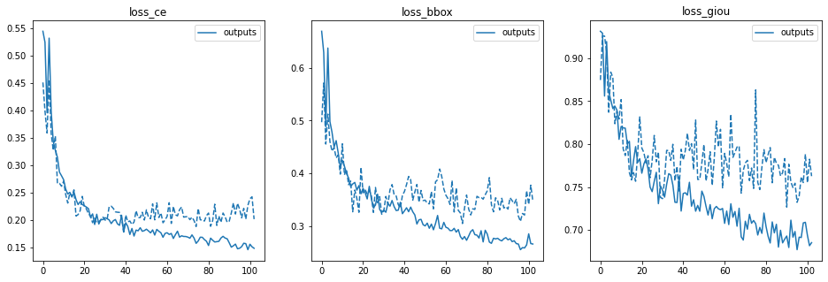

# Session 16.0 Capstone

PART I - QnA
-------------------------

- We take the encoded image (d x H/32 x W/32) and send it to Multi-Head Attention (FROM WHERE DO WE TAKE THIS ENCODED IMAGE?)

  The encoded image is the output of DETR’s encoder. 

  Image (ximg ∈ R3 x H x W) → 
  Resnet50 penultimate layer activation (f ∈ Rd' x H/32 x W/32 , d'=2048) →
  1x1 convolution (f ∈ Rd x H/32 x W/32, d=transformer inner dimension) + pos embeddings →
  Transformer encoder  (f ∈ Rd x H/32 x W/32, d=transformer inner dimension)

  The input to the ResNet50 is an image (ximg ∈ R3 x H x W) which generates a lower resolution activation map (f ∈ Rd' x H/32 x W/32) as the forward pass from the ResNet50 with fixed weights by discarding the last classification layer. This activation map along with sinusoidal positional encodings becomes the input to the DETR’s encoder. The output of the encoder is concatenated to form the image (eimg ∈ Rd x H/32 x W/32) which is sent to the Multi-Head Attention block.

- We also send dxN Box embeddings to the Multi-Head Attention. We do something here to generate NxMxH/32xW/32 maps. (WHAT DO WE DO HERE?)

  The output of the DETR’s decoder is bbox embeddings (d x N), where N = 100 is the fixed number of total instances of objects of all classes. For object detection where bbox predictions are required along with class labels, these embeddings go through FFN for final detection predictions. But for the case of panoptic segmentations, M multi-heads calculate attention scores for each N object embedding with the output of the encoder (eimg ∈ Rd x H/32 x W/32) described in the above answer.

- Then we concatenate these maps with Res5 Block (WHERE IS THIS COMING FROM?)

  Res5 block comes from the Resnet50 encoder’s Conv5 block which is 7x7x2048 i.e. input dimensions have been reduced by 32x. This matches the encoder output shape and concatenation can be performed.

- Then we perform the above steps (EXPLAIN THESE STEPS)

1. For segmentations that follow UNet kind of approach, the first part encodes and downsamples dimensions and increases channels (till the bottom of the ‘U’). The second part then does upsampling, and decreases channels.
2. The inputs to each upsampling step are the outputs of the previous step concatenated with the encoder output on the downsampling path. Adding the encoder outputs from downsampling path preserves finer level details to retain during upsampling. In this case the encoder is Resnet-50, and we concatenate Res5, Res4, and Res3 outputs as we move up on the other arm of ‘U’
3. Hence in the DETR modified for panoptic segmentation, as upsampling is performed, the corresponding activation from the downsampling path of the Resnet-50 encoder is concatenated 
4. Upsampling is followed by same padding convolution, normalization, ReLU
5. With 3 upsampling steps, the inputs which were at H/32,W/32 are resized to H/4,W/4 (i.e. 8x upsampling). At the same time the number of channels increases. A final extra convolution on the last step of the fpn-style cnn brings the number of channels to N. This is so that the output masks can be mutually exclusive in each of the N channels. Finally an argmax at every pixel across the stack of masks sets the pixel membership in the appropriate mask

  Plan for training:
  The training for this is split into two parts. 

1. In the first part, the DETR is trained to recognize the new type of objects and emit BB, like usual. Since the final ground truth is specified as segmentation masks, we will use cv2.getRectange(contour) API to convert that to bounding box ground truth
  - If the classid for stuff and concrete defect are overlapping with default COCO dataset, we will need to assign new ones. Then finetune the backbone as indicated [here](https://wandb.ai/veri/detr/reports/DETR-Panoptic-segmentation-on-Cityscapes-dataset--Vmlldzo2ODg3NjE) in Step 4.1
  - Once above model detects BB for concrete defects, we proceed to next training
2. The second part of the training, the DETR weights are frozen and we train the segmentation model for 25 epochs.
  - Queries corresponding to BB filtered with a high threshold (e.g. 0.85) from Step 1. are part of input to this Step 2.
  - The fpn-style cnn is trained to convert DETR object queries + Resnet-50 encodings to emit N channel output panoptic masks - one channel for each object query.
  - Essentially we are doing the second arm of the UNet with ground truth being N channel masks, and loss function to be focal or dice loss. We may use dice or focal (TBD), focal helps with focussing the loss on hard to classify pixels

PART II - BBOX Detection
-------------------------

### Data generation 

The  creates the required .json files for fine tuning detr as done in [Session 14 assignment](https://github.com/lavanyanemani96/TSAI-EVA-7.0/tree/master/14_DETR_End_to_end_Object_Detection_with_transformers) where we used [fine tune detr example colab file](https://colab.research.google.com/github/woctezuma/finetune-detr/blob/master/finetune_detr.ipynb) for bbox detection on our custom face-masks dataset. 

There are now four classes = ['N/A', 'rebar', 'crack', 'spall'] in our concrete defects dataset which is split in 60/20/20 ratio of train/val/test datasets. The notebook creates annotations consisting of ids, bbox, filenames for the train/val/test datasets.

### Fine tuning 

With the  and setting the first_class_index = 1, and the total number of classes = 4, we train our network for 100 epochs. The results are as follows: 

1. Metrics 

2. Prediction examples 

3. The training logs: 
Found in ./bbox_detection/bbox_results/Training_logs_Phase_2.txt

PART III - Panoptic Segmentation
-------------------------

### Data generation

We use this  for creating .json files and mask images for training.

We made these changes to enable panoptic: 
- Add background (stuff) class for bb detection
- Create mask png files for panoptic training using the panopticapi IDGenerator (which generates a unique id based on the category_id of the object and generates a corresponding RGB color such that objects of the same category have similar RGB colors for each instance) 

Adding stuff classes: 

- We added only 1 background class i.e. do not distinguish between wall, floor, scenery etc. 
- We discovered that it was necessary to retrain the bbox model with the bg class. Just adding stuff class for mask head training did not work. We trained it for 150 epochs. 

Creating png for panoptic training: 

Mostly this was straight forward. Found two intricacies here:
- Getting the stuff class contours was challenging especially in case of nested background (background is surrounded in between crack), or fragmented background (crack divides background into 3 regions). We used connected components API and skimage.measure.findcontour API instead of cv2 contouring APIs - this helped with most of the cases. Still there were some images where foreground extends to edge of image causing contouring to fail. Very small fraction of images here we ignored. (Proposed solution - pad mask image with black px border so that foreground does not touch the edge. Redo contouring and then adjust contour for added padding. Did not have time to implement this)
- Segmentation tag for coco json (not cocopanoptic) had to be filled in. The panoptic algo looks both at the coco path annotations and coco-panoptic path annotations. Here getting all foreground objects in a single segment did not work. We ended up creating one segment and hence one annotation per foreground object in the coco json.

Final outcome:

- We are able to get decent masks for foreground and background after panoptic training for 50 epochs. 
Limitations: If there are multiple objects in the foreground, the masks were not always great. Often one output plane contained multiple masks while others did not have any, or had partial output. It felt like more training time was needed for it to fully separate out different objects into different output planes.
- We didn't use Detectron for output, but processed the model outputs ourselves. 

### Training 
We use this  for training first the bbox detection for 150 epochs with the stuff class included. Followed by training for panoptic segmentation for 50 epochs. 

1. Metrics 
We use this  for viewing all the metrics as the training proceeds. 

For bbox detections (for both things and stuff class together): 

For segmentation (for both things and stuff class together) we show the PQ metrics: 

2. Prediction Examples 

We re-trained the bbox with the things and stuff classes together: 

Panoptic segmentation output: (Original, Ground Truth Mask, Predicted Mask) 

  

3. Training logs 
Found in ./panoptic_segmentation/panoptic_results/Training_logs_panoptic_Phase_3.txt

Contributors
-------------------------
Darshat Shah darshat@gmail.com

Lavanya Nemani lavanyanemani96@gmail.com
